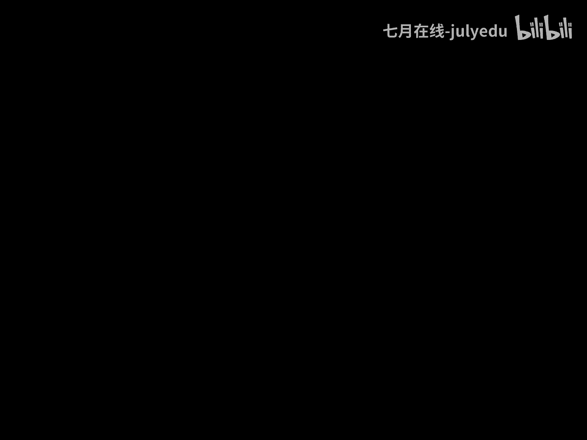

# 人工智能—机器学习中的数学（七月在线出品） - P12：微积分和梯度 - 七月在线-julyedu - BV1Vo4y1o7t1

，大家好，我是周博，很高兴跟大家共同探讨跟学习机器学习中的数学这样一个问题。我们这门课程呢要分大概十几个模块，跟大家共同来探讨跟分析在机器学习的角度，如何看待和应用数学的。

第一次我们跟大家探讨一下微积分梯度真间的不等式等方面的问题。而这样一个话题呢，其实是我们由于在做机器学习的过程之中，发现数学发挥着越来越重要的作用。比如说我们在做矩阵乘法。

我们一般是用A的DI行和B的DJ列，它的点乘作为C的DI行DJ列。那数学家为什么会如此定义取阵的乘法呢？他如果从积极学习的角度来看，和马尔科夫模型有什么样的相关性呢？

它跟全概率公式跟概率论又有什么样的关系呢？这就是我们今我们这门课程跟大家来探讨跟学习的问题。第一次的内容呢，我们大概分这样几个内容跟大家依次来讨论。相关的那相关呃。第一次呢我们大体上分这样几个内容。

跟大家共同探讨一下相关的话题。首先我们给一个简单的一个。简单的一个公式，零的阶乘分之一加上一的阶成分之1，加上二的阶成分之1，加到N的阶成分之1，N取无穷大的时候，S是一个收敛的。

那么说S的值应该等于几呢？我们带着这样一个问题来看一下，在微积分是如何来解决它的。首先我们附加证明的给出一个非常直观的一个定理，两边加定理。如果说在X0的某一个领域上，X是有定义的，并且FX是比GX大。

而比HX是小的。并且我们已知GX在X趋近零的时候，它的极限是AHX它在X0趋近零的时候，趋近X0的时候，极限也是A。那这样的话，FX的极限就是A。我们直接应用这样一个两边加定理来去解决一个问题。

举一个例子。比如说我们给定一个单位圆O以OA原点，以OA长度为一作一个单位圆。如此一来，我们给定任意一个角度。那么说从C到B这个有向线段就是sine XAB的弧就是X。

而有效线段AB就代表了tangent X。而显然，CB是小于AB的，而AB作为两点之间的直线是小于两点之间的线段是小于AB这个弧的，因此BCB小于ABAB小于弧AB因此有sX是小于X的。同样的三角形。

OA呃三角形OAD这个面积是大于OAB这个弧这么一个扇形面积的，我们就可以推导出来X是小于tine X的。这在X的领域是正确的那我们两边同时除以sine X就得到这样一个式子，稍做整理得到这样一个结论。

我们会发现，当X趋近零的时候，cosine X的极限是一，而右边的极限本身是一个定值一，所以sine X除以X在X趋近零的时候，极限就是一，这是一个非常简单的利用两边加定理的一个结论。

而这样一个公式其实是告诉我们了，三角函数和多项式之间的极限关系，我们就可以利用这样一个极限去做很多很多题目到底应该等于几呢？我们还可以再来探讨另外一个话题。比如我们可以给定Y等于log。

以A为底X的对数。当A取2A取3或者A取1。5的时候，总可以画出这个对数曲线，它的函数图像来。这样这个绿色的这条线就是一。5的底数，这个紫色的就是二的，同样这个橙色的是以三为底X的对数。

我们会发现这样一个函数曲线，当X等于一的时候，显然Y是横等于零的，它是过这样一个X等于一Y等于零这个点的。在这一点处，不同的函数就有不同的斜率。那么说我们能不能找到某一个A，使得某一在这样一个A的时候。

在这里的斜率恰好为一呢？好，我们来看一下这个话题应该如何去做哦，这个代码是我。用python做的这个函数图像的所有代码，大家可以试一下。我们假定我们要取的那个比是A记作FX。

那么说我们任取一个德尔塔X比较接近于零的时候，那这样FX加德尔塔 X减去FX除以德塔 X，就是在X处的它的割线。当X趋近于零的时候，这就是斜率了。我们代入log log以A为底X对数得到这个式子。

根据对数的法简单的法则，两个对数的差等于它们的除法，然后再取对数。而这个东西这是德尔塔 X。分之一把这个可以放在指数上去得到这样一个结论。既然我们想去考察它等于一这样一个值，它如果等于一的时候。

显然这样一个值就应该等于A。因此我们想做的是当代尔塔X趋近于零的时候，这样一个东西趋近于A。好，我们让N分之1让N无穷大的时候，N分之1就能趋近于0。因此我们要探讨的是，当N趋近于无穷大的时候。

这样一个值极限应该等于什么呢？事实上这个极限大家已经很应该是很清楚的。在本科的高等数学中已经是学过它等于E的。那么说我们简单的看一下它是如何做推理的。好了，我们现在呢就构造一个数组，记作。呃。

记作一加N分之1的N次幂。然后呢，我们不加证明呢，先给出一个。呃，一个极限存在的定理就是如果一个数列是单调有界的，那么说它一定是有极限的。把它做一个简单的推论，就是如果一个数列是有上界的。有上界。

但是呢它还是单调递增的。那么说这样一个数列就是有极限的，我们不加证明的来使用这个极限的存在定律。我们利用刚才构造好的这个数列XN等一加N分之1的N次幂，利用牛顿二项展开得到这样一个式子。这是直接展开的。

事实上这展开了N加一项，从零次一次到N次幂。然后呢，CN一可以写，这就是NCN2是二的阶成分之N乘N减1CN3是三的阶成分之，N乘N减1乘以N减2如此等等都去展开。然后我们来依次化简这个N和N消掉了。

就是一这个N的平方消掉一个和这个N，因此剩下的N减1N减一除以N就是一减去N分之1，这个N和这个消掉一个成平方，这就是这个N减一除以N是一减N分之1，这个N减2除以N是一减N分之2，如此等等正常去计算。

我们会发现这样一个值是小于一的，把它放成一。这个值是小于一的，把它放成一，这个值是小于一的，把它放成一。所以说我们就把这个值放大了，这是一个小于符号。而这个东西我们当N足够大的时候。

N的阶成是大于二的N减一次幂的。因此我们就可以把它换成这样一个式子。而换上它之后，我们会发现它其实。它的从第二项开始到后面所有的项是一个首项是一，公比是2分之1的一个等比数列。我们可以求它的前N项和。

我们就能整理得到这样一个式子，加上这个一得到它这个值显然是小于三的。所以我们会发现任意的取N这样一个数列，XN都是小于三的。因此这个数列是有上界的。第二步，我们再来看一下XN可以写作这样一个式子。

这是相等的。那么说当N换成N加一的时候，是这个值，它把这个波浪线里这个大的式子所有的N都换作N加一得到这样一个值。我们会发现，除了前两项这个定值以外，第三项的这个值。和这个值相比，N加一是比N要大的。

所以第三项的这个N加一这个项是比N的这个项要大的。每一项都比他的各自的项要大。这个是小的，每一项都是要变大的。而我们会发现最后还多出一项来。这一项第这是第N项，这个是第N项，这是第零项了。

然后这一项还是多的，因此XN加一一定是单增的。这是一个又单增又有上界的一个数列。因此，根据极限的存在定理，这个数列一定是有极限的。并且我们知道XN其实这已经有一个2了。XN是一定大于呃。

X在这是等于二的，所以XN是严格大于二的，而XN是严格小于三的。所以说这样一个数列的极限，虽然我们不知道它的值具体是几，但是一定是从二到三的某一个数。好，既然如此，我们不妨把这样一个数记作字母一。

因此我们就发现，根据刚才我们给定的这样一个展开，这个数组它是单调递增，有上界。因此我们记做字母一。这是我们证明了当N是整数的，是自然数的时候，它是一定是成立的。如果这个N换成XX属于实数呢。

那么说对于任意一个实数X，我总是可以找到一个整数N使的X大于等于N小于等于N加1，这很自然是可以得到的。比如3。2，可以找到它是大于等于3，小于等于4的，5。0是大于等于5小于等于6的，总是可以办到的。

因此我们可以得到这个式子。因为这个X是比N要大的，比N加一是小的。而左边这个式子经过一个简单的。数学代换能够发现它的极限就是一右边这个式子经过简单的变化，发现极限也是E。我们根据两边加定理。

中间这个式子的极限一定就是一。所以说这个X当它是自然正呃实数的时候也是成立的。这就是我们在微积分当中。常见的自然底数意是如何？把它给构造出来的。他可以看作是一加上。一的节省分之1加上二的节省分之1。

加上三的节省分之1，一直加到N的节省分之1。当让N趋近无穷大这样一个无穷的。数列它的和就是一。好了，我们现在呢简单来跟大家看一看导数的概念。最简单的来考虑导数可以看作是曲线的一个斜率。

它可以表征的是曲线变化快慢的一个度量。另外呢导数是可以继续求导数的，就是二阶导数。二阶导数它表示是斜率变化快慢的反应。还记得我们在高中的时候，老师经常说过的吗？如果这是一个实际的一个运动轨迹。

那么说加速度的方向总是指向这个轨迹凹的一侧，我们无法断定这个加速度是朝横着朝朝左还是竖着朝下还是斜着朝向西南方向的，但是我们大体能判断一定是朝着凹的一侧的，但是。他一定不会朝向东北方向。

这是加速度它的特点。因此，这个二阶导数它其实是曲线凸凹性的一种反应。另外呢，我们往往把二阶导连续的这种曲线叫做光顺的。这是关于二阶导的概念，它事实上是我们在做凸函数凸优化的一个非常重要的概念。

我们后面会提到的。另外呢，我们根据刚才给计算出来的X奇无纳的时候，这个极限等于E可以得出FX等于login X的时候哦，login指的是log以E为底X的对数，我们就简记作login X。这个东西在X。

等于一的时候，其实它的。导数正好为一，所以FX的导数是X分之1的。我们根据这样一个结论，以及换体公式反函数求导各种各样的工具，就能够得到其他的初等函数导数，能够得到这样一些内容。

另外呢导数如果是两个函数的加和的导数等于各自的导数，各自的导数的加和。如果是乘积的导数等于这样一个东西。好了，我们现在呢重点关注一下乘积这么一个东西，到底有什么有趣的事情。

我们根据这个事情把它其实这个事情是关于X求导了，所以我们把它写开写成U乘V对X求导数。其实根据这个式子是得到这个内容的那既然如此，我们对这个式子两边都积分。是成立的，左边这个式子积分就是U和V。

这个积分就是它这个积分是它。那么这样的话，我们把这个U对DV这个积分就是U乘以V减去这个东西。因此，这就是分布积分的方法的基本的做法。比如说如果让大家求一下login X的积分的话。

我们就可以利用分布积分法。login X和这个X把它拿出来，把login X放后面去，X放前面来得到这个式子。而Lin X微分是X分之1乘DX，而X和X分之1乘积是一，这就是对一求积分。

就是X本身这个分布积分就完成了这样一个积分的一个内容，是一个非常重要的一个手段了。另外呢就是微分是有很多很多应用的。比如我们举一个简单例子，如果说给定FX等于X的X次幂。

我们要求X是大于零的这样一个函数。那么说FX它的最小值是什么呢？事实上我们会简单的发现，当X足够大的时候，比如说X等于234，比如不更大的时候，二的2次幂三的3次幂4的4次幂。

这是一个增长速度非常快的一个函数。事实上，当X比较小的时候，比如X等于0。01的时候，0。01的0。01次幂，是比0。1的0。1次幂还要大一点的。事实上，它其实是一个先减后增的一个函数。

这个题目是让我们求一下X等于几的时候，能够取得它的最小值呢？我们会发现这样一个函数，其实是底数和指数都是有关于X的情况的。X的值的，因此它是一个幂指函数。

刚才我们给定的常见函数的导数没有有幂函数有指数函数，但是幂指函数应该如何求呢？实实上它的内容可以直接使用取对数的方案把它解决。另外呢就是我们多说一句。大家能算一下N的log以E为底。

N的对数分之1等于几吗？它的解决思路跟这个是一样的，大家可以自己思考一下，它是。在算法领域做跳表的一个理论分析的时候，出现了一个值，很有趣的一个值。事实上，假定等于T两边取对数就能解决出来了。好了。

我们把目光回到FX等于XX逆如何求最小值的问题？假定XX幂它记作T这个T是关于X的一个函数。好，我们两边取对数，因此左边就是login t，右边这个login，我把这个X拿下来，就是Xlogin X。

我们两边同时对X求导数。login X对T求导，我们就先对它求导，就是分T分之1，然后T本身是X的函数又加了一个T的导数。这个东西对X求导数，我们先把这个X求导数剩下的login X。

我们再对呃login X本log X求导是login是X分之1和X消掉，就是一，这是得到这个我们现在呢先让它求注点。然后观察驻点的值。注点就是导数等于零的那个那个点，导数等于0。

而这个T是等于X的X次幂。X在大于零的时候，这个值一定不能等于0，所以只能是要想使的T的导数等于0，这个右侧这个值必须等于0。这个值等于零就意味着logX加一等于0，能够解出X等于一分之E的负1次方。

事实上我们根据刚才的分析，这个函数在X大于零的时候，这XX幂，它是先减后增的一个函数大体的这个函数图像了。那这样的话，其实当X等于E的负1次方的时候，真的就是取一个全局的最小值，我们把它回代回去。

就能求出来最小值是E的负E分之1次方。他的解决思路其实就是直接取对数就能够后面就简单多了。好了，我们现在呢看一下这个微分可以如何应用呢？比如说举一个例子，事实上N的阶乘。当N趋近无穷大的时候。

这是一个增长速度非常快的一个函数。如果说对于这样一个N的阶乘取一个对数呢，这样一个东西，当N趋近回大的时候，它又是一个什么样的增长规律呢？事实上它大体相当于这样一个值N乘logN的规模。

为什么是这样子呢？我们来。不严格的来去简单的看一下他的一个。思考的方方法。N的阶乘取对数，N的阶乘可以写成。12一直到N，我们既然取对数，就可以写成log所有值，然后对它取加和，因此得到这个式子。

这是对数的基本的性质。既然是loginI一到N所有值的加和，我们来把这个对数画一下。大体是这样一个函数图像，一的时候是它二的时候大体是这个值，三的时候是这个值，四的时候是这个值。

我们要求的其实是login1login2login3login4这些值的相加等于几？那么说比如login2的值相加，其实就是这个矩形的面积。login3就是这个矩形的面积，这个矩形所有矩形的面积的和。

这就是我们本身要求的这个值。而这样一个矩矩这矩形的一个和，可以大体近似上看成是从一到无穷大的时候，这个函数图像的下方区域的面积用这样一个积分来代替刚才这个加和。这个是有个约等于的。

所以我们说这是一个不严格的一个简单的一个。呃，一个推测。而刚才我们其实已经求完了log XDX它是如何做积分的分布积分法，还记得吗？事实上把它和它提出来，把log X放回去，把X拿出来。

就是这样一个东西。它就是X分之1，然后这个东西从一到N取N的时候是N乘logN取一的时候，这是log一是0就不要了。因此它就是N乘logN。而这个式子它其实就是X嘛，所以它就是这是N减一，这是个负号。

所以是负的N加一，当N趋近无下的时候，事实上一就可以省略掉了。因此是这个值，也就是刚才我们给到这样一个结论。这就是我们利用了积分的一个性质来大体的推断一下N趋年物价的时候，它大体的增长的方向和规模。

另外呢，如果说一个函数FX等于Z的时候，这是一个一元的。事实上我们也可以做多元的。比如如果Z是关于X和Y2元的一个函数，并且如果在某一个点PXY处，它是可以微分的。那么说我们就可以计算它的导数。

这个导数是需要沿着某一个方向来去做。导数的，因此它是一个方向导数。假定说这个方向，它是从X轴开始转到这个方向L的那个旋转角是X，这个是YZ是垂直纸面向Y的一个方向。那么说X假定L是这个方向。

这个就是那个斐角，如果给定这个斐角之后，那么说它的方向导数其实是这样一个值的，这是方向导数本身它的。结论。

这个东西我们其实可以写成偏F偏X偏F偏Y这样一个航向量与cosine斐sine斐这样一个列向量的点乘。是一个意思，我们会发现这样左边这个值其实是没有是只和F函数值和XY这个自变量有关的。

右边这个只和这个。方向L有关的。当cosine犯。正好等于偏F偏X，而sine斐正好等于偏F偏Y的时候，这样一个点乘值是最大的。而这样一个最大的值，就意味着它的方向导数值最大。

因此也就是它的数值变化最快的方向。因此，这样一个值就是我们把它叫做梯度。也就是刚才我们说的函数在这一点，它的变化是最快的。当然我们可以做一个形式化的理解。

假定说我们把Z等于HXY看作是一个在X轴跟Y轴所决定平面上的一个山的话，Z是它的呃山峰的那个空间点的值。那么说在X型Y0这一点的梯度，其实就是沿着这一点，它的坡度变化最快的方向，也就是那个梯度方向。

我们有时候记做这样一个记号，这是关于或者是这样一个记号，这是关于梯度的这么一个内容。事实上，这往往我们沿着七度做下降，去求解西塔的局部最优值的时候，利用的就是这样一个原理。当然，如果我们不是沿着。

真正的七度方向去做下降。如果沿着跟七度成一个某一个角度呢，下降速度又如何呢？大家可以简单思考一下，事实上结论我们已经说过了，就是前边这个值。好了，这是多元的情况。另外呢我们看一下啊凸函数的概念。

现在假定某一个函数F，它的定义域本身是一个凸的，然后呢给定定义域中的任何一个值X跟Y。给定某一个C塔是从0到1的。那这样西塔贝的X和一减西塔贝的Y，其实是相对于这是横轴，这个是X点，这个是Y点。

这个西塔X加一减西塔Y其实是对X和Y做了一个线性的加权，然后这样一个函数值，这样一个定义域的值取函数值，可能是在这儿的。然后这个是FX，这个是FY对这样一个值做一个线性的加权。然后应该是在这儿的。

因此我们发现这个值如果永远比我的函数值是要大的。这样一这个定义就表示了这个函数F是一个凸函数。而这样一个东西，其实在几何上的意思指的就是函数的割线永远位于函数的函数图像的上方，这是凸函数的定义。

当然多说一句，在机器学习的领域里边，这个概念是没有歧义的。在。高等数学上，有些人把这样一个函数，比如Y等于X平方。事实上，在记忆学习中把这样一个图像叫做凸函数，这是凸的Y等于负的X平方。

这样一个图像是凹的。这个在记忆学习中是没有歧义的。但是在。这样一个定义，其实跟我们的理解直观不是非常的接近。这个东西在进行中叫做叫做out这样一个图像叫做to的。这是我们多强调一句吧。好了。

我们现在呢其实如果把刚才那个割线让Y去。这样一个函数图像，把这个Y去接近于X就会变到这样一个事情。因此我们又得到这样一个简单的结论。如果F是一个一阶可微的。

并且F这个东西它如果是凸函数和它这样一个式子是完全等价的。也就是在某一点处，我们做它的割呃做它的切线，这个切线永远位于函数图像的下方。这就是一阶可危。它的意思。比如刚才Y等X平方，我任取某一个点。

那么这一点做函数的切线，这个切线一定是位于函数图像的下方的。因此，我们可以把这样一个内容看作是一阶的一个台了展示，其实就是这样函数的一个全局的下估计，它是一个下估计。并且在所有的函数域上都是成立的。

所以叫全局下估计。另外呢，我们如果有一个函数，它的一它的展示总是一全局下估计。那么说这样一个函数事实上一定是凸函数。这么一个内容呢，其实我们可以更多的放在。凸优化的领域去理解，或许更加的认识清楚一些。

我们会后面会谈到支撑超平面。谈到更多的关于函数的上镜图等等的关系，我们再去进一步讨论这样一个内容。另外呢，如果一个函数是一个二阶可谓的，那么这个函数F是一个凸函数。

当且仅当它的二阶导大于零或者二阶导的矩阵，黑色矩阵是正定。当然如果是大于等于0，半正定就是。呃，刚才那个函数是可以取等号的，如此而已。呃，这个记号其实指定的是这样一个值，它是一个。

半正定的它就类似于大于等于在一阶上就是大于等于了。比如说Y等于X平方这么一个函数，它的二阶导其实正好比方说它的一阶导是2X，所以二阶导是2，这个二呢是严格大于零的。所以原始的函数Y等于X平方。

就是一个凸函数，就是这么一个直接的一个证明方式。如果F是二阶可为的，这是一个重要条件，二阶导大于0，所以二阶导表征的是函数的凸凹性。事实上有很多很多的函数都是。wo函数。比如说。Y等于二的X次幂。

这样一个函数图像其实是这样子的，这是二的X幂的图像，它其实是一个凸函数，大家可以把它的二阶导求一下，就能发现大于零就能得到这个结论了。事实上不只是二，我们取一个E都是可以的，取任何一个。

指一个一个值都是可以的。另外呢，幂函数里边并不是所有的幂函数都是凸函数，这里边只有当A大于等于一，或者A小于等于0才是。比如Y等于X的0。5次幂就不是了。因为它的函数图像是这样子的。

这个函数就不是凸函数了。另外有各种各样的凸函数，大家可以看一下这个罗列的内容。我们利用刚才的凸函数，其实能够直接给出jason不等式这样一个内容。而这个东西它是这么来表达的。

相当于把凸函数的概念反过来说，就是如果F是一个凸函数的话，对于任意的给定一个X跟Y，它都是在F定义域上的。都是在X的定义域上的。那么说某一个西塔，它是从0到1的时候，那么说这样一个。

值是小于等于这个值的这其实就是F是凸函数的定义本身了。这个是C塔呃给定一个值，然后有X有Y2元的情况。如果把它做一个简单的一个推广。我们取K个X1X2到XK，而这里边西塔一和西塔AK的加数要等于1。

另外呢要求它们大于0了，因为它是从0到1的嘛。这样子其实是相当于做X1到XKK个值的一个线性加权，仍然是小于等于函数值的线性加权的。好，我们可以把它做一个这样的理解。

西塔一到西塔K既然都是大于零小大于等于零，小于等于一的一些数。我们就可以把这样的西塔看作是某一个概率分布，这个概率分布，它呃西塔一西塔2到西塔K，它都是某一个值，这是呃这是西塔，这个是概率。

那么说这其实这样一个值C塔1到C塔K的这个取值。取某一个从零到一的值，其实对应的就是一个K点分布。当然这个概念是我从两点分布做的一个概念上的一个推广了。事实上这样一个K点分布。

如果K是把它变成连续状态呢，那样这样的话，西塔就变成一个连续的一个概率密度了。因此，我们得到这样一个结论。如果某1个PX它是在定义域上是大于零的，大于等于零的，并且PX满足满足。概率密度的基本性质。

它的在定义域上的积分是等于一的。将刚才这个离散的情况就能够写成这种连续情况。左边这个。就是这个事情本身，而右边这个就是对每一个值做它的加权，每一个值做它的这个PSX的加权。

对所有值积分仍然不等号方向是不变的。我们对这两种情况做进一步的分析。X1到XK相当于我是做的西塔IXI的加和，这其实是对XI在西塔K给定的这样一个概率分布上的X的一个期望，这个也是一样的。

这个东西对它求。函数值，这个是对FXI对于西塔I指定的值求期望，因此是FX对它求期望。这样一个值是小于等于这个值的。因此这样一个值一个。公式就能够写成这样子的结论。这个意指的是求期望。

而连续情况其实分析情况是一样的，仍然可以得到这个结论。这个就是在用真的不等式和概率论做一个结合，得到了一个非常重要的式子。只要F是一个凸函数，一定有这样一个式子发生。好了，那这样一个式子有什么样的用呢？

事实上，世界上几乎所有的不等式都可以看作是给定某一个合适的凸函数，利用jason不等式推导出来的。比如常见的给定A和B都是大于零的时候，A和B的算术平均值是大于等于它的几何平均值的。

我们其实就可以看作是取Y等于负的log以E为DX对数，做这个函数是一个凸函数，把西塔等于0。5代入到刚才的基本的这种不等式，就能够推导出这样一个结论来。是可以这样做的。

我们再利用这个式子还能够做一个更有趣的一个结论。比如说P和Q都是两个。概率分布。那么说这两个概率分布能不能求它的距离呢？我们一般用KL散度这么一个概念，或者叫相对熵。它的定义是这样给出的P和Q求它的。

呃，distance求它的这个相对商。那么说我们是给定这样一个结论，给定这样一个定义。这个定义其实我们可以看作是对这样一个函数，我们把它记作刚才那个FX对这样一个函数求关于P这么一个分布的一个数学期望。

因此可以记作exspecction，记作一个期望。关于PX求期望。对这个东西对这个FX求期望这么一个记号。好了，我们现在想大家证明这么一种定义方式，一定是大于等于零的。一定是这样子的。为什么呢？

我们可以这么来看。根据刚才这个定义，我们可以把这个这是P，这是P，所以把这个P反过来，这多了一个括号。而我们再来看这样一个式子。这样一个值对它求期望。所以这个东西是关于它的，是对函数值求期望。

我们如果把这个log拿出去的话，这个是它的定义定义那个自变量的值。我们说对自变量的值求期望再求函数是要变小的。因为这里边负的logX是个凸的嘛，因此把这个PX拿到里边去的话。是对应左边这个值。

这个对应的右边这个值，因此上面这个值是要大，底下这个是小的，这是一个大于等于的符号。而这个值其实P和P消掉了，就是Q。对所有的X求积分的话，这个值是一，这个是一的话，这个值是零嘛。

因此这个值是大于等于零的，就推导出来了。当然，如果大家觉得这样推导有一点点的思维上的麻烦的话，大家可以直接给出logt函数曲线。然后看一下原来割线一定位于函数下方也是能够推导出来的。好了。

这就是关于ja份不等式凸函式的一个简单应用了。另外呢就是我们现在做一个简单的总结。首先我们会发现以应用为目的去做的高等数学其实并不是难。我们几乎所有的问题都可以通过我们熟悉的结论非常细致的推导出来。

另外呢我多说一句，就是如果以机器学习的角度来去看待数学的话，像刚才我们严格给出了它的定义，它的极限等于E。这个推导本身倒是没有很重大的意义了，只是掌握这种思思维方式，能够帮助我们锻炼思维就好了。另外。

关于图优化的更多的内容呢，我们会单独有一次课来详细的探讨。今天算是开个头。好了，我们今天的大体就把内容跟大家聊完了。如果有更多问题呢，欢迎大家在主来EDU我们的社区上呃发帖子。

我们共同来探讨更多的有趣的话题。

