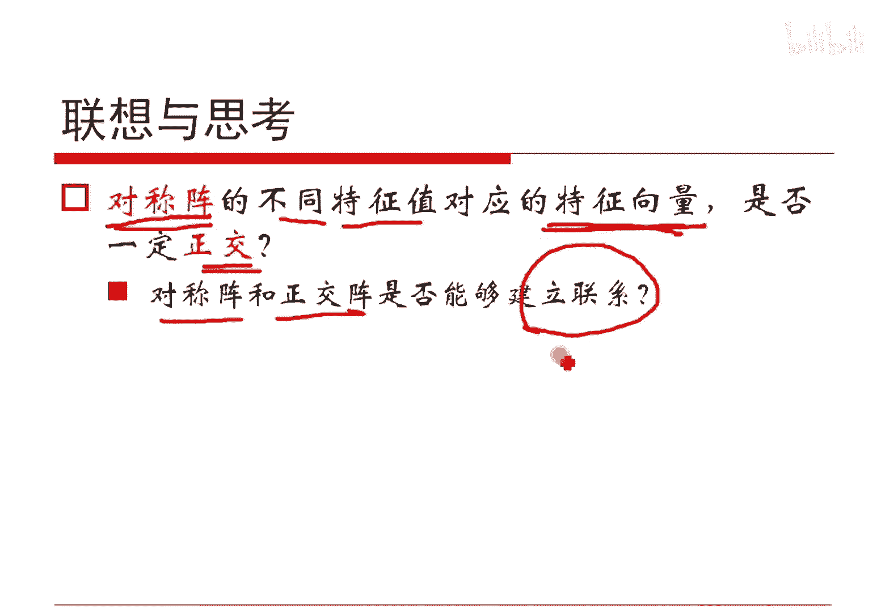

# 人工智能—机器学习中的数学（七月在线出品） - P13：协方差 - 七月在线-julyedu - BV1Vo4y1o7t1

啊，我们如果是做两个随机变量，一个是X减N减X期望，一个Y减Y的期望，它们的乘积再求期望就叫做X跟Y的斜纺差。它们是在一起的对吧？呃，另外呢显然根据定义哈，它是对称的，然后也有各子各的式子发生，对吧？

😊，这个咱就不说了，重点看一下最后这个式子。2个XY他们的斜方差，其实根据这个定义，马上能得到等于他们的乘积，减去他们各自的期望的。呃，他们成绩的期望减去他们期望的各期望的成绩，对吧？

大家还记得刚才我们说的吗？X跟Y如果它们是独立的时候，EXY是等于EX乘EY的。对吧这是刚才我们给定的对吧？那那就意味着如果XY他们之间是独立的，它们的斜方差是等于零的。对吧那么说斜方差等于0。

我们并不能推出他们之间是独立的。因此我们就能说什么是斜方差了，对吧？我们现在来说哈，首先他们独立是有这个事的。刚才解释过了，这是我们在期望时候说的。而根据这样一个事的发生哈。X跟Y独立的时候。

他们的方差是等斜方差是等于0。但是。反之是不不对的，就是X跟Y他们独立这个潜力是太强的。我们做一个新的定义，就是如果说XY他们的斜方差为0，我们称XY不相关。这是给出两个概念哈，一个是独立。

我们是从概率两合概率边缘概率做出来的。不相关。我们是根据它的斜方差是否为零算出来的对吧？从这儿呢大家可能还是对斜方差模模糊糊的对吧？我们再进行对斜方差进行分析哈。斜方差既然叫这么个名字。

大家感觉到啊它其实是两个随机变量，具有相同方向变化趋势的一种度量。就是你比方说假定说X是是我们如果简单画到轴上的话啊，Y把它画到轴上的话，如果我们能够把XY共同采上得到值的话，如果说X变大，Y也变大。

或者X变大，Y减小，它们的趋势如果是相同的，那么说它们的斜方差就是大于零的。如果它们趋势相反的，它们的斜方差就是小于零的。如果说一个X变大，呃，是沿着这个方向去变大Y呢沿着它的垂直方向进行变化。

它们之间是完全在各自的维度上进行呃变化进行随机的选择。那这样的话，这个时候X跟Y它们就是不相关的。这是他的。我们可以这么来去看他的这个意义哈。我们进一步来看这看这个事情哈。

就是两个随机变量的斜方差是否有上界呢？对吧两个式因为斜方差是不是有上界呢？其实是有一个定理保证的。如果X它的方差是西igma一的平方，Y的方差是西igma2的平方。那么说X跟Y的斜方差它的绝对值哈。

因为我们刚才说过了，它与可能取正可能取负，表征的是它们的变化趋势相同和相反，对吧？那么说它的这个绝对值是一定小于西igma一乘西igma2的，大家用那个二次方程其实能够证明这个事情。然后呢。

另外更能够证明一个重要结论，就是X跟Y如果是线性关系的时候，比如说X如果等于A倍的Y加上一个B的形式，这不线性关系嘛，那这样的话，它就能够取得等号。不管是这样上还是这样下都是可以的哈。

这个证明大家翻开任何一本概率证书都能够找到它的解释哈，咱就不再统一做这个事情了哈，来照结论自己去做这个证明就好了哈。任何一本概率论证书不出意外都会给的哈。那我们现在就想了，他我们给出这个上界。

我们可不可以做一点点文章呢？既然这么一个值一定是小于等于他们的乘积的。ok我们利用这个结论，我们去呃这里我加了一页哈，我加了一页这个片子，我们先说这个事情哈，就是说呃刚才我们那个这个定理哈。

其实做了什么保证呢？因为他们XY是线性关系的时候，他们之间是等号成立的对吧？那其实就意味着刚才我们一直所说的那个不相关。其实是一种线性上的独立。因为如果是可以写成线性关系，他们之间是相等。

他们之间的协换差能达到最大，对吧？他们之间是最最。最这个相关的，我们如果用一个自然元表述哈，如果它等于零是最不相关的，所以它本身就是一个呃线性的独立。对吧所以说呃所以说不相关仅仅是在线性层面上是独立的。

如此而已哈，比如说X跟Y他们如果是不相关，说明的是线性独立，但是他们可能有其他的函数关系。二次方。对吧比如sineX等于Y等等等各种奇怪的关系哈，对吧？呃，所以我们不能说它不相关就一定独立。

但是独立真的一定不相关，对吧？呃呃，独立不相关怎么证明啊？很正常嘛？因为独立的话，那么EXY是等于EX乘以Y的嘛，我可一减就等于0嘛，对吧？所以是不相关的，这是可以证明的，反之是不能证明的。

反之我们只能说不相关，它是在线性层面上是有是没有关系的对吧？呃，但是虽然对于一般结论是这样子的，但是对于特殊情况，比如说二维的这种，如果X和Y它们都是正态分布的那么说X跟Y它们不相关。

就等价于它们之间是独立的。大家想想2元的高高斯分布，它们的那个函数，它的那个呃概率密度函数哈，那个柔等于0，那个柔其实就是它们的这个哎一个概念哈，我们等会儿马上说哈。刚才我们其实给定的是什么呢？

就是斜方差，它的这个值的绝对值一定是小于等于它们的方差的。呃，乘积，然后东西对吧？那么说我们就用这么个东西去除以他们各自的标准差来乘积，对吧？这是标准差乘积嘛。那这个值按照我们刚才那个上界的那个定理。

其实一定是绝对值小于等于一的。我们把这样一个柔，把它叫做相关系数。有人也把它叫做皮亚逊相关系数，一个东西哈，就是相关系数，并且根据我们上界定理的保证X跟Y，它们是线性关系的时候，这个等号是成立的。

对吧这是他们之间的关系哈。所以说这个斜方差和相关系数，它们之间就差了一个底下的一个类似于硅一化因子的东西。对吧他们的正负号也是同向的，他们只是除了一个数而已。

所以相关系数可以认为是在标准尺度下除以标准差了嘛，是在标准尺度下的一个斜方差。对吧所以上面我们会谈到说呃，如果他们的这个斜方差是等于零的，那么他们就表示是呃不相关的。

我们也可以说他们的相关系数是等于零的，那么它们的解是不相关的。所以说上面关于斜方差定义哈，都可以把它迁移到相关系数上来。这个意思哈，所以他们相除，他那商业定理是搞这个事情的哈。好了。

这个呢就是关于跟大家有呃，我们跟大家分享了一下关于这块我。假定大家。嗯，了解倒是但是不太清楚的地方哈，所以我假定就是说的详细了一点，大家看看这一块有什么问题吗？我们来共同探讨一下哈大家的问题哈。😊，呃。

哎，小明哥说的是斜方差表示XY的相关性。没错，没问题哈。因为我们这解释了，对吧？斜方差一定意义下可以代表它们的相关性，对吧？除以他们标准差就是它的相关系数了，对吧？😊，嗯。和前面那个包含的信息量有关吗？

有关系的，就是咱今天讲的这些东西哈，跟后面咱的资疗商里面讲那个商的时候有点关系的。斜方差和相关系数是一回事吗？显然不是一回事，他们之间有一个呃有一个系数，对吧？有一个规划因子，就是他们可以看的很像。

对吧？很像。呃，有上介啊，这个解释过了OK哈，这样子咱就是这个事情哈，我们简单的做一点点的扩展。刚才我们讲的是两个随机变量。如果是有N个呢。对吧那这样的话，假定说有X1X2的XN。

这里一共有N个随机变量，那就形成一个随机的向量，N个对吧？根据刚才我们结论，任何两个元素，XI跟XJ它们都是可以算斜方差的是吧？那这样子我们就可以形成一个N乘N的一个矩阵。

这个矩阵的第I行第J列就是XI和XJ它们的斜方差形成这么一个斜方差矩阵大C对吧？就这么计算出来的哈，因为我们知道斜方差嗯，I和J和J和I它们是相等的，所以斜方差矩阵一定是一个对称阵。

对吧大家记住这个结论啊，斜防栓取阵是一个对称着。另外我多说一小句哈，就是把这个随机我们不是X1X2的XN吗？我们把这个随机向量XI哈，因为XI本身哈呃拿出来把它写成一个列向量，对吧？就是X一是一列。

X2是一列。X3是一列，到XN是一列，因此其实我们会形成这么一个矩阵，大X。对吧这个大X其实是一共有N列的多少行，咱不管，假定说采样了M个哈，我们不管它，反正总之是有若干个列数，一定是N个。然后呢。

我们让这么一个东西哈，对各自的这个列都去均值了。因为因因为均值如果不为0，我们就把它呃都减去各自的均值，对吧？那这样的话。把这个东西做一个去均值之后哈，把这个大X记做XEY这么东西。

那这样的话把它做一个转质。你会想想哈，把它做转质，我们写到这儿哈，然后这是第其实这样写，是一个第一个这样子是第二个随机项随机变量，第三个随机变量到第N个随机变量。

那么说这里边的这个第一行和第一列它相乘不就是这个东西嘛，对吧？所以其实这个就是第一行第一列那个值，第一行乘第二列不就是C一2嘛，对吧？第一行第三列也一样的。所以说这么写完。

然后除以前面这个N根据我们的定义，其实它就是斜方差矩阵。对吧大家先有一个简单的一个想法哈，所以我们写出这个它的举阵形式来以后哈，或许对我们做推导是有用的。对吧这个这个随机向量就把它写成一个矩阵的形式。

矩阵就可以做这样的运算，然后得到的本质就是先方法矩阵。另外呢我们有时候把不除N的这个东西叫做呃比方说把它叫做这个scatter那个字我们嗯不太好说，叫什么哈，就scatter那个字哈。

就是可以把它叫做这个。呃，离散度或者叫这个呃类似的一个名字哈，就是比方说叫。叫叫散度矩阵或者叫什么东西啊，咱那个后面再去给他一个一个名字就好了哈。也是有一个定义的哈。

我们后面这一部分呢大概是在PCALDA那一部分会再次看到哈。呃，现在呢我们跟大家说一说一个思考题。刚才我们其实给定了斜方差矩阵是个对称阵。请问。这个对称阵我们能够求它的特征值，对吧？

那不同的特征值就有不同的特征向量。那么说这个特征向量会不会真的就正交了？如果有这个结论的话，我们就把这个对称阵跟这个正交镇不就建立联系了吗？不就能够做很多很多有趣的事情了吗？

对吧所以说它里面会有一些事项，大家可以思考一下这个问题哈。😊，好了，这是关于这个事情啊，大家看有什么问题吗？😊，嗯，miss东说这X等于它是不是大部分的推导中，通常S1S2都会写成列向应的形式呢？是的。

就是如果我们没有给定一个向量，是行向量还是列向量，你就把它看是个列向量，一般不会错的。就是如果他唱下文没说，就认为他是列向量哈。

