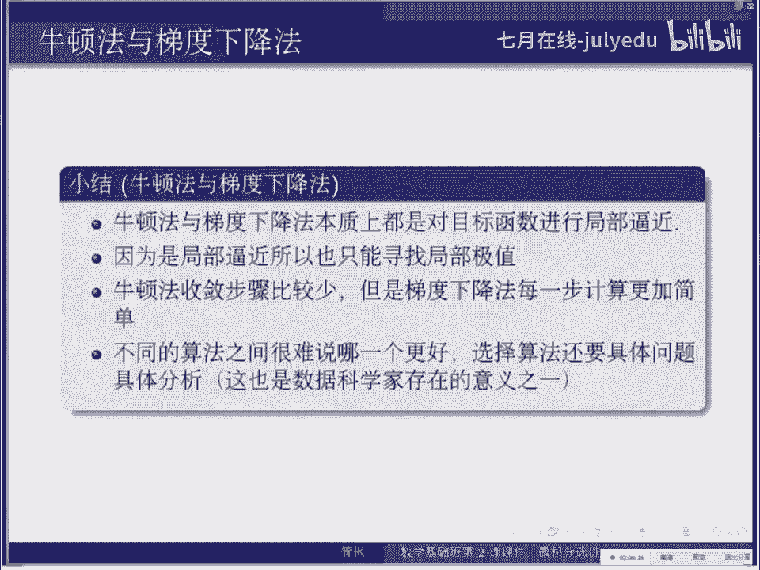

# 人工智能—机器学习中的数学（七月在线出品） - P16：牛顿法与梯度下降法 - 七月在线-julyedu - BV1Vo4y1o7t1

好，现在我们进入这个让大家更关心一点的问题啊，比如说这个算法。刘德法也提出下量法。我们。し啊。就是说为什么要在这个地方讲这个。刘顿法与提不相关法啊。就说他们两个算法的本质其实也是逼近。

就说我们的微分微分的本质是逼近，他的极数也本本质也是逼近啊。然后我们发现哦这个牛顿法和PU加法，它的本质也是毕近。这时候你就看到他们的关系了。所以说我首先我们说一点背景吧。

就是说很多机器学习的问题或者统计的算法呢，最后都转化成一个优化的问题。就是说你可以有一个模型，但这个模型你怎么去。训练它，你最后就是变成优化的问题。就是。昨天的时候那个王老师也讲了好。

他说就是说他是某种这个损失函数，我们这反正靠方式，我不知道这个应该能反映他的绩效值的问题。那我们在这个本科范围内呢，我们考虑这个函数呢，这种函数都是可谓分的，这是非常好的函数。然后。

所以这个我们优化的一个问题是什么？就是对于一个可补充微分的函数，我们怎么去找到的技巧这点。这就基本问题。然后什么叫基于基于点呢？啊，全局全我们分全局几小值和这个局部极效值啊。

全局极小值就是说你对任何一个X。收だ。他的取值。XQ呢都大于等于你这个FX星星。那你这个FX星就是全绩交值点是。全日你这脸就最小的了，就权市最小值。然后局部效值什么呢？就是说哎呀达不到这个全世界最小。

但是呢他在他附近最小就是。我用了一点这个安全调查下，就是说现在于正数打法使它，只要你这个S塔和它离得比较近，进到什么程度呢？比这达塔还小的时候，或者X星星FX星星就小于等于F。X就了对吧？

那这个时候我就说FX这个X星星啊，虽然不是全世界的小，但它在方圆德el塔内它是极效的这叫做局局部局部就这个意思。那不管是全局教值还是全部教值，在我们这个。可求导数的函数身上它这点处的导数一定是0。

如果是一元函数的话，导数。如果是高呃多元函数的话，它的这个P度是0。前面这两个我们可以认为定，后面这个呢其实是一个条件，我们将会利用这个条件呢来寻来找一些这个。啊，算法去找去寻找这第二一点。好。

我们这个局不集决的算法啊。我们介绍牛顿法和西修相法。就是每当你教算法的时候呢，就是稍微先想一下它的这个适用范围，它呃达到的效果是什么。就是就是说比如找几小值吧，优化。那你首先你要问一个问题。

就是它是全局优化还是局部优化。就刚才有一个定义里说了，有全局几小值和局部集小值对吧？那你现在这个有算法的，全全局优化局部优化呢？首先我们牛顿算法就算法，他们都是局部集制。为什么局不及职呢？😡。

其实你想想你知道，因为我们用的是B近。刚才有同学说的很好，就是B近一定要在某一点附近逼近，你不能全局，对吧？既然你是在某一点附近逼近，那你这件事就只在那点附近超使的那既然如此。

你你怎么可能找到全职就要值，你这种方法就能找到机会，对吧？所以说你从他的这个原理上，你马上就可以得出这个了，就你就不需要说非得去把它背下来。然后这个。这两种方法呢还是这个就是说你必须从某一点开始。

所以一定要有知识点。啊，数学原理呢有顿法用二级。72GBG你就等于是你用了这个二阶的拍勒技术啊，这是。包括刚才同学问说机器机什么时候用开的技术了？对你可以认为就是这个例子，对吧？你毕竟用了RGB机器嘛。

那不就是他的技术嘛啊？啊，提提出下降法用的是一介之径，就是说他只用了一届导师，他不用二教。有的法。他这个有一个有一点点这个缺点啊，就是说他对于局局部这个局部上凸的就是他在某些情况下找到极小值。

有的时候他找到极价值，有的时候他找到的还既不是极价值，也不是极小值，是个单点。就是说啊他这个不能保证找极小值，他有的时候有这个问题，这个要推进。他只找那个叫做。提方点我们。

因为叫做st stationary point，就是它平衡的那个点，它并不见得是极大的或者绩效，有可能绩效。提出下降法呢，因为它是下降法嘛，那个你从自面人可以看到，他就一般不会找到最大人士。

但是运气不好的话，有时人也会找到晚点。然后就是他们就是这种算法就并不是十全十美的，我不见得总会给你你想答案。然后当你初始值选取的比较好的时候。他们都会找到绩效值。而且呢牛顿法比齐度下降法速展速度要快。

就当你知道这个算法是干什么的，它的适用范围。效果怎么样之后，你就要考虑这个。他的速度是怎么样的？就是一般讲我们讲收敛速度什么意思呢？就是说你要接代多少次，因为我们是拿一串点去逼近你最后那结果，对吧？

那就是说你到底需要多少个点才能逼竟的比较合理。这个就是收敛速度啊，牛端法收敛速度快的意思呢，就是说它可以用比较少的步数步骤数就可以达到一个比较好的结果。然后它的缺点是什么呢？他前面说了。

他需要估计二级导数，所以那你多算东西吧，计算能力计算难度给大。啊，具体来看一下。就说。这是一个我们经常看到算法的时候啊，你最好是都有这个嗯弄清楚它的使用范围是什么，它是干什么。好，牛肉茶二0不近。

什么叫刘德法呢？我们说明的法有歧义啊，就有的时候大家会说它是用来那个解方程的，就是求函数等于FX等于求解方程的。然后有的时候呢说然做优化的数作法，它俩是一样的。但是我们在这里面我们用这个优化者来说。

因为我们关心的是优化啊。我们关心的是这个优化。啊。所以我们在。呃，牛德码必须嘛就是说我们有一个函数，我们要解决一个问题。FX。请求它极小值点，我们从一个X零点出发，我们从这点出发。

我想找到他的极小值点怎么办呢？我先做个B近，就是说用二次万时给他做个B进，就是这个他让他的基数给他写出来。长试项限项2项，加上一个小项。我把前面的三个写在一起。打个包变成1个GX它是一个简单的函数。

是个二函数啊。我们对于FX的几小时，我们不知道是在哪。但是这个GX这个二次函数，我们可是知道的几小值在哪儿。这个是我们很熟悉的东西，是吧？二三数什？二三数是抛线。好线。

只要它的那个呃二次项的系数是大于零的啊，二次项的系数大于零的时候，它就会有。2次项系数小一等的时候呢，它就会有一个极大值点。就这种事情啊，就是说所以说我们前面说牛顿法有时候会找出极大一点。

就是说我们找他极值链啊，GX极值点我们知道的就是这个呃一次项的系数除以2次项的系数加个方号。那个位置。就是G德塔X的缺点。那F和G其实很像的，他们俩都是说毕竟嘛就是F等于G加上一个小量。

所以在F的附近呢，这个它俩很像，所以我们就拿G的极值点来估计F的极值点。G德塔X值点的这那F的值点念什么？就是X0加上这个德ta就X0减去这个数。所以说。我们就。再拿这个做一个FX的极制点的图形啊。

所以我们就把它，但很仍然是估计啊，他你想他它并不是精确的，就他俩不相等，还差东西呢。所以说我们把X一叫做X0减这个东西，是第一次迭代叫X。那么现在我们到了一个新的地方，我们通过X零出发。

我们到了一个新的地方。那么新的地方呢我们可以继续干这件事。不断的干这件事。就XN等于XN减1减去在XN减一处能求出来的东西。然后这个东西就是说你不断的去逼近那个局不去变这个东西。嗯。

当你出师点选的不是特别差的时候，他就会收敛到一个局部局点。这是牛顿法。牛顿法就是就这就是说。在局部上做一个二次B镜，然后你拿那个二次函数的极值眼来估计这个就这么简，这个什么办法？啊。

我解释一下前面同学说这个梯度和导数什么关系？我这个我这个前面说漏了啊。76F啊。等于你把他所有的那个片脑图给他写成1000。见没。我刚才只讲没听到说我没有讲记录。所以说。如果是一键函数呃。

一元函数的时候，你想就相当不就是一个数嘛。DFDX，所以说我们要求这个面。然后高原函数的时候，多元函数的时候呢，要求这里边东西全都是。最牛德法就是就是这牛德法就是。O。这两问题。好，有同学有问题说这个。

20X的值实点是怎么来的啊，这个我可以稍微解一下，这应该。就说。二函数啊。GX。等于AX平方。当DX。C啊，这东西呢你给它化简一下，就变成了HA就是这个这个。我写不对。然后加上这个。希望我不要。啊，对。

然后要忘的你对须也测先测一先。就这没事吧，这个没。你还感觉这问，然后那个这个地方空快。对对对，然后。所以几点什直点就是这个X，当你这个X项的。就是X的这个负的B除以R。那我们在这个例子里面。

这个A等于什么呢？A就是这个呃2分之FP撇B等于什么呢？就是X撇，然后B除负的B除以2A就是这。对。指出来了啊。好。呃，然后这个还有X一怎么推出XN啊，XE怎么推出XN。啊。

这个呃X一不能推出XX1不能推出X2X2推出X3X3，然后一直递推递推递推图变样。比如说用XN减1推出X。好，我们继续啊。然后这呃我们这个是个1元的牛盾法啊，这个函数只有一个变量，那是多个变量的时候呢。

什么东西都是一样的啊，不好写。但是我把它这个写个公式出来。一旦用多元函数的时候，因为我们现在还没有具体讲那个现代数呢。所以说这个地方我们就是写一下啊。我们要用这个梯度来取代导数，这个我们要看到的。

然后用用这个东西叫做hsion矩阵来取代二级老师。h矩证什么呢？就是所有二级老师放一起。因为它是个多元函数之后啊，它这个二级老数不是一个数了，就一大堆数，所以它等于什么呢？就是这。你对于这个XE。

修两辅导书写在左上角。然后呢，对X一求一下导数，对X2再求一下导数。Ex说。这个呢写在这个第二，然后一直写写到这个。这个你的XN球下导数，在这个XN球下导出。然后你把这些数都给它列在一块儿。

就是列成一个方阵。最后一个呢就是对于XN求大师导数。这玩意儿就叫做寒神之针啊，他就是说。他就是说这个呃一个二次函二阶导出的一个推广。那，梯度呢就是向量。就是一级老师推广成的向量。

二级老师推广成的这个矩阵。三阶就复杂了，变成那个三级大量。那个我们一般都不去考虑它。对，题度是这个，刚才我写了一遍啊。这样。嗯，有同学有问题说这个梯度和原异导数的问题，这还这个还是跟刚才一样的问题啊。

就是说你说一元函数的话，你这个那个导数就是一个数值啊，多元函数的话，因为你好几个变量呢，你这每个变量都得求一个导数啊，那你求出来之后，它就不是一个数了，它一堆数一堆数就行了。

就是大家可以破出一些神秘感啊，就是说。什么向量啊什么矩阵啊，什么这些东西啊，就是说你他有它有名词，名词的原因是因为这样比较好说。那其实它就是它的本质含义并不复杂。好，我们刚才牛论法牛顿法是20。

刚才看到了，就是用2二三处的算吧，就刚才问这个问题问的很好，就为什么二三数可以算这个极制点？就是因为我们知道这件事，所以说我们才能块也能做到。提出下降吧。有意见没有。嗯，但是提重调大法呢。

一般情况下我们就不考虑预案啊，肯定是个多样。呃，否则的话，这玩叫梯漏了。所以说我们首先就考虑这个多元纳数。它X的就候向量，X面的时候向量啊，在这点做相量不见。一定要是你对一个多元函数做现目金的时候。

就是说这个导数不能再写导数来，你就得写一个披注。然后呢，嗯但这是个数，它不是这量，怎么办呢？你要用这个。deltaX它也是会向量，它这个取数展制跟它做那积就变成数了啊，后边呢就都是这些。啊。

这是小量的没有，那前面就是然后我把前面这两项写在一起，变成一个新函数啊。那后现在我们就等于是在用这个线函数来比近。这个FX。啊，这个地方我是不是好写一个例子？比说。写个例子，快快写个例子啊。比如说FX。

XXY两排两个变量来是吧？平方加什Y平方就这个。然后我现在想在这个X0是么？H0等于。11我想在这个点处啊，这个B件啊。那么。首先我算他这个。提度啊。配小数我们刚才不算了啊，这东西等于2倍的X0啊。

两倍的Y0。就对你对X求求导呢得出两倍I对Y点求导呢得出两倍的Y点，我你把它放在一块给它给删量。那你这个X0居然等于1一的话，这个东西就等于什么？所以这个时候呢我就可以选这个F。

X0加上德taXdtaX其实是德taX1德taX2对不对？他刚头。嗯，就是吊台吊台位。然后呢，他等什么呢？就好点。他的什么呢？iad型对2加上。这玩意这玩意就是说这个。X， Y。这个。那个呢就是乘以。

7度。加上后边小量。对不行啊。写出来是啥呢？其实是线函数，就是说只是说我们抽象起来这样写比较好看而已。加上2外啊。加上小的。あ。😮，这个就是新笔性。啊。这个就是那个嗯。FX在那点出的现金啊。然后这是P。

就是把P写G比个什么？G就是前面一部分。这两个个。然后呢，那也就是说我们这F本来是挺复杂的海重，这个东西。二函函数。就比较复杂。我现在我们用一个一算函数来演出稳静了。但是毕竟之后有一个问题。

我们现在想找的可是极制点，对吧？机制点怎么办呢？怎么找？一次函数可是没有取的。第三方是直线的，那直线它就是直往上直往下，它没有没有基值。所以说这种方法不能告诉我们节点在哪儿。

它只能告诉我们节止点的方向走。所以你看到这个行要长这个样子之后，你可以至少得到一个信息。随着X变大，你这个F是变大的吧，就G是变大对吧？随着Y变大，G也是变大。所以你要想把哎这个F变小怎么办呢？

你要反方向的去走，就是说就是说你要。把X变小，把Y变小，那对，这怎么反方向呢？方向什么呢？就这个T度的方向，你要沿着梯度的反方向走就对了。但是走多远，你可是不知道的。嗯，他没告诉你，他只是说那个方向。

他就告诉你方向，所以你没了保险，你只能选一个比较小的。这长度。走一步试试。所以说怎么办呢？你得到一序列XN等于XN减1减去。后边是梯度啊，T度就是T度的反方向嘛，所以有符号走多远呢？你要自己定义你的数。

就是这个干板建议。就走那么一段儿，走那么一点儿，别走太多了，太多了，你就跑人来了。所以说。这就是方就是说你逼近了一下，知道了方向了，然后你就沿着方向走，然后稍微走一点。这种方法。为什么比那个五六达慢？

就这个原因。牛顿法它用二级比行，他不但知道了方向，而且他还知道走多远。你看他这个。同样注意对很多远来说啊，方向是一样的，都是这个F的梯度啊。好像是一模一样。但是呢他还给了你一个别的指示，就是说走的远。

他应该算。所以说他得到的信息更多。这也是为什么我在很多情况下，他更快。那这个这个当然会慢一些。什么问题啊？呃，同学讲到梯度描述的方向是一定的嘛。呃，就是说他在那个每点处，它它方向是一定。

就像是昨天那个董老师讲的非常好，比如说嗯。你像爬山一样，就是你比如说这二二二函这个二元函数吧，它其实就是个山，对吧？比如说我现在一个我现在一个函数，你画出来之后，它是一个那个它是个剖面。

这个我不太确定我用这个比方的话好看啊。老师是代。它是一个。烤我面。目前。这样子，然后你比如说在这点处。那你你想你沿着呃最速下降的方法，哪是哪方向能？就这块。对吧。😊，所以说在每一点处是一样。

你在这个点处的方向就不一样。就边这。O啊，就是同学问这个就是他描述向上的方向，要求小，所以取出数对。那这个负号不是说负数啊，这个符号是说这个里边这个里边的数呢也可能是负的。然后即使它是负的，你要取出。

就比如说这个例子吧，就就就就这个点吧。啊，这个这个啊这个例子吧这个啊这个例子的话，这个点的话，你看它急速上升的这个方向是这个方向这个方向其实你从XY角度来看，它这个大概也是负的对吧？但你急速下降呢。

你就要把它倒过来。那前面加括号，这个变正的。对这个数字的这个正负标题就是呃。你这个地方讲。然后另外一个问题就是说前面这个这个这个逆题证这个问题。对，就是说呃他是。这个东西呢是什么呢？披度是一个。

N乘一的向量。讲完这样啊，我这个写的不太好啊。我这写横过来了，因为横的好写所以横过来写。一般来讲，我们讲就梯度上，他不是分成列的向量竖着。然后这个什么？这是延长的矩阵。可应承担了。给人成立的。

所以正好相同嘛。当然了，这还权利权利之后还认成。好像没有别的问题了，我们继续啊。小结一下。就是跟刚才说差不多了，就是说有的码是PI法呢，本质上都是对UI是进行求信。啊，因为是职部逼近。

所以只能找到局部机制，他不可能找到全职机制吧。然后牛顿法的收敛步骤比较小，但是呢提出向量法的每一步计算比常简单。因为到前面看到了，就是说你每一步你那牛顿法你得把这二级小时求出来。你算这玩意。

这个东西其实是不好算的。就是说我们如果要是具体知到一个函数，就这种函数那就是比如说我们随便写出能写出来的函数，你就好算。但你真正处理真正那个做问题的时候。

这个东西不是说给你解析式算的这个东西其实是你是那个在这个函数附近取几个点，然后估计出来的。然后这种事就比较复杂了。就是说你取几个点算都是花时间的。所以这个时间复杂度就够了。然后这个呢他不需要算级导师。

最简单一些。哎，同学问我一个非常好的问题啊，就是你这焊业底量不肯逆怎么办，这是一个非常好的问题。我当然可能但是确实有可能不肯逆。所以说嗯。所以说这种问题呢。就包括那个前面都是有同样问题。

这个二级导是等于英怎么办？所以同样的问题，它万一等于0，你不能不能除了嘛，对吧？所以说呢有论法和那个极数相法法呃，奇数加法法，你那初始点不能取太长。你要是取那点取的不好，你这个二导数等零了。

或者是这个嗨开矩针不可逆了，那你就算不了。所以说初始点不能太差，这跟初始点选择是有关系的。然后有同学问这个梯度本身方向是不是向最小值方向啊，这个不对啊？就梯梯度是向上最大的方向。然后。

负的梯度实是向应最小值发生。那就是为什么这地方加了个负号不是正号。然后有同学问说怎么选这个初始点，这个问题就跟你具体处呃处理的问处理的这个事情有关系。呃，比如说啊我们。在工作的时候会遇到这样的问题。

比如说我现在呃有一个模型，这个模型呢有些参数。然后我就希望。这些参数啊选取使得它的某一个函数最小。就比如说亏钱亏最少之类的是吧，或者赚钱交最多了，就反正是一样的事情。然后我就有这个问题了。

我说我怎么取数值，所数值怎么选的？那个函。首先我这个参数是有范围，它不是说从复什到正取的，我这参数是从0到1的。所以我可以先从0到1做一个这个网格查找。对00。10。20。3啊，一直查到一算14。

我先算一下，我看看那个大概那个最小值在哪，然后我就以这里边最小值那点除来来照。就是但这个可能不同的情况，你有不同的做法，就是可能会有一些非常人工的手段找到一个初始点，然后再用这个算法做。

然后同学问这个全局机要是怎么办？哎，这就是核心问题。就是说嗯这样的算法是不能解决全局肌耳的问。但是昨天罗老师说到了，就是说机学习呢很多时候就是说很多算法，它的目的就是把这些。呃，不好找群体教师的问题了。

把它变成一个容易找群体教值的问题。对可能我们后面逐渐逐渐就会看到更多了嗯。然后同学问为什么梯度是下降？变化就是那个上升变化最快的方向啊变化最快的方向。这个。可以证明啊，但是你要问我这个他的。原理是什么？

能不能直观的说一下。我好像。说不太直观，你觉得嗯你可以把它理解成是那个这个这样想。你理解成这个。等高线就是说。

这还是一个很好问题啊，就说如果说我们是还是刚才。我刚才把它画成三维图像的时候，它是一个剖面。但如果我要是只在XY上面看看它等高线的话，它其实是一圈一圈。就每个圈上面它那个含数值都是一样的。

X平方加Y平方嘛吧？就是这个半径平方是吧？然后梯度是什么呢？梯度就是梯梯度永远都是跟这个等高线啊垂直的。你想你跟等高线垂直的方向，那一般不就是说你这个等高线变化最最平繁的方向。

如果你要是你看沿着等腰线的方向，它不就不变化了，它值就不变。你跟它垂直变化最快。是这。嗯，那个你牛顿算法和那个工业记录法，我们后面再讲吧，就是今天我们就不讲这些了哈。跟我题度跟T度是不一样。

这个还是挺大区别。咱们就是处理不同问题。这人名字有点像。如果理解正确的话，后面讲的时候可能会更加详细一些。唉，然后又有同学问出了一个经典问题啊，就是说唉这两种算法既然有有好处有缺点，那到底应该用哪个呀？

这是一个非常。呃，有一思问题，但这个问题无法回答，为什么呢？就是说你要具留你继续分析啊，就是说。这也是我们存在的原因。如果说你知道用哪个的话，就不需要我们了，这计算机就干这事了。

