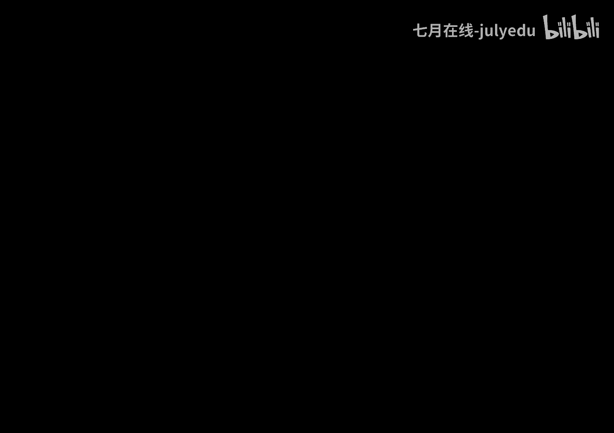
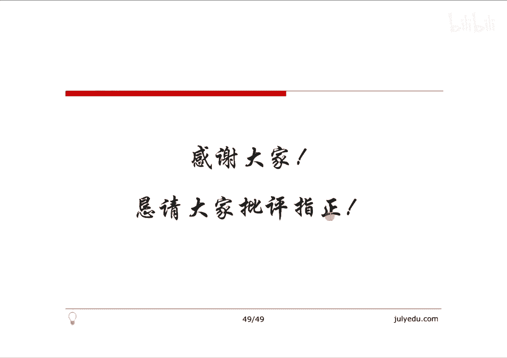

# 人工智能—机器学习中的数学（七月在线出品） - P2：半小时梳理凸优化 - 七月在线-julyedu - BV1Vo4y1o7t1

🎼。好了，我们今天呢共同讨论一下凸优化方面的一些问题。我们主要是从突集凸函数、突优化这三个方面展开讨论。首先呢我们看一个有趣的一个问题，我们图上给出的是Y等X平方这么一个函数，这是一个凸函数。

那么这个凸函数位于红色曲线上方的这个区域，黄色的这个区域，它其实是一个凸极。把这个问题呃放大一点，就变成了凸函数的图像，它的上方区域一定是一个凸集。而一个函数，如果它的图像上方区域一是个凸集的话。

那么这个函数一定是一个凸函数。我们等会儿呢会给出这个表述的形式化定义。因此我们要想学习突优化，掌握考察凸函数，先要从凸集以及它的相关性质来开始着手。首先我们可以出凸集的定义。如果一个集合C。

它任意两点间的线段都在集合C里面，那么说这个集合C就是一个凸集。也就是说，任意的X1X2属于C。如果说西塔是从0到1的，是属于B区间的。那么说西塔X1加上一减西塔X2，如果一定在C里面。

那么说这个集合C就是一个凸极。事实上我们可以把这个XX2扩展到X1到XK它的写法是下面这种写法，它所表示数学含义，二者是等价的。好了，比如说一个任意的一个凸多边形，就是一个凸极，一条线段也是一个凸极。

但是我任意画一条扇形的曲线，它内部的位置它就不是一个凸极。比如说一个多边形，如果用一个矩形，如果说某一个边界部分它缺失了，这也不是一个凸级。好了，我们现在再给出超平面和半空间的概念。如果一个。

A是一个向量，A乘以X等于B。那么说这个表达的任意X，它就是一个超平面。如果将这里等号变成小于等于或者大于等于，它表示的就是这个超平面所确定的半空间。我们给出一个例子来，超平面在二位上其实就是一条直线。

那么说AX等于B表示一条直线。A其实就是它的法线方向。比如说我们将这个等号变成小于等于或者大于等于，因此就变成了位于法线方向的部分，或者是偏离法线另外一侧的方向的半空间。

我们利用超平面和半空间就能够定义多面体。如果给出AX小于等于B，并且CX等于D。那这样的话，满足条件的X组成的就是一个多面体。事实上，超平面直线射线线段半空间它们其实都是广义上的多面体。很显然。

多面体它其实是一个凸及。有些文献中呢把有界的多面体叫做多包形。比如我们给出一个时间的一个例子，这里有一条超平面，二位上就是条直线了。我们给出A一的这个反向。

那么说小于等于这条直线部分就是右下角右右下这部分给出A2这条直线，它的小于等于部分就是左下这一部分。任意条A3A4A5都是小于等于最后会得到一个多边形并且是一个凸的多边形，它就是一个多面体。

我们现在呢把重点放在保持凸性运算的各种算子上。首先刚才给触到集合交其实是一个饱突运算。当然怎么证明呢？定义就可以做到了。此外，仿射变换、透射变换、投射变换都是饱突运算。我们来看一下。这个就是给出的。

我在平面上任意的画出一些直线，也就是所谓的超平面。然后它的小于等于部分，最后的交集得到一个集合S，这个S它就是一个。凸的。集合它是一个宝突运算。第二，我们看一下仿射变换。

如果一个FX等于AX加上B的形式，注意A这里是个矩阵，X可能是一个N为的一个向量。那这样的话，这种线性的一个式子把它叫做仿射变换。这个仿射变换，它就是一个保突运算。换句话讲。

如果说定一个F这么一个映射FS是它的一个项，如果S是突级，那么FS一定是凸集。另外，如果FX这个项是它的凸级，那么原相S也一定是凸及，这是仿射变换。我们再看一下透射变换。

透视变换透视变换其实是将向量的最后一维变了一个伸缩，并且将它最后一位的分量为一并舍弃值，什么意思呢？比如说它是本来是从RN加一维的。然后ZT把Z的每一个分量都除以T，那么说前面的N维都做了一个伸缩。

而T呢最后舍弃掉，那么就从。N加一维变到了N维，这个叫做透视变换。其实类似于物理上的小孔成像。然后这个变换是保突的，也就是说一个凸级，它的透视变换显然仍然是一个凸级。当然留给大家一个思考题，反过来。

如果说一个集合的透视变换，它是一个突级的话，那么说这个集合是不是一定是突级呢？大家可以考思考一下。然后我们现在把刚才的透视变换和仿射变换作为一个组合，就变成了投射函数。

这个投射变换呢其实也就是所谓的线性的分式变换。它是这样子，就是说任意的一个。GX我们写成它的仿射函数，我们定义仿射函数GX是A，这是一个矩阵。C是一个列向量，然后乘以X加上B，这是D的形式。

那么说AX加上B，这本来这是一个仿射函数，然后除以CX加上D，这个是最后那一维变成一了，所以说这是一个透射函数和仿射函数的一个复合。这个复合函数，它仍然是一个投射呃，仍然是一个饱突运算叫做投射函数。

事实上，如果这个函数里面的C等于0，D大于零的话，这F就退化成了普通的一个仿射函数了。我们现在呢给出两个有意思的概念，第一个叫做分割超平面。如果说集合C和集合D，它们两个是不相交的突集。

那么说我们知道一定会存在一个超平面P，这个P可以将C和D分离。换句话讲，任意一个X属于C的话，我们都存在一个超平面P，也就是所谓的AX小于等于B，并且任意的一个X属于D的话。

AX大于等于B只要是一个C1个D都满足这两个性质。😊，当然这里多说一句上面的这个两这个式子呢是可以取等号的。也就是说它的逆命题，如果两个凸级C和D的分割超平面是存在的，那么说C和D不相交。

这句话是假命题。我们需要加强一下，就是如果两个突级至少有一个是开的，是开级，那么说当前紧张存在分割超平面的时候，它们是不相交的。呃，也就是说我们给出一个示例，B集合和C这个集合。

那么说一定存在至少有一个分割超平面，使得AX大于等于B，并且AX小于等于B。这个X分别取于D向的元素和C上元素的话，是满足这个条件的这是分割超平面一定存在的。

我们可以通过构造的方式来去一定程度的说明这个问题。比如说C和D都是初级，那么说我们定义这两个集合间元素的最短距离。就是两个集合的距离。假设我们找到这个最短距离，一个是小C，一个是小D组成的。

一定是最近的。那么说我们做小C小D这条线段的垂直平分线，那么说这个超平面一定可以将C和D分开。我们通过构造的方式来去一定程度说明这个问题。😊，下面呢我们给出支撑炒平面。

我们说一个集合CX0是这个C上的边界上的某一个点。如果说存在一个A是不等于零的，满足对于任意的一个X在C里面都有A乘以X去小于等于A乘以X0。那么说这个超平面AX等于AX0，就叫做集合C。

在点C处的一个支撑超平面。😊，也我们很显然的可以得到结论，一个凸极，它边际上任何一个点都存在一个支撑超平面。我们可以把它近似的先把它理解成为一个切切线，一定是它的一个支撑超平面。

当然反过来可不是这样子的。事实上这句话也有它的呃逆定力，加强一下就是正确的了。如果说一个B的非中空的一个集合，它的边界上的任何一个点都存在一个支撑超平面。那么说这个集合就是一个突集，任何一点都存在。

那么它就是一个突。这里呢我们通过刚才这两个概念做一点思考。首先我们。想一个问题，怎么样去定义两个集合的所谓最优的分割超平面呢？那么说我们可以这么来考虑，就是找出这个集合上边界上的若干个点。

然后以这些点为基础，我们去计算超平面的一个方向。然后呢，两个集合边界上这些点的平均作为这个超平面的截距。那么说我们就得到一个所谓最优分割超平面。另外，如果说这两个集合，如果它们有部分相交。

又如何去定义超平面，使得这两个集合尽量的分开呢？这个呢我们在知识相量机部分会给大家做一个详细的解释。好了，我们给出了凸函数以及它的相关的性质。下面呢我们看一下呃给出了凸集的。我们现在呢看一下凸函数。

如果说一个凸一个函数F，它的定义域是一个凸集，并且满足对于任意的XY是属于这个定义域的。给定一个西塔是从0到1的，一定有F西塔X加上一减西塔Y，这个值是小于等于西塔FX加上一减西塔FY的。换句话讲。

任意给出两个点X和Y的话，它们的割线是位于这个函数曲线的上方。那么说这个就是一个凸函数。那么说我们现在如果说这个F是一阶可微的呢？😊，那么说这个函数F是凸函数的话，当且紧张F的定义域本身是凸集。

并且对于任意的XY的话都属于定义域的话，FY是大于等于FX加上F在X这一点处的导数，或者是它的梯度乘以Y减X这么一个值。把这个数学式子画在函数图像上，我们任意给出X和FX这一点。

给出FX加上梯度乘以Y减X，也就是这条红线。我们发现FY其实是这个函数的曲线。后面这个其实是在这一点处，这个函数的分支撑超平面。换句话讲是在二位上就是一个直线切线，那么说这其实是给出了一个对于凸函数。

它的一阶抬到近似本质上就是一个该函数的全局下估计。看其实这右侧部分其实就是他要展示的一阶下一阶部分。那么说这个一阶部分，那么说一定是整个函数的一个一阶的一个下全局下估计。

一定是位于它的下方的这是一个非常好的一个认识。我们事实上可以结合凸函数的图像和支撑超平面来理解这个问题。反之，如果一个函数它在一阶抬了近4，总是全局下估计的话，那么说这个函数就一定是一个凸函数。

这个不等式其实说明了一个函数的局部信息，我们就可以通过这个局部信息来一定程度的掌握它的全局信息。这是凸函数非常好的一个性质。此外，如果一个函数F它是二阶可维呢。

那么说我们就会求它的二阶导数或者是二阶的haen矩阵。那么说如果是一元函数，这这样的就是一个二阶导数，二阶导数大于等于零或者是多元函数，它的二阶的hen矩阵是半正定的。那么说就和F是凸函数是等价的命题。

😊，然后下面我们给出了凸函数的若干的例子，这是我们一些常见的凸函数的一个实际的一个函数的定义。下面给出有意思一个概念叫做上镜图。一个函数FFX其实给定的是一个函数F的图像。

那么说我把这个FX给定它小于等于TT取任意值的话，那这样的话，这个函数图像其实是函数图像的上方部分，我们把它叫做函数F的上镜图。那么说我们知道一个函数，它如果是凸函数的话，当且仅当这个上镜图是凸级。

事实上，这是我们最开始给出那个例子，我们通过定义就能够非常方便的证明出来了。进一步考察一个函数，如果是凹函数，当前紧张它的压图使它的突及。好了，我们利用凸函数呢其实非常重要的。

我们要考察一下啊jason不等式。呃，下面的不等式假设F是一个凸函数。那么说显然F西塔X加上一减西塔Y是小于等于西塔FX加上一减西塔乘以FY的这其实是它定义了。

那么说我们可以把这个西塔从两个值变成K的值也是成立的。我们可以把这个西塔从离散的值变成连续的值仍然是成立的。所以就从这个离散形式，变成了积分形式。事实上，如果说F是一个凸函数的话。

那么说对X求期望再取函数再取函数值是小于等于这个函数值再取期望的。我们通过这个式子就能够定去证明出来，任意的两个。😊，手机变量P和Q它的相对商D的定义是这样子的。

那么说把它非常方便的利用刚才这个式子就能求出这个式子，这个定义一定是大于等于零的。实实上我们呃通过Y等于负的log X，这个其实是一个凸函数。那么说我们取任意的A一和B都大于0，西塔取0。

5代入这个凸函数和的这不等式代入这个式子。那么说我们就非常方便能够证明出来A和B如果都是正数的话，那么说A和B的平几何平均数呃，算术平均数大于等于他们的几何平均数。

所以说这个不等式是几乎所有不等式的一个基础，我们都可以去构造相应的合适的一个凸函数，以及合适的一个C代值，证明很多很多的不等式。下面把重点放在保持函数突性的那些算子上。我们可以发现。

如果说F1F2到FN它是凸函数的话，欧米伽我们取做呃欧米一到欧米根取做大于等于零的。那么说得到的函数FX它就是一个凸函数，也就是凸函数的非负加强和是一个凸函数。另外，如果F是一个凸函数。

那么说把这个凸函数和仿射函数AX加上B作为一个复合，得到GX仍然是一个凸函数。更重要的，我们考察一下，如果FFF1XF2X到FNX都是凸函数，那么它们取最大值得到的FX是一个凸函数。

我们把它这种求最大值叫做主点，求最大。另外一种呢，如果说这里F1到FN是一个连续状态的话，就是对GFX取对任意的Y在定义域上的一个上确界主点求上确界也是一个凸函数。

我们呢把这个通过F1F2的事情呢做一个简单的一个介绍。如果F1F2是凸函数，我们定义一个函数F，这个F叫做maxF1F2。那么说我们下面证明这个函数F一定是一个凸函数。通过定义就很方便的被证明了。

任意给出一个西塔，然后X和YF西塔X加上一键西塔Y，我们根据定义可以写成分别式子求max。😊，而我们再根据。呃，这里面每一个式子都可以是凸函数，所以把它拿开，这是小于等于的。

这两个式子的西塔取值一般来讲不是取相同的值达的最大。所以说如果说西塔左边这个式子西塔和右边西塔取相同值最大的话，那么说我们这里边可以把西塔拿出来，因此这是一个小于等于符号。

西塔 max它加上一减西塔这个塔。然后而这个式子就是它的定义，所以这就是这个式子。所以说我们就可能证明出来F西塔 X加上一减西塔Y是小于等于西塔FX加上一减西塔FY的，这就是我们证明的F。

它是不是一个凸函数。😊，当然我们很可很方便可以把这个式子写成12到K的形式。也就是说，凸函数的主点求最大值仍然是一个凸函数，这个定义非常重要。事实上，一系列函数我主点求上确界或者说主点求最大值。

它们所对应的其实是这些函数的上镜图的交集。这是一个非常好的两个式子的对应。给出一个直观的例子来，我们在一个平面上去任意的去画出N条直线。事实上直线是凸的。当然我们知道直线也是凹的。

但是我们这里就认为直线是凸的。那么说在任意点处，我们求它的主点求最大这个红线部分，那么说这个函数一定是一个凸的。😊，当然，如果说可任意画直线，那么说主眼球它的下界的话，那么说这就是一个凹的这个结论呢。

我们等会儿在拉格朗日的对偶函数里面还会用到。下面呢我们给出突优化以及相应的解决方案。初化呢先给出一个一般形式意义上的优化问题。它的一般形式是最小化F0X这个X是属于RN的这里呢有M个。

不等式约数和P个等式约数。这里面呢如果说M和P都是零的话，显然这是一个无约无约束的一个优化问题。我们给出一些基本的一些概念。首先，F和H它们的定义域的交集，我们认为是这个优化问题的域。

如果说一个点它在这个域上，并且是满足约束条件的话，我们把这个点认为叫可行点。这些可行点的集合组成了可行域。那么说如果说对于F0X对所有的满足条件的值，求它的下学界的话。

这其实就是我们要做的那个最优化的那个值。满等于最优化值的那个X取值，把它叫做最优化的解，这是基本的一些定义。然后我们下面如果说对于刚才那个一般性性化问题的话，要求F0和FI都是凸函数。

换成了I从小于等于0到I从大于等于0到小于等于M都是凸函数。并且HJX这个J是从一到P的。都是仿射函数的话，那么说这个问题就从一般性优化变成了一个突优化问题。显然，突优化问题它的要求还是很严格的。呃。

但是图步化它的好处是可行域是一个突级，它的局部的最优解一定是我们的全局最优解。下面呢我们把目光放在一个一般性的优化问题上。我们去优化1个F0X，这里面要求FIX是小于等于0的HJX是等于零的。

当然这里我们没有要求它是一个凸的函数。我们把这个函数呃做兰mb姆da和new做成增加若干个橙子，写成一个兰格朗的函数，写成这样的形式。这是关于X lamb姆da和new的一个函数。

下面我们考察这个这个函数本身，这个注意，如果将右侧这个函数看作是关于兰姆da的一个函数呢。我们发现关于lambda的函数，这个是关于lammbda的一个。嗯，一次项一次。呃，系数部分。

然后F0X和newHX是关于lammbda的常数项部分。因此这个函数是关于la姆da的仿射函数，同理也是关于new的仿射函数。那么说这个X其实是对于任意的一个值。

那么说我们对这个仿射函数逐点去求它的下确界。那么说这个函数根据刚才我们画了一条若干直线求下确界，因此这个函数是关于兰姆da和new的O函数。当然这里面要做一个trick，就是如果说没有下学界的话。

定义它是负务熊大。这样的话我们就完成了对偶函数一个非常重要的认识。这个对偶函数是一个凹函数。当然我们给你定义，因为对于任意的lam姆da大于等于0。任意的一个new的话。

原问题的这个最优解P星这个P星的值是某一个值，而G lamb姆da nu是它的下确界，所以下确界的值一定是小于等于这个P星的，这是很显然的一个问题。因为G函数本身是下确界嘛。好了。

下面其实我们关注重点是我们如果说这个不等式能够起等号呢？这样的话，我们就去解关于G的这个函数。这样的话求它的最大值就一定可以取得等号，求得最优值。别忘了，关于G的函数是一个凹函数。

负的G就是一个凸函数啊。因此我们就把一个任意的一个一般性的句化问题。转化成了一个凸函数的求机值问题。好了，对是刚才那个式呢，我们给出一个形式化的一个数据化的一个实例。这里面呢这个虚线的这条线。

这是一个不等式的一个约束。这是FFEX，我们让它小于等于0，因此这里面零是在这儿，所以说它的域部分只有从红线这小点是它的可行域。😊，然后对于黑色的这条线是我们要求的这个函数。

在满足这个小于等于零这个条件下求它的最小值。当然我们从图上非常清楚能看到，最小值其实在这个黑点处。怎么做呢？具体的我们可以lammbda取一个0。1，这个黑色部分加上0。

1倍的虚线部分得到的其实是这个后跟着最近的这个这个点状线这个部分。因此这个线我们总能求出这个点给出lameven0。1的时候，它的一个Glammbda的值。那么说。给定lam姆等于0。1。

给出一个值G兰姆的值可以求出来，给定lam姆da等于0。2，又能求出一个值来，给定lam姆等于一，又求出一个值来。所以说我们能画出G兰姆达这么一条。曲线来这一条曲线其实就是关于原函数的一个对偶函数。

这个对偶函数我们总可以发现它其实是一个奥函数。我们可以取它的一个极值是在这儿。当然对于这种一般性的问题的话，这个值最小值其实应该是虚线这么一个高度。我们求得的这个对偶值，其实略小于它不是等于的。

但是呢我们给出一个呃解释来，为什么往往取不到等号呢？下面呢为了表述方便呢，我们没有做等式约数，只考虑不等式约束，实际上非常方便能够扩展到等式约数的。

这里我们还是看关于LX lamb姆da就可以写成F0X加上La姆daFX从I从1到M的。这里面如果说这个X某一个X零值，它是不可行的。换句话讲，我们存在某一些I值使得这个FIX是大于零的。

因为如果可行的话，一定是小于等于零是我们的满足条件嘛。这里如果说FIX是大于零的。那么说我们就选择兰姆daI是趋近无穷大，那么说这个时候这个式子就发生了无穷大了。😊，如果说对于某一个X0是可行的。

换句话，这个所有的这个FIX都是小于等0都是都是满足条件的。那么说这个时候的I我们可以取作零，这个时候就把这个值的上界就变成了F0X。因此，兰姆daX lamb姆da。😊。

这个LX lambmbda这个对偶函数对于它取 lambmbda的上界的话，这个时候对应的其实就是原问题的FX。呃，而原问题是FX求它下界呀，这是我们的要求嘛。

因此我们原问题的本质就是对偶函数LX lamb姆da对 lamb姆da求上界，再对X求它的下界。而我们真正做的事情是对于这个呃对偶函数LX lamb姆da先求它的下界。我们得到一个关于这个。后面这部分。

其实我们得到的是关于lambda的一个O函数。我们在着这个凹函数求它的上界，这个时候得到的我们求的是右侧是下面这个值。事实上，这个值一定是小于等于圆的这个值的，为什么呢？

我们把这个上下界的这个表示符号变成mem的形式，等大家看的更清楚一点。我们知道任何一个函数FX总有这样一个式子发生。为什么呢？我们。简单看一下，对于任意一个XY属于定域的话。

首先FX总是小于等于maxFmax FXFXY嘛，对吧？因为我们在右侧取关于X的max，那么说一定是小于等于的。这样子我们看发现右侧这个函数其实已经是关于Y的一个函数了，对吧？

关于Y的这个函数是大于等于这边这个关于Y的函数。因此那么说这里边都取关于Y的最小值不等号方向不变，因此都取一个命Y，那么说还是小于等于。这时候我们再次发现右侧这一部分FXY已经关于X关于Y都取一个值。

因此右面这个值是一个定值，左侧这个值是关于X的一个函数。关于X这个函数是小于等于某一个定值的。所以说那么说这个函数最大值也是小于等于这个定值的，因此我们就证明出来，原来这个式子是小于等于的。换句话讲。

这个对偶问题求的解一定是小于等于我们的最优解的这个值的。😊，好了，我们现在呢给出一个实际的例子去算一下，用对偶问题去解决实践中的一个最小二成。比如说任意的给定一个X这个向量，这个向量呢满足AX等于B。

我们就求下X和X点乘它们的最小值是什么。很显然，它的拉斐的函数就是X加上缪。因为只有等式约数，我们有不等式约数就变成了X和X加上缪乘以AX减B。那么说我们求出它的对偶函数计U来，再求这个计牛，它的极值。

我们就去看一下这个极值和原始值是不是能够相等。我们看一下它的具体做法。首先我们把这个呃拉朗的函数LX牛等于这个式子，关于X求偏导会得到2X加上A牛，我们利用这个值等于0。

那么说这个X星这个最优值可以写成-2分之1A乘以牛的形式。而这个式子里面是X是关于牛的一个未知的一个一个式子，把这个最优值带到这个原函这个原始的这个对偶函数里面去。

那么说把LX牛就可以把它通过整理就变成一个关于牛的一个函数，这个函数，我们把它定义做G牛，这就是它的对偶函数。求出来记牛这个函数，而这个函数我们总可以求它的极大值。因为这个函数实实上一定是一个凹函数。

对你刚才我们的论述，因为这是一个关于new函数。它的关于X，我们会是逐点求极大嘛，所以说它一定是一个凹函数。那么说这里面G对这个G取关于妞的偏导，得到这样一个式子，利用这个式子通过若干的整理。

最后会得到X星等于这个值。而这个值的最终结果，A的转制乘以X的转负1次方呃，它的逆乘以XA的转制再乘以B。这个就是我们在呃。在线性回归或者是其他些相关内容里得到的最优质的那个结论。因此。

通过这个可以发现。呃，最小二成问题通过凸优化，它的结论是完全一致的。换句话讲，线性回归问题具有强对偶性。下面呢我们最后看一下如何能够给出强对偶性它的条件。如果说我们对偶函数最大值是原问题的一个最小值。

那么说我们考察需要满足什么条件呢？也就是X星，它的F0XX星是等于G兰姆da星缪星的这个式子我们做一个变换。首先，G兰姆da new这个根据定义是它的一个下确界。而这是一个下切界。

一定是小于等于这个函数本身的。而这个注意FIX是小于等于零的。HIX是等于0的，今然HIX1定等于0，所以第三个这个加号符号里面全是零没有了。FX这个里面这个只是小于等于零的。

我们要求兰da是大于等于零的。因此这个值一定是一个非正数，一个值加上一个非正数，再加上一个零，所以说一定小于这个值本身这是我们得到了一些式子，如果要求他们取等号的话，那么说第一个不等号一定要取等号。

第二个也要取等号，我们先分析第二个。😊，这里面如果要第二取等号的话，首先满足我们的约束条件。FIX是小于等于0的HIX是等于零的。再还能满足兰姆da乘以FX，这个值本身一定要是非正，所以一定要等于0。

它才有可能满足这个式子。因此刚才那个式子FIX小于等于0HX等于0，这是约数条件。这里面兰姆daF它一定要等于0。并且这里面如果它等于零的话，我们可以推到兰姆daIX我们要求它大于等于0。此外呢。

如果要求第一个不等号是取等式的话，那么说这个X星一定要是这个函数，它的注点。换句话讲，这个函数关于X就偏等一定等于0，也就是最后这个式子。把上面这些式子罗列到一起，就形成了著名的KKT条件。

这就是关于凸函数，它的能够取强对偶性条件的一个结论。好了，上面呢就是从最开始的凸集到凸函数。最后我们给出凸优化的一个结论以及强度条件。它的要求。呃，参考文献呢主要是关于凸优化这本书，以及它相应的中印版。

好了，这就是关于上面主要内容有什么不对的地方的，欢迎大家批评指正。好，谢谢。

