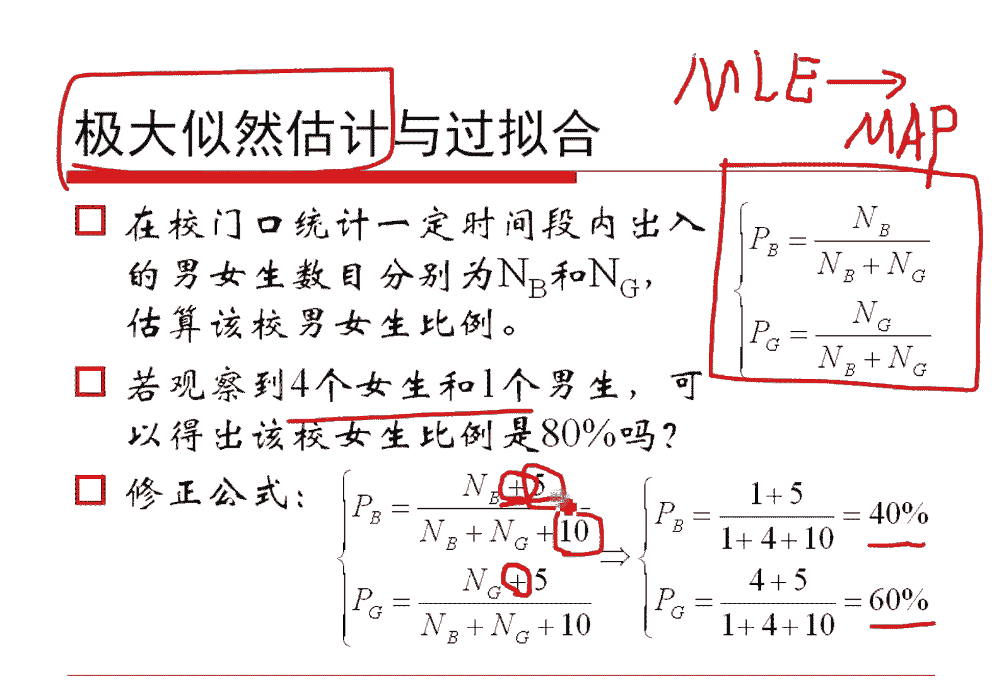
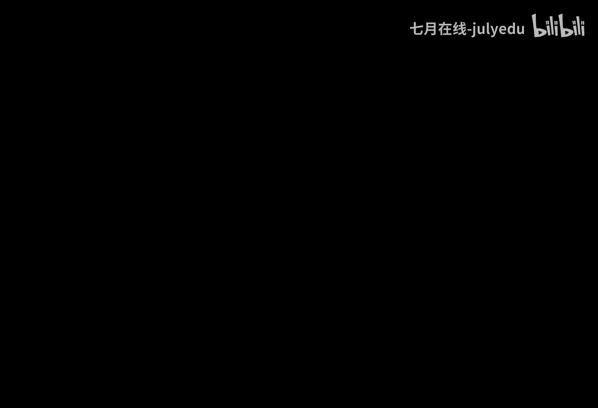

# 人工智能—机器学习中的数学（七月在线出品） - P5：极大似然估计 - 七月在线-julyedu - BV1Vo4y1o7t1

。O哈。😊，我们这么来考察这个事情哈。😊，就是假定我们想想贝叶斯公式。如果在给定条件D的时候，算一下这个A这么一个概率，对吧？这个东西其实根据别的公式是它除以它这个东西咱讲过了，对吧？

现在我们把这个D看作是已知的样本，这是条件啊，那么说就是给定了样本之后算这个分布的参数。我们这么来看贝也思公式好吧，那就是给定参数的情况之下，看看给定样本的情况之下，看看哪一组参数取得概率最大。

我们就认为哪一组带参数是最有可能的，最应该去。被我们估计的那个值，对吧？我们这么来想哈，根据被公式既然是这个东西，我们来观察一下这个事情哈。假定这个样本D而言，它呢可能得出一个结论。

A一可能得出一个结论。A2，它不一样的哈，可能最终得到1个AN假定可能有N种可能，也就是我想估计一下，在样本D这个数据给定的时候，看看哪1个AI它的概率最大。对吧这么来看哈。😊，那我就是想算一下这个值。

它的最大值是什么，它最大值的时候，看那个哪个I能够符合我的大值，对吧？根据贝式公式，这个东西直接带贝式公式，就是它没问题吧。注意哈，上面这个东西跟AI是有关的，底下这个是个PDPD什么东西啊？

是我们样本它本身发生的概率，样本都给你了，样本发生概率是多少，它就是一个除以一个同样的一个数，所以对它而言是个常数，我们不要这个分母了，对吧？只剩下了这样一个东西。对吧。

如果我们进一步假定原始的在没有给定数据之前，结论A1A2到AN他们是等概率出现的，或者是近似等概率出现的，大体上差不多。就是没有任何相应信息的情况下，我们PAI大体是相等，我们把它再把它给扔了。

那么说把它扔了之后，就得到这样一个东西。这是什么呢？我们把中间这个过程全部给忽略掉，左边是这个，右边是这个，也就是写成第二行的式子号。大家发现问题了没有？我们本来要做的事情是看一下在样本给定的时候。

看看这个哪一个结论是最大的。但是我们在实践上还是在社会上都会发生的一个思想，是我们反过来看看看哪一个参数能够使得这个数据最大可能的发生。我们就把那样子的一个参数看作是我们最有可能估计的值。是吧。😊。

这个东西。如果给他讲故事的话，相当于颠倒颠倒黑白。互为因果，把因和果把它给倒过来了，是不是？倒过来做的事情对不对啊？但其实呃我们利用贝尔斯公式真的是可以解释的。有些时候颠倒因果是有道理的。

因为贝尔斯公式是成立的，我们只能承认他，对吧？这就是关于这个事情哈，那我们就利用这一点不再去看。哪一个数据给定的时候，哪个参数可能值最大，而是看一下哪一个参数能够使得这个数据产生的概率最大。

这个就是极大自然估计的基本的想法。对吧我想过各种各样的解释哈，我觉得这种解释是大家最能够接受的。对吧你每一点。都很清楚，我我感觉这这样的我们就就能说明这个事情了，对吧？好了，我们来看看他到底怎么回事哈。

😊，呃，我们假定一个总体的分布是长这样子的，这个西塔是我们不知道想知道的一个参数。这个X是我们的这个呃那个基本事践，我们的研究对象。

这里面呢这个X1X2的XN是我们这个通过这个总体来去采样得到的一些样本N个样本。首先这N个样本是来自于同样一个分布的。假定他们是独立的，也就是独立同分布的。好了，既然他们是。

呃比方说对于这个X一来而言哈，它发生的概率是什么？就是给定参数的时候，X一的概率嘛X2呢就是写X2嘛，X3呢就写X3呗。如果他们是独立的，大家还记得吗？独立的时候意味着如果X跟Y，它们的联合概率。

可以写成各自的概率的乘积，没问题吧。好了，我们如果这里不是X跟Y，而是X1X2的XN，这里边就是XI的值各自乘起来，就是这样一个式子。无非就是把它做了N个变化而已哈，这个参数我们假定有K个，对吧？

posts就一个高斯母就俩。然后这个呃君form母也是俩，就这东西啊，反正是有若干个有K个，对吧？这个东西是它就写成这样一个东西了，对吧？这是什么？这个是我们样本它发生的概率，对吧？

第一个样本拿到手的概率是这个码，第二个样拿手的概率是这个码，到第一个也是这个码重来这其实是我们拿到这个样本，它的概率。拿到这个样本的概率，那就是。发生了这个事情了，对吧？既然发生了这么一个事情哈。

那就是呃像那个样子发生了，像那个样子发生了。呃，这个东西把它说的文眼一点哈，就是似然。像什么什么的样子似然嘛，因此这个东西是个lixi的，是个似然函数，对吧？这是一个L函，我们记住l的记得大L。

它表示的是我们样本它发生的概率。对吧。😊，另外我们可以想象的到的是什么呢？这里边拿到手的这N个样本，其实已经是。放在这里，我们能够看见的东西了，我们看不见的东西是西塔一西塔2到西塔K。

我们转过一个视角来看，我们把这样一个自然函数看作是关于未知参数西塔一到西塔K的一个函数也是可以的呀。对不对？因为样本虽然用X表示哈，它已经是给我们的了，它已经采样得到了，西塔是未知的对吧？

所以这个似然函数我们看作这个东西，关于西塔的函数，这是一个自然哈。下面的工作就是我们去求某一个西塔，使得这个自然函数，它能够概率取最大。那就是我们的极大自然估计。这个也就是刚才咱说的这个东西。

是不是看看哪一个参数能够使得这个D绝对大吗？也不就是这个事情吗？好了，这是我们的想法哈。在实践当中呢，我们由于为了求导的需要，往往是对自然函数先取对数，得到对数自然函数。对这个对数四上函数取导数。

然后得到了若干个方程，然后呢让它求注点，往往求的注点就是极大值。就这么做法哈，所以我们先对它取对数，取对数之后呢，这个大L变成了这个小L。我们一般用小L来表达哈，这个东西是它。

然后呢分别对西塔一西塔2到西塔可以求偏导得到这个东西，这其实是个方程组解方程就是了嘛。好了。这个就是关于吉大市场估计的这个。基本原理哈。好的，所以咱这块是最重要的一个事情，是不是大家一定要。😊。

清楚这块哈好了，这样子我们简单的看几个例子就好了嘛。我们先看第一个简单的就是抛泳币。😊，我们已经说了，本质就是去找出与样本的分布最接近的那个分布值。然后呢，举个例子哈，比方说我们掏了10次硬币。

如果大家没听懂的哈，继续听例子就懂了。然后呢，我们假设抛个硬币，这个抛10次，第一次呢呃是个正，第二次又是个正，第三次是个反，第四次是个正等等等等等等，抛了10次。我们拿到了这10次的抛壁结果。

我们现在呢来去假设这个P是每次抛硬币结果为正的那个概率就可以吧。我们现在呢想来估计一下这个P等于几。这个P是我们未知的这个P其实就是那个二项分布的那个唯一那个参数嘛。因为这个10次拿到手啊。

就是那个呃那个伦分布的那个唯一的那个参数，对吧？就是就是一个参数P，我们就想估计这个P等于几，怎么做呢？好，你不是第一次是正吗？O这个正它发生的概率就是P呗，第二次不是正吗？发生的概率就是P呀。

第三次是反啊，所以它的发生概率是一减P呀，对不对？第四次是正，那就是P呀，每一个都这么写出来，其实就是一个P的7次方乘以一减P的3次方吗？对吧本质就这么回事儿嘛。这个东西相当于是关于P的一个未知的一个。

函数这个函数我记作大批。其实这个东西就是那个大L，对吧？你就大L一样的哈。我们现在想来求这个大L的极大值是什么？谁能够使得大L去极大值，谁就是我要估计的那个P的那个最优的那个值。

P的那个自由值其实是等于0。7的。请问。😊，怎么做的？好了，我们现在呢把这个东西做一个理论化的一个说法啊，到底为什么能够上升0。7呢？对吧？其实很简单。抛影B对吧？进行了大N次实验，有小N次朝上。

有大N减小N次朝下。好了，假定朝上的概率是小P，这不是我们做的吗？好的，那这样子给定小P的时候，这个小N发生的概率，这个F，对吧？它其实写成自然函数是这个东西，取对数就是我们的对数自然对吧？

这个对数似然，我记作关于P的一个函数H总可以了。本来这个东西哈是给定P的时候，N的概率。但是写成这个东西之后，我做了这个定义，已经把它看成关于P的函数了，对吧？P是未知数，N是给我的嘛，对不对？

我不研究NN是给我的东西，我研究P。好，我对这个东西求偏导，很简单，能够求出偏导是这个这东西，大就算下就好了哈。求完之后，然后令它等于0，能够算出我们的P等于这个东西。小N除大N。这个结论。

跟我们的直观想象没有任何区别。你进行大N次实验，有小N次朝上，你就是不说这一套理论。你问个小学生，你会让他算算这个他朝汕概率有多大呀，或者你这么说，你说朝上的可能性有多大呀，他一定用小N除大N嘛。

对吧我们现在利用这机制来得到了一个结论，并且这个结论跟我们的实际是没有矛盾的。说明什么说明一定意义向，极大自然估计是对的。我们不能说它一定对，对吧？总之，我们通过这个假定，我们给出了一个最终的结论。

这个结论跟我们的直观是相符的，是能够解释的。所以我们整个的推理。没有发生大的偏差。对吧我们起码可以只得出这么一个想法。所以我们可以认为下三估计是有道理的。

大家不要觉得其他资产股给是个很古老很古老的一个一个一个艺术哈，它的产生时间也就是100年的时间哈，离我们非常近。其实是一个不算老的技术哈。虽然在计算机学这个叫这个里面哈呃比较老了哈。想起个段子来哈。

学数学的人呢，大部分的数搞这个数学定理的这个发现者都已经这个不在了。学计算机的人呢，大部分的这个呃。计算机的这个研究者呢还是在世的对吧？还有些是在世的，或者是刚刚去世的。你像像迪色拉呀，对吧？

像这个香农啊，对吧？他们都是就是已经是我们这个时代的人，起码是我们能够够得着学机器学习的这个人呢，大部分的这个研究者，不光是在世，并且还是年糊力强，正在。做更多的这个研究的人，对吧？

所以这个学科是有一个这个还是很年轻的哈，对吧？呃，我们现在给个另外一个例子啊，就是关于正态分布，如何去求极大自然估计呢？就是给你了X1X2的XN这N个样本。那么说假定它来自于高斯分布。

你能够估计这个高斯分布的均值和期望吗？还记得刚才我们用举估计，其实给出了期望跟方差的结论了，记得吧？如果大家忘了，再回忆回忆哈，对吧？我们现在呢用极大自然估计再来算算到底结论是什么，对吧？这个意思哈。

首先，高斯分布的概率密度函数是长这个样子的，没错吧。然后我把这个样本XI的这个样本X小I带进去，是这个东西，让它I从一到N把它乘起来，得到的就是它的似然函数。让这个自然函数取对数，就是对数自然。

它取对数OK那就是把对数放进去，这个加和就是呃积分那个乘积就是加和，对吧？得到这两个东西。这两东西一个是前面这一块，一个是后面这一块，也是两个数乘积啊，可以写开。第一块就是这个东西把所有值加起来。

第2块是这么个东西取指数再取对数。所以光剩下这么个东西本身了。对吧。😡，而这个东西前面这一块哈，它是I从一到N加完，这个东西是个定值，哎，发现没有？所以就是N倍的。

我把这个2派西马方的2分之1把它提过去，范之1提出来得到这个东西，对吧？仅仅是提出来而已哈。这个里边呢把这个-2西马方作为参数提出来，作为那个定值提出来就剩下这个东西了。对吧。😊。

我们现在对这个东西的缪求偏导，就能够求出它的均值，对它的sigma方求偏导，然后当然等于0就能求出它的这个方差，对吧？咱把它作为一个思考题哈，大家自己练一练，算一算，分别求偏导如何去得到。

就能够非常方便的得出这个结论来。这个结论漂亮吧。这是什么？这就是我们样本的均值，就是总体的均值。样本的伪方差就是总体的方差。这个结论跟我们刚才举估计的那个结论是完全一致的，没有区别。

二者虽然我们在更多的统计学家是把方差定义做N减1分之1的，但是。这个吉他市场估计和几估计，他们都指向了一个结论。他们这两个方法都觉得应该除以N。是吧。所以说除恩是有一定的意义的哈，不是就真真错了哈。

除恩是有意义的这是这个东西哈。我有时候把它叫伪方插哈。因为经典一还是除N减一嘛，这个东西我们后面再谈到EM算法，期望最大化。我们再谈到高速模型，仍然会用到这个东个结论哈，这个是个很好的一个结论哈。

我们后面还会谈到的哈，所以今天一方面可以用它来学计大算估计。一方面呢后面是有用地。是吧。好了哈，这个是关于这部的内容哈。另外呢就是我们简单的说一点事儿。就是既然你刚才不是给了我这个极大自然估计结论吗？

OK我就跟上这个结论给你做一点点的这个呃结论出来。我到底看看你到底跟实际符不符合，我们倒一个例子出来。比如说我们的校门口去统计一下一段时间哈，统计出入门口的这个男生跟女生的数目。

我们记住N boy跟N girl两个记号哈。用这个东西来去估算男女生的比例。根据刚才我们极大数量估计抛硬币那个例子，那么就是一个是朝上，一个是朝下嘛，所有的值是N加NB加N girl嘛。

所以这个结论很容易求吧，一个是bo的概率，一个是gl的概率是吧？好了。我现在呢。统计了一段时间，发现出来了有4位女生跟一位男生带入这个公式。我说该校的女生比例是4除以580%。这样对吗？很显然。

这样做是不合理的。因为一个学校的人数是很多的，但是你只拿到了4个女生，跟一个男生，你就得到一个80%的结论。似乎。有点不太地道吧。对吧那我们可不可以做一点点的修正呢？比如说我这里边让这个分子加上一个5。

让这个分母加上一个1，它加上5，它加上5，其实分子加上十正好还是规划的，对不对？那这样子我们把这个四跟一各自带进去，我会发现哦女生比例是60%，男生比例是40%。似乎比刚才的80%更靠谱。

对吧我们不能说40%跟8%60%也是对的哈，但是似乎比这个更合理一点。是吧现在问题就是。第一，你为什么知道要加上一个数呢？这个家有道理吗？第二，你要加的话，你应该加几呢？对吧。先回答第二个问题。

如果要是加，我们承认它的话，加几这个东西是一个超参数，是无法通过我们的样本就能够估计出来的。我们需要做一个交叉验证才可以。这个加几哈，这个加几，我是自己把它随便试出来的一个数。我觉得这样还不错。

然后就给出了一个这个东西哈。呃，没有什么更多的结论哈，这个这个例子是我硬造的。大家如果在别人上看到同样数据了。啊，就是就非常荣幸哈非常荣幸雷同了。😊，然后这是第一个。第二个呢就是加这个东西。

其实意味着什么呢？意味着我们没有完全取信于极大自然估计的这个结论。而是做了一个变化，这个变化来自于哪儿呢？来自于前边，我们把它再倒回去，看看我们最开始讲极大自然估计到底是怎么说的。

我们说啊这个里边如果在假定PA它的概率近似相等的时候，就可以推导出来极大自然估计是正确的。那如果这个PAI近似不相等呢。对不对？如果PI服从某一个分布呢。比如说后面这个例子。

我如果假定它的参数是服从伽ma分布的，或者是多元的，就服从directri分布的，它就可以加上一个数来去得到结论了。这个就是极大自然估计，把这个东西加上一个先验，就得到了极大后验概率估计的原因。

这是一个非常有趣的一个概念哈。如果是大家有这个清楚过DDT应该是清楚了主题模型，对吧？那个LDA其实就这么干的对吧？它就是加了一个超参数。所以哈我一直在强调哈咱的那个前几次数学课哈。

真的不是复习数学而已。只是我们用积极学习的眼光来去看待数学，来去看看它到底里边有什么跟我们相关的事情哈。

好啦，这个是关于吉大资量估计的一个。

