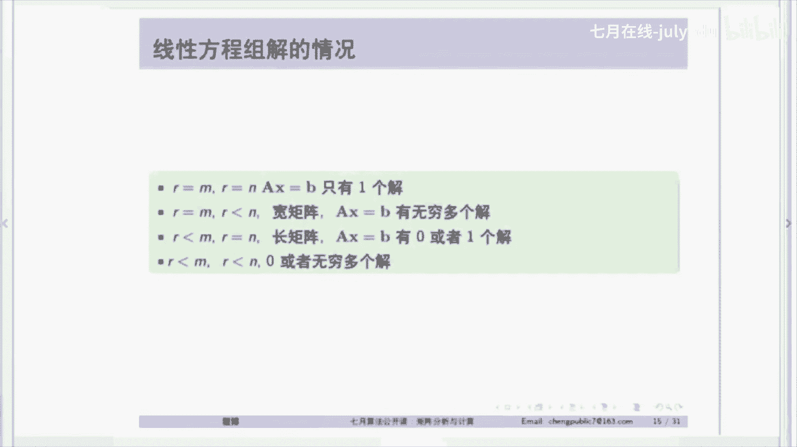

# 人工智能—机器学习中的数学（七月在线出品） - P7：矩阵基础的综述 - 七月在线-julyedu - BV1Vo4y1o7t1

我发现呢这个矩阵，还有那个图优化呢，对于我们这些学科，包括图像处理啊啊，机器学习啊都是非常非常有用的。它就相当于你要去建一个房子一样。他就相当于你的这个基础，对吗？如果你能把这个基础讲好。

这个掌握的很好的时候，你再看上面那些复杂的算法的时候，哎，你就能看得懂。否则如果你啊这些基础你都没有打好的情况下，你就贸然去看那些算法。你知道它是这样的一回事。但是你就不知道它是为什么。

你到最后你搞了半天呢，哎你也只能就是说把人家东西复制复制，你完全无法自己做创新，对吧？这是很重要的一点，所以呢今天呢我们就主要是来讲一下这个矩证和这个线性代数的一些基本的知识。

我相信我今天讲的这些东西呢，可能跟咱们以前对这些教材都不太一样。因为呢呃实话说，其实我当年读本科的时候呢，也上过这个线性代数，这个微积分大家肯定都上过，还不瞒大家说我当时记得我还考了满分。

但是说实话等到我读博士的时候，我发现。我当时学的那些东西，其实我并没有什么印象，就基本上都忘了。就考完试以后啊，我会做很多题。当时考试的时候，但是考完试以后，其实我觉得我对举证并没有真正的理解。

在我后面的这个不停的这种啊科研这些过程中，我才慢慢的发现这个矩阵啊，其实是一门非常优美的课。就是它优美在哪里了。我们待会后面再说。

然后呢大家从那个张贤达的那个矩阵分析应用的那本红宝书上也可以看到矩阵本质上其实还是很复杂的。而且随着现在这个发展，包括这些图像啊，机器学习的发展。它矩阵这门课的本身的这个理论也在不停的发展。

所以呢这里面其实有很多很多的东西，但是我觉得啊万变不离其宗，最关键的就是我们能够把矩阵的一些基本的东西能够搞懂。这样的话，你不管是看矩阵啊，以后的课程或者说再去看机器学习。

这些课程都会对你你就会感觉很轻松，相对轻松很多啊，所以这是我觉得矩阵的一个最重要的。所以我今天呢就是呃长话这个地方就不多说了，我们就主要分享一下啊，我当时我这么多年来呢，就是学习这个矩阵，也是我一是一。

是不停的在学习。那么通过学习的过程中呢，我对矩证是怎么理解的，好吧。好，我们现在就开始。那么我们今天主要是讲三个部分。第一是矩阵，第二线性代数的基础。第三是矩阵的特征分解。

那么呃我们大家看看这个矩阵本质上是个什么样的东西啊，你看啊我们现在矩证本比如说现在这样一个A矩阵，它是一个M乘N的矩阵，像这个矩阵，我们就是4乘3的一个矩阵啊，大家都知道。

其实当时我在网上看到一个段子啊，他们说矩阵是什么？有人告有人就是说矩证么简单，把这个12345678911112写在一起，然后拿个方括号括在一起，这不就举证嘛，对吧？很多人是这样说的啊。

其实这是一个就相当于非常非常粗粗略粗略的这种思考啊，其实矩阵并不能这样去想，我们再看一下这个向量啊，AX等于B。就是一个线性方程组，A是M乘NX是N。那么这样的一个矩阵成样这样一个向量等于一等于11。

这实际上就是一个线性方程组。那么我们现要来想想这个线性方程组，你有几种思考的方式。其实这个线性方程组本质上有三层的思考方式。我看大家能够理解到是现在就是有很多人可能已经忘了啊，能够理解到第几层。

第一层很简单，实际上就是线性方程组嘛，不是X减2Y等于13X加2Y等于11。那么你要解这个线性方程组，无非就是。实际上你把这个X减2Y等于一画在几何图形上画一条直线，3X加2Y等于11画一条直线。

不就是找这两条直线的交点嘛？所以说白了你从这个行的这个角度上来看，就是你从矩证这个行的这个角度上来看，它本质上就是求。两条直线的一个焦点非常简单，这实际上就是不是不是，这已经不是大学数学了。

这应该是我们初中数学应该讲的东西，对吧？那么但是第二层理解就不一样了，这就是矩阵往更深的里层去理解。那么X乘以1乘3，我们把一和3啊，就一和三写成一列-2和二写成一列。那一，然后它等于一和11。

大家看看这其实是什么？实际上是举着我们的另一种AX等于B的另一种思考，它实际上是列的线性组合。举证AX等于B本质上是。列的线性组合线性组合的系数是X和Y一和三是分别两列，这就是我们很重要的一点。看法。

那么第三层理解就不一样了。第三层理解我估计很多人他都已经忘了。他实际上是这个线性的这个我们说的这个矩阵的线性合并，就是像这个线性组合啊，它本质上可以构成一个子空间。

所以矩阵你应该上升到子空间的概念去看矩阵。这实际上是第三层理解。那么很多人可能这个地方没有。但是我们今天会把这个去讲一讲，看看是个什么样子啊。然后我们来看一下这个矩证乘法。

我要矩证乘法AM乘NB等于K乘N，大家这个大家肯定多少都是记得的，就C等于A乘以B，对吧？那么它的尾数就是M乘N乘以K乘以N，最后的尾数就是M乘N。比如下面这个矩证。

14153210相乘完以后就是7282。那么矩证乘法实际上有4种表示形式。我们当时学的时候，肯定是大家主要想的都是第一种就是实际上就是比如这个数字七是怎么来的。

就是矩证的第一行一4和呃矩证第B的第第一列31。相乘呗，就一乘3加上4乘1就等于7呗，这就是第一种内级表示，就是矩阵的第一行，就第一个矩证的第一行乘以第二个矩阵的第一列做内集，所以就是7，然后282。

大家可以算一下，就是这样的一个简单的形式，对吧？这是矩阵的第一种内级表示是我们线性代数书上的一个基本啊，这个这个大家我想信都会成。但是矩阵的第二种就是一种列的表示就不太一样了。我们看一下。

如果我把矩证B分成列的话，就31看成一列20看成一列。那么矩阵C就是7822，这是C。那么78它实际上是由什么构成的呢？它实际上是由矩证A1415乘以31构成的。也就说白了。矩证的C的每一列。

实际上都是A乘以B的每一列，对吧？这是A乘以B的每一某一列。那刚才我也说了，A乘以BI它实际上是什么呢？实际上是矩证A的线性组合。矩阵A的线性组合，它的系数是B啊。

所以可以说矩证C的每一列都是矩证A的线性组合构成的。这就是我们从成矩证的更高的角度去看这个东西。然后第三种表示呢是矩阵的行表示，矩阵的行表示什么意思？就矩阵。你你我们看那个矩阵C72。

它这一行它是应该是由什么构成的呢？它实际上是由矩证A的第一行14乘以矩证B。3210构成的这就是我们从行去看矩阵。那比如说82矩证C的82这一行，它实际上是我用这个荧光笔比较好。对，矩阵82这一行。

它际上就有矩阵A的15这一行乘以矩证B这一行得到了。对吧这是行表示，我相信这三种表示，可能大家都或多或少是知道的。但是第四种表示就比较有意思了。那么第四种表示实际上这个这个矩阵C。

它实际上是由矩阵A的第一列和矩阵B的第一行做什么，做外级就是A一乘以B一的转制。就是这两个矩阵，实际上它都是制为一的一个矩阵。但是我们做了外级以后，我们可以把它构成一个矩阵，这就是构成了一个更大的矩阵。

那么实际上就是这些矩阵制为一的这些矩阵的求和。你看我这个图上就标的很清楚。C呢是A一第一列乘以B一，就是B一的转制公呃，B一的转制，实际上就是就实际上就这一行72这呃这个32这一行。

那么AK呢实际上就是我们刚才所说的一样的45乘以一列这一行等于82。实际上这是矩阵乘法的四种形式，大家可以下面再去复习一下。然后我们现在看一下就是线性代数的基础啊，线性代数基础其实是很重要的。

因为你要其实你要把矩证搞得很熟的啊，线性代数它是它又是矩证的基础。那线性代数因为大家是都是在本科学的，很多人都忘了，我们在这里复习一下，如果一个限量级是线性无关的。

我们就说他们这个线性这个AJCJ求和以后等于0当界顶当CJ乘以一直CE一直到CN都是0。也就是说。你把这个A1AN，我们现在把它写成一个矩阵的话，它实际上就是AX等于0。那么只有X等于0。

才能使得AX等于0。也就是说没有其他的线性组合能够产生0。那么这一级向量呢，它实际上就是线性无关的。大家想想，这向量，它我们把它放在一起，它就是矩阵。是所以你向量和矩阵你要经常把它进行一些转化。

那么比如说现在像这个向量A等于那矩阵A等于A小A1A2A3，就是这样的一个。我们可以看一下，这个它的列就是线性无关的，又为没有其他的一些非零的系数，能够使它们的线性组合等于0。但是B就不是，因为B的呢。

这一列实际上就是这前面的这两列的线性组合。比如说这个乘以-1，这个乘以-2加起来就是-3。所以我们有可以找到C1到CN，使得它的系数为0，那么它就是这种向量的这一组向量它就是线性相关的对吧？好，呃。

我们线性相关这个地方，我们稍微讲完下一个的时候，我们就稍微呃大家提问一下啊。然后我们看一下这个悬度啊，这这个我忘了中文叫什么，反正英文就叫span呢说白了实际上就是这个AEAN这些线这些向量的线性组合。

我刚才一直在强调AX矩阵A乘以X，它就是矩阵A的每一列的线性组合，实际上你把这个AEAN写到一个矩阵里头，它实际上就是这些列的线性组合。那么这些线性组合我刚才所说了。

它就可以构成一个我们更高的第三种视角，就是子空间。那么AEAN的所有线性组合，我们就构成了一个子空间。就记住是所有的线性组合，不是一种线性组合，这个CG，你可以取实数域的任何数，它都可以构成一个子空间。

那么子空间实际上在严格的定义上可以满足下面两个条件。就是说V和W如果都是子空间的两个向量呢，它们的和也处于这个子空间。那么CV就是乘以一个系数呢，它也处于这个子空间。但是大家一定要记住。

就是子空间一定包含零向量。子空间一定包含零向量，就这个CG你也可以取零，那么它肯肯定可以构成一个子空间，但是这个子空间一定构成一个啊，一定包含零向量。所以我们在这里呢就稍微展停一下。

看看大家有没有什么疑问。我们对，现在进行到呃3分之1。现在大家应该可以自由说话。对啊，这个问题非常好，就是这个弦，我们这个span实际上是一个一个线性操作。我们对A1A2，它这是一个定义，实际上就是。

啊。啊，我刚才可能没听到这个sd A1A2，实际上就是A1A2的线性组合。它实际上就是说这是一个定义。spand A1A2实际上就是A1到A2一直到AN的线性组合就构成了子空间。

所以你可以认为这是一个操作，spen就叫做操作。哦，我看看题目啊，A1A2一直到AN就是一些N个向量，就是A1到AN的N个向量。然后看这个题目啊，就是A是M乘N矩证，B是K乘N。那么C为什么尾数是M啊。

这个地方写的有点问题，不对，这个地方应该是A是M乘K，然后B是K乘N，所以它是M乘N。对我们在这里面全部是列向量。CV是指V的啊前面乘一个V向量，前面乘以一个标量CV，那么它也在这个子空间里很正常。

比如说你有一个向量，现在三维空间里啊，它现在是个三维空间里，我乘以一个系数。无非就把这个向量给拉长或者缩短了嘛，它还是在这个空间里嘛，对不对？Y为何是M为？Y为何是M为？我看一下Y没有看到Y啊。对。

我们在这里头所定义的时候，我大家给大家解释一下，我们这些粗体定义的A1到AN，它都是向量。我们这个小的C这种这种鞋体的，我们都是标量。我们在这里头所有的都认为是列向量，行业上不说明的话，都是列向量。

那么如果行向量怎么表示呢？我们就写成A一的转制，这是行向量。那span实际上就是这些列向量。的所有线性组合。刚才我讲了，所有的线性组合，它就构成了一个子空间。那么这个span就和这个子空间是等价的。对。

RM是M为的一个向量。也如说你这个A1AN是个列向量，但是这个A一它有可能只有M长，所以它就是M为的列向量。啊，这个你截图很好，我刚才所说的这是矩阵的第二种视角。

矩阵的一行乘以一列是你之前学的矩阵的乘法，但是矩阵还可以用。这样的形式去表示就是列的线性组合，就AX乘以B可以用列的线性组合去表示。C是有角标的，这里头C是有角标的。C因为你可以C1乘以A1嘛。

加上C2乘以A2，加上C3乘以A3就等于S子空间。我看有没有笔啊，好像他这个上面好像没有笔，好像可以用的。我尽量用这个好了，用激光笔来好了。好，我们现在继续啊。那么我们现在看一下四个子空间啊。

刚才所说的子空间大家就想到是肯定就是某些向量的线性组合。就是某些限量向量的线性组合。比如说这个A现在这个矩阵是A是142033，那么它的span怎么写？实际上就是142033的所有的线性组合。

因为这个所有的线性组合是指X1和X2可以取任何实数。所以大家可以看一下，假如说。033这样的一个向，现在我们现在看这样的一个向量。我们这个列空间呢实际上就是142这样的一个向量和033这样的一个向量。

我们做线性组合，那么它肯定就构成了只构成了一个平面。大家想想这是一个三维空间。你在一个三维空间里，你这两个向量的线性组合。那么它只能构成一个平面，对不对？它实际上只是一个平面。那么这个平面大家记住。

它一定包含原点。如果在三维空间中不包含原点的平面，大家想想它肯定就不是子空间。因为它不包含原点，对吧？所以AX等于B本质上是什么？大家想想AS等于B本质上就是说这个方程有解的前提就是说B在A的列空间内。

你这个B向量一定在这个平面里。你不能跑到三维空间的其他地方去。如果你的B跑到三维空间的其他地方去，那么这个方程式肯定没解的。对不对？所以这时候。我们的B组合本质上就是X1和X啊。

就是142033的线性组合。你不是这个线性组合，你跑到其他地方去。那么他一定这个方程没有解。对不对？实际上是本质上就是这样的一个裂空间，列空间就是这个这个列空间和刚才那个悬度S span其实是一样的。

大家可以把这两个等价，我觉得没有关系，实际上就是142033的span嘛。对吧。为什么两个三维向量构成的是平面呢？你可以想象，你现在只有你你正常的三维空间，你要够这个空间，你要如果能够填满的话。

你是不是至少得要有三个向量？但你现在只有两个向量，你想想你能把一个空间填满吗？它只可能构成一个平面呀。大家想一想啊，这个地方稍微我想一想，我觉得这个地方大家能够理解清楚的话，今天是非常有收获的啊。对。

所以就是两个向量，你可以去想它所以这个为什么这个矩阵的质是二呢？因为它只有两个向线性无关的向量，这两个向量还是线性无关的，所以它构成一个平面。大家想想，如果这个0335现在变成142。

就这两个向量是一样的话，它能构成一个平面吗？它连平面都构不成，它只是构成了一个直线，对吧？这两个限量一定是线性无关的情况下，就是说他们不重不重合，不在一条线上的情况下，他们才能构成一个平面。

如果在一条线上的话，他们就只能构成一条直线，对不对？所以这就是这个里头大家理解清楚了以后就知道，如果142这个列也是142，那这个矩证的质是几啊，这个矩阵质只是一啊。

所以矩证的质就是它线性无关的这个最大的线性无关的这个列。三个向量一不一定能构成空间。我所说的142033，我现在加一个空加一个向量，142。如果142又第三个空，第三个向量又是142。

它不是跟第一个向量是一样的吗？他们就线性相关了呀，所以它就构不成一个平面啊啊啊构不成一个空间啊，它构成的是平面。一定对于这样的，我这个举的这个例子，一定是三个线性无关的向量能够构成一个空间。

这是才满的空间啊，就叫做我们叫做R3，对吧？我们叫做R3。好，那我们现在看看这个如果大家能够理解的话，我们看看下面一个啊。下面就是零空间，啥叫零空间？就是说我们现性方程组不是之前的是AX等于B嘛。

我们看到这样的一个线性方程组，AX等于0，它所有的解的集合就是叫做零空间。那我们先来看这个例子，AX等于B的解偶。我问大家能不能形成一个子空间？对于一般的BB不等于零的情况下。

那么答案是它不能形成一个子空间。为什么？我刚才所说子空间一定要包含原点000，那你AX等于B，它能可如果对于B。这个B任意取B的话，你X等于0。那这个左边是零，后面是B，它根本就不是子空间，对吧？

它就不相等，所以AX等于B通常情况下，它的解并不形成一个子空间，但是AX等于零的所有解，它就形成一个子空间。我们这个子空间呢我们把它定义成NA啊，大家看刚看一下我这个标识啊。

CA我所说的CA就是列的子空间C就表示collum就是列。那么。😡，NA呢实际上就是零空间，就是NA我们就说n就是零空间，它就是所有解的集合。那么我们看一下这个比如说我举个例子，我都都以数来举。

因为这种数学就确实比较抽象啊，我们尽可能的以这些数字来来看。比如说矩证A12243866。我们让AX等于假如说OAX等于0，我们要求一下X的解集合。那么怎么解呢？

实际上就是说大家我记得举证书上呃那个线性代数数上的一开始讲完行列式就开始求方程组的解，实际上就是说我们把它做一些高速消元，实际上是第一行乘以3啊乘以-3，然后加到第二行就得到12240204。

然后通过这个方程，我们就可以解的求得两个线性无关，注意是两个线性无关的向量。那么这个零空间大家看看是什么。实际上零空间实际上就是这个向量S1和S2S1是它的解，S2也是它的一个解。

是这两个特解的什么线性组合。我在这头又强调了一遍，是线性组合，所有的子空间都是某些向量的线性组合。是，而且是任意的线性组合。所以这个XS1S2呢，你要写它的零空间很简单。我前面写一个。

比如说写个写个写写个标量A，加上BS2，它的所有的线性组合，对吧？我们就是它的零空间，这就是它的一个AX等于零的一个解。注意这两个是线性无关的啊，这是这是个零控件。刚我们刚才学了一个一个是列空间。

现在学了一个零空间啊。对吧好，我们在这里头要不要答疑一下，看看大家有没有什么问题。就是这两个空间子空间大家有没有？刚才所所说的AXKB不是子空间。因为呃B如果不为零的时候，你那个这个子空间X这个解0。

不满足这个方程，而子空间一定要包含原点。子空间的几何意义。子空间的几何意义实际上就是一些线性，实际上就是一些向量，它能够张成的空间。就比如说像这个列空间。

实际上不就是142和033这两个向量所有的线性组合。那么就是它就所有线性组合所张成的一个空间。那么在这里头它就是表现成为一个平面呗。求子空间有什么用？非常有用。这个我在后面来说，非常有用。

因为如果你能理解到子空间的概念，实际上你就把线性代数啊基本上就是说一个重要的核心能够理解到，而不是光光去做了一些AX等于B，X等于零的这种题啊，这种是没有任何意义的，这种交给m labb去做就可以了。

关键你要理解这里面这个子空间这些概念。对。和先秦方程组的基础解析有什么？像像你这个就是像我们这个零空间，它不就是有两个特解嘛。那么AX等于B本质上是什么？实际上就是AX等于B这个这个的它的所谓的解呢。

实际上就是。它的一个特解就是能够满足这个方程的一个特解，加上它的零空间。里面的所有向量。因为这里头的这个这里面的所有的线性组合，它都能够使得得AX等于0。那么你再找到一个特解，使得AX等于B。

这两个加起来不就是AX等于B的所有的解吗。在第维。类比嘛，两个点的任意组合构成一个你我们你现在要想的时候都是要考虑向量。比如说你用三维空间这样的或者是二维空间这样去思考是最好的。你要用12两个点。

实际上就是一个直线了。你比如说你一个矩阵是两行一列的。😡，一个矩阵是两行一列的，就是1乘12。啊，就比如说一个横向量12，那这两个点是肯定是线息相关的嘛。他们因为他们在一条直线上呀。

S1和S2是怎么得来的？很简单，你现在不是得到U吗？然后你U这个地方你写成一个列列向量，就是因为它是U乘以X等于0，所以就X1X2X3X4。然后你就把这个这个写成一个线性方程组呗。写成线性方程组以后。

你让X3X4等于分别等于10和01，你就可以把X1和X2求出来，对吧？呃，子空间是不是坐标系，它大家想想我刚才所说的是个三维空间。但是你想想我们如果这个向量再往上扩，它不就是更高维的空间。

这时候你就没法拿图来画了，你就只能用三维空间去往上类比了。比如说我是现在这个向量长度是14260337。那么实际上这两个向量，它最后形成的是R几的一个子空间。大家想想是R4。注意不是R2的一个子空间。

是R4的一个子空间。因为它这个向量的长度是4，所以它形成的是个R4的子空间。你要想把R4这个子空间填满。那么它一定要需要4个线性无关的向量，对不对？如果你只有现在只有两个线性无关的向量。

你只能构成一个子空间。就说C是RM的子空间很简单，就说我所说的，它是像这个矩阵，它实际上是R3的一个子空间，并不是说是R2的一个子空间。你现在看的有两个向量，你以为是它是R2的子空间。

不是它是R3的一个子空间，对吧？NC是NA的子空间吗？为什么要写？C是什么东西啊？没有看到这个C表示的是列空间的字母。而那个NA表示的是零空间的这个这个东西。啊，当然我们不止这些这么多子空间。

就是说前面的我们有一个子空间的定义啊，但是那些子空间我觉得我在这公开课上就不去讲那么多了。因为那样的话，大家就会被很多东西误导了。我觉得你能把这个矩阵的这些子空间能够理解到。

再去考虑其他子空间就会很容易。而且在我们实际过程程中，大部分应用到的就是矩阵的这四个子空间啊。NA是个平面吗？NA是不是平面，你要看这个向量，像这个向量，它实际上就是这两个向量，当然你这个已经没法画了。

因为是个四维空间，对吧？它本身是个四维的，所以但是它实际上这两个向量的线性组合，它就就构成了一个什么，实际上就构成了一个子空间，对吧？但实际上就构成了一个子空间。CA是RM的子空间，我看一下啊。

那么实际上就是说CA是RM的子空间，就是你看你看这个向量，如果要求CA的子空间，那么CA是什么的子空间呢？它实际上是R3的？这个M因为是三嘛，N是2嘛，两三行两列嘛，所以它是R3的子空间。

并不是R2的一个子空间。明白吗？因为你你这有向量长度是3嘛，你要构成一个三维空间。好，那我们现在开始下一个啊，然后后面有问题我们再来回复。然后行刚才我们定义了两个空间啊，一个列空间，一个零空间。

那么还有一些空间叫做行空间，比如说CA的转制共轭啊，不是CA的转制。因为我老想到辅数，我们这个是实数啊，就是CA的转制。像比如说这个这个举阵。那么它的子空间是什么？实际上就是这些行。

你把这些12243866，你把它再写成列，就是相当于把这个矩阵转制一下，也就是1224和3866，这两个呃这两个向量的所有的线性组合，就构成了子空间，对不对？还有一个左邻空间。

我觉得是我们国内的教材是从来不讲的啊，像这个是很不好的。那么左零空间呢，实际上是刚才不是说有个零空间是有NA的。是零零空间嘛，那么NA你把它转制一下，变成行，那它不是还有一个零空间嘛。

也就是这个时候零空间什么意思？就A的转制乘以Y的所有的能够满足这个方程的所有的解的集合，就构成了一个左零空间。对，实际上你就把这个举矩证颠过来一下吧。我来总结一下啊，这个地方列空间CA。

零空间NA航空间CN的转置左零空间NA的转置。好。这时候我们来复习一些，还是有一些重要的关系啊，鸡。基向量是一直是指它能够张成这个子空间，而且是指这个子空间中任何最大线性无关的向量，它并不唯一。

我刚才一直强调这个向量是线性无关的，你比如说像这个矩阵A，我问一下大家的那个CA怎么写C实际上就是这些线量向量的所有的线性组合。我不管你这个向量是不是线性相关还是线性无关。

这就是CA但是这个它构成的这个子空间，它有一个最大的线性无关的向量。那么这个实际上只有这前两列，因为第三列实际上是前两列的线性组合，所以它这个子空间实际上就是由基上成的。你看到吗？

比如说这个子空间它有肯定有很多很多积啊，这很正常。但是它的基的个数。是唯一的。那么积的个数又等于什么呢？实际上就是等于矩证的质。最大线性无关组说的很好，它实际上就是R就最大限性无关组。制是什么意思啊？

实际上就是这里面最大的线性无关的向量，最大性无关的这个向量构成了什么和G呀？😡，他的基就是说反正你你这个矩阵在这里，我只要有这个基，我就能够把你这个空间给你张成。

我其实就根本要不了这么三个向量去粘张成你这个子空间，我要两个向量就够了，这就是基。所以由击我们就可以引入矩阵的质。矩阵的质呢实际上就是最大限性无关的行或列。我在这里头我只说列啊，因为行其实是一样的。

它只要做一下转制就可以了。所以矩阵的。A的转质的质和A是一样的，就行制等于劣质。对。A的第三个列，如何用第一和第二个列表示很简单呀。第三个列我这个一乘以100。再加上呃。啊。

这个里头好像是230是有一点问题啊，我这个符号这个地方写的有点问题，这个这个他他应该写的不对，这个地方就是这一列还不是这一列章程的这个子空间。因为呃刚才我这个举证写的有点问题。

就是这一列并不是他们的线性组合。因为你看啊你乘以一乘以一加起来第一个等于3。但是这个呢大家看加起来它是负3了，就不对。所以这一行正常应该写怎么写啊，我大家给从给大家重写一下，它实际上是3。30。

我写到这里啊，330。所以这个呢就不对啊，这个地方这个地方应该写成330才对。所以这样的话，你可以看到第三列实际上就是前两列的线性组合啊。对吧所以这个矩阵的制在这个矩阵，现在这样的写法，它的矩阵制是3。

但是我刚才现在重新改了，改成3330的这种情况下，它的矩阵的制就是2，所以行制就等于列质。对了。好，我们看一下这个子空间的这个维数啊，子空间的这个维数是什么意思啊？实际上就是子空间的维数。

就是CA这个子空间的维数，实际上就是大家想想CA子空间的维数，实际上就是A的质啊。就是R小R，我写的数字，就是写写在这里啊。如果它是小R的话，那么它零空间的尾数呢？

实际上就是这个零空间的线性无最大的线性无关的限量向量的个数，它们俩加起来就等于N。就是我们现在这个所有的矩阵都是M乘N的一个矩阵。我在这头标的时候，所有的矩阵都是M乘N。那么如果CA的尾数是R。

就是它这个矩阵质是R的话，它的零空间的质就是N减R。那么这头我也也就标的很清楚了。对，就是它的尾数，所以所说的尾数就是矩阵的质啊。那么实际上CA又是什么？就是这些列的线性物这些列的所有的线性组合呗。

那么他因为有两个线性最大的线性无关的列。如果把它改成330的话，它只有两个，所以它的质就是2呗。对，所以如果当。矩阵的质等于M就等于行的行数的时候，它就是行满值。当等于列数的时候，它就实际上是列满值啊。

这样是矩证的一个一个关键的一个点。这是质。那么我刚才讲不是讲了四个字空间吗？大家想想你这四个子宫间，它肯定能够构成一些图形啊。实际上这个这幅幅图，我认为啊是线性代数最最最漂亮的一幅图。

但这幅图没没有画完。因为如果你要把它画完以后，还有把这个方程组的解都可以结合在一起，它就能够构成一个完整的一幅图啊，这幅图我相信在我们中文的任何一一个教材上都是不会讲的啊。我们再来看一下。

刚开又是我们最先讲了一个列空间，对吧？就是矩证AX的所有的线性组合AX就实际上就AX我们把它标记成CA，它的尾数是R，就是它的质是R。那么我们又讲了一个他的零零空空间。AX等于0。我们又讲了一个零空间。

对吧？那么这个零空间的尾数呢是N减R。那么实际上这个零空间呢又是这个行空间，我们还讲了一两个两个空间，一个是行空间，一个是左零空间，对吧？实际上我们从这边R先来看，如果矩阵的列空间呢，它的尾数是R的话。

那么另一半。它的左邻空间，它的尾数就是M减2。大家去可以去下面去看啊，而且这两个。空间。何在。普间啊它占了一部分，它占了一部分，所以合在一起。

它俩就是一个完整的一个空间RM就是这里如果有个向量在这里头有个向量在这里头，我把这两个向量再做一下线性任意的线性组合，我就可以构成RM中的一个向量。RM和这个零空间和列空间，它俩是相对的啊。

它们只是有一个维数关系啊。他实际上是零空间要和它的航空间对在一起，为什么？你看啊你AX等于0是指能够使得有一个X，使得AX等于0。那么你的行空间呢实际上就是说因为你AX，你可以看成A的每一行。

某第一行乘以X等于0。A的第二行乘以X等于0。对吧这是A的。从行的看度看出，然后它的这个行空间的这个定义呢是A的每一行的线性组合。A的每一行的线性组合，所有行的线性组合。对不对？

所以这个A的行的线性组合和这个零空间呢正好就构成了一个RN的，它俩所每一个都是子空间，合在一起就是RN。大家去想一想这个问题啊，而且这两个子空间还不只是这么简单的关系。这幅图更妙的是。

这个大家看这个夹角，这两个子空间的夹角实际上就是嗯。90度啊。90度为啥是90度呢？你A乘以Y的所有线性组合构成一个空间，你的零空间是能够使它这些基组这些AX等于0。

你AX不就是每一行乘以一个向量等于0吗？大家看看这不就正好是90度嘛，垂直的这地方是比较抽象。但是如果你能把这幅图真真切切的理解到，那么你线性代数。很大一部分你就搞通了。

这个地方我觉得一下子让大家完完全全讲懂是有点困难。但是大家记得有这样的一个印象的一个图啊，然后我们的列空间一样的是AAI。所有的线令组合。那么左邻空间呢实际上是A转制乘以Y等于0，实际上就是一个矩阵。

A，你把它做一下转制，然后能够构成这样的一个四个字空间。啊，所以再再说一遍，矩阵的列空间和它的左邻空间。他俩的尾数加在一起就是M，它的数是R，它的尾数是M减R，合在一起就是M。这个它的行空间。

它的尾数是R，它的零空间，它的尾数是N减R合在一起，它构成RN的一个子空间。这个图报。啊，理解的时候，大家去就可以把那个矩证拿出来自己去去翻导翻导啊，这个图就会稍微好好理解很多啊。

我觉得相对啊这个下来我觉得大家再花点时间在这上面再去好好想想。因为这个时间有限。我觉得如果你能把这幅图理解到了，你很多东西就能够掌握。比如说。我现在比如说有一个向量在RM。

那么我就可以把它分解分解成一个向量，在列空间内，一个向量在它的左邻空间内。这实际上就是干干什么呢？在做投影啊。这个其实是很重要的一点，就一个向量。那我在RM空间中的，我既不在你这个空间中。

也不在你这个空间中。那我但是我可以把它分解成这两个空间中的向量组合呀。维数是什么？尾数是这个向量的最大的限性无关的向量的个数。也就是这个这个空间的质啊，就是啊从从矩证角度上来说，就是这个矩阵的质啊。

这个地方大家再去想一想啊，然后我们再再找找下一页的时候，我们把这页讲完以后稍微。评论一下，大家答一下疑啊，就说这个线性方程组的解啊，就很多人学完了以后也搞不懂，反正这个AX等于B到底是有解还是没解。

反正学完了以后，其实是一堆浆糊啊。但是我们总结一下，就说当一个矩阵如果是方阵的话。R等于M，就是它的质是M行制等于列质，正好一个方质，它是满制的矩阵。那么AXB只有一个解。

因为这时候矩证A可逆两边乘以A逆，我们就可以得到这个解。而且为什么这个方程？B一定有解，首先它为什么有解呢？因为你这个就相当于一个3乘3的一个矩阵。如果它的质是3，就说明这三个向量是线性无关的。

那你这三个线性无关的向量，你显然显然可以。构成什么构成一个整个的三维空间。那你这个B向量是在三维空间中，你不管你做，不管你拿任何一个向量来，我都能找到一个线性组合，使得AXA于B。这就是矩阵满制。

它的这个它的意思，它就它的向它的列都是线性无关的。那么还有一种矩阵，它实际上是宽矩阵，就R等于MR小于N的情况下，它实际上是一个宽的矩阵。就是这样的，就是这样的，我们将胖的一个就是这种胖矩阵啊。

我们常常说，那么这种方程它一定有无穷多的解。因为我刚才所说的它的零空间的尾数，实际上是N减RN减R是N减M也就AX等于0。首先AX等于0，它就有无穷多个解，因为它是这些这些这些解的线性组合嘛。

它就零空间它就有维数啊，它就有无穷多个解，那么AX等于B的解。我刚才所说是什么呢？是它的一个特解，加上零空间的所有的解，那么当然有无穷多个解。可能刚才有的地方是讲的不对啊，尾数和矩阵的质不等啊。

这个地方不对啊，有的地方呃我看尾数和矩阵的质部等。呃。不对，如果你比如说像CA啊，就刚才所说的这个列空间的尾数啊，列空间的维数本质上实际上就是把这些把这些列全部写成一个矩阵的，等于这个矩阵的质啊。

尾数实际上就是这个。它的这个最大的线性无关的向量的个数啊就是质啊。所以我这个地方写成D码，实际上就是rank A，就是A的质，实际上就是啊。大家再去想理解一下啊，然后长矩阵就是R小于M。

R等于N就是这样的一个长的矩阵啊。那么这种AX等于B有零或一个解。我在这个地方，我把这个地方稍微给大家解释一下啊。这种长的这个矩阵啊。首先就是很很好理解。你可以看啊，像这种举阵。

比如像像我看啊像这种矩阵，像像这这两个向量构成的一个矩阵。那么如果我把它写成一个向量，写成AX等于。B的情况下，我刚才所说，如果这个B根本就不在你这两个向量章程的空间内，章程的子空间内，那完全有可能呀。

因为这个它它俩构成的向量只是R4的一个子空间。你现在有个向量可能在R4的另一个方向就不在这个子空间内。那么这时候这个方程显然它就没解。对不对？他显然就是没减。如果它有解的话，它一定有一个解，很简单。

那就是个B，它在这个A的这个子空间内，A的列向量章程的子空间内，那么它就一定有一个解。就像我刚才所说的三维空间中，有一个向量，它正好是在那个一个平面上，就在刚才那两个向量章程的平面上。

那么这个方程是一定有解的？那么这头就有个问题，为什么会引入最小二程，我给大家解解释，就是我们在在做图像做很多里面都有最小二程，它无非实际上就是这个矩阵，这个B啊不在AX章程的空间内嘛。

它跑到其它它在它在一个比如说在R4的一个空间内，它并不是在R4的一个子空间内。那么这时候我们要找一个离这个解。就是离这个找到一个解，离B距离最近。找到一个解离距离最近，这就叫做最小二成。

B你现在AX等于B，我说了，它有解或者有零解或者一个解啊，好，我今天运气好，我这个B是吧，给你了一个B，它正好在这个子空间内，那我们就马上就把这个一个解就找到了，对吧？找到了。那现在还有一个呢。

这个B不在这个空间内啊。比如这个图。这两个列构成的向量。啊，这两个列构成向量，这个B现在在这个子空间内，现在我这个B跑这来了。大家看。那么你能找到解吗？显然你肯定找不到解呀，但是我们为什么要最小二成呢？

那么我们实际过程中不可能让你永远AX能等于B吧，就是你个B永远在你这个空间内。所以我们要找到这个空间内呢，找到一个解，在这个空间内找到一个解，使它的距离和这个B，最后AX等于B的距离最小。

这就叫做最小二程。那么这里头要用的什么东西呢？就是用到投影。实际上我把这个向量B投影下来，我就一定能够找到这个题。大家再去想想这个问题啊，这个我觉得从这个问题其实可以想到很多问题。

AX等于B有没有有零解或者一个解啊，这实际上就是把这个最小二承同了。第一种，我相信大家在现行段时候都可以看到嘛，就很简单，3乘3。这些这三个列都是线性无关的那管你给我什么B呢。

那肯定他都都都只有一个解啊，因为A是可逆的嘛，然后B肯定又在AX这个章程这个空间内嘛。大家想一想，还有一种情况下，这个地方可能没写啊，就R小于M。R小于M。这种情况很少很很少见。那么这种AXB呢。

它要么就没解，要么就有无穷逻辑啊，这种大家可以自己根据前三种总结一下就可以得到。我在这头暂停一下，看看大家有什么问题。就是说我今天的想法就是我不求大家能够把这个完全听得懂啊。

因为大家有的时候就前面都忘了，但是我希望大家从今天开始听完这个课以后，能够以子空间的观点去理解矩阵。而不是说我们把一堆数括起来，加个括号就叫做矩阵啊。这种是太浅显的理解了啊，我们要以第一层理解。

就是一个AX，就是就是一就相当于一个矩阵乘一个向量，就等于一个数呗。第二层理解。是矩阵列的线性组合。第三种理解是这些线性组合，它就构成了一些子空间啊。那我么实际上就构成从子空间的观点上去理解方程组的解。

就会更容易去理解啊。长举阵的时候有一个解，有一个解的时候不懂，很简单呀。长举站，我现在这是不是长举站？😡，这就是长矩证嘛，142033。那我现在有个矩阵，有个向量B就在他俩章程的空间内。

那这个方程不是肯定有解吗？这个比如说B就是它俩的列的向性组合。你这举个一这取个一，我得到一个B，那我的解是什么？不就X等于一，X2等于一吗？能把解理清该子空间的一个点吗？这个解的本质上是什么？

实际上就是这个列的线性组合的系数啊，就是你这两个向量用什么系数去合并得到这个解啊，得到B啊，只要你这个B在这个空在这个平面内，我总可以肯定能找到一个什么系数，能够让你等于B吧。

但是大家想想我这个B如果不在这个二维空间的啊，这个平面上呢，我这个B跑到这个三维空间往上走呢。你能找到姐吗？你能找到它的线性组合，使它使它的吗？能够等于B吗？那不可能啊，因为这两个是线性无关的嘛。

它它俩能够张成的子空间，就只能是个二维平面，它张不成三维空间呢。好吧，呃，如果没什么问题，我们因为时间有限，我们再往下走一走啊。后面的就比较简单了。就后面的就是我说实在的。

也无非就是把那些书上的拿过来去给大家讲一讲。但是前面的这些东西，如果你能把这些透彻的理解到，我觉得呃肯定是受益匪浅的。那这个方程就很简单了。比如说矩证可逆和不可逆。那矩证可逆，实际上就是AX等于0。

它只有零解呗。说白了就是A一这些矩证的所有的列项量都线性无关。那么他就只有零解。那么矩阵可逆呢，实际上它有一些公式就A乘以A逆等于IA乘以B的逆，这些都是一些线性代数常见的公式啊，我就不多讲了。

大家可以看一下啊，这是矩阵的逆，那矩阵逆啥意思？就是A乘以A逆等于单位正呗。那举阵例，你要理解到这一点，就是它的列向量一定是线性无关啊。在这里头我们说的是方正啊，是这个地方写的写的标号错的啊。

这是M乘M这个地方所以是A一一直到AM线性无关。行列是。定义大家去看一下书啊，我就不说了，因为那个鞋线还比较长。啊，它的行列式有一些公式，比如说行A乘以B的行列式是A的行列式乘以B的行列式。

它的转制两边取行列式，它是相等的。如果乘一个系数呢，它要提一个M次方出来。因为行列式一定针对的是方正啊。那么如果举证可逆，就说明它的行列式应该是什么？等于零，对吧？那么如果举证可逆。

它的这个行逆的行列式实际上就是行列式取导数。那么如果举证B可逆的话，它的行列式这样的一个行列是B逆AB实际上就是A等于德taA就是A的行列式，这个很好证明啊，你把这个把上面这个式子拿下来。

然后把这两个结合起来，就可以得到这个式子，很简单啊。然后矢量的范数啊范数实际上就是说我如个比如说FX这个这样的一个函数，它首先它是大于等于零的，它一定是正数正。要么是等于零，要么是大于0。

然后当气紧当X等于零的时候，可逆等于0，可逆等于0。我看一下啊，可逆对行列式就等于0可逆它的行列式等于0啊，你去大家去看看它的行列式的定义是什么。对。对，这个地方是对的啊，可逆以行列是是等于0。哎。

我看看不对。啊，不对不对，这个地方写错了，这个地方写错了，不好意思，可逆行列是不等于0。为什么？如果可A可逆行列是等于零，那就完蛋了。你看啊，你你这个地方取取成零，那个不就成无穷大了吗？啊。

所以它这个地方一定是行列是不等于0啊，对，行列是不等于0，非常好。这个地方我我我写错了。然后我们先看一下向量的范数啊。向量范数就说实际上是第一个大于等于0，第二个X等于0，它FX等于0。

第三个三角不等式。也就是说你从向量的角度上来说，不就是三角形两边之和大于第三边嘛。然后这个地方如果它前面有个系数的话，它就取出来，它就因为是正的嘛，它就说取绝对值。

那么矢量范数本质上是用来测量一个矢量的长度啊。那么实际上就有这样的几个范数，比如说二反数，二反数就是它的所有的元素平方取何开根号，那么就可以写成它内极的形式，就是X转制乘以X求内级，然后开根号啊。

比较简单。一反数什么意思？一反数是说矩证所有的元素的绝对值求和。无穷大范数呢是它里面所有的元素的绝对值求一个最大的出来。P范数呢是这样定义的。那么这个P范数呢必须要P大于等于一。如果P小于一的话。

那么大家可以证明它不满足这个三角不等式啊，所以它就不是一个反数啊，就一定要满足这样的四个条件的。它才能叫做范数啊，这个范数有啥用啊？其实就是说呃我们我不知道群里面有可能有人做图像里面图像处理。

比如说做这个稀疏sse codinging的这些，我们要用到这些压缩感知的这些性质啊，对，要用到压缩感知这些性质的时候。数啊，它实际上就是零范数。举证的零反数，它实际上并不是一个反数啊。

这个也他不定为不满足3那其他这几个条件，它不是它的零反数呢。实际上就是它的非定员的个数。那么这样的一个东西呢，它本质哈你要在做这个spas codinging啊，这个压缩感知里面呢。

它不是根本它就不是to的to函数。所以呢我们经常呢把它relax就是。嗯，一反数。这时候这个这个函数呢，它就是一个凸函数。那么我们就可以用凸优化来解。那么呃这个在压缩板值里在某些条件下啊。

满足某些条件下，它这个零范数的约束和一范数的约束下面求得解。是相同的。所以这就是压缩感知，为什么一下子流行起来的东西啊，就是一范数和零范数这样的一个一个关系啊，这头这个地方我就不做多说了。

大家可以看看压缩感知的上面的一些关系。还有。矢量的内集，这个就很简单了。刚才所说的就是Y的转值乘以X。那么如果X和Y这挑。那么它的内积就是零呗，那垂直嘛不就等于0。如果它平行的话。

那么他们实际上就是他们俩的长度乘积，要么取正，要么取负。因为它有有可能要么是零度，要么180度呗反方向。那么它的夹角呢实际上就是这样定义的，就Y转制乘以X，然后除以它们的向量的模取反的cosine。

对吧？如果正交，那么就是正-2分之派。啊，问我做这个晚点回复啊啊，XY平行的话，那么就是C等于00得到正正派。对我我的主要是现在在做压缩感知啊，这个以及后面的这个机续学习这些这些关系啊，贝叶斯这些啊。

然后科西需这个科西这个叫虚瓦茨不等是吧，应该翻译过来，我忘了啊，然后它就叫做实际上就是X乘以Y的这个它的它的绝对值小于等于X的二分数乘以Y的二分数啊。当前的X等于F2Y。对。

然后这是还有一个叫house holder不等式，也是这样的一个形式。大家可以看一下这个在信息代数书上都有这些东西我就不写证明了。因为我觉得。你直直直去看，你完全能够看得懂的，而且也没有别特别太大意义。

对，然后就比较简单这些东西。那么这一块我们讲完了呢，就第一部分我觉得很重要非常重要。如果你能把这些子空间，这各个方面的，尤其这几个子空间，四个子空间的他们的构成，他们是不是正交的。

以及这个方程组是不是有几你能够融汇贯通的话，我觉得你线性代数，至少线性代数啊就过关了。就是现的过关了。如果你妈这一层没有理解到啊，我觉得你这个线这往上堆，无非就只是往上堆砌啊。

并没有学到这个跟随啊根本啊。因为矩阵还很复杂。我现在讲的并不是完全是矩阵，因为矩阵本质上还需要各种各样的分解。就在这头我今天讲一个是分解特征分解。其实矩阵更重要的分解其值分解，是在哪都能够用得到的啊。

无论图像处理还是哪到处都可以用得到的其其其极值分解。但是这些分解实际上质上都可以和这个子空间联联合在一起，这样连在一起就能够构成一个很好的很大的P。包括我刚才所说的这个这个空间啊，我没有画完。

因为现在只画了很简单的一部分。如果你在想我把那个AX等于B这个方程组的这些解连在一起的时候，我就可以在里头画出各种各样的投影。然后这个解从这边对应到这边，还是从这边对应到这边。

就能够完完全全把信性代数整个相当于全部拉通啊。这个是非常有意思的东西。但是这个因为要到后面把整个矩阵全部讲完，才能把这个P全部跑完。所以这个只是一个非常小的一个子图啊。

现在但是这一点就需要大家花很多力气去去思考去理解啊。因为是是有点难，因为我们现息代书上我都忘了，他讲了没，我都没印象了，反正我当时肯定是没懂。然后我们看一下这个矩阵的特征值和特特征特征值和特征向量啊。

矩阵特征值特征向量我觉得大家可能都能记得到是啥玩意啊，就是AX等于 lambmbdaX但是AX等于 lambdaX反正我当时我印象中我就背了一个这个公式。

AX等于 lambdaX然后怎么去求特征值特征向量给给给我一个具体的矩阵A啊，我把它特征值特征向量求出来不行了嘛？这个这个考试就过了呀。但是当时没理解的这个玩意儿是在干嘛啊。

这个AX等于 lambdaX，像这个矩阵实际上最早的这个特征值特征向量啊是干嘛的，是求矩阵的逆就是它的密，比如说矩阵现在矩阵是A啊，现在这个矩阵还比较小。假如这矩阵是100乘100维的。

我要求A的100次方，比如矩阵A连乘100次。你怎么求？😡，你计算机去求吗？就就一一直这样沉下去，这个复杂度就会。就会很多。对啊，这个地方肯定写的有点问题啊。这个有些可能标注的时候写的问题。没事。

待会给大家讲，那么这时候呢，实际上就引入了特征值与特征向量。我们看一下特征值啊，这个例子我把它去掉。假如说对于这个矩证A4114乘以1010，实际上这个销量是在这里。那么AX乘A乘以X1呢。

一种组一种理解是什么？是A的线性组合是吧？还有一种组合理解是我觉得现在可以用第四种理解来理解AX吧，实际上是对X一做一个旋转。AX也就说A乘以X1，如果我沉了以后，我做了一些旋转啊。

它可能在这头这个图不是很清楚，因为比较小，就是说AX1A乘以X1后旋转以后得到这个向量是41。如果这个旋转的这个向量和你原先的这个向量是平行的。那么满足这种条件呢就是特征值和特征向量。我再说一遍啊。

A乘以一个向量，对这个向量在这个空在这个空间中进行旋转。旋转以后和这个向量还保持平行。这转了一圈又转回去了。😡，还在平行，只是它前面做了一个标量，等于 lamb姆da，它可能有有那个长度上的伸缩。

但是它的角度是完全一样的。这种时候就是求得的东西就是特征值和特征向量。AX等于 lambmbdaX。比如像这个刚这个例子有问题，我就不讲了，比如像这个X3。A乘以。向量一1这样的一个向量。

A乘以X3乘完以后是5倍的1乘以1。实际上不是还是原来的向量吗？因为对原来向量做了一个5倍的伸缩拉拉往上伸了，或者往下往下降了呗。这就是特征值与特征向量的本质啊，就干这样的一个事情。你能从几何上理解。

其实是最好的。其实空间这东西说实在的，用那些数学理解是比较抽象的啊。你能不能用几何理解的话，是就对这个事物的理解后会更深一点。我们看一下这个特征是实特性向量，它最主要有什么用啊？

就如果AS等于 lamb姆daX就刚才所说的转了一圈，还是原来的向量的伸缩。那么。这个拉mber就称为它的特征值。那么X就成为它的特征向量。假如说A是矩证N乘N的，那么它肯定有N个特征值。

但这特征值不一定是完全不同的啊，还有N个特征向相应的N个特征向量。那么怎么求呢？实际上就是A减去兰姆daIX等于0。那么这个方程组，因为你要让它有非零解，你就必须让刚才我我那个行列式那个地方。

我就就说错了啊，实际上这时候应该是它等于0。如果它可逆的话，它是应该不等于0。那现在我就是要让它不可逆奇E的。这样它才有非零解。所以。德塔A减兰姆达I就等于0。啊，实际上是这样的一个东西。

那么你就求解这个方程，就能把lam姆daX怎么求大家去翻一下现性代日书啊，那个那上面的例子多的很，我我主要是讲一些概念，我觉得计算计算并不是主要的啊，因为mat一个命令就出来了。那么有几个性质。

如果AXI等于姆daXI它有N个特征值和特征向量。这个地方应该是拉姆达I，我少写了，如果它的所有的特征值都不相同的话，那么可以证明它的这些特征向量是线性无关的。特定向量是线性无关的。

那么此时A可以被对角化为这样的形式。因为线性无关，V呢实际上就是这个X1X2N的这些特征向量构成的矩阵。那么这些特，它既然是线性无关，它就可逆了。所以你把这个A呢就可以进行对角化。

就是V乘以兰姆达乘以V乘以逆。好，现在大家想一想，如果这时候我要算A的100次方。如果能对角化的话，A的100次方。你们算这个玩意儿怎么怎么解？就说这时候你还能你还需要蛮力去算吗？不需要蛮力去算了呀。

因为你如果一旦对角化了以后，这些V逆乘以V这些不是都都都都都全部都消光了嘛，那最后就变成了V。中间的lam姆da的100次方乘以V嘛？啊，中间兰姆da是什么？它是它的特征值啊，它是个对角矩阵。

不就是它的对角圆的100次方吗？所以A的100次方马上就算出来了，你需要把A乘100次方，没必要啊，对吧？这是这是它一个它最牵引中的一个很小的例子。但实际过程中这个特征是非常有用的。

因为它可以和这个子空间联合在一起。就不是这么简单了啊，只是我说这是它的一个用处。A的100次方可以很快算啊。那么如果这时候最主要的特征值和特征向量的时候。

最主要的就是我们要求一个对称矩阵的特征值和特征向量。我大家解释一下为啥要求对称值矩阵。如果对称矩阵的特征值，首先它全部是实数，你可以证明，因为特征值啊，它有可能是负数。比如说你求出来的那个方程。

 lamb姆da的平方等于-一，它求出来它实际上就是负数啊。它实际上就是负数。那么这时候呢，它这个对称矩阵呢，它的特征值就是实数。我我现在问大家，如果反对称矩阵，也就是说A的转质等于负A。

它的特征值是什么数？大家想想，对，是全的纯负数，纯虚数，好像不是负数，是纯虚数。好了，你大家去想一想，如果在这两个矩阵之间的那些矩阵呢，就有些矩阵既不是对称的。也不是反对称的啊。

那你矩阵就相当于在这两个矩阵之间的这些数，它实际上就是很多都是负数啊。所以我们对这些矩阵并不喜欢，说白了我们并不喜欢。那要么我们就喜欢它纯纯实数，要么就是纯复数。这会就给我们做运算带来很多好处。

你你要来了一堆又有负数，又有实数的这种东西，其实是很不好的。我们并不喜欢啊。但还还还好，我们在实际应用的中的时候，我们经常要求一些比如说一些数据的斜方差矩阵，那么它的斜方差矩阵一定是对称矩阵。

所以它的特征值都是实数。而且如果这个对称值对称矩阵，特征值如果都不同的话，那么它的特征向量不仅是线性无关的，而且是正交的。所以你这个分解就可以变成这样的一个形式，非常好。这个U就变成了一个正交矩战。

这个分解就非常好。特征值不仅是实的，它的特征向量构成了这个U，而且是正交的，构成了一个正交矩阵。然后这个是它的特征值的一些特性啊，我就不说了，它的A的行列是实际上是特征值的乘积。

它的A的G就是它的所有的对角圆相加，是特征值的求和。对，逆矩阵就是转质，为什么？因为是U矩阵，U矩阵就是正交矩阵，就是U的转质乘以以U等于单位阵。那么这时候可以看到，实际上U转制就是U的逆，对吧？

正交矩阵的性质啊，正交矩阵。那正交矩阵你就不需要求逆了呀，就求逆的时候很简单啊，你把转质一下就是逆U矩阵，有所谓有矩阵呢，就是说它是负数的时候，我们把它称为U矩阵。那么这个T呢就改成H就叫it转制。

我们在这头为了简单一点啊，大家讲就全部讲实数啊，就不讲辅数啊，其实在我们实际过程中，大家一定要嗯我反正在我所用的时候，绝大部分都是负数啊，这样的话就是运算起来更更方便一点。那么对称矩阵还有一个特性。

我刚才所说了，对称矩阵，如果它的它的特征值全部是实实的实数，没有负数。那么如果A是一个十对称矩阵，那么它的质如果是R，那R肯定要比N假如说小的话，那么你可以证明它一定有R个非零的特征值。

以及N减R个零特征值。这个可以证明啊，但是大家可以想一下这个你首先就是实的呗，然后你的质又是R，那你肯定有R个正的是啊，不是不叫正的R个非零的特征值和和N减R个零特征值，然后你把这些特征值还能排序一下。

对吧？用绝对值排序去，就变成这样的一个形式。R个N减R个啊，就是这样。那么特征分解就可以重写成这样的一个形式。我把这个U，因为现在是正交矩阵嘛，就是这个A如果是对称的时候，它是正角矩阵。

我就可以分解成U1U2。啊，对焦矩阵我也把它拆开，就按R这样去给它拆开，就这个前面取前R列U的前R列构成U1U2的U2是U的，后面NN减R列，就构成了U2。然后我们把这个就可以拆成这样的一个形式，对吧？

这是特征分解，就按这个矩阵分解去把它拆一下，那么我们现在来联系一下前面讲到的列空间。因为你把这个特征空间搞完了以后，特征值特征向量搞完了以后。

很多人在就可能会想这个玩意儿跟那个特征不是跟那个四个子空间又有啥关系，对吧？因为我说了四个子空间是根本，如果你能把四个子空间理解到了，你再把这些联系理解到的话，那本本质上你就搞搞懂了啊。

实际上这时候你看A的列空间，不就是Y等于AX嘛，是指A的列的所有的线性组合，对吧？就是A的列空间，你把这个X是任意的啊，那么AX就用这个特征分解，把它。沉上去。

刚才我不知这个这个这个这个这个地方我不是已经已经拆开了吗？然后把它乘上去乘上去以后就得到这个式子。然后U一的转质乘以X就把它写成C1。我刚才所说的矩阵你还可以用行的视角去看它呀。矩证相乘。

你可以实际上这个就是U一的转制乘以XU2的转制乘以X，你不是简单的就是一行乘以一列那个那是最基本的思考方法啊，然后这里头呢就是实际上可以得到C1和C2它都是两个向量啊。

然后我们再乘一乘这后面就做一下运算，实际上最终就变成了U一乘以兰姆da一C1加上U2乘以 lamb姆da2加C2而刚才所说的这个兰da二实际上全部是零特征值。刚才如果说它质是R的话。

矩证的质如果是R的话，那么这些全部是零了，后面这这一部分全部都是零的，所以这时候你可以马上得到兰姆da一乘以C1，它又是一个向量，就实际上还是任意一个向量。因为我这个C1C2是任意取的嘛，X是任意取的。

所以本质上C是什么？从特征分解的角度上来说，A的列空间实际上是U一的列。空间。特征分解的以后，有矩阵的前前而列的。构成的空间。因为这个U一啊，它是正交的，实际上这个是一个正交矩战，对吧？

刚才所说它正交矩战，它前而列一定是线性无关的。前而列一定是线性无关的。因为正交一定是牵线性无关的啊。这个就不用说了，你想你那些向量都是乘90度的，你怎么可能线息相关的，对吧？

那么CA就实际上等于CUE啊。这样我们就把子空间给联系起来了。就是如果你对矩阵A做一下这个这个herit矩阵啊，不是不是不是叫对称矩阵，对称矩阵，等就是实的。如果做它对它做特征分解的话。

那么A的原始的列空间实际上是U一的列空间。林特这边没有印象，因为这下就直接消掉了。这个是对角曲线是全零乘以C2就等于0，所以AX就等于U1乘以。前面这部分。那前面就是这个是向任意的向来啊。

所以最后的结果不就是C等于COU1吗？那实际上你就简化了呀。我们不就是要求它的这个列空间吗？因为有的时候求列空间的时候不太好求的时候，我们把它做一下分解，这样就简化了。说白了根本质然上就是简化了。

因为你这个A，它的质是R，它本质上只有R个线性无关的向量，小R个线性无关的向量。那你你把它这个承在一起去算它这个空间，没有这样简单。因为这个U一它的质本身就是R。就一下子你就得到了CA等于CUE了。

我们就把这个空列空间给联系起来了。同理大家可以证明零空间是指AX等于零的零空间，那么就可以得到这一部分U2实际上就是零空间的正交积压，说白了NA是怎么构成的？实际上是由U2的。

所有的线性组合就构成成了它的正焦机。这就是它的这就是NA怎么来的？实际上是U2的这些所有列的线性组合。所谓的这些子空间。我所说了一定是一堆什么什么向量，线性无关的向量或者线性相关的向量做了线性组合。

但是我们希望它是基基就是说这个这玩意儿这个线性无关这个向量呢，多一个不多少一个不少，刚好多一个，它就线性相关了。少一个，你这空间张不成。那么正好这个子空间呢就是由U2来构成的。

所以这就是这个这个里面大家仔细可以去理解一下。利空间对列空间就是我们的值域空间，叫range。在在在英文里头叫range。这里头我不做区分。我个人认为啊，如果你能把举折理解到这些rangepan。

See。A。都是等价的，无非你就把这个A拆成一些向量嘛，它就构成rangepan C都是一样的。那么这些空间的尾数是什么？都是矩证的A的质啊。这样你就可以打通了啊。那么内集还有几个最后的几个关啊。

这个这个好像我截图的时候截的有点问题啊，我就后面就是一个矩证的范数。矩阵的范数就是因为我们刚才所讲了一些矢量的范数嘛，那矩阵也有范数啊，实际上就是说比如说矩阵的F2范数。

实际上就是它的所有的元素的平方求求和，然后开根号。那么实际上大家想想，它不就是一个列向量的矩阵矢量二份数的一个扩展吗。对吧你就向量扩成矩证，就不不不就把它的元所有元素平方开根号呗。那么AF的。

它本质还可以有这个形式写，就是A转值乘以A求它的G，然后开根号。怎么证大家可以看一下书啊，然后P范数呢，我们这个定义的个P反数，就矩证的P函数实际上是这样的一个定义方法，大家也可以看一下书。

但是它的它最有用的实际上是是个叫做二反数。就是它的矩阵的二反数，实际上是A转值乘以A，它最大的特征值开根号。为啥这头能开根号呢？我说了A，这头你写赫米特转值也可以写转值也行啊。

就是如果复数的就是A转值乘以A，它一定是对称的，对称矩阵它特征值都是实数嘛。而且这这个矩阵它不只是对称的，它还是正半镇定的。所以它兰姆da都大大于等于0，所以就可以开根号了。实际上最本质的是什么？

它就是它就是奇异值，它本质上就是一些奇异值。对啊，它实际上是体值，然后相容性啊，就是这头矩阵有一些相容性，所以AX等P小于等于A的P乘以XX的P。然后A的F2函数刚才所说的，这个定义已经有了啊。

然后假如说Q和Z都是正交矩阵的话，那么你沉不沉都无所谓，反正就是原来的这个F2函数啊。这是这样的一个。那么我今天到这里头，我觉得因为是公开课，我们就时间是有限的。

我们就主要是呢把现性代数和举证的一些基本知识进行了复习一下。就是首先我们觉得大家要去理从更深的角度去理解矩证乘法啊，不是不就是不只是当时你们上课老师跟你讲的，就是一行程一列啊。

这个这个这个理解太太太那个啥了。实际上就是说本质上我所说的有可能至少有4种视角，应该是因为你如果你把AX当成特征向量做向量的旋转的话，它实际上是有第四种视角啊。那么最主要的核心就是列的线性组合。

有列的线性组合，对吧？它就是实际上是然后再往上引它的线性组合就构成了什么？构成了子空间。你要从子空间的观念去理解子空间刚开始你觉得抽象，你就拿三维子空间拿出三维空间拿出来。然后在里面找一个平面。

你自己去理解，你这样就能够把AX等于B这个向量这个这个方程有没有解啊，大致能够理解到。然后我们又讲了一下它的特征值和特征分解啊。那本质上它实际上是核心就是对称矩阵的这个特征分解。我刚才所说了这个特征值。

我们喜欢的是它是实数，其实虚数我们也也不喜欢，我们最喜欢的它是实数。然后呢，它这个特征向量呢，最好还能是线性无关的，甚至是正交的啊。那么这时候特征分解会带来很多好处，它可以和子空间很紧密的就连在一起了。

对吧？我们在里头呃在我们信号处理头里头或者图像处理头有很多什么子空间的算法，实际上都是从这些头来的。所谓的什么叫子空间算法，sspace base什么me实际上本质上都是都是从这些来的啊。

然后呃后面的这个大家看看啊，因为这个这个是一些班。从那么到这里头，我就稍微给大家答一下疑吧。还是前半部分讲的，因为确实东西比较多，呃，你要在短的时间内完完全全理解到是不太可能的。

需要大家下下来以后花大量的时间去慢慢琢磨。所以我本质上说局实矩阵并没有那么简单啊，娱若矩阵，如果能够把它深入理解到，对应于你后面做机器学习算法啊，各种图像处理算法是会非常有帮助的。

因为它实际上是一个基础啊，矩阵是一个很重要的工具。它如果能和那个最优化联合在一起以后，这个这个就相当于我们打魔兽里面的类似于这个叫什么这个火枪加女巫的这种万金油打法啊。

就类似于那就说他可以解决很多很多问题，实际上是这样的一个东西。对大家要不答个疑，看看还有什么问题吗？呃，推荐几本书啊，我个人看过的一本书是那个呃好像网易是不是有个公开课啊，叫做但我没看那个课没看完。

因为太多了，就是那个叫做线性代数的那本书，就是就是那个网易公开课好像那上面那本书那个我大致之前翻过一些，我觉得讲的还是写的挺好的，写的挺好的。然后呃举证本身的书。

我这个有些我是在之前我们以前老师上课的时候，有一些材料，然后把它弄进去的。但是本质上没有书，但是我可以给大家推荐一下，就说举证里面的好的书，我觉得首先你就可以看一下线性代数的那本。

就是就是就是网易公开课的那个教材啊，而网上也可以下了。然后这这个这个你可以看一下，就相当于线性代数的基础。然后呢，你在举证再网上走的。比如说有这个霍恩的这个举证分析计算。但这个这个举证分析啊。

这本书其实比较深的。然后还有呢就是你能够把那个张贤拿的那个那本书，那个实际上红宝书你可以当。这个工具数来看，那最主要的还是你要花很多时间。我觉得很多大家要把那些线性代数以前那些扔掉的东西啊。

再重新剪一剪。因为线性代数是矩证的。线性代理数是矩阵的这个这个基础。而矩啊这个地方我看啊子空间旋转后和谁平行，不是子空间旋转，是我们A这个矩阵对X3这个向量进行旋转。

之前我们的理解一直是觉得A乘以X理解成对X的列的线性组合。但现在呢我们AX理解成对X的旋转。它实际上是对X进行旋转啊，这样去理解，不是它的作用，不是施加在A的上面，是施加在X上面。那么旋转以后。

它还是能够和它平行。对，向量旋转，这是第四种理解方向。就是前几种的理解的那个前三种理解AX理解的理解的思路，我们重点是放在A上面，对吧？因为是A上，后面我们这个特征值的时候是实际上是X，对。

至少原点旋转。你可以认为，因为这些向量它都是通通过原点的这些向量嘛，你都可以这样画呀。对，还有伸缩，它本质上首先是旋转，旋转完了以后，前面不是还有个lammbda嘛，5吗？

就前面那个55倍的5不就是对它进行了伸缩嘛，现在就是就是扩大了5倍嘛。但本质上还核心还是你转了一圈，能够和它平行啊转回来。和它平行，我的意思是平行是有可能是同方向，有可能反方向啊，因为无有可能是-5啊。

看大家对前面的还有什么有没有什么那个或者大家如果能够把我结合这些东西，把你的之前那些啊线性代输出没丢的，如果能够翻出来稍微复习复习，对你理解后面的那些矩阵，因为我觉得这这些只是一个基础啊。

后面的矩阵还很复杂，因为矩阵的这些特奇异值分解啊，什么投影呀，最小二成啊，这些东西都还是很复杂的。如果你能把那线性代数理解清楚了，对理解你后面这些东西是有帮助的啊。因为有些人那个比如说这个施密特正交化。

我当时上课的时候说实在的，我是真没学懂，因为呢老师在那黑板上画画画画画来画去画了一大堆，我也没理解到，为什么就这样就正交了，反正哎把这个数带进去一看还但就是正交的。但是呢后来我才慢慢的在这个过程中呢。

因为我要用到这些正交化的东西，包括矩阵的QR分解啊这些啊，后来才理解。其实你能够把投影能够如果理解的很清楚，投影又是从哪来的？实际上是子空间的夹角是90度这样去来的。啊。

所以所以这个它是一层一层的有关系的啊。啊，我我我现在在澳大利亚工作了啊，我本身还是在做研究工作。所以呃所以我这些东西因为是我本质上要我每天都要用的东西啊，所以理解是有些是我自己的理解，但是不一定对啊。

这个不一定对。这个我可以说呃，因为如果从严格的数学意义上来说，我的那些理解可能不是对的啊。但是我反正这这样至少我这样理解对我对我想的这些问题是比较好好理解的啊，就是从从严格的数学角度上来说。

并并不一定是最好的对。呃，继学习怎么在一起？对，这些很多了。因为矩阵我就说是基基础了，你机器学习里面那些概率贝叶斯这些这些东西啊，还有这些优化，这些不都是矩阵和图优化结合在一起的吗？啊。

CS和机器决起CS是什么什么？这这个是压缩感知吗，或者还是计算机啊。嗯，对，压缩感制压缩感制也是一个很重要的。我我个人认为呃压缩感知里头有一部分实际上是从机器学习里头分出来的啊。

在我我在我我的这个做科研的过程中的时候，是是非常有用的，非相当相当有用的一个东西。压缩感知干嘛的？压缩感知就是实际上是呃恢复一个心入向量，就是啊压缩感知是说实在的，也就是AX等于B啊。就是实际上是。

我刚才忘了这个地方可以给大家稍微提一下，它压缩感这本质实际上就从线性来说和矩证来的，就实际上就是个方程组。大家看一下。这种宽矩阵ASB不是有无穷多的解吗？但是我就算没加条件啊。如果X是稀疏的情况下。

有可能就能找到唯一解。这有压缩感就要干的事情。稀数是指这个X里头向量有很多是零，所以这个这个矩阵就可以降维了，降维以后就变成一个长矩阵了，所以它就有可能有解。本质上来还是解举证方程啊。

ASAB的样一方程。而PCA又要扩展了，那PCA也是在举证的基础上继续扩展的，也非常有用有有用。这个我感觉个PCA是在哪都能有用用的上。它也不叫做颠覆奈回斯色采样定理嘛。

它实际上就是说嗯你要从这个矩阵的角度上来理解，就会更好理解一点了。对，就之前无非就是个方程无穷多个解的时候，怎么办？好，现在我我加一个系数约束，这个方程有可能就有唯一解了。就这么简单。行。

看看大家还有什么问题，要没问题的话，我们呃今天的公开课就到这里。啊，后面大家有什么问题可以可以给我邮箱发邮件，也可以跟这个群群主联系啊。然后后面是不是还要再开课。

我们后面到时候有有课的时候再通知给大家啊。然后今天的课件我会晚一点上传上去。因为我这个课件本身是之前用做的，结果发现今天那个PDF放不了，我只好把每一页又截到截图到那个PPT里头这样放的。

我今天上传的是PDF版本的啊。那没有驳合，不好意思。你没复习，这不是这个是需要一些嗯，你要结下来结合我的PPT，然后把你之前的一些基础再重新翻开来去好好看一看啊。

因为如果你把现性代数整个都还给老师了的话，那么你看这个是是比较难的啊，其实是是这样子的，因为你都忘了嘛。对，如果以后后面会开课的话，会我会把提前把PPT上传上去的，让让大家自己去看一下啊。

因为机器学习本质上也是信号处理啊这些的一种嘛。当然他还我对机器学习理解还是比较浅啊，我个人也在学习。嗯，但是我觉得搞这些东西，什么贝叶斯，它本质上还是贝叶斯那一套，嗯，数学是非常重要的。好的。

那如果这样的话，我们今天就到这里啊，感谢各位啊。然后我晚一点会把PPT上传上去的啊。好，谢谢各位。

