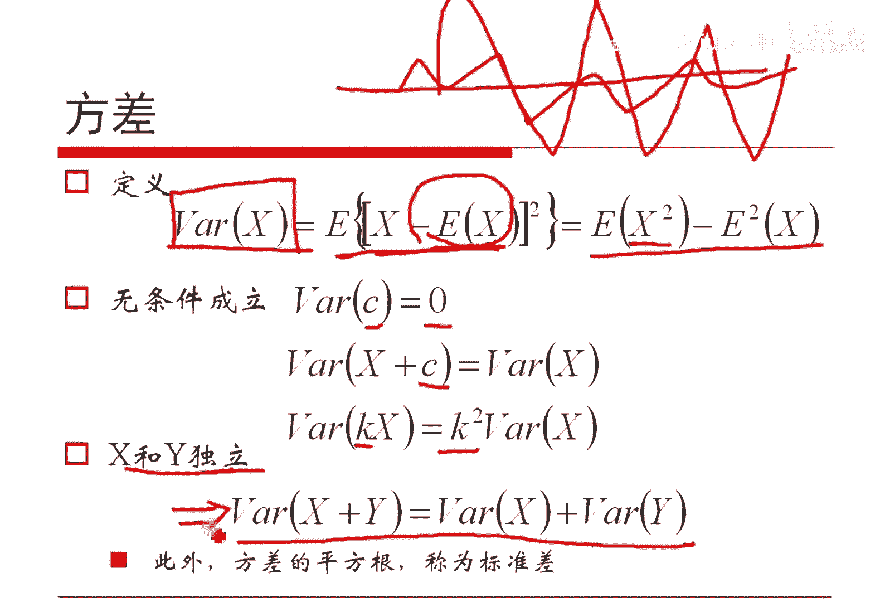

# 人工智能—机器学习中的数学（七月在线出品） - P9：期望和方差 - 七月在线-julyedu - BV1Vo4y1o7t1

🎼。然后呢，我们把那个期望跟大家做个复习哈，因为大家应该是对他很熟悉了哈。😊，就如果我们已经知道一个随机变量，它呢这个我假定是这个它取，比方说假定说他取一的概率是几？二的概率是几？三的概率是几。

然后五的。概率又是几，对吧？😡，然后呢，我们把这个东西用这个一和概率，二和概率相乘三概率相乘四和概率相乘，然后把它加起来，这就是所谓的。期望对吧？然后呢，如果是连续情况的话。

那么说把这个积分符号变成呃加和符号变成积分符号。然后这个概率分布率就变成了概率密度函数，其他都是一样的，对吧？所以说我们强调的就是加和跟积分本质上是一个东西，对吧？

所以我们可以把这个期望就看作是用概率加权的均值。对吧我们它其实我如果把这个PI去了，那就是把它加起来嘛，除以N嘛，对吧？如果加上这个PI就是以PI这么一个概率加全的它的。平均值。

所以说我们可以这么来去看这个期望哈，对吧？好了，这是关于期望的这么一个定义哈。我们根据这个期望定义，可以非常方便的得到一些无条件成立的公式。就是如果这是K各式个常试的话，可以拿出来。

因为这个定义这个证明实在太简单了，对吧？直接用这个定义或者定义都能证出来。然后呢，如果X加Y的期望，就等于各自的期望的加和，注意这个是无条件成立的。X跟Y如果不独立，也是有这个等式的。

因为我们把这个X加Y带到这个式子里面去，马上能证明出来的，对吧？呃，另外呢就是如果他们X跟Y是相互独立的。也就是我们如果是有他们独立有这么一个条件发生的时候。

那么说我们利用这个式子就能证出来X跟Y的乘积的期望等于各自期望的乘积。这是底下这个式子是有条件成立的。呃，我们先说一个问题，就是这个东西，我们等会要利用它做两道习题哈。

然后这个东西呢我们强调一遍的是他们独立能够推出它们两个是相等，但是他们两个相等，不能推出他们是独立，二者不是等价的。事实上，他们两个相等，只能够说明他们两个是不相关。我们等会儿再说什么叫不相关啊。好了。

我们现在呢先简单的说两个题目哈，这两个题目也是实际的这个面试题了。其实然后只是跟大家做一个小的分享哈。就是我们假定这么思考哈。😊，我们给100个数，然后呢是123456789到99，再加上2015。

或许我以后把这个题名个变成2016了啊。然后呢呃这一共100个数，我从这100个数里面呢去任意的去选择若干个数出来。若干个的意思是，我可能这个这一次选了100个时候都选了，也有可能一个都没选，对吧？

有可能是0个，有可能100个。取出这个若干个数之后呢，让他求一个异或。OK我求的这个异或的这个值，它本身就是一个随机变量呀。因为我做了一次抽样，又为若干个数就能够算出一个异或值来。

再做一次抽样又能得到异或值出来。OK我让大家算一下这个异或的期望是什么。这是这个题目哈。首先我们简单说一下这个题目，大家看有问题吗？就题目的这个看咱做什么。大家看一下有没有问题。

就是说咱样光说题目的本身的理解啊。易货是吗？易货就是无符OKO呃，有两位朋友问易货是什么了哈？就易货，我们可以简单的把它看作是无符号的一个加法。我们做一个易或的定义。如果这个。一个是零一个是一。

另外一个一个是0一个是一，对吧？零和零做异或，那就是00和一做异或是一一和零做异或是一一和一做异或是0。只要他们俩是一样的对吧？那么说他们一或值就是0，一0和0一样，一和一一样，对吧？

然后如果不一样的话，它就是一，这个是不一样，这是不一样，对吧？这是一个解释哈。然后另外一个解释，就是我们可以把它看作是一个。不考虑溢出的加法，0加0等于00加1等于11加0等于1。

然后一加一应该等于10，这个1溢出了没了，因此就剩下一个0。我们也可以这么来去看待抑惑哈，没有不考虑进位的一个加法。对吧这样解释也是可以的哈。😊，呃，第二种解释可能解释的略少。

交构书上一般来讲是抢前一个就是相同的就给零，不同的就给一，对吧？这也是一或者定义了。呃，好了哈，然后多谢多谢。然后嗯。😊，是的，因此这个塞拉万说了个非常好的事情，就是说所以说如果是奇数个一。

比方说两个一它一定是零了，对吧？但是如果三个一，它其实又变成一了，所以奇数个一一定得到一，偶数个一一定得到0。对吧这是异货的特点。所以我这个题目里面，他虽然让咱算异货。

但是我们本质上只如果想看它一的值的话，就考察基数个一，它的情况是什么就够了。对吧。😡，呃，抑或是呃位与位之间做抑或哈，我们不考虑这个进位的。比方说1011和0010这么一个东西做一或哈。

一和一是1一和1呃，一和0是1一和一是0，0和0是0，一和一是1。你不考虑金额把它加起来就是了哈，对吧？这就是做疑货哈，只是按位做哈。😊，好了呃，数的之间不考虑哈，就是数位之间不考虑，我们只是数那个。

各自去算就是了。所以根据这样一个特点哈，我们就既然这个题目让算抑货，我们就一位一位的来算。对吧2015给于把它把它写成12进制数。总之，2015可以写成一个二进制数。

这个二进制数一定是异获得最大的那个值。因为这个这个呢因为它既然2015嘛，写成一个二进制数，首位一定为一。哎，我问一句哈，我写出一个任何给一个，大家给一个数字，你写成二进制数，首位一定为一，为什么？

为什么？😡，守位一定是一。是不是？😊，因为首位是零的话，你就不写了嘛，对吧？所以说首位一定是一，所以2015最大，所以说首位一定是一，对不对？所以说它最大它的位数是最长的，对不对？

我们就把2015多少位写出来，然后它多少位，我们就考虑多少位就够了，是不是？😊，呃，因为有些概念特别简单，但是人不说哎，为什么呀？是不是一个三点水，一个来，大家认识吗？念来对吧？这个字念来一个三手。

一个去的，要认识吗？是不是念去啊，好像是不是。我们现在考察一下怎么样去做这个期望哈，呃，就按位去做哈。就是说我们针对一个呃二进制数，对吧？取奇数个一，然后异或之后得一取偶数个一，然后异或之后得零。

跟零的个数是没关的对吧？我们只看一的个数。😊，是吧。😊，那2015最大这个数其实换着二级是长这样子的，它一共有11位。OK我们就考这11位。这11位里面我们假定想算第I位。对吧DI为我们记作大XI好吧。

我们我们算这个算这个值哈。因为为什么呀？我们如果能够算出XI它的期望来。你不让我算这11位吗？这位的期望有了，下位的期望有了，我把它都加起来就可以了嘛。因为期望是无条件成立的，对不对？

就是刚才我们给的这个式子，期望加和成立是无条件成立的这是我们的基础哈。好了，我们现在考察这个事情哈。另外我们会发现哈2015这些书里边哈它。这些位里边除了这一位以外，其他数至少有一个一。

而这一位呢是几呢？是012345。如果这个位为一，这个位为0，这个数其实是32。对吧32是位于我这个1到99里边某一个数的。所以说啊我给出的1到99，这是2015。

可以让这11位的任何一位至少有一个位是一。对吧。至少有一个位是一好了，那意思什么呢？就是说现在我假定我从这100个数里面的第I位里边有N个一有M个0，那意味着这个N是大于等于一的对吧？

这个N哈N是不等于零的M等不等于零，咱不管了，M就为它是是零的个数嘛，其实是在里边添乱的哈，我们来琢磨下这个事情哈，好了，假定在某一次采样，我们得到的这个一的个数是有K个，你不是一共有大N个一嘛？

那么说我可能某一次采样得到了K个一对吧？OK我就算一下它的期望是几呢？怎么算这个期望哈，我们就直接利用古典代形算一下这个它呃能够取得奇数个一是哪些种取法，算一下一共有多少种取法，对吧？

它一除就是它能够为。基数的概率为基数的概率，也就是它等于一的概率是吧？也就是它的期望了。所以这是我们这么做是没问题的对吧？不过在概型里面我们这里边一共有呃。M个0有N个一。

你现在想让我去选K个一K要取基数。本来哈CNK这是我可以取的这么多种情况。但是呢我们要求这个K是个奇数，是个out的基数情况，对吧？这是取一保证了K个。M那个零呢，这里一共有M个。

其实我不用管它到底几个，对吧？所以这M个零我要么取，要么不取，一共有二的M次方种取法。对吧我因为我只考察一的个数嘛，0我要么取要么要么都取也行，都不取也也行，所以直接乘上就是了。

而这个里边我一共有N加M个数，对吧？这N加M个数取出干个数的话，一共有多少种取法呢？一共有二的M次方加N次方，这么多种取法，对吧？因为一共有N加M个数嘛，要么取第一第一个数，要么取要么不取两种。

第二个要么取要么不取两取两种，一共有N加M个乘起来了，对吧？所以一共有这么种取法，那这个跟这个显然这里边有一个二的M次方就被。消掉了，还剩一个二的N次幂，就这个对吧？

我们直接利用高中所学的知识CNKK取奇数的那个值的加和和CNKK取偶数的值的加和，它的相等都等于二的N次幂的一半，对吧？这个如果想证明的话，你把一减去X的N次幂做二项展开，展开之后，对吧？

然后把这个X取一，这边就等于0，那边就是奇数项跟偶数项的各自的把它一一整理就出来了哈，很好证明一个东西哈。那这样的话，其实这个事就等于2分之1。对吧。😡，好了，我稍等一下哈，这块有问题吗？

这块是整个问题的最难点哈。最核心的一个难点，大家看有问题吗？K和N是没有关系的，就是这个N哈，我刚才只是说了，有N个一，反正我们知道有有N个这个N既然是大于等于一的某一个数。

所以说这个呃取到K是取到一的个数是奇数的。可能性是存在的。如果N是等于0个哈，如果你这一堆这个呃红豆黑豆，红豆一共有。这个M个红豆呢那个那个那个黑豆呢一共有0个，你就不可能取得奇数个黑豆。

但是我这里边这个N呢这个数是大于等于一的，所以说我一定是有可能取到奇数的。对吧K这里面我们只考虑那个取到那个奇数个一哈，这个这个是我们只让它取奇数，因为只有取奇数的时候。

它才能够最终亦获得到XI这一位等于一。呃，二的M次方是因为咱这个里边只考察让这个K这个值取奇数，而这个0。愿意取几个就取几个，我们取若干个，最少可以取零个，最多可以取M个都是可以的。而。一共有M个数。

我里面随机的去取，要么都取，要么都不取。那是2的M次方的取法嘛？对吧因为第一个数取，第二取不取，第二个数取不取，第三个数取不取，所以一共有二的M次方，对吧？这个。解释跟底下这个其实一样的。

底下这个一共有M加N个数，我我要么取，要么不取，这一共有M个数，要么取要么不取。如此而已哈。在路上说前面这一段需要解释什么？我我简单说一下哈，就是说咱再说一下哈，因为咱这个异货的特点嘛。

因为一如果和一做抑货的话，其实是等于零的。对吧那如果一和一再和一个一做异或呢，那显然一和一做一或是零了，0再和一抑或，那就是一，这是承认的吧。所以说你再加个一也是一样哈，就是如果再加个一，我不写了哈。

然后偶数个一做异或一定是零，奇数过一做异或，一定是一，就这个哈。哎。OK哈，这个刚才有朋友说，我们随便举个例子哈。比如说咱这个里边哈不是1到99以及2015嘛，对吧？

那么说假定说我们这里边随机选了1个31，选了1个48，选了1个97，可以吧？我随便选了这三个数。是吧那既然随便选了这三个数，我们现在来考察它的第零位，就是就是个位数上最低第零位。

第零位里边一共有几个一呢？一共有这个是个一，这个是个一，一共有两个一，一共有几个零呢？一共有一个0。如果有给你两个一一个0，请问在这种情况之下，你取若干个数，使得一的个数为奇数的概率有多大。

这个就是它的计算公式。就这意思啊，因为我如果是31，那你算一下31和97，他们的个位数都是一，所以有两个1，然后48它的个位数是0，所以有一个0，对吧？如果有两个11个零的情况之下。

你有多大的可能性取得一的个数是奇数呢？对吧？那其实只有一种大的情况，就是我取了一个一，但是零，我要么可以取零个，要么取一个。就这意思哈。对吧。零我不管对吧？0咱不去考察这个零的情况哈，只考察一的情况。

因为这里边零跟谁抑或都是。原原体本身。对吧。OK大家又忘了题目了，对吧？大家题目的意思是指的1到99里面这些数缀上2015这100个数，我任意的选出若干数来，这不就是我这里面某一次选了三个数出来嘛？

31、48、97嘛，然后让这三个数让他求异货，异或之后呢，看看这个值，它的期望是什么。😡，对吧就这个题目哈，所以说呃大家咱这样，咱就不说这个题目了哈，就实这个题目看来。😊，嗯。这个是这样哈。

就是你可以写成EI哈，写成EI其实完全没问题哈。我这么写就是XI等于一，它的概率的期望。你这么写没问题哈，对吧？采样为奇数个一，那么这奇数个一相互异或后，结果为一，用这个一和奇数个0异或等于1哦哦。

许消哲说的我又乱了啊，咱等会还是课间再解解释这个事情啊。嗯。这样哈就是再这样哈，然后如果大家已经假定说咱把这个式子搞清楚了哈，假定说搞清楚了。如果不清楚，咱那个再去再去解释哈，假定说搞清楚这个事情了。

然后我们想让大家算这11位二进制数，它的值是什么？其实你会发现哈XI取的一的概率是2分之1，它是个定值，竟然对吧？那这样的话，其实其某于每一位唯一的概率都是0。5。而这个X怎么算呀？

这个X我们其实就是XI这个值取它的概率，取得它的概率的值概率拿下来。然后XI本身的值拿下来，然后从0到100把它加起来，这不是。定义嘛，对吧？这这这这这这对吧？这没问题吧。

然后这个XI这个东西它有两种取法，要么取一，要么取零，对吧？取一的时候，它是二的II二的X次方取零，那那其实就是零这个数呗，对吧？那这样的话，这个就被炸掉了，零乘以这个数没有了嘛。

所以光上前面这个数了得到它对吧？这个数呢我们会发现是等于呃，这个东西是吧？就是加和，既然是这个东西加和取期望，我们利用刚才那个式子就会把这个期望放到里边去，加和拿到外面去换成这样一个东西，对吧？

因为期望呃它的X加Y的期望等于X期望加Y的期望，就能个用那个式子哈，那这个东西是什么呢？这个东西而言，这个二的I次方其实就对于期望来讲是个常数把它扔出去。而这个呢我们刚刚算出来了，其实是等于2分之1。

对吧OK这样子这个数大家这么一算，其实就能够把它算出来到底等于几。就这么个事情哈，对吧？这个算就就就正常算了嘛，对吧？所以说我们只要是把前边的这一部分，把它等于2分之1搞定了。

后边这个哈我写的还是比较慢的，然后每一每一个地方去算，对吧？就能搞定了哈。OK没问题是吧？所以呃大家回去之后只是在考察前面这半这前半段就是了哈。好了，然后呢我怕大家不信哈，我就自己编了个小程序。

然后试验了10，我们经常去做嘛，给定这些数，然后你采样抢个若干次，最求了个值来。这个值我算了这么多次采样，抽样之后取得的均值是这么个数。这是我们实验得到的结论，1021。18。我们理论得到值是1023。

5，应该还是相互之间比较吻合的对吧？呃，还是能够相信这个结论的对吧？因为这个题目就是我们拿到手的任何题目都是没有答案的，我们都要自己把它做出来哈。所以为了保证自己算的是对的，自己真的做了一遍哈。

实验一个结果应该是对的哈。😊，另外呢我们可以给出另外一个思考，就是把刚才的2015换成1024。仅仅换着一个数，就是不是12015，而是101024了。那么这个时候题目下都不变，它的期望是多少呢？

大家可以算一下，其实期望就不再是这个刚才那个1023。5了，而是这么个值了。为什么大家想一想哈。原因其实是因为1024里边，这是1，这后面都是0。

所以说就不满足咱刚才给定那个这个N一定是大于等于一的那个前提了。就差这一点哈，其他的是一样的，大家可以尝试一下啊。好了，这是这个问题啊，我们其实已经耽误了好长时间了哈，那我们这个就继续后面内容了哈。😊。

呃，大家问题哈，就说。😊，高个的一取不到某些位置，对，没问题哈。就丁敏冯砂说的都是都很很对哈。就是说因为他有些位什没取不到一的。Jmy说只和最大的位数有关吗？和最大的是机偶有关吗？刚才解释过了，对吧？

它和是否都能为一有关系。那第二个例子其实也并不简单哈，那这样我们就不讲了哈，就是第二个是要算一个集合的哈希值。其实这个题目也不也不简单哈，然后大家就当个思考题吧，如何。😊，然后这个题目怎么算？

然后最后其实它的结论还有近似亿吧，最后其实就是一个二项分布，然后得到一个值2亿哈。大家会自己看一下哈，仍然是用的这个期望加和这么一个公式哈。呃，然后呢我们刚才给定了这个期望哈。

其实后面我们进一步可以计算它的方差X减去它的期望，然后平方之后求期望，这有它的方差。我们根据这个正位公式哈能够很快的得到这么一个结论，它和它是完全相等的。底下的事儿哈。

这个呢我们可以把它读作这个一个随机变量的平方的期望，减去它期望的平方，就是这个随机变量它的方差。对吧很显然，如果一个随边呢它是完全定值，那么说它的方差是0，如果加上一个值没有了。但是如果是K倍的话。

方差就变成平方倍了。对吧这就是方差他的这个定义哈。对吧我们简单的可以看到，方差其实表征的是一个数据，它是不是聚集于这个。期望的附近，因为X减去期望它的平方，它叫期望嘛。我们看起来就像这样子。

就是如果所有的值都都相等，他们都位于期望附近。对吧它的7它的方差就是零的，但是如果有波动，那我们说它的方差就不会0，是某一个数，波动越大，方差越大。对吧我们可以感性的这么来认识哈。😊，另外。

如果说XY是独立的，大家用那个定义就能做出来X加Y的方差等于各自的方差的加和。注意哈，这是独立的话能够推出后者，如此而已哈。

呃，另外呢就是方差开平方，那其实标准差哈，咱就不再说这个概。

