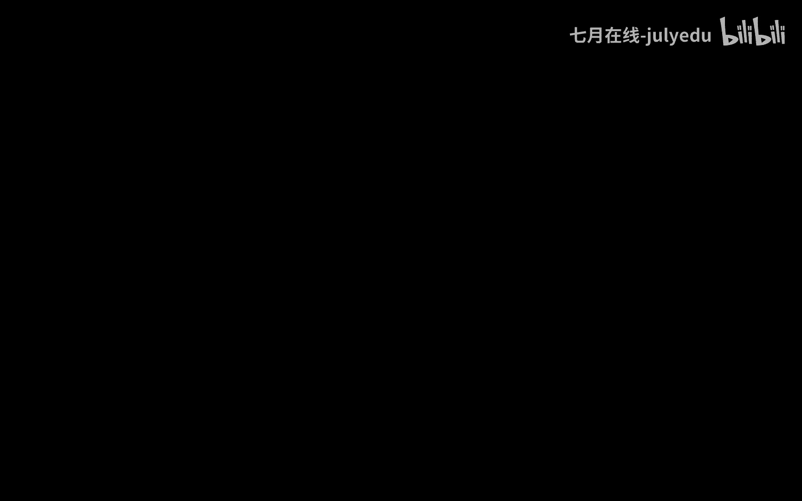

# 人工智能—机器学习公开课（七月在线出品） - P12：机器学习中的贝叶斯方法——以曲线拟合为例 - 七月在线-julyedu - BV1W5411n7fg

🎼。OK嗯，按照我们之前的这个安排啊，今天晚上呃抽一时间和大家一块儿去学习一下机器学习当中的BS方法。那我们呢以这个曲线拟合的这个。

例子啊介绍一下怎么样把概率里面非常重要的BS方法能够引入到我们机器学习领域。那么先讲一下这个目的啊，就是为什么要讲这个题目。首先第一个嗯原因呢就是因为以这个列字方法为代表的概率方法。其实在机器学习领域。

本身就占有着非常重要的一个地位。举一个例子，可能大家也都比较熟悉，像朴素贝尔斯模型。本身就是直接引自BS定理啊，这个应该大家都很熟悉。其实更重要的是，像尼马尔可夫模型。像条件随机场模型。

这种在传统的机器学习领域啊一直是起着非常重要作用的模型。其方法本身的原理也是基于概率的BS方法。啊，也就是说在机器学习领域里面一大类都是使用的概率方法来构建我们的模型。

所以呢今天啊和大家聊一下这个嗯概率概率方面的方法，这是一个原因。那第二个原因呢是从应用的角度上去说明。因为我们现在呃随着技术的发展越来越成熟，模型的使用，特别是结合着业务问题的使用，越来越紧密。

这个时候其实我们碰到一个非常重要的问题，就是关于模型的可解释性。也就是说，当我们基于数据构建出一个预测模型以后，当我们使用这个预测模型得到一个结果的时候。

我们需要让我们的业务专家或者使用方能够接受这个结果。而在这个时候，传统的机器学习模型给出的结果往往是一个确切的结论啊，ys no啊，数值的话是几几点几。这个时候对于。结果的解释是非常嗯。生硬的啊。

或者说是非常机械的，或者说是嗯。非常非常精准。当然这个精准在这个时候好像显得不那么的合适。因为毕竟我们做的是一个预测性工作，对吧？所以这个时候如果我们能在模型的结论上加上一个概率性的解释。

对我们的模型的接受和使用是带来很大帮助的。举一个例子，比如说我们在医疗行业。对吧当我们做出了一个。疾病的判断的时候。

非概率模型给出的就是yes or no的结论和这个人患病或者这个人不患病的一个精准的结论。但是你会发现呃再精确的模型，我们也知道它也是可能会出现偏差的。那么在如此关乎到呃生命健康的重要的领域当中。

很显然这个结论就不是那么的合适。如果这个时候我们在结论的基础上给出这个结论的一个概率描述，比如说在85%的概率上啊，这个病人是患病的啊，这个人是患病的。那么还有25%、15%可能是健康的。

所以这个时候对于呃业务领域来说，接受这个结论的可能性就会更大。对我们做这个工作嗯，也留有很大的余地。也就是说在应用的过程当中啊，概率模型也是非常能够被各方面所接受的一个模型。所以这是从两个方面。

一个方面是从经济学习模型领域本身的发展啊，它具有占有非常重要的一席之地。第二个就是在我们实际应用过程当中，也是在这里给大家报告一下。特别推荐使用这类带有概率结果的模型，这两个方面。

其实还有更重要的第三个方面在于，随着。经济学习的发展，特别是深度学习。方面的工作越来越突出。这个时候。一个非常重要的嗯，可能会取得非常大进展的一个方向，就是将我们的概率工作概率。

方法和我们的深度学习方法进行一个融合啊，这方面的工作啊其实已经越来越多的被呃注重啊，也可能会取得越来越重要的成果啊，因为深度学习本身可能就是一个很新的方向，是吧？嗯。

还没有太多的啊考虑到和这种概率方法之间的融合。那么这就是我们在这方面可能会取得很好工作结果的一个机会啊，所以基于以上三点吧，第一个就是模型本身很重要。第二个就是应用场景很重要。

第三个就是和深度学习的结合可能会取得非常好的成果。所以基于以上几个方面啊，今天呢和大家。讲一下，那么通过一个例子啊，就是通过一个曲线，你和这个例子看一下怎么样能够在传统的机器学习方法本身。

将我们的呃AS方法啊或者概率方法能够进行一个结合和融合啊，对于我们今后啊特别是在深度学习方向上对于一些各种各样的神经模型啊，其实都可以做这种类似的一些工作啊，把它们进行一个概率化啊。

这也是很重要的一个方向。那么主要分为这个几个方面啊。第一个方面呢就是介绍一下概率的基本规则，以及这个BS定理。嗯，在很长一段时间哈，这个有些同学问我，就是概率模型。

特别是一些复杂模型的推论非常非常的复杂，也不能非常复杂吧，就是呃冗长啊，证明过程非常的冗长，嗯，有的时候就会没有一个。信心对吧？其实呢在我看来，呃，你只要抓住它的最本质的地方，就是它的一个基本定理。

整个的其实呃现代数学的是一套公理体系，对吧？其实公理本身就那么几条啊，你掌握它的含义，其实就可以自己构建整个的理论体系的架构，而在概率方面其实就是两条定理啊，一个是加法定理，一个是乘法规则，对吧？

掌握这条后，这两条规则以后，再复杂的模型，即使诸如复杂项HMMCRF对吧？他们也是在反复的不断的使用这两条定理。所以说一开始呢我今天和大家聊一下，就它的基本规则，把这个认识越来越深刻，对后面的工作。

你才会觉得啊无非就是什么几条公理使过来呃，换过来使不去，对吧？这是第一个第一部分，那么第二部分呢介绍一下这个多项式曲线拟合的机济学习方法啊，这个不是重点。我我也相信啊很多同学对这个都已经很好的。找过了。

比如说结构风险最角化是吧？经验风险最角化。那么呢讲第二介绍第二部分分的目的在于看一下。我们怎么样把我们在第一部分当中的基本概念和基本定理结合着。多项式曲线拟和这么一个题目改造成我们的BS方法。

那么在改造的过程当中，你会提你能会能感感受得到。在保留着原来的机器学习模型本身的特点的基础上。呃，附加了贝尔斯方法以后，它会得来一些更优的一些特性。而这些更优的特性为我们啊模型的解释。

模型的推广带来了很大的一些功呃这个便利。那么最后呢结合这个例子给它代码化一下啊，就是这么准备了这么四个方面啊，参考资料呢先说明一下，今天的主要内容主要参考的就是PRML。그。

我相信哈可能大家也都比较熟悉了是吧？模式识别和机器学习啊，非常有名的一本书。在这个地方呢也给大家说明一下PRM这本书呢。整本书都是用BS斯定理去解释和说明机器学习模型。所以在读起来的时候啊。

很多同学都反馈这本书读不大懂，或者读起来有困难，其原因就在这个地方，它和大多数机器学习教材不同之处，就在于它几乎用BS斯方法，重构了整个的计算呃机器学习领域。

所以如果你不能够掌握B这种啊以概率的角度去重新认识机器学习方面的这种。呃，学习的这种经历的时候，直接去读这本书，其实非常困难啊。在此呢也给大家提个醒。那么结合这个例子吧啊结合这个例子吧。

我们感受一下BS方法和传统机器学习之间的一个关联性。好吧啊，拍个头这个内容啊，关于这部分看看有什么问题问大家。OK那咱们继续啊。对好，那我们就继续开始。那么首先第一部分呢，就像刚才我们所说的呃。

介绍一下概率的基本规则与贝S斯定理。啊，其实贝S斯定理呢一会儿我们会看到，直接就是通过我们的概率基本规则所以直接推导得到的概率的基本规则呢，一共就两条，刚才也介绍了一条叫做加法规则，一条叫做乘法规则。

好者叫个乘积规则都无所谓啊。首先我们看第一条啊叫做PX加法规则啊，加法PX等于西格马YPXY呃。关于这条规则的证明哈，通过引入集合，对吧？我们可以通过交集和并级的引入可以进行一个证明。啊。

在此呢我不想把它的证明展开，我只是想通过这条规则本身哈给大家做一个介绍啊，就它的证明有有兴趣的同学可以。看一下这个证明过程，你怎么去看看这条规则，或者说你怎么今后基于复杂的呃概率模型。

你怎么去读它的含义。首学规则其实有的时候就是一条公式，但是公式本身所蕴含的规律，是通过这些符号能够表示，必须要表示出来的啊，这个希望还能够有一个认识。首先我们看一下这个这个等号啊。

说的是左边等于右边是吧？那左边是个什么东西，是PX它说的是随机变量X的概率值啊，或者是随机变量X的概率分布啊，那这个时候呢我们把这个东西啊，就是看到一个数学符号。

你把它的含义能够想清楚它就是随机变量X取到某一个特定值的时候的概率。那么呢我们再给它起另外一个名额啊，这个时候把PX这个边缘分布。这个边缘分布为什么起这个名呢？有兴趣的同学也可以看一下。但是不管怎么样。

就是关于一个随机变量的呃概率分布，我们把它称之为是边缘分布。那么它是这是左边啊，这负这是等号的左边，看一下等号的右边，等号的右边呢，你会发现PXY我们知道这是个联合分布是吧？PXY啊PXY是个联合分布。

既然是个联合分布，那么它就有两个随机变量，一个X一个Y，换句话说，加法规则建立的是一个随机变量X的边缘分布和两个随机变量XY的联合分布之间的关系啊，这就是这条加法规则本身的含义。它再重复一遍。

它建立的是一个随机变量和两个随机变量之间的概率分布之间的关联。那么原来本身只有一个随机变量X，现在有两个随机变量的联合分布PXY那这个时候很显然它们是不相等的对吧？很显然，单独的一个随机变量。

你这不是两个随机变量的联合分布，很显然是不相等。那怎么样才能让它相等。那么很显然就在于我只需要使其中的一个。随机变量不起作用就可以了。那么怎么样才不起作用？那其实我们可以这样理解。

当其中的在联合概率XY当中，其中的一个随机变量。当取到所有的可能取值的时候，我们知道你可以这样想，我们知道呃。随机变量的概率和是一对吧？换句话说。

当我把其中的一个随据变量所有的可能取值都取掉的时候进行一个累加。那么它在联合。分布当中的作用就不再起到了。也就是说联合概率，当其中的一个随机变量取到所有取值可能的时候，它就退化成了一个边缘概率，对吧？

通过这个认识呢，你会发现通过22。刚才所说过，其中的一个随机变量所有的情况都取道，并且进行了累加。两个随机变量就的联合概率就退换成一个随机变量的边缘分布。那这个时候你会发现，通过加法规则的含义啊。

就是加法规则本身的含义建立的是一个随机变量和两个随机变量的联合概率之间的这种关联关系啊，就是这么就是这样的一个意思。好吧，那我们看看乘绩规则啊，乘绩规则说的是这样。

乘绩规则说的是本身是PXY是两个随机变量的联合概率。然后呢，它等于P在X条件之下Y的概率。我们把这个东西就是称之为条件概率。或者条件分布是吧？然后呢，PX刚才说了是边缘边缘分布是吧，边缘分布。

那联合概率呢？两个随机变量的联合概率可以拆成条件概率和边缘概率的乘积的形式。换句话说。等号的左边是两个随机变路的联合。本来是XY的概率，然后呢，它可以拆成两部分，哪两部分呢？一个是条件。

谁的条件在已知X之下的Y的概率乘以PX的概率。其实你感感受一下，其实也是蛮有道理的。什么道理呢？两个两个随机变量，我对它的。认识是不清楚的对吧？它可以取任意的值XY也可以取任意的值。

那这个时候我能把它拆成两步去做哪两步呢？就是当固定一个随移变量X以后，或者说我认为它已知的情况下，PY的概率。那很显然这两部分是不相等的。本来所为XY我都不知。现在呢你知道了X，然后Y的概率。

很显然不相等，那怎么相等，再把另外一个变量X的概率值乘进去，就保证了有这个条件概率乘以边缘概率的结果等于两个随移变量的联合概率。那你会发现乘积规则建立的是联合概率和条件概率和边缘概率之间的关系。

而加法规则建立的是边缘概率和联合概率之间的关系。那后面啊就是这个或者说你死记硬背，你要把它记住，那用怎么用，对吧？我们记规则不是为了记规则，而是为了用规则，那怎么用？

那剩下的工作就是当啊你想把一个边缘概率，就是PX或者说PACPD是吧？一个关于一个变量的概率。你觉得它不好用的时候，你完全可以把它拆开，怎么拆，拆成联合概率的累加的形式，这是一种方式是吧？那么进进而啊。

你会发现既然是联合概率。进而我可以用乘积规则，再把它拆成边缘概率和条件概率的乘积的形式。这是一一个方向，就是拆开。另外一个使用呢就是合并什么合并呢？当你看到若干个概率的累加的时候。

你看一下是不是可以通过对吧？通过一个随机变量，是不是它的值全取到了，把它还原回一个随机变量的。边缘概率的形式。同样的道理。所以说啊这两条规则啊。这两道规则。反复的使用就可以推断出呃非常非常复杂的模型啊。

这是关于这个加法规则和乘法规则。后面我们也是这样来用。最直接的一个使用啊，就是它可以直接退出贝尔斯定理。啊，直接推导出BS定理，我们看看怎么用啊，是这么说的。😊，有乘绩规则啊，就是成绩规则，就这条规则。

有成绩规则。然后呢，以及对称性。什么叫对称性呢？是PXY等于PYX。你细心的同学可能看到了PXY等于PX已知的情况下，Y的条件概率乘以PX。那么同样PXY呢是符合这种对称性的。换句话说。

我们换换一个这个称为我们说它符合交换率交换率，就是PXY等于PYX嘛。换句话说，在联合概率上XY是没有顺序的是吧？X在前Y的钱是一样的。那既然这样。

我除了可以把它写成X条件之下的Y的条件概率乘以PX的形式。那么同样我还可以把它写成。PXY等于P在已知Y条件之下，X的条。边缘概率呃条件概率乘以PY的形式。啊，这就是有成绩规则以及它的对称性。

我们可以得到这两个式子。这两个式子我们知道左边是相等的，那么右边那肯定也是相等的那换句话说，右边这两个乘两组乘积PX条件之下，Y的条件概率乘以PX就等于PY条件之下X的条件概率乘以PY，这是显而易见的。

那么这个时候就有个很好的问题哈，就是既然左边等于右边，对吧？既然这两个式子相等，那么很显然我可以通过等式的。不断的这种。交换对吧？不断的替换，可以在得到很多的。等式。因为可以把PX除过去是吧？

把PPXY的条件概率除过去或者怎么样，可以得到很多的。等式。那这个时候就有一个问题，为什么BS定理得到下面这个式子。很多的时候啊给大家说一下，当们看到BS定理的时候，除了这种描述之外。

因为这里的XY没有任何的怎么说，没有任何的呃约束。所以有的时候的BS定理用XY来表示，而是用AB。给大家说一下啊，但凡是看到这个时候啊，你一定试着把它换成XY的符号的形式，就做个符号替换就可以了。

为什么这么说呢？因为一旦你把它退化成AB的表示形式，你就更不知道AB到底在讲什么了。嗯，为什么要这么说呢？看下面啊就是说。为什么一定要得到下面这个用XY的表示的形式。

或者说这个形式对你来说是一种更容易理解的形式。我们先看一下左边啊，我们先看一下等号左边这个式，这个式子说的是什么？是在四个式四个子表达式当中的一个哪个是这个P在已知X条件之下，Y的条件概率。

我们把PX可以除过去，因为这是个等式是吧？除过去作为分母，作为右边那个式子分母，就直接得到下面这个式子。这个式子很显然是个贝S斯定理的一个公式。那这个式子到底在。再说一些什么内容啊。

这个我觉得才是最重要的。当然，BS定理从纯数学的角度上去讲的话，它就是一个定理。就是我就得到的是一个条件概率，在X已知。条件之下，Y的条件概率等于右边这一坨是吧？这个时候啊嗯。在初学的时候。

特别是很多的同学就说哎这个定理我我记住了啊，怎么背我也背住了啊，还是那个问题，怎么用是吧？我们问题不是为了背公式，我这是怎么用的那这个时候啊对于我们来说。

我们就需要结合着我们的在机器学习领域当中怎么去使用这个公式去做一些描述，怎么使用，看一下等式左边这个式子到底在讲什么。这个式子在说我已知X条件值下的一个Y的条件概率是吧？我已知了XY的一个概率值是多少。

然后它等于右边这一大坨，我们先不管它右边到底是等于多少。就这个式子本身给我们一个什么样的一个理解。呃，读过呃李航老师统计学习方法那本书的时候，的同学可能会直接有一个印象，或者直接有一个认识。

这其实就是我们所说的机济学习的模型。这被称之为是概率模型。当然还有一还有一类，我们称之为是函数模型。为什么可以把条件概率认为是模型？就在于当我们把这个X认为是输入数据的时候。

那么整个Y认为是相应的输出数据的时候，条件概率就变成了具有。我们积极学习领域含义的一个表达式，就在于当我已知了输入X以后的条件之下的输出Y的概率值，这不就是模型吗？我们的呃函数模型是一个很直接的模型。

给我一个X，我给你一个Y的值，对吧？通过F映射，我得到一个相对应的Y值。那么概率模型。同样你给我X以后，我虽然不是直接给出你的Y的值，我给出的你Y取到某一个随机变量值的时候的一个概率。

那么当我进行推断的时候，或者进行推理的时候，我当然是取取那个使这个概率最大的Y值，作为我的当前预测值，这是很自然的一个逻辑，那也达到了你给我一个X，我得到一个Y的目标，这就是模型嘛。

所以说BS定理当我们认识到了这个。形式的时候，你会发现哎它对我们来说是非常非常有价值和意义的。因为你给我一个X，我得到。Y的一个概率值就为我们构建出了一个非常。直接的一个模型的概念。

那么这个时候我们在讨论右边这个式子就很有意义了。就是说我左边反正是个模型，对吧？模型呢嗯具体怎么去计算，那么当然是通过右边来得到的。那么右边呢我们看一下。几部分、三部分，分别是PY。已知条件之下。

X的条件概率乘以PY，然后再比上1个PX。那么这几个符号和右边这个呃和左边这个符号怎怎么去一块儿去理解？通过我们左边的分析，我们知道P在X已知条件下，Y的条件概率是在X已知下Y的概率。所以我们。

把这一部分给他一个起个名字。叫个后延概率。后验概率什么叫后验概率？是已知X以后Y的概率就是后验后验概率。后验概率说的是已知X以后Y的概率。那么很显然，YPYPY是在未知X的时候。

或者说我什么都不知道的时候，Y的概率值。那么很显然，我们把可以结合着后验概率给它起一个名字，叫做。先验概率这个先和后说的是谁？是说的是X已知还是未知。如果X已知的条件之后。

那么Y的概率就是一个所谓的后验概率。如果X是之前或者是未知，我们把PY的概率称之为是先验概率。这两个如果能够认识以后呢，我们再回过头来看这个式子啊，就非常有意思了。我们先不管中间这个东西啊。

先不管这一部分。他说的是什么呃。😡，我们看一下啊，这两边。这个等号左右两边。PXY是X已知之下Y的概率。我们称之为是后验概率，我知道了XY的概率值PY呢是先验概率，我不知道X有没有X，我压根儿都不知道。

它是多少，我更不知道你会发现列斯定理所建立的关系在于我建立的一个关于X已知还是未知有没有X的一个关联性的问题。换句话说，右边告诉我们啊，右边告诉我们，我不知道X的时候的概率值。

和左边已知X以后的概率值是有一个数值上的相等的关系的。这个相等的关系在于什么呢？在于我乘以中间这一块。是这样吧，换句话说啊，你可以把这个BS定理啊认为是一个动态过程。什么叫动态过程？一开始的时候。

我对PY仅仅是知道它是等于PY。呃，我不知道X存在不存在。那这个时候通过右边的计算，我可以得到一个已知X以后Y的概率值。那大家想一下，换句话说，通过右边的计算，我得到了一个哎，有了一个已知量以后。

关于PY的未知量的概率。那大家想一想，我们是不是可以把这个后验概率，又重新作为一个新的显眼。重新计算新的X。对于PY的一个影响。那么同样这个过程就可以反复起来反复起来。

那么这个时候你就发现一开始的初始PY就可以通过这么一个动态的过程，不断的进行调整和优化，得到进一步的关于Y的一个更精确的一个结论。所以我们再看这两个是这两部分啊。

这两部分其中的PX它被称之为是证据因子或者叫做规划因子。换句话说，PX嘛，就是我知不知道X。所造成的影响对PY的一个影响。我知道。X那我得到的是PX已知之后，PY的值，我不知道X我就是一个PY。

所以它被称之为正据因子啊，有没有你这个证据来修正我PY的概率值。而上面这部分啊上面这部分我们称之为是自然函数。呃，关于自然函数哈，可能同学有的同学特别是。有学习的同学哈。

就有的时候哎经常在我们概率方法当中有最大自然是吧？很多的时候我们通过最大自然的这种策略去求到我们的模型，称每经常会碰到自然函数自然函数。这个时候我就会问一个同学，自然函数啊不是一个。一个一个一个怎么说。

没有先决条件的名称，它是谁是谁的自然函数，或者说它是谁的自然函数。你会发现啊自然函数一定是在BS定律当中PX呃PY已知条件之下X的函数或者是概率值。你注意啊，你一定要明确。后验给后验概率的形式以后。

它所对应的自然函数的形式。一会儿哈我们一会儿会特别是一会儿通过我们例子当中啊去看一下，即使是最大自然自然函数的定义，其实也是需要在BS定理当中，你明确的找到它们之间的对应关系。好吧。好了。

通过BS定理啊，想说明的一点是什么？就是我们需要建立的，其实是关于这个证据X。存在或者不存在是多少来动态修正。我PY概率值的这么一条公式。好吧，当然。啊，有的西说哎呀。

这个公式我在普苏毕斯里面就用过没那么复杂啊，是为什么呢？是因为普苏毕耶斯用的使用的模型使用的时候，其实呃是用它的最原始的一个就是最基础处的一种工作。就是我给你右边给我左边值。那这个时候没有问题啊。

也没问题。我就是通过右边的计算得到左边概率的情况啊，这也是一种使用方式，但是啊其实毕斯定理在后面我们使用过程当中，一个非常重要的使用过程，就是我们把它动态，让它能够不断的进行自我的一个修正过程，好吧。

继续往下哈，但后面这一点就是一个说明了。既然我们PX作为证据因子啊，PX啊，看上面有对吧？它有加法规则，但既然作为一个证据因子，我们可以通过加加法规则。

把它展成联合概率外取所有值的情况的一个累加和的形式。而我们得知道联合概率，又通过乘积规则展成条件概率和边缘概率乘积的形式。所以后所以通过这种替换，你会发现。BS定理更常见的一种形式是右边这个形式啊。

右边这个形式，这个形式完全是通过中间的这个形式再替换得到的。为什么要把它展开看一下两个目的啊，两个目的，我们再体会一下，为什么除了它叫证据因子以外，还叫做规划因子的一个原因就在于我们把它展开以后。

你会发现分子和分母部分啊，分子和分母部分，除了这个西格玛累加和之外是相同的。仔细看一下是吧，这是分子。换句话说，你把分子部分关于随机变量Y的所有情况进行累加以后，就是它的分母部分。所以说大家想一下啊。

是不是可以这么去考虑，既然分母是所有情况的一个累加，那么分子占所有情况的一个比例，就可以认为是这一部分，它占整个部分的一个。频率我们一般用频率。频率派的那个思维的话，这其实就是这个概率值嘛。

你看这是其中的一部分，这是整个所有的整体，你占所有整个整体的。部分的一个百分比就是它的一个概率值嘛。所以呢它被称之为是规划因子。为什么要规化因子呢？我们知道当你把这些所有的情况进行累下以后。

他们的概率值一定是等于多少？一定是一。换句话说，我们在这个地方加上一个西格马，在外面啊再加上一个西格马到外去所有的值的时候，这个式子一定是一的。所以说啊就我把整个的所有情况，一个全级。

你可以认为是一个全局部的全集放到分母部分。那么分子部分占全级的百分比就是我的一个概率值。当我把所有的。子集都考虑到的时候，它在整个全集当中的和不就是累加为一嘛。

所以它被称之为是规化因子得到的左边哈使得左边这个条件概率是个概率值啊，这是一个需要解释的部分。第二个部分呢，我们顺着往下看。Yeah。🤧ふ。换一个角度，我不管你分子到底是多少，我分母的这个。

局部全局其实是是形式是一样的。啊，对于你这个概率值，我的分母是这样计算。对于其他的概率值，我的分母也是这样计算。换句话说。我进行左边计算的时候，会发现你分母的这个值到底是多少。

其实对我来说没有太大的关心。换说我只是看你分子的大小，就可以决定我PXPX条件下，Y的条件概率的值的是多少了。我因为分子是一样，大家分大家的分母都是相同的那谁的分子大，那我左边就大谁的分子小。

我左边就小。所以这个时候我们得到另外一种表示形式啊，就是PX条件下Y的概率正比于这个符号啊，这个符号的含义是正比。正比于右边这个式什么意思呢？其实就是分子嘛？就是你分子大。

我左边大分子小或一分我左边小分母其实是不起到作用的啊，正比于这个式。所以说通过以上啊，你会发现BSS定理完全就是加法规则和乘积规则的。使用对吧？这首先。通过乘积规则以及对称性得到一个表达式。

把表达式中的一部分进行一个调整，得到整个的BS定理的形式，其中的分母部分是个边缘概率。边缘概率通过加法规则拆成联合概率的累加的形式。然后再把联合概率拆成条件概率和边缘概率的形式。那么进一步的去分析。

发现，得到一个式子就在于左边的后验概率等于自然函数和线验概率的。成绩。有一个正比关系，这就是BS定理啊，关于这一部分，看看有什么问题吗？我们可以讨论一下。哎，有同学提到了这个证券市场啊。

我我后面会举这个例子，好吧，一定会举这个例子啊，后面一会儿我们再说。代码实现哈啊这些也是个好问题，毕竟我们需要做是吧？代码实现其实我们有很多的库啊，特别在pyython家里面是吧？有很多的免费的库。

像z派是吧？这种优化优化库，我们可以啊，甚至包括numb派里面这个。一会儿我们看到啊，就是把这个。把它变形成一个多元线性方程的形式，好吧。好了，我们继续往下吧，好吧。😊，那这一部分完了以后。

我们看第二部分，第二部分应该大家都很熟悉了啊，就多样式训练几合的经济学习方法。这个我觉得应该问题不大。好吧。首先我们看一下我们已知训练集X啊，它的N次观察啊是X1X2一直到大XN啊，就是我们的输入啊。

这里的XN个输入啊大N个输入以及对应的标记T的观察T1到T大N这个时候呢说明一点啊，说明一点，有这这个时候就是Y啊，这个T就是Y啊。

这里的T1TN就是Y1YN为什么要用T呢是为了保证和PRM2那本书里面的符号保持一致啊。同学们看书的时候比混淆掉。这里的T就是我们的实际的。标签值啊，实际的标签外值。那这个时候呢，我们的多项式函数。

定义为YXWW0W1XW2WX呃W2X的平方加一直加到WMXM次方，等于西格马这从一到大MWJX的J次方啊，其实你会发现就是一个多项式，对吧？这个多项式呢随着M的值的。取值啊，它的幂次越来越大。

然后呢把它们进行一个累加，就得到了我们的YXW这个模型模型定义其实没什么可解释的，是吧？那么注意一下的是在于我们。把W从W01直到WM定义为是多样式的系数向量，系数向量这个向量有。

M加一个元素构成了一个向量，这就是我们的模型。那么这个时候我有个问题在于，在这个多项式函数或者多项式模型里面，哪些是已知的，哪些是未知的啊。这个有没有同学能够有印象或者明确啊，哪些是已知啊。

X和T是已知的，谁未知W是未知的。所以我们是已知XT求W啊，这个问题先搞清楚啊，特别是我们。啊，不管是什么样的算法啊，后面就是我们在集训营和就业班里面，很多的同学都会有这种问题。

一问在哪个算法讲的很清楚，对吧？第一步干什么，第二步干什么，第三步干什么，我有一个问题就在于，你到底已知什么，求什么，有的同学就不能够直接反映的出来。其实给大家说一下啊，讲到算法的时候。

先不要告诉我他的算法过程啊，我知道你会这个肯定你会。你先告诉我你已知什么，求什么，你在哪儿，你是谁，你要去哪儿，你要干什么，然后你再告诉我你怎么干。好吧，有的时为什么要这样强调。

因为很多的时候啊同学就是搞不清楚，因为特别是有些算法很复杂的时候，有的同学就搞不清楚到底。😡，太抠细节，就不知道自己在干什么，搞了半天，我我从第三步到第四步，从第四步到第五步，从从第八步到第十步，哎。

我到底在干什么？你是在已知X和T以后求W的值，这是你要干的。你要最终把W求出来，是你是为了求W，你才搞这么复杂的一个模型和算法，不是为了别的东西啊，不是为了求T，因为T是已知的。很多同学最会发现哎。

我为什么要干这一步啊，是当然你你奔着W使劲。对吧所以这个地方多说一点，一定要搞清楚啊，以知什么求什么。😡，继续往下，有了这个模型以后，很显然W是未知的那这个时候我们只需要把所谓的CUW求出来就可以了。

那么下面一个问题就是怎么样定义所谓的损失函数和代价函数的形式。再强调一点，损失函数平方损失这个没什么可可可说明的是吧？那代价函数或者就我们的风险函数，平方损失进行一个数据集上的一个累加，然后2分之1。

为了后面求导方便。这个时候再给大家提个型，一定要区分开你的损失函数和代价函数的区别，或者是损失函数和风险函数的区别。啊，怎么区别？其实很简单，损失函数是一次损失，风险函数是数据集上的风险损失的累加。

对吧这个嗯这个这个有什么区别吗？当然还是有区别的啊。乜嘢咯。代价函数以后或者风险函数以后，我们的优化目标就是使风险最小嘛，风险最小化。注意这里是什么风险。

这里是是的一个所谓的经验风险在数据集上的风险是吧？经验风险最小化是我们常用的。当然，经验风险最小化呢可能会陷入到过拟合。所以我们就把它进一步的加上一个正策画项，把它。

从经验风险转化为所谓的什么结构风险是吧？结构风险，这样的话可能会好一点。对我们的预测的这个泛换能力可能有更多的提升。我觉得这一部分没什么可介绍的吧。再回过头来看一下，我们就是要构建一个。多样式函数对吧？

然后呢去拟合XT这一堆数据，我们策略就是所谓的经验风经验风险或者结构风险的最小化。定义完损失函数以后，进行一个数据集上的累加，使所有的风险取的最小。那这条曲线就是应该是最好。所谓的最优曲线。

这个没什么问题吧，这一部分。损失函数是一次损失是什么意思是吗？你看一下损失函数的定义就明白什么意思了。损失函数就是定义的是一个数据上的。损失就是一个X输入进去，它和Y的损失的大小的一次值，这叫损失函数。

什么叫风险函数？风险函数一定是定义在数据集上的函数，它是在整个数据集上所有数据集上面所有数据上的损失的累加和，这是两个不同的概念。很多的同学就会混着用，一会儿讲风险函数，一会儿讲损失函数。

自己都没搞清楚讲的是什么？你怎么去在摸心在算法里面把它。嗯，对，这还没讨论到代码部分是吧？你怎么在代码里面，你怎么去把它分的更清楚。😡，啊啊如果不卡，我们继续好吧。那好了，下面的问题就在于啊好了。

现在我们基本上这个前面的准备工作的内容差不多都有了。就是说现在我们有了一个模型啊，就是就是这就是这个模型，对吧？就是这个模型，然后呢，我们上面还有一堆的。概率公式啊比一堆的概率公式。

下面我们的任务就在于我们怎么把这一堆概率公式。应用到我们这个多样式曲线拟合的问题当中去啊，怎么去改造这个模型啊，怎么对它进行一个改造。嗯，我们先从问题入手，对吧？

就是说看一下嗯多项式曲线拟合模型的求解本身有什么问题。结合这个问题，我们提出它的改进策略也就很清楚了。那么就第三部分多样式曲线拟合的BS方法。那么改进呢有两步啊，改进呢有两步。

第一步呢就是所谓的多样式曲和拟曲线拟合的最大自然方法。它什么意思呢？就回过头大家看一下。😡，🤧这个图。这个图中是这么说的啊，横坐标是X啊，横坐标是X。纵坐标是T啊纵坐标是T啊，再给大家说一下，以后呢。

我们的模型学习过程当中，图形的结合是非常重要的一个。呃，一个方面是吧，图嘛图形结合嘛啊，图片是和代码结合起来。看图的时候啊，给大家一个经验吧，一定把坐标系先看清楚啊。有的同学上来之后什么也不管啊。

什么也不顾啊，上来就是一顿操作啊，一顿猛操作。最后一发现哎，不对，这个坐标系不对。换句话说你看了一个东西以后，哎，怎么分析怎么不对？是啊，你坐标系看清楚到底长什么样了吗？

我先看坐标系到底是说的说的是什么，横坐标是X，坐标是纵坐标是T，很显然，建立的是X和T之间的。映射关系对吧？那这个映射关系呢是通过我们在数据集上的这些采样点得到的啊，这些蓝色的点是数据采样点。

那么刚才我们按照不管是按照风险最小最经验风险最小化，还是说结果风险最小化，我们得到了一条曲线拟拟合的曲线啊，这条红线。你况下这条红线其实已经呃还不错，能够把所有的蓝点的这个啊。

数据规律能够学习到了啊学习到了。那么曲线拟和这个模型一个很大的问题在于，当我一个新的元素X0来了以后，按照我们的模型Y我们可以得到一个非常准确的YX0。这是我们。嗯，很自然的一个结果，对吧？

你给我一个X0，我通过模型就可以得到一个对应的值，这有什么问题吗？问题就在于还是刚像刚才所说的，你这个结论太准确，也不是一个好的情况，对吧？比如说举一个例子，那当然这是个这是个回归问题啊。

这是个回归问题。啊，我测了一下你的脉搏，哎，你你你这个人。就可以得到你的体温。假设是这么一个模型概率，你会发现这个因为这个回归问题，你这个结论就非常的。呃，怎么说呢？就非常的严苛是吧？

因为你本身就是一个回归模型。本身就告诉我这么一个结论。那这个时候。我们怎么办？我们把换一个视角啊换一个概率的视角，什么视角呢？当我得到X以后啊，当我得到一个新的X0以后，我得到一个值。

得到一个模型的预测值。但是呢我告诉你，它不光可能得到模型的这个预测值，它还可能得到模型的。这个预测值也可能得到模型的这个位置的预测值，也可能得到模型的这个位置的预测值都有可能取到啊。

就是整个的坐标轴上所有的值我都可能取到。唯一不同的就在于当取到这个点的值的时候，它所对应的概率值是最大的。那能有没有可能取到其他的点，也有，只不过那些概率值非常非常的小。那这个时候你得到的结论就在于。

当我已知X0以后，我得到了一个映射值YX0。那么我还顺便告诉你，得到YX0它的概率是多少，你信不信？那是由你作为专家进行判断，这样的话对我们来说，余地就很大是吧？那怎么去做这个问题。

那关于这部分能不能理解同学们。😡，啊，PDF会整理一下，发到群里好。Yeah。嗯，我们继续啊。Yeah。那怎么去做这个问题？那好了，往下看一下啊，我们设。给定输入X值啊给定输入一个X的值。

它所对应的标记T就是我给我一个X以后。他呢得到的不是一个具体的预测输出值。而是得到一个分布。当然这个分布我们可以假设它服从一个高斯分布是吧？因为这个假设应该是嗯想当然了是吧？我就认为它服从高斯分布。

这也有没什么没什么没没什么原因。这个时候呢分布的均值为我们刚才的实际预测值YX我。就是YX，但是呢YX是我的均值啊，它所对应的那个。概率可能性最大，但是呢它还服从一个以贝塔负一为方差的一个。告斯分布。

换句话说，它还可能取到其还可能取到其他的值，只不过取到其他的值就受到我们方差的一个控制。它可能隔着一个方差，两个方差或者N个方差。那么当然我们的概率值是越来越小，甚至可能趋近于0。那可不能可能取到可能。

但是概率非常小。所以这个时候看下面这个式子啊，就是假设。我们的模型不再是一个准确的数值模型，而变成了一个概率模型。概率模型说的是对于任意的输入X，我的标记T不再是一个具体的值，而服从一个所谓的告斯分布。

这个告斯分布也不是一个普通的告斯分布，它是以YX实际预测值为均值，然后呢以一个贝塔负一作为方差的一个告斯分布。那么很显然在这个模型，这也是个模型啊，刚才我们所说了，条件很显然左边是个条件概率。

我们前面和我们前面那个条件概率就联系起来了。条件概率本身也是一个模型，你给我一个X，我不是直接给出你T的取值，而是给你取某一个T值。它所对应的概率值。那这个时候我们当然取的是那个概率最大的那个模型的。

对应的输出。所以我们经过这样的改造以后，我们只需要把后面这个高斯分布能够求出来就可以了。后面这个高斯分布很显然，我们需要求什么，把均值求出来，把它的方差求出来就可以了。对吧好了。

我们这个就是把高斯分布啊一般形式放在先放在这儿。一般形式上均值是缪，方差是西格马的平方。这个地方用贝塔的含义呢是它取的一个倒数啊，是取的方差的一个倒数。啊。

这个时候呢主要是为了我们把这个东西重新定义成之为精度，主要是为了习惯啊，就是搞该对定那帮同学的一个习惯。那我们继续往下好了，再往下。数据集，那么有了这个。模型定义以后。

我们只需要把均值和方差求出来就可以了。那这个时候我们定义它的自然函数，注意啊，自然函数出来了。自然函数下面这个式子。下面有一个问题，为什么PXW贝塔条件之间的T，这个式子是四然函数。往前找。

还是那个问题啊，自然函数不能是随便定义的，你得看到到底谁是谁的。胡岩他的私然号数是多少？我想找白斯定理啊。电子定理在这儿，很显然我们刚才说过。这是自然函数，对吧？这是自然函数。那么很显然。

X输入Y是我们要求的东西。在刚才那个式子看看看看是不是这么说的。在这儿这是那个自然函数。谁是输？谁是我们要求的？很显然，T是我们要求的。X是我们的输入。哦，这个地方是这样啊。不是这个X啊。哎。

T是我们要求。W是我们要求的是吧？W刚刚一直在强调啊，W是我们要求的T是我们已知的，所以啊是对应对应到前面是我们的自然函数。那这个自然函数是我们一个里程值啊，在数据集上的一个里成。

所以呢是我们既然每一个都是一个高斯分布，我们只需要把这个高斯分布进行一个里成，就得到了我们的自然函数啊。再强调一下，这个地方W是我们要求的。T是我们已知的，所以这是一个自然函数的定义过程是吧？

自然恒这的定义。W要求的放在条件上，T已知的放在我们的。条件前面啊，然后呢每一个都是一个数据点上的一个高斯分布，然后把这些高斯分布进行一个垒成。这样的话自然函数的形式也就有了。有了自然函数的形式以后。

我们求解它的对数。因为它这个里长不太好求，所以我们通过。对数啊，我们可以把它从累乘变成累加，这是一个很很常见的一种方式，是吧？把从累乘变成累加。

那么我们的优化目标就变成了最大自然求这个自然函数最大的可能性。那么当然等价的可以转换成求这个自然函数和对数自然函数的最小。我们一般情况下积极学习领域，一般情况下都是取某一个函数的最小值，对吧？

那这个时候。自然函数的最大就它所对应的。负的。对数函数的最小。那这个时候哎这个时候啊也就是说我们要求的是。负的这一部分的。最小值。那我们看一下这个式子啊，负得正这就变成正的了，我们就不管了。

注意我们是要求的是W最小的后面这个表达式的最小看一下后面这个表达式当中关于W的部分。这一部分有。W看一下这个部分有没有W没有这部分有没有W也没有。换句话说，后面的这两部分在求关于W的最小值的时候。

都是作为常量。既然是常量，我们就可以不考虑。就是说你比如说后面加上一个三，那么你会发现这个三对于W来说是个常量值，那么在使W最小的时候，这个过程计算当中，这个三有没有其实是不起作用的，对吧？

同样同样的道理啊，这一部分就不要了。那么再仔细的看一下，你会发现。我们就得到了所谓的W的最小值，就是使得2分之1西格马YXN减去TN的平方。这个式子有新的同学，你会发现这个式子和哪个式子是完全等价的。

喺没看到。和我们经验风险最角化的式子是等完全一致的。就是使我们的经验风险最小的那个W的值。也是使我们的自然函数最大的那个W值。换句话说。在平方损失定义之下。在平方损失定义之下，经验风险最角化就等价于。

负的对数损失的最小吧，这两个式子是一样的。我们既然这样的话，就可以通过同样的方法把所谓的最优的W求出来。那么这个W。就是称之为最大自然解啊最大自然解。那么有的同学就会问哎。

这这这和前面的工作不是一样的工作吗？有什么好处吗？不要忘了，这个时候当我们有了这个WML最大自然解以后，我们可以把贝塔ML求出来。这个贝塔M2是什么？😡。

往上看这个贝塔ML是我们在定义的那个高斯分布里面的方差的倒数。那么也就是说。当我有了W，根据W求出贝塔来以后，我们就可以得到一个概率模型。当你给我一个X以后，我可以计算出它为T的概率值是多少。

通过YXW是均值，通过贝塔负一得到我们的方差。那这个时候也就是说我给你这个值的同时，还给出了这个值的方差是多少？那至于这个你怎么去解释和使用，那就是专家经验得到的。换句话说。

我不再是仅仅给出你一个具体值，而是给出你这个值，它的一个概率值以及这个概率分布的一个方差大小，你自己去解释这个结果就可以了。好了，关于这一部分，看看有什么问题吗？对。嗯，贝塔是自定义的啊。

贝塔是自定义的，换句话说它它是它也是一个。嗯，贝塔不是自定义的，贝塔是自己求出来的啊，贝塔是求出来的。刚刚才看到了。卡了，现在现在可以吗？贝塔的这个地方不是自定义的，贝塔是求出来的。嗯，看一下啊。

还是在这个式子里面，刚才我们求的是关于W的最大值。同样我们也可以求一下关于贝塔的最大值。那么贝塔的最大值还是那样，还是一个方法，我们只需要对贝塔求一接导出就可以了。没问题吧。

这个时候只有这一个式子是带贝塔的，它的系数就是这一部分。也就是候贝塔值就等于它的。把贝塔除过去，不就贝塔分之一等于右边这个式子嘛，对吧？那得到这个结论啊。

得到式子贝塔的最大自然解的倒数是等于右边这个式子。而右边这个式子里面所有的，你像WML是已知的XN是已知的TN也是已知的，可以把贝塔ML求出来，这是个求出来的结果求出来的结果。

这样的话我们就可以得到在经验风险最小化，或者说在最大自然。要求约束之下啊所谓的一个最优解啊所谓的最优解。那么我们继续往下啊，还没完，还可以进行进一步的改造，改改造在哪儿呢？改造在这儿。

现在我们已经做了一点改进，就在于当我给出一个X0来以后，我得到的是均值以及方差。对吧均值以及方差。那这个时候你会发现我们再看看这个W，哎，再看一下在所有的。量里面这个W现在还是一个具体的值。

因为我们通过看一下啊。你可发现在这个地方，我们的W还是一个具体的数值，对吧？通过这个式子使这个式子最小的那个W值是几，那WM2就是几。那。这个时候好像我们碰到了一个同样类似的问题，什么问题啊？

就像刚才那样。刚才我们是给出了答X0，你。Y零是个具体值，通过引入。高斯分布以后，把Y0不再是一个具体值，而是一个高斯分布。那么同样我们知道啊我们我们我们要得到的是个W0，呃，我们知要得到的是个W系数。

还是我们能不能同样按照刚才的方式把这个W也进行一个改造，也得到一个关于W的一个概率分布的形式。有同学就会提出一个问题在于它有什么意义吗？就是为什么要这样做，回过头来看一下啊，回过头来看一下这个模型。

举一个例子啊举个例子，比如说我们现在这个模型是对当前这个。疑似病人的一个医疗判判断。它不仅仅是根据某一个特定指标，而是根据若干个指标生理指标去最大进行判断。比如说现在的。呃，现在的新冠肺炎是吧？

细心的同学你会发现呃，随着诊疗手册的不断的改进，诊疗方案当中的方法其实是动态变化的。我记得你比如说一开始的时候，我们是通过测体温，但是很显然测体温这个。手段是不太靠谱的。所以我们又引入了所谓的核酸检测。

但是你会发现仅仅是通过核酸检测，我们也不一定是能够百分之百准确的得到一个准确结论。因为核酸检测本身的采样是吧？数据采样的问题。呃，检测手段的问题，检检测有效性的问题。所以后面我们又加入了什么。

加入了肺部的影像判断。所以你会发现我们构建一个多因素模型的时候。因素是很多的，有N多个因素可能会影响到结论。那这个时候你会发现你你你看一下你前面这个系数它起到的作用是什么？

前面这个系数系数起到的是解释了当前这个因子，它的重要程度的一个度量，能明白什么意思吧？比如说。在一开始的时候，我们仅仅只有一个测体温的手段，所以你会发现这里的W一就是一。换句话说，它只有他自己嘛。

就它起到的作用是决定性的作用。后来当我们引入了，比如说核酸检测以后，那么核酸检测的因子W2和我们的体温W1之间的因子的重要程度肯定是不一样的。通过数据的模型学习，我们就可以判断出来，比如说举个例子啊。

W1等于3W2等于100。那么很显然，核酸检测的重要性程度要远远的大于体温的。重要性程度。那么同样后面我们再引入其他的。模型因子的时候，前面的系数就解释了这个因子的重要性的程度。

而这个因子的重要性程度在我们进行模型解释的时候，也是非常非常重要的一个指标。啊，之前你比如说我们构建天气预报对吧？延伸期降水预测那个模型可能有几十个因子，几个有的时候可能上百个因子。

那这上百个因子当中到底哪些因子起到了决定性的工作，那么当然是通过前面的系数来进行表证的，或者度量的。那你会发现前面这个系数是非常非常在业务上是非常有价值的。

那么这个时候如果按照我们的单纯的多样式序线几何，我们得到的这些系数就是一些具体的值，三也好，4也好，5。65。6也好，7点8也好，那么很显然还是那样，在使用过程当中又太精确了，是吧？

所以啊基于以上的原因，我们除了要对我们的预测结果进行一个概率化。而且还需要对整个模型当中的。因子进行概流化，我在得到的不再是一个具体的值，而是。使得当前这个。概率最大的那个因子值是多少？

所以说这种时候你会发现你的结果是在概率分布的啊，你的影响因子也是在概率云分布的啊，这是目的啊是非常有价值的，也是非常有意义的。好吧，那么下面看怎么干这个事儿。好啦。

那么就是所谓的多样式曲线拟合的最最大候选方法。最大后验方法说的是这样，首先。还重要。呃，既然你W不再是个绝对数值，那把它改造成一个概率分布，那怎么办呢？

我先假设我设多项式系数W的先验分布为PW在阿尔法条件之下的条件概率。呃，它是什么？叫做先验分布啊，我们先看它的分布。一开始的时候，假设它是负也是个高斯分布，只不过这个高速分布呢是均值为0啊。

方差为阿尔法负一的这么一个高速分布。这个时候呢有一个问题，第一个问题解释一下，既然是个先验分布，在我们高斯定理，有在我们前面那个讲到的那个B斯定理当中，鲜艳分布是个条件，是鲜艳分布是个边缘分布。

你这个地方是个条件分布，有同学这个时候就就弄不清楚了，看一下什么问题啊，有有细心的同学你们会发现这个问题。在哪？在这儿嗯。回到我们的BS定理啊，这个时候已经我们得用它了。我们刚才说吧，假设。

P阿尔法条件之下，W的条件概率是所谓的先艳分布，就这个先验分布。有同学马上就懵了，哪哪有问题呢？当然有问题啊，你的B定理当中PY是线线分布，PY是个边缘分布，就只有一个数据变量的它是个边缘分布。

你你P阿尔法条件之下，W是个条件分布，那它怎么是个先线分布？注意一下这里的先艳分布PY指的是在X条件之下的Y的。边缘分布X是我们的输入，Y是我们要求的。在这个。后面这个问题当中。谁是我们要求的。

就到哪儿就在这儿。😡，是不W是我们要求的，而这个R嘛是我们为了描述这个W引入了高斯分布以后的一个参数。所以这个时候它虽然形式上是条件概率啊，虽然形式上确实是个条件概率。

但是它是一个关于我们的输入XT的一个先艳分布，这是不矛盾，或者是不冲突的，能明白什么意思吗？还是那样，你要搞清楚到底哪些是已知的，已知的是XT未知的是W。所以这个地方啊所以这个地方。X是X是X是W。

不长。Y是我们的W。X是我们的X和T已知XT的时候，我们要求的是W。所以你会发现这个地方的PW很显然还是一个线线分布。阿尔法只是它的一个参数啊，这个地方有的时候需要解释一下，好吧。

OK我们继续它的数值上是一个零均值啊，零均值。然后呢，阿尔法负一次幂一个方差。有同学马上又会有问题，什么问题，为什么是个零均值，对吧？很显然，W不是一个零均值的一个分布，或者说这是很显然的。

因为如果它是个零均值的分布的话，我们压根就没有必要求没有必要去求它了。那均值是零，我们只需要把阿尔法，而而且阿尔法是个残数给出来不就完了吗？还是回到刚才那个地方的BS定理那个地方。

我们说过BS定理一定要把它认识成是一个动态调整的过程，是吧？动态调整的过程。什么叫动态调整过程，我先给出你一个先验分布PY这个地方的P阿尔法W。它可能是很不准的一个概率分布。

或者它就是不准的一个概率分布。但是呢我通过前面求乘以它的自然函数值，通过乘以。比上他的这个。证据因子我可以不断的去调整。它在X条件之下的新的Y值，而把这个新的Y值又作为新的边缘分布，再进行上升过程。

从而不断的收敛到一个在不断的提供证据的前提之下，Y的一个更可靠的值，这是BS斯定理的一个使用过程。所以基于以上我们。在这个地方。先上来把边缘把边缘分布给出你一个形式。虽然你不转，你是个零均值。

方差为阿尔法负一次幂和，方阿尔法负1次幂对吧？这个不准不准就不准。我把它在此基础上不断的进行调整就可以了。那么我继续往下看，根据贝斯定理多项式系数W的后验概率啊，这是那个后验概率。

正比于先验概率与我们自然函数的乘积。这个我前面我们讲到过了，后验概率正比于自然函数和先验概率的乘积。先应概率在这儿，就是刚才我们定义的这个高速分布，自然函数在这儿啊，回去。对吧。对应一下谁是输入。

谁是我们要求的。然后呢，这是我们的后验概率。刚才也看到了，是已知XT要求W，这是我们的后验概率，正比于自然函数和我们先验分布的乘积。那我似然函数前面刚才有定义，似然函数啊。

就是刚才我们前面那个自然函数定义。先验概率已经给出来了，那把它乘起来吧，你会发现后应该呃自然函数乘以鲜验分布，然后就是累乘再乘以我们的。现在概率。同样垒成不太好求，加上一个。对数把它变成累加。

所以呢外边加上个对数，这两部分的累乘变成这两部分的累加，前面这一部分的累乘再进行展开，就是下面这个式子。下面。最优化的目标使我们的后验概率最大啊，不再是自然函似然函数最大了，而是我们的后验概率最大。

在后验概率最大的这个策略之下，我们同样使我们的负对数最小，负对数最小，还是那样针对W求最小值。看看上面这个式子啊，上面这个式子里面这个不带W，这个也不带W，这个不带W，这个也不带W。

剩下只有这两项是带着W的值，把这两项拼一块，就这个式子。看一下使这个式子最小等价于什么，往前倒。等价于在多样式曲线拟合当中的这一部分结构风险最角化。而且我们的正策画像都是一致的，都是形式上都是一致的啊。

形式上都是一致的。这个地方呢L的二函数的平方就是我们的W和W自己的内积是一数值上是完全相等的对吧？所以也就是说。结构风险最角化就等价于我们的后验概率最大化。经验风险的小化等价于我们的自然函数最大化啊。

这都是一样的结论。而且。既然这样的话，我们可以通过最优化方法把W的后验概率最大值求出来，求出来同时可以把。维塔值求出来，而且更重要的是哈，而且更重要的是这个时候看一下，我们不光是得到了一个模型啊。

不光是得到了一个模型，不光是得到一个带概率解释的模型，而且还得到了一个。带概率解释的系数的一个模型。你给我一个当前。W的最大后验。我就可以得到当前W的一个概率分布。这个概率分布一定是以你最大猴眼为均值。

阿尔法为方差的一个分布值。比如说我可以。不仅仅给出W这个系数的重要性因子，而且可以给出你的方差是多少。你自己去解释这个方差的可能性。好吧，那关于这一部分，看看有什么我们再回过头来看一下啊。😊。

这其实是今天最重要的部分，就是最大后验方法。它是在我们的最大自然方法的基础上，对我们的先艳分布进行了一个假设。假设它为。一个高斯分布，这个高斯分布它的均值是一个非常。嗯。因为没有因为它是有先验分布嘛。

就说你也不知道它到底是多少。所以这个时候你不妨就假设它为一个零均值，阿尔法的负一次幂的一个告斯分布。有了这个假设以后，我们知道后验概率正比于自然函数和先验。概率的冲积。

那这个时候西验分布已经放在这个地方了，和自然函数进行相乘。乘起来之后，因为它正比于后验分布，所以使后验分布最大化。通过。取对数取负值。举积小就可以解出所谓的后验最大化策略之下的W值，同样把贝塔值求出来。

那这个时候。我们得到了一个副产品，就是关于系数的解释，在最大后验的情况之下的一个系数解释。而这个系数解释在业务上是非常有价值。这么一个逻辑关系，好吧，看看有什么问题吗？哎，这个时候的阿尔法是视线给触的。

嗯，刚才已解释了W为什么是临均值？因为在鲜艳的情况，什么叫先艳啊？就是你没有任何可借鉴的。这个呃措施有同学说我不是零均值，我是1个100均值，行不行？没问题，也可以啊，这个可以。这这是没问题的。

因为先验经验嘛，但是很显然，零均值要比你那个100均值。显得好像更合理一些，这个合理当然是加引号的。因为我们有一个所谓的叫什么叫。哇。奥卡姆提刀原理，我不知道同学们有没有听听说过是吧？

当我们没有任何先艳知识的时候，简单的模型就是所谓的最好模型是吧？阿尔法是什么？刚才说过，阿尔法是我们在高斯分布假设之下的一个。一个一个参数对吧？这个参数是吧人工设定的，好吧。

阿尔法始终都是设定个固定值嘛嗯嗯。在一次模型的训练过程当中，它肯定是固定的。当然你可以通过调整不同的阿尔法值，可以得到不同的模型。那么在这些得到的不同模型当中，再通过调叉验证的方法。

你再可以选出一个最好的模型，这也是可行的一个过程。Yeah。那两个概率相乘则似然函数是怎么来的？嗯，BS定理啊，看看啊。可能同学们对这个贝尔斯定理可能还是了解的或者认识的不是那么的深刻，是吧？

刚才说到过啊，贝尔斯定理得到的不光是个数值上的一个。啊，不光是数值上的一个等式，其实更重要的是得到的是一个正比关系。就是说我只需要。因为我们知道最优化过程其实是一个是个最大值的过程的求解过程。

我只需要把最大值能够求出来就可以了。所以我不需要得到一个。It。使得最大值得到的那个表达式的值。其实我不关心我只关心的使只关心的是这个。最大值是多少？所以我只需要使你的分子取到最大就可以了。

所以你会发现我是正比喻分子的，而分子的表达式这不就是自然函数吗？这不就是新验概率嘛？所以在这个地方。😡，所以在。所以在这个地方，我们就说后验概率正比于自然函数和迁验分布的一个乘积。我们要使后验最大。

我们只需要使这个乘积最大就可以了。所以这个乘积迁验概率刚才已经给出了自然函数在上面那个例子里面有咱俩拿过来乘一块，就是下面这个式子后验概率最大，我们取对数取负值变成负对数最小，在这个过程当中。

这里没有W，没有W，没有W，没有W，只有两项带W，这两项一拼接这个式子，就是我们前面说的经验结构风险最小化等。策略是一样的。O。看一下最由的实现啊，看一下实现。嗯，刚才有同学也提到了啊，实间在这儿。

我们去举个例子啊，首先我们看一下我们要拟合的函数是一个正弦函数啊，sine2派X你给我一个X，我给你个正弦值啊，这是我们要学习的规律。嗯，但是呢我们的数据呢通因为采样过程当中可能有误差。

所以呢是在正弦函数的基础上加上的一个随机找动啊，加上一个随机值。🤧嗯。就说不是那么的精准数据。那这个时候呢我们要产生10个数据啊，产生10个数据。然后呢，这个测试呢，我们要产生100个测试的事啊。

这是这一部分再往下呢，因为我们是一个多项式函数，多项式函数当中呢有W0加上WEX1呃，不是。그。W2X平方加上一个WMXM次方。所以呢这个地方你很显然和miss相关。

所以我们先设计一个这个多项式特征的一个处理函数。我们假设最高次幂是2。当然这个地方你可以一会我们可以改修改它。那么这个时候呢，下面我们把每一个因为我们知道数据集的前面已经有了是吧？

你的X和Y都是已经有了的，把每一个X都带进去，求它的一次幂2次幂，一直到M次幂，就是它次幂，先把它求出来做一个预处理，有了预处理过程以后，看下面就是我们要设计一个9次幂的一个曲线啊，9次幂的一个曲线。

因为正弦波还是挺复杂的是吧？然后呢继续往下。哎，看一下我们所有的。BS回归当中所有的参数包括这么几个阿尔法，就是刚才我们所说过新概率的那个高斯分布的阿尔法值贝塔就是我们要求的Y的高斯分布的。放开。

的倒数啊其实是个精度啊，这里W的均值，W的精度其实就是方差的平方，哎，方差的方差的相反数方差的。分之1啊放差分之1。然后呢，继续往下，我们要看一下啊，看一下迁线分布，这其实有线验分布嘛。

得到迁验迁线分布是一个零均值，看到了吗？还是那样零均值，然后呢，阿尔法乘以单位矩阵构成的一个方差矩阵。零均值阿尔法的一个高速分布啊，这是我们的先验。然后呢，拟合过程当中啊是这样，呃。

拟合过程当中主要使用的是我们npi里面的线性模型里面的最优化方法，它是把它转换成了一个多元方程组的形式。所以这个时候呢我们要嗯和我们直接的这个求解不太一样，它是把它变成了个多元线性方程组啊。

但是呢在数值上再计算，是和我们直接的公式计算是相同的啊，有兴趣的同学为什么这样设计啊，你需要看一下那个多元线性方程组当中，它的。参数设置啊参数设置其实就是把我们的这个矩阵啊，就是把我们的。

输入矩阵和我们的这个。标记矩阵，还有我们的鲜艳分布进行了一个。转正之后的成绩。然后呢，就可以得到所谓的最优解最优解的均值，最优解的。方差啊，这个时候我们在进行预测的时候，不光是可以得到一个相应的Y啊。

你可以发现我们就是最优解的均值就在这儿，我们你输入那个X就在这儿X和均值一乘得到的就是它所对应的那个Y。当然这个Y。是在最优参数均值之下的那个Y，除了得到这个值之外。

我还可以得到你得到这个Y的那个方差值是多少。比如说我不光是给出你的个Y值，还可以得到你的那个方差是多少。所以你会发现我们把它。我们把这个结果进行一个图质化啊，也就是说你看一下绿色的线是我们的政权曲线。

绿色的是我们的政权曲线要学习的规律。蓝色的点是我们的带有随机。误差的数据值。我们红色的曲线就是在这些带有随机误差的数据值上的一个9次。密的多项式曲线来学习到的一个数据规律。

你会发现这个规律性还是能够学习到的啊，还是能够学习到的。当然。很明显的是在这个地方的误差还是很大的。大不要紧，会就像刚才我们所说的，比如说在0。8。的时候我的实际值。应该是这个值。

但是我得到的预测值是这个值。很显然，中间这个误差还是比较大的，很明显，至少是很明显。但是不要紧啊，为什么？因为很显然它还在方差以内呢？比如说我得到这个预测值的时候，我不光是给出了这个具体值。

还给出了这个方差，对吧？也就是说这个值还不一定准确，它也可能落到一个方差里面，两个方差，也有可能。是这样吧，所以这个结论就更加的具有一个伸缩性是吧？更加的有个伸缩性。

这个例子啊呃回去以后有兴趣的同学可以自己跑一下，感受一下。其实最核心的地方就是在。在这个地方可能稍微会麻烦一点啊，你需要查一下n派的线性方程组的最化函数的参数的设置，你就能够理解为什么这样来使用了。

好吧。啊，最终呢参考文献呢就是PIM2它的第10页到第28页啊，前两章的内容大约是前两章的内容。如果同学们能够把前两章的内容读懂理解了，其实整本PML对大家的学习的障碍也就不那么的大了。好了，回过头来。

我们做一个简单的总结哈。今天呢结合着曲线几合的这个例子，和大家介绍了一下BS方法的一个使用。呃，最基本的就是加法规则和乘法规则。那两条规则的基本使用。就是你会发现就是那两条规则。

我们从那两条规则引出了贝叶斯定理。在贝耶斯定理当中，最核心的地方就是在于。它的一个动态调整的这么一个认识，就不要把它认成认为是一个死的定理。它其实是在我们先验的基础上。

通过不断的计算去调整后验的一个动态性过程。有了这个认识以后，我们在多项式曲线几何的例子里面，通过最大死然的方法调整了我们的预测输出，给出了一个概率分布值。同样的。同样的思路。

我们不光是在预测上给出了概率分布，还在我们的参数解释上也引入了概率分布。而这个过程就是使用了我们的贝尔斯定理的动态那个思想是吧？先给出一个不太靠谱的假设值，假设分布零均值假设，然后在贝尔斯的基础上。

通过不断的X的输入去调整我这个。均均值的大小从而得到一个。相对比较合适的一个均值，并且可以计算出它所对应的方差啊，这个时候就可以会发现更具有解释性。好吧。嗯。嗯，OK嗯，这是个好问题啊。

就是这个这个同学提到的啊，就有些同学有的数上是这个式子是吧？对，这两个式子是一样的，为什么说这两个式子是一样的？先说后面这个式子啊，后面这个式子里面它用的是这种分号的形式。

分号的形式说明的是分号之前是随机变量，分号之后是参数。他说的就是在当前这个参数之下，这个随机变量的概率值，它的含义和这个形式的含义是一样的。这个形式是个条件概率，是已知阿尔法之后的条件之下，W的概率值。

其实你会发现这两个式这两个式子的数据含义是一样的，只是表示形式不太一样。其实在我个人看来啊，更好的一种表示形式是这种形式。就是说把不相干的所有的参数以分号的形式隔开扔到后边去。

那么至少分号之前在形式上还保留的是个边缘概率的形式，这是一种很好的一种方式。但是这两种方式是常见的，都可以用啊都可以。可以啊，你会发现啊。

这可能你会发现先验概率就是一个其实你会发现先艳概率就是一个说句不好听的就是一个蒙的一个数值。你给的因为先验嘛，你没有任何的先验经验，你就你随便蒙呗。但是你有了一个改进以后，你会发现哎后验调整了一下。

其实有改进，但是也不见得有多好，你当然也可以把它作为一个新的先验，对吧？那再有新的证据来了以后，再从你调整这个先验值，你会发现随着不断的调整以后。他因为总是改进一点，改进一点，随着你的数据越来越多。

你这个先验会越来越靠谱，从而导致的这个后验也越来越靠谱是吧？这是没问题的。这是notebook。notebook是我们现在。经常会用的一种一种表示方式，可以把我们的代码，可以把我们的。呃。

笔记放到一块儿，C还能买得了python。视频有回放吗？这个看工这个我们的安排吧。不像是。多到多少啊，对，这很显然啊很显然会过拟合嘛。所以我们再加上整个画像，使它不是那么的复杂嘛，是吧？嗯。

趋势值的填充，我觉得主要矛盾不在这吧。我觉得这个案例当中所有的数据都是假设已经处理过的数据。嗯，加群的话可以问一下其他同事，好吧。刚才已经说了啊这个问题。对，是这样，刚才已经解释了，好吧。对。

在X轴上嗯不是在X轴上，是在每一个具体值上，它的方差是同样的方差。因为。这个方差只有一个嘛，我们只是统计出来的一个方差值符在我们的高斯分布当中。嗯，这确实数据的修复不是我们今天所讨论的主要目的。

我我认为这个这一部分应该是数据特征工程之前就已经处理完成的部分，好吧？OK看看大家还有什么问题吗？如果没有问题的话，我们呃今天就就到这儿。当然如果有问题的话，可以在我们群里呃，随时提出来，我们看一下呃。

再进行一个解释和说明，好吧。呃，还是那样亮光不统一肯定不行的对吧？你肯定需要统一亮高嘛。这肯定的数据你数据肯定需要同一两个。PDF啊可没问题，在群里我会整理整理一下。明天发出来好吧。

OK那我们大约用了一个半小时的时间和大家一块讨论了呃BS方法。在我们传统机器学习当中的使用，还是记住记住那一点啊，加法规则和乘绩规则你就你你你先别管看上它半个小时啊，然后再结合着复杂的模型。

比如说像HMM你再看那个公式推导，你会发现啊就是这两套规则，你脑子里边。看久了就是那啥东西，好吧。那好，也谢谢同学们。如果没什么问题的话，我们今天的直播就到此结束，有什么问题我们在群里再聊，好不好？好。

谢谢同学们。😊。

