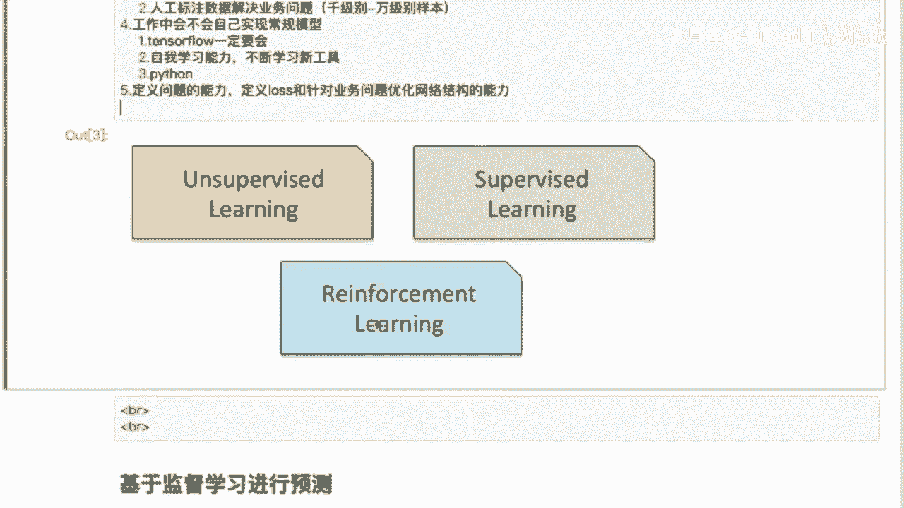

# 人工智能—机器学习公开课（七月在线出品） - P14：来自工业界的经验分享：机器学习基本流程 - 七月在线-julyedu - BV1W5411n7fg

好，咱们开始了啊啊兄弟们啊。😊，O嘞好。😊，哎，我先问一下，就是你们这个这个对这个基学习的这个之前有做过吗？还是说没没做过？😡，啊，因为我们今天主要是就是跟大家一起这个过一段这个基学习的这个整体流程。

然后包括一些基本的分类啊，回归模型，然后还会讲一些京东的京东的一些case啊。今天的这个比赛的这个case啊啊你们有是有多少是非资算机专业的，有吗啊。😡，就不能相机啊。不是计算机专业，转专业的。😡。

扣一啊。okK啊，好好好，那那咱们就这个咱们就先开始吧啊。😊，统计专业的统计专业可以，统计专业的呃跟我们这计算机专业还是比较像的啊。😡，Yes。还有学农药的啊，好吧，咱们先言规正道吧啊。

先说一下这个今天这个几个就是三趴啊，第一趴是这个第一趴这个是呃机忆学习一个张术啊啊，基本上大家做机忆学习的人这个呃入门的啊都知道啊，就是首先是有两个，一个是这个非非监督学习，还有一个是这个监督学习。😊。

啊啊，我是老家是东北的啊，我家是东北的啊。😡，把家弄北了呃。啊，开始了啊已经开始了。😊，呃，然后我们今天是这样啊，就是我们今天因为我看到这个打字还是这个挺多的啊，我还是尽量这个尽量先说这事儿呃。😊，呃。

尽量先说这事吧，好吧，这个因为这个如果是挨个F徽肯定是聊聊不过来嘛，对吧？😊，我回答这个学生的，这个也能后也呃呃回答不了那个学生的。呃，我是应该说是一个这个互联网的这个资深的这个老兵吧，好吧。

资深的老兵吧，就是这干过很多很多活啊啊从这个最经典的这个CTR预估，就是广告点击预估，包括这个啊re system啊，然后再包括这个啊比如说这个b data一些大数据，然后dataman啊。

包括这个啊compilation图像这个图像视频这些事我都做过。😊，应该算是在这行业应该就是待了差不多也快也有这个也有十来年了啊。啊啊就是这些事基本上都都见过，也都做过嗯。嗯。All。这个集训人这块呢。

主要还是先这个给大家一个这个整体的一个呃对这个我们这个就是做算法的一个框架啊，一个框架嗯。啊，这块在机一般来讲啊，做算法，一般大家都想是说是这个陌身 learning领嘛，对吧？

先做机学习OK那这个呃最开始在这个啊16年之前啊，大家基本上做这个机学习，一般都分2块啊，一块是这个啊叫阿斯和外界 learning领，就是非监督学习，一块是监督学习OK啊。😊。

其实在企业的就是在企业内部啊，这里写的是两个，但企业内部大家基本上大部分人其实都是会去做这个supervis learning啊，就是很少会有这un superervis learning啊。

我不知道这个我说的话这个。你们能不能理理解啊，为什么说在企业内部大部分的人都在做这个supervis的啊，但是昂 superervis呢基本上啊没有没有什么很少人做啊呃。

如果说有这个能理解这个话的这个呃同学可以在里面说一下嗯。😡，啊，就是我们这个大部分的基本上进这个。正当是，比如说你。你你要进这个进BOT对吧？这个这个百度啊啊对吧？阿里腾讯，然后现在包括头条啊。

包括头条对吧？现在这个这个头条起来了呃，包括还有美团，对吧？啊，这些公司其实大部分都是这个有lago的数据啊，有lago的数据啊，其实你们说的对啊，一个是无监督，就unurize的难做啊。

这这一这是一个这是一个这是一个技术问题啊。但是这个实际上问题是其实在公司里面我们都是能拿到有lago的。😡，有来弱的数据。啊。啊。就是公司里面大量的都是这个。都是有lo默的有lo默的。

比如说这个广告的点击率，对吧？然后你比如说这个那是广告系统，做推荐系统啊OK我肯定能拿到这个用户的这个反馈的这个信息，对吧？各种反馈信息都有，对吧？Yes。啊啊你比如说这个呃。你比如说你这个用户。

你点了这个广告，对吧？他的这个数据会被你的这个点击行为会被这个啊label下来啊，通过这个这个客户端对吧？然后再返回到这个ser端，然后通过这个啊log再进到这个比如说进到我们这个大数据集群。

然后作为一个这个样本的这个label，对吧？OK这就是这个其实其实将来你们这个进融这些企业来工作的话，其实大部分呢还是会去专注在搜当中啊。OK这是在1万年之前。😡，啊，但是也有啊，比如说这个聚类对吧？

就是这个就没有没有logo了，就你你实在弄不到logo了。OK你就去给他这个一般来讲，包括聚类就分三种嘛，一种是强制聚类对吧？对吧？还有一种软剧类就是高斯高斯模型啊啊，但是这个呢这部分工作呢。

这部分的工作呢，其实大家将来如果说进入到互联网工作，对吧？这个做算法ok我告诉你基本上你不会碰啊。😡，Okay。啊，大部分都是还是在这个专注在ser rights当面啊。比如说用这个用数模型。

用这个深度深度学习模型对吧？包括这个buting，对吧？然后包括这个啊啊现在这个比较流行的什么叉B boost的对吧？啊，都是在这个都是有lolo的啊，就是大家会接触到大量的有lalo的这个这个工作嗯。

啊，这是16年之前，那OK那16年之后呢，又出来一个东西叫做这个强化学习啊，这是一个比较新的啊啊，然后呢这个门槛也会比较高啊，它是通过这个人呢在这个环境当中的交互啊，就是你给这个呃环境一个激励啊。

一个交互一个激励啊，他通过你这个人的这个激励呢，然后呢不断的去学习你的行为啊，不断的去进行这个对你的行为呢进行不断的一个强化啊，这块是强化学习啊，但是我觉得就是对这个对对咱们来讲啊，可能大部分的工作啊。

就是大部分的这个包括你的这个学习的内容啊，可能都会集中在这个绿绿色的这一块。😊，啊，就聚焦在这个绿色的这一块，就这个监督学习啊。那我举个例子啊，我再问一问，就是有多少人做过这个点击率预户模型，有没有？

啊，有接触过吗？或者听到过啊。O。啊，好，那我就简单介绍一下这这一类模型。比如说这一类模型是比如说根据这个通过你的这个大量的这个用户行为。啊啊用大量的这个用户行为啊，比如说这个用户对广告的这个点击。

对吧？比如说曝光未点击这个行为啊，得到这些海量的这些样本，然后拿这个比如说现在是最流行的什拿深度学习模型，对吧？比如说像NR这个包括之前我看有学员说这个这个相呃这个相像机对吧？啊后DFM啊这些模型。

然后对这个用户的这个海量的行为进行学习，能够去啊在这个推荐系统里面，就在这个广告系统里面能够去预估准确这个广告对这个用户点击这个概率啊，根据这个概率值呢，然后会排个序。

然后把这个根据这个排序后的这个广告的这个清单啊会啊展现给用户啊，就展现给你。啊。🤢，就这个过程啊，而说这个点击预估呢呃，这个基本上所有的对于你们像入门的这个同学来讲，应该是。都要去这个经历的啊。

就是啊啊都要去做这样一件事情啊，因为做这件事情呢，可能对你们这个啊一为这个事情是所有的公司啊，基本上这个啊所有的不管是大大小小的公司啊，他基本上只要他投广告，对吧？做广告做平台啊。

都会有这样的一个都会有这样的一个一个工种啊。对吧他这个功能呢它都有需求啊，基本上呢这个需求呢可能会啊包括了很多，比如说这个会有数据组，对吧？这个呃这个数据组做啥呢？

就比如说这个在所有的这个海上这个点击里面，对吧？有很多是作弊的，对吧？有那种刷单的。😊，对吧然后包括有这个。啊呃。就是用户这个无法判断的这个误点击，对吧？有这种噪音的啊。

他可能会去专门去做这个做这个处理处理数据，专门去清洗这个数据啊。呃，然后这个。然后还有这模型组啊，模型的话就会去呃大量的这个优化这个model啊，大量的优化model。啊。

比如说这个设计就是设计一些这个针对这个业务的这个模型。啊，针对业务的这个模型啊。这个啊这个这方面的这个工作呢，可能你们将来这个进入这行啊，可能都会去遇到。因为这方面的这个缺口呢。

其实这个呃这个招聘的这个缺口呢也很大啊也很大。啊，点击预估呢是这个是这个 superupervis money里面的其中的一项啊，只是一个小项啊，当然还有很多这个很多的模型。

比如说这个啊很多supervis，比如商品预测啊，预估这个商品啊，会不会这个被这个用户购买啊，包括这个比如说啊在这个广告再深了一层，就是这些用户点了这个广告，我们去预估准了，他们点了这个广告。啊。

点了这个广告之后，然后这个用户会不会下单，对吧？啊，这个事情其实也是一个可监督的一个一个model，对吧？就是可监督的一个一个学习。我们除了这个预估这个就是广告的这个点击率之后啊。

然后啊同时还要去预估这个。这个广告点击了之后呢，这个用用户是不是被转化了，对吧？是不是在这个商家啊进行了这个购买这个商家的这个商品，或者是购买它的这个对他进行下单啊。

这个可能啊就是类似于转化率模型的那这个也是一个这是可能是对于这个呃商家来讲，可能是最这个。就是最关心的啊，那这部分呢其实也可以去猫叨啊。😡，啊，我不知道大家听明白没？我刚刚说了两个事儿，一个是点击率。

对吧？一个是这个转化率的一个这个转化率的一个模型。这两件事儿大家听明白了吗？有不明白了吗？😡，啊，OK啊，扣一就明白啊。OK那我再问一下，你们说这两件事哪件事更更难一些。就这两件事。

假如说现在我有两个任务啊，一个是点击率model，然后还有一个转换的模型，谁更难啊。😡，啊。啊，对对对对对对，没错。ok ok。😊，OK啊。O。啊，转化率是更难做了啊，包括它的特征设计。

包括它的这个啊这个label的获取啊，这都是这个数据都是呃更稀疏的啊，就是比这个点击率更稀疏的那对于这个。对于这个呃大规模的积极学习来讲，它肯定是数据是越稠密啊，越丰富是越好的啊，那么okK。

那我再问大家一个问题，就是其实真我们现在在讲这个机学习啊，这个是通过这个海量的数据去学习的。但是但是还有一个问题，大家思考一下，就是咱们自己平常是怎么学习的。比如说一个小孩，对吧？

他从这个呃就是人脑真的我们在做这个很多都说这个现在做各种这个深度的学习网络，比如说转辑网络啊，什么RN啊STM啊这些东西，那然后就拿这个很多的这个很多这个数据，然后很多的图片，对吧？

视频拿去喂为什么mod着把它串出来。那我的我的一个问题就是我们想想我们从小到大，就这个人脑是怎么去学习的。😡，是我们去针对这个是给这个小孩看很多的这个看很很多的东西呢，他去学习呢，还是他看到一个。

然后就联想到另外一个一件事儿。我举个例子，比如说我们会去。😡，给比如说我们会去给一个小孩看1000张1万张老虎的图片嘛，然后再教会他这个是老虎，或者再给他看这个1000张1万张这个猫的吗？

或者是这个1111条广告扔给他，对吧？这个是不可这个是不会的对吧？😡，也就是说其实啊对吧？这个肯定不会，这样这个大家都清楚，对吧？OK那OK由此继续学习呢这个监督学习可技这个大规模数据监督学习啊。

最近呢还有个是比较这个。😡，你说来一个比较火的这个。这个研究方向也叫st learning啊，我不知道大家有没有听过这个自 short learning啊，fe short learning。

就是呢这个是小样本学习。😡，有没人听到嗯。😡，有没有思考过这个问题，就是我们今天拿这个机器来学习，对吧？OK好，有人听得不错啊。😡，我们拿这个拿这个这么多的数据来学习啊，拿这个这个神经网络，对吧？

我们设计des这个。😡，呃，design的这个这个很复复杂的模型波FFM对吧？DFM对吧？这个加深网络层数层述，对吧？然后这个加呃改更改更多的这个机构函数。啊。改更多的这个激活函数OK。啊。

然后来学这再然后再这个花了一个很长的很长的时间来学这个学这个点击率模型，对吧？或者说学一个认知一个一个图片，对吧啊。啊，但是真正呢其实真对我们这个人脑的这个学习呢，其实非常类似的，还是也不算是强化学习。

还是一个小样本学习。也就是给你一堆小的很小的样本。比如说就只有一张图，对吧？或者是一条样本，然后你能够通过这一条样本来学出啊学出它的这个让这个模型具备放化能力啊，OK那这是一个纵生啊，众生啊。

我这个今天是给大家这个啊说一下啊，其实说一下啊，那后面不会提到这个社的表面啊。😊，啊，这是一个众生啊。啊，主动学习，我不知道你说的是什么叫主动学习啊，没有听说过啊。😡，没听说过主动学习啊。啊。啊。

IT观念啊IT观念经过啊。😡，啊。对。但是啊但是我告诉大家啊，其实在企业里面啊，就是啊比如说啊比如说这个像小二本学习，对吧？像trans learning啊，包括这个sivervis learning。

我告诉大家，其实最好最最容易做的是supervis learning啊。😊，就你们将来挑工作对吧？对吧？老板告诉你们说有A任务A任务B任务C对吧？任务A是一个这个大规模的数据。

然后点击率模型任务B是一个什么t runningning对吧？任务C是受到ningO我告诉你，你就选A好吧，A是你你是压力最小的。然后你能最能够这个最容易的去拿到成绩啊。

比如说这个我们在这个监督学习里面啊，去看AC对吧？去去看这个点击率，不管是广告点击率也好，商品点击率也好。😊，啊，对吧。O。啊，这些都是呃这些都是你们将来可能会遇到的问题啊啊那我告诉你。

你们就选A选这个这个svis啊。因为为什么呢啊，那我们告诉你为什么呢？除了他这个这个数据丰富以外啊，这个一个是研究的人也多，对吧？然后呢，我们针对这个svis learning啊。

我们是在这个企业里面是总结出了一整套这个怎么去把这个model给它做好的1一个类似于这个流程化的这个一个工具。也就是说我会给你一个老板给我们一个任务，对吧？😊，okK我有这个就是我有套路啊。

我会去有套路啊，就我们今天讲的这个啊继续学习的这个基本流程啊。啊，有这个套路啊，去这个啊去不断的去把这个指标做高，对吧？比如说我们很多这个人参加竞赛，对吧？怎么去做高指标。

然后这个model的问题出现在哪，对吧？是这个啊overfi啊，还是underfitting啊，这些呢啊你们都是就是就是我们都会有这个。啊，就是一个这个比较这个模式化的东西啊。

就类似于八股文来讲去把它解决掉。啊，我希望这个啊然后呢，我我其实还是讲综述啊，还还是会过一遍啊。因为这个啊大部分还是这个啊韩老师的这个啊啊照着他的过啊。

但是呢这个我还是会去说一些这个呃就是说一些啊一些我的这个这个这个理解和经验吧，就告诉你们将来怎么去避过障碍，对吧？咱们这个。😊，对吧就有些事就别干，对吧？有些事儿这个就得干是吧？😊。

比如说这个min face learning啊，那我告诉你这个我们的看法是什么？就我们对这个这个model的看法是这这个算法的看法是什么？就是啊这个算法比较比较复杂啊比较复杂。然后呢好落地啊。

就是特别不好落地OK啊。😡，就特别不好落地啊，所以这个将来你们要是呃比如说在这个对吧？在在什么大公司对吧？AATM上还是BAT还是还有比如说拼多多对吧？然后这个去头条，然后这个。啊。

一些小公司啊啊老板说做一个强化学习啊，要小心一点啊。好吧，就是我就这个啊有我的这个我不是呃就说不是咱们不是说不做这个挑战性，这个更更大的东西啊，不是说避开这个挑战性啊，我的意思是啊大家先做保底的啊。

就是先拿到自己的creddit啊，然后再去做那些新的东西。😊，啊。啊，不是说不做啊OK然后这个说到这个。😡，这个监选也除了这个点击率预估里面啊啊，然后这个在这个搜索推荐啊。

我们这个其实大部分啊就是加到你们这个找工作啊，这个这个这个往这个行转啊，大部分啊可能都会做这个搜索和推荐啊。所以我推荐里面呢有一个model叫做相关性模型啊，我不知道有多少人听过reS modelel。

😡，也就是说这个。啊，用户分了个qury对吧？就就比如说这个这个。啊，说了一个que儡啊，这个que儡叫7月在线，对吧？然后呢，这个啊这个这个索引呢对吧？咱们这个广告库呢。

这个网页库呢就会从这个索引里面拉出一堆关于这个啊7月对吧？还有在线，对吧？7月在线对吧？然后还有什么光线在线对吧？各种在线啊，然后各种7月对吧？😊，对吧甚至把五月天都给拉出来，对吧？

那okK那这些海量的这个候选呢可能会有一个model啊，然后会去校验就是把这个海量的这个网页啊，海量的这个海量这个网页这个特征啊和这个用户搜的这个 queryry去计算这个。😊，相信啊。

通过这个相信呢先过一道，也就是。啊，让这个比如说我有这个一万个候选，都是关于企业在线的，或者都有7月啊，都有在线啊LRP里面的对吧？那OK那O那么问题来了，那那这么多候选对吧？扔给这个。😡。

给你的这个线上部署的这个点击率预估，你的这个预估model，对吧？你去infence对吧？你这个性能肯定是扛不住了。所以这个在这个最终的这个ro model之前呢，对吧？

咱们这个排序呢点击率预估排序这个模型之前呢，可能会有一道卡。这个卡叫有一个阀值，这个阀值叫相关性的阀值。我们内部叫quality啊re qualityalityQ啊，简称reQ。

这个呢是会去呃有监督的啊，去计算这个出来的候选和这个和这个用户搜的这个quire的这个相关性。OK那这也是一个supervis learning。但是我要告诉大家是为什么说这个事呢？

就是对于这个监督模型，这个相关性的这个监督模型啊和这个点击模型的不同点在哪里？OK那点击的模型呢可以通过这个用户的这个点击你去取道，对吧？你这个所有的用户的点击我们都可以啊落下来，对吧？

通过这个fu对吧？然后拖到对吧？再拖到再拖到spark对吧？然后ok这个la的数据有了，你就开始了，对吧？😊，O跟消息模型。😡，那我想问一下大家。那么这个query7月在线对吧？

和这个7月的一个一个派偶队，对吧？跨尔队，然后和这个在线啊，和比如说这个5月在线对吧？6月在线对吧？这个相关性相关性的这个modgo啊，从哪获取，这个有谁知道嗯。😊，有人知道可以在这个在这个群里说一下。

😡，啊。明白我的意思吗？就是兄弟们听明白了吗？😡，就是你这个像你这个各种点击率，对吧？商品一波什么的，你这个可以通过这个用户的行为拿到这个label。但是我们在里面做，比如说做一个相关性模型。😡。

要去计算这个网页或者计算这个商品和用户搜的这个快的这个相关线。兄弟们。😡，你们知道这个label是怎么获取的吗？肖关。😡，啊，相关系数对相关系数怎么得到？就这个这个比如说这个这个网页对吧？

网页的内容或者是这个商品的内容和这个用户做的query是不相关。😡，啊，这个nbe怎么得到，大家想一想啊，考虑一下。😡，啊，咱们今天就互动啊，咱们今天就是各种实实战的问题互动啊，就玩这个。啊。

是怎么得到啊，就是这个问题啊，这是一个问题。就你你从哪里去拿到这个相关的数据啊，这个是就这个label怎么拿到，对吧？你的确有不多不不不多这个这个这个很多的这个候选啊。

就但是这个query和那个query啊是不是相关？我举个例子。😡，比如。no no no啊，我举个例子啊啊，有一个叫做这个有一个叫词叫做巧克力，对吧？有一个词叫做巧克力蛋糕。😡，这两件事是一件事吗？😡。

不是吧，巧克力和巧克力蛋糕对吧？要是搜了个巧克力，我给他出了一个巧克力蛋糕，对吧？这肯定不对，对吧？就不是要他想要的。😡，啊。啊，那这个label是啊这个label对吧？这是没有的，你你是拿不到的对吧？

啊，比如说这个巧克力和巧克力量，但是这两个宽ry呢，这两个词很像对吧？里面你比如说你算这个长度啊，匹配度啊，很像，但是他说的呢语义不是一件事，对吧？那好吧，这个讲了很多这个通用用务行为来来来获取的啊。

那我告你这获取不到的啊，因为你不知道它是不是相关的不相关的啊，词销量是你对它进行这个特征抽取啊，但是我问的是lago怎么得到那其实在企业里面，就是大家将来这个进了这个百度啊，进了这个阿里啊，对吧？

腾讯啊对吧？这些google啊对吧？微软啊对吧都会遇到这样一个问题，就是O它是这个监督问题，但是呢你要拿不到这个solo的label，那我告诉你。😡，这个label是通过众包PK下来的。

也就是众包评测的okK也就是什么意思呢？就是说可能是有一波专业的这个做这个相关性做搜索的。😡，他会去对这个整个的训练的这个语料进行一个label的评估啊，这个时候会拿到一个就你会有一段时间空仓期。

也就是会等这个label。听明白了吗？也就是说你将来要准备的数据，对，已经是人工标注了啊，他跟这个普通的点击率对人类的，没错。😡，Yes。啊，有一个同学是看不到那个那个有没有助理助理老师帮忙看一下。

Okay。okK那我告诉你，你会准备这个派对啊，准备出来这个冲越抽样来准备配对，然后呢拿这个派队去提供给这个比如说我们的产品啊，然后还有这个这个外包人们去评估啊。😡，啊，比如说这个B加的啊。

我我将来我说我后面说这个呃这BAT就是百度就不直行百度啊，就是B加啊。咱这个B加呢就是这个评出来的啊，搜索啊，就是它这个大搜啊大搜里面就是评出来的评估的啊。

也就是你们会有这个会有一段时间会去等待这个label数据。包括你的model拿出来之后呢，你要看case，对吧？😡，啊，就是你在做就是咱们在做这个机器学习的时候啊呃。😡，就不仅仅只是看IUC啊。

宣不转啊。😡，可能我们在参加竞赛的时候，可能就是以指标为论，对吧？为指标论。比如说AOC对吧RSMSE对吧？这是指标论。但是我告诉你。😡，在指没指标链在公司里面是会有问题的啊，仅仅是没指标链啊。

咱们会被老板给。😡，啊，老板给这个b掉。😡，就是为指标链绝对不是一个这个合理的方式啊，就是大家需要在这个将来需要在这个指标和cases之间去进行一个balance。啊，你可以这么理解。

也就是互联网的这个公司啊，有各种这个各种办法去收集label数据啊，收集label数据啊，其实就是通过这个人来标的啊人来标用的。😡，嗯。啊。OK啊。😊。

也就是不仅仅是okK你你你将来你这个比如说这个消息模型，对吧？你训练出来之后。😡，啊，你的UC是吧，是0。8对吧？0。9啊，或者是多少，对吧？你这个这个指标已经很高了啊，但是我们经常会遇到一个问题。

就是啊我们看case发现啊。😊，其实推的很慢，你知道吧？其实出的很烂啊，出的很垃圾啊。😡，啊，这个时候呢说明什么呢？😡，啊，就说明这个你的这个你在这个设计这个整个的这个流程当中啊，可能有一部分的样本。

你的feature没有看不到。啊，这是兄弟们要记住的问题，就你你要做完UC其实很容易啊，我后面会讲这个怎么去做完UC啊，有N种办法把这些指标做好做的很漂亮。但是你要把用务体验做好，这个不容易啊。

也就是你你在每天。😡，再看这个自己的模型工作做的好不好，一定是要看两头，一头是看指标啊，就是看你这个lo方式乐啊。然后还有一头，你一定要去看什么，看case，看这些难的case，你就没解掉，对吧？

我举个例子，比如说一个用户搜了天天向上。😡，对吧。那你觉得他是这个你你是你是觉得出这个天天向上的这个这个综艺，就是湖南台这个综艺节目好呢，还是给他出好好学习了？你觉得哪个消耗性高呢？😡，兄弟们。😡。

对吧这就是一实际问题。我看到有一个有一有一个同学这个说上午天天向上，对吧？咱们拿这个天天向上举例。对吧你是出哪个好，对吧？这就是个问题对吧？对吧？很多时候model会把天天向上学成了这个和这个好好学习。

比较这个比较这个这个这个这个这个相似啊，兄弟们。😡，Yes。对吧你要去看caseokK然后你怎么看case呢？对吧？对，这个同学说的很对，结合用户画像，对吧？

okK那你就会你就会发现你这个model是不是能学出你想要的，是不是跟这个用户。😡，呃，这个真正的兴趣是匹配的对吧？😡，啊，比如说这个用户可能他是一个这个小孩的家长，对吧？天天搜什么这个学英语啊。

学什么，他可能都天天向上可能就是要学习了。我们这个用户呢可能就是因为这个对吧？小年圈对吧？天天看这个各种卫视的OK。😡，啊，他可能也就是你你可能就给他出这个快浪的音，可能他就会很开心啊。

他觉得你这个搜索引擎，你这个40引擎是是。😊，🤧不错了。O。啊。啊，兄弟们啊。啊，这是我要说的啊。😡，啊。对，也就是将来大家这个从事从事这个工作啊，都集中在这个绿块啊，然后这个绿块里面就分两波。

一波是你很容易拿到label，还有一波是你不能够拿到label的。😡，啊，但是呢我告诉你，大家这些事吧，你在这个比赛里面你是。😡，你是获取不到的啊，兄弟们，我说这些事儿，你在这个竞赛啊。

什么这个天池啊什么这这些啊什么卡go啊，这些比赛里面获取不到的都接受不到的啊。他是拿这个像类似于cargo啊和天池啊，这些网络竞赛啊，都是这个。😡，但是把这个数据都洗好了，然后脱敏了。

然后丢给你OK一个标准的这个bench mark在。😡，O。啊，标准的bonch mark，然后你去刷那个分对吧？你竞赛这个一直刷到这个他这个对吧，刷到天昏地暗，对吧？一直刷到他截制的那日期为止。

O你能不能刷出这个结果来啊？😡，啊，那我告诉你这个。这跟你参加竞赛和在这个公司的这个工作也是不一样的。啊，然后我再告诉你大家一些兄弟们一件事儿，就是咱们呢做这个机器学习啊，其实最核心的能力是什么？😡。

啊。很多人会说这个呃设计出一个这个复杂的一个算法，对吧？然后解出一个这个。解除一个什么这个这个设计一个什么落方式。😡，啊呃然后这个比如说包括什么呃，我们这个新手首推这个叉GB啊。

包括这个就哥们说的这个调餐啊，各种调餐，调的的时候好餐，对吧？这个在12年的时候很流行的一句话。😡，兄弟们。啊，我告诉你不对啊不对啊，这个这个都比较偏差啊，不是说你能推动式你就很牛逼啊。

因为这个有时候我也带一代线下课嘛，对吧？就带代线下课嘛，然后呢。😡，我告诉你兄弟的不是啊，把业务稳定呢也不是我告诉你大家锻炼的是什么能力，是定义问题的能力。😡，啊，是理解问题的能力啊，兄弟们。

就你怎么去定义这个问题？比如说这个相关性，你怎么去定义相关性，对吧？😡，举一个很简单的例子。😡，啊，非常非常简单的例子，就我们在做这个消关性模型，就是这个这个可能很多公司对吧？都会去做这个相关性模型啊。

但是大部分的公司啊都会拿交易商作为落ose方，对吧？都会拿这个这个很非常普遍的对吧？就乐图里面有一个交商，对吧？就拿那个对吧？这大家就闭着眼睛，这个就自动干对吧？然后这个学出来的效果也很好，对吧？

看着还不错，对吧？他告诉你啊，这个不是精益求精的解法啊。😊，你要去想办法去设计这个落ose function，然后来这个解决你这个判断你的这个case啊是不是相关啊。

你要去设计这个loose function来拟合你的问题啊，就兄弟们一定要在将来在这个工作场合一定要考虑，就是我们今天讲这个监督学习啊，监督学习啊，监督啥监督啥，就是我们这个拟合的这个技术目标。

比如说这个AUC对我还要这个还是要跟大家强调时刻强调的一点，就是咱们做的这个要做完这个AUC。😡，或者是最高这个。做开这个指标，就你这个指标一定要和你的业务去拟合，就你跟你业务是一致的。也就是你要去啊。

你在你这个模型训练好业务训练好这个这个这个模型的同时，OK一定要去跟你的业务去拟合做啊，也就是跟你的这个跟你的这个业务去配合好。也就是你在做这个技术的问题啊，就很多时候啊，我们就是在工作里面。

大家都会犯过错误。😡，犯的错误。大家都会犯现个错误啊，就什么错误呢？就是我发现你模型做的很好啊，A0。9啊啊，为什么效果不涨？😡，啊，就为啥这个点击率不提升？😡，经常会有就你的off2的指标。😡，涨了。

but你的这个。😡，啊，你的这个线上的业务指标不涨，然后老板就开始问了，对吧？这为什么不涨？😡，兄弟们，这是我们要思考的问题。😡，好吧，就将来你们进入的这个场，对吧？进入咱们这趴啊。

就是一定要时刻思考的问题，就是你的技术技术指标是不是提升了业务指标。😡，OK就是你们将来在工作当中，比如说你将来对我想大家学这个课，肯定还是想往这行挤嘛，对吧？😡，🤧往这样起嘛，对吧？😡，啊。

对吧你这个你要挤进这一行，对吧？你要思考的问题，不是说你能推哪个手推这个二阶宝胎掉展开，能推推这个你们推这个公司的人太多了，一站一半吧。😡，啊，兄弟们真的要思考自己，锻炼自己的这个实战能力。

就是定义问题的能力。😡，啊，就是你去定义好你的这个业务问题，然后把你这个业务问题转化成你这个速维外资管理。啊，就我们经常会出现这个这个也就是。大家这个发现了这个这个很多的问题，就是我技术指标很高。

但是我业务指标不高。😡，啊，就是问题没有定义清楚。啊，这也是这个大家会踩的一个坑啊。Yeah。啊，当然了，这个实际上呢这个对于速讼外 money呢，其实还是很简单很easy的啊。

就是你们这个入行之后啊这个。😊，啊，不会很easy啊。比如说这个针对这个模型出于什么程度，对吧？是嵌顶盒是过顶盒OK那对于嵌顶盒的问题，我们怎么解有多少种方式解啊，多少种这个。😊，啊。

通过这个比如说去加数据啊，去改进model啊，对吧？啊，然后这个数据升维啊、降维啊啊，这都是。有固定的这个8股模式了啊，其实都是套路啊，其实都是套路啊，难的是你这个想明白这个问题。

就是你怎么去解决你的这个业务问题。比如说举个例子，就是相关性模型，对吧？这个相关性啊，什么叫相关性？我觉得到现在大家就业界啊，这个顶会啊，什么的都没定义清楚这个问题，就啥叫相关性，什么叫相关。

什么叫强相关，什么叫弱相关，这问题，反正我看配件呢也没找着，对吧？😡，啊，这是我这个举的一个这个啊这个这个这个例子啊。呃，然后呢，这个大家在这个日常工作当中啊会不可避免的，就是一定要做一件事儿是啥？😡。

啊，这一件事儿是啥？除了看这个CCDN对吧？看看那个李航的那本，就是统计机器学习。😡，啊，然后再看这个。看有什么这个这个这个呃。😊，呃，什么这个各种这个这个呃这个这个网上帖子，对吧？

现在很多这个都是帖子会很快，对吧？针对一个算法，然后巴拉巴拉，然后马上直接号路上就就有它的这个原码实现了，也也不需要你去实现啊，但就是兄弟们不要忘一件事儿。😊，就是大家一定要看paper。

顶会的paper一定要看啊，顶一定要看。虽然paper是假设啊，就很多是假设的问题啊，但是这个兄弟们一定要看，就一定要去看顶汇的 paperper一定要看啊，因为这个在我们做算法的同学啊。

其实他跟别的不一样。比如说你你要是你要是教英语的或者教语文的，你一辈子不记录也没关系啊，也不然也没没什么关系，对吧？那因为我们做算法啊，就是算法其实迭代更新的啊。😡，比如说举个例子啊。

在12年的时候可能只有阿拉穆斯的对吧？就是有一个。😡，有一个不信。😡，啊，有一个 booststing对吧？那时候就觉得哇靠， booststing很牛逼，对吧？

这个这个okK然后针对这个 booststing呢就展现出来很多，比如说这个什么咖sK boosting啊，然后这个这个什么TD boostting啊，各种bosing啊。😡，啊，太有啊。

感谢兄弟捧场啊，感谢兄弟捧场。我这个怎么说呢？也就是一些自己的一些经验啊，自己一些经验啊。😊，啊，也就是一些经验就是这个这个都报给大家啊，都报给大家也没有什么特别的。因为这个讲不出什么花来啊。

讲不出还有啥太多花来啊，就是告诉你们这个将来怎么去避免啊，避避免这个。😡，就是呃怎么去避免这个这个。一些坑对吧啊一些坑啊。😡，啊啊比如说在这个12年的时候是吧，有一个 boostsing啊是吧？

很很很很厉害，对吧？然后到了113年14年，对吧？那个于凯呢把这个这个神经网络拉回来了，引引进了中国，对吧？虽然是神经网络是NG他们对吧？黑他们他们这个这个这个做出来的对吧？效果啊。

然后这个也是于凯他们首先在百度这个先先打响的。😊，okK然后有了深度学习了之后呢，然后就有了卷积网络，对吧？有了卷积之后呢，然后又有了什么有了循环卷积网络啊，OK好呃。😡，然后到现在呢，对吧？

也有强化学习啊，但是我我我我我是强化的黑粉啊，我是黑粉啊，我就说这个兄弟们你好，不要慌啊，因为他这个这个是个大坑，就是很难实现。呃，比如说DQN啊，DDPG啊这些算法很难实现。😡，好。

我看见这个同学很多说这个顶货的paper在哪找是吧？啊，兄弟们啊，我告诉你这个。😡，一般是什么问题？O比如说你遇到了一个点击里，对吧？click model的一个问题。比如说它overfi了，你怎么做？

ok你上google好吧，就是你在google里面去搜你的这个用英文去搜你的这个问题。你抽象出来你这个问题，比如说是releance啊或者overfi，对吧？你你你你在这个google里面学术里面去搜。

然后呢，你去勾选这个前几年的这个paper。😡，然后引用次数按照引用次数倒排。😡，一工次数倒排，一工次数越多的啊，那个就是这个更权威的paper啊。然后我推荐大家几个几个会啊。

一定要看每年啊这个今年现在3月份了，3月份是ICV啊，然后几个会，大家兄弟们一定要把那些去跟录那些会的这个顶会的这个主页啊，把他这个今年的会的这个 paperper全部下载下来。兄弟们啊。

记住全部下载下来啊，挨个撸啊，那我告诉你好，我在这个地方写一下啊，首先是比是最比较牛逼的。😡，6色对吧？然后这个KDE。😡，啊，推荐上面macs。啊。然后图像上的这个图像，比如说这个IGCI。啊。

呃然后是吧ICML。啊，IC。呃，我看看还有哪几个会啊。呃，然后是奥对ICC。对吧还ACM。对吧就是一些会啊，兄弟们。😡，明白吧？就是你你所有的这个遇到的问题啊，或者什么的。

你都去这个去这个后面去去找找去啊。虽然说他可能只能解决他的问题啊，但是我告诉你，就你从事算法工作，你每天面对的东西就是大量的议文paper，就这个一定要会啊，兄弟们我希望大家都能转化成这个互联网员工啊。

在这个尤其是算法员工，对吧？咱们做算法了啊，每年都会有这个大概十几个顶会吧，十几个顶会啊，这个顶汇的paper，啊，应该说你碰到问题大部分能找到大部分能找到啊。

就是这个是你不断的去完成自我净化的这种能力OK比如说我举个例子，我现在我在12年13年我给大家讲这个这个逻辑回归，对吧？那时候就觉得哇靠逻辑回归很牛逼，对吧？这个百度一直在用，那你现在讲这个逻辑回归。

这个使用啊，你现在想看你这个BOT哪家公司在用这个逻。😡，你会会已经被淘汰了啊。😡，Yes。啊，已经被淘汰了啊，然后这个然后我告诉兄弟们，你们要达到一什么样的水平。

然后才觉得是一个合格的这个算法工程师呢，就你们。😡，比如说这个花三天功夫撸完一个会的所有配伴，3天啊，只用3天。😡，录到一个会的所有配per，然后每篇paper它的这个基本上它的大意。

它的这个up fuck的你都预愿，然后你都有印象。ok我觉得这个才是一个合格的目标啊，兄弟们，咱们就以这个为目标，好吧。😡，啊。如何啊，审判长。😡，Oh。🤢，就咱们一定要做到这个这个东西。😡，2。🤢。

就是你一定要去仔细的去去看你的，就是根据你的自己的这个业务问题，冲象出来的问题，你去公gle上去搜。😡，去go去google上去搜啊，然后拿到这个啊这个问题啊，这个李平同学这个呃说的很对啊。

也就是你先去看jovastruct。就是这是咱们大家要去啊获得的这个啊一个呃就是一个能力，就是你一定要有这种能力。啊，比如说这个老板耍了一片paper，你要在比如说你要在这个半个小时之内。

你要大概录清楚这个paper大概是一个什么样的一个一个概念。然后你要跟他讲啊，你要跟他讲清楚，你要有这种能力，OK才是从事这个算法工作的这个呃一个必备的一个基础能力。啊，O。明白吧。啊，兄弟们。啊。

Yeah。我，一般一个会的 paperper一般在。上百了啊，百篇百篇以上啊。😡，景徽配话。第二是养成。每天。是。啊。养成每天去google。See。啊。必备。是。B杯型的啊。

因为我知道这个有很多呃很多同学可能是因为这个集训应该有好的，有这个就是也不知道有好的吧。就是说这个有些学员呢他有有比较不错的基础了，就已经有不错比较不错的基础了。但有些人呢可能不是这个专业的。

有很多这个其他专业的这个想转专业的那我就告诉大家，兄弟们，就是你一开始就要这么去做啊，因为。😊，到时候这个出来货嘛，对吧？对吧？所有坑都是要踩的嘛，对吧？就你你现在不踩，你将来一定要踩啊。

你今便在急蓄人要采不了，你将来在经货单里面也会踩，兄弟们啊。😡，我告诉你这个。告诉你们不会遇到不会遇到啊，就是你迟早要踩这个事儿嗯啊。😡，啊，然后这个。啊，然后咱们这个言归正壮啊。

再回到这个回到咱们这个这个这个监督学习里面。OK那监督学习里面呢，你还会遇到一个问题，就是一部分是海量的数据。😊，Yeah。一部分是海量数据解决。解决任务问题，一部分是什么呢？人工标注数据。

标注数据解决。问题。海外数据的范围是在10亿。到100亿。对吧千亿甚至到千亿。建役级别对吧？香野。人工标注数据会在什么千级别。😡，千级别。放几遍。万级别对吧？研标对吧？😡，就从早边到晚，你也就。😊。

小0多的玩你就就标标标要一万个样本，对吧？万几个样本。😡，ok那那问题来了，兄弟们，就这是两个任务啊，大家看到这两个任务。😡，你们会选择什么样的模型去解决，分别解决这两个问题。来谁谁给我答一下。😡。

因这第一个任务第二个任务。😡，是不是都要用一样的模型对吧？这什么问题？😡，谁来回答一下？啊，就大家解决现在比如说老板对给你们两个任务，对吧？这个一个是这个人工标注的这个大概万级别的样本。

然后一个是百亿千亿级别的样本。OK那现在对吧？四大金刚里面把model都讲了，讲了一个遍，对吧？OK那那这个针对这个问题怎么解？😡，O。O深度怎么去解？😊，啊，第一个是深度更深的对吧？规模更大了。

第二个是这个。😡，啊，然后还有一个我我要避免一下大家录区啊，虽然绝代也在这儿啊啊，我跟这个绝浪这个也是多年的啊多年的这个兄弟关系啊。但是呢我告诉你。😡，兄弟们SVM在业界工业界大家是不碰的啊。啊。

我觉得这个对于未门的同学呢，只要知道这个SVM的这个哪里就足够啊，不知道也没关系啊，不知道也没关系啊，没有呃不知道也没关系啊，现然主要也在这啊，这SN写的还写的很很很很详细。

但是我告诉你SM是没有意义的啊。就是我在工业界里面是从来没有用SM去解决任何问题的。我也没有看到每家公司拿SOM来做啊。😡，只是在啊10年以前的这个学校里面啊，大家会拿一些M去解一些图像问题啊。

因为样本小。😡，啊，然后面事也很少有人面。😡，啊，面试很少有人面啊，面试很少有人面。当然也有啊，不同的公司，可能不同的面试官每个人都都这个。😡，都在这个。呃，都在这个都在用啊，只是呃是这样啊。

就是说啊这可能会跟这个会可能跟这个你平常大家接触的可能有些不一样啊，不是说不用啊，兄弟们不是说不用，就是啊对就是你你你得了解它的过程，就了解它的这个怎么去解的对吧？😊。

他他的这个这个这个算法的这个解法你要去了解。但是我告诉你，就是啊一般来讲没有人去用，就是不会去解决这个问题啊，你可以学对对。😡，就比如说一加一等于2，对吧？这个十几分钟用的很少，对吧？😡，是吧。啊。啊。

但是。但是像现在来讲啊，比如第一类问，你刚刚有同学说啊是用这个深度学习模型，我觉得是没问题的对吧？然后第二类问题是用这个ard boost，用这个数模型，比如GET对吧？叉GB啊。

叉 boostokK我觉得也是ro的啊，是ro的。😡，是报可了。那还有一个问题啊，你们学了这么多的mod叨啊。😡，然后在工作当中。事情。我现。就在工作当中会不会自己实现常规模型，我告诉你。

大家告诉你不会。😡，你现在要给你讲的这个逻辑回归的模型啊，包括这个SM，包括ACM模型。😡，好算。哎，哦，这个。搞错了。等一下啊。是的。看看。不会。啊。不会很少，比如说叉GB对吧？XG boosts。

然后这个myGBM，然后叉呃GBDT包括under boost的，包括这个普通的DNN对吧？FFMFMDNFM这些。😡，都不会都都不会这个自己去实现啊，就基本上所有的诚讯的公司都有了。

网上都有P上上有一堆。😡，啊，这到接汉子上有一堆ok。😊，兄弟们啊，这个同学问的问题很牛逼啊，这做调查侠核心能力是是什么？😡，啊，这查咱的核心难力是什么啊，这就也就这也就带来一个问题。

就是咱们的核心竞争力是什么？😡，就我们做算法的同学啊，每天要反复问自己自己的核心竞争力是啥？因为模型大家都实现了。模型我们前面的兄弟们对吧？那些被拍在沙发上的兄弟们早就实现了。😡。

你的核心作营OK你的老素舍是你的第一问题的能力。😡，好，那就是那就接下来就是比如说我举个例子，接下来会给大家去聊聊这个一个工具包叫ski learning，对吧？

s learning把所有常用模型都work了。😡，okK我给大家推荐一款这个编程工编程语言叫做。N3flow这个大家都知道吧。😡，我所以我劝大家进门，入门之后都要会碳酸腐，这个一定要会。

一定要会碳酸服药。这个才能把你的这个不断的去不断的去改这个落ce方式。就很多这个咱们这个库啊什么的，你你都改不了乐死啊，其实你没有机会去改它的loice，你只是调位啊。😡，你调用调用的结论是什么？

你调用一年很爽，你最后肯定是被人超越。我告诉你，肯定是被后来人超越的。😡，ok那。😊，这个我推荐大家做的事情就是pensorflow一定要做pensorflow啊，因为他时说用开s啊。

要用cans用cas也可以也可以。但是我就还是推荐大家去做pensor floor啊，因为这个ca架在这个tensorflow之上的，我建议还是要去。😊，做特们出来，因为开始其实也也简单了。

其实也简单了。😡，啊，当然这是我的个人建议啊，你们有时间可以去学啊啊有时间可以去学啊，我强调的就是ten flow。然后这个tos呢是这样啊，tos在这个啊学术界用的比较多，因为也是比较简单啊。

但是在这个工业界现在呢用的还不多啊，现在用的还不多啊啊，当然这也就是我们算法同学的一个一个必备的能力，叫做学习能力。😡，自我学习能力。不断的去学习啊不断的学习新的工具。

就是将来腾讯flow可能在5年之后，可能腾orflow又变成了一个其他的什么flow。😡，啊，我记得老师的在做wi。😡，啊，然后这个李牧呢就是这个amazon的这个手机客家在做mathnet。😡，啊。

然后那个假气洋啊这咖啡的对吧？就之前做咖啡的，这都是不同的工具。OK那我推荐的是teleflow，就大家一定要会就是啊其实你比如说你像toch开s对吧？咖啡啊，这些我都会啊。

但我推荐的还是tle flow。😊，啊，你你会去自己去，你有机会自己去改这个网络结构和这个loose function来解决你的这个问题。你你可以去。

比如说你把性的 score去定义在loose function里面，把这cos的距离定义在lo function里面，这个会很方便来解决你的问题啊，对吧？

然后你你也可以很好的很方便的去给我们的老板讲故事啊，我今天用了什么东西。😡，对吧就是一定要会。Yes。啊啊不知道他说fl要的，自己去搜啊。不知道他说fl料自己去搜。😡，python啊。

这个就是python，你只要会python就行。😡，对于基础的同学来讲，会python就行啊。Okay。哪里？Yeah。Yeah。钥匙和优望。结构的能力。T。业务问题。啊。

这是一个很快的去就是用t flow，你会很快的接触让主流的业务啊主流了。😡，比如说这个s learning啊，这后边要讲的这个这个工具库叫ski learning，它会有所有它会分装了所有的这个。

这个model啊啊包括这个所有常见的model，然后所有的这个调参的这个语言，它呃这个函数API它都有啊，但这个呢我怎么说呢？我觉得比较low啊，就是学它只是只是入门级，只是小学生，比较low。😡，啊。

就它其实也就是几个函数叫fiter，对吧？transform啊。😡，啊，就这几个函数就每个模型都这几个函数，非得就是串嘛，对吧？就直接就是训练模型。😡，啊。我接触到了有人啊有人在用啊。

但是呢这个有人在用。我觉得大家呢当小兵可以先学没问题，sman可以先学，因为它这个比较简单，然后这个调调用这个函数起来呢，解决问题呢会快会快。就是你的这个上手的这个速度会快很多。我觉得我接觉得可以用。

但是啊penil flow一定要会明白了吗？就是。😊，就你将来你要想你要想这个真正从事这项工作呀，一定要会这个东西，一定要会这个东西，就从事咱们这个算法工作啊，一定要会。但是你做这个。😡。

你去做你去学s learnings learning上手很快啊，这个是。😡，没问题的。好吧，O。

这是没问题的。

