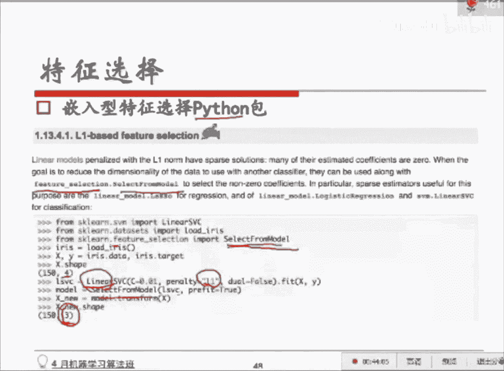

# 人工智能—机器学习公开课（七月在线出品） - P19：特征处理与特征选择 - 七月在线-julyedu - BV1W5411n7fg

我们来说一下统计特征。那统计特征呢是历届的这个cago啊或者天池比赛呀，然后那个以及在天猫京东的排序啊，还有推荐业务里面经常会用到的一些特征啊，这个就是我们说的说和业务。贴贴合非常非常高的。

贴合度非常高的这样一些特征。比如说啊举个例子说，加减平均是最简单的了。呃，这个这个用户买的商品高于全部用户买的商品的一个平均价格高了多少，那可大概可以平衡可以权衡他的一个消费能力，对吧？

然后用户的连续登录天数超过了平均水平的多少，这个能够表明用户的一个年在这这个app对这个用户的一个粘性有多高，对吧？然后我们刚才说了分位数，对吧？商品处于售出商品价格的多少分位数分位数分位线数。

这个分位线呢可以体现它的一个购买能力，对吧？我们刚才说了，分位线是我们把所有的价格购买商品的这个价格从小到大做了一个排序。然后排序之后，它大概处在哪个位置？是这样一个东西啊。

比如说20%分位数就是20%的人。买东西都会低于这个价格。最最特最。底端的20%的。这个位置这个分位线，然后呢，还有排序型的对吧？还有比例型的，就是你已超过全国百分之多少的同学。

经常你会看到呃360会会会跳个框出来，说你已超过你的开机时间已超过全国多少多少的电脑，对吧？就是这种这种比例型的。这种特征也是非常非常有用的。呃，我们来看一个例子。

这个地方有一个天池的一个大数据的移动推荐算法大赛，然后给了两个表给了两个表。第一个表示。用户。商品，然后用户在这个商品上的行为，包括呃浏览、收藏呃，加车购买。他给了4个值啊，1234。

然后这个东西是一个你你不用管这个东西的话，实际上我们我们在电商里头自己是可以拿得到这个可以拿得到这个具体的用户的一个位置的。但是但是我们我们拿出来给大家比赛的时候，不能暴露这个信息啊。

这和个人隐私有关系。然后这个商品是什么类类目的？我刚才说了嘛，要按品类去切，所以。他会告诉你这些牛仔裤的品类，或者这是一个上衣的品类，他不会这么明确告诉你文本啊，他会给你一个品类的一个编号。因为脱敏了。

这也是一部分敏感的数据。然后会有一个时间，就是用户什么时候做了这样一个行为。第二个表呢是。商品相关的一个一个表，刚才是用户，对吧？现在是商品，也是这个商品一个编号。这个商品大概在哪个城市，对吧？

在在上海卖，还是在北京还是在深圳。然后这个商品的一个类别啊，也会有这样一个他提供了这样两份数据。然后呢。让你去给了你数据之后，让你去预测一个月的。最后两天把什么东西推荐给用户，用户最容易点。

我们看看他我们看看这些比赛的同学们造了什么样的特征，有用的特征啊。呃，他们先定了一些规则，他们认为前一天的购物车里头。的商品很有可能第二天会被购买。这个大家应该是自己也会有体会啊。

有些同学买东西的时候会会先不会习惯收藏，他会先习惯把这个东西先加到车里头，然后可能明天或者后天就买了。然后他会剔除掉在30天里头从来不买东西的人，这个是一个数据信息，对吧？

因为这部分数据对我们没有什么用。接着呢有一些同学他会加加车连续加4件，但他只买里面的一件。那我们认为剩下的这些他基本上是不会买了。好了，这这个东西是我们定了我们做了一些数据清洗，并且定了一些规则。

我们来看看我们做了哪刚才在刚才那个我们说的那个。连续值、离散值、时间维度，他们分别做了一些什么样的特征？购物车的一个购买转化率。大家想想，每个人肯定加车以后买的概率不一样嘛，对吧？

所以我我对每个用户产出了这样一个东西。有些人可能加车了就会历他历史所有的信息都是加了车，他就买了。所以呢我我那我转化率高的这这个这部分人我可能直接就用他加车的这个东西去做推荐了，对吧？

或者和家车相似的东西去做推荐吧。然后商品的热度这个很明显，对吧？因为因为比较热的东西肯定是大众比较喜欢的，所以它是商品维度的一个统计特征，热度嘛，而且是一个连续值，对吧？

你可能会用它的销量或者什么东西来来代替销量的话就是一个连续值嘛。然后第三个是对不同的item点击。这些这对不同的item的。呃，sorry，这个东西的话应该是商品维度。

但我我大家不知道我这个地方不知道说明白了没有啊，我我的意思是，现在有一个商品在这有一条牛仔裤在这儿，这条牛仔裤被点了多少次，被收藏了多少次，被加了多少次车。被多少人购买过，有4个连续值。

所以它是商品维度的统计特征，但它同时是一个连续值的特征。也就是一个时间段以内的一个连续统计的连续值特征。然后包括用户维度的会有些统计特征啊，那每个每个用户可能也会对不同的item。

不同的这个商品会有点击，会有收藏，会有购物，会有购买和加车的行为，对吧？我们把这个也统计出来了。包括。变热门的品牌和商品，这个的话是一个X值型的嘛，对吧？我们刚才说的统计里面做差嘛，你今天有多少人点了。

减掉昨天的。看看这个数有多大，今天有多少人买了，减掉之前一天的那这个数有多大。如果这个数非常非常大，意味着这个东西逐渐的在变热。最近的一天两天、三天、7天一周的行为数与平均行为数的一个比值。

大家可以看得出来，这是一个统计维度的一个一个特征，对吧？是一个用户维度，用户维度每个用户他有些用户他就是点，我就爱点，但我就不买。所以。所以他会从几个从几个每从总的行为数和每一个行为数上去看一个比值。

因为有这样的话，你可以分析出来不同用户之间的一个差距。因为有些用户就像我说的，他就爱点，他就不爱买。有些用户他点的非常少，我点了一定会买。所以。我们会拿到一些笔值的一些特征。

然后会有商品在类别中的一个排序。这个大概是你可以按照一些别的东西去排序啊，比如说热度或者是呃被点击量购买量。然后这个呃它有多新，上架的时间有多长等等去做一个排序。包括商品交互的总人数。

这又是商品维度的一个统计特征，对吧？是求和型的一个特征。也就是有多少人在这个项目商品上有有什么行为，你可能总人数有多少人在这个商品上有会有行为。然后会有些其他的，包括包括商品本身的一个转化率。

刚才我们说了人驾车以后会有个有个有个转化率，对吧？那商品的话，有些点进来了以后。或者说我展示出来之后，这个商品展示出来的次数和他被购买的次数之间是什么样一个状况，对吧？有些商品他可能基本上每次一出来。

有些人可能就买了。然后有一些商品的话是暴露说展示了很多次，但没人买。所以。这有个转化率。然后我们总的平均的这个类别，这个类别比如牛仔裤这个类别，它也会有一个转化率，对吧？然后这是一个比值。

所以也是比值型的一个统计特征。然后刚才说了很多统计型的连续值的统计一些特征。然后我们现在来看看它也会有一些。刚才这个还是一个比例型的啊，是商品的行为处以同类行为的一个均值。对我们需要开一个时间窗口。

我们只统计，比如说前一周或者是前最多拉到一个月呃，得看啊，如果是对全全个每个季度的东西去做推荐的话，是是你是可以拉到拉到3个月的。这个时间窗口你自己也会根据具体的情形会去定。然后我们看看最近几天。

每次我们约束最近几天的话，其实会有一个时间型的一个一个东约束在里面，对吧？我们看看我们对时间型也做了一些探讨。比如说最近的这个交互，离现在的时间。比如说对你在1小时之前加了一次车。

或者1小时之前点了3次，这样的话很有可能你对这个东西是感兴趣的对吧？所以是最近的这样一个交互到现在的时间，总交互的天数，总交互的天数呢可能代表的就是这个人的一个这个商品对和这个人之间的一个一个关联度。

呃，总总交互的天数表明这个用户对这个app的一个一个关联程度有多高。呃，后面是一些别的一些统统计特征，用户于对品牌币的总购买数除以收藏数、购物购物车数，这些都是一些。求和。然后平方。购买比一些比值。

对吧？我们看看他还还做了一些别的一些一些这个时间性的一些特征。比如说前一天最晚的交互行为时间。这个有什么用呢？这个和用户的习惯有关系啊。因为有些人他可能就是。夜猫子或者说他就喜欢扮夜购物。

然后还会有一些用户购买商品的一个时间。就是这个时间是到到也还还还是一天之内哈，就是平均他会在一天的哪个时段去去做去买这个东西。最早他最早一次是在比如说早上7点或早上6点买了，最晚一次是什么时候？

然后平均是什么时候这样一些时间型的一些特征。总共就是用这么一些特征去最后就分析出最后建模之后拿到了一个比较好的结果。你看它分析的维度非常非常的细。各种统计型的特征，包括连续值，包括。时间行。

然后我们刚才说了，这里头有类别嘛，品类嘛，所以它它有类类别型。呃，我们刚才说完了前前面那个例子，我们再说一下组合特征啊，组合特征最简单的组合特征是拼接型。什么意思呢？在逻辑逻辑回归这种模型里头。

你可以直接组一个U子 IDD和一个品类的。这样一个特征，也就是一个人买了一条牛仔裤啊，这个用用户10001的用户买了一条女裙，那我就直接组了一个特征。这样一个特征。如果这个人买了一条裙子。

那这个特征就是一没有买这个特征就是零。如果他买了男士牛仔裤，那就是一没有买，就是零。我加了一个维度，我在原始的数据上加了一个维度，这个维度填零还一。

或者是填每一条记录填零还是一取决于当前他有没有买这个品类。包括风格对吧？我们刚才说了全棉的对吧可能对材质会有要求。呃，那在实际的这个电商的点击率预估里头呢，它表明的东西实际上是一个。

正他的正负权重实际上表明是用户对这个东西喜欢不喜欢。比如说这个10002这个U子 IDD和这个男士牛仔裤组成的这样一个维度的特征，最后拿到了一个权重是0。5，是一个正的权重的话，表明什么呢？

表明这个用户很有可能他以前买了很多的男士牛仔裤，很喜欢男士牛仔。所以你可能会在去出现男士牛仔的时候。出现牛仔的时候，会把男士牛仔的东西排在前面。呃，然后这个是非常粗暴的方式啊。

就是我直接把两个维度的特征拼在一块儿，然后。有的话命中的话就是零，没有命中的话啊，命中的话就是一，没有命中就是零，多加了一个维度，丢进去做训练。另外一种一种方式呢是facebook最早在开始使用的。

很多家互联网公司现在也在用啊，一般是像像点击预估这种排序这种问题里头经常会用到的，我们会先用一个别的模型。比如说像GBDT它是一个树状的一个模型去产出一个特征的组合路径。然后呢用这些路径。

当做刚才的这个组合特征去判定。如果命中了这条路径，就是一没有命中取0。嗯，一般他们用的方式都是GPGT加LR。叫逻辑回归。呃，这个地方举一个例子是，你看这个树形的这个这个model。

这个模型做判定可能是这样做判定的性别省份，然后联网方式是用手机还是用用的电脑，那很可能是性别男性的，然后。上海市的。用手机上网的人可能会去做一个决定，做一个决策。那我现在就把这个性别。和这个省份。

和这个联网方式去做一个组合。如果命中了上海呃，命中了男性。上海用手机。大风。上网的这个人就给一，但凡他是女，或者说不在这个省，或者说联网方式不是用的手机的，我这个位置就给0。

所以用GPDT得到了这样不同的角色路径，然后每一条路径会把它视作一个特征去做这个事情。然后编码之后得到了一个向量，最后把这些样本向量放到逻辑册回归里头去做训练。嗯，然后我们说说特征选择啊。

特征选择的背景是这样的。呃，因为我们有荣誉，有荣誉的原因是部分特征相关性太高了。比如说你现在造了一个特征，他是表明这个人是年轻人还是呃表表明这个人年龄大还是小。然后你有一个特征是他年龄具体数值的大小。

所以呢这两个东西本身它就是很等同的对吧？因为年龄你数值你年龄的值非常小，其实它就非常年轻。所以呢这两个特征非相关性太高了，那你会消耗计算机的性能。同时呢。而且数据量大嘛，你消你你消耗它的性能。

它就会变慢，而且你提供不了额外的信息。另外一点是可能会有噪声。就是有部分特征对于这个预测的结果甚至是有负影响的，是有可能有这种情况的。然后我们说说特征选择和降维啊，呃特征选择是这样的。

原本可能有50个特征。如果做特征选择呢，是指的在这个特50个特征的基础上挑出来里面，比如说30个。只是我把另外20个不太好的踢掉了。减掉了这20。那降维他做的事情是什么呢？降维做的事情是。

去做去相关之后，把里面有用的成分拿出来了。呃，大家之后会会这个部分会会细讲啊，这个降为SVD和呃PC肯定是。会再拿出来细讲的一个一个算法。因为它是属于无监督学习里头比较重要的一类算法。

这个他们是用来做降维的那特征选择和降维的区别就在于说特征选择我不会改变原来的特征，我只是从这50个里头挑出30个了。那降维呢是会对原来的特征去做一些组合，做所谓不是组合做一些运算。做一些计算。

我们会拿到一些新的一些一些特征，但它是一个排好序的。我们可能会把一些后面一些相关度不太高的，会去掉。常见的特征选择的方式呢有3种。第一呃，第一种叫做filter型的过滤型的，它非常的简单。

非呃非常的粗暴。这种方式非常的粗暴。它会去评估每一个单个特征和结果值之间的一个相关度。然后平安，也就是说如果你有10个特征。你有十个特征的话，这是我的结果Y，对吧？这个是X1，这个是X2，一直到X10。

那他做的事情呢，就是我要看X一的时候，我就把X2到X是物主，我不看它了，我只看在这一维上和这个Y的一个相关度，相关程度有多高。然后我们评价的一些指标呢，包括皮皮尔逊相关系数啊、呼信息和距离相关相关度。

呃，这个的话，但是这个方式呢这个方式。他只评估了单个特征和最后结果的一个相关度相关程度。所以呢他缺点是因为特征之间可能会有关联的嘛。有时候你一个。年轻的20岁出头的女性和一个。

489岁的一个女性是不一样的对吧？那所以呢我们我们他就没有考虑到特征之间的一个关联程度。所以实际上嗯我们我们现在这个就是工业界并不会频繁的使用这个方法啊。所以这个地方的话。

你看比如说我们我们先我们就这个东西是一个平衡，是一个评价相关pearson是一个相关系数，评价他们相关度的。我们产出了一个X是什么呢？是一个正态的一个分布normal的一个随机的一个正态分布啊，然后呢。

我给它加了一部分东西，加了一部分。波动很小的一部分，一个正态分布加叠叠加叠加在这个上面，然后我们去评估一下他们的相关相关性。然后我又加了一个。方差非常大的一个正态分布加在上面，波动非常大的。

我们再去评估它相关性。你就会发现刚才你叠加小的这个正态分布的时候，它相关性是高的。也就是说，在原来X的基础上，我只有一个小的扰动。所以和原来的X之间的相关度是高的。

但现在呢如果你加了一个波动非常大的一个生态分布，在这的时候，你会发现相关度就变低了。所以这个时候它是比较高的noice。呃，也就是这种情况下，这个东西和这个东西之间的相关度是低的。呃。

那实际上我们在实实际评价特征和结果之间的一相关度的时候呢，很有可能你就把X一的这个向量直接丢进去了。作为一个向量把Y作为一个向量拿进来求一个相关度。如果这个相关度比较高的话。

我们就留下来相关度比较低就不要了。这是对单个单个特征的处理。过滤型的这个方式filter的这个方式。我们刚才说了啊，它是一个一个特征评估的。

我们在pyython里头syd learn sK learn里面会有一个会有包给大家去做这个事情，叫select key best。呃，然后select personal，我们说说这他们的一个区别啊。

s select k best是指的我现在总共有4个特征。比如说这有个数据集啊，这个是非常有名的一个数据集叫irris是画瓣数据集有4类呃，不是有4有4个观测维度，四个特征。

我select k best指定KV2意思是你跟我去评价一下这四个维度的特征和最后Y的一个相关度，然后把相关度最高的两个返还给我。对，所以这个函数。意思就是在这个X里面，我不管它有多少维。

我可给你指定一个K以后，你去每一维给我验证一下它和Y之间的一个相关度，然后把最高的。相关度最高的k给我返还回来，就这意思。然后perile呢，这个是一个比例啊，意思是什么呢？因为这因为你指定个数的话。

有时候会特别的特别的粗暴。如果他有50个特征，只取两个的话，那可很有只取相关度最高的两两个的话。很有可能就。那那你拿到这个特征就没用了，可能它的区分度是非常高，单个特征区分度非常高。

但有一部分有用的信息就被你刨掉了。所以呢怎么办呢？我们这个有一个函数叫personile，这个函数可以帮助我们去拿到百分比。比如你要预留0。5，我就会留下一。50%的特征。如果你要0。6。

它就会留下那60%的特征，它会去评估。比如10个特征，如果你设为0。5，在这个里头se selectlect personal这个函数里头会有一个参数啊，你设定这个参数是0。5的话，它会留下5个特征。

相关度最高的。如果是0。6，它就会留下零下留下6个。好，然后我们看看。第二类，刚才那个说完了啊，它的评价方式过滤型的评价方式就是一个一个特征看。第二种叫做包裹型rapper形式的特征选择。

他做的方式是什么呢？他把特征选择看作一个特殊的子集搜索的一个过程。大家想想啊，全部的X它是一个N维的一个向量嘛，对吧？那包裹型在做的事情就是我从这里头拿取一些维度出来组成一个子集，对吧？

看看这个子集的效果，我们会用模型去评估这个子集的效果，不再是跟像刚才啊刚才和模型完全没关系，刚才只是评估X和Y之间的一个相关度和模型完全没关系。好，现在的话我们会用模型，我们会去run一个model。

评估它的一个效果怎么样。所以呢。我们会。挑最有用的子机。但实际上我们。实际工业界会用的一个方法叫做递归特征删删除法啊，叫recursory feature eliminating algorithm。

那这个方法是怎么做的呢？注意看步骤是这样的。我们先会用全量的特征去跑一个模型，就是我你有N为对N个特征，对吧？那我不管全拿过来吧，我们跑一个模型吧，所以就出了一个模型。拿到这个模型之后呢。

我们肯定会有一个评估的标准，对吧？比如说点击率预估或者台序里面我会用到一个叫AUC。这样一个评估的标准，这个标准呢。不细讲了，它是会平衡准确度和召回的两个维度的一个特一个评估的准则。

我们会拿到这样一个值，这个值越高，表明它的效果越好。好，那我现在全量的跑了一个，那我怎么办呢？我会根据线性模型的系数，这个怎么理解呢？我们之前不是有逻辑回归这个算法吗？

逻辑回归不是西塔一乘以X1加西塔2乘以X2吗？大家想一想，如果前面这个西塔大，是不是表明它这个特征它的决定作用非常大呀？所以呢我会把这个西塔非常小的这一部分特征。制作相关度很小的特征。

也就是说总共有总共有100个特征，我会有100个特征，就有100个X，对吧？有100个西塔，我取出里面最小的5%到10%的西塔对应的这个特征，把它去了，不要它了，留下剩下的90个。

我我再放到这个模型里面去run一个。model再去评估1个AUC。这个时候呢，如果这90个比刚才这100个。要好，是真的是有要好的时候，有时候你删掉的一些噪声的一些特征。要好或者是。

不差与它没有太大的变化啊，那没关系，刚才这些说明是弱特征，我不要它了。紧接着呢它又循环去做一和2呃，我错了，循环做第二步，我在这90的基础上再删10个或者8个特征，C塔最小的10个或者8个特征。

再去跑原模型，看一看现在AUC的变化呢，直到。你看你的评估标准啊，如果是准确率，你就用准确率。如果是AOC，你就用AOC出现大的下滑。比如说你现在已经有50个特征了，你再给他减10个特征。

你突然发现减完这10个特征以后，你AOC挂一下掉特别多啊，那不行，那说明这10个特征是有用的，你该停了。所以你现在就停在这儿了。娶了50个特征。实呃我们回答一下问题啊，有同学问说。

实际项目中往往是先做特征工程，再做呃选我在做特征选择。呃，是这样的，一般一般的步骤是这样的。因为我们得先确定我们得明确有哪些特征，我们才知道要在哪个全集上去做一个做一个做一个删减嘛，对吧？

去做一个选择嘛。所以也确实是这样的，是是先做特征。工程，然后再做这样选择。然后我们来看看说有同学问到说这种方法对半监督学习适用吗？嗯，办监督学习的话。之后再提吧，班监督学习的话。

其实主要有用的作用还是前面那部分有有就是有间有外的那一部分数据，它只是。没有外的那部分是泛化出去的啊。呃，瑞有同学问到filter那个函实践函数里用的是什么算法啊，我们只是定义了一个相关相关系数。

然后会去评评估一下这个相关系数的一个大小，做一个排序啊。好，我们接着往下看，因为我们刚才说了，第一种是filter过滤型的，我们是评价单个模单个特征的一个相关度，而且和模型没有关系。

现在第二种是包裹型子机搜寻，而且它和模型有关系。我们看看包裹型的话cycl learn里头给的是一个 RFFE什么叫RE啊。

我们看看刚才我们这个东西的名字叫什么recursive eliminating algorithm RFFE对，就是这样一个算法。这个算法呢？实现的就是这样一个函数，这个函数里面会有几个参数。

第一个参数是你需要告诉他我用什么模型来评估。刚才我们这个算法以后，大家不是看到了吗？我们需要一个模型来需要先跑一个模型，对不对？那这个模型没有说剩点什么模型。所以你要在这告诉他，你说我要用逻辑斯的回归。

我要用SVM等等放在这。第二个是。Yi。需要选你需要。那最后要留下多少，最最少要留下多少个feature。比如说你填50，那可能100个特征，我跑了，我最后我逐步的删减，删到50个的时候就停了。

然后包裹型的fishature选择特征包我们看看这个地方有一个有大家稍微看一下就知道这有一部分数据啊，这个叫boston就是波斯顿房价的数据。这个数据呢我们X就是里头的一些特征。Y就是里面的结果，对吧？

就是房子的价格，然后我们会呃names是这个fisher呃这些特征的一些名字。紧接着呢我们用了一个逻辑回归lineal regression去对。你看啊大家看到RFE这就是我们刚才那个特征。

特我们刚才特征选择的那个函数，包包裹型的特征选择的那个函数。我们告诉他，我们要用的是逻辑斯特回归。我们告诉他我们。这个地方最。一直要重复，直到留下最后一个，对吧？就是我们一直用包裹型的这个方式去求子节。

每次删掉一定一些特征，删掉一些特征。直到最最多你可以只留下一个，然后我们现在去feate一下，意思就是呃猜迁论里头函数都是这样封装的啊，fate就是你可以理解成就是开始跑一下。

或者是开始 run一个模型。然后我们把他们之间的一个排序拿出来了，这个排序就是他们相关度相关度的一个排序。就是我们要最早删掉哪个，最晚删掉哪个。包裹型的特征选择会是会增加计算量。但包裹型的特征选择呢。

大家想想我们每次删的时候，我我这么跟大家说吧，你想想啊。我们刚才有很多特征是怎么得到的呀？是通过特征映射达到的对吧？不不管是one号 encodingone化的编码还是什么编法得到的。

所以它是突然从一个域，比如说价格这个段价格，单价格这个域，我们给它拿到拉当单pri这个域我们给它拿到一个特别长的向量，对吧？那我们实际上在做特征删减的时候，我们是按域来的。

比如说价格它映射的这个向量程度可能就有100维，那我就会直接把这100维都删掉，我们不会一个一个删啊。那样的话，太慢。可以在小数据器上做包裹型的特征选择。可以。呃，好，我们说说第三种。第三种是工业界。

反正我之前做的时候，我我我左用在用的方法叫做嵌入型。呃，这个翻译的不一定很精准啊，教恩。叫嵌入型嵌入型的这个特征选择方式，他是怎么做的呢？大家刚才知道我我我上节课说了罗辑斯的回归的形式是。

我们在soidoid函数里面是西塔0，再加西塔1X1，再加西塔2X2再加加加一直加到西塔NXN对吧？那我们训练完了之后，每一个特征X1X21到XN都会拿到一个权重，对不对？这个这是线形的模型。

linar的模型，对吗？线形的模型相关度、权重的大小直接能够表真这个东西的特征的一个相关度。所以如果C塔。非常的小的话。会说明这个东西没有太大的作用。C塔大的话作用会比较大。

我们会用非常极端的一个正则化的方式。大家还记得正则化吧，昨天说了LE正则化这个正则化会有什么样一个作用呢？叫做截断作用。也就是说，当你给我的特征非常非常多的时候，我用LE阵策话拿到的结果是什么呢？

如果你这个特征。你如果你这个特征没有什么用，我告诉你他的权重直接会拿到0，没有权重。直接会是零，没有权重，只有相关的才会拿到权重。

这个方式好这个办法好的方式好好的地方在于说我比如最早在电商电商里面如何用逻辑回归去做CTR预估点击率预估的话，我们当时在3到5亿维的这个系数，3到5亿维的这个。特征上去用LE政策化。

最后只会剩下2到3000万的feature是有权重了，其他权重都是0。如果你用L2正则化的话，是会在E级别。会会有权重，它是1个L2L1阵的话是阶段性效应。就是如果。没有什么相关性，我就不要它了。

拿到权重就是0。然后二阵则话是一个。缩放效应，也就是最后拿到的权重都会很小。嗯。我们看看嵌入型的这个pyython。刀啊。这个包呢叫做select from model。

也就是你给我一个linear的 model。大家注意看啊，这个地方这个model我们没有说过，它是SVM的一个有model，但它是linear的，是线性的，意味着我们不会去做线非线性的那些和那些特征的。

高次的特征的映射或者是其他的一些组合映射。我们只在这些特征前面加特征，只对这些特征就做一个线性组合，拿到拿到最后这个模型。凡但凡是这种线性的模型，我们都可以用这个方法叫select for model。

这个方法呢。就会根据LE政策化。和这个模型去拿去选出来里头权重大于零的那些特征，其他的那些特征他就不要了。呃，比如说还是刚才这个数据集叫艾瑞斯，大家记得对吧？它的维度是特征的维度是四维。

那如果我用一个线性的一个模型，liner的一个模型。我们用的LE正则化，我们用了这样一个函数select for model。然后。去做完之后，你就会发现我们挑出来了3个，我们告诉他这三个是有用的。

最后那个用处不太大，不要谈了，没有拿到权重。所以如果大家用pyython的话，可以用这个我们在s learn里面feature selection这个 package里头有个函数叫s叫select from model。

然后你配给他一个线性的一个model，比如说 linear S SVC比如这是SVM。比如说你配给他一个 lineararlog regression，对吧？ linearar的逻辑回归。

那它就能从里头给你选出来权重不为0的这些特征。呃，好，这今天我们这个特征选择和特征工程的。

理这个理理论讲课的这部分就到这儿。

