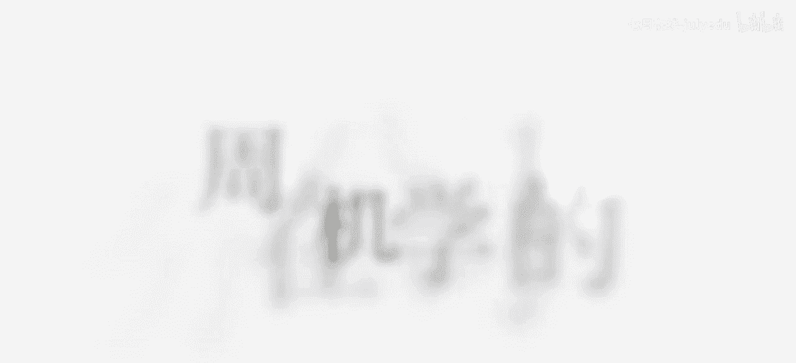
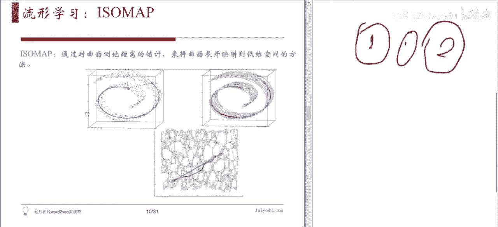
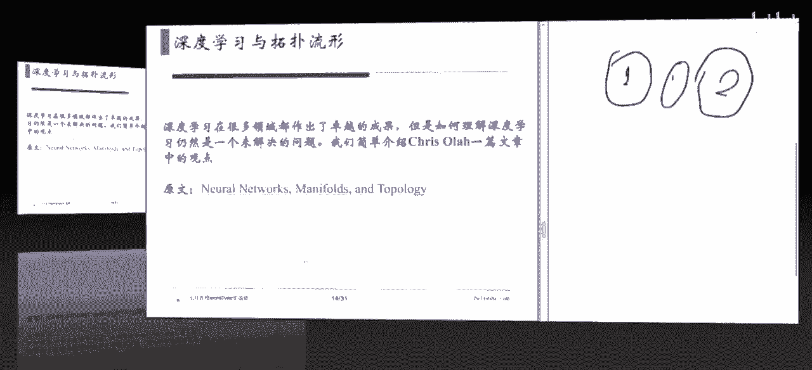
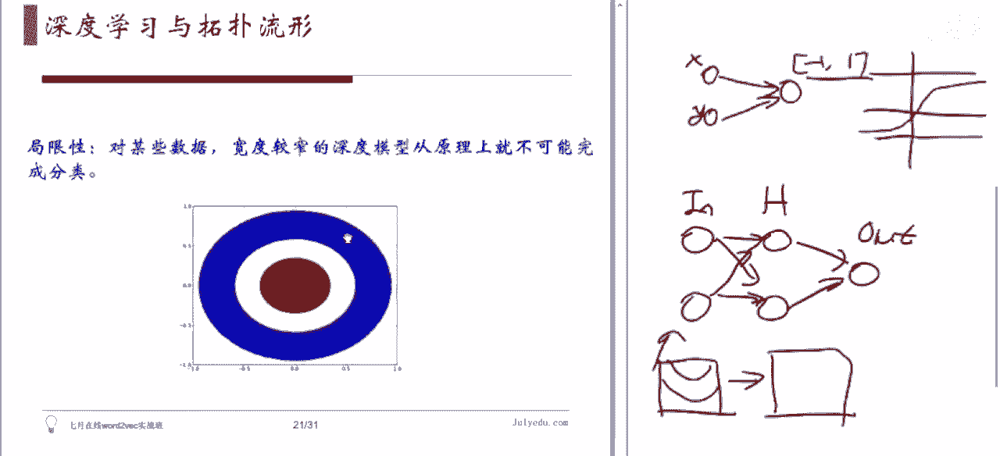
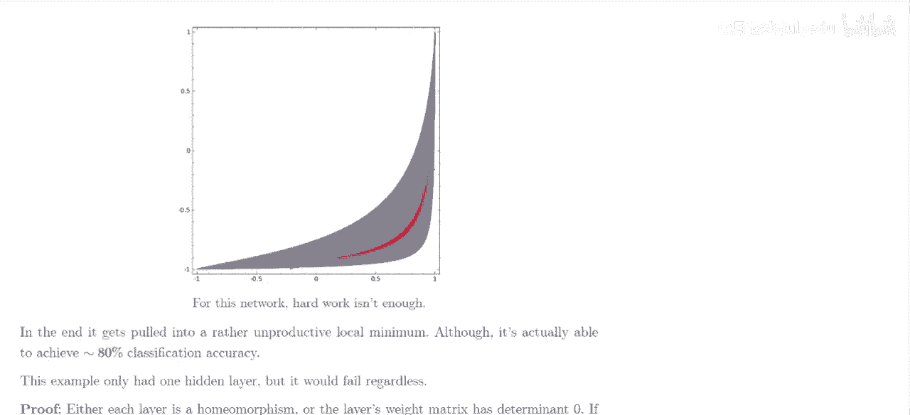
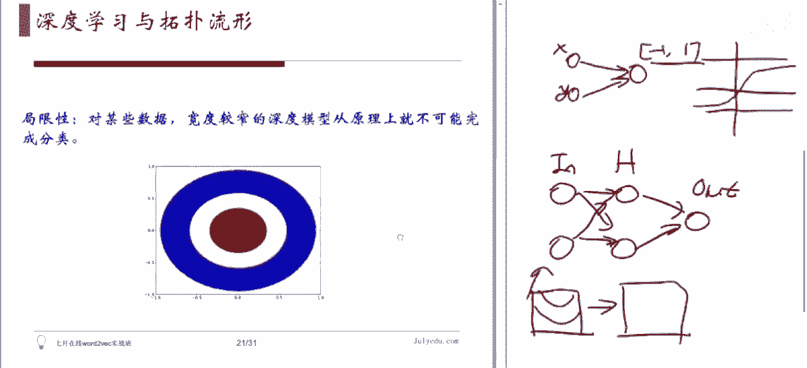
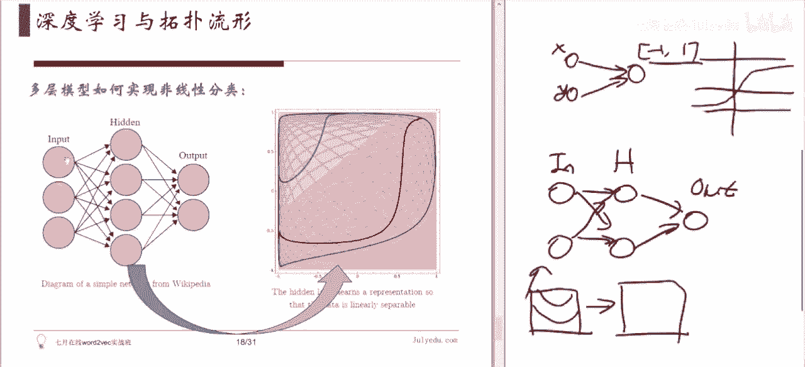
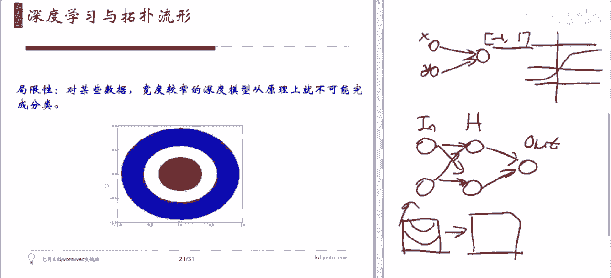
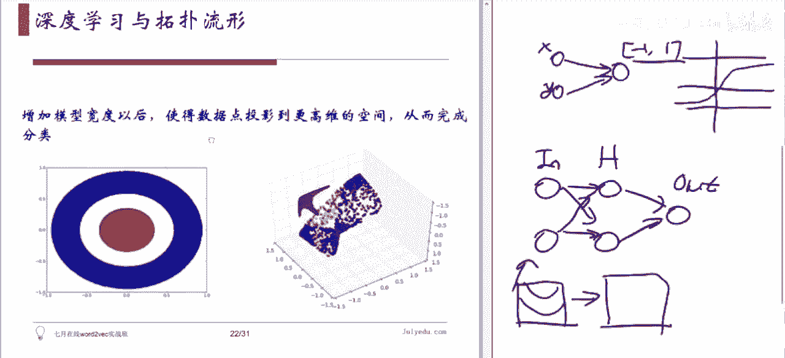
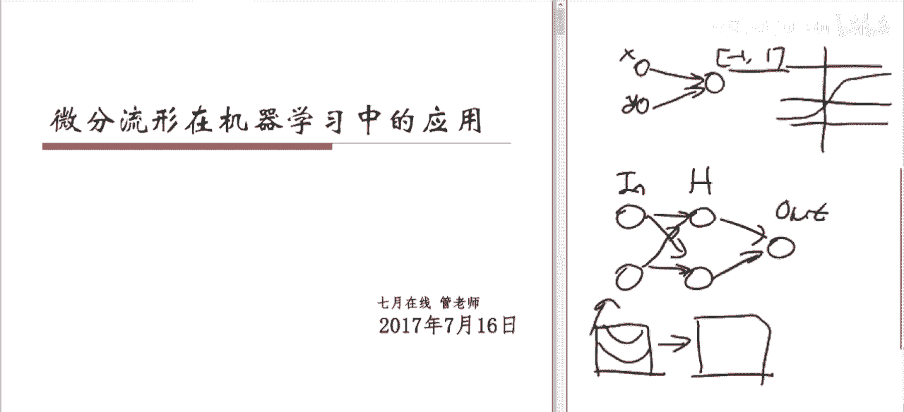

# 人工智能—机器学习公开课（七月在线出品） - P20：微分流形在机器学习中的应用 - 七月在线-julyedu - BV1W5411n7fg

今天内容呢就是微分流行在机器学习中的应用。好，这个主要内容简简介啊，就是说那个内容的PPT已经发在群里了，大家可以看一下。然后今天主要内容呢是这个介绍一下啊流行学习基本概念和一些传统的方法啊。

给简单介绍一个呃这个ch欧ola他呃关于这个深度学习和拓补学的一个关系。他的一个看法。一个文章。我觉得这还还是很有意思的一个文章，可以有提供一些啊比较有趣的直觉，让大家理解。

就深度学习其实在做一件什么事情，它原理上会有时会有一些什么样的局限性。然后在这个基础之上呢，我们是不是可以。把当前的这个架构进行一些改进，利用这个啊更深用的数学。好，那么这个呃。

首先呢我们说这个呃微分流行在机器学习中的应用啊，主要是在这个流行学习里面出现。他们流行学习是干什么用的呢？他是做这个降低数据的维度来用。那降低数据维度。你提到这个事情。

大家首先想到的其实就是这个PCA对吧？就主成分分析，这是我们最常用的降低数据维度的方法。所以我们首先简简单的说一下这个PCA和这个MDSMDS呢就是说。这个好像叫做多维度标注。

就miple multiple dimensional呃 scalinging就是。他其实也是跟PC有点，就是他的想法有点类似的一种东西。就他们他们的收入不一样，他们都是做这个整体上降维的。

那他们都会有一些局限性，就是说他们基本上是。一种线性方法。他不太能够啊。揭示我们数据点中的这些非线性的结构。就是说你的数据可能就如果你数据是组成了一个平面，哎，那你用PCA或者这个MDS这都是非常好的。

那如果你的数据呢它组成的一个曲面。那么啊你可能就要我们后面第二部分说的这个流行学习，就是一些非线性降维的方法啊去做。然后当然我们会提到一下，为什么我们会。做这个流行的学习。那如果要是这个所谓流行啊。

就是大家说一下流行是什么呢？就曲面。就是二维的话就曲面，也就是面，对吧？一维的话叫曲线。那在高维呢。咱们现实生活中不太好不太好描述。那就是说你的数据可能是现在咱们的这个大数据学习啊。

的数据可能是上千维的对吧？就是有好多个feature就那个。比这点那个。啊，就是那那个参数的维度对吧？就身高、体重啊，什么年龄啊，这些那可能上千个。

那个呢就意味着你每一个数据点都是那个很高维空间中的一个点。那么这里面所说流行是什么？就是你那高维空间中的一个低维的曲面。你可能是这个曲面为数可能也不小。你比如说几十维的或者几维的啊，不见得是两维的。

但反正。二维的叫曲面了，高维的就管叫流行，这只是个词儿啊嗯。那么。如何去。通过数据我们去寻找他的这些。曲面的结构，而不仅仅是这个线象的结构，这个是流行学习所需要解答的一个问题。

那我们今天呢主要给大家介绍一下这个第一个叫等机同购这方法，就ISO卖这种方法。然后啊这当然这种方法其实基本上就是说可以展示出这流行学习这几种方法，就几种常用的方法吧。他们的一个核心思想。

然后我们在最后呢再给大家就是列一下这个局部现性化的这种这种就叫做local linear emdding这种方法。还有这个拉不拉斯的这个推征方程。啊，特征特征映射这种方法。

他们和这个艾 back呢这是在最后一步上不太一样。他们就是。他们背后的几何这个几何直观不太一样。但是从这个算法角度来说呢，他就是说最后一步的不太一样，给大家都会简单的介绍一下。那在这个基础之上，就说啊。

一旦我们熟悉了这个流行，在机器学习中的这个。啊，他这个地位。他这个他这个概念以后呢，我们哎我们进入我们今天说的，简单介绍一下这篇啊文章，就是说这个深度学习。他从托普的角度看，他在干件什么事情，他为什么。

能够产生这种非线性分类的这种效果。那如果我们了解这个以后，它有些什么样的局限性啊，然后我们会有个开放的问题，就是我们如何去改进，深度学习，有没有一些方向去改进啊，深度学习这个架构。好，那咱们开始啊。呃。

同学有同学说那个屏幕的问题，我们这个屏幕是这样的，就是左边呢是这个PPT然后右边呢等会儿我会给大家写一些草稿。有原件。Yeah。好。😊，好，我们先这个介绍我们最常见的啊这个。数据的一个线性降配方法。

就说。😊，我们通常说啊我们这个输入的数据就是啊每个数据点它有好多个features，对吧？就是说我们一般来讲。啊，我们输入的这个数据矩阵呢，就是比如说你有N个数据点，那每一个数据呢它其实是一个向量啊。

当然我们。通常我们写那个矩阵的时候都是呃数通常我们写那矩阵的时候是那个每一个数据点是一个横向量。然后那个一般是这样的吧？成K的这这个这种感觉是吧？那正我们这个里边写的时候呢，我们这个每一数点是列向量的。

就是说这个X。这全部数据是吧，它等于X1到XN啊。啊这每一个X。这个东西呢它是一个对向量。啊。就是长这个身高。啊，这是体重类似的啊，这个比如年龄之类的啊，这个这个是什么啊，这个牛幼肿瘤啊，肿瘤大小啊。

这反正这是好多好多的数据了，就出来是吧？就这个意思。好，那么这个PCA是在干一件什么事啊？就是说你这数据维度可能这个非常大。

就是说每一个X都是一个就是特别高维数供电里边一个点为纤维的那我们西我们知道这个有些数据之间呢，它是有相关性。我们不希望这个相关性太特别高的数据同时出现在这个数据T里。因为那样的话，他们重复了。

重复了之后，你在做训练的时候，他们之间这个噪音呢会给你再造成很大的影响，容易造成这个over飞啊，这个是我们那机器学习里面的一个。特别常见的问题啊，那那如何去降低你这个维度，使得那些重复的数据。

把他们放在一块，当成一个来看啊，这这不是就降低了嘛，然后让他们这个。尽可能的让你这些数据能够很好的体现你这个啊数据点特点，而不是让他们去做这个。相似不让他引引入这个噪音。那怎么办呢？那一个办法。啊。

利用数据的这个斜方斜方差矩阵。啊，你不是刚才不是说了吗？我们认为这个数据有种于数据的原因是有些数据之间相关性太高。那怎么去寻找相关性，怎么去判断数据之间的相关性呢？哎。

这个一个斜花差矩阵是一个很长明的办法。对吧嗯有些相关性高的那些，你就给他。就是拍拍在一起，变成一后啊这样。然后这个后续的分析就会更好一些。那什么叫拍在一起呢？那就是这个作谓主成分了。比如说嗯。对。

具体的我们今天就因为这个不是今天重点嘛，我们就不会把这个新代收那分都讲完。但是呢我们就说当你输入是这一堆这个高维数据的时候。的输出是什么？输出是你得到若干个主成分，前K个主成分。

这K组成分呢差不多代表了你这个数据最重要的那K方向。然后你这些每一点呢？我们把它在这些方向做投影。啊。我们也当然也稍微画个图啊。同款。就是说你那个数据可能是数据点，大概是这样子，是吧？这样。

然后我们发现那可能高维这是二维的。那我发现在这个方向上。比较重要啊，这比较区分度。对你数据比较区分度。在这个方向上呢，这比较窄，那可能是这个数据呢区分度不高啊，它这个有可能噪音引起。

你每次你取样的时候都会噪音，对吧？那所以呢你把你每一个数据啊都投影到这条线上去。其实咱们做正焦投影，应该是既混往这边，又投影投影到这边。然后这边因为是比较小嘛，就比较，所以只只保留这个重要的这部分。

然后这部分就就叫做Y。是吧。那呃。那当然我这是一个简单的例子，这是一个K。1的情况。是不等于了。啊，不好意思，这地方应该是YK啊。唉sorry，没没没关系，没有错没有错。就说这个如果K不等于的话呢嗯。

这个每个Y呢，这就是一个K位的下。所以说所以你就把一个呃N嗯一个很高维的空间中的N个点变成了一个低维空间中。跟买店对吧？那当然。做这件事情的时候，我们希望什么呢？我们希望这个。我们不是说舍弃了一部分嘛。

对吧？这部分不舍去了吗？舍去这部分就是XI减去YI乘以这个电程上这个F这个F是主成分，YI是在主成分上的那个向量。那个坐标这一点程就变成了主成非常坐那个那个位置。那呃就产生了误差，误差就是丢弃那部分。

我希望这个误差呀越小越好。是这个意思。这个是呃主成外分析的方法去做这个呃降维啊。那么主成分分析它是一种线性交易方法，它有它的局限性。比如说我们在这样的数据中，我们左边这个图啊，大家如果要屏幕小的话。

也许看的不是特别清楚啊。其实左边这个图呢是个立体的图。啊，它是一个这个呃三维图，它这好这个是你可以认为这XYZ这样是吧？然后它是什么形状？它是一个。Yes。他大概是一个。这个面包卷儿的那个形状。

就大家吃那个呃那种奶油面包卷，就是这这个你可以认为这是中间那个奶油啊，是那个那种卷是吧，这种形状。然后这种如果是你的数据点是个三维数据啊。好多数据点，因为数据点它形成了这样的一种形状的话。

如果你用当然我们就想做降维嘛，对吧？我们就可以考虑，比如说哎我用PCA做个降维试试看，我可不可以把数据搞得更简单一点，对吧？哎，PCA一搞，其实PCA刚才讲了什么意思？就是你要把你原来这个数据点数据啊。

给它投影投影到一个低纬一点空间上面去。这就是我们刚才说的画这个图。把这二维的数据啊投影到这个一味的上面去。那我们现在这个PPT里面这个图呢。是把这个三维数据呢啊投影到这个二维的里面去。

我们看到这个颜色呢，就是说你这个卷的头和尾这个大概颜色不太一样。所以我们其实在这样的数据上面，我们想知道的是。比如我们做分类吧，我们想知道的是卷的内部和卷的外部可能要做个分类，对吧？

就因为这个数据其实长这种形状，只是因为我们观察它的时候所采取的所选择的那些个特征，导致它形成了这样一种形状。但是数据其实是它本身是有这个结构的。那么呃。比如说你这个数据代表的是某种生物。

它的某种这个状态，对吧？那可能。这个深蓝色的部分和这个深红色的部分，他们应该代表是很不同的状态。它是在这个条形的呃两端嘛，对吧？但是你在这个数据空间中啊，它离得就很近。

而且如果你要是做了一个这个咱们之前所说的PCA的话。这种简单投影。你就发现你看这个深蓝的部分和这个黄的部分。干脆就被粘在一起了。那你做完这个投影以后，那这两部分可就再也区分不开了。

对吧就是说你这个曲面的这种非线性这种曲弯弯的这种曲面的结构啊。经过了投影之后就被破坏掉。没有。这要照不来。那也就是说如果你第一步出去处理，采取这种方法，那基本上可以告诉你你这个分类你可能做不了，对吧？

这个意思。这个意思那这个就是说一种线性的降维方法呢，当你面对的是一个有曲面结构的数据的时候啊，它就有问题了，不太好使是吧？这样。那。那另外一种常见的这个呃。线性的这个呃降维的方法，就是这个多维度标注。

那它的区别在于什么呢？我们说刚才PCA这个输入啊。是那些点在原本你选择的那个呃特征上面的坐标啊，每一个X都是一个很高维数的这个向量。D大D位的向量，这个X于大D位向量。然后你对它进行这个降维。然后这个。

作为标注呢，他说的是因为有时候你问题不一样，有些问题给你的时候啊，他没有给你那个在高维面上的向量。他给你的是每个数据点之间的这个不同的程度。就是说。我们我们就距离吧，就他给你的是距离。

每两个数据点它不一样。然后他告诉你两这两个数据点有多不一样，就给你个数，比如是从0到1之间给你一个数，每两个数据点都之间都给你个数。这种呢你就可以把它理解成是一种距离，但是呢它没给你一个大的坐标。

那这个时候你就你甚至连那个大空间都没有，你只有距离。那这种情况下，你怎么去还原？你这个数据点啊这个数据数据集啊，它自身所带的那个啊曲面的结构。那怎么去做这件事情？

或者说当然我们现在作为一个标注还没有没有考虑到全面的问复杂。他想说的是你能不能把这个导出一个坐标来，你不是没坐标，我们能不能搞出一个坐标来。然后将来我做这个比如说叉值啊，什么都比较方便，对吧？

或者说生成啊那什么的，都比较方便。那，他的做法什么呢？哎，因为你输入不是距离嘛，对吧？那你输出上是你希望是一组坐标，那损失函数就是一旦你有坐标之后，你就可以重新算一个距离。

这个是你在你的这个新的坐标值基础之上重新算的距离。然后这个D呢是人家输入的距离，你看看他们俩之间的差别有多大啊，对吧？就这种做这种，就它损失还说是这么东西。这个是这个啊多维度标注的一种做法。

那这个呢我们之所以在这介绍一下，他其实因为。他将会在后面这个流行学习中。他会有些定会。虽然说他不能他自己不能够揭示这个呃曲面的结构，但是。在流行后面的这个内容中啊，也还是会回来去用到它。

对他进行一些改动嘛。这些这事。好，大家有没有问题？这是我们首先回顾一下这个线性的一些降维的方法。对，因为我们今天这个讲的没有讲这个具体的一些计算啊，具体的或者甚至推导什么都没有。

所以说啊技术上问题呢比较少。但主要是让大家理解。这是在做一件什么事情，就稍微这个high level一点。好。第二部分呢，我们就讲这个介绍流行学习。啊，首先我们说。为什么要搞这东西？

我们不跟之前那个线性都挺好的啊，那个数据之间不就是有点相关性吗？那吃掉之后弄个PC也挺好的，何必搞这什么流行学习啊，还挺挺神的这种东西啊，没什么意思。那同学会很多人会这么觉得，那为什么要有这个。

流行学习啊首其实他在机器学习中出现这种东西。那最基本的原因呢是我们啊现在我们有这用流行假设。啊，就是说。我们倾向于认为我们地维的地位空间中数值点，它通常会集中在一个。维数更低的曲面附。二维的叫曲面。

高维的人叫流行，这种叫磁流行。指就指的意思就是。小的，比如说你。高危空间不是大的啊，那个流行是在你的高危空间里边的一些切出来的，所以就是这叫子流行。哎，比如说我们这个啊面包卷这个数据店。就这个数据点。

你看左边这个图呢有好些个点，它们大概形成了这么一个形状。那它背后的。那个流行右边就这个曲面。就是我们倾向于这样认为，为什么这样认为？你可以给大家举下例子，就比如说我们。通常说那个。比如说图像识别吧。

对吧？我们看的是这个，比如说你是一个。100乘100的一个图像，就是1万个像素，对吧？在那图像里边。那么你这个。那你一张图就是一个1万倍的向量。对吧就是因为1万个像素，1万枚的项链。那。

我们就有好多数据点，每每张图是一个数据点。那如果你要是。这些。图啊它是在这个空间中随意出现，就是这个1万维每每一个图，它就是一个1万维空间中一个点。如果你这些点是在这个1万维空间中随意出现的话。

那其实你这个图里面。就应该出现很多这种类似于白噪音的这种。就是我们就换句话说，就是我们通常看到的图片啊，它它都是有它结构的。它并不是那些每一个数据点上，你啊每一个像素上你随便给一个数，然后组成一张图。

这样展停给我们看。我们通常我们输入的这个数据不是这样的形式。我们输入的数据，比如说你研究的是这个。啊，手写数字这样的数据。其实他只是占了这个所有可能的图像，图片中的很小的一部分。他都是。那这个类型对吧？

那这种类型的所有这些手写数字，所有手写数字的这些。图片放在一起，它只占了所有图片的一小部分。那这一小部分它是堆成了一堆呢，还是它其实是相当一片状的在这个高位空间中的一个子流形呢。其实它更像是自流星。

因为为什么呢？如果它堆成一堆的话，就意味着你在一个手写数字的图片上面随便加个噪音，它应该出来另外一个手写数字这个图像。其实不是这样，因为一加噪音马上它就变成一个不是数字。

它就变成一个就是那个你可以想象咱们看电视的时候出现了雪花，出现那种情况，对吧？就是说哎那个不是这样，就更像是。这个所有的数写数字啊，它们构成了整个图片空间中的一个自流型。更像是这样。

那还有一种例子是什么呢？就是说啊比如说人的这个。嗯。呃，动作。就是说比如说我们做这个也是图样识别啊，就大。你就打比说你做的是这个。视频里面的图像，那你这个每一个人他动他行动的时候，其实你看他这个。

他那个脸这个肉什么是软的对吧？他其实是可以有很多很多的方向可动的。你这个。很所有软的地方都可以玩，都可以动。但是人其实并不是。会采取所有的职些动作，他基本上常用的就是抬胳膊抬腿啊，走路这些。

那这些动作在所有的可能动作当中，那空间里，它又形成了一个色流形。就说我们学习之所以能够用，很大程度上就是因为。我们没有随便的乱动，我们输入的数据是有是有结构的。啊这些学习呢就是在揭示这些结果。

这个东西这种假设。其实就是所谓的流行假设，就是说我们。接收到的数据，因为我们没有办法，我们只能通过各个维度去各个这个角度去观察这个啊你的数据点啊。所以说每个数据点呢你就得到好多的数据。

好多的这个feature。那嗯。但是。真正我们关心的东西通常是这个大巨大的fishature空间里面的一个自由性是这样的一个假设，就基于此种假设。当我们拿到一数据以后。我们就希望。

怎么着能够还原它背后的那个曲面的结构。对吧。如果能做这件事情，那对我们很多的分类问题，很多的这个。差值问题。啊，或者是甚至是生成模型的问题，那都是很。对吧。那么第一个方法。介绍第一个方法叫做等距映射。

啊，这个这个方法我们提供了一个原始论文。那后面那个方法我没提供，但是大家其实这个随便网上搜一搜呢，很容易搜到。邓俊的说，那我们刚才说了。啊。就是说你这个。你刚才说那个讲前面那个例子的时候？哎。

讲这个例子上，我们说了，就是说你在这个大空间中，你看比如说这个深蓝色的点和这个黄色的点，他们距离其实还是蛮近的对吧？但是你从这个数据本身结构来看呢，这个点和这个点其实一个处于。这个端点处。

一个处于这个中段处，其实他们代表的可能是两种不同的非常不同的状态。就做分类的时候，其实他们俩可能会分到不同类点去，对吧？那换句话说就是你这个大的特征空间，就feature空间里头的这个距离呀。

可能会误导我们。对数据的认识对吧？我们希望找到它原始的这个距离，就是说这个点到这个点，它距离不应该直接这么来的，因为。你穿越了对吧？你不能穿越这个呃呃fisher这个空间，你得从这走。从这过。

对吧其实这距离还蛮长的，我希望找到这个东西。那就是说距离其实是一个很重要的概念。在我们这个。啊啊流行学习里其实是很重要的概念，对吧？那所以我们第一个方法呢，其实是这个啊就是利用距离直接利用距离。

来重构这个流行结构的，就是说叫邓居英式。好，我们来具体看一看。啊，有同学问说那个直播有没有回放啊，有的，我们这个直播的时候都有录像，然后等这个嗯。可能应该下个礼拜吧，一般下个礼拜嗯。啊，不不不。

你们现在礼拜一，就是那个过几天吧，通常我们就有那个。这个录像上传了，大家可以在PP上里面就可以看到公开课啊，sorry就是那个APP上就可以看到我们的公开课的视频。好，那说到距离呢，我们就稍微多讲一点。

就是说什么叫做曲面上的距离。因为我们刚才说了半天了，我们我们说的就是曲面，然后说这个又说大空间中的距离啊，又说了曲面上的距离啊，呃说了半天，对吧？那我们稍微给大家介绍一些背景知识。什么叫做曲面上的距离？

啊。曲面上距离呢。我们通常接触到曲面，其实都是这个。一个欧基里德高维的欧基里德空间里面的这个子曲面啊，比如说这个球球面这个东西啊，它就是一个三维的欧基里德空间里面的二维的曲面。对吧我们地球嘛。

地球的表面其实就是一个球面，对吧？然后。我们通常如果大家看这个关于几何的文章，或者看这个礼曼几何或者微分几何的文章。你经常会看到这个侧地啊。在。测地线测地距离啊，这些东西它其实说了什么事儿呢？

就说如果你限你把自己限制在这个曲面上。那么两个点之间，他们最短的那个路径和那个路径的长度是多少？那这个最短的路径呢叫测地线。那这个步径长度呢就叫做测地距离啊，是这样的。那打比方说平面上的测底线就是直线。

我们不说了吗？平面上两点之间这个线段最短，就那直的线段最短，这是我们。最早接触到的这个。集合的概念。就是也是那个OT里德写在这个。几个人每上面一公里。好，那这个曲面上这事儿就不对了啊。

打比方说咱们说这个你要坐飞机啊，你要从比如说你想从北京啊飞到这个。纽约怎么办？应该沿着什么路线，路线飞。那其中一个路线呢就是横着飞。因为他们两个城市几乎在这个呃地球上这个纬度差不多，所以你横着这样飞。

就是往东飞。基本上你飞飞飞到对面去就就到了北京和纽约几乎也是这么对着，其实咱们就这种情况，很多同学在北京，其实我现在在这样。那。那个其实实际航线那就不是这么飞的了。他们其实飞的是一个偏偏的路线。

那个跟这个地形有关系。他们希望这个飞机下面最好有一些陆地，这样迫降的时候，万一出什么问题可以破降，这个意思。但是如果要是抛却这个这些问题不谈。只考虑远近，只考虑距离的话，其实应该怎么飞呢？哎。

其实你应该从北极飞。直接顺着北极上头种下去。这条线才是最短的距离。当然那么飞，中间这个北极舱他没有没有机场，你万一出点什么事，就只能调片通用，对吧？这个就比较危险，所以他不那么飞。嗯。啊。

这个就球面上的测底线啊，就是这个球面上的大圆。所有的图案再测一下。啥这个方向是最好。就是当我们说曲面上距离的时候，我们说的就是把自己限制在曲面上，那最短的距离是什么样。但是如果你放弃这个假设。

如果你说你可以在地这个这个这个呃地下行走，那怎么办呢？应应该在这打个洞。把这个直线连去。是这个。直线这个叫做。在大空间里边的那个那个最短距离的距离，而上面这个弯弯的这个绿色的，这个是侧底线测底距离。

对吧？那回到我们刚才说的这个例子里头啊。你看你从深蓝色的到这个黄色的。打通烟的距离是什么呢？你是直接把它打通。这是大空间决定。但是如果你打比方说你现在这个数据点说的是这个。啊。

每一个点都是一个人的一个表情吧，对吧？奶了一一人一人的一个表情，然后呢。这个表情可能是笑，这个表情可能是哭。上面这个表情呢可能是愤怒，对吧？那你从笑到哭，他俩的这个直线距离可能是很近的。其实。😊。

这事儿可能是真的，就是说笑的动作和哭动作呀。还其实挺像的，如果你只看都咧嘴，对吧？都闭眼睛对吧？都都都都这些东西其实蛮像的。但是呢你一眼就能看出那个是笑，那个是哭，能区分开。为什么？

就是说你并不完全是通过这种直线这个距离来区分。这个表情其实你是在你的脑子里已经形成了一个咱们大脑里边已经形成了，已经学习完了这么多生活了几十年之后，咱们已经学习完了。

其实你知道他这两个表情距离不是这么看的，应该是这么看。你立刻大脑理就可以形成这两个表情之间的距离有这么远。你知道他们是在做事情，对吧？但是你怎么让机器去干这件事，这是我。对吧。好。😊，哎，就是对。

这里这里我们还有一个更好一点图啊，就是这两个点那这个红色的和这个嗯淡蓝色的地方。他这个。欧式距离就是你如果你可以穿越的话，你的穿越距离很近。但是呢哎你这个侧底距离啊。应该是整测底率这么做。

你得把自己限制在曲面上这样做。唰从这上过来到这这是这个距离是侧的距离，那就下面画这个其实是很长的，就欧式距离非常小，就slluclan distance对吧？

large geodiic distance这个意思。She。那么。OK所以所以换句话说，如果我们能够很好的描述曲面上的测定距离的话。那我们其实一定程度上就揭示出了这个曲面的一些非线性的性质。对吧。

所以如果所以我们你就完整的重构这曲面，那肯肯定是非常困难的。你肯定是要用这个曲面的某些特点去描述它的这些性质。比如说测底距离就是其中一个重要特点啊，这是可以算的。好。那么。如何用这个。就是这种方法。

iso map。这种方法。去对曲面的啊。测底距离进行估计呢。怎么说呀，如果你直接看这个。坐标的话，那它俩距离就只你就只能这么算，你怎么去你怎么让告诉机器从这个角度去找这测底距离呢？怎么做怎么去做这件事。

哎，一个办法就是说啊。你让那个机器。让他更加的短视一点。你降低点他的这个能力。就是说机器通常他一看他直接看到他们俩离这么近了，也没办法。你降低机器的能力，怎么降低呢？你只给你只提供给机器一些具体信息。

你不要全都提供给他，你提供给他什么呢？你你对每一个点旁边画一小圈。这小圈里也有好多个点，对吧？这些点之间的距离，你告诉这些等于多少。而至于这别的地方点的距离，你不跟他说，他也不知道对。

然后你提供给他数据什么呢？就是一个一个的小圈，你把这个整个数据数值集啊分割成6根小份儿，然后每一小份内部的那些点之间距离，你告诉他那外头的你不跟他说，这样呢这个机器啊。这样的话，你就会形成一个图啊。

就是咱们那个。图论的那个图对吧？就是说。两点之间有距离的话，就连条线，然后距离长短呢就是那个线的长。你就会形成一张一张图，就是下面一张图。你从这个三点闪点数据，首先你构建一个下边这个图。But。啊。

就应该右边这个图，sorry，你右边这个图，你你有坐标吗？就每个点，它并不能跟你并不把它所有的这个距离都都都提供一个算D。比如这个点和这个点之间它是有距离的，请，你可以算出来。但因为它比较远。

你就不提供这个，你只体提供它附近的。然后你就构成了一个图，就是一个网格用解构。那当你想算这两个点之间距离的时候，测力距离的时候，你怎么算呢？你把自己限制在这个格点图上面。你看看这个格点图里面。

它从这点到这点，它的最短路径是什么？哎，这就变成一个图论里面的一个经典问题了，对吧？给你一个图，一个无像图，然后那个图的边上呢有这个距离，有权重。那你如何去找到一个最短路径？

那这个最短途径一定程度上就近似了我们所说的那个测定距离。我们看到下边这个就是如果你把这个图围展开啊，我们用人就是我们从上帝视角来看一眼，你把它展开。展开之后呢，你就发现这条红线弯弯曲曲。

这个红线却就是沿着这个图的方向，你找一条哎能把两点点起来的。最短的一个路径。那这条蓝线呢是真实的那个彻底线，那条最短路径。所以这红线其实是对它进行了一个。就束。哎，是这么个意思。走么。😊。

所以说啊如果你。我们再回顾一下，如果你一开始的时候，计算机就可以算所有这些，比如这虚线距离，所有点之间的距离都有。你这个那上面的图就巨复杂了，对吧？每两个点全到连条连条线你这个。你就甩他出来。

我那样都不行，那怎么办呢？就是怎么办比较好呢？就是说你只提供那计算机。每个点附近的一点的信息。然后你构建一个网格，一个图。然后呢，你再通过解决一个图论的问题，你去寻找啊每两个点之间的这个彻题距离的问题。

这样这样的方法。那么当然了，这个我们说你找到测定距离了，对吧？那。你不是说刚才我们还想说想那个还更有野心一点，我们想把这个曲面给它重构一下。就换句话说，就是我想把这个曲面给它展开。

就得到下面这个图怎么办呢？就是说如果你每点附近都有距离，有这网格了。你可以做一件什么事呢？有距离以后，如果你想在局部上重构一个呃。一个一个小片，一个一个坐标片。我们就可以用刚才说这个多维标准。

对吧如果你把所有的数据一次丢进去，任何两点之间的距离你都给他了。那这个多位标注我们刚才说了，就是个线性的，它是一种很这个线性的方法，不老使，对吧？如果你给他这些距离的时候，你只给他部分的信息，只给他。

就我们刚才说的网格里面那些信息，网格之外，那些你不给。嗯，那个距离你是认为是无声大。你用那种数据输入进去，你再做多位标注，你就可以把它给。还原成这个样子。就是这么一个意思。

就是说你可以认为这种算法呢是对之前的那个多余标注呢改进。你也可以认为。多位标注呢只是在这个里面做了一个简单的应用，就在最后一步。你前面这部分是它的几何背景，你是为什么要搞这网格。

你这是有几何直观的最后一步具体计算你用的那个对位标注啊，都可以，你怎么想都行，就是看你觉得哪个好，那哪个重要，这个意思。所以说哎这是第一个方法，它的这个呃算法流程呢就是这样。先用聚类算法寻找淋域啊。

就是说我们说什么叫做这个点附近的点，你得弄个聚类的算法，去寻找一些淋域对吧？其实这个不需要太复杂的方法。一般比如说你这个点离它距离小于一个epon，你现在epon比如说0。1，你就你这个是你手工的了。

就是参数是你自己调的。X小于0。1的那些点就就算在一个类头啊，在这个类里头呢，你把这个边给连上那可以啊。你也可以说我们不设那0。1那种我就说跟我距离最近的这个前这个10个点，我就考虑这10个点。

别的我不考虑，哎，那样也行啊，就是反正你你设定一种标准，什么样的点是离得近的。这第一步。用一个啊之类的算法去把淋域给它都定下来。然后呢，并开之后，你就可以知道哪些地方要连线，哪些地方不连线了。

你就构建了这个图，这 graph就构建出来，对吧？在这个基础之上，你再使用这个MDS。仅仅考虑。这个淋浴中这些电的距离啊，然后你就可以做一个重构，你可以重构这个啊。这个曲面。这样。这是第一个。

但这个方算法有一个不好的地方，就是这个MDS这个算起来可能是比较花时间啊，这个计算计算计算复杂度呢稍微高一些，算的比较慢。就是。好么？那，还有一种办法啊。

就是叫做呃local linear em这个LLE就是第一个L是local这局部的。然后第二个L呢是linear。第三个E呢是inbidding，就是局部线性嵌入的意思。他的第一步。和之前那个。

等军营社是一样的，你先聚类。寻找一个淋浴，寻找完淋浴之后呢，你怎么去把这个。小淋域里面给它进行重构，使用了跟刚才不同的方法。刚才因为我们想用这个距离，所以我们使用MDS，对吧？就是说。

我们这个呃把淋域里面每两个点连条线连连一个线，然后把这距体写出来，形成一个图然后做这种事情。那这回呢我们采取的是这个啊局部先法。这个方法是一个什么样的想法？就他用的不是距离了，他用的说什么呀？

还有呢说吧，就是说如果你真的认为自己的数据。在空间中是一个曲面的话。就说这个数据长一样。比如在这附近上。那远处可能是这个弯过去了，是吧？曲面啊。在局部上，他一定是几乎是一个局面。这个是曲面的一个特点啊。

就是说当你那个范围小的时候，能曲面几乎就是一个。所以说你在局部上，如果你能平面给它做一个近似，不是就很好吗？对吧？那怎么做平面上的近似呢？就是你需要寻找他们之间的线性关系。啊。

我们如果有同学对新代说很熟悉的话，知道如何去描述一个平面或超平面或者是这个反高于什么样的。怎么描述呢？其实你就是去寻找它这些点之间的线性关系。几乎就你可以认为这是在做一个有点像是那个线性回归那种感觉。

平面去解合这一点。那这具体做法啊，我们这里就不说，但是他其实说的是既然你们之间是有线性相关的关系。那比如这个点，它应该可以用它旁边的点啊作为线性组合给它组出来。如果他们之间没有这个线任关系的话。

你这件事做不了。所以说如何去抓住。你这个线性关系呢？哎，你就说我只要知道这每一个点是如何用它旁边的点线性组合组出来的。我有这个信息，那我其实就等价于抓住了啊这个这些点之间的线性关系。对吧所以说。

当他做完剧类寻找完领域以后，他没有去找那剧离。他是。上面因为用度量来做，所以要找距离，下面想用线性关系来做。所以他就采取另外一个做法，就是寻找如何每一每一点。

如何用其他的旁边这个淋域里面的点去做成功这种模式。哎，也得到了一个嗯。内容。其实是一个图了，就是也是一个也是一个矩阵，表示一个图。然后在那个基础之上啊。啊，他就。他他在做整体的优化。

那这就可以把那个训练透露出来。就说最后这一步我们采取的这个几何的。特征不一样。第一个方法我们采取的是使用了几何中的距离的概念。第二方法，我们采取使用了几何中的这个呃直线的概念，就是平面的概念。那那好。

sry这个地方。这个地方写错了啊。这个地方是拉普拉斯。第三个方法啊。啊，我们等会儿我们稍后那个呃。讲完课之后，会给大家这个改一个。改一个这是。呃，修改一下，然后上传1个PPT。这种方法叫做嗯。

拉普拉斯的这个那分子的这个特征因素。对特征设的方法。那这种方法呢，它又是另外一种办法，就是他其实也是用度量，但他没有直接用度量。因为他认为可能直接用度量的话这个。噪音也比较大，他用的是一种。

稍微更深刻一点的数学就是说你通过度量可以去计算这个曲面上的呃这个嗯。所谓的拉法斯算子。的特征函数。啊，这个曲面上如果你就一个对于一个这个封闭局面来说啊，如果你知道这个曲面上所有拉pl。

它拉普拉甚至所有的特征函数的话，你其实就等于可以把这个曲面重曲面给重构出来。嗯。之所以我们采取这种方式呢，是因为这个特征函数它比较容易进行数值计算啊，可以算。那这样你可以算。

那你可以近似的得到一些特征函数。那你把这些特征函数当成是这个曲间坐标，也是可以也是可以的。因于他也用了度疗。那这种方法呢比较有趣的一个地方是他的思想跟这个度量可能关系更大。但是他这个具体实现呢。

哎他跟这个第二个这个局部现性化的方法嗯，可能更更类似。所以。第三种方法都是我们做这个流行学习的时候啊，常用的一些办法。好，那么。这方法虽然不一样了，那他们这个。核心其实是很类似的。

就说你如何在一个高维空间中去重构一个低维的曲面。我们第一步他都用了对曲面进行了局部化。我们只考虑这个曲面。每一点附近的其他店的性质。因为要是一旦你要考虑所有点这个特点啊，这个性质啊，你就容易被误导是吧？

就刚才说这个问题，嗯这个点和这个点之间距离很近啊，大家可以看到我这个鼠标。这两个点呢距离很近是吧？但是呢。他们其实在曲面上不应该是。很近，应该很远的。所以说你要。叫么字段双闭啊，让这个计算机。

对对视力更差一点。原来只能看到附近的，不能看到远的。然后在这个基础之上。你再用不同的啊几何的背景去重构这个曲面。就第一步都是一样的，对曲面进行局部化。然后通过曲面的就个局部特性来重构曲面。

当然你可以用各种不同的局部特性。那我想对于不同的问题，你可能这不同的方法，也许就有些问题对第一方法好使，有些问题是第二方法好使，那取决于你的问题本身。这个地方呢就是说你就需要你的专业知识。

比如你是做这个方向的，你是做这个。啊，保险的或者你是做这个啊图像识别的，或者你是做这个。啊，声音识别的或者你做什么别的。各种不同领域的人呢啊通过你的专业知识，你可以去做适当的选择。哦。

这个地方有一个重复的。页面好，对，所以就是总结一下，就是流行学习的核心啊，就是说先对曲面进行局部化，然后通过局部特性来重构曲面，这是流行学习的核心。好。好，那这是我们的第二部分。那同学们有没有什么问题？

好，那那个我们今天这个可能。讲的就是呃。用的这个数学的概念稍微深了一点啊，就大家如果要是。但是我希望大家能够明白这个就是。通过我们这些图啊，能够明白这个的核心的思想是什么。

然后如果大家对这个具体的细节很感兴趣呢，我们就是可以啊更多的反应。对，我们将来可以给大家准备一些课程啊这样。对。好啊，有朋友问题是吧？这个流行学习呃主要用到哪些问题呢？就是说嗯。

其实他这个呃你不太好说它是应用在哪些具体问题上，应该说是你只要是你的数据。它不是一个散点，它是有这个呃曲面结构的。那么我们就可以把应用。呃比如说一个比比如说一个什么应用。就说。唉。

这个还是比较有意思的一个。就说。就我们刚才那个表情的问题。Yeah。啊。哎呀，我们那个花的话可能难画，就是说比如说呃比如说你做这个什么差值的问题，就是做生成生成问型，就是大板说，你现在。

你你有一个人很多的数据，你有你有这个人平时各种表情，就是把他这很多表情。拍下来。然后现在呢呃你有了他呃。然后现在你你你比如说他要跟别人做一个这个视频视呃视频聊天，打比方说吧。然后呢。啊。

视频聊天就不太好，比如他录了个视频吧，然后呢，这个视频呢，他可能这个resolution比较差，就是说。他这个截截图次数比较少，就帧数比较少。然后你希望你做差值，把那些没有的那些帧数给它补。

那这个用问字吗？对吧？也就是说等于你有这个人的。Yeah。一个表情。有声意。😊，啊。然后呢，你有他第二个表情表情。你怎么把他个表情一。5味的不去？对吧那如果要是像我们以前做线象差值，很简单，你把这个。

两个表情，你这个表情不就是个向量吗？你把两个表情加起来除以2，然后你得到一个平平均值，你把那个当成那个中间那个差值，但那样就发生什么问题？比如说他刚才那表情那个是嘴。张了一嘴刚要张开。

然后表情二呢是嘴已经完全张开了。然后如果你要做个线差实，你会得到那容有两张嘴，一张嘴是闭着的，一张嘴是张开的，然后你都比较虚。那就是你查出的结果。但如果你要是。那就意味着什么？就意味着我们做了件事情。

哎呀，你做这样事。他是嘴刚要张开在这儿呢，然后嘴完全张开在这儿呢。它真正的路径是这样过去的对吧？但如果你做个线性开始，你会在这儿找出一个点，那点根本就不可能存在，人是不可能做出两张嘴的表情。对吧那我们。

怎么才能做的更好呢？就是如果你能把就是你在之前当然那容很多数据了啊，你有那人其他的数据，你这个流这个这个曲面已经被你训练出来了。那你就你知道哦，这有个点，这有个点，你怎么连起来，你在那找一找测底店。

你就把中间这个给找到，你就找到的话，他不是应该两张嘴，他应该是有一张张开了一半的嘴，在这儿你就可找，这个意思。这个意思。不知道这个有没有回答你的一些问题，就是说哎就这个意思。好，然后。

另外一个同学问说那个PCA是可以用来找到曲面结构吗？PC是不行的。就刚才我们前面其实讲的这个例子里面说。比如你这数据点本来是有曲面结构的，你这一个PC啪给压成一个饼嘛，对吧？压成饼之后。

你看这个本来这两个点应该距离很大，但是没压到一块。好，这个意思。呃呃然后有同学问说，除了图形学习之外，嗯，在别的方面还有没有什么？嗯，就是说他。只要是你的这个数据，它是形成了这个。这个呃在数据空间中啊。

它形成了曲面的话，就是有它有结构的话啊，都是有用的。你的图形是可以用的，那声音也是可以用，对吧？你可以想象，那嗯分类问题其实也是可以用的。比如说我们现在这个是一个分类问题嗯。

你这部分是一类啊这部分是一类。比如说你现在你的每一个点可以是个图形，你的每一个点呢也可以是。比如说你要医疗里面，每一个点是一个肿瘤的这个肿瘤的这个呃。状态啊，肿瘤大小啊，肿瘤的这个颜色啦。

肿瘤的种种特点吧。状态。那这个其实现在在这个医学中已经是有有这种应用了。就是我们之前嗯之前有有一个。做这方面。这个数据to结构的一个公司，他们给我们做过一个这个presentation啊。

他们就是研究这个。某种疾病的这个。嗯，死亡概率的大概这这个意思，就说啊。你去你比如说这个红色的这区域是基本上你就离死亡不远，就是很严重的区这个。深蓝色区域呢其实就是这个病的初期状态。啊，比如说这种情况。

然后你现在你当你探测完一个人状态之后，你希望对他的这个状态进行一个分析。你希望知道他在什么状态啊，希望知道该怎么治疗。如果说你测完的病人在这儿。就在这个浅蓝色的位置。

如果你要是不考虑它这流行这个曲面结构的话，你就会发现它跟你这红色已经很近了，你可能觉得套板期了。对吧你可能就得不能治了，或者说你可能就采取一些这个非常有伤害性的治治疗方法。那实际上不是那么回事。

它可能快好了。你这个对吧？所以你这个分类也很重要。那如果你没有这个流向结构，你就分不好。有了之后呢，你就会分好一些。那究竟说你这个数据中有没有这种结构，那这个就跟你的这个具体情况有关系了啊。

那事实上这种情况是有啊，这个我们之前看到过一些例子。对，然后。还有没有其他问题？好，那这个正好啊，我们第一个小时讲完第一部分，然后我们这个。进入第二部分。

那进入第二部分之前，我们这个。休息5分钟我去。好，我们回来继续啊。

那，大家有个问题说这个流行说数据是在呃第位空间，不一定是在二维中是吧？这个是的，就是啊他说的是。是很高维的空间中的一个自流型，就是说可能低倍数低一些，但不见得是二维。你二维的线率就太高，那就就太小。

这样。Yeah。但是当然有一点啊，就是通常咱们呃人比较好观察的这还是。二维的就是如果你想把它画出来，让你自己看，那可能就是二维的还比较好画，三维的勉强也能画。嗯，在高维的可能基本上是画不了。对。

所以同学问说，那你如何知道你现在这个呃问题应该选择。哪一个维度呢？这个其实跟我们这个具体方法有些是有关系的。比如说。我个。这好这页这也吧是，比如说我们这个呃拉查斯这种算法的话。它最后一个参数调整。

就是说你可以选你选择就他这个是选择用啊若干个这个特征方程特征函数，就每一个特征函数都是一个坐标。那你选NK个，那就是K尾的，你选K加一个就K加一尾。那这个这这就可以变成一个模型参数，就是说。

你肯你显M是一开始你不知道到底应该多多少倍的，你只能是把它放到你的模型中。去解决你的问题，你看你到多少维的时候能够解决问题。就那就多少位就比较比较合适了对吧？那通常比如说你要是嗯100维和101维都行。

那你可能会选择更低一点的100。这个意思。然后至于与人个人视觉相关的呢，他其实不见得是二维的，就那个图像是二维的。但是那个图像所代表的空间中那个点可不是二维的。你想图像，比如说100乘100的图像。

那它其实是1个1万的空间中的一个点，是这样。所以其实你就得想办法找这个1万枚空间中的这些点，他们有没有形成一种。比较特殊的曲面，对吧？然你在那个曲面上去做这个事情。就是你可能做不同问题的时候。

你会找到的是不同的曲面。做这个手写这个输字的时候，可能是一个曲面。你做这个嗯。比如小车，这个有些有些同学做那个呃。视频中的那个。抓取嘛，对吧你要抓取一个车，抓取一个人。比如说那个照相机那抓取人俩个，哎。

那可能是另外一个问题。这这样。好，那咱们这个okK好。咱们进入这个今天的第二阶段啊，就是。深度学习和这个托普流行啊，托普学的一些概念。就是怎么去。就是深度学习啊，是一个就是在很多领域都做出了很好的结果。

对吧？包括我们之前说的图像识别呀、声音识别呀，甚至咱们下围棋啊等等很多很多的事情都有非常好的结果。就显然他是很有用的那。究竟如何理解呢，就它为什么有用，就它为什么好使。

因为这个想法像这个比如说多层感知器这种想法，那是早就有的对吧？好几十年以前就有的。那当然当时的技术技术不成熟，就是咱们显卡也不行，这个计算机可能也不行，它实现的比较困难。

那后来呢也并不是说计算机的能力刚刚一提高，马上就有人把那个神经网络给建起来了，然后把它给弄好，不是那样。其实你像咱们这个呃计算机一见就是。这个这个摩尔经利用是吧，已经又发展这么多年了，直到这个前几年。

才有人。把这个啊就神经网络给搞出来了，然后做出这个深深透深度学习的模型。🤧做出这个深动模型，然后才才发现原样它是有用的。就说这不是说一个从理论上我们看出来它有用，我们才去用的，而是我们真的用了。

然后发现它有用。然后这个大家就这么用。那不知道为什么没有人知道为什么可以目前为止是吧？那嗯那我们这个这次课的第二部分呢，我们就简单介绍一下嗯。这个chris这个他的一篇文章中的一个观点就是说。

他大概解释一下说当你的这个深度。深度模型的宽度比较窄的时候，它其实是在做一件什么事情。那。呃，他有没有一些局限性啊，嗯，就是他为他到底是怎么去把你这个他举这个例子是一个分类问题啊。

就是说怎么去把这个分类个分类问题给完成的，就就是中间都已经都经历了经历了一些什么。当然这个最终发现。他这经历东西呢其实是跟这个曲面啊，跟我们前面讲的这个呃流行呢是有点关系的。

所以说我们把前面部分放在第一部分。然后我们接下来在这基础之上，我们去看看啊，如何理解这篇文章里的观点是如何理解啊。深度学习在一定程度上在做一件什么事情。好。

把这个原文大家可以在这个PPT上一点链接就找到了哈嗯。好，首先稍微就是回顾一下这个深度模型就是。这来查下。深动模型的这个最基础的形式呢就是这样，就是你的输入。是一个向量啊，比如说你图片的话。

你就是一个1万维的一个向量。然后呢呃。这个是最基础形式啊，就是说。你这个向量它就会。啊，比如说它就会被这个投输入到这个中间的每一个节点中去。那节点是什么东西呢？就是比如这个节点嘛。

他接收了前面这三个东西的书，你得到了一个三个数对吧？然后他把这三个数呢先做一个性的变换啊，就是节点训练的时候，中间有一个首先它有性的变。那线性变化完了之后，就是线性函数完了之后得到个数吧。

他把那个数呢再用一个激活函数啊，以前的话经常使用这种。就是。就是这这个这个。这说。啊，或者是你可使用tcht就是形状画的话跟很像啊，tch就是这样tch。To？这个文章写的时候好像大家用碳纸表较多。

所以经常拿碳纸做例子。啊，这个是那个国际回归的那个那个那个函数。然后现在还有很多别的嘛，就是说比如说这个。这种这边给个现象。这边给一个属性，这个叫做exential linear unit。然后。

然后还有这个。呃，是更简单一点的。比如说这个线性的这边直接取零啊，就这样，然后还有一些比如说。就最近出来了一个比较火的啊，就那个呃。就叫什么self normalmalization，就是字。

那我来再选。规范化的自规范化的一个这个计函数就是。跟这三像就是等于。把它基础上乘一栏杆，就这边呢。这现性的呢是比一大一点。然后这边呢这可能也更深一些，这排出。总之就是有各种各样不同的东西。

就是它是先做一个线性变换，然后呢再做一个这样的个变换。这个变换呢，它基本上它是个增函数啊，就是首先它是增函数，然后呢嗯。啊，他可能两边有借或者无借，这就是有不同的选取。但是他是一个。

递增了这形状还是比较简单的一个函数。就是啥。你先做先情先做一个事情，然后再做这个。然后每一个节点都做同样的事情。把它们的输出像这个呢从一个三维向量变成一个四维向量，然后把他们的每一个输出再跑到。

下一个下一层去就是你从输入输入层进入第一个隐藏层。那中间可能还有好多个隐藏层啊，从第一个隐藏层进入第二个隐藏层也是做同样的事情。你把这个思维强调，又变又输入到下一层，下一层再做一个新线性函数。

然后对应的线性函数结果呢哎再做一个这种。激活变换，然后就不断的一层一层一层一层，最后到最后这个输出层。比如说你这做一个事二分呃，比如说你做的是一个。呃。你的输出是一个嗯有两个。参数的输出对吧？啊。

那你就输出可能留两个节点，然后你这个节点输出一个数，这个点输出一个数。啊，这个阶点做一个第一个方向的分类。比如这个阶段做为第二个方向。你就分成四类吧。比如说就打个比方说啊，你分成四类做这个事情。对。

基本的那个深度学习模型的基础形式是这样。啊，那。这个呃那最简单最简单的是什么呢？就是干脆就没有这个隐藏层。就是隐藏层能就没有一个一层能没有，从输入直接就输出了。那这是最简单的形式，是吧？

那这种形式的深度模型是什么呢？那就不是深度模型，而极浅的啊极浅的这种模型是吧？这个网络模型是什么呢？它其实就是一个线性线性分类器。啊，你刚才不说了吗？比如说打比说最简单的情况吧。

你们画一个简单最简单的一个网络。Yeah。最简单的网络。就是比如说。哎，你输入是一个二维的向量。然后直接就进入输出。数就是1个XY。输出呢就是这个一个0到1的一个数啊，-1到1的一个数。感一水。

那其实他在做一件什么事情呢？你不等于是在一个平面上。那，就就首先是一个作为线性函说，对吧？线上之后呢，再把那个线下函数这出这结果呀再给它压一下，别能压到负1到1。比如说那个就用刚才那种。

这这最最最原始的这个这个这个呃逻辑回归的这个。这个计活函数对吧？那其实他做件什么事情呢？他就是把你这个二维空间XY。就是其实就是做了一个逻辑回归。呃我们最简单的这个时间往后就是问规归。

把这东西切了一条线。然，这边呢是输出值代言的。这边呢是输出值小于零。你就做了一个分类对吧。对其实所以他其实就是做了一个线性分类器。那打比方说。我们现在所研究的问题是这样这样一个问题，一条蓝线，一条红线。

那这蓝线和红线分别代表两种不同的啊数据啊，比如说蓝线是那个。Yeah。嗯。比如说蓝线就是这个哭的表情，这红线就是那个笑的表情之之类的这种这种东西啊那。如果我们做一个。

就是我们右边那个图里面画的这个最简单的。指接网络的话啊其实它就做了一个线性累系，就他需要找到一条河一条直线去把蓝线和红线给它分割开。而这个问题当中呢，你这直线其实是不存在这样的完美的直线。

你就这条直线就算不错了。你画在这儿啊，这蓝线有一些错误的地方，红线有一些错误的地方，错误多不多错合。那如果你要画的再差一点就，或者你画到这儿，那你就是蓝线都对，但是红线就基本上都错，那也不行，对吧？

所以说。哎，经过训练，你发现这个线放在这儿就挺好，就就就行了，最好经也就如此了。单层模型那其它其实就实现了一个线性分理器。那为什么我们要使用深层模型？就是因为呀这每一层当中我们说啊先做一个限性函数。

再做一个激活函数变换。这每一层当中都会引入一些非线性的。啊，非线性的变化。然后你再综合起来。你这个分类器呢这个这个输出呢，它就不会再是一个线性分类器了，它就会变成一个具有非线性特点的分类器。你打比方说。

就刚才那个问题，如果你要是采取两层的模型。基本上你就可以得右边的结果，一个抛物线。就给它分开了。那这个分类那可定比刚才的好多了，对吧？你刚才这样一分，那将来比如说你再有一个新的点，一个这个嗯。

带点噪音的点嘛，就是本来你的红线这块也没分好，你在这再有一些点。那其实基本上我们如果肉眼看，你知道基本上还是应该属于红线这个范畴。但是你这个发电器可就。他就会认为它是属于蓝线的一个范畴，对吧？

那如果要是嗯多加一层，你得到一个二次曲线。那你就可以把这个就分的比较好了啊，基本上你就。就成这样了，即便你加一点噪音，好像问题不大，对吧？你在这有时点，你还知道它是。你在这有一页，你知道他是。

对吧就是这个当你加深的这个呃。模型的层述之后。你会有这样的效果。那这个如果我们只听到了这一点上，我们知道那层数越深这个效果越好，这好像也是。意义不是特别大，那我们基本上知道的，你想你如果100层。

如果你十层能解决的，你11层基本上也应该是。不是可能训练更复杂一些，参数更多，有可能会增加你这个over face的风险。但是。你不考虑那个问题了，是吧？你肯定是参数越多，你这个模型训训练结果越好。

对吧？就你如果只考虑你这个inscentcle对吧？那那个说明表什么太多的问题，那后面这个。就说我们为什么加了一层之后。它会产生这个效果，就是他为什么加一层之后。我们直接从初始到截局看。

我们知道效果变好了。那中间发生了些什么，这个时我们想看，我们想知道深层模型到底在干什么。所以我们想看它中间发生了么，对吧？好，看一下。如果我们考虑的是一个不是单层，是多层的话。那么其实呢。我们是把。

这个原始数据啊。就是说这是我们可以这个具体的可视化吧，就是我们可以把那个数据给它画出来。那呃这里面我们就举这个例子啊，就是说。原始数据这两条曲线是这样的，它是线性不可分的。但是呢我们说经过了第一层输入。

输入到第二层，就是这个隐藏层进进行一次变换以后。我们这个图里面画的三维到4维，啊，其实我们这个例子里举的都是二维到二维的对吧？我们就是。啊，你就考虑这个这只有两个节点，这呢也只有两个节点这样情况啊。

最后呢应该是一个节点。差右边。就是说出入是两个节点。隐藏层是两个节点。输出是一个节点，正确。这样就是。Input。是黑的。就是 output。这好，那么。输入是一个二维的平面里边的好多个点，对吧？

两个曲现。那进入隐藏层之后。它隐藏和变换之后，它会变成什么呢？它还是一个二维的曲面，呃，二维的平面对吧？你为说你只有两个阶点，它输出还是两个数。那这个平面里边那些点和刚才那平面里那些点它就应该不一样了。

变成什么呢？哎，它就变成了我们现在右边那图画这个样子。他把这条缆线。给推推推推到这儿去了，把红线推推推推到这儿去。这个时候就是说经过了隐藏层变换之后，这两条线它就变成了什么线性可分的。

所以在最后一个隐藏能输出的时候。他才能够形成一个啊比较完美的森林。就是这个图是我们在隐藏层的最后一层和输出层之间看到的图。而如果我们直接看了。这个初始的图和这个分类结果，我们看到的是这样一个分类。

这最后一步，它一定要是个线性分类。这就是一个线性分类。但是之所以最后一部分线性分类分类能好使，是因为前面这些隐藏层对你这个呃。平面里面这些线啊点啊进行了若干的变换，使得他们。信情可分。

其实是这么一个过程。啊。所以说呢。就是这个大概告诉我们说，我们深度模型的前面那些部分，他在做什么。它其实是就是到目前为止，我们就认为他做了变化嘛。他把这本来心情不可分的，变得心情可分。

我们可以先听到到这个程度。然后呢。我们可以看看这个啊更复杂的情况。是螺旋线，就刚才那个两个线。这个还是比较好的，就是你这个分还是相对好分一点，对吧？是。更复杂情况是螺旋线。那现在如果你拿线性分离器。

基本上你就没辙了，怎么分都是特别讨厌，对吧？你这个误差都极大。Now。这个时候如果我们用深层模型的话，它给我们的其实是一个什么什么过程？就深层模型。当然可以把它分分清了，这也没有那么复杂，是吧？但是。

深层的情其实做了什么事情把它给分清了呢？他是怎么去去呃对这样的数据进行分类的呢？哎，我们可以看一下这个动态的图就是说。文也是在这个文章里面节选。对。你看。嗯大家可以看到这个。这里面的动态图吗？哎。

你看一开始的时候是这样的。他先做为性性变换。然后呢，做一个探。然后做再做一线变压缩了一下，再做探势，然后又拉了一下，还是线线变换，又做一探势。然后再拉一下。嗯，现在它这个已经是线性和奋斗。

它是这样一个过程，就它把你这个本来的平面进行不断的扭曲压缩变形。使得本来现性不可分的东西呢变得啊就是现性可分了。是这样一个过程。那这样的变换。这样的变换，我们说它其实是从我们top的角度来说呢。

它其实叫做啊同培变换。就是说啊它不改变空间中数据点的拓扑性质，那什么意思呢？就是它不改变那些。点。点和点之间的位置关系，哪些点是相连的，哪些点是不相连的，他不会把这个空间撕裂。

就当你做深用这个深层模型对这个图形图形进行变换的时候，它并没有产到产生撕裂的效果。它不可以把你这空这个图形中间切一刀，然后撕开一半放地边一半放里边，它它不能做这种事，它只能对你先压缩压缩拉伸。

就是哪个方向拉一拉压一压，然后呢。非线象的部分呢就是把那个你看这个压完之后，他把那个边角的地方啊给弄弯了一下，然后再重新拉，再重新变变弯。通过这些操作来使得你本来心情不可分的变成心性可分，是做这种事情。

那这样的事情其实并不是十分的就是它并不是包治百病的，它并不是十分的总是有效的。他可以将刚才我们说这种情况里面原本套在一起的不同类别所对应的流行进行一种解套。就是有点套在一块儿，然后他这个你拽一拽也。

拽开是吧，这个意思变得相艳可分，然后进行完美的分类，对吧？但是对于一些不是那么好的数据，你刚才那种方法可能就不太好使了。那为什么呢？比如我们现在这个数据。这个数据里面啊它是两个圈啊，一个圈儿，一个点。

里边这个红点对吧？外边这个蓝色的圈，那它们代表着不同的类型。比如说你现在做一个分类模型嘛，代表不同类型。那对于这样的数据，如果你还做刚才的那个拉伸或者旋转，或者这个加入点飞间影象这种。

我们说同配变换的话，你是永远都不可能把红点和蓝蓝圈把它变得心灵可分的啊，就是说。

应该有一个。例子啊，就是说。哎，你看这里面一开始呢它是一个红面，红圈还蓝圈，对吧？然后它你这个压缩，反正你可以用各种方式去去蹂躏它了。你是你是怎么压是怎么扭啊，怎么怎么动，但是你永远改变不了这个蓝的。

把蓝圈，把红点包在其内部的这个这个事实。就是你在这种情况下，我们刚才这种模型。

这我后右边画成这种模型。就是。输入两个节点，然后每一个隐藏层都是两个节点。这种模型你永远不管你用多深的模型，你永远都不可能把你现在这个分类问题解决，你就做不到。原因是什么呢？就是因为。我们的身这个。

当你这个宽度比比较窄的时候哈。从二维到二维，你一直都在做这个同类变换。你永远不可能通过这种变换去把套在一块，完全套在一块的啊，两个结合给它分开，也是做不到的。

所以说我们知道对于某些数据宽度较窄的这种模型啊，从原理上你就不可能跟成完成分类。就当你训练一个模型的时候，你发现它总是不行，有可能是因为你的。有一些计算的问题啊，参数调整不好啊，你的这个呃。

这这超参数可能调整不好啊，或者你的这个嗯。收敛的那个优化这个算法不好啊，等等有可能有那些原因。但是呢也存在你这个结构的问题。有可能其实结构上你就解决不了这个问题。甭管你用什么样的优化，你都做了。

这是一个从我们这个角度来看，可以找到的就是深度学习，在某些情况之下是有局限性。

那么要解决这个问题呢。一个办法就是增加你的这个模型的宽度。你增加宽度以后呢，你就可以把这个低位的空间投影到更高一点。比如我们刚才说这个一般这种形式。这里边从三维到4维了，就你可以想象。

我们也可以从二维到三维，对吧？就是说你从一个二维的平面，你投影到一个。

三维的空间中去。那在这个时候。比如说这个例子里，你就把这二维平面投影到3维空间中去。投影完之后，你发现这个红色的区域和蓝色的区域，你就可以用一个斜着的这样的平面是把它分开了。

那这个时候他们就哦线性可测了。所以说我们知道在这种情况下，我们可以通过增加你的模型的宽度的方式。唉，从这完完成这个分类，对吧？

那。当然就还有一些呃更复杂的情况。比如说这个鸟结啊，就是这个是本身是个三维的问题，对吧？就是你红的和蓝的形成了一个纽结。他们俩你怎么拽转。就是这个也是在拓普学上说。你你使用这个同坯或甚至同轮的方式。

你都无法将这个红的和蓝的。一种方法是说，反正他俩勾在一块，有些有些勾在一块，对吧？那你把它尽可能的拽开吧，就是说嗯你让他俩形成一个。小小的勾在一起，放在这个图的角落里，然后红的在上面，蓝的在下面。

然后最后你分类点时候中间那有点误差也无所谓了。那也行，但是那种方法显然就是不能完美的解决你这问题，对吧？那所以如果有你有节奏，那其实你原来来说你还是必须。走到更高位的空间中去，你才能解决这个部分。

这是一个。就说。😊，所以这两个例子呢就是说。在某些数据比较。奇特的情况下就是比较这个嗯不是那么友好的情况下那。你使用宽度角胶窄的这个深物模型，你永远都解决不了你的问题。但是呢。

在你这个嗯比如像前面那个问题里，当你这个。没有那么严重啊，就是他们俩最终拧一拧，还是可以可分的时候，他其实也不见得好办。因为你看我们刚才这个就这么一个简单的图吧，我们这个模型其实也是经过了。若干的挣扎。

Sure。给我们上面好多这个链接，一点。我们目前也是经过了这个。若干的挣扎呢，他才最终哎变成这个陷阱分，对吧？甚至这里面还有个例子，就是说有些时候呢，你这个如果训练没训练好的话。

你就刚才这种简单的情况啊，你这个。扯来扯去扯来扯去，他可能最终也没有能够把你这个两条线给它分开。就说。其实这个例子已经并不是很复杂了，吧，但是。你想把他们两蒙灭也不是太容易这个意思。好。好。

那么这个时候就提出了一些啊开放性的问题。就说除了使用较宽的宽度较宽的深度模型外，我们是不是还可以结合流行学习的方式来改进我们的这个深度模型呢？打比方说。刚才这个问题里头。就是说。他也他其实已经很简单了。

但是。从肉边来看，其实很简单。但是呢。从渗能模型的角度来说，呃，因为你最终要构建出一个。极具飞线性的那个。区分线。所以说你需要好多层才能解决这个问题。但是。如果你本身就知道一些它的这个流行结构。

如果你能够在这个流行内部给它进行一些收缩，那你是不是就可以更好的解决这个问题呢？比如说你先把他们两个流行重构一下。然后呢，你在这个做深度模型的时候，你不要对整个空间进行控制，因为整个空间。你进行压缩啊。

拉伸啊或者是旋转啊扭曲啊。你对里边的影响都比较小，所以你要弄半天才能弄好。那如果你要是能够啊针对这个流行自身，你先做一些先。比如说你把这红色的。把它往这边推一点，这个往这边推一点。

这蓝色的呢往这边推一点，往这边推一点。然后在这个基础之上，你再去使用我们刚才新的模型，那它可能就很容易就可以做的先这这个先性可分，对吧？就是第一个问题，我们是否能够啊。

结合这个啊流行学习的方法来改进我们现有的这个深度深度学习的模型。嗯，第二个就是否可以借助这个流行学习来增加。深度模型的可显释度。那比如说。我们刚才说了那个生成模型是吧？就是说有人的表情的这个问题。

那你有了这个。你了表情之后，你如何在中间插入一些中间过度的表情。那深层模就有一些比如说我们我们后面老师可能会讲那个呃深度的这个生态模型就是。啊嗯。就那个G因这个模型。然后我们以前呃翻译文章也做了很多那。

这样的人这样的模型，他可以给你做生成。但是他为什么可以做生成？可能你就不见得看那么清楚。也许你是不是可以借助流行学习呢？来增加我们对我们已有的这些深层模型的这可解释程度。那还有呢。

当然反过来我们是不是是不是可以借助这个深层模型来改进这个流行学习的效果啊，这个其实是现在已经有很多这个结果了。我在那个查找文献的时候也可以看到一些啊，等等还有其他的问题。就说。

我们当我们对这个深度学习的模型呢有了更多的理解以后，我们是不是可以找到。更好的机器学习的架构。我们是不是可以啊。解解除我们现在当前这种依赖于一个。黑盒子这种境地。将来若干点可能需要去解决的问题。

那也是啊我们现在。就是我们自己包括我们现在听课的同学啊，我们将来是不是可以在这个领域中做出更多的贡献，做出更多的事情。好，这时候开放现问题。好，那这个今天我们主要的内容就这么多，感谢大家。

然后啊我们还是继续这个。宣传一下我们这个呃接下来的呃这是礼拜一哈，礼拜一中午。然后接下来礼拜二到礼拜5呢，每天晚上都会有一些公开课，就由我们的老师啊给大家准备的，当然可能。公开课嘛都是每个老师只样一节。

所以他不会把这个东西讲的非常系统。但是呢会给大家介绍一个有意思的主题。希望欢迎大家来听。然后我们还有很多的宣传，很多的活动啊，就是这个啊后面我们啊下半年的课程有很多优惠的活动，也是在店在这个中年庆期间。

欢迎大家关注。好，今天我们主体内容就到此为止。然后大家还有没有什么问题？好嘞，谢谢大家。😊，呃，同学问那个流行学习的应用层面，有没有现在可以用的工具？

那个呃我看到那个SK learn里面其实就有一些工具，大家可以去看一下，他们它好像还有他不但有工具，他应该也有一些这个。就那个文就是文档他写的也蛮好的，就大家可以看一看，好像这个。呃，他terflow。

orflow有没有，这个我还不认清楚。嗯，大家再找一下看看。好，那这个好就是听老板的话，大家准备去抽奖吧。我有好好像我们还有好多这个奖品没有抽出来，大家祝大家好运。😊，好。

已经到此为止。