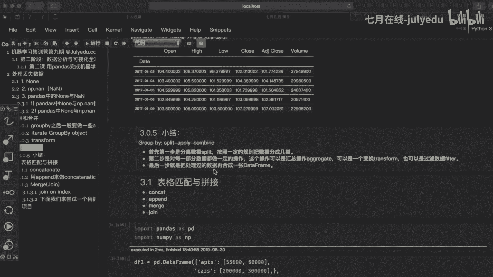
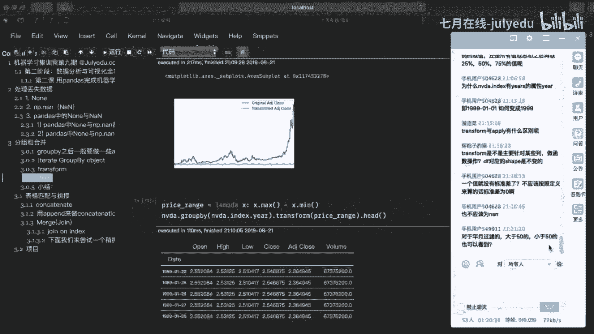
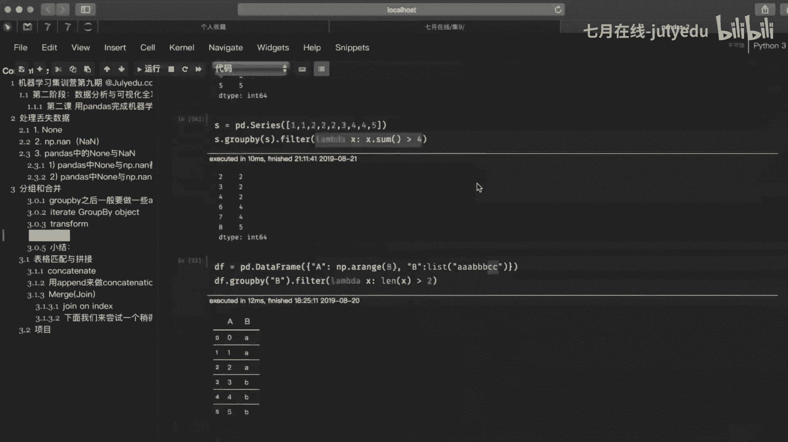

# 人工智能—机器学习公开课（七月在线出品） - P21：用pandas完成机器学习数据预处理与特征工程 - 七月在线-julyedu - BV1W5411n7fg

OK那么我们接着往下来讲啊。那么第二个知识点呢，也就是呢伙团的一个分组，还有一个合并啊，分组跟合并。那么分组跟合并什么意思呢？那么它肯定是对于我们一个表里面有多个这样的一个行跟列来进行这样的一个操作啊。

其实呢你可以简单的理解，比如说我们现在有一个很大的一个表格是吧？里面数据太多了，我想把这些里面的数据呢给它啊拆分一下，那么我们就可以用什么分组的方式啊。

这个给我们srcle里面是不是啊这个什么where heavy啊，是不是类似的是吧？然后合并，也就是说你拆完了以后分完了以后进行处理了以后是吧？最终是不是还要把它合并成一个啊de frame啊。

de frame那么这里面举一个呃例子是吧？啊比如说我们来。创建了一个啊d frame是吧？这里面有哪一些内容呢？比如说我们有这个name对吧？有year，还有我们的啊sary。

还有我们的 bounce是吧？有对应的我们的姓名年龄啊，还有这个工资啊，跟这个啊奖金啊，那么当我们创建完这样的一个d frame啊，或者说我们拿到这样的一个数据啊，我们来运行一次啊。

你看到当我们拿到这样的一个这样的一些数据的时候啊，那么更多的啊，其实呢像这个里面你看到是不是年份，2016年你的工资，你的奖金是吧？又是2016年是不是老宋就这么多了，对不对？

那么其实我们更想知道是不是做一个统计类的啊，统计类的。比如说我要把老王这2016年或者是2016年跟2017年是不是所有的这样的一个工资给他。呃，加在一起啊，对吧？来求一个和对吧？哎。

那么这个时候呢我们该怎么去操作呢？我们可以先把它给分出来啊，要不然这个是不是不好操作啊，是吧里面又有老王，又有老宋，对不对？还有容 name啊，你不好操作。

那么这个时候我们可以先分啊分那么分可以怎么办呢？我们可以用啊g by来进行我们的一个分组啊分组那么分组非常简单啊，我们直接去调用group by这样的一个函数啊，就O了啊，就O。

那么如果说你们对这个srcle有了解的话，其实这个g by啊，其实它就相当于什么对于某一列来进行什么呢？相当于进行呀汇总啊，比如说我们这里面你可以传一个什么name是吧？你可以对啊name呀吧？

或者year啊或者我们sary啊等等来进行这样的一个汇总啊，但是在这里面一定要注意我们得到的是什么呢？是一个de frame grow by啊，这样的一个什么呢？对象啊就是将相同的名字汇在一起呢。

其实不同的名字给他干嘛呢？分开啊，不同的能字给他分开啊，这样一个其是单纯的比如说我们这样的一个啊group by，其实没什么太多的一个意义啊，也就是说我们只是通过这样的一个方式。

这样的一个group by来帮我们去构造了一个group by object。是吧那么我们可以通过这样的一个group by object呢来帮我们去进行什么呢？后续的一些操作啊，后续的一些操作啊。

比如说我们往下面来走是吧？这里面是吧？比如说有这个呃aggregate是吧？O那么首先我们比如说针对于这个name来进行什么呀？求和是吧？是不是刚才我们在这上面已经对于这个name来进行分组了呀。

要分组了以后，比如说我们要来进行这样的一些统计，比如说哎直接去调一个这样的一个summer啊，那么这个summer。上面我们来运行一下啊。OK那么通过调这个summer这个方法呢。

其实我们获取上面的这样的一个object啊，g by objectject来进行这样的一个求和。也就是将各个列的信息呢，给我们加在一起啊，各个列的信息加在一起，而且是按照什么name啊。

按照name的方式已经给我们分好组了，然后把对应的是不是年是不是工资是吧？奖金啊全部的进行的一个累加啊，但是这里面是不是y它也给你累加了呀，对吧？这个 year累加是不是没有什么太多的意义啊。

这里面只是做一个啊演示啊演示。OK那么看到它的结果呢，其实呢你会发现是吧？其实它没有什么一个啊规律啊，只是根据这个name来显示后面所对应的数据啊，那么呃其实在这里面呢，我们可以么用它来进行一些。

比如说啊其实它内部有很多这样的一些属性啊啊属性。其实可以看我们对应的这样的一个啊gr by它的一个什么呀。源码啊可以看一下它的源码在这里面啊，我们来打开可以看一下对吧？它这里面其实有很多啊。

比如说有很多的参数啊，还有什么两个星号的KWX是不是可以写很多的这样的一些值啊，对吧啊，分别表示什么样的一些含义啊，在这里面啊，其实呢有相对比较详细的一个呃介绍啊，先比较详细介绍啊。

一会我们后面啊我们用到我们再来讲啊，那么比如说排序这个啊排序这个那么默认呢其实这里面啊，它是有这样的一个排序。那么你也可以选择不排序。那么如果说你要选择不排序的话，干嘛呢？

比如说我们把这个啊shot设置为什么forse啊，设置为forse是吧？那么啊这样一来呢，就可以完成啊完成。OK那么往下面来走啊，往下两面走是吧？呃，除了可以通过这个g by来帮我们完成以外，是吧。

还可以通过什么呢？我们的一个aggregate是吧？哎，它也可以来完成我们刚才所实现的这样的一个内容是吧？那么这个表示什么样的一个含义呢？其实呢就相当于呢哎我们的一个呃这个搞定是吧？

O我们来看一下这个函数它表示什么样的一个意思是吧？或者说我们来看一下它里面的一个参数啊，参数。那么第一个是不是FUNC是吧，我们的一个。哎，也就是说这个函数它之所以强大，就其实呢第一个参数非常留地是吧？

它可以传函数啊，传函数，而且这个函数还可以是什么呢？啊可以是stream是吧？可以是list还可以是什么字典是吧？也就是说你不光可以传一个函数的一个名字，你可以把函数名字是吧？用字串的形式。

或者用列表的形式啊，往里面传都是。ok了啊O了。比如说我们在这里面啊呃通过go by杠 name点上一个我们的aggregate对吧？传了一个summer。那么summer是不是相当于一个求和的呀。

对吧？啊？相当于一个求和。你在这里面来进行我们的一个运算啊，肯定是没问题。对吧，那么如果说我现在把它给改一下啊，也就是说把这个summer呢给大家换一下啊，我来copy一下。在这下面啊哎在这个下面啊。

我们再来加一个，我把这个summer换成什么str类型，也就是什么？哎，我在这个前后给大加一个引号，我再来运行一次。就实呢结果跟上面是一模一样。啊，结果跟上面是一模一样。OK啊。

也就是说它啊支持这个函数的呃种类呢是很多的。那么这个summer呢是不是python里面的一个内置函数啊，我们可以什么直接去调，而且可以换成字符串啊，同样呢它是识别啊。

也就是么这个AGG这个函数呢功能啊非常强大。那么除了这个以外呢啊可以往下来走是吧？还有呃它里面常见的一些内容啊，比如说我们可以呃还可以什么？比如说你想要去那么求平均啊啊，都行啊。

在这里面啊不光是这个呃summer是吧？你求和啊求平均啊，都行啊，我们在这里面也可以写一下吧。比如说在这里面我们把这个summer呢换成我们的一个平均。

那么平均是不是命你不能直接调人是不是用用n派下面的我们的一个命对吧？O啊，这个也是O了啊，可以拿到它的一个什么对应的平均的啊，平均值是吧？那么还可以干嘛呢？比如说你要求标准差，对不对？

那么是不是也可以直接去调我们n派下面的STD啊，O啊，哎哎哎哎点STDO也可以什么样拿到对应的我们这样的一个啊标准差是吧？OK这是它的一些常见的啊常见的。那么我们对应的这样的一个group by呢。

还有哪一些。比如说呃可以看看它的一个啊group是吧？那么比如说呃他会告诉你每个name的一个什么呢？index其实在这里面我们可以看一下是吧？它的一个index是什么呢？是不是对应的呃。

相当于什么这个索引index它所在的一个位置啊，是吧？我们老宋在哪几个位置，是不是126这样的一个位置是老宋啊，你可以往上去翻对比一下啊，看一下最上面是吧？你老宋的一个位置，是不是哎12是吧？

索引为一的索引为二的是吧？还有索引为呃这个六的是吧？对应的值是吧？那么往下面来走，其实都是什么呀一一对应的一个关系。也就是说在这个里面啊，我们可以干嘛呢？呃，查看通过他的一个这样的一个groups啊。

来告诉我们所对应的name啊，的一个index啊，除了这个以外，还可以查看它的长度是吧？比如说哎到底有多少个是不是就三个呀，对吧？老王老宋还有一个鲁妹是吧，就这三人啊。OK那么除了这个以外呢。

我们还可以比如说呃针对于我们这样的一个呃group by，就是说我们上面啊呃使用这个group by呢来做限定以外，其实还可以用下面这个 columns啊来做这样的一个呃group by。

也就是嘛你可以按行的方式也可以按什么呢列的方式来进行我们这样的一个分组的一个操作啊，比如说我们还是以这个为例啊，我们通过什么呢？这样的一个呃gr by对吧？然后在这里面。你可以传递什么呢？对应的啊。

我们刚才是不是对应的name，那么现在我想要俩了，对吧？我又想name就想一一页，那么你就传两个，然后呢对它进行一个什么呢？求和啊，也是什么呢？OK啊，可以呢拿到对应的这样的一个纸。と image。

OK那么比如说在这里面哈啊我们就针对于这个吧，比如说我们现在拿到这个name year，把name所对应的是吧？老王老宋龙妹是吧？对应的年份也引出来了啊，那么这些值出来了以后，比如说我嗯我想看到啊。

这这里面相当于什么我们每一位员工看到自己每一个年份所拿到的这样的一个工资跟奖金是不是现在都展示出来了，对吧啊，很清晰对吧？那么展示出来了以后呢，比如说我们除了这个summer之外啊。

我们可以其实它这里面有很多属性啊啊，不光只有summer，你还有一些比什么size呀me啊，还有一些什么中间值啊啊等等，对吧啊，都可以来啊，帮我们去达到自己的一个需求。

比如说你想看一下对应的它的一个啊size是吧？这下面啊也已经给你们显示出来了，对吧？还有什么me对吧？还有一些我们的一个啊面点对吧？这样的一个中位数啊中位数。O这些都比较常见啊。

你把它的一些呃对应的属性记住就O了啊。那么还有一个就是这个discript啊，这个要跟大家讲一讲啊，这个呃频率还是比较高的啊，应该把它放在什么？最上面来讲是吧啊。

你可以看到我们直接调这个group by name然后点上一个descript以后呢是不是显示的信息它比较全啊，对吧？

哎这里面就是把我们常见的一些属性都显示出来是吧count meanD mean什么25575max这些是什么鬼对不对啊？其实呢呃比较好理解啊，这个count呢表示基数啊。

也就是说对应的这个name它在整个这个表里面所出现的次数是吧？老宋是不是三次老王是不是4次是吧？容们出现一次啊，那么这个me呢它表示什么呢？平均值啊，平均值啊。

也就是这个还SG表示呢标准差这个命呢表示最小值max呢表示。最大值啊，那么什么2550，这个其实呢就是50是中位数是吧？这个25呢是25%是下四位数，然后呢75%是上四位数啊，那么一般我们在分析数据。

最开始的时候呢，经常使用这样的一个啊discript啊，来帮我们去查看一些基本的信息。其实这样呢呃会更加的方便一些啊，会更加的方便一些啊。把它给缩了啊，这样会看得更清楚一些。OK啊。

那么呃其实呢我们通过这个describe呢，就可以了解每一个cloown啊，它的一个基本的一个情况啊情况。🤧OK那么像以后你在呃用的时候是吧，可以最开始的时候就discript一下。

然后呢啊大致的就能查看大概的一个信息啊信息。OK那么往下面去走是吧？往下面去走，有一个什么呢？我们的一个啊迭代对象是吧？迭代这样一个group by这样的一个对象是吧？

那么啊在这个里面是吧我们怎么去迭代这样的一个对象啊，上面啊这个啊这个没给你们分是吧，应该变成我们的一个呃呃这样的一个编程模式是吧？那么在这里面呢。

我们可以对这样的一个group by呢把name啊来进行一个便利。那么得到什么呢？这里面的name还有什的group啊，我们来就是说显示一下，那么也就什么针对于我们这样的一个name啊。

还有对应的我们的group啊来进行这样的一个细分啊，那么如果说啊其实呢我们通过这个结果啊，通过这个结果，那么这个结果呢，其实就将什么？比如说我们的老王老宋罗们就是这三个哥们给他分开啊。

那么拿到这些单独的数据了以后，是不是我们就可以对每一个进行。单独操作了对吧啊，就相当于什嘛先把它给什么分开啊，分开。那么分开以后呢，其实呢下一步你就可以什么哎选择一个了，你想对哪一个进行操作。

你就可以直接选对吧？哎，选择一个对应的group来进行操作。比如说你想选什么呢？老宋的对吧？哎，你就看一下老宋的，然后呢，可以看一下，这是啊它的一个什么类型。那么你看它的类型是什么呢？啊。

注意来看它是一个de frame。啊， get from。那么我们现在对这个老宋这个哥们进行操作，也就是通过什么呢？这个get啊，这里面又一个新的函数是吧？

get group也就说获取对应的group是吧？来指拿到指定的数据。那么然后呢，我们通过type这样的一个函数呢，来查看一下它的一个类型，发现它是一个dt frame。

那么这里面啊其实每一个group它都是一个d frame。啊，都是一个d词。那么这里面其实呢就是将一个大的表格啊，比如说我们上面是不是相当于一个比较大的表格。

那么把一个大的表格呢拆分成几个小的这样的一个表格，然后呢对它进行单独处理。那么这样会方便一些啊，会方便一些是吧？那么我们拿到这样的一个内容了以后是吧？我们怎么来进行这样的一个操作呢？是吧？啊。

比如说我们又可以通过ag是吧？又可以通过它啊，那么呃这个方法你可以简写，可以简写成什么呢？AEGG啊，AGG是吧？比如说我想要去显示一个求和的是吧？比如说你要对谁来进行求和是吧？

这里面啊这里面写的可能比较多，又能求和，又能求平均，又能求什么这样的一个呃。标准标准差对吧？那么在这里面如果说你只想去单独的拿一个这样的一个球盒啊，也是呢肯定是可以的是吧？你既然可以多个了。

你肯定这个呃单个肯定也是呢OK我们来试一下是吧？你可以拿到对应的是吧？老王老宋荣威啊，他的一个球和。那么也就是嘛通过这个呃。aggregate是吧，来完成什么呢？完成这样的一个呃内容。

那么通过这个AGG其实相当于呢它的一个别名啊，你可以直接去代替去使用。那么一个是ok的，多个呢也是OK的。那么需要用一个什么呢？list来包裹一下。啊，这里面加一个list来进行包裹一下就。

OK了啊OK。那么现在我们知道怎么去拿到每一个啊group。那么接着呢，比如说我们想要对这里面的某一列来进行这样的一个操作，该怎么来去操作，是吧？

也就是说我们可以采用不同的我们的appric get来进行操作。那么操作的时候在这里面就需要去注意了，是吧？它的一个基本的格式是怎么去写的啊，基本的格式是怎么去写的，是不是这里面我们传的是一个字典呀。

传的是个字典啊，比如说我们这里面。是不是选择我们的工资，还有什么呀？奖金是吧？那么对每一列来进行干嘛呢？是不是来了一个求和呀，是不是对工资跟奖金这两个列来进行了一个求和是吧？那么求和以后的一个结果是吧？

我们来看来看一下是吧，它的一个结果是不是对应的就这两列是吧？来进行求和啊，求和。那么啊因为我们对这个 year呢并没有什么呃对他求和没有什么太大意义。但是呢比如说你又想要是吧？这里面是不是。

没有显示年份啊对吧？没有显示年份，那么你又想要它，那么该怎么办呢？是吧？你可以把它给加进来，但是你不要加求和了啊，不用把这个年份给它加进来，你可以选择什么呢？选择呃索引为一的或者是索引为零的对吧？

也对应的是2016呢，还是2017呢，那么这个里面怎么去写啊，你可以用一个匿面函数的方式啊，从这个里面去取啊，比如说根据你的索引啊来进行拿啊，比如说你拿零，那么对应的，我们就拿201116年的对吧？

那么如果你想拿2017年的啊，给它改一下，就O了啊，O那么下面呢同样啊这个呃也可以嘛通过啊我们这个di来显示对应的啊这个里面的一些信息。

那么这个其实就是我们呃比较常见的这样的一个什么呢分组跟聚合的一个操作。我们使用这个什么group by将一个表格，比如说我们拆分成若干个这样的一个部分啊，然后呢。

我们使用这个appric进行一个一个的汇总啊，比如说你到底是求和求平均，到底是干嘛啊，操作完了以后呢。相当于什么？你是不是又得到了这样的一个相当于汇总到以后，其实呢他还是一个d夫人。

或者说你可以这样去理解我们pas呢其实提供我们行跟列的这样的一个啊聚合操作。那么你可以把这个gr by呢就简单的理解为是行的这样的一个基于行的这样的一个操作。

那么这个 aggregateate呢理解为是什么？基于我们的一个列的啊，而且我们从上面的这些例子来看呢，g by呢返回的是一个de frame grow by这样的一个什么结构。

那么这个结构呢其实呢它必须要去调用我们的一聚聚合函数，对吧？比如说我们的一个summer啊，你调了summer了以后才能够得到结构为saries这样的一个什么数据的一个呃相当于什么结果。

那么而我们这个aggregate它是不一样。它呢是de frame的一个什么直接方法，它返回的就是一个de frame它本身就是一个de frame啊，那么它的功能啊就有很多了。

比如说我们的什么summer啊命啊，它是都可以呢实现的，也可以实现它的一个简洁版，你可以直接用什么AAGG来进行。期待啊更加的简洁。而且呢你传给它的函数是不是可以是什么呀？字助串的，也可以什么呀？

是自定义的对吧？啊，参数我们的一个啊con啊是对应的这样的一个。比如说我们的一个啊dad frame啊，这是我们针对于这样的一个呃。grow by。

还有呢我们的一个ag它俩的一个描述啊描述O那么除了这个以外，那么后面其实还有两个常见的是吧，一个是transform，一个什么fieldelt啊f。那么这个transform呢就比较灵活了啊。

应该是它应该是这几个里面相对来说啊最灵活啊，其实这个transform呢主要就是表示对一张表格呢，我们来进行转换啊来进行转换啊。

但是它的特点呢呃也就是说它可以根据我们呃比如说各自的特征来进行单独的这样的一个转换。也就是说它可以把我们这个group里面这样的一个比如说每一个记录吧。

都按照比如说同样的这个规则来进行这样的一个转啊来转来达到我们想要的这样的一个效果。我下面走了吧。我们来看一下是吧，看一下这个呃trans是吧。

这里面呃用了一个呃NVDA啊一个这个股票的啊股票的这样的一个数据是吧？那么用这样的一个数据你显示了以后是吧？你会发现有什么呢？啊，就相当于开市的闭势的最高的最低的啊等等这样的一些数据。

然后对应的这里面是不是还有一个dt？d那么这个读这个CSV文件是吧？这个就没什么好讲啊，这里面传什么呢啊，你读入文件的一个位置是吧？不管是相对的绝对的啊，都行啊。

然后这里面呢啊还有一个什么index啊扣是吧？那么这个表示什么意思呢？用作啊我们这个呃行索引的一个列编号或者是列表啊，比如说这里面你写零是吧？其实呢这里面就一个d是吧？或者说你可以呢直接写d也可以啊。

O我来试一下是吧？O给。转一下，我把它给注释掉了。注释掉啊，然后在下面我们给大家重新换一下，把这个零呢你就可以直接换成我们的一个dt。然后呢，对应的这个里面啊，我们的一个解析是吧？

paris death是不是？哎，你对应的indes gone啊，我们的一个啊collog是吧，是啥？你解析的就是啥，是吧？来一个dt。OK那么这两个主要呢匹配上了是吧？

OK那么同样啊操作是啊得到的结果是一模一样啊，这个根据你的一个需求啊都行。那么这样一来呢，我们就拿到了比如说呃这个呃股票的一些信息啊信息。那么我们拿到了这样的一个信息了以后呢，我需要比如说对这个股票。

我现在想要干嘛呢？按照年份来进行分类啊，分类那么其实按照年份来进行分类，我们这个年份啥呀，是不是就是一个一个的index呀。那么也就是说我想要拿到这里面所有的index该怎么去拿呢？啊，最简单是吧？

就来一个。拿到我们这个NVDA对不对？拿到它点上一个什么呢？点上一个index啊，非常简单啊，我们直接吧拿到这样的一个index啊就可以了。O来运行一次，那么就是所有的年份。

但是这个拿的时候是不是好像里面还带月份的，对吧对？然，我们把它给过滤一下对吧？啊，过滤一下，在这里面我们给它一个比如说再加一个什么呢？加一个year，点上一个我们的一个ear。是。OK我们再来运行一次。

那么这样一来呢，就把就过滤出什么所有的年了啊，所有的年是吧，基本上就拿到了。那么呃除了这种方式以外呢，其实我们还可以通过什么呢？这个年来，比如说拿到其他的一些的值。

比如说我们的平均值啊等等吧比如说我们现在啊想要拿到这个股票对吧？每年的一个啊平均情况啊，你就可以直接把它作为参数传给我们的group by，然后呢调一下我们的命这样的一个函数，可以拿到啊。

针对于年这样的一个什么呃股票的一个平均的一个情况啊，O这是这样的一个内容。那么除了这种方式以外啊，其实啊还有啊比如说我给他换一个，其实我不用这个什么呢？不用这样的一个呃。

g by或者我用刚才我们呃才学的这样的一个什么呢呃AGG啊，其实也可以啊，或者用group by加AG也可以先把它分分完了再定对不对啊，也可以啊？比如说我们把它前面呢copy一下。

或者整个的copy一下，后面呢命呢我们就不要了，对吧？啊我就可以不要命了，我可以什么把它是么作为参数啊，来个什么呢？AGG对吧？然后呢在这里面我把这个命是吧拿到我们的n派点上一个命OK啊。

把它作为参数那乘进来啊，其实这样呢也可以什么实现这样的一个啊，我也可以拿到什么呢？对应年份啊，每只股票它可能它的一些啊具体的一些情况对吧，它的一个平均值啊。OK那么这个是我们对应的是吧。

怎么去根据某一列的值是吧？来求呢？比如说我们对应的这样的一个平均值啊，那么除了这个以外啊，比如说我们按照下面的是吧？呃，其实还可以。比如说我们可以把刚才内容，你可以拿画个图吧来显示一下是吧？

这个呃用图呢来显示，其实呢相对来说更加的直观一些，是吧？比如说我们就拿它吧copy一下了啊，拿它点上一个我们blat。🤧点上一个plO啊，然后呢我们来运行一次。呃，这里面拿不到拿一个平均值啊。

我拿平均值了，点撞一个命。啊，调上给他OK那么这样一来呢，我们就可以呢呃拿到这个图片，但是拿到这个图片。好像只有这个咖啡色的吧，咖啡色的这个呃man是吧，对我们的意义没有什么太大。

应该是什么open啊hi呀，是吧？这些参数对我们更加的有意义一些。但是好像没有显示出来是吧？那么这个时候呢，我们可以呃过滤一下，我们把最后这个根们给它干掉，在这上面再给它过滤一遍。

把最后这给大家给大家删掉，那么删掉是不是过滤我们之前用哪个方法呀，是不是可以用这个Iloc啊，是吧？Ioc，然后呢，比如说我们给它剪掉，对不对啊，减掉那么剪的时候呢，我们比如说去剪最后一个吧。

来一个冒号是吧？来个逗号来个冒号，比如说到啊-一吧，负一给它给干掉啊，OK然后在这里面我们再来去呃显示一下啊。O那么这样一来就啊比上面要好多了啊好多了。那么这样对于什么我们的open high呀。

low啊，clo啊，这样的一些值呢描述就很清楚了。是吧下面有对应的个年份啊，可能我这儿黑色的背景这看的不太清楚啊。OK这是对应的一些纸啊。OK那么针对于上面的这个方式呢。

我们到底是比如说是使用这个g by呢，还是呃这样的一个aggreg呢？其实呢根据你的一个需求啊，其实我觉得哪一种呢？其实啊都可以啊都可以啊，哪一种熟呢，你用哪一种啊。

OK那么接下来呢我们来学习第呃第二个是吧？啊，第二个。那么第二个呢我们的transform啊，那么这个transform呢呃比较常见的里面有哪几个呢？比如说第一个我们的一个呃theq啊。

O啊一个是它啊那么这个呃Z core呢，其实上呢它是对数据做归一化的这样的一个操作。那么这种方法呢啊这里面写了一个小式子啊，其实它是基于我们的原始数据的一个均值跟这个标准差。

然后呢进行数据的一个啊标准化啊标准化。🤧OK那么这是一个是吧？那么还有什么呢？还有我们的一个什么呀这个呃op是吧？哎，它呢也可以起到这样的一个呃同样的一个效果啊，那么这个方法呢，我们来简单看一下啊。

我把它运行一次。OK啊再来运行一下它。那么这个opplay这个方法，我们来看一下它的一个源码。在。找到。Yeah。OK我们来讲一下吧。其实这个op这个函数呢，其实它就是tens里面呃。

我认为啊应该是所有函数里面自由度最高的一个函数是吧？那么啊它是属于我们的一个啊de frame啊，de。那么我们可以通过d frame呢第二一个什么 plane来完成是吧？这样的一些呃操作，对吧？

那么这个 plane这里面有哪一些常见的一些内容，其实呢主要的跟我们刚才这个acgreg呢其实类似啊，里面第一个参数呢也是传的是一个啊方啊，也是一个方啊，那么呃其实这个方向呢。

其实你可以理解为函数的一个比如说指针是吧？那么这个函数啊需要我们自己去实现啊，函数传入的一个参数呢啊，我记得这里面好像还有个什么accesacces等于一的话啊。

比如说可以作为我们这样的一个嗯比如说sris的一个数据啊，把它传入给我们这样的一个函数啊来实。啊OK那么我们只需要记住什么？第一个啊第一个就是一个什么呢方形就OK了啊，传入对应的一个内容啊。

那么在这里面我们来御结此。OK那么呃通过它呢能够根据啊，比如说我们还是这个年份啊来显示对应的一些内容是吧？OK那么下面比如说你要想把它给画出来啊，也是一样的一个啊操作是吧？比如说你根据哪一些内容画出来。

比如说你想要画它画它是吧？根据谁呢？你的ADG啊close是吧，来完成啊，分别是比如说这两种是吧？一个是呃NVDA，还有一个什嘛。う。OK啊，可以拿到对应的这样的一个内容。那么当我们拿到这个内容了以后。

到底要干嘛啊？比如说我们可以查看这个呃一年中是吧它的一个最大值啊或者最小值啊，或者说哎我们可以呃求一下它的一个什么最大跟最小的一个什么差值啊，价格啊。

价格的一个差值那么这里面我们就可以直接调用什么的命啊，跟这个max这样的一个函数，然后通过什么呢？我们的transform啊，把我们对应的价格re range是吧传进来OK啊。

我们通过它来进行这样的一个内容的一个什么显示啊，这显示。OK啊后面可以吗？单独的，比如说你也想求最大的啊，也可以吗？直接传什么max，而不是传啊，比如说算完以后的是吧？OK啊，这也是可以的。

那么命呢同理是OK了。呃，这是我们的一个啊transform是吧？那么还有什么呢？常规的，还有一个常见的啊fieldil是吧？我们的一个过滤啊过滤。

那么啊其实这个过滤呢呃跟我们之前在讲python里面的高级函数，是不是也有一个filelter，对吧？哎，他俩其实呢如果从原理上来讲啊，基本上是啊一模一样的了，对吧？啊，都是完成我们的一个过滤对吧？啊？

符合条件的我就要不符合条件的呢，我就不要啊。OK那么下面我们来举一个例子，比如说我们啊搞一个简单的是吧，来一个什么呢s是吧？来创建个s是不是这是一个一维的是吧？里面是一个列表。

那么列表里面的内容是不是一22什么3445，这个呢随便去写都行啊，没有什么要求啊，然后呢我直接把这个啊赋值给一个变量S，然后把这个S呢传给group by。

是不是相当于对这个一维数组里面的数据进行了一个分组啊，是吧？那么分组有哪些呢，是不是就变成了一是吧？有这个R有这个三有这个四有这个5是不是有这样的几个内容啊，O啊，那么你拿到了这几个内容了以后是吧？

或者说我们在上面可以加一个吧，这个可能写这样看的不太清晰是吧？比如说在上面我们把这个呢给它copy一下。copy一下，然后呢，我们在这里面呃先不过滤啊，比如说我们先对它做一个求和吧，来一个summer。

来做一个求和是吧？你们来看一下是不是分完了以后，是它12345啊，那么对应的一有几个，一是不是加在一起是2啊，对应的是2，那么二有几个啊，是不是123是不是三个加在一起是6啊。

三是不是就一个啊四不是加起来是8我是不是就一个，那么对起来是不是对应的分组，然后呢拿到对应的这样的一个summer，那么拿到这个summer呢以后，是不是下面这个是属于什么呀过滤，通过什么呢？

这样的一个函数来完成一个过滤，那么这里面是不是第一个又是一个我们的方对吧？啊，只是用了一个匿名函数的方式啊来完成吧？那么在这里面我们怎么去理解呢？其实这个XX就相当于什么？我们传进来的这个值。

你要对哪一个来进行过滤，那么就传这个X呢就相当于什么？我们这段对吧？对的，你拿到这个值了以后，求了一个呃和，那么如果大于四呢，我们就干嘛呢？留下来对不对？留下来，那么小于四呢？就不要了。那么。

大于四的有哪一些尺呢？是不是61个对不对啊？61个，那么还有谁呢？是不是81个，还有一个呢？5是1个，对不对？那么谁留下来是不是3个2？两个4一个5啊，这前面是什么呀？它所对应的索引啊。

默认的一个索引是吧？OK啊，这是过滤啊，这个是比较简单的一个啊。那么还有什么呢？比如说下面我们创建了个二维的是吧？上面是一个s一维的。

那么下面来一个二维的de frame那么d frame这里面呢我们用一个字典的形式呢，给它搞了一个A搞了一个B吧？呢具体的一个内容是吧随机生成0到8的数是吧？这里面是什么AABBCC是吧？

具体的几个呃一个几个字符啊，然后呢我们通过啊一样的一个方式啊，来先给它分组，然后进行过滤，那么过滤的时候呢，我们来判断它的长度是吧？通过它的长度如果大于二的时候呢，哎，我们就干嘛呢？保留是吧？

反之呢就pass掉是吧？那么二哪一些大于二呢？是不是这里面是不是ABBCC是不是CC就排出来，是不是留下来的就是什么呀？这个AAABBB这三个对应的这样的一个值对这值吧？OK那么呃这是对于什么呢？

B来进行什么呢？过滤的啊，你也可以对应么呢A来进行过滤啊，这个无所谓了啊，这个无所谓了。OK呃，那么下面是吧，比如说我们对于刚才的这样的一个股票是吧，你想要去查看一下我们当前的这样的一个。

比如说均价超过100的，有哪一些这样的一个呃月份是吧？啊，可以我们在这里面也可以演示一下啊，来先显示一下，然后呢。哎，这个这个月这个可以不要了啊。

然后呢在这里面你就可以嘛直接通过这个fieldel这个方式来完成什么呢？过滤对吧？啊，O那么100它必须要干嘛呢？啊，超过100，那么在这里面我们可以啊把这个条件改一下吧，改成什么100大于100。

因为平均值大于100的，我给他什么显示出来。那么根据谁呢？根据我们某一年里面的什么某一月啊，那么这这里面要注意一个问题啊，就是说啊有的同学可能在思考的吧，我要不要写这个年是吧我只写一个月行不行呢？啊。

最好是要写上年啊，否则可能会出问题，但不是一定啊，因为这个呃月份每年有12个月，它有可能会跨年是吧？有可能会跨年啊，可能中间咔啊，这个对。那么所以说一般在这里面啊。

我们最好写上啊写上OK那么完事了以后是吧？呃，100以上的是不是都给我们咔咔咔显出来了啊，相当于啊我们过滤的这样的一个结果啊，过滤这样的一个结果。

OK那么啊这是我们针对于啊这个啊分组跟合并啊几个常见的一个内容。那么这里面啊最后给了一个小的一个总结是吧？啊，它的一个顺序就是什么呢？先splate在op plane是吧？在我们的一个啊comp是吧？

也这么第一步是分离我们的一个数据，然后按照规则是吧，你怎么去分啊，这个根据你的需求，那么第二步呢。就是啊比如说把这些数据啊都做一些什么我们的操作。这个操作呢，你可以是汇总啊。

比如说我们用什么aggreg，你可以什么变换一下，用什么trans也可以过滤是吧？用我们的啊，这个根据你的业务需求啊，那么最后呢把这些处理的数据呢再合起来啊，变成一个什么呢？啊，其实可以简单这样去理解。

那么比如说现在我们有一个比较大的一个表格是吧我们通过这个group呢把它给切开对不对？切开以后是不是我们就可以通过是吧？gregtrans等等来进行处理，处理完了以后再合一下是吧？哎合完以后生成一个啊。

其当于什么相当于什么原来一个什么总分这样的一个格式啊总分种这样的一个格。

OK我们来看一下。🤧呃，问题啊嗯。0126。往上翻一下。你说的这是。그。呃，容妹就一行数据啊不应该存在这个标准差哦，它这里面会就是说你即使不存在，它也会显示出来啊。

discript中间缩裂的部分怎么去展示出来啊，因为这个是这个怎么出来？这个 book它本身就有这种机制啊，就是说你数据可能太大，它就会自动的把你去缩起来啊，那么像这种呃你可以用其他的一些内容啊。

其他工具把它给展示出来。255075取值。还是所有的值区总以后再去。啊，这个根据你的需求啊。变成这个OK也就是你如果直接呃想要把这个什么1999-1-1变成1999，那么直接啊在后面点上。

比如说你要对你，那么就点y就可以啊。transform跟app plane的一个区别啊，其实这个区别呢呃。首先哈这个app plane啊相当于什么底层一些啊，底层。

那么transform呢在它的一个基础上相当于封装了一次啊，那么其实他俩呢呃。用法呢基本上没有什么一个太大的区别。全form针对某些列。嗯，是的啊，可以这样去理解啊。对于过滤一年越过大于50，小于50。

也可以看。🤧ok啊。😊，呃。那么这个是对于我们的一个分组，还有一个合并里面的几个知识点是吧？你就记住什么呢？几个常见的函数是吧？go by，然后呢，我们的一个啊这个这个transform呀。

filter呀啊，还有一个aggregate是吧？还有里面比如说我们的obin是吧等等。

Right。

