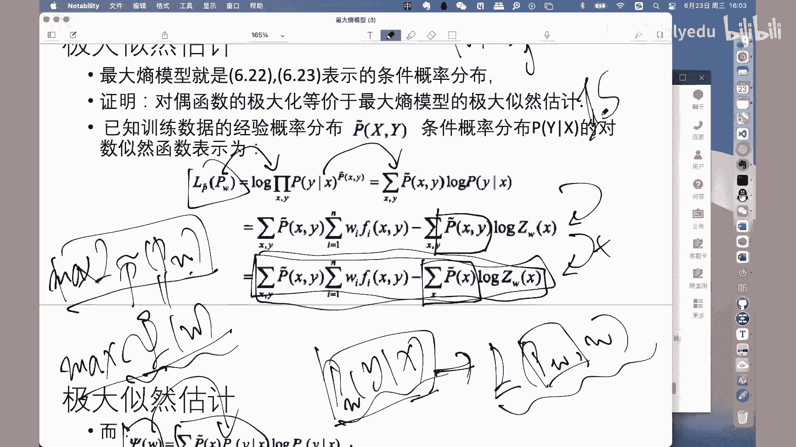
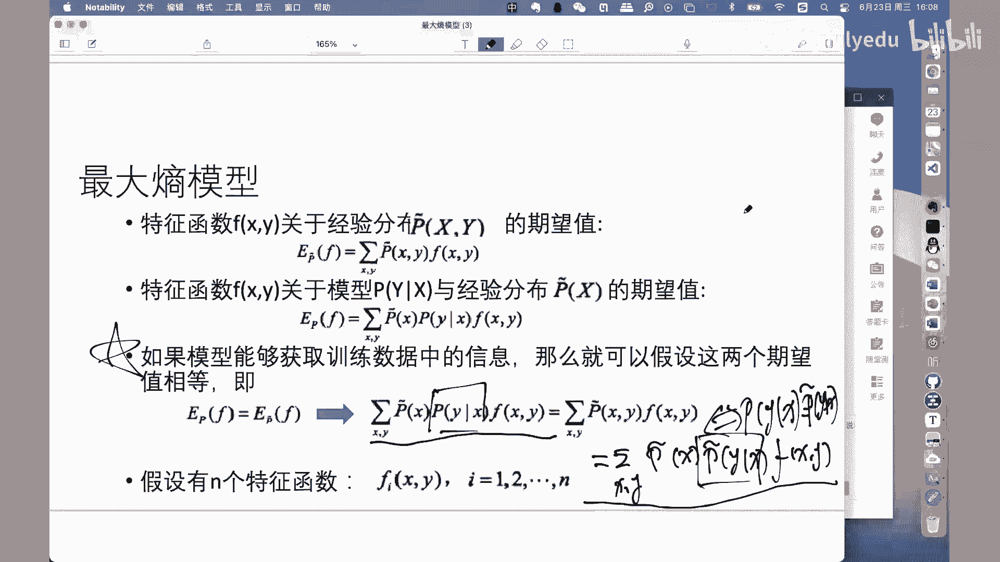

# 人工智能—机器学习公开课（七月在线出品） - P22：【公开课】最大熵模型原理推导21年6月 - 七月在线-julyedu - BV1W5411n7fg

🎼，🎼，喂喂喂嗯，如果声音和视频没有问题的话，我们就准备开始好吗？那么按照我们的安排啊，今天呢我们和大家一起这个。讨论一下关于最大商模型的一个内容。那么关于最大商模型呢。

我们首先从这个模型的关联关系图当中啊，找一下它的位置。最大商模型出现在这里啊嗯。大家可以看到啊最大商模型的一个作用啊，是为了啊后面我们会介绍这个呃推荐随机场模型CRF的时候。

会使用最大商模型解决A呃CRF的这个模型学习问题啊，所以在这个地方啊也首先把这个最大商模型做一个介绍。啊，大家也可以看到啊，在呃最大商模型当中呢，它也是需要进行大量的概率计算啊。

所以呢我们也把之前介绍到的关于加法规则和乘绩规则也做一个介绍。首先我们看一下加法规则，加法规则啊呃说的是我们PX啊，边缘概率等于someYPXY啊，它和联合概率之间的一个关系的等式。那么很显然。

边缘概率和联合概率不相等。那么。我们只需要在s啊在Y上进行一个全概率累加，这个时候我们就可以得到我们的边缘概率和联合概率的相等的一个等式。那么这个地方需要注意的是两点。第一点。

我们有的时候是使用啊加法规则把边缘概率啊，一个随机变量的边缘概率展成两个随机变量的联合概率的形式啊，这是一种方式。那么还有的时候呢，我们还可能会这样来使用啊，把两个随机变量的。联合概率啊。

通过萨姆求和啊还原回一个随机变量的边缘概率的形式啊，这两个方向呢，我们都经常会使用到。那么下面关于乘积规则啊，乘积规则说的是两个随机变量XY的联合概率啊，它等于P在X条件之下。

Y的条件概率乘以PX很显然啊，后面是两个啊概率分布的乘积的形式。其中一个是条件概率，当X已知啊作为条件的时候，随机变量Y的条件概率。那这时候很显然随机变量X的不确定性啊，就没有了。

因为它是已知的随机变量。那这个时候很显然它和两个随机变量联合概率之间已经不再相等啊，不相等的原因就在于这里的随机变量X啊，它的不确定性或者说随机性没有了，那怎么办？再把它的随机性啊，再乘回来啊。

乘以PX的边缘概率这样的话条件概率和边缘概率的乘积就等于它的联合概率的形式。那么同样使用的方向也是两个方向。第一个。方向。两个随机变量联合概率展成条件概率变现概率的乘积啊，这是扩展啊。

把它一一个随概率分布，展成两个概率分布的乘积的形式。那么还有另外一个用户呢，就是相对应的啊，条件概率和变缘概率的乘积等于联合概率。那这个时候呢就是类似于一个吸收啊，在进行这个复杂的概率计算过程当中啊。

这是两条非常重要的规则啊，加法规则和乘绩规则。用到的时候，我们会头头来再看一下。那么下面就开始介绍啊所谓的这个最大商模型啊，最大商模型。最大商模型呢是最大商原理在模型推导过程当中的一个具体应用啊。

具体应用。那么首先介绍一下最大商原理。最大商原理呢可以认为是一种方法论啊，我是认认为是种价值观啊，认为是一种价值观，就是当我们怎么去认识这个所谓最优模型的时候啊，最大商模型给出了一个指导性的原则啊。

或者价值判断的一个依据。也就是说在进行概率模型的学习的时候，在所有可能的概率分布当中。啊，所有可能的模型当中，我们认为啊最大商最大的模型是最好的模型，很显然这个地方我们做了一个价值判断，对吧？啊。

所有满足我们的条件的模型有很多。那么这么多的模型当中，我们选择什么样的模型作为所谓的最优模型的时候，我们选择商最大的模型啊，表述为在满足约束条件的模型集合当中，选取商最大的模型。呃。

这是所谓的最大商免理。那么。把这条原理啊把这条原理和我们这个信息论里面的商的概念啊进行一个结合。那么我们假设啊离散的随机变量X的概率分布为PX啊，随机变量X的概率分布为PX。

那么当前概率分布P的商被定义为负的s XPX乘以logPX啊呃。这是呃信息论里面给出的关于商的一个标准定义。那么关于PHP的一个取值范围呢，它是大于等于0，小于等于log X的模啊。

其中呢X的模呢是X里面取值的个数，因为X在这里是随机变量，它可以取多个啊不同的值。那么有多少个，那么啊我们根据它当前可能取值的个数啊，作为log X模的一个计算。那么很显然。

这里的log X的模是HP的一个上界啊，HP的一个上界。那换句话说，当什么时候HP取得最大值的时候，那么当随机变量X啊取得它啊任呃。在所有可能取值当中是等概率取值的时候，取到HPX的上界。

这也表述了啊关于商模型的关于商这个概念的含义。比如说商描述的是随意变量X的不确定性啊，当随机变量X在所有取值上等概率取值的时候啊，它的不确定性是最大的取到它的上界上界的值是logX的啊。

这是在呃信息论里面啊有深入的讨论。那么在这里我们直接拿过来当做一个数学工具使用也就可以了。那么下面正式的啊把一些这个最大商模型当中的一些呃概念给出来。首先X和Y啊分别标对应的我们的输入和输出的集合啊。

就是我们的输入空间X和输出空间Y那么这个模型呢表示是对给定的输入X以条件概率的形式给出它的输出Y啊，这个时候大家应该清楚，我们的模型表示形式有两种，一种方式呢是根据我们的决策函数的形式啊。

直接Y等于FX。来给出啊，而后面呢我们可能会见到啊越来越多的以条件概率的形式给出的模型表示啊呃那这时候很显然，X是作为已知条件，输入进来以后，得到关于它标签啊对应标签的一个概率值啊。

这是关于我们的以条件概率的形式表述的啊模型。那么这个时候我们就需要有训练集啊，有训练数据集，对我们的模型加以训练和学习。这个时候数据集T等于X1Y1X2Y2一直到XNYN那是我们的数据集。

有了数据集以后，我们就可以把一些数据集上的一些概率分布啊，首先使用它的频率值来进行表示啊，后面当使用到这些经验分布的时候，我们直接拿过来用就可以了。首先哈首先我们可以得到的是。就点PXY啊。

在数据集T上随机变量XY的联合概率啊，随机变量XY的随机变量啊，就是X等于XY等于Y的联合概率分布啊，在数据集上的联合概率分布等于什么？那么很显然啊，我们是使用整个数据集上的频率来表示这个概率分布。

那么很显然我们就说需要遍历一下整个数据集把那些X等于XY等于Y啊，满足这两个条件的所有的元素的个数啊进行一个统计啊，统计在小V里面。那这样再除以整个数据集的元素总个数啊，很显然有大N的元素。

那这样的话我们用这个比值啊频率值来表示X等于XY等于Y的联合概率，在数据集上的联合概率好吧。那么类似的随机变量X的在数据集上的变量概率等于等于什么？

等于X等于X满足这个条件的所有的数据的元素个数比上整个数据集上的元素个数啊，同样。得到的是关于啊边缘概率X等于X的一个经验分布。

那这样的话后面啊后面当我们使用到啊当我们使用到数据集上的联合分联合分布和数据集上的边缘分布的时候，我们直接拿这两个频率值来使用就可以了。那么另外一个概念呢这做特征函数啊。

特征函数呢是关于XY的啊关于随机变量X和随据变量Y的。如果XY满足某一事实，那么它特征函数返回一否则的话返回零啊，关于特征函数的理解啊，是需要根据就是呃首先在一般意义上你可以把它理解成是一个条件啊。

当XY满足某个条件或者某一个事实的时候，特征函数返回一啊，当不满足这个条件或者不满足这个事实的时候，返回的就是零啊，这是一般意义上的一个表示。那么同样啊也可以根据啊最大商模型在解决一些实际问题的时候啊。

把那实际问题当中或者实际环境场景当中的一些情况啊。对应到我们特征函数当中来加以分析啊。比如说后面我们会讲到CRF的时候啊，那个时候的特征函数啊，就定义的是CCRF上的特征函数啊。

但是一般意义上同样是XY满足某一事时的时候返回一，否则返回0啊，这是关于特征函数的表示。那么有了上述的呃一些准备以后呢。

我们就可以给出哈关于特征函数上啊分别呃它的经验分布和它的这个呃经验分布呃PQ点XY的期望以及关于模型和经验分布PX的期望的两个期望的表示形式。首先特征函数FX关于经验分布Q点PXY的数学期望。

我们可以表示为EQ点PF等于sXYQ点PXYFXY啊，这首先是个数学期望啊，这一点首先关关注一点，这是数学期望。那么只是呢它的期望的这个概率分布是经呃是数据集上的经验联合分布啊。

Q点PXY然后呢乘以FXY然后在XY上进行一个累加啊，这是呃EQ点PF那么同样特征函数FX啊，呃FXY关于模型以及。边缘概率的数学期望EPF等于sum XYQ点PX乘以PX条件之下。

Y的条件概率再乘以FX同样这也是个期望啊，同样这也是个数学期望。嗯，只不过呢它的。希望分布不一样啊。上面的期望分布是我们联合概率XY的经验经验分布。

那么下面这个期望呢是我们的模型和我们的边缘概率的这个呃期望。那么有了这两个期望值以后，下面是非常重要的一点。是这样说的，如果模型能够获取到训练数据集当中的信息，那么就可以假设这两个期望值相等。

及下面这两个期望值相等。呃，为什么这么说啊，为什么这么说，那么我们看一下我们反过来啊，我们对应的假设这两个期望是相等的啊，假设这两个期望值相等，我们看看能得到什么结论，那么假设这两个期望相等。

我们就把这两个期望的形式啊进行展开啊，一个是在边缘概率和我们条件概率上的期望。另外一个是在我们联合概率上的期望给它展开。展开以后呢，我们再把后面这个联合概率上的期望进一步的得到一个表达式。

我们前面讲到过啊，联合概率啊，联合概率可以写成边缘概率和条件概率的乘积的形式啊，按照我们的乘绩规则。那这样的话，我们把这个地方的就点PXY写成。Q点PX乘以9点P。X条件之下，Y的条件概率。

然后再乘以一个FX。FXY那么这个时候我们看可以看到啊，我们可以看到这个式子就等于这个式子。比较一下这两个式子，你会发现其中啊其中。形式上啊其其中形式上非常类似，只是。可以得到。这里的PX啊。Yeah。

这里的屁。X条件直下Y等于等于Q点PX条件之下的Y。那么得到这个式的含义，大家可以看到啊，我们知道上面带包装号的这个呃。条件概率分布是我们在数据集当中学习得到的，而右面就是我们的模型。那么很显然。

也就是说当我们假设这两个数学期望相等的时候，那么我们得到的一个结论就是数据集上的条件概率或者条件分布，就等于我们的模型分布。反过来，如果我们说啊就像刚才那个就像刚才上面一句话，如果我们说我们的模型。

我们的模型在数据集上已经学习到了。数据规律的话，那么很显然意味着啊很显然意味着两上述两个数学期望的值也是相等的。因为这个地方都是都是用个等号表述对吧？等号表述。所以那么很显然啊，刚才我们是假设啊。

我们刚才是假设这两个数学期望相等，得到了上述这个式子。那么相应的，如果我们认为这两个式子相等，同样我们也可以得到上述两个期望相等。那么也就是说，而我们会会发现。上面这个式子的相等。

意味着我们在数据集上的条件概率就是我们的模型，意味着我们的模型能够获取到数据集当中的信息。那么上述两个期望相等。好吧，啊这个地方啊是非常重要的一点理理解。那么另外呢需要注意。

另外一点就是关于我们的特征函数啊，关于我们的特征函数有是有N个啊，是有N个FI等于X啊FIXY是I从一到N啊，N个条件啊，N个特征函数这N个特征函数都需要代入到我们的期望值当中使两上述两个期望值相的。

那么因此我们可以看到啊，我们得到下面。关于。最大上模型的一个呃。分析。首先我们假设所有满足约束条件的模型啊，所有满足约束条件的模型为下数的集合啊，为下数这个集合用花C来表示。花C呢是一个集合啊。

它是由那些。在我们所有的特征函数上，FIF1F21到FN在所有的特征函数上均满足上述两个期望相等的那个条件下的我们的模型。或者我们的条件来分播。好，再重复一遍啊，这里的C啊。

这里的花C是那些在我们所有的特征函数上啊，在所有的特征函数上都可以使上述两个期望值相等的啊，满足这样的条件的。模行啊，就是我们全应该的分布。那么很显然哈。😊，当前这个花C集合换是换换句话说。

满足上述两个期望值相等的。条件概率分布并不唯一，集合里面的元素有多的若干个。同样的问题就在于在当呃在当前这么多个啊满足条件的模型当中，我们选择什么样的模型作为所谓的最优模型呢？看下面。

那么刚才我们说过使用所谓的最大商原理啊，就是使就是那些能够使得啊我们的条件商啊我们的条件商。最大的那些模型作为当前的最优模型，而条件上的规律下面式子已经给出来了，HP等于负的sXY。

拖者PX乘以PX条件之下，Y的推应概率乘以logPX条件之下Y的推应概率。那么这就是哈就像刚才我们所说的则模型集说C当中条件上HP最大的模型称为最大上模型啊，当前我们的最优模型。

把它形式化描述一下把它形式化描述一下。首先。最大商模型可以形式化为待约束条件的最优化问题啊，带约束条件的最优化问题。那么对于所有的特征函数FXY啊。

对于所有的特征函数XFXY那么上述问题等价为待约束条件的最优化问题，什么条件？就像刚才我们所说的，你所有的特征函数必须要满足上述两个期望相等啊，在此条件之下的模型有很多。那么满足这个条件的模型里面。

再保证保证什么商HP取得最大的模型作为最优模型？啊，这就是最大上模性的一个形式化表示。当然这个地方需要注意的是，s yP在X条件之下，Y的条件概率的和为一啊，这个也应该好理解啊，也应该好理解。

我们知道sP啊some y。PY是等于一。当然我们知道X作为已知条件的时候，其实并不影响这个结论。是吧好了，这是。我们已经把整个的最大商模型啊形式化的表述出来了。但是我们一般情况下啊。

一般情况下习惯上的话，我们把习惯上都是求极小啊，把所有的问题都是求转换成它的极小问题。所以呢这个时候我们做一个做一个转换啊，做一个转换啊，约束条件不变啊，约束条件不变。

就是把刚才的HP的去极大转变为负的HP的求极小啊，这个跟显然是等价的关系不一样。这里是。这样来看啊。我那看。原来是HP这个问题的极大化，现在呢等价的转换成了啊负的HP的极角化啊，这是。等价的一个转转换。

那么有了这个问题以后，下面的问题就转变为了待约束条件的最优化问题的求点了。那么很显然使用的还是我们的拉杆网式乘除法，拉杆网的乘除法。拉布朗的乘子法呢分这么三步啊，分为三步。

第一步呢是构建或者定义我们的拉布朗尔函数啊，LPW等于什么？拉布朗尔函数的构建啊分为这么两部分啊，拉布朗式函数分为两部分，第一部分是原优化函数啊，原优化函数。那么很显然，原优化函数就是负HP啊。

原优化函数就是负HP。那么第二部分是把所有的约束条件啊，是把所有的约束条件。每一个条件分配一个所谓的拉格朗尔成子啊，每一个约的条件分配一个拉格朗尔成子，然后拉格朗式乘子乘以对应的约数条件啊。

作为拉格朗尔函数的第二部分。那么在这个地方我们看可以看到我们的约数条件一共是N加一个条件，注意这里是N个条件。N个IFIXY啊，那么这个地方还有一个条件是N加一个条件。

那么所以我们需要分配N加一个喇叭拉充子，我们把它分别定义为。W0和W1一直到。WN。那这样的话，刚才所说的W0乘以一减去s yPX条件之下Y的概率作为拉朗尔函数的一部分。

那么剩下的那N个W1一直到WN分别乘以EPFI减去1就这PFI。啊，呃是N个条件，也作为我们拉格拉程度，拉格网函数当中一部分。所以。就得到下面的拉完函数。那么这是刚才啊这是刚才我们那个。

W0乘以1减去sYPX方向之下Y的条点标率。然后下面这个。W1乘以1求点PF1减去EPF1这样的。条件我们有N个，所以我们要进行s姆I从1到N的一个累加啊，这样的话我们就构建完了拉拉的函数。

那么这个拉拉构建完成以后，我们把HP和这两个期望也展开，得到下述两个式子。可以看到啊，这就是我们的。啊。条件商的赋值啊条件上的赋值那个负号，因为这个地方有负号就。对冲掉了是吧，这是条件上的那个复制函数。

然后呢，这还是原来那个W0乘1减于sYPX推荐出下Y平应概率。而下面这个式子啊，这就是刚才我们的E。to点PFI这是我们的EPFI啊，两个期望展开。那么下面的问题。就在于啊当拉布朗的函数构建完成以后啊。

下面的求极值问题啊，求极值问题就转换成了拉布朗的函数的极大极小化问题啊，极大极小化问题。而拉布朗乘子法又告诉我们，拉布朗的函数的极大极小问题等价于它所对应的极小极大问题啊，极小极大问题。

所以下面的问题就转换成了。第一步，定义拉布朗式函数，第二步求极小，第三步求极大啊，这是我们的套路。那么我一步一步的来，首先求拉格朗式函数的极小问题。啊，这是我们刚才看到的啊。

原拉格网的函数L的最极大极小问题，等价于或者转化为拉格网函数的极小极大问题啊，极小极大问题。那下面呢给出几个符号哈，给出几个符号，后面用的时候我们拿出来用可以。第一个符号呢是CW啊。

我们把啊我们假设这个时候已经把拉格网上函数的极小已经求出来了啊，已经求出它的极小。来了，那这个极小呢，我们把它定义为poCW啊proCW注意这里poCW是关于W的函数啊，是关于W的函数。

那么它定义为LPWW。首先这个地方注意这里的PW就是我们的模型啊，就是在当前拉布朗的函数求极小的条件之下，我们的模型啊，这个地方就是PW等于啊当前使得拉布朗的函数极小的那个。模型啊。

同样我们另外一个形式PWX穿线之下Y的天移概率，因为它本身我们的模型就是个天线概率。那好，有了这个学习目标以后啊，求极小。那我们的。这个工具啊求求偏导等于0是吧？求偏导等于0。那么首先是我们的拉网函数。

对我们的模型PX特件下Y的概Y的特性概率求偏导啊，这个地方呢特别需要仔细一些。为什么？因为我们的拉网上函数在形式上还是比较复杂的。就是下面这个式子啊。就下面这个式子要对我们的模型。图偏老了。

那么很显然我们要在这个形式上。为我们的模型求偏导。能于是么？那么等于什么？很显然就一项一项的对我们的模型去偏倒吧，我们分别来看一下。首先是这一项，这一项当中是包含着我们的模型的是吧？

是包含着我们的模型P存线之下Y的概率，而且还有一项是logPX线之下Y的平移概率。那么很显然，乘积的形式啊，乘积的形式塌倒塌不倒加上他不倒塌倒是吧？注意这个地方的log就导是PX线之下Y分之1。

所以呢调整一下。做到下面这个式子啊做到下面这个式子。sXYQ点PX乘以log PX所应之下Y平形概率加一啊，是作为我们的第一项对模型求偏导的结果。那么再看第二项。在第二项当中啊，也有关于我们的模型啊。

也有我们的推这个推延代路。那这个时候还好在什么？还好在我们就开一球啊一球偏倒就变成了变成了一是吧？那么这个时候是W0，就是所以它sYW0化简一下就可以得到下面这个数s yW0。那么这是第二项了。

那么第三项啊，第三项可以看到这一项里面哈，这一项里面其实并没有包含我们的模型啊，所以这一项的求偏导也就等于0。那么第四项那么第四项当中带着我们的。片导呃。

带着我们的模型求片导之后是smXY求的PX乘以FIXY。所以再化简一下，我们得到啊，可以看到第三项啊，第三项是sFYwo点PX乘以sY从1到NWI乘以FIXY。啊这样因为只有一项。我们的特性概率啊。

一旧偏少就变成了一。那这样的话我们稍微再调整一下，因为这个地方可以看到这个地方带着s XY这个地方带着s XY。所以我们啊这一项虽然没有sm XY，但是我们知道s啊s。呃，s马X是呃s马XPX是等于一。

所以这个时候呢我们把这个地方啊同样啊同样把这个PX就点PX往前提，变成sXY就点PX乘以logPX乘以之下Y的增应概率加一减去W0啊，减去W0再减去就这PX往前提了这个地方减去s马Y从1到NWFI乘以。

是吧，就做到下面这个式。下面这个式子啊，使用的就是。啊，这个很显然成立的s马X tu点PX是等于一的啊，这一项变成了s马 XYPX啊，t点PX乘以W0对吧？这样的话。

这三项里面就都包含啊都包含s马XYto点PX往前一提。那么这一项剩下的是啊这一部分，然后这一项剩下的是。W0这一项剩下的是sI乘1到NWIFXY。好吧，那这样的话呢，我们令这个偏导等于0啊。

令这个偏导等于0，把谁表达出来，把这个我们的成定概率啊，把平形概率表达出来。因为如果这个是等于零的话，这一部分啊，这一部分我们除过去啊，除过去还是那么得到的是这个是不是等于0。这个是等于0以后。

把这一项啊把这一项移到右边去啊，移到右边去以后变成sY从EWIFXY加上W0减1是吧？加上W0减1，因为这个是代log，我们左右两边的。同时指数次幂啊。

这样的话我们得到PX限之下Y的分行概率等于一的sI从1到NWIFRXY加上W0减1啊，这是。从上述的偏导等于零得出的一个结果。然后呢，我们这个地方我们把它转变一下。

把这个式再把它写成sMI从E到NWIFIXY。减去一个一减去1个W0。然后呢，我们这个时候就可以得到啊E的负次幂啊，E的负次幂等于E的幂次分之1，所以就可以得到上面这个式了啊，得到上面这个式。

我们把这里的一减去W0放到了分母上面啊，所以这地拆成两项了是吧？拆成了两项。得到上面这个式以后呢，得到上面这个式位以后，我们其实就可以已经得到啊已经得到关于我们模型的一个表达式啊。

已经得到了关于模型的一个表达式。但是这个地方但是这个位置里面呢，带着这个W0啊，带着这个W0是我们不希望看到的一个情况。因为W0是那一个月的核型里面，那怎么办？我们看下面啊，你看下面。你想个办法。

这个时候呢哎我们借助另外一个啊借助另外一个这个条件。我们知道someYP还测验一下外边概率的和是等于一的。那么很显然，这个地方我们已经得到了这个条件概率的表达式了。那么这个时候我们就可以。

那我们就可以对它进行一个s外上的求合吗？sub外象的球和。那么很显然这个地方也是s外上的一个球和，那么这里是s外上的一个球和。那么这个式子呢是等于一好了，重点我们看后面这个式子啊，后面这个式子。啊。

你会发现这个地方是对Y的一个累加。那么分母部分上是没有关于Y的。表达式的对吧？没有关于Y的表达式的。所以说这个关于Y的累加，我们只需要把它放到分子部分上就可以了。这样吧，那那就变成了。这样一个形式。

因为对整个式子的Y上的累加，而分母部分上不包含随机边Y，就只变成了对分子部分上的关于Y的一个累加。而我们知道这个式子是等于一的啊，而这个式子是等于一的，那么就可以得到。关于一减去W0的意次幂等于什么？

等于someY。意的。I从一，然后WIFI。2。F I XY。那也就是说这个式子或者这个表达式，我们得到了关于它的一个在Y上的一个全概率累加的一个形式。我们用这个式。而我们知道后面这个式子里面是不波。

是不包含W0。对吧所以我们就可以从这里啊得到下面这个式子。下面这个设备就是刚才我们说的分子部分上还是关于一的sY从1的NWFIXY而分母部分上变成了在Y上对刚才的E次幂进行全全格类零加的一个形式。sY。

然后E的sI从一个N啊WIFIXY。啊，就说这个式的为什么由由哪一个等你一个条件可以得到下市呢？就是刚才我们所说的啊，我们对外进行一个累加。那这样的话，分母部分上不包含Y，那只在分子上进经包含。

而这个表达式等于一，我们就可以得到关于W0的啊关于E的一减去W0的这个式子的一个。另外一个表达式。而这个时候我们既然它那两个相等，我们用这个新的啊在Y上的累加把它进行一个替换，就得到了啊。

就得到了关于在W下面啊，在W下面，我们模型的一个表达式的形式。那么这个形式刚才我们所说了啊，这就是在当前啊，因为我们已经对大出极小了是吧？在极小的条件之下啊，在极小的条件之下。

我们找到的关于模型的一个表达式。第二部意义出来了。那么很显然。下面的工作我们需要进行什么求及大是吧？第三步了该求集大。第三步求极大。那么第三步的极大问题的求解呢呃是这样，我们需要用到IS就是那个。呃。

改进的迭代手法啊改进的迭代处手法，把这个呃极大问题进行求解。其实这个逻辑啊这个逻辑就像我们在SVM当中啊，在SVM当中使用那个SMO啊。

序列最小的优化对我们那个已经求完极小以扣的那个呃SVM的拉个网函数求极大化的问题是一样的，对吧？所以只不过啊他们能用的方法不一样啊，在SVM里面是使用的SMO啊，在这个最大商当中啊。

是用的改进的迭代处法S啊。这个地方呢这个ES啊还没有介绍啊，这个地方我们就把问题放在这儿啊，放在这。其实我们逻辑上也应该能够接受的。

就是在于啊这些问题都是可以通过我们的各种各样的这个数学计算能够解决的就可以了。🤧好吧，那么那么以上那么以上我们回过头来看一下，我们到此得到的一些结论。首先第一个结论就是关于最大商模型的一个。

定义啊或者它的一个基最大商原理的一个使用。那么首先我们可以看到，我们满足约束条件的集合构建出来了，而满足当前约束条件的集合里面的元素并不为一，或者说模型很多。那么在这么多个模型当中。

我们认为那些或者那个啊，或者那个满足所谓商最大的啊商最大这么一个价值判断的模型是所谓的最优模型。啊，这就是商最大原理。在我们当前啊最大商业模型当中使用的一个基本的逻辑。有了这个逻辑以后。

我们就可以把最大商模型形式化的表述为在约束条件啊，那个期望值相等的约束条件之下，商最大的啊商最大的求解的最优化问题。那么转换成它的负HP的提效问题。

那么剩下的问题其实就转换成了啊约束条件的最优化问题的9点。约束问题的最优化啊带着约束条件的最优化问题个求解无非就是拉个网求法，它的套路就是三步啊，第一步固定拉个板的函数，第二步求极小，第三步求极大。

那么拉格朗函数这个构建呢需要仔细一些，因为这里的条件比较多啊，一个条件呢是那个sYPX乘它Y的价值等于1啊，这个呢我们给了一个拉格朗乘就是用W的0卖表示。那么呢还有剩下有N个条件啊，还剩下有N个条件。

这N个条件都保证了都保证了EPFI和我们的EQ的PFI是相等的啊，或者说他们的差是0啊这么一个条件。所以说这个地方就N个条件。那这个时候为每一个条件都需要给它一个拉网程序。

那这个地方需要有WE到WN这N个W网的。有了这些分析以后，那么拉格朗的函数就可以构建为原优化目标负HP加上每一个啊约束条件分别和它的对应的拉格朗乘序个相乘的形式。

那么首先是W01减去sYPX全之下Y条限概率，加上一个sY乘1到NWY乘以1ttor。PFI减去EPFI。啊，这是。N加一个条件啊N加一个条件分别乘以他们所对应的蜡网充组。啊。

体现在我们的拉拉孩子当中啊，同样这个地方的HP以及后面的这两个期望分别我们把它展开，得到一个相对来说啊相对来说形式上比较啊比较复杂的一个拉拉函数。稍微复杂一点是吧？那么下面需要注意的是。

我们需要根据第二步和第三步分别求极小和求极大。那么求极小的时候啊，求极小的时候我们。啊，认为啊为了后面极大化的时候，缺点有个符号哈，有个符号表示，我们认为那个极小化之后的结果用和CW来表示啊。

这个可能有的同学。一开始接受不了，为什么你跟那连求都没求，为什么找这个火CW？就是因为后面我们求出来以后啊，求出来以后，那里的那个。模型我们需要有一个符号来进行表示啊。

这个地方我们就拿doCW来进行表示。🤧那它所定的拉格朗孩数就是PW啊，那个模型缺件之下的拉格朗孩。那么同样那么模型就等于PW就等于使得啊，使得在最优呃在极角化之后啊。

在极角化之后的那个拉格郎函数所对应的那个推荐概率作为我当前的啊极角化以后的最优的模型。啊，计划最后我。我们继续往下看，那么下面的问题其实就是求极小了嘛，求极小偏导等于0。那么求偏导的时候呢。

需要特别仔细的一点，你的求偏导的目标一定是我们的模型进行求偏导啊，仔细一下每一项里面。把这个条件概率认为是个啊随机变量啊，认为是个变量啊求导就可以了。按照我们的求道规则啊。

按照求导规则之后展开展开呢另偏导等于0啊，另偏导等于0。这个时候我们得到关于模型的一个表达式啊，关于模型的表达式。在模型表达式当中啊有一项是关于W0的内容啊。

这个时候呢我们借助另外一个条件sYPX它Y的概率是等于一啊，借助这个条件，我们可以得到它在sY上累呃累加和的另外一个形式。而这个形式是不包含W0的，果我们后面的求解呢，至少我们削去消除了一个W0是吧？

消除了一个W只需要求解W1一直到WN就可以。那么下面啊我们就可以把。这个极小化问题求解出来了，求解完极角化问题以后，下面一部分就是求极大啊，对应的把那个所谓的最优W啊最优的。参数W求出来啊。

那N个参数求出来，那这个时候需要使用到啊，我们后面会介绍。这是关于啊刚才我们介绍的嗯追大商模型啊的定义，以及它的这个待约束条件的。等约属条件的啊机制问题的求解的过程。那么。另外一部分呢是关于一个结论啊。

后面我们再。在什么在那个极大化过程当中啊，会使用到这个结论，先把结论给出来。什么结论呢？就是对偶函数的极大化啊，就是刚才我们极小化问题的极大化啊，等价于最大上模型的极大自然估计啊。

这个结论是嗯后面会用到的一个结论。比如说我们既然得到这个结论以后，我们就把这个啊刚才的那个极大化问题，你不要求极大嘛啊，既如果它能够等价于极大自然估计的话，我们直接把极大自然估计的那个最优解解出来啊。

它所得到的就是我们的我们的什么我们的那个刚才那个极大化目标的结。啊，这个结论如果有了以后，我们后面的优化目标就转换成到最大上模型的最大自然估计上去。而其他自然估计的套路还是很成熟的，是吧？

那我们看一下这个这个这个这个结论是不是成立啊，我们需要证明一下这个结论成立。看下面。首先。原那个这个问题的极大化，我们已经得到了。嗯。啊，已经得到这个原论题的极代化了。那么很显然，下面的问题就在于。

我们需要把它个极大自然那个那个自然函数先构选出来。啊，看一下这个自然函数的极大化是不是和我们呃原目标函数的极大化是不是等价的也就可以了。那么下面呢我们看一下它的。啊。呃，这个这个自然函数啊。

特别是对数自然函数啊，对数自然函数已知确定数据集的经验概率分布就点PXY以及条件概率分布PIX全之下Y的概率的对数自然函数为LQ点PW呃PW等于。

我们知道啊对数自然函数那特别是自然函数部分就是把我们的条件概率啊，就是把我们的模型在整个数据集上啊，在整个数据集上进行垒成就可以了，是吧？进行垒成就可以了。

那么得到的是log product xXYPX权件之下Y的概率。对啊Q点PXY幂啊，这是标准的啊这数。这是我们标准的这个呃对数自然函数啊，对数自然函数。然后呢调整一下，因为这个地方有log是吧。

它有它的作用，那么幂次往前提变成了那个求机变成求和，变成sXYQ点PXY啊，求这PX往前提乘以log PX条线之下Y的调应标度。从这从这一步。嗯。从这一步到这一步是定义。

从这一步到这一步是log函数的计算。那下面从这一步到这一步，看看是怎么得到的。啊，得到上述这个表达式以后啊，得到上述这个表达式以后，我们看看怎么样从它得到下面这个式。🤧那么很显然。

这个时候我们知道我们知道这个PXY啊，PX3之下Y的概率，上面已经有一个拉是在这儿。这个是，然后呢，我们要对它进行log啊去取对数。如果log取对数的时候，我们可以很显然知道分子减去分母就可以了。

而分子呢。正要这个意次幂，所以得到是sY乘1的NWI乘以FYXY，然后减去分母分母就log的ZWX。那么很显然得到的就是这个式了啊得到式就是，直接就是直接就是对我们的模型求对付就可以了。

然后再看这个从这儿到这儿得到。う嗯。这一步呢看看前面这一部分是相同的，没有变。后面这一部分是关于萨马XY的。盒嗯，这里为什么已经没有了关于随机变量Y的求盒？很显然是因为我们使用到了什么？

我们使用到的是那个。啊，加法规则啊加法规则。为什么呢？前面我们讲到过。PX等于上。Y PXY。对吧很显然这个地方我们这里的sam XY是可以写成s xs y，而s yPXY很显然就等于Q点PX。

那么这个时候就变成了sam X two点PX。加上规则的使用。那这样的话我们可以得到啊，那这个时候我们的对数自然函数啊，对数自然函数LQ点PPW等于下面这个表达式啊，我们放在这儿啊。

一会儿我们看一下我们刚才得到的那个极大呃极大化的那个极大的等价问题是不是和这里的对数自然函数有某种关系，那就可以了。继续往下。那么这个时候呢，我们可以看到啊，我们现在哎比如使用到的这个符号啊CW。

那么我们刚才说过，这里的poCW就是在刚才机械化问题以后得到的那个优化目标函数。我们看一下这个优化目标函数的形式上啊，等于什么，我们再和刚才得到的那个对数对数自然函数进行一个比较就可以了。

那这个时候的这个极角化这种这个目标函数啊，我们把它关于P。在X圈限之下，Y的这个同圆概率啊，那个极角化以后的PWX圈之下Y的概率回带回到我们的拉格朗的函数里面去。啊。

就是这个地方哈回再回到我们的拉格朗的函数，哎，就在这儿啊，回再回到我们的拉格朗的函数。那么这个时候啊仔细一点仔细一点，但凡是这个地方碰到了PX算一下Y的概率，就用PWX算下Y的概率进行替换。

就得到了关于得个什么对。把所有的模型都用我们的这个已经计算化以后的最优模型进行替换啊，再回到原版的函数中去得到下面这个式子。嗯。可以看到啊，这是我们刚才得到的那个负商啊，负HP啊。

其中的模型已经用这个PWX存下Y的这个天线概率已经替换了。那么下面这两个式的是我们那两个什么，是我们那两个那个那个。呃，期望相等啊期望不相等。有同学说哎，你那个你那个沙漠外。PWXY减一呢。

那个条件上哪去了？因为我不知道。上YPWX乘之下Y的概率的和为11减一等于0，所以那一项正好是个0啊，那一项就没有了。那么带带进来以后，我们化简一下，这个地方稍微需要仔细一。从这一项到这一项。

就是把我们刚才的。鸡角化的模模型。再入到拉网还是得到的。啊，那么从这一项到这一项是怎么得到的？我们看一下嗯，不是嗯嗯。从这一项到这一项，我们看看怎么得到的。啊，上述呃表达式里面有三项求和啊，有三项求和。

我们分别看一下。其中看一下这一项球和。就是这一项。对吧这是萨Y乘1的NWY乘以sXYQ点PXY乘以FYXY。那么这个时候我们把这里的sXYQ点PXY往前提啊。

然后呢把这个萨Y从1的NWY往里啊往里移动一下，就变成了sXYQ点PXY乘以萨乘1的NWIFYXY啊，这这两项是完全相等的。那么再看上面这第一项和后面这个第三项，在这两项当中啊，都有包含s XY的部分。

对吧？还有PQ点PX部分。啊，还包括PWYX条限之下Y的平应概率的。那么很显然把它往前提往前提以后，剩下的是log个PWX条限之下Y的概率以及FXY。那么很显然变成了下发然这个地方还需要注意。

前面还有个萨法从1到NWI。所以下面这两项呢。把其中这一部分，还有这一。部分往前提提之后变成了。下面这一部分啊，这其实就是一个啊。同类项的提取是吧？同类项这个提取。那么这个时候我们再往下看。啊。

第一项这里没有变化，还是到这儿。我们看下面这个式子啊，这里的smXY two点PXPWX算之下Y转移表率。那后面这一项这一项是怎么来？为什么这一项等于这一项？啊，前面我们已经得到了PW表达式。

我们对PW表达式求一下log，然后减去这一项，看看得不到能不能得到这个logZWX就可以啊，我们看一下。哎，找到刚才我们看到的这个PWX乘加Y乘应概率。我们刚才说过，我们左边求一个log。

看看它等你什么。左边求一个log以后，那么意味着右面也需要求一个loglog这个。比值，那么很显然就是log分子减log分母。还有我们前在已经知道啊log分组，其实这里有个一次幂啊。

和logg一乘就变成s乘1的NWFRHNXY。而log分母就是那个logZWX啊。化简一下就可以得到啊下面这个表式。是吧我们可以看到。刚才我们得到了s蚂从1到NWIFRXY正好被减掉了。

剩下的那部分就是logZWX。好了，然后再从这一步到这一步，我看一下，那么同样的道理啊，这里是s XY那么这个地方只有一个丢点PX啊。

那这个时候我们知道呃借助我们刚才那个sYPWX全之下外部概率等一的形式啊，就把。外部的一加啊就约掉了，那么剩下的就是s马XPQ点PX乘以loggoZWX。那么好了。

我们再看看现在我们得到的这个CW等于下面这个式。而我们刚才得到的是我们对数自然函数等于这个是。这个时候你会发现啊得了一个什么结论，这两个式子是完全相等的啊，完全相同的。完全相同。

我们就可以得到一个结论就在于。我们这里的。倍数自然函数和我们的那个proW。是相等的。那么刚才我们说过。可CW是我们的极小化以后的呃模型。我们下一步第三步是要干什么呢？第三步我们要求极大化啊，要求极大。

那么很显然。既然它俩相等，那么也就意味着需要对我们的对有自然函数去最大化。那这个时候我们就得到刚才所所谓那个结论，什么结论？对偶函数的极端化和CW的极端化。等价于最大商模型的极大自然估点。

等等价于我们的极大自然估体。那如果这个呃。结论是成立的话，那下面的极大化的问题啊，对我们圆啊对我问题的极大化就等价转化为了。最大商模型的极大自然估计啊，其实你会发现最后中变成了极大自然估计的问题。

那么基大三项估计那就很其实类似的啊，其实类似的还是求于我们基大值嘛啊，只不过还是刚才我们所说的，我们使用的是IS啊，迭代采印的迭代制否法。啊，这个结论后面我会好了。以上以上啊。

那，就刚才我们得到那个结论。以上就是我们关于啊今天我们关于日大商模性的一个呃内容的一个介绍。我们做一个简单的一个回顾。

🤧。首先啊我们的目的是干什么？像最大商模型啊，最大商模型是一个一般意义上的模型。现在我们回到头来再看再。换一个角度去体会一下，你会发现它就是在满足若干个条件的模型里面啊，怎么去找所谓最优模型的问题啊。

呃，如果联想一下，我们在SVM里面，最优模型是通过边呃间隔的最大化来完成的。而这个地方我们是通过商的最大化来完成的啊，找那个商值最大的模型作为我当前的最优模型。对吧呃。

这是关于最最大商模型的一个一般意义上讨论。那么他呢。呃，可以解决哈一系列的一些模型学习问题。比如说。在CRF当中啊，这个时候我们就会碰到一个很麻烦的问题，在于满足CRF条件里面的模型有多个。

怎么去找所谓的最优解啊。这个时候我们的策略就是找那个商最大的模型来解决模型学习问题。是吧这是作用。加法规则和乘序规则，我们现在也可以体会到了，频繁的使用到这里两的规则是吧？那么首先要给出最大商原理啊。

商最大的模型是最好模型啊，商的定义在信息论里面有完整的讨论。那么这个时候注意啊注意这里面的这些这些数据集里面的经验分布啊，这数据集里面的经验分布，我们是可以首先把它计算出来的。

后面在IS里面会使用到这些经验分布值。那么首先是两个期望啊，首先是两个期望，这两个期望的构建哈，一直是有同学会有疑惑是吧？为什么要构建这么两个期望？

你会发现构建这两个期望的目的就在于得到刚才我们那个非常重要的结论，就是如果模型能够获取到数据确定数据集里面的信息。那么这两个数学期望是相等的。为什么是因为我们刚才已经分析了，就是我们可以得到发现。

当这两个数学期望相等的时候，我们得到这个结论就在于我们数据集上的经验分布就等于我们的模型。换句话说，我们的模型就是数据集里面所蕴含的数据规律。这是我们一直希望得到的一结论。好吧。

那么既然啊既然我们模型就等于数据集的规律了，那么它所等价的就是我们的两个数学期望值相等。那么下面满足上述两个期望值相等的模型有很多，我们使得其中的商最大的作为我们的最优模型。

那么问题就转化成了待约束条件的最待约束条件的最优化问题。而待约束条件的最优化问题，我们就很成熟的拉格拉生字把它进你解决三步啊构建拉个拉函数就最大就极小啊，转化为它的极小最大化问题。

达网数函数的这个构建啊，特别需要注意仔细的就在于你用N加一的优置条件。这个时候达朗函数形式上相对比较复杂一些啊，其中一个难理解的地方就在于这一步啊就在这一步就在于我们借助啊最后那个条件啊。

sYPS调件之下再可调零一这个形式把其中的W0那个。拉格朗的成子在形式上约掉了啊，在形式上约掉了。那么怎么约了？其实就是一些呃基本的数学计算。求出它的极小化问题以后啊。

我们得到了关于极小化的一个表示形式，就是proCW啊，后面你很显然和到最大自然估质的时候会使用啊，这个时候就是问题转换成了对PCW的极大化问题。

而所谓的所有解就是使得proC函数取得极大化的时候做对应的W物值。那么怎么求解就是使用IS。那么呃优化目标呢，我们可以得到一个结值在于。呃，当前的这个呃PCW的极小化啊。

极大化问题等价于呃最大商模型的极大方应估计啊，通过它的。对数自然函数啊对数自然函数的表达式，我们会发现它和poCW的形式量是完全相同的。

那么也就意味着啊也就意味着你对poCW的最大化就等价于你对对数自然函数的最大化，那就说就最大自然估的了。好，以上内容啊以上内容是我们关于这个最大商模型的一个介绍。其中啊呃两点啊第一点。这个呃。

信息量很大啊，具体的。你推导过程还是需要或者要求大家回去后啊，这个嗯一行一行的，你需要知道它是怎么来的啊，为什么原因。他的。已知啊到底是哪些？第二点呢，其实这个问题并没有完整已经解决。

是因为它的那个极大化问题并没有解给出解。而极大化问题呢会使用IS。那么很显然，我们的下一步的工作啊，下一步的工作就使用优化算法，特别是IS的种优化算法，把那个极大化问题，就是极大自然估计也好。

还是对我们的那个W的极大化，反正把它极大值解出来也就可以了啊。上述两点呢是作为呃这个后续的那种的一个安。O以上内容是我们今天的全部内容，好吧。

谢谢大家。

