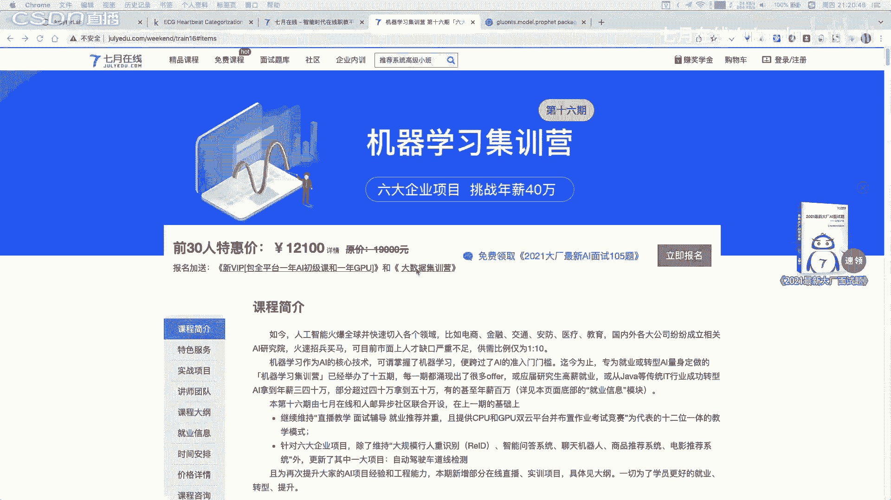

# 人工智能—机器学习公开课（七月在线出品） - P24：【公开课】时间序列分类实战：心电图疾病识别 - 七月在线-julyedu - BV1W5411n7fg

🎼。

各位同学，大家晚上好。好，我们稍等一下啊。我们这个8点钟准时开始。对，我们先请大家稍等一下。大家之前有了解过时间序列吗？以及呃有过的相关的一些了解嘛，也可以啊就是么说一下。嗯。

有很多同学之前可能是没有学过呃时间训练啊。当然这个你也不用担心，我们在客人中间呢也尽可能的会讲的比较简单的一些案例。然后给大家讲清楚这些具体的一些时间区里的一些相关的一些细节以及。他到底能够做什么？

大家之前学习过时间训练吗？嗯对，嗯，或者说有什么相关的一些嗯。学过相关的一些继忆学习的模型吗？也可以打字说一下。好，嗯，各位同学大家晚上好啊，然后我们马上开始我们今天的一个课程。

然后各位同学可以现在在我们的一个，如果顺利能看到我们的屏幕的同学再扣个一好不好？我们就马上开始我们今天晚上的一个课程。对。好。嗯，已经有几位同学啊已经扣1了，那么我们就。嗯，开始我们今天的一个课程。

其实时间序列呢其实它是一个嗯比较小众的一个嗯任务啊，时间序列。那么我们今天呢就是聚焦到我们的时间序列的一个分类上面。那么我特别是会给大家讲解一个实践的一个案例。

用心电图的一个疾病都是一起来完成一个分类的一个实战。我是嗯企业在线的刘老师。然后我们今天呢就开始我们的从现在开始我们的一个学习。嗯，大家如果没有加我们的杨老师的微信呢，就是我们的右上角的杨老师的微信呢。

可以加一下我我们的课程的讲义，以及我们的代码都会呃发给我们的杨老师。然后呢，大家可以从杨老师的这微信里面领取到。

那么我们今天呢会给大家讲什么呢？我们今天呢这个时间应该是在1小时到1。5小时。在这个时间内呢，我们向希望各位同学呢如果是。顺利听课的话呢，可以掌握一下知识。

第一个部分呢就是你会可以掌握到时间序列的一个定义以及它的一些应用。第二个呢就是时间序列的一个特征的一个提取。第三个呢就是时间序列的分类和模型和回归模型。

当然我们也会给大家讲一个医学的一个心电图的疾病识别的一个案例。我们就开始学习今天的一个课程内容。当然，如果各位同学在学的过程中有什么问题，有任何学习相关的问题。

都可以在我们的一个直播间里面进行一个啊就是说打字啊，就是说直接提问就行了。我们就开始我们今天的一个课程内容。我们首先呢来看第一部分就是时序的一个数据的一个介绍。对于我们的时间序列的数据呢。

其实它是非常非常常见的一一类型的数据。而且呢它也是我们在嗯数据挖掘的一个领域里面最为重要的一类数据。持续的一个训练呢其实是无处不在的。比如我们现在经济领域的这种嗯就是说走势，比如我们的股票走势。

黄金的价格走势，或者说房价的一个走势，对吧？然后呢我们的一个具体的一个在电商领域的一个具体的有我们的一个呃用户每天的一个浏览量。每每月的浏览量以及我们的PVUV的等等相关的对吧？

这些都是我们的一个具体的一个走势，其次呢我们在一些工业领域，我们有这个传感器的信号，传感器的信号，在我们的一个某个机器，它随着时间推移，它有一定的温度的记录，对吧？这个都是可以来进行一个记录的。

那么这个地方我们拿到这么多序列之后呢，其实。你你有没思考这个时间序列这些。数据之间它也没什么相似性呢，其实它是存在一些相似性的。或者说什么样的一个序列它可以称作时间序列。什么样的序列不能称作时间序列呢？

我们一般情况下，我们的时间序列的数据呢就是由两列所组成。一列是我们的TS，就是我们的time。M scan或者说这个具体的一个time。然后呢，一个value就是这个时时刻所对应的值。我们所写一下啊。

这时刻一，我们对应的值是1010刻二对应的值是11，10刻三，对应的值是12，以此类推。就如说我们的具体的一个数据集中，可能是有我们的一个多。行两列所构成的这种数据，对吧？那么这个地方时间序练呢？

他有一个特点，就是说一方面它是有时间的一个维度的。这个记录是有时间的。其实我们在呃学习这个数据挖掘的时候。数据挖掘对吧？我们数据挖掘datamin。或者说我们的一个具体的一个机器学习算法的时候。

我是能你。我是那你对吧？其实我们在学这些算法的时候，其实我们在学什么？我们本着在学一个具体的一个输入一个样本，然后需要得到一个具体的一个映射，需要得到这个关系，对吧？所以说呢我们在原始的一个数据集里面。

其实我们的样本是怎么进行组织的呢？我们仍然是把原始的数据据给它换一下啊。在我们的传统的这种结构化的数据集里面，我们的一个数据集呢是以这种。航。列这种二维的这种形式组织的，它是结构化的数据。结构化的数据。

那么这个结构化的数据有什么优点呢？它是一个非常规整的数据非常规整的数据就是说一行是一个样本。一列。是一个字段，或者说是一个特征。对吧这是我们的结构化数据非常典型的一个特点。但是这场结构化的数据集它。

并不是一个就是说。完上全全能够描述所有信息的这种形态。因为我们的这个地方的一个样本。每行。第一行第一个样本第二行第二个样本在我们的传统的结构化的数据群里面，其实我们是以这种样本的独立性。

或者是说我们是从某一个样本的一个。概率空间采样得到这些样本，对吧？所以说这这个呢我们原始的一个结构化的数据集呢，样本与样本之间是独立存在的。但是呢如果我们是在行与行的这个。纬度呢加入这个时间。

也就是说我们有这个。仍然是。写这种这种两列的形式。第一个时间第二个时间第三个时间第四个时间。然后我们在不同时间的情况下，我们采用得到不同的值，对吧？10111213。

那么这个地方我们能不能称这每行是一个样本呢？我们这个地方每行它是不是一个样本呢？它就不是一个样本。他就不能说单纯是一样的，因为这个地方整体是一个sequence，或者说中文里面我们就叫做一个序列。

对吧这是这些序列。那么这个是我们的一个时间序列。和传统结构化数据。和统结构化数据它的一个区别啊。对，一个是序列数据，一个是结构化的数据。大家一定要记住这个他们的区别。序列是带有这种时间戳的时间戳的。

而且它是有这种先后次序的关系的。这是第一个点。第二个点呢就是说序列呢它的这个时间都是等间隔的。一般情况下都是等间隔，就是说他时间。比如说12345。是这种等间隔的，他不一般情况下不会说是。10101万。

一般情况下不会这样，一般情况下是等间隔的。也就是说我们是按照某种某种固定的一个频率去采样我们的一个信息，对吧。好，这个呢是时间区列它的原始的数据集的特点啊，跟结构化的对比。

以及它的一个时间是一般情况是等间隔的啊，也就是一个等差处理。那么这个时间序列它到底用有什么用途呢？其实时间序列呢，它其实在我们的结构化的数据挖掘里面是用途非常多的。主要有两种用途。第一种呢。

通过分析我们的时间序列，我们可以知道我们的时间序列它内部的一个规律。比如说我们画一个时间序列啊。X轴是我们的一个时间。Y轴呢是我们的value。随着我们的时间推移，我们的一个具体的值呢。

有可能是按照某种形态进行一个。就是说取值的。好，这个地方呢我们再进行一个取值的情况下呢，我们第一个用务或者第一种用途，就是说我们能不能理解这个序列它内在的一个规律。这个区列有什么规律啊？

第一个它是有周期的。对吧这个地方很明显，这是有一个周期的。这是有一个周期的对吧？三个周期，而且呢我们的一个样本呢，在这个周期内，它是有分成一个上升的一个小周期和一个下降的周期，对吧？然后呢。

我们再可以知道我们的这一个具体的一个序列，它是整体的一个。峰值以及它的低谷的值是在什么样的一个范围内？嗯，有同学问到有没有回放？嗯，有的啊回放呢我们的代码。

PPT以及回放的都可以加一下我们的杨老师的微信啊，拿出手机扫一扫。或者说大家现在嗯拍照一下，或者截图一下就行了啊，加一下我们杨老师的微信，然后我们录屏啊、代码啊和PPT啊都是嗯给我们的杨老师的对。好。

我们继续。第一个用途就是说我们能不能挖掘出数据内内部的规律。就是说我们用一些。分析的方法去分析得到我们的这个序列它的周期。它的一个变化的趋势，变化的规律，以及它的变化的幅度和范围。对吧这是第一个用途。

第二个呢就是说我们利用这个时间序列呢，我们可以去预测未来的走势或者说监控。这个数据的走势。比如说我们很多时候呢就在做这样一件事，对吧？我们做天气预报的，我们在听天气预报的时候说什么呃。

未来一天北京市的一个温度在什么范围内，对吧？呃，或者说这个杭州它的温度，在什么范围内，那么这个地方呢，其实它就是给定了一个序列的情况下。我们去需去需要预测下一段时间的一个序列。他的取值。

也就是这是我们的训练集，这是我们的一个测试集，对吧？那么这个地方有可能我们给它的一个训练集。就是从编号为一到编号为100的100个数值。我们的测试集呢是从我们的编号101开始到105的5个点。

就是我们的训练级，就是我们的测试集，它是按照我们的一个时间进行划分的。预测就是说我们预测一下未来的一个走势。就是说我们做一个嗯就是股票价格的一个嗯预测，对吧？我们预测一下未来股票的一个价格是怎么走的。

其实呢我们做一个监控。监控呢这个其实在工业类型的一个场景下面非常非常。场景。监控呢就是说我们一个。机器它的一个性就是说温度。我把这个再擦一下啊。举个例子，我们一台机器。

假如说它的一个随着时间的运行时间的一个推移，它的一个温度。分票券。应该是就是说不断不断这种。上升的对吧？缓慢上升的。但是呢突然有一有一下呢，你的一个温度飙升的很高。假如说实际标准很高。

对吧这个其实就是有问题的，就相当于是它的温度，就相当于是一下。嗯，到了一个。您就是相当于是零界指了。那么我们作一个预计。基于预测的监控呢，就是说我们预测一下未来这个地方我们应该是这样走的。

对吧但是呢你的一个具体的一个实际的情况和我们的一个预测的情况相差太大。那么我们就可以。做一次报警对吧？说明啊我这个机器它的温度呢异常过高，对吧？

很多的一些工业类型的一个场景都是基于这种预测和监控的这种思路啊。所以说呢我们在工业的类型的一些大数据里面，其实很多都是基于时间序列的这种数据啊。好，我们继续。那么对于我们的一个时间序列呢。

我们是可以分分解成以下三项。第一项呢是我们的趋势项，第二项是我们季节项，或者是说我们的一个周期项啊，第三项是我们的残差分别是什么意思呢？嗯。

三项分别的一个就是说是从不同的一个角度去描述我们的一个序列的趋势呢，它是描述我们的长期的一个规律。就是说我们的这个序列，它在进行一个推移的过程中，它是不断的进行一个缓慢的上升的对吧？

周就是相当于是一个波动的上升的。那么这个地方我们的一个具体的一个周期。是什么呢？我们周期就相当于是它在近随着时间的推移，我们这个地方随着月份的一个推移，它是有的，这种从小变从大变小以及从小变大。

然后再由大变小这种相当于是这种。特定频率的一个规律的。那么残差是什么？残差就是我们在去掉我们的一个趋势和季节之后的一个随机的波动。你这个一忘的残差，你可以理解它就是一个噪音，是你可以理解它就是噪音。

那么这个地方我们的一个趋趋势和季节是我们的持续数据里面最最重要的两项。趋势这个地方我们的一个橙色的这条线，就是反映的是我们整体的一个趋势。对吧这个黑色的线是实际的这个序列的一个波动情况。

但是呢它整体的趋势应该是一个。上升的对吧？整体的趋势是上升的。当然这个序列里面其实也是包含了一定的周期的对吧？一定有周期的项好。那么我们就继续啊我们的一个时序，我们是可以任意任意的一个序列。

我们是可以把它进行一个分解的啊分解的。那么我们在进行一个具体的一个分解的过程中呢，其实我们还可以根据我们的一个趋势，我们的周呃这种季节和我们的残差来构建。

就是说这三者构建一些对应的一些实间序列的一个组合模型。呃，这个组合模型呢其实也是非常简单的非常简单的。我们常见的呢就是一个加法模型和一个乘法模型。

加法模型呢它比较适合用在我们的一个季节和残差与趋势无关的情况下。也就是如右图所示啊，这个地方稍微挡挡住了一点，但是整体的是这样的啊。我们可以看到这个地方我们是可以用一条直线去理合得到的。

这个地方的直线呢就是我们的一个trend。整体的趋势下。那么在这个趋势的过程中呢，我们可以看到这里面还有一些波动，对吧？就是说我们的一个。这种季节项季节项。然后在波动的过程中，有一些点它可能是。

不那么有规律，那么就是我们的一个残差，对吧？所以说这个第一个情况是我们的季节项和残渣项，和我们的趋势无关的时候，也就是说这两者的一个具体的取值和我们的趋势是没有关系的。

不管我们的一个最终的一个趋势是如何进行变化的。我们的一个季节性化参差项，整体的大小是和它无关的。那么如果是这种情况，我们就可以用加法模型去描述。也就是我们的一个最终的一个。取值是由我们的趋势项。

加上我们的一个季节项，再加上我们的残量项。如果我们的一个。嗯，这个地方呢是沉几啊。打错了。如果你发现我们的一个具体的一个趋势项。和我们的一个周期或者季节是有存在这种乘法的模型。

或者是或者说他们并不是缺势无关的时候，那么你就可以考虑这种乘法模型。乘法模型是什么意思呢？我们先把这个具体图标里面的一个趋势项给它画出来，这是我们的一个趋势。那么我们在这个趋势里面呢。

我们还发现它有这种季节性，就是这种。周期的波动对吧？周期的波动，但是你会发现这个波动呢一个越来越大越来越大，它并不是随着我们的一个就是说。跟我们的趋势无关的。那么在这种情况下呢。

他一般情况下可以用这种乘法模型，就是说两者进行相乘。这是什么意思呢？当你的边当你的一个趋势变得越来越大的情况下，你的一个周期也会它的一个变化的幅度也会越来越大，对吧？所以说这是不同的一个时间序列。

它的形态。然后我们就是可以选择它到底是用加法模型还是这种乘法模型。好，那么我们继续啊这个地方嗯需要注意的就是我们第一第一第一部分呢其实给大家介绍一下时间序列的一个介绍，以及如何把它做一个就是具体的分解。

它是由chanend以及sn以及我们的残差三者进行组成的。然后我们有加合模型成法模型。当然如果嗯有同学想深入学习这个时间序列啊，这这个地方其实也有很多的一些教程啊。嗯。

可能嗯在本科或者说硕士呢有这种时间序列的分析。就是这种time series的ana。嗯，这些一系列的书呢都是就是中文翻译叫时间序列分析啊，然后呢有很多的一些教材都可以深入去学。但是呢其实。

如果你是呃想要做一个呃时间序列的一个呃，就是说这种从业者。嗯，现在没必要去读这些教材。嗯，为什么呢？因为这些教材啊，这些教材它大部分都是偏理论的。就是现在中文呢你可以去找时间序列的分析。这在中文上面。

不管你是在任意的电商平台上面，都可以找到类似的这种教材。但是呢这种教材它一般情况下都是偏统计的。就是说。及原理级别的。统计相关的。书，但是这个书其实并不特别适合。这种计算机的同学去学。

或者说并不一定适合我们这个。数据化结后或者说这种算法的同学去学，为什么呢？因为这种时间序列分析，它的一些这种教材呢，一般情况下都会讲，我们如何去判断一下这个是序列是不是稳定的，如何去分解这个序列。

以及如何去。就是说。得到这个血液的相关性质。嗯，但是呢其实我们日常生活中呢，我们并不会过于去追究这个序列内部的一些。就是说规律我们可能是需要对他进行一个礼合。我们如果是想要对它进行礼盒呢。

就是说我们有一个模型。我们输入的数据就行了，对吧？输入我们的X，然后得到我们的Y就行了。然后呢，这个其实是我们现在的这种数据挖掘的这种思路。我们不需要去考虑这个数据，它原本的规律是什么。

我们就是用一个模型去理合它就行。嗯，其实这是两种学习路线啊。第一种你就是学这个时时间序列的非常底层的一步一步学习。第二种呢就是说以这种积极学习的思路去学习时间序列，我们就直接。

去尝试用这种机极学习的模型来做。那么如果是想要用机学习的模型来做。这种玄序的分类啊回归啊，其实就会遇到一个问题。我们原有的一个数据呢，其实是这种形式的。对吧我们的原来的序列是按照时间的一个推移。

它是1011、12、13、14。假如是这种形态。这个其实是一个样的，纤为是这个。是一个样本。那么我们都知道这个样本呢，它的一个维度并不一定是。规整的。也就是说这个样本它有5条记录。

那么下面一个时续的样本呢，它可能有1条记录。就是说我们的不同样本，它的一个长度有可能是不规整的。对吧它的长度有可能是不规整的。但是呢在这个不规式不规整的情况下。我们能不能直接把它送到你的模型进行建模呢？

其实就不一定能够直接送到你模型进行建模。因为我们的一个具体的一个机忆学习的模型呢，它输入的样本的维度是要相同的。也就是我们的一个现在的记忆模型。他输入的样本的维度是要相等的。

也就是说所有的样本要不都是10位的，要不都是20位的。但不能就是说输入的样本的维度不等，这个肯定不行，对吧？所以说我们假如说想要对一个序列做一些操，就是说想要直接把它送到继续的模型。

那么就需要对他做一些特征工程。那么我们就开始第二部分时间序列的特征工程。那么对于时间序练呢，其实我们可以对他提取很多的信息啊。很多的信息。那么。我们仍然是把原始的图给它画一下。

X轴是我们的一个具体的一个时间。Y轴是我们的一个随着时间推移的取值。我们在进行提取的时候呢，首先可以提取什么？我们可以提取出。这个时间他的一些信息。对吧这个时间。这是它的一个确定式一个时间。

这个count呢就是我们的value。其实原始的就这两页。对吧原始就这两个例。那么我们现在现在呢可以从中提取得到什么呢？我们可以从中提取到以下一些信息。比如我们可以提取得到我们的一个具体的一个年份。

我们的一个月份，我们的天以及我们的具体的一个。新期数这个新期数呢就是说在这个月我们的一个具体的一个所就是说这一天所形的是这第一周啊，还是第二周还是第几周，对吧？

这个就是说我们的一个具体的一个一些特性都可以提取到。当然我们也可以提取到，就是说当在他具体的一个是周一啊，周二啊，还是周几，对吧？这个都是可以提取不到的。所以说呢在我们的一个具体的一个建模的过程中呢。

我们基基本上都可以将我们的一个时间，特别是我们的日期啊把它提取出来。这些预常的信息。然后呢，我们还可以根据这个时间可以提取，就是说它到底是小时啊，以及它的一个分工数啊，对吧？

以及他嗯就是说是这一天开始的多少分钟啊，以及距离这一天结束，它是有多少分钟，对吧？所以说我们在进行一个统计的时候，你们其实都是可以提取的这些信息的。那么比较完整的呢，就是可以看右边这个图。

对于我们python里面的这种date time格式呢，我们可以提取非常多的一些信息。比如说它的连月日分钟秒毫秒，以及它的一个就是说这种reday，就是到底是周几以及第几第几个月第几个周，对吧？

这个都是我们在这个python的一个date time的这个模块可以提取得到的。好，这是第一个跟我们的时续特征相关的一个特征，就是说直接跟日期相关的。第二个呢就是我们可以根据我们的一个取值。

就是我们的value来做。第一类呢是做我们的一个滞后特征。滞后特征呢就是说我们在进行一个嗯做特征的时候呢。我们是可以做一个叫做neag feature。

nake featurelike fish呢其实我们可以看右边这个图啊。neagfi呢就是本质，就是说我们将历史的一个数据当做当前的一个特征。什么意思呢？我们在进行一个构建模型的时候。

假如说原始的一个数据集是我们的基于d time和count。这样的两列的数据。那么我们在进行一个具体的一个嗯编码的过程中呢，我们其实是可以这样做一个操作。我们n个一呢就是说是以上一个点的一个取值。

上一个点Y的取值作为我们的一个特征。这地方上一个点。上一个时刻值值是8。🤧对吧。那么这个地方。那比一。上一个取值是二对吧？leg2就是上上个取值，对吧？是8，以此类推。

那么这个leg feature是什么意思呢？就是说我们把不同时刻的一个。之前不同时刻的一个点，把它当做当前时刻的取值。这个其实是有点类似于这种嗯窗口的这种思路啊，所是我们的一个窗口呢。

它不断的进行一个滑动。然后呢，在滑动过程中呢，我们在就使用历史的窗口的一个去取值啊，作为我们当前的这个特征的一个就当前时刻的一个特征。这个叫做m feature，叫做一个滞后特征。

第二个呢就我们的一个滑动窗口或者说滚动窗口的这个聚合特征。这个是什么意思呢？在我们进行一个具体的一个嗯。对于时间序列进行一个提取特征的时候呢，就说我们也可以考虑。

对我们的数据集呢按照某个窗口来进行一个提取一个平均值。对吧这个平均值呢我们是可以嗯按照这样的思路来看的。我们有一个窗口，就是这个窗口呢扫去扫一下我们的一个具体的一个valueue的一个取值。然后呢。

假设我们的窗口的大小是7的情况下，我们就统计一下这个窗口下面的一个valueue，它的一个具体的平均值是多少。或者说这个这个窗口下面的一个最大值，这个相关的都少，这个都是我们可以继取到。

待会呢我们也会用代码来进行一个具体的一个操作啊，大家不用担心。我们有了这个持续的一个特征呢，我们还可以做什么呢？嗯不仅仅是可以就是说嗯直接抽取得到我们当前的一些日期的信息。我们还可以做这样一些操作。

比如说我们可以不仅仅是可以统计它的年月日啊，季度啊小时等等，对吧？这些都是非常基础的，我们还可以做什么呢？我们还可以提取一下它到底是不是节假日啊，以及于最近节假日的间隔啊，以及这个它的一个是上午啊。

早上啊还是晚上啊。以及它的一个是不是高峰时间，这些都是可以来进行一个提取的。其次呢我们还可以做一些对比，对吧？对比什么呢？这个对比就是说它跟同期的值的相差多少。也就是说我们的一个时间序列啊。

它并不是说是完全完安全全，只能是。就是说跟当前值或者说往届的值做的比。也就是说我们可以对于训练的，我们假如说是可以把它画成。多个周期的把它画成一个图里面。

这个地方呢就是说是前面一个周期的一个图和我们当前周期的一个具体取值。我们我们都可以把它画在这个图里面。画出来之后呢，我们可以做什么呢？就是说我们可以比一下这个值跟它。

就是说上一个周期的一个值的一个比较是什么？比较直接的一个思路，就是说假如说我们想比较一下，我们想就是说对我们当前，比如说现在是晚上8点半，对吧？我们想要记录一下8点半的一个取值。

那么我们可以有一个很好的思路，就是说我们对比一下昨天8点半的，就是说这个序列，昨天8点半的时间下面情况下，这个取值取值是多少？对吧或者说我们上个月8点半对吧？这个具体取值是多少？我们做一个相减。

或者是说相比，这个都是非常常见的。对，然后呢我们在进行一个具体的一个编码的过程中呢，这些都是可以就是说按照我们的一个具体的一个。就是中位数啊，也可以按照我们的风度啊这些具体的操作的。对嗯。

我们的校长也说了，我们在这个具体的一个呃，我们正好这一部分就讲完了。对，然后呢我们在完开始我们的这部分呢开始之前呢，大家也可以嗯参与我们的一个呃抽奖活动啊。

就是在我们的一个弹幕区里面打出AI就是大写的大写的AI然后呢前5名同学，然后送我们这个企业在线的一个VIP的月卡，应该是我们VIP月卡。然后VIP的月卡里面，也是包含100100多门AI小课。嗯。

大家如果想要领取我们的月卡呢，可以在我们的一个弹幕群里面进行打AI这两个啊，就是发一下。好，大家如果想领取我们的月卡的同学呢，可以领一下，这个直接是可以领的啊。好。

那么我们接下来呢我就先对我们的刚才所讲的这些内容呢，先用代码来进行实践一下，好不好？那么在对于我们的一个时间序列呢，其实在实践的过程中呢，也并不是说是特别难啊。对于我们的时间序练呢，其实你在学的时候。

你可以直接用我们的一个呃这个就是。嗯。on的一些环境的实践都是足够的。我们首先呢这个地方我们首先呢对我们的一个序列呢，我们导入一些相关的模型，比如说tic model对。

然后呢我们的然后呢嗯导入我们的是做我们的画图的对吧？好，我们来看一看今天我们的第一波抽奖是哦哪几位同学啊，第一波抽奖，我们的lever never most sF同学以及M0。嗯。

我们的96598同学啊，我截一下图啊。然后这几位同学呢可以待会儿去加一下我们的杨老师杨老师的微信啊，我看一下。对。等一下，我把这个截图找一下。然后这几位同学一定要去加我们杨老师的微信啊。对，嗯。

这试呃这是第一位同学第二位、第三位、第四位第五位。对，就是这5位同学。大家可以这5位同学呢可以加一下我们的杨老师的微信啊，然后就是领取一下我们的月卡啊，这是我们的第一波抽奖。对。

我们待会呢也会有我们的抽奖。这几位同学啊，这5位同学。好，嗯，我们杨老师的微信呢就是这个啊，大家拿出手机微信扫一下，或者说先截图。嗯嗯待会儿听完课再扫也都可以啊，也都可以。好。

那么我们就继续我们的一个代码讲解啊。嗯，我打不我怎么打不上，嗯，你应该是打的比较。嗯，怎么打不上是加不上吗？加不上，应该是你待会儿再就是说你先先加啊，待会儿我们杨老师同意就行了。对，反正加的人比较多。

好，我们继续啊，我们首先呢创建一个time的这个呃就是说一个airry，就是说从嗯这个从1到50的这个取值。然后呢，对我们time呢，我们乘以1个2。75。乘以1个275得到我们的train。

这train就是我们的取值取值。然后我们可以绘制得到我们的这样一个散点图，对吧？一个pl绘制到我们的一个散点图。然后呢，我们可以看到这个地方它就是一个非常规整的一个直线。

这个直线就是一个具体的一个我们的一个取值是从对吧？1到50。然后我们的对应的取值就是对应的取值乘以1个2。75，对吧？然后呢，我们在这个取值的过程中呢，我们也可以。构建一些其他的周期，对对吧？

比如说我们对于我们的time呢，把它对应取一个余弦。取正选，然后呢乘以个10，然后再加20，对吧？这个呢就是我们的一个具体的一个带有周期项的我们的一个序列。这个就是我们的一个这这个是我们的一个趋势。

这个是我们的一个周期，对吧？明显的一个周期。当然如果你想要产生一个就是说只有我们的一个残差的东西，产就只有。产生这个残差量的同学啊，就可以直接是生成一个随机数。比如说随机数呢。

就是从我们的零到我们的一个一。就是说从我们的一个呃固定住我们的随机种子之后呢，然后产生一个质能分布的一个随机数。这个随机数呢，它可能的范围并不是从0到1的，应该是从负2点几到正二点几之间的。

那么它总共产生了应该也是50个随机数。好，这是我们的一个三个部分啊，趋势周期和残差。然后呢，我们接下来根据我们的所称我们刚才所生成的这个趋势周期和残差，能够，然后呢可以生成一系列的模型。

比如说我们将我们的一个趋势周期和残差加起来，然后就可以得到我们的加法模型，对吧？就是在我们的PPT里面也看到了。其次呢，如果我们将我们的一个趋势周期和产差进行相乘，我们就可以得到我们的乘法模型。

对吧这个在我们的一个具体的1个PPT里面也有讲到，就是说它产生的一个过程，本质就和我们的一个具体的一个形态是完全相关的。那么有同学可能就会问到。老师，当我们就是说给定了一个序列的时候，如果我们。

就是说不知道它原有的这个嗯趋势，也不知道它原有的这个周期的情况下，我们如何对它进行一个分解呢？嗯，或者说如何对它进行识别呢？这个其实也有一些嗯对应的一些方法。

我们这个地方呢是可以从这个stattics model里面inport我们的一个season de，就是说相当于是一个持续的分解的这个啊函数。在这个实际分解的函数里面呢，我们就可以直接传入一个。

具体的一个序列。这个地方我们传入的是一个加法的，就是说我们的一个。顺子。再加上我们的C的。这加上我们的残差，这就是我们的应用加法，对吧？得到的我们的一个取值。然后呢，我们通过一个加法模型去做一个分解。

那么这个呢就是说这个其实是ttic model，它所提供的这种分解的这个函数。这个分解函数呢，其实它内部的计算呢，它会通过去拟合我们的一个具体的一个序列它的周期。

然后去将我们的原有的这个序列去分解知到它的一个趋势周期以及参照项。这个是我们的这个statistics model，它可以整解得到的。也就是说，如果你识别得到我们的一个具体的一个趋势。啊，sorry啊。

如果你识别得到我们的这个曲线，它是以这种加el模型。那么你可以用ttics model直接把它分解成我们的一个趋势周期和参差，这个是直接可以分解的啊。对，直接就可以分解的。好。

那么如果你想要知道这个具体怎么分解的呢，这个地方稍微讲深入一点啊。这个分解的过程，其实它就会去计算这个我们的一个序列，它的一个周期。对。相当于是我们在做一个分解的时候呢，其实本质就是需要计算我们的这个。

周期趋势和残差对吧？我们当我们把趋势和周期都计算出来之后，我们这个残差就很好计算。那么这个趋势趋势呢这个。你可以理解，就是说随着时间推移，它整体的一个均值是如何。是如何的对吧？

我们的一个原始的曲线往下翻。他随着时间的推移，它的均值。对吧整体的一个均值，它是实相当于是在这个范时间范围内，它整体的一个波动的一个幅度是没有什么变化。那么我们就可以用这个窗口类的一个均值去替代。

它的整体的一个趋势项。那么我们的周期呢就相当于是我们去减去了我们的趋势项之后，然后去分解它具体的一个周期的一个情况。然后这两项都有之后呢，然后就可以找到它的具体的一个残差项。好。嗯，叠加吗？

老板这个地方是一个加法模型啊，这个地方我们刚才也讲了，它是一个就是说我们传入一个加法的一个这个地方ag a数据就是我们最开始这个地方加法得到的。对吧这个地方是我们加法得到的一个嗯序列。然后呢。

我们再用这个t model这个库去做一个分解。对。然后我们接下来就是说我们对于我们的乘法的一个序列。存法模型就是说我们对我们的train和我们的一个。具体的一个。季节和我们残渣三者进行相乘等等的序列。

我们也可以用这个t提示mod进行分解。只不过这个地方呢需要手动设置一下，就是说具体用成长模型去做一个分解，对吧？分解的到的就是我们的整体的是也有我们的一个趋势。周期和参品差对吧？

那么这个也是识别的非常准确，对吧？我们的趋势周期和参差。那么如果想要提取我们的一个序列的一个。日期相关的特征呢，这个也是非常简单的也非常简单，对吧？我们如果是使用pandas呢。

我们就直接是使用这个pindas的一个date timed time将我们的一个具体的一个时间呢，把它转成d time的格式。

然后呢就可以提取这个d time的一个具体的一个ear months和 day对吧？以及de week对吧？这个直接是从padas就可以完成我们的一个计算的。其次呢如果想要提取它的时间，对吧？

our minutes这个也是很方便的。好。那么如果想提取它的一个leg特征，对吧？这个其实。就稍微有一点的难度。那个t是什么意思呢？我们刚才也给大家讲了啊。也就是说在我们的一个具体的一个序练里面呢。

他就是这样一个对应关系。上一时刻呢是作为下一时刻的值。对吧上一时刻的一个相当于是它的一个取值，是下一个时刻的一个特征。对吧相当于是这是L一，就相当于是间隔一个时刻，间隔一个时刻。

那么如果我们想要做这个就是leg多个的话，其实也是很简很简单。就是说我们直接用pennda shift shift呢这个地方我们传入的一呢就是相当于是间隔一个单位，一个时间单位。这个地方其实是这样的啊。

leg一。好，我们可以看到这个地方就在这儿。那个二对吧？这个地方。啊L3L4leg5。like6like7对吧？这是我们的这种滞后的特征，也现在是按照某种时间的一个单位间隔。

把历史的一个取值当做当前的一个样本的一个特征。这个就是我们在提取这个时间序列的时候呢，可以用这个这些相关的一些模型来提取特征的，都是非常有效的。当然呢我们也可以做一个这种滑动。

或者我们的滚动的一个窗口啊，这个窗口呢我们这个地方用paas的rolling rollinging的函数。这个rolling呢我们的window设置为7。这是什么意思呢？就是说你们统计一下。

具体的一个窗口范围内，也就是说在这个窗口范围内。它的一个平均值。这几批位数。他的一个平均值是的就计算知道。这个这是平行值。然后呢，我们这下面呢就是说我们的窗口呢会滑到这个位置。然后呢。

再计算一下这7位数的一个平均值，然后换算为这个。对吧所以说这个地方其实它的一个window的意思就是说是这个窗口的一个大小啊，我们统计一下这个窗口的大小，然后就算一个平均值。对。那么我们继续啊我们继续。

那么还有一类呢，就是我们的一个嗯这当于是一个。啊这种整体的这个expandendingexending是什么意思呢？就是说我们在进行一个具体一个计算的过程中呢，我们就是在进行计算的过程中呢。

我们整体算一下，等于是它一个叠加的或者说累计的这种窗口。这个窗口呢我们是设置的是相当于是一个二啊是一个2。然后呢我们再进行一个具体的一个嗯。这个迭代过程中是什么意思呢？我们这个一个pening。

它的一个窗口现在于是二是一个最小的窗口。8。它是只有一个取值，就是说一个取值的时候，它是小于我们的一个窗口的对吧？小于窗口2，那么他不做一个统计。那么这个地方如果窗口是满足我们的要求的时候。

做一个平均值求命。8加2对吧？等于5，然后在这个的时候。8加2加6除以3等于5。33。嗯以此类推，8加2加6加2除以4。不断取平均值，那么这个值是什么意思？就是说这个序列它累加的一个平均值。

累计的一个平均值。这个话我们在paice里面呢也可以很方便的对它进行一个计算啊。那么我们再回到PPT啊。我们第三部分呢我们就看一看对于时间序列呢，我们有哪些分类模型或哪些回归模型。呃。

有没有同学知道分类和回归的具体的区别是什么？有没有同学知道的？对。然后如果知道的话呢，也可以在我们的一个直播间里面打字啊，就是说啊就是回答一下啊。呃，分类呢就是说我们给另一个序列呢。

我们需要划分得到它具体的一个类比。呃，就是说我们给另一个序列。这是人类序列。这是第二类序列，对吧？这一类序列呢，假如说我们把它划分成了A序列。这一类序列呢我们把它划分成B序列。就是一个序列分类。

就是我们给进序列把它划分到一个具体的类别里面。那么对于这个呢，其实呃它本质上也就是一个分类任务，对吧？分类任务。那么这个分类任务呢，它并不一定是很简单的。嗯，为什么呢？因为对于这个分类任务呢，我们是。

这个地方输入的一个序是一个序列。它是一个序列，也就是说我们这个序列呢。比如说我们输入的一个X。它是一个序列的时候呢。持区目前只有趋势残渣和周期三种，就是它的组成啊，基础的同学可以把它把它拆分成这个。然。

就是从趋势财务转化周期。这三三种组成。对。一般情况下是这样做一个分解的。它的组成是这样的。然后呢。你根据这个就是说。它的一个具体趋势，具体的一个残差，以及它的一个周期不同。

它的一个时间序列呢是千变万化的。并不是所有的序列，它的一个趋势是不变的嘛，也并不是所有的趋势，就是说序列它的周期也是不变的。不是的，现实生活中呢，很多情况下我们的一个。周期趋势和采查都会不断的推移。

不断的改变。我举一个非常简单的一个例子啊，就是说我们的现在呢一年我们的一个一年四季的温度。其实假如说我们的Y轴是我们的温度。我们的温度其实随着时间推移，对吧？我们的一个春天是比较低的，然后夏天。

对吧然后我们的一个秋天，然后我们的冬天对吧？这是一年，对吧？然后呢。我们如此反复如此反复，但是呢随着我们现在不是有温室效应吗？让我们的一年的温度比一年高。吧一年比一年高。然后呢。

我们还有一一些具体的一些时间呢，他可能就是说。不是说一年比一年高，有可能在在某一年遇到了，比如说夏天它的温度没有往年高。对吧然后呢又比之前高。这种是可能的这是什么是可行的。

就是说我们的一个具体的一个时习训练呢，它的一个变化的过程并不是说。只有。这种。就是说它的一个趋势上并不是说是一定是不不断就是相当于是上升的，它有可能是在中间有一些其他的一些波动啊，这个都是有可能。好。

嗯，这个就是额外的啊。然后呢，对于一个时间序列，它其实是一想要对它进行分类呢，其实是一件非常困难的事情。为什么呢？对于我们的样本，假如说对于一个样本，它有假如说是。50个。值50个值。

就相当于是50个点。那么相当于是从T1到T50。对吧T1到T50，然后呢，这50个值我们假如说一个样本。你样本是50个折。那么我们对于这种情况呢，我们另一个样本。也是有50个值，对吧？

我们现现在呢需要对它进行一个分类。假如说这个是我们的一个具体的一个。区离A类别就是区类B。那么我们如何对它进行划分呢？其实是需要一定的一些方法的。

第一种的方法就是说我们可以做一个基于序列的一个距离来做一个计算。就是说。我们有了一堆去了A。有了一堆蓄的币。我们接下来有了一个新的序列。我们需要对他进行判别，它到底是序列A啊，还是序列B？怎么做呢？

你算一算这个序列跟我们的一个A和B之间它的一个。就是说到底相似度是怎么样的，这个这个就是做一个序的距离。序的距离。这序的距离呢，我们一般情况下可以从欧式距离和DCW做。嗯，股票预测准确怎么样？

股票股票应该是不能预测的。股票是不能预测。对，我们在做一个时间序列的一个就是预测的时候呢，我们一般情况下会对它的一个稳定性，以及是不是有周期性做一个分析。现在的一个嗯股票呢可能并不是说是直接做预测。

很们可能是。嗯，你可以去看一下量化的，他可能就是做一些买入买出的一个实际的判断。他可能并不是说直接预测一下股票的一个未来的趋势啊，并不是这么简单。好，我们继续啊。然后呢。

第一种方法就是说我们是基于序列的，就是说给另一个序列，我们去算一下它跟A序列的一个距离，以及B序列的一个距离。然后呢去看一看。如果是它跟A的距离比较短的话，比如说跟A比较相近的话，我们就选择。

把它复值为A，对吧？这是第一种方法。第二种方法呢就是说我们对于时间序列的一个轨迹呢，把它进行一个统计一下特征。彩票是不是也不能预算彩票的话应该也不不能啊。彩票彩票也不能，对吧？我们现在是。呃。

法制社会对吧？法制社会，然后我们是相信科学的对吧？这个应该都是一个随机产生的啊随机产生的。还是一个有放回的一个随机的啊，有放回的一个随机的组合，所以说也是不能的。可以预测吧。嗯，这个我暂时暂时。呃。

觉得彩票不能预到。如果你觉得能预测的话，你可以多买一下彩票啊啊然后试验一下你的模型，看看你能不能中奖。应该是不能预测的啊。现在很多像市面上的一些预测模型，彩票预测模型都是基于什么尾数规律啊。

其实它都是不可靠的啊，都是不可靠的。对。嗯，方法二就是说基于这种呃就是说我们的一个嗯持续的一个特征。就是说对于一个时间序列啊。我们是可以提取它的一些特征的。比如说这个序列它的一个波动。

我们可以用方差进行衡量。它的一个整体的一个趋势，我们可以用均值衡量，对吧？它的一个相当于是嗯相邻点的一个波动情况。我们可以用它的一个相邻点的一个DF值来做一个衡量，对吧？

这个系相当于是我们用一些统计值去提取一些原始的一个序列的特征，然后再构建一个分类模型，这个也是可以的，这个也是可以的，就相当于是这种是机学习的方法，提取特征，然后分类模型。如果是深度选习的方法呢。

就是说我们直接是将序列把它输入到深度学习的模型里面。这个地方呢我们用卷积升经网络ED的卷积来进行体取特征，然后用全连接的网络做我们的一个分类的模型，对吧？这个是我们的一个基于这种持续分类的啊。

那么我们现在呢可能是方宝三，它的精度是最好的啊。方宝三精度是最好的。好。第二个呢是我们的回归模型。回归模型呢这个不是我们今天所讲的重点啊，我们就就是把这个稍微说讲简单一点。有四种方法。

我个人评认的比较多的啊。第一种是滑动平均。滑动平均呢就是我们利用历史的值去构建一个先相当于是一个新先进回归来得到我们的未来的值，或者说用我们的二维码，或者说我们的profit。

或者说用我们的深度学习端落端的模型来做一个回归。这个地方呢一个回归呢，其实呃深度学习的一个这种实际回归要我就持续预测它就比较比较复杂。为什么复杂呢？我们再进行一个。具体的一个预测的过程中啊。

我们在进行一个预测的过程中呢，为什么为什么说回归？他比较复杂呢。我们这个地方我们不仅仅是需要预测未来一个点，我们有可能是需要预测未来的多个点。对吧就相当于是我们假如说需要预测未来的4个点。四个点。

那么假如说我们在进行一个具体的一个预测的过程中呢。我们如果是想用深度学行，我们怎么做呢？对，这个地方就是说我们可能是需要基于这种sequence去于sequence的这种机制。经有同学说到了啊。

长短STM和profit比较近。对，现在profit现在是应该是用到的比较多的。现在profi应该是用的比较多的，它是facebook所提出的一个持续回归的一个模型。如果是纯深度学习呢。

就是sequence tos，就是说我们给进一个序列。然后预测下一个序列。今在是我们给定100个做我们的训练集，然后mter下20个，这就是一种sd to sequence的这种格式。

那我们可以给大家进行一个演示啊，我也给大家准备了一个代码。我们这个地方呢是用这个。gg TS这个功呢其实它是基于MXnetMXnet的一个。高层的一个持续的一个。呃，就是说嗯就这个回归模型啊。

我们从那个公用TS里面呢，inport我们D部AR。dAR呢是基于深度学习的一个RN的一个回归的这种预测模型啊。我们这个地方呢就是利用我们这个给定的一个序列。

然后呢用它的最后的60个点做我们测试集来做一个回归预测啊。那么这个地方如果用DPAR，我们这个地方直接设置一下，我们需要训练10个。然后我们可以看一下。这个前面的点前面的这个序列是我们的一个训练级的。

然后后面的这个是我们的一个预测得到的啊，这个预测得到的为什么是有个范围呢？大家可以看一下，这个地方是有一个实心的，这个实心的线是它真实的一个标签。真实的标签，这个这个绿色的一个范围。

就是它是一个置信度啊，置撑区间。进行区间啊就相当于是它的一个有一个预测的一个，等于是上界和下界。然后我们可以看到这个模型整体的一个预算的一个结果啊。

整体的预测结果和我们的实际值的一个范围其实是比较一致的。然后呢，如果你就是用profi也可以得到类似的结果啊，profit也可以得到类似的结果。但是呢我现在用我个人用国用TS这个库会多一些。

因为国用TS这个库呢，其实现在它是包含了很多的一些模型的啊。我可以给大家搜一下这个库啊。这个库其实现在应该是用到的比较，就是说就是说应该是用的比较多的一个库。而且呢它里面包含的模型应该是比较多的啊。

我们看一下。在这个介绍页面应该是有的。他是支持装飞机。对。这个裤子是可以直接就是相当于是套娃的这种形式啊，还可以直接支持这个pro。然后这里面还是支持其他模型的。比如说我们的一个。

Second two seconds。或者基于这种春酸嘛的。对，这公用TS这里面都有。然后呢，现在对于我们的这个从业者而言，其实。我们并不是说完完全全去自己实现的模型，可能还是用这些库会比较多一些。

所以说这个地方就需要大家就是对这些库啊。可能是有一定了解啊有一定了解。当然如果你是啊就是初击者啊，你可以先了解一下这边有哪些库啊，然后再去啊做一个就是实际的学习啊。🤧嗯，好。我们继续。好。

然后我们再做第二波抽奖好不好？然后呢，我们这个今天所讲的一些内容呢都是非常非常基础的啊。然后呢，我们第二波抽第二波抽奖呢也是抽我们的一个契约在线的1个AI的一个会员啊，我们其约在线的1个AI的会员。

然后呢大家可以在我们的一个。就是直播间呢打入我们的1个AI。对，然后呢我们的首先打入AI的这5位同学呢可以送我们的月卡啊，我们的月卡我们的月卡是在7约在线上面可以免费。

就是说学习100多门的AI小课的这个就是说这个会员啊。对。扫不到二维码啊，这个地方应该是可以扫到吧，你可以截图截图一下啊，截图一下。截图一下，待会扫可以也可以啊。好，我们来看一看是哪几位同学啊。

我截一下图。好，嗯，我们看一看是哪几位同学啊，我们第二波的。我们第二波呢是这几位同学。呃，我们的思言同学penccer820同学AGH同学M0同学以及我们的1个QQ353599056同学，这几位同学啊。

好。二维二维码上半身被挡住的。哦，这样。等一下啊。

嗯。这样可以吗？这样可以扫到吗？这样大家可以先截一下图，这样应该是没有挡住啊。这是没挡住吧。对，然后大家如果是没有加加我们杨老师的微信啊，可以加一下。因为我们的这个讲义啊，以及我们的代码。

以及大家刚才所获奖的一些同学啊，你的领取的这个呃奖品的方式啊，都是从我们杨老师这儿获取的啊。对，大个现在可以截一下图啊，然后或者说直接加一下我们杨老师的微信。那么我们继续啊我们继续。

所以现在应该都加上了啊。好。嗯。然后呢，我们继续啊，我们再看第三部分，我们第三部分呢我们就是做一个心电图的一个级别的一个识别的挑战，也是一个分类的问题啊，也是一个持续的一个分类的问题。

我们的一个问题背景就是说嗯心电图呢其实它的一个问题就是说它本身就是我们日常的一个心脏脉搏，相当于它的一个起跳的一个呃诊断的一个指标。但是呢心电图其实我们在具体的一个去医院体检的时候呢，其实我们是。

需要我们的一个虽然是一个医生去对我们的一个具体的一个。啊，就相当于是这个心电图去做一个识别，做一个精行测，做一个分类。但是呢我们现在呢。

我们能不能去人工去确定去构建一个模型来帮助我们的帮助我们这个心电图做一个分类呢。其实是可以做这样一个尝试的。也就是说我们是输入我们的一个心电图的数据，然后呢去构建一个经济学习模型。

然后去做我们的一个分类的模这种尝试。这个尝试呢就是说我们去识别一下这个心电图的到底是不是正常的，或者说是不是异常的。对，我们就是做这样一个挑战啊，做这样一个挑战。好，那么我们做这样一挑战我们怎么做呢？

我们其实本质就是需要输入我们的这心电图的数据，然后构建一个分类模型。对吧好，我们来看一看啊。那么我们怎么做呢？其实这个地方。我们首先呢来看一看，这样读取一下我们的数据啊。读一下我们的数据。

我们数据型呢其实本质我们就是用依然依然是用n派和我们的一个padas可以读取啊。我们可以对我们的数据集呢把读取进来，其实本质上涨的就是这样的啊。这个地方我们的每一行是我们的一个序列。每一行是我们的序列。

然后呢，每一列呢相当于是是一个10克的啊，每一列是一个10克的。这个地方呢我们的。序列呢它的长度有可能是不相同的，但是呢它是把它做了一个填充的。所有的序列呢应该都是有188个值。

因为是它的一个时间呢有188个。那我们对我们的序列把它读取完成之后呢，我们接下来要做什么呢？我们接下来要做的对于我们的序列呢，就是计算一下它的就是说我们的样本是不是有趋势值。

我们样本呢我们怎么计算它是不是有缺失值呢？我们就是用喷nda的啊后这个EZNA来判断一下每列是不是有缺失值。也就是说每每个时刻是不是有缺失值的情况，对吧？那么我们可以看一下这么一个时刻。

它都是没有确失值的对吧？趋失值的一个比例都是零的。好。我们接下来可以做一个什么呢？我们可以做一下我们的一个标签。嗯，标签呢其实本质就是我们的1个187列，它是我们的一个。对应的一个。

这种序列的一个类别的标签。那么我们可以看一下。我的大部分的一个是这个序列呢都是说类别为零的。对吧除此除此之外呢，还有一些类别是1234的对吧？当然类别是零的，这个呃样本呢是最多的是最多的。好，我们继续。

那么我们接下来呢可以做一个采样，为什么呢？因为我们的一个嗯就是说类别为零的一个具体的一个就是说样本是过于多的。那么我们可以做一个采样，就相当于是把我们的一个类别为零的样本把它做一个下采样。

对吧下载样之后呢，然后再去对我们的一个这个数数据器来再继续做一个分类。好，因为做了一个下采样之后呢，我们的一个就是相当于是我们把这这一个原始类别云的样本来采样。一些出来。然后呢，我们的嗯采用之后呢。

我们的数据以整体的就是比较规整的啊，整体的就是比较规整的。嗯。那么我们接下来呢可以绘制一些具体的一些我们的形态啊。嗯，那这个形态这个矩形形态是我们的类边零的。

这个是我们的类比一的这是类比二的这是类比3的这是类比4的对吧？其实这个呃对于我们的这个受过专业培养的，或者就是说对心电图比较了解的同学呢，其实是能够得到就是能够区分的？比如说类别0和类比一有什么区别呢？

类比0和类比一整体差不多。只不过类比0它的一个曲线会比较光滑一些。对吧。整体的形态两个角度差不多，但是那边印呢它不是那么光滑。那么从这个具体的一个形态而言呢，类别一和类比2吧在形态上面是存在区别的。

对吧类别二和类别3对吧？在形态上也是存在区别。然后我们更不用说类别3和类别4。所以说呢我们在做一个具体的一个建模的时候呢，我们是可以考虑从形态上做。当然也可以考虑从什么？

从这个具体的一个时序在不同时刻这个取值。对吧嗯，类个零它的一个取值应该是大部分在0到0。5之间。对吧那么类别3的一个取值呢，大部分是从0到0。25之间。他的取值范围有可能不一样。

对吧这个呢其实我们对于我们的一个这个取值范围，对我们的一个具体的一个分类的一个过程也是有帮助的。对吧当然你也可以参考我们刚才所说的这种思路啊，手动去去提取这些特征。比如说它整体的一个趋势的一个变化。

以及整体的是不是光滑的这种，就是说这个形态啊，我们都是可以把它考虑这提取这个特征的。当然这个地方我们是直接用深度学习的方法来做的。也就是说我们不提取特征，我们直接把这些序列呢送到我们的深度学习模型里面。

让我们的深度学习模型来做一个建模。好，为了验证我们的模型呢，我们将我们的一个数据集呢把它划分为我们的训练集和我们的一个验证级。对吧这个就是说10%的一个数据集，把它当做我们的验证集。

然后90%的呢当做我们的训练集。好，然后接下来呢就是构建我们的模型。这个地方呢我们的模型呢，我们是用这个ED卷积做我们的一个特征提取器。ED卷积做成特征提取器。它呢在做一个具体的一个操作的过程中。

其实是做一个卷积核。如果大家之前没有学习过这个卷积啊，我们这个地方给大家解释一下。我们这个卷积呢相当于是有一个卷积盒。雪地阀呢在我们这个地方呢一个cur size是3。也就是说我们有一个窗口3。

然后呢去统计一下在这个窗口下面的一个具体的一个值。然后呢这个卷积好它会滑动，每次滑动我们相当于是往它是一个滑动的过程。这个滑动呢相当于是我们的一个统计这个窗口下面具体的一个值。那么我们不断的滑动。

我们就可以提取对它不同特征。这个卷积盒你可以理解，就是一个特征的提取器。特征提取器。特别一个extract，对吧？或者说我们是那种基于上升的这模型作为一个特征。那么这个特征呢，其实。

我们并没有去人为去规定他提取什么特征。对吧也就是说没有提没有任何规律。因为这个卷积核是可以可学习的。因为这个卷积头其实它里面有一些参数，它是可学习的。然后呢，对于深度学习模型。

它可以不断的去套这个卷积核，什么意思呢？我们原始的一个我们这个地方呢，我们可以给大家把这个model给它打印出来啊。我把它打印出来，大家就可能会更加直观一些。稍等一下啊，把这个代码运行一下。

这个是对深度性象而言，这就就是每一层对吧？每一层。那么对于这每一层而言呢，其实我们是可以对它进行。就相当于是把它做一个叠加的。好，我们搬到下面。6DF啊这个地方要拼接。好。嗯，我们一步一步就行啊。好。

模型定义好了。模型定义好之后呢，我们可以把它打，就是看它的一个具体网络结构啊，sumary。他没人能我们来看一看。我错了。这个地方来看一下我们的一个具体的一个输入的一个操作。我们输入的一个特征。

输入的原始的一个维度是浪乘以一个。1啊187186的一个维度吧。然后呢，我们在进行一个卷积的时候，它的个维度会不断进行变化。这个地方呢是通道数3264、128，对吧？然后就相当于是主每层提取特征。

然后这一层是对前一层的一个特征做一个继续的一个提取。然后做一个铺ing，然后再加上flatten，然后再加上全新阶层。对吧相于是这前面的是特征提取。后面几层是做分类。后面几层就做一个分类。对。

这个就是我们构建了1个ED卷级的这种分类模型。嗯，有同学问到可以用wideden deep的模型来做吗？加上前面所提到的特征工程。呃，这个是可以的。就是相当于是你是想把结构化的一个特征，也是嗯把的。

你可以把它直接拼接到全连阶层。你可以直接把结构化的特征把它拼接到全链阶层，也是类似于挖地的这种操作，其实是可以的。但是呢按照我的一个经验啊，就是说。这种结嗯结构化的特征呢。

它并不一定就是精度会比这种呃就是纯CN的这种精度会高一些。一般情况下结构化的一个特征呢，可能是需要你提取的一个特征比较好的情况下，才可能有可能啊会比这种就是说CN的这个精度会高。你当然也可以做一个尝试。

就是直接把结构化的特征把它偏接到这儿。这个也是可行的啊是可行的。当我们模型把它边嗯构造好之后呢，然后接下来就是边用模型，我们就是用分类。的一个存成函数对吧？我们是一个多分类的存成函数。

然后呢去用我们的一个对我们的模型进行编译。然后对我们的训练集做一个废itch进行一个训练。训练呢我们就是传入我们的数据集以及它对应的标签。训练10倍poke，我们最终在训练集上的一个精度是98%，对吧？

这个精度是非常非常好的。然后呢，我们可以看一下我们的模型，在测试集上面的明新度。

我们的测略之间的一个嗯这终的混淆矩阵呢，就这种形态。这种形态啊，混淆矩证是这种形态，基本上是能够预测对的，就预测对的对吧？嗯，这个精度也是非常高的。呃，测试这量的精度呢也是96%，也是非常非常高的啊。

非常非常高的。

好，这个呢就是我们对就是基于我们的1个CN的1个ADCN的这种。方法来构建一个分类模型啊，对是我们实间区别的分类模型。比较核心的点就是我们的一个模型的构建。模先拟给大家建啊。

就是这一部分是我们比较核心的一个点。好，这部分大家有问题吗？对，好，那么我们接下来呢就嗯给大家详细介绍一下我们的一个机忆学习集训营啊。我们先做第三波抽奖好不好？然后呢，我们现在呢大家可以在我们的一个。

嗯，就是。做我们的第三波抽奖。我们各位同学呢也可以在我们的一个直播间里面就是说输入AI。然后呢，前5名的同学送我们的70在线的月卡。这个月卡呢就可以免费学100多门小课啊，就是说不用再额外购买。对。

大家如果想要领取我们的月卡的同学呢，可以现在就是说参与我们的抽奖啊，前五位的啊前五位同学。啊，这五位同学分别是我们的冯。

冯KK同学QQ3599056同学日合坊同学AITANIS同学以及happy water同学啊，这几位同学。然后AK同学也可以去领啊，AK同学答。呃，有同学问到数据集的一个序列长度不同怎么办？嗯。

我给你这样给你解释啊。嗯，画个图。序数据集的序列长度不同，其实是很简单的一种解决方法。没有。有很很多解决方法啊。假设啊我们数数据机的一个长度。你的样本是10个。有的样本是20个，有的样本是30个。

25啊，不同长度长度不同。有有的就是说有的序的长度是这么长的。对吧这是不同长度的。那么我们都知道，对于机学习模型或者对于深度学习模型。它的一个长度竖的纬度是要固定的对吧？一有两种方法。

第一种方我们是把它都把它。填充的相同的长度。这个地方我们把它后面可以填名。对吧我们把它所有的一个维度都把它转成1个30维。这个是可以的吧，这个操作呢我们把它叫做一个填充。啊，这叫做一个配置。

把它交给云配的。第二种方法我们可以做这样一个操作。我们对于我们的数字数据呢，我们把它做一个截取。所有的样本能把它截取成10。这个操作是什么意思呢？对于这个样子。它就是只有1个10个长度的一个序列素组成。

那么对于这个样本呢就不一样。对于这个样本，它的一个就是说它是可以不断滑动的，原始长度为20的。它可以不断滑动为多少个10个序列，你可以下去可以推算一下，应该是10个或者是9或1，应该也是10个序列。

对吧我们相当于是我们的可以可以把它拆分成。现在是原始是在这儿，然后不断是在这儿，然后在这儿也是相当于是划窗这种思路。你可以把它拆分成短的序列，然后再去做建模，这个也是可以的，就是两种方法，一种是填充。

一种是做一个截段。我们继续啊。然后当你刚才已经领取到，就是说成功领取了我们的。说这个中奖的同学啊，一定要加一下我们杨老师的微信啊。然后呢，我们接下来的时间呢，我们就给大家介绍一下。

我们现在在区在线正在开设的积极学习集训营的这个课程。这个课程呢也是非常干货的。这个课程呢，它的一个名字叫机器学习集训云，也是现在7月在线和CSCSDN一起举办着我们的这个集训营的课程。在这个课程里面呢。

我们会讲解啊这个机器学习和深度学习的非常重要的知识点。然后呢，我们也会不管是从机器学习的原理。然后再到我们的深度学习的原理，我们都会给大家讲到。其次呢我们也会提供这个GPU的一个实践的云平台。

以及有一些具体的一些实训的项目。这些呢都是大家自己去学习的时候呢，会比如说你可能是没有GPU的平台，没有GPU的实践的。那么我们会提供给大家。然后呢这个实训的数据集呢以及解决方案呢。

我们也会一步一步的就是说教给大家。比如我们在积极学习的原理阶段，我们会从逻辑回归先进回归讲起，然后讲到这个积器学习的一些介绍，角色素的介绍，以及角色素的原理以及具体的实践。

这些呢都是哦就是说非常非常干货的啊，也是非常非常适合我们的入门的同学，以及想要。继续深入学习继忆学习的同学，非常适合大家。那么我们今天晚上呢，我们的这个机器云呢，其实也是有我们的一个报名的优惠的啊。

我们的机器云呢今天晚上如果是在我们的零点之前，通过我们的杨老师的这个渠道进行报名呢，在我们的官官网的一个价格。继续优优惠1600以上，然后再额外给大家优惠1000。也就是说我们的官网的这个价格。

其实就是我们的一个。

12100。我们今天晚上呢大家如果想要购买我们的这个课程呢，只要9500，然后是优惠了2000多啊，优惠了2600是非常非常优惠的。其次呢如果购买了我们的机器学习机器营啊。

它可以给大家送价值4999元的一个大数据机器营，以及我们的一个深度学习机器营，以及送大家100多个1个AI的小课，也就是说我们的这个企在线上面的很多的一些小的一些这种课程啊，都是免费送给大家的。对。

所以说我们如果大家现在想要报名我们的机器学习机器营啊，都是可以优惠的啊，原价就是说12000的，今天晚上是优惠了2600块钱啊，只要9500块钱。当然如果大家就是说对我们的机器学习机器营。

这个相关的一些报名啊，或者是说是签约啊，有什么一些问题的，都可以去咨询一下我们的。

老师就是加一下我们杨老师的微信。对，其实呢我们今天的一个具体的一个。嗯，代码和课程啊以及PPT啊，都是从我们杨老师的微信领取的啊，领取的。大家一定要加一下我们杨老师的微信。🤧好。嗯。

大家对我们今天的一个课程有什么问题吗？对我再给大家介绍一下我们的今天那期训营的这个课程啊。这个课程呢其实是安排的非常非常。

就是说接地气的不仅仅是有这种基础的一些原理的讲解，也会讲解到比较深入的。比如说结构化的数据值的一些案例，或者说CV的一些案例，以及AIP的一些案例。在我们的集器云里面都会讲解到的。然后呢，我们的集器云。

都是由我们的专门的这个嗯QQ群或者说我们的微信群来进行一个答疑的啊。所以说大家也不用去担心找不到我们的老师，我们都是24小时给大家进行答疑的。然后呢，我们的这个机器营呢，其实包含了很多的实训项目。

也是让我们的一些老师呢带着大家一步一步去完成。所以说大家也不用担心，就是说如果你不会啊，就是说你就是说学起来会比较吃力，这个也不用担心。对，然后大家如果想要今天晚上报名。

我们机器营呢是直接有很多优惠的啊，有很多优惠的。如果是今天晚上过了过了零点呢，我们的优惠力度就没有这么大的。

对。嗯，对，大家对我们今天所讲解的内容，以及我们的集器云的这个细节有什么疑问吗？如果有疑问的话呢，可以啊现在进行提问啊，现在可以可以进行提问。

对，如果大家想要领取我们今天所送出的V这个。月卡福利以及领取我们的PPT啊等。那么大家可以加一下我们的一个杨老师的微信。请问有金融方面的项目吗？嗯，我记得在我们这个地方，现在现在也有金融相关的一些。

金融的课程啊，也有的。

金融AI高技时训营也是有的。对，嗯，就是如果大家报名我们的一个机器机器机器云是可以送AI相关的一些以及金融相关的一些课程的，都是可以送给大家的。

嗯。对，大家还有什么问题吗？对。是可以送给大家这个金融相关的一些课程的。如果有问题可以嗯及时提问啊，再给大家创新大家一一两分钟。

大家我再稍等大家一两分钟，大家如果有问题的话呢，可以嗯继续提问啊。如果没有问题的话呢，大家可以扣个一好不好？然后我们就啊对大家如果想要报名我们的一个集训营的同学。

或者是了解我们的相关的一些课程细节的同学，大家都可以加一下我们杨老师的微信啊。好。那么我们就来最后一波抽奖吧，好不好？大家刚才也有还有很多同学没有抽到我们的这个VIP的月卡，对吧？

大家现在呢也可以在我们的弹幕区呢再抽最后一次，然后发送AI就可以领取我们7月在线的月卡。这个月卡呢就可以在我们的这个具体的一个嗯官网可以领取100多个我们的AI小课。对。

呃如果刚才还没有领取到我们的月卡的同学呢，可以现在在抽奖啊，我们送10个啊送10个月卡。对。去。好，嗯，我们的这个happy water以及石栋冉印同学啊，你可以去找加一下我们的杨老师微信啊。

领取我们的月考。好。呃，范文宇同学也可以嗯，欢迎加一下我们杨老师的微信啊，然后领取一下。好。大家如果想领取我们月卡的同学呢，都可以去加一下我们杨老师的微信啊。大家还有问题吗？

还有问题的同学可以及时提问啊。好，呃，那么我们今天的一个直播就到此结束。然后我是刘老师，然后如果大家想了解我们的课程体系，想要了解我们的机器及训营，都可以加一下我们杨老师的微信。

以及我们今天的PPT代码以及相关的一些讲励，都是通过我们杨老师的微信发给大家。然后欢迎大家就是说跟我们的杨老师保持很好的微信联系。好吧，然后呢我们今天的一个课程呢就到此结束，谢谢大家。😊。

