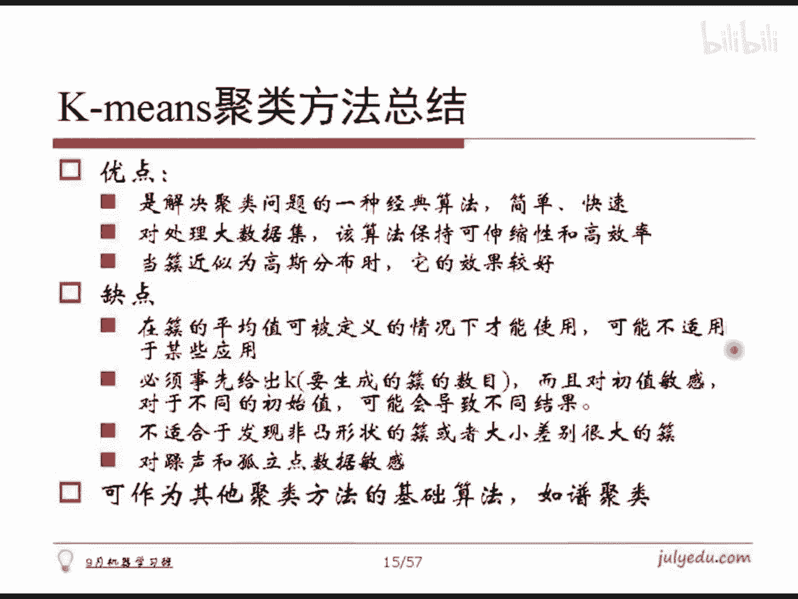

# 人工智能—机器学习公开课（七月在线出品） - P3：K-means聚类 - 七月在线-julyedu - BV1W5411n7fg

。首先我们说这个剧类这个东西本身哈。很简单，它就是对大量没有标注的这些数据集，按照内在的相似性，将数据集划分成说若干个类别，使得类别以内的数据相似度比较大，而类别之间的相似度呢又比较小。

因此这里面有两个问题哈，第一个就是未标注的数据，它是一个无监督的。第二呢就是我们需要根据相似性来去将它分成若干个类别。请问如何定义相似性呢？第二，如何选择几个类别呢？对吧？这就是聚类需要涉及的两个问题。

如何定义相似性和如何选择类别数目。所以第一个话题我们需要说一下如何计算相似度。我们先先说明一个问题啊，就是说呃两个样本之间，他们我们给出这么一个说法，就是说两个样本之间不管是给定的是物理上的那个点。

还是给定的一个样本，我们总是认为两个样本之间是可以求距离的。在剧类这个PPT这这今天咱的课程里面哈，凡是谈到距离就约等于不相似度。不相似相似度就大概就约等于呃距离的。近的程度就是这么个意思哈。

就是越相似，他们就越近。然后越不相似，距离就越远。所以相似度和距离这两个词哈几乎就是一个问题两个方面，对吧？所以说我们先说明这个记号哈，这个词语是什么意思，然后呢，我们再来看后面这些关于要么是距离。

要么是相似度，本质都是做一样的东西，就是度量，两个要素之间如何去算他们的相似度或者距离，对吧？🤧。其实最最简单的一种相似度的匹配方案就是欧式空间的欧式距离，对吧？

因为我们生活的三维空间就是符合欧式空间的对吧？就是XIX和Y求距离怎么求啊？就是XI和YI各自坐标，它们的平方，然后加起来再。开平方开平平根或者是这个P等于2，就是我们经典的欧式距离，对吧？

很显然我们可以把这个P，把这个二变成P某一个值，这样的话我们就会把这样的欧式空间的距离，把它改个名字，叫做有时候就把它叫马氏距离，或者叫呃米科夫斯级距离，都一个东西哈，有有人把它叫马氏距离。

就这个东西哈，然后只不过P取别的值，这里边其实可以有种特殊情况，就是如果P取一的时候，显然就是若干个值加起来，对吧？P取一的时候，我们有时候把它叫做曼哈顿距离，就是或者叫街区距离。

就是假定这个城市是它的道路是这个东西南北特别垂直的两点就这种这种公路哈，比方说像北京市这种比较。平直的南北向东西向这种不像上海是那种渔网状的哈。

就是假定是呃就是北方若干城市那种四四四方方一座城那种感觉哈。然后两点之间求它的街区的距离，按照这个街道走，只能横着走竖着走，对吧？所以沿着X坐标走完，完了为什么就走完。

这样的话其实是P等于一的时候的情况，那还等距离哈。另外如果把这个P取无穷大的时候。就相当于啥类？大家会发现哈P如果取无穷大的时候，这个XI和YI的值谁的差值最大，那么谁占的因素就最强，对吧？

因素无穷大嘛，这块P很大，它的底下这个底数越大，它的反馈就更高嘛，所以说相当于我就只去求某一。某一个坐标下坐标细坐标下，它们两个差之最远的那个就定义为它们之间的距离，对吧？

所以这些东西都可以归纳到这样一个公式里面去哈，对吧？这是第一种计算相似度或者计算距离它的公式。另外一种，如果说给定这个X和Y不是这样两个坐标点，给定的是集合呢。最简单的一种方案。

我们把它叫做这种呃ja卡的这么一个距离，或者叫相似度哈，它就直接去把A和B这两个。这个集合求一下交，再求一下并，然后交的交集的这个数目，交集里面这个元素的数目除以并级的数目。没错。

推荐系统用的非常多的就这一类的东西，因为它会出现若干个。这个用户若干个商品嘛，推荐系统用的最非常多的，用这用这个公式哈。当然有可能会对这个公式做一点点的这个变形，对吧？那是那是咱实践里面的说法。

就是咱基本公式。都这么用，对吧？呃，第三个就是会发现什么呢？就是咱可以根据X和Y。然后呢，如果给定两个底坐标点的话，我总可以去求这两个坐标点之间，它们的余弦值，对吧？因为它们的点乘除以它们的各自的长度。

就是那个他们夹角的余弦嘛。那这样的话，以夹角移弦值是这个东西。OK我这样一个东西也可以用来度量A和B之间的夹角，它们之间的距离，对吧？另外就是我们如果把这里边的这个A和B看作是两个随机变量X和Y。

我们就可以去求X和Y的斜方差以及各自的这个方差，这样子我们就能求出所谓的相关系数来，或者把它叫皮尔逊相关系数，就是我们所说的那个相关系数哈，对吧？相关系数公式还记得吗？就把它写开了哈。

是它其实是长这样子的啊，它其实再写开就这样子对吧？就是在样本样本上哈，对吧？就这样一个公式，这就是所谓的这个皮尔逊相关系数哈，也是一个度量啊，对吧？呃，另外咱在。最大商模型里面探讨过。

如果给定两个随机这个。那个随机分布。一概率分布，一个P1个Q，他们这两概率分布怎么样去求它们之间的距离呢？可以用KL距离或者叫相对商，对吧？用这样一个公式去求它相对商。

其实本质上就是求的P对Q在log求完对数之后，对它在P这么一个。直下求他期望嘛，对吧？这个也是一个度量。另外呢我们知道KR距离不是一个对称的，就是P对Q和Q对P一般是不相等的。如果让他们俩相等。

他们俩就得是这个P和Q本身相等，然后距离都是0，它们俩相等。此外，他们距离一般是不相等的对吧？然后得到这个东西哈，另外呢就是我们可以做它给出一个所谓的对称的一个距离，就是P和Q的对称距离。

我们可以给这样一个对称的化的一个公式。对吧就叫这么一个距离哈，然后这个距离可以一个阿尔法有一个参数，就是我阿尔法取不同的值，这样子就会有不同的结论出来这样一个距离哈。总之。

咱在聚类这一部分里面哈可能会用到各种各样的距离的度量。当然用的最多的是欧式距离了，对吧？但是呢保不齐你在实践里面可能会用的是某一种，所以我把它尽我所能啊，做了一个罗列。大家看一下哪些是你所需要的。

哪些是这个我们可以当这个知识先了解一下，因为它保不齐要用嘛，对吧？这么一个内容哈。好了，我们看看大家的问题哈。😊，这里边其实我们就要说一个事情，一米阳光问了这个问题，为什么文本分类要用鱼弦？

这种一个东西来去算呢，你比说为什么我不用正常的这种别的事情啊，对不对？对吧呃，你比方说我可以把文本看作是一个。单词的集合。那这样的话，A和B我们之间求它的并级，求它交集，用这个样做不就可以吗？对吧。

我们现在呢先把它做个讨论哈。首先看一下这个。这个里边哈。对于刚才这样一个式子。我们让其中的这个阿尔法等于0。阿尔法等于零的时候，这个大体上就是写成这样一个形式，对吧？阿尔法等于0嘛，这是开方，这是开方。

这是两倍，对吧？然后这样一个东西。把它写开嘛，二减2倍的嘛，这个二呢，我先把它写个这个这个2。给一个一，这是积分是一嘛，这个积分是一嘛，所以它一样的对吧？然后既然这样的话。

把这个东西都是对X积分都把它写在一起写成这样一个形式。那显然这个东西可以写成根号PX减去根号QX的平方，对吧？这样呢我们特殊把它叫做DH这么一个距离哈。

这种东西它其实是首先咱说明哈它其实真的是满足三角不等式的，它是一个对称的，并且是肯定非负吧。因为对任意一个东西平方做积分嘛，对吧？这个对积函数本身是大于等于零的积出来肯定大于等于零的这个东西，对吧？

所以它是一个对称非负的一个距离哈，呃，并且它跟相似度之间还是有关系的。比如说我要这个阿尔法等于。正-一。阿尔法等于正-一，其实就是一个东西了哈。哎，温佳瑞是有咱那个算法班的吗？是不是也加加入了。

咱正好讲过C姆哈希哈。😊，对吧这种拉心其实它算法很简单的对吧？啊一搞它，然后分词，然后加权，然后罗着加起来就降维一出来了，对吧？嗯，这里边我们把这个话题引开哈，因为我们会看到这里边其实除了余弦相似度。

其他这几个都很很有道理。对吧很有道理，就是这么个做法，只有余先兄都看起来这夹角也能算吗？并且文本中用了这么多，大家是怎么理解这个事情的？我想卖个关子啊，大家觉得怎么理解这个事情？余显相似度。

跟别的你看别的都是这是距离的。咱推广嘛，这是他们之间的并的，除以交的，除以并的对吧？然后这个是我们正常的XY之间求它的那个呃严格论证过相关系数，对吧？它是从负一到正一的，如果是正负一的话。

他们就是这个呃不相关的对吧？等等等等一些一些结论，对吧？所以这个正负一的话，就是那个线性相关的，等于零的话，就是不相关的对吧？然后这个相对商咱也解释过，它到底是为什么这么来做，这个呢咱到时候会再再说哈。

好。我忘了在咱的这个课上讲没讲过哈，但是再说一下胰显相似度跟皮亚逊相关系数是什么关系？首先我们看一下哈。N维的向量XY求夹角，咱怎么做这个公式把它写开，这是XY点成就长这样子。

X的距离是这个Y的长度是这个，这是余弦相似度的计算公式。而。夹角鱼弦怎么算的呢？它是这个。这个分开就这个。对吧就是上面是这个，底下是这个嘛，大家发现这个东西和底下这个东西有什么区别？区别仅仅在于。

这个X如果说它的。均值是0。Y的均值是0，那么说它的。皮亚性相关系数就是我们的夹角的鱼弦。对吧其实二者之间的关系非常紧密，仅仅是XY坐标，然后各自平移到原点。没错，去均值，然后就是所谓的夹角余弦了。

这就解释了在文档里面，其实用用距离为什么用夹角余弦，它其实表证的是文档去均值以后的这种相关系数。对吧因为这不是就是一个均值嘛，把这均值已去掉，然后咱们不考虑均值了，直接算，就是说加角余弦，对吧？

如果是这我们直接算相关系数，那就是你再减去均值再去算一下就是了嘛。所以它之间的区别哈非常近，我就闭着眼睛假定你的均值是0，我就算一遍。它其实我就认为这是他们他们的夹角余弦了，对吧？它其实就是相关系数嘛。

我就认为你是围绕着原点去做分布的。因为各个词之间，我认为要么存在，要么不存在它。统一而言，它的均值我们我们如果去猜测它是零的话，都是围绕原点的话，这不就解决问题了吗？对吧这就是关于二者之间的这个联系哈。

所以。看起来这些东西好多好多公式哈，大家其实可以再近似的去想想这个所谓的这个粘这个字我都不懂我不知道啊，就这么个东西哈，它的相关系数，这个东西的相关系数集合这个相关系数，还有一线相似度和P亚相关系数。

他们之间是有关系的。其实。然后相对熵和hiage这个距离它也是有关系的。其实。把这个阿尔法取正-一就去就能把它变成这个相对商。大家注意阿尔法取正-一，这个值是是。是是是是02除以0。

所以阿尔法要近趋近于正负一去近似于这样一个过程哈。所以这是这样一个内容哈，其实它大体上都是有相互之间是有关联的这些距离哈。啊，好了，这是关于距离本身的一个探讨哈。那个咱就先把话题先引到这儿哈。

大体上就是一个呃这样一个说法哈呃，有问题吗？大家。距离是计算两个特征向量的，两文档的特征向量是什么呢？哦，不大海的意思是指的那个如何去度量一个文档是吧？就说咱往往会用最简单的一种方式来去度量文档哈。呃。

就是说怎么做呢？就是假定说。我现在统计一下这个我的所有的词是什么？就我我的词汇量，我的词词典这词是什么？我都统计完哈，然后呢。假定是有V个，就这个V是很大的一个一个一个一个长度，对吧？V很大哈。

V个哈用V。V一个，然后呢这个我就看看这篇文档，那么说第一个呃单词它出现了，OK我就在我的文档里面，这个这打个一，第二个单词出现了，ok打个一。第三个出现打个一。

这样的话我就得到一个长度是V的1个零1向量。对吧就是这个一表示是这个词在这个文档中出现过。零表示这个词在文档中没有出现。对吧这样的话我就可以将一个文档变成了一个向量。OK那这样的话我就我就可以用这个。

向量就是这样的话，在我眼中一个文档就是一个向量嘛。OK这个向量A另外一个文档向量是B，我就能求它的夹角异弦了吧。O这样清楚了吗？OK了是吧？好了，我们再看下面的问题啊啊那个谭楚丰说了TFIDF对吧？

就是我有一种方案，就是如何去度量一个词在这个文档中的。那个全值的时候，我如果不想用01而去用一个词来去度量它的重要度的话，可以用TFIDF这种方式哈。一个是词频。呃， frequency就是TF哈。

一个是这个inverse document frequency，一个是逆文档频率，就是指的是如果一个词在文档中老是会出现，ok这就是它的词力频率很高嘛。那么这个词的权重要高。

如果一个词在这篇文章中老出现，而在别的文档中老是不出现。那么说这个词对于这篇文档来讲，它是很重要的。它的权值也要很高。这就所谓TFIDF哈，它是度量一个维度上如何去算的哈，那是另那是这个事情。好的。

那这样一缕阳光这个问题应该解决了是吧？就是文档的距离不是很懂，这样应该清楚了是吧？文档相似度啊，是的。嗯，是的，大海数字典。卡卡说这个到这个是怎么算的呢？哈这不是这个是二嘛？这个是二的话。

这个积分是一啊，因为概率嘛，这个概率积分是一啊，所以把它故意写开了。写开之后我就可以把这仨写在一起，然后写成这样子，然后就写成一个的平方了哈，就这你简单一个数位变换哈。😊，呃。

2一米阳光说了二进制变码是吧？是的，就是像01嘛，对吧？看起来就像是二进制的一个东西，对吧？是的，文档向量它呃如果是那个呃我的词典大，而文档短的话，文档向量就会是一个稀数的。很正常哈。🤧嗯好了。

我们现在呢这个开始第一个内容哈，聚类聚类其实我们现在先说明那个聚类的一个形式化的说法哈，就是说嗯给定一个有N个对象的数据集。我们想构造一个K个促的话就是聚。K个促哈，K个那个部分，那这样怎么办呢？

我们保证每一个醋至少包含一个对象，并且说每一个对象至少属呃属于且只属于一个促，其实它是属于唯一的一个促的。这样子我们把它叫做K个促哈，就是这是肯定的哈，这个这个其实不说大家都明白，对不对？

然后我们现在其实基本思想就这样子的做均值的时候，就是给定这个类别是我们K之后呢，首先我们作为一个初始的划分。不同不停的去迭代改变这个样本，然后使得它隶属的这个样本和促的隶属关系不停的去迭代。

然后使得每一次改进之后的划分方案都比前一次要好一些，这样子去得到这个过程哈。贪心的思路对吧？比如说咱咱再次强调一遍啊，比方说像这个梯度下降，像决策数都是贪心的思路，对吧？

这个绝类第一个K均值也是一个贪心的思路。你们看一下啊K均值有时候把它叫做K means或者是K平均这么一个东西哈。用处是我个人觉得是很广泛，并且可以说它是最广泛的，它是几乎其他聚类方法的基础。就是。

谈剧类一定会先谈K剧K进制剧类，对吧？虽然他这实践当中呃有它的极限了，等会会看到啊。假定说我们样本是S1S2的XM怎么办呢？我们首先随机的去选择K个中心，随机选选中mU1到谬K。

然后对于某一个样本XI计算这个XI和我的聚类中心MG的距离。这个XI和MJ谁的距离是最近的，我就把那个最近的那个点假那叫做J哈，把那个值取出来，记为I号样本。它的。那个隶属那个促对吧？

然后每一个句律做完这个事情之后哈，每一个呃样本都属于自己的错了，对吧？okK这样子我的这个新的这个醋有了，把所有的样本重新做一个平均，这样子谬不就得到更新了吗？

然后回过来接着把每个样本再根据新的剧离中心再去做聚类，然后不停的做这两件事情，最终使得它的变化，或者达到最大次数，或者是剧离中心发生变化，或者是一些某一个这。指标你觉得可以了。

比方说最小平衡误差或者是一些东西哈，对吧？这样子就完成了这个K进值的聚类。它是很简单的一个思路哈，对吧？就是比方说取两类哈，那就我随便取两取两值OK平面一一批，左边这一半都属于蓝色的。

右边这一半都属于红色的OK蓝色这半再重新算它们的中心，可能是在这儿红色这一坨再算它的中心，可能是在这儿，对吧？然后再用这两个。垂直平线然又分成两部分，对吧？

然后两分钟这个蓝色的再取中心等在这儿红色再取中心到这儿，对吧？然后这个两个东西再次取水平分线，再进行聚类，对吧？然后聚离之后发现唉没什么变化了。OK慢慢慢慢的这个距离过程就结束了。对吧？

这是关于K均值的聚类。有问题吗？那不可能每个类都属于每个地方属于多个类嘛，因为我是取最小的嘛。就它总有一个最小的，我就把最小的取出来放到这个类别里面去，它不可能有取多个类，多一个对象属于多个类啊。

只有一种情况就是它到某两个类之间的距离是一样的O那你应该就属于边界上。对吧你你这个也属于中国，也属于俄罗斯，那你就在边儿上嘛，你在边儿上的话，那就那就无所谓了，随便来来一个就是了，对吧？对的边民是吧？

嗯，O这样的话呢。首先我们多说一句哈。呃，多说一句什么呢？就是。K均值是一种贪心的思路。他其实呃。做的本质上就是一个平方向的平方差误平均方误差的一个梯度下降，本身是这样子，但是咱不会咱不那么讲哈。

但是咱算法上咱咱就这么理解就是了。但是数学上是那么回事哈，大家知道就好。然后呢，因为它是贪心的，每次迭代到时候搞不定了就停止了。所以说K均值初值是敏感的。就你比方说这四个类别，我如果随机选了这四个点。

你最后聚类的时候，或许聚成这样子的四个类别。再也不会动了。或许会这样，那显然不合理嘛。对吧按照我们的说法的话，应该是这个这个这个这个是四类吗？你要记成这样就不对了。对吧所以说。

有些时候咱的时间里面要想做K金值。随机选择这些点，然后做聚类，也可能你再随机选择一些点，再做聚类，再随机选再做聚类。最后呢看哪种最好选哪个。这是要说明的第一点哈，就是K均值，它是对初值是敏感的。

这是第一个问题啊。所以说咱把它做剧类结束的时候，那一点仅仅是一个局部最优，不是全局最优。这句话很重要哈，对吧？这是第一个问题，这个代码就简单看一下吧，就是我给定数据。然后呢。

这个数据我求出那个它的长度来，对吧？这是样本的数目，然后呢，这个求出它的这个零这个它的长度，那其实就维度嘛，然后呢，我先做一下这个它的这个聚体中心，句体中心呢，我就假定都那个。做就是M个样本。

它到底属于哪个类别，对吧？我要求这个嘛，然后把所有值都数为负一，相当于我现在没有做，对吧？就是现什么都不知道的。然后呢，我算一下它的距离中心是什么。距离中心呢，我最开始先为空嘛，什么都不知道。

就是一共做K个，对吧？然后都是空的。然后呢，这个CC的意思指的是我除了聚类的时候，还需要做下一轮聚类呢。所以说这个CC是呃gluster center的，我我就随便写了一个叫CC哈。

就是下一轮聚类的那个东西，那个做迭代用的。然后C number指的是我每一个醋里面当前拿到手的有多少个样本，这个是配合CC来用的哈，这是这几个变量。然后呢，我随机选择促中心，对吧？怎么做呢？

这段是随机选择触中心的代码啊，就是我。这个先给个I等于零，表示我现在手头上随机选了零个距离触值中心了。只要这个I的值是小于K的就做这个事情做什么呢？我从零到M减一随便的去选一个数J对吧？

只要这个J和我的这个聚列中心的这个值某一些值是相似的对不起这个值我就不能我得选一个跟它不一样的，对不对？所以我我要做个判断，如果不如果跟所有的值都不一样，这个class里面有好多值了。

所有值都不一样我就把这个新的这个data把所有的值都复制到c center里面去第个就复制好了，对吧？另外呢我顺手把这个新的聚列中心为空哈，负零，后面我要用到，然后呢我多了一个样本不停的做这个事情。

这样这个 center里面就做好了K个聚类中心，对吧？那这样我怎么做呢？假定我做40次这么一个迭代过程，我这里面就随便写了个40，我发现其实做几十次足以了这。万级这种样本哈就是万级千级这样一个样本。

使了4次方，使了3次方这么多样本啊，无所足以。其实。做什么呢？对于。这个里面所有的样本样本数样本数是M个哈，所以说我是I从取出样本数啊，最多到M减一个，从那M减1做什么呢？

我看一下这个dataI和哪一个聚列中心是最近的，这是我写的一个辅助函数哈，得到C那这样的话，既然C是最近的O你这个样本就属于C这个类别，C这个类别里面的样本数目就多了一个。

然后呢我把这个dataI这个样本是值，我加到CC这个C里面去，等会要用哦，对吧？这样子其实这一步就是把所有的样本都做完了。后面呢就来做点统计，就是把所有的这K的处做点事情。

把CCI除以这个C的number，这样子不就是我得到了这个嗯新的聚列中心了嘛，这样子这个。这个促里面的样本数把它清掉，然后我把新的这个CC复制给我的下一次要用的class center。

这个东西是给这儿用的对吧？然后我再把这个CCI的清掉，这样子也是在这儿再给它下次再用，对吧？这样子就完成这个事情了。做的时候，我把这个第几次和新的基值什打出来看一眼就完了哈。这样一个很简单的一个代码哈。

对吧？我们就可以把这个K均值做出来了。好了，这是关于这样一个代码，这样子大家应该就明白，就糊涂跪糊涂说的那个事情哈。就是四个点怎么分类，对吧？你这个K几个点都可以分类一样的对吧？嗯。

A similar是一样的A similar就是我看一下这个data I这个这个class center里面现在有K减一个点，对吧？

我看一下这个dataIdataJ这个点是不是已经在这个class center里面去了。就是说这个点是不是跟它离得特别近。因为有可能我选的随机数选两个随机数是一样的。

就是这一次跟下一次甚至有可能我的样本里面也有重复的，我别选一样的，这样的话我代码就失效了。对吧你失效的话，我这你两个距律中心最开始选在一起了。那么说你最后也分不开。对吧所以这个块很关键啊。

所以我一定要确保它不能在一起，不能很相似。当然你相似，你自己写个函数就好了，你是怎么度量它相似，只要是差距在多少多以内，你就认为它相似了，对吧？自己写个就好了哈。呃，是的，我这个就是求欧式距离做的。嗯。

对对对，没错，就是剔除这个剔除这东西哈。好了，大海问了一个非常关键性的问题，就是如何。决定K取几，对吧？我们等会儿再来探讨K取几的问题哈，这是一个非常t的问题，非常。就是剧类里面最难。

最让人头疼的就是几个类。对吧。这是最麻烦的哈。嗯，当然最常见的一种情况就是说如果你有这个应用背景，你应用层面我需要聚成几个类，那没跑就是几个类。对吧你比方说咱的应用里面就需要把这个人分成这个呃。

青年中年这个老年，还有这个儿童就分这四类。那你就得这么干，对吧？这是我们实践所要求的，把它分成男类和女类，对吧？就这么个东西哈。当然实践里面你可以把它一个试哈，从3个4个5个一直试过去哈。呃。

这里边呢我们需要。做一点思考哈。第一个思考就是说K均值里面我们做的是什么？做的是所有点求均值。对吧把它的均值作为新的至心，然后去做事情或者叫重心，对吧？那如果这个醋里面最开始有异常值的话。

这个均值偏的是比较严重的。比方说给你，如果是这个醋里面现在是1234100，求均值是22，你算一下就好了嘛，对吧？那。这个22其实离我大多数1234还是很远的一个东西哈，对吧？那我要求它中位数呢。

那稍微稳妥一点，对吧？平均之后取中位数，中位数它可能更好一点，对不对？所以说可以把K均值聚类变成K中值聚类，就是这样一个聚列方式哈，对吧？这是这么一个想法哈。另外呢这个不管是你做什么。可以中职也好。

可以均职也好，初值总是会对他产生影响的。而怎么样去一定程度的避免它呢？或许可能会这样子啊，就是这个图给大家看不太清楚。我我说一下，就是说呃这是一块数据，这是一块数据，这是一块数据。然后呢，这有个加号。

然后这个这有加号，这个加号，这个加号，就最终我聚列成这三类了哈。那这样聚类之后，其实是不合理的。相当于这么一大坨三角形是一一部分，这是圆圈是一部分，这个方块是一我那肯定不对，对吧？那我怎么办呢？

我可以算一下这么一个类别，这么一个醋和这个醋里面各自的均方误差，我可以算一下。对吧如果我发现某一个醋里面的均衡误差特别大，老是降不下去。OK我就可以判断可能你这个醋锯的不对，你的初值选的不行，对吧？

怎么办呢？我就强制性的把这一个类啪分成两类。然后呢，再选择某两个距离中心最近的，把它再合成一类。因此他们俩合成一个类别，把它再随便选两个值，又得到三个点了嘛？OK我重新再锯一遍。

然后或许就能得到这样一个结果，这样子就好多了嘛。对吧所以说这是一个能够一定程度避免出汁敏感的一个思路，对吧？做二分嘛。就可以搞定这个事情了。对吧。OK这样解释一米阳光。可以吗？然后呢，我们再来看哈。

拿几个实例来去做一下啊，这个数据是我随便取的哈，我随便我自己生成的样本，然后呢。用刚才写好的代码配均值对这样的样本做聚类。如果这样一个样本分四类的话，是这样一个样子，看起来还行。对吧。

如果你把它写成我要聚六类，那就得到这样一张图。大家会发现这么个图吧，你真的很难说它就不对是吧，但是。可能没有这样好，对吧？所以说这里面有一个很。

非常让人纠结的问题就是你有时候真的判断不出来分几类是最好的。你说这个六类就真的比这个要差很多吗？事实上我这个数据哈，我是分成四类，把它凑到一块，叠在一起扔给算法的对吧？但是话说后来你分成这么类。

我我觉得也不是太差，对吧？所以这这就说不清了，对吧？所以说你分几类，你这个东西就。所以。对吧我反正我是觉得分六类有也没啥呀，对不对，对吧？就是所以我我所以你说分几类合适啊，这个东西人都看不出来。

你说让机器能看出来吗？对不对？所以说剧类里边哈好多题目都是。不太方便去判断它是哪个好，哪个差，对吧？你说四好还是6好，对不对？这个东西就得是看你的。你你你就是打怕你建一个指标出来，然后说他谁好谁坏。

你都没有一个。标准的，所以只能够根据业务逻辑看看到底分几类可能更合适一些，对吧？要通过别的这是第一个要说明的问题哈。第二个，我如果不是生成这样子的数据，我我随便生个这样的数据。

就是我这个数据本来是分成了12345分了5叉。压在一起，我自己生了这么个数据出来哈，这样子的数据分五类，12345，它真的给我分出五类来了。但很显然，这种分类方式是不好看的吧。

按道理给我分成这5个叉分成五类是最合理的，对不对？但是他给我分的是这中间算一类，这是一类，这是这是一类还行，它这分两类，这双先算一类，因为离得很近啊。对吧这两个差离得最近，所它分成一类了。

这个就不是合理的情况了，对吧？这就是K进值的特点。它适合的情况是什么呢？我考大家一下，大家通过咱给定的这个距离，大家能猜到它最适合什么样的分布的情况吗？太好了太好了太好了。

这个大家已经对这个积极学习越来越。有有感觉了哈，就是类圆形的这种分布。凸形状的这种分布，或者我们说的在。高雅一点，类似于高斯分布的那种情况。他是最适合的，他做的是平方，你用那个这种欧式距离去做。

但是他就是跟高斯那个东西是一样的。只要是它类似于高斯分布的那种情况，我基本上是能分的不错的。但是像这种分叉的是不合理。对吧这是它的一些说明哈，对吧？首先算法很简单，并且适合于大数据集也可以做，对吧？

因为我的那个狭度复杂度低啊，伸缩性啊、效率啊都是可以保证的。促近似高四分布的时候，效果是比较不错的。这句话注意哈。对吧那反过来的意思就是说嗯。不是高斯分布，它的效果就不好了。对吧。另外它有几个缺点。

第一个我们要算的是把它求均值再去做。第一，样本之间如何求均值，如果你根本就无法定义样本的均值。对吧你对于某一个场景下，你定义不了OK那你这算法完全失效，肯定不适用，对吧？

第二就是你必须先时先给定这个K这个K的值，对吧？这个K的值呢一定义下，你其实可以通过二分K均值给它一定义一下自适应去做，对吧？只是那个东西啊，并且它刚才说了，对初值是敏感的。

所以我对不同的初值导致不同的结果要多做几次调最好的。他对高斯分布好，就意味着对其他的飞图形状的醋大小差别比较大的醋就不行。另外，对噪声，对孤励点。比较敏感，因这个我们经解释过了，对吧？

1234100就不行，对吧？这样的话我们用把改成K中值距离还是到好一点了，对吧？另外呢，为什么非要提他呢？因为它是其他区的基础，比如说等会儿谈讨得到的。普鸡类就是一个哈。文祥瑞马上问了个问题。

那么说这样子的一个带分叉的东西，我就不能用K均纸量，用别的可以吗？这个东西用土句类分的非常好。呃，哎大海说了一个很好的说法，就是说K均值聚类其实就是高速混合模型聚类的一个特例。

所以说这高速分布情况特别好。我们可以这么去说哈，这是这个这个说法。呃。反正我是说过。我我我我都不知道你在哪听说的这个一个东西哈，其实真的是这样子。就是说咱在某几次课会跟大家再探讨EM算法。呃。

EM算法是可以去算一个样本点，隶属于某一个类别的后验概率的。聚类呢倒是很难去做这个事情哈。而那个EM算法呢，这个用的高速模型是我们一个入门EM的一个非常好的东西。

而K均值呢正好是聚类里一个入门类很好的东西。他们二者都是适用于高速分布的。对吧这刚才我们其实已经刚才简单的证明过，简单的想象过，对吧？实验告诉我们是真的，并且这是一个平方的一个什么东西。

那一定就是一个高速分布的，它家没跑。对吧。

