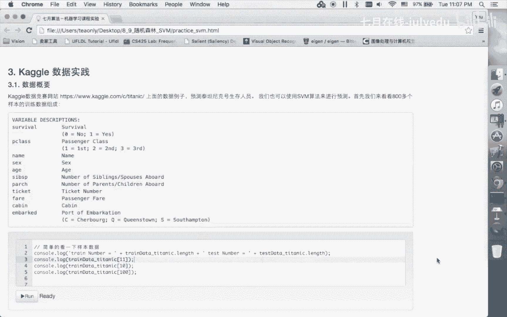

# 人工智能—机器学习公开课（七月在线出品） - P4：SVM数据试验 - 七月在线-julyedu - BV1W5411n7fg

我们来再清晰一点的例子啊，我们先从简单例子开始。像我们这样这样本着，我们顺逆时针啊2。34好。5。六。7。好。抛一下，我们来看看这个阿尔法的这个跟我们刚才描述的是不是。7个啊。

记住是我是这个逆势正反冲值，1234567。我们现在如果说。我们不看的话。这个式子应该是什么？在这个判别平面上，它应该是夹在零和C之间啊，我们参数在这。应该加在零和一之间，对不对啊，第二个。

明显应该是0，对不对？第3个明显应该是0这个点。啊，似乎应该等于，它也有可能在就是至少如果说。可要么等于要么就比小那么一点点啊，就在这个线上，这这个也是一样，有是比较接近这个。在01之间啊。

有可能是一啊，因为它在这个线上看不清楚，那这个明显应该是。这个明显应该是等于一的啊，这个是等于0的。也就是说。也就是说什么一个数啊，小零和C之间。00啊0和一之间啊，这个应该是。零和一之间0。

一我们看是不是啊。零和一之线00。啊，这个也是零和一之间啊，它就在这条线上。然后呢，接下来这个呢-5点几E的负4器啊，当然是零嘛，对不对？对不对？哎，这个是一对，就这个线是一在这对不对？跟我们差不多。

我说这肯定在，要么就比一小一点点，要么就接近一，那就是一。没错的。接下来这个。0。833G啊，零和C之间再接下来是0，再接下来这个是一。对不对？好。我们再看看。线性和啊，我们现在呢加一个错误的分类。

负样的，我加一个加到这个位置来啊，再点击一下测试。变解了。啊。变成了这个样本呢，这个样本应该是继续，它还是只剩向量吧。应该还是这个0到C之间，也就是0到1之间，这个是0。然后呢。

这个玩意呢应该还是0到谁之间，就是0到1之间，他们两个构构造了这条线，对吧？这个别分错了，它应该是等于一。这个他参与构造了这条线，它应该是在0到C之间，就是0到1之间。这个那等于0，它完全分类的。

对不对？这个明显被分错了，它应该是等于一的，这个也应该等于一的那因此后面两个都等于一，对不对？看看是不是。啊，后面两个都等于一这个等于0啊，这个等于等于0，对吧？那这个0。59几，这个就参与这条直线了。

对不对？啊好。我们现在C是等于零的啊，我们现在简单的看看这个C。在在这个我们的线性的这个里面，C是什么关系？啊，我们加大1，我们先看大点的，谁看看怎么。哦，没有变，不要紧，加到100，我们看一下啊。啊。

这个注意这个。你改了代码以后，呢个点击一下这个我没有点啊，装载到内存里面去。好。我们看到C搭了以后。发生什么什么性变化呢？我们的这个marin啊变小的了。啊，如果说我们这个时候看现在的这一组阿尔法啊。

还是一样，肯定不会错啊，这我们就不用看了。啊，但是我们发现我我们在线性核下啊，如果说我们用这个加大了C啊。那么。我们就把这个marin变变什么变小点了。对不对啊，把这个marg变成小的啊。

因为我们这里存在一个，如果说我再加大。100。我看一下啊。更小了。对不对？他妈就越来越小。啊，那我们加大C的好处，马景变窄了以后呢，带来几个呢，我等于零的这个项变多了。变成这个项变零了。这个项变零了。

正向边。对不对？但是呢。这是因为它的 margin景变小了以后，那么它跟我们这个最初所设想的这个。maxim margin啊就是这个这个这个距离啊是矛盾的。因为我们加大了分错的项，因为我们这里存在着。

分错的可能。对不对？啊，所以说C越大什么？我们看到这个margging是会发生变化的。啊，好。接下来我们看看换一种核函数啊，我们看有什么区别。啊，好。我们还是个例子啊，我们还是用。2。

0比如说啊我们这里呢换成这个RBF内核，就和高斯核。好，我们来点击一下测试哎。他马上就彻底变掉了吧。啊刚才的这种这种这种样子都已经露出来了，对不对？好，我们发现这个这个怎么解释呢？我们看它的阿尔法项。

所有的这个红色的啊。都没有落在这个亮色区域里面，就绿色这个点和这个点可能是落在两，其他的，对不对？这就说明什么呢？这个这种图如果如果说我们说明什么呢？我们的这个sigma。学太小了。

我们看看这个加大西格ma是什么样的意思啊。你改成1。5。点击一下。哎，这个时候就就变成我们说。觉得还不错的数据了。啊。🤧大家看到。啊。这个亮色的区域变成这样子的形状，对不对？这个变成这样的形状啊。

变成这样的曲线了，对不对？这个我我们不用这个例子，因为这个例子比竟比较接近线性的，对不对？我们换一个例子啊，我们就用稍微非线性一点的例子啊，注意我们也是来构造marin，对不对？我们的样本。

我们前面说了啊，我的样本是西数。可能是边界上没有这么多点啊，但隐约是存在了一个明显的一个马景的，对不对？哦，样本是一个弯的线啊，我们看看能不能。给我把这个先给我找出来。好。哎。

这个判变平面是是一条弯曲的曲线，我们发现有错的，对不对？好，就跟我们前面做的实验一样，我们看看这个高适和下面改变C会什么感觉？我们现在改成20。好，然后点击一下。店仔啊。我几乎都分对了，但是呢变材料了。

对不对？啊，因此呢我们这个C呢明显控制的就是这个marin的这个。呃，这个这个这个宽度对不对？我们就我们就看这个我们的这个样本分类啊，它是密集程度如它越密呢。那你的C呢应该把它。

加大如果你的密集程度不够的时候呢，我们是呢建议呢就不要用太大的字。啊，因为我们这还是比较偏明显在边界上，我是很密密麻麻的纸用用大点的才。这样的话，我的这个曲线呢啊，我这边界线呢就描绘的比较清楚啊。

这个C音呢跟那个线性核呢是一样的。好，接下来我们重点来考察一下这个sigma。啊，我们现在用了个标准呢个1。5啊，如果说我们变成。5。5啊，我们来看看啊哎。变成什么了？很很奇怪，对不对啊。

变成一个这样距近接近直线的线。对不对？什么意思？这个码控制什么？这个码控制的是我们用这条线之前我们说PPT有页，我们说会。会来给我们解释的这样子的一个线来看啊，就是这条线。西格ma我们控制的是什么呢？

每一个样本都是一个三嘛，对不对？那么西格ma是控制这个三是不是很胖还是很瘦。如果说我们的西格玛区的很大，那说明我们这个山峰啊是很胖的，对不对？很胖的话。那么我这样横着一刀切过去，它的曲线就应该是。

这样子的连在一起了吧。啊，连在一起了。啊，也就是说我的西格玛越大，它的偏越偏线性。啊，越偏线性啊，就是就是非线性的落点。那如果说。我减到很小呢，于说我减到0。05呢，大家看一下效果啊。这什么？

这是K进0。啊，这个在这张图的意思就是说我切到了最顶点上，这每一个样本啊只保留那么一点点区域。啊，那那这个的极端的就最极端的情况。对绿色样本来说啊，只要是绿的附近的一点点，我认为是绿的。

其他全认为是红色的。啊，所以这个西格玛呢必须取得一个什么样的值呢？但这里我们是有可视化，对不对？我们大概看得出来哦，应该在1。0附近91。0，其实也还是。1个okK的字啊，没问题的。啊，那。

我们有可视化，当然是可以辅助来确定这些参数的。但是我们在工程中高维的数据。我们是没有办法可视化的，对不对？因此呢这个同时呢我们又观察到这个C和西格ma呢是紧密相关的啊，西格玛可以控制这个。

我们刚才说的这个这个这个这个线形和非洲这个线的弯曲啊，同时C又可以控制这个线的这个胖，就这个这个这个这个区域的胖和瘦啊，对不对？因为它是相互关联的啊，正是因为它相互关联。所以我们在实际工程应用中。

我们必须使用这种。参数选择的方法。啊，就是说我们要做很多的。交叉验证来验证我到底是取得设计一个什么样的C啊，设计什么样的C干嘛啊，也正是因为高斯荷有这么强的灵活性。啊。

我我可以做的很我们可以举个很突出的一个例子啊，琼色啊琼色嘿哎，不对不对，这样子啊，琼色。红色红色。然后呢，我们这里呢取红色。不色。红色。然后样本呢绿色。啊，然后呢嗯。😔，我们把它交叉下啊，绿色。

绿色绿色。绿色。绿色。律史。哦，红色。红色红色。啊，然后呢绿色。绿色，然后呢这里放些红色。哎，不对不对哦，是搞错了，红色红色，然后呢红色红色红色红色。然后呢，红色红色红色红色红色红色。然后呢。

我们绿色呢是比较奇怪的，哎，我们交叉分布。好，我们看一下啊。交叉分布啊。这样子的很奇怪的样子分布，我们看看在这1。0和20的情况下会什么样子。好像。不不够那个明显啊，没关系。把这个加大。诶。

就大家看到啊，这可以表现表示出一个非常复杂的一个曲线出来，但是呢都没有体现出那个画格子吧。我们把这个呢。更小一点点。好，这个时候就体现出来。画格子的味道了吧，如果说我们再把这个啊减到0。1。ok然后呢。

我们把这个呢。啊，0。1还是稍微0。3。啊，这个银格，我们继续补啊，我可以再把这个副样本副样本副样本副样本副样本。增阳板增阳板增阳板增阳板。复样本复原本复样本。然后呢。这样这样的很好呢。明白O。啊，好。

我们。诶？大家看到棋盘格已经出来了吧。对不对啊，这个例子告诉我们什么呢？高斯和可以表示很复杂的这个描述非常复杂的这个这个。啊，这个这个这个分割平面。那这意味着什么呢？它容易overfi。啊。

所以说希望个所以就这意味着两个意思。第一个它有很强的分类分类能力。这也是说这也是啊人们经常最喜欢说的，它是一个无高斯合。对应的维度提升是无限维的。啊，这是因为它有这个特征啊。

那可以形成各种各样复杂的分类函数啊，包括像这么复杂的，我们都可以做把它分分开来。🤧对吧。啊，那。诶。那也是正是因为它太强了啊，有的时候呢反而人家不建议你使用啊，这也是为什么有人会诟病这个原因啊。

但这个大家就知道一下就可以了啊，就是说用这个意思就是说用高适和虚谨慎啊，因为它能力太强啊。测能力强就是来自于他无所谓的无限维嘛。啊，OK好。这个我们就这样子的话呢，我们就把这个几个实验项目做完了。

第一个阿尔法和自撑向量的关系啊是取0。取0到C还是C，对吧？然后核函数。很大的区别，线性和就是直线，对吧？高时合有很强的能非线性的能力。好。😊，然后C参数的选择以及高时恒是西格玛的选择。啊，好。

那接下来这卡go的这个数据呢，我就啊大家看看自己去点点做做就可以了啊。那么只是简单介实介绍这介绍一下这个卡go，卡go就是一个数据数据的一个竞赛啊，那么这个还是比较水水平。还是比较高的啊。如果。

能进到一个。10分之1啊，就是说top的10%呢还是挺困难的啊，更别说进了前三了啊，那是相当困难的啊，这个我可以这里然后呢。开国数据上呢有很多各种各样的类型的数据。啊，它不只是领域数据。啊。

很多的是通用数据，所以大家都可以去试看。啊，可以去。可以去试试看耍一耍啊，这是给大家介绍一下卡go。

