# 人工智能—机器学习公开课（七月在线出品） - P5：半小时torch教程 - 七月在线-julyedu - BV1W5411n7fg

好呃，今天我们给大家来介绍一下这个呃一个机器学习的框架啊，这是一个非常流行的一个框架之一toch。OK首先呢我们来介绍下toch是一个什么样的东西啊，为什么说它。值得向大家呃推荐啊。好。那首先来说呢。

套起呢。它是一个这个科学计算框架啊，它这是他这是他的正式的官方的说法啊。那么它主要呢我们可以简单的认为呢，它是一个面向啊这个机器学习的。

一个现代的一个类似于mate labb的一个这样子的一套工具和框架啊，为什么说它像mate labb呢？等我们会解释一下啊。好，那么拓景呢主要还是面向这种机器学习的。然后呢，同时为什么说它是现代呢？

因为。他很好的支持了。GPU啊以及一些。呃，哭打还有类似于open sale这样子的比较。这样子的这种back end的这种库啊，所以它适合于在现当下啊，我们现在来学习。

通过tor弃来呃进入这样子的深入学习呃，深深入学习这样的领域啊好。就是拓奇是一个什么样的概括啊，那么拓奇的网站呢就是这个。torch点CH啊，就这个网站啊，那么toch的核心呢是一个什么东西呢？

toch的核心啊，它呢是一个提供了一个。N维的一个。数组我们把它叫做张量啊，就是tenser啊。那么它的核心呢最核心的地方呢就是这个tenser库啊，那么它围绕这个tenser库呢，提供了类似于啊这个。

各种各样的，比如说啊indexingslicingtransposing啊，就是我们各种的缩引也好啊，各种各样的这个矩阵的变换也好，以及我们对应的这种啊线性代数的各种各样的算法。

比如说我们求矩证的乘法呀，求这个矩证的逆举证啊等等等等啊。好，那么在这个最最核心的这个。张亮的这个。库的基础上啊。那么提供了大量的类似于像神经网络啊，这个数字优化等等等等相关的这个机器学习算法的包啊。

这个就是拓取的这个重要的组成。就是一个核心核心是什么？核心就是一个。核心就是一个张量库啊，一个tensortensor library。然后在这个t library之上啊提供了各种各样的。

机器学习的算法包啊。okK同时呢它又是一个完整的，像类似于matelab那样的完整的一套工具和框架啊，这个就是toch。好，那么。大家学一套型的安装呢。那第一步呢，我们当然就是要来安装它啊。

安装呢是非常非常简单的啊。

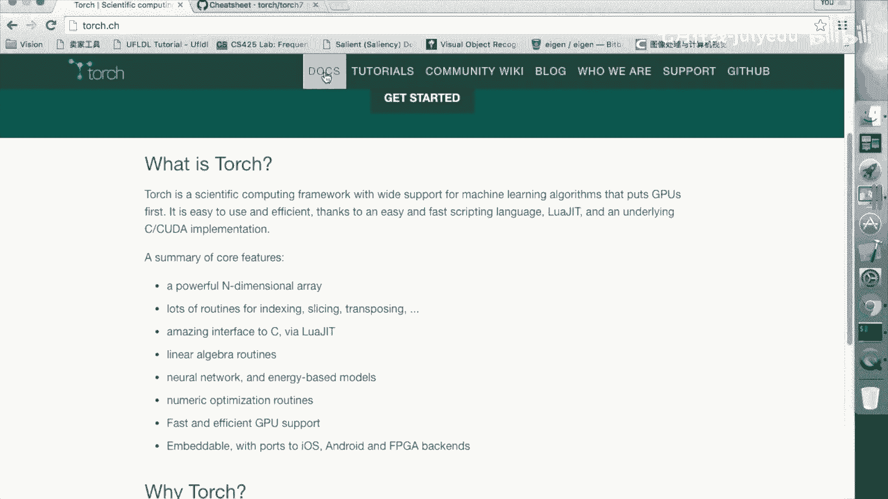

我们直接就点这个。在拓节的官方网站上啊，我们直接点这个。Get a start。嗯，只需要呢okK那么。

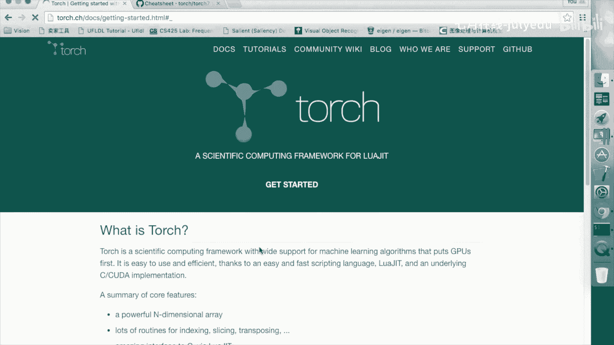

当然目前这个toch呢啊只支持这个。OS ten啊以及这个乌邦图的linux啊，那不太呃暂时没有一个windows的支持啊，但我相信这应该不是。呃，很重要的一这相当比较容易克服啊。

我们只需要找一台装一个lininux的机器就可以了。那么安装整个安装过程非常非常简单，只需要执行下面三个命令。O如果你的乌关图机器上没有安装get，那么先用先需要安装get就后面就后续的工作啊。

都会通过脚本自动完成啊，大概这样的一个安装过程呢，可能需要如果说你是在在一台全新的一台乌班图上的话啊，大概可能需要将近啊半个小时的时间。因为它下载非常多的工具啊，编译工具开发工具啊，然后呢要去编译啊。

那么费比较大的时间啊，这是这个安装okK如果说你要想支持那个。GPU的开发。那你要在这个安装之前呢，去那个NVdia的网站上去下载这个酷达的安装啊，这里酷达的安装就不再详细展开。

大家可以在通过搜索引擎就可以找到啊，这个酷达开发工具的安装的非常多的资料啊，这里面可能会碰到一些啊那个比如说出错啊或者安装跟桌面啊会有些冲突。因为毕竟牵扯到这个显卡的问题啊，驱动程序啊。

那么大家尽量都可以通过这个google啊，找到一些解决方案啊，这里就不再详细展开OK。当你安装完啊，按照这个文档啊，就是instoring torch这个文档的指导装完以后呢，我们可以看一下。

首先呢我们可以看一下toch提供的什么东西。

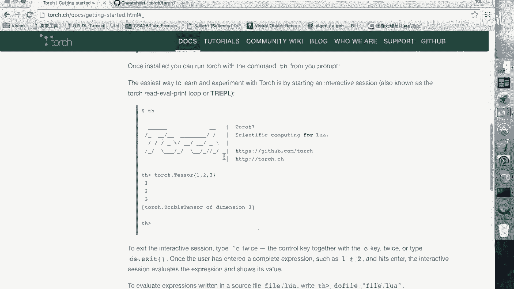

啊，首先这个套气呢就安装好以后呢，我们可以运行加一个TH这样子的一个程序。在这个。呃，在这个我们在我们的终端之下，okK好。啊，这是在终端的一个环境下啊，运行toch它首先会有一个banner的显示啊。

就这些东西啊okK然后呢。这个时候呢我们就我们为什么之前为什么说它提供一个类似于maclab的工具呢？这是to提供的几个工具中的第一个啊是一个交互的交互工具啊。

这是一个这是一个呃基于命令行模式的一个交互工具。为什么它是说它是交互工具呢？啊，我们来试试看啊。多钱，我打个。这个时候我摁一下tab键。哎，他就会告诉我有206种可能点个Y啊，大家会看到toch内置的。

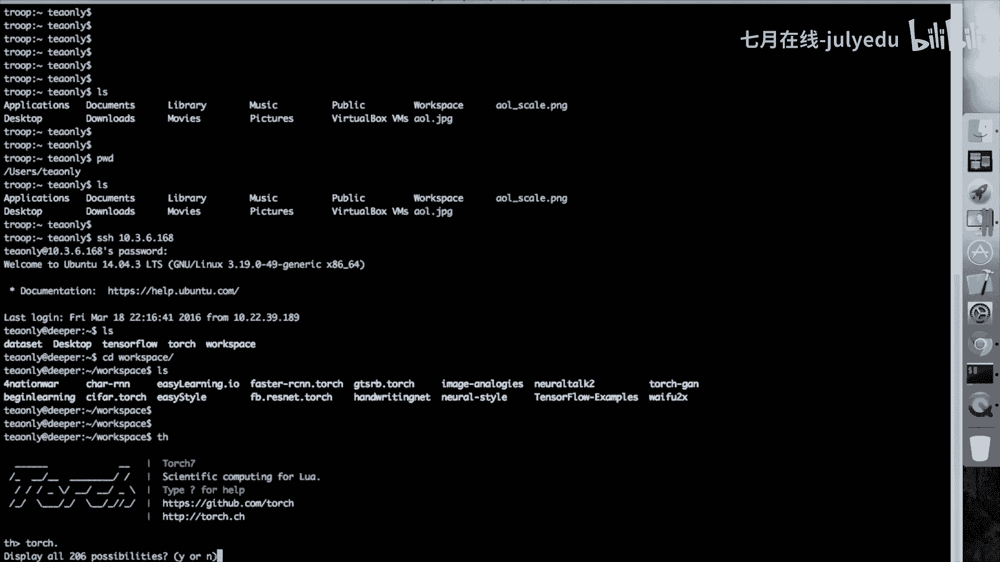

这个也就是这个张量库啊，to取的核心是我们说的是张量库啊，它提供了各种各样的这种函数啊，以及功能模块。

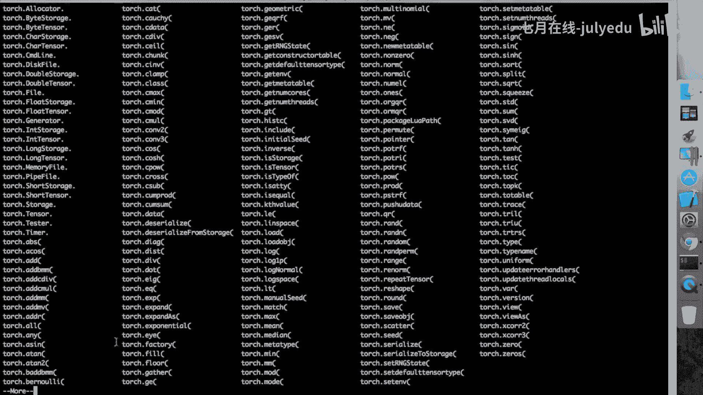

对吧好，那我们给这就是。唾弃的核心了OK我们比如做个最简单的例子啊。我们呢创建一个3乘以3的这个张量，叫做A啊，A等于toch点re随机。

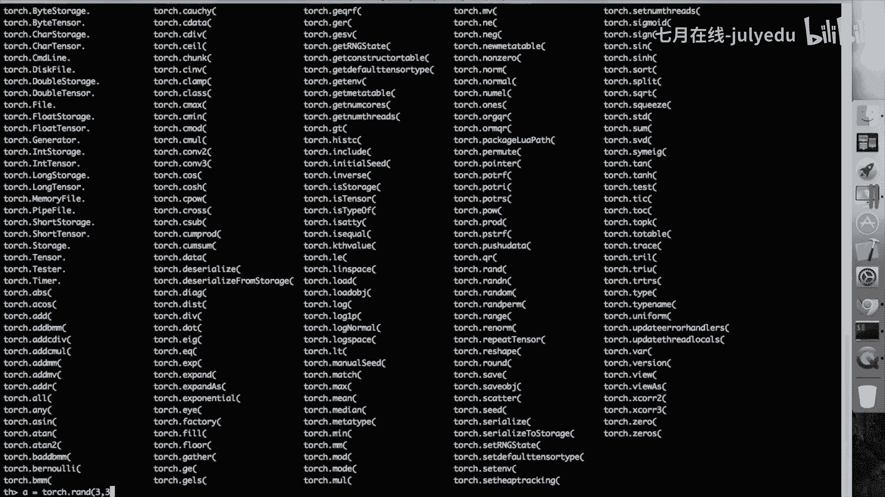

🤧哎，我们可以打看一下A那，这个就很方便，对不对？这就非常方便，我们就可以嗯。那么这样子的一套这样子的这种呃，为什么说很方便呢？这样子的这种交互式呢，你可以呃非常容易的啊学习这个tor气里面的这些。

最基本的这些呃各种各样的函数啊，比如说我们在做个实验，B等于t7。EXP。一个比A，那么也就是说对A这个矩证啊，因为它是两回的。那么我对每一个矩阵的元素啊都用指数去运算，那么就得到BO这就是B的值啊。

对不对？因为A是一个随机矩阵随机数啊，那么BEXP啊执行一个指数啊，这样的话okK那我们再举个例子。我们构建一个我们把这个神经网络的库把它装载进来。好，那进来以后，我们可以看一下，我们我们做一个。

比如说我们做过卷机网络的地址啊。好，它就有很多的这个卷积网络的相关的这种。这种实现对不对？ok那我们做个最简单的例子啊，最最最标准的这种卷机网络的。哎，我们创建一个3乘以3的一个库啊。

3乘以3的一个啊输入是一输出是3，然后呢，3乘以3的科隆啊这些带。对，然后呢后面是一。一啊，可以啦。我要。为什么说这个交互式的环境非常好用？就是说我们可以通过简单的这种命令，不需要去开发程序啊。

我们就可以呢。来验证我们的这个。呃，这个库的这个使用啊，比如说我现在构建一个图像。啊，这个图像呢是由。是三维的O我们把它变成十是16个像素乘以16像素的啊，假设是这样子。

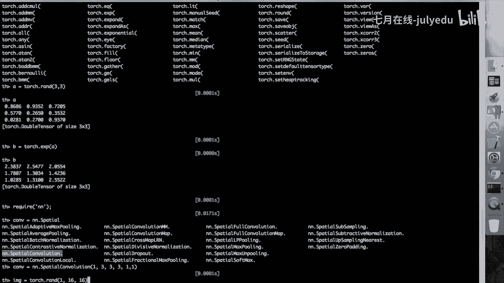

OK我们可以看一下这个image，它就是一组随机数，对吧？好，这个这个时候呢我们可以imB呢，我们就可以等于这个卷积网络啊，我们让它去执行一下这个神经网络中的foword的计算啊，我们用image。

这个作为输入，我们就可以得到imageB。诶。😊，这个时候我们因为基B就可以看到结果啊，我们就可以看到这数值及数值的值。那正是因为有这样的交互工具，我们就可以了解。这些我们比如说这个神经网络下面的。

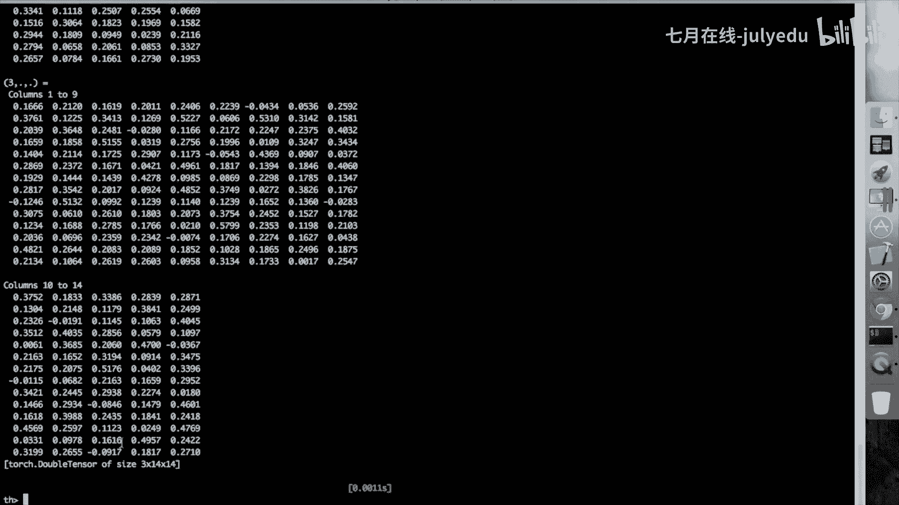

有这么多的模块啊这么多的模块。

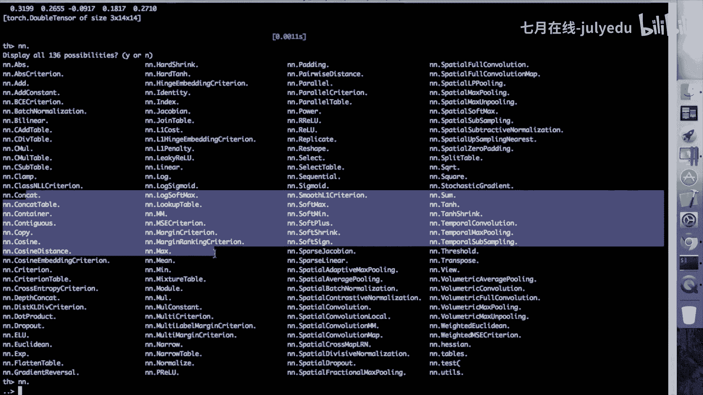

他们每一个模块啊到底是怎么用的啊，就是说我们很方便的就可以马上可以马上所见即所得啊。马上就可以看到这个下面这些这些模块呢。他们的使用的结果啊，这一点呢非常方便大家的这个调试啊，就是说呃我我我一程序。

可以在这个交互式的环境下，随时去查看变量，随时去查看函数，随时看函数输出等等等等。啊，这也是toch和toch的这种模式呢，非常利于学习的一个优点之一啊，它不像这个tenflow这样子，或者说sno。

基于符号计算的这种方式。那么那种方式呢呃如果你想调试某一个模块呢啊就相对来说。就会非常的困难啊，没有那么直观啊，不像我刚才我就自。

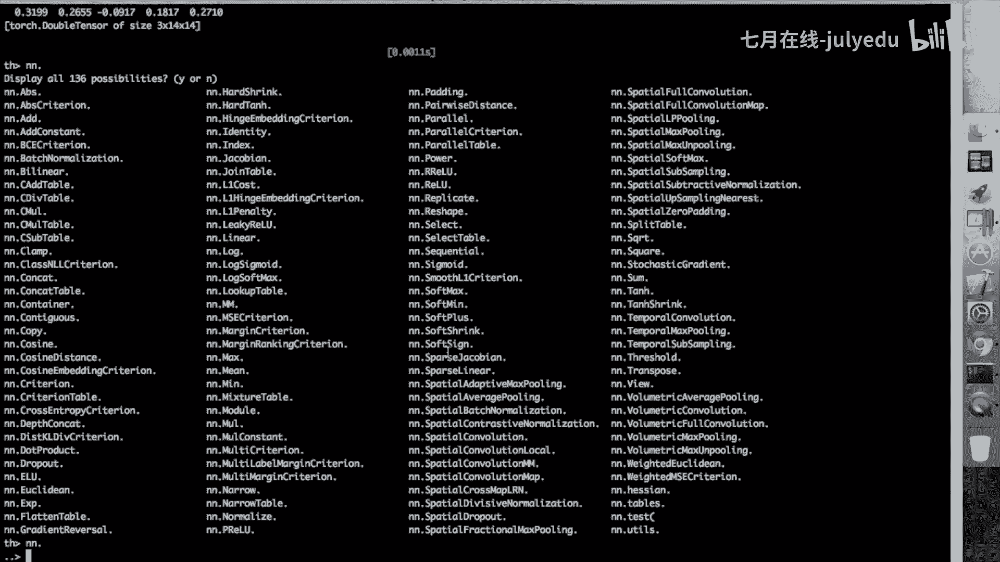

直接简单的一步计算，然后我就可以看到这个值啊，如果说。你看在tensor floor里面。也去看一个卷积计算到底是怎么算的，它那个参数。啊，是怎么怎么配的什么结果，对吧？啊，你要写好几行代码啊。

你要创立一个session，然后run那个session，对吧？O那我们可以。

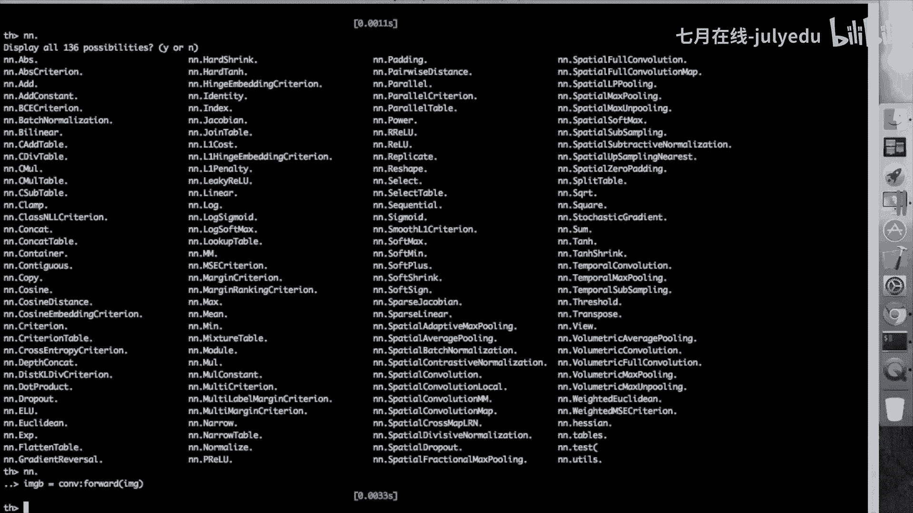

我们可以刚才说了啊，我我随时就可以调整我的这个参数。对不对？5乘以52，这样的话我就知道这种卷积操作啊，它是。

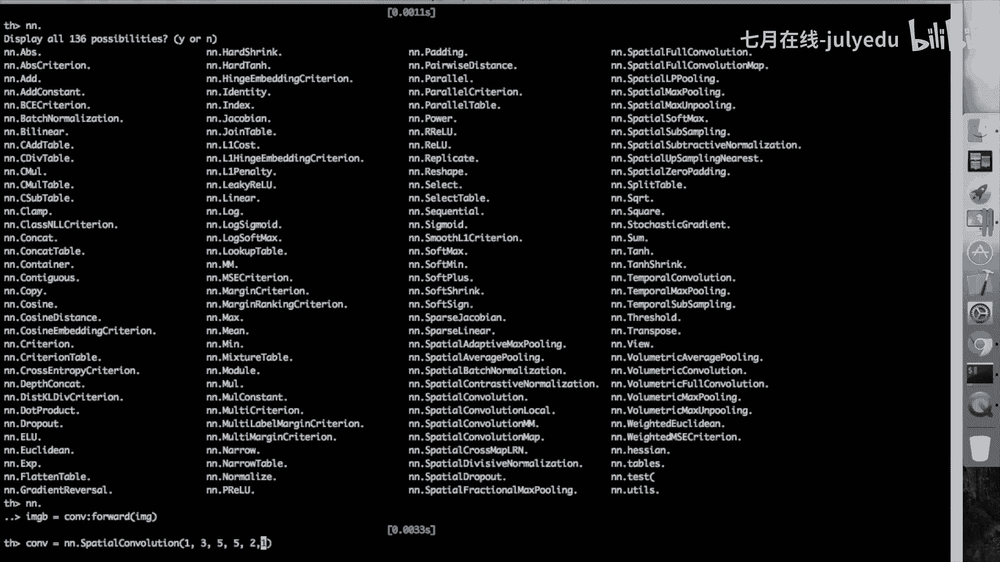

它是怎么使用的，对不对？啊，O这个时候因为GB的尺寸。

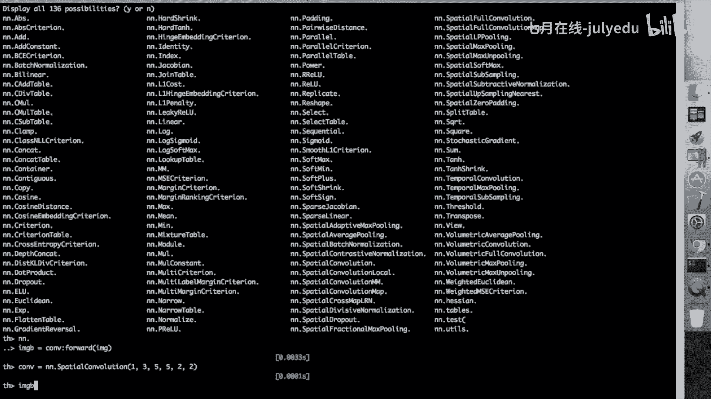

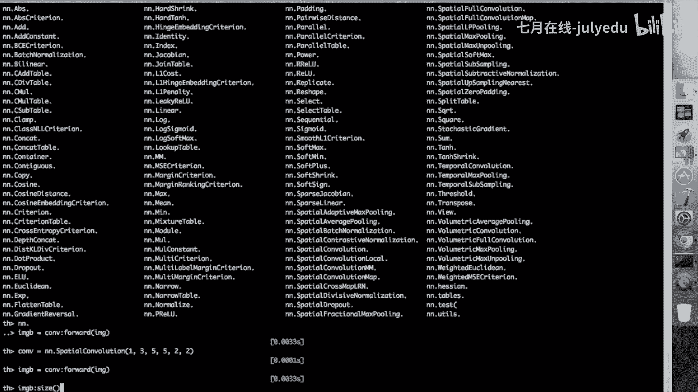

啊，366为什么是为什么是66啊，那这里不我不解释了啊，但是这样的话我们就可以。很方便的来学习。这个这个呃。这个比如说神经网络的这个这个这个这个各个模块的这个使用啊。

这是toch的交互是提供提供一个交互的开发环境给我们啊，就是直接。

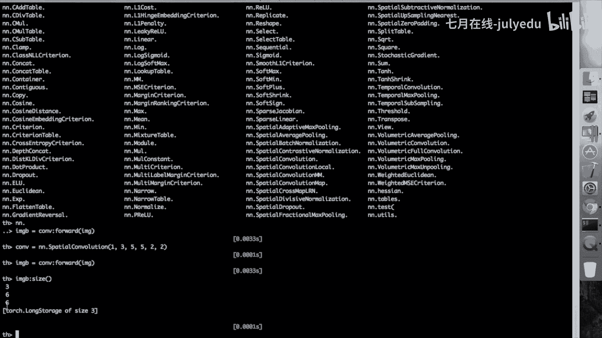

那，直接运行GH，然后呢啊你就用通通过手输入命令的方式啊，你可以包括。

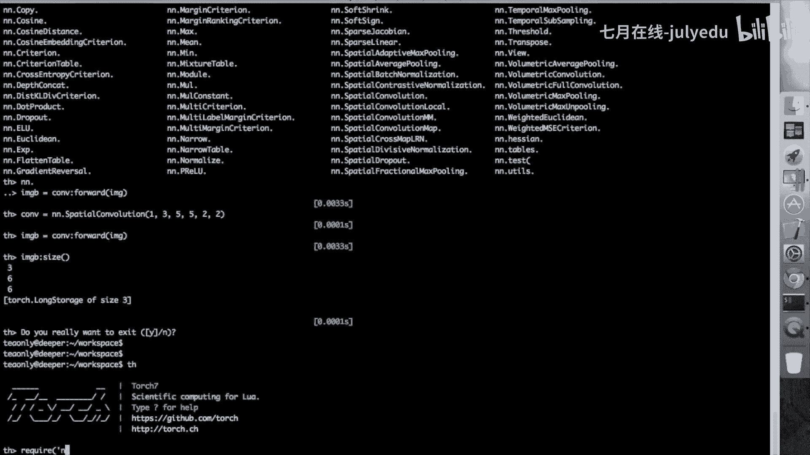

啊，比如说神经网络库啊，它有各种各样的啊函数，对吧？然后你可以包括。啊，这是CUN是什么呢？就是哭打啊。一样，我们可以。我们可以看一下这个，因为我这台机器上是已经安装了这个。呃。

GPU的O我们可以看一下get。呃，我们可以看一下device properties，然后呢，我输入了一。好，那你可以打印出来哦，这是1个Gfor的GTX980TI的显卡啊。

它的memory呢现在有6个多G啊，然后呢最大等等等这些参数啊，它就全部给你列出来啊，里面的执行单元。啊有多少个啊，内存有多少啊等等等等啊，这个就是。嗯。这个这个安装好以后呢。

我我也比较方便我们去调试啊，这这个是这个是。to的第一个优点提供啊第一个提供提供的个工具给我们，就是这个教式的一个工具啊，这个呢。呃，其他的库呢因为是基于牌上的OK那拍上呢。

你需要去找一个呃呃拍上的第三方的这样的一个。呃，交互式的一个环境啊，那toch呢本身就有一个啊好。这是第一点。那。这个。拓呢除了给我们一个这个工具的，还几还有还提供了一个。啊，一些可视化的工具啊。

我们来我们来看一下啊。可视化工具呢，那比如说我们来最简单的例子。require我们1个GNU。PLPLOT啊，大家知道这是一个绘图的库，对吧？好。那我X line呢，我随便去随机一个数。Randdom。

比如说啊。我随机100个数字okK这个没问题，对吧？好，它基是100个数字。那我就可以GNU。PLOT这个我就可以看一下这一个。这是一个数组，对不对？我看看这个数组把它画成一条线。

我们看看直接可以看到效果。OK这已经出来了啊，进proO那就是个随机数嘛，对不对？它有总共有100个嘛，它的值啊啊这就是。

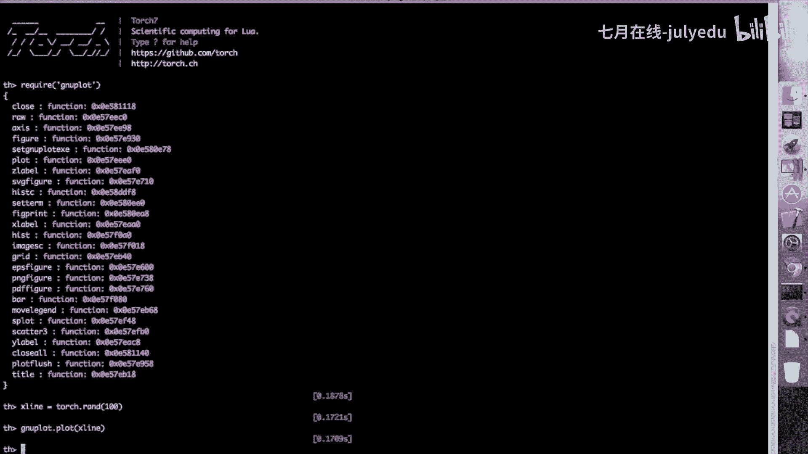

类似于matetterlab里面的PLT这个命令对吧？pro这个命令O这以是我刚才为什么一直说它非常像这个这个呃这个这个呃matelab啊。好，它不只提供了这样子的一些工具啊，可视化工具。

还提供了一些类似于呃。

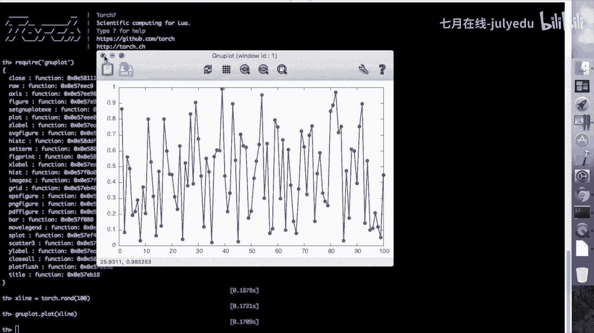

呃，还提了一个很好的一个可视化工具，是ip pthon啊，这个呢。这个工具呢啊。我给大家演示一下。好。大家演示一下啊啊ittoch那么。No book。好。

然后呢，我们浏览器打开这个页面。

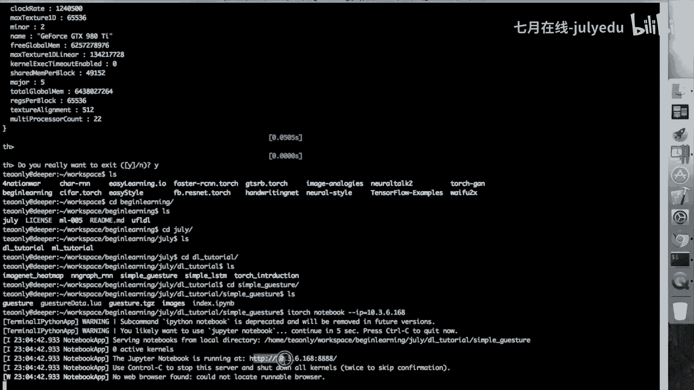

好，我们点这个。这ipad notebookbook的文件啊，这个时候呢我我这是另外一种通过web的啊可视化的工具啊，就是说你可以执行你的代码啊，可以你也可以通过这个ito image。

我们来试验一下啊，我这里。可以加一个。你说 will require呃。呃。Iage积 ok。然后呢，我们搞一个lener的图啊，这个太有名了，大家都知道的。IMGLEN a。好，然后呢X。

然后I to这个I套是。你，运行itto它内置的一个库啊，已经加载好了。那么因为。这个那好，我们执行一下。那出来了啊，这就是一个最最最最最最简单的这个通过I套的一个。一个可视化的工具啊，它不只是图像啊。

这个例子是我们在这个深深入学习的课里面啊，会会会讲的，但我就不不讲过滤过过得去。那我想想后面它的可视化的，它一样也可以通过这个pro这种工具。啊，通过外b的方式啊。哎，直接去查看这些呃。

比如说我们的我们训练的一个过程啊。啊，这是外部的这种可视化的呃方式O。

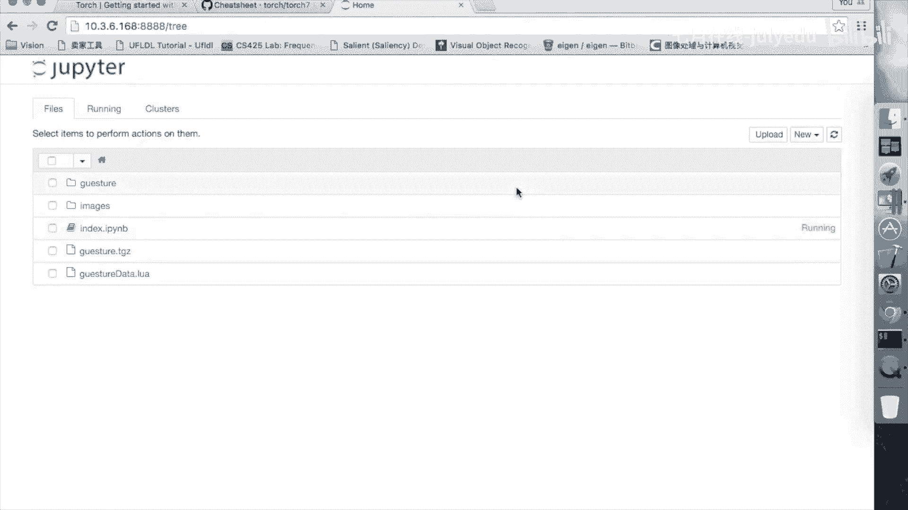

We hearない。

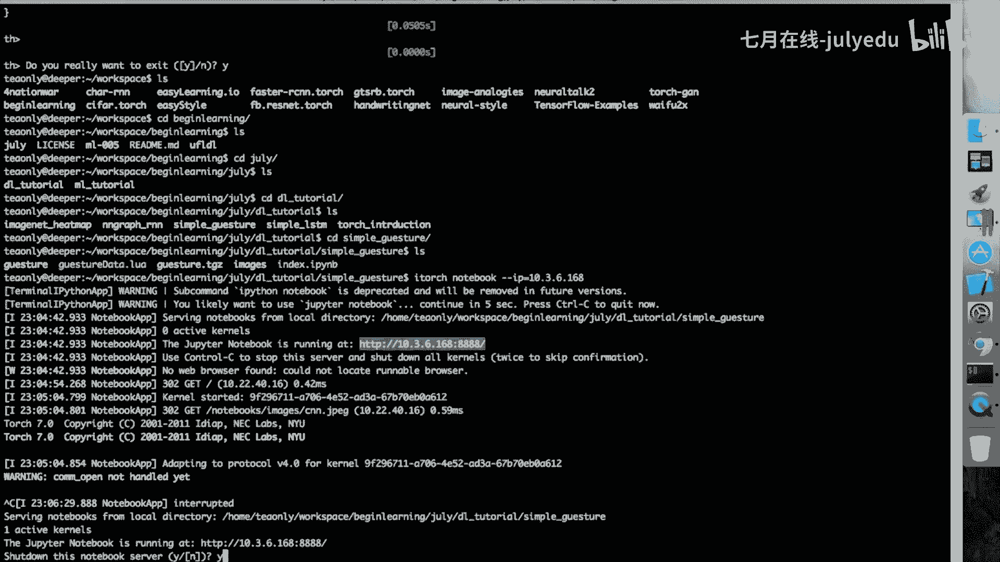

好。刚才讲了一个交互式的工具啊，又讲了一些可视化工具。还有一个很强大的一个。toch的一个特点啊，就是toch它提供了一个包管理工具。也就是说你可以。这个。

通过撸耳源把撸耳源的各种各样的第三方的这种呃工具包，或者说软件包通通加载进来啊。它附附送了一个什么样的工具呢？叫做lua locks啊，我们可以list似的看一下啊，这就是上面安装的各种各样的。

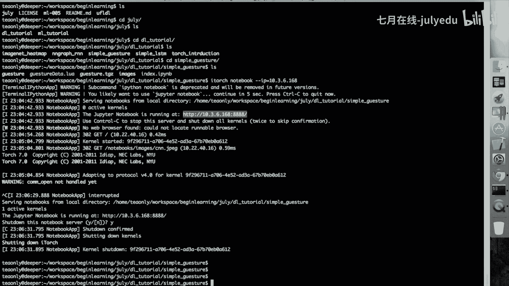

各种各样的这个这个工具啊，包括刚才前面的那些。来。这个por的工具也是其中之一啊，各种各样的啊，它所有的这个呃所有的这个toch也好，还有这个。神经网络包也好。

机器学习包都是通过这个撸瓦的这个包管里的工具啊，加载可以各种各样的安装卸载啊，更新啊都可以啊。那正是因为这个toch呢它不像。呃，因为它这个拓起呢是是一个闭环的系统。也就是说。

他只是需要维护他自己的兼容性就可以了啊啊，因此呢它上面。你在你应用这个toch的时候呢。绝大多数的这些开发包呢安装呢通常都比较顺利啊，它不会经常有一些兼容性的问题啊，那拍上语呢。

可能你会碰到一些okK他他的不同的库可能是开不同的目的啊，可能会有一些偶尔会碰到一些，但也不是那么主要。但是这个套起呢经常还比较的相对来说会比较的。呃，一个顺利。

我们比如说我们来给大家展某一个很有趣的一个例子啊，这个是集成了。呃，我们可以看一下lu locks list。啊，它集成了一个什么呢？open CVV的。啊，好。

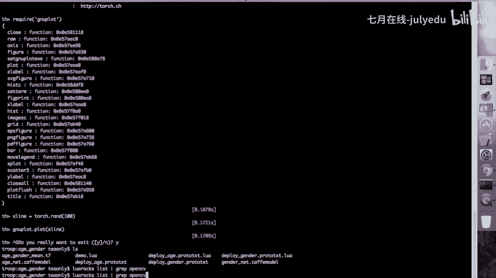

East。看一下啊。这里有一个。

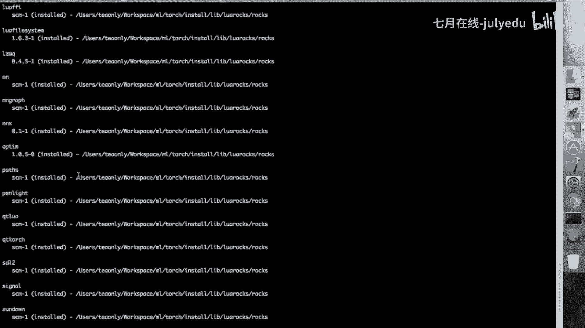

呃，我看一下啊。camera的一个一个一个一个一个演示啊，我给大家演示一下好了，直接。在OK这是一个集成了open CVV的一个库的一个例子啊。lu语的为什么toch会选择用lu语言啊？

那么最最重要的原因。就是入语言是一个非常容易集成C语言开发库的一个胶水式的。脚本语乐啊，这是这是它最重要的原因。O我们可以看一下这个用open CV的一个demo的这个演示啊。

这也是一个深度学习的一个例子啊，大家可以看一下。

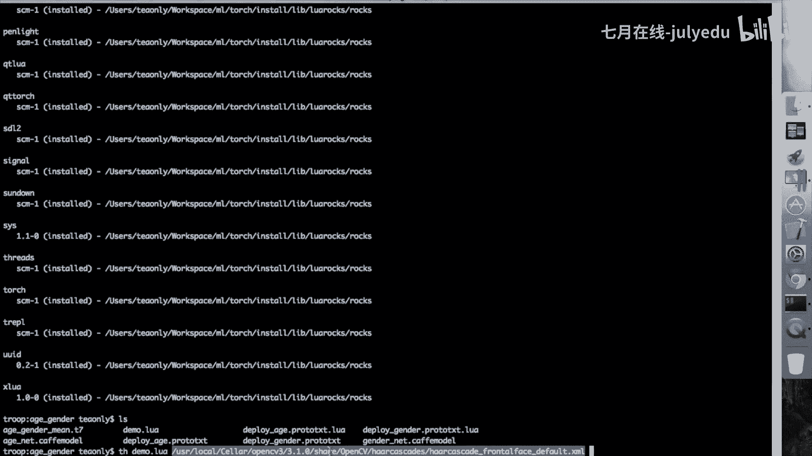

啊，他天天去调open CV。打开这个camera。OK他就把人脸呢识别出来，并且呢性别也告诉你啊，这是一个训练的一个卷积网络。okK他会告诉你这个性别啊以及年龄。啊。

而且是可以做到实时的一个demo啊，这就是我说的呃lua呢这个它有我把它推出来OK。啊，你就说呢。呃，它有呢各种各样的第三方库啊，这是我想说说的这个撸的一个。奉送的一个。啊，第三个东西啊。

第一个它是一个交互式的一些开发工具，对吧？刚才我们说了，就是通过这种cil的，那么他还送了他还呢又有了一些这个。可视化的工具。okK啊，可视化的，我就说刚才说的那个类似于prota。

类似于ittoch啊，那还有呢很丰富的第三方的开发库啊，那所有的这个toch的。

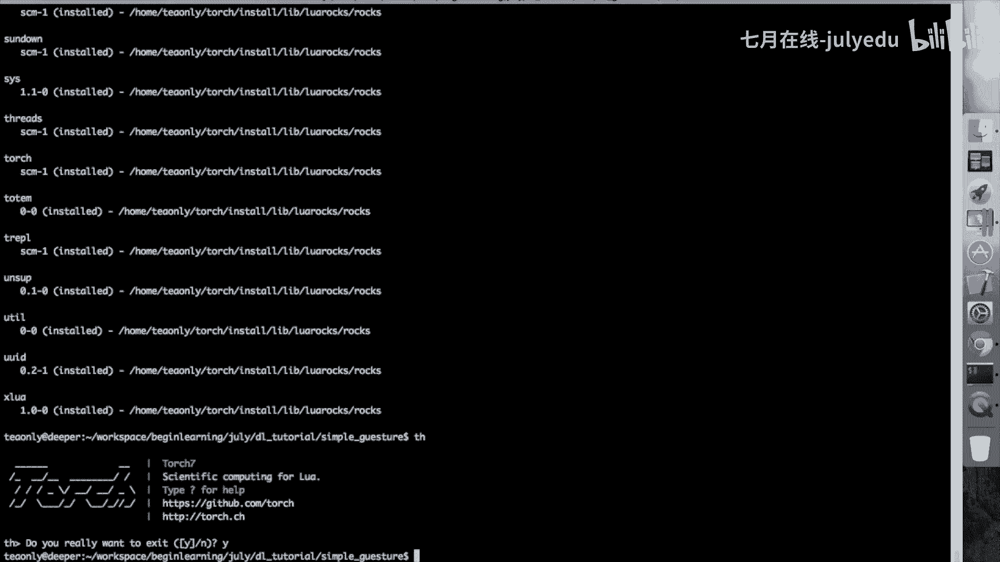

这些资源的总入口呢啊就是这个页面。就这个它的chet sheet啊，那么。这个汽的这段汽的系统呢把这个。透起的几乎所有的这些重要的。开发资源啊，以及第三方的库啊，还有文档的入口啊。

全部都可以在上面找到啊。比如说我们现在要去找一个。唾弃的这个。tenser库就是tensor的这个使用，我们就点touch这里。OK然后呢拉到下面来啊，这下面就有各种各样的文档。比如说。张量库的文档。

你们可以看一下。啊，然后这里就是它也会有一些非常写的非常好的一些文档啊，怎么样去。构造一些张量库，然后怎么。各种各样的线性的线性代数的函数怎么调用啊，比如说这是。三天库ok那我们也可以去看看这个。

积续学习相关的啊慢训 learningning啊，神经网络的这是最重要的。啊，他除了神经网络之外呢。😊，那也提供了一些，比如说看这个unerervis learning的，它提供了PCA啊。

提供了这个呃。很多啊包括SVM，包括啊又包括优化算法啊呃包括像。啊，这些啊各种各样的KNN啊也提供了啊，对不对？然后呢，K命也有啊，这都有啊，常规的呃很多的这种继续学习算法呢都会有一个toch的一个。

实现。但然它最重要的啊就目前用的最广泛的还是它有关于神经网络的这部分啊。OK那我们可以看看NN的这个文档啊。拿到下面来。啊，这些它的文档啊，神经网络的这个比如说各种各样的文档，各种各样的layer。

比如说我们点进去看一下。啊，各种各样的线性的库等等。我们就可以看到这个这个这个呃文档就写的呃，它托起的文档还是相对来说还是比较的呃清晰啊呃，非常容易看懂的OK好。

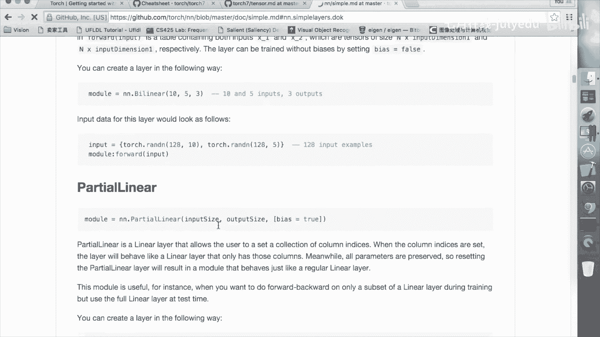

这样的话。接下来呢。😊，我们再来介绍一下这个。为什么给大家给大家推荐这个toch作为一个呃深度学习的一个入门的工具呢？除了前面这些易用的这些特点之外呢，还有一项啊。

我我认为我自己我认为啊是一个还是非常呃非常好，就是它拥有大量的。

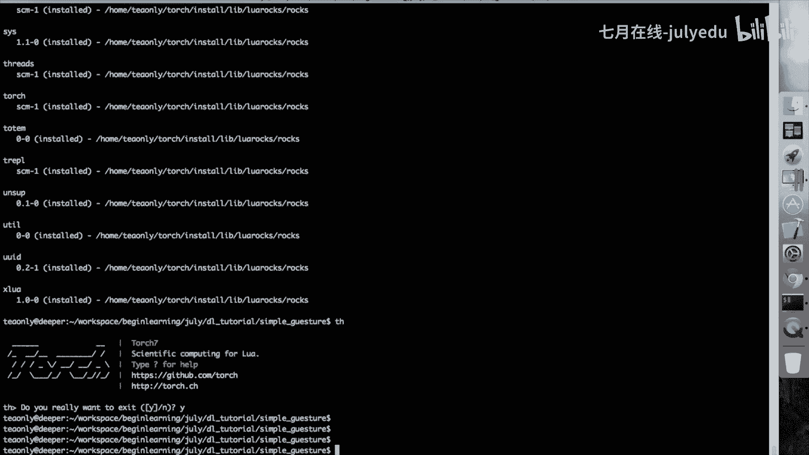

开源软件的这种学习的例子啊，我给大家举几个例子。啊，这些这些。这些工程也好。这些工程都是。用的都是非常多的广泛的啊，我给大家看一下。大家举几个例子啊，第一个例子。如果说。诶。😊，第一个例子是什么例子呢？

哦，这是一个用我们看到呃撸的对吧？撸的语言开发的这是一个呃在这个动漫界非常有名的。他实现了一个什么呢？它实现了一个智能的一个图像领域啊，实现了一个智能的一个放大啊，可以把这种。动画呢放大的非常的漂亮。

而不会像一般的软件的放大啊，带来一些毛刺啊，它可以去掉这些图像的这些毛刺啊。这个问题实际上在图像里面是一个比较难处理的问题啊。但是它通过这个深度学习的方法提供了一个工具啊。

那大家可以看到这个项目的大有5000多个。这这是非常了不起的一个一个一个一个一个一个一个一个应用啊，大家可以看到这个这这套深深度学习的这套这一套。工具呢在著名的这个B站啊，大家哔哩哔哩啊。

相信大家都很清楚，使用很多用户就用这个。透气开发的这套工具来压缩啊这些动画动画片啊OK啊，这些这些这些卡通。那，确实会。比传统的这种视频处理的要非常的清晰啊，这是这是第一个例子啊，大家可以看到。

5000多的啊非常非常有意思啊，这也是用托器开发的。🤧好，再给大家举几个例子。第二个例子我是给大家举的是这个例子哎。OK啊，这个例子。这个例子叫做呃这个例子是一个有google最先做呃，最先。做出来啊。

就是那个类似于deep stream的这种东西。但是这个呢更有意思，这是那个。

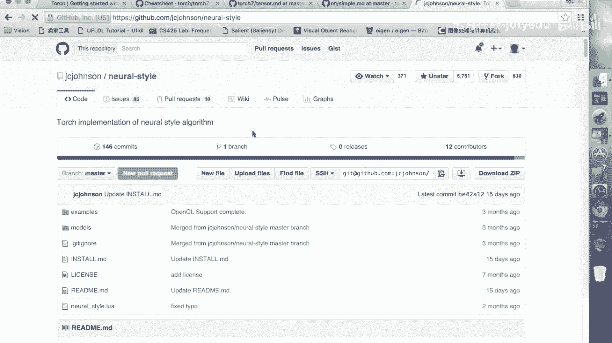

就是图像的这个风格化啊。啊，比如说。这张图啊是圆这张图我们知道大家这个应该是很有名的一幅油画，对不对啊？这张图呢是我们拍摄的照片，我们可以把油画的这个风格呢融入到这种我们实际拍摄的照片当中啊。

形成下面这张画的神奇的效果啊，大家可以看到这个例子非常漂亮。这是一张照片，这是一张油画，最后可以形成各种各样的这种。啊，这这是原图啊，这是那种瘸出来的各种各样的风格化啊。

这个是让人非常着迷的一个一个一个一个一个一个项目啊，非常有意思，做到非常棒。可以形成各种各样的这种呃画啊，对不对？很有意思吧。可以这个。

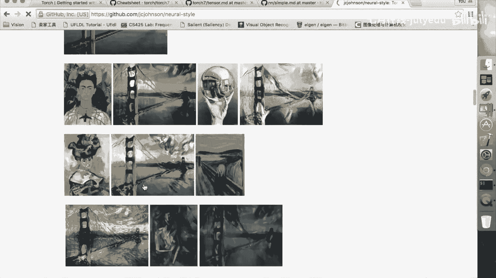

所以呃这个就就就非常有意呃非常非这是一个非常非常有意思的一个项目。给以大家看到哇，这个四大数已经超过6000多。啊，这这都是用套气啊，你对不对啊，这是这个也是用啊用套气来开发的。

OK我再给大家举一个例子啊。O敲错了。啊，这个例子。这个例子是一个什么例子呢？嗯，这是一个那个。输入一张图片啊输入一张图片，然后呢输出一个这张图片的文字的描述的一个一个用这也是用toch来开发的。啊。

给大家看一看啊，这个网络比较慢一点，特不要紧。这个是一个做的非常棒的一个这个开源软件的一个项目啊，它的s大的数目呢也能超过2000多啊。大家可以看到啊。

一个 man sitting a table with a laptop啊，说一个人坐在一个桌子上，然后呢拿着一个笔记本电脑。okK啊。

一个 littlettle boy standing in the field of kind把风筝识别出来了，小孩识别出来了啊，就是你输入一张图片。好，给出这个图片的描述啊，这个这个很非常非常好玩吧。

这个项目对吧？这个。也，从这个呢也是用透气来开发的啊，大家可以把这个管件下载下来，然后呢直接给跑，也可以有它既有圈引圈引的代码。也有应用的代码。OK好，再给大家举个例子啊，前面举的都是些图像领域的。

对不对？那也有一也有一些。这个是什么例呢？这是一个嗯。这是一个那个NLP的例子啊，是用的是LSTM那这是字符模型啊。这个项目是什么呢？我们通过一些文本的训练，我们输出一个文本生成生成器。啊，O。

这个呢我它这是个非常有名的一个项目啊，也是非常有名的项目。然后呢，它生成的东西呢，我们可以看下来在文章啊，它的文章在这。啊，这篇文章背景用的非常多啊，大家如果如果如果知道这个。呃，O。

通过这个模型呢啊刚才那个工程呢，我们可以学到呢生成一个东西就是。我们可以生成什么文本呢？啊，我们可以生成比如说莎士比亚的文章啊，这些都是它生成的啊，虽然它。我们可以看到它它它有的单词根本是不准的。

但是它的样子啊，大家仔细一看，它的样子啊非常象征的啊，甚至呢它甚至可以输出呢。这个维基百科的这种呃正式的这种文本，你通过这个维基百科的文本去训练，然后呢它生成一个文本训练器输出器。

它可以输出啊维基百科的类似于维基百科的这种文字啊，甚至还包括像。论文啊，大家看到这个论文是假的啊，这个论文是是通过这个神经网络啊，是度深度学习这种模型啊，自动生成出来的，根本没有意义。

但是呢你乍眼看过去啊，你区别不了啊，对不对？包括还包括呃很多啊还包括这个这个这个。linux科录代码啊，这是很神奇的一个这个叫做呃charact level level language model啊。

这是一个呃在这个。LLP领域这个很重要的一种模型啊，那它这个呢啊也是用这个tor起来进行开发的。也就说okK我们拓起也可以开发，除了开发这种类似于卷积网络啊，前面说的那同样它也可以去开发，类似于。

RNN啊STM呢这种都没有问题啊，这个这个不像卡啡，咖啡做RN会比较相当的费劲啊，但是这个套起没有这个问题。OK好。

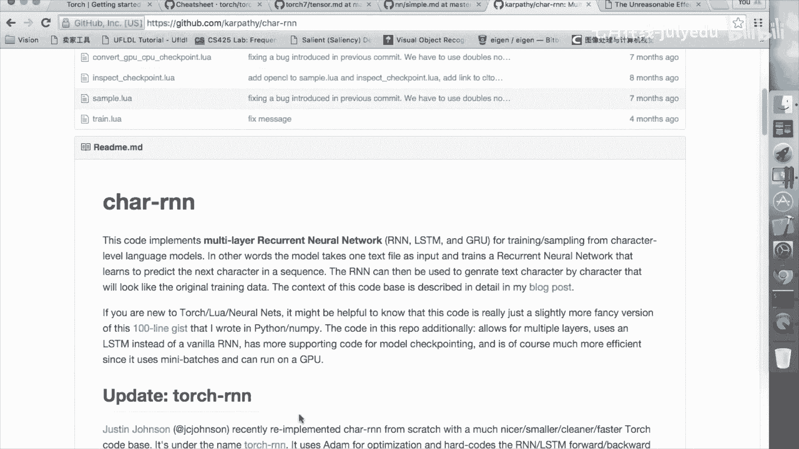

那。刚才介绍了这个吗？套起的又一个的特点啊。还有。丰富的。开源软件啊，就是有丰富的这种。以及人家做好的工程，你可以拿来学习和参考的。啊。这样的呃。工程啊很有意思，对吧？那通过这些呢。

优秀的这些开源软件呢，你可以迅速的。进入到深度学习一些比较有意思的一些领域。一些点啊，我们可以再看一下这个。

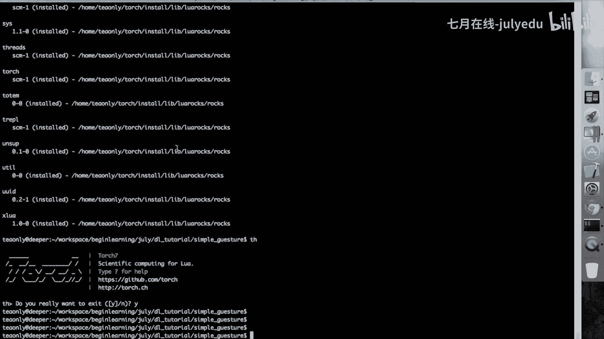

哦，前面都是举的这都是一些比较有意思的一些例子啊，工程例子。当然我们也可以看一下。学术界、政治和工业界正儿八经，他们用套起做的一些事情啊，我们可以看看这个这个。拓弃网站上的这个bb这一项。

那因为呢pch这背后的使用者呢，有大量的人呢是存在这个啊。可以看一下okK。ok比较稍微网络比较差一点点。ok出来。主要是什么人呢？那么。呃 who are we。啊，那么主要是。

那么主要的维护者呢是facebook的facebook啊以及这个google的deep mind啊，他们这些人呢啊大家看到这些如果大家去看这些都可以是经常能收到他们的论文的人啊。

他们是也是活跃在这个学术与工业界的一线的这些研究者啊，由他们来维护这个工具，主要是主要的两个贡献。我们可以看到就是就是facebook啊。

一个是google的dep mind啊对 one达都手阿尔法 go就是这个。就是这家公司开发的啊ok。正是因为如此呢，所以说。我们可以看到呢，这个用toch一样也会用在一些学术的。学术的这种圈子里面啊。

比如说。呃，最近这个最流行的这个长插网络，对吧？那OK那face可呢很快也就给出了一个。啊，他很快就会给出一个自己的实线啊，大家可以看到是在这。

这是facebook开开开放出来的这个用tor做的啊长插网络的训练啊呃大家也可以去通过这些这些工程啊，比如说长插网络啊，再比如说像啊很有名的一个。对抗网络的一个一个一个一个一个工程啊。

这些呢同也是用也可以用这种套气啊，去跟踪目前一些最深度学习领域，一些最新的啊一些模型，一些算法啊，比如说我举了两个例子，一个是长插网络啊，然后一个是对抗网络啊。

都是那在这个领这些领域的这些学者或者工业界的这些。科学家们也用套析作为工具啊来进行这个深度学习的研究啊，那okK那举得这么多例子啊，最后我们来这个。

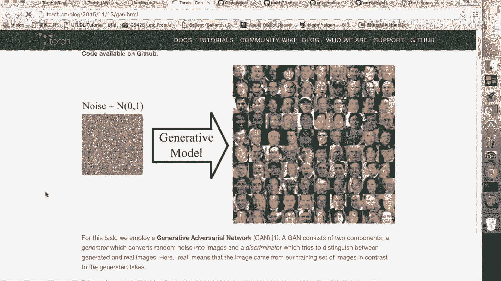

评价一下这个to析。就说。我自己的观点，他非常适合深度学习的初学者以及入门。啊，同时他也是本身也是个不错的一个。工具啊。当然了也有台，但是啊也我们也说下他这个一些不足之处了。第一，他用的是这个。呃。

这个撸啊。如话语为我先呃。因为它这一款这是一个。还有用撸外语言其实是一个非常好的，它也广泛的用在这个互联网啊互联网领域。比如说这个最有名的一个eng的一个扩展啊，open rest P是吧？

这个就是卢尔开发的。🤧嗯。那这是它的一个小众的个地方啊，不像别的。库啊绝大多数库呢用的都是这个python啊，他呢选择了如啊，这是他的一个一个呃跟别人比啊。

不是那么那么那么那么那么突出的一个一个一个一个点啊，那还有一个呢toch和卡费呢。那么都是使用的。我们刚才给大家演示过啊，就是说。都是基于这个层的啊，我们可你看神经网络有多少度啊，它都是一个个组件啊。

每一个组件呢每一个层呢都有这个固定的一些函数啊，是基于layer的，就是是就是说。

他不是像这个。这个现在更加技术上更加怎么说呢？应该说理念更加好的一个就是。基于符号计算的啊，我们可以看一下这个。

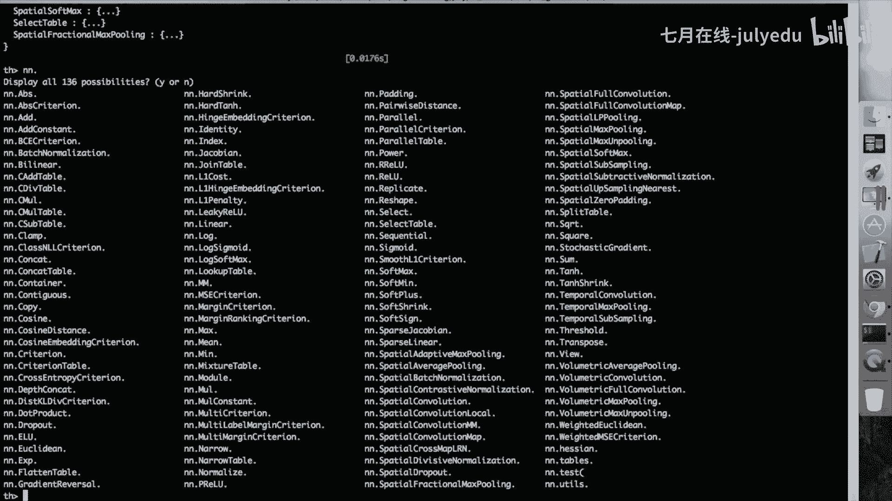

呃，这个tensor flow的这种。

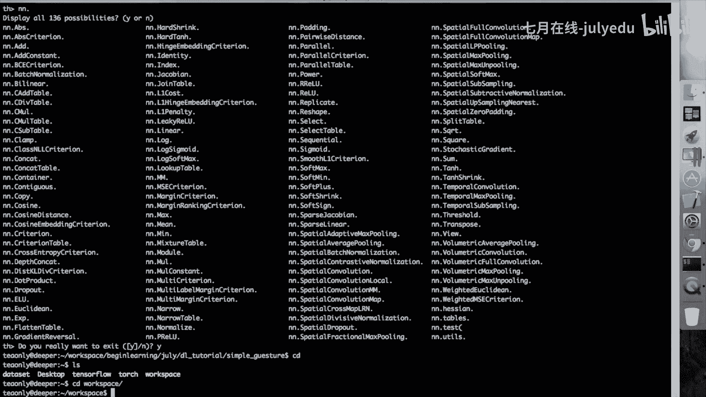

这种一个举举一个最简单的例子给大家。

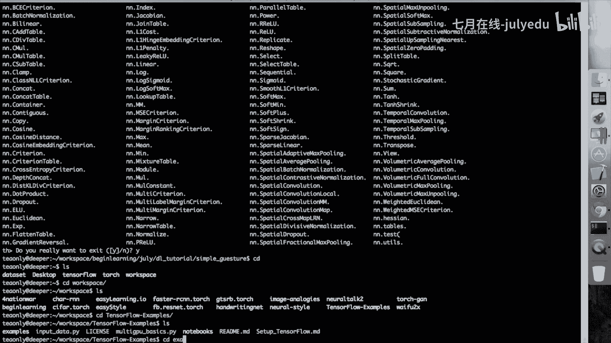

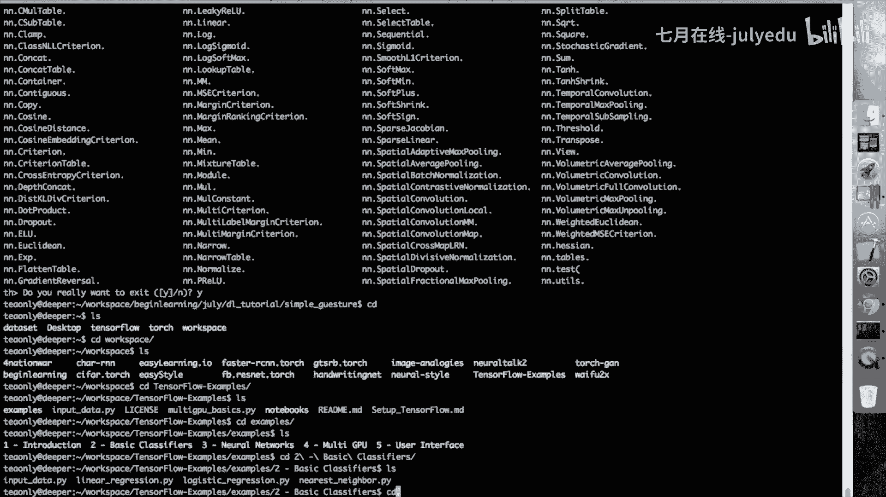

好了，举一个最简案例到这里。我们可以看一下啊，待会就给大家一个。

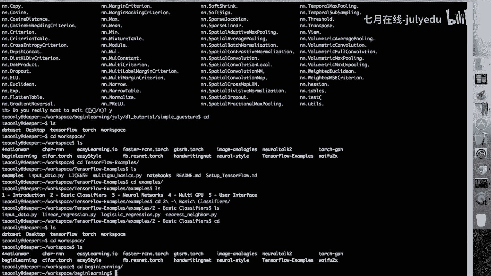

一个。

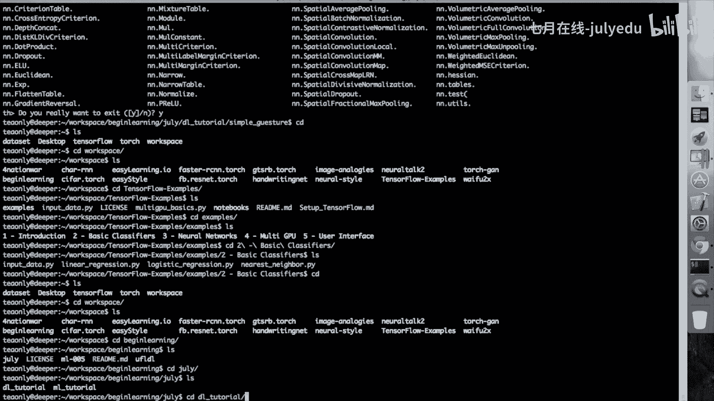

嗯，在？

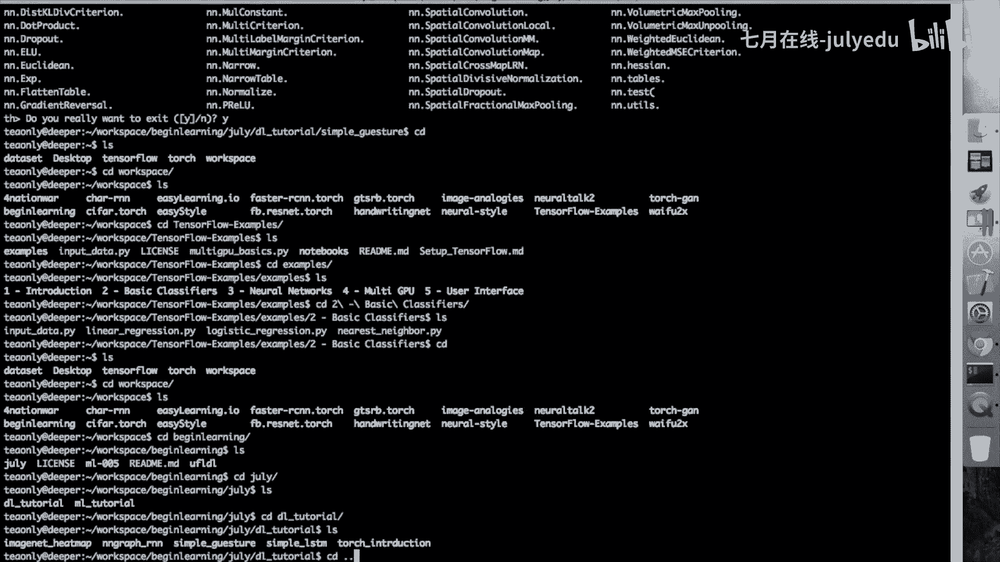

Okay。哦，我知道了，不好意思，再等一下啊。

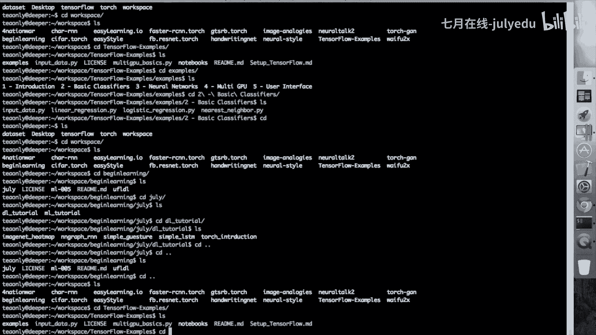

OK我们看一下tensor floor的这种例子啊。给大家对比一下。

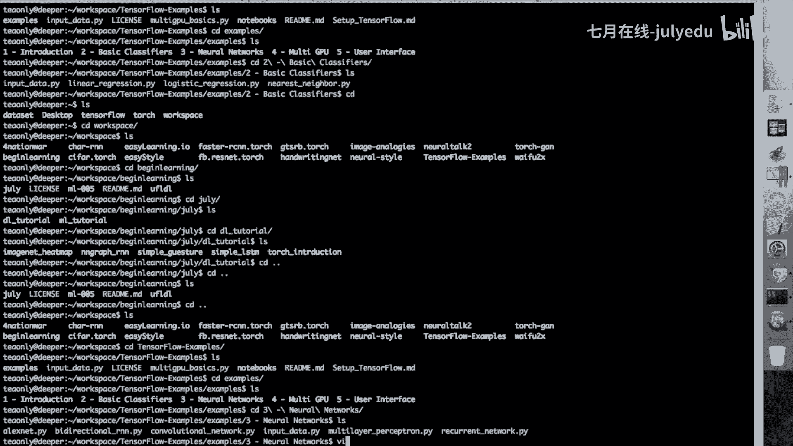

啊，Otensorflow的例子呢是这样子，它所有的。

并不是基于成的概念啊，我们会看到这个最后这个所有的网络呢。

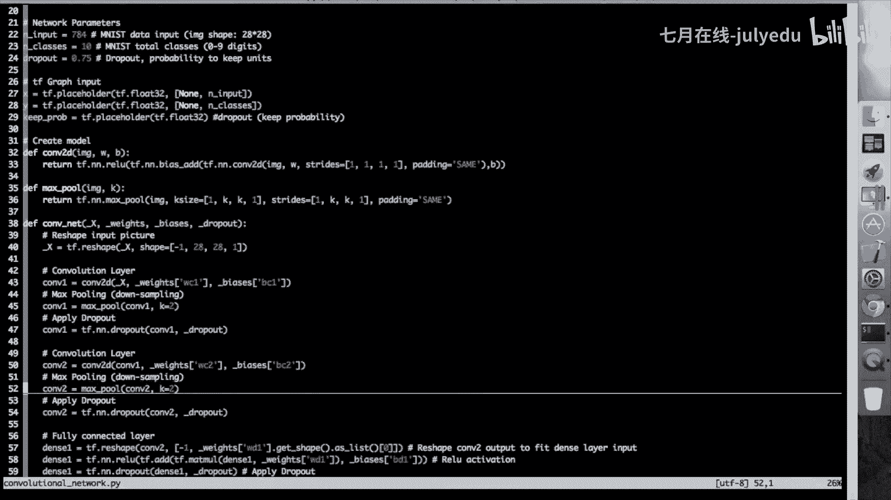

啊，这个X其变量啊都是事先啊都是不知道的啊，就说是一个符号的啊，是一个未知的。但是呢它通过串在一起一个计算的一个。

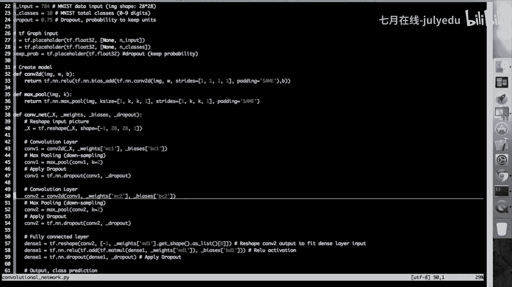

呃，我们它叫做graph这样的一个东西。最后通过通过一个comppier的过程，生成一个最后你要的神经网络的这个计算的这个实际的代码啊，这种理念呢跟我们今天介绍的torch呢是完全两种啊。

所以我建议大家呢。

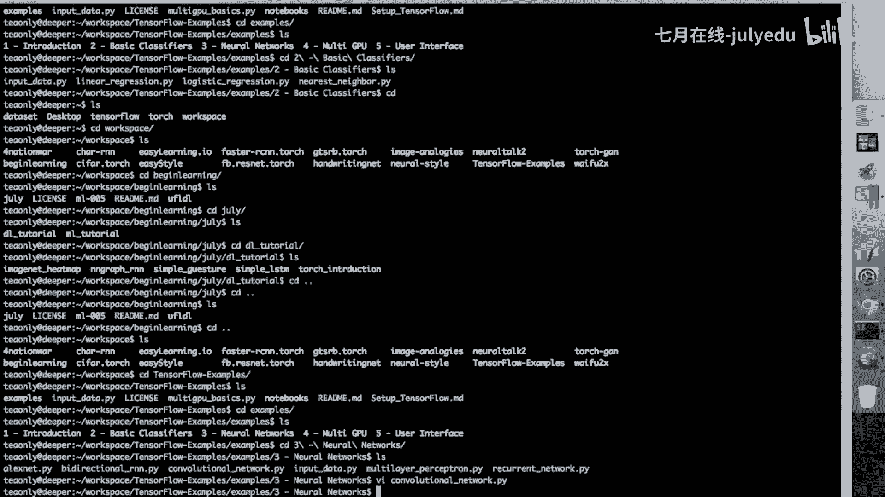

通过套起。掌握。入门啊，然后呢接下来可以去学习一下tenorflow啊，类似于sno这样子的基于符号的。我相信。啊，这两种风格啊，如果说。都接触和掌握的话啊，会对这种。啊，这个至少在学习框架上。

在这种深度学习框架上啊，会有一个更深更好的这样子的一个啊理解啊，这是我的一个简单的一个自己个人的一个建议。好，那今天我们再回顾一下啊，我们介绍了套起是一个什么东西，对吧？

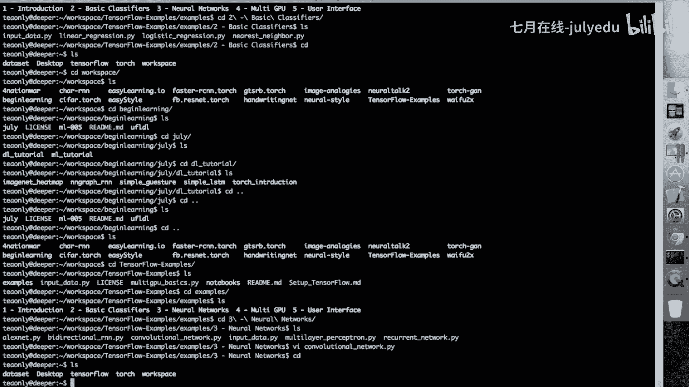

这个我们看到这是toch的主要的网站，对吧？我们简啊，然后呢。

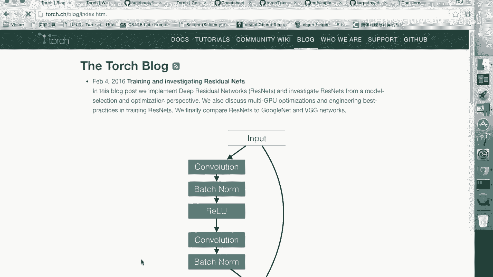

我给我们给大家介绍了一下这个toch提供了什么样的一种。开发工具啊，它有一个交互式的开发工具啊，它有一个。可视化的工具啊，同时它又有一些。各种各样的第三方的库啊，同再呢。

我又介绍了一些基于套系的很有趣的一些也非常有名的一些。开用软件啊。很容易吸起大家引起大家兴趣的一些开源软件啊，然后呢我们在最后呢再给大家介绍一下这种to起的这个。思路啊以及这个基于符号计算的一个思路。

就以t flow作为一个例子。那今天的这个介绍呢就结束到此为止，谢谢大家。

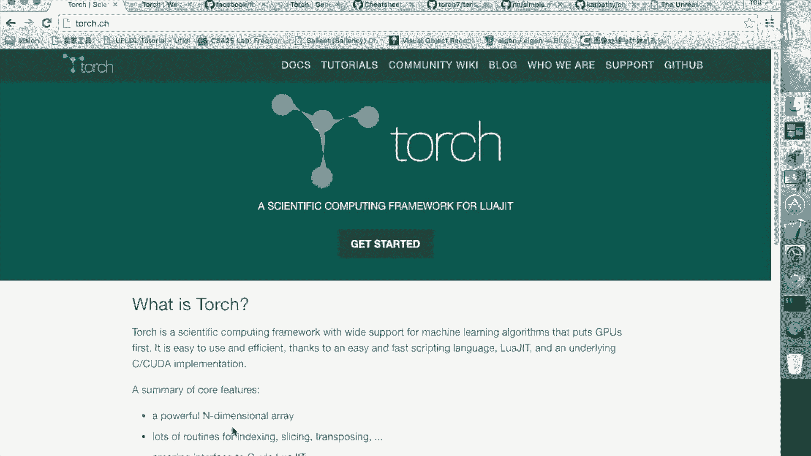

