# 人工智能—深度学习公开课（七月在线出品） - P5：基于序列到序列的深度学习机器翻译系统 - 七月在线-julyedu - BV1EW411K7Mw

然后我们我们做的第一步事情呢，我就是想要把单词变成one hot vector。这步就是其实相当于是一部prepro的过程，对吧？然后当我拿到了一堆数字了之后呢。

我就可以把这堆数字我就可以进行training了，是吧？我就后面其实就是training。trainining是怎么样的？就是我们fe the training data into the。

Into the models。其实所以说我前面其实还有一步，我应该要先把我应该要先写这个model是吧？没的。Encoder， decoder。Moel。然后我training的时候呢。

我就是要把这堆数据传进我的models，然后传进这堆models之后。有人有人问在哪看，我们正在直播呢，就是有没有人告诉他在哪。

trainining feeds the training data into the models。然后呢，我们会。我我们把这堆训练数据输进去之后呢。你输进去了之后，模型会给你输出一个翻译的结果。

但是你要知道那个翻译的结果好不好，那所以我们需要定义一个los function是吧？所以我们需要写一个los function。然后有了这个lo之后呢。

我们应该要做braredient disscent，就这个是。最常用的。graredient descent gradient descent是最最常用的deep learning做法。

反正碰到什么问题，graredency decent，然后我们就可以把这个los降下来。然后降了这个lo之后呢呃我们。后面我们应该要evaluate什么？evaluate on development。

就我们这边有3个set，一个叫train，一个叫test，一个叫d。就是train是用来训练的，大夫是用来做评估的test呢是你看不到的，是应该是在现实生活中应用的情况。但是我我现在还是给大家看到。

因为我们我们反正就这么几个数据器嘛，所以所以这个是一个大致的思路是来，然后我们evaluate on development setand keep the model。With。不。

Best performance。OnDe set。所以我们一般会把develop在development set上面表现最好的那个模型存在来用作用作测试。然后最后比如说test。

然后除了test之外呢，我们还可以做一下translate。因为我们刚才的那些test呢，其实我待会儿会提到这个test跟translate其实还是不太一样。所以我们现在就我们就可以开始一步一步写了。

啊，那我们我们现在有了这样一个。我们就从头开始写，这个这个是我我写的这个代码的大致一个框架，就是反正是pyython的一个框架。我相信大家应该都挺熟的。

就是呃if name is equal to name，然 will get。conconfig我这边有一个configud file，它会take一堆 configurationfiguration。

我们一会儿再把它填上去。填填看有哪些configuration要填。然后这边呢嗯我的 main function是。main function就是处理我大部分的事情，我们一会儿还会建一些别的文件。

我们就从m开始起。那我现在。拿到了一个ma影文件之后，我第一步要做的事情什么呢？我先想把我所有的。第一步的事情就像我们说的prepro，我先得把数据给读进。我们先把数据给读进来看一看。

怎么样读这堆数据进来呢？嗯。那我们就可以。还还是一样的，就每次做一个工程项目的时候，我们先从大的地方开始考虑，再从小的地方开。就因为我们我刚才我刚才拿到了一个呃，我给大家看过这个文件长什么样子。

就这个defin meaning它是一句英文，一句中文。那我现在要干的事情呢，我就想把英文跟中文的句子都拿进来，那我要怎么拿呢？我可以这个functionction我还没有写，我可以一会儿想建一个。

我我我一会儿可以想象一下，我要写一个utils这个这个fi，然后它有一个functionction叫做load data。那load data呢，他会把我的training data全部都拿进来。

然后他应该t一个priit，我们 take个一个什么primeter。嗯，我就我就随便假设我们现在take parametermeter叫train file。

就是说我有一个primeter叫做train filetrain file这个文件呢就是这个functionction就能把你所有的data都读进来。我现在还没有写这个functionction。

等我们先先把它写上。呃，然后我们怎么样写这个，我既然要拿这个config呢，我就要把这个confit给他。我就要把这个configuration给它写进去。

那我可以加一个嗯关于我现在到这个confit file里面呢，我去写一些关于关于training data的东西。那我可以写pasard点ad argument。不知道大家熟不熟悉这个paser。

但反正他基本上我一写大家应该就明白了他干的事情呢就是take几个。呃，我我现在就第一个pri叫做train file，对吧？然后它的type呢是一个train，然后它的default value。

我就写它等于non，因为我每次都会pass一个进去，然后他还会diplay一个help help information。比如说我写一个。我就写个简单一点training fun。那我们现在呃。然后呢。

我这个load发 load data这个这个东西呢，它是从util里面进来。所以我现在要新建一个文件夹叫做untails。

我把它存下来叫做untails点P完这个这个文件呢就专门做一些写一些辅助性的方式，就是它不是不是整个框架，但是它是一些辅助性的内容，我这里要写我这里要先要写一个方式叫做load data是吗？

loadad data它干一个什么事情呢？它take一个str，这个in file呢是一个str，就表示这个文件名，我要从这个文件名里面把中英文全部都拿进来。我怎么样把中英文全部都拿进来呢？

我们就跟着大家一起写一下啊。我可以想象，我最后拿到的呢，我希望我能够拿到一段英文一段中文。比如english它是一段一对一段array，然后这个是chinese，它也是一段。然后这两个。

我就我这个这两个这两个ar我都要从都要从这个in file里面去拿。Read S。我就从这个F里面去拿这个文件，然后我写说。Line。一。😊，line等于line点。

我们想象一下一个line它长什么样子。我们回顾一下这个line它是长这个样子的，就是一句英文，一句中文中间是一个这里我可以告诉大家，它中间是一个t键，t键就是一个back slash t，对吧？

所以我先把它用strip，把头尾头尾如果有一些垃圾信息，我把它除掉。然后我给它split用这个tab键来splitsplit出来之后呢，我这个line就变成了两部分甩。line的第一个部分呢。

来第一个部分应该是一个一段英文，对吧？line的第二个部分。第二个部分是一段中文。那我这个英文呢，我就要把它append到英文里面去，对？Indian app。那我们先不管，我先这样，我先这样写着再说。

我先把英文跟中文都加进去，我们看一看这样是不是work。点看。然后我这里在return演眼，那我现在是不是应该拿到了一堆一堆英文跟中文的信息呢？其实这个方式如果在linux上跑，应该是OK的。但是。

非常遗憾的一点是我发现在在。在windows上面这样跑，它会爆错。因为我这里要拿进来的是中文，我一定要用这个把encoing。等于1TF8给他写进去。大家可以不用管这些细节，我们主要考虑大的。

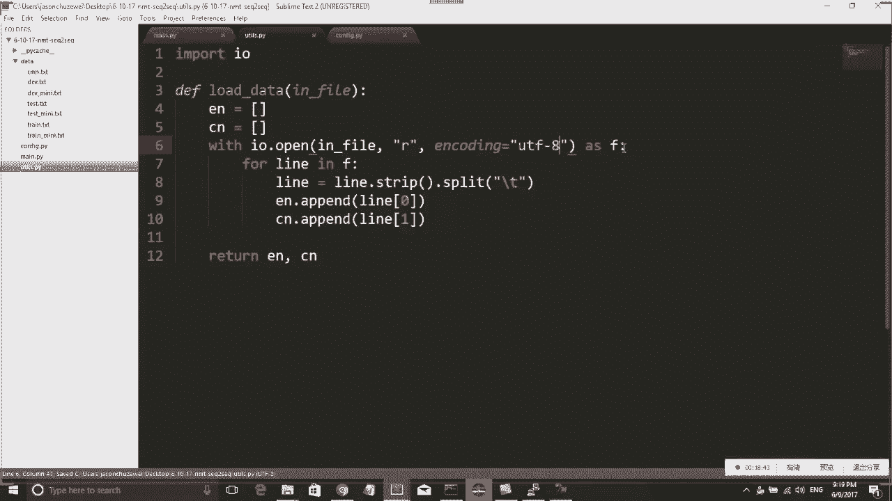

就这样这样在windows上面应该是可以跑的。好，然后然后我现在在在我的这个windows上面了，我现在有这个ma是吧，那我现在可以跑一下pyython。然后它带一个参数是吧，tree file。

trainin file应该是什么呢？我这边应该是datatrain。迷你。Dot。我这个文件叫什么名字？我要看一眼叫train many dotTXT对吧？

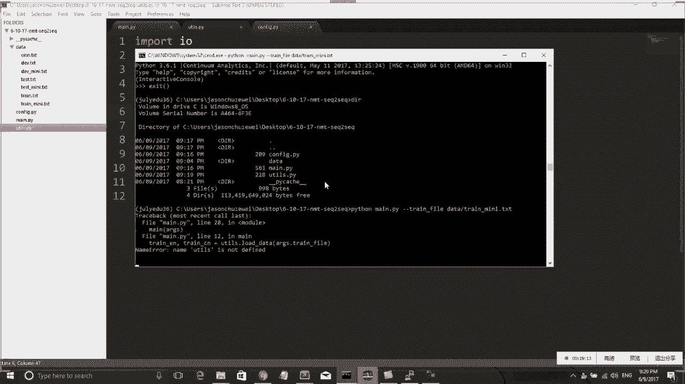

我们可以看一下，okK他说name uil is not，为什么呢？因为我这个地方忘了ininport这个unils。command能不能放大，让我看一下，应该是可以的。我来放大一下它。

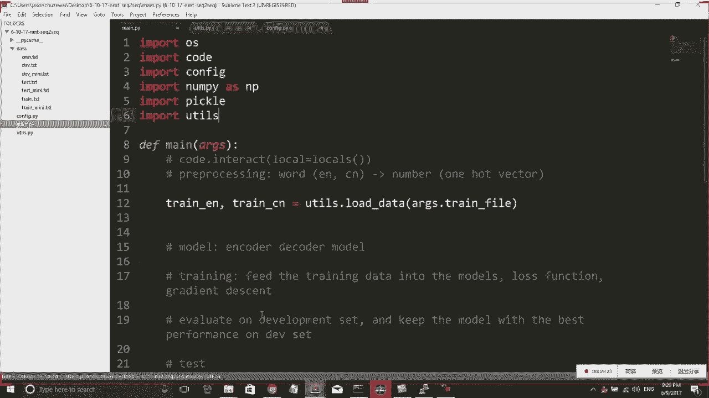

Addbit。properties，然后 font。

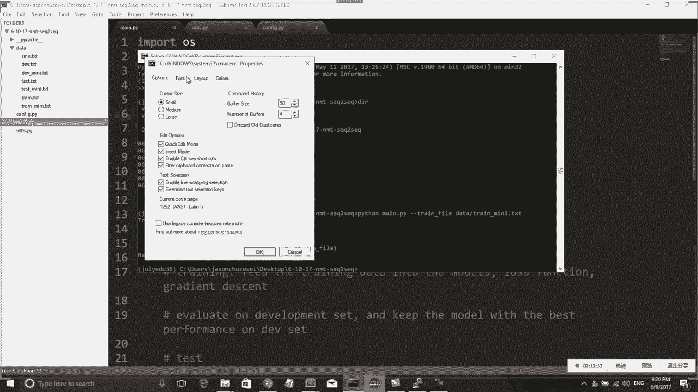

这样够大了。

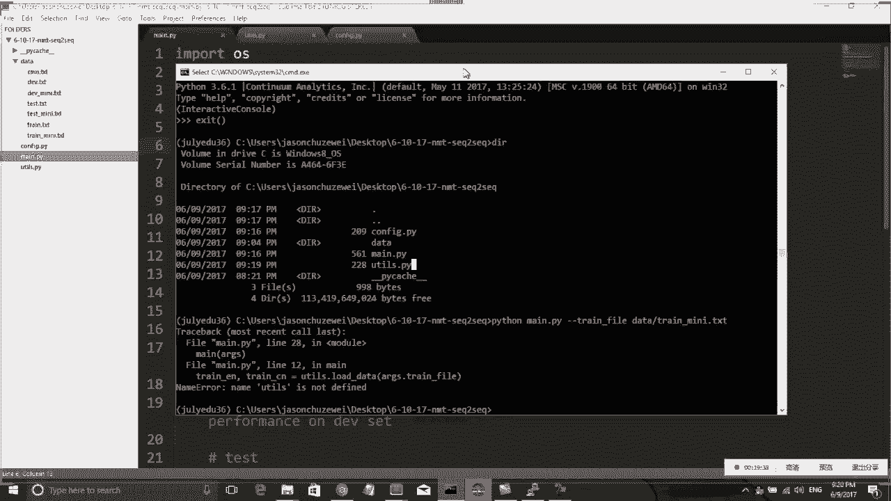

或者我还再调大一点。Addit。Properties。

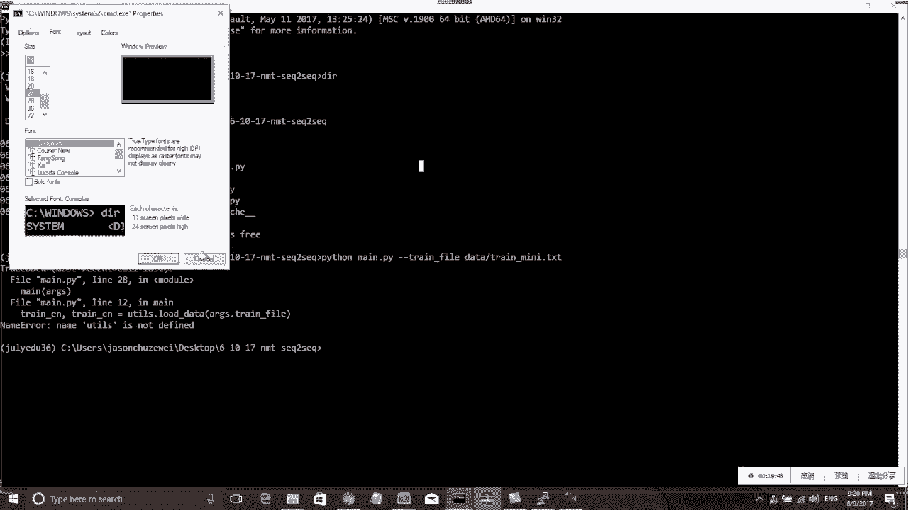

这样应该可以了吧。相信应该可以了，可能拿着手机看他会觉得有点像。嗯，然后我现在就是在这个文件下面，然后我现在在跑一下python train mini，然后发生什么呢？啊，马上就结束了，因为我没有停。

我没有停下这个城市。那我应该要在这个城市的中间某个地方停一下，怎么样停呢？我一般都是用这个方法来停的，就是code。

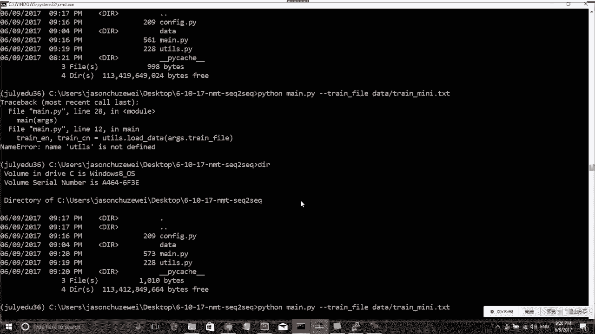

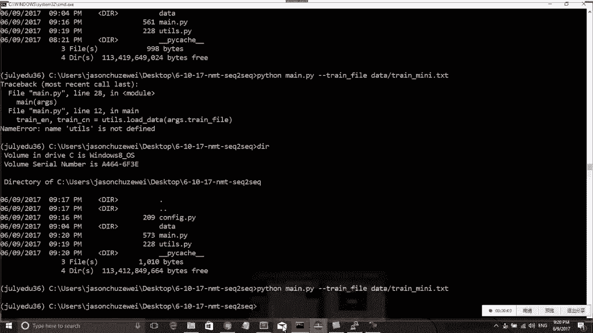

用用这个code点interact，然后把把它从这个地方停掉。就这样会拍松会停在这个地方。

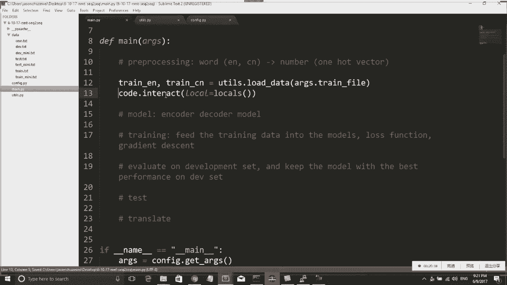

那我们现在看停下来之后变成什么，我可以我可以inpect一下中间到底发生了什么事情。我这里有一个trainE有一个train train CN。

那我们看一下这个train EN跟train CN到底是什么。我看一下train EN它就变成了一个list是吧？我们看一下trainE它是一个它反回一个list没有问题。那trainE它是这么多英文。

然后trainEN0它是一句话，然后一也是一句话，它就是一句句话是吧？那这个就应该跟我想象的没有什么区别。然后train CN变成了一堆一堆看不清楚的东西。

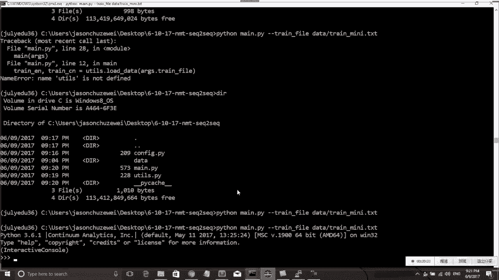

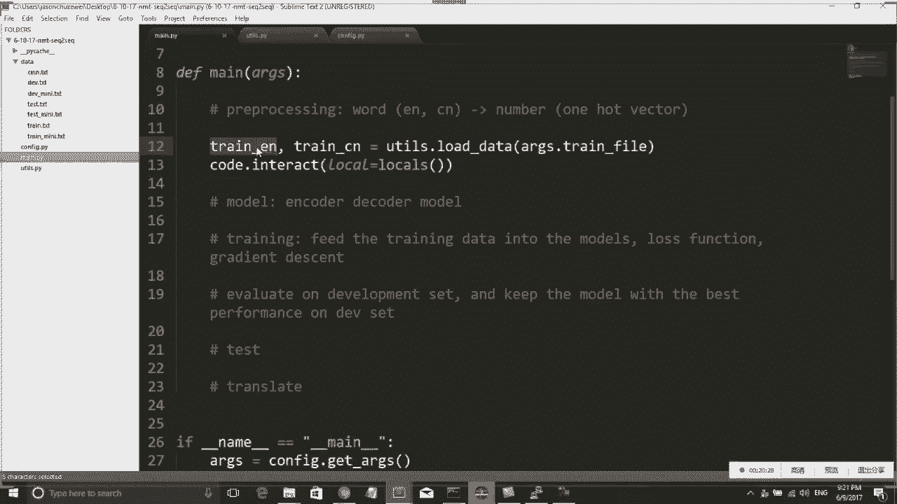

但没有关系，因为我们现在是在windows上面，在windows上面有一些稀奇古怪。可能我这里没有弄好。对我们先不管。因为到时候我们会在linux上测试。

我刚刚测试是OK的那我们现在呃思考一下这样有没有问题呢？那还是有有那么一点点问题，因为我现在我现在不想要一堆str，我们还是回到这个train页。就现在他给你的是一堆str，对吧？一堆一堆字符串。

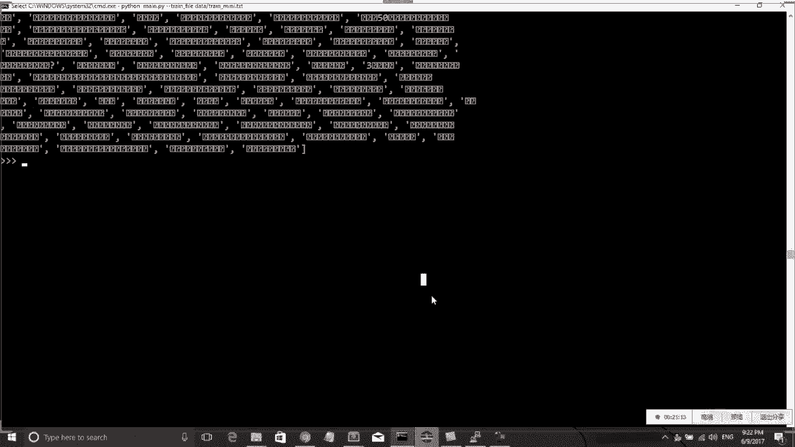

这一对字符串呢嗯。我们。我现在不想要这样一堆字符串，我想把它一个个单词拆开来，拆开来看。那我现在其实拆开拆开很容易，对吧？我就把。我这边会用1个NLTK这个 packageage来把把这些词都给分了。

嗯，import因为。因为英文的分词并不是那么straight forward。比如你一个句号直接连在一个单词后面，它这这些词应该是拆开的。然后这个NLTK呢，它就可以帮我。

wordor tokenize，他可以帮我把这些词全部都分成一个一个。然后除了这个一个一个的词之后呢，我还想要在前后给它加上1个BOS跟EOS就这两个是是一个我特殊加上去的字符。其实你可能不用加BOS。

但是我们这边把BOSEOS是一定要加的。因为你EOS不加的话。到了最后那个。呃，尤其是在你翻译的那个target sentence那个EOS是必须要加EOS表示。sentence吧？

就是我这个中文后面呢必须要加个EOS上去。就这样才可以。把这个啊我这里打错了，这边应该是BOS就是我给他都加个BOSEOS上去，就这样这样才可以把它都。把这些词都分开。那我们现在再再看一下。

现在现在如果跑出来什么样子，我先退出，然后我再跑一次。再跑一次之后呢。OK他跟我说啊，我这里还有一个问题。还有还有一个小bug。怎么呢？因为我没有把这个我没有把这个中文给分开。

中文的分词呢我觉得就比较简单粗暴的分一下就行了。我直接把它每一个charact都分出来。就直接。

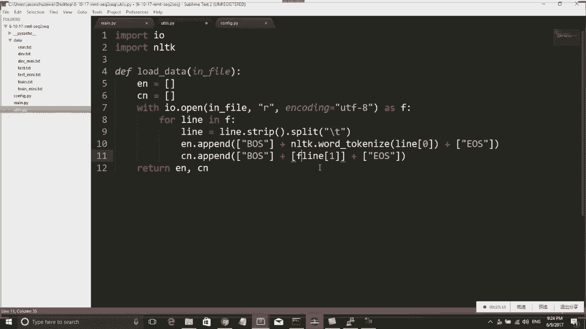

C for CE这个我就把中文词全都给给它分开算。那我把中文词全部分开之后呢。我现在再看一下trainEM，那trainEM就全部都分开了。这些我们随便挑一个出来。

它的第零个就变BOSanone can do that然后US那这个就是表示呃。我们就已经分词分好了。那分完了这堆词之后呢，我下一步要干的事情是我要把我现在拿到的还是一堆单词。

但是我的目标呢我的目标是我要拿到一堆。

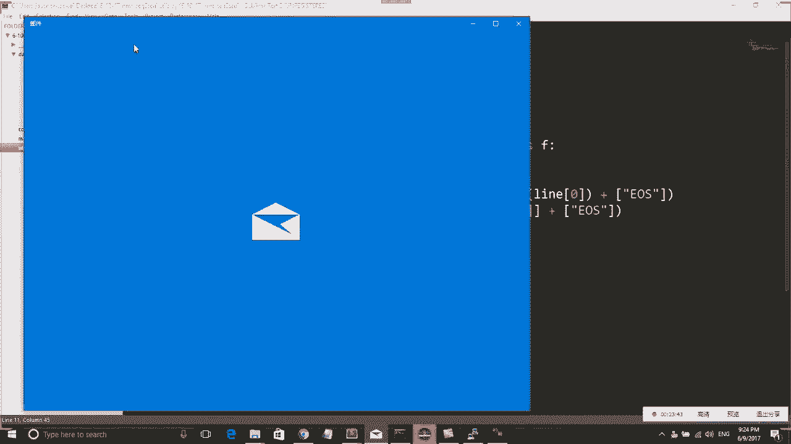

我最终应该想要拿到的是一堆数字，对吧？我不想要这么一堆单词，那怎么样拿到一堆数字呢？首先我们需要有一个dictionary。最后翻译效果可能不行，应该有一些有一些更好的方法。但。这个只是演示而已。

就我们今天的模型是最简单的new machine translation。嗯。所以。对，我们今今天就讲讲这个大大体上，后面大家有各种方法可以去下。然后我们呃接着讲下一步呢。

我是想要我现在已经拿到了train，那我d也可以拿进来，对吧？dave也。跟这个。CN就等于tailstar load data。Ak stop。那既然有这个de file的话，我们是不是应该。

是不是应该在confit里面再加一条把de file。这个就比较容易了。我把上面的代码去copy，copy完了之后呢，我们就可以。那这样就可以把 that file用作 parameter。

Develop。It fine。然后我现在有train filede file，然后后面呢我我还要把这个有多少个train，多少个de也存在。

Number of train equal to length of。d是用来干嘛的？d size就是用来做。因为你你在训练模型的时候，你是拿不到test testest data。

拿不到test data就d夫是相当于给你t的一个。给你评估你模型效果的一个东西。就你最终因为training data容易over分析，这个其实是一个基本的machine learning的。

Once。不能不能算交叉验证的，这只是一个交叉验证，是不是cross validationation，就这个只是一个单纯的validation，就是个validation。它是验证你这个模型的好坏。

因为你这training size，你很容易over分析。你即使trainingtraining error变成0，你的那个准确率是百分之百，到时候到了真正的这个实际的实际的数据当中去一测试。

发现效果又很差，这个是非常正常的。嗯。好，那我们然后接着讲后面呢我现在我下一步要做的事情呢，我想要bu一个 dictionary。因为我要把每一个单词都给它incode成一个数字，啊，一一个数字，对吧？

比如说我的EOS变成0，比如说我这个我现我现在这边看到什么anyone can do that，我比如说变成18502，就是这要变成一个这样incode encodecode成的方式。

所以我下面要写一个function。这个functionction呢，它可以帮我incode这个东西。我怎么写呢？我可以把中令文分开。分开一扣。In total。

简单来说就是我想拿到一个dictionary，然后这个dictionary呢它应该大致是长这个样子的build dictionary。できて就新。然后。

我把这个training的english拿进去bu dictionary，因为因为我只有training，就是这个里面就是要考虑到，如果有如果有不认识的单词，我们是把它map到 unknown。

所以我现在在util里面要写一个 function叫做bud date。那bud date怎么写呢？啊，我我其实death build date build date，他干了一件事情。他干的事情呢就是。

他 take了一堆 sentences，对吧？然后呢，他还要take一个pri叫max。其实在这里无所谓，我就不写，不写这个m。然后。😊，这个dictionary要怎么怎么bud呢？

因为我们我们再回过去看一下，我现在拿到了一堆数据啊，它就是一堆一堆array，每一个array都是一堆单词。那我其实就是扫一遍这类单词就行了，我就写for sentence。In sentences。

对吧这个每一个sence是不是都是一个array啊，就我这个 sentenceence是有一堆句子，每一个sence呢是一个句子，每一个句子呢其实是一堆单词。

那我可以写for word in sentence。然后我想有一个类似于word count一样的东西。呃，work count是一个什么东西呢？

word count是一个类似于 dictionary的一个西。那我们这里要把它做成一个counter就行。counter是什么东西。那如果不知道这个东西呢，我我正好今天给大家介绍一下。

就这个counter是一个。他是呃from collections import counter。就这个collections里面带一个counter这样一个object。

这这个东西是用来用来技术非常好的一个东西。所以你现在这个word count呢，它就变成了一个呃表示每一个单词出现了几遍。因为很多时候呢。

我们希望把就是你你如果在在一个真实的数据上训练这个单词量可能太大了，所以你可能会想把最重要的一些单词保留下来。最重要的一些单词，也就是最频繁的一些单词保留下来。也就是比如说most。康门。

我就想把最重最频繁出现的这些单词。请架，然后最频繁出现那些单词怎么样？我这里就再加一个。max words equal就5万好了，就如果超过5万个呢，变了S是什么意思？好，sorry，我打错了。

这个应该是word。或者这里都打成S吧，其实就是打错了。对 word count us。好，我们接着讲，然后我就把最我就把头头5万个最频繁的单子给他存下来。存下来之后呢，但是我们一共有多少个单词呢？

我们要知道我一共的单词其实是其实是我的land of L还要加上一，为什么要加上一？因为你你训练的时候，这个dictionary build，但是你在测试的时候，有一些单词可能是不存在，就是on。

所以这个单词你一定要给它留下。所以我最后的这个word date呢。就是我我需要返回一个dictionary，这个dictionary它怎么写呢？它应该是我大概要这样写for index。word。

In enumerate。L就是我erate一下这个我刚刚拿到的这个L是一个相当于是一个collection。一样的东西吧，然后我需要把它的W0W0其实是那个单词，然后这个index加一呢。

这个in这个ennumererate是从零开始的是吧？所以我把这个index是从一开始的一个东。所以我把这些单词从从平凡到不平凡开始，从一从一向下盈扣的。然后呢，我还单独留一个word date。这个。

我给他留一个暗k。un就是表示un words是吧？就这个un word，我也给它我把它直接留到零这个数字上面去。然后我 return word date。你称word date。

还有total words，就这个是word count，对吧？所以我这边m里面呢我想接两个我想接两个。两个东西，一个是。接两个变量回来，这两个变量一个是。一个是这个dictionary。

另外一个呢是我english的 total。然后既然有英语呢，我们也想有中文，对吧？中文就是。中文的写法完全是一样，就我这个functionction可以可以英文也可以用，中文也可以用，是吧？

trainCN就行了。那就变成了中文，然后这个地方也变成了CNCN told的 words，然后CN dictionary。那这样之后呢。我就我就拿到了X点。抽了，我为什么要把它存下来？

所以in total words，然后我可以把这个存下来。CN total words等于CN total words。好，这样我就拿到了一堆dictionary。

我们看一下这个dictionary长什么样子，就到这个地方又可以跑一下这个城市的地方。O他又告诉我有错。Expected stream， by or O S path like。

 not non type。OK因为因为我这个我少写我少传了一个参数给他，我还没有把这个de data给他拿进去。

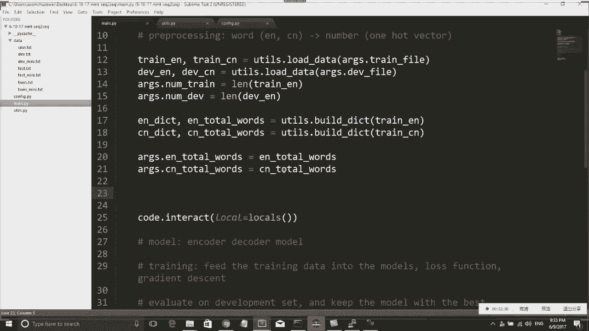

De fight。稍微小一点，就这样吧。de file应该是。应该是datade minii dotTXT。就是拿传两个参数进去，然后我们看一下现在效果怎么样。现在train enlish没有问题。

然后d enlish也没有问题，然后in dictionary也没有问题。你看这些就变成了一堆 dictionary是吧？english就每个单词都给它map到了一个数字。

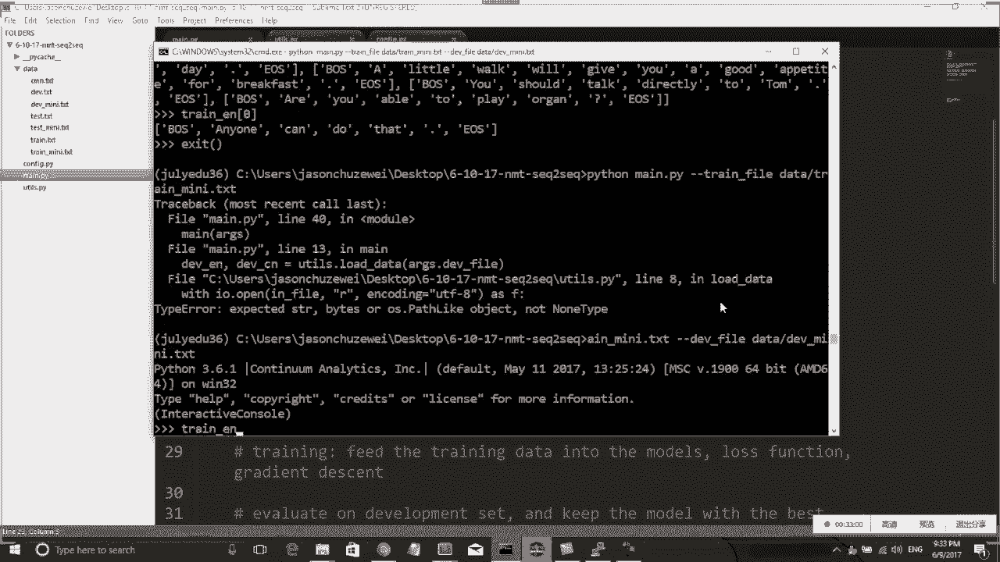

比如我们可以看一下，我们可以看一下indict。有没有apple？apple是601对吧？比如说本案。啊，没有这个单词。对，因为我们训练数据比较小，所以很多单词可能找不到。那看起来O看起来O的话呢。

那我们就继续写。对我平时写屏就是这样，一般啊写一段跑一段写一段一。那我们继续看，现在已经拿到了，我已经拿到了我要的字典，我也拿到了。我要的所有的单词，那现在剩下来就是一步。

剩下来的一步就是我要把我要把train的 enlish。我要打Elish和。所你的CM全部都incode一下。incode干的事情其实就是做一个m。我要把我要把这些单词都变成。单词都变成数字。

然后我有一个indict和一个CN dict。然后这样就是我可以拿到我的traine enlish跟。train验这个这一步呢我稍微写加一个comment。

encode the words into numbers。就我这样是要把正式把我的这些单词全部都变成数字了。那我们继续看，我现在就要写这个functionctionin code，对吧？

这个incode function写什么样子呢？我继续把它回到这个youtu里面去写。De。那这个要怎么写呢？我们可以思考一下。这个train定这样不太好，我就我就给他写一 sentences吧。

然后这个是CN sentences。我们回顾一下in sentences跟CN sentence长什么样。就in sentences，它是一堆。一句话是吧？会不会两个单词对应的数字相同不会相同啊。

因为我这个地方。你思考一下我这个地方，因为这个这个word count，它是一个给每个单词数了一下。然后我这边是便利word count出来的，所以它。每个单词都会给。如果同样的单词它会被m到一起去嘛。

就不会不会出现两个单词。所以这个不是问题。嗯，然后我们再回过来考虑。我现在呃。说到哪儿了？对我们回过来思考一下这个ins sentences长什么样子。in sentences它是它就是一堆句子是吧？

就这个东西它是一堆一堆句子。每一个句子呢是一堆单词，我现在相当于要给它in扣一下，怎么样in扣的呢？怎么样用code？我们可以先给。我们可以先给每一个呃句子。先先给句子。我们可以这样做。我大致。

大致上要做的是一件什么样的事情呢？我我我肯定是要写一个for路，相当于for i in range，比如说lan这样一个东西，就是我我这个in sentence是一个比较长的一对一堆字母串是吧？

然后我就要嗯先便历一下，便历一下english和chinese，两个都遍历一下。然后这个english sequence，它应该会变成相当于这样一个东西。他应该熟悉这个写法。

我们比如说forW in in。Sentences。对吧然后 in sentences呢。in sentences是一个一个句子而是一堆句子。然后in sentences I那是DI句子。

然后比如DI句子里面的每一个单词W，我们都想要把它incode成一个数字，那我就可以写ind Wif W。indext如果他不在indext里面呢，我是不是要把它map上那个。因为如果他不在。

他如果他是一个un word，就这个零表示它是un word是吧？所以这个就是我们incode一个一个句子的方法。就我把这个句子里面的每一个单词都给它incode出来。然后同样的。

同样的中文中文也是要一样的，就我为什么总是要把中文跟英文放在一起写？因为我要保证他们他们的那个index是对应的。就是这句话这句话的中文呢也对应着那句话的英文。所以我这个I是一定要一起做的。

所以我会把这两个东西放到一起写。那我现在这个in sequenceequ跟CN sequence呢就变成了两个sequence。然后这两个sequence呢，我又想把它放到一个。What。

Sentences点。我想把。我想把in sequenceequence跟。The out sequence。Elish sequence跟。跟chinese sequence一起放进起。

chinese sequence。那我现在是不是这样就这样是不是就可以了？基本上是可以，lesss等于landin sentences。因为这个英文跟中文肯定句子是一样多的，所以这这个land是一样。

然后我要初始化一下out in sentence等于空的。然后这个out cN sentence也等于空的。然后我把这一堆句子都写好之后呢，我后面就可以。Return。O in sentences。好。

C and。嗯，然后这样就可以了。然后我们看我们看一下现在这样是不是可以啊，我们又可以来测试一下。现在来测试一下。啊，然后测试完了之后呢，我看一下现在唇眼长没变成一堆数字是吧？变成一堆数字，非常非常。

好像看起来没有什么毛病，就它它都变成一堆数字。然后你看第一个第一个东西永远都是一，对吧？因为一是个BUS就开头永远都是一大。好，看起来没有什么毛病。但是呢嗯我现在还想做一件事情。

做一件事情就是我想把句子按照从从短到长的顺序排一个序。为什么我要排个序呢？其实这个跟跟到时候我们跑程序的效率有关系。就是你如果我们到最后训练的时候会一个bach一个bach的进行训练。

所以你句子的长短如果差距太大的话呢，这些数对每一个数字代表一个单词，有些有些同学可能稍微有一些疑惑。所以我们再我们稍微慢一点，回过去重新看一下。我我相当于把每一个句每一个单词。

每个单词后面跟的就是就是我我现在把每一个单词变成了一个数字，我构造了一个dictionary。然后这个dictionary呢，它可以把单词map到一个每一个单词map到一个数字上。

然后我们看一下这些单词究竟是什么单词。我可以我如果想知道这个每一个数字分别是哪个单词，数字不是单词数量，不是单词数列的次数，就我这里回过去给你们看一下。

我这个地方写的是index加一 for indexdex w enumerate。我这个唯一干的一件事情呢，其实是我把单词排了个序，就是一个编码是零到多少一个东西，并不是并不是一个数字。呃。

你们可以再思考一下，就这个地方是你看我是inumerate里面出来出现了一个index。这个index只是一个数字而已，并不是表示它出现了频率。

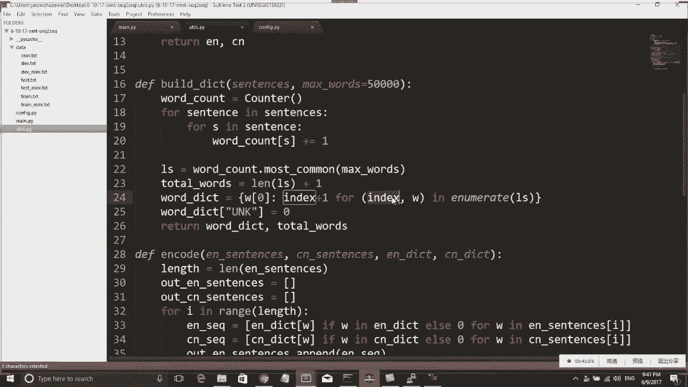

