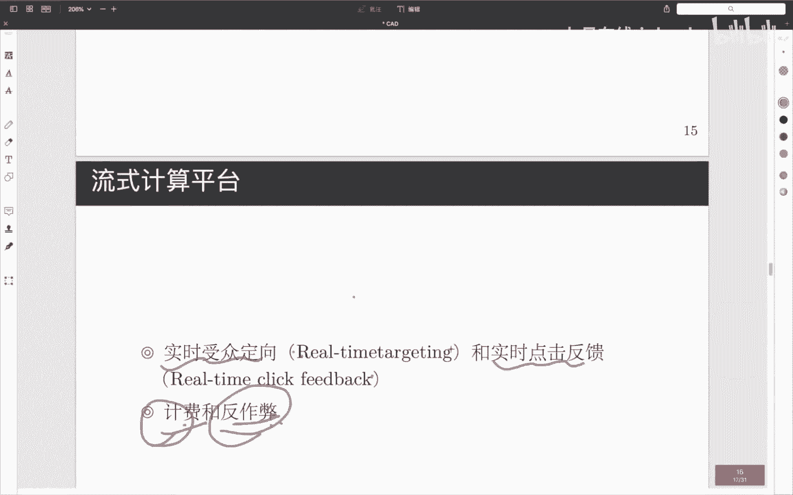
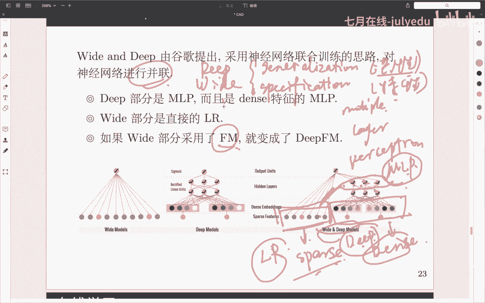

# 人工智能—计算广告公开课（七月在线出品） - P2：计算广告的市场与技术 - 七月在线-julyedu - BV1SA411H7Se

好，那么开始嗯，首先呢就是我们这门课就呃这个公开课呢叫计算广告，对吧？那我们嗯计算广告呢，它其实是一种在线的一种形式。那所以说我们就首先需要了解一下什么叫做在线广告，对吧？那在线广告呢。

其实很不名思义的，就是什么网络广告互联网广告等等之类，直接在媒体投放广告，对吧？嗯我相信大家可能嗯对于在线广告而言呢，还是有点陌生的，嗯，不过你就是说对这个名字比较陌生，但对它的出现呢。

其实应该不是很陌生了，就比如说嗯你在嗯比如说你在官上和一个网站的时候啊，你都有可能看到说底下有一些呃淘宝的一些呃推广的一些链接，对吧？以及说呃你也可能说就哪怕说你在淘宝或者在京端买东西的时候。

你能够看到他们站内自己的一些链接，对吧？这些广告呢其实就是计算广告，再比如说就是一个在线的广告，嗯，再比如说说你再去用百度或者谷歌这些搜索引擎的时候啊，你一定也会在最上面的时候，经常会看到出一些广告。

对吧？呃，百度大家可能看广告看的更多一点。所以说这些呢其实都是一个在线的一个广告。好吧，他们都是一种互联网的广告。那么我们就要讨论一下说在线广告，它和传统网传统的广告有哪些不同，对吧？那传统的广告呢。

其实类似于哪种，就是在机上发传单那种啊，以及说就是呃在电视上啊那种广告，对吧？那我们一般称这种东西呢为传统的一个广告啊，然后呢在线广告呢，它其实呢是有自己的一套新的一套体系的。

它是以互联网的这套技术呢为背景，然后呢，逐渐呃这一二十年来逐渐的一步步的衍生和发展出来的一套呃新的一套体系。啊，那我们计算广告呢就是在在线广告这个东西的基础之上呢，然后呃有了更多的一个发展。

然后呢通过把一些像记忆学习啊，一些计算的一些东西呢，应用到这个广告领域。然后呢，同时为平台方和广告主带来更多的收益。啊，大家可以看到说我们刚才呢我刚才说的两个名字。词呃，一个叫做平台方。啊。

另外一个呢叫做广告主。等会儿呢我们会频繁的提及这两个词汇，这样词汇分别是什么呢？广告主的话呢就是那些投放广告的人。啊，平台方呢就是那些提供广告投放渠道的地方。就比如说百度上面展示的广告。

那么假如说他展示了一家医院的一个广告，那么这家医院呢其实就是那个广告主。而这个平台方呢其实就是百度啊吧，平台方呢我们有时候呢也会称为媒体。啊，平台方媒体呢都是呃相同的词汇啊，在我们计算广告这个领域当中。

等会呢我会频繁的说像平台方广告主和媒体这些词汇。所以希望大家呢在这里呢先理解这三个词都是什么样的一个意思啊，那么我们先广告的本质是什么？广告的本质呢其实就是通过广告主啊。

广告主通过媒体啊达到低成本的用户接触。那么现在呢我们看到了我们这里所涉及到的第三个名词就是用户啊，那用户呢其实就是那些看广告的人，好吧，但是这个呢大家可能对这个主体呢更有体感一些。

因为我们自己本身呢就是用户，对吧？所以说呢我们这就形成了计算广告的三方体系。平台方广告主和用户好吧，等会呢我们会更多的在平台方和广告主之间去做文章啊，就是我们这样一个开篇。那么这堂公开课呢。

我主要会从四个方面来给大家分享计算广告的技术。第一方面呢就是计算广告的产品和发展简史。我们会在这一部分呢讲计算广告的三个部分啊，它们分别是合约广告。然后是竞价广告。以及说程序化交易广告。

我们会讨论说每一种广告它的特点是什么？它的背后涉及到的技术是什么？以及说嗯在现在的这样一种计算广告的呃发展史上，他们是怎么一步步的从合约广告发展到计价广告。

最终发展到了现在最流行的常市化广告的这是第一部分。第二部分呢是计算广告的一个系统的一个架构。那这部分呢我们会讨论两方面的内容。一方面呢是计算广告的一个整体的系统的情况啊，就是一般我们称为系统架构大图。

然后另外一方面就是它涉及到了哪些具体的一些，比如说一些技术，一些中间件。啊，中间键是一个呃IT的词汇，一般是指说呃嗯这不知道不知我现在想不起来怎么跟大家解释，大概意思就是说你提供一些嗯偏向于底层的服务。

但是不是像操作系统那么底层的啊，大概就是类似于这样的东西，像我们平常比较熟悉的像parksk不太能算中间键，它算一个计算引擎像Hpa呀这些呢都是我们所说的中间键啊。

然后第三部分呢就是计算广告的点击率预估啊，我们在这里呢会去讨论说一些像CTR预估的一些基本的一些技术。我们会从传统的记忆学习算法啊呃像深度学习算法当中啊。

各挑一两个例子来给大家去聊一下点击率预估这样的一个技术CTR预估呢其实也是目前而言对于竞价广告和程序化广告当中最重要的一个技术啊，然后这也是我们记忆学习呢发挥的作用最大的一个地方。

就是第三部分第四部分呢是基于广告合跃广告的在线分配。这一部分呢我们主要会讲一些啊在线。的一些应用啊，一些实时技术。啊，以及说一些最优化技术。好，那就是我这些呢就是我们这堂课所要讲的四部分内容啊。嗯。

我看大家也没有在评论区有说话的那我就继续往下去讲啊，那么首先来讲我们的第一部分就是计算广告的产品和发展简史。那么我们首先应为我们演来的呢是合约广告，那合约广告合约广告，它很顾名思义。

就是说呃广告主和平台签订了一个合约。这个合约它的一般的东西是什么呢？就是说我们要在你这个互联网商在你这个平台上面，我们去展示我们的这样一个广告创意，对吧？啊，这样的一些比较典型的一些例子是什么？

最典型的其实就是视频广告啊，比如说像优酷啊，在百度上要引发推广啊，那他就和百度呢就会签签署一个视频广告。那这样的话呢，他一般他会以说呃百度有多少次展示啊。

作为它的这样一个呃最终的一个计费的这样一个条件啊，然后呢。

那么我们首先要考虑就是因为我们的一个广告呢，大家可以认为说广告呢它是分三个阶段的，就分别我们一般从树养称他们最开始的曝光。是。到中期的点击。啊，到最后的转化。啊，这是广告的一个三阶段。

那么他们三个分别都是指什么呢？曝光一般是指说我这个广告呢我投放在了平台，这个网站呃平台上啊，这就是一次曝光。那么呃大部分情况下大家可能都不会去点击嘛，对吧？那很少的时候呢。

我们假如说对这个广告确实比较感兴趣。我们点击进去了。那样这样的话呢，我们就称之为点击。然后点击进去以后，我在这个网站发生了，比如说或购买行为或者其他的一些呃行为转化成了这个网站的用户。

那么一般呢我们就称之为转化。那么合约广告呢一般是针对于曝光的。他的意思就是说，只要说我给你展示的广告，我就应该去计费。那么他我们把这种付费方式称为什么？称之为CPM啊。

CPM等会我还要看到其他的一些词汇，包括CPC啊等等一些词汇。CPM呢一般指的是说说呃我们根据曝光呢进行进行收费啊，那他的一个呃意义在于说说比你呃我们只要曝光就会说白了。

不是说点进去具体看到我这个网站的一收费，看到广告主这样一个商品的一收费。那本身的意义呢，其实更加在于说一个长期的一个价值啊，这个问题怎么去解释呢？

就比如说说嗯假如说我们不太关心的是说我这个产品是否卖出去，我更加关心的是说说我这样一个品牌效应是否能够在大家的心中呢形成一个呃良好的，比如说口碑啊传播呀等等之类的。我们再拿视频网站去举例。

比如说优酷在百度上去投广告。那么优酷它一般希望的是说呃百度。能够给到他流量。然后最终呢用户能够最终进入到百度呃从过通过百度啊，进入到优酷这个网站上去，然后呢再进入优酷这个网站视里面呢去进行浏览啊。

这样的话呢，其实优酷它看中的并不是说你在我这个网站里面去看了什么东西。而是说我希望说拉到更多的用户进入我这个网站去看我这个网站，购物网站产生一个流量的一个效应，对吧？

所以说我们一般什么时候会使用可有广告呢？它也是在最开始发生的时候，就是说当我们的点击的收益并不是很大的时候。然后呢，我们当会考虑长期价值和一个流量价值的时候。

我们一般呢都会通过一些合约广告这样的一些东西。那么既然这样的话呢，我们就会去想说嗯那合约广告它最终是以什么样的方式进行投放的呢？他一般我们刚才说过，他是以通过呃我们在这个广在这个网站上呢，看到了啊。

他就是一应计费。但是他也并不会说说所有人都去看到，因为这样成本会很高，对吧？所以说我们一般会圈一部分人，我们把这部分圈的人呢叫做什么叫做受众啊，这部分圈人这个技术我叫做什么叫做受众定向。

这个圈人呢一般都是由说呃合约广告的广告主去提供的啊，他们一般会告诉平台，说说我们想去圈哪方面的人，好吧，这是第一个需求，受众定向。第二个需求呢，就是我们刚才所说的广告投放啊。

我们需要说最终把它给投放到具体呃每一个人的这个视视角上面去。然后呢，我能够保证说一定有人能够看到的这个广告，就我们所说的第二个需求。投放。那么第三个需求，担保式投送是一个什么样的一个概念呢？

担保式投送的意思呢，其实和后面的这个难点这部分是一定的结合的。他的意思就是说说很多时候呢可能说你在投广告，我也在投广告，对吧？比如说优酷在投广告，然后呢，腾讯视频也在进行投广告。

那么他们呢很可能就会产生一个流量的一个竞争，就是很可能大家说我都想去投说啊在校的大学生这样一个广告啊，因此而言呢，当这两个人都会去投广告的时候呢。

他们就产生一个流量一个PK此时呢作为一个优酷的提供呃广告主，我可能就想说的是那我希望说说我的广告至少要达到，比如说1000万的投放量啊，就是我们所说的这样一个担保是一个投送啊。

我们会对广告的投放的数量或者其他的一些地方呢有一些序求量一个限制。就就引发了合约广告的一个技术上的一个难点是么？就是我们这里所说的一个在线分配啊，因为我们这个流量呢基本上都是很难去进行预估的。

就比如说说嗯我。可以离线的啊，什么叫？就是我意思说嗯假如说我预估明天会来1亿人来我摆个这个网站上去。那么我可能是说说优酷你要1000万，那我觉得O那我就把其中的1000万流量都给到你。

那么这1000万怎么给到你呢？我肯定不可能说上来先把前100万的流量全给到你。然后剩下的就给别人，对吧？那我可能也要考虑说我自己的一个分配的一个问题。

并且说平台可能也会有其广告主也可能会有一些其他的一些需求。那么我可能是说比如说前一个小时呢啊给你投100万，然后第第2到3个小时呢再给你投100万，诸如此类的这样一个基本的投放策略。

那么我们很可能就会发现说我这个流量预估的不是很准。那我预估说今天会来一亿的流量。那结果呢今天只来到500万的流量，就导致说说我对你的这样一个目标呢，就没办法进行完成。

所以说由于线上的流量是在实时的动态的去进行变化的。那么我们怎么能够对流量呢进行一个在线的一个分配。比如说我前一个小时发现说我投的流量过多了，那么我在下一个小时呢，理论上均验对你的流量要少一点啊。

保持一个整体的一个均衡状态，反之也是一样的。这是我们这样一个在线分配的一个技术，这也是它的难点之一。第二个难点呢，constrain optimization就是说一个受限制的一个最优化的一个问题。

刚才我们说过了，说优步他想去投广告，腾讯视频他也想去投广告。那么大家都要去投广告的时候，怎么能够保证说说呃具体的给到某一个人群，大家的量级都能达到满足。并且说使得效果更加的具优秀的？

这个呢其实就是我们一个有限制的一个最优化的一个问题。他呢经常是和我们这个online education。这个呢是放到一起去进行去做的啊，因为我们在进行在线的流量分配的过程当中呢。

有会去在我们的一个最优化的一个框架之下会进行流量的一个分配。因此而言，这也是我们合约广告的一个难点。这个呢我们在第四部分去讲我们的一个嗯。在线分配的时候呢，我还会再进行提及。好吧。

这个呢是一个很重要的一个点。一般在业绩当中呢，会用一些类似于像啊运筹学。啊，也是我们所做的OR。以及说像啊lin programming。哦，或者说扩专题的或观点。就是二次优化。啊。

等等相关的技术呢对它进行呃一些计算。好吧，这这里所说的一个难点。啊，那我们这里边插播一个小知是什么？就是受众定向。我们一般啊广告主都会通过什么样的方式呢进行受众定向呢？

一般呢广告主呢他都会有一些用户的信息啊，这些用户信息呢可能是广告主自己去总结的，也可能是平台方帮他去进行提供的啊，在何用啊这里呢，一般是平台方进行提供的。那么收入定向一些典型的办法都包括什么呢？

就包括像地域定向啊，就比如说我这次呢这个广告呢只投北京市的人。就比如说呃我这个品牌呢只在北京市有我的门店，其他地方都没有。那我可能说我投到上海市也没有什么用。

因此而呢我就会倾向于说有一个地域上的一个选择，我称之为地域定向。然后呢，其他的包括像人群属性定向。比如说只投放给青年人呀，不投放给中年人呀等等。你一说频道定向，上下文定向行为定向精准位置定向纯定向。

那这里呢我想说具体的两点。啊，第一点呢是什么？什么叫上下文定向。啊，说上下文定向呢，我们首先要理解说上下文这个词汇是什么意思啊，上文这个词汇它做标含的意思呢。

其实是说说很多信息呢只有在你在线的过程当中才能去拿到，它不是一个离线就能拿到的一个标签，什么叫离线标签，就比如说今年假如说我30岁，那么我30岁呢，这是一个固定的一个标签，不可能说我今年30岁。

年龄就变成50岁。对吧因此而言，这是一个相对于比较呃呃静态的一个标签。那上下文定向的这个标签呢一般是一个动态标签。就比如说现在呢我可能是在呃北京市呢哎人在这里啊，等会儿呢我可能又跑到了上海市去的对吧？

那我在不同的地方上呢广告平台通过采集我的地理位置信息实时的去决策说我是否应该把这个流量分配给这个广告主好吧，这有什么这些所说的一个上下文定向。简而言之，就是根据当前的一个系统请求。

他所的一个状态来决定说呃当前这个广告应该投放给谁一个过滤条件。这至些所说的上下文定向。那么重定向一般指什么呢？重定向一般指的是说说嗯广告主呢曾经发现过说假如说比如说我曾经在京东上买过东西啊。

那他就会发现说说我在京东上买东西，我在淘宝上买东西。那我可能对京东这个平台呢本身是更感兴趣的。因此而言，广告主呢就会对这种嗯这种人呢进行一个自己的一个加权的一个操作。就他会希望说说我能够下次呢还来京东。

因此而言，大家就会说啊，那对于这种人呢，我要进行重点的一个投放啊，这是重定向啊，等会儿呢我们还会再聊到重定向这样一个问题。那么初中定向我们说过了，说它会依赖于这些等等之类这些标签。那么这些标签体系呢。

其实一般是由在合运广告这里呢，是由广告主来维护的。因此而言，广告主呢它就会维护一个整体的一个对用户的这样一个人群画像啊，就是我们自己所谓的标签体系啊，这里呢一般而言，我们的这个标签呢会倾向于两种标签。

会有两种典型的标签的一种方式啊。第一种是属于像这种结构化的标签。

就比如说说呃呃第一个标签在下级的标签，在下级的标签，一次法就类以推。还有一种呢是平行化的标签。平滑标签呢就是说各个标签之间呢没有没有严格的互斥关系。

但是呢他们没有严格的从属关系就比如说我既可以是一个男性啊，也可以是一个30岁的男性啊，也可以是一个中国的30岁的男性等等。像像中国30岁男性，这些标签呢是属于相对而言比较偏平行化的标签是吧？

而在这种情况下呢，一般我们会比较倾向于用这种具有上下级的这种互斥关系的这样一个程序化的一个标签啊，就比如说说年龄上面的话呢，我比如说只去投放说小于30岁的人，大于30岁的那，我就不进行投放了是吧？

就这里所说的一个受容定向的一个标签体系。那么我们讲完了。

合约广告以后呢，我们回过头家看一下合约广告呢，它其实一个核心点在于什么？核心点在于说我们对曝光进行计费啊，那么它的原因是什么？原因在于说我们要考其长考虑长期和流量的一个价值。那么它的难点是什么呢？

难点在于说在线的一个最优化，以及说具有呃呃可就是限制的这样一个最优化这么一个问题。好吧，那么在这种情况下呢，我们越来越发现说很多时候呢广告主圈人他圈的可能一不是那么精确，对吧？他可能只能。

很粗略的几个标签呢进行圈人。因为像广告平台呢，一是不知道广告主需要什么样的标签。2他也不可能把所有的标签呢都给广告主，这是第一点。第二点呢，就是他也曾经去发现过了。

说我们这个广告主的数量呢也越来越膨胀了啊，因为呃很可能开始的时候呢，我们只有那么两三个广告主啊，那大家呢我们去分配分配其实还比较合理，对吧？然后呢大家就竞争这些流量。但当我们的这个广告呢越来越庞大了。

广告主越来越多的时候。中小广告主越来越有限的时候呢，其实合约广告呢他们。更加关心的并不是说你给我展示了多少次，而是说说你真正的引流到了我这个网站的那有多少次，对吧？

也就是说他们现在更关心的呢并不是曝光了，而是更关心的这样一个点击这样一个过程。此时呢我们的这个广告技术呢，就从合约广告呢进化到了我们的这样一个竞价广告。监网的产生原因呢，就刚才所说过的。

当市场更加精细化的时候，我们需要更加精精准的定向标签的时候，你说到我们的广告主的数量越来越多不断膨胀的时候，好吧，那么这样的产品形式和刚才所说过的合约广告的一个最重要的一个区别呢，在于说此时。

我们这个供给方啊，我们只想保证什么啊，只想让广告主保证说我们。呃，单位流量的这样一个成本，对吧？我们只是说说呃那OK现在的问题在于说我们不会说一定要给你保证说多少多少的流量了。

我们更多的是希望给你去保护说保护说什么，保护说能够更多的引流到你这样一个网站上去啊，因为此时我们已经不按照。我们这里所说的曝光进行计费了，我们换照什么？我们换照点击进行计费。好吧，这里所说的个什么？

就是CPC我们按照点击进行计费。典型的一个例子是什么呢？就是我们这里所说的一个搜索广告啊，那么搜索广告大家应该是最不陌生的一个东西，就是在百度上面呢。我们搜索的时候，经常在上面弹生的广告，搜索广告。

他们其实呢很多时候都是一个竞价广告啊，就是百度觉得说把这个广告推送给你呢，你去点击的可能性是最大的，因此而言呢，嗯这种竞价广告呢，也是呃越来越比开始的所说的这里的合约广告呢变得更加精准了一点，对吧？

因为我们这里的精准说明了说我们更多的会把这个点击率预估，以及说真正的点击的这个流量呢引到你这个网站上去，那么搜索广告呢，其实是我们竞价广告的一个最典型的一个代表，是因为说搜索的时候。

用户一般都有一个很强的一个目的性，对吧？就比如说现在我假如说在搜索一个洗衣机的时候啊，那你给我推推送一个巧克力，很可能就是没有什么意义的对吧？嗯，如果说我们在用合约广告的时候呢。

很可能我们就会把一些巧克力的一些呃商户呢推荐给你，这明显是不太合理的。因此而言，在我们搜索广告的时候呢，我们由于有的很多用户的一些信息，再加上广告主他自己所。沉淀的一些具体的一些标签上的信息的时候呢。

我们就能够很实时的拿到说这个用户他对什么应该感兴趣。我们在进行投放的时候呢，就更加有目的性，能够更加保证说提升我们这样一个广告的投放的一个质量啊。那么此时我们的具体的需求一般都变成了什么呢？

变成了我们这样一个精准的人群定向，对吧？这个精准人群定向呢就类似于刚才我所说的，说我们能够通过各种各样的信息，各种各样的特征啊，就比如说上下文的特征啊，你去搜了什么东西。

以及说说你本身我们做一个广告主已经沉淀出来的用户的啊一个标签体系，一个用户画像呢对他进行精准的一个人群的一个投放啊，这是第一点。第二点呢就是一个竞价机制，竞价机制是什么意思呢？因为我们这个的时候呢。

我们的广告主的数量点越来越多了，我们也不向他们进行保量了，我们只向广告主承诺说我觉得谁好，那么我就推送给谁吧？那此时的时候呢，广告就会出现说一个问题。就比如说说嗯广告主A。啊，它的点击率呢。

我们把点击叫做CTRCTR的全称是clickthrough it。嗯，就是这里所说的一个点击率。好吧，那我们这个A广告的广告主呢，它的一个特点呢是说说嗯。嗯。

我AA广告主的广告主的特点呢是说说我们这个CTR呢它比较低啊，但是呢它最终能够给我们带来了一个收益呢。可能是比较高的啊，B广告主呢可能就反而他CDR比较高啊，但是它的收益呢相对来比较低，对吧？

因此而言呢，我们这个平台应该怎样对这个A和B这顶话广告进行排序呢？啊，我们一般用到的一个排序的公式呢啊ECPM。等于什么？就等于我们这里的这个CTR乘以我们这里的这个B的值。好吧。

CTR呢就是我们刚才说的一个点击率B的值呢，就是说我们呃我这个广告主呢愿意为它进行多么大的一个付费啊，这也是我们这里所说的一个竞价机制。每个广告主呢，他自己去出了多少的价格。

最终保证了说我们因为我们这个平台呢目标呢是ECPM最大啊，就是说对我这个平台的收益是最大的嘛啊，这个CTR乘以B的呢，相对而言是一个期望，对吧？这个大家不知道能不能理解，因此而呢，我们要的是期望最大。

而广告主呢希望说自己的广告呢能够投放的更加精准。那因此而呢很多广告主之间呢就会存在出一个竞价的机制。那么我们到底是说我出多高的一个价格呢，其实就是一个很大的一个学问，对吧？一般在竞价广告里面呢。

CTR是由平台方进行预估。而B的呢是由广告主呢进行预估。因此而言，广告主呢怎么能够说在竞价机上去做文章呢？也是一个很重要的一个问题啊啊，此时呢因为竞价机制直接关系到了广告主的一个付费。因此而言。

目前用到的最广放的一个东西叫做什么呢？叫做广义第二高价，广义第二高价，他的意思是什么呢？嗯就比如说说现在有广两个广告呢在进行竞价啊，那么假如说第一个广告主呢，他出了100元。第二广告主。

他出了200元啊，那他出了200元以后呢，那他肯定是他赢了，对吧？那我们真的应该管他是收200元嘛，实际上不是的，因为说哪怕他出100。01元，那他这个广告呢依然是最终能够投放出去，对吧？

因他依然去获胜。因此而言呢，我们一般会用第二出价的这样一个价格呢啊去对我们最终投放出去的那个广告主的价格呢进行计费好吧，就是这里所说的广义第二高价。啊，那么这个问题的难点在于什么呢？

难点其实在于说平台方的1个CTR的预估过程啊，因为CTR预估呢，它其实是目前呃继续学习运运用的最广泛的一个领域。那么怎么能够在这里呢把CTR预估的比较精准。怎么利用特征，利用各种各样的模型。

能把我们这个点击率预估的最精准，其实是平台方它所考虑的一个很重要的一个问题。因为这个CTR的预估呢直接和啊最终这个ECPM也就是说啊我们的这个平台的收益呢是息息相关的。

因为我并没办法控制我们的广告主的竞价，我就只能控制CTR好吧，因为此这里的难点在于什么？在于CTR的一个预估。嗯。嗯嗯，好，嗯，我看同学也在问说课件能否发给你们啊，是可以发的。然后在这个课结束时候呢。

我会给那个我们这边的老师，然后把课件给到他，然后他会发给你们。好吧。嗯，我不知道你们是否有什么微信群之类的东西，然后他应该会有其他的渠道抽达到你们给你们。好，那是这里那我们就继续往去讲。

我们讲的第三部分呢，就是说我们从竞价广告呢，我们也发现了一些问题，对吧？它的问题在于什么呢？它的问题在于说说啊，首先呢我肯定会圈一部分人，对吧？那我圈完这部分人以后呢，我会有一个价格。

比如说说我要给嗯北京人呢投价竞价的价位呢是100元，给上海人的竞价的价位呢是200元，对吧？但是我突然间过一段时间以后，我发现说并不是所有的北京人，我100元都比较合适，可能说有的北京人呢。

我啊30元比较合适。有的北京人呢，我可能说300元比较合适，对吧？那么我可能是说希望说不是一个开始的时候定死的一个。就我的一个出价，我更希望说是一为这个价格呢，我可以进行动态的一个调整，对吧？

那么我们管它叫做什么呢？管它叫做实时竞价。实时竞价一般指的是什么？就是说我们这个竞价呢不是一个开始的时候呢，我就是写死的啊，我作为一个广告主啊，我是能够说根据一个具体的一个情况呢，我实时的进行出价。

好吧？就是这个产生的原因，我们不想定价逻辑变得封闭了啊，因为我们无法实时出价，也没有办法自主选择流量，对吧？因为可能说我发现说给北京人投100元，有点太少了啊，我自己这个流量都不怕保证啊，因此而呢。

我可能希望说提高我的竞价啊，对于不同人呢也要有不同的竞价，对吧？也要这样的话呢，我们能够。更加自主的去保证我们这样一个独样的一个情况，那么它的产品的形式呢，一般就是说每次展示的时候实时出价。

相对于传统的呃竞价广告而言呢，进价广告一般是啊当一个有一个广告位出来了以后，一般是平台，他去查询自己的一个他会对各个的广告呢进行一笔CTR的一个预估。然后呢，他预估完CTR以后呢，他会查询每个广告主的。

他们的一个竞价的一个价格，对吧？他查询一个价格以后呢，他就会计算出ECPM。但在实时竞价这里呢，CTR依然平台方会进行预估。但是这个B的呢并不是他从他的数据库当中去查询的了。

一般呢它会委托一个中间的一个广告平台，向各个广告商呢发生发起实时竞价。各个广告主呢。就是相当于我们这里有一个平台方。我们通过一个广告平台。向我们所有的广告主呢发起一个实时竞价。啊，每个广告主呢。

他会都会实时的说呃去看说当前的这个广告位呢，我是否想进行投放，我愿意出价多少。每有广告主呢当前去自定自动的自去各自的拟定自己的一个实时的一个价格。然后呢再反回给广告平台。

最终再反回给平台方平台方在决定说最终把这个广告展示给谁，好吧，就这里所说的东西，那么它的产品举例一般是什么呢？像ADXSSP和DSP那么这三个概念呢，等会我们都会提及啊，这个大家先别要着急啊。

ADX呢就是我们这里所说的广告平台SSP呢就是我们的平台方DSP呢就是我们这里的广告主好吧，那们这个产品举例。那么一个具体的需求是什么呢？就是说也是跟刚才一样，是一个精准的一个人群的一个竞向定向。好吧。

但是这个是竞价机制呢，我变成一什么？变成了一个实时的一个竞价机制，好吧。啊，这个付汇方式呢和刚才呢也是本质上的也是一样的啊，也是通过CBC进行竞价的。通过点击进行竞价的。

它和刚才所说的这个竞价的最大的区别呢只在于说我们这个竞价呢是对于广告者言变得更加实时了。好吧，那么现在这里的这个难点就发生了一些变化。是一个需求方的一个精准的一个定价。好吧，为什么这么说呢？

因为此时平台方呢，它。虽然说他依然在进行1个CTR的一个预估，但此时呢更多的这样1个CTR的预估呢已经发生在了广告主这样一个范围之内了啊，广告主呢一般都会说有一个自己去预估说自己的这样一个转化率。

以及说自己把自己的出价也给出来，好吧，所说平台方呢直接去运用说广告主所给出来的信息呢，决定说是否对这个广告主的这个价格呢进行展示。因为此时广告主他有实时竞价的一个权利。

他能够更多的依赖于当前的一些数据呢，去发现说说我这个广告呢是否进行投放，他能够更精准的进行出价，那么如何精准的进行出价呢？其实就是我们这里所说的一个实时竞价，说程序化交易广告的时候的一个难点。好吧。

就是这里。那么刚才呢我们通过一条线路呢，从合有广告到竞价广告到程序化交易广告呢梳理的这么一个呃每一个广告的一个各自的特点，以及他的一个发展的一个前因后果啊。

那下面呢我们来看一下我们这样一个需求方的一个层级的一个组织。需方的层级组织呢，我目前而言呢会一般而言会分为三三个级别。第一个级别呢就叫广告计划，也称之为，一般而言呢就是说一次广告的合同。

比如说现在呢我去投放，比如说我们这个嗯步步高的一款手机就是一个具体一个产品，对吧？就是一个广告计划那么第二个层级呢就是广告组一个具体的投放策略，对吧？比如说现在呢我这个步步高手机啊。

我需要说我在百度这个平台去投放啊，或或者说我们需要对呃呃你年轻人进行投放，对吧？就是一个具体的一个投放策略，对吧？投放人群，百度那个不太合适是一个投放人群就是广告组。第三个呢广告创意呢。

就是说我们可能说呃哪怕说我们都对青年进行投放，那可能我对呃男性和女性呢进行投放呢，我们用了图片不太一样，啊，女性投放呢可能是说偏红，然后呢。男性的头发呢偏蓝，对吧打个比方啊，这些呢像你标题是什么文字呀。

你比如什么链接呀，以及说什么文案呀，什么图片呀等等之类的，这些都是我们的什么叫做广告的一个创意。好吧，这是第三个等级嗯。嗯，那么这里呢我们再更加详细的去聊一下搜索广告。这是聊搜索广告呢。

是因为说大家平常见他的次数呢是最多的啊，应该对他呢也是最熟悉的啊，搜索广告呢，我们一般说会通过我们这个搜索的一个关键词呢进行一个查询的一个扩展，对吧？因为像在比如说在搜索广告里面进行投放的时候呢。

呃平台方一般都会要求说广告主呢说呃你要对什么样的词汇你在进行投放，对吧？比如现在我要搜索的一个东西呢？假如说叫做呃。叫个洗衣机。那么我是那你是只投洗衣机这个词汇呢，还是说洗衣服这个词汇你也进行投放。

还是说洗这个词进进行投放啊，以及说只要呃等等之类的一些其他的就是洗衣机你一定不投放等等之类的各种的匹配的条件啊，像精准匹配啊，短语匹配啊，模糊匹配和否定匹配等等这些条件啊。

比如精准匹配就一定要投洗衣机我再进行广告的一个投放啊，短语匹配呢，就比如说说啊洗衣啊，我们也进行一个呃投放啊，模糊匹配呢，就比如像洗衣服呀之类的东西的，比较呃只语意义上有关联的，我们才进行投。

我们都进行投放，还是说否定匹配，就是说啊只要是跟洗衣机相关的，都不投放等等的。我会有很多个查询的一个扩展啊，所以我们的所有广告的一个扩展，这是第一个。第二个呢是所有广告呢，它一般分为三个区域。

后面是北区南区和东区。那什么叫北区南区和东区呢？就是上北下南左西右东啊，另外呢像这里头广告呢，我们一般称之为北区。这里这个广告呢我们一般称之为南区。这里也有广告呢，我们依然称之为东西啊。嗯。

一般大家看到广告呢都集中在这三个区域，像这个西区呢，一般是没有的。然后呢，一般而言呢是北区的价格呢，一般而言相对来说比较高啊啊比东区和南区呢都会相对而高一点啊，因为北区是大家最容易看到的。就是这里。

第三个呢就是ECPM怎么进行计算的？就是CTR呢乘以我这个B的，好吧。那么在这里呢，我们再次进行一下竞价广告和合约广告的一个对比。那么竞价广告合约广告的一个对比呢。

就是第一个就是说我们竞价广告呢有一个更加精细的一个人群的一个定向。吧？换句话说，就是说我们不是在通过说我开放给广告主的一些比较粗略的一个标签，对吧？粗略标签包括什么？比如说年龄啊相比呀等等。

这些就属于粗略的一个标签。但此时呢我有更加的一些精准的一些人群的一些信息，对？就比如说说啊我这个人呢最近对于百度类的广告对于那个视频类广告的，我一感兴趣程度呀等等这类这些信息，这些数据呢，一般说而言呢。

都是出都是出现在平台方那里的啊，他们一般都不会给到广告主啊，因此而言呢，我们怎么能够拿到更精细的一个信息和特征，对他进行广告的投放，我们称之为精细的人群定向，这是第一点。

第二点呢就我们这个公小中小广告主呢成为了一个主流啊，这也是刚才所说的竞价广告，它所产生的一个啊重要一个原因。第三个呢就是说数据为核心的一个产品体系。因为此时呢CTR预估这件事情呢完全掌握在平台方的手里。

平常平台方呢他就会通过说我们进行数据的分析，来去进行不断的去优化模型啊，不断的把更多的特征呢去加到我们这个模型当中去啊，并且说去看具体的每个广告的一个投放情况，完全以数据为主导进行产品上的一个优化。

好吧，这是这些所说的一个数据为核心的一个产品体系。Yeah。W。在这里呢我们再回过头来再去聊一聊说我们刚才所说的那些ADXSSP和DSP啊。

这里呢其实更加程度上的是在给大家去聊一聊我们这这些呃术语的一些概念都是什么东西啊啊，RTB是什么东西？是实时竞价，对吧？就我们这里所说的re time。啊，他所指的意思呢。

一般就是就是指的是那种实时竞价的这样一件啊这样一种产品啊，程序化交易的这样一种产品，就是实时竞价。那ADX呢就是广告交易平台。就刚才我们在这里曾经画过的啊，平台方呢啊就这个媒体啊。

然后呢会请求到广告平台这里广告平台就是我们这里所说的ADX然后呢，广告平台呢会基于说在他这里注册的广告主呢发生竞价请求到每有广告主纳的好吧？就是这里广告平台。啊，DSP和SSP是相对的。

DSP呢是指需求方的平台啊，一般就是广告主的平台。而SSP呢就是我们这个供给方平台，也就是我们这里所说的一个平台方。好吧，那需求方平台呢一般都是利用说自己的一些数据呢，去精准的预估一些这个广告呢。

我这个竞价所能带来的1个ECPM好吧啊，以及说我们高度定制化的一个重定项这个重定项呢，刚才我们也曾经已经说过了啊，在网站重定项或者个人化重定项，对吧？

比如说根据用户的一些在我这个网站的一些浏览下单的一个信息啊等等之类的进行一些重定项好吧。

当然还有一些搜索成定向啊，就比如说你搜的什么东西来对你进行一个定向，对吧？这是成定向。成定向技术呢是比较重要的一个技术，叫tveting技术。这个技术呢啊在目前的现在的这样计算广告体系当中呢。

是特别重要的。

SSP呢就是这所说的一个供给方平台啊，它呢一般会做到什么呢？因为呃对于一个完整的一个竞价广告而言呢呃呃计算广告而言呢，他如果说我们只通过说这样一种TB的这样一种实时竞价的方式呢。

就没有办法保证说说我们这样一个收益，就很可能说我们这个ADX联合我们这里的DSP然后呢，他们实劲去压价，对吧？

因此而言呢呃这里所做的SSSSSP一般都会相向先在自己平台上已经进行静态竞价的这样一些广告主呢啊去查询说我给他们呃就是发布他们的广告所给我带来的收益。然后呢，一般以他们的B的呢作为一个下线。

向我们这里的这些所有的这些广告主呢进行一个请求，只有说这些实时竞价的时候，这些广告主他们的这些呃出价高于说我SSP请求的这些最低的像我这个平台上你们注册的竞竞价呢，我才会去投放说我们这个。

实时竞价的广告，好吧，因此而言，也就是说我们会利用我们这个竞价广告呢去保证我们这样一个下限。然后呢再去向ADS呢进行请求。最后一点呢就我们这个DMP也就是说一个数据管理的一个平台啊。

它一般管理说说像一些人群标签的一些数据啊，然后各个广告的一些各种各样的一些数据啊等等之类的。好吧，这里所谓的1个DDMP。

那么在本部分结束之前呢，我们最后在一个演变图的方式呢来帮助大家呢啊再次进行一下我们这个广告的整体链度的一个梳理啊，最开始呢我们知道说我们有一个什么东西，一个线下广告对？

那线下广告呢我们就逐渐的发展到了什么发展到了一个我们这里的一个CBT的一个广告广告呢我们发展成了什么一个展示量的一个合约的一个广告，现在就是一个合约广告合约广告呢我们就会把它呢逐渐的进行精准啊。

变成了我们这样一个精准的一个定向的一个广告，到一个人群标签的维度上，对吧？那么我发现说它的这样一个精准呢，我们还是觉得不能接受。因此而呢我们就发展成了什么竞价广告。

把CTR预估这件事呢全部交给平台方去做。与此同时，另外一个半边搜索广告的蓬勃发展呢它触发了剩下文这广告，以及说最终呢也到了一般竞价广告这里。

当然呢在一般竞价广告这里呢，我们就会有一个什么它的一个实时的实时化的一个发展，变成了目前的一个城业化交易广告。如我们这里所说的实呃实时竞价广告。当然这边呢是一些呃广告的一些渠道，对吧？

比如我们搜索广告和一般竞价广告可以在哪里进行投放啊等等之类的这些东西吧。这我们这里的一个总体的一个演变图。好，那么我们第一部分呢就讲这么多，大家还有有什么问题吗？Okay。啊。

我希望大家多跟我互动一下啊，因为如果大家光听不去进行提问的话呢，因为我不太知道说大家对于啊哪里比较感兴趣，或者对哪里我讲的没有讲清楚啊，因此而言呢嗯大家我欢迎大家多提问，好吧。Yeah。好。

大家没有问题，我们接着往下去讲，我们开始讲我们的第二部分，就我们这里的计算广告的一个系统的一个架构。

啊，这个系统架构呢，这里呢是我从网上找的一个图啊，特别的复杂啊，特别的花里胡哨。啊，但是呢这些花胡哨的东西呢啊我们也可以看到说我们主要是哪几个部分，对吧？

第一个部分呢就是这里我们这个分布式的一个基算平台比较重要，对吧？这些基算平台呢，它一般都是说我们要把我们这些呃具体的当前的一个点击率呢，怎么进行建模，对吧？怎么进行在线的一个流量的一个分配，对吧？

等等之类这些东西，这是我们这里的一个分布式的一个基算平台。第二部分呢就我们这里这个广告投放机啊，就是说具体的一个请求进行过来了以后啊，这体一个request过来了以后啊。

我当前呢怎么利用我们在这里拿到的一个模型呢，对它进行一个实时的一个排序啊，一个召回一个检索。你说最终呢把他们的这个基算他们的ECPM那么进行他们的一个收益的一个管理。好吧，就是第二个部分广告投放机。

第三部分呢就是我们这里所说的一个流计算平台，对吧？流计算平台的话呢，它一般呢都会有一些包括是一些实时特征。比如说像什么实时的点击反馈呀，你说实施的一些人群过滤，实时设成定向呀。

你说计算网络所特有的像什么计费和反作弊的一些机制呀等等之类的。在流计算平台里面。当然同时呢我们还有一个东西叫做数据高速公率啊，这个数据高速公路呢，一般都是说我们要把我们这些每个系统呢所产生的日志呢。

把它们给呃记录下来，最终呢给到说我们这个流计算平台呢进行实时数据流的一个消费啊，就这个整体的一个架构大图。那么下面呢我们在。对每一个部分呢再进行一些详细的一些介绍。

首先呢是我们这里所说的一个受众定向平台。受众定向平台呢它的一个四点呢分别包括说像我们这个绘画的日志的一个生成啊。这里呢一般就是说我们在整理数据，对吧？就如果说大家有在互联网公司工作过呢。

其实就是说我们这里就叫买点数据的一个清洗，对吧？She。嗯，第二部分呢就我们这里的一个行为定向，行为定向的话呢，一般就是说啊我们需要说根据我们这些数据呢啊一些人群的一些特点呢，收集过来的各种情况。

对人群呢进行打标。我们要进行打标签，对吧？这是第二部分。然后第三部分呢点击率建模，它一般就是我们这里所说的1个CTR的一个预估的这么一个建模的一个过程，我们会在离线呢啊会对我们这里所拿到这些买点数据。

以及说行为的一些数据啊，比如说label的这样一些数据，对吧？然后呢。去拼接出我们这样一个机极学习的一个样本，啊后拿这些样本呢进行一个点击率的一个建模。好吧，这是这个部分。

最后一个部分就是商业智能模块啊，这些商业智能模块呢一般是一些BI的模块。比如说就对一些数据呢进行一些业务视角的一些分析啊等等之类的。就是这里商业智能。好，就是受众定向平台。那这个高并发的投放系统呢。

就我们这里所说的一个线上的一个服务系统，好吧，是一个线上系统。它一要包括什么？就包括说我们这里广告所进行的召回和排序，对吧？召回和排序呢，也是只要一般是像那种推荐呀、广告啊、搜索呀。

都会有召回和排序两个阶段，所谓召回，一般是指说我们从比如说十的9次方1亿个广告创意啊，我把经典到10的4次方个啊，就是或者1000个1万个的这样一个广告的创意。这10亿好像可说错了。

就相当于我们要把那些无关广告的全都给干掉，对吧？这召回呢一般会有两种方式，一般是业务召回，包括说。啊，我们会比如说业务是呃一些广告主说说，我只要对这个标签人进行投放，对吧？那其他的我也不需要进行召回。

对吧？这是业务召回。那第二个召回呢，一般是指说啊我们的这个算法召回。算法召回呢，就比如说我们所熟悉的那种向量召回的机制啊，怎么能够利用说一些inbedding把这些东西给召回过来呢？

就我们这里所说的第二个部分，广告召回那这算法召回。然后排序是什么呢？校回径里呢只是进行一些粗序比较粗的，把认为说相对来比较感兴趣的呢它拿过来。但最终去出水呢。

一般就是这里所说的一个广告的一个排序的一个过程了啊，排序呢，我们一般都会用一些像一些深度学习的一些模型呀。比如说最近几年对它进行一些广告的一个排序。当然了，因为我们还会有一些像什么ECM的一个计算呀。

或者说on education呀这些之类的一些东西呢，并不是说说我们在这里CTR预估排到第一名的，就一定会被投放出去，对吧？因此而呢我们这里还会有一些收益管理和重排序的东西。

在线上呢对我们这里模型计算出来的结果呢，进行一次打分上的干预啊，就这里所说的重排序的过程。Yes。第三个部分呢是我们这里所说的一个数据的一个高速公路啊。

数据高速公路呢一般是指说我们要比较实时的把日志呢推送到一个其他的一个平台上面去，对吧？一般是比如说推到一个流计算平台。啊，给到这些流线平台呢，他们进行一些实时数据的这样一个清洗和计算。

以及说我们要联系起离线和在线出来。因为我们的离线数据呢，一般而言呢都也通过在线数据呢去落盘出来的对吧？因此而言呢，我们要把离线和在线的表的这种结构呀，存储方式呀，怎么能够把他们有机的给整合到一起。

以及说面向数据或者算法的同事去开发的时候，他们能么怎么能够说形为一套完整的一套在线的离离线相对而言比较一致的一套开发的这样一个体系。这也就是说的联系在线和离线。好吧，这是这一部分。那么最后一部分呢。

就是我们这里所说的一个流式计算平台了。流式计算平台呢，它所做的事情呢，一般就是第一部分实时的受众定向和实时点击反馈，这些呢都是利用一些实时信息，然后过构造出一些实时的一些特征。然后呢。

这些特征呢怎么给到我们这个广告系统呢再进行跟模型相关的地方，或者说跟投放相关的地方呢？啊，这样进行一个消费。而计费和反作弊呢，一般是一些偏业务上的一些东西。比如计费呢。

我怎么就是我对这个广告主进行投放的。那么对他这个今天该收多少钱要进行一个计算，以及说啊我们还会有一些反作弊的一些技术在计算广告里面怎么能够防止那些骗点击啊等等之类的一些事情啊。

这些呢都是我们流失计算平台，通过当前的一个请求的一个状态实时的进行判定的。😊，最后呢我们再去说一些相关的一些软件。因相关软件呢，我这里只是简单的列了几个啊，当然呢它也我列的也不是很全。

就比如像opdo呢就是我们这个大数据的这样一个呃计算啊存储的一套啊全家桶。对om呢就是我们这里一个日志管呃进行计算啊管理的这么一个啊间中间键a呢它也是个中间键，它是指一个对于我们这个日志的一个消费啊。

啊，这样呢把它怎么能够说有序的进行一个消费的一个过程，对吧？是这里。然后第四部分park呢，就是我们这里所说的一个前两年比较火的一个实时就是一个分布式的一个计算引擎。他也采用了说像啊。

hado里面这些m reduce的这些呃一些技术。但是呢它会把这些东西呢放到了内存里面进行计算。因此而，它的计算速度会比hado要快很多。好吧，storm呢也是我们这里所说的一个呃实时的一个计算引擎。

啊，除了storm以外呢，我们其他一些是计算引擎呢，还包括说像spark streaming啊啊flink啊等等之类的各种各样的一些计算引擎呢。就是我们这里的一个缓存对吧？等等这些东西。

还包括什么loing啊ES啊等等这类的很多很多的中间件啊，这里呢就不再一一的去给大家去介绍了啊，这些中间件呢啊以及说这些软件呢大家如果说啊在IT公司从事系统开发的时候呢，或多或少呢都会有一些了解，好吧。

这些呢也是说啊一般呢会在我们这四个部分，以及说会在说我们这个架构图里面呢，很多地方呢都会用到。所以呢这里呢进行一个简单的一个提及。

好，那这个呢就是我们这样的第二部分啊，我们这样一个计算广告的一个整体的一个系统的一个架构。啊，好，大家看看还有没有什么呀问题，没有问题的话，我们就开始进入第三部分，我们的点击率预估部分。

那我们继续点击的预估呢，也是我们这里所说的1个CTR预估。CTR预估呢是目前呢呃互联网公司呢进行流量分配的一个核心的一个依据啊。然后以google像百度为首，这些互联网公司呢。

其实这些呢他们不能叫做互联网公司。各大程度呢其实叫做一个广告的公司，包括像facebook其实也是因为他们的主要的赚钱的业务呢，都来自于我们这样一个。CTR预估的这样一个部分。嗯。

因此而言呢呃这个怎么能够把CTR预估给它做好做精确呢？其实说对于说平台啊啊用户啊，以及广告主三方的利益呢都是很重要的啊，所以而言呢。CTR预估这个技术呢一直是各项技术当中最重要的一个技术之一。嗯。

大家也肯能也在企业当中工作呢，也都会知道说说一般而言呢离钱最近的一个业务呢都是而言是最重要的对吧？无论说你是赚钱呢还是花钱。因此而言呢，我们这个CTR预估，这里呢基本上就是说我们最赚钱的一个业务。

因此而言呢也是说啊各个互联网公司呢最看重的一个部分啊，之所以有人是有人曾经开玩笑说，之所以啊机器学习这样一个技术呢啊在。前一段时间呢发展并不是很快啊，在6几60年代呢。

也是因为我们这个CR预估这个产品呢没有出现。后来呢呃因为CR预估这个技术太赚钱了啊，导致说说基本上所有的啊那些比较牛牛的这样一些人才呢，全都去搞CTR预估了。

就会导致说其他的领域呢发展也会变得特别慢起来。像现在什么自动驾驶啊等种之类发展就远远不如CTR预估这么成熟。那么我们这里呢会讲啊讲这样一些方法。比如说第一个就是说传统的一些机忆学的一些算法。

比如说逻辑回归啊，第二个部分呢就是新一代机忆生学算法。比如说深度学习，以及说更加实质化机忆学习算法。比如说再学习和强化学习，最后呢我们还会去聊一聊说模型融合和特征融合的部分。

首先呢我们先去看一下说我们CTR预估啊，怎么把它表换表示成一个数据化的一个问题啊。假设说我们有一个用户U啊，以及说一个物品I物品I呢就是说我们这里所说的这样一个广告啊。

上下文C还记得上下文刚才是怎么说的吗？就说我们在实时请求的一些拿到所些实时的一些信息啊，比如说说你搜索的关键词是什么？以及说你这个人啊他你是在哪个地方去搜索的呀？你这个搜索的手机是什么呀？

今天是星期几等等一些实时信息然后呢我们有最终的一个点击的结果Y对吧？因为我们CTR预估的目标呢是尽量最大化用户的点击，比如用户这个点击这个label啊。

是一还是零对我们而言呢是很重要的好吧因此而呢这个就是我们这个点结果是我们这样一个标签啊，我们这样的目标呢就通过说UIC这三个部分呢组成我们的特征拿他们呢去预估我们最终这个点击结果。这个Y对吧？

而这里呢一般特征呢，我们一般是通过说离线特征化和实时特征进行获取，对吧？离线特征呢，就我们刚才所说的一些人群画像啊，这种各种各样的东西啊，实时特征呢。

就比如说说最近一个小时这个广告的一个点击曝光情况呀等等之类的。这是我们这里所说的一个实时特征。点击结果呢，我们一般有人通过说原始的买点日志进行获取。就比如说说呃一般系统层面呢都会记录说啊这个呃东西呢。

它是否最后最终被点击了啊。如果说被点击来的话呢，它就会label为一，我的label就为0，这些呢通过说系统探索陈淀出来的日志一步一步呢变成我们呃样本的一个标签。Yeah。

那么我们首先要想跟大家去聊的呢是逻辑回归啊，逻辑回归是什么？这个大家如果说学习或继学习的话呢，可能也都会有一些印象，对吧？我们一般的线性回归是什么呢？就比如说我们这个Y呢，就等于说贝塔0啊。

加上贝塔1X1加贝塔X2。等等等加下去对吧？或者说我们在这里呢比较喜欢用相应的方式进行写法，就是贝塔的转质乘以X。我认为贝塔和X呢都是列向量。好吧，贝塔零呢呃截距下呢，我们把X呢也变成1X，对吧？

前面加个一，那这样的话，贝塔零和这个一相乘的，就是这里的这个贝塔0，你此我们就简单的表示成贝塔T乘以X，好吧。这是我们这里所说的一个线性回归啊，线性回归呢大家应该都比较熟悉的。

逻辑回归呢相当于就是把它呢从这个区间呢从这个结果呢映射到啊零到一这样一个区间之内。所以说呢我们用的是sigma的这样一个函数啊，就是这么一个函数啊，这个函数呢大家可以看到说它的定义域呢是负无穷到正无穷。

它的值域呢是0到1。好吧。正所说的第一点，我们的基本模型就是长成这个样子啊。第二点呢就是说嗯逻辑回归它是属于广义的一个线性模型。广义的线性模型呢包括像什么伯动分布呀，然后呀等等之类的。

他们都属于一个广义的一个线性模型那么广义线模型呢，他们背后呢其实都是由线性模型呢去给它衍生出来的。在线模型基础上呢做一些变换广义的信模型呢，他们有一些自己一些特点。

他们能够通过说自己一些信息呢去推断出他们应该适用于什么样的一些函数，也说他们这些像什么lo方呀等等之类一些东西，再通过MLE的一些推导。有一套自己的完整的一套统计学的一套记忆学习体系在这里啊。

这是第二点。第三点呢就是说而逻辑回归呢，它相对而言比较适用一些离散的一些特征。因为逻辑回归呢，它对连续的特征只能是比较敏感的。为什么这么去说呢？是因为说逻辑连续特征的话，比如说啊X一啊。

因为对于线性回归而言呢，X一如果说从一上升到2的话，那么。这个Y呢相当于就是它增加了一个贝塔一的值，对吧？因为这里开始是一贝塔一，这里变成了二贝塔一，其他变都不变的情况下呢，Y就相当于上升了一个贝塔一。

那么我们认为说啊这种它增每增加一Y都增加一个固定的一个值，因为它从二增加到三呢，它也是增加一个贝塔一。我们认为这不一定是合理的。并且说当有一个Y的值呢，特别特别的夸张。假如说大部分值呢都是123。

突然有一个X一的值呢是100，所以导致你这个Y的值呢也变得很夸张。对于你对于你这个最终的预估的结果呢，就会很可能会学习起来很困难。因此而言，我们会认为说像嗯。呃，逻辑回归呢，它会对连续特征比较敏感。

因此原呢，我们一般比较喜欢用离散特征啊，进行一个特征的离散化。这样的话也有利于模型的这样一个风险的一个均摊。最后一个呢就是说逻辑回归，因为模型本身而言是比较简单的。然后我们会看到很多复杂的模型啊。

那么简单的模型呢就需要复杂的特征。因为我们在继学里面嘛，要么就是简单模型。加上复杂特征。要么就是我们这里所说的复杂模型。加上简单特征。啊，我们逻辑回归呢其实是一个简单的模型，加了一个复杂的特征啊。

复杂特征呢就需要说你对这个特征呢做很多的操作。比如说怎么进行离散化呀，怎么进行一些二阶的特征组合呀等等这类这些东西啊，这些都是逻辑回归所需要去考虑的问题，这些呢比较偏向于人工特征组合。

当然我们还会有一些自动特征自动特征组合的一些方法。如果进行自动分筒啊，以及说传说中的GBDT加LR这些技术啊。也都是很常用的一些跟逻辑回归所相关的技术。好吧，就说这里逻辑回归。逻辑回归呢它虽然说很简单。

但它几乎占据了说啊计动网络这个领域呢啊最重要的一个流量。因此而言呢，他而且他麻雀虽小，五脏俱全。他基本上说所有的一些呃流量的一些情况呢，呃呃所有的一些计算广告的一些东西呢。

都是从他这里不断进行衍生出来的。好吧，所以说学会逻辑回归，是我们学习计算广告的一个最要的基础之一。但我这里讲逻辑回归呢，相对而言主要是通过比较高的地方给大家去讲的一些细节的东西呢。

比如说公式是怎么推导出来的，这个大家呢可能还要课下，或者说参与我们的课程呢，自己再去看。啊，有同学问说后面会有重播吗？啊我不知道会不会有重播。但是根据我的经验来看，一般是会有重播的。啊。

大家可以去在那个群里面呢，跟其他的那些助教呢去聊一下啊，他们应该会到时候告诉大家那个重播的一个链接啊。好，那么今往去讲啊，说完了传统的记忆学习逻辑回归呢，我们先来聊一聊深度学习w and deep啊。

Y and deep呢其实是通过它是由谷歌进行去提出的啊，采用了一个神经网络联合训练的一个思路，对神经网络进行并联。那么我们就这里来聊一下说什么叫做联合训练，什么叫做并联啊，联合训练和并联呢。

它其实就是说我们有一个外的一个部分。我们有一个dep的一个部分。😊，外的的一个部分呢，其实就用的类似于像LR那种的一个离散的一个特征。啊，稀疏化的一个特征呢就要进行预估。

而这里呢相当于是用的我们这个深度神经网络MLRP啊，MLRP就是多层感知机miple。呢。我识错。啊，多层感知机啊，一层一层的往上进行堆叠，对吧？当然还会有一些中间一些技术，像有be之类的一些技术。

对吧？这些呢都是我们自己所说的1个MLP啊啊后这些呢一般而言呢是用一个dense的特征。好吧，这是我们这里所说的一个deep的一个部分啊，然后呢它会有一个LR的一个部分呢。

以及一个deep的呃一个部分啊，因呃就是dance的这样一个部分。它们两个部分呢共同构成了我们这个Y and deep这样一个mod。那么 and deep它为什么会有效呢？啊。

这里呢就是想跟大家去聊一下说Y and deep它能够有机的融合到我们这个。Generalization。Well， specification。就是java这事，其实想说的是什么？是一个共性。

这项是什么？是一个特性。那么什么叫做共性呢？共性意思就是说说呃我们呢能够学习到一些很普遍的一些特征。比如说可能你会发现说呃男孩子都不太喜欢化妆品，而女孩子比较喜欢化妆品，对吧？

那当然你可能会说说肯定有女孩子不喜欢化妆品。但是我们这里所说的是一个偏共性的一个特征，对不对？就是大部分女孩子都比较喜欢大部分男孩子都不太喜欢。就是这里所说的一个共性。那么共性呢一般而言呢。

是通过我们这里这样一个deep的网络进行学出来的。通我们这里的这些比较高的这些层呢，他就会拿到一些相对很ja的一些信息。那么specation这些特性呢一般是指说就还拿着刚才我们这个化妆品去举例啊。

就很可能是说说这个男孩子他也很喜欢化妆品，对吧？比李佳琦可能就很喜欢化妆品。因此而呢，每一个人呢都会有一些特性，这些特性呢，一般我们都会通过说像外的这个部分的，把他们给捕捉起来。

这是我们这个 and deep这个模型呢，它既能捕捉共性，又能捕捉特性的这样一个特点。那么这个模型的结构呢就是dep这个部分呢一层一层向上进行堆叠，通过LP，然后呢对接到最上面的那一层啊。

然后呢以及说和LR的这些s的特征呢，在它直接和这些最上面这层呢直接进行并联。好吧，就是这里所说的这个神经网络呢进行并联。OK那么呃不知道大家是否有了解过FMFM呢就是那个f的啊。

其也是一个很经典的一个技型一个算法啊。嗯，它那个相对于那个LR的一个借我们这PPT上好像有写我没写FM所在这里跟大家简单的说两句FM呢，它相当于是在这个呃LR的基础之上呢。

做为一个小小的一个扩展，对吧？就比如说像我们这个Y呢，本来我们这个LR呢是贝塔0加贝塔1S1加贝2X2，对吧？那现在的FM呢，它其实是Y等于贝塔0。加上贝塔1S1，加上贝塔X2啊。

再加上贝塔12X1乘以X2，对吧？相当于呢他把这些二次项呢都给你扔了进来啊，作为你这个模型的一个输入啊，当你这个呃二次项将你这个特征比较多的时候啊，比如说你这个特征呢有10万个的时候。

当你这个特征有10万个的时候呢，你这个二次项呢就会很爆炸啊，你就相当于其实是有10万乘以嗯。10万。再除以2这么多次项对吧？那这些呢你怎么能够把它们给它学习出来呢？你直接进行粗暴的学习肯定是不现实的啊。

一是因为说可能你也没这么多的样本。二是说你学习到的很多地方也是比较无效的啊，而且因此而我就会通过用一个新的一个技术叫做FM呢去进行学习当我们这个外部分呢采用FM的话呢。

我们这个呢就变成了一种的M我们称它为吧这个呢也是一个也是在深度学习里面呢一个相对比较经典的一个模型啊，但是没有经典，所以在这里呢就不把这些细节呢也给大家去讨论了。😊，好，这里就是Y and地吧。

那么在本节的最后呢，我们再去聊一下在线学习的这样一个部分。嗯，刚才说过说我们这样一个实质化的技术呢，其实在我们这里呢也是比较重要的啊。呃我们可以发现说说我们这个模型呢。

它一般而言呢嗯很多时候都是说我们离线把这个模型训练好。在线的时候呢，直接把这个模型架到内存里面呢进行打分啊，因为我们在线呢其实是可以实时的训练模型。这句话的意思是什么？

就是说我们在线呢是随时都会有数据的，对吧？你来一个请求，然后呢，对你打一次分，那这个样本呢其实就已经出来了。你最终点击还是不点击，对吧？那我们这个模型呢理论上说是可以进行实时的更新的。

而不是说离线放在那里。比如或一天更新一次，或一周更新一次等等之类的这些问题，对不对？因此而言，在线呢是可以实时的进行训练模型的啊，并且呢我们这是一个角度，在模型这样一个实时化的一个角度。另外一个角度呢。

就是特征的一些实时化。那么特征的实时化，我们主要想了解一些什么样了一些什么样的一个问题呢。在特征实质化呢主要想去讨论说说比如说我们要去统计说一些啊最近一个小时。啊，这个广告。它的一个点击数量。

最近3小时最近12小时，最近24小时啊，我们把这些统计上来呢，就这种统计特征，我们叫做划窗统计。Yeah。我们把这些统计类特征呢，它嗯也是在我们这个模型的呃这样一个预估当中呢。

是很占有很重要的一个地位啊。那么现在我们的问题就变成了说我们怎么能够把这些特征呢统计的更加精准啊嗯因为这个是一个小时的一些实时特征呢，它其实是有严格的一个时间长度的，就比如说这一分钟的一个小时。

它其实就是从8。07到9。07，那再过两分钟，那其是从8。09到9。09，对吧？所以我们叫做划窗统计。那么这些特征怎么能够把他们这些质量变得更加的实质化啊，呃也是一个很重要的一个课题。

这也都依赖于我们一个跟在研学习相关的，或者说跟实际计算相关的一个技术呢去进行做。啊，然后呢我们现在就来说一下我们这个实时计算呢都包含了哪些技术。第一个技术呢就是我们这里所说的一个流计算引擎。

刚才曾经介绍过，像spark dreaming啊。storm啊。福定佢啊。等等之类的，都是我们这里所说的这个流计算引擎，好吧，那这些计算引擎呢。给我们提供了说啊实时计算的这样一个能力啊。

但在线学习里面呢，还有一些自己特定的一些操作，对吧？就比如说啊我们在线的时候呢，大家可以考虑一个问题，就是说嗯我给你曝光了一个广告，你可能一秒钟以后就决定是我点击的，不点击把它给关了，对吧？

但也有可能说你一分钟才点击，可能你半分钟才点击。那么我们要想拿到一个相对来比较准确的一个点击的一个label的话呢，我们就需要设定一个时间窗口，对吧？比如我们设定一分钟，比如说一分钟之内没来的。

那他就认为是一个负样本，一分钟之内来了点击的，他就认为是一个正要，对吧？怎么合理去进行时间窗口。你说在线怎么进行一个合理的样本拼接？因为离线的思后里面的照文算子呢，在在线的实现呢。

也会有一些特殊上的一些定义和操作，对吧？怎么能够提升我们这样一个账样的一个运行效率。以及说像我们在线呢，因为和离线的样本呢也会有一些区别。怎么在样本上进行一些过滤和采样的一些样本定制化的一些操作，对吧？

这些呢都是在线学习所研究的一个课题。最后呢还有一些适配的一些最优化的一些算法，对吧？比如说呃因为在线学习呢，它会实时的接受各种各样的一些呃特征呀、样本啊等等这类东西。大家就会看到说很多的新特征和新样本。

就会导致说你这个模型呢在不断的进行膨胀，就会越来越大。当你这个模型膨胀一定程度的时候呢，你就会极大的拖垮你在线的一个效率，并且说呢也会出现说技术当中一个很经典的一个问题，叫做overfiing。

NBA所说的一个过河。这些都是由我们这个模型过大引起的，那么在线呢我们所在最优化算法中，其实所重要考虑的什么？是我们这样一个稀疏性的一个问题。怎么把在线的一个吸疏性这个问题呢给它做好。

并且说能够说在吸在那个最优化算法的角度呢去对参数呢进行优化。不合适些参数呢，直接给它答案呢就是给它变成零。这些都是最优化所研究的问题。google之前曾经发表一篇文章。

叫是一个优化器叫做FTRL是目前意节当中最常用的一个在学的一个优化器。好吧，它具有很好的一个吸收性的这样一个工作。就这里所说的适配的一个最优化的一个算法。好，这里大家有没有什么问题？

这就是我们这里想讲的第三部分就是呃嗯CTR预估。

好，那下面呢我们进入我们的最后一个部分，就是基于合约广告的一个在线分配。啊。呃，刚才我们说过合约广告的时候呢，我们面临了两个问题，就是说我们有一个onloc。

还有一个东西呢就是我们这里的constraint optimization。

对吧那么我们的这个在我们这个流量预测这个问题上呢，呃是和这个资产分配呢是息息相关的。因为说我们要进行分配呢，首先说你要能够预测说你次试的广告是什么？或者说短一点。

我们下一个时间段的这样一个流量是什么东西，对吧？这些都是我们这里所说的一个啊流量预测的这样一个问题啊，它的问题定义是什么呢？就是说给定我们这样的一个标签的一个组合啊和1个ECPM的这样一个阈池啊。

我们呢怎么能够把这个流量呢给它正确的给它估算出来。

然后呢呃一般而言呢，我们在业绩当中最常的是什么？就是说是一个基于时间序列的啊这样一个短期的一个预估，对吧？

我们都会说比如说根据最近15分钟的这样一个流量一个情况去预估说下1个15分钟的这个流量的一个情况，来决定说下个时间段呢，把这个流量呢分配给谁？对吧就比如说这个时间15分钟呢，我分配给你的比较多。

分配给我的比较少。那下个15分钟呢，就应该分配给你的比较少，分配给我的比较多。那我这样的一个东西就是这个短期预估的这样一个业务上的一个价值。然后呢，我们所需要解一个问题呢，就是留量第一个反向检索啊。

和一个频次的样一个控制。一般而言呢，我们都会通过说像通过一些准入条件呢，做一些查回的一查询的一些依据。然后呢，网络会会召回说当前所有符合条件的一个供给节点，对吧？就刚才所说的一个业务召回。嗯。

同时呢我们就会根据说历史的一些数据。比如前两天一个情况呀，或者最近15分钟的一个情况呀，对流量呢进行一个预测，来判定说下一个阶段我对流量的一个分配的一个情况。呃，这里所有一需要介绍的一个东西呢。

叫做反向检索。反向检索技术呢一般是说说啊我们会根据说一些标签呢去进行检索。就打比方说说我会根据人就是假如说你广告A也投放出了人群标签阿尔法。广告B呢同放出给了人际标现阿尔法和人际贝标签贝塔。

那广告C呢同放给了人际标签贝塔和人际标签伽马。那么反向召回反向检索的问题呢，就是说现在啊一个人他来了。它是属于阿尔法类别的，那么我们就需要去找出说说。具体有哪些广告？能够在他这里进行投放，对吧？

我们就去对阿尔法进行反向的一个检索。我发现说阿尔法呢能够投放出A和B这两个广告，好吧，就是这里所说的一个流量的一个反向检索。最后一个呢就是频次控制。频次控制的话呢，我们一般都会有两种解决方案。

也就是服务端联和一个客户端啊。服务端客户端的定义呢，分别是说比如说你现在用手机上网，对那服务端的定义呢，其实就是说说你在上网以后呢，它背后其实请求到了一个引擎，对不对？比如说现在呢你在淘宝上去买东西。

那你就请教了阿里巴巴背后的那些后端的一些服务器，其实就是我们这里所说的一个服务端。客户端呢，就是说你淘宝上，你点击的这个淘宝这个app，我们一般称之为客户端。一般而言，这种预测这样问题呢。

我们需要去统计流量啊，统计用户各个这样一个，比如说广告的一个点击的一个情况，对吧？这些情况呢既可以在客户端上进行统计。因为客户端呢是第一时间拿到说你是否点击的这样一个呃结果的。

当然服务端呢也会回接受到客户端所回传的一个数据。在服务端呢其实进行统计的。一般而言呢，这两种统计方式呢都是各有千秋的。像客户端呢。他一般就是统计的相对于比较快标准。那他的问题呢就是说客户端的一个开发呢。

可会有一些有一些不太好开发的一些问题。而服务端呢就是说它开发效对比较好开发。但是呢它这样一种数据的这样存储啊不精确啊，延迟呀等等问题呢可能会比较严重，这是这里所说的一个频次控制。嗯。

那我们用数学化的方式呢来表就是一个表示一下，说我们这里所说的一个在线分配的这样一个问题的一个定义，在线分配呢我们一般是说去最优化说啊我们的这样一个这样一个式子啊，这样一个式子里面呢。

我们这个每一个这样一个XXIA呢表示说说啊。对于具体的那些啊所有的一些广告，对吧？啊，我们是否说去投放哪个广告，还是不投放哪个广告啊，这个R呢就是对于最终我们这个re对吧？啊。

然后这个SI呢这个要根据下面的一些不的情况呢，大家再去看一下这个SI是什么，我们就抽象的去讲这个式子的，我们形象的去讲我们这个式子吧，那这个式子意思就是说我们现在呢嗯有两种情况啊。

一种是GD哦担保问题保证流量的一种是呢有预算出价的小我们要小于预算的分别来解释什么叫担保问题保证流量的意思就是说假如说我像这个广告主呢保证说了。说嗯我必须给你的广告呢啊有DA这么多的流量，对吧？

因此而言呢啊我对你这个广告的这样一种广告的这样一种约束呢啊，就需要说我必须给你的这种广告的流量呢，是大于我们这个给你承诺的这个广告流量DA的对吧？就是担保问题，另外一个问题呢，就是说啊这里拼错的。

是atwords。就是说是一个有预算出价的，小于预算的，它是什么问题呢？就是说呃很可能说在竞价广告里面，我去投放的时候呢，我不可能是说说随便乱投对吧？我肯定说是有一个我自己的一个预算的。

那么这个问题呢就表示说对于每一个广告主而言，我所进行的这个广告的一个投放的这样一个问题呢，对于小于或等于啊我的总体的这样一个投放的一个预算啊，就是这里大家可以看到这两个式子呢啊它其实呢也不太一样的啊。

这个里面的这个QIA呢在这里面呢，其实相当于。在这个式子里面的一个一，而这里呢相于这个QIA呢。就等于-1对吧？DA呢此时也表示不同的数字，这个表示说你的总预算，就比示说你的保证总流量，对吧？

就是在线分配里面，它这个对于不同的约束，它也诞生出了一个状态啊，这个SIA呢意思就是说啊它是一个分配这样一个情况，它比须大于零的。然后呢，我要么分配，要么不分配。但是我分配的时候呢只能分配一次。

因此而言呢，对于所有的SIA进行加和呢，一定小于等于一的好吧，就是这里。是。那么我们呢一般而言呢会有一些实用的一些优化的一个算法啊，实用优化算法呢我们有呃刚才所有说过，我们有一些线性规划和一些二次规划。

对吧线性规划和二次规划呢，一般而言呢是我们比较常用的。呃，就比如说像那种呃基于说拉格朗日。以及KAT条件啊，我们还能够通过这些条件呢去把它求出什么，求出我们这样一个队友问题啊。

通过我们这里这个队友问题呢去还原说说我们开始的一些线性规划或者二化的问题。以及说当你的线性规划的这样一个问题不太好求的时候，我们去求它的一个队友问题可能会比较好求，对吧？我们在这里的会用到的时候呢。

通过需求约束啊，恢复供给约束。因为需求约束呢相对而比较少而供给约束呢相对而比较大啊，因此而言呢，这个就是怎么去进一步的简化我们这个问题。我们的一个解决方案呢。

就是基于队偶的一个相对来比较紧凑的啊一个分配的一个方案啊，第三个呢就是我们这里的一个实时的一个在线的一个调整，对吧？就刚才所说的前15分钟的一个流量分配分配给你的比较多，分配给我的比较少。

那么在下一个时间段呢，应该反过来啊分配给你的比较少分配给我的比较多，对吧？就是一个在线的一个实时的调整和一个补偿，我们用到的就是重排序的这样一个技术。背后呢也是通过么这里的一个线性规划呀。

OR啊等等这样一个一些技象。好吧。这里呢就是我们这里所说的实时优化的一个算法。

好，嗯，那这里呢我们第四部分呢也相当于讲完了啊，第四部分呢我们讲的是基于合有网告的一个在线分配。我们定义了说我们在线分配一个流量预测它的一个问题本质上是什么东西的。然后呢。

我们通过数学化的方式呢去对问题呢进行了一个定义并且说我们去研究了一下，在不同的问题上啊，我们这样一个在线分配的一个呃公式都是长上一个什么样的一个样子的。当然在最后呢我们又介绍了一些使用的一些优化算法。

像线性规划呀，二次规划呀、KAD条件呀，对偶啊等等之类的东西啊，我们也同时介绍了说一些实时的一些调整的一些方案啊，好，那这些呢主要就是我们这次的公开课的一些呃主要的一些想给大家分享的一些技术啊，好。

那大家看看有没有对于这些公开课有一些什么样的问题啊以及说说计算广告这个领域，我们有讲到呢，你比较感兴趣的呢，也可以在这里去问啊。

Yeah。

Yeah。啊，同学们说老师啊，广告主也会用呃记学习算法来做CTR预估吗？啊，会的啊，因为在这个我们再回头来看这里啊，我们竞价广告这里呢一般是平台方对CTR进行预估，对吧？

而在这里呢一般人呢都是广告主来进行预估的，为什么这么去说呢？大家可以想想，就是我们在这里广告主是怎么进行一些操作啊，它这些操作呢一般是只说说我们这个SSSP呢。我在这里呢再给大家新起一个页。

再给大家画一下，好吧。我们呢都有1个SSP啊，我们这个SSP呢，它会首先呢它第一步会去做什么事情呢？它会进行自己的内部的一个竞价啊，就很很多广告理论上也已经在他这里进行注册了，对不对？

它有一个内部的一个竞价机制呢，我就需要说看到说呃我内部的比如说有阿尔法贝塔伽三个广告。我还说伽ma的广告对我的ECPM是最多的啊，因此而呢，我就把伽ma一个广告的这个B的呢叫做B的伽。😊，把它给拿出来。

它会带这个bet伽ma呢。😡，去往这里面去进行请求，给到ADX设计。就是我们这里这样一个广告投放平台，对吧？这个广告投放平台呢会带着我们这个伽m巴的这样一个B的呢，它会告诉说这里这个DSP。嗯啊。

这就不应该画这个给到DSP对吧？DSP呢他会根据这个呢去请求说他具体的那些，比如说广告主啊ABCD他会告诉这些广告主说说我这个你要想出价，最少你要出价到B的伽ma这么一个程度。

否则的话SSP一定不会去投放你这样一个广告，对吧？因此而言，在ABCD这里呢，他们就需要自己决定说自己的出价是多少，因为你出价小于B的伽ma是没有意义的，对不对？

那你需要去相当于是说你要在这里去预估说自己的一个ECPM自己的一个收益，对吧？我把这个广告投放出去以后，我出了这么多的价格啊，我出了一个。大于B的伽的这样一个价格。

那么我是否能够确实的得到说我想要的那个收益。这个收益呢大家也可以看到说ECPM等于什么？等于CTR乘以B的伽ma对吧？所以说CTR这里呢平台已经不太去管它了。

相当于说全是DSP这里在进行CTR的一个预估。因此而言，我们可以认为在程序化竞价广告，也就说实时竞价里面CTR是由广告主进行计算的。他要自己进算CTR。因为此时呢他因为嗯像ADX和会向他分享一些数据。

他自己也会有一些自己的第一手的数据，他完全去实时的决定说自己是否要出价高于B的伽玛，因此而言，这个CTR和B的伽马，全是由他来控制的，而在我们这里所说的这样一种呃竞价广告里面呢。

完全是由平台方来控制他们的这个CTR的一个预估的一个情况。由他来完全负责，说最终我去展示哪个广告。所以说这就是竞价广告和实时竞价的一个区别。嗯，有的学讲的好呢，谢谢这位同学的鼓励，好吧，然后嗯。😊。

机动广告的门槛是不是比其他领域高一些？啊，我个人认为啊就是目前机忆学习领域呢可以分为几个大块，啊，一个大块呢是。Y。这里画一下一个大块呢是像搜索推荐加广告。啊，这一这一块呢。

他们的技术呢相对而言都是比较相似的。但是他们也会有各自一些特点。比如今天讲的计算广告的各种各样的技术啊，就什么DSP这种东西呢，在搜索推荐里边肯定是没有的。而推荐里面呢它要针对一些像什么能启动啊。

当然广告里面也会有包像一些什么什么一些协同过滤啊等等之类的这些实时召回这些东西。而搜索呢它的问题跟定义用的它俩也不太一样的。搜索呢是有一个严格的一个搜索的一个词啊。

比如说那个query怎么对这些query呢进行一些操作，对吧？但是它背后所涉及的机学习算法的技术呢又是比较相似的。这是第一个大类的问题。第二个大类的问题呢是我们这里所说的啊那个叫呃呃图像识别。

图像识别呢它一般像什么，现在比如说什么摄像头拍照啊啊，你说大家的那个iphone的那个什么什么啊face IDD啊。啊，你以及等等之类，这些东西都属于偏图像类的啊。

它的核心技术呢是像以CN为基础的一些各种各样的一些变种。啊。第三部分呢是NLP。就是实那ural language processing就是那个呃叫那个那个叫什么来着中文嗯，叫自然语言处理啊。

这个东西呢它又跟他俩又不太一样。他自己有一套自己的技术体系，比如说现在比较火的像什么呀transformer啊等等之类这样的东西好吧，我认为说大家可以去看一看说呃自己对哪一个领域呢比较感兴趣啊。

没有说说谁比谁好的一个问题，难度呢，我个人觉得ILP是最难的啊，然后呢这两部分呢各有千秋侧重点不太一样。啊，而且LP这个技术呢呃怎么说呢？它涉及的领域呢特别多，特别细碎。呃。

反而是如果说你要去想比较快的系统化的去学习呢，我建议大家去从搜索推荐广告这个领域去学习这个广这个领域的技术呢内部之间是相对而言比较互通。并且说他们这些所涉及到的技学技术呢相对言最基础的一些技术啊。

广告这个领域呢，它目前而言是发展的最成熟的，也是目前岗位需向最大的。我相信大家看这个公开课，也是想说自己去有有对这方面有点兴趣，比如想去做就业对吧？那就业的话呢，我就更加推荐说大家去搞搜索。

推荐加广告了。因为说我自己处于这个领域，我个人的感觉就是说这个广告的这样一个就业的一个不能说前景，我们就说就业人数啊，它至少说比图像和LRP相对而言好就业一点。我个人感觉啊。She。好。

大家还有其他的问题吗？😊，So。那如果没有其他的问题呢啊，我们这节公交课呢就到这里。然后呢，谢谢大家的一个收听。然后如果大家那个有什么问题的话呢，呃想来咨询我的啊。

可以直接呢去那个把我们管我们那个呃助教那个杨老师呢这边去聊一下。然后呢呃如果说确实有些问题需要去问我的话呢，他我们再去跟杨老师沟通，说我们之间怎么去联系啊，到时候我会把我的杨老师应该也知道我的微信。

当时我们再去聊啊，计算广告这门课呢也是我们7月这边呢新开的一门课啊，之前呢只有过一次的计算广告的一个小课。啊，这次呢会有计算广告的一个就业课。我这简单打两句广告啊。

计算广告就业课呢也是我们由我们三位老师，我是其中之一。还有另外的两位那个呃老师呢也都是BAT出身的老师去给大家去分享说计算广告的一个技术。好吧，我我们三位呢都会在其中呢各自承担大概3分之1的一个课程啊。

也希望大家呢如果感兴趣的话呢，多去了解这门课好，那就到这里啊，谢谢大家。

