# 人工智能—计算广告公开课（七月在线出品） - P3：在线广告的CTR预估 - 七月在线-julyedu - BV1SA411H7Se

然后今天晚上跟跟大家一起聊一个很很贵的一个一个方向。嗯。有有有些同学应该知道啊，其实我被咨询最多的各个地方的同学啊，问我咨询最多的实际工业在咨询最多的也是这一块，叫做CTR预估。

这是我自己认为它是其实是一整块的内容。严格意义上来说，这一套的想法，其实在呃分类和排序问题上都有在用。然后这个方向非常非常的贵。呃，关于它的背景，一会儿我们会提到啊。

然后我我在今天上课之前先给大家提一下，今天晚上的课会有有一点点难，我指的难是因为它需要有一些背景知识。所以我今天在讲的时候，我会尽量的去覆盖一些东西。如果大家听的时候有一些东西有一些弥糊。

可能代表你在这块的。背景知识或者说原理性的东西。接触的不多，或者是暂时还没有理解透。所以。嗯，大家下去以后可以自己自己去，你可以问我要一些资料，或者自己把这个背景的这个这个东西补上。

然后你再回过大家回过头来再看这个视频的话，应该会有一些呃会有一些认识，或者有一些收获。呃，今天这个课呢会。有一个有一个。阶梯性的一个。布局吧会会跟大家先介绍一下背景。然后我们会提到大部分公司。

绝大多数公司在用到的做这条预估的这个b model其实是L2。然后有很多公司会用这个parkML去做。就是大家会知道单独一个模型其实是很难做到准确度非常高呃，这个地方不是用准确度啊。

一般评估标准是AOC很很难会做到效果那么那么好。所以我们其实需要一些啊ble就是。就是我们做一些模型融合的事情需要所以一般情况下和GBTD会用呃RF的话用的可能还没有那么多。一般情况下。

GBTT用的会多一些，所以大部分的公司是在用它和它然后14年的时候，gle提出来了一篇是又把G产出的放到了LR里头去做相应的预测。那这个有有比较好的效果，所以现在大部分的公司在用。

但是这个方法有一定的有一些弱点。或者说它有他实际应用的时候会有自己的弊端。然后一会我们简单提一下呃，在这个时后这两年的深度学习这么热，会一定会呃sorry还没有到啊，就是这个之后呢，大部分的地方。呃。

114年和15年的时候，在cannel上有三个比赛。有三个比赛是关于CTR预估的。然后在这个比赛当中，有人改进了我们业主会提到的FM模型到FFM，然后对CTR去建模，发现准确度提提升了很多。

这个东西也是现在很多公司在用的。它一般来说我们认为FM和FFM会比L2和GPTT效果稍微要啊好一些。这个PPT先不要着急。因为PP因为这个PPT后面会有很多是空白页。

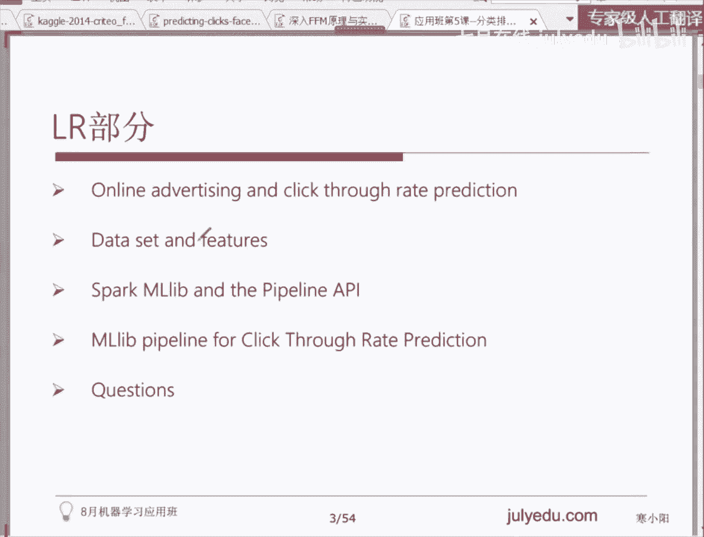

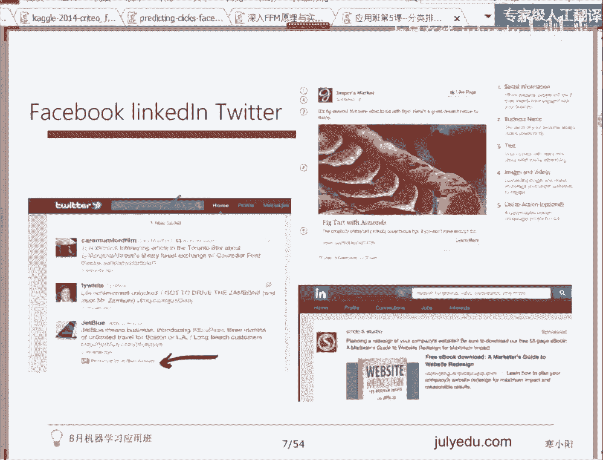

PPT的后面会有很多是空白页，是我我需要自己给大家讲和手写的。所以我希望大家下去以后看视频这个东西我很难在短时间内把它全都整理到这个1个PPT上。你你很难覆盖到这些东西。好吧，因为有同学问到这个问题哦。

我我接着说啊。这个地方L2L2基本上是baseline system，然后很多公司会用GBDT和FMFFM呢相对FM效果要好一些，但是这个模型会非常吃内存。在训练的时候。然后这两年深度学习这么火。

所以深入学习一定会用上的。所以在呃15年的时候，teestflow出来的时候，google提出来一个model叫w and deep model是一个融合了L2和dep learninging两个model的这样一个模型。

然后16年最新有一篇paper，大概是在在上个月的时候，前两个月的时候呃。发这篇配偶的同学还回国内做了一个演讲。然后是把FM和。深度学习deploing放在一块了和生成了一个模型。

这个模型我们最近在试好，应该呃在A对AUC确实有提升，比传统的这些模型都要好一些。但是它的弱点在于说它是两个模型叠加训练起来会麻烦一些。然后也是预测的时候会相对而言会会稍微耗时一点点。啊。

这是今天主要会提到的一些东西。我会把重要的精力放在前面的这一会放在几个部分啊，后面的这个部分呢会带大家看一下相应的代码，然后简单带大家过一下前面的bline系统呢。

我会给大家重点提一下这个东这因为绝大多数公司在用baseline系统。然后会你这个算法大家都知道。但你会遇到一些困难。然后这些困难的话，你如果没有做过相关的这些应用，或者是没有在这个场景下。

实际去在数据上做过一些事情的话，你有时候不太清楚会怎么样去处理这个东西会比较合适。呃，FM的全称是factororization machine。大家如果知道机器呃推荐系统里头用到的。引语域模型。

那块的东西的话，应该对这个东西会会比较熟悉，或者你看它相应理论的话会比较熟悉。然后FFM是在它前面加了一个field，它和域有关系。Okay。那就我先介绍一些背景啊，在L2的部分的话。

L2部分会我会花一些精力给大家讲这个东西。因为LR这个模型虽然非常非常简单，但是实际工业界大部分情况下在用它做一个被三个系统，而且。如果你能有产出一些有效的特征。

比如说一会我们提到的GPTT产出的特征未给LR的话，或者是你其他的方式结合业务去产出一些很有用的特征的话，这个模型的效果其实还是很不错的。但它会有一些问题，就是你会遇到一些实际的问题。

你需要怎么知道怎么样去处理。L这个部分呢会给大家提一些东西，大部分这个时候我们会集中在啊假定大家都有这样一个工构式的平台啊，用于机续学习的平台叫park里头会有个ML6可以用来做相应的这个。大规模的。

数据上的机器学习的这样一个应用。我们会给大家介绍这一这对应cago里头的一个案例，去把这个过程过一遍，先过完这个过程，然后我再给大家说一下注意点。这些注意点呢是实际在应用的时候确实会遇到的一些困难。

这个部分的话，PPT我因为我有一个我之前有一个。其他同学分享的比较比较详细的一个英文的PP，所以这块没有把它完整的做汉化。但是我我讲的时候会这个把这些内容都过一遍。

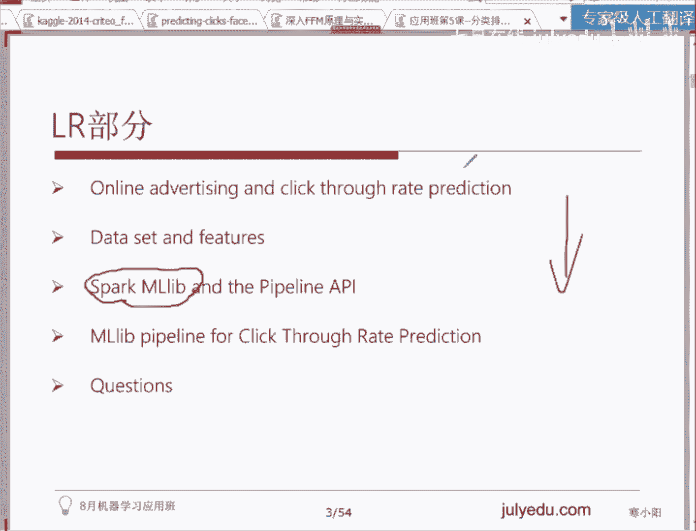

首先先介绍一下背景吧，为什么CTR这个click through rate。点击率预估这样一个问题啊，其实不只是点击率预估啊。在电商的话有2块，一个叫CTR，一个叫CVR。

这个东西是click through rate，就是点击点击率，它叫做用户到到这个展示页面以后，有多大的概率会点到你的相应的这个商品页去CVR是一个转化率。Yeah。CV2是一个转化率。

这两个东西非常非常的重要。对于电商也好，对于搜索引擎也好，非常非常的重要。原因是。

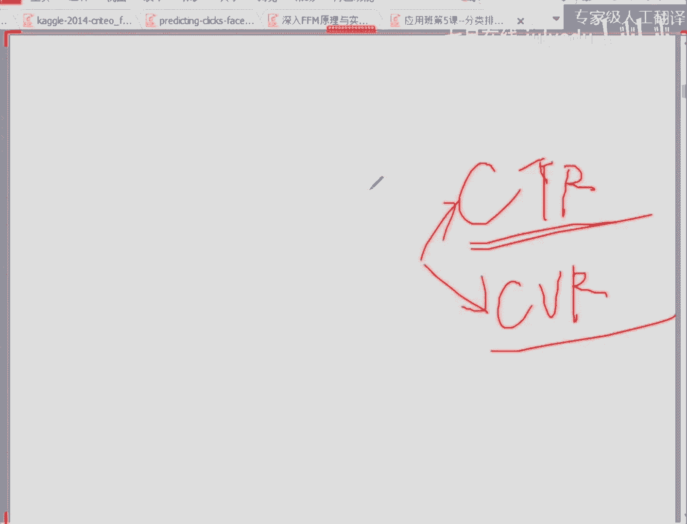

大家知道像google这样的公司，像。百度这样的公司，其实大部分的营收来自于他的广告。其实不只是google这样的搜索引擎啊，你会发现像这个地方提到的花儿。华尔街的。Oh。就是一些媒体杂志上。

现在也有大量的广告，包括像今日头条这样的新闻客户端，搜索引擎和广告是非常非常明显的啊。你会看到像像google的话，它会直接用黄色的字。标出来，这是一个广一条广告。你去看百度的话。

它会有相应的广告的标识。你去看其他的。

一些呃互联网的一些app也会看到相应的这样一些标识。然后我们知道国外最著名的呃几家公司，对吧？这个啊FLAG。

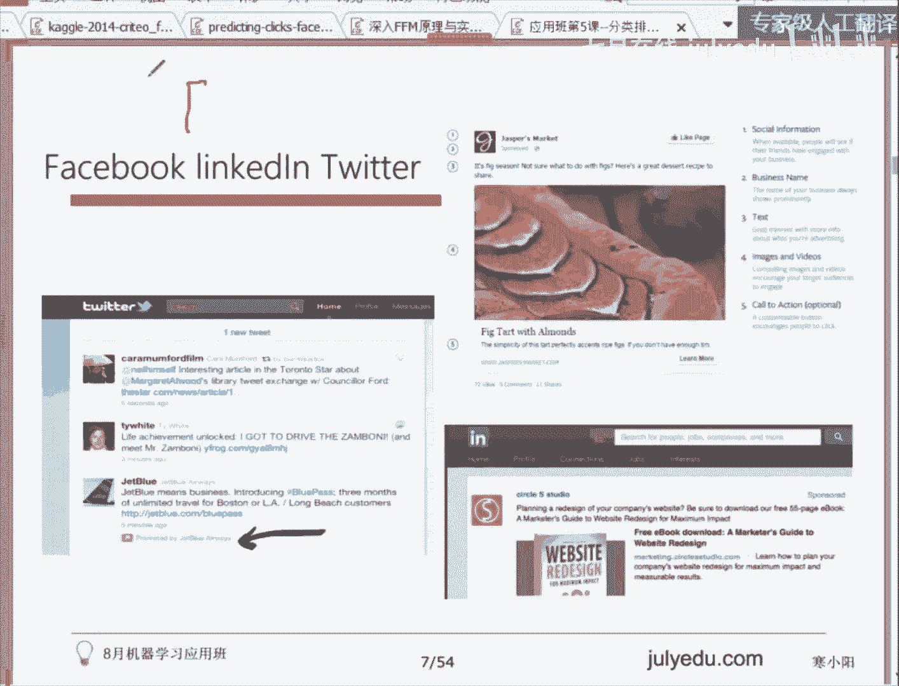

这些公司的主要的营收大部分都来源于广告，包括这个地方的google，包括。

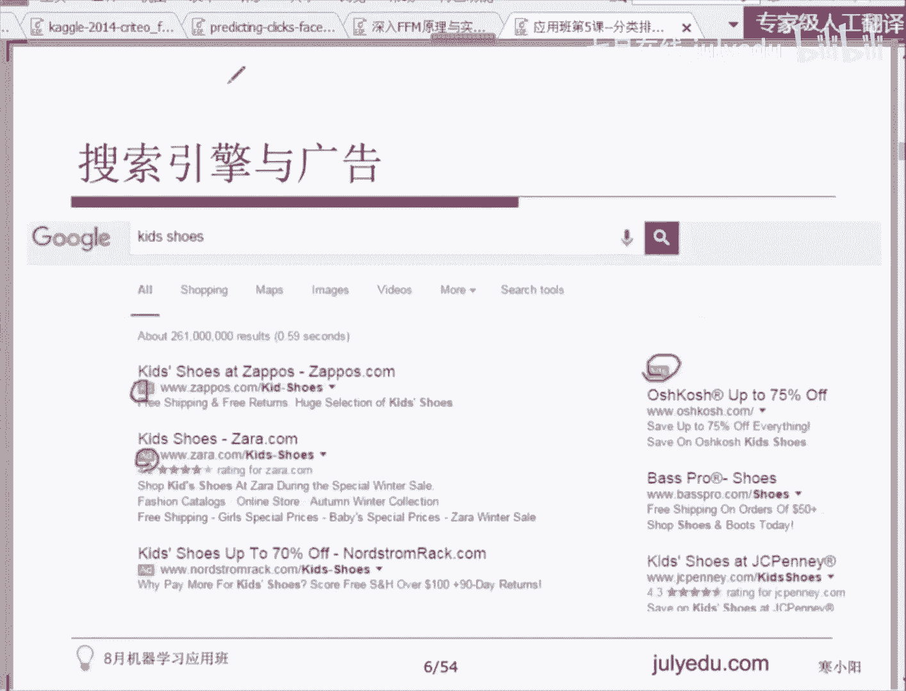

Facebook。啊，twitter。和link in那国内的状况也差不多。呃，百度有蜂巢，然后呃腾讯的话有广电通，淘宝的话有淘宝直通城做的事情是一样的。而这几个方。

而所有的这这几家的主要的这个核心部门需要解决最大的一个问题，就是一会我们会提到CTR预估的问题。

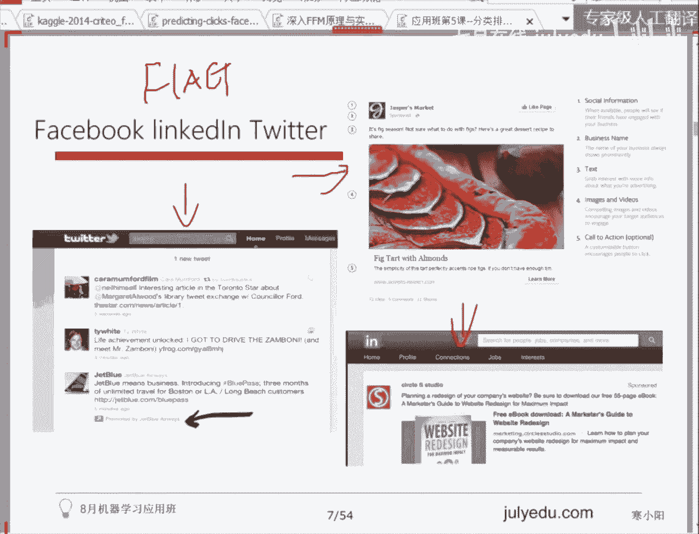

呃，会有一些差别，搜索引擎的方式这几家会有一些差别。比如说百度和。百度和淘宝，还有我们叫阿里吧和这个。腾讯可能好一点，百度和阿里大部分情况下，他们的广告叫做固定广告广告位的广告。

也就是说其实你是知道它在哪几个位置是。需会会需要放广告的，你只是需要知道什么样的广告放在这个位置是最合适的。

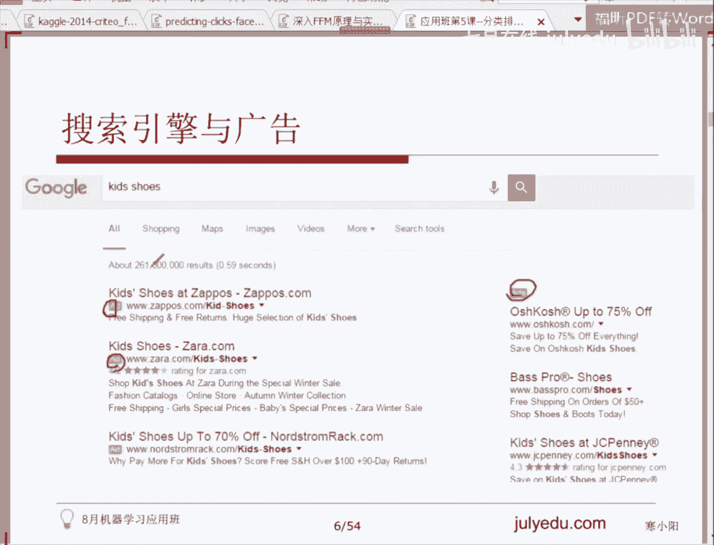

其他有一些有一些这个我们叫广告的形态呢，不是固定广告位的。比如说facebook的，它它的这个对应广告的这个叫做newfeed。啊，新闻流它里面会插一些广告，然后包括像呃广电通，你看你会看到像微信。

可能它下一步会会朝着这个方向去做更多的事情。这个广告的话，它并不是固定广告位的营销广告的高和宽长和宽，长观靠都都是不一样的。然后放所放的位置也是不一样的，这个是需要你自己去去做一些。

它会影响我们之后的一些预测的事情。啊。不管这么多，总之所有的这些加。巨头互联网巨头，他们需要依靠广告这样一个东西。

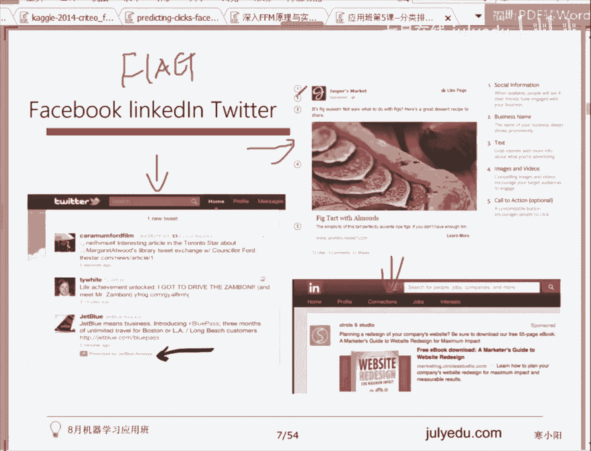

去获得相应的营收去支撑他们其他的一些业务。而广告当中，所以说广告营收是一大头嘛，这个地方是一个数字，大家简单看一下就好了。大概是第二个季度的一些营收。从106年到15年广告的一个。中。

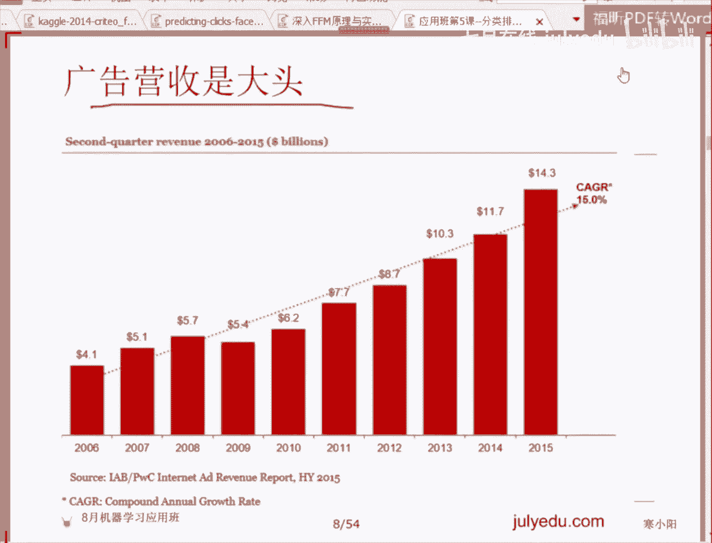

然后在线广告的话会有几种不同的形式。会有几种不同的形式。它嗯你有一些形式是针对用户行为去做的behavior targeting。就是你会你会根据用户的相应的行为去。做一个类似于推荐一样的事情。

但是它和推荐它比推荐会更难一些。一一会会说他为什么会难一些。然后另外一种是解我们在讲上点讲推荐系统的时候给大家提到了和上下文会有关系，对吧？所以广告也一样，就是你要知道什么时候。找到最合适的广告去去秀。

那这个的话，如果大家用啊美团、大众点评或者是百度糯米的话，这个他们的这种广告的形态是和地理位置相关的。所以你你你给人家推荐的这个商家，其实也是本身你需要团购，或者是你可能去下单的这样一家商家。

但是这个商家如果离你太远的话，你一定不会去去不会去点它。所以他去和物地理位置会有非常大非常大的关系。呃，广告之所以比广告严格意义上来说，它不是完全的推荐，但它和推荐有点像，我们需要找到合适的。

这样一部分内容可能是商品，可能是一些软文或者其他的东西推荐给这个用户。但是呢这些用用户呢，但是他需要去平衡三方的一个。利益。包括这个平台，包括广告主和包括我们这些user这些用户。

因为广告主每天的预算是有限的，你需要在有限的这个预算预算的范围内尽可能的把这个广告消耗掉。但是同时呢又不影响用户其他的一些体验。这个会相对要难一些。大家知道有这样三个角色啊。

然后之所以我们我们会去做一个广点击率预估这样一个事情的话，原因是因为广告的收费形态大概有3种。你你直接去理解啊，现在可能存在的有3种，分别是CPMCPC和CPAPM呢是cos per呃。

有有地方叫media或者是对它指的是它这个东西呢，说的是如果今天你去呃如果是这种形态的话啊，大家如果在去上微信或者淘宝，如果是这种形态的广告去收费的话，它它指的是它展示了一每展示1000次。

每展示1000次或者是固定的次数，我会去问广告主收一定的费用。但是这种形态广告主不太喜欢，因为我不一定每次的我的展出，我的这个秀都会有收益，对吧？我可能展示给用户，他根本就对这个东西完全不感不感兴趣。

那这个东这这样的话，广告主会觉得所有的主动权都集中在你平台上面，你想去花我的钱，你就可以愿意的花，对吧？我不确定我会有多多少收益。

所以现在大部分的很多的平台用的是第二种形态叫CPCcosplay意思是说，我今天展出了一条广告。这个广告的形态可能是原生态的形态。比如说大家去看你你打开你的淘宝，打开你的淘宝的app。

你你随便搜一个东西，你会看到上面右上左呃左上角有一些位置的左上角会标一个东西叫hot。你不要以为这个东西是商品很热，他告诉你的，实际上是这个东西，它是一个广告，一条广告。所有这样展出的广告。

每一次有点击行为的时候，平台会问广告主收一部分的钱。所以在CPC的这种形态下，cos per click的情况下，你能把。这个广告和用户之间的这样一种关联，做的越精确，或者说找到最合适的。

这样一个商品推给用户，他不用买，他只要点了，我就会有一定的费用。产生。啊，另外一个叫呃cost per action，这个这个我们不提啊，就是其实是说用户的话其实需要啊有一定的。行为。

就是比如说在淘宝上的话，可能是你需要买一个东西，这样的话才会啊给一部分的钱。大部分的情况下，现在用的广告形态叫CPCco per。那在这种形态下，用户用你他你对推荐的越准，他点的越多，点的次点击率越高。

点击率越高，我们的我们可以获得的营收就会越多。而且相对而言，对用户的体验。对用户的体验的伤害会越少。所以这个概念click straightICTR指的是你总共曝光了11000次。

里面有多少次是用户真的会去点这个东西。这个是1个CTR，这个CTR很难做。比如说在大部分的情况下，你你要知道像像淘宝，像百度，他们这个值就只能做到百分之几，这个值已经已经很高了。

比如说百度的广告形态有两种，一种是搜索广告。另外一种是大家如果点开CSDN或者其他的一些网页，你会发现经常会有些弹窗，对吧？这种形态是百度网盟的广告，那网盟的广告的话。不要说1%，实际上。呃，对。

实际上的话，他们连基本上现在的状况应该是在万分之1左右。很难做这个事情。所以。呃，因为因为这个游戏游戏游戏的话我不太清楚啊，可能游戏和达尔说的一样，是基本上是CPR啊，CPC的话。

电商的话大部分是CPC。所以这这种情况下，CPR是一个非常重要的一个一个参考值。然后在我们的这个。cattle上因为这个问题非常非常的重要，所以你去翻历史的比赛，你会发现在ca上总共有3个这样的比赛。

都是和广告率点击预估相关的比赛。

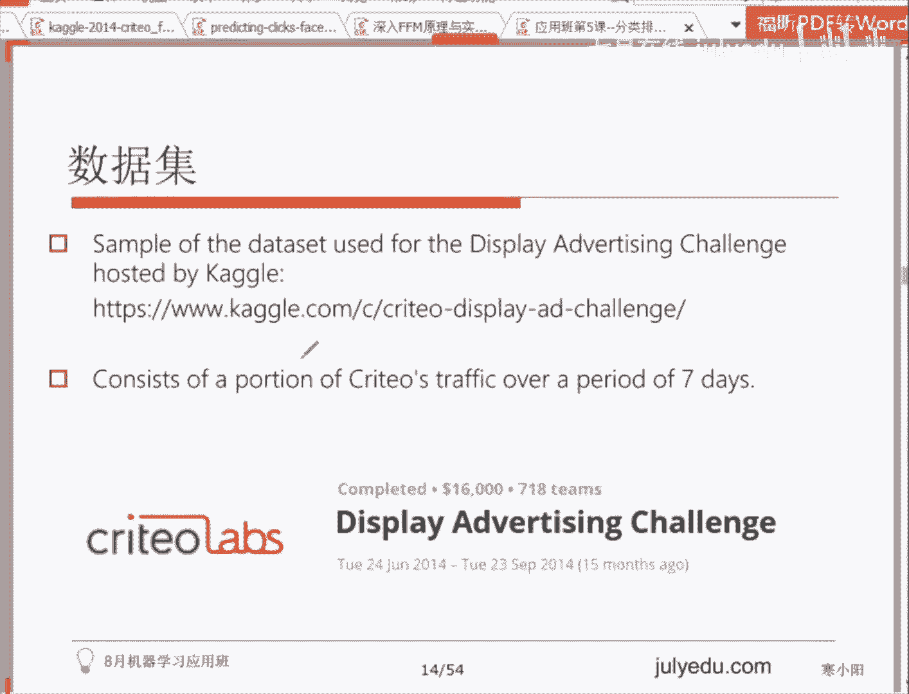

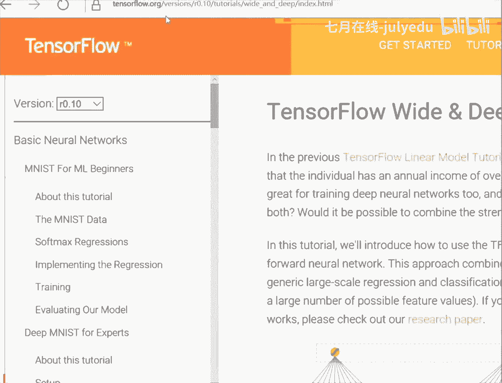

一个是这个地方，14年9月份举办的一个比赛。是一个展示广告的一个。比赛，然后在15年的2月份，february。2月份的话，有一个点击点击预估的一个预测。然后在15年的7月份的话，又有一个比赛。

所以他这么频繁的呃曝光，实际上是或者说这么频繁的会有人愿意花钱在cago这样的平台去寻求一些解决方案。是因为这个问题它非常难做，但它又同时很有价值。

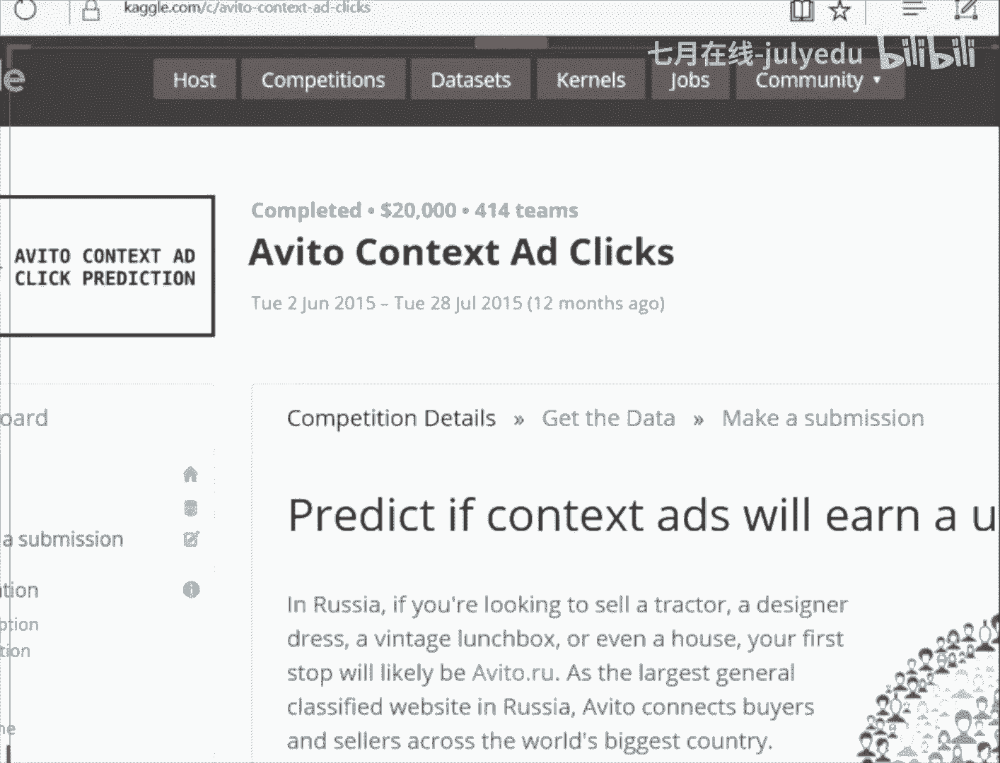

所以我们我们找了一个其中呃一个比赛，就是这个这个比赛啊这个比赛。展示广告楼。竞赛的这么一个广呃，这么比赛，我们来把这个LR这个部分或者叫逻辑回归这个部分给大家过一下。简单来说呢，这个比赛要做的事情是他。

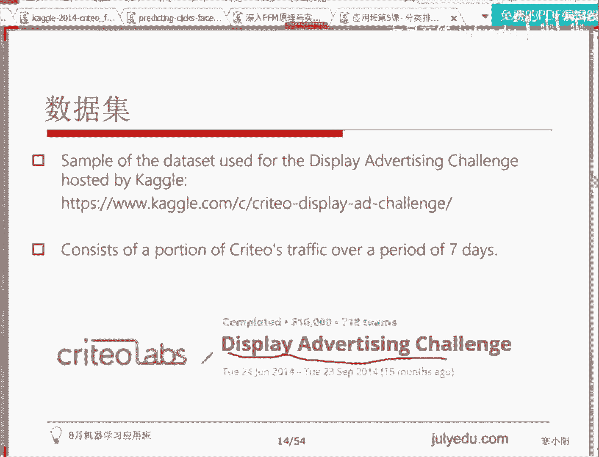

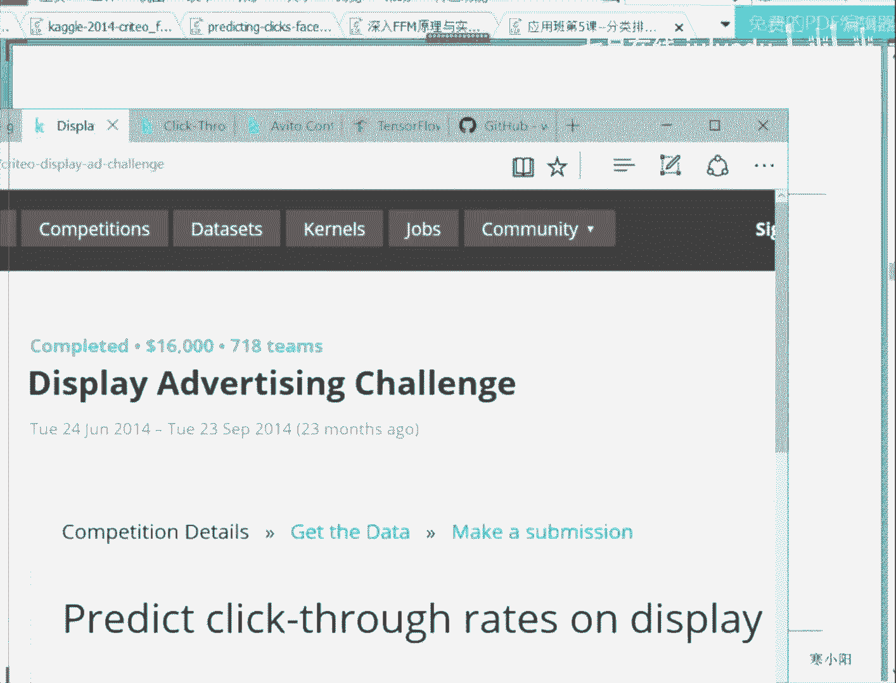

我们可以切到一个页面，看一下它的数据啊。

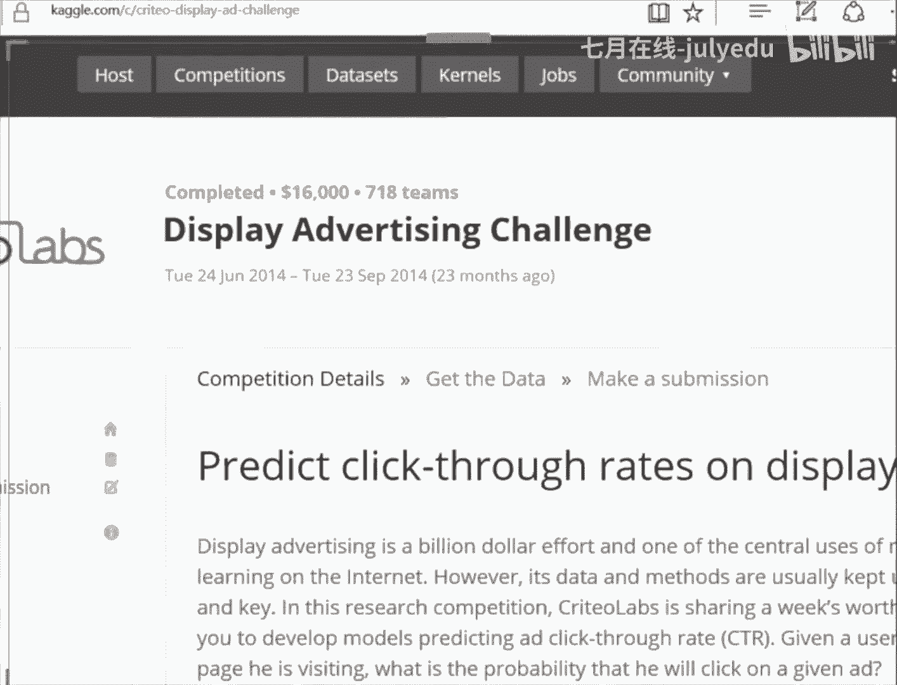

他的data。O可能要找一下，现在这个数据暂时被。啊，下线了，他们应该有1个TB的数据给大家去做这个事情。所以这个地方的话，这个也没有啊，回头回头我把这个东西把这个链接发给大家。

然后我们会有一部分的数据，这部分数据呢大部分情况下会涵盖啊几个内容的数据，包括用户端的一些一些行为数据，包括这个商家端的一些信信息，然后包括其他的啊可能他们之间的一些一些交互的一些状况。哦。

🤧所以总的来看啊，因为因为那个data比较大，数据比较大，所以我不把它载内存里需给大家看啊。我们说一下这总共的数据的这个fe的所有的字段呢大概分分为这么一些。有一个label字段label字段的话。

其实相当于我们监督学习里和one，也就是他告诉大家的是这个广告有被点击或者没有被点击，所以它是一个click或者是没有被click一或者零的一个一个二值的一个数据。

那LE到L13呢是呃一些整形的一些特征，也就是大家要知道这个东西就是告诉大家说现在的这部分特征是数值型的。对吧哎他这个地方提给给大家提了一下，说那个大部分情况下是一些我们一些技术的一些特征。

可能包括这个用户呃点了多少次这个类别的东类类别的这个呃信息啊或者广告啊等等等这样一些信息。啊，C1到C113呢会是一些。类别型的category featureature。所以你总共有这么多列。啊。

但是这些类别型的这些feature呢，你去参加这种比赛啊，不管是天池还是天go的比赛，你会发现这个数据它做过一些脱敏的处理，就是你手上拿到的这个数据呢，实际上是做过一些哈西处理或者其他处理。

而在实际的这个工业界的时候，我们可能会根据它的具体每个字呢，含义会去造一些更有针对性的一些feature。呃，总共我们就是有这么一些X。你认为最初的X是这个。

你可以自己再去做相应做相应的这个特征一feature engineering的工作。然后这个是我们的Y。所以你需要去完成的一个事情，就是在我们已经知道的这些X的基础上去呃预测最后这个Y是点或者不点。

最好的你是能给我一个点或者不点的概率。因为大部分情况下，大家想一下，在百度的情形下，在google的情形下，我们这种搜索的这种广告，甚至是像呃你facebook的这种展示形式的这样的一个广告的话。

实际上我们是希望知道哪一不仅我想知道用户会不会点它。而且我想知道用户点点哪一条1234这这四条广告，我不仅要知道哪一条。会点或者不会被点。我想知道他们之间被点的可能性大小关系。如果去做一个排序是怎么样。

所以你的这个模型是一个分类模型，但我会希望它能够帮我产出一些概率。所以大家会很少看到会像SVM这样的model。用在C条R预估click through prediction这样一个任务当中。

你很少会看到这个事情。因为它是一个纯大部分情况下，我们认为它是一个纯分类的模型。当然有一些同学可能会说，那你也可以用这个点到top平面的这个具体，实际上可以去做一个规划，拿到一个概率，对吧？哎。

我们很少这样做。所以现在我们有这样的X，我们有这样的Y，我们希望去做一个分类模型。同时这个分类模型呢，我们希望它能够给我们一些概率的一些结果。也就是告诉我说这个地方。

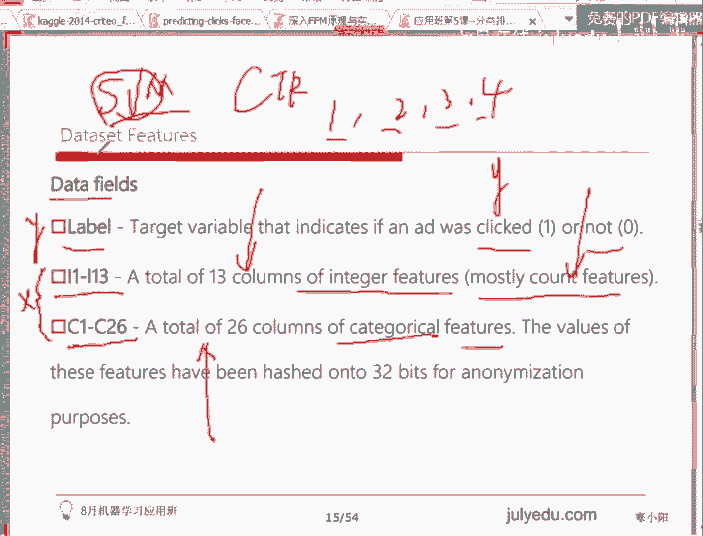

取一的概率有多多高，而不是直接告诉丢给我一个结果，零或者一。sk的话我不我不跟大家具体说了，实际上就是一个分布式的一个平台，对吧？

但它可以去完成机器学习machine learning的一些它里头有一个库叫ML有个MLlibML可以完成相应的这些从回 regression然后聚类到啊协同过滤，然后维度约减降维和分类这样一些问题。

然后我们主要是拿它来做刚才的这个分类的问题。我们知道像L2这样的modellog regression是可以输出对应的概率的。所以我们现在有这样一份数据集。然后我们有这样一个工具。

我们需要做的事情是我们去完成一个model，完成一个模型，完成最后的这个预测。我们希望在。给定的X的情况下去预测产出的Y是一的这个概率到底有多高，也就是会被点这一条东西会被点的概率大概有多高。

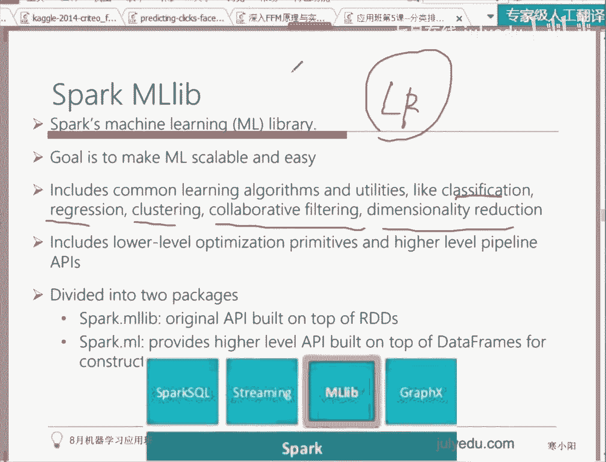

然后整个工作流程我也不说了，大概这很简单，你简单理解成就是我们要加载数据。然后我们要对数据做处理。所谓的数据处理可能会包括抽特征的这一部分做一做一个啊比如一个transformer，对吧？

然后我们接着就可以用它去训练一个模型了。所以大概是一个peline。做的事情是原始数据大概在这儿，所以我们的X可能是X和Y在这，对吧？然后我们需要去做一个。Yeah。

我们需要去对类别的类别型的数据要转成数值型的数型数据，对吧？所以我们上节课给大家提了一个经常经常要做到的东西，要做的这个操作叫oneho encoing读热相读热特征的这样一个编码。

然后从你的X给定的这个catery类别型的这个这样一份数据到我的读热型的这个编码的这样一个数据的话，你需要去对它做一个映射，或者给进所有的类别一个下标。所以你需要去先。建一个下标索引。

然后你去对它做相应的encode encoing enr。做一个编码，接着你会拿到很稀疏的一些向量。你把这个向量丢到一个LR模型里头。LR呃逻辑逻辑回归，我相信大家都知道啊。

所以训练完了之后你就会得到一个模型。但这里头可能会有一些你可能会遇到一些问题啊所以我们把它拆解成几个步骤来看。第一个步骤是我们需要去解析一下原始的数据，对吧？

放放到park的这个SKL转换成park的SQL data frame这样一个格式。所以读进去的时候，我们需要做的事情是做一个map，对吧？所以这那个数据的话之后我们找找地址发给大家啊。

所以数据的话你需你需要对数据去做一些相应的处理。首先你把里面的每一每一个列去做一个。拆分对吧？我们得知道哪一个部分是Y，哪一个部分是X，对吗？所以你把X拿出来去生成你对应你需要的这个feature。

这个整个解析的数据的呃过程做的事情就是一个简单的一个映射。然后第二个步骤是我我刚才把数据读进来了，对吧？我读进数据进来了之后，我需要去对数据做一些处理，或者说从数据到特征的这样一个过程。

你需要对这些字符串新的这些con。也就是我们说类别现在这些con。index一下对吧？比如说这个下这个ID现在是零的话，表明是DA类，一的话表明是DB类，对吧？然后你会对它去。Yeah。

做一个对所有数据里头的这个东西去做映射成对应的下标，对吗？就是你原来AC对应的是这个。你会对他们去做一个做一个index，对吧？做一个相应的一个索引。所以你会发现CC现在都会映射成一个值。

然后你就做一个外号的encoding，就是我们说的读热编码，把它映射成一个一一个非常长的一个ve。一个向量。其着你要把所有刚才你你得到的这样一些向量去做一个做一个整合。对吧放到一起。

比如说这个地方会有这个user featureature，然后你总共合在一起以后，就是这样一个features。对吧。这是你刚才的有一些有一些值是连续值，比如说十8对吧？那有一些值它是你刚才已经做过。

已经做过完号encoding的。接着你要把整个这个东西整成一个1一整条的feature featuresatures特征。然后你会有一个Y叫克是否解析。

前面四个步骤是你从原始数据到你需要的这个特征的一个过程。紧接着你就可以训练一个模型叫LR模型，对吧？逻逻辑回归，这个模型是可以输出概率的。因为它是一个广义的线性模型，对吧？我们会先做一个X。

然后会用ig的函数在里面，所以是E加上E的负这个次方分之一作为最后的一个概率输出一个P输出出来，所以你会拿到一个对应的概率。啊，这是整个流程。然后实际呃如果你整个流程已经做完了。

你现在要去做predction做预测的话，你需要做的事情是跟刚才一样的方式去把读进来的数据整理成一条特征的形式。因为你之前已经做过映射了，对吧？你做映射的时候，你会把对应的这个。

index对应的索引数据全都会存下来，所以对应的这个映射关系实际上会存下来了。所以你对新来的这个原始数据，你可以去做相应的同样的这样的映射处理，你可以拿到一个向量。嗯。呃，然后这个地方的话。

大家都知道我实际上在建构建一个logtic regressionL模型的时候，实际上是会。涉及到很多参数的选择的。所以不管是用LR这样的简单模型，还是用更复杂的模型。

我们都会涉及到一个过程说我们需要去选择最合适的参数。所以我们需要一个一一个步骤叫CV叫对吧？你要你要把数据分成预留出来一个交叉验证集去做最后们这个ature的不是ature做我们的这些参数的simer超参数的这样一些选择。

对吧？所以这个地方的话，我不细带大家过了啊，就是我们会有一个evaluator是做评估的。然后我们有个呃perper grid，实际上是去做这个gre search。

所以会在交叉验证集上去去实你会直你直接用这样一个函数cross呃 validator，然后你给他一个数值，说我要做K four的这个。K折的交叉验证的这个K的值告诉他以后，可以我们可以去做相应的。

Cros validation。啊，前面的这个过程呢就是用L2再加MLlib去完成一整个刚才我们看到的这样一个，你你这个地方的三个比赛都可以用这个方式去做。

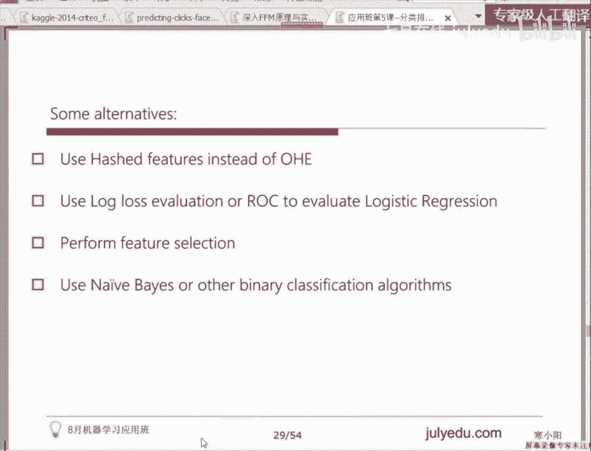

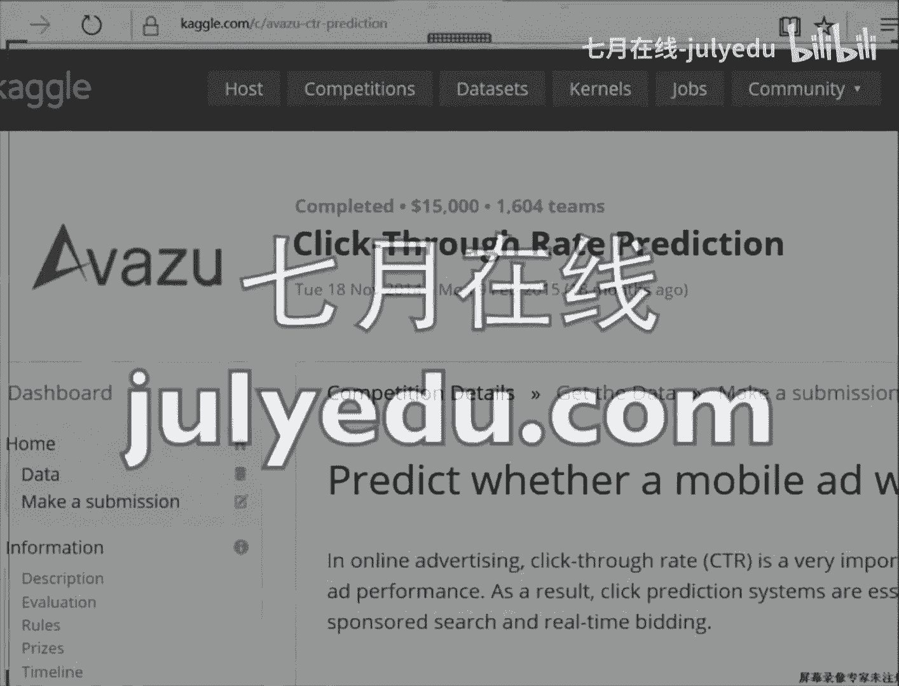