# 人工智能—计算广告公开课（七月在线出品） - P4：Lookalike相似人群拓展项目实战 - 七月在线-julyedu - BV1SA411H7Se

OK我们现在课程开始啊，可以听到我说话吗？你今天讲的话是looklike相似人群扩展啊，这个也是在推荐广告里面是非常经典的一个业务啊。它呢是源于2018年的腾讯广告算法大赛啊，大家可其实可以看到。嗯。

其实从腾讯网算网算网大赛，从17年到2020年都是他们的赛题都是非常贴合真实业务的，也是非常经典的一个赛题。所以说我们把每个赛题进行一个复盘，进行一个拆解，就非常值得我们去深思和学习的。

同也同时也可以挖掘一些呃挖掘一些top选手，他们的一个解决方案的一个思路，和他们如何比如说提取特征工程，如何去挖掘一些强的一些信息，一些check，或者说他们使有哪些模型。

来去解决这个真实场景下的一个问题的。那么今天呢从5个部分进行呃就分享的一个赛题背景背背景，探索性数据分析特征工程CTR模型建模。扣件。以最后的模型融合。

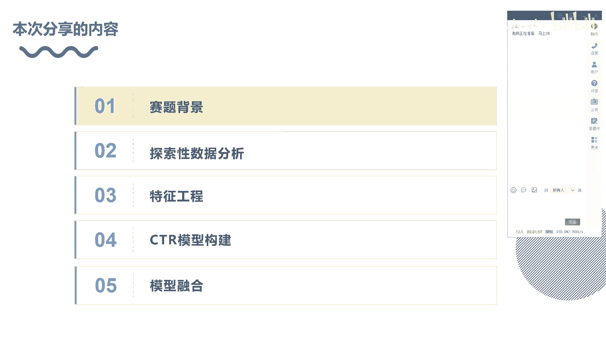

那我们先去了解一下looklike它是具体是什么一个业务啊，场景，它是相似人群扩展。就比如说。客户的吧，客户他们会上传一部分指定的高质量的一些人群。那这个高质量人群呢就是我们的种子人群。

那么主要是去依托于种子人群，我们从里面去找到一些较为显显著的一些画像特征。然后像腾讯里面的话，他会嗯他们会在他们的大盘当中寻找一些嗯与其高度相似的人群，就扩展人群。就根据这些特征特征。

画像特征来去找到相似人群。那我们不可能说人呃依据人为的。所以说我们需要去去用建模的方式，对建模方式如何去对他进行一个扩展。那我们有了种子人群，有对他投放的一些广告。那这些种子人群。

他对应的种子包就是对应的这个广告。对，如果他点击这个广告的话，其来说我们依托这些点击和不点击，就是正向和呃负向的一些样本我们进行建模来去提取出来他一些正向的一些含义，就是说这群种子人群，对吧？

他们有哪种偏好，哪种兴趣，那我们依托依托于建模的方式来去提取。然后呢，我们再从我们的一个人群库里面，对吧？对，也给这些人群给他们推这类广告，那我们看他是否发生转化，那如果发生转化或发生点击的话。

那其他和我们种子人群就有一些相似的一些兴趣。那我们可以把它归为相似人群了。嗯嗯分为三点，他的一个业务一些作用，更好触达意向的用户。就是我们原有的人群是非常少的，所以我们需要扩展人群。

把那些具有相同意义向的用户进行扩展。第二个话就是说更高的互动转化可能性。啊，最后呢就是找到潜在的目标人群帮助拉新。那最后一个是非常关键的。因为现在来说的话，很多他们的公司都会在用户增长，就是说嗯拉新呀。

或者说就是一些对一些用户一些那种那种那种成成熟的用户吧，我们进行一唤醒。对，都会做一些用户增长相关的一些算法的啊。当然这也是其中一部分。当然我们这些就是推荐这些的，他也是也可以算为里面的一部分的。

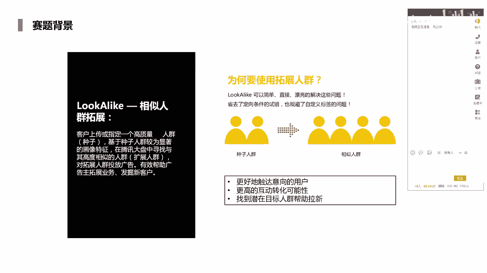

呃，三部分种子人群，然后基于用户画像提取用户特征，然后我们再去扩大受众展示相关的一些广告。那第一个呢是先去上传，就是它这个业务背景嘛，就是说最开始他会就是在这个比如广告平台。

或者说我们这个类似一些系统平台里面提供一些上传一些种子用户啊，然后呢去筛选种子用户特征。那其实就是挖掘一些呃就有相关一些意向，相关一些兴趣，具有一些共性的一些特征。然后进行匹配。那根据上面的特征。

从全量活跃用户中筛选出另一批与种子人群最为相似用户。那就这就是整个流程了。嗯，这个赛题呢他其实是做了一个简化。对，不需要我们不需要我们从全量活跃用户里面来进行一个嗯。不需要我们去找到全量用户，对吧？

他其实已经给我们那啥了，已经给到我们这些全量用户了，对吧？给到我们这些用户不一定是全量，他给到这一部分用户了，同时也给到这个用户他对应所点击的广告了。其实就是说。嗯。就说他其实已经说给到了一个用户了。

优的ID对吧？U的 IDD然后又给到另外一个广告ID了。对，这起来说是他们本身是提供到的对，那我们需要做，就是说看这两个配合的下面，对吧？它是否发生转化，对吧？就是点击啊，或者说CVR这种的形式，对吧？

啊，有点击或者说有转化，还有正就是标为一，那反之的话就是零这样的一个一个一个形式了啊。

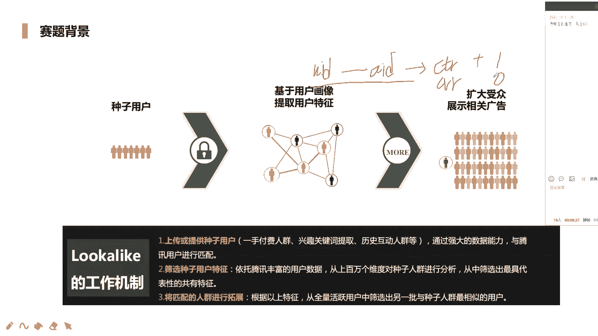

那赛题任务呢？赛题任务我刚才已经描述了5个月还是比较比较清楚啊。大家讲一下，本赛题呢是将为参赛选手提供几百个种子人群啊。嗯其实每个种子人群它对应的是一类广告特征。那比如说这种子人群。种子人群里面对吧？

它有很多的很多的用户ID那它对应的一个广告广告特征或者广告IDAID。啊，第二个也是一样的，很多种子人群对吧？它对应的AIDAE刚才是比如说按按按零算法账来，就这种形式嗯。然后出于业务数据安全保证考虑。

所有数据均为脱敏处理后的数据，整个数据集分为训练集和测试集。那测试集就需要我们最后要提交这个部分了，就它给到了user ID和对应的AID对吧？然后我们对它作为一个准确的一个呃预测。

那预测的话是最后给出是概率结果的啊，比如说0。760。76，就说它发生发生点击或发生转换的一个就发生点击的概率是0。0。76对就行了。不需要把它转换为一或者是零这种形式啊。呃，用户是否属于种子包用户。

那其实是否属于种子包用户，其实就是否去点击这个广告了，两个含义是一样的。所以说我们把这种是否属于可以转换成1个CTR问题。那我们知道。在广告排序里面对吧？就是说我们在做推荐的时候，对吧？一个排序环节。

那其实就是看它的1个CTICVR1个一个概率的对，然后做个排序。那其实它和经典这个问题其实说有很大的一个相似性的。所以说我们可以把它转换成CTR这个问题去解决。包括我们在高特征，还有一些用的模型。

也可以用CTR排序模型来去解决的，这是没有任何问题的。测试集将检测选手算马能否准确的。检测出用户是否属于现在种子包，训练数据有完全一致。训练数据测据总部完全一致。OK啊，这个是我们那个任务啊。

那我们来看一下评价指标啊，一般来说的话，常用的史其实这种二分类的话，包括在涉及到一些广告推荐这块的话，都是用AOC这种方式啊。对它具有那种那种。嗯，像正样本和副样本区分开来一个白一种排序能力啊。

对他不会受他前说不会受你的。他其实关注的不是咱们的一个准确率。对，不是关注准确率，而是关注的话就是一个区分性和排序性。对，我们来看一下嗯，对于扩展后的相似用户，如果在广告投放上有相关的效果行为。

就是点击或者是转换啊，则认为是正例。对，那其实点击的话就是我们对应的CTR问题，转换的话是CVR问题，其实就非常相似的啊。如果不产生效果行为，则认为是复利。呃，每个带苹果种子包会提供一个信息。

种子包对应的广告ID及其特征，以及对应的候选用户及就是用户呃用户ID及其特征。选手需要说就是针对于每个种子包，我们去计算它的AOC的啊。因为每个种子包每个广种子包里面对吧。

它起来说广告特性也是不一样的对，所以说我们为何为了更好来去有这种就是针对性，对吧？包括比较经典，就是说嗯我们现在前说很多的评估的话，其实说嗯不是来用AOC这种方式来进行评估，而是那种JAOC的方式。

对吧？啊，我们来我们具体在做精准这种推荐，精准的一些营销的时候，我们看到的不是说因为每个用户他这个行为习惯不一样。对，所以他最后得到概率结果的分布也是不一样的。所以说我们为了更好针对于某个用户。

来去看它AOC的一个效果。所以说才会有了JOC这种形式。那其实来说JOC和我们这次这个评价主要是蛮类似的。就说我们依托于按种子包，我们去分成多个，就是我们有M个种子包，对吧？

对我们看每个种子包下面它的一个嗯它这个AOC的一个效果如何，最后进行一个加权啊。这个AOC这个思想是非常类似的啊。也是现在就是说用的比较多的，而不是说不考虑种子包，它本身的一些一些数据的分布，一些效果。

一些它的一个概率情况，对吧？而是一股脑的只用1个AOC来进行评估，那肯定是不一样的。这是我们的评价指标。再往下是特征工程部分，哎，是探索性数据分析。探索性数据分析呢，这是我觉得是非常重要的环节。

因为我们最开始候对这数据完全不理解，对吧？他提供哪些数据啊，一个提供哪些数据，对吧？他给到数据对吧？有哪些数据。第二个，每个数据它大小。它大小它类型。它的分布。我们都是不不了解的。

所以说我们需要第一步就是说我们先去了解数据，读懂数据，才为了就是帮助我们更好的去开展接下来工作。不管是我们在做比赛也好，还是说在。接触到一个新项目，就工作中项目也好，都是按照流程来的。

本次竞赛呢他给到是脱敏后续，对吧？时间范围是30天，但是他没有给到每个样本的一个时间的。所以说他确实到时间这个部分了啊，所以我们不需要考虑时间相关的一些因素，因为本身没有给到这个因素的，给给到这个变量。

数据可以分为我们的训练集、测试集、用户特征以及种子包对应的广告特征四个部分啊。训练级的话就是已经给到label了，就是说AIDUIDAID的话就是用户ID。UID的话。

AID对应的是广告IDUID的话给到的是用户IDlabel的话就是嗯它是否发生是否属于这个种子包，或者它是否点击或者说是否转换啊，测级话需要我们去预测的一个一个一个pe尔队这种的嗯。

然后用户特征这块的话，他给到还是蛮多的。就是说一个用户案例的话，他给到一些filturegroup一group2group3，那这group什么意思呢？就是一个一个特征组。比如说他的一个有个兴趣啊。呃。

EREST啊兴趣一它里面对吧？也许有个125就逗号间隔这种类，然后八这种的形式，对吧？它其实是一种多值特征，就是他把这个兴趣这一类兴趣。比如说星期一的话，也许代表他嗯。嗯。

我们可以把它假设假设成一种运动的一个兴趣吧。对我们的运动兴趣其实说不止是一个的，是有很多的啊，所以我们可以假设为他运动兴趣啊那。interest二的话对。哦。

二的话对二的话我们可以把它展设成一个色彩分布，色彩兴趣对它也是分为各种的已经透明后的一个一个种数值的一个一个一个一个类别的一个多质特征了。比如说5100啊，里面也许可以代表一个颜色。

但其实他这个起来说兴趣还是蛮多的，也不确定是什么，但大致可以这样方式来进行理解。对。每个特征组里面是一个多的特征啊，我们要注意这点啊。对，就后面我们是来说关注怎么来去解决这个问题啊。

怎么来处理这个问题啊。对多的特征，我们该怎么进行一个拆开展开啊这种方式。也是在很多的一些很多业务城人中，其实见到的并不多的啊。广告特征文件对，就是对应的广告ID对吧？嗯，他的广告主ID。

他的一个什么ID啊，创建素材ID。嗯，他的一个素材大小。广告类别ID嗯。厂商生产这种ID啊，或者说生产那个类型的ID一种呢。对，大概就这样的啊，一共分为4个部分。

那么主要是围绕着围绕着呃围绕着AID和UID我们去展开来去构造我们的特征的。这基本的这个文件啊，我们一个了解啊。接下来我们来看一下，我们将这一些打开啊，就是数据打开，就说比有就是一个这是广告ID对吧？

广告ID对吧？它的一个我们直接就hard对吧？HED hardd来看它前5个对吧？前5个。前五个他的一个前五行，对他一个基本的一个数据的样子，什么样子的，我们先做初步了解啊。他其实全部做了脱明了。对。

而且已经帮我们做好了一个转换了。他不会说就是给我们那个字符串这种了，或者说object这种类型的，直接是按这种数字型的，已经给出来的啊，我们不需要再做label in的这种操作了嗯。那其实这样看的话。

其实只能看到大概的信息，我们也不了解它有个分布的啊。那我们继续往下看吧。用户的信息啊，这可能就是说给到了感觉更复杂一些哈。用户ID他的年龄。性别。嗯，婚姻状态。婚姻状态看蛮多的呀，111啊。

这也不清楚什么意思啊。我今天晚上看教育嗯他的一个。消费能力吧是消费能力吗？对，或者说这是它的一个呃LBS这个那该是个位置嘛，LBS位置什么兴趣2兴趣5，然后是KW，这也是个多日特征啊。

对我们他其实来说都是多日特征。我们端时处理方法都是一样的。直接上我们都按相同方式来进行处理就可以了啊嗯。哎，刚才几个可能说意思不太了解的，我们可以去去看一下他是什么意思啊。对。

那现在我听到就是说腾讯赛的一个官网，对已经举办了举办了四届了。对我们可以看网届赛题啊，网年赛题里面还有一些介绍的。

嗯。

18年的。

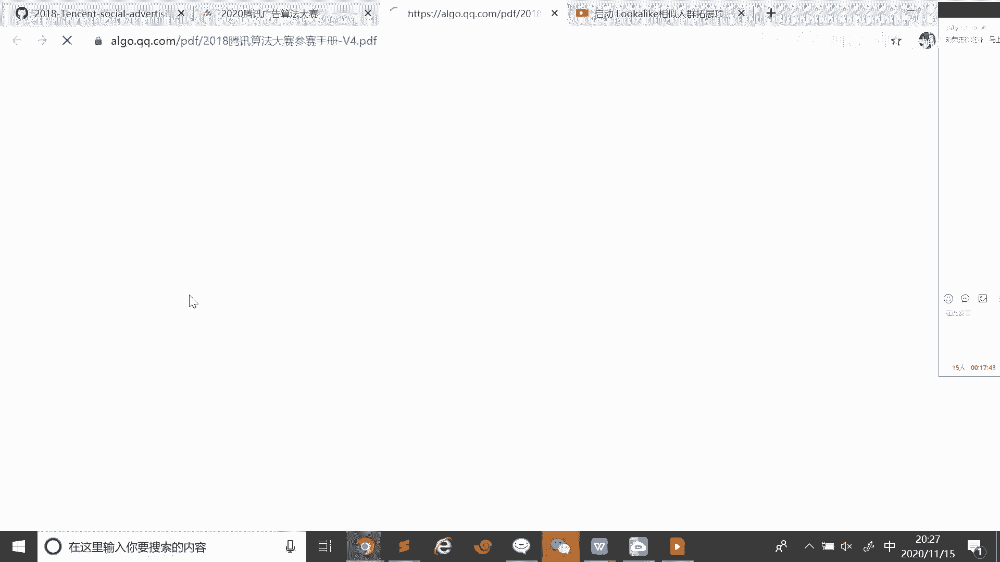

哎，直接可以看到了，它里面是可能对数据有更详细的一个描述啊嗯。婚姻消费能力，然后是地理位置兴趣。兴趣呃，它分别以12345有5个这种这种特征组，还有关键词。较兴趣类目更细力度的表示用户喜好啊。

那也是一种用户戏取兴趣，但可能说更细一些啊。还有topic就是主题。这用的是LADLDA挖掘的。LED这种这种方式，对吧？这是一种那种文本的挖掘这种方式。文本挖掘方式。对，来挖掘用户的喜好。

然后分为topic123，这应该也是都是特征了。还有APPAPP近期安装的行为。APP活跃。上网连接类型。那有不同上网方式。其实不同上网方式来说话，其说我们可能就是说我们在获取这种这种。嗯。

会理服务的时候也会有一些不一样的一些广告，或者说不一样的一些反馈啊，这可能也算差异性的。包括不同操作系统，其他系统其在也反映出。反映出人的一个。差异性对，不管你是安卓和IOS这个学说，你整体来看哈。

从宏观角度来看的话，它是存在差异性的。人的一个整体的一个兴趣呀，或者说其他的一些呃状态啊。移动运营商。移动联通电信。是否有房？

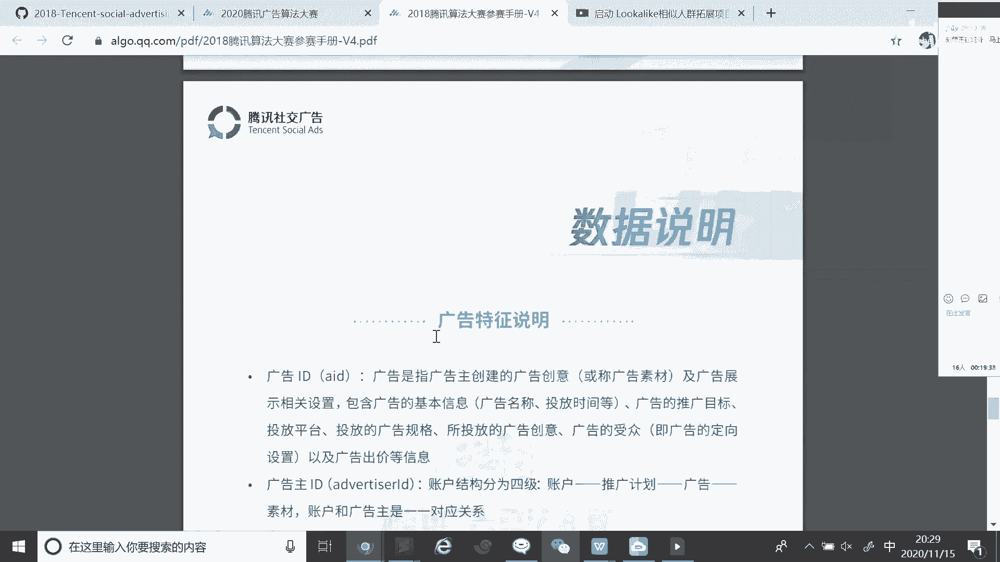

啊，这是我们的用户的信息啊。

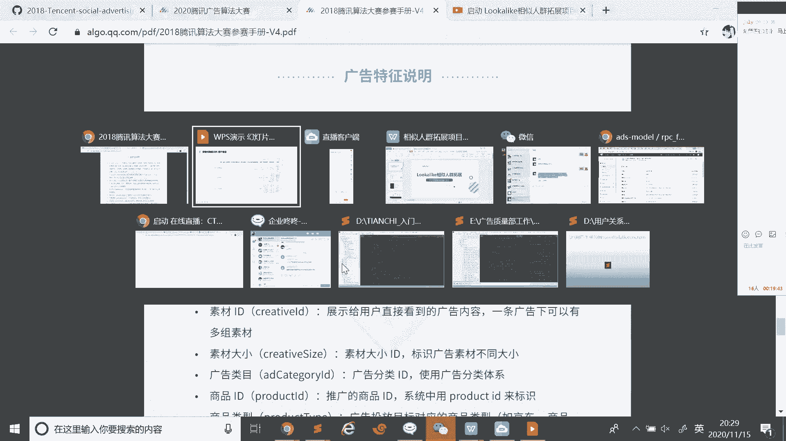

那现在看呃，这块的话，我做了个基本统计啊。对，就是对于UID还有我们的广告ID对吧？AID我们来看这个un unique的话，就是说他在训练题里面，对吧？是里面有多少类用户有多少个用户。

多少个不同用户对吧？对啊。就是一个班有45人，他就是每个人都是不一样的。所以他按他俺有那个就45了，但在系统里面不一样，他可能有45个，但是可能。嗯，小红出现了10次，对。

那可能只是最后他Iunic只有30多。这个I的话就它唯一的一个属性有多少个，就是说唯一的这个用户，他有多少个。那就是780多万。对。那我们来看测试集，测试级的，un uniqueic的话。

它是有200多万的。嗯，总共的话是。90900多万900多万。对。啊，后面我统计一下就是说训练集和测试集对它的一个重复，就说我们的用户ID有多少重复的。我们可以发现重复的ID是非常少的啊。对，所以说你。

将AID的话，哎UID。本身不能作为特征的。怎么说呢？因为我们重复的并不多的，重复的并不多。所以说你用它的话会存在就是说你后面不存在UID的话。

对可能会出现那种呃一些一些新的一些UID就类似于感觉这种冷起的一个对用这的话是完全不起到这种泛化作用的。所以说我们在高特征的时候，我们是可以。围绕着UID去构造，而不能用UID本身的对。这一点需要注意。

先看一下我们的AIDAID的话就是我们的种子包。那每个种子包它有对应的一个广告ID那173虽然你173，测立173所以173。173百分百。啊，学习测试都是一样的啊，然后我们嗯。百分百重复啊。

这个就是说都是一样的，没有说它存在一种一定差异性的这是我们的AID的一个分布啊。是。嗯。这是其家说对我们数据基本的一个了解。Oh。那接下来我们看一下，就是我们该怎么去构造一些特征的啊。对。

这块我这块我是我当时参这个比赛，对吧？我是大概就是列举了一下。对，就是我们这块构造一个方式，对吧？第一个是。Space to， Sp， space。这种话主要就是说对那种那种那种那种那种那种多折疼。

对吧？那种多的特征对吧？我们可以用那啥用那种词频统计方式，对吧？con vectorctor那种那种方式来进行一个展开啊，还有一种的话是基础的特征，就是说原本的一些用户信息，对吧？原本的一些特征。

我们不做任何处理啊，直接把它当做一个类别特征，或者说当成一个数字特征来用。就用原本用特征，它的一个年龄呀、性别呀。对广告特征的话，它对应它一个广告位的一个广告展示的一个呃sizeize。对。

然后它的一个广告主ID这样的嗯。统计特征的话就是are unique collect的话就是说它点击，那我们可以把它看作一个就是一个count。countter类特征。theun对count就这样的。

还有一种话就是。艾ic克的话其实就说他的意思就是说。意思就是说呃比如说一个用户对吧，一个用户一个用户，他呃他那个兴趣，他的兴趣的一个一个一个范围，或者他所看到的一些。嗯。😊，看到一个呃兴趣，对不？

比如说原本的话可能说小红对吧，他可能说只有一个兴趣，对吧？一个兴趣对，一个兴趣。那小明的话他有很多兴趣，很多兴趣。对。就他按 uniqueic就高一些，它一个整体的一个兴趣的范围就更更广一些。对。

就可以描述出两个用户一个性别的兴趣的一个差异啊。点击的话就是说如果小红他可能就点击了一次呃，就护他的一个整体行为一次。那小明的话可能100次。啊，那其实也可以反映出用户他经常会登录。

我就很少登录这个平台使用我们这个产品。那这个话就很经常登录我们平台去点击我们广告，使用我们这个产品的啊，这也是从不通。角度统计来去反映出用户的一个信息的。再往下的话。

就是我们对于这种特征组这这种这种多轴特征对吧？我们也可以统计它的一个长度的啊长度，其实中反映它的一个信息的一个范围了哈，就和刚才那个unic蛮像的对。这种还有一种比例特征就是。组合交叉。

别特通话是刻画某类用户的一个偏好的对。哦。根据各类偏好更好区分区分用户。别听的话就是retail这种。啊，比如说我们来统计说嗯统计统计呃。AID对吧。AID和其他的一些。和其他一些ID啊。

其他一些呃比如说一些广告类的ID对吧？广告的对，就是UID对吧？UID啊。那这时候呃我可以不用UID，我用其他的吧，就是弄弄种其他的来看，我找一个吧。

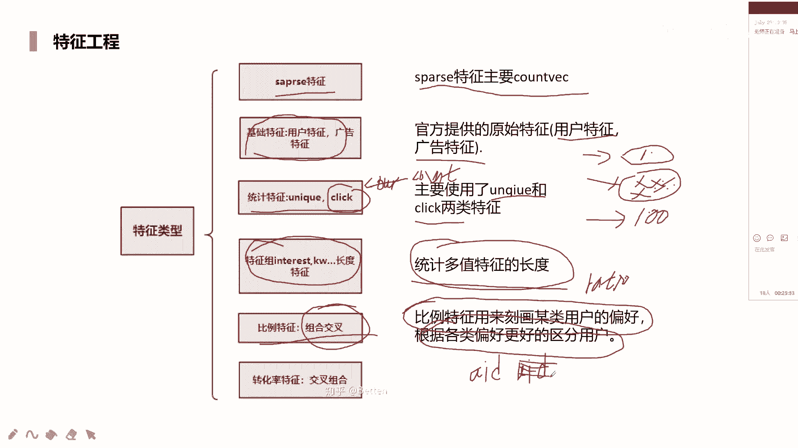

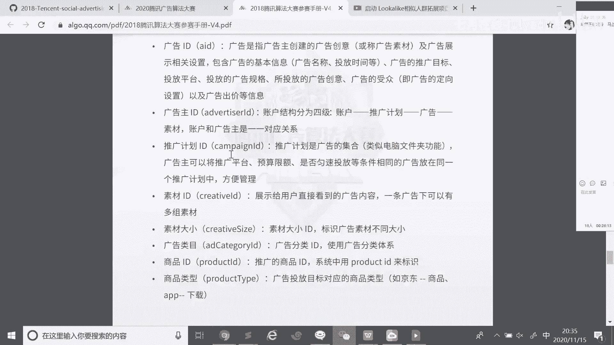

有对应素材ID吧。是啥ID。素材ID对吧？素材ID对，我们来看可能这个广告对吧？这个用户对吧？用户对吧？他可能对应素材素材A的话啊，点了一次，素材B的话点了10次。点了。谁的话哎，点了5次。

他总共点多少次呢？总共点了有16次，那就一除以16。10除以16。5除以16。那最后这个这个这这个比例的一个大小就反映出他对这个这类ID的一个兴趣的一个。偏好重要性能。

其count本身的话是反映不出来的，反映不出来它对于具体的一个ID的吧一个一个程度，只是始能只能反映出这个广这个用户他整体的一个整体一个活跃度这样的一个信息的。再往下就是交叉组合特征啊。

这块对应的是转化率特征，这块后面会详细介绍，因为这是非常重要的一部分啊，在很多的场景下都会去用到的。下面我们来看就是我们对于多种特征，我们如何进行一个处理啊。对，就这种话应趣呃兴趣的话。

interest它里面很多这种这种这种数值，对吧？我们最简单方式的话是扎它展开，这种灵异这种形式进行一个展开，对吧？展开。对，就是其实oneho和因为它里面不存在重复的。所以说你不管是做oneho也好。

还是做那种那种那种那种词屏这种。统计也好，对吧？啊，它起来说都是一样的，都是这种0101的。因为里面不存在重复，所以不存在对哪个兴趣。可能比如不存在对兴趣其实，可能说它会出现二的。

因为本身都是不重复的啊。另外一种话是TFIDF啊。这话题来说就是说我们不仅统计说他在一个这个我们每个看成一个。看这个文本嘛，对吧？我把每一个好像看这个文本，那我把整个in一，我们看这个文档。对。

就是他不仅是看说在这个文本里面的一个出现频次，对吧？他还要考虑到在这个文档里面出现了一个频次。对，然后最后的话是上面统计结果。对，除以下面统计结果。对，一个是它这个文本里面的。另外他的文档里面的。啊。

是这种方式来进行来进行一个获取的。就TFITFIDF。同时呢它里面有一些参数，我们可以过滤，就说把一些出现比较少的，他们参就是me count，对吧？me count这种这种这种参数。对。

如果说我们等于5的话。等于我话，那我们就设定说在这些兴趣的一个属性里面，对吧？最少那个兴趣，比如说其实他在所的文档里面，他可能出现了出现了嗯4次。对。那我们可以看到它出现的频次哎。

小于我们这个最小的一个设定值，那我们会直接把70给过滤掉的。那这个意思就是说我们把那些非常稀疏非常稀疏的兴趣ID，对吧？我们直接过滤掉了，因为它不具备不具备统计意义，不好的去构造，去反映出用户兴趣。

因为它只针对于极少数些用户才具有一定区分性的啊。然后的话这样构的话之后，我们可以用种剧类的方式，对吧？一种就降维的方式对吧？这种话看IID啊NMF这种话，IIC的话，这种它是这种文本挖掘这种算法。对。

或者说我们也可以用PCA这种方式，对吧？啊，都可以说我们先展开这种高维稀数的，然后再经过再经过我们这种这种这种这种降维的方式，对吧？因为来说的话，它可能就维度非常高，就是这种这种上千上万。

可能还更高的对吧？所以我们经过降维方式处理的话，可能会。更友好一些啊，就是对多个特征我们如何处理啊？那家下去看。CTR目标编码就我们刚才讲的就是说转化率这种特征。嗯，因为它和我们的目标，对吧？

就是我们它是否属于或者是否点击有直接的关系的啊，但本次赛题它是没有给出时间相关特征的。我们如何去衡量这个特征，软如核量这个特征，它的一个转化率，我们是不是可以直接说，比如说我们衡量呃衡量AID吧。

我们可以用转化率直接描述AID它对待事物的一个。对待15个态度啊。比如说我们求的他，就是说他的他可能就行为非常多，对吧？有上百次对吧？上百滋张行为。最后它的转化率是。嗯，0点。七八对。这是AID1。

然后AID2的话。啊，也差不多就50次吧。转化率0。27。嗯。那其实可看出来。呃，UI啊抱歉，UID用户ID对吧？用户ID这可以看到。UID的话，它更容易去接受一个事物，对？他可能兴趣范围更广一些啊。

那UID2的话对他可能对这些事物可能接触比较缓一些，所以说造成他对它的一个转化率非常低，所以短时间内不可能去对它进行点击的，或对它进行一个转化。啊，这是对于两种事物的一个一个区别。

那因为它直接和label有直接关系，所以说我们不能直接。不能直接对他求命。命的话就是说我们领域的占比啊，就它的一个转化率。所以我们考虑就是说这是一个真实业务中的一个问题，就是说我们如何。

因为如果我们用全局刚开的命的话，我们用全局方式，对吧？全局方式来构造。那如果说这个用户他只在前面这段时间段，我们把它看成一个5个时间段吧，他是在第一个时间段出现了。但是你用。呃，他只在嗯。啊，怎么说啊。

我想想。呃，如果他只是在某个时间段用上，对吧？但是你在统计的时候，比如它只是用在时间段出现，对吧？你在统计的时候，你把哎券一也考虑进来了。对，但是我要统计这部分特征啊，你不要考虑对它了。

它是本身就有个结果，就属于说我们我们未来信，我们可以把它当做一个未来信息，对吧？未来信息我们要统计得到这部分信息，所以说我们就不能用这部分信息做统计。不然的话，你是数据穿越了，你要统计它。

你要又要去用它那两个是有矛盾的对吧？所以说我们在构造的时候一种很好方法。如果说这里面因为它不包含时间，对吧？和时间哎没有联系，所以我们用五指交叉方式。

我们可以去思考一下西瓜书里面呢还会讲到keyflow，为什么要用keyflow，我们来去做线下验证。对吧我们不可能说我们。要去得到train一对吧？它的一个结果。然后我们在训练的时候。

把 train一的数据我们也用上了。那这样的话。是不是出现了数据泄漏了？对。这也是K for的它的一个原本的一个其他验证原本的一个。意图吧，原本的一个就他的一个。目标。对，原本的一个目标。

所以说我们这时候才会用五的交叉方式。如果我们想要衬一的结果的话，另外四个做统计，那就是求它的。对，那刚再往下的话，我们要得到就是说嗯得到第二部分，就是说我们要得到train2的话。

我们要用就是train一和Te345，对吧？就除了圈之外，其他的四个部分来做统计，这样依次去得到我们训练集里面每个模块对应的转化率，那策略集就比较方便了。我们可以直接用训练集整体来进行构造。

因为这不出现泄漏。我是用这个数据以外的数据我们做统计的啊，跟这数据没有半毛钱关系的。所以这是这种方式。但是呢。但是呢在于推荐广这块话，也会出现个问题，数据非常的稀疏啊。比如说个冷品对吧？

他只被点击了四五次，对吧？或点击两三次，那恰巧这两次全都发生转化了。对，就百分百了。就百分百了。对。那百分百的话，我们难道我真的认为它的转化率是百分百吗？是不行的，因为它太过稀疏。

就不具备那种统计意义了。所以说我们一般方式就是说我们是否可以加入一些平滑的方式，就说类似于被A平滑。对我们加一个加一个加一个底数或不是加一个在分母上。在分子上同时加一个数，对吧？我们来平滑掉它。

就说我们没有哪个没有哪个人，对吧？没有哪个人我能够打跑票。就说我们看我们在做模型训练的时候，我们用数目型也好，我用财模型也好，是不是可以发现我们不管去预测什么样样本，对吧？把预测他得到他概率结果。

我没有找到出概率结果是一的这种结果。最大也就0。99几吧。对。对对，因为事物它不具备这种绝对性啊。所以说我们预测时候发现呃概始结果最小的也有0。00000几啊。对，再少也不会直接到达零的啊哈。

所以说这时候呢我们可以用一些就是说B斯平滑的方式来解决这个问题啊。啊，这里就不做细讲，大家可以去查这些相关的资料。对如何用BS平滑方式来去辅助我们做目标编码的。对。

这是我们做目标编码的时候需要去注意的问题啊。啊，因为这种方式用的是非常多的，不然在比赛来说，还是我们在做在工业界时候也会去遇到这种方式的。接下来的话就是我们的一个。交叉特征的一个组合。对。原本来说的话。

我们想要去了解一些更细利度的信息。原本的用户年龄、用户性别、用户等级。这些来说，他可能本身来说，可能说你如果说你做推荐对吧？做推荐啊，你只是考虑到用户性别了，对吧？用户性别了。女或者男来做推荐。啊。

那是不是这个非常粗糙呀？😡，我们这时候能不能考虑其他一些信息啊？对我们将将将将性别ho面年龄做一个组合。比如1234就年龄段这种578这种的。对这时候女性年龄段一，我们做个推荐，女性年龄段二做推荐。对。

这时候来说话，他是不是信息更加的细一些了。我们推荐的时候能够是不是更加精准了？对，个性化推荐它就要达到个性化。所以它的力度一定要细一些啊，但是事也不能太细啊，你直接就是说你直接完全针对于每个哎。

其实这个广告I啊，对于这个用户ID了，我们做推荐了。对，那如果用户ID是新的，我们怎么办你去解决个问题啊，肯定不行了，对，这个就太细了。对我们要就是说嗯在它之上吧，其实在这种UID之上对吧？

就比它粗一些的对吧？性别年龄啊，职接这样的一个一个方式，看这块的话我是将可以组合这个部分的吧？就它进行一个交叉组合了。我们可以两讲调叉组合啊，也可以生层的调叉组合，也是可以的啊。

这种是我们手动的去来构造一些特征了。这种方式对，然后呢。go完之后呢，我们可以去来得到我们的一些我们想要的一些最终的一些特征，就cant。

areun就是这个的话嗯 unique的话就是是unic count对就同它一个属性的一个个数retail呃，ge呃in就是说目标编码啊等等，这样都是可以的。这个就是我们一个加哈特征这块。

我们可以用到那种方式。刚才那些都是我们的一个特征部分了。对啊，需要去注意到的一些问题啊。接下来我们来看就是说我们的1个CTR模型构建的部分了。对我们可以用哪些模型？

包括这些大赛当中大家都在用的是什么模型？啊，首当其冲的letGBM其实我们大家如果去开go，对吧？卡给一看，大部分这种结构化数据的话，大家都会用LGB的，或者说用叉GB对吧？这种数模型的话肯定要用的。

而且非常的稳定啊。那其的时候的话就是说呃可以了解一下，就是说这种模型它的一个差异性的对。啊，只是对于这块的话，我给出就是叉GB和LGB它这个差异性。嗯，叉DV的话。

它是按层级就是按每一层每一层的话进行分裂。LTB的话是按夜节点进行分裂的对。然后很好的工程有啊，但是说呃学习模型的话不是特别的高效。对，然后T历的话可能就是说更高效一些，但可能会。嗯，不行。

同时也能去避免。避免这种这种过凝合。对。然后接下来就它的一个嗯不同的一些，比如参数位置啊或者其他的一些这块咱们下面做了解可以了啊。这块会做详细的一个介绍。

我们主要想就是说对这个赛题我们可以用到哪些模型呢？嗯。这话就是说他这个分裂的过程了。对。分裂过程其先说就是说我们要了解说分类过程中，我们如何去进行一个调它的一个参数的啊。

因为调参数它也是一个非常重要的一部分了。就说我们在做比赛时候，在后期时候，我们其实说遇达到一个平静手段，遇到一个平静的时候，对吧？那个平颈时候，我们无无法进行一个突破。无法进行突破。对。

那我们如何去做呢？这时候考虑。模型融合。调仓。或其他的一些转变思路这种方式。对调三也是里面一部分，就说嗯我们我们肯定要限制，就说我们分类越深，对吧？它的含义是什么？对。

那么为什么还要去限制限制它的一个深度啊，这又是为什么？这大家可以去思考的。这个话就是一个直方图优化算法，就是对于LGB这块来做的。原本的话嗯RGB的话，它是一个嗯。预处理的过程，对吧？

预处理过程就是对于我们去进行预排序的过程，就是它主要过程嗯数模型它一个比较耗时过程就是说我们来去寻找最佳的一个分裂点，对吧？啊，呃，XGB的话，它这个并情部分话在预排序这块的。

这时候啊其实来说呃数模型做了一个优化，就是说用直光图做算法。直方图算法对。他怎么做，就是说我们把一个它因为它里面就为的这些数值特征吧，word置这些数值特征，对吧？就1到10，对吧？对。

一到适量的或者什么的，我把它离散化了，分成几份了，比如分成三份了，这第一份第二份第三份。原本来说话，我们都是哎X式量样的。现在来说的话，我们唉。切分成了三部分了。对，切分成三部分了。

这时候我们哎每个作为一个离散部分了，我们这三个部分哎在就其就找两个部分，我们来看它的一个。呃，效果怎么样了？对它的一个切分，它的一个切分之后，它的一个呃它的增益效果怎么样？对，就大大的去缩短那个时间了。

同时呢也会增加一定的泛化性的对，一来说我们没有切分时候，我们再进行划分时候，没有说划分到具体到某个值，对我们只大概哎分成3块了，哎，我们进行一个划分这样的啊，这它一个优势啊。对。泛法性效率。没有。

这块呢是FFM啊那说为什么要FFM呢？原本我们家学叫学到那个啥，就FM嘛，就上面这个式子对吧？上面式子。啊。主要就要了了解到就是VI它的一个就它的影像量段，它影像量。相信大家都了解过这些模型。

它本身的一些理论，对吧？每个影像量对应一个特征的，就是唯一对应的这种这种这种关系。对，所以说我这个XI对吧？XI。不管和。哪个X哪类特征？我们进行交叉的时候都是VI对。那这时候他就忽略一点。看下面。

男性和篮球结合和男性和化妆品结合，两种潜在含义是不一样的，重要性也是不一样的。所以说我们不应该不应。将男性这个他的影像量对吧？完全用一个影像量来去表示它应该对应不同的不同的域。

这就是FMFFM提供提到的域这个概念。fe的这个废了废了概概废了这个概念废了这个他这个意思就是说我们可以说我们可以将就是说每个特征呢它其实不同域不同含义。那其实也可以说每几类特征，对吧？

它其来说是描述一类的一个一个一个含义，就是一个fe的这种这种这种含义的对啊，所以说我们这其来说是增加参数这个过程了。对，原本来说的话，我们只用就是一哎。呃，只用确定一个可以了。对，现在来说的话。

我们不仅要圈这个影像量的一个原本参数，同时也要考虑是说这影像量对应不同的fe的它的一个参数的一个呃嗯差异。对。所以这是FFM它的一个作用了。对，考虑到不同fe它的一个影像量。对它的一个重要性呢。

同时呢复杂度也是急剧的一个提升的。嗯。这是FFMFFM的一个嗯大概的一个解释啊。大概一个解释，这件是在这个比赛当中用的是比较多的一个模型。对。FFM那再往下呢，我们看哪个模型也用的比较多。NFFM对。

因为我没有找到就是说NFMNFFM这个结构图的，我先用NFM对吧？然后做了一个呃。呃，结构做了展示对吧？前说这个是将FM。和我们的一个嗯嗯就是我们的1个DN层做了一个结合。对。那其实NFM的话。

我们其实就是说我们讲的下面这个部分，对吧？对，做者升级就由原本的FM。哎，转变到FFM了，其实就可以了啊，打这个。那NFFM对于FM它有什么的一个优势呢？对。呃，原本的FFM的话。

它是考虑到一些这种二级的一些交叉，对吧？或者说这样的一个一个组合。对，那交叉完之后呢，起来说嗯DN的话，它起来说就是说能够获得更高阶的这种这种这种隐视的这种交叉的关系的啊。

这起来说就是在于交叉这块这种这种角度去考虑这个问题的，其实我们可以看到很多的广告排序，对吧？是吧？它都是考虑的这种交叉的这种方式的。不管你是显示也好，就FM这种这种这种显示也好。

还是说到我们这种DN的对吧？这种隐视也好，对吧？显示以后他还有那些就是说那种那种内机啊，外机这种方式啊，就是DCNDCN这种方式，对吧？啊，或者就是PEN这种方式。啊。都是考这种这种这种交叉的对。

当然交叉含义就是说在这个场景下起来之后你就非常需要这样的一个信息的，就是说非常高级的一个信息，非常细腻这种信息。这种组合我们可以去辅助我们做更好的一个推荐或者是排序啊。这是模型。

它在这个业务场景下面的一个优势。下面就是我们那个切分验证部分了啊，因为怎么说呢？我们是为了我们在我在做这个赛题的时候，对吧？我是提前来说，提前我已经按AID对吧？将数据进行切分了。因为为了保证向下一致。

对吧？为了防止这种这种出现过敏和这个这个问题出现，我直接按AID的形式的AD方式。进行的一个切分，就20%。作为啊验证级。对，来进行构造了嗯。就说20%，我们做验证集段，另外的80%，另外80%。

另外80%啊，我们可以直接就进行训练，也可以。也可以用它，我其实来说，我们这个做话可能思路有些有些有常规的，可能就是说有些偏差，对吧？我用80%。在做这种物折。

或者说用其他的一些将他看成一个完整的一个训练集了。对？来做接下来一个验证，对吧？但是来说话。从始至终的从始至终，我们将切出来的20%的这种AID和测试的AID。构造方式完全一致。对。

就说我们在验证这块的话，我们考虑的更细一些了啊。如果说你不最开始你不进行切分，对吧？你对那个百分之百对吧？这个训练级对吧？我们哎一样的构造特征，一样的在构造其他的方式，最后这时候再切分。

那是不是会有些影响了？对，这是从我们和训练机构在一块儿的时候，验证级和训练机在一块的时候构要特征了。而验证级是不是这样的，而不而测试集并不是这种方式。测题是另外一部分，我们单独去构造的。

并没有和我们训练集进行一个合并的。所以说我们不能保证它更加的一致性。我们先把20%切分出来。啊，我们就把它当这个测试题，因另外80%啊，我们不管怎么来弄。总是和他没有说一些嗯就跟和测机。嗯。

相处方式是一样的哈。对对对啊，这就更加就是从绝对角度吧，更加更加更加更加准确角度吧，来保证的就是线上线下一致性。对，不过这个话就比较麻烦一些了。最后引动完之后还要将数据做个拼接。其然说我们团队的。

我们团队在这块比较好时对，因为我们最后结果的，我们最后体验结果。呃，好像都没有没有将20%对吧？拼接进来啊，所以最后的一个训练。所为我们这个数据比其他的团队少了。大概20%的一个数据了啊。

这个是我们分数最后呃没有取得特别好的一个原因啊，但是它一致性是非常非常稳定的啊对。验证方式的话，除这个话就是说我们嗯用5折的方式，对吧？当然还5折还是要用的，因为它可能得能得到5个模型啊，对吧？

5个模型它可能就是说五个模型的效果更更稳定一些，对吧？这也算一是融合的过程了，其实。啊，这个其实不做细介绍，大家都可以都了解啊，这是西瓜树上面一个图啊。对。最后呢就是我们这个融合的部分了，模型融合。

那我觉得模型融合部分也是很多很多团队的吧，他们在后期的时候对吧？后期的时候绞尽脑汁或者说考虑不同方式的一个呃。最后的一次机会了啊，就在最后模型融合的部分。那既来说就是融合可能离离离不开。

就是说它的一些融合的一些我们的些理论，对吧？就是一些比如我们融合化，考虑一个特征差异啊，样本差异，还有我们的一个模型差异。那有了这些差异之后呢，才能保证我们模型结果融合会有一定的效果的啊。

更细的话就是从不同的一个，我们又细分成了5个样本扰动，就说样就是它的一个样本差异，不同特征组输出转换。这个话输转换一般来说，对于那些回归的问题可能更多一些。嗯。

参数调整就是我们利用不同参数的一个训练模型来进行融合。los选择啊，这也是一部分。训练过程中这个就不讲了，就是说我们训练模型嘛，就是说波ss电话这种这种题提升就是说那种数模型，对吧？其实我们可以考虑。

其实可以看到数模型本身它在不断的去迭代的时候，是不是它有个参数，就是说我们对于样本采样0。8列采样，就行采阳列采样都可以去设置的啊。那其实就是说保证我们每次分裂的时候，我们选择样本和特征啊。

都去都具有一定的差异啊，也是保证保证它一个泛化性的。因为最后的话我们是将。多个模型对吧？就是我们数分列对吧？数列多个数段吧，进行一个这种商家的对吧？啊，我们每次这个选择的样本和他们都不一样啊。

这也是就是用了一个理论分析这样一个角度，对吧？啊，跟这个完全是非常的一个match的比较一致啊。最话就是我们对训练结果。主要话就是平均法就我们加权平均，就根据剩下一个概率情况，剩下个分数情况。

我们来进行一个融合。还有一个stking堆叠，这种话是一定要尝试的。stking这种方式啊也需要我们要去掌握的。它提来说就是我们用模型对吧？我们原本训练的模型对吧？然后得到一个这是我们model对吧？

model对吧？model。得到我们的一个概率结果，不仅是我们的测计概率结果，同时也包含我们每个验证级的概率结果。因为我刚刚说到50的话，我们5次验证是得到5次的一个完整的一个概率，完整的一个训练集了。

是一列的一个一个一个一个长度了，对吧？这个加测极进行拼接，它其实就是一列特征了，将这些特征就作为这个模型它去学到的信息，对吧？和其他的一些比如数据也好，模型也好，哎，特征也好呀。

或者其他的一些输出的概率结果也好，我们进行个拼接，对，就是对你的一个简单的过程，大家可以去查相关资料。这块的话就是这块给到又说。很多选手对吧？他们考虑到方式，对吧？看最开始我们做特征工程的时候。

我们有基础特征。有新的特征工同特征，对吧？就我们说了原本的一些，比如说UID相关的对吧？或AID相关的新的一些。这的话就是我们通过一些，比如说一些count。哎有那克。ho是retail。

或者ge together in这种方式的得到的。然后。未入到多个模型里边，入入多个模型里面，它里面的话用到那个啥。with子30这个不太理解啊，可能就是说只是选取了top30一个特征吧。对。

然后是letLGB叉GBFFM对。然后可以看这块，它将三个预测结构的话作为特征了，其实就是tking的一个部分了。对。对，作为特征了，然后分别只将这个部分的做特征。然后同时呢。

我们和之前的一些原始特征对啊做了一个拼接，你看看是这种拼接过程啊，这也是个拼接过程，分别为入到LGB和叉GB里面了。对。还有一部分的话，我们用加庭的方式。哎，这也是作为我们的一个一个一个一个链路了。对。

然后tickking的话。这块这块就属于stking部分了。也是一个链路。这块的话其实就是另外一些用其他的模型，对吧？用其他的模型。这也是一个新的链路，对吧？啊。

最后融合你可以看来打比赛的话其实很复杂的。但是你做基本的工业阶的话，你其实一层搞定，一个模型就搞定了。对，但是你要不断的去追赶那些分数。叉DB的话，离散特征就能里别呃。

我们需要进行完后的这样的一个处理的对，对于类别特征的话，我们需要做做处理的对，如果不用到我们的数模型里面需要这样的。但是我们未用到NN里面的话。

我们直接经过这个inbed映层转换成那种稠密的向量就可以了。one后的转换可以了啊，如果说不是特别的特别稀疏的话，one后的可以了。那如果说非常稀疏的话。

这时候我们就用那啥其来说我们在做count慢编码，count and unique retailge这种en靠这种方式。其实count和get这种方式啊，其都是对那些类背特征做编码这种方式了。对。

都是为了尽量用那种数值的特征来去描述这个类背特征啊。其实对你如果这块做的比较好的话，我们就不需要将类别特征再放进去了。对，因为我们已经可以描述到哪些信息了，没必要再重复多此一举了啊。这块又也是给个例子。

就是说嗯也是其实经过sting方式看我们有基本的一个base filter，对吧啊。然后上一个commonFFM。FFM的话，这时候我们需要那个啥呢？

它有一个inbedding层型的inbedding层。对他起来说就得到这个啥它稠命善亮了。啊。不需要我们再做这种类似的一个转换了。对于AFF的话，FFFFFM的话，对吧？我们那些内边特征？内边特征的。

哎，就数特征。呃，数特征多啊？说实的话，我们可以进行分层的这种形式，把它转换成类别特征了，对吧？类别特征。然后哎当这边成灯，然后经过in蔽一层。得到宠币商量。真死。哦。真是这种这种这种这种这种商量着。

처明的。Vor， this vector。嗯。O。用户实时特征，然后和我们经过模型得到一个预测一个新特征段得到的特征对吧拼接。其就说这是一个哎概率特征评级。继续。然后哎转化特征对吧？

加个新特征继续新特征继续就我们不断的去进行stkingstaking这种stking对吧？来得特征，然后不断再去微位入新的特征。对，这种话就是链入非常长啊，所以说在非常远古比较早的时候。对。

一般来说的话是按照呃等距和等平这两种方式啊。这块就要需要看数据分布了啊，数据分布啊。就比如说它这个属成这样的形式，就非常平缓。这种这种这种曲线的话，哎，我们使用这种等平可以了。

但是数据中可能就哎这块有一段数据，哎，突然没有了，这有段数据哎低一点的哎，又变非常高了啊。对，就说这种不规则非常不规则的时候，对吧？我非常断断断断续续的话，我们可以用等平的方式来来进行构造啊。

当然两种不确定哪种方式更好一些，需要我们去去尝试去选择。啊，这个是我们模型融合部分。OK接下来就是我们这个完整的一个呃对于这个赛题的一个解析。包括我们在遇到这个问题时，我们该如何去提取特征，对吧？

我们首先需要第一点是我们理解业务为业务上关键的，先理解业务。啊，基本的数据的一个了解，对吧？再往下的话就是我们。做一些相关的一些分析了。然后构造特征特征是非常。呃。非常重要的一个部分啊。

所以说我这块展开的也比较多的对，然后模型呢模型前面我用不同模型去保证后面的一个融合。对，叉GB。LGB。然后是FMFFM这种。对，然后最后的话就是我们如何进行融合。对。

当然呢还有一种还有一些我这块没有讲的，就是说特征我们做非常多，对吧？我们如何进行一个特征选择的对吧？对。嗯，相关性对吧？相关性选择的相关性对吧？走旋关系方式，然后。过滤过滤或者说用那种。

weper这种we这种方式，或者这有那种。弄嵌入方式的。啊，inbed这种方式。对，进程选择嗯。那先把这套这一路走下来。另外的话大家可以去关注一下，就是我呃。

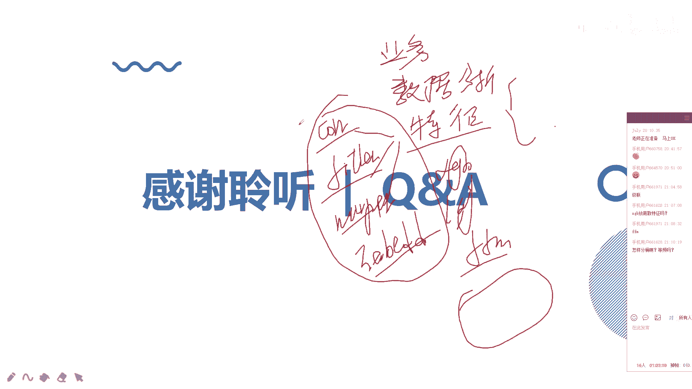

代码不封化，我看看。

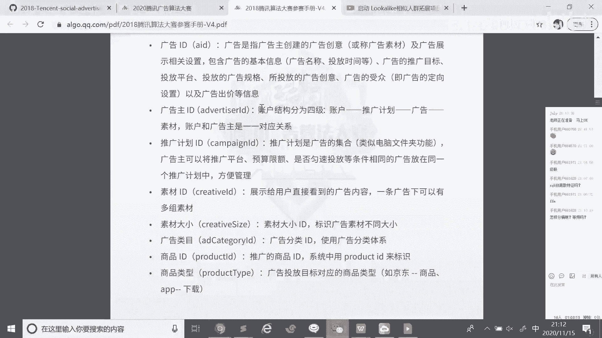

嗯，这是我之前参加这个比赛时候，对吧？比赛时候开源代码。对，就是我每个部分所做的一些工作啊，每个部分其实每个部分就分的非常细了，对吧？这其来说在工业界里中面。是也这样的，就是分的可能就是比我们这种。

更在的就是呃。负数更加更更加高一些。对啊。嗯，比如说我们基本的一些合并，然后系数特征我们该怎么处理，然后特征选择方式。对，然后系数特征2选择2长度retailCVR特征，我们该怎么去去进行构造的。

然后点击只是cl这种我们进行count统计，对吧？retail。我们每个部分的话，我都做了一个特征选择的。大家可以接下去下面去详细的去了解一下嗯，我建议来说对于这种经典赛事，对吧？对腾讯赛这种经典赛事。

嗯，从第一阶段，我觉得从第一阶到目前就是到第四季吧，一期到2020对吧？大家大家都可以去尝试复现一下对。复现大家复现一下思路。如果说想做，就是说做推荐广告这块的部分的话，都需要做一下呃进行一复现。

对它里面涉到业务也是非常多的，也非常经典的一些业务的啊。其实很多的一些很多一些公司，他们也会关注我关注这种比赛的，像腾讯赛这种在国内影响力比较大的对。

但都会想就是说从里面去汲取一些比较好的一些方案来运用到他们的场景里面的。来大有什么问题啊？你看三种话其来说就是经过我们已经筛选过的一个特征了，对吧？啊，因为我们在起来在提交代码的时候。

我们不需要去说再去将我们这个筛选过程再去再去跑一遍了，那非常费时间的啊，所以说我们进行这样的一个一个一个处理啊就行了。就比较简便的一个处理。啊。

啊看一下就是说CVI这我们该如何去进行构造的一个大家了解一下。大家有什么问题可以提问啊？是的是的，任何操作的吧，我觉得就是看模型线下效果了。这也是最直接的。嗯。因V来说的话，你位零特征是非常多的啊。

有时候你看似非常合理特征，但它和其他特征不兼容啊。对，没什么效果啊。你如果只是看哎特征，哎呀，很有说服力，对吧？它的解释性也非常强，但是呢但是最后放下去却没有效果，啊，这其来说就这特征。

就是我们就很难很难用啊这种这种特征。对。那其同学还有没有问题啊？乔同学。这个比赛来说话就是我看有第三名，然后第7名，然后第10名、第11名都有都有开源的对，大家下面的时候一定要去看一下。

因为他们可以用更多一些不一样的方式来解决问题啊，包括我没有讲这么说就是word director或者说deepwork这种我们从网络角度对吧？或从一些序列角度来去考虑一些特征的一些信息提取啊。

对这块是没有讲到的嗯。我们现在解决的话只是其中一一小部分了一小部分了。对，关键的话，你先考虑需要对用户一个召回的过程了啊，你的活跃用户非常非常多，也部可一块儿就是一一起建个模吧。对。

我们需要先去召回一批用户的一批感觉就是说具有一定的一定相关性的用用户用户，然后我们再进行建模，做一个嗯做一个最终的一个筛选匹配啊。同时呢就是说我们嗯要考究是说刚开始我们输的一些一些。

因为这里面也也存在个问题，就是说好像就是说这个数据里面就是说用户一个用户ID对吧？1个UID的话，它只对应1个。对应1个AID1个种子群，没有这种一对多的关系，这也是比赛当中的把他们做了一个处理，对吧？

就是简化这个比赛了，就简化这个业务了。对。全都是一对一这种关系啊，没有这种一对多的关系的这是做了一个优化的做了一个简化一个处理啊。嗯。嗯。这个661628这个提的问题非常多啊，我觉得非常好。

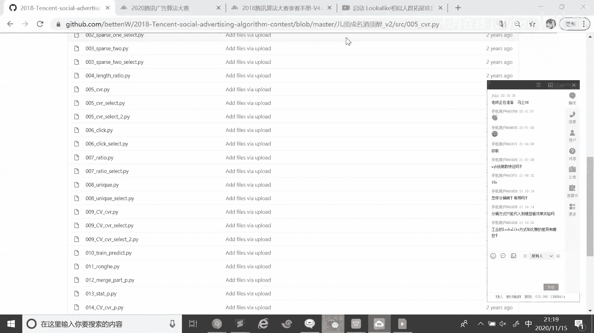

OK那我们今天的分享就到此结束。大家还有什么问题的话。

