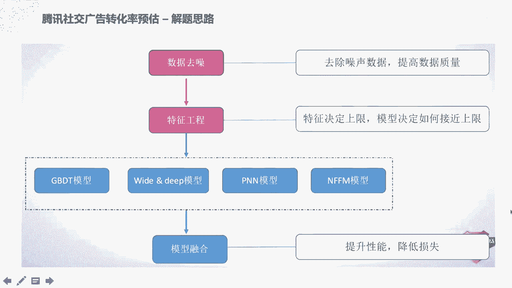
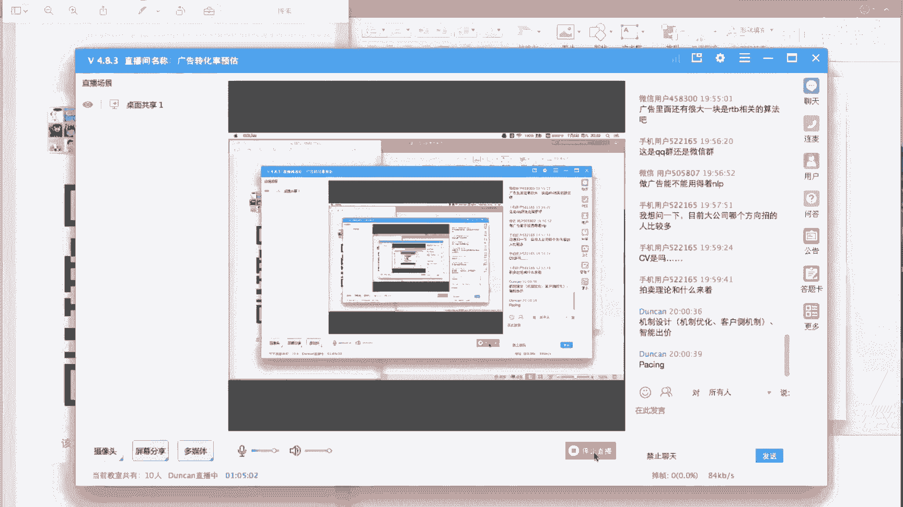

# 人工智能—计算广告公开课（七月在线出品） - P5：带你从头到尾实战广告转化率预估 - 七月在线-julyedu - BV1SA411H7Se

我们现在开始吧。嗯。好，大家好，我是邓肯，大家可以叫我邓肯老师。呃，今天是给大家分享一下关于广告的转化率预估的。嗯。相关的一些技术。然后是以2017年的腾讯的社交广告转化率预估比赛为例子来做分享。

主要这这次的公开课呢主要分成三个部分，一个是。先介绍一下转化率预估的相关的一些背景知识。然后。再介绍一下，分享一下腾讯视界广告的转化率预估比赛的一个冠军的一个解决方案。然后最后在。

再拓展一下呃多目多目标学习的相关的东西。Yes。啊，首先接看一下互联网广告的一个商业模式。对于互联网广告来说，呃，出价和计费主要包括像CPMCPCCPAAOCPC这种出价和计费的方式。像CPM的话。

就是按签字展现来去扣费。就是展现一次就收取一次费用。而对于CPC收费来说，就是按照点击来收费。点击的话就是呃每只有当用户发生了点击行为才会去扣费。而展现是展现本身是是不够不扣费的。

呃SCPA呢是按照那个呃行动来去扣费。就是说只有当用户发生了转化行为才会。才会去扣费。就是点击完了之后，比如说发生了APP的下载，或者说是呃像电商广告的购买行为，这时候才去扣费。

而OCBC呢就是根据转化率来去做智能出价，它本身是按照CPC去扣费的，但是它会去参考。它的转化的一个转化率的情况，来去智能的去调高或者调低价格，最后优化这个转化的效果。

然后下面的话就是呃一个典型的一个互联网广告的一个转化漏斗，就是发生了曝光行为之后才会有点击。点击完了之后才会有访问和咨询。然后这里的访问和咨询是可以替换成就是转化行为。比如说APP的下载。

或者说是电商的一些购买行为。然后像CBC的话，它是只是去针对点击这一层去做呃优化和和扣费。而去OCBC呢，它会参考更下层的这种呃转化和购买行为。而对于广告转化率预估来说。

像我们前面提到的像CPA和OCPOCPC来说，由于都需要去去参考它的转化效果。所以说我们要对它的转化率做一个预估，这也是广告转化率的一个应用场景。转化率预估呢就是给定一个广告的对象。

通过统计或者建模的方法来去预估它的CV啊，或者说是CTCV啊。嗯，首先我看一下CTRCTR的话就是。就是点击除以。呃，展现这就是点击率，这个是很简单的一个一个指标。然后对于CVR来说是转化出于点击。

就是在用户发生了点击之后，是否发生了购买，或者说是呃应用的这种安装下载这种行为是否发生了转化。在点击里面发生了转化的概率是是CVR。而。CTCVR呢是在是呃转化除以展现。

就是在所有的展现中发生了多少的转化。它呢其实就看上面的公式，其实这可以看出它就等于CTR乘以CVR就是说CTCVR它是一个呃可能呃数字更更小的一个可能是万分之几的一个一个数字，就是发生了呃多少点击之中。

多少的展现之中呃，才能发生几次转化。而我们呃现在的一般的预估方法都是针对这个CVR就是发生了点击之后，才会呃有多少呃概率是发生点击，发生转化行为，就是这个CVR。

然后我们这次呃对于那个呃视觉广告的一个转化率预估，也是针对这个CVR的情况。而这里的转化就是说比如说淘宝的一些下单行为，或者说是一些展现广告的一展示广告的一些APP的安装，这种都是后链路的一些转化行为。

然后我们就是要对是否会发生这些转化行为做一个预估。而这个呃问题的一个特点呢就是说数据比较海量。因为总共的呃像不管是呃像腾讯还是呃淘宝，他们的数据都是非常海量的。

然后我们要针对这些海量的数据中做一些特征设计。并且这个转化行为的数据相对于点击行为来说更为稀数。然后我们怎么去解决这个数据的稀疏性的问题。这是这次本次介绍的一个背景知识。

然后下面呢我们就看一下那个腾讯社交广告的一个转化率预估的一个赛题。好。然后。先介绍一下我们这次的呃第二部分内容就是呃腾讯视交广告转化率预估。这个这个赛题呢是2017年的一个腾讯的视觉广告大赛。

他是选取了腾讯在社交广告领域的一些真实的展示的点击的一些日志。就是呃比如说朋友圈或者说是QQ空间这种呃展示广告的一些广告日志数据，然后提供了呃1到30天的总共30天的用户的APP的安装流水。

然后另外提提供了17到30，总共大概14天的一个训练集，也就是广告的呃点击日志，这里已经把那个展现给过滤掉了，就所有的点击日志。然后从这个点击日志里面，我们拿到是第31号的这个呃数据。

广告的点击数据来去做测试，就是说预估他们会不会发生转化。这里的转化呢就是说APP的安装。呃，就是用户点击完了广告之后，是否会安装这个APP的广告，哎，会是否会会安装这个广告的APP。

所以说这个任务呢就是根据广告的日志，然后来预测给定广告，然后用户和用户的呃访问的上下文的这个情况来去预估广告被点击后发生激活的这个APP激活的这个概率。然后它的评估指标就是log loss。

然后他给到的数据信息呢，就包括呃用户的信息和APP的信息和上下文的信息。比如说user的一个user ID就是简单的ID，然后包括年龄性别、呃学历、教育和其他一些用户相关的一些信息。

然后另外是包括APP相关的信息。比如说APP的ID，然后广告广告商的就是广告商他可能会投N多个广告，然后广告商的ID广告商也会建很多个素材，然后素材的ID，然后素材可能是挂载在某一个推广计划下面。

然后包括推广计划的ID然后包括APP的类型。呃，也也有一些访问的一些上下文的信息，比如说广告位的位置和它的访问的一个呃网点，然后包括它发生这个点击行为的日志的时间。

然后包括一些联网方式是3G还是wifi这些联网方式的这些当前的访问的点击的上下文的信息。然后通过这些信息去预测点击后是否会发生转化。呃，显而易见，这是一个二分一类二分类的问题。

就是预测个零或者一转化或者或者不转不转化。啊，评估指标就是呃很常见的这个log loss，这里就对这个log loss就不多做介绍了。然后拿到这个赛题之后，一般的解题思路呢，都是大概就是这么一个流程。

先是去做一些前前面的，比如说一些数据分析，然后这里就不列出来了。然后然后再去做一些数据的一些去噪，呃，然后包括一些再根据数据去做一些特征工程，然后再再去融合尝试不同的模型。比如说GBT呃。

WDL和PN或者NFFM这样的模型。然后最后再对这些模型做一个模型融合来去提升性能。是大概的一个呃每对拿到一个任任务之后的一个解题思路。首先我们看一下这个数据去噪这部分。数据虚道的话，这个比赛的话。

它是呃因为是拿到了是17到30号这14天的一个点击日志。而最后一天的话，数据其实是异常的。因为转化行为，它的链路比较长，就是用户可能点击完了之后。

可能过了呃几个小时或者过过了一两天才会发送才会发生呃转化的数据的回流。然后这时候呢，最后一天的数据其实是有算是异常的。因为呃。就是最后一天它实际发生了转化，它但是有可能这个数据里面的level可能是0。

比就说候他这个数据还没有被被被通知到，但实际上已经发生了转化。啊后所以说对这个数据的处理呢就是直接去删除。

这一类的APP的最后一天的数据就是就是直接把日志中关于APP最后一次转化的之后的数据直接全都删除掉，这相当于去除一些造声数据。然后另外呢，对于APP的一些更新，呃，虽然说它是呃同1个APP的ID。

但是说有可能APP发生了一些呃很大的一些更新行为。然后这时候呢，我们要去把它的呃。根据它的这个转化率的一个前后的这个dF，它如果差别比较大的话，我们直接把前面的数据删除掉。

而这样的话相当于做了一个呃数据的筛选。简这里简单介绍一下，然后我们做了数据渠道之后，就是特征工程。我们都知道对于呃这种机器学习任务来说，特征其实是决定了一个上限。而模型是其实是决定了如何去逼近这个上限。

然后对于特征来说，这是呃在一般的比赛中比较重要的一部分。包括然后这里的话，对于这个赛题来说，就包括像转化率的一些相关的一些特征。啊，比如说APP的一转化率，然后它的位置的广告位置的转化率。

然后用户相关的转化率和一些组合，然后包括一些点击的特征啊，用户和APP的他们的点击的一些呃统计的一些数据，然后包括一些安装的特征。呃，也就是APP安装一般的安装时间和安装的类别。

这种安装类的特征和一些时间特征。比如说点击点击的时间就是一些。呃，点击日志发生的一些时间。然后通过基本的特征，就是前面提前面就是再去直接给到的像用户的特征APP的特征，像上下文的特征。

我们还可以去构造一些呃呃就是统计类的特征。首先我们看一下转化率相关的一些特征，主要是去挖掘呃不同的角度上历史的转化率的信息。就是说呃转化率很简单，就是从转化次数除以点击数。

然后比如说我们就去从某一天开始往前倒推，去去看之前的数据，它的它的一个转化率是什么样的情况。然后比如说我们从APP的角度去看1个APP它比如说呃20号之前就是1718193天的一个转化率的情况是多少。

然后包括这个位置上面。广告位置上面的一个转化率是什么样的？然后对于一个用户来说，用户可能有的是热衷于下载或APP有的可能不太热衷，不在对广告不太热衷。

这时候我们可以去呃从用户的角度来去看他的一个转化率的情况。啊，另外呢我们去做一些组合。比如说呃这个用户呃对于这个APP这种类型的一些组合。然后呃看一下就是点击的相关的特征。呃，第二部分就是点击相关特征。

然后可以分析一下这个赛题的数据，可以看到就是呃用户的点击次数越多，它的转化率其实是呃越低的。就是说用户可能呃有一些特别爱点，但是他的实际的下载其实并没有很多。呃APP的。

他每天的转化率和当天的点击次数是一个大概的正相关的一个关系。就是说他被点击的越多。它的转化率可能也越高，可能是他今他这天的广告创意做的比较好之类的。啊，这是一些点击相关的特征。

然后另外呢也可以去挖掘一些历史的一些对于点击行为的一些。呃，统计数据呃，这里可以从那个分钟级或者小时一天、三天、15天或者总共的这种统计日期去统计一个用户和APP和位置3个角度去做统计。

比如说用户在一分钟前一分钟内点击了多少？呃，点击了多少次。然后他在一个小时内点击了多少次。然后这个APP呢在一分钟内点了多少次，他在一天内点击多少次，3天内点击了多少次。然后包括位置。

然后另外就是一些组合。比如说这个用户在一天内点击了这个APP点击了多少次。这种组合类的特征。然后这种呃特征呢其实呃重点需要注意的一个问题就是数据泄露的问题。就是呃在构造特征的时候。

只能用当前时间之前的数据，就是像这种全局类的特征，其实是只能从当前时间往前倒推到第一天，而不能直接拿过来，直接用后面的日期的数据。所以说这是一个数据泄露的问题。呃，在构造样本的时候。

千万不能发生这种数据泄露的情况，不然会呃就是相当于制造了未来的信息。然后对对那个相应的一些预测结果，实实是很不友好的。啊，另外呢就是安装类的特征。安装类。比如说呃上次APP上次安装的时间。

然后安装这个APP点击之间的时间差，然后包括安装的个数，就是这个用户可能特别喜欢装尝试性的APP他这时候可能最近安装的个数会比较多，有的可能会比较少。然后对于呃。APP来说。

比如说上次装的1个APPID，然后两次安装的APID的这种组合，然后可以保可以保证就是说呃用户可能安装完了之后，可能下次不会再去安装同1个APP了。这种安装类的特征啊，另外也包括一些时间类的特征。

时间类的特征一般都会去做的。就是说呃在不同的时间下，其实它的转化率的情况是不一样的。到时候我们可以可以这里是把那个24小时发成呃分成了448个特征。然后就是说每半小时作为一个做为一个特征。

然后这时候的话去构造这么一个关于时间的特征。然后前面呢主要是介绍一下。关于数据去去造和特征工程相关的一些东西。然后下面呢我们重点介绍一下呃，就是在模型方面的一些工作。然后最后呃简单介绍一下模型融合。呃。

稍等一下，我看一下群里的信息。

首先这个模型呢比如说可以用到一些传统的一些模型，比如说GBDTGBDT就是一些呃数模型这种。然后对于深度学习模型的话，比如说WDL和PN和NFFM这种模型。然后前面的这种GBDT的话。

我想大家应该呃比较熟悉了，这次又不做做做介绍。然后包括WDL和PNA这种呃相对比较熟悉了。然后这次的话是呃介绍一下那个NFMFM这个这个网络。呃。

这个这个也是当时那个冠军的一个解决方案的一个呃模型方面的创新。就是说呃首先呢这个这个模型叫做nettworks onfield aware factorization machine。

就是NFFM就呃它首先呢根据不同的特征。然后做一个pae的encoding。这里可能比如说呃比如说类别类的特征，比如说呃用户这个APP的位置，就是广告位置或者APP的类型。

这种都可以用完号的编码去构造一个非常非常呃就是稀疏的这种呃encoding，就是01的呃完号的编码，做一个稀疏的encoding，然后这样得到一个非常稀疏的一个一个编码。

然后再去做一个呃inbedding。这个inbedding的话其实就是一个lookup table，然后去做呃。呃，去做不同的对于一个。呃。

对于这个sspacepas的这种编码去映射到这种呃比较稠密的特征里面。然后这样得到的一个这个呃结果呢，其实就是对于每一个对于总共得到了一个大概比如说我们有N个feature。

大概就是N乘N乘以K的这样一个一个稠密的一个特征。呃，然后其中呢就是呃这里的话，我们比如说我们先看这个模型的这个左边的这部分，左边的这部分的话，其实是相直接把那个呃。

直接把那个初始的这个比较稀疏的特征做一个线性的模型。比如说用逻辑回归，直接去做一个呃单模型的这这么一个一个渠道。然后对于右边这一部分呢，其实可以看到这这边是1个NN的一个网络。

然后这里呢下面会对这个呃不同的d词的特征做一个点击。然后这样的话就可以得到呃不同的特征之间的一个交叉的这个信息。呃，这其实也是FM的一个常规的一个操作。然后就主要区别就是上面加了1个NN的网络。嗯。

然后他的这个呃los呢，其实就是。它的一个目标函数呢其实就是E加WI乘XI，其实就是左边的这一部分，可能是一个线性模型，或者换成一个呃逻辑回归，其实都一样的。然后对于右边这部分呢其实就是一个呃一个点击。

然后不同的组合之间的一个点击，然后再去接一个比如说这边是一个两层的一个全连接。然后最后呢就是呃最后呢两边会都会去输出一个结果，输入到最后的一个sof mass。然后根据这个soft mass。

或者说我们用一个s的函数去做一个输出输出到一个联域分类的一个概率概率区间内。然，这样的话通过这么一个呃操作，其实就是一个呃FM的一个思想。

然后这里的话它是呃NFFMM呢主要就是它的创新点就是加了一个eleement wise的一个product，就是不同的不同的这个特征重密的特征之间会做一个不同的。特征之间会做一个呃点击操作。

然后这样的话会得到一个呃。每个特征的一个融合的特征。这里比如说呃。其实现大也可以看到这个从这个spa到这个dance的一个映射过程和FM的一个区别呢，其实是呃它会把一个特征会映射到呃多个呃重迷特征里面。

然后去构成不同的这种feature group。这是它跟那个FM的一个区别。对。然后呢呃通过这么一个呃模型的这么一个创新，然后可以就这个单模型的话，其实就可以达到当时的一个线上的一个第三名了。呃。

其实我觉得这一部分呢呃有一部分贡献，但是特征工程上面可能贡献也稍也比较大一点。然后前面呢主要是介绍了一下这个NFFM这个模型。然后后面介绍一下这个模型融合。模型融合的话就是两组特征。

就简单类的特征就是赛题直接给到的这39个特征，包括我们前面讲到的一些构造的一些统计类的复杂特征。呃49个复杂特征。然后融合了呃1个GBDT。

然后1个WDL再加2个PA再加4个NFFM这么这么8个模型来去做一个加强的平均。这样得到一个最终的呃做一个融合的一个模型融合的一个结果。

最后的他们达到的一个效果呢是可以达到一个呃相对于相对于单模型来说嗯，比较优的一个这么一个结果。大概提升了大概1%吧。那个老师还面听了吧。然后另外呢就是我们想扩展一下，就是因为前面前面讲到的就是呃。

转化率预估嗯，但是转化率预估呢其实本身是有两个呃很很难克服的问题的。就是说嗯我我们前面讲到的转化率预估可以看到这个下面这个图。呃，这个这个这个图里面的话，我们看到其实最外层的话是一个展示。

然后中间可能部分发生了点击行为，然后点击中间又有很小一部分发生了转化。然后我们的前面讲的东西呢，都是在在这个点击的这个圈里面去做训练的。比如说我们拿到的都是点击的日志，然后去做呃CTR的预估。呃。

这个本身呢。在我们线上应用的时候会。对。Yes。啊，因为什么是个举证，应白定为原理。哦。那我没。也可以稍微回去一下，介绍一下。就是这为什么是个矩阵？其实就是呃像那个inbedding来说的话。

它就是前面是01的一个完号的。然后为什么会映射到这边一个矩阵？其实是呃其实就是呃。每一个每一个这本身是一个呃比如说one hold的话，它是一个向量，然后它会乘以一个lookup table。

 lookup table本身是一个矩阵。然后这样的话，对于呃对于这个呃这个稀疏的编码，它可能是个比如说我们用那个APPID的话，就是其实它是一个非常稀疏的一个encoding。

有可能都是呃成百上千维的这么一个特征。然后我们如果去直接去做的话，其实它是一个非常稀疏的。然后我们想in呃inbedding呢inbedding的意思就是从这个高维去降去降为到一个低维。然后。

去做降维的这个过程，其实就是直接把这个向量去乘以一个矩阵。然后这样的话相当于从这个矩阵中间去得到其中的一列，去从而就得到这么一个呃这这个这个矩阵的中间的一列，相当于比如说feature一的话。

有可能是对应前面前面第一列。这样的话其实就完成了一个从呃高维的一个比较稀疏的一个矩阵到。比高纬的比较稀疏的一个特征的表达，映射到一个比较稠密的一个特征的表达中间。这样相当于这就是做了一个inmail。

然后呢，就是对于不同的feature，它排列到一起就成了一个矩阵，就这么一回事，这样就得到了一个mtris，就是一个矩阵。然后他为什么做了这么多份儿呢？做这么多份儿。

他是为了后面做一个eleement wise的这样一个点击。这个点击操作呢，其实它是比如说不同不同的特征之间的。呃，相互的关系就可以通过这个点击去表达出来。不同的特征之间的关系可以通过表达出来之后。

就可以得到不同的。比如说这里。呃，比如说我们如果有呃四个特征的话，然后这里面可能里面每个里面只有呃三三个的两两组合。然后不同的点击会映射到这边，不同的组里面。然后这样的话会得到一个。

因为前面都是呃已经经过一个ininining的一个编码。然后这边会得到一个呃点击完了之后一个呃。productduct unit呃就是这样的话就就就得到一个比较呃稠密的呃多维的这么一个一个特征向量。

然后通过这么一个特征再去接一个两层的一个全连接。そか？然，这里相当于这边的区别就是这边是直接接个全链接。对。然后通过这么一个呃特征的表达，其实就呃两边的一个相当于呃左边是一个原始的特征。

然后右边是一个经过高维的提取的一个特征，最后再接到一个ofm上面，然后最后得到一个输出。然后这个隐白镜本身呢，其实就是一个呃就是一个成一个矩阵的一个lookup table的一个作用。

它相当于做了一个特征的降维。然后这个不管是对就是呃执行还是对特征的表达来说都是比较友好的。然后这样呢降维之后，它的呃可以看到，其实可以想一下，这里的主要的参数。

这个网络主要参数其实就是在这个隐白定制部分，这地方参数非常巨大。因为它有那个一个矩阵的一个路这里面。对，这主要是个ining的这部分。然后对于呃后面呢。就是前面是回顾了一下，然后后面我们介绍一下。

就是多目标学习。嗯，回到我们刚才讲的，就传统的CVR预估，就包括我们刚才讲的这个问题里面，传统的CVR预估模型都有两个问题，一个是样本的选择偏差，还有一个训练数据的吸出。样本的选择偏差是讲什么呢？

就是我们在训练的时候，只拿到点击日志去做去做转化率的预估。而我们在线上的应用的时候，在线inference的时候，就是投放系统在线上用的时候，它需要实时的去返回。它的呃预估的转化率是多少。

而这时候我们是不知道这个这个广告是否发生点击。然后所以说我们的预估空间就inference space是在这个大框里面，这样的话其实就是一个样本的选择偏选择偏差。就说我们在点击的广告里面做转化率预估。

而我们在做inference，就是在在做呃在做inference的时候投放的时候去做inference，其实是在一个展示的样本空间里面去做。这这中间的话会会肯定会有一定的gap。啊。

另外呢就是训练数据的稀数问题。训练数据系数是讲什么呢？就是呃因为点击率的话本身可能是4%3%这种这种数据。然后转化率的话，它相对于点击率它更小。其实相当于呃这虽然说我们的展现样本很多。

但最终的这个点转化样本其实很少的，尤其是分配到，比如说前面的APP安装，每1个APP的安装数据其实很少的。就是说我们如何在这更少的数据上去做呃转化率的预估，这里有一个数据的稀数问题。

然后这里的话就是阿里妈妈，他们是做了1个ESMM模型，它就是在提出就是在整个的空间里面去做mty task的 model。这多目标学习。就是呃来做这种对post clickcon的这种转化率的预估。

来去提出了这么一个方，提出了一个方法来去解决这两个问题。我们认为呢就是用户的行为一般会遵循一个顺序的一个决策模式。就先从就用户看到这个广告之后。先是一个展现，先是一个impression，一个展现。

然后才会去发生点击，然后最后发生一个转化这么一个顺序的决策。这个很简单。然后这里的话其实呃下面前面我们提到1个CTCVR和CVR的关系。就是说CTCVR可以看到这个条件概率它是在X发生的情况下。

Y等于一，并且Z等于一的概率。它其实是呃拆分成两部分，一部分是这次展现下发生了点击的概率，乘以这次点击下发生了转化的概率，这是一个条件概率，就是说我们前面做的预估都是在做这个PCVR。😊。

在做发生我们都是在训练这个PCVR，就是在Y等于一的时候，Y就是点击，只有在发生点击之后再去做呃是否转化的这个这个预估。然后这个这个就是我们之前说的这个样本偏差。

然后最后我们再去在实际实际的投放系统中其实是用的呃发生的CTCVR的这么一个一个一个数据出来。然后得到这个公式之后，其实我们可以看一下他们的主要的模型结构。主要模接给我们看右边这个这个图。

这个图可以分成两部分，就左边这部分和右边这部分。我们看左边这部分呢，其实是做CV尔的人物的特征，然后右边这部分是CTR的一部特征，这两边特征可能是完全一样的。然后对于呃对于它的这个网络的任务来说。

其实是呃它的是主要分成了两也是左右两部分。左边它称之为man的就主任务，右面是辅助任务，左边的这个主任务，就是去预估这个PVR就是我们所需要的这R然后右边呢就是PCTCVRPC是我们观测到的数据。

然后PCTR就是常规的一个点击率预估。然后通过呃点PCTR和PCVR的这个成绩。就是我们这边前面提到这个公式，然后最后得到PCTVR然后通过这么一个呃组合来说。

它就可以把这个PCTCVR的这个lo传到这左边来，然后同时这个网络其实还有一个特点，就是我们从下面看，最下面是一个dding的 layer，就前面我们也讲到了dding一般是怎么做的。

当然我们也有其他做法，然后这里就是说那个 table的一些dding的方法。然后通过呃inbeding呢inbedding这里我们也前面讲到两边的呃这个inbeddding操作的参数是非常巨大的。

然后通过这个CVR的任务和CTR的任务，他做了一个呃就是share的就是参数共享。两边的look table的参数是共享的，这左右两边的参数是完全嗯完全共享的，这样的话就可以有效的去降低参数的数量。

降低这个模型的复杂度。这样呢呃也是任务，也是这这这么做的一个好处也是显而易见的。就是说呃像一般的传统的CR预估，这里做这个影白店的话，只有这个在点击日志上。

只有在点击日志上才去训练这个inbedding。但是我们可以去融合这右面的辅助任务，就是CTR这个任CTR预估的任任务来去更新我的inbedding的呃参数。

这这样的话它的训练训练样本可以变得更更加充分。然后中间呢是做了一个fieldd wise的一个polling。然后最后把它的呃不同的特征过来之后，直接concca呃concca一起。

然后再分发到一个多层的一个呃多层的一个全连接，就是神经网络上面。然后这里的话，这这里的网络可以替换成其他网络，可以做自己的自由组合。然后然后再上头再去呃两两个不同的任务，一个是对CVR做移估。

一个是对CTR做异估。然后然后PCTR和PCR乘到一起，再去预估1个PCDCVR，然后通过PCDCVR的监督数据和PCTR的一个监督数据来去反反传到两个网络中间去更新参数。

然后这样的话是这样的一个整个的一个模型结构，其实就是主要分成了左边一个主任务，右边一个辅助任务。这是主要的一个模型结构。其实可以看到这里。呃，它的一个主要的特点，相对于我们之前讲的。

像在点击日志上去做去做的话，其实它的优势是很很明显的。一个是。可以在整个样本空间上做建模。就是说呃原来的呃一般的传统的这种转化率预估都是在都是在那个呃点击日上做。然后这里的话由于借助了这个辅助任务。

这个辅助任务的话，它是可以直接用到呃全样本的一个数据。然后这样的话就可以做一个监督的信息来去辅助我这边隐白定的训练，然后包括这边参数的一个更新。然后然后又由于这边的embedding的参数是共享的。

就是说我们可以去利用，就是之前呃没用过的这种展示的，就是点击点击任务里面的inbedding来去做我的呃转化率的任务的一个inbedding。这其实也是类似于一个天移学习的一个概念。像一般的los呢。

这里像像这一般的los其实就是呃我像传统任务的话，只用这个PC瓦的这个lo，就假设PCVR。呃，等于这个PCDCVR这么这么不是PC吧，就是假设我在这边的转化，等于这边的转化是传统人务。

然后这里的话是对他们两个做了一个显示的区分。然后然后这里的lo呢就就分成了这么两部分。一个是呃对于CTR本身的一个lo，像一般的CTR任务的一个本身的lo。

然后再接上一个呃两边的两边的eleement wise这呃相乘的这个这么一个。呃。相乘的这么一个los，然后把这两个los加在一起来，作为我们最终的一个训练的一个los。然后整个网络结构就是这样。

就是说主要就是两个特点，一个是。可以利用CTR的任务来去做一个辅助，从而可以在整个样本空间上去做建模。啊后另外一个呢就是在inbedding的这部分，我们做了share的lookup table。

就是说可以去一个是有效的降低模型的参数，降低模型复杂度啊，然后另外一个呢就是由于我们是在整个样本空间上去做。

所以说可以利用这个CTR任务的呃这些训练数据来去给CYR任务的inbedding提供一些额外的一些信息。这是ESESMM这个模型，它的多目标学习就解决了我们之前讲到的呃传统任务里面的一两个缺点。

然后可以看到它这个呃学习的话，其实看它的呃这个结果的话，在在不同的任务上面。呃，比如说左边CV尔的这种任务上面去做的话，其实像这个红色的虚线里面，其实它是比其他的模型都是要要要比较好一点的。

这边它评估指标是AOC。AOC的话，这边就不做展开介绍了，就是一个呃。关于转化率预估里面的续的一个一个一个一个评估指标。像传统的一些点击率股里面也会用这种评估指标。然后这里的话。

比如说让们去对比了一些嗯。其他的一些特其他的一些模型，然后去其实看到它的数据效果是比其他要好要好很多的。然后今天大概就是这样，然后下面是咱们的提问时间，提问时间可以简单提问一下。然后。好，看一下群消息。

是不是讲的有点快呀？啊，跟word to actor嗯对有一定的相似度。word to a本身也是一个。呃，也是一个呃就是in白ing的一个方法。觉得是。谢什么。😔，这代码的话，我这边是没有的。

我我可以找一下，然后找到的话，就是后面我会发到群里面。他应该都在群里面吧。然后包括这次的PPT的话，后面我也会发到群里面。整个样本空间没听懂啊，整个样本空间其实就是刚才可能讲的有点快哈。

就是我们再看一遍这个其实后面就就讲了那个模型细节。就后面的话就是这这页的话是模型细节。我们回到前一页。😊，前面的话，这这里的话是做了一个背景的输入嘛，就是还是这个图。大家记住这个图。

右边这个图就是在用户发生了点击之后，这是比如说这个点击的结，发生了展示之后，就是展示的集合，是最后面的一层展示集合。然后中间是一个。呃，点击就是用户可能有的点了，有的没点，然后中间是一个点击了的集合。

然后最后中间是一个点击里面发生了转化的集合，它是也就说是一个角色模式，就是说从广告的展现，然后到点击，然后到转化这么一个顺序。然后可以看到像传统的，像我们之前前面讲的那个腾讯的社交广告比赛。

其实他给到的数据都是点击日志，没有给到原始的展示日志。点击日志的话，它本身就是相当于对一个展示日志的一个抽样了，它本身就不是一个整个整个的样本空间。然后对于。对于前面的任务呢。

它其实是在这个点击日志里点击日志里面做了一个转化率预估，然然后来去做一个呃训练，就training space训练数据是是完全是在这里面。然后实际我们在呃在工业界在广公司里面去做这种呃转化率预估的时候。

其实我们是不会去等到发生点击行为之后才去做转化率预估的。而是。当一个广告展现过来，或者说广告展现还没过来，就是广告的发生了召回之后，我就需要给出它的PCTR它的它的点击率是多少，它的转化率是多少。

所以说我们在inference的时候，也就是在inference的时候，是在这个整个的展示空间里面去做的，就是。就有inference space。

就是传统的和这个传统的传统的工作和这个ESMM模型之间的一个主要的区别。然后所以说后面讲到那个呃全样本空间呢，其实就是在讲这个事情。就是说呃原来的像传统的，他们只用这个点击日志。

然后然后这里呢其实是我们用了impression，就是呃整个的展示日志，相当于原来的比如说是呃10万个点击日志去做训练。然后这里的话可能用到呃呃1000万的这样一个数据集去做去做训练。

就相当于他们之间是有一个数据的数据的gap的。这是一个全样本空间。就相当于因为后面是融合了这样后面这个辅助任务里面去融合了呃点击率点击预估的这个任务。

所以说这里可以去呃根据这个呃全样本空间去对那个转化率预估本身做一个修正，相当于是在一个全样本空间一个建模，不再局限于这个点击日志里面。这样的好处就是说我们在线上做inference的时候。

包就可以保证训练空间和inference空间是同一个样本空间。这样的话发生的得到的效果，肯定是更好的。群号群号，我稍等，我我问一下。其他我问一下那个助教老师吧。哦，这个你般证去得是我其实要。白？对。

就是说inbedding的话，其实是我们呃像这种做包括做点击预估，或者说做其他任务的一个呃常见的一个操作。就包括NLP里面的相关领域也都有这么一个常规的操作。就说原始特征。比如说我们对用户用户的话。

比如说呃腾讯的用户，可能有十几亿十几亿的这个一个ID。如果按照one号的去展开。大家可以想象它是一个什么样的一个情况。所以说我们要把这个原始的这个这个。呃。

原来需要做网号的这种特征去做一个inbedding。ebedding其实就一个降维的一个操作。对。降为到一个低位空间，然后它的表达更为稠密。原来可能是000001000这种这种数据，然后之后呢。

可能会是一个浮点数的一个一个向量。我可以把那个。嗯。把那个群，但会群的二维码，我展示一下，大家可以进群。稍等一下，我把群的二维码发一下。😔，这左边有个群的二维码，大家可以进群。呃，我看一下一个一个看啊。

这种方式不同的特征可能用一列向量的记数。对，是是这么就不同的特征，就是一列向量。对。比如说用户ID原来可能就是12345678这种这种ID类的特征。然后我们如果用语白点展开之后。

可能之后就是一个呃很稠密的一个一个向量。啊，最后加个全连接感觉像是分类，但是转化率转化率预估首先就是个分类问题。另外呢这里面提到加个全连接感觉像是分类。

这个其实是全连接和分类是两个完全没有关系的一个东西，就是不是就不是没有关系。就是说呃全接也可以做分类，也可以做回归，然后转化率预估本身是一个回是一个分类问题，是一个二分类问题。

就012分类就是发生转化或者不发生转化。然后最后输出的是一个概率。是一个是否发生转化的一个概率。然后全连接呢本身是呃跟是否分类是没有一个呃强相关的一个关系的。嗯。😊，样本分布不一致怎么处理？

比如在线数据拿不到离线数据。哎，对，这这是个好问题。就是说呃样本分布一致怎么处理？就是在线数据拿不到离线数据的呃，离线模型参数和预测其中的数据再训练。这个预测集中的数据在在那个训练集中没出现过。

我理解就是应该是问句，比如说呃像那个呃APP的这种转化率预估的任务来说，呃，有可能原来的呃在比如说我们刚才讲那个。那个转化率预估的那个比赛里面。有可能原来的呃。有就是有可能嗯在第31天也是在预测集里面。

就是你所谓的预测集里面会会有一个新的1个APP。这时候在之前的训练集中肯定是没有出现过的这就也其实这这不是一个样本分不一致，而是。一个冷启动的问题。

就是说对于这种新出现的APP或者说没见过的这种新用户或者新新。新APP怎么去做他们的转化率预估？然后这里是没有做特殊处理的。呃，相当于我们是因为我们之前提的特征是包括一些类别类的特征。

比如说这个APP是属于哪一类，或者说这个用户他有一些学历，或者说是年龄这种这种分类别的一些特征，就是呃比较呃比较呃。就比较呃高维的这种特征，它可以去呃在一定程度上去解决这个问题。

但是说肯定效果也不能说太好。这个这个问题是一个呃。呃，很难解决的问题。就是说一般的话都是用一些呃比较抽象的一些表达。比如说呃不用特别就是specific，就是特别。呃，具体的这种特征去解决。

而是用一些比较抽象特征。这种操作这种操作是。哦，就是inbedding的embedding的话，其实你大概搜一下，其实很常见。呃，这样叫像对，就是你看一下word vector。

对word vector其实看到word vector之后，大概就能理解这种操作的意思了。多秒训练是inbudding的参数共享，那代lookup代表是指示吗？啊。

这个inbedding感觉大家都是都是对这个ebedding很疑惑啊。啊，这个这个inbed的话，其实刚才已经讲过一遍了，就是它相当于就是呃。呃，就是一个比如说E。乘以M这么一个这么一个操作。

然后最后得到一个比如说嗯就是前面的E的话，可能就是原始的一个one号，然后再乘乘以一个M，就是一个矩阵。啊他们俩做了相乘之后，其实会对于每一个one号来说，每一个特征来说都能得到一个更为稠密的月吧。

比如说这个E的话是呃。11千维。1000，然后乘1个M的话，比如说是。第时长。以前0。然后这样的话就可以得到一个比较稠密的一个实的一个表实维的一个表达。这样的话就是说这这就相当于做了一个白领。

就是说原始的是1个1000位的这种呃完号的编码的数据，然后经过一个矩间的相乘，然后得到一个N。然后这个M的话其实就是一个一个参数。学习的参数。多明融合的怎么保证在同一个量钢下求的平均。

多模星融合在同一个亮钢，因为这里是做的二分类。这里是做的2分内。然后是呃其实是做了一个log，可以看在前面一下。把那个二维码拿出来啊，大家可以没扫码的，可以可以扫码进去。辅助。😔，可比。

辅助信息的明白你可以。平均可以解决能启动。对，这也算是一种解决办法。广告做推演差别大嘛嗯。广告和推荐的话哈，我是呃区别的话，其实。对，上把牛的话都有前途。对，是这样的，就是其实他们两个是呃很很就是呃完。

就是他们的交叉特别特别大。就是说你做，不管是做广告还是做推荐，都需要做点击率和转化率预估。然后包括你做推荐的时候呃，和做广告的时候，他们之间的呃。😊，呃。

这边的优只能说是他们的用到的一些基础基础的一些算法能力都是都是一样的。就是。呃，就是包括你基层的点击率预估的，或者说转化率预估，包括一些呃像搜索的里面，搜索里面可以去做LP的一些工作。

包括你展示之间的一些呃包括冷启动啊这种问题。其实在两边都是相通的。然后区别呢可能是两边的优化目标是不一样的。比如说做广告的话，我们是为了呃多赚钱，就是给给给公司做来更多的收益。

所以它的优化目标会对那个对那个排序的一个权重会更注重那个ECPMECPM就是会会参考广告主的出价。而做推荐的话，可能更更是呃用户侧的一些优化。其实他们他们的技术能力大多数都相同的。一般做过推荐的。

转到做广告或者做广告的，转到做推荐都是可以的。然后然后广告的话可能呃。需要的呃能力更加综合一点。因为广告还涉及到一些，比如说机制设计一些一些工作。比如说你是CPC广告还是CPA广告。

还是OCPC广告这种。他需要的能力更多一点，包括一些拍卖理论和博弈致博弈论一相关的一些东西。然后他们的交叉是很大的。然后做广告的话，可能能力要求更全面一点，更多一点。广告对啊，这个的话大家进群之后。

其实是我们后面的话会开一个课程，就是专门来讲那个广告的。就一个系列课程。一为系列课程专门就是把广告的从头到尾就是涉及到的一些东西全都全都涉及到。然后最后的话大家可以看几个重点关注的方向。因为里面的话。

大家其实是对于所有的所有的涉及到的所有的这些技术都得了解一下。然后有一个一两个一个重点的关注的方向就可以了。啊，我目前在用金G买的。对。啊，这个是很火的，最近就是像GCN。

GCN和graphbadding的话，其实是呃这段时间很火的东西。像阿里他们做那个包括腾讯做社交广告，阿里的呃做一些呃搜索广告的一些召回，其实都在用那个GCN来做。这是一个现在也是一个研究的热点。对。

有一大块是RTB相关的算法。对，是这样的，这是跟那个推荐的一个主要的区别吧。然后这里面就涉及到一些广告的机制设计相关的东西。然后后面的话，我那个PPD会会分享到群里的，会让那个助教分享到群里的。这个是。

做乖份卖点。对。其实拐粉白dding的话呃比其实是比较前沿了。像像那个左边左边微信群，像拐粉 emdding的话，是呃现在只有大公司能搞得起来。像一般的我们还是用传统的方法去做做召回。如果是。

像大公司的话，做拐粉管理也是一个尝试的阶段。因为它。嗯。对对那个计算能力要求比较高。那不只是一个没想的问题，还有一个工程时间的问题。这些效果的话，其实相对于传统方法并不一定能提升太多。

能不能用找NRP可以的，广告是是呃很多很多就是专门做NLRP的，需要需要专门做NLRP的人。比如说因为广告涉及的东西太多了。比如说搜索广告里面肯定的需要NRP，比如说宽域的一些改写。

或者说语义的一些理解啊，搜索广告，比如说就拿百度来说吧，百度你搜索广告词，广告怎么去做做通过广关键词去做去做广告的召回，这时候肯定有NLRP然后包括一些呃现在的一些呃热点是做那个智能创意。

就是说根据广告内容就不需要广告主自己去制作创意，就是可以通过一些呃NLRP的一些工作去做短标题的一些生成，这种也是涉及到NRP的一些东西。同时包括一些语义的呃相关性。

就是不同的呃广告和和query之间的相关性也需要做。其实其实大家如果是对LLP比较了解的话，可以关注那个呃就是对NLP比较了解。同时想做广告相关的工作，可以重点了解一下相关性相关的工作。

哪个方向招的人比较多？嗯。招的人比较多，我感觉是呃像其实像做那个呃点击率预估和转化率预估这种，其实是大家都比较熟悉，就是招的人大家都需每个公司都需要，但是。诶。但是就是候选人也比较多。

像但是像一些比如说机制设计，像一些广告的一些拍卖理论，了解这部分的候选人比较少。其实。呃，就是大家可能在在那个招聘的时候，就是不一定要去关心他招的多，而是。呃，就是也要考虑那个候选人的数量嘛。

就是这个比例大概有多少。其实我现在感觉下来就是关于机制策略的相关的呃相关的候选人比较少。而且是另外一个就是NLPLLP的话，其实也也是现在的一个热点。像图像领域的话，现在其实是呃有点有点饱和。

想算好好样。所以说就是如果是方向的话，我建议是一个是像拍卖理论、机制策略相关的工作。另外就是或者是就是LRP相关的一些工作。对 si位。图像的话现在。怎么说呢？就是。嗯。

至少在广告这边的话会比较比较饱和一点。机制机制设计。或者说是。呃，只能出价。因为这部分的话，其实你像学校里面出来的同学的话，其实是接触不到这这部分东西的。然后对于对于公司里面的话，就只有在做相关的工作。

大家才能有机会去接触到。所以说这部分呃圈子会比较小，就是大家做这部分工作的会比较少一点。而这个机制设计呢，其实包括呃像客户就是机制优化。哦，就是。抠车。通了机址。好吧。

python大家可以看看python这种这种工作是是在做什么内容可以简单了解一下。然后我们后面的呃正式课程会对这些东西都做一个系统的介绍，包括机制设计和LLP和召回和拍卖这些东西都会做做介绍。

然后大家听完之后可以选一一两个就是比较感兴趣，擅长的内容，然后再去做一个求职。对。好，大家嗯还有问题吗？没有问题，今天就就这样吧。好，再等再等一分钟，大家没问题，今天就这样吧。

大家可以关注一下我们后续的课程的开通。这个是视频应该是有录过的。是有录播的。关于inbedding这个其实很简单，大家不要把这件事情想的很复杂，其实就是一个把高维降降为到一个低纬的这么一个过程。

防止那个模型模型太太复杂。其实就是一个编码的一个操作。这个其实很简单，大家其实就是一个对于当然有很多种这种inbedding的这种方法。

然后这里的话其实大家了解一种就是呃像那个矩阵相城这种就可以lookup table，也就是也是这里提到lookup table。然后同时还有一些上一些哈希啊这一些东西。其实就是大家了解一下。对。

要学习一下那个water to vector，其实里面的理念是很像的。然后这里的话比w to vector更简单。好，那今天今天就这样吧，谢谢大家，今天就到这样，到这儿了。😊。

