# 人工智能—计算广告公开课（七月在线出品） - P6：基于电商广告的点击率预估实战 - 七月在线-julyedu - BV1SA411H7Se

然后今天我们给大家讲一讲啊CTR就是我们所谓的电商，或者或说广告领域非常重要的点击率预估或者转化率预估的这样的一个问题。然后今天的话我们会先focus在比较成熟的大部分公司。呃。

没就是即使是神经网络上了，他们也不会弃用这些方法。这些一些比较传统的machine learning的一些方法去做这样的一个问题。

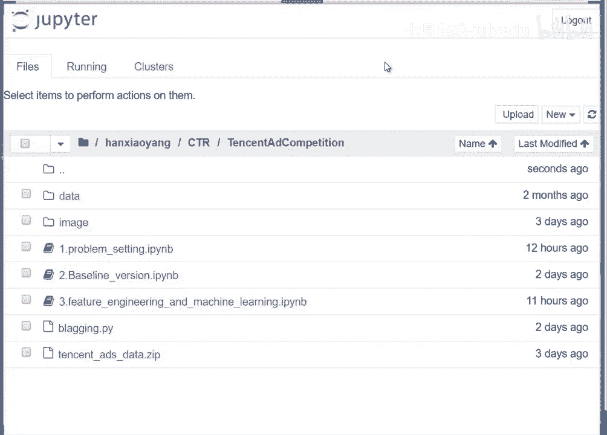

好，然后我们先来看一下这个问题的设定。呃，因为。

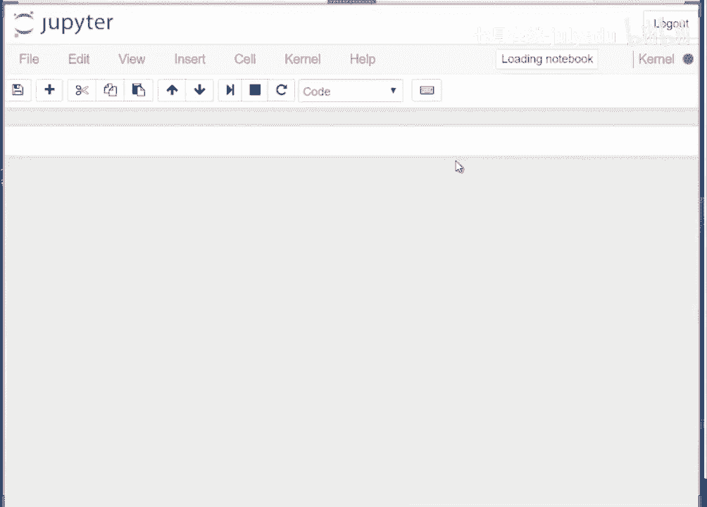

天罗上那个数据的话。对，cago上那个数据的之前cago的那个案例的话，很多同学已经看过了。但是那个案例呢可能离大家稍微有一点点远啊，毕竟是嗯海外的一个场景。然后我不知道大家有关注这个比赛嘛。

是腾讯的一个啊移动app的一个广化广广告转化率的一个预估。这个应该是这个比赛应该现在还在进行。嗯，但是已经不能报名了。

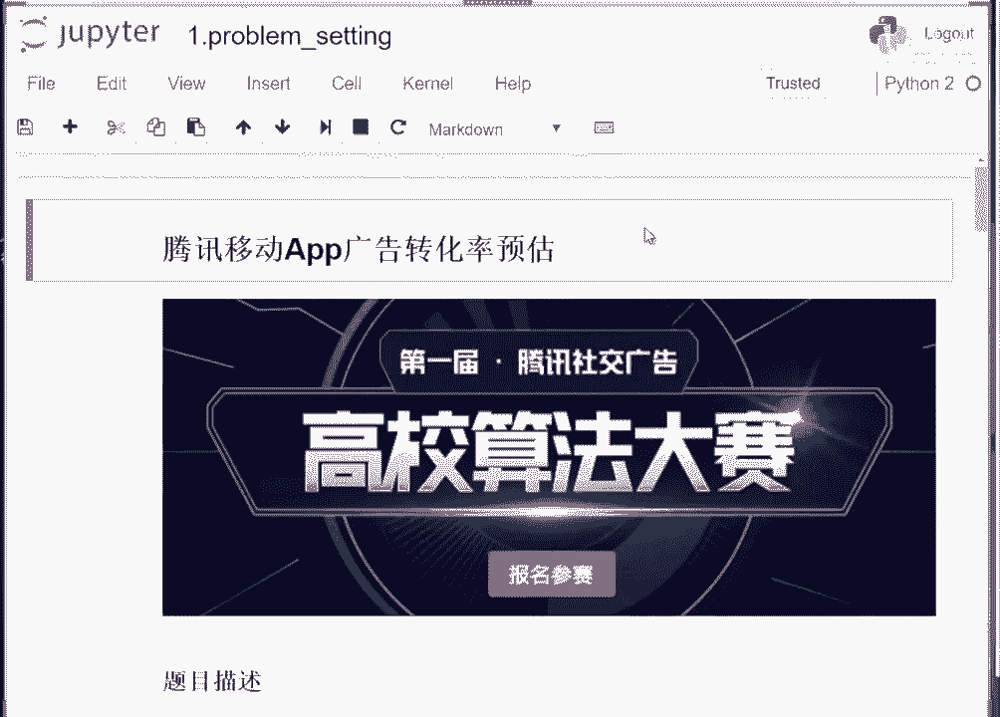

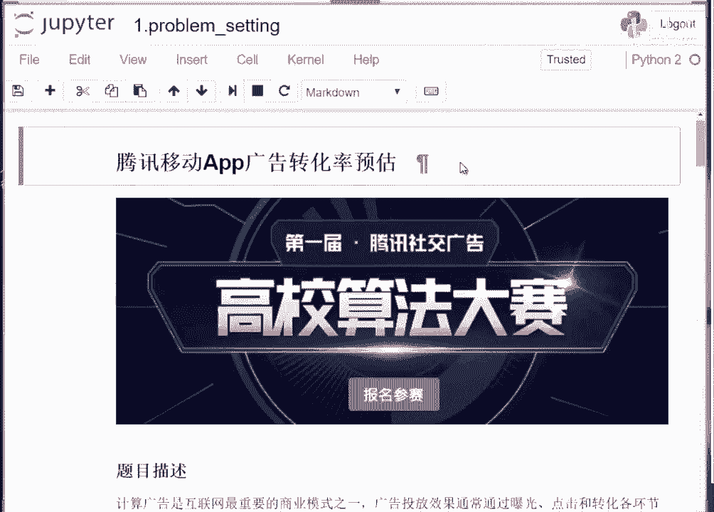

对，然后是腾讯今年举办的第一届呃算法大赛，然后针对的就是这样一个问题。所以你看呃你要知道这些大公司去举办各种各样的自己业务场景下，各种各样的比赛，一定是有原因的。这块业务对于他而言本身非常的重要。

比如说你会看到像天猫，像京东。每一年都会有一些啊类似于这个呃叫rank结果排序，或者是recommendation推荐系统的一些比赛。那腾讯呢今年的首届的呃算法大赛呢是拿出来了这样的一个问题啊。

是他社交广告上的。社交广告上的一个广告的转化率预估的这样的一个问题。啊，所以这个这个比赛大家可以去搜一下，现在应该还在进行，还唉不过应该已暂暂时已经不能再报名了。

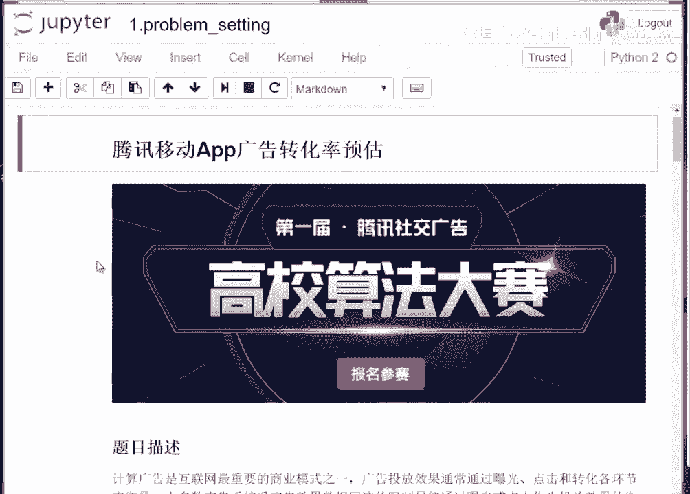

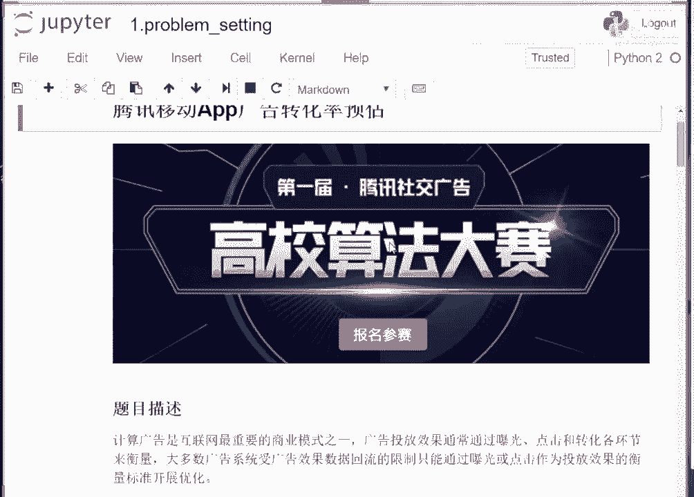

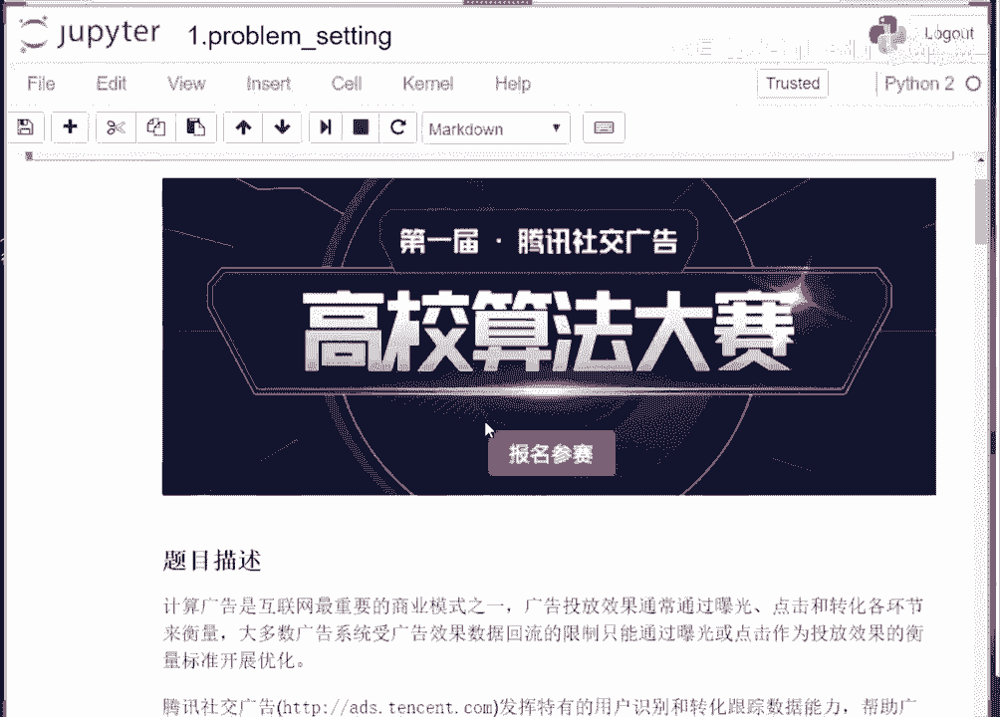

然后背景大概是这样的，嗯，这是一种一种其实是互联网的一种形式。就是到现在这个时候呢，大家会发现。广告这个东西无处不在，而且它做的会越来越原生态。所以有时候你发现不了这个东西。它是一个广告，比如说你去。

啊，但是微博没有做的这么好做的这么好了。就是你你刷微博现在也可以看到一些广告。那你看这个今日头条，或者是有些同学用啊网网易新闻或者天天快报，那里头都会放一些。和结果非常相近的这样的一些内容啊。

就是原生态的一些内容广告。OK那所以你在很多很多的场景下都会看到是互互联网的一些应用上，都会看到这样的一种形式啊。计所以这是呃大有很多公司它的营收的一个主要来源啊，叫叫计算广告。

那么大家知道像google这样的公司，或者是像facebook，那广告的营收可能占到总体营收的百分之嗯。像google的话可能能到90%。OK所以计算广告的话是互联网重要的一个商业模式之一。那广告的话。

它投放的效果投放的效果会通过一些指标来衡量了。包括说它的一个曝光。啊，比如说大家打开微信，你看到你的朋友圈，偶尔会出现一个出现一条广告。那那这种广告的话，它是通过通过曝光来。做一个衡量指标的。

然后还有点击。对，因为发生了点击，说明用户和这个广告有交互嘛，说明他可能对他有一些呃可能感兴趣，对吧？因为然后转化转化是另外一回事了就是。大家看到电商网站上，比如说像淘宝啊，那有一些商家他是投了广告的。

所谓投了广告，就是他希望能够。通过以付费以付费的方式，让啊搜索广告的场景下，以付费的方式让自己的结果能够更。多的曝光在用户的这个呃页面上。对用户看到的这个结果上，同时呢能够呃最好是能够有一个转化。

也就是用户能够点进来去购买啊，O。所以这里头有几个环节啊，第一个环节是曝光，对吧？先要用户看到用到用户看到了以后呢，有一些广告的形式啊，嗯，它是比如说叫叫CPC，它是以以这个点击来收费的。啊。

比如说像百度的。广告像。淘宝大家打开淘宝你的这个app端，然后你随便搜一个东西，你去看你的第一位。嗯，然后每隔5个位置可能会有一个广告。对，然后这个时候呢这些广告呢，你只要发生一次点击，这些广告啊。

包括百度的话阿里的发生点击，它就会有一定会会。有一定的收入。然后转化呢是。在点击之后的一个行为，就是我点击完了之后，我可能会发生购买，我可能会发生后续的一些呃行为。所以大多数的广告系统呢。

因为它能观测到的这些信息只是要这样一些信息，所以基本上是通过曝光或者点击作为投放效果的一个衡量来展开一些优化。

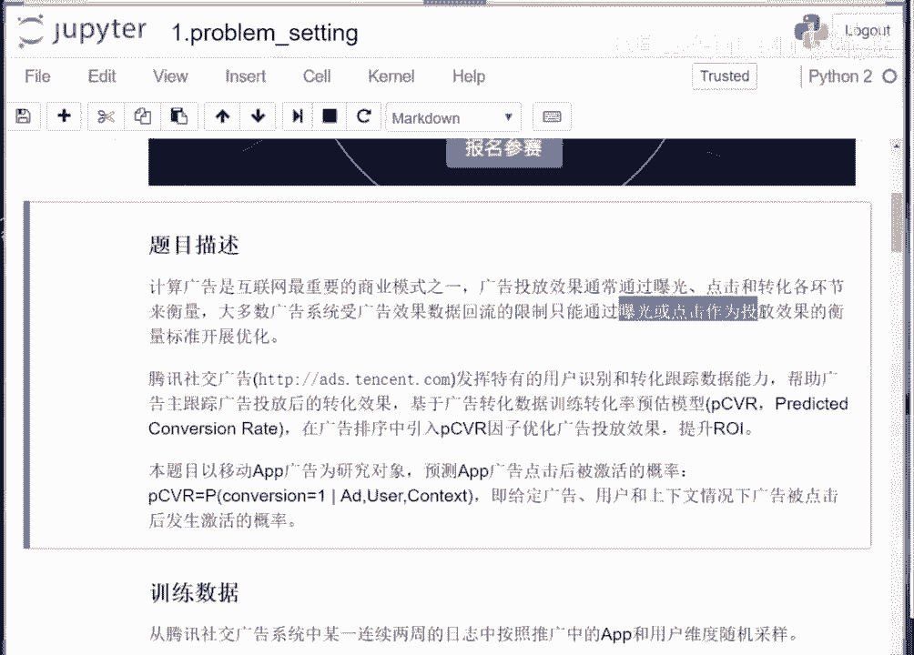

然后腾讯的话，它有一个部门叫叫广点通OK然后负责的主要是广告这一块的业务。呃，然后广当然广告这个东西。本质上。这些商户或者投广告的这些这些人是这些广告主，他是希望看到收益的。所以平台侧啊。

比如说像腾讯的这个广告平台册或者是阿里或者是百度，他们会。那也会去follow一下这个呃广告主投完以后的一个转化的效果。因为广告这个广告主最终关心的是这个东西嘛，他花了钱。

他希望说我能够提高我这个东西啊。卖出去的一个概率或者怎么样OK。所以刚才我们说有点击到最后转化的这样一个步骤，它是有一定的概率的，发生了概率的。然后你可以基于广告转化数据训练去得到一个模型啊。

叫做PCVR啊，包括我们现其实在电商的话，一般情况下我们会预估几个东西啊，一个叫CTR叫click three啊，click through就是点击点击率。因为我说了，有一些广告它是以点击来计费的。

所以就是说这个结果出现的时候啊，当我搜这个ok我搜搜这个机械键盘啊，那当我这个投了广告的这些机械键盘出现在广告可以出现的位置的时候，最后会不会有人点进去会不会买买这个东西啊。

那会不会有人点进去看点到详情页，这个叫做。预估这样一个概率的话，叫做CTR叫做click through rate啊，点击率。那点到我点到这个详情页之后，我会不会下单这样一个概率叫做转叫做转化率啊，叫。

preredictive这个 conversionversion rateOK所以主要是CTR和CBR这样2个。概率我们需要去搭建一个模型去预估，从而知道说啊当一个用户来了之后，我给每一个广告。

我给出一个广告，那他。会点击一会点击进去，或者说我会会发生转化啊，不管这个转化是下单，还是说其他的一些像这个地方是一个一个下载安装。O这样的行为，它的一个概率对吧？

然后所以我可以优化我的结果去对结果做一个排序啊，或者说对它的展出去做一个形式的变更啊等等。那最终是为了提高啊，这有一些电商的一些术语啊，叫RY对。

然后这个题目这个腾讯的这个比赛呢是以它的场景是一个移动F广告。这样的一个研究对象为背景的这样一个题目。那他做的事情呢是呃大可能是像像QQ空间或者是其他的一些位置啊。大家知道腾讯有很多产品啊。

包括QQ包括微信啊，那会有这个QQ空间或者是微信的一些朋友圈。OK那你当他给你推荐一个app的时候，那大家预测大家这个app被被点击以后被激活的一个概率。

也就是说你可能会到app store去下载或者怎么样，被被被激活的一个概率。所以。对，所以这个PCDR呢在这样一个场景下，就是说当我给定一条广告，对吧？当我某一个用户来了之后。

我根据这个用户的contex contextt就是上下文嘛，我的一个之前的一些行为啊，然后去。发生这个转化的概率到底有多高啊，比如说这个时候是app被激活的概率有多高？ok好，这个是大体的一个背景。

实际上我们要做的事情，大家显而易见。可以知道是一个二分类，对吧？也就是说我在我想知道呃在点进这么多feature啊，所有这些featuread广告user以及contex。

这么一些feature的情况下，我最后去发生转换这个概率啊发生转换。或者不发生转化这样一个二分类。只不过这个二分类呢，我可能希望你以一个概率的形式给我一个结果，而不是说像一般的这个随便找一个分类器过来。

你告诉我是零或者是一啊，我想知道如果它是一的话，它是一的概率有多高啊，也就是发生转化的概率到底有多高啊，你给我一个概率。所以这显然是一个呃机器学习的一个应用的一个场景一个领域。那我们来看一下数据。

因为所有的问题，mine类的问题都是我们把它大部分情况下，我们把它叫做数据驱动的问题。所以。模型是一方面，那是本身是你是需要用数据的方式去驱动最后的这个产出最后的这个结果。那不管你是用数据分析的方式。

还是用建模的方式，其实都可以，都OK。好，所以训练数据呢是腾讯的社交广告系统。呃，连续两周的日志，他去做了一些采样。然后包括按照这个推广中的app，因为呃他可能会推广很多很多的。

app然后这些app的话。有一些量会非常大，有些量会非常少小，所以他呃推广的这个频度不太一样啊，所以他可能会对他去做一个采样。然后包括用户用户的话。

其实大家知道QQ和微信的这个用户所有的用户用户量是非常非常大的。所以他可能根据啊用他所谓的用户维度可能是一些不同的一些维度，举个例子来说，可能是不同的地区，对吧？

那可能每个省我都要采集一些ok不同的这个年龄或者是性别，对吧？那反正他有一些参考的维度，他去做了一些采样，意思就是告诉你说，这是啊腾讯的社交广告系统，网点通里头真实的数据，但是呢我两周数据太多了。

所以我我去给你做了一些采样啊，但是即使是采样之后啊，这个数据量依旧是还是挺大的。大家可以自己去试一下。但是你的。如果你自己这个啊电脑的这个内存不是太够的话，这个系这个我我给的这些代码可能跑起来。

这个速度会比较慢，可能需要等一等。OK然后这个地方的话，每一条训练的样本呢实际上是一条记录啊，就是说现在有一个有一个用户过来了，有个contact上下文，对吧？我曝光给了他一个广告，这个情况下。

他这样一条记录啊，然后会有一些信息相关的信息了。比如说这个时候点击的时间啊，叫click time啊，label当然是取零或者一了。

刚才说了这是一个很典型的一个分类的问题零就表示说啊这个用户点了这个对吧？点了这个app，让他发现说我不想安装ok那一呢表示说可能有发生转化。那如果label是一的话，它还会提供一些额外的信息啊。

比如说这个地方的这个转化回流的时间。OK啊，那做详细详细的这个特征的话，不是不能说特征啊，这个时候还没有到特征。详细的数据的话是啊下面就列了这个情况啊，这个大小大家能够看得清吗？还是有一点点小。

图片呃这个。这个对这个案例我这个ip notebook，我回头给大家吧。因为这个地方我是嵌进去了一张图片，然后我发现它的大小好像没有办法去做变更，就是原本的字体上面的字字号是可以做变更的。

但这个地方做不了变更。O我给大家讲一下吧，大家先勉强看一下啊，就是刚才大家看到了我这个概率看到了这个概率的左左右啊右侧的这个条件是什么嘛？就是有三有三部分对吧？

叫做ad广告啊user和contex上下文，所以你往下看的话，数据的话其实也是从几个维度不同的维度给出来的。比如说ad广告的话，它本身会有一些特征，对吧？

比如说这个地方这个账户I也就是所谓的这个ver的个I。那就是每个广告主会有一个一会有一个账户嘛，对，对应到一个特定的一个广告主啊，那一个广告主可能会投多个广告，这是有可能。然后对应到这样一个账户。

每一个广告主的账户底下呢会有这个广告的一些推广的一些计划啊，推广的计划呢。就是。可能是一个集合了，里头里头会包括各种各样的信息啊。你可以他这个地方做了一个小小的解释，说推广计划实际上是广告的一个集合啊。

就类似于说你有一个文件夹底下底这个文件夹底下包含的是这个这个广告主所有的。相关的一些计划一些安排，或者说他投的一些广告OK这个信息在这。

然后再往下看到的话是一个ad IDD就是一个广告本身的1个ID对吧？那那可能呃举个例子来说啊，就是呃网易的话，他可能去在在腾讯上去投广告的话，他可能可以投他的这个网易云音乐，对吧？

那也可能会投他的这个网易新闻等等啊，都有可能。所以这个同一个广告主可能会有很多个不同的这个广。广告的ID那这个地方的广告ID呢是。广告主创建的一个广告创意及广告展示的相关的一些设置。

包括啊其实就是各种各样各种各样维度的信息啊。比如说他会要求这个我说我我投放的平台，对吧？我觉得QQ空间的这个人群，大部分是小学生啊，就是还在玩QQ空间呢，ok我不想投，我想投Q那个微信的啊朋友圈等等啊。

或者是投到这个QQ空间的哪个位置。OK。然后投放的一个广告的规格，然后广告的创意啊，所谓的广告的创意就是呃类似于他的。就是会是以什么样一的形式去去做展出，然后图片的呃各种各样形态等等啊。然后广告的受众。

有时候我要求他就会有有一些广告主他会去做一些定向。比如说我可能去要求我这个广告只能投给某部分群体啊。比如说年龄段在什么年龄段的人或者是呃O怎么样的一个就会做一些相关的一些限制。然后广告的出价等等啊。

就相关的一些信息，大家大家可以理解成。然后这个地方会有素材ID啊，今天提到这个包括像腾讯的这个比赛里头这个场景呢，因为它。是一个比较垂直的一个领域。刚才我说了计算广告这块。

所以嗯可能会有很多很多的业务相关的一些东西啊。大家第一次听的话可能嗯不是太熟悉这个东西，但没有关系，我们直观的理解，就是这个地方都是我刚才的三个维度啊。

就是ad usert里头ad和广告相关的这样的一些信息，一些数据，反正提供给我们一些数据，对吧？包括素材，包括这个地方的apple这个app app IDD对吧？那你我刚才说了就是。这个呃一条广告。

它肯定要带上它对应的这个广告的一个一个内容，对吧？比如说这个地方推的是一个app，一个应用，那应用的这个ID号，对吧？它可能会对这个网易云音乐或者是网易这个云课堂或者是网易的。

新闻客户端都给一个app ID啊，然后这个app IDD呢它会包含一个app的一个分类，对吧？categoryok所以你知道说我这个是一个新闻类的一个一个内容类的这样的一个阅读的 app。

我是一个音乐类的一个app。所以这个地方的话，它也不会给出明文啊，就所有的这些数据呢，实际上都是做过脱敏处理的。所以大家拿到手里的话，都是一些编码过后的一些啊信息。比如说。这个地方的app你就看不到。

他告他不会告诉你说，okK这是一个网易语音乐的app。他会告诉你说这个网这个app它的ID是多少？比如说10001OK。然后分类也一样啊，它里面可能会有自己的一个类目体系。

那这个地方的话是一个两级的类目体系啊，就是类目有两层。那比如说呃这个大家知道这个类目体系呢是在在电商或者是在这种形态下非常非常常见的一个体系。就比如说你在嗯淘宝上的话，你可能会去搜这个呃。W。

连衣裙那连衣裙这个类目体系底下可能会有不同的子类目，对吧？哪一种的连衣裙，所以它是可以有几级的这个类目体系的那这个地方的app也一样，它分成了两级的类目体系。所以这个地方有3，他说了这个。

给你的这个app的一个分类，有总共会有3个数字。这三个数字里头呢，三位嘛，那这个百位表示一级类目，对吧？大家可以想象到百位一个一个位置嘛，它表示一级类目，说明一级类目比较粗啊。

就可能最最多就是这个0到9嘛，这10个数字O那10位和个位的话，大家可以想象，总共可以有呃10乘以10，对吧？那是啊100个最多啊可以有100个这个category，所以它是1个22级的一个类目。

更详细的一个类目。那他举一个例子说，比如说210表示说一级类目是2，那二级类目是10。那大家可以看到这个东西本身就是一个特征，对吧？一个feature啊，那他在他在告诉我们说。

一会儿我们拿到这个数据的时候，我们对于这个字段。我们需要去做一个处理啊，把至少把它拆分成一级类目和二级类目，对吧？因为这两个信息都是有用的。好，下面就是一些app的平台啊。

比如说这个用户他到底是用安卓的系统还是IOS的系统，还是说我这个时候拿不到他的系统，对吧？这都是有可能的。因为主流的两个系统啊，移动端系统就是安卓和IOS嘛，对吧？

那然后用户维度会有一些feature嘛，用户维度会有一些相关的一些信息。比如说用户的ID呀，用户的年龄呢，对吧？那但这个年龄呢可能是采集不到的。就像我们之前很多的嘛寻常令的问题一样，它可能是有缺省值的。

因为并不是说这个大家都会在QQ上填自己的年龄，对吧？然后你填的也不一定对，对吧？很多人就填个一岁啊，填个99岁O但他的取值范围啊，年龄的范围是0到80岁。对，零表示未知O。但性别也一样。

就是男女或者未知，如果你没填，我就不知道，对吧？那学历也是一样的啊，婚恋状况，然后育儿状况、家乡啊，籍贯你的籍贯你的注意这个地方的话呃，籍贯跟刚才我们说到的app的这个分类是一样的，它也是一个。

两级的一个。编码，然后千千千位和百位表示说省份。因为大家想一想，中国的省份总共有啊30多个嘛，对吧？所以你用一位一个位置肯定是没有办法做编码的。所以这个地方用了两个位置啊，就千位和百位。

那10位和个位表示说省内的城市啊，也就是具体的这个cityO。比如说1806，他举了例子，说十8表示的是某一个省，对吧？编号编编码为18的这样一个省份。那后面的06呢表示说实际上是一个城市嘛。

一个city。省内的第六号城市OK。啊，然后是居住地，就是刚才说的是它的籍惯信息，那有你现在常驻的一个地方，对吧？常驻地相关的信息，那编码的方式和上面的方式是一样的啊。

以及你之前的一个app的安装列表啊等等。所以截止到某一时间点，用户全部的app的一个安装列表，然后它会过滤到一些里面一些啊高频和低频的一些app啊，安装的流水等等啊，反正会有一些信息。

然后第三类是我们刚才说的contex上下文特征，对吧？所以上下文的特征包括说这个广告位，广告位就是具体在。呃，这个地呃广告位的话就是具体的这它会它可能会有一些广广告展出的不同的位置嘛。

比如说我我买的这个位置是QQ空间的这个faceface广告位。我可能是这个微信的朋友圈的什么位置，对吧？O那这个站点集合就是一个多个玩位的聚合了。比如说这signs science ID嘛。

所以它可能是1个QQ空间，对吧？呃，大家现在看到的这个是腾讯在这场这次比赛当中提供给大家的数据，提供给大家的数据。那在这个数据的基础上，你可以去做一些特征的处理啊。

feature engineering的事情，对吧？对，然后呃有同学问到说这里的特征有些是不是通过预测来得到的？比如性别呃，我不太清楚。但这份数据本身是腾讯官方提供的，所以我猜测是用户填了的。

就就写在上面了，没有填的，他应该没有去做任何的，他没有去先去做任何的填充。ok。呃，有人在有同学在问广告广告位的相关的事情是吗？这个和业务场景有关系，有兴趣的话，你可以去了解一下计算广告，可能会有一些。

比如说叫banner广告，或者是一些banner广告位或者是一些啊faceface face广告位呢就有点像是大家呃玩这个微博啊或者是国外的同学玩这个facebook啊，它叫face流。

就是你会不断的刷这个屏幕网上刷，然后他在这个你获取的这个信息流当中会插入一些广告，大概是这样一个意思啊是不同的啊，比如说对，比如说像百度可能它就是其他的广告显示啊，这个是不太一样的。

那大呃包括广告位这个东西其实很好理解啊。大家想一想，你你平时用百度的话，你搜一个结果，你看到的广告其实在的位置是不一样的嘛。对吧比如说它可以在这个搜索框的下方，它可以在搜索框的右方，对吧？

屏幕的这个右侧，所以它是有不同的位置的。这个就是所谓的广告位ID大家能想象得到这个东西，广告出在不同的位置的时候，它对于用户的这个吸吸引力的注意力的这个吸引其实是不一样的嘛。对吧对。

这是一些和这个业务场景相关的一些东西啊。但是大家不用其实不用特别的去care这些相关的东西，你就把它理解成说ok这是一些数据给我的给我的一些特征，给我的一些数据，我一会儿可以拿来建模就OK了。啊。

下面这个是广告位的一个类型，就是像我刚才说的，它可能是一个一个banner广告，或者是其他的一个一种类型的广告。就是它会有很多的不同的形态。那联网的方式是指的。

当前这一次嘛联网的方式可能是2G或者3G或者4G啊，或者是wifi。大家可以想象的到，你现在是要去做做一个转化。比如说下载一个appOK那呃如果在wifi的情况下。

可能是大家觉得我下一个app也不会怎么样，对吧？那如果是一个呃3G或者4G甚至2G这样的情况下话，大家想一想，现在一个app动不动就上百兆，所以呃还是要花掉一些流量的嘛。

所以这个联网方式可能会对最后的转化会有一定的影响，这个也是显而易见的。大家可以想象的到的那运营商对吧？你用的是中国移动还是联通还是电信等等。这个可能也有些潜在的一些。影响在啊。

总之这个地方呢就是我给大家大致快速的过了一下啊，但可能可能具体的有一些东西和业务场景有关联，但是没有关系，你就把它理解成说okK刚才我们给了一个公式，这个公式这个转化率的这个定义。这个概率的定义里头。

右侧有三部分，分别是来源于广告本身来源于用户本身和用户本次来到这个我的这个。不管是这个QQ空间还是我的微信的朋友圈，还是其他地方，我的一个context，我的一个上下文。所以针对这样三个东西的话。

让大家看到有三类数据，对吧？叫做广告特征，叫做用户特征和上下文的特征。所以腾讯给你整理出来一份这样的数据。当然他会分拆在几个不同的文件里头啊，那这些数据我们都会给大家，你可以自己去做一个尝试。

然后说他做了一点小小的解释，就是我刚才跟大家说的。因为这个用户的信息是不能直接曝光给大家的嘛。就是所有的这些企业都要用为即使是他现在可能做不到这个东西啊，因我们都说用户根本就没有。真正的隐私。

但是呃对外的话，其实这个事情还是很重要的。所以他如果提供了这样一份数据，用于比赛的话，他会。做一些安全方面的一些考量。比如说去做一些脱敏的一些处理啊，对于敏感的一些信息，铭文的一些信息。

所以这个地方的us IDDFID以及一些特征呢，实际上都是做过一些啊加密的一些处理的那具体加密的方式，他在底下也提了一下，这个大家有兴趣可以自己去呃看一下，好吧。

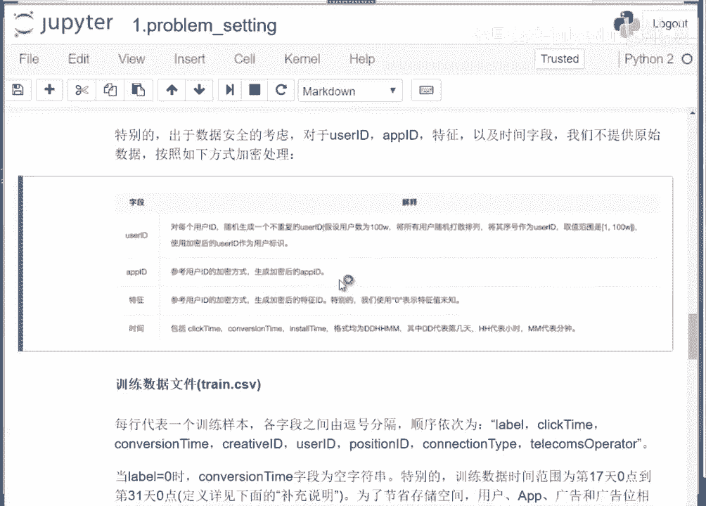

对。

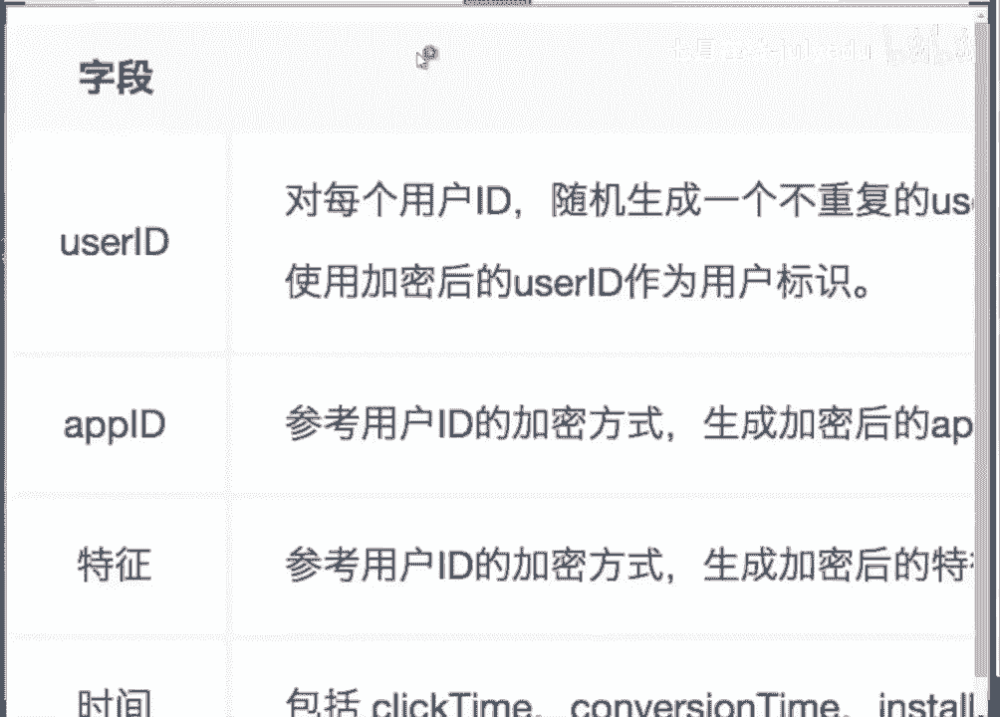

对，这其实这个这个大小大家应该是可以看得到的啊。对，就是他是做了一些相关的一些处理。那优U子 IDD和appID我就不说了，这两个东西基本上是一个哈希的处理。所以保证只要保证每个用户拿到的ID不一样。

每个app拿到的ID不一样，就OK了。那这个时间的话嗯，它把它转成了这个第几天就不是实际的。

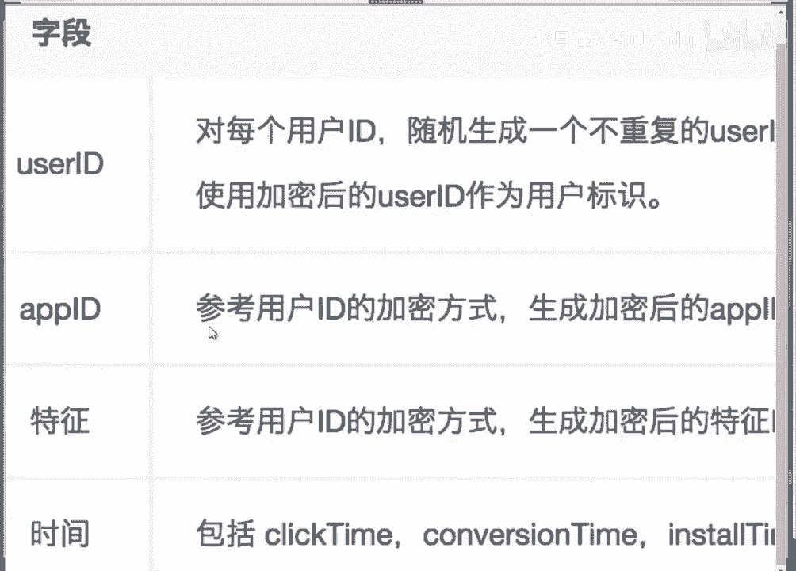

对他不是他并不是实习的呃，这个几几年几月几日。对他说的是第几天第几小时啊，第几分钟okK所以是一个距离某一个起始点一段时间的这样的一个数据啊OK。然后上面大家看到的实际上是一些什么呀？就是你可以。

想一下上面提供的这些信息本身是一些有一些是静态的信息，对吧？比如说广告本身的一些信息，用户纬度的一些信息都是静态的信息。那它实际上有没有发生交互，它也需要有文件提供出来。

所以这个地方有一个cha chain点CSV。是一个训练数据的文件，它每一行就代表了一个样本。刚才我们说的最终会不会发生点击啊。你看到是依次是这样的一个一个信息，所以是label对吧？

label就是零或者是一，刚才我们已经说过了，它是一个分类的问题，所以是点击了或者是没有点击啊我点击的时间对吧？如果它发生了点击，也就是说label是一的情况下，我有个转化的时间，对吧？

转化时间就是说我我这个安装上这个app或者怎么样的一个一个时间。O那我的呃会会有一些其他的一些I啊，可以大家可以理解成这些东西都是一些特征，对吧？一些特征position ID刚才大我已经跟大家说了。

可能是在比如说像百度的广告啊，比如说像QQ空间的广告，它可以是直接嵌在QQ空间的这个内容里头，也可以是可以在QQ空间这个页面的右侧对吧？或者某一个某一个角上或者是这个屏幕的下方等等啊，都有可能。

那么connect type connect type就是我的连接的一个方式。然后我的运营商对吧？哦。所以呃再往下的话，他这个地方其是他们给东西给的很详细了，这个地方有一个详细的一个描述。

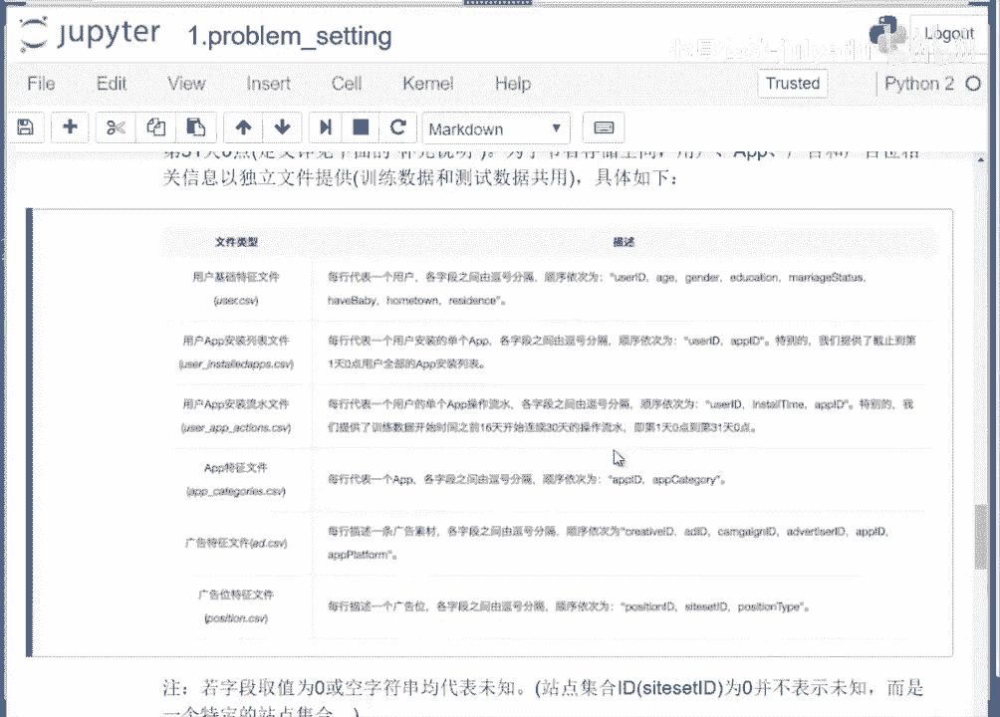

对，这以总共会有这么几个文件，大家看到了吧？这是所有的文件。你看。

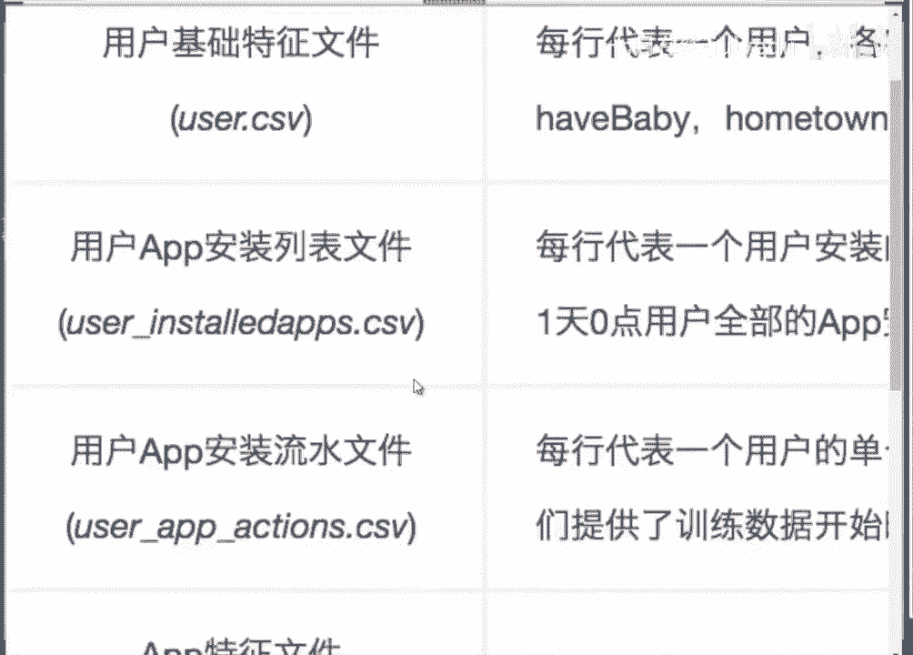

嗯，大家都学过数据库，学过数据库的同学一定知道说在学数据库的时候，老师呃如果是学计算机的同学啊，学过数据库的同学，老师会给大家介绍到第几份式，对吧？那这个地方为了节省空间。

它也不是帮你把所有的每一条记录啊，就像有很多同学这个。之前如果做过一些toy project，或者是刷过一些cago的一些很简单的比赛的话，那你的训练文件就一个对吧？所有的信息都融合到一行当中了。

但是现在他这个东西不一样啊，他给他做了一下，你可以理解成做了一下分表，或者是分到了不同的文件当中，这个能够呃能够。保证没有那么多的信息的冗余嘛。

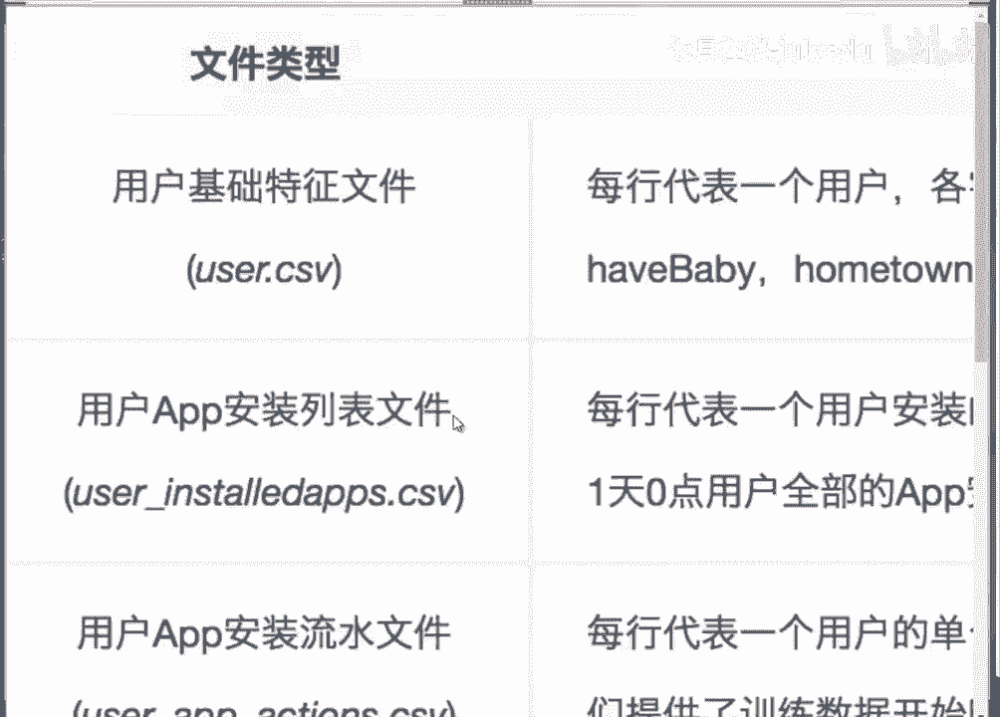

那但是但是即使是这样，这个文件也不小啊，大家可以自己去试着加载一下，我会把数据和代码都给大家。大家可以自己去看一下。比如说这个地方它分了一个用户的基础特征。刚才我们看到的一类一类信息一类数据一类特征。

对吧？都在这个user点SV里头，然后它里头告诉你了，说字段有什么有us ID对吧？年龄啊，性别edation，就是学历状况，对吧？然后是否结婚啊等等，然后这个是不是有宝宝啊，然后家乡是哪里的呀？

现在常驻常居地在哪呀？对对，常驻地在哪，然后这个地方有一些app的安装列表啊，就是之前的相关的一些信息嘛，就是它装过装了哪些，然后安装app的一个流水啊，就是你可以认为它是一个一个顺序或者怎么样O然后。

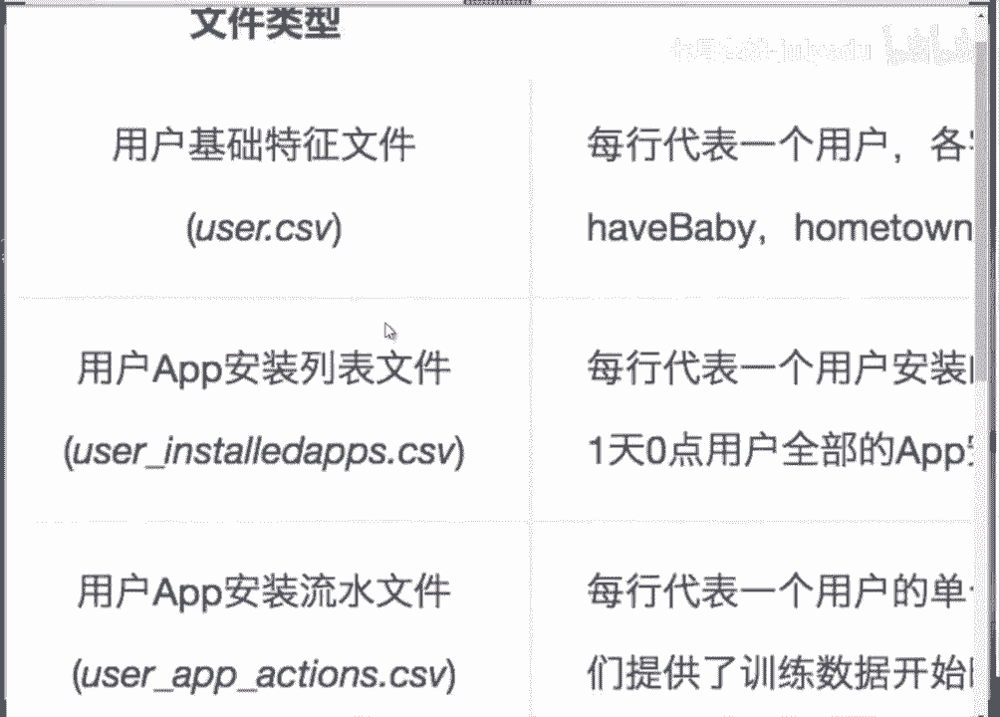

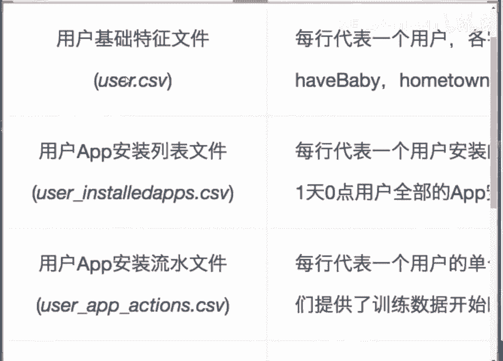

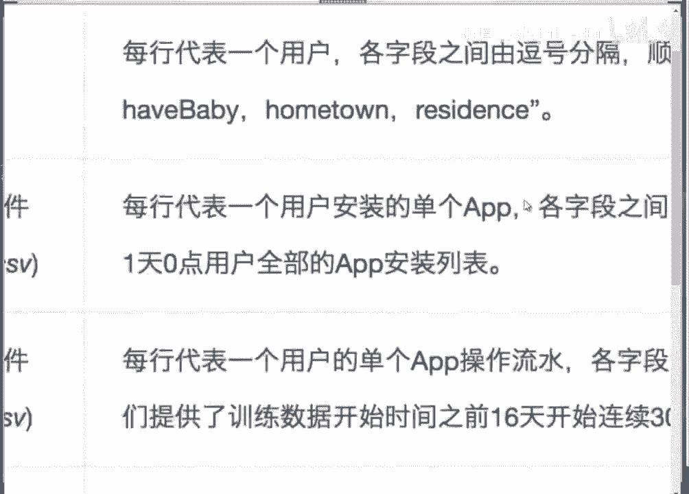

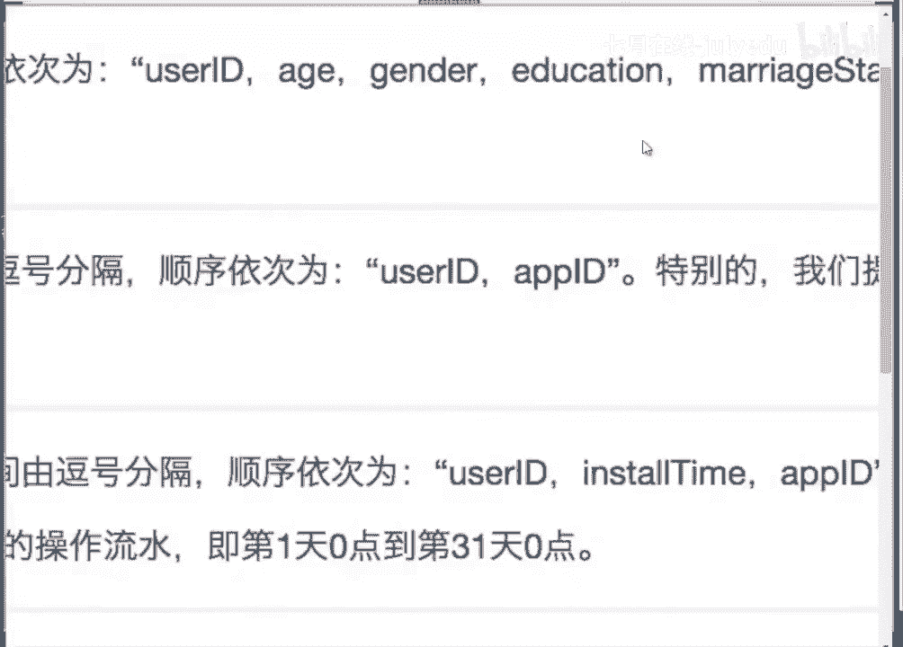

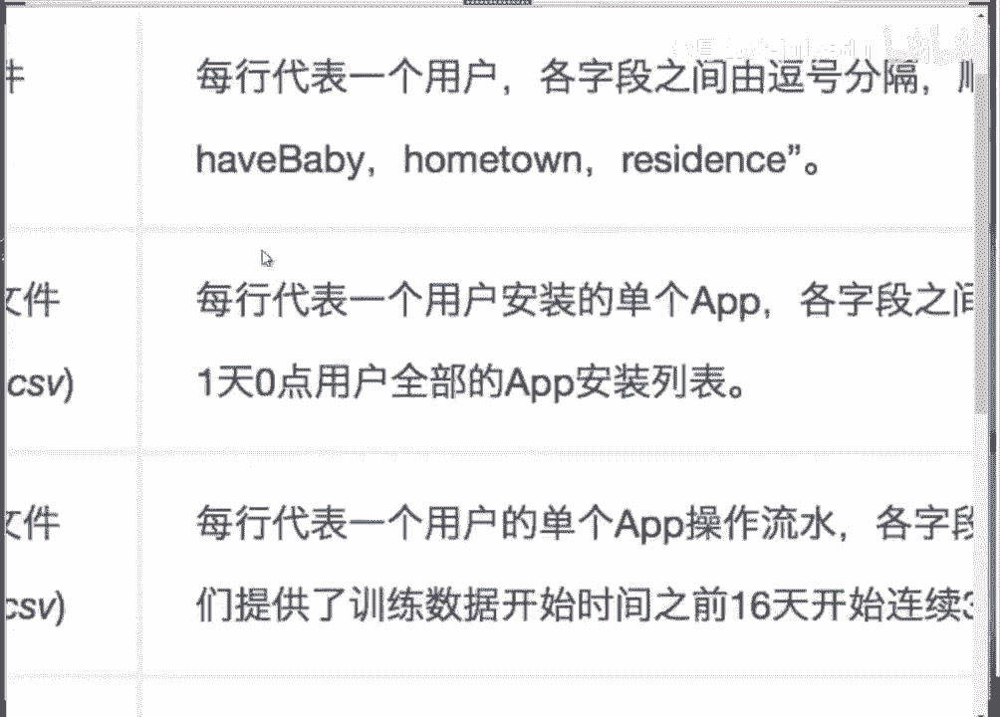

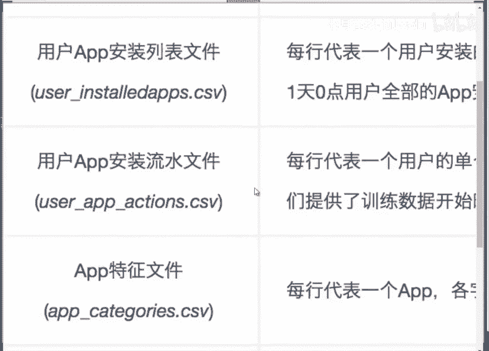

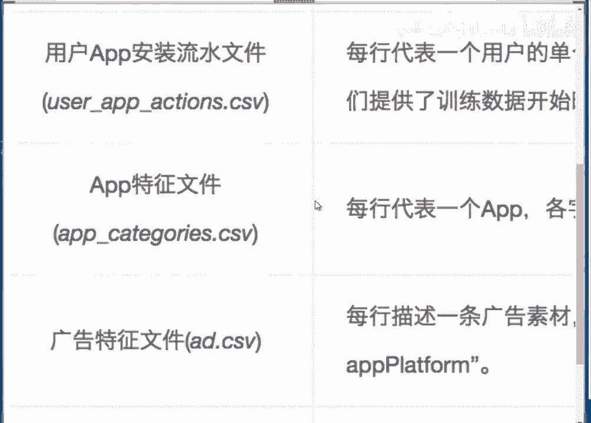

对，然后安装流水，然后是app特征特 app的一个特征文件，就是本身这个app的一些category，对吧？一些这个category啊类别。然后广告的一个上下文，刚才大家已经看过了嘛，就是。

广告位它对应的一个文件。所以这个地方有很多个文件。一会儿我们需要把这个这些文件用一些相同的字段去做一个jo易，做一个连接起来，对吧？这才是真实的呃工业界通常情况下。

大家在做的事情就是没有现成的说我给你一个文件。OK这个文件拿过来做训练，这个是没有的。通常情况下，不同的信息都记录在不同的这个数据库当中，数据库的表当中，然后你可能需要把它们或者是不同的日志文件当中。

那你需要把它们拉出来，去做一个聚合，聚合成你最后需要的。

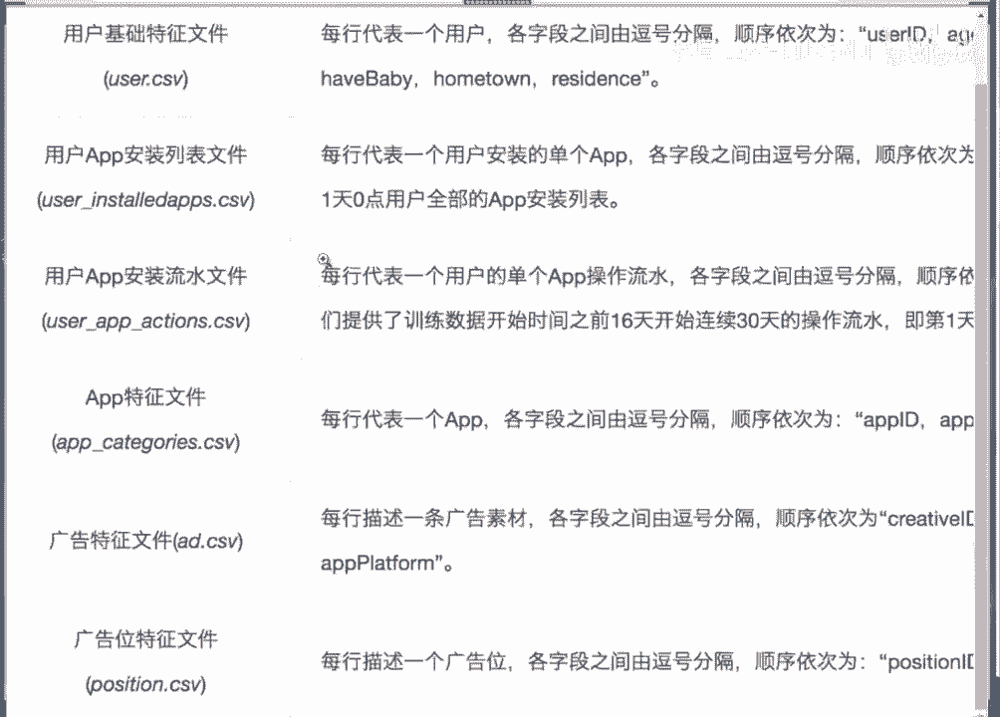

这个用来做训练的这个文件啊，这是真实的情况。OK所以大家看到了。然后这个地方的话，他告诉大家说测试数据啊，测试数据你可以理解成和训练数据是基本上是一样的，只不过它是没有那个。

最后的tt或最后的label的对吧？需要你去预测这个label，其他的信息可能是有的。O那评估的方式呢，这个地方用的一般是呃lock loss。就是一般情况下。

我们去评估和CTR预估或者CVR预估相关的这个问题的话，我们的评估指标都是啊log loss或者log loss或者是AUC啊，这个呃取决于你的。场景如果你是一个搜索广告，就续的问题的话。

你一般会用AOC这样一个指标。如果像腾讯的话，大部分情况下，他们是一个嗯。展示广告ok就是你你不用户不会主动发起请求，对吧？我只是来到QQ空间的页面，我只是来到微信的朋友圈。

我没有发生任任何的这个queryqueryquery，对吧？任何的请求，所以这种情况叫叫展示广告。然后他们的评估标准呢用的是lock loss。嗯，大家知道这就二分类，对吗？二分类的话。

大家都学过logistic regression啊，LR大家都知道LR里头用的损失函数los function就是一个log loss。对，OK然后底下有一个python的一个代码。

就是告诉大家怎么去求这个log loss啊，当然这个其实是不需要的。因为本实际上大家去调这个，不管是se learn还是其他的一些package，这个都是。这是非常常见的一个评估指标，所一定是会有。

底下有一个提交的格式，就是最后呢。啊，完成一个任务，你一定要以他要求的这样一个格式去。提交上来这样一份的。

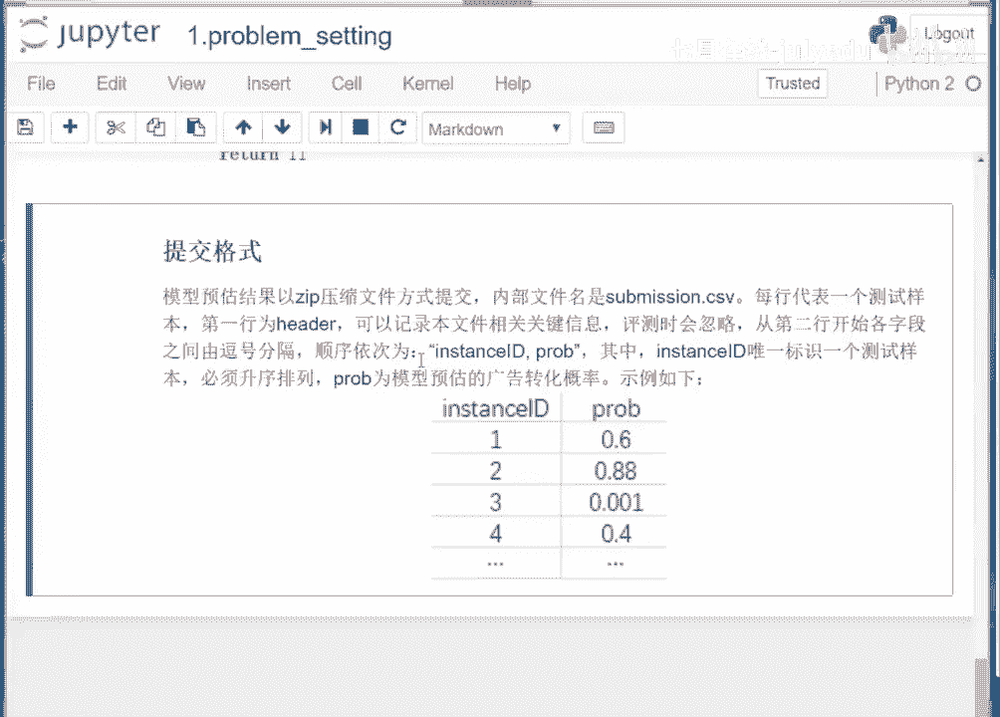

结果嘛，O。所以这个是大致的一个背景，对吧？如果这个背景大家听听完之后有点晕的话，你就抓住几个重点就好了。我就说了这是一个分类的问题。但分类对问题研究的对研究的东西就是说我在给定了广告。

给定了用户给定了上下文的情况下，发生转化的概率有多高，对吧？就是会转化或者不转化，而且我想知道转化的概率有多高。所以这个地方针对ad user和context分别提供了几类信息啊。

就是在这下面大家可以之后详细的去看一下。好，现在我们直接来看一看这个地方写的官方给出来了啊，腾讯很有意思啊，他给参加同学参加这个比赛的同学呢给了一个基限的版本，basedline版本。

就是他官方给出来的。

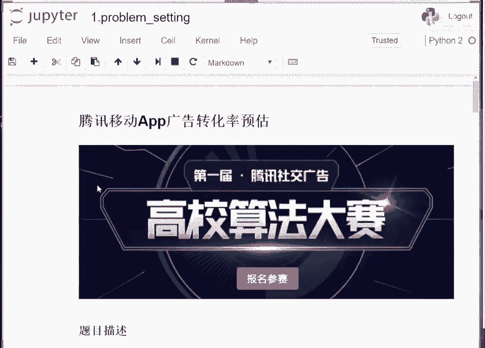

呃，b什么叫 base爱呢？就是说如果你来参加这个比赛，你做的结果比我给你的这两个基限的版本做的还要差的话。那基本上就是。Oh。说明你没有太大的成果，对吧？这个方法肯定是没有办法上线的。

OK所以现在这个CVR预估的基线版本是腾讯官方给出来的，给了两个两个。不同的方式，一个是基于广告的统计的版本。另外一个是基于广告的logistic regression LR的一个版本啊。

然后底下给出来了结果，最后能达到的得分，大家可以看到lock loss是一个损失函数，对吗？所以这个损失函数分值这个损失函数的值越低，代表我做的越好。因为损失函数它描述是我和标准答案之间的差距嘛，对吧？

所以base line2。1是他们基于统计去做的这个东西能达到的一个结果大概是0。10988。这样的一个lock loss。那如果是用了logive regression能到0。10743。

大家可以看到这个值下降了，对吗？啊，我们先不看代码，这个值下降了，就说明说呃用用了mine learning的方式的话，其实对最后结果是有帮助的。嗯，然后这个地方的话。一般情况下。

大家去参加一个数据科学的一个比赛。我们通常的步骤都是我们先会去观察一下我们的数据啊，了解清楚他给的数据有哪些信息。然后你第一步要第一通常情况下。

你第一件做的事情是我会基于这些信息去出一个呃baseline的一个版本，就是非常非常简单的。比如说是一个统计的版本，或者是一个这个直接用均值或者其他的方式去去做最后的一个预估结果去提交一版。

先看看这个情况能到什么样一个程度，然后再去尝试模型 learning的方式。那。大家都知道转化率这样一个东西。刚才我已经说了，是根据ad和user和contexs去预估出来一个概率，对吧？会发生转化。

的这样的一个概率就是会发生转化或者不会发生转化嘛。最后的label是零或者一嘛，然后你预测的是一的概率是多少？好。所以这个地方呢基于统计的版本非常非常简单，他把用户的维度抹掉了。

他说我不管你是哪个用户过来，我也不管你这个用户的上下文是是什么，就是说有没有这个释放在QQ空间哪儿啊，或者是这个广告位在哪个位置啊，或者是之前浏览的什么信息。所有这些contex上下文的信息我都不要了。

我现在就基于每一个广告，哪个ad，基于广我这个地方。我来写一下，它是一个机。ad它只基于广告本身去做一个统计。也就是说这个广告总共曝光了多少次，在这个广告曝光的这些情况下，发生了多少次的点击。

我说清楚了吗？这个事情是一个非常非常简单的一个baseline版本。就我不管用户的信，我不管哪个用户来，我也不管你之前做了什么context，你的上下文是什么，我只关注广告本身。

我基于每一个广告的曝光和它的。sorry这个每个广告的这个要看这个地方转转化率怎么定义的，就是比如说被点击了，然后从点击到最后转化这个概率有多高，我去做一个后验的一个统计。

然后用这个统计的结果去为最后提交的一个结果。所以大家来看看这个事情就非常简单啊这个地import一下需要用到的科学计算库包这样的数据分析的库，然后指定了一下我数据存储的目录对吧？

就是当前的目录然底下有一个点和吧？我刚才说了，它只用到了ad的信息，所以你那些和这个user相关的信息tex相关的信息我就不要了，我我都没有用所以我当然要去做一个jo了吧？因为它是来源于它是不同的表嘛。

或者不同的文件嘛，所以这个地方用cative ID去做一个公共同的字段去对两个文件做一个jo对两个 frame数据去一个jo对吧。

用padaas merge merge函数就对这个chain data训练集和广告本身的信息啊，data frame and。去做一个join，基于这个creative ID做完join以后。

你就拿到了真正的这个时候啊，在它统计的你需要用到的真正的训练集和测试集。然后我做的事情是什么呀？你看我把Y chain取出来，这个就是label嘛，label就是刚才的零1字段，对吧？

表value就表示说我把这个pas的 data frame转成一个n派 non派对吧？n派的一个数组n派。Yeah。所以这个时候的key是1个FID对吧？我要基于这个。我要基于这个P看到吧？

app ID嘛，我基于每一个那广告每一个广告不就是一个一个app ID吗？你推你最后。广你的广告，你希望转化的是某一个app某一个应用嘛，所以你的应用的ID就是你的需要用来做分组的这样一个呃。

信息对以这个地方我我的训练集，根据我的appID，我的应用ID去做一个分组。在每个分组里头，你看我求了一个什么样的东西啊，求了一个min，求了一个均值而，这个地方是一个小的checks啊。

大家想一想一堆零和一在一起，你去求一个均值的话，实际上是什么呀？是不是就是一出现的概率啊？大家想一想这个事情，你有5个数，00011，然后你求平均是多少？5分之2嘛，0。4嘛。😡。

对吧所以这个地方用n派去求一个平均，实际上就是这个label的一个。label为一的一个。概率嘛。就是零和一的一个概率嘛，求均值嘛，就一的概率。哦。

resett一下indexreet index就把它拉平啊。O好，然后大家注意看到这个时候的哎这个地方我们可以给大家跑一下，但我不太清楚ok这个我看一下我的数据是存在。

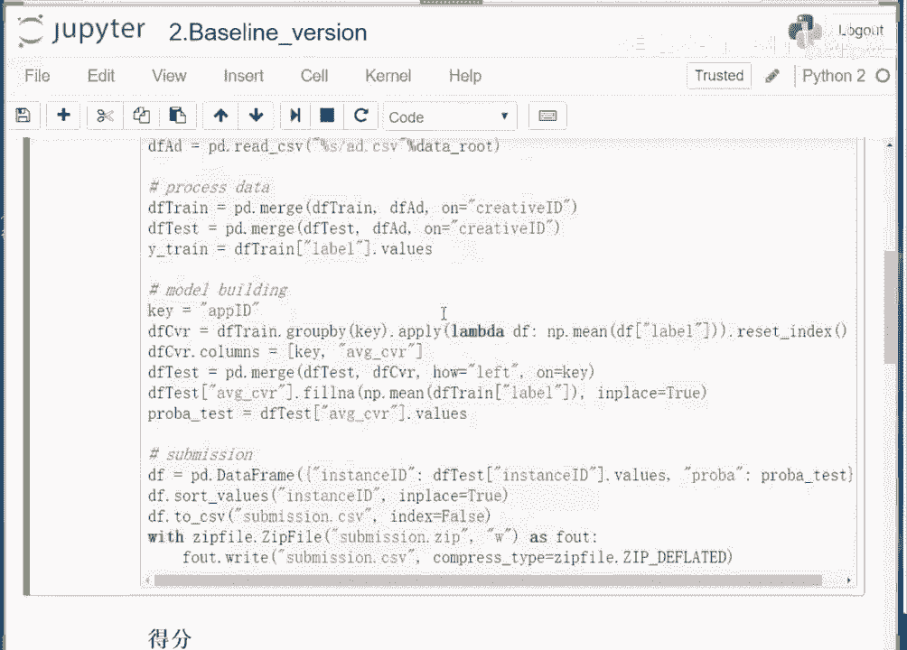

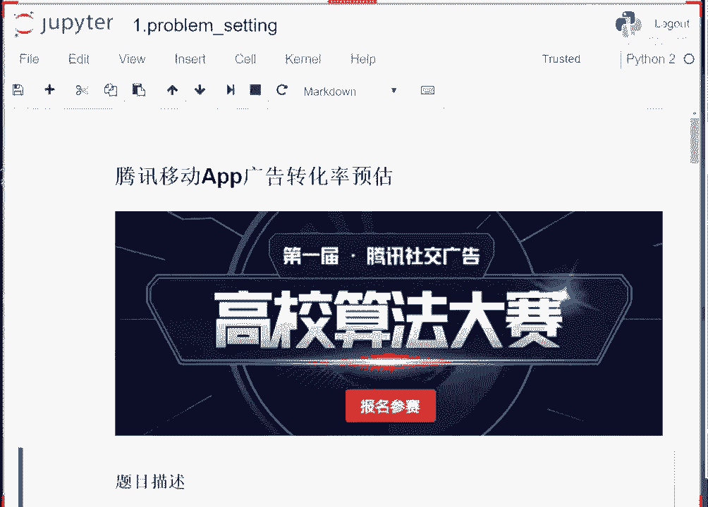

啊，对，data。我看一眼啊，给大家准备好了da塔 change accessory啊，是okKO的。我们可以给大家简单的跑一下。但这个它的数据量，腾讯官方给的这个嗯。场景的数据量还不小。

我们copy过来copy过来，然后。我没吃完了也好一会儿。Oh。这样的。Yes。你执行一下。OK他在跑啊，但是这个可能会花一些时间。我这个电脑有16G的内存，唉，好像有一点小小的问题。Oh。

 sorry。我的错，这个地方的根目录是点贝ta。啊，OK所以现在读进来了。然后我们可以看一下它的这个我们可以看一下它的结果啊，这个DFCCDR这是我们的转化率，它计算的这个后验转化率。

我们可以看一下head，看一下前5行，你看到这个结果结果就是针对每一个FID我去求出来它的一个转化率，这个大家能能理解吧，没有问题吧。对吧他就是做了一个pas的一个统计嘛。

然后你再把它ok把后面的粘回来。所以你的test，你test也做一样的事情，对吧？你test做一样的事情，然后。小跑一下，对test做一样的事情。所以test现在也是一个呃。对。

可以直接取出来这个averageCTR嘛。就是你刚才已经算好了每一个你每一个广告的转化率已经算好了，所以我直接去取值就好了嘛。我。

对以这个地方呢这个方式呢大概就是一个基纯基于后验统计的一个方式去计算了一下我有多少次被点击。我发现了这个点击之后，有多少次最后发生了转化。我就是去求一个统计值，对吧？我针对每一个ad。

每一个广告去求一个统计值，然后去提交，然后这个能拿到locklo大概是0。10988O所以上面这个统计的版本大概没问题吧。这是官方给出来的一个 baselineaseline的一个版本。

然后紧接着他基于ad去做了一版log regression。loggistic regression这个地方是大家可以看一下。对它在data文件夹底下这个chan点CSV。

然后test点V和ad同样去基于这个creativeID去做个merge。所以两个两份数据就合在一起了，对吧？然后我把label取出来，label就是对应的零和1OK然后我需要去做。

一些特征工程的一些事情嘛，因为数据已经啊准备好了，我的数据OK啊，比如说刚才我我因为刚才我跑过了，所以我现在可以直接看结果DEM chain就我刚才跑了一下第二colums。所以你可以看看它有哪些列啊。

这个时候有label对吧？有click time啊，conversion time creativere ID user IDposition ID啊，connection time啊啊，运营商对吧？

ad IDD啊，这个是compan IDadvertier IDFID app platform等等啊。有这么一些 column。

然后大家都知道我们要对数据去做一些feciial engineering的事情啊。如果你一定要用你要用mine learning的方式去建模的话。

那这个地方的feature engineering就包括说这里头有一些是数值型的，有一些是类别型的对吧？变量。那这个地方有一些ID的属性啊。

比如说creative IDad IDDcomp IDadvertier IDFID和啊这个 app platform。这是一些ID类的一些属性。那我需要对他做什么呀？

做一个one hot encoing，对吧？读热向量编码，所以我用cycl learn当中的one hot enr  one hot en，然后去做了一个。针对所有的这些feature。

这些feature每个去做了一个one hot的一个。处理一个transformone号 encoding的一个transform，然后就把test数据按同样的transform的这个结果。

同样的这个映射的方式去做一个transform。然后你最后就拿到了训练和测试集两两部分数据，对吧？然后你就可以用一个loggistic regression去fi一下。因为现在已经全是数字了嘛。

已经全是数字。啊，这个地方如果大家为了这个怎么说，为了。更这这个训练更高效，你可以去再加一个。ga了对吧？因为我们说数值型的数值型的。对，那个因为我们数值型的数据，我们需要去。它的scale可能不一样。

它的幅度可能是不一样的。所以你用一个scaling，一个calar可以去做一下scaling，做一下幅度缩放。

保证它们的这个大幅度范围是一致的那我当然就可以去对用我的log regression或者其他的一些分类器，可以很快的去去去做一个迭代，做一个收敛了。啊。

有同学问到说为啥ID要用one hot IDD如果不用one hot的话，丢到了just regression里头是不合理的呀。

我这是我的appID我的app IDD这是一号ID2号ID如果你不把它做编码的话，它会直接当数字进去用。那说明2号ID的数值比一号ID的数值要大，这是不合理的。它们本身就是不同的app而已。

你并没有大小关系。对吗我我这么说，这个同学能明白吗？这个意思。对，所以我需要对它去做一个one hot的一个encoing。呃，有同学问到了一个问题很好啊，问到了一个问题。

说这样处理的话会不会这个维度会不会很高？你们可以自己去跑一下，确实是有点慢的。但是。这个地方的。啊，就是好好处是L2这个模型是一个平展开来的模型，所以维度高的话，它也是可以训练的，这个是不不影响的。

因为实际你在做训练的时候，你不一定要用一个你不一定要用一个。dance的一个 vectorctor嘛，仔细看仔细看代码。大家看看到这个地方有个ss吗？就这个同学有没有看到这个地方有个sse？

对pas的意思就是说我用的是一个 sign里头的一个稀疏向量。为什么我要用稀疏向量啊？因为我如果用稠密向量的话，就会出现你刚才说的问题，维度太高。所以我灌到内存里我灌不下去，我灌不进去。

这个占用内存太多了，所以特地做了一下处理，这个地方有个ss。所以我是一个稀疏的向量。因为我有这些ID我都做了one hot。所以我在训练的时候，实际上训练的时候，实际上输入无所谓的。因为来一个样本以后。

我更新的只是这个one hot里头某一个位置，某一个位置的这个wat权重。所以我这么说，能大家能明白吗？就是训练本身是可以训练下去的，但是这种方式确实不一定是最合理的方式啊，最合理的处理方式。

因为它维度确实是比较高的。当然因为它本身很稀疏，所以我们用sse用稀疏向量去做了一下呃处理。嗯。😊，什么样的是稀疏向量？有同有同学问到这样一个问题是吗？如果你有100个位置，你只有一个位置是一。

这就是一个系数向量。因为你有99个01个。OK然后这个地方用log regression去做了一下fit，在我的数据集上去做拟合。然后在我的测试集上去预测了一下。你看我不是做predt。

大家都用过cycl learn嘛，那你用cycl learn，你知道以后有几个很关键的函数叫fit叫 chance form，对吧？叫ch form，然后还有predtpredt指的是label，对吧？

它在分类问题当中，最后拿到的是一个label。但我如果想拿到这个label它的概率值，我是不是应该predict probability一个。probability对吧？一个概率。

我predict一下它的概率拿出来，然后把这个。对，然后把这个这个结果概率的值作为最后的结果的形式去。输进去。写成他需要的这个submission的这个格式。spas处理完以后会变成什么样子呢？呃。

你自己应该去试验一下啊，这个你就就很明白了。我举个例子啊，这个时候它是0000啊，sorry。两。零。一。0，这是一个稀疏向量。如果你用spas的这个方式去存储的话，它很有可能存储是什么呢？

它会存储这个地方，这个向量总共有几个位置，12345677个位置，对吧？所以它第一个元素存7就可以了。它只有一个位置为一，第几个位置为一，第六个位置对，就是这样值是多少？是一。对。

所以所以这个时候761就表示说我一个长度为7的向量，里头第六个位置是有数的，它数值是一啊，所以你看比刚才的空间要节省，对吧？比刚才要节省空间了啊，不一定是小括号，你看它具体是什么样的一个格式。

总之它需要保留这样几个维度的信息，好吧。这就是从一个dance vector转到一个se一个啊，然后大家可以想象的到，在这个问题当中呢，远比我现在给的这个例子要稀疏很多。因为ID类的嘛。

那app可能有成千上万个app，对吧？那成千上万个app里头只有一个在当前这条记录里头只会有一个app它得到了，它被点击了。

所以这一个app只在1万多个可能几万上万个app IDD的列表当中只有一个位置是一。那用这个形式显然是能够节省空间的。Oh。s learn本身就是基于n派和s派去做的。所以你你你这个同学问到这个问题。

说这种数据能放到LR中做处理，当然可以做处理了。你去看看lilib linear啊，lib linear。或者是看看三这个Scycl learn当中的。这结构当然是可以处理了，这是最最非常非常常见的。

处理形式。s learn本来是基于n派和三派去搭建起来。嗯，然后对大家如果这种问题啊，大家完全可以自己去试一下。因为你看到我我已经把数据关进去了，exject X test它是可以去做一个face的。

对吧。嗯，好像这个这个同学我不太清楚，你你你了解brareding distance的话，梯度下降的话，我在做更新的时候，实际上我只需要把对应的那个位置的只去做一个update就可以了，对吧？呃。

我没有我没明白你问的这个问题是什么什么意思啊，你有问题可我们可以我们可以下课再交流。好吧。如果这个向量本身它的填充度是可以的话，你是不需要去做spae这个处理的吸疏吸疏这个处理，好吧。对啊。

细节的问题的话，细节的问题啊就是和原理相关的和基础的知识相关的问题。大家有问题的话，课下问好吧，这个课是一个呃项目课，所以我们尽量把带着大家把项目和项目里头的一些重点完成了。

然后对基础知识有问题的同学下课来问我，好吧，或者是咱们那个你可以去看m型 learning的那个课程里头是有提到的。O所以这个这两个大家有问题吗？一个是基于ad去做一个统计做一个基线的版本。

还有另外一个是log regression。然后这里头可能有一些小细节，大家要注意啊，就包括说我的feature engineering的时候啊，特征工程的时候，我需要对one去做一个co。

对对接类别型的ature去做一个one对吧？向量的编码，包括说这个时候刚才有同学提到很好这个问题啊，说我用稀数向量去存储。因为不然的话我的我确实这个对内存的消耗会比较大，对内存消耗会比较大。

然后后面就是一个简单的log regression去做一个feat和一个对。去做一个fit和一个prod，对吧？对对对。对，这同学说的很对啊，就是SK learn呢，它本身是基于n派3派。

所以如果你传进来的是一个spa vector的话，它是会正确去去读取的对他知道会去读取下标和啊对应的值啊。

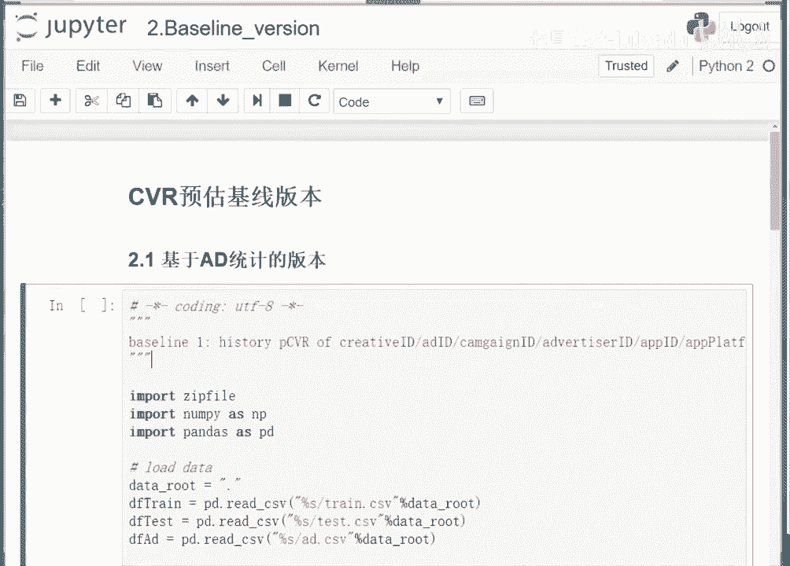