# 人工智能—计算机视觉CV公开课（七月在线出品） - P10：物体分割Mask RCNN理论与实战 - 七月在线-julyedu - BV17z4y167dq

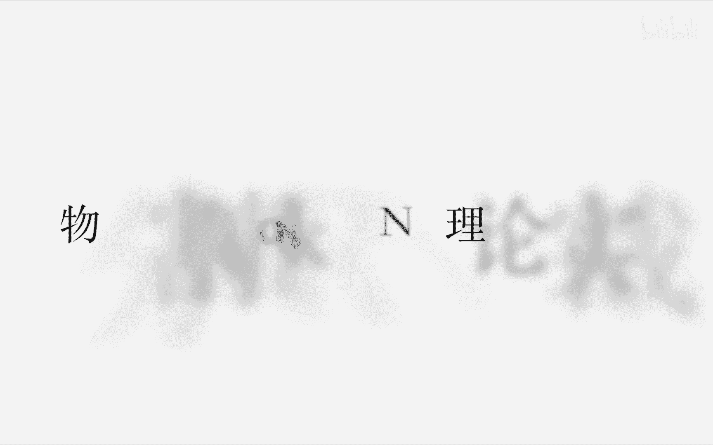

OK那个现在8点了，咱们准时开始吧。嗯，如果没有声音或者看不到画面的，请那个助教帮帮忙，我也无能为力。嗯，但是从那个大家的反馈来看的话，基本上的人都能够听见声音，也能看见画面。那我就开始了。

然后今天我要跟大家分享的是instance segmentation。嗯，物体分割或者叫实力分割。嗯，主要是用mask RCN方法来实现。首先我先做一个简短的自我介绍。我叫王老师。

那也可以叫我doctor王，是中科院博士毕业的。然后现在在国内的大厂做CV。然后。就这些吧，自我介绍咱们直接进入正题吧。嗯，首先我的那个今天要跟大家分享的主要包括三个方面。一个是CN。

一个是2新人2新人。还有就是最后就是mask RCN。为什么要讲CNN呢？主要是让大家对这个卷积神经网络有一个理论上的一个回顾。然后在理解CNN的基础上，对那个RCNN就会有更好的理解。

然后为什么要讲fast RCNN呢？还有RCNN呢？因为mus mask RCNN是在这个嗯RCNN的框架上进行一个改进。嗯。然后。

如果你对那个RRCNNfat RRCNN这个目标解测框架有了一个非常好的一个深刻的认识之后，对那个musaskRCN也就嗯理解起来也就非常的容易了。然后。嗯，对于视觉感知，主要有。哦。

以下四个方面的基本问题吧。第一个是分类，就要分别出这个图片里面的内容是什么。第二是检测。嗯，检测的话既要检测到目标物体在哪个位置，也要知道目标物体是什么。然后第三个是smentation。嗯。

semantic segmentation就是语义分割，就是嗯对那个每个项素进行分类，但是它不区分同一类别的不同个体。比如说有一堆人他不区分，他都分割成人。

然后今天要讲的是instant segmentation。嗯，实实力分割或者是目嗯目标分割或者是物体分割。然后物体分割的话嗯，相对于。detection来说，他那个在。bunding box的基础上。

要达到能够区分得出边缘，不仅仅是给一个bing box。然后相对于那个semantic segmentation来说的话，嗯，它要能够区分同一种类的不同个体。就像我刚才举的例子的举举的例子。

就是要假如说有一堆人要能够区分出不同的人。嗯，我看一下。现在大家没有说话了，能够听见吗？给个反馈给个反馈。如果说有人听见的话，我我就继续往下讲。嗯，算你能听见吗？啊，可以可以，那我就继续往下讲吧。嗯嗯。

太好了太好了，那有个反馈。因为刚开始的话，我说了两页PPT好像没人说话，可能都在安静的听我说。OK好，那我继续吧。嗯，首先回顾一下CN，我想可能。大家对CNN都有特都有一些或多或少有些了解。嗯。

然后我主要讲这个的目的是嗯从一个宏观的一个角度来来看这个问题。其实这个CNN这个东西啊，它很早就有了，就是nnet98年就有了。然后所以现在这么流行，现在效果这么好，不是因为说这个理论上有有多大的突破。

而是因为现在的数据量积累到了一定程度，还有就是我们的算力的提升，使的卷积神经网络在物体检测物体分类和物体分割领域打放光彩。可以说是然后这个图是嗯nnet5是98年一样提出来的。

然后这个图基本上涵盖了CNN的。CN的所有的一个结构，包括卷积层，包括下采样，就是我们的铺ing层。嗯，然后再包括后面的全连接层到后面的输出。嗯，所谓卷积，卷积就是说有一个框。

给一个框 kernelel有个 kernell，然后呃这个框上的对应元素相乘相乘，然后产生一个新的值输入到下一层。然后不断的移动这个 kernelel在这个图像上这样做，重复做卷积。

就能够得到一个卷积之后的feature map。然后呃沙布呃杀沙布里呢就是下沉样呃，这些可以不用讲了吧，嗯，是这样的嗯。我会在宏观上对这个有一个认识之后，嗯，后面会讲的容易一些。对自己来说。

有人可能大家的那个那个。可能大家的那个。嗯，背景可能不太一样，有些人懂有些人不懂。那我还是按照我的节奏来讲吧。可能之后的讲课就可能就要做一个那个调查，看一下大家的那个背景知识究竟掌握的怎么样。

因为我这个是公开课，我也不知道大家的背景怎么样，然后我就按照我的节奏来讲，好吧，嗯，如果你觉得你懂的话，可以不听，然后然后到那个感兴趣的地方再听好不好？不好意思啊，嗯。然后。嗯。

这是1个CNN的一个网络结构。嗯，在CNN网络结构里面最重要的是嗯就是我们的卷积卷积操作，然后就是下采样操作。嗯，还有一个就是最后的那个嗯全连接到最后的那个分类和回归的模型。然后嗯。

然后这里面的卷积操作用数学表达怎么来表达呢？它就是一个实际上就是一个矩证相乘，可以看到这个。这个函数这样XI乘以WI，这个就是一个矩证相乘，就这个WI就表示一个卷积核里面的一个权重。

这样一层就是一个卷积操作。然后卷积操作之后，一般要经过一个激活函数，一个激活函数做非线性变化。呃，变化后得到的一个值在输入下一层。然后这是一些机候函数，这期础函数我不进不不不做进一步讲解的。

然后嗯我们怎么能够嗯呃我们怎么能够训练这个网络，得到我们想要的输出呢？嗯，我们会建立一个los function，就是我们有一定的标注数据，比如说Y，然后经过网络。经过网络的一些处理之后。

各种激活函数这个非线性高度非线性变换之后得到一个输出，然后输出和标那个我们标注的数据相比较，看他们那个嗯是否是我们希望的得到的一个输出。

然后就建立这种非线性嗯非线性 loss loss function。然后嗯这里面LLI的话嗯最常用的就是在那个回归问题中，最常用的就是这种嗯minque error的这种均方跟误差。

然后建立这个函数之后，我们最重要的是要得到这个W的值，这个权重值。怎么样得到这个W的值呢？我们会对这个函数做求导，求出来梯度，利用梯度下降法来求这个W。啊，这个对求导的话嗯。

这里有1个BP算法BB算法的意思就是说误差的呃那个误差的反向传播就是我们经过CNN。点接网络，然后经过很多的F函数。嗯，经过很多的F函数之后，得到一个输出，嗯，利用链式法则嗯。

能够这样逐步往往往后这样求那个梯度。嗯，这是个简单的BP的一个简单的例子。嗯，我们。先对这个输出先哎L先对Z求导，然后这个Z再对输入的XY求导，这样经过这个链式法则，就可以求到L对X的和Y的导数。

就是说嗯ns function对我们输入特征的一个导数。有了这个导数之后，我们就可以解我们的los function，就可以求得我们的W这种权重。好。

其实这就是这这是整个那个卷积神经网络的一个嗯一个大体的一个理论框架。其实在我们实际的问题当中，很多优化问题也都是这个框架，通过建立一个los function。

然后通过使这个los function最小化，求得W就可以进行做分类问题，做回顾问题。

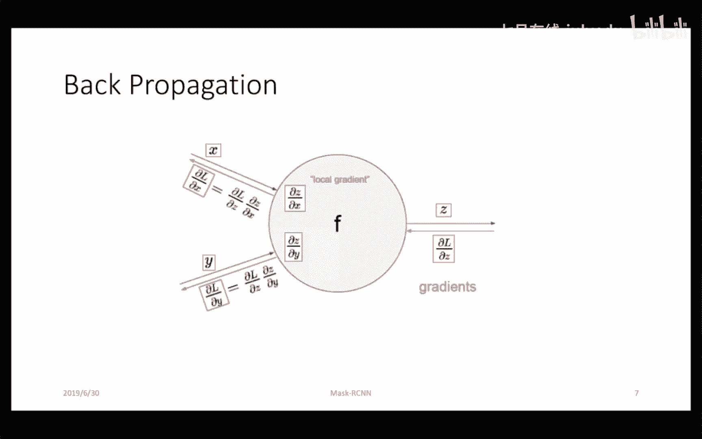

嗯，然后后面的。后面要讲了faster RRCNN，还有那个faster RCN，还有musask RRCRCNN，它就是都是用这种理论框架套在里面的。然后这个图呢是CN的一个可视化的一个效果图。

就是每一层经过卷积层之后得到的一个可视化的效果图，有com层，有re层，有有铺ing层。嗯，然后会发现就是一个com层，它的最本质的最本质的功能就是提取一些特征。嗯，rero层它做非线性变换。

然后经过这些一系列特特征提取之后，会提取到一个高维抽象的语义特征。然后通过这个语义特征，我们就可以做分类。

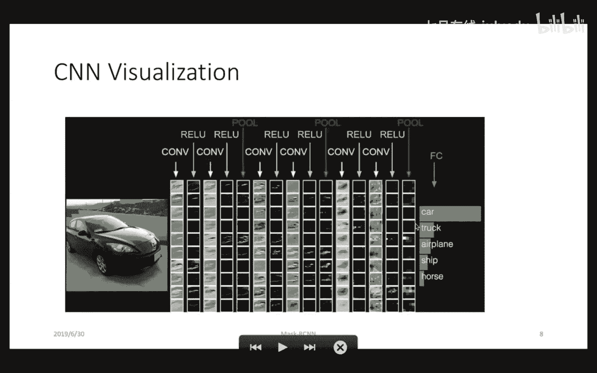

嗯。😊，啊，大家有有有疑问是吧？啊啊你说那个MSSE公式不对吧？对的，因为这前面有个有个N，我只是这样，这是求了一个嗯，这是这肯定是没问题的。嗯，这前面有嗯，你可能是那种求和的那种方式嘛。

把这个L写在这儿的嗯，然后带在这里面就是就是那种MSE。ok 继续。OK嗯，简单回顾了一下CNN卷积神经网络的一个理论理论基础。好，接下来我们进入objected detection目标检测。嗯。

目标检测的话，首先先介绍一下RRCNN。然后接着是fast2CNN。嗯，最后是faster RCN。首先是RCN。我们要从。我们要从那个图片中检测出一个目标物体。嗯。

我们最直观的想法就是找一个bounding box，然后在图片里面这样移动，然后对每一个bonding box进行一个分类。嗯，判断是不是我们找到的那个我们需要的那个物体。然后RRCN的话。

他的想法很很很简单。就是我首先选一些感兴趣的区域ROI这些感兴趣的区域，通过那个比较嗯比较那个传统的计算机视觉的方法，嗯，它这主要是通过selective嗯feature的方法。嗯。

然后他通过那个分割分割出一些小的分割一些小的呃区域，然后嗯通过小的区域进行一个合并，形成一个比较大的区域。嗯，形成比较大的区域之后，然后在每一个区域里面，嗯对这个区域先要做一个word变换。所谓卧变换。

就是说把不同尺寸大小的那个嗯区域变成统统一大小尺寸的区域。嗯，这样的话就可以输入到一个统一的一个卷积神经网络里面去。通过一个嗯统一的一个卷积神经网络，我们可以学习到一个呃fisher map。

然后在fisher map基础上，再通过bounding box regression和SVMVM对这个bonding box进行回归，还有对还有分类。这就是RRCNN的一个整体框架。嗯。

宏观来上宏观来看的话就是。宏观来看的话，就是三大部分。第一个就是说先选后选的一个区域感兴趣区域。嗯，第二步呢就是说对这个感兴趣区域提取提取特征，用卷积神经网络提取特征。

然后第三大部分呢就是说在这个提取出来之后的对特征基础上，通过buning box regressiongress，然后SVM能够得到我们的检测的框，还有就是我们的分类结果。嗯，然后。嗯。

这里面的话嗯它会有一些问题，比如说什么问题呢？首先嗯它这个区域有很多是重叠的。嗯，你想嗯比如说这个这张图片里面的人和马他两个这个候选区域，它肯定有很多重叠的区域，或者是这个帽子和这人。

他两个也有很多重叠区域，直观上来看，如果对这种重叠区域，嗯，都重复的做这种嗯转积神经网络的话，嗯，就会存在计算量冗余计算冗余。然后嗯能不能进行改进呢？嗯，当然可以。

这就是后面工作要对这方面进行改进的这是一方面。另一个方面就是说嗯嗯他这个候选框的那个选取嗯。嗯，也是它是也是比较耗时的，它是用的那个传统的候选框的选取方法。嗯。

我们能不能把这候选框也放到神经网络里面进行选取呢？这是faster RRCN要进行了改进。然后啊现在大家可能有些问题，selective search啊。

selective search这个这个方法的大致原理。这个方法的大致原理就是说它先进行。进行一些一些分割小物体的一些分割。嗯，比如说选取一些一些小物体一些边缘。

然后分割出来的那个就是最最初的那个分割出来的，可能是一些很零散的一些东西。嗯，比如说这个这就看这人的话，比如说他可能都把嘴和鼻子啊，这些眼睛啊都已经分成那种单独的一个个体的一些区域。

然后再通过嗯通过嗯通过那个区域的联合，区域的合并，然后逐渐形成比较大的区域。嗯，这这后面形成的区域的话，一般来说有2000多个这种区域。嗯。😊，ROI怎么生成啊？嗯ROI的话呃。

下单PPT可能会讲到ROI。啊啊，对你这个ROY还还就是刚才我说的那个region of interest，还是就是说那个selective search方法生成的。嗯。

后面那个会讲ROI pulling。对，这个确实对，就刚才已经说了，这个RCN转机层不共享，所以它有些重叠的区域。嗯。😊，好，接下来讲这个fast RRCN。嗯，fas RCN的改进就是说我们。

我们不对单独的我们不单独对每一个候选方进行进行那个卷辑操作。我们对整幅图像进行卷辑操作。在这个图像卷题操作之后生成的呃这个feature map上，然后再把ROI。ROI选出来。然后总体来看的话。

这个也是嗯分三大部分吧，第一大部分依然是特征提取，利用卷积神经网络。第二大部分的话是那个嗯感兴趣区域选取，这个感兴趣区域选取，还是用到刚才我说的那个selective search传承方法。

只不过它有一个映射关系，从图片上能够直接映射到那个feature map上。嗯，这个完了之后呢，有个ROI pullinging这个RI pullinging的话就是生成那种嗯统一大小的统一大小的那个候选框。

统一大小的维度的特征啊，输入到全连接层。嗯，然后全连接层对然后输入这全层之后进行一个分类和一个回归。嗯，对。然后他这改进的那个最主要的就是减少了那个嗯卷积操作的那个计算量，使那个计算效率是大的提升。

然后嗯他还存在一个问题，就是说这个呃ROI的那个选取的话，叫propoer选取的话，还是在那个图片区域通过传统方法选取这个计算也是比较耗时的。然后。对于那个faster RRCN的话。

就是说它这个propoal嗯嗯在那个也在feature map上去去找，不在那个原图上去找了。嗯，然后它这个的话是是分两步来训这个东西的。嗯，第一步的话，它是先通过一个RPN嗯。你你。

来训练得到那个候选的我们的候选框。然后在这候选框的基础上，再再通过那个嗯卷机网神经网络再进行一个二次的一个回归。然后嗯。嗯，这里面这个嗯reing proposal network的话。

它那个最主要要用到一个叫anor的概念。它怎么能够把那个候选框去那个选出来呢？它通过一个anor这个anor的话是是不同尺寸大小的不同长宽比的一个一个嗯那个候选框。

然后也是通过这个候选框在图像里面这样滑动着嗯来来来选这个候选框，然后通过这个候选框，然后嗯进行一个回归和分类，也可以得到一个候选框。哎，你说那个最右边一输的作用是什么？

最右边一输呢就是直接把这feature map放到放到后面去。这样通过这个嗯RPN得到候选框的话，就直接利用这个里面的feature map。然后对，然后在ROI铺里生成相同维度的维度大小的那个。特征。

然后再进行回归和分类。这里面我们可以看到这个faster RN它实际上进行了两步那个回归和分类，这样的话它会使那个位置的话是足够的精确的。嗯，然后呃但它有一个问题。

就是说假如说那个你的那个嗯propo提的不对的话，后悬框可能也是完全错误的。呃，这个不一起回传，两侧落球合和会一起回传，不一起回传。它这个是单独训练的，就先可能训练1个RPN网络。

然后再再对这个这右边这个网络进行训练。就得到这个propoer之后，再对这个进行训练。这样这个右边这个就有点类似于之前的那个fast RRCNN这种训练方式。嗯，接着是那个。第三部分嗯物体的分割。嗯。

理解了那个CNN和那个RCNN之后，再来理解这个musask RRCN就比较简单了。musask RRCN用一句话来概括的话，就是用它是等于那个fast RCN加上1个FCCN。

但这页PPT是是那个借鉴的凯明的那个PPT嗯。我觉得说的是比较比较那个简单的。嗯，然后嗯他是在那个。fastR那个框架上再增加了第三个分支嗯，FCN分支。这个FCN分支呢在那个原来的那个ROIROI上。

然后再对做一个嗯分类和回归，就对每一个像素嗯对每一个像素进行一个分类没有回归啊，对每一个像素进行一个分类，就判断这个嗯但它会利用fast RCN提供的类别信息，然后这个分类的话是一个二分类问题。

它有类别信息之后，只对分类是否是这个类别，一个二进制一个分类，然后最后得到一个mask。然后嗯这个是他头部的一个网络结构。嗯，他嗯在文章里面说他用了两种网络结构。嗯嗯一个是那个backbone网络结构。

一个是那个ressonnet，一个是FPNFPN在下面会介绍。然后这个输出的mask呢是嗯是一个嗯两种，一个是14乘14乘以80的，一个是28乘以28乘以80的。这个80代表就是一个类别。

就是它嗯输成m里面有80个类别，然后每一个类别的话，它实际上只有一个是一，其他都是0。好，这个是FPN是这个特征金字塔网络。嗯，为什么要用这个特特征金字塔网络呢？因为我们CNN对那个物体的平移。

实际上它是保持不变的，但是对物体的那个尺度变化，它是没法处理的。嗯。这这是常常见的那个四种这种嗯特征金字塔网络结构。嗯，第一种的话就是说我对图片做一个图像金字塔。

然后在每一个图片的图片上进行进行那个做一个CNN进行来预测。嗯，第二种呢就是说嗯我对图图像直接做一个嗯卷积神经网络。嗯，这样这这就不对图像做那个金字塔的这个卷积神经网络，实际上它也相当于一个金字塔。

然后在最高层呢再做一个预测。但这个图像金字塔的话，它实际上会嗯会对那个比较小的一些一些特征。嗯，可能就检测不到。嗯，这这这是一个感受也的问题，就是越抽象，它的感受也的话，就嗯在感受也比较大的话。

它那个嗯小的物体是看不到的。后我们的那个faRCNN。还有那个CN，他们其实都是在这个这个框架上做的，它这顶层上进行进行的。然后嗯还有一个呢就是说我在每一层也也也进行一个预测。

就是在每个feature map每一层把那feature map做金字塔。然后在每一个feature map每一层嗯来做一个预测。但这个的问题在于就是说嗯你这个越底层的那个feature map。嗯。

它的语音信息越薄弱。嗯，最底层的可能就是单纯的一些边缘啊什么之类的，再上层呢可能就是我们的一个眼睛什么之类的，再上层呢可能是我们一个脑袋什么之类，再上层呢可能是我们的一个深子之类的。

是这样的一种尺度的一种变化。所以说这最底层的话，它可能嗯对那种比较小的那个特征它就分的特别特别细。嗯，然后这个FPN的话，它实际上有一个反向的语义指导，就是我高层的语音信息，再加上。

底层的这种这种对那种小物体的那种分割的能力，这样一结合，就可以解决那个尺度变化的问题。然后。嗯。然后在musask RRC3就利用这个FPN作为一个基础的网络。然后最后的话是是1个FCCN网络。

FCCN网络的话很简单，直观上它就是一个嗯全卷积的一个网络，就是对图像做卷积，然后对每一个像素进行一个分类。对，这个很简单，他他最开始做一个呃下采样，然后再做一个上采样。嗯。好。

然后嗯最后再回顾一下那个嗯musask RRCNN它实际上嗯最开始的时候这个是一个RCN嗯，是两个头。然后faster RRCN也是两个头。嗯。

只不过嗯这个fast RRCN这个两个头的话都在那个feature map上进行。嗯，进行分类。呃，我说错了，这个前面这个也是都在feature map上进行分类。嗯。

我只不过这个嗯fast rRCN的话，它那个嗯嗯有那个feature map的一个共享，这个是没有的。然后。

然后这个嗯mask RCN呢在这个feature map共享基础上再增加了一个mask一个分支，用于产生那个分割的分割的实力。嗯。嗯，然后。建立这个los function的话是包括三部分。

前面两部分是一个是分类，一个是回归。嗯，它这个的话和faster RCN都是一样的。最后再增加一个mask。这个mask呢，就是我刚才说的那个它是一个二分类的一个问题。嗯。😊，然后。

mus RRCN里面还有一个重要概念就是ROIign。它的 motivationvation呢就是说我们在做ROI pulling的时候，它做了一些离散化。我们看这个图。

假如说我们那个输入图片是800乘以800的。经过CNN转接成经网络之后，输出的feature map的话是嗯假如说是25乘以25的。嗯，这里面呃是32乘以32的。嗯嗯嗯。对。

然后嗯这里面的话它就有一个有一个那个离散化。我们假如说这目标是665乘以665的，它除以1个32的话，嗯，是就变就是变成20。720。78，然后做离散化的话是变成20。嗯。

然后嗯然后这个是嗯图像平面到ature map的平面的坐标的一个变化。然后再一个是feature map的坐标到那个嗯ROI featureature上面的一个坐标变化。

假如说这个ROI最后生成的那个维度是7乘7。嗯它再进一个变化之后变成2。84，然后再取整的话变成2，这样的话，它最后嗯就是每一个ROI featureature上面的一个点。

对应原图上面的话是一个2乘2的一个一个区域。但是嗯如果说直接直接从这个ROI featureature这这这这一层直接映射过来，不做那个离散化的话，那么它它其实应该对应的是2。97乘以2。

97的那个区域。所以说这个离散化的会导致那个精度缺失，在分割的时候会有些物体边缘会分割的不是很清楚。嗯，对。然后。然后在这个RO在m RC里面，它这个ROOIline什么意思呢？

就是说我直接建立这个ROI featureature这个坐标和这个输入图片的一个对应关系。嗯。我不经过那个坐标的那个拟散化处理。然后嗯建立对应关系之后。

可能这个fishature map上面的输出是这样2乘2的一个一个一个一个图一个维度。然后这个点可能对应的嗯fishature map是这个点。那么这个点它可能不是一个整数的一个点。

而它不是个整数点的话，它可以经过一个嗯双线性差值能够得到。对，这样的话他得到的那个嗯图像就没有那个离散化，离散化的那个造成进度缺失的问题。如果做离散化的话，它是这个是做离散化之后的效果。

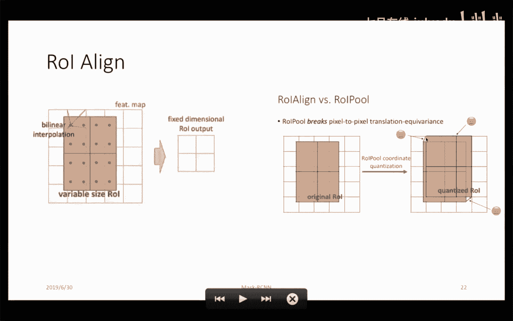

嗯，看有没有什么问题。好，这就是ROIline的一个一个原理。然后嗯这个是musask RCNN的一个在coco数据集上的一个检测结果。它这个检测结果主要展示的是在一群人当中，一群人当中。

我依然能够把这个人能够分割的很好，就是一个物体在它同类物体包围的时候，它这样能够分割的很好。

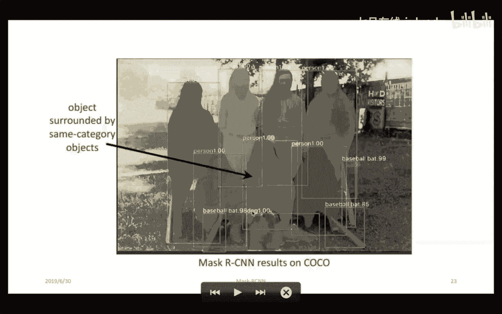

哦，然后这个是ROI pulling和ROIline的那个嗯对精度的那个对比，对那个回归精度的对比。然后可以看到Rline它那个精度是有比较大的提升。然后这个是对那个物体分割的一个那个结果。

在客co数据集上，然后musask RRCN利用res next101嗯FPN这个网络的话，它的那个分割效果是最好的。

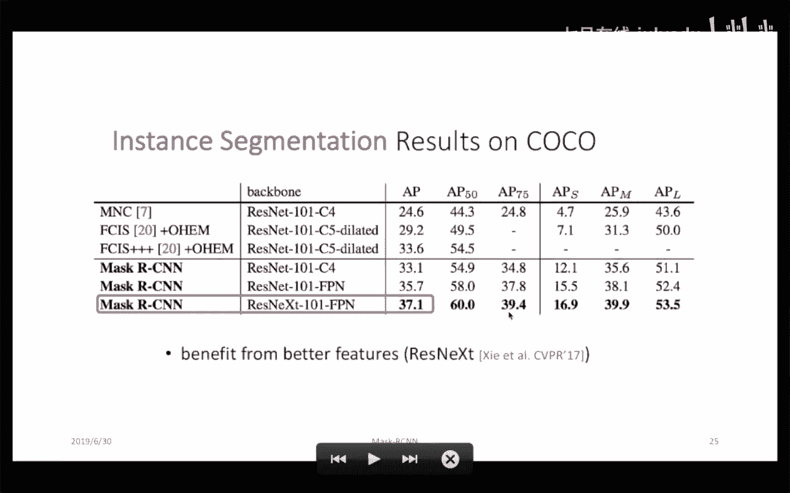

嗯，但m RCN也不是完美的，它有很多分割失败的例子。比如说这个后排的这两个人他就没有检测到，还有就是这个举着手机拍照的这个人也没有检测到。

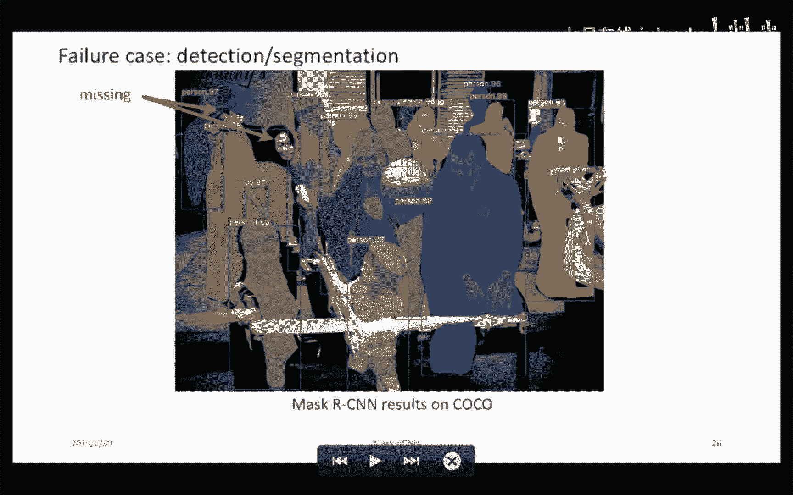

嗯。还有就是这个嗯有些识别错了，像这个沙滩上的一个毛毯吧，然后它识别成了一个自行车。嗯，好的，以上就是全部的理论介绍。嗯。然后看一下有什么问题。只有边缘点要align吗，还是整个proposer都要啊。

对那整个proposer都要。对它就是proposer都要嗯。它实际上嗯跟变认点没有关系，它是对那个呃对内proposal做的。嗯。然后后面的话可能就是那个一个开源代码的一个介绍。

然后可能时间关系还有就是这种这种这种交互方式的话可能。嗯，我也不会是说去。没有更多时间吧，去讲那个嗯实现的一些细节。可能大概讲一下这个嗯这代码的那个怎么怎么能能够快速的运行起来。然后怎样训练自己的数据。

嗯，然后后面这个代码的那个呃原理的话，可能在以后的课程当中，如果有机会的话会深入讲一下。然后这个musask RRCN这个实现的话，有基于很多框架有实现，有拍toch的话，有tenor flow的。

还有咖啡 two的，拍to的这个是比较新的。然后也是facebook嗯，应该是今年吧，今年开源的一个代码。嗯，用起来也比较好用。嗯后我主要讲一下这个拍 to版本的那个musask RCN。嗯。

然后他那个官网上那种安装步骤的话还是比较清晰的。有在linux下面的安装，有在windows下面的安装，在那个linux下面的安装的话，嗯，我清测过，主要我觉得要注意一个问题吧。

就这个toch嗯微ing这个版本的话，如果你按照这默认版安装。然后你扩大扩大的版本，如果是十的话，它那个会装最新的那个那个toch嗯，微ing，这样的话可能会有些问题。你可以再在后面写一个版本号，嗯。

装那个0。2。0版本的可能就没得问题。如果说你们遇到这个问题的话，不知道不知道什么原因的话，你可以看看是不是这个toch微ing的版本的问题。嗯，这可能是有一个坑。然后它有一个例子，嗯。

嗯然后是那个webcam点派这个例子的话可以直接跑的。只不过的话，如果说你没有那个网络摄像头的话，可能不能够直接跑。啊，这里面的话你可以改一下，改一下，改成输入图片，这样就可以嗯直接的跑出一个结果。

然后他还提供了那个doote book的一个demo，这个的话是可以直接跑的。

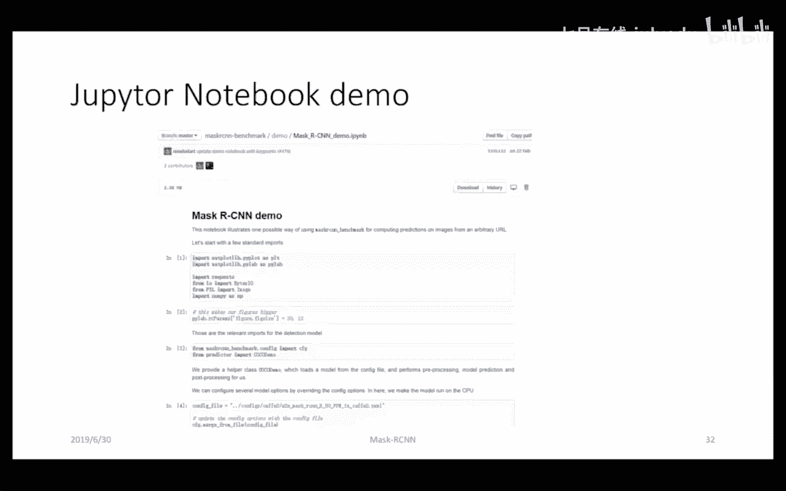

这是跑出来的效果，一个是分割的效果，一个是人体关键点的检测的效果。嗯。然后这就是安装那个musask RCN，然后怎么训练自己的数据集呢？然后主要是主要是那个对configure文件的配置。嗯。

在这个目录下面有有一些网络结构。嗯，然后如果你要从头开始训练自己的网络的话，可以把这个位置这这这行注释掉，就表示你要从头训练一个网络，而不是翻 tune一个网络。

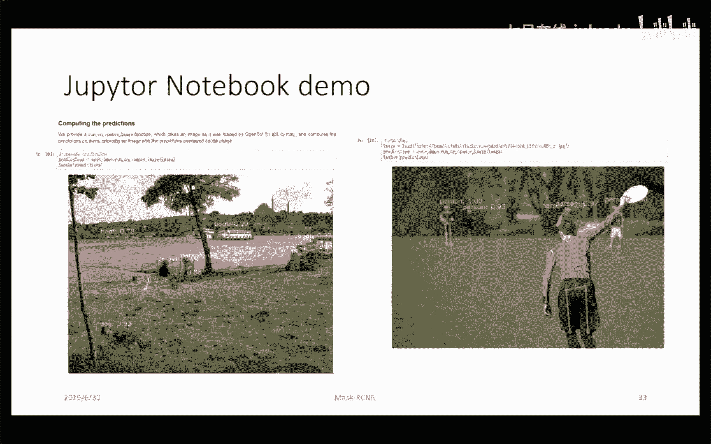

然后训练的话最主要的就是准备数据集。然后你在这个这个地方改成自己的数据集。那后这里面还有一些其他的参数，比如说我们的learning rate，我们的那个学习率，可能也要关注一下，也要修改一下。嗯。

然后这是这个confi文件里面的。还有一个就是这个configuration下面的defat点派嗯defat点派，然后这里面的话会有一个嗯n classes。嗯。

你要根据自己的那个那个要做的那个类别物体类别要做相应的修改。嗯这里面有一些learning rate。这这这这种超参数的话，和上面的文件，超参数它是改一个地方就行。那建议还是改前面这个吧。这个一般呃。

根据情况吧嗯。然后最后就是嗯指定你那个。你那个准备的数据数据集的那个文件路径啊，指定好之后，这个是文件路径，这个是你的那个嗯label的一个数据。然后就可以训了。然后嗯这个label tool的话。

就是有一个label me，可以用这个进行label的那个标注。然后后面的话执行一下那个python的一个脚本，就可以训练自己的数据集了。然后。嗯。嗯，嗯，这里面后面带来的参数。

如果你在你在这个看fi文件已经修改了的话，这个参数实际上是不需要的，就直接跑就行了。然后。然后嗯对，然后就可以训练自己的数据集了。嗯，这个工具其实我也没用过。

因为现在一般的可能自己需要去手动的label一些数据的话，这可能还是比较难的。一般可能也是外包给别人label一批数据回来训，或者是在网上找一些公开的数据集来进行训。

不过如果大家要训练一种比较比较少的分类的那些东西的话，还是还是可以用这个label名来来label一下，然后自己训一个模型，自己搞着玩，自己试一下。然后我觉得我今天分享就这些。嗯，对。

对我今天分享就这些，看大家有什么问题。嗯，分享一下PPT肯定没问题啊。嗯，讲今天讲的不是很好，然后讲的不对的地方，欢迎大家指正嗯。刚才代码没看着呢，嗯，没事，我会。嗯，哎我不知道怎么分享给你啊。嗯。

到时候我给助教吧，看助教怎么分享给你们。

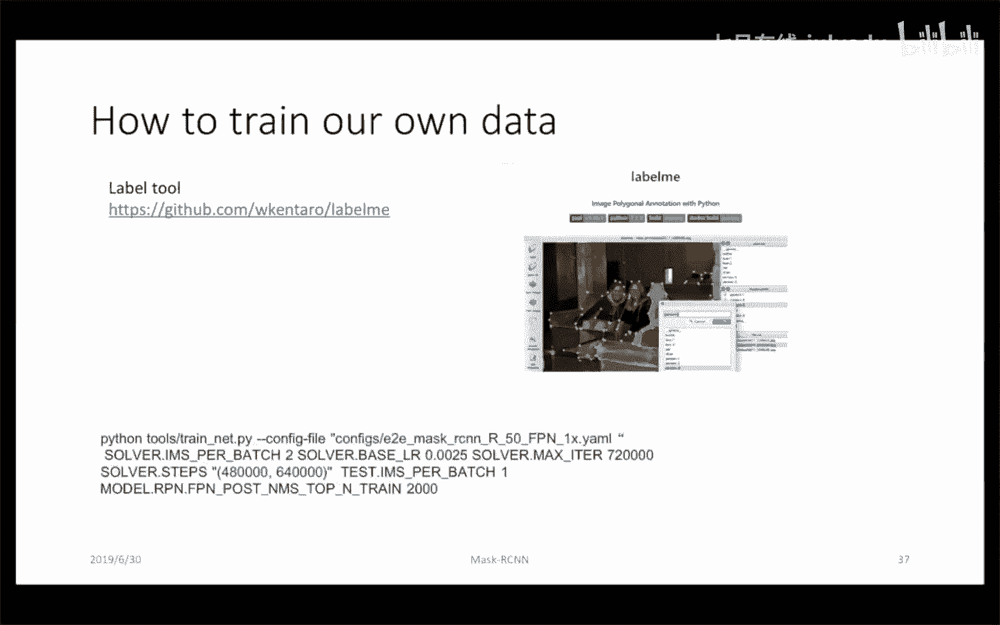

嗯。看出教怎么分享给你们。

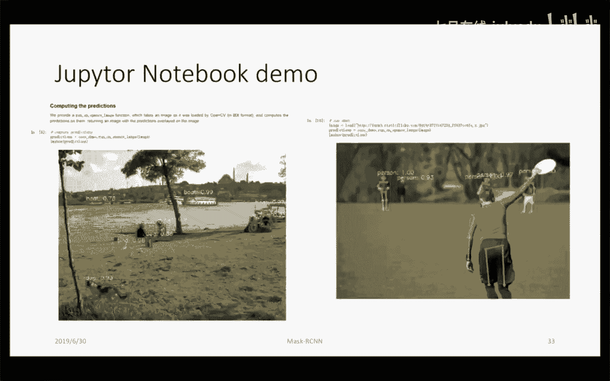

对。嗯。😊，就是我觉得啊就是说通过今天这个课程的话，首先就是说对这个musask RRCN的理论可能会对可能会有一些了解。然后嗯在实战的话，按照这个后面的PPT这种嗯步骤做下去的。

可能能够嗯完成自己训练自己数据集上的一个训练，然后也可以直接跑它一个demo，对。然后关于那个代码的具体实现的讲解的话，可能在以后的课程中会有涉及。嗯，我们之后会有1个CV2的1个就业班，嗯。

到时候会由我还有Ceven老师一起来讲，嗯，我们俩可能都是嗯国内大厂的那个CV的做CV的。然后Ceven老师的经验可能是比较丰富的。我是今年第一年开始讲，嗯，也不断学习吧，向大家学习。

然后也分享我自己在工作当中的一些经验吧。对。

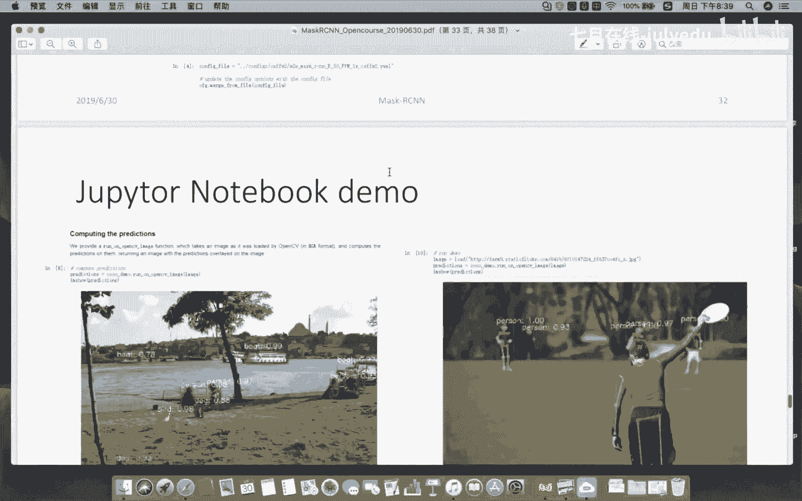

嗯，有代码呀，代码的话嗯，代码的话，那个我已经起了个链接在这儿，这个是有有很多代码。对，这有代码。对。嗯，有代码。好，请助教冒个泡。如果没什么问题，今天的直播就到这儿。啊，这个是助教哎。

那我回头把那个PPT发给那个我们的助教，你们有需要的问那个助教要，然后有什么问题的话，到时候再通过助教传达给我，我再给大家解答。嗯，好，谢谢大家。今天直播就到这儿。

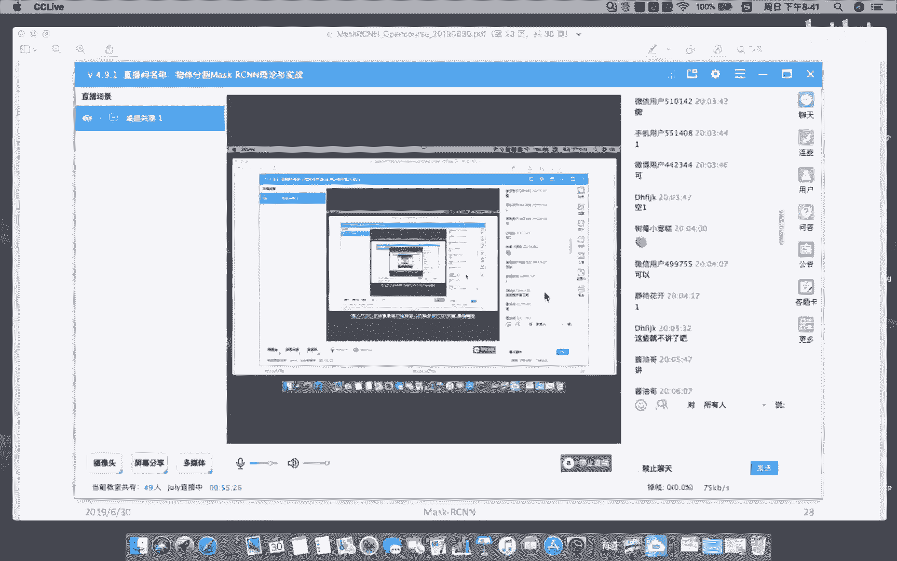

