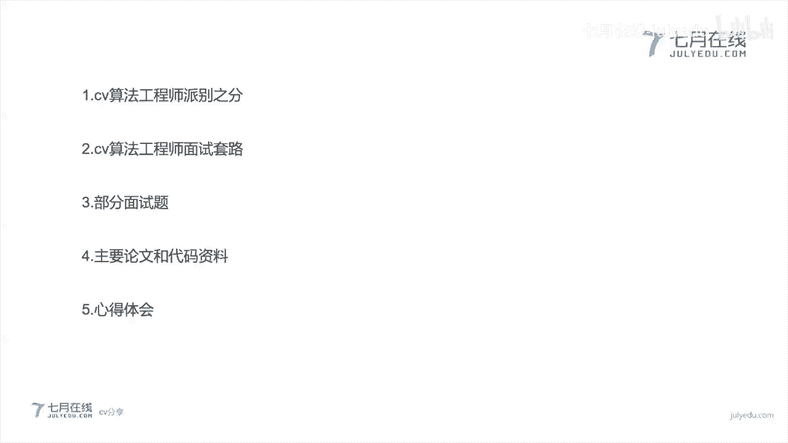
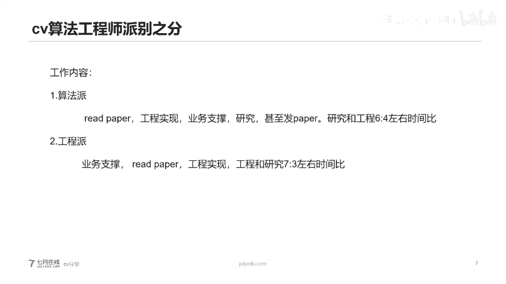
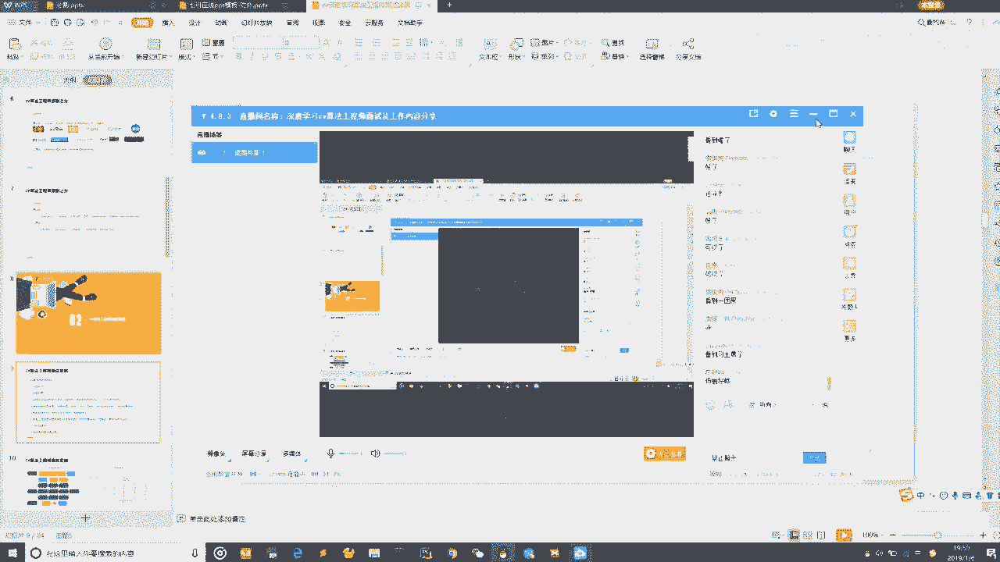
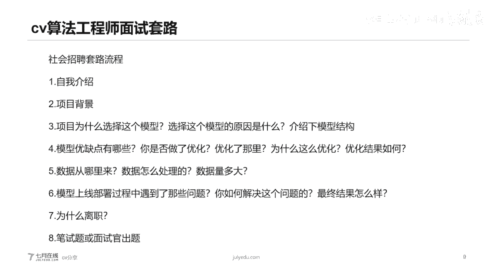
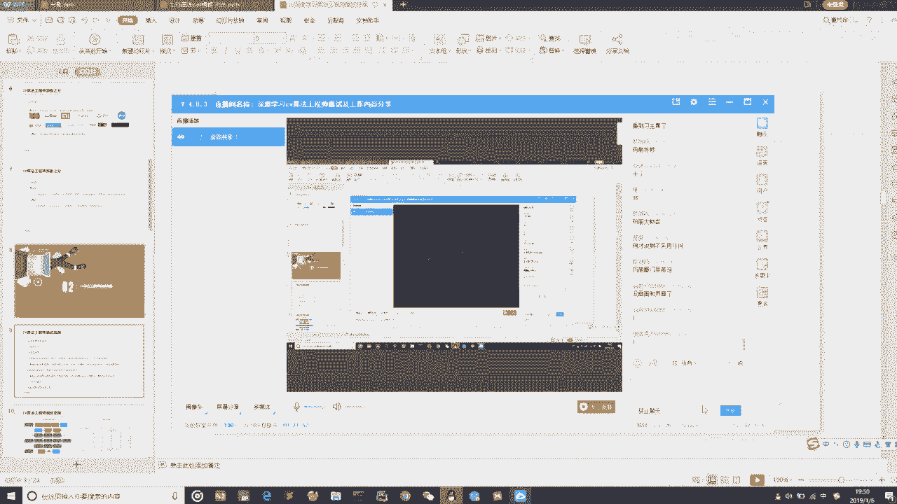
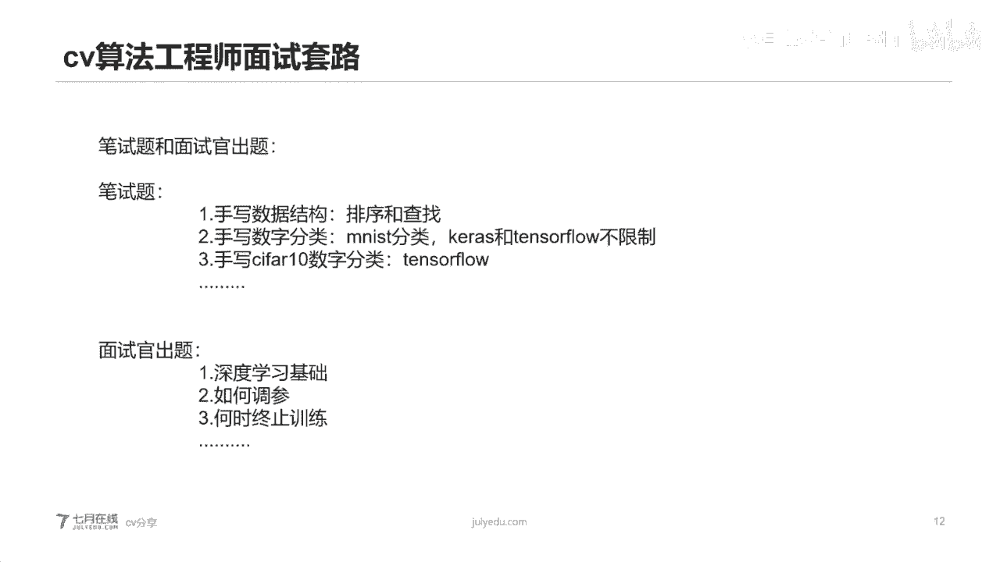
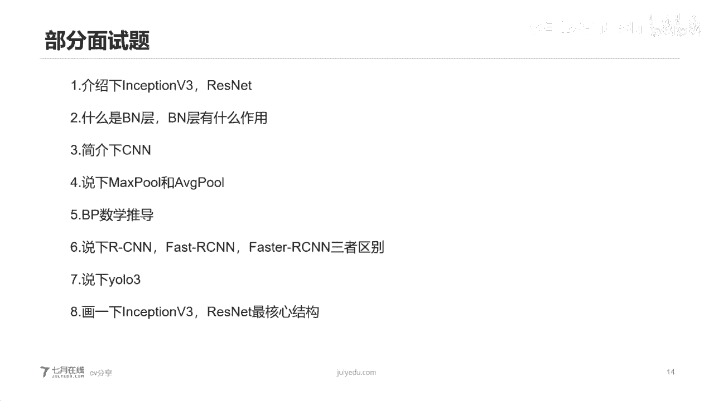
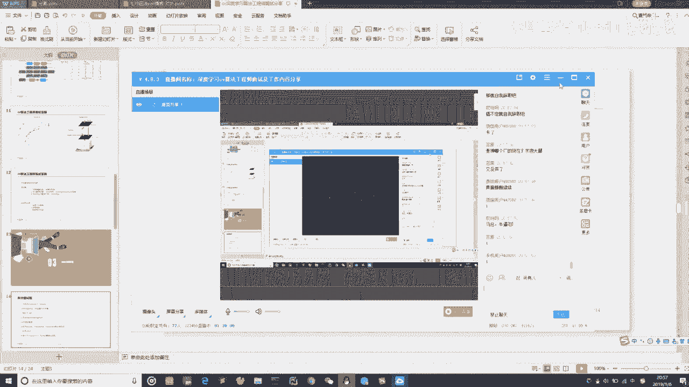
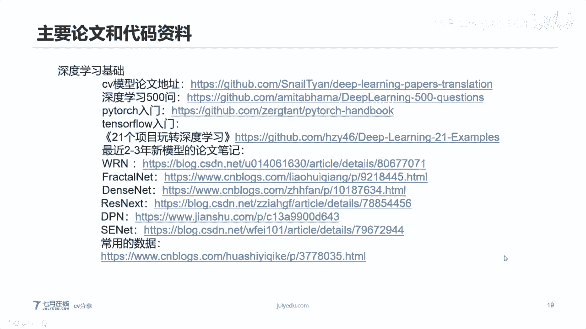
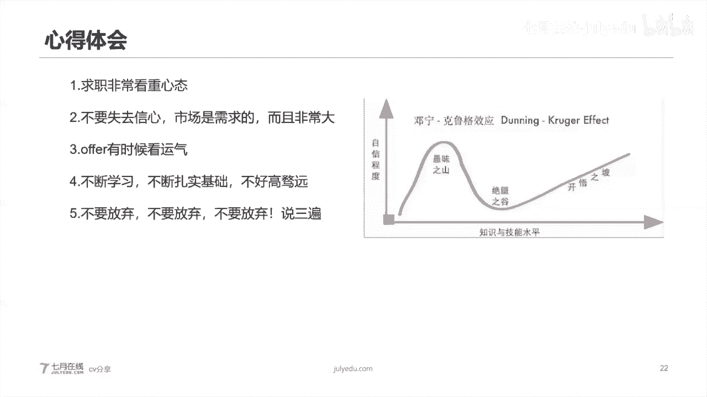

# 人工智能—计算机视觉CV公开课（七月在线出品） - P11：优秀学员分享：计算机视觉面试求职经验 - 七月在线-julyedu - BV17z4y167dq

呃，首先。自我介绍一下啊，然后那个我是咱们签约在线那个呃深度学习集训营。然后一个之前集训一期的啊一个同学啊，我叫我姓麦啊，大家可以叫我麦同学。然后今天很开心也很荣幸，呃能给大家做一次分享。

然后希望呃大家呢通过这支分享，都能呃得到一些知识，然后那个相对来说了解一些那个就是深度学习CV方面的面试的一些技巧和面试的一些考点。然后大体上了解一下。呃。呃。

深度学习LCV这块呃需要哪一些的基础的一些东西啊，然后咱们呃一起成长啊。首先来说呃。

今天的分享呃分为几大块吧。第一块，然后CV的算法工程师派别之分。第2块的话，CV的算法工程师面试的一些套路。然后C呃第3块，然后CV算法工程师呃一些部分的面试题。

然后第4块的话呃主要的一些论文和代码资料。然后第5块的话是我个人的对一些呃就是面试啊，包括CV算法工程师的工作，还有一些呃理论基础啊等等的一些心得体会。呃，首先来说是这样的啊呃就是。呃。

首先呃就是怎么说呢？我也是一个我自我介绍一下吧，我就是个我是个非硕士啊，然后非计算机专业的啊那个一个本科生。然后的话其实呃通过这段时间的学习啊，通过这段时间的一个跟朋友之间的交流，跟老师之间的交流。

然后得到一些。怎么说吧，一些成长，然后就希望把这些成长和这些呃通过这些面试啊这些知识跟大家一行分享啊。好了啊，那个闲话不扯了啊，那个因为咱们预定的是呃7点半呃分享啊，现在是7点26。

然后刚才说的那些话其实是相对来说啊是等一些没有进直播间的一些同学。然后的话那个现在我们开始真正的啊那个进行我们的分享。

首先第一部分啊那个啊没有画面吗？

没有画面吗？没有画面吗？啊，有有画面哦，OO啊。那个抱歉啊，那个最好用微信那个在微信群里回复啊。然后如果说是自己黑的话，那可能你调节一下你自己的那边flash是吧，应该是你自己那边问题。

很多人都说是可以的啊。

然后这边是这样的，然后第一部分的CP算法工程师派别之分，可能很多人都第一次听说啊，原来算法工资还分派别。

其实准确来说，算法啊。其实准确的来说，算法工程师吧，它其实分两派的，第一种是算法派，第二种是工程派。然后呃等一下啊，这边有呃这边有朋友应该说是黑屏。我觉得这个黑屏的话，应该是个人的一个flash插件。

没有那个开启的原因啊，那个最好谁共享一下，谁分享一下那个flash的一个呃就是开开插件这个prochme的一个流程啊，然后我就不等了啊。首先来说它分算法派和工程派。呃，什么是算法派呢？

其实它相当于偏向于模型的结构研究，还有一些算法优化和迭代。当然这个算法派的话，它也支撑一下业务啊。然后他算法派的要求，其实对于基础的理论要求非常非常高。然后对你的数学功底要求也蛮高的。

然后他主要的一些呃一些工作可能说是读写论文，然后代码实现你论文论文复现。然后还需要一点就是说当算法工程师接触到业务的时候，需要对这个业务所涉及的设数据和数据分布进行深刻的理解。然后对这个问题。

对这个业务场景需要一个深入思考，然后分思考这个问题的本质。而工程派的啊那个。天下工程实现啊，就是基本上就是业务支撑，然后主要要求其实很简单啊，没别的就能干活，带马牛能训练，能调三啊就行了。

然后我们看到那个旁边配着几部图啊，那个就是稍微有点写一会，上面呢可能就是一个算法派的一个算法工程师。呃，就是可能每天呃不能说每天吧，就是他的工作。然后下面可能话就是类似于偏工程方面。

可能偏程序程序写代码会多一点。然后我不知道大家是否认识这个哥们儿啊，这哥们儿是个拍神大佬啊，那个request裤是他写的啊。就是他其实很厉害啊，那个说句题外话，调节一下气氛。然后。其实当我面试的时候。

或者说当其他小伙伴去面试的时候，他们就会碰到一个特别特别大的一个问题。就是说有发现有些人就特别特别考代码。然后有些人就是发现不怎么考代码。这是为什么呢？其实主要来说就是你。

你你自己的学习路线和面试的要求，那家公司的要求是不一样的，就是面试那家公司，它可能是偏向于工程的。就是你招你进来，就你帮我去工程实现它就OK。然后可能你这边是准备工程的。

然后你面试那家是需要这个算法又化的。然后你这边的就是你这边代码能力也体现不出来。所以说所以说我通我想通过今天的分享，给大家确定一个路线。就比如说帮助大家更好的有针对性的去学习。

就比如说可能说我这边对算法研究，特别特别感兴趣。OK那你就要去学求职一些算法派，就是算法派比较看重的一些公司。如果说我这边就是说可能算法理解，我深度我不够，然后的话我这边对。呃，这个。呃。

就是对对这个模型怎么搭建啊，这个模型怎么设计，不是太感兴趣，不是太make sense。那么你可能说你走工程派，那么就是走工程派写去那个提升代码能力。这样的话对你的对你的职业发展啊，啊。

或者说对你的那个求职也会相对来说顺利一点。然后准主要来说啊，我们分一下啊，就是说算法派，它其实非常非常注重理论功底啊，项目经历辅助的一些代码考察，就是说我们可能会有一些鄙视。然后的话它80%的内容啊。

都是项目经力基础理论啊，还有一些数学概念，模型结构、模型设计，还有一些比如说现在的模型发展一些方向的探索方向的研究，还有最新论论文，你是否看过是否复现过paper啊，是这些东西。

然后20%内容为代码考察。但所以说当你呃这就会遇到一个问题。就是当你在。面一些算法的一些就是偏算法的这些岗位的时候，他其实考察代码相对来说比较少。呃，然后的话你准备的可能说你准备太多太多代码。

比太多太多工程实践就呃比较浪费时间。然后的话考察的内容也不是代码考察的不是特别特别难。然后工程派的话其实就偏偏工程实现了啊，他就是非常注重实现方案，项目经历，然后代码考察笔试辅助理论，就是怎么说呢？

工程派的就是这些公司啊，他们就是对代码非常非常的严格。可能说呃上来就是先面试第一轮上来就是先写40分钟代码。啊，就考你几个笔试题，而且是我记得我之前面过一家独角兽呃大概是40分钟的一个笔试题吧。

然后15分钟需要答15道选择题。然后25分钟写一个数据结构。啊后这样的话，然后先第一轮笔试。然后笔试完之后。然后又问了一些项目细节，又问了一些理论，又问了一些东西，大概面试时间不到一个半小时，就这样。

这是第一轮。所以说他就是偏呃80%就是偏实现方案。然后的话项目如何实现，甚至有些时候，比如说有一些这些公司的话，可能说他自己要呃实现一个深度学习的一个产品。然后的话他这边是没有实现方案的呃。

他这边可能面试的时候，他都不看你简历，不看你简历内种，不问你这项目经历，不问你学历，不问你这些东西，不问你技术。就问你呃，我这边有个项目呃，你你给我提供一个实践方案。之前我一讲，我面试过一家。

就是说他是做智能硬件的。然后他就说我这边需要做一个图像搜索。OK你给我提供一个方案，就是看这个方案，他来评估这个方案是否靠谱，是这样，然后的话他会问你如何去写这个代码，你是用什么语言去写。

然后呃大概多少行，大概会占多大内存，然后运算量多少，运算速度多少，他会问这些东西。所以说呃剩下的20%就是可能说问一下基础在的里面，就比如说什么卷积层、石化绳呃，固定呃石化层。

然后那个激活层等等的这些东西，但是会摁的很少。所以说呃。当我们哈只是说遇见这样的面试，或者说当我们发现，只是说我们准备的东西和我们面试的公司不一样的时候，面试公司需要要求不一样的时候。

就有些时候就会发现呃这个没有拿到offer，有些时候就会觉得自己能力不行。其实不是只是你的学习倾向呃，你的学习路线和那公司要求不一样。就主体来说啊，给大家一个呃该line嘛。

就是算法派的就是比较注重模型呃模型内核研究的呃，比较注重模型的一个迭代和优化的进行算法优化的。相对来说都是重大型场，至少来说呃从我这边的了解到的，基本上都是这样。

而且是还有一些什么不差钱的一些创业公司啊，独角兽呃通常是这样，像BAT啊，京东啊滴滴呀美团啊呃，包括一些医疗方向的独角兽还者贝加家啊和林森童这些。然后为什么呢？其实。呃，当你工作了。

你就其实你就有这样的体会。为什么？其实呃因为。当算法研究算法其实在深度学习中呃，就比如说拳积神经网络，它需要大量的数据的。然后的话如果你数据量特别小。

无论呃你要用一个假设说用个inceptionV3或者说稍微在前点啊50这种的，O就很非常非常容易over对吧？非常非常容易过拟河，后但是过拟合这个问题你怎么处理呢？其实大家都用什么正则化呀，呃。

然后在在那个各种处理呀，或者怎么怎么怎么样。当然最好的方式其实是不是假数据，但好但难就难在有一些呃小的公司，它其实是没有数据的，它是数据量是不够的。所以说呃在我这边我包括我本人呃，包括我身边的朋友。

其实他会面到一些工程派的公司，然后我自己分析了一下呃，工程派的通常的都是都是创业型的一些公司。然后的话可能还有一些部分刚转型的一些中刚转型的一些中小型厂。就是怎么说呢？

就是可能他这个部门是呃AI部门可能是刚刚成立的，然后没有成没有太多时间。他主要的目的，这样把你招进来，主要的目的就是你给我去干活啊，他不会去考虑说这个这个模型深度是什么样。

这个模型如何去拓展这个模型如何去发展这个模型如何去优化，他不会考虑这个问题，他可能更多的把你叫过去就去干活写代码啊，OK然后的话我自己其实呃体会到或者说自己曾经呃就是想到为什么会会有这样的一个分别。

只是说主主要是来说是因为中小型的一些公司吧，它可能会有一些资金压力。然后数据是一方面，还有一些资金压力，它无法给你空间，给你时间。呃，就是说让你去对算法呃进行底层的研究，然后进行对算法进行优化。

那可能更倾向于业务业务支撑，呃，趋向于更向更倾向于说。呃，这个你快点给我时间业务，快点给我呃，把这个活干好，快点把这个项目上呃，而可能形容中大型场，或者说一些独角兽。

它可能更偏向于说更底层的算法研发算法的一些优化。然后的话迭代也是模型迭代也是比较那个就是比较深的啊。所以说这块的话呃大家在选择工作和选择。呃，公司的时候，包括自己选择自己的呃那个职业规划的时候。

要根据自己的一个自我定位，然后选择一些合适的公司。呃，然后的话这样的话可能说在你的面试几率成功率会高一点，好吧。然后我们进呃进行下一项啊。主要来说吧，其实。呃，只是工作内容吧。

因为我现在的工作其实是偏算法派的，呃，就是偏理论研究和偏呃底层知识偏算法优化的。可能说我每天的工作可能读paper，然后读完paper之后。积累积累到一定量之后进行工程实现。

然后呃兼带着呃进行业务支撑和那个业务支撑，还有一些那个项目支撑产品支撑。然后呃甚至我们今年就是呃我们公司对算法工资都是有8fa份要求的啊。然后的话研究和工程的时间比大概在6比4左右。对于我个人。

这是我针对我个人来说的啊。然后的话可能工程派的，我问了一些其他身边做那个图像算法的，就是偏呃工程实现那些那些小伙伴。其实他们主要是业务支撑，然后偶尔时间会读了一下paper。

就比如说可能做一些业务在图像呃图像分类和图像目标检测呃任务过程中，就比如说可能说这个任务呃这个目标检测效果特别不好啊。呃，面AP特别特别小特别特别低。那么我需要找一篇最新的论文，最新的paper。

然后去看看它的效果，然后去跑一下模型。所以说它的那个工程的占比就时间就比较多，然后研究时间占比就比较少。所以说它更像相当于说一个红横向的一个扩展，横向的一个扩展一个方式吧，然后。呃，怎么说呢？

就是说呃这两派就就是说本质上其实呃。也本质上是不分派，但只不过说工作的你的倾向性不一样。只是说算法派可能说呃平时感觉很很轻松，就是一天没什么事，读个paper，看paper。

甚至看paper都能看一星期两星期这样，但是一旦真正的涉及到研究工作，涉及到呃发一篇新的 paperper，涉及到新的一个模型的结构的一个研究，那么那个时间段是很痛苦的。因为你没有好的点子。

你没有好的想法，你的上次你的leader就会问你说啊你最近工作什么了。你最近对吧？工作内容是否饱和等等等等这些问题。呃，然后的话呃工程派的话可能就会有一些业务支撑压力。可能说就是问你代码行不写好，啊。

然后对吧？那个就是呃明天上线能不能改上啊，就这样，所以说但呃但有一点大家一定要清楚，一定要清楚，就是算法工程师的代码量，其实相对来说是非常非常少的。它主要的代码量共。现在模型的模型结构和那个数据处理上。

主要是在这里。所以说呃还有一点算法工程师很少加班，这点大家一定清楚，可能说刚入行的小伙伴，或者说呃刚刚接触算法这个行业，刚知道算法这个这个这个title的小伙伴们不太清楚。其实算法工程师加班很少。呃。

或者说几乎不怎么加班，因为什么啊？因为是这样的，你算法优化和算法迭代，他不是能靠加班能解决问题的。呃，有些时候就是说包括我老大呃，就跟我们说说啊，你们晚上加班头脑袋都像降糊一样，就是完全已经没有思路了。

那让你们加班有什么用，他不是说他不是一个can球C加砍球V的一个过程。虽然我们是CV工程师，但是我们不是can球C加卡就V啊，就是有些时候是需要你去用想法去支撑的啊。OK呃，但是有趣的一点。

大家也呃也要清楚一点，就是说。真实的线上业务其实都是用成熟的稳定的呃模型去跑的。就是说不像呃大家想象的么那那样认为，就比如说可能最新的模型那样，不北的都会用成熟稳定的，大概准确率可能说不是特别低。呃。

那种的，就是因为准确率特别高。比如说呃现在比较准确率比较高的，像panth night和n night这种。呃，就是imine可以拿到达到90%多以上的这种。

其实它的那个前向传播inference过程是非常非常慢的，这可能会对你的那个时效性的产品的时效性要求呃，就会大打折扣，就会可能会影响一些用户体验。

所以说有些时候要在呃呃要在那个就是准确率和时效性之间找一个平衡。呃，至少工业界也是这样的。呃，可能说在真实的，比如说啊之前我也参加过一些天使比赛啊，开比赛，还有一些什么DC比赛什么的。嗯，在比赛中啊。

其实很简单很粗暴，就是呃用最新模型啊，就是就比如说什么buNN这种呃直接就是就是轻轻松松啊，不能说轻轻松松这句话有点有点呃有有点错了啊，就是说呃在国内拿前50都是很轻松的。就这样就是然后做一下数据处理。

做一下da塔干嘛cumentation这种就直接上就是做一下，就是基本上调调仓，后跑一下，就是输出一个结果就差不多前50是这样。但是工业界和那个比赛还是有很大区别的啊。

工业界是有时效性和准确率双重要求的。比赛的话其实简单粗暴就是准确率啊。呃，然后这一边的话其实。

呃，这应个第一章就完事了啊。然后第二部分就是算法CV算法工程师的一些面试套路。其实我觉得这个呃大家是非常非常想了解的，或者说像非常非常想知道的。就是说哎呀为什么我每次面试或者说我准备的东西，面试官。呃。

都不问我，然后呃面试官问我的问题，我都没准备，对吧？这个就非常非常尴尬。其实呃我今天就和大家来聊一聊这个事情啊。😊。

首先来说啊，我是因为我是社招嘛，呃校招的话，你可以去找隔壁小王子啊，让他来做分享。呃，社招套路的话基本上基本上分这几大块啊，第一个自我介绍啊，第二个项目背景第三个啊就可能项目为什么选这个模型啊。

这个模型的原因是什么呀啊，介绍一下这个模型结构啊，然后第四个啊模型优缺点是哪些？然后你是否做了优化，优化哪里，为什么这么优化，优化结果如何？然后第五个就是说哎你你你做了这个模型优化的话。

你这数据是从哪里来的？你的数据是怎么处理的，你数据量多大？啊后第六个可能说模型上线部署过程中啊，你问到了哪些问题啊，你如何解决这个问题，然后最终结果怎么样？然后第七个大家都不愿意谈的啊，你为什么离职？

然后第八个可能说。😊，呃，一些笔试题啊，或者面试官呃，稍微呃突师整件，问问问问问你呃什么残词补漏的某些API啊，或者说你原型呃你的项目工程工程工程设计中哪一些呃库，然后那些库的API是什么？

你垫用哪些函数，然后那些函数名是什么啊，用这些东西。然后。呃，咱们就针对于这个就针对一几项说一下吧，自我介绍就不用说了啊。项目背景我个人非常非常建议大家，当大家构建自己的简历的时候。

或者说当大家要继续去面试的时候，一定要阐述这个项目背景。因为这个项目背景决定着你为什么选用深度学习，呃，可能大家做过传统CV或者说没做过传统CV，就是做深度学习的一个前提是什么。

大家很多时候都是啊都是觉得啊这个模型牛这个模型厉害啊，我就觉得这个这个东西去做。其实不是的，有些来说这个项目背景很重要。呃，这个项目背景主主要侧重于什么？你的数据量，你看你数据分布。

就是说当你的数据量达到10万级以上的时候，甚至万级以上啊，不用10万级吧万级以上，10万级，甚至百万级这种的话，你采用深度学习效果要比传统的呃呃传统的传统的几传统的那个计算机视觉效果要非常非常好。

为什么？其实准确来说，就是说当你用当你数据量特别少，可能几百张几千张的时候。就会占成一个你要采用一个三6学习模型。假设说是inceptiontion V3啊，那么就会有一个非常大的问题。

overfitting，然后。这个over不ing怎么办？呃，可能说在比赛中的做法就是说你对他armentation，你不断的悬疑变换，然后高斯加噪加盐，然后effin，然后等等等等等等这种操作是吧？

各等等这种各种那个就是技术操作。但是在真实工业中项目中，我可以跟你这么说吧，跟你们跟分享这件事情，就是我们根本不采用任何数据括，对不起对不起。

哎，还行吗？还可以吗？😊，O ok ok ok ok ok， sorry， sorry sorry。

呃。好吧，那我们继续好吧。😊，那个抱歉，那个这边确实网络可能会稍微有点卡，然后这边我还应该会有录屏吧，然后。

呃，现在好了吧。😊，现在好了吧是吧？好了，扣个一，好吧。好的，扣个一。

啊，ok ok ok ok谢谢谢谢谢谢。😊，Oh。然后的话就是这项目背景我们介绍完了啊，自我介绍的时候，其实我就多提一句吧。当你自我介绍的时候，你一定要说跟项目相关的东西。你不要说不相关的东西。

你什么意思呢？就是说比如说我是学什么非相关专业的，我非计算机专业，我非数学专业，非统计学专业。啊，你就不要说了，你就说一下你学校，你是本科，本科本科就可以了。

然后的话你介绍一下你做了哪些项目跟节诊一个沟通时间。不要说太多复杂的乱七八糟的东西啊。然后第三个只是说啊项目为什么选择这个模型，选择这个模型的原因是什么啊？介绍一下模型结构。其实这个是个坑。我跟你说。

这个是个非常非常大的坑。只是说。面试官问你这个问题的时候哈，他想考察的什么？考察的是你对整个行业是否有深入的了解。为什么是为什么会这么说呢？说你对整个行业有这个深入的了解呢？因为你为什么选择这个模型。

这个模这个模型在这个行业的技术水平是什么样？这个模型能达到一个什么样的高度？这个模型能达到一个什么样的准确率？而这个模型有什么样的运算速度？对吧你这都要考虑的。如果说嗯就比如说当时面试我的时候啊。

我面了很多家。然后就我我在我简历中，我写的，我用了inception删。然后的话那个面试官就问我，你为什么选择这个模型？其实我可以给大家一个比较细谑化的啊比较玩笑化的一个呃说法。

就是说呃谷歌出品必须精品啊，就是其实呃这么说的话，我后来想了一下，稍微有点细谑。但其实也合情合理。为什么？因为。你想一想谷歌至少来谷歌谷歌至少来说在世界范围内技术水平是相对顶尖的对吧？呃。

中国范围内的可能说BAT比较顶尖，但BATD的话呃或者是face加加BAT的话出的模型相对来说不是特别特别的多。

谷歌的话至少有呃谷歌inceptionV1V2V3V4还有2inceptionV2啊等等等等，对吧？模型，那你想想谷歌线上跑的模型上它难道不稳定吗？对吧他难道呃不好用吗？

对吧所以说你当你如果说是当然这个可能跟我个人经历有有关。因为我个人之前是在小厂工作的啊，所以说呃我当时选择的是话选的是呃这么说，因为要跟着谷歌father是吧？呃去去呃去做？

如果说大家的呃那个个人个人的环境或者说个人的场景不一样。比如说我本身我就在大厂工作的那么你可以写一个比较牛的比较厉害的模型是吧？啊？我我我们我们为什么选这个模型，因为这个模型牛为什么牛，因为它参数量大。

它可以更好的，你和我的这个数据，我我好几千万的数据，你一个谷歌inception，那呃效果其实很差的那如果是那样的话，效果就非常差。可能就说你几千万的数据甚至上亿的数据的话。

可能就要用更更最新的更新一点的模型。比如说V4啊或者renet或re max等等等等。就这种东西。这样的话取取这个你选择什么模型，取决于你的数据量和取决于你你这家公司。所在整个行业的地位。

大多体上我个人认为啊就是说呃如果不是特别大的数据量的话，呃，一个inceptiontionre night V2或者是res next这种这种级别就够了。

不会不会搞到呃什么n night night这种级别，基本上就是就是这个这个级别吧。所以说。啊，这个问题基本上就是回答的相对来说是呃比较满意的。然后的话呃。选择这个模型，还有一个原因。

就是说第一点准确率。第二点是这个模型的一个时效性和稳定性的问题。因为工业工业场景它更多看重于一个稳定性。就是说不是说这个东西牛了准特别准，我就用它，有些时候是要看到它它不稳定。只要它稳定就okK好吧。

所以说呃结合一下这个这两点大家。选着根据自己的一个经历，然后去改自己的简历。好吧。😊，然后一下，然后那个就是还有一个问题，就是说。当。你说了这个你用了这个模型之后，然后的话就可能说面试官就会下任问你。

你给我介绍一下模型结构。其实这个时候也是个非常大的一个坑。就比如说呃我们用了，假如说我的简历中写了inceptiontion v3，那么inceptiontion v3最核心的结构是什么？

你不见得从呃第一层输入299乘299乘3到最后一层s max。每一层主要47层，你选47层，你全都记住，不用的，你你只要记住核心的结构就可以。因为说实话呃，几40多层的东西。

其实说白了一呃我们自己都很难很难记住。但是你把核心的东西记住就OK。然后的话这个时候你就需要用笔啊，不要用嘴说用笔去画一下这个模型结构。

就比如说你s你ceptiontion3最核心的什么是inceptiontion，对吧？res night最核心的什么是残查结构。这两个呃，在凡是你要去想做深度学习CV算法这块，这两个模型结构你必须要会。

必须就是背着默写，把这个模型结构背着默写下来，就能画出来。因为这个东西是基本上就是必考的，这个是必考题啊，送分题。所以说呃。然后的话你再补助以说呃比如说这个这个模型的输入啊，输出啊等等等等。

再加一些再加一些这个。呃，自己的一些看法就O了。然后呃。这个时候面试官啊，他就会问你，哎，你用这个模型，这个模型的时候呃，他有没有什么优缺点啊，他他哪里好，哪里不好。

然后你你自己就是用这个inception系列的时候，或者说用re night的时候，你是否对他优化。无论在比赛中还是在项目中，哎，你做了哪些优化，你是否尝试过优化，或者说你想到过哪些优化点。

然后你优化了哪里啊，你为什么这么优化，对吧？然后优化的结果如何，其实这又是个坑。其实这个坑反映的是什么呢？大家一定要清楚，这个更反映的是你对模型结构是否有深度的思考。你对你的基础知识是否扎实。啊。

啊可能有些人觉得啊你这你又说的比较深刻了，因这其实就是啊我我对吧？我就迁移学习，反正最后就是呃我搞了一个什么exception那个no top模型，然后后边加几层加一层卷机，加一层石化，卷机石化。

然后再加一层d out，然后再搞个s max就完事了，对吧？也很很简单，但其实不是的。其实是他问的目的是你为什么这么设计。你你为什么要迁移学习？你为什么要改最后几层？你为什么要加每一层block。

或者说每一层的结构，你为什么要这么加？反映出这个可能就是比如说假设说卷积对吧？就是卷积和大小，在在tan字葫中可能就是一行代码TF的L点convolution to d对吧？

然后你卷积核大小为什么选成3乘3，你为什么不选成5乘5，你可能说哎呀，大家都用呃5乘5对吧？对吧？或者说大家都用3乘3。其实不是的，背后是数学运算。所有的呃记着所有的卷积层叠呃叠加都背后都是数数呃。

背后都是矩阵和张量运算，就背后都是张量运算，矩阵是二维的嘛，然后张量是三维和三维以上的，就是背后就是张量运算，然后为什么选成3乘3，对吧？因为3乘3速度快，计算量小？对吧然后。呃。

这个时候就可能会有可能。哎，那你会算这个。就是说这个模型的一个参数量嘛，你会预估模型一个输出大小嘛，输入大输入给你个输入，给你个卷积核大小，给你步长，然后给你铺定值。然后你给我算一个输出。

其实这都很基础的对吧？什么呃嗯N减W加2派R排顶除以42加一对吧？等等这些公式，对吧？然后的话有些时候就是有些人会遇到这个问题，就是一下就懵了。哎呀，我都是掉别人的包，我都是掉gitth hubub。

我都是掉别人成信代码，我根本就没有想过优化。记者一定要想着优化，因为没有没有一个模型是完美的。它只有在某一个数据集表现的好，或者说在某一类数据中表现的好，它没有完美的东西。

所以说这个东西这就是算法工程师的一个功底，这就是算法派的一个功底。就是说你必须要知道这个东西它有问题。他一定是有问题的。为什么有问题？对吧因为因为你现在在这个数据数据量级。

比如说现在是100万的数据量级，mine那是100多万，对吧？它表现可能说准确率是86%，但是我上不去了，我我业务支撑，我需要我的产品经理，或者说我的呃公司希望在整个行业中达到90%以上，那怎么办？

这个这个模型它就是达不到的，怎么办？对吧所以说很多时候包括我之前面试的时候，我被问到这个问题的时候，我也是发懵的。我说这这个问题有什么意义呢？大家不都是掉包吗？对吧？都是掉包想。有什么意义呢？

其实不是我后来跟一个面呃聊过这个问题，面试官就非常非常深刻的跟我说了这个问题。他说不是说你现在的能力胜任不了这个offer，也不是说你这个能力不够，只是说万一我们的业务扩展了，我们的数据量变大了。

我们需要模型优化和迭代，你没有这个思考，你如何去去迭代呢？对吧你没有这个思考，你没有这样的一个sense，你连想都没有想过。那我你如何胜任这份工作呢？你你现在的工作呃。

你现在的能力完全胜任这份offer没有问题。但是一旦我们业务扩扩张了呢。这怎么办？所以说为什么有些人面试大厂或者面试独角兽面试相对来说不错的公司就会被干掉。就是因为就是因为他没有对这个模型结构进行思考。

他没有考虑说啊原来算法工程师是要是是需要往深里挖的，而不是他之前的做法可能说。就是说啊我会调个包，我会去呃把这个代码写出来。然后的话我会把这个模型成功的跑通，然后结果还不错。

至少百分之8%至少85%以上，结果还不错。但是他没有考虑过。一个迭代的问题。所以说真正的算法工程师，他需要考虑的是根据数据的不断改变，进行模型的算法呃模型算法的优化和迭代，这就是算法派非常非常注重的啊。

当然工程派那就很简单了，那就是来一个新模型，来一个新的文实现就OK了，也不需不需要可么考虑说这个东西他为什么这么这么写，为什么这么研究，不需要考虑这个问题。所以说相对来说工程派的话，可能。嗯。

在那个呃就是。某些呃地位上就是不如说算法派这些，因为算法派偏研究工作。因为呃说句不太好听的话，就是算法派就是智商年压啊，就是包括我们在公司里开玩笑跟同事开玩笑，当然开玩笑说，就是我们的代码你们看不懂。

你们代码我们能看懂，就是这样，就是为什么会会会出现这样的一个分歧，就是因为他们但不是不是代码每一行看不懂，而是说他不明白为你为什么这么去设计。你为什么这么做？其实这个是非常非常，这是你最核心的竞争力。

其实我后来跟朋友聊天，包括我自己去思考算法工程师最核心的竞争力是什么？尤其是在深度学习CV这个行业，最核心的竞争力是什么？不是说你代码多么多么强，你代码强，难道比那些常年呃开发几年的那种。

就是那那种人工程师难道要强吗？不可能的？你强就强占你的理论功底和你的算法优化。就想着想着这一点。然后的话我自因为我面过大概十几家吧。然后拿了几个offer吧。

然后呃之前还跟一个就是就是那个面试官聊的还不错，他就说呃他就问我这个问题，他说你知道为什么算法工程师要求都是硕士吗？啊，然后你是本科，为什么你知道我没有给你发，我们觉得你太okK。

我说我开玩笑说是因为本科呃S打头的那个就是比较多嘛，对吧？就是本科呃就是太菜的人太多嘛，他说不是不是这样的。呃，我问为什么？他说这样一个问题，就是说。为什么要求硕士？是因为硕士的数学和英语。

是经过考验的。地工底非常非常好。你你你做你做深度学习，你是清楚的。深度学习背后其实就是张量运算矩阵的张量运算。就是就是张量运算对吧？就是各种数学变患，就数学运算ba school也好。

还是ag school也好，还是还是con好好，还是等等的还是激活层也好，还等等等等。其实背后都是数学运算。而本科虽然说跟研究生学的数学大体上都是一样的，都是线行代数啊，改率顿哪呃。对。

数理统计啊等等这些东西。但是他本科很多时候的数学功底是不行的。而研究生他经过数学公底考验。然后他的英语也经受过考验，为什么初中英语是因为你需要看论文。你需要跟着最新的研究方向。

你需要跟着最新的一个市场的技术的一个方向。如果说你英语能力特别差的话，或者说你数学能力特别差的话，其实你是不够格的。就即便你现在做的项目做的特别特别好，结果也特别特别好，而且你拿得出手，其实。

你不符合我们的要求的。嗯，所以说。在这一点，我就非常非常建议大家啊，只是说一定要把自己的数学能力。呃，至少最基础的那些张量啊、向量啊呃矩阵啊运算啊、矩阵变换啊、线性代数啊、概世定啊，数据统计啊。

这些东西至少不见得你首见手有什么拉格朗日、中日定理啊，科技中支定理啊等等等等。这些东西不见得什么马尔科夫残税啥这些东西，不见得你都会呃完完全全一字不落的走手推。但是你要能看懂。至少达到这个级别。

这样的话，即便你将来看论文的时候，就是你就不会被那些数质符号啊，你就觉得啊那些东西是什么，是天书啊还是什么东西？就是所困扰。然后英语的话，我建议大家包括包括我自己啊，都接着需要他去看单词。

不断的去学习这样。所以说这一块的话呃，大家也不要说呃有心理压力说，哎呀，既然都要硕士了。呃，本科就没机会了。不是的，其实是从市场的行情来说，呃，本科在未来的今年是19年是吧？

今年和明年啊还是市场是非常非常大的，本科还是有非常非常大的机会的。呃，研究生的话可能说在CV这岗的话，可能研究生今年6月份的话可能会毕业一些硕士。但是研究生的话。

其实他的项目经验和那个工作经历实在是比较呃呃比较比较少的吧。所以说。他的竞争力也不见，他即便理论基础特别好的话，他的竞争力也不见得说比真正工作的很工作一段时间的要好很多。所以嗯大家不用担心。

主要的其实我觉得还是基础呃，一个数学基础，一个算法基础，还有一个英语基础啊，这个大家一定要呃一定要去扎实，然后一定要去。去巩固，然后的话可以我推荐啊，当时我也是这么过来的，就是呃。

其实我当时也是一个这么状态，就是别人我发现我什么都不懂，我竟然看不懂呃，这个东西为什么这么做的。就是后来把我逼的没招了，我去刷一下张宇的考研数学。然后又刷了一下那个咱们7月的那个就是。呃。

冯老师的那个数学课啊，就是所推SVM这整整的这些东西。虽然你让我现在所推SVM我也推出来，我承认我推不出来。但是我知道啊原来是有这么些东西，这么东西我换句话说。

我不会我不会这我对这个问题有一个深刻的我有一个宏观认识，我不会觉得这个东西是我视线之外的东西，我不会对他产生恐慌啊。啊，对了，那段时间我又把花书刷了一遍，所以说我建议呃找这个深度学习的岗位的小伙伴们。

有时间把话书刷一遍，这个花书刷到什么程度呢？就是不求甚解，就是你不有些如果你能求肾解，在短时间内求肾解更好。如果求不了肾解的话，就是你先把所有的东西从头像到尾像看小说一样看明白，你不要想明白。

想明明白它是什么东西。你知道你对这个深度学习整体的脉络，有一个宏观概念。然后的话在你工作中或者说在你的在你准备简历，准备面试的中，有针对点去突破就好。呃，所以说这块的话我讲这块的话，我就跟大家说这些啊。

然后的话第五个问题啊，只是说数据从哪里来，数据怎么处理，数据量多大这块其实很好说啊，就比如说数据从哪里来，呃，你你一定要清楚一件事情，算法工程师不要干太多其他杂物。要成功的甩锅啊。

只是说很多时候有些人都觉得。哎呀，是不是我要体现我一家工程能力啊，我会爬虫是吧？然后我会数据处理，然后等会等等等的，我会数据挖掘等等等等等等。其实不是的，那不是你核心业务。

很多人都觉得啊包括很多面试回来，小伙伴的说候，哎呀，他就问了我爬虫问了我数据读问问了我数据处理怎么怎么怎么样怎么怎么呢是吧？其实不是的，在CV这个岗的话，数据处理其实相对来说还是蛮呃蛮少的。

对吧还是蛮少，虽然有，但也蛮少，主要是什么？主要是什么？主要是你算法的一个模型结构。你你记住，无论谁面视你，无论。呃。他怎么问你一定要往模型结构上去靠，我设计的是模型结构，我只参与模型结构设计。

还有模型的呃模型的一些呃代码设代码过招，其他的我不我不知道都是别隔壁组做的，要么是工程组，要么是啊爬中组等等等等，一定要成功摔锅，不然的话呃，你一旦深问你会把你问死。问死你很轻松。

除非说你特别特别的大佬，除非说我爬虫我crpy，我分布式分布式爬虫非常非常厉害。我爬上亿数据，我们公司都是上亿的，就是爬数爬数据都是上亿的，以亿为基础的。所以说嗯那这样问你就那那就来了。

那你你你你上亿的，你你反他怎么处理的等等等等。后续很多很多问题。所以说你啊你就非常非常嗯就就比较尴尬，对吧？然后你数据怎么处理的？其实在深在CV这岗的话，数据处理可能相对来比较简单，可能说什么二质化啊。

对吧？呢那个那个就是会一化，然后的话那呃然后旋转切割平移，然后等等等等。然后加高斯高斯降噪，然后高斯加盐，然后等等等等。然后这块的话因为有一些是呃公开的一些呃就是库你可以去调用openCV也好，阿也好。

都会以去调用。然后数据量多大，记住凡是向上到就是说项目经验，深度学习的项目经验，数据量不会低于20万以上，不会低于20万以下。所以说你这块的话，不要说低于20万以下。你要如果说到20万以下的话。

就会就会觉得你嗯你这个项目也不是特别特别重要。不会不也不是特别特别重要，只是觉得呃数据量太小，你不应该用深度学习数据量过大。哎，你公司规模是多大了？所以说这个数据量这个问题，大家要根据自己的一个。呃。

所处的一个形象情况啊啊所处的一个环境，自己去预估一下，或者说自己去看一下。就是说我公司一个数据量多大。呃，大体上我之我记得我之前的公司的话，大概也就是30万30万左右吧，是吧？

然后这块大体上基本上面试觉得嗯挺满意的。因为因为因为因为是这样的，你所有的选择基于你的环境。你所有的选择你你所有的模型选择、数据选择等等等等选择都基于你上一份工作，上一份公司所处于这个行业的地位。

甚至甚至我之前面试的时候，我都会被问到，说你们公司为什么选择深深度学习？你你们公司为什么能会选择深度学习？然后的话。深度学习这么新的东西，你们公司怎么会知道的？对吧都会你都要你都要去事先你要准备好。

你要知道。这个问题如何去回答呃，可以我可以给一个官方的一个回答。就比如说相对来说比较细运。可能说呃就是呃我老大之前在谷歌中国工作，然后我们的业务中涉及到一些图像识别，或者说图像检索等等东西。

然后的话我们去查了一下，从谷歌呃我们相信谷歌是呃行业比较领先地位的。我们所以说去查了一些谷歌的模型，然后把谷从B的h上呃拉了一些代码，然后自己去更改，然后去去去完成这个任务，完成这个完成这个项目。

就这样。包括我我面试的时候，大体回答思路也是这样的。呃，事实上是我老大也真的是谷歌中国开发工程师啊。我当时的我刚当时的公司CEO确实是这样。呃，然后的话呃还有一个问题啊。

就是说模型上线部署中遇到了哪些问题，你如何解决问题，最终结果怎么样？这个问题其实是一个大家在没有经过面试的时候考验的时候，大家都不会想，就是说模型上线过程会不会遇到什么问题呢？然后对吧？

就会尤其是可能呃一些小伙伴没有经历过呃项目经验，没有时候没有一些那法，就完全这个问题就是懵的状态。其实遇到哪些问题，可能就是说就比如说目标检测。呃，目标检测有个非常大的一个问题，就比如无论说是优o也好。

SSD也好，还是呃画啥子也好等等等等。这些检测模型就有一个可能说比较普遍的问题。小目标检测。效果不太不是特别好效果不是特别好。然后还有可能或者有些目标被遮挡的时候，识别不出来。

被遮挡一部分之后识别不出来。然后你是如何解决这个问题的？其实这个可以甩锅嘛，我教你们甩锅啊。甩到什么国数据分布。怎么甩到数据幽末？其实就是说当你模型训练的时候。

你这个数据量这个就是你出现问题的这个数据就没有这没有参与模型训练。你你你们明白我的意思吗？就是说就比如说我们说的小目标检测，小目标检用呃，小目标不好那。为什么小莫不好？因为你给我的数据的时候。

你数据的标注的时候，比目标检测中有需要bony boxbonundy box中。我们要检测那个那个小的bony box，它就它就没有勾标，或者说它这个数据占整体的数据量不不是特别特别大。

对吧然后的话比如说他标的小目标，可能说嗯在只是假如说整体数据量是。25万出张图片，整体给我标小目标可能在3000张左右。你想想这个数据能能，对吧？我们会很小，所以说它就会有一些小目标检测呃。

不是特别好的问题。啊，当然有些人还还有还有可还有比较细腻的方说法，就是说哎我上线模型上线没问题。其实当你这么说的时候，呃，面试官就觉得。😊，呃，这个这个朋友觉得不太靠谱，因为。呃。

模型不可能一点问题都没有的，或多或少都会遇到一些问题，识别不准啊，或者说嗯比如分类问题，可能分类错误啊等等等等，都会有一些问题，对吧？不可能遇到一点问题没有的。所以说你这么如果你这么说的话，OK呃在。

在你你如果说你其他的表现什么基础啊，或者说呃什么笔试啊都OK的话，可能说大家睁一只眼闭一眼过过去，或者说这家公司非常非常缺人的情况下，就可能就给你off。但是其其他情况下基本上你就是过不去的。

基本上就是你过不去的。因为你一定会遇到问题。你一定要知道我我我所有的模型都不是完美的，所有的模型都是你和数据的结果。这个数据如果说出了问题，这个数据没有体现我真实的数据分布，那我训练的模型就会有问题。

这个一定要就是甩锅就甩到数据上。然后的话嗯当他可能会问你这个数据谁给的？你就跟我说，你可能说说哎呀你的运营同事或者说你的甲方对吧？你是乙方如果你做外包的话，你就乙方乙方对吧？

给的甲方甲方给的然后的话他的数据标注有问题。然后然后他的问题如果解决这个问题，让他们重新标注呗，多大点问题，对吧？重新标注呗，然后或者你或者还有一个问题，就是还有一个方法。

就是你对这些小对这些小目标的数据进行数据扩增，增加增大这个数据在呃整体样本中的分布，然后看一下你真实根据你真实分布的比例啊，去按照这个比例去扩增扩增到这个比例的话，然后最后进行重新重新模型重新训练。

然后最后结果怎么样，最后结果你就说呗，就说这个。这个问题解决了，对吧？至少这个问题呃是可以在接受范围内，不像以前说小目标完全是坚持不了，现在可能说准确率稍微低一点啊，大概60%多就这样。其实这都OK的。

因为因呃因为因为现有的模型不可能你合所有场景的，就是至少我认我干我看到的吧，这些模型不可能你和所有场景。所以呃出现点问题不是特别特别大的问题的话，其实都OK。好吧，然后第七个问题其实也是蛮坑的一个问题。

就是你为什么离职。其实大家都不都不好意思说是吧？其实核心也离职原因啊，对吧？要么钱少了，要么干的不爽是吧？但你不能这么说啊，我可以给大家一个呃就是比较相对来说比较呃十三的一个方法啊。😊。

就是比较就是比较能催的方法。其实包包括我包括我被面试的时候，都是我面了这么多家，每一次我都会被问问到这个问题，每一次都会被问到你为什么没离职，你为什么离职，原来工作不挺好的吗？你为什么离职。

其实呃呃呃人的思考是有一个高中低维的。其实这个问题我教大家怎么去回答，或者说教大家怎么去思考这个问题。其实他问的为为你为什么离职，不是想追究你你为什么跳槽，就不是不是问你他想知道你思考的方式。

他想知道你是如何以如何去思考问题的。其实这个问题实际上你要从呃行业，从企业，从人从各自自我这三个角度去思考问题。为什么从行业从企业从人呢？首先来说行业可能说我之前这家公呃，之前这个这个行业吧。

比如说人工智能这个行业哪一块对吧？呃，发展最好啊，北京北上广深一线城市，对吧？那么只是说为什么这个行业会发展这么好？因为因为。互联网时代十几年十几年对吧？然后留下了大量的数据。

对吧然后留下大量数据怎么办呢？这些数据是值钱的，这就是矿啊，我得找办法去挖矿了。然后需要一个算法去把这些数据的价值去体现出来，或者说需要一个算法去把这些数据的分布去拟合出来。

对吧所以说这个行业是未来朝阳行业。对吧越走越大越走越宽，是这样。当然那个每个行业都有它的生命周期，这个点我就不说了啊，这个对吧？互联网行业有它的生命周期。现在应该互联网行业处于一个呃衰弱期。

大概是一个衰弱期的一个状态。呃，可能AI领域刚刚处于一个萌芽期，或者说在成长期，成长期这么一个状代。只是说这块是一个每个生命都有一个周期叫S型曲线。大家可以去查一下啊，生命周期呃呃成熟S型曲线。

所以说要我要踩着这个这个行业的阶梯是吧？我要我要我要入坑这个行业，然后从启业，为什么说我要跳槽？或者说为什么我要离职，是因为我原来的公司，他不是特别特别重视呃，就是研究。

或者说他不是特别特别重视模型结构，而我个人是非常非常重视模型结构研究的。我是非常非常想深入这个行业理解。而我之前的工作时相对来说可能说是呃比较注重代码的代码比较注重代码工程，而我没有时间去研究它。

我没有时间去了解这个这个东西的具体构造，具体怎么设计的。我永远都是一个调包侠。对吧。😊，所以说当你这么说的时候，面试官觉得嗯这个这个朋友或者这个面试呃这个这个来来来面试的人。

他是有高中低维三三个维度去思考问题的。他知道未来的发展是这样。然后他也知道他公司的目前环境是这样，他自己他也有想法，他有追求啊，这个小伙子思维是相对来说是立体的，他不是单片面子。你明白吧？

只是说思维一定要是一个立体的，是一个综合性的结果。它不是一个单片面的。比如说哎我就觉得就这个行业好，为什么好好在哪里？我就觉得我公司不好，钱给的少。你单如果单一就是因为钱给的钱给的少。

我觉得就是你单一思维的话，可能这最后的结果就是。所以你你你只你跳不出一个跳不出你的思维局限，你更需要一个宏观思维，宏观到微观，一个这样一个整体的立体的思维。你这样的话，你的思维思维是饱满的。对吧。

然后最后一个是笔试或者面试官出题。这个这个的话基本上我遇到的啊。Yeah。呃，这个就是我们说的那个inceptiontion和r night啊，然后。呃，回到这个就是说笔试和面试官出题，这个是不定向的。

基本上我我总结了一份。呃，这个面试官出题的一个总结吧，然后回头给发给大家啊。然后笔试题的话基本上。基本上就是分类手写分类，手写排序和手写查找。

基本上就是基本上就是这种这种我遇到的就是这些不会太数据结构的话，就是数据排着查整，排序和查找不会太难。至少在CV这个行业的话，是这样LOP的话可能还会涉及到什么呃动态规划等等等等。对吧这个。呃。

我个人建议大家把主要的时间去深挖基础，深挖理论，深挖模型，深挖深挖论文。呃呃然后当你看论文或者说看出类的时候，然后你再去呃写写代码，再去刷一刷lid code啊，刷刷建着活这些东西，好吧。

然后这边是这样，就是我们刚才说的啊，你为什么选择in，为什么不用呃选择resite？其实。这也是一个呃。你对模型下结构理解的一个问题。就比如说你s啥input299乘299乘3。

我之前遇到过一次一正面字题，他问我一个这样的问题，他说你见过。呃，结尾不是呃，你见过就是模呃模型输入是不固定输入的模型吗？是什么样的模型呢？那个模型输入是不固定的。呃，全图片正常来说。

模型输入是有大小的，就是299乘299乘3呀，还是20呃还是其他的什么416乘416乘3等等等等。为什么好了吗好了吗？那个刚才我看到那个那么。哦，卡了，现在好了吗？要扣一下一，扣下一。ok ok ok。

😊，呃等一下啊，我找这个对。然后的话。对吧只是说然后的话这样的话，如果你输入变的话，你的输呃你你的模型权重是不断在变化的。你这样你你训练不就是顺训练的一个模型权重嘛，对吧？所以说。

当你有全链当当你有那个全链阶层的时候，你的模型输入是必须固定的。当你呃没有全链阶层的时候，就是全卷积网络的时候，你的模型是无所谓的。可能比较核心的结构，就比较核心的模型，就是说LCN啊或者是unit。

就这种的就这种的卷卷机网络。所以说当你面到面对这些问题的时候，你一定要是有一个基础。你才会去反反思考吧，思考啊，原来是这么回事，原来是这么回事。而且有趣的一点，他之前还有问我。你如何预估参数量？对。

就是参数量这个事儿，我就不跟大家去说这个事儿了。因为我总结了一个一个小结啊，然后回头大家自己去看，然后也给了答案，也也给了博客弟址，大家自己去看，好吧，呃，节省下时间。哎，突然有个问题。

为什么出现ressonnet？对吧为什么出现ressonignite？这个ressonnet是微软研究的。还还还是那个谷歌，还还是facebook，我记不清了啊。

就是呃inception v3是谷歌的对吧？为什么？其实可能大家说会说啊reson night当你模型呃深度比较深的时候，为什么深度比较深，要追求深度比较深？因为身在成多高额语义的特征。

然后的话当你模型深度深度特别深的时候，如果说。以往的那种方式哈，它都会就是当你前向传播的。当你反向传播的时候，列式求导就是列式求导非常非常长。

然后的话就会如果一旦你六线求导中之前有一个是呃我们和凯明大佬就提出了一个叫res night的结构，就残插结构哦，外边牵了一条线。啊，就牵了一条线，然后这样的话就是说当我它梯度，让让它梯度永远不消失。

对吧。哎，我有个问题，为什么inception v3，它是他要横向，他他他是做出inception v3的mod这样的一个格式了，就是ressonnet它是这样纵向的。其实在面试过程中。

我也被问到这样的问题。只是说为什么resignnet往三乐发展，谷歌是往横向发展。其实准确说，其实这是两家公司对于一个模型结构的一个探索。你你你一定要说往一个模型结构的一个探索这个方向去找。

这样的话你找到的工作，你才会是可能说是偏算法研究的这个方向。如果说你的你你你的你的表述永远都是说哎我是如何去实现，如何去实现。那你你让看你让面试官看不到，你对这个问题有有思考，你对模型结构有思考。

那面试官即便把你招进来，他也不敢确定。你是否有研有那个有自己独立设计论文的能力。所以说你可能更多时候是工作工程之撑。你明白吗？所以说。首页首页所以说当你面试的时候，当你回答问题的时候。

你一定要表现出我自己是对这个问题有深度思考的。微软呃facebook对呃。对这个模型深度有探索。然后呃那个呃谷歌是对那个模型的宽度进行探索，对吧？那现有的在2017年以前，对吧？

是深度呃der is better对吧？越深越好，看你能干多深，有1000多层的对吧？ressonite。然后最近的话大家都在往宽度上进行课本。我不知道大家是否有读过最新的几篇论文。

然后我这这个这边分享之后，这边那个PPT啊，我都会分享给大家啊。然后我给了几个论文的地址。其实大家都会在在宽度上进行扩展。其实宽度有些时候不见得比深度长。然后这边我们就过去了啊。

然后还有一点就是因为我的简历中涉及到呃U路三和那个目标检测，然后我就会被问到U路3和那个bussRCN的问题。然后呃。我不知道大家是否那个有这样的一个sense，就是说当你问。

目标检测fasRCN的时候就会有全家统的事儿，什么全家桶的事儿呃，是吧？RCNfasRCNfat特RCN这个三个区别是什么是吧？然后。呃，他们三个有什么优缺点呢，对吧？对吧那我我我们就稍微讲一讲吧啊。

好吧，只是说。RRCN的话，它其实主要的一个呃步骤啊，就是用一个它提出的一个selective search啊，从那个。带检测图样中提取2000左右的一个那个proposal。

然后这边选了这边的那个候选呃proposal，可能要含有一个检测的目标。然后他把所有的那个候选框啊都那个放呃缩放成一个固定大小，应该是好像没记错的话，应该是27乘27。

然后的话用那个卷积神经网络进行每个凑远光特征提提取。然后得到一个固定长度的一个好像特征向量吧。然后把特征向量送送入一个非常重要的一点，就是SVM分离起。

那个时候嗯全连接网络进行回归和呃对应位置的回归进行分类和那个类别分类和那个位置的呃对应位置坐标进行一个回归是吧？然后就是那个RCN，然后这中间吧，其实何海明的博呃，那个何海明博士啊。

他又在那个RCN基础上搞了1个SPPnSPPnet其实最核心的其实有一点他引入了一个叫空间金字塔啊，采呀采样空金塔这个结构啊呃special pyramid啊 pulling啊。呃。

然后那个对那个卷积特特征啊进行空间进电场采样，获得固定的一个常入输入啊，然后可对那个。特征层任意长宽比此路需进行特征层全呃特征提取。然后这边其实当他做出STPnet的时候。

其实是为后续的bussRRCN打设基础。对吧。然后那个Snet和RCN1样，它都是那个训练的进行多个阶段，然后中间特征进行存储啊，然后这这些这些的那个组织细节啊，大家去看论文就好，好吧。

然后然后下面一个就是可能说bussRCN。然后bussCN的话可能就是。呃，就是针对CN和SCP在训练时多阶段的一个和训练过程中和耗费时间的回归问题进行改进。然后他把那个SVM分类整合一起。

然后搞了一个呃不用SVM了，然后搞的那个 max。然后使网络在那个就是OVC数据啊搞到那个就是CN的84小时缩短9个小时9。5小时，然后检测时间做到0。32秒等等等等。

或者说呃对它还有一个它主要创新是一点就是RY pulling对吧？就是他将不同大小后仰光的卷击特征统一采样成固定大小特征，如果每次面试的时候都会被问到就是全家桶这个事，就是每次面试都会被问到这个事。

所以说大家一旦简历中涉及到说我简历中用个sN的话，一定要准备好RCNCNRCN三个时间的区别。如果你要简历中还涉及到CN攻击这4个你。说不用面试官问你自己主动去说，为什么面试官。你你记住一点。

就是当你面试的时候，永远不要竹筒倒肚子。就是面试官问你一句，你回答一句，你要看称这个这个环节，你要自己去主动去说。不是说显得我呃非常非常专业，甚至你本身就很专业，好吧。😊。

然后fast就这个就那什么了嘛，对吧？这个其实它主要就是做了一个reason proposal，对吧？network，然后的话他又搞了一个一定规则，这是不同尺度的anor。

然后因为通过RPN的卷积特征给予呃代替那se search，对吧？然后呃他实现了一个端到端的一个训练。然后候选区域生成啊啊候选区候选区域特征提取啊，回归分类啊，一气呵成的这种。它是真正的意意义上的啊。

第一个学习呃深度学习目标检测算法。所以说当呃。那个怎么说呢？就是当我们比赛过程中啊，就是说大家可以去用一下busbustRCN这个模型其实还是效果还是蛮不错的啊。它比优罗要准很多。然后优罗的话。啊。

一阶的嘛，对吧？就是他就把那个到呃我的简历中涉及到663，所以说我每次被问被问到。简历的时候啊，他问我优罗三，其实他潜意思就是想问我优如一右罗二跟右如3。所以说这块的话，因为时间原因啊。

我就不跟大家那什么说了啊。然后后面有论文，我给大家准备了一些论文资料啊，中英文对照的，还有英文论文原文，还有一些代码，还有一些我觉得不错的一些呃一一些笔记吧。好吧。

只是说呃然后你回到我们这个说的这个就面试官笔试题和面试官出题这个事儿。就笔试题的话，其实我遇到的啊就是手写数字结构，就是都是手写。呃，就是全是用他给你个笔，然后然后你自己去手写这样，然后手写数字分类。

大家不要小看这个min的分类啊，就是很多人都会呃我不是很多吧，我至少遇到两家，就是你用car或字给我手写min分类，从头到尾从手写API全都给我记住这种啊。这个其实大家好是准备一下比较好。

然后第三个就是搜写C帕值数据分类。这个是我面一家独角兽的时候。呃，被被问到了，然后当时我也是比较懵，然后后来还好就是写出来了啊。然后面试官出题的话，那就是基本上三度学习基础，那就不定不限不不定向啊。

什么BBBBBB反向传播等等等等，我无数无无数的事儿。然后那个调三对这个问题还是跟大家分享一下调三这个事儿，其实调三嗯。主要就是对于我来说吧啊也比较low啊，对于我来说。

主要有条blash size和和lening，还有还有那个你的呃alim对。就是呃通常来说，我当我训练模型的时候，我通常都会选择alam，先跑1到2个apple呃，后跑两个apple左右。

然后那个如果是迁移学习的话，我的认 learn rate会非常小呃，和那大概0。01或0。001这种这种级别。十的呃-3次到1的负4次方这种建议如果是劝一学习的话是这样。如果说是自己从头训练的话。

几个几个几分类的话，可能说我的呃那个任人瑞的话，那就0。1。然后8级赛的话，大家通常都是选二的。二的那个阶层啊啊，不是二的那个。二的N次方啊，就是32啊。

64啊这种128这种不可能大家的硬件设备不太不太好。然后嗯基本上我觉得呃不要太小，为什么不要太小，是因为你 size小的话，当你处在los曲线，无论是就从探测报的看着中的los曲线它会非常非常震荡。

而且当你反反向传播的时候，对吧？呃，那个每次呃反向传播的时候啊，那个就是说它的损失损失是一个不稳定状态。对吧然后。呃，还有一点你前象传播的时候，就是模型学无法充分学到那个就是特征。

就是它会有可能会出现一些模型。呃，就是你送入图片的时候，可能会就是样本不均衡，就造成整个模型训练失败。所以说在那个调大败纸还是蛮的重要。但有些时候像参食活入的话，包括我现在工作经常会遇到1个OM错误。

这个东西也挺也挺玄学的啊，就是基本上都是。呃，基本上都是这样，就是说基本上半 size就是呃你要是不断去试，你也不知道这个机器说它没有一个固定的。比如说这个机器呃就80就能跑，一定能跑，不是不一定的。

有些时候你需要去试了，你需要去呃不断去试，然后找到一个大概合适的一个白 size，呃，不要太低就好。然后learning rate回到我们那个就是learning rate和opim。

通常我会先用呃adam防两个apple，然后下降到一定损失之后，然后换SSGD呃，大家不要小看SCD啊，其实。哎，有个问题啊，那个这个问题我觉得还挺重要的。呃，题外话，你觉得深度学习发展这么多年。

哪一篇论文是最最有价值？对我会我被问到了这个问题。这个问题其实显凸显出你的逼格，真的非常非常凸显出你的逼格。呃，有谁知道这个答案吗？呃，这个这个还还在还在吗？还能听还能听清楚吗？呃，扣个一呗。哎。

这个公园同学啊真的非常非常厉害啊，就是SGD就是SGD。就是这个问题就是说呃大家伙怎么想说哎这么多模型啊，为什么会是STD呢？呃，包括这块大家面试过程中都可以跟面试官说，主动跟面试官说。

我觉得我看过这么多篇论文，我觉得SGD最有价值，为什么最有价值？是因为它从根源上把一个比较抽象的一个图像问题活跃把。呃，优化呃变成了一个优化问题，然后并给出了一个优化方法。

因为之前是大家是不知道如何优化的。一个一个非徒函数优化，大家不知道的，不无法找到这个非徒函数的呃最低点。对吧所以说后续的这些模型啊都是根据说啊这个东西是可以优化的，才会有发展。如果说让你做一件事情。

让你做一件没有发展，或者说让你做一件这件让你做一件呃，就是没有出入的事情，你觉得再做它有用吗？所以说最重要的这大家要记住啊，这个事儿可以跟面试官就是装一下，稍微小转一下是吧？

我觉得SGD是嗯深度学习最重要的一篇论文。啊，面试官觉得嗯。很很有那什么很有深度，所以说这块稍微小记一下啊。

然后这块的话就跟大家分享一下部分的一些面试题吧。呃，基本上就是刚开刷说的差不多了，介绍一下inception V3re night，然后什么是BN层B层有什么作用？

然后简辑一下CN说一下max fourLL4等等等等。还还有一点，这个很重要BT的数学推导。

这个其实在面试过程中很容易被问，很容易被问。而且是几乎是必问题。就是当我面一家呃A打头的大厂的时候，我就会被我就被问的这个问题，就是手手动手动的反向推推倒。

但是不是说呃是他给我一个就是给给我大概五层网络，五层网五层的神经五层神经网络，让我吹某一层的一个呃。就是呃某一层的一个损失那1一个一个梯度呃，对某一层的一个WW和呃和B的一个变化。大家明。

大家知道是那个那什么吧，就是对推导什么吧，就是反向传播，反向传播是梯度是吧？那什么梯度啊损失的梯度是吧，知道就行，然后不知道也没关系啊，不知道的话就是刷一下基础，呃，然后说一下优路3优路3。嗯，这样吧。

我在这这边跟大家聊一聊U3嘛。因为我也呃我因为。我那个简历中涉及到了一下涉及到了us。然后的话。当他问你一个就是最新模型的时候，你一定要有这样一个概念。我不能单只说这个模型。

我要把这个模型涉及到的历史都要说出来。只是说U州3的话啊，那么就说U路一U罗2U州呃U罗3，还有U罗台尼U路主线，对不对？对吧？当然不见得你不见得把所有都锁了，就说U路一U罗2行，那么就说一下U录一吧。

U录一的话，它就是它是它是一阶的模型，对吧？它就是把那个针对于最后的特征图啊，7乘7的特征图进行一个分析，并在他对小目标的检测非常不佳。然后的话。他是一个。直接它是它是这样的。

就是放啥时间都是二阶的对吧？CN也代表二阶检测法它是一个呃舍去了一个那个候选框提取分支，就是舍去了一个pro阶段，直接将一个特征提取，然后后选框回归分类在同一个无分支的一个呃CN中完成的。

使得那个就是网络结构也比较简单。但是这个优录一也好啊优录2也好，U罗三也好啊，优录三会好一点。就是在优录一U2在那个小目标检测会非常非常差。所以说在你针对于在你的项目中。

如果是对于一个准确率特别要求特别高的一个项目中，千万不要用千万不要用。而且U罗山好像是我记得是18年才出来的，所以说。呃。呃，你模型的一个时效性和模型的一个就是呃模型的一个准确率。

根据你项目其实要完全匹配的。如果说你再一个就是说假如说一个呃传统企业吧，比如说假设说你你你的简历中涉及到一个传统企业中，非常对准确率一个瑕疵检测非常对准确率要求特别高的，你跟我说用了优。

我其实我就很好奇，你为什么要用一个准确率这么低的一个准确率不是特别高的一个模型去去去实现你这个呃准确率要求这么高的一个场景，对吧？所以说有些时候当你选择模型还会回到这个问题。当你选择模型的时候。

你一定要是配以场景。配以数据。配你业务，而不是说完全的就是就一下子就说okK我就是选这个模型，我就觉得这个模型牛，大家说牛，大家说好，不是的，有些时候要匹配你的场景，而且更多时候就是匹配场景。啊。

话说回来啊，U2的话其实改进了一些U一的一个网络结构啊，其实它呃除了加了一些呃P规优化啊，然后加了一个残插网络，还还呃搞了一个就是高分辨率的一个分类网络啊，48，好像从48，好像是从48乘48吧。

然后利用那个该网络训练那个呃该网络训练那个网络吧，就是。怎么说呢？就是说他借鉴了其实达的一个an思想，就是说他他呃优龙那个作者其实我不知道大家是否看过那张照片，还是相对来说比较比较爷们。

但是他他的论文其实呃很很很可爱啊，他的论文写的很可爱。就是尤其优龙那边论文，还还有那边还有那边他自自己的简历写的很可爱，挺有意思的。就是比较萌。

然后他他就非常鄙视这种呃鄙视那个何海明搞的这个发达的这个re什就是插结构。然后最后的话他还是用了那还是用的，因为呃在2017年还有2018年就是证明吧，就是深度还是要比广度要在特征提取上要更好一点。

所以说所以说当大家如果面试中遇到这个问题的时候，一定要是有年限。只是说但不代表说广度就一定比广宽度啊，只是我说的广度就是宽度，就宽度模型不见得就完全比深度模型差。因为这个东西其实它是一个争论的结果。

而且现在的话宽度模型的话，其实有也有一些好的新的模型在inmite上表现非常非常好。我，回头推荐给大家啊，因为这这也是我最近看的一几篇论文。对吧。然后说到U洲3优洲3的话。

其实在优罗2G上弄了呃全新的一个什么大可耐53啊传插网络。然后又为又结合了1个FPN那个网络结构结构。然后的话。就是是整个网络两个特征图上海呀，后于网络前期相应尺寸的一个特征图啊，然后再经过什么CN呃。

后得到一个预测结果，就相对来说优路3的话，我因为我自己跑过优路3，我也呃我也参加用优3参加过比赛，优3的话，在小目标上确实要比U2要好很多很好很多。但其实他在优3的，在比赛这个场景下。

它的准确率还是没有ssCN高，它还是没有sN高。所以说凡是涉及到那个比赛项目的话，如果大家想参与比赛的话，呃，fasN和在是吧，是首选是首选真的是首选。好吧。

然后的话剩下的就是一个画一下一ab3和ressonite的这核心结构，这个都是日常操作，这这是必须会的。就是嗯你想干这行，你这个这两个这两个模型你不会基本上你很难混下去，真的你很难混下去。

就是就是这两个东西就是最核心结构就是in module和和残插结构，对吧？这个东西，而且他还会问你为什么会这么设计。大家想过吗为什么这么设计？其实很多时候。算法工程师它更偏向于模型结构。

就是他就是倾向于模辑结构一样。很多时候那那我们看到什么工程派这些的，其实本质上它并不是一个算法工程师，本质上它并不是那么，它只是一个title，而本质上其实还是在干干工程结作，工程工作。

真正的算法工程师，其实它最核心的最核心的目标就是研究模型结构，它为什么这么设计，如何怎么设计，如何用这如何用设计，如呃怎么设计这个模型。才能让这个数据表现的更好，数据分布比合的更好。就这样。

所以说大家一定要有这个ss，从可能说之前是没有，但是今天可能说通过分享嗯，大家都有这个sense，有这样一点点进来，我也是我也是通过面试过程中，因为我是工程派，我也面过算法派我面过两两派我都面过。

我才我才会知道啊，原来这个市场。是有这样的一些要求的。比如说当我准备代码的时候，我发去面算法派不行啊，人家瞧不起你啊，人家觉得你你这个思想深度不够啊。当你准备那个理论深度的时候，然后你去面共同态的。

工程状态，觉得你说的太虚了，我们就需要能实践就行。你能搞个分类模型就行，不要搞得太太太高深，能能能做出来就行。所以说有些时候当面试的时候，即便你过不了，拿不了offer，不见得是呃你的问题。

有些时候是你选是你是你这家公司不见得适合你。所以说大家不要因为说一两次或者说几次啊，面试没有拿到offer就上市信息，我大概的话，我是前六次面试都没有offer，前六次面试都没有off。

我大概面了十几次。后面的可能有些人就知道啊，后面的就是你从拿到第一个offer开始，后面就开始就是刷起来了啊。只是所以说。呃，我至少我了解的就是这些朋友们面试过程中面试的呃，只只有个位数了。

就是说可能说面一次过4次，或者说面三次过两次这种这种概，其他的大多数都是在面呃实事以上的，都是实时以上，至少都是面试以上。所以说大家也不要觉得说呃被被虐被面试背怼，就觉得自己能力不行啊，或者说么不是的。

有些时候是因为你你的不匹配，有些时候是不匹配的问题。就是说你准备的和他要求不匹配。所以说今天通过分享，大家知道啊，呃，我我倾向于哪项，我倾向于哪边我的学习方向应该怎样去修改，我应该怎样去准准备我的简历。

我该应该去找哪些公司。然后这些公司如果说他特别特别注重代码，特别注重注功能实践，我应该怎样去回答。然后如果说这家公司特别特别注重于算法的一些底层理论，数学基础这些东西，我该如何去回答，这样的话。

大家有地放矢。而不是说嗯就是盲目的，比如说比较悲观的说，哎呀，我就找不到工作呀啊等等等等，那些东西都是没有意义的，完全是没有意义的。主要的是。其实你要了解整个行业是个套路，它这个套路是什么？有哪些套路。

你知道这些东西就是你手里有了很多武器，然后上战场，为你选择哪一个武器，但是你选择的事儿，你不要害怕你这个。

那嗯。呃那个能听清我说吗？能听清我说话吗？扣个一扣个一能听清说话，扣个一。ok ok oks sorry，那我就重新再说一遍。其实。最主要一点就是说从为什么我会这么说，说，大家不要因为说一两次的失败。

或者说一几次的失败去丧失信心。是因为从整个行业来说，从整个国家来说嗯。嗯，就是AI这块绝对是最核心的最核心的资金资本，包括人才，最核心整个国家战略。所以说你踏你踏上这辆车。对吧就。

现在是指就你踏上这辆车就会有发展。你现在问题是你你必须要踏上这辆车，你必须要上这个车，你知道吗？就是不要因为说啊我我因为确实学的很难，我跟你说特别特别难，不是开玩笑的，想要了解这些东西。

我跟你说没个几个月时间，你根本都不明白呃，他说什么，甚至说你不不明白你看的是什么东西。我之前就有过一个经历，一段经历。这也是我今天愿意跟大家分享的。比是说之前我有一段经历，大概六七个月的时候。

我学六七个月的时候，我觉得我靠我学不下去了。我觉得我什么都不会。就是这样。然后后来那段时间跟通过朋友们的帮助啊，包括自己调解我调解心态过来了。然后那段时间把基础补又补上，也补什么基础，补数学基础。

其实有些时候就是你不明白数学，你不明白他为什么这么说计，其实背后逻辑都是数学。你扣个一扣个一扣个一好，扣ok ok ok ok ok。所以说这一块的话，我觉得大家都是。都是这么过来的。

然后的话有些时我那一段阶段，我就觉得我我靠，我真的就是什么都不会，就是完全是傻子一样。就是你跟我说什么，我完全不明白我我我我脑袋里只有一个概念，我只有一个名词的概念，但我不知道他他具体的讲是什么。

就是这种这种这种状态。然后的话。呃，后来的话补一下基础，然后补了一下基础，出去面两轮，被虐两轮，呜被虐两次。然后先就是啊大概大概上有一个方向感。然后的话现在最主要的是上车，为什么是上车？

就是是因为是这样的，整个从整个行业，从国家也好，从企业也好，其实都会我跟你说，未来5年之内都会往这个方向转，都会往AI方向走。绝对是百分之百是绝对是。所以说你如果现在放弃的，我跟你说。

未你未来5年你会特别特别难熬，甚至未来5年到10年会特别特别难熬。你现在选择了。坚持选择了。努力未来5到10年，至少来说你不会特别特别丑。虽然你可能说在工作遇到一个问难，但你不会因为方向是迷失方向。

你不会迷失方向。所以说这个东西就是这样，面对问题的时候不要选择逃避。包括这个时候，包括对于我我这个东西不是说说你们也针对我自己说，就是说大家不要选择逃避问题，永远不要选择逃避问题要去直面面对。

只是说这个困困难是暂时的，绝对是暂时的。你上了这个车，你上了这个坎，你会发现其实这个东西我可以跟你说，我工我平时的工作，平时工作也是调包，我也是调别人成熟的，要去githha找代码。

然后去就但是面试的过程中，他就是要照火测，不是在面试中就需要照火箭，为什么需要照火箭。刚才我说了，就是因为我的业务需要升级，你达不到，你怎么办？难道我还需要再招人吗？还有一点，业务不等人。

你这边数据我每天我每天呃我跟透私下透露一下吧，就是每一天这边我可能至少几十万的数据过来回来。然后的话至少一个月可能就一两百万的数据过来。然后一个月对吧？你说你一个月你成长不了。你你这个模型支撑不了。

你你你你你你你扛不了这种压力。你这个模型扛不住这么大的一个就是预估量，或者说你这模型就没有这么对于这么大数据集，你就没有这么好的效果。你我需要一个自己自主有自主权利设计设计模型的男一个人。

或者说一个有些时候可能我们公司还需要把baper。对吧你没有这个能力，我为什么要你？只有一些特别有生存压力的一些小厂或中小厂，或者说他刚刚有这个部门的时候，他那个时候他不会。

他不会说他嗯就是特别在乎你的一个研究能力，研究方向。他指要主要是就是很短视的，基吧你能把我实现就行，你能把这个。又又端了吗？又断了。又做了吗？好了吗？这位好了吗？好了吗？哦我声音断断续续。

那可能这边我这边网络有点问题，然后呃。😊。

然后的话这个就是回到我刚才说的那话，就是说大家一定要是要有长远的意识。就是说这个行最核心的价值是什么？想一想这个问题，最核心的价值是什么？

我们比代码难道比一些开发工程师开发很久的工程师代码写的好写的风骚？不是，最核心的是你设计的能力，你设计模型的能力。算白说白最核心的是你算法能力。那设法从什么体现？可能说现在大家都是好就好在这个行业。

就是比如深度学习这个行业，就是说呃时间不是特别久。对吧论文也相对来说是比较几百篇，没有几百篇，大概几十篇左右。还好还有很大的发展。对吧你看你把所有的论文都看完了，包括我老大说我。

然我老大就说说你呀你不要说每次就是出一个新论文，你就去找个代码去跑一下，就试验不要你要先把所有的论文都看通。量变到质变。把所有相关的论文都看清楚。

然后你去站在这个论文最新的最高的点去去俯瞰整个这个发展路径。然后你自己去提一遍。如果有时间的话，有经力的话，你自己去提一篇论文，或者说你自己去提一个结构，这样的话你再去写代码，你这样的代码是最好的。

不然的话，你永远就是永远就像永远都是掉包，永远都是掉别人东，永远你在行业都是没地位的，就是没地位。你永远都是就是跟着别人走，就换一个新模型来，你就你就拉一个代码，重新再跑一下啊，这这然后再上线一下。

一个新模型来又是这样，你永远都在重复劳动，你没有积累。所以说这一块我觉得就是。深度学习嘛，是算法工程式对吧？深度比。工程调用。更重要。这是我个人觉得，当然我没有任何鄙视说工程派同学，其实他们也很不容易。

我我只是我只是说一下我个人的看法，就是说在森在CV这个领域，就是你能设计出一个特别特别牛的模型，就像何凯明大神，对吧？就是厉害。就是有价值。所以说不管我不管你怎么调用，你，其他人都在调用我的东西。

而没有说而不是说什么时候你能达到一个说别人都在调用你的东西。OK你真正的丑二了，你真的就有了。而不是说说我只我我会调很多很多东西。但其实一旦涉及到业务业务业务变换，业务业务正大。对吧数据都变大了。

你你是没有办法的设计的，你是你是参与不了的。所以说这一块，然后你设计的能力从哪里来？从看论文，然后论文有些时候看不懂怎么办？抓基础数学，抓深度理论，对吧？这样的话大家学习就有路线就会有。又断了。

兄弟们考好了吗？好了吗？扣个一扣个一扣个一。啊，好的好的好的，那就这样吧，就是继续啊，然后就一点大家深入学习。好吧，就是深入去研究。哪怕说刚开始想不明白，无所谓，不断的去讲不断的，我也是这样过来。

包括我现在我也有些时候我也想不明白。但是你需要念这样的一个思维，练这样一个s，就我老大其实我很感谢他，我也很感谢我现在这家公司啊，我也很感我更感谢我当时的选择。只是说他给了你一个。一一个环境。

让你去思考，让你去沉淀，让你知道啊，原来是这样，我老大的跟我就说。呃，你现在。半年之内给我看100100篇论文，必须得给我看。看完之后给我写论文笔记，就这样就是必须看的。

只是说包括我我觉得我和大家沟通啊，交流分享的话，我觉得大家也去多看论文。如果实在看不懂的话，呃，看不懂的你有谷歌翻译，对吧？有些公式看不懂的话，那就只能去刷数学技术了。你有办法，你想吃这碗饭。

你要想体现出价值。你就就得就得去付出。你有些时候可能有些人想，哎呀，你们算法工作一天多清闲啊，包括隔壁的那个开发小姐姐说，哎，我看我发现你们一天都不怎么写代码，我们这天天上线上线，晚上加班。😊。

为什么不是不是我们不写代码，是因为我们知道我们写出的代码要是最智最精华的智慧的结晶。就是我们写出个代码，因为因为你想这个问题，模型迭代是很慢的一个过程，至少是以月为标准的，就是对吧？

这一这一批数据是100多万数据，我跑了一个多月，对吧？我我跑了哦，就是我我训练模型可能训练几天，然后的话上线部署一个一两个月，然后下一批数据过来了，然后看看结果。如果好的话，我就不用模型接代。

如果不好的话，不需要模型迭代。那这个时间段是相对来说比正常的开发同学要要长很多的。所以说这个这个阶段之内你就需要看论文啊，包括复现 paperper啊，包括去看啊看最新研究啊，包括你自己去提升。

提出一些新的思想。对我我的平时工作也就是这样，就是说我这边进去有跑着跑着模型，然后这边看论文，然后那边可能说跟产品朋友，产品同学开个会聊聊一下业务支撑，聊一下技术这些实践这些事。然后。就是。

所以说大家一定要一定要知道这个工作真正工作。其实很多时候论文是占你很很大的一个时间成分的。如果说你的工作说偏就偏倾向于工程的话，我觉得呃然后你还想说早点再转到算城社法的话，我个人觉得呃很难。

因为算法是往深度做，其实我个人是这样认为的啊，先去做深度，先去做深度，往深里挖，再去扩展广度。这样的话在深度学习这个行业中你是有价值的。如果你只有广度的话，没有深度的话，其实你很难拿到offer。

包括我之前面试的时候，我面试那几次没有过的原因，也是因为这样，我觉得我会我会跑优龙，我会跑fa，我会跑res，我会跑inception，我会跑我会跑一些分割模型。然后我还会打比赛，比赛结果还不错。

我为什么不要我？😡，对吧其实。其实人家就是觉得你基础不扎实，包括我第一次面试的时候，那小哥哥就跟我说说，兄弟，我就是看你是朋友，我就跟你说实话，你基础就是不扎实。你多去看论文吧。

其实它是个偏研究性的工作，算法控制是偏研究性工作。所以说从这一点我建议大家有时间多去看论文，硬着头皮去看，对吧？呃，然后我这边研究性的工作，算法控制是偏研究性工作。

所以说从这一点我建议大家有时间多去看论文，硬着头皮去看，对吧？呃，然后我这边研究性的工作，算法控制偏研究性工作。所以说从这一点我建议大家有时间多去看论文，硬着头皮去看，对吧？呃。

然后我这边该也给准备了给大家准备了一个中文的中英文对道的一个论文的一个链接，啊，回头大家咱们一起学习，不是说我这边就很屌呃，很厉害啊，觉得完全点啊，不是不是我们都是一起成长呃，现在好了吗？

扣个一扣个一扣个一。扣个一，现在好了吗？刚才刚才掉线了，不知道为什么。好的好的。😊，呃，那我回到这个回到这个啊。回到这个的话，就是。呃，这个怎么说呢？呃，就是当你当你那个就是当你拿这个东西。

你怼面试官程，面试官程啊，这个这个来面试的人，他是对整个行业技术发展，包括整个最新发展，它是有有研究的。他是有了解的，他不是一个说呃没有上进心的一个同学。就是说这个这个我跟你说，真正算法行业的话。

就是就是说就是有些时候就是论文。虽然说虽然说大家这个论文不见得在你应在你线上的业务支撑中跑，但是你要知道这个东有这个东西，就是说你要知道有这个有这个武器。但是一旦说有敌人来了。

你要这个武器去这个武器能干嘛，能不能用上，你不能手手里没有什么金刚钻，知道吧？你手里必须要有金刚钻，然后才能揽这个机器盒，就是说。所以说大家我非常非常推荐大家去看论文啊。

然后的话也不要担心说有一些那什么，因为我记得我记得我给大家分享了。对对对，这个就这边这边的这个啊这个你记着一点啊。这个记着一下，这边里这里边是有一些那个translation，你看到了吧？

有一些中文链接。因为有些时候我我也是最近才才开始转向研究这个研究方向。然后的话有些时候我看英文的话，我也蒙我也是蒙的状态。所以说有些时候我找了一些中英文对道的这些论文方向。然后大家可以看。

然后的话这边还有一些比如说哎我代码不是特别好，拍套式的啊，这个想法这个这个代码的教程。然后ta不的这个部门啊。如果说这些东西还不够的话，大家可以去隔壁去参加那个拍套式的那个班啊。

也可以去参加隔壁的那个计算机视觉班啊，这个呃。不是打广告啊，是是真的是这样，就是说呃网上资料很多。但有些时候这些资料啊，你信息爆炸，你不知道如何去处理。所以说有些时候当你找到一个朋友。

或者说找到一个组织帮你去梳理这个知识流程的，其实这说减你学的学习时间的，我不得不承认呃，我之前是留过自己学习阶段的。但是我发现自学的时候，有些时候比较累。但是你也要打消一个概念，打下一个观念啊。

你短期内比如说两三个月，我就拿到成成为大佬，或者说成为特别特别牛的人是不可能的。两三个月，你能把基础知识扎实了，你已经是天才。我可以这么说，两三个月能把基础是长一检查。

所以说呃这是一个长期而漫长的奋斗过程，大家一起成长。包括我在那啊，有些时候你看我说的天花乱坠，有些时候有些同学细节我也不是特别清楚的，我也不是真的不是特别清楚。因为真正工作中我也是拧螺丝的啊。

真的也是拧螺丝，就是掉包响，传说中的吊包响。但有但是我但是这个岗位的要求是。你知道如何去掉包，而且你要知道这个包如何去改。但有些人呢是只是知道教包，不知道改这个本，所以说这个就很尴尬。

所以说大家一定要有一个自己设计模型，自己改模型的这个能力。只是说哪怕说设计的不好无所谓，都是不断的去优化。其实整个你探究整个深度学习的一个历史啊，你发现，其实包括何海明也好，还是。呃。

其他的呃什么人绍卿大神等等等。你好，其实他们都是在不断的去试验，不断的去试验，然后得出一个结果，它是一个实验性学科。你记住，深度学习是一个实验性学科，它是个实验就行了，然后不断的去试错，不断的试错。

最后打出一个啊好的结果，它是这样的一个过程。所以说大家不要去嗯不要太想，当然。也不要恐惧，就是说谁都是可以的，只要是时间足够或者说精力足够，环境还okK的话，其实大家都可以在而且是这样的。

每个每一个场每一家公司的场景都不一样。所以说研究有些时候去深入去研究，对于你一个个人成长啊，其实就很有帮助的，而且学习是快乐的。

行这块最后一个就心得体会。其实。

呃，说到这么多，呃，呃我觉得和大家聊一聊这个事儿比较重要。就是说呃第一个深度强化学习。其实我觉得啊从我个人觉得。包括我读了些论文，包括和一些工人其他朋友交流。我觉得未来的深CV深度学习只是分类模型也好。

还是呃分类模型就为基础嘛。分类模型未来的发展方向应该是在深度强化学习。这块常维直加上真正爆发点，可能说还会有更高通好水平的论文。以现在的基础来说，可能会有一些n night和panet。

说这两个谷歌搞出来的就automail这些东西。因为现在的你要清楚一点，现在的模型都是人工搭的，都是人工的自我的理念。但其实你如果说是用强化学习，或者说用一些非监督方式去设计模型的话，让机器去设计模型。

我觉得这个东西会很有意思。因为机器它会对数据有一个概念，数据分布一个概念。而人的话更多是靠自己的自我经验，但有些时候人的自我经验会限制人的个人发展。就觉得这个东西很难，我学不进去。其实不是的。

就包括我之前学习的时候，我就觉得我操这个东西。呃，就是这个呢啊对不起，爆粗口了，就是就觉得这个东西怎么啊怎么数学这么恶心呢？呃，怎么就干不到看不懂呢？其实你要你要学会去接受他，喜欢他。

甚至你会觉得嗯这个东西很有趣。现在我就觉得学习是很快乐的。虽然说有些东西我也看不懂，但是我觉得很快乐，我至少不会去反感，从心理上你不要反感数学和英语，不要反感这个东西。这是一个这是一个必要条件。

当你反感它，你是定不下心去研究它的。所以说深度强化学习的时候，记着这个东西只是在你呃有时间。而且是基础比较好的时候，或者说基础学学习类的，稍稍微去稍带着去研究一下它。包括我我可能我每天工作完之后。

我把我工作做完之后，我就我会去看稍微看一点，但我不会去把主要的心学心态去研究下它。但是这个东西我觉得绝对我认为绝对会有一个特别大的一个发展。

所以说大家可以去上做对这个强化学习和生命强化学习进行稍微一些知识储备啊，但不要把它作为一个主菜。啊，然后还有一个干网络应用。我觉得未来可能说比如在今年吧，可能在后段段后阶段时间，可能干网络可能会有一些。

应用或者说要爆发吧，小小爆发。然后第三个就是CN网络模型结构一个探索。其实大家这块的话，就是包括我现在的工作，其实也在做这个事儿。大家呃有深度探索已经差不多差不多了，1000多层了。

已经没有什么呀呃探索权来更多的时候可能在探索宽度。而且我以我现到现在看到的一个论文，还有一些结果来说，宽度呃。还是蛮有前景的啊，大家可以去研究研究一下。然后的话其实还有一点就是业务场景思考。

其实现不大家不要对一个模型，或者对AI技术有一个执疑，就是技术是服务于应呃服务于场景的，服务于产品的。只是说呃。不要迷恋技术，只是说他这个东西是是是服务于场景的，服务于业务的。你要你要比如说。

你做一个假如说做医疗影像嘛，你一定要对医疗影像这个业务场景思考，你才会做更好才能做这个医疗影像做更好的一个呃分类，或者说一个一个检测，对吧？所以说你这个你多跟多跟一些专业的什么呃人员，比如说呃医生啊。

这这些这些人员去去去聊天，去了解他们的思维方式，了解这个业务这些背后是什么。然后的话数据思考，不要觉得这个模型啊，就很牛。比如说什么n night night，或者说arst啊等等等等。这些模型。

大家都说好，对吧？但是。😊，放到你的数据上，不见得就完全好。所以说你对这个数据，你你到手的数据一定要有个思考，这个是很重要的。所以说未来吧呃将会是一帮数学科学家和算法科学家推动产品的迭代。

而不是数学数据科学家推动的。嗯，这句话我我我先放在这儿，好吧，就是呃过几年之后，大家可以来回来看我这个评论，或者说看我这个呃来来看看我这个说的绝对是这样。我可百百分之百的确定。

未来在人工智能时代是数据科学家和算法工程师来推动产品的。好吧，然后这边就是一些啊对于整个算法的一些新的体会啊。然后的话其实最后的话，我觉得这边这个什么邓宁克鲁格效应。

我觉得非常非常适合我也适合大家一个学习呀，面试啊一个路线。其实我我都说了嘛。那当我跑打完比赛之后，我觉得嗯这个东西很简单嘛，是吧？啊不就是啊搞搞数据扩增，搞搞模型跑一跑教我就出来了。其实不是的。

那个时候还在预昧之战，等到我真正的去了解到呃模型结构的时候，发现我一脸懵逼，我什么都不明白。完他为什么这么设计，他这么设计的原因是什么啊，哦，那个时候我真的是绝望。

大概是我觉得那个时候我记得是6个月左右，学习6个月左右。每个人都会处于这个阶段。记着兄弟，你处于这个阶段的时候，其实就意味着你开始真正的入行了，你开始真正入行，不要放弃，不要放弃，不要放弃说三遍啊。

绝对说三遍，不要放弃。这个重这个事儿非常非常非常非常重要。因为你就差你就是在这个门槛了，你就你就挂在这个呃就是往身往往算法风式转转转型这这个或者说这个门槛了。只是包括现在我们工作，有些时候你问他原理。

他也是个黑盒子。有些时候我同事啊，包括我组长，有些时候他也不懂，但是你要知道。当你当你呃只是说比如说我学习了一段时间，发现什么东不行，我不学了。我跟你说，你现在去逃避问题，只会让问题变得更更严重。更苦。

你你现在讨你现在苦了，未来5到10年你会特别幸福。而现在呃幸福了是吧？学习是个痛苦的，学习是痛苦的是吧？现在你幸苦了，不学习，未来5到10年你会特别痛苦。我会跟你说，你特别特别痛苦。绝对会痛苦。

所以说在这个时代，包括行业呀，包包括呃企业呀，包括你个人啊，我觉得大家都处于一个非常非常好的一个时间点。虽然说可能在某些某些某些岗位说，可能说稍微相对来说，大家感感觉竞争压力大。其实我跟你说。

其实竞争压力一点都不大。主要是因为有些人他不懂他不明白这个东西，这个岗位到底要需要什么。他不明白这个岗位到底需要什么样的人。他不明白如何去用我的用如何去学习，去达到这个岗位需要的知识水平和技能水平。

其实很多人都觉得自己就包括我老大面试，包括呃可能我今年也会参加面试吧，就是就是很多人他都是他都是这个态度，就是说我会掉包，然后我会跑模型，我跑出结果了，然后结果挺好就完事儿了。原理呢。还是这个问题。

我跟你说，就会问你原理。你不要逃避这个问题，就是这个会问题原理。就是会问你为什么作者这么设计？记着，当你看论文的时候，你就要还原出自己一个状态。就是我就是作者，我为什么这么想，你想几次你就明白了。

作作者为什么这么想。而且根据一个，而且是这样的，每一次论文的新论文新 paper份或C新的CVPR出来都是在前人基础之上，为什么在前技础上，因为发现前人有些东西它不不好不完美。

对吧他你比如说他这某些东西表现不好，就现在就一个问题，就是说okK我这边我这边业务打概说2万类的数据，2万类就像特别特别大厂，2万类数据，我需要每两两万类的数据分类水平给我达到95%以上。

你现有的模型你给我达到一个。没有现有的没有能达到这个自己级别的。那你能不能设计出来？至少来说不见得能设计出来，你至你又没有思思想去设计。如果你说哎呀，我连想法都没有OKsorry。你你根本没资格。

所以说这有些这就就是有些人被独角兽或者说被大厂拒绝的理由。就是因为这样，就是因为你根本连想都没想，你想的可以是错的，无所谓。但重要就是你想。所以说大家从可能说从今天的分享开始，大家一定要有这样个观念。

就是说我要开始去思考深度去思考我为什么这么设计。为什么作者这么设计，为什么论文是这么写的，为什么这么写，他就会有这样的问题，你要去思考每一个结果，把把80%到80%的精力放在这上，20%上放在代码上。

对吧或者说70%的精力方在这个论文研究会或论文研究啊，或者说论文了了解说基础扎实这块，30%方式在哪上，就是这个比例大概。但是记得一定要往深入思考，这是一个算法工程最核心的技能。我老大开玩笑说。

你你你们天天写工写代码，天天写代码，你们在侮算法这两个字。算法工程师不需要写太多代码。其实说白了就是你看到一个特别好的一个。呃，工程代码masRC也就几千行。对于一个开发工程师来说。

对于一个传统的开发互联网开发工程，互端开发商说，可能说一两天啊，不是不那一两天夸张了，一周就写完。但是算法功能不见的，算法功能可能需要21到2个月。为什么不是说写代码。

1到2个月是需要这1到2个月他去了解这个行业所有的论文，所有的技术水平，他需要有一个积累积累量变到质变这样的一个过程。我曾经我在工作过程中也是一就是看到一些新面论文新论文，然后写嗯嗯搂一遍代码。

然后再看一遍新论文，再漏一遍代码，我就被我老大去了。老大说你这么做是有问题的。你这么做在做无用功，我说为什么？啊他就说这句话说，我会记得非常非常清，说你永远都是站在。别人你永远都是用别人的东西。

而没有自我的思考。你没有积累。我需要的是有积累的。哪怕说你将来说你看了100篇论文，你把这100篇的路线全都搞明白，不见得搞明白百分之百百之80%到90%。你就会发现整个行业未来的发展方向。

整个论文整个这个研究方向都会有。然后你再去写，你就会占领这个行业最最顶尖，你才有这在这个行业有地位。你在这个算法工程中，你才是有地位的，才是真正的尊重算法这两。所以说到今天我都非常非常感谢我老大。

非常非常感谢这样安的啊，然后的话给了我一这样一个空间很啊，我才明白，原来算法要求是这样。当然，算法和工程之间的比例是每个人是不一样的。但是我觉我个人认为大家还是需要往山里挖。因为挖了之后，大家。

可以不断的去做吧，对吧？适用于各种场景。工程我也能干，你让我优化，我更能优化，对吧？而不是说我只能工程干工程，让我优化，对不起，我优化不了，那得了，找找其他硕士或找其他博士吧。

那那个时候你的价值体现在哪里？你想想你其你其实你仔细想想一个算法公式体价值体现在哪里？体现在哪里？体现的其实这体现在两个东西，一个在数学，一个在英语上，这体现这两个东西。所以说大家一定要包括我在内。

一定要扎实这两个基础东西，然后把算法功底扎实了。这样的话你其实你在行业是有地位的。然后你的你的你的未来路里是越走越宽的，因为工程能力相对来说，你想想也就是拍套时个参次不重，能有多少代码很很容易的。

但是为什么这么写？对吧你想想为什么这么写。你给我讲个理由。为什么作者一三除V3作者就这么写，你给我讲个理由。完了懵逼了。对吧就就即便的说有些人怼你就是说哎凭什么呃，你们薪金这么高，真的来，我把代码给你。

你给我看，你给我看，你给我讲为什么他看不懂，他可能会看不懂每1个API每一行代码，但是放在一起，这一个模型放下来，他就不懂他就不明白这个模型为什么，所以，他就是懵逼的，你的算法你的价值就体现了。记着。

你的价值是你的价值是算法。最核心价值是这个东西。算法工程师核心在算法，开发工程师核心在开发。记住记住这两字。所以说。但是这个路是这个成长路是很漫长的，它也是量变到自变的过程。所以说大家一起成长。

包括我在内，大家一起成长，不要说对呃有一些。那个就是失望，暂时的都是无所谓的。好吧，未来好未来还是蛮不错的啊，还是很光明的。而且未来的产品绝对是由算法和数据科学家推到百分之百。我跟你说。

绝对的5年真到十年之后回来看今天的视频，你来验证我今天说的话，我跟你说绝对是这样。所以说还有一点就是说大家说可能说在求职过程中啊，其实非常非常看重心态。

然后有些时候拿到offer也不见得说你你多你你多牛，有些时候可能这个就是因为这家公司缺人了，非常非常缺人，就需要你解察就完事了。啊，包括可能我自己就认为我自己进这家公司，也是因为这个原因啊。当然。呃。

然后非常非常抗重的心态。然后这个时候身心会有变化。就是说呃所以说这段时间大家不要去就是在求职这段时间不要去吃什么太太上容易上火的东西，最好吃点清淡的什么素的什么的对，最好吃点清淡的东西。这样会比较好。

然后的话oppo有的时候会看运气，然后看时机，然后早点去面试，有两种方式啊面试。第一种是我准备好了，准备完全充分了去面试，一级必过。呃，第二种是我通过面试，让面试官打击。唉。

不是打劫人家面试官来帮你找你自己学习不足。是吧，但是我个人建议选择第二种，第一种是不可能的，因为东西太多了。我跟你说东西你要想把所有东西都学完，我跟你说，没个半年到一年十年是不可能。

半年到一年都不见得能理解。真的不是开玩笑，不是开玩，真的是这样。所以说我个人建议，早啊，如果大家想去那什么的话，我建议大家找上车。然后的话早准备简历，然后根据简历配资源，根据战略配方向法。呃。

根据方向配呃配学习，根据方向配学习进度啊，就这样就是说。呃，就是说比如说我在简历中涉及到制那你OK你就要把这两模型东西设计，有有关联的，就一条现实的东西都学会，基本上就没什么问题了。

而且相对来说社招还是比较嗯看重这个那什么的，看重那个就是说你的理解的那不是太特别特别我遇到的，也有重视工程派的，比较重视代码，其他的算法派的，基本上都不是特别特别代码，因为大家都清楚。

都是叫ki都是叫ki，大家都清楚，都是上找码，因为没有时间给你去开发。你没有给你时间去炫技，有些人就会有工程思维说，哎呀，我不会代码，那怎么办？谁会从头到尾去写一个模型啊。

当然除了你发微都不可能写从头到尾型模型。你剩下的时候大家都是有业务支撑的，你能你能跑通就完了呗，能把这业务支撑就完了呗。你调一个成现代码不就完了吗？你你炫地干嘛呀？你有病啊。对吧所以说。

所以说呃那时候我那个那我说代码看不懂什嘛，那就学呗，terflowAPI对吧？呃，排套者APIcars也行。然后他们之间还可以相互转什么cars to tenflow。

然后torflow to ON X ON XPB等我们。等等等等，就是这些都是可以转的，dabub都是种原码。所以说不要太担心代码问题，要注重理论，那特别特别注重理论。代码的话在色招的话。

大家其实都不是特别特别。对，大家不是特别的弄的。如果说你把太多重心放在代码上，嗯，准确来说，其实你的发展是可能要受受到局限。因为有些时候他会特别问你理论的时候，你会你就是懵的状态。

而且而且你也会给你上司带来一个印象。比说这这小这小伙子或者这这个人他不适合搞研究，让他他没法迭代，他没法模型迭代，他只能搞一些基础的活，你永远无法深入到最核心层。CVCV算法这块最核心的就是模型结构。

最核心的就是模型结构。你永远永你如果说你你把你的注意力都放在那个工程上，你永远都是没法接触到最核心的东西。换句话说，你永远都是跟着别人跑，永远都调别人的东西，你没有知主权。所以说我个人建议。

包括建议我你包括你跟我自己说，就是。办把基础扎实，把数学、英语基础扎实，把论文基础扎实。把理论基础扎实，把深度学习理理论基础扎实，然后再去写代码。这样的话，你的代码质量会非常高。因为什么？

不是说代码写的好，写的龙威风舞写的特别风骚，不是是你们的你的模型，你的设计理念特别超前，而且设计理念效果好。这样是最重要的。所以说这块我觉得大家呃跟大家分享一下。然后还有一点不要太好高骛远。

就是说呃做了这么多，也不要太好骛远。就是说哎呀，我就感觉我瞬间怎么怎么样，不是这个路是很漫长，就以都是到量变到自变的过程，所以说需要嗯很长时间的学习，也不要觉得说自己说一旦一旦上了车。

就是说包括我对于我在那，就是一旦工作了一段时间呃，上了车就觉得啊很了不起，没有什么了不起的。其实大家都是不断的学习，不断的成长。只不过就是说先知和后知的问题，只是说我和大家分享。

也是因为说我只把原来是这么需要的企业是需要这样的人的要求跟大家说一下，也不见得说我比大家优秀的去。其实相对来说我觉得我自己很菜，要求跟大家说一下，也不见得说我比大家优秀的去。

其实相对来说我觉得我自己很菜，真的好吧。然后今天最后祝大家都能。在2019年都能找到称心如意的伙，都能在这个深度学习算法稿呃呃。实现自我的人生价值。好吧。

或者说你去去做更额这的去做出更有趣的去做出更有趣的事情。好吧，谢谢大家谢谢大家。

