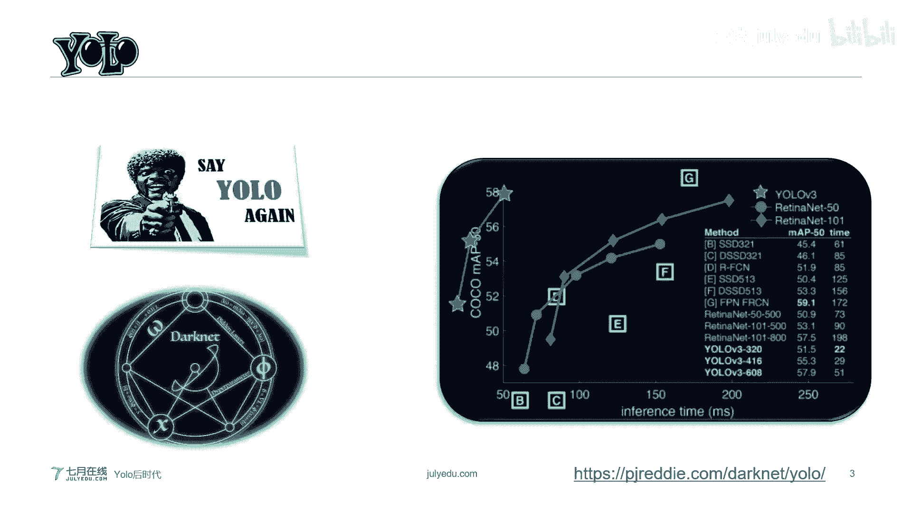
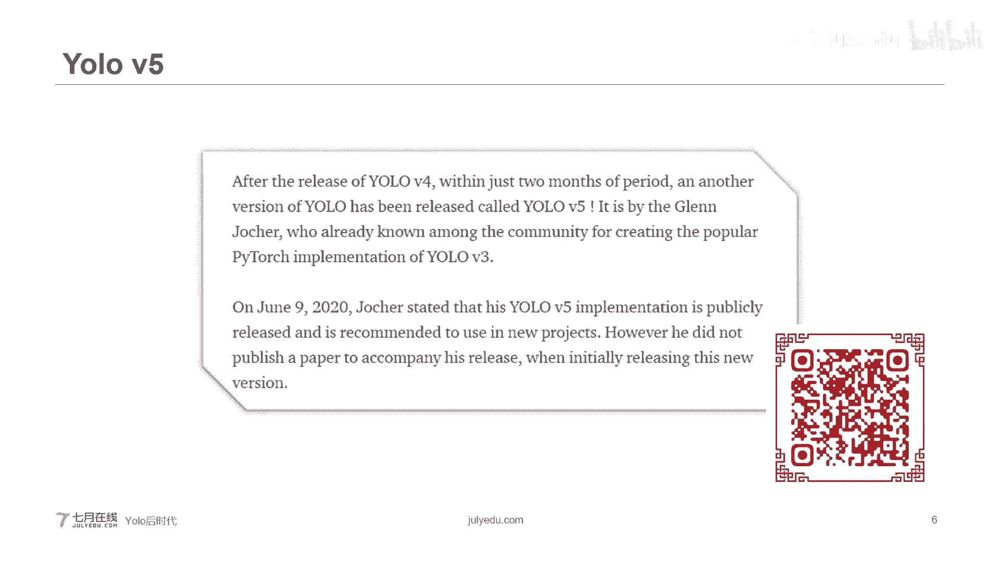
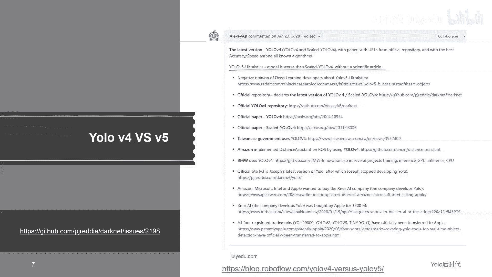
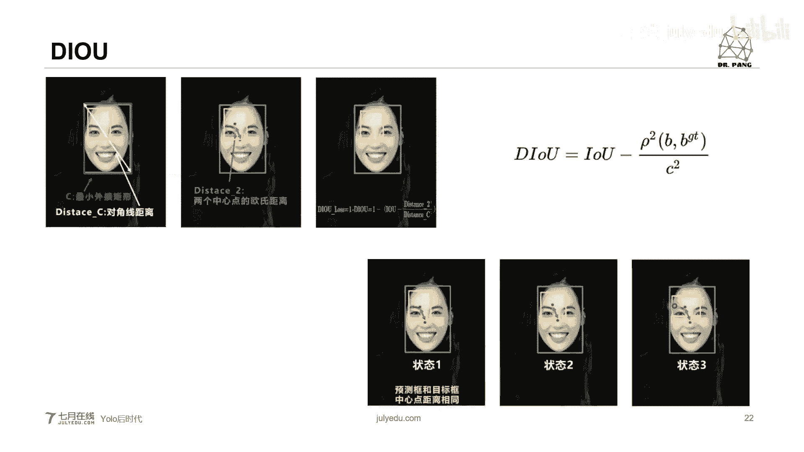
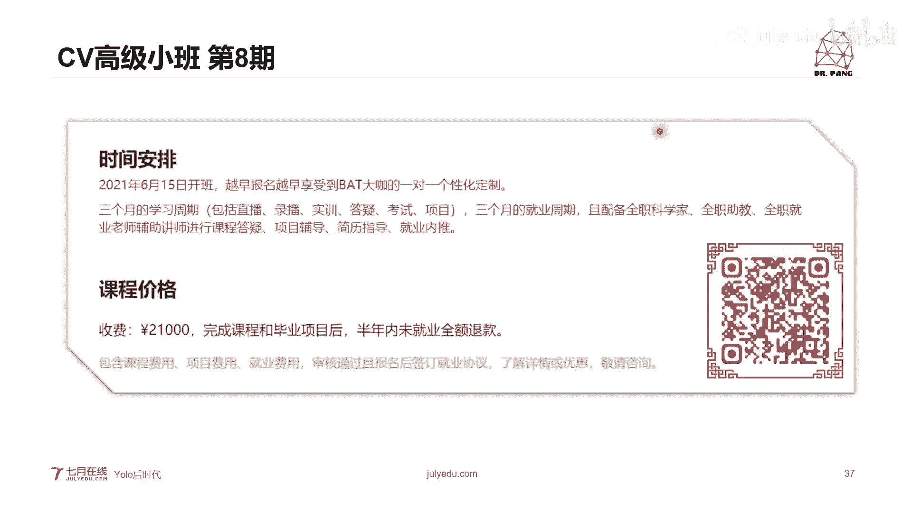

# 人工智能—计算机视觉CV公开课（七月在线出品） - P13：Yolo后时代之目标检测的发展方向2021.5.23 - 七月在线-julyedu - BV17z4y167dq

嗯，我们正式开始喽。今天主要和大家闲聊的一些是关于目标检测借优lo大神退役之后的一些事情。所以我给的这个今天的课题呢标了一个名称叫做优了后时代。

好。呃，如果说只要是接触过CV的同学，我敢说基本上每个人都或多或少听过这四个字母youoYOLOyou onlyly look once。可以说，在目标检测这个领域。

优lo是我们根本就没有办法绕过去的一座大山。而且通过呃优lo它也诞生了很多很多。呃，让人津津乐道的一些故事。在学术领域呢，我们还有darknet。从最开始的大概net1953一直到后面的各种变形。

因么大家现在看到这个页面。我们这儿注意，如果你去看右面的这张图。如果吸金同学估计呢会发现上面挂的是优loV3。现在呈现在大家面前的三个图标是老师从右下角。

这个网站上面直接扒出来的右下角这个网站呢是优lo的官方网站。okK它现在已经停止了更新。但是。

我们看看为什么。先看一下这个其貌不扬的。小个子老师ok。嗯，这位大神呢可以说是优乐之父。他一手开创了目标检测的一个崭新的阶段。我一个崭新的阶段。在优鲁出院之前，目标检测主要是以RCN家族为代表。两阶段。

但是拥了之后呢。一阶段的开始横空出世。呃，可以说从优lo出现的时呃之后，呃，目标检测在实时这一个进程当中才得到了真正的体现。但是很可惜的。大家看啊，2020年2月20号的时候。这个日子里面就两数字。

一个21个0。在这一天的上午9点。我们的大神发了一个twitter。就是说发了一个微博。永远的退出了。计算机视觉领域的研究。为什么呢？如果大家去他的推特上面看的话。

你会发现他是说呃因为我不想看到我的一些研究成果呢，被用于被应用于军事领域。大家都知道这个美国他们在军事领域，他们用了很多AI技术，他们在做什么，这些大家都知道，我们呢也不好做过多的评判。

但是我们的大神呢他备受良心谴责呀，所以说他是干脆，哎，我很有个性，毅然决然的退出了计算机视觉圈儿。O。但是呢这个事情呢，当时在整个AI界可以说是特别特别的轰动哦特别特别轰动。

如同一个驻玛扎弹一样丢了进来。大家在想，这如果说大神退出了，谁还会再继续引领计算机视觉，一往无前的往前走呢？当然了。大家更关心的是，优lo从此会不会彻底结束？嗯，会不会彻底的结束？哎，过了不多久。

突然出现了一个优oV4。当时我们第一眼看到UoV4的时候，很多新人都在想，哎，难道我们大神又回归了吗？这么有关性的大神说走就走。浪子回头金不换。结果是没想到是由一个俄罗斯学者。和我们中国台湾的两位学者。

他们联合出来了一个优乐V4。又过了不多久，我印象是大概就两个月之后吧。又出现了一个优肉威武。哦，既有V4，又有V5。所以说当时大家想。到底CV姐发生了什么事儿了？发生了些什么事情？这么说。

我们先回对回来，大家看到了这个页面啊，这个页面呢是论文的官方标题，用V的官方标题。这个俄罗斯学者呢。当时他抛出了他的代码，同时也公开了他的论文。他的这个也得到了嗯优lo大神的点赞。可以说。

这一部分得到了右罗大家的收肯。而至于优乐V5。这么说，优乐V5是另外一个大神，okK另外一个大神，他搞的优乐V5仅仅在优乐V斯两会之后，这个大神呢也非常传奇。

这位大神呢是常年就是在呃get up上面就是维护这个优乐呃这个这个整个优乐社区的。他写的那个优lo的那个版本，可以说是在get help上面得到了最多的点赞，或者是最多收藏。

优乐V5呢它在优乐V4出现两个月之后。他重新开发立版拍touch。ok拍拍到去的它也增加了一些比较呃一些比较新呃新的一些。可以说我们叫小tck。比方说它可以自动的识别我们这个毛框的大小okK等等。

很可惜，优乐V5并没有出论文。但是毋庸置疑啊，用乐V5的性能是非常非常的棒的。

只不过是两位大神互相各有不服。大家看啊这个页面特别有意思。😊，呃，如果在最下面的时候，你看最下面有个链接，我把这个链接放在这这个地方。那么这个链接呢上面显示了V4的大神和V5的大神，他们互相打嘴炮。

他是一个博客，他们互相拿嘴泡。你看。😊，嗯，俄罗斯学者呢他说UV5呢不严谨。因为你根本就没有一个非常科学的论文抛出来。他很不服气。因为仅仅在两个月之后嘛，第五个版本出现了。啊，当然了，微博的学大神就说。

哎，我这个性能又比你好怎么怎么样，他们就开始互相的打着嘴炮。当然了，作为我们这种吃瓜群众来说呢，二位都是大神都是非常非常厉害的学者。O他们的这个成就呢可以说是呃对我们来说有很多很多的福利。

至少我们可以用他们的这这个程序。他们的程序说句实话，如果你去仔细看的话，写的非常非常的赞。当然了，今天呢我想跟大家闲聊的不是V4，到底是V4好呢，还是到底是V5好呢？

或者是到底是V4才是真正的优o还是V5才是真正的优lo。今天我们呃的注意力并不放在此啊。因为我们都知道，不管是V4还是V5啊，都不是最开始的优乐支付。哎，他做的成绩了。但是呢这两个版本都非常棒。

可以说在工业界。V4V5都很香OK都很香。但是今天呢我们更多的会把目光放在这个呃学就是这个算法上面。我们从算法的层面来看一看。我们能从中学到什么？可以这么说。V5它的程序在工业界非常非常的像。

它的性能非常非常的棒。但很可惜他没有论文面试。所以说我们今天会以优loV4的论文来给大家聊一聊，为什么这么做呢？因为优oV4的论文，它有另外一个名字叫做。目标检测调参手册。通过这个调三手册。

我们就可以知道很多很多关于目标检测上面的一些很多的一些新的方法。

非常非常的香。OK闲话少说，我们来看一下。这儿呢有一副总结。因为不管是。呃，任何一个目标检测器。哦，呃这句话不能不不是很严谨，我们只能说只要是跟毛框 anchorker相关的目标检测器。

可以说我们都绕不过这幅图。所以我的话啊，凡是跟毛框相关的目标检测器，我们都绕不过这幅图。我们来看一下，在这个图上面的。嗯，我们有两个大框吧，一个是紫色的框，一个是。

绿色的框紫色的框呢通常人们会叫做双阶段检测器，绿色的框叫做单阶段检测器。OK但是不管是多少个阶段的检测器，它无非就是我们会有一些相同的部分。比如说我们都有输入，当然，这句也是句废话，你没有输入。

你不给网络喂一些东西，你要最后最后它生成什么东西的，对吧？我们的输入，就是我们的呃一些图片或者是视频都可以。那么除此之外呢，我们还有back boom股价网络，所谓的股价网络，其实就是你喜欢的CNN。

从最早的，比如说alexnet。VGG一直到现在的呃各种desnet系列等等。那么这个back boom，它的目的就是说我去研究研究唉这个图像上的一些特征，就是我们英文说的features。O。

除此之外，下一步都有nck。OK当然了这个nck有时候我们会把n back boom合在一起。再往下再往下，你看啊有一个叫dance prediction和ss prediction。哎。

这就就显现出来了双阶段检测器和单阶段检测器的不同。其实啊他们的不同就一句话来可以概括，你是否需要候选区域先粗略的塞一遍，然后再细细的看一遍。如果是需要的话，你就是双阶道检测器。如果你不需要的话。

那么我们就说我只看一遍即可。这叫单阶段检测器。O。😊，好。嗯。这个呢也给大家呃显列出来了很多很多的各种各样的不同的。比如说呃输入的方法，还有股价网络的一些呃就是比较经典的一些模型。

还有neck部分、head部分等等等等。我们今天聊的是优lo后时代，所以说我们从优o V3来开始入手。毕竟这个U了V3。是优lo支父的最后的绝唱。当然我也特别希望月乐呃月乐之父有一天他重回CVG啊。

当然这个我说了不算，这个必须是人家大神说了算。好。咱来看一下。优了V3的一个大概的模型。好。呃，从左上。从左上一直到。右侧这是它的整个的一个框架。那我们可以看到。最左面。三通道。红绿蓝三通道。

这是我们的图像一直到最右面，最右边的输出呢，哎小物体、中物体、大物体。等等。然后中间这是它的红色的光，是它的基本的backackbone骨架网络。然后从这儿分开。如果说小物体呢就在小物体的上面，哎。

我做预测，如果是中等物体，我就在中等物体上面做预测，否则我就在大物体上面做预测。但是话说回来了，我们如何去定义小物体、中等物体和大物体？毕竟这个大中与小呢，它是相对而言，对吧？比方说。

我认为我自己身高很高，但是我要是放姚明面前，那我就是个小矬子，对不对？所以说这个小中大它是个相对而言的事情。如何定义呢？我们稍后会在我们的欢灯片当中跟大家聊一聊。好，我们继续看。这个图像呢是悠6V4。

它官方论文上面的一个性能图。我们可以看到绿色这条线。绿色的条线就是用了V4。而蓝色的这条线呢就是U了V3，哎，优乐V4会比优乐V3提升了非常非常的高OK提升了非常非常高。

如果说它跟efficion net相比。OK如果跟一非现代相比。他的性能也非常非常的棒。如果是这么说的话，我们来看一看他是怎么做的。哎。😊，优6V4呢它的总结一下。

它的股价网络是用的CSP当时net53。注意啊，CSP。和drknet53CSP是它的前缀。大配量的53呢是优乐V3的5价网络。它本身是一个非常成熟的网络，而CSP呢它是一个处理方法。

可以说是它是一个单时量的无相的一变形。好。然后nac的股呃nac股价呃应该叫。脖子。O。😊，用的是SPP和PAN。呃，比如唉有个同学问为什么同一个算法，比方说优乐V4上面有4个点，这个表示什么呢？啊？

这个没有表示表示什么？它只是就是说哎我取4个点还帮你好看。比如有有也可以取三个点，像优乐V3，只是帮你看一下，仅此而已，没有什么特殊含义。好，哎，忘了提一点，它优oV4的hat部分，它还是基于UoV3。

那么我们就来看一下优oV4的整体框架图。6了V4，它遵循我们最开始聊的目标检测器的框架，那么它有4个部分，我们这里分别用红框1234给大家标识出来。首先是最左侧的红字，用输入端。okK这个输入端呢。

它这个地方的创新主要是训练时对输入端的一个改进。比如说包括呃数据增强的方式，SAT及对抗训练等等。我们稍后给大家聊，紧接下来backbone。ok大家共通不加网络，那么这就是CSP的大时现的53。呃。

如果大家对这个CSP系列不是特别了解的话，呃，我建议大家去7月在线的官网有一个叫呃。目标检测那些事儿，从马斯拉CN到UV4。在那个课程里面，我们详细的给大家介绍CSP呃，CSPnO好，我们继续。呃。

第三部分nck。目标检测网络会在backbone和最后的输入输出层predction之间插入一些层。啊，这个地方呢我们可以看到，比方说你看这个地方SPP。SPV模块还有PAN加FPN的一些结构等等。

我们一会儿会跟大家仔细的聊一下里面的细节。那么最后一部分就是预测了。如果你这么看的话，你会发现U乐V4的这个预测的这个方式，它和优乐V3的预测方式基本上相同。当然了。

它会改进一些训练时的损失函数损失函数。那么今天这个呢也是我们今天会跟大家想要的一些重点。好。那咱们就从最开始第一部分来聊输入端。输入端呢我们都知道所谓输入就是各种各样的原始图片。可以是彩色，也可以黑白。

只不过我们多数用彩色图片来代替。那么我们可以说呃最开始呢如果说你不做任何的处理，把V图片直接丢进去。你会你一点问题都没有，注意啊，一点问题都没有。但是我们会做一些数据增广。为什么这么说呢？

比方说你的图片OK你的图片它的内部分布不均匀，什么意思呢？举个例子啊。可能我们今天出去旅游，哎，我们拍了一堆很多很多的美照，结果会发现。有的同学，比如说女女孩子，他们喜欢拍自拍，那么在她的手机照相里面。

你会发现人物的就是比较大的人物，他的显示的会非常的多。那么另外一个朋友她照了一些照片，比如说他照了很多是风景照，那你会发现在他的照片当中，绝大部分头像呢都是比较呃看着比较小的人物。那么这个大大头像。

小头像。它的分布就很不均匀。那么这是一种，又或者是说我们做多类预测OK多类预测很可能。比如说我们呃预测牛马羊，你会发现牛群、马群、羊群非常非常的多。但是你又同时想预测牧羊犬。

你会发现牧羊犬的照片又非常非常少，就等等等等。呃，诸如此类吧。那么优乐V4它使用的方法。叫马赛克mo赛。注意啊，这个不是咱们想的那个马赛克啊，虽然写法是一样的啊。他采取了马赛特的方式。

他是参考了2019年底提出的cardt mixed数据增强的方式。你看这个就是car mix。2019年car mix它是怎么做呢？它是哎我把一些图像我直接叠在一起。

那么这样的话就会发现在我的一个大图像当中会出现一个小的图像。这样我们就哎同时获得了呃一首先是获得了一个新的照片。第同时我们还获得了一个。小的图像。但是cardt mix呢它只使用了两张图片进行拼接。

2020年出现的马赛克的方式，这种数据增强的方式呢，它采用了4张图片。他是这么做的，他可以随机缩访，随机裁剪，随机排布。就是说一切都是随机的一切随缘。okK一切随缘。为什么我们要进行马赛克数据增强呢？

比如说我们在平时训练项目中呢，就是就是刚才老师给大家举个例子，小目标的这个AP值，它一般会比中等的目标。大体的目标低很多OK低很多。你比方说我们常用的QQ数据集验。

它的里面也会包含很多很多大量的小的目标。但是呢如果你去看它小的目标分布非常不均匀，okK非常不均匀。那么这就是我们为什么要采取数据增广的方式？好，说到这儿啊，我们也一直跟大家聊这个小图像。

中等图像大图像。所以我们呃不能这么说，我们应该说小目标、中等目标和大目标。那么问题来了，如何定义大中小目标？这是我们比较感兴趣的问题。对吧。好。😊，我们来看一个。呃，标准的定义吧。那么在这个图像上面呢。

是给出了大中小目标的一个非常明确的定义。嗯，首先来说这个。大中小的目标呢，它的分布不均匀。呃，我记得在coco数据集上，小目标的比重好像达到了是大概是C1。4%。41。4%。

它的数量比中等目标和大的目标都要多得多。OK都要多的多。但是有个问题啊，如果你去发现一般的你的手机，比如说我们发一下手机相册，你会发现。你的小目标的图像和大目标中等目标的图像来说，它的比例又会稍微下降。

所以说一般我们互相平衡。下面这个表上面呢给大家明确列出来了什么是小目标？如果说你的这个矩型就是它的这个矩型框，哎，我们label的矩型框，它的范围是在32乘以32这个范围之内。

这32个像素乘以32个像素这个像素这个范围之内，我们统一认为是小目标。那换而言之，如果是32乘以32的平方像素到96乘以96的平方像素之间呢，我们把它认为是中等目标O中等目标。

如果说是96乘以96比这个平方像素还大。那么我们就认为是大目标。那么这个就是如何区分大中小目标。注意啊，我这道说的是目标，而不是图像。因为在图像当中，它会有很多很多的不各种各样的不同的目标。O。😊。

那么说到这儿呢，替大家总结一下。这个优乐V4的这这三位大神呢，他们采用了这个马赛克的数据自强方式，他们呢主要有几个优点。第一个优点啊。丰富数据集，这也是为什么我们把它叫做数据增强，又人把它叫做数据增广。

你想咱们这个地方，我随机使用4张照片就这么拼接。那么随机拼接随机缩放，同时随机丰咐。那么这样的话，你4张照片你会生成很多很多不一样的照片。可以说我大大丰富了检测数据集。更重要的是呢。

由于我们出现了随机缩放，可以说我们增加了很多小的目标。这样的话让网络的乳巴性更好。嗯，有过工程经验的同学，大家肯定有就是时常遇到这个问题，一般那么标检测器。我识别大目标。

中等目标非常容易识别小目标比较难。如果你小目标哎我数量更多的话，那么这样的话是非常有利的这是第一。第二个优点啊。哎，我看唉。第二个优点是关于这个GPU。它可以减少GPU的使用。

当然有的朋友朋友可能说这个随机缩放。随机缩放的普通的数据增强也可以做到。只不过一般我们呃就是这样的话是原则也是这么说的。他说哎我一般的呢很多人只有1个GPU。OK那么我们如果使用马赛克增强训练的时候。

就可以直接计算4张图片的数据。那么这样的话，如果你用mini batch的时候，你这个 batchch大小不需要很大。我1个GPU就可以达到比较好的效果。

ok那么这个是马赛克的一个为什么使用和它使用哪些优点？O那么到目前为止呢，就跟大家聊完这个呃第一部分输入端用了V4，哎，它采取的一些新的方式。O。😊，呃，给大家插句话。大家看到这个表。

这个table one并不存在优乐维斯的这个呃论文当中。这个表呢它是存在于另外一篇论文。这个论文我给大家打在这个地方，你看augmentation for small object detection。

为给大家打在这个地方。如果感兴趣的同学，你可以去搜一下这篇论文。然后它那个里面会有更加详细的这个关于大通小红标的解释。当然了，如果大家不愿意搜论文或者是比较难以找到的话，你也可以到我们7月在线的官网。

嗯，在我们的第八期就业班里面，我们也给大家提到了为什么如何定义大中小目标。好，我们继续。那么呢下一步的话题呢就是到了我们的股价网络。OK我们就到了我们的无价网络。

首先说我们的股价网络是CSP系列下的到数net53。那么从这个名字上面，我们可以我们就可以知道。从名字上来说呢，dark deck53它本身就是用了V3的国价网络。

只不过是它又是用了呃2019年CSPnet经验，它所产生的新的backbone。如果我们来看呢。这个backbone这个股价网络结构，它大概包含了5个CSP模块。大家可以说啊。一。😊，2。🤢，呃。

345。注意啊，这个12345，这个是我们帮大家数的，后面这个CSP1代表是重复一次CSP2重复两次，是他大概大概是这个意思啊。它不是说CSP8就是用了第8个CSP不是它总共用了5个CSP模块。呃。

每个CSP唉，有个同学问CSP的全称是啥？CSP的全称嗯，我给大家搜一下啊。我印象是层级金字塔网络。大概讲我给大家看下全称CIPnet。哦，他应该这么叫。

cros stage partial network跨阶段呃。不放了，我给大家打在我们的这个聊天页面，它叫crod stage partial network。好。呃，我们继续聊。

股价网络当中呢包含了5个CSP模块，而每个CSP模块，它的前面的卷积和的大小都是3乘以3。O那么这么做是为了可以起到起到下采样的作用。O。cross是跨阶段的意思啊，跨就是cross跨的意思。

stage阶段。其实这个如果大家的这个英文就是某一个单词英文，如果不呃忘了什么含义的话，你可以呃有道或者是百度搜一下它的意思啊。O我们继续续聊。那么CSPnet呢。嗯。它的输入图像。

你看我们默认是608乘以608乘以3OK然后我每1个CSP。我们都会有一个卷积核3乘以3。那么通过5个输入的变化，它们就可以变成。从608开始变，608到这儿304152。76。38一直到最后的19。

经过54CSP模块得到的大小是19乘以19的特征图。呃，注意啊，我看有个同学他一直在问老师，A老师cross是什么意思呢？parts是网络的是部分不关全的吗？是是这样的啊，呃。

CSPnet呢是2021年呃2不对，2020年横空出世的一个新的系呃CPCENN系列。这个呢说来话长，它已是一个非常大的话题。呃，我个人建议就是如果不大理解的同学呢。

你可以去看一下那个呃7月在线的有一门课叫做目标检测那些年呃目标检测那些事儿，从muscarCN到UV4。在里面我们专门有一节课的时间，会专门讲股价网络。专门讲股价网络。

那么那个课程里面会很详细的讲一下什么是CSPnet。那么在呃就我们在那个CV小班第八期的里面，那个里面会更详细的讲解，同时还会带着大家手动录代码。O。呃，由于今天我们这个时间有限。

所以我只能给大家大概的过一下CSPnet。呃，因V4采用的是CSCSP的一个想法，只不过是它把它作用在了do时net53上面。OK我们可以跟大家简单聊一下CSPnet。😊。

CSPnet它主要是从网络结构设计的角度来解决推理中计算量很大的问题。我记得当年2020年我读到那篇文章的时候，他的作者他好像是这么说的。嗯，他说我认为推理计算过高的问题呢。

是由于呃这个网络优化中梯度信息的重复所导致。所以说哎当时那个作者他就这么说，我用CSP的模块，我把基础层的特征映射。哎，我分成两部分。换句话说，就是说我把我最开始的输入的特征图feature max。

哎，我直接人为分成两部分，然后通过跨阶段的层次结构将它们合并一部分我往下应用到那个。各种的转接层里面，另外一部分我先保持住，我不做任何工作。我等到前面那部分工作完之后，然后我再把保留的那部分，哎。

我跟他进行合并。他大概意思就就是呃大概意思就是这样子了。它主要有三个方面的优点，优点，一它增强了CN的学习能力。同时。在轻量化的时候保持准确性，注意啊，轻量化是我们现在一个非常火的话题。

这个最后我们在呃今天的最后的一个时光，我们会也会跟大家聊一聊如何轻量化网络。第二个优点，它可以降低计算瓶颈。第三个优点，它可以降低内存内存成本。Okay。那么。除此之外呢。优乐V斯的股价网络。

它还采取了很多很多的一些小的方法。大家看啊这个地方啊我们给大家打出的是drop block。okd block。呃，直接翻译过来呢，就是说我大块大块的丢。drop block它的前身是drop out。

而drop out唉它这个很简单，我们用一句话就可以帮大家解释清楚drop out的方法是我去随机删除减小神经元的数量，使网络变得更加简单。为什么这么做呢？因为。

学者发现在我的学习模型的就是模型学习的时候，它会发生过拟和现象。什么叫做固拟和现象呢？就是说。我的网络在学习这些训练数据的时候。学习的非常非常的好。为什么学习非常的好呢？

因为他把我训练数据当中所有的特征全部印记了下来。但是大家千万注意。这个地方的特征有好有坏，对意啊？有好有坏。好的特征你记住了，没问题。你比方说大熊猫的特征是什么？黑白对不对？熊猫眼儿等等。

但是他如果把一些不好的特征也记住了，比如说他把大熊猫背后的那些呃背景的一些特征也记住了。那么。当他去预测到测试数据仪像的时候，我们会发现这个时候在测试数据仪像的性能就很烂了。因为不好的数据机。

我也不好的系统我也记住了，这叫做固体和现象。为了缓解这种现象，最开始哎我们就招泡的方法，随机删除减小时金元数量。哎，这样的话我们随随机的丢弃一些信息。但是呢。呃，lucky说呢。

所以就采取随机的方式使部分适合吗？对，就是说我随机丢。哎，是这样的话呃就会不要让我们的网络那么敏感，别全部记住了。但是注意啊。招报呃招报了出来以后会适当的减轻过敏和现象。但是呢我们也会发现。

比如说jo block，他就说呃其实很多卷积层对这种随机丢弃并不十分敏感。为什么这么说呢？大家想卷积层通常是三层联用哪三层？第一，卷积层？第二。呃，激活。第三，石化前面两个卷基激活都好办。

但问题出现在石化层上面，因为石化层本身就是对相邻氮源起作用。你比方说你哪怕你随便丢弃。但是我卷积层仍然也可以从相应的机构单元当中学习到相同的信息。我给大家说的再明确一点，比如说你随机丢弃。

很可能你丢弃的就是你本来人家石化层就要丢弃的那部分。那么这样的话，可以说呃你随机丢弃效果并没有达到你真正想要的效果。那除此之外呢。呃，那我们会发现啊，drop out呢在全连接层上的效果非常好。

但是在卷积层上的效果并不好。那怎么解决这个办法呢？你看石化层当面呃石化层上面说，你既然你随机丢弃一些点和我石化层丢弃的点有可能重合。那这样吧，我不给你随机危险了。我全都不要了。我把整段整段全部丢弃。

这种的感觉呢就特别像是呃。我给孩子洗完澡。我倒洗呃洗澡水的时候，我把孩子也倒了，他有时候这种感觉。okK那么这个就是joaw block。呃，当然了。

招 blocklock呢它把整个局部区域直接删减丢气，它这个效果确实会比招泡的效果更好。O。呃，好。那么到目前为止。我们就跟大家聊了一下第二阶段的话题。okK第一阶段数端，我们是说优6V4呢。

它采取了一些。方式，比如说我们刚才聊的马赛克数据增网方式。在这块呢，股价网络上面呢，我们跟大家聊了，哎，因瑞维斯他采取了CSP系的大数价的53，可以说是对大数量的53的一个增强。那么除此之外。

drop block就比drop out哎也进行了增强。那么在下面个阶段当中呢，它会不会有更加新的东西？好，我们来看一下。呃，首先那有个同学问CSP和rackVGG是不是一样的东西不不一样。

这两个东西不一样。呃。我们聊到这儿呢，我们再再往下一阶段聊。第三个阶段就是nap阶段。OK那个阶段。我们来看一下啊，nck阶段。优6V4它采取了一个叫做SPP的结构。STP的全称叫做。呃。

空间金字塔石化OK空间金字塔石化。哎，就是这个地方你看。空间、金字塔石化网络结构。哎，这个是在做什么呢？我们来看一下。呃，我不知道大家有没有这种印象，就是在最开始接触CN的时候。

一般我们会对输入图像进行一个标准化的配置。比方说我们会说哎请把输入图像全部resite成224乘以24。因当然你也可以说是其他的一个呃其他的一个大小啊，比如说是128乘以96都可以。为什么这么做呢？😡。

大家知道啊我们现在其实很多的这个呃这个设备，比如说呃佳能R6。还有比如说呃索尼的A73呃。是要1730，还是174就等等，他们都可以进行4K5K甚至。更好的设备啊，8K的设计。

但是我们的图像呢就是如果就用在CN上是24乘以24这么小的像素，那为什么这么做呢？首先有两点原因啊，第一点原因。如果你的图像尺寸过大，你记录了更加丰富的信息，但是同时也造就了。哎。

同时也造就了计算机内存的极大消耗。因为计算量非常非常的大。啊，当然了。对于我们来说，很多细节不需要，因为目标检测我们只需要找到目标。在哪就写，又或者是说我们对目标做了一个定位，对吧？至于目标里面的细节。

你看这个比如说女生的这个头发丝儿有多么多么清晰。在脸的这个地方呢不care，但是注意啊，我这还有个但是。对于不同的图像。如果你说这一批测试图像大小不一样。你必须把它resize成一个大小一样的。

这样才可以。OK为什么要resize呢？我们刚才说了是为了降计算量，但是为什么必须resize成大小一样的？我们来看。呃。我们先这么说吧。😡，为什么要把它变成。大小一样的呢，是因为。呃，O。稍等一下啊。

好，为什么要把它3成大小降呢？是因为我们在最后一层。通过卷积。一直石化，一直到最后的时候，我们的图像需要尺寸一样，因为fish map需要固定。如果你最开始现现的图像大小都不一样。

那么再往下一步一步一步，你会发现你的fisher map是大小不一样的。为了统一最后的fisher map。的，这个尺寸，所以我们要求大小一样。ok但是如果说res大小不一样怎么办？我们有方法。

比如说我们可以对大小图像进行裁剪，或者是缩放等等一系列操作，把它变成统一的尺寸。但是这样的会降低检测的精度，ok降低检测精度。所以说我们这个地方有一个空间精字大尺量的方法。

这个算法的优势在于我们构建网络的时候，可以输入任意大小的图片，而不需要提前经过什么裁剪缩放呀等预处理操作。O我们不需要这么做了。呃，怎么做呢？我们来往下看。好，我们再往下看如何操作。

我们来看当我们输入一张图片的时候，我们可以利用不同大小的刻度。你比方说这些图片，我们在上面对图片进行划分，我们可以对图像进行。唉，你看我先进行这个呃石6等份。宽和高各成4份，我也可以进行二等份。

当然我最后我不进行划分，我把它尺寸完全保留下来。那么这样经过各种各样不同的划分呢，比如说最开始四等分划分，我们会把图像分成16块，注意这个数字16块。第二次划分，我们把它划分成4块，16加4等于20。

最后整个图像，我们当做一块，我们就可以得到了21块图像。然后呢，我们可以在这21块区域当中，哎，我们对每一个块都提取一个特征。也就是说最后我们就会出现1个21位的特征，它是向量O21位的特试向量。

当然你也可以采取就是其他这个尺寸啊，都可以。呃，这样的话呢呃如果我们是假设它的都是16乘以16，那么最后我们所得到特征图就是16乘以16。OK那么这个就是空间金字塔，它的一个方法。

它可以使得任意大小特征图，都能够转化成固定大小的特征向量。那么除此之外呢，下一个是PAN。OKPN但这PAN呢都是一个呃很老的一个话题了啊。嗯，这个PN我们它是怎么作用呢？它也是一个金字塔的一个构造。

我们先看。这是一张图像。okK我们的输入图像输入图像当中，我们一次一次的定义它的卷积。OK一次一次的定义卷积。这是我们做了一个下采样的过程。当然了，我们知道为什么这么做呢？因为在下采样的过程当中。

所谓的下采样，注意啊，我们可以用尺袜层进行唉设计。我们会发现在不同的这个层上面，比如说。在这一层和最后面这一层上面，它所含的语义信息是不一样的。如果你把CN它中间每一层全部可视化。

你会发现在比较浅的层上面，唉，我上面会有有很多很多的这个比较低级的语液。比如说形状黑白颜色等等。但是如果在比较深的层上面，我们就会发现很多高级的语义，对吧？换而言之，如果你对目标进行训练的时候。

你最好在各每理论上来讲，你最好在每一层上面都进行预测。O每一层上面都进行做注意啊，这只是说从理论上面，当然我们实际上没有没有这个必要，只需要在中间的某些层上面进行预测就可。那么我们先通过下采样。

然后上采样恢复。同时千万注意上采样恢复的时候，我们是把上采样所恢复的和之前下采样同一。级别的我们进行相融合。这样做的目的呢是我们不希望有过多的信息损失。okK当然了，乐V4呢它会增加一些。呃。

这个娱乐V4呢它会增加一些稍微的变化啊，它会把中间融合部分从直接相加，变成了这个conagation。conation的意思就是说我把这个信息进行。你看本来是相加是一层，但是我把两个信息我不相加。

我完整的保留在这个地方。这样的话我的信息就会有更多的保存。O这就是呃PN它的这个一个改进的PN。呃，有一个同学问这个PN是最早时n戴尔提出的吗？呃，这个我有点遗忘，这个我们可以往回去搜一下，好吧。好。

我们继续看。那么聊完这儿呢，就跟大家聊完了优乐贝斯在n部分，它所做的一些呃改进。这个之后我们还有一些方案，比如说。这个时候呢就要跟大家聊一下各种模改IOU。

ok这一块呢是作用在preddiction最后的预测上面的。那么在p定ction上面呢。我们是这么说的？首先如果你要做目标检测的话，那么对于目标检测来说。

大家都知道目标检测的核心就是它的损失函数los function而损失函数的定义就是定EIOU那IOU呢非常简单，对吧？IV的全称呢是叫做呃。交集和并结O交集和并结I intersection。

Iin就是说你看啊我们首先这张图像上面蓝色的框是我们的gr truth关 truth的意思就是说我们人工标记的。然后黄色的框，黄色的框代表这个是我们预测出来的一个框。那么如何去评价预测框好坏。

我们用LOU来标示哎lucky和呃这个roy说叫做胶并笔。哎，这个发译很好，胶并笔。对，我们通过IOU来得到最优的框。我们来看交集。蓝色的人工标注的框和黄色的交集。

那么这个重合的部分就代表说哎目前你这个框有多少的是检测出来是对的对吧？那么同时还有一个并结，并级就是说两个矩星框，整个的这个面积。最大面积。我们把交集除以并结，那么这个就叫做IOUOK这个叫做IU。

那么通过我最大化IOU你看啊，如何最大化IOU呢？从分子上面，我们可以把分子变大，分子变大，意思就是说让这两个框重合的越多越好。那么这样的话，你这个约会越来越大。重温越用越好。同时。

如果你的病节就是分母越来越小。哎，如果说他们两两个的这个呃共同部分越来越小。那么也就是说我们的IOU越来越高，对吧？那么这个也是我们的这个呃IOU的lot这个是如何控制。但是大家想过一个问题没？

大家想过一个问题没IOU真的很靠谱吗？哎真的很靠谱吗？当然，这个问题可能提出的有点突兀。如果IOU不靠谱，那么我们为什么还用这个IU来表示呢？当然我们也会发现啊，IOU这个东西呢是一个非常非常。呃。

可以说是一个非常非常经典的一个问题。但是我们为什么说IOU它有时候减会不靠谱呢？我们给大家看第一个状态。比如说我们现在呢我们的黄色的预测框。它的位置。会出现在我蓝色框之外。哎。

我我可以说我在最开始我网络学习的时候，我训练的并不是很准。没没问题吧，在最开始确实有可能不准，只不过是之后呢，我是希望让黄色的框和蓝色的框越来越接近越好。那么这是我的一个希望，如何达到这个希望呢？

就是我们刚才说的用IOU来控制。但是你看现在。在这个时候，我们的黄色框和蓝色框，他们俩压根就没有相交。可以说分子为0，那么这个时候你IO基段下面就是0。对吧IU等于零的话。

你根本就没有办法反映两个框的远近。你比方说我的IOU现在在这个地方和我的黄色的框呃。好，我用。黄色的框，比如说我的黄色的框在这个地方。哎，请问这两个黄色光，哪就是绿绿色光，哪个更好，无从判断都很烂。

怎么好呢？我不知道，因为房产证它都是0，那么这是第一个问题。好，我们再看第二个问题。再来看这两个情况。呃，如果你在最开始说我这个呃黄色的框可能跑到外面了。那是最早的时候。

但由一也有一种可能在某一个状态下面，你看黄色的预测框和蓝色的这个人工标注的框，它们都是有一定重叠的。状态二的重叠是这个样子，状态三的重叠是大概是这个样子。那么在此时非常非常有意思的是，哎。

你的IOU计算都一样。分子除以分母都一样。也就是说状态2的IOU和状态三的IOU为一个值。那么这个时候请问哪个状态更好？哎，我的状态二应该是像状态三努力呢，还是说状态三状态二努力呢？注意啊。

在此我们根本没有办法来对此进行区分，无法判断，对吧？我没有办法判断，所以说在这种情况下面，IOU它就会出现一些问题。如何进行改进的？2019年的时候出现了一个叫做GIOU我跟大家聊一下GIOU。

你看啊什么叫做GLU呢？他的意思是说，哎，我现你现在不是说你有两个框吗？蓝色的人工高筑框和黄色的预测框，我们不用简单LOU了。我在你IOU的基础上面，我减去另外一个东西，我们来看。

这个地方呢涉及到第三个概念叫做最小外接矩型。就是我们这个地方看到的C最小外接矩型就是说哎你这个。最小的外接矩形红色的框。那么这最小的一个封闭形状或者是外接矩形C我们可以用C把这两个框哎都包含在内，对吧？

都包含在内。然后我们就可以去计算C中没有覆盖蓝色框和黄色框的面积。换句话说，就是这个蓝色区域，就是蓝色区域。O蓝色区域。我们可以用LU减去这个蓝色区域，那么这个就是GLUOKGLOU那么GLU的方式呢。

它其实会。呃，单纯的缓解IU的这个不靠谱。注意啊，我并没有说他把之前的问题完全解决，它只是缓解。为什么这么说呢？我给大家再看一个样子，大家来看啊。我们目前呢还是有三个状态，注意状态一、状态二和状态3。

在这三个状态当中，蓝色框还是我们的人工标注框。但是恰恰在此时，你去看黄色框，黄色框它装到了蓝色框的肚子内，对吧？三个状态，请问这三个状态哪个状态是最好的？O哪个状态是最好的？

状态123都是预测框在目标框内部，同时预测框大小还一致。那么这个时候你算出来的GIUU的值是完全相同，OK完全相同。那么这个时候你的GLU。就相当于变成了你的哎呦呦，对不对？

我根本没有办法区分这个相对的问题。所以说GRU只单纯的缓解，它并没有完全解决。OK2020年的时候呢呃在。计算机视觉三大体会之一。

ch保AI有一位大神提出了DLU lostOKDLU我们来看DLU lost。DLU呢它是这么说的。我们先放下IU，我们不要想那么多，我们想一想。

如何在现实生活当中你确第一页这个回归就是lot function的好坏。OK我们去定义一下。我们看怎么定义的啊。其实两个不就两个框吗，这两个框，一个是预测框，一个是人工标注的框。

我们最终的想法就是说你的预测框越接近人工标注框越好。如果你完全重叠一模一样，那最这是最完美的，对不对？所以说注意我们的词儿。第一个重叠，第二个完美重叠。什么叫做完美的？重叠比较好理解。

第一个要做重叠的面积，如果重叠面积一模一样，唉，这样是最好的。什么叫做完美重叠呢？完美的定义是第一。如果说你这两个中心点的距离越好，比如说你蓝色的框的中心点在这儿。黄色的框的中心点在眉间这儿。

如果说你这两个中心点的距离越接近越好，所谓的越接近，最接近的情况下就是同心框，对吧？两个点同心框，那么这样是最好的。这叫中心点距列。除此之外，我希望你的这个长宽比也越越来越好。

所以说给大家总结一下一个好的目标宽的回归函数。呃，一般来说希望考虑三个比较重要的几个因素。第一，重建面积。重一般就越大越好。第二，两个框的中心点距离，这两个框的中心点距离越接近越好。那么如果变成同星光。

那是最好的。第三，它们的长宽比越接近越好。对吧那么这个就是一个好的目标矿同学来说。所以说这个时候呢DIV的作者呢就会想。呃，我们是如何去把这两个就是把这两个就刚才我们所说的三个东西来一起来考虑呢？哎。

这么做吧，首先第一，我们把目标这个问题简化成。第一。呃，有个有个有个同学问呃，后面这个这个是具体什么意思啊？不着急啊，要要给大家说。我们来给重新捋一下啊，刚才的三个型要素重新面积，重新点距离和长宽比。

呃，我们先说前面的吧，重新面积和中点距离，我们换句话说，或者说换一个方面进行考虑。第一，我们如何最小化预测光和目标框之间的规划距离。第二，如何在预测光和目标框重叠的时候，让它回归的更加准确。

我们看一下DIU loss，就是大家现在在看到的这个问题。那么DIOU loss呢，它考虑了重叠的面积，你看就是重叠的面积和中心点的距离。那么当目标框与预测框fo裹的时候。我们可以直接度量这个角度。

这样的话我们就可以使DIU捞出量呃更快。如果你看一下公式的话，它首先它也是个IOU它减去后面这部分OK它减去后面这部分。首先。B。😡，和BGT。B。😡，就是bing box，注意啊。

BG就是boning box就是那个矩形框。然后带GT的意思是呢，GT代表ground truth。所谓的BGT就是说。呃，我人工标注框的中心点OK这个是BGT的意思。单独这个B呢是代表我预测框。

就是我黄色这个框的中心点。也就是说这两个是两个中心点。前面这个柔注意啊，这个不是P，这个是柔。柔代表的是我计算两个中心点。的欧式距离。就是计算这个距离，这是我上面这部分的意思。OK上面这部分的意思。

而这个C的意思是什么呢？C的意思是它代表是能够同时包含预测框和。呃，人工标注的真实框的最小B8距离，就是这个你看。就是这个。首先这个大C注意啊，大写的C是这个呃红色的框，这是我的最小外接矩型。

然后这个小写的C呢是代表这个对角线，注意啊是白色的这个对角线的距离，是这个小写的C。那么这个就是这个公式的含义。但是你注意到老师给你讲公式的时候，其实我有一个地方给忽略了。我们讲了重叠面积。

可以用对角线的长度来表示。我们讲了两个点之间的距离，可以用分子肉平方来表示。但是我们并没有聊长宽比。对不对？我们并没有聊长宽比，重复一下好的目标检测光的回归函数需要考虑三个重要的几个因素。第一。

重叠面积C的平方。第二，两个框中心点的距离肉的平方。但是我们没有考虑第三个长宽比。呃，给大家再看一个例子啊。像这种情况。像种情况。那么在这种情况当中呢。嗯，在这种情况当中，我的矩形框。

蓝色的是我的人工标注，黄色的是我的预测框。大哎，你看好巧不巧，我的这个距离，这个两个中心点的距离完全一样。同时我三个黄色的预测框的面积也完全一样。那么在此我们有了CI呃。

不在此我们的DLU相当于又失效了。OK它又失效了，为什么这么说呢？它是这个情况，这三个状态，我算出来的DLU完全相同。我又没办法评价好坏了。那么我们再聊一聊第三步长宽比呃，当然了。

这个长宽比呢就已经不再是DIOU上面的了，它是另外一个话题叫做CIOU你看啊。这个好像跟大家聊了一个就是说呃如何一个做研究的一个感觉啊。从最开始的IOU我们找一下IU的一些问题。

然后一点的客服出现GLU，然后再一点的客服发现还有问题，我们在客服问题到了DLU。但是还有第三个问题，我们就到了CIU。

OK那么这个就是CLU的公式。你看前面这些就是DLU对吧？前面这就是DLU但是它又多了一个这个东西叫做FB。这个东西呢它就是。CIU新加的一个影响因子，而它的表示就是说我希望考虑预测框和目标框的长宽比。

OK长宽比。呃。阿尔法呢是一个系数。学习的系数V用来表示长方比的相似性。呃，如果你看这个的话，就是这块。派方分之4，这是一个常数。然后这个呢是长宽比W代表宽H代表呃高。

就是它的长GT代表我们的光 truths，就是我们之前看到的蓝色框，也就是说它的长宽比，你光处的长宽比，哎，你算一个角度，同时你预测光的长宽比，你也算一个角度，我希望你这两个角度越接近越好。

那么这个就是V的含义。O给V的含义。唉，有的同学问这个V的公式好复杂呀，为什么要设计这个样子呢？呃，是这个东西确实看起来越来越复杂，但没有办法，这个就是为了克服我们之前讲的IOU它所出现的一些不足。

当然了呃由于今天时间有限的，只能跟大家聊一聊它的一个大概的设计过程。如果大家想看一下，就是我们具体的这个呃它是怎么样实现的。尤其在代码中足够实现的呢。

这个只能到我们这个呃7月在线的CV小班CV8第8期CV小班第八期，我们来会有老师直接带着大家进去录代码。呃，右下角的这个二维码呢，大家可以直接扫就可以直接进入啊。好，我们继续看这个地方呢。

我们帮大家总结了一下。帮大家总结一下。从最开始的IOU的lo，它主要考虑了检测框和目标框的纯叠面积。这是最开始的IOU的 loss。在IOU的基础上面，我们设计出了GIUU的老。

它的呃它是解决了一个边界框不重合时候的问题。但是如果两个边界框，哎预测框装到了呃人工标注的框的内部的时候，GL loss失效了。所以这个时候我们出现了DL loss。我们可以考虑边界框中心点的距离信息。

但是由于我们在这个地方我们又没有学习这个呃长宽点，所以我们又设计出了CLU。呃，有个同学问老师这个IOU中心点的距离，长宽比三个损失权是就怎么定？注意啊，这个是网络自动学习的，不是我们定的。

它是自动学习出来的。呃。除此之外呢，在这个。因乐微信当中。他最后又采取了一个极大值抑制。极大值抑智呢NMS这个想必大家应该很熟了。呃，它的主它的主要解决的问题是，比如说我们在这个预测的时候。

我们对毛框预测，你会发现毛框它会有很很多很多比较不错的毛框。你比方说我们现在这个框，它。画出了一个摩托车。哎，这个时候如果我的这个摩托车的这个框，我稍微向上偏一个像素，向下向左向右各偏宜一个像素。

你能说我没标准吗？你很难说吧，对不对？所以说这个时候就即便你设了一个阈值。你说哎只要大于这个阈值，那么它的这个呃预测性能就非常好。可以这么做，但问题是。你会发现一个好的模型。

它检测出来会有很多很多的毛光都大于你这个阈值，除非你把预值设成机。那你会发现好多又找不到了。所以这个时候哎我们我们就可以做。我们找一个最大的呃分数的毛框，哎，我们把它当做最后的毛框。

这个就是非极大值抑制NMSOK呃，当然了，这个NMS呢在优乐V斯上面它还会出现了，就是说呃。呃。作者呢用了1个DIU的NMS，它并没有用CIO的NMS就是你看这个。这个。左侧看到的图像是CIU的los。

直接加上NNMS，但是右侧呢都呃做了一个是DIOU的NNMS为什么这么说呢？你看啊。呃，我们仔细的看一下这个地方，你仔细看这个地方有两辆摩托车，对不对？呃，大家看啊。这儿有一个类似于这是一个黑色的。

应该是邮箱吧，黑色的邮箱这儿一个摩托车旁边有一个橙色的摩托车。由于你只仅仅只用了飞机大值抑志的话，你会发现这两个摩托车。由于它离得特别近。

所以它会把两个合并成一个当做就两个毛框合并成一个毛框来做一个预测。但是问题是我们希望是每一个摩托车都有一个这个都有一个这个毛框来进行表示。因为你本身是两个嘛。

所以说这个地方用的DIU的NMSODIO的NMS。呃，V4的这个DIOU的NMS会比V3的牛逼，为什么呢？你看图上可以直观的看看，就是刚才老师说的这个两个摩托车离得相邻非常近。

但是优乐V4的非极大机制的方法去准确的找出来。但是优乐V3呢。或者说你仅仅只有NMS，你会发现这两个由于离得太近，我用了一个毛框留下来，另外一个毛框直接丢掉了。好。呃。

那么到这儿呢就跟大家聊完了关于这个优乐V4的主要特征。当然了，我也有个同学问这个DIV的NMS大概原理是什么？怎么说呢？这个特别特别的复杂，呃简简单单用一两句话很难给你概括。在这样的老师只能帮你告诉你。

用这个方法可以得到一个更好的一个效果。呃，当然了我知道就是我们的同学呢会对这个里面的原理想搞清楚啊，所以我建议大家去。扫描我们的二维码。

去这个地方看一下我们的一个关于呃这个呃目标检测一个更详细更深入的讲解。OK更深入的讲解在里面会有老师带着你专门去录代码。好，那么说到这儿呢。就不得不说啊。呃，悠悠V4。和优loV5。

他们的性能已经在目标检测得到了一个非常非常大的质的飞跃。那么我们之后还能去做什么呢？我们之后还能做什么？这么想。目标检测未来的发展方向是什么？当然，我不敢在这里面妄自菲薄，拖大说，哎。

我对这个呃未癌就怎么说，我看特别准，你就你就走这下路吧。这个人感觉这个好像由于这种压宝的成分了啊，我们不能这么说，当然了，我们只能说到目前阶段为止，在学术界和工业界，我们主要会走哪些路子。

首先来说路子有很多，都每一条路都非常非常好。但是呢在这儿我给大家列两条路子。这两条路子呢我个人认为注意啊，仅代表个人言论。这两条路子我个人认为是非常非常发展前景的第一条路子。

叫做aner free based object加 detection。我们目标检测刚才聊的优o系列和很多很多的，比如说各种CNN的那种家族，他们都是基于某框。他们的想法非常简单。

我先人为的定义一些毛框。然后我去想办法让毛框我人为地的毛光去无限的接近于我真实的。呃，真实的人工标准的那个木具型框，这是很好的想法。但问题是你会发现在实操过程当中会有很多很多的没有用的毛框。

就是说这个毛框里面并没有我们想找的目标，会有大量的这种毛框存在。而有目标的那些毛框，相反，它的数量会非常非常的少。呃，有有个同学问那个讲马赛克的那篇论文地址可以再发一下吗？不着急啊。

同学最后我会把老师今天讲的这个课件发给到我们的后台工作人员。呃，大家可以问我们的后代工作人员，问小七问他去要一下我们的课件。好吧。呃，今天的这个讲解也会抛在我们的这个官网上面就公开课。

大家也可以去呃计算视业公开课，那个免费再看，okK免费重新看。好，我们继续聊。刚才聊到了毛框的这个方法的一些弊病。所以说现阶段我印象大概是从19年18年年底、19年左右的时候出现了。另外一条崭新的路子。

我不利用毛光物来检测，我利用关键点来检测，这是一个方案。那么。呃，第二个方案呢就是。我就基于现在的效果非常非常棒的目标检测。等各种方法。我们去对它进行模型压缩。什么是模型压缩呢？比方说。

我们现在在你的呃英瑞达的一个很牛的那个，比如说呃呃GTS3090上面，哎，我们训练好了，训练好了一个UV5的模型。那么这个时候你会发现你的模型效果非常的棒。我们很喜欢效果非常的棒。

但是它的模型大小非常的大。也就是说它的计算量会非常的大。如果说你想把这个移植到你的手机里，又或者说移植到你的移动设备上。比如你今天弄了无人车或者是无人机。你会发现，如果你直接完美移植的话。

在那种比较呃我们的移动平台上面，他们的算力没有那么大。那么这个时候它就会过热，甚至阶段的缓慢。那么这个怎么办呢？墨西亚索。OK这两条路子呢我个人认为是未来的两个方向方向。

那么我们今天一个一个给大家大致的介绍一下。首先第一条路子叫做anor free based object加 detection。说句实话。虽然叫做anor free based，我不想利用毛光。

它利用什么呢？利用关键点。哎，聊到这个关键点关键点这块呢，其月在线曾经也当然也是有老师就是有有我讲另外一堂课叫做关点检测。大家感兴趣的话可以去那看一看。当然在这个CV小白9业8里面。

我们也会跟大家聊一下关键点检测。OK我们来看我们可以这么做，你不就是想找那个人的位置嘛，对吧？那么我干脆我去直接找人的一些关键点。OK关键点。你比方说。人的脖子、手肘。脚踝、膝盖等等。当然有同学也说。

老师，你这样的话，不就变成了人体自带估计了吗？对不对？那么好，我不找这么麻烦，我也可以找其他我人为定义的一些观点。怎么第一，我们待会再说，在这儿我要给大家普及一个概念。如果你去找关键点的话。

你不管是做人体自带估计，还是做目标检测。你所找的这个点，你最后找出来的那个东西，不叫做fishature map。CAN和目标检测我们找的是特征图fishature map在这个地方。

我们把它叫做热力图heat map。意图的意思是什么？它是说你看啊，比方说我。现在我找的是人的脖子，你可以看到本身是一张彩色的图像，但是我最后出现的黑 map是一个浅蓝色的图像。然后在浅蓝色的图像上面。

哎中间好像有黄色，有红色。一个高亮点显示。当然我们道高亮点显示的就是脖子处hit map它上面的每一个像素所代表的值，分别代表你想找的这个关键点，在该像素这个位置上的。概率值。概率值就比方说。

我现在鼠标的这个红色的这个点，这个地方会不会出现你的脖子呢？我不知道，我只说告诉你一个值，它这个值是多少？当然我用颜色来表示蓝色表示。呃，蓝色其实就代表在这些区域呢啊基本上概率为0。

然后越亮的地方越就越代表在此处出现你想找的这个关键点。它的概率是最大，比如说红色就代表在这个地方是完美体现。OK那么这个就是概率图的意思。呃，当然了，我们现在用一个人体自态估计的这力图帮大家展现的出来。

那么如果你想做目标检测，其实我们完全没有必要把所有的观点全部找出来，挺浪费时间的，没有必要。我们怎么找呢？2018年的时候。安克尔菲的鼻祖出现了。他们叫做corronnet。那么从这个名字上面讲。

我们也知道它叫做拐点。你看你不就是想找一个目标检测框嘛？这不是个目标检测框，对不对？那么这个时候我用左上角的点和右上角右右下角的点，哎，我是不是就可以直接合成一个点测框？没毛病吧，两个点。

只要你不在同一条线上，我又可以确定一个框。你看两个点，我确定一个框，两个点，哎，我又确定一个框。那么这个就叫做cornernet。okK这个叫做cornet。没毛病是吧？当然了，我其实我们也知道啊。

呃最开始一大概是18年左右的时候，对，就18年年底好像是反正18年吧，它出现了corronnet，但是当时候并没有掀起多大波澜，为什么？因为corronnet虽然出现了。但是它的精度真的很不好。

跟优lo相比，那简直没法比，真的没法比。我们只能说这个地方提出了一个新的思路，仅此而已。OK。呃，呃我问大家一个问题啊。哎。😊，哎，这个时候有个同学问老师，你刚才反复提到找关键点。

这个点一般只能选择拐点吗？这个问题非常的好，这个问题非常的好。首先我回答这个点你可以选择任意一个点，没没有必要是拐点。我这只是说在最开始出现corronnet的时候。

就是最开始出现aggger free based object detection的时候，我们有了拐点。因为通两个拐点来确定这个矩形框，这是最开始的啊。当然你没有必要这么做。好，我们一会儿会给大家呈现。

我现在问大家一个问题。我们去找目标的两个拐点，请问这两个拐点在整个图像上面出现概率最大的地方大概是哪些范围？我再重复一下啊。我们有两个拐点去定一个矩形框。那么在任意一张图像上面。

这两个拐点出现在图像当中，概率最大的地方大概是在哪七个范围？换句话说，在哪些个范围出现的概率是最小。哎，ly同学说物体边缘没错，啊，应该是图像边缘。其实你看这三个图。

这三个图的拐点基本上都出现在了边缘地带，对吧？边缘地带，你看这儿这儿还有这儿和这儿都在边缘地带出现。也就是说在图像中心内部出现的这种拐点的概率相对较小。现对效小。那么这也是它出现的一个问题。

它出现的一个问题，你就会发现发生了很多的误检测，这是当年carddnet出现的真实问题。当然后面他也用了其他一个方法，比如说叫做cardnet light呀呃或者等等其他方式来进行修改。那么在这儿呢。

我给大家提另外一个新的方法叫做centternet。我们叫sernnetthanernnet什么意思呢？你看从这个名字你就知道。net是网络ser就是中心。那么他的想法就是。哎。我不光光用拐点出现。

因为你的拐点就是左上角和右下角的拐点基本上都在图像的边缘。那么这个时候我同时找一下中心点，你看。图的中心点一般会出现在中心位置，对吧？那么这个时候我既有了拐点的信息，也有了中心点的信息。这样的这样的话。

哎，我是不是就有了一个辅助信息来确定？对不对？为了辅助信息来确定。如果说cornernet。你看啊，如果说corronnet我们的主要作用想法是首先找见了所有的拐点，然后对拐点进行匹配。

那么三条代就是说我不光找到拐点进行匹配，我同时用桌面信息辅助进行匹配。那么这样的话，我三张代的效果就会比你框的效果更加优良。对，角点加中心点。哎，话说到此，我们再我再问大家另外一个问题。

请问两个拐点如何进行信息匹配？两个拐点如何进行信息匹配？你比方说我这儿假如说我给大家再画一个。比如说我这儿哎又出现了一架。新的飞机。哎，又出现了一家新的分析。那么这个时候我的。图大概是这个样子的。

你看我会有两个新的拐点出现。有两个新的关点出现。那么这个时候我如何判断。黄色的左上角的点应该和黄色的右下角的点是一对，红色的是一对。请问哎，我就该怎么样做呢？那么在corronnet当中，哎。

有有个朋友说embedding没错。我们是这么认为的啊，如果两个拐点你同属于同一个目标，那么你们之间的特征相差应该是最小。O相差是最小的，否则相差最大。那么这个确实也很好理解。

那么对于corner sentence来说，它这个提出一个中心区域。你比方说大家来看。对于这个小伙伴，这个人哎我有两个框进行预测。你看啊我有两个框进行预测。那么最后你会选择在哪个框呢？换句话说。

你如何用你的中心点对它进行匹配，它是这么做的。首先我有一个中心点的预测，就是你看到的红色的点。除此之外。我把你这两个框我进行人为的分割。你比方说我分成339等分，如果说你中间的中心区域。

我呃就是我的预测的中心点恰恰巧落在你的中心区上面。那么我就认为这个框的预测是正确的，否则这框的预测就是错误的。那么这个就是sernnet它的一个大概想法。大家要注意啊。

sternet大概是2019年出现的。呃，inbodydding是为了测算相似度。注意啊inbedding是为了测算相似度，就是那个offset。好。呃，你看。嗯，跟大家其实呃聊这个东西，内容越聊越多。

当然我也心里面知道这么短的时间跟大家聊这么多东西，这么详细的东西，其实呃很难给大家讲的非常清楚啊。所以说如果大家对这个特别感兴趣的话，建议到企业中心的平呃，企业在线的平台，然后去看一下我们的。

CV8就是呃CV8小班呃，也可以看一下我们的目标检测和观点检测这两个小课13课。呃，感兴趣的朋友呢可以到我们的后台去问一问。好，那么到此为止就跟大家聊了一下我刚才认为的第一条路，aner free。好。

那么第二条路。呃，哎，我刚才我看到大家会有时候会问一些，就是我们之前聊的一些话题。呃，之前聊的一些话题，由由于我还得回去找我们最后结束的时候，我们可以再再聊一下，好吧，我们先把今天想聊的聊完。好。

我们来看另外一条路呢就是模型压缩。注意模型压缩。呃。有个同学问，anger fade的这些算法速度会比用的快吗？呃，这个你得看是费的，具体哪一个算法呢，知道吧？除了比较速度，同时还要比较精度。好。

为什么要用模型压缩呢？刚才其实给大家举举了个例子啊，我们当我们训练的时候，我们会不计一切计算代价去进行训练。因为我们训练的时候通常会在一个比较不错的显卡上面进行训练。但是当你测试的时候。

你没有办法保证你的用户它在哪个测试平台上测试。我可以放在无人机上也可以放在无人车上。那么我不一般来说我不会抱着我的大电脑主机，或者抱着我大笔记本电脑，然后让我的无人机拖着它飞。

那你就会发现你的电池飞不了一分钟就耗完了。因为绝大部分都浪费在重量上面。所以说我们一般会用于一些比较便携式的一些小的嵌入式设备。或者是你的手机对吧？等等，手机会越来越小。好，那么这个时候就会涉及到。

其实在很多情况下面啊，我根本就。不会过多的关心你的精度到底有多少。比如说你得100分和你得99分，在我这儿没什么区别。当然你比说你一个得了100分，你一个得了60分，这个区别还是蛮大的。

但是精度稍微掉一调，很多情况下我们不关心，我们无所谓。但是我希望你在我的一些便携式设备上面，你依然能带得动。那么这个就是模型压缩的意义。当然模相对的方式有很多很多种，比如说在要给大家大概的列了一下像。

比如说呃。网络减脂networkpro，还有知识蒸馏啊，还有参数量化啊，还有结构设计，还有动态计算等等等等。呃，给大家提一个先给大家提两个吧，一个叫做networkpro模型减脂。什么意思？大家来看啊。

我最开始。哎，这是我的模型。我先随机初始化ok我先随机初始化，然后我去看各种训练。哎，中间这个就是我的各种训练，我训练了很多。哎，我最后的性能发现非常非常的棒，没问题没问题，非常非常棒。

但是呢我很难把这个模型需养模型移植过去，一方面是它的这个题太大。另外一方面我每一个神经院都参与了计算。那么这样的话我的计算量也很大。但是。哎，但是就有老师的但是了。如果你去深入的研究一下，你就会发现。

模型里面的所有神经元并没有全部的参与计算，呃，或者不能这么说，并没有全部的参与最后的预测。它虽然发生了计算，但是有它没它一个样。可以说他就是东郭先生在里面滥竽充数。ok在里面量竽说述。

那么这个时候我们是不是把那些东郭先生一脚给他踢出去？我们只希望留下。呃呃我们只希望留下。比较有用的那些神经元。哎，让他们发生计算即可啊，发生计算即可。那么这个时候就是模型剪知。

最经典的模型剪直呢就是logo net。mobilbonnet这个模型从名字上哎，我们就知道它是应用在移动设备上，它的精度并没有掉特别多。甚至如果你确练的好，你的精度能保持住。

那么这个时候我们哎就完成了一次迁移。这个叫做模型减脂。关于这个猫猫net，我们会在呃就它的这个详细，包括它怎么实现它代码，我们会在呃CV8小班上面给大家具体的讲呃，在这儿就不给大家做过多的说了。

有的朋友问怎么判断哪些是东郭先生。比如说我给大家举个例子啊，当然判断方法有很多很多种，我给大家举举的一个例子，当你模型判断的当你验证模型的时候，你会发现这个模型的参数在训练的时候，又学到训练最后几层。

它并没有发生太大的改变。同时你把它直接删去。最近呢你把它删去，你会发现精度并没有发生太大的变化。那么它就是东郭先生。好，那么除此之外呢，再给大家讲另外一个。叫做动态计算。什么叫做动态计算呢？

比如说我今天我不想减只了，呃，我懒个判断哪个是东国先生的？没问题，可以这么做。但是呢我们又想让他动态分分配。你比方说。今天我的手机放这儿了啊。我的手机放这儿。我没有办法保证我的手机在使用的时候。

比如说我在户外使用的时候，我的电量永远有电，你没办法保证。当然有同学说你带个充电宝呗。呃，咱咱不考虑这种情况啊，只是说一般情况我就拿你手机在那测，或者是说你的无人机，无人车，你就在天上飞就地上跑的。

你就那测测的时候一会儿有电，一会儿没电。或者说电量会不停的下降。那么这个时候我就问大家，当你在手机或者是你的测试位电量充足的情况下，哎，这个时候我们就可以让我们这个模型的这个测试发挥到极致。

你测试的百分拿100分没问题，对不对？但是当你的电量不足的时候。那么这个时候我们是不是就没有必要。要100分儿。可以说你给我90分，我就可以，我就满足了。我只是希望现在发生的时候。

我知道前面大家有个什么物解即可100分和90分对于我来说都可以接受。但是对于我的电量来说，我测个90分的，哎，我就可以了。我不需要再继往下深入计算了。我不想追求那个100分极制。

那么这个时候就要做动态计算。如何让你的呃计算机去主动的分配。那么这是研究的另外一个哎方法动态计算。呃，刚才有同学问呃，我们刚才说的这个CV8小班讲的这个net就是去通过相应的方法吗？啊，你们正好问对了。

你看我也为了回答大家这个问题啊，我把这个这块这个呢是CV小玩吧里面的一个。关于这就是一部分它的那个内容一部分。那么这个地方呢，在这个地方你看轻量级卷积神经网络搭闸器。

包括重点给大家讲一下猫包net系列网络架构，如何深度压缩。那么这个就是刚才老师讲的如模呃网络减脂的方法。okK呃，当然了，我们也会带大家就是比如说如果你对这个开口比赛呃有兴趣的话。

我们给大家就是做一些介绍。包括呃讲解里面的一些呃经典的一些呃竞赛的案例等等。那么这些呢都是CV8里面呃就是聊的一些内容。当然了。呃，这么说。呃，在这儿呢我只能给大家就是列一些比较呃。非常不能说很详细啊。

只只能说给大家列一下。唉，有同学问那个net叫什么名字？这儿mobilnetok mobilenet。🎼我个人建议。我个人建议大家去看一下CV高级8，这个地方有二维码，大家可以去扫描。

那么在CV8当中呢，我们会有六大企业级项目。okK我们会有六大企业级项目跟大家讲解。呃，这六大企业级项目呢呃分别是跨境追踪多模态、图文搜索系统、人体自态估计系统、视觉跟踪系统。

基于基因的查询分类系统和图像分割系统OK。呃，可以这么说吧，在市面上的其他辅导机构当中有六大企级项目的少之又少。我们会有三个博士老师。来给大家具体的讲解这6个项目。OK。呃。

这位小班班呢会在6月15号开班。呃，如果大家感兴趣的话，强烈建议大家越早报名越好。因为会有专门的老师跟大家进行对报名学员进行对接。我们会有班主任、助教老师OK。

那么这个就是我们今天要跟大家聊的全部内容。非常感谢大家关注我们。OK那么大家今天还有什么问题吗？😊，我会把整个这个呃今天讲的这个花灯片发给大家，发给老外发给大家。最后讲通态压缩没有讲完吗？讲完了呀。

周二今天实2有线没有给大家没有时间跟大家做太详细的介绍。所以这也是为什么我们强烈推荐大家去看一下CV高级小蓝吧。在这个里面会跟大家讲如何具体进行压缩。

啊。啊，这么多问题老一一看啊，我老是倒着看吧。什么叫做。优o系列相比二阶段网络不好创新呢？这个是什么意思？老老是没搞明白。那有你再你再详细想下你的问题，老师不是特别明白你写的这个什么意思啊。呃。

还有一个同学问，有同学一开始问呢一漏输出4个点还是什么意思？们没有什么4个点。当时有同学是问这个。他是问的这个这个的意思是说，在不同的FPS下面，我们达到的这个精度，明白？不同FPS下面达到精度。

放十2C烟没有SPP。为什么会有不同的FPS这可以你这个你可以自己设置呀。像王同学问，想专门学习模型压缩，咱小班分方向吗？咱小班会分方向。注意啊，咱小班会分方向，而且我们我们我给大家快速过来啊。哎。

sorry，我重新给大家开一下。注意啊，咱想班会员方向，而且在小班里面嗯所有的项目呃，你都会。所有的项目呢你都会这个呃有所了解，你都你可你都可以学习。但是呢你同时也可以选择你具体想做哪些项目。

注意你具体想做哪些项目。那么在这些项目当中，比如说你选择了项目5，基于GNN的产品分类系统。那么这个时候呃我们就会专门有老师，就我们数学老师会专门盯你的项目5，当然你同时也可以听其他所所有任何项目。

你选择项目五或者是项目三都可以。小班多长时间小班大概是在6月15号开班。嗯，多长时间大概是我看一下啊，三个月的学习周期。对，3到4个月。具体的关于这个课程的话，我建议大家。问一下我们的后台老师。

问一下我们的小七，好吧，具体的呃，他会跟大家对接，具体的包括如何报名，嗯，还有你的能力测试，还有学习过程中需要准备什么？这是在前阶段会有老师跟你对接。呃，那么在学习的过程当中呃。在你的学习过程当中。

会有助教老师和我们三位博士级别的任课老师跟你一个一个的细聊。从论文创新的角度来说，二阶段的网络是不是比优lo更容易找到优化的方法？二阶段的网络。和优化的方法。不尽然吧。loV4PSPP有个特点。

这个特点是不是主要就是刷注意啊，CSP模块和SPP这是两个东西。注意这两个东西。CSP模块主要是作于那个backboard骨价网络上面，它用的CSP搭的53SPP是另外一个呃。

它跟CSP完全没有什么关系。对我也是高级班的主演老师之一，我是三个老师之一。fat RRCN对采取的ROY铺dding有金字塔味道，这个是对的。但是fsCN并没有SPP。ok大家还有其他什么问题吗？

我建议大家就是之后在我可以和我们的小七或者是后台工作老师多互动，多聊一下我们的关于CV小班八的这个呃关于CV小班八的这个具体的呃流程。SPP是不是就是金字塔SPP的全称我给他我给你找回去啊，稍等。

我给你找。SPP的全称叫做空间金字塔石化。对呀，他要空间金字塔石化。它这个这个持发过程，其实就是从21个图片块中分别计算每一块的最局部最大值。

这样的话就可以通过SPP就把任意大小的图片变成一个固定大小的21位的特征。嗯，这样吧，关于这一块呢，其实怎么说呢？今天的公开课只能跟大家聊一聊表很浅层的表面的东西，只给大家罗列一下，总结一下。呃。

然后具体的那个。具体的那个。里面的细节还是建议大家去还是建议大家去呃我们的真实的课堂上面进去学习。好吧，那个里面才有更多的时间跟大家了解。网同学问优乐V4可以改更改学生框吗？

你想问的优乐V4可以更改预设毛框，应该是这个意思吧。我给大家打到这儿。呃，优V4它本身并没有带自适应的这个呃毛框，就是那个毛框的比例。呃，但是你可以自己改优乐V5，它本身是自带的啊，它是可以就是自适应。

它去呃先搜一下你的这个呃输入的图像，然后去定义最佳那个毛框比。但优乐V4它没有这一步。但是你我们可以自己直接在程序里面改，这个是没有问题的。🎼OK那么今天的时间也不早了，那么我们就先到这里。呃。

之后大家有什么问题的话，也可以呃联系我们的后台工作后台工作老师。好吧，那么我们今天先到这里了。我们会把课件发给我们的后台工作人员，到时候他如果大家想要的话，可以学要一下。呃，想回看视频的话。

也可以到我们7月在线的官网呃CV公开课，然后进行回看。那么我们今天就到这里了，谢谢大家，谢谢lucky谢谢ro咪，谢谢王同学。好，拜拜，祝大家周末。

