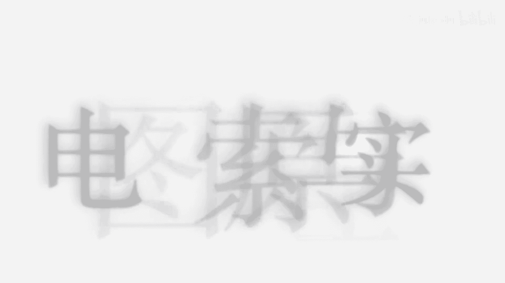
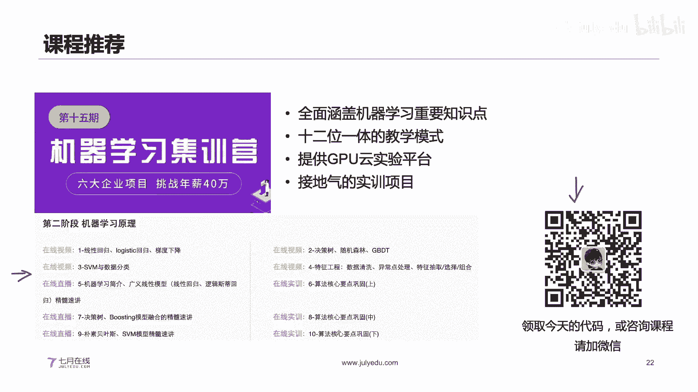

# 人工智能—计算机视觉CV公开课（七月在线出品） - P14：【公开课】电商图像检索原理与实践 - 七月在线-julyedu - BV17z4y167dq

好。那么大家之前对这个图像检索有了解吗？如果有了解，或者是说想学习啊，什么有什么什么问题啊，也可以在我们的一个弹幕区里面发一下。对，我们待会儿就开始我们的一个直播。嗯。

那么各位同学之前学过这个深度学习相关的嘛，或者说有没有这个。计算机视觉相关的一个基础呢，也可以在我们的一个。弹幕区里面跟我说一下。大家之前的基础经。好，我们再等5分钟就开始啊。对。嗯。

然后嗯我们今天主要讲的是这个电商领域下面的一些图像检索的一个原理和一个实践的过程。然后图像检索呢，其实很多同学可能不太熟悉啊，我们待会儿呢也会做一些介绍。对，当然也有一些代码的一个实践啊。

所以说也是嗯非常不错的。然后今天的一个课程，我们大概总共是一个小时左右的一个时间啊。好呃，那么各位同学大家好啊，然后我是刘老师。然后今天呢我们就给大家花一个小时的左右的时间呢。

给大家讲解这个具体的一个电商图像检索的一个原理和一个时间的过程啊，一个小时左右。然后呢，我们在讲解的过程中呢，如果有任何相关的一个问题啊，都可以在我们的一个嗯弹幕区跟我进行互动。好。

然后我们就开始今天的一个课程啊。我们今天呢就是主要的一个嗯课程内容呢分为四部分啊，就是说第一部分呢是图像的一个特征提取。第二部分呢是图像的一个检索流程。第三部分呢是嗯archface，就是这个。

原理和实践。第四部分呢是这个图像检索的一个加速的方法。然后就是我们来开始啊。然后呢，我们先看第一部分那个图案特征的一个提取。嗯，图案特征呢我们这个地方呢会分为全局特征和局部特征来分开进行讲解。嗯。

我们都知道啊，这个图像呢其实它是一个就是非结构化的一个数据，非结构化。啊，非结构化是什么意思呢？我们现实生活中呢有结构化的数据和非结构化的数据。嗯，结构化的数据一般情况下就是我们的这种表格类型的数据。

表格类型的数据表格类型的数据呢就是我们原始的数据集呢由我就是说类似于我们的这种excel的类型的一个数据进行一个存储和展示的。我们有我们的一个行，有我们的列，对吧？行和列，就相于是一个二维的表格。

行和列两部分所组成的行列。这个地方呢每一行是一个样本，每一列呢是一个字段，这是我们的一个具体的一个结构化的数据。那么非结构化的数据呢，比如比较常见的，就是说我们的这个image。图片。还有我们的文本。

还有我们的这个视频。这些相关的。那么它都是一个具体的一个就是非结构化的数据。非结构化的数据呢，它不是规整的一种形式，就是说不同的样本，它的一个具体的一个就是说维度啊都是不一样的，啊吧？

举一个非常简单的一个例子，就是说我们的图片啊，它有的是呃200乘200的，有的是500乘500的对吧？所以啊就是说尺寸是不一样的。那么图像呢是一种非典型的非结构化的数据。那么我们在这个地方呢。

我们就需要找到一个特征或者说一组特征去描述我们的图像，而且呢这个描述的时候呢，我们是需要保留这个图像的关键的一个信息，它一些关键的一个信息。我们需要把它保留下来。嗯。

其次呢我们是需要对这个特征进行编码的。编码就是说我们需要把它编码成一个相同的维度。这个维度嗯，我用英文就是一个deam，我们需要把所有的特征呢，所有的图编呢把它编码成一个相同的维度。

因为我们如果是把所有的图片，它的一个特征编码成相同的维度的情况下，我们接下来才好方便计算我们的一个相似度。对吧所以说呢我们这个图像的一个特征提取呢，就是关键就是如何描述这个图像。

如何对特这个特征的一个图像去进行一个具体的一个编码。那么我们再看右边这个图，就是说我们即使是同一个蒙娜丽莎的一个画像，它在不同的一个角度，不同的情况下。

其实它的一个呃就是说我们的一个图片它的内容其实相差蛮大的。有就是说原始的蒙娜丽莎的，有这种带相框的，带旋转的，加字幕的等等，还有画动画，还有这种旋转的对吧？我们那个图片其实它的一个具体的一个形变啊。

以及角度啊，可变的一个维度就是非常多的。那么在这个地方，我们想要把这个蒙娜妮莎它的一个主体的信息，把它。进行描述，而且进行编码，其实是一件很困难的事情。

那么这个地方呢有可能有的同学已经是呃之前学过我们的深度学习的时候，已经有同学或许就知道哎，我们这个地方是不是能借助于这个深度学习的一个特征来完成一个建模。

或者说利用深度学习的一个特征来进行一个我们特征描述，其实是可以的。那么这个地方呢，如果是用深度学习而言呢，我们在深度学习里面最为常见的任务就是我们的一个分类的任务。我们的imageclass。

对吧我们把这个图片对它进行分成具体类别。但是呢在我们的图像检索的任务里面呢，我们的一个具体的一个就是说呃。图片它的在同类之间，它的一个具体的一个差异性是蛮大的。比如说我们在同同样是湖泊。

它们之间的一个具体的差异性。比如说这个是我们的正常图片。这可能是我们的一个相当于是两个看图或者广角的。然后呢我们在。不同类别之间其实也有比较大的一个相似性，对吧？这个是狗，这个是人对吧？

所以说在这个地方呢，如果你单纯的用分类来做呢，其实也会遇到一些相关的一个问题，或者说很。那么这个地方我们其实。检索和分类很多程度上是可以参考的，但是呢还是存在一定的差异。在这个地方呢。

我们就是说如果想要把图像检索学好呢，就是需要思考一下我们的图像的特征。我们如何是与现有的一个任务相结合的。我们现有的任务呢就是主要是这个分类，你如何将我们的图像分类的一个特征把它用来检索。

那么这个地方如果大家对图像分类和图像检索还不太熟的话呢，再给大家解释一下分类就是我们是需要。输入一个图片，我们得到它的一个类比。这是我们的分类的，就是说建模需要完成的。我们的检索呢就是我们输入一个图片。

我们是想要找到跟它相似的。图片。就是说我们最终是找到跟它相似的图片，不是把它转换到一个类比了。不是的，所以说在这个地方呢，我们是有很多时候呢是需需是在做一个计算相似度的一个过程。

这是我们的分类和检索的一个非常关键的一个区别。那么我们的图片特征具体是可以分为啥呢？我们具体图片特征呢是分为这种全局的和局部的。全局的和局部的。全局的呢是比较关注于我们的一个就是说图片的一个整体。

局部的呢是我们的这个特征呢是会关注到我们的一个图片的一个细节。两者是有什么一个区别呢？全局的一个特征，我举个非常简单的一个例子，全局特征我们那有一个图片呢。我们是把它转成1个512维度的。

那么一个局部的呢。我们会把可能会把它转成。50乘以1个128。或者说70乘以128这样的一个纬度的一个就是说。那么在这个地方呢，我们的局部特征它的一个细节就是说数量是不固定的。一个图片啊。

假如说我们这个地方的一个局部特征是这种关键点的话，一个图片它里面的关键点的个数是不固定的。所以说我们的一个图片它提取得到了一个特征的一个维度是不定的。

那么每个假如说每个关键点的一个纬度是1001128维。但是呢关键点的数量我们一个是50，一个是70，图片不一样。所以说这是他们在提取完特征之后，它的一个存在的一个数量上的一个差异以及维度上的差异。

那么在这个地方呢，我们如果是用全局特征。我们接下来就可以很方便的做一个图像检索，对吧？我们直接算这个全局特征之间的一个相似度就行了。但是如果是局部特征的话，我们就需要做一个编码。我们如果是数量不定的话。

我们假如说是仍然是50乘以128。和1个70乘以128的一个图片。接下来我们本质就提取成两个矩阵。我们如何计算这两个矩阵的一个相似度呢？对吧这个。这个才是我们接下来的一个问题。好。

那么我们再看右边这个图啊，就是说深度学习的一个特征，这是我们的CN的一个特征啊，这本质就是我们CNN的一个特征。全定神经网络的。那么我们在提取特征的时候呢，我们就输入一张图片。

通过我们的一个卷积层的一个计算，然后通过我们的铺ing。这个呢只你可以直接借助于现有的这个imagenet的一个预训练模型。然后呢，这个地方我们不是不是做最后的分类啊。

就是说我们的呃imagenet这种分类的模型呢，就是说是卷积层铺层，然后再加上全连接层，我们不需要这个全连接层。我们把这一层。技术掉，我们只需要它在卷基层的一个特征，就是说它的1个CNN的1个废。

这是我们想要的，我们不需要它最终通过全景集行到一个分类啊，我们只需要让它提取这个CNN维度的特征就行。那么我们也知道这个CN维度的特征呢，其实它的维度也是固定的。我们的当我们的神经网络确定好之后。

我们的这个CN维度的特征呢，其实它的维度也是固定的。好，那么这个地方呢，我们的一个图像检索呢，它。具体的特征我们给大家讲的啊，全局的和局部的。那么图像检索具体的任务呢，我们还可以划分为什么任务呢？

有我们的一个相似图像检索和我们的一个相同图像检索。这个地方呢其实相似图像检索和我们的相同图像检索基本上都是检索。但是呢就是它的一个力度是不一样的。相似呢就是找到跟它同类或者说比较类似的。

相同呢就是完全找到要一致的。那么这个地方呢，我们的一个再来看呢局部特征。局部特征的时候，你们发看这个例子啊，我们都是这个动这个卡通的一个图像。然后呢，我们局部特征其实它是可以把这些关键点。

给他匹配上的关键点给它匹配上的。那么这个地方。我们的一个局部特征呢，它往往是能够将相同的一个图案，它的一个具体的关键点可以把它匹配上。那么在这个地方呢，就是我们是可以做这样一个判断。

或者说做这样一个思考。就是说我们在图案检索里面，我们到底是使用全局特征呢，还是使用局部特征呢？就是说我们这个地方我们不是有相似图像检索和相同图像检索嘛。那么我们到底是用这个局部特征呢，还是全局特征呢？

那么这个地方呢，就是说。看你一方面是看你具体的一个任务，我们的任务到底是什么。第二个呢，看你具体的一个在图像检索的做的时候，你到底需要找到的是什么？如果是在计算机视觉里面。

也就是说我们具体的任务是这种分类的任务。分类的任务的话，分类的任务呢我们是肯定是直接用卷接神经网络，用CN的一个特征会比较好。对吧那么这个地方我们的分类任务到底有哪些呢？我们的一个图片分类。

我们给另一个图片给它划分成划分到一个具体类点，或者说我们的语义分割，我们给另一张图片，我们是将它的一个具体的一像素点进行一个分类，对吧？语义分割其实本质也是一个分类。那么其实我在这个地方呢。

我们就是用CN的一个特征会比较好。但是呢如果是在一些版权检索相同的图像检索特别相似的一些图像检索的一些任务里面，我们就比较适合用局部特征。我们刚才也讲了，局部特征呢。

它非常适合用在这种相同图案的一个检索，它不是它不会考这种局部特征，它。有一些点是没有匹配上的对吧？你看这些关键点，这个地方的一个圆圈就是一个关键点。那么这个关键点呢，你会发现就是说它并不是说是。

嗯所有的关键点都都能匹配上，而且这些背景也不会匹配上。它只会关注到我们的一个局局部的一个细节，是不是匹配上的。那么我们的如果是应用在一些版权检索相同图像检索。

或者说极为相似的一个图像检索的一个任务上面呢，就比较适合用局部特征。那么这个局部特征呢，我们是可以用局部特征的一个匹配点的个数。或者说我们的局部特征。

它通过编码之后的一个计算的一个相似度来做我们的一个衡量。好，那么这个地方呢我们给大家讲清楚了，我们有局部特征和我们的全局特征，以及我们的局部特征和我们的全局特征各自用在我们的什么的任务上面。好。

那么我们就继续。那么有同学可能就会问到，老师，既然你讲到了这个图像检索以及全局特征和局部特征，以及讲到了这个相似图像检索和相同图像检索。那么我们如果是我是一个小白，我该如何进行学习呢？嗯。

这个地方呢就是说如果你是一个小白的话，或者说你之前对计算机视觉不太了解的同学，我非常建议你去学习一下，就是按照这个路思路来进行学习啊。第一个呢就是你要学习一下每一种图像特征的一个原理。

我们现在图像特征提取呢不仅仅是呃有这种卷积神经网络和这个。一些关键点，还有一些很多的一些图图像特征的一个提取方法。这个具体的一个原理是什么？它的一个计算的过程是什么？以及它的一个优缺点是什么？

每类特征的一个优缺点的到底是什么？这个呢就是说你在学习的时候是第可能是第一步还是第二步。第二个呢。就是说我们的第三步，你需要学习一下我们的局部特征，我们如何把它转为全局特征。

这个其实我们之前也会就是一直给大家讲的，我们的有1个50乘以128和我们的1个70乘以128，对吧？就是我们把它写在一起啊。你把它写在一起，就是50乘以28和70乘以28。这个维度是我们的关键点的个数。

就是我们的一个key point的一个个数。这个维度呢是我们的关键点，它的一个每个关键点的一个维度。好，那么这个地方我们是需要把它统一编码成一个相同的维度的，就是它们的维度是不固定的。

不同的图片关键点的个数是不固定的。我们需要把它编码成相同的维度。因为我们把它编码成相同的维度之后，我们接下来。进行一个相似度的一个计算才有意义。而且它也更加方便。

所以说第三个问题就是说我们如何是如何将一个局部的资源把它编码为一个全局的资源。对，这是第三个问题。第四个问题就是说我们的CNN呢卷积神经网络呢，其实它默认是可以提取这个全局特征的。但是呢现在一些发展。

或者说现在有些前沿的一些论文呢，也可以用CNN提取一些局部特征。在原始的一个就是说我们的图片分类的。就是说在im内测上。构建的一些预训练模型呢，它基本上是得到了一个全局特征。

但是呢我们的有一些CN的一个图片的这种卷积神经网络呢，它也可以提取一些局部的。这种CNE也可以用来提取这些关键点的，是有有一些相关的一些工作。所以说呢如果你想要把这个啊就是同像解锁学好了。

你可以按照这样一个路径来进行学习啊。绝对是啊基本上肯定可以入门，而且是能够到进阶的。那么我们接下来呢就给大家介绍一一个个介绍一下我们的具体的一些图像特征的一些提取的方法。

首先呢给大家介绍的是这个图片的一个哈希值。我们都知道这个图图片呢，这个地方的花吸值呢你可以理解它有点类似于这种图片的一个。有点类似于这个文件的1个MD5。

MD5MD5呢就是说我们用一个字符串来衡量这个具体的一个。我们的一个文嗯文件的一个内容，对吧？那么这个地方呢图片的花析值呢，它更进一步，它其实是利用。

他不是说你单纯的将这个图片的一个信息从文件的角度做一个编码，不是它是利用这个图片的一个内容，有有点这种内容理解的一种感觉。它对图片的内容进行一个计算。它那个计算具体的一个计算的步骤。

就是说我们将这个图片进行一个缩小，缩小到了一个指定范围之后，然后提取这个图片的一个具体的一个特征。然后这个图片的特征就是这个原原就是如果是对这个图片的一个像素值进行一个量化。

然后再把它转为一个具体的一个字符串。那么这个图变化一直我们有这个D哈是A哈P哈式和W哈0。具体的计算的过程啊，就是有一些小轻微的一个，就是说有一点小小的一个区别。

但是整体的流程就是先把图片缩小到一个指题范围，然后将它整成整个字符串。那么这个图片哈希纸呢，它可以用在一个什么样的一个场景呢？或者它的优缺点是什么呢？

图片哈稀一值的一个优点就是它是能够用一个固定长度的一个字符串来表示我们原始的一个图片的一个内容。而且这个固定长度呢，它一般情况下我们是1个64乘664的一个，就是直接长度是64的一个字符串。

那么我们也知道啊，这就是如果是自符串的话，它是固定长度的话，我们可以很方便的可以把它存到我们的一个数据库里面。那么这样呢我们的一个。就是说直接用一个字符串来代替它原始的一个图片。

这样呢它的一个计算的一个资源与占用也比较少，对吧？如果两个图片的一个它一直是相同的，那么它的一个具体的一个内容就基本上都是相同。好，那么它的一个缺点就是说我们如果是对图片的一个改变。

假如说我们对图片的一个具体的一个颜色做了一个变化。或者说我们对于这个图片的一个呃内容啊做了一个旋转。那么如果是这样这样的话呢，就会改变我们的一个具体的一个哈希质量。就是说。

我们的一个签当于是我们把一个图片啊。That was say X。和我们的FXE撇。我们把它做了一个变换之后，那么得到的我们的字符上。它就不一样了，因为这个地方它直接是。计算的一个逻辑就非常简单。

对我们图片进行缩放，然后计算它的一个具体的一个我们的一个。值的一个变化。好，这是第一个缺点。第二个缺点呢就是存在不同的一个图片，它的哈希值是相同。就是说图片不同，但是哈希值相同。这也是存在的。

就是说如果两个图片它整体的内容是不相似的。或者是完全不同的两个。内容，然后它也存在，有可能它的IT值是一样。所以说这是图片IRT值的两个具体的一个缺点。那么我们接下来介绍第二个啊颜色直望图。

颜色这帮图呢在我们的一个数字图像处理的一个教材里面肯定都会讲的。它是一个非常非常典型的一个就是说全局特征。它是将我们的一个图片的一个颜色的一个像素点的一个取值的分布。用来进行一个统计。统计完成之后呢。

然后绘制得到我们的一个具体的一个统计这帮图，然后利用我们的统计这帮图来进行表示原始的一个图片。那么这个地方我们嗯看右边这个图啊，就是我们是将我们的RGB3通道的一个具体的一个。

就是呃我们的一个像素的一个统计的一个情况，从0到25的一个情况，然后进行统计，然后绘制得到我们的直方图。这个直方图我们这个地方是用这个线来进行表示的啊，我们有用这种柱状图来进行表示。

那么我们仍然是可以把它转换成这种向量，对吧？这个地方我们Y轴呢是我们的一个具体的整个像素对应像素取值的个数。我们是可以把它做一个规化的，然后把它转成一个向量。那么这个地方呢，我们的一个颜色脂房图。

它这个优点是什么呢？它是可以抵抗我们的一个图片的一个旋转和平移的，基本上是可以的。你的图片的旋转平移或者翻转，其实不改变这个图片像素的整体的分布的，它是不改变的，对吧？但是呢它是有一个缺点。

就是说它这个颜色的一个变化是挺明准。因为我们这个地方颜色指棒图呢，它是直接统计了这个颜色的整体的一个分布。孔金的颜色整体的分布。那么这个颜色如果有改变的话。

那么你的一个颜色脂肪图整体的就会存在一定的一个差异。好，这是颜色脂肪图，它存在的一个优点和确定。还有一类呢就是我们的一个关键点shiftft ORB啊这些局部关键点的一个特征。

那么这个关键点呢就是说它在我们的一个数字图像处理里面，我们叫做这个key points，对吧？key point。图片关键点，而且这关键点呢，它的数量我们刚才也讲了，在不不同图片里面。

它的一个数量是不同的。就是有的图片它可能提取到100个关键点。有的图片呢它可能只能提取到我们的1个50个关键点，这都是可能的啊，而且是存在的。那么这个地方呢，我们如果是用这个关键点。

我们怎么去衡量两个图片，它们之间是不是相似的呢？我们是提取两张图片的一个关键点，然后呢让这两张图片进行一个关键点的一个匹配。匹配的个数越多，就表明就是说这个地方能够匹配的成。

就是说这种关键点对它的个数越多，那么它的具体的一个相似度就会越大。对吧那么你可以看到这这两张图片，对吧？基本上上面的这是一类关键点的一个对比，下面这是一类关键点一个对比。

你会发现它基本上都是啊很相似很相似。那么这个关键点呢，其实它的一个优点就非常多了，它是能够抵抗图片的一个旋转平移和形面。而且对我们的一个图片的一个颜色变换，也都是有一定的一个鲁棒性的。

但是呢这个关键点它也存在它的一个缺点，就是它是速度是比较慢的。因为我们这个地方会涉及到关键点对它的一个具体的距离的一个计算。那么这个具体的一个计算，其实你可以理解就是一个需要计算很多次啊。

这个关键点需要跟我们这张图片的所有的关键点都需要计算一个相似度。对吧相当于是我们是需要计算很多次。计算很多次的话，这个速度是非常慢的啊速度非常慢。而且这个计算呢其实嗯很多程度上呢，我们是只能在。

或者说在CPU上的一个实现呢会比较方便。那么如在GPU上面呢，我们的一个实现会稍微慢一些。而且需要做一个相应的转换。这是第一个缺点。第二个呢就是它容易受到一些文字的影响。

这个关键点呢我们很容易抽取到一些文字上面。因为这个关键点其实本质就是在做一个呃相当于是利用这些边缘信息来计算得到我们的一些关键点的位置。那么这个文字的一个文字呢，它有这种非常强的一个边缘的一个信息。

这个边缘信息呢，我们就很容易抽取为一些关键点。那么我们假如说两张图片如果是有相同的一个文字，那么就很容易。就是说把它也给匹配上。好，这是我们的一个图片的一个局部特征，它的关键点。

那么我们接下来给大家讲一下，就是说我们如何将我们的一个图片的一个关键点的一个具体的一个。那信息局部特征把它编码为一个相同的一个纬度。好，我们这个地方呢我们的问题是这样的，我们有一张图片是50乘以128。

有一张图片呢是70乘以128，这个128呢我们是shiftft的一个特征的一个纬度。safe特征的维度。然后这个地方呢，我们50和70呢，它是我们的关键关键点个数。

kingpoint numbers是吧？关键点的个数不同的图片我们提取到的关键点的个数就不一样。那么我们现在的一个问题是，我们如何将我们的一个具体的。两个维度不一致，确定是它在数量上不相同的这个矩阵。

把它做一个编码。我们试试图把它编码成一个相同的维度。把它编码成一个相同的维度。那么这个地方呢，我们是需要把它编码成一个。一乘以N。一乘以N的一个纬度。那么这个地方呢。

我们就是说我们的问题是需要把我们的一个具体的一个图片呢，把它编码成一个相同的维度，而且这个维度是相同的啊，都是N。我们来看我们怎么做的。我们做的方法呢就是说我们是分三步啊，我们先讲它的步骤啊。

然后给大家解释一下。第一个呢是我们可以提取所有图片的一个特征。这个特征呢我们就是说我们有的图片呢是50。乘以128，有图变的是70乘以128。有的图片呢是100乘以28。

我们就是这是第一步提取所有图片的一个关键点的一个特征。然后呢对我们的这个特征呢进行一个聚类。我们把它提取完，提取完成之后啊，我们可以把它拼接到一起。拼接到一起，这个50加上70加1100。

相当于是我们的220，对吧？我们把它拼接到一起，就是220乘以28。然后呢，我们对它进行一个聚类。就是说我们是。把它的一个特征进行一个聚类，我原始的关键点个数是220乘以28。我们需要把它聚类。

这个聚类呢聚类中心的每个类别中心的纬度呢是128。128，那么我们这个地方呢是需要把它进行一个聚类。比如说我们把它锯成五类的话，我们就是5乘以128。5乘以128。

这个地方呢我们的嗯哪个类别的中心的纬度是128。我们把我们的1个220个关键点把它聚类成5个。好，聚列成5个之后呢，我们接下来可以做这样一个转换。我们可以对我们的一个具体的一个原始的一个特征呢进行。

我对我们的一个剧离中心进行一个映射。这个地方我们5050个关键点，我们把它在我们的5个类别中心里面进行一个转换。我们接下来就可以把它转成一个1乘以5的一个向量。其实把它在内别中心上面进行一个转化。

那么接下来。把它转成一个1乘5的向量，类似的100也可以把它转成一1个1乘5的向量。这个向量里面每一个取值是什么呢？这个项链面它是一个相当于是50个关键点，在每个类别它映射之后的一个具体的一个数量。

那我们看右边这个图你就能理解啊，我们对于我们的图片呢进行一个具体的一个特征的提取，然后完成一个聚类。聚类完成之后就是到这儿啊，我们用key means完成一个聚类就行了。聚类完成之后呢。

我们就是可以得到我们的一个具体的一个类别中心。然后呢，我们有了一个图片，有了它的一个具体关键点的一个信息之后呢，我们可以对它的一个具体的一个类别进行一个映射。也就是找到他最近的一个。我们的一个聚类中心。

然后把它做一个编码。这个地方我们的一个具体的每个聚离中心呢，我们把它叫做一个word，就是一个单词。然后呢，我们相当于是我们把原始的一个不定常的一个关键点信息呢，把它编码成相同的一个。

就是说由word所组成的这个向量。比如说我们的这个1乘5对吧？它有可能是。1。Ci。101010，也就是说我们原始的1个50个关键点，在每个类别上面。这每个类别啊每个类别的一个类别中心性面都占据了。

10个总共加下来是50个。如果这个是地方是70呢，有可能这个地方是。101010。是30对吧？总共加起来是70。也就是说这个地方。这个图片里面跟这个关键点。跟这个类别非常相近的关键点个数有10个，对吧？

那么这样呢，我们是可以将我们的这个具体的一个嗯这个不定常的一个特征呢，把它转成一个定常的维度。这个维度呢个数就是我们的聚类聚类的个数啊，就相于是我们的一个类比的个数，word的个数。好。

这个就是我们的一个具体的一个特征。bago words的这种方法，就可以将我们的一个具体的一个图片的一个特征，从不进场转成进场。好，我们接下来就看一看我们这个具体的一个图像的一个检索的流程啊。

当然我们这个CN的一个特征呢，我们也会给大家展开讲。我们这个图像检索呢基本上是基于现在都是基于这种内容的一个图像检索。基于我们的一个内容图像检索呢，就是说我们拥有这个图片之后呢。

我们是希望通过我们的一个图片的一个内容，然后计算得到跟它相似的一个图片。那么我们怎么做了呢？我们本质需要有这样一些步骤。

我们这些步骤呢就是首先我们需要通过我们已有我们有一个image的一个dabbase。这个dabbase就是我们的一个图片的一个仓库。这个图片的仓库呢里面我们是需要从里面进行一个检索找到待选的一个图片。

这个image的 database呢，我们是需要进行一个特征提取，然后抽取到它这个特征，然后存到我们的一个具体的数据库里面，或者把它存储下来。那么我们如果有了一个具体的一个。

query的图片呢就是说我们需要待检索的图片呢，我们也是提取一个特征。提取完相同的一个特征之后呢，其实本质这个地方我们假如我们的dabbase里面有500张图片，我们的一个特征提取完成之后呢。

我们的维度是。500乘以100每个特征，每个图片我们接下来把它提取成100维度的。那么我们如果一个quere的图片呢，我们也把它抽取成一个1乘100的一个向量。那么接下来就计算一个距离就行了，对吧？

在我们500张图片里面找到跟它最相似的图片，然后做一个返回，这个就是我们的一个图片检索的一个具体的步骤。对吧提取特征，然后进行检索，其实非常简单。那么我们现在呢基本上如果是基于内容的特像检索。

基本上流程就是这样的啊，先提取特征，然后计算一个相似度。其实本质的流程都非常简单。那么我们的特征提取方法到底有哪些呢？我们特征提取方法，有这种嗯传统的特征提取方法。我们的这个图片颜色、直放图啊。

关键点啊，或者图片哈希纸啊都是可以的。好，这是传统的特像特征提取方法也可以使用我们的深度学习的方法来提取我们的特征。深度学习的呢就是我们利用卷积神经网络来做我们的一个具体的一个特征的一个提取。

当然我们当我们的一个特征提取完成之后呢，我们接下来可以做一个相似度的一个计算。相似度的计算就是我们直接计算一个相似度就行了。计算一个相似度就行了。那么这个相似度的计算呢，我们可以把它具体的一个展开。

就是可以做一个特征的一个索引和相似度的计算。好。那么我们如果是用这个卷积神经网络来提取我们的一个特征呢，我们这个里面还有什么细节呢？如果我们用卷积线经网络来提取我们的一个特征呢。

我们的一个具体的一个网络呢是可以分为我们的一个卷积层磁化层，我们的一全连接层的。就是说我们的这个具体的一个图片分类的一个网络结构啊，就基本上是我们的卷积层植化成构全连接层。当然还有一些其他的想比。

比如说我们的ba normalization啊，这个呢我们就就是说把它先忽略掉。那么我们的卷积层呢是用来提取我们的一个像素，它的一个特征进行一个高级的一个表征。

然后我们的池化层呢是对我们的一个具体的特征进行一个有效的一个降维和编码。那么这个池化层呢，我们有这种me pullingarrange pulling。

当然也有一些我们基于这种我们的attention机制的。对吧比如说我们把它加入这种我们的一个区域聚合的这种mac或者是rem都是可以的。那么这个ping呢其实对我们的一个最终的结果。

其实有一有一点点的影响啊。max pulling是将我们的具体的一个图片的一个内容的一个，相当于是它的最为显著的一个信息给它保留下来。

me pulling mean pulling呢是把它平均的这个信息把它保留下来。其实也有一定有也有一点的一个精度的差别啊，但是差别不会特别大。那么我们的池化层具体在做什么呢？

这个池化层基本上就是对我们的一个图片的一个。特征是对它进行一降维的。其次呢是对我们的一个图片呢，把它剔除它的一个位置的关系。也也就是说我们的具体的一个位置的一个关系。🤧我们。

是把可以把它的一个未置的关系呢给它把它剔除掉。因为我们看到这个前面的啊。这个具体的一个图片的一个位置，对吧？你的一个特征，我们是把它铺lling之后，其实是把它关键里最大的一个信息给保留下来。

我并不关注它之之前是在什么位置，对吧？相当于是我们把它位置这个影响的因素，可以把它剔除来。那么这个地方我们的一个检索的词化到底有哪些呢？

就是我们有minpoint xpointGEM或我们的一个具体的remm这个都是有蛮多的。好，那么有这些铺ing之后呢，我们就是说可以利用这些铺ing层。就是结合我们的90新网络来提取我们的一个特点。

好，我们接下来呢就看一看我们的具体如何来做这个特征的一个抽取的啊。然后呢，我们这个地方呢，我们就用这些代码给大家实现了啊。然后就是如果大家想下去来进行自己来实践一下，都是非常简单的啊。

直接用我们的一个ipad的一个逻book。来进行一个实践一下就行了。然后呢，如果我们首先呢给大家来尝试一下这个图片的一个哈希值的一个提取。图片哈希值啊。

我们来看一看我们这个地方呢就是用一个image hasush的一个具体的一个特征提取啊。我们对于我们图片进行读取，然后直接用image has的个库来计算它这个A hasush。

这个Ahu呢其实它计算出来基本原始的一个形式，是这种呃true or false的一个矩阵。我们接下来呢是可以把它转成这种十六进制的，十六进制的一个字符串啊，十六进制的一个字符串。转换完成之后呢。

你会发现它其实就是一个非常规整的啊非常规整的一个字符转。所有的图片呢我们都可以把它转成一个相同维度的一个具体的一个字符转。好，那么我们当然也可以用这个A哈ushB哈是D哈ush和W哈是分别来进行计算。

得到不同的结果。这是可以的。那么这个地方呢有一个非常非常非常有意思的一个点。非常非常有意思的一个点。这个点呢就是我们的一个基础的一个。这个图片的一个哈希纸呢，它有一个非常有意思的一个特征。

或者说有意思的一个点啊。就是说我们的假如一个图片，它的一个原始图片是相似的。X1还有X2，假如说它两个原始的图变是相似的，那么它提取得到的一个字符串。也是相似的。我们假如说输入相似的3张图片。

我们来计算得到它的一个哈锡值。那么你会发现这个具体的一个我们的一个图片的一个哈希纸的一个字状。这个有很多的一些字符都是相同的对吧？我们来看一看。这跟我们鼠标所选取的这些位置的，我们的一些字符都是相似的。

对吧那么这个地方我们就说就可以表。它其实也有一些它的一个优点，就是说我们的相似的图片，它的哈西值的一个字符串也是相似。那么这个地方呢。

我们就可以计算这一些字符串的一个边辑的距离来衡量我们这些图片的一个它的一个相似度了，对吧？那么我们继续。那么我们接下来要看一看我们的一个颜色直放图啊。

颜色直放图其实本质就是统计我们的一个图片中颜就是说不同颜色的一个像素的一个整体的一个统计的一个。频率啊，那么我们这个地方呢用open to呢进行实现就非常方便了。那我们CV呢就是我们读取一张图片。

也可以统计它的一个每一个通道的一个像素的一个信及信息，也可以做我们的具体的，就相当于是把它读取为灰度图，然后做一个具体的一个统计。都可以。然后呢，我们统计得到的具体的一个直方图。

就是类似于这样的每个像素位置下的一个具体的一个像素个数的一个。值，然后我们可以把它进行一个展示。那么当然我们也可以利用我们的一个就是说把多张图片来提取它的一个颜色直方图的一个信息。

那么这个地方我们是可以提取我们的相似图片，它的一个颜色直方图，然后进行一个绘制。然后那么你有发现就是说相似图片，它提取的到的这个具体的一个直方图的一个形态也是相似的。因为它整体的规律也是比较一致的。

也是比较一致的。好。那么我们的这也是它颜辞重要头它的一个优点。那么我们接下来看一下我们的一个key points。P points呢其实它是对我们的一个图片呢进行提取它的一些关键点的一个信息。

这个关键点呢就是我们这个地方的一个图片里面打圆圈的一些位置啊，就是我们的一个关键点的一个信息。那么这个图片的关键点呢，我们如何做它一个具体的一个匹配呢？

我们就是用op on这个open C里面的shift关键点。shift这关键点进行一个读取之后呢，然后对我们的特征进行一个图片的特征进行一个提取，然后做一个我们的关键点的匹配。

那么这个地方我们假如说给定两张图片。那么这两张图片它假如说是相似的话，我们完成一个关键点匹配呢，基本上是可以把这些。相似的一个位置给它匹配上。当然也有一些匹配错误的啊。比如说这个地方我们有一些文字。

也是匹配到其他另一张图片上的一个错误的位置。对，好。那么这个地方呢，我们这个具体的一个就是我们的一个相似点的一个匹配的一个。好。当然呢就是说你也可以用其他的一些关键点匹配啊。

这个地方我们用呃shift啊，用ORB啊都可以啊。这个地方我们当然也可以做一些关键点的一个就是说筛选。关键点一个筛选。这个地方我们通过一个具体的一个距离做一个筛选都是可以的。好，我们就继续。

那么接下来我们看第三部分啊，我们看一看这个archerface的一个原理和一个实战。呃，这个地方呢就我们在这个深度学习的一个检索的过程中呢，我们假如说用深度学习来做一个图片分类呢。

基本上我们的这个网络结构是我们的CNN。就是我们的卷积。加上我们的一个铺例。再加上我们的FC。再加上我们的soof max。对吧这个呢就是我们的一个具体的一个嗯小马哥说人间真实呃，什么意思啊？

这位同学这个说的是什么意思？对，对我们的课程内容有问题吗？嗯，那么我们这个地方如果是用卷积神经网络来做我们的一个分类的话，我们基本上一个网络结构就是我们的卷积。

然后再加上我们的一个具体的一个嗯我们的一个具体的一个。呃，ing，然后再加上我们的全连接，然后再加上我们的soft max，这个是我们整体的一个网络结构。对吧那么这个地方呢。

我们这个so max呢它基本上是非比较适合用在这种。这种我们的一个。类别有限，或者说我们的类别基本上可分的一种场景。那么我们假如说是用遇到一些开启的一些场景。也就是说我们在进行一个检索的时候。

我们的一个具体的一个图片，我们的测试机的图片。假如说跟我们的训练机的一个图片，它是不交叉类别不交叉的情况下，那么这种soof max呢它就不太适合。那么就比较适合用这种archer face。

或者说我们的这个coing face这种思。Aerface呢它的一个思路呢就是说我们试图将我们的一个特征的一个分隔面在角度空间把它划分开。它比较适合用在我们的一些人脸识别和图像检索的一个任务里面。

那么它具体的一个原理就是如图所示啊，我们看一看啊左左边的公式，我们的左边的公式呢基本上是从我们的一个soft max进行一个改进。我们把我们的soft max的一个矩阵的一个计算呢。嗯。

我们的全链阶层它的一个具体的一个矩阵的计算呢，我们把它的偏值给它剔除掉。然后我们就可以用一个具体的一个类级来代替我们原始的一个啊就是原始的一个计算的过程。然后呢再将为了帮保证我们的一个特征。

就是我们的一个图片，它们的特征的一个具体的一个距离是在一个可控的一个范围内。那么我们把它做一个相当于是把它做一个正动化，对吧？取L2的真动化。然后呢，我们接下来可以把我们的原始的一个距离计算的一个。

或者说我们的soft max呢可以把它写为我们如下的这个公式。我们这个公式呢就是说是archgraphface的一个原理，它是在我们的一个角度空间内去最大化我们不同类别的一个距离。

那么我们如果是用一个公式简化的公式，或者说它的一个角色空间，或者说它的一个这种角色的一个可视化的图呢，你可以很清楚的可以看到。我们的一个arface呢基本上是试图在这个原始的一个角度的空间去最大化。

那么我们的一个soft max呢，它是在可能是直接对我们的原始的一个具体的一个X做一个映射。对吧它的一个，那么我们的cos interface呢是在我们的余弦空间左右个最大化。这个操作是不一样的。

那么这个最大化的一个角度就是它的具体操作不一样，就会导致你具体的一个嗯就是在精度上会有一点点影响。我们的原始的of mix我们的coinging face，和我们的archface。好。

那么我们这个呢我们呢我们接下来就对我们的一个arface一个具体的一个呃就是来进行一个实践啊。嗯。有同学问到，在台标检索过程中，细腻度识别台标，台标是这个。呃，是这个商标吗？台标是商标吗？

一甜相机和叉叉相机。台标这个地方你你举的这个例子是图片的维度啊，还是文本的维度啊？你这个维度是呃图片的维度，还是就是说文本的维度啊，我不太理解。如果是这种图片的维度的话。

我就是说这个地方其实这个同这位同学问的一个问题也是比较常见的logo对吧？这个地方呢如果是logo的话，我非常建议你。嗯，这个地方其实是这样的啊。我我举一个人脸识别的一个。

或者说行人虫检测的这种任务的一个例子。嗯，我们在构建一个具体的一个任务的时候呢，假如说我们的训练集里面有5000张。就是说5000个人5000个人脸啊，接近于是5000个face。然后呢。

我们的一个测试集有可能是。比这5000个会更多。比这5000个会更多。假如说我们测试机里面，我们假如说有5万。有5万个人，这个是很常见的。我们在进行一个具体的一个呃人脸识别的一些场景里面。

我们不是说录入一个人脸，我们就去呃去重新对我们的一个模型训练次。不是对吧？我们是一个开级的这种检索或者开级的这种识别。我们的测试集里面呢，有可能包含我们的训练集里面不存在的一个对应的类别。

那么我们进进进行一个具体的一个计算的流程，就是我们是类似于这种检索的这种角度，类似于检索这个流程。我们对于我们的测试集的输入一张新增的一个人脸，我们把它设为一个query。

那么我们是对于我们的c图片呢进行提取一个特征。然后呢，我们类似的我们原始的一个数据集里面也有类似的特征。然后我们计算一个相似度，计算相似度之后呢我们。通过这个相似度来就是说来找到他最为相似的这人，对吧？

这个就是人脸识别。我们在进行识别阶段它的一个具体流程。它是一个开机的。那么这个地方呢，我们为什么人脸识别它是这种开机的呢？因为我们在这个部署的过程中，我们肯定是会遇到一些没有见过的人脸或者没有见过的人。

如果你在部署的过程中，你遇到的都是你见过的人，那么你基本上是你训练级和测试级的人脸的这类别都是重合的对吧？我们直接用分类就行了。那么我们这个地地方的一个场景呢是这种开启的。我们在测试器的时候呢。

是会遇到一些你之前没有见过的。然后我再回过头来看，就是回答一下low more这位同学说的我们的一个台标检索这个地方。人脸检索或者人脸识别跟我们的台标这个识别有什么区别？人脸识别这个具体任务。

有可能我们的一个人脸是非常非常多的，十几亿对吧？我们拿中国的人人口数量十几亿。那么我们不可能把这个十几亿的人脸的一个数据全部加到我们的训练器进行训练吧。一方面我们的数据集收集不到这么多。

另一方面我们这个训练的成本也非常大，对吧？那么我们只能说用有限的一个人脸的一个数据做我们的测做我们的训练集，然后对我们的所有的人脸，就是说我们未知的人脸做一个相似的计算，然后做一个识别。

那么如果是台标的话，如果是我们的台标，你能够收集到所有的数据，我还是建议你用分类的一个角度来做。如果你是用就是说嗯如果你能够收集到所有的一个台标的话，我还是建议你用分分的来做。如果你收集不到的话。

或者说你收集的样本有限的话，那你可以用检索来做。当然这个地方如果是用能够收集到所有的类别。当然这个精度肯定是会比减索的一个精度会更高一些的。对，那么这个地方如果你的台标有可能是嗯它的范围很小的话。

你也可以尝试物体检测。先把这个台标的一个具体的一个位置。就是说我们给另一张图片，假如说你的一个logo在其中很小的位置，你可以先用这种检测的方法，detection的方法。把它检测出来。

检测出来一个很小的位置之后，然后再做后续的一个操作。这个都是可以的。对这个这个都是可以的。所以说我觉得嗯我觉得你如果能够收集到所有的类别，你还是为了精度着想，你可以收集到所有类别。

因为这个地方的logo我觉得还是有限的啊，logo还是有限的。这个品牌嘛品牌数量肯定是有限的。我们就继续啊。那么我们接下来呢给大家讲一个具体的一个场景。这个场景呢logo嗯也是一个开启的问题。

如果分类的话，新增logo识别会很麻烦。这个地方嗯这个地方其实是这样一个这样一个词组啊。嗯，这个呢就呃稍微讲的扩展一点，就是说我们的一个我们的一个具体物体检测呢。

我们的物体检测呢就是说如果是这种我就讲这个非常基础的话，就是说有这种fast RCN对吧？啊，写错了啊。faCN它是有两个步骤所组成的对吧？一个是相当于是生成这个待选框，然后就是我们的proposer。

然后从我们待选框里面进行识别出我们的具体的一个类别。那么你在如果是你的一个检你的一个有类似于有检测的任务。然后这个检测的类别是这种开机的话，你也可以用这种两步分两步走。

先做我们的propoal的一个识别，然后对我们的类别识别，我们都知道这个训练整个我们的一个分类的训练训训练我们整个检测的一个模型，它的一个时间程很高。那么你可以分两步走啊。

先训练我们的propos产生这个待选框产生这个logologo的这个位置，这个步骤，然后对我们的logo的位置呢，你再单独训练一个分类的。因为这个分类的这个网络。

它的一个就相当于新增logo其实就很简单了。分类这一部分的训练，其实我觉得还是时间成这个成本还是可控的。检测这一步可能这个就是说训练成本会很高。对，但是你如果是在这一步。

你在我们的propoal产生po产生完propoal之后，然后再做一个分类的。这一部分其实它的一个训练的成本还是很低的。基本上半个小时就能训练完吧，新增一个logo。

只要你把这个logo处理成我们proposed的类似的形式。对。好，我们就继续啊。那么我们接下来给大家讲一个，就是说也是现在正在进行的一个比赛。这个比赛呢是在做一个嗯图像检索的一个任务。

我们有一些训练级的一个图片。和我们的一个测试集的一个图片。训练级的一个图片呢是呃有一些我们的一个。相当于是接近于7000张我们的一个图片。然后呢，它是有我们的3K类比。或者说3K的一个商品所组成的。

我们测试集里面呢有4K的一个图片。然后呢，里面有EK类别。我们这个地方呢，我们的图片我们是需要对我们的训练级的图片做一个聚例。它是相当于是把它聚聚成3K类别。然后呢我们。有测试的图片。

我们也需要把它从原始的图片把它聚类到对应的类别里面。也就是说我们的训练集和我们的测试集是不交叉的啊，这两部分是没有图片交叉的，也没有类别交叉的。我们是需要对我们的测试集的图片做一个聚类。

那么这个聚类的过程呢，其实本质是计算它们之间的一个相似度，对吧？那么这个地方我们可以把它抽象成这种图片检索的一个任务来完成。好，那么我们来看一看我们怎么做的。

这个我们的代码我们的代码都是可以直接运行的啊，只要你下载完我们的一个数据集之后，这个代码都可以直接运行的。好，我们待会儿呢也会把我们的一个代码和我们的PPT的一个获取方法给跟大家说一下。

我们这个地方呢我们是用我们的一个拍er起的一个具体的一个来做我们的一个相关的一个实现啊。然后呢用我们的pattter型来提取我们的一个具体的一个图片的一个特征。好。然后呢。

我们这个地方读取我们的具体的一个数据集。这个数据集呢我们是直接对它自己做一个相关的一个转换就行了啊。然后呢，我们这个地方呢，我们是啊需要有一个把我们的数据集，把它划分成训练的部分和我们的测试的部分。

我们的训练的部分，我们的测试的部分呢是不交叉的。我们的那么我们构建的训练级和我们的验证级也是需要不交叉的，也是需要不交叉的。所以说我们在构建训练级和验证级的时候。

我们的验证级的部分和我们的一个训练级部分也是不交叉的啊。我们是按照group来进行划分的。那么我们接下来定义我们的archerface的这个model。这个模块呢基本上是可以替代我们的so next。

这个里面呢它基本上是我们有两个超参数可以啊就是说需要注意的。第一个超参数是SS呢，就是我们的这个具体把它缩放，或者说我们的一个向量的一个建它的一个半径。我们的圆的半径。

然后我们的M呢是我们的marinmarin呢就是我们的一个类别与类别的一个具体的一个，就是说它的一个间隔，最小的一个间隔。那么我们在进行核心的一个计算。

就是说我们是需要对我们的一个计算一下我们的一个ca。里面的一个西塔加M的一个取值。然后和我们的一个原始PPT里面所展示的这个cosine西塔的一个取值。那么这个地方我们的cosine西塔加M。

它得个展开，就是cosine西塔乘以cosine M减去sine的西塔减去sineM。那么所以说在这个地方我们是分别要计算这些具体的一个数值。然后。我们是可以得到我们的cosing的具体的。

就是说我们的嗯这个archgraphface这个特征的一个取值的。其实它本质啊这个操作基本上就是对我们的一个特征在这个角度空间里面做一个相似的一个计算。那么这个样本呢，它本质上就是把它划分得到我们的。

每个类别的划分得到每个类别的一个相似度的一个过程。那么这个地方呢我们是需要如果它是属于某一类的话，那么我们就可以计算得到它对应对应到某一类的一个具体的一个概率值，或者它的对应的一个输出。

如果它不属于某一类的话，那么我们就可以计算得到它跟其他类类别的一个cosine的一个具体的一个距离。好，那么是这个是我们的一个archface model。那么我们具体定义我们模型呢。

其实本质就是对我们的一个图片呢，我们提取它的一个卷积层卷积层的特征，我们提取它的一个eff的一个就是说具体的一个呃effic它是一个CN的网络模型。我们提取利用它的一个卷积层的特征。

我们这个地方把它的一个classifier。它的全层呢把它剔除掉。我们利用它的卷积层特征，然后再加上我们的一个archgraphface的一个模块来做我们的特征的一个具体的一个映射。那么这个地方呢。

如果我们是存在我们的一个具体的一个标签的话，那么我们就用我们的标签来对我们的就是说具体的这个特征来做一个映射。如果没有我们的标签的话，我们就直接计算我们的特征与其他的一个特征的一个相似度。

然后找到我们具体的一个图片的一个啊就是说类别。那么我们的训练的代码和我们的测试验证的代码，基本上就是一个我们pyto器里面的模型的一个正向传播和我们的一个具体的一个反向传播的过程啊，这个就非常简单了。

好，那么我们的训练的过程呢，我们的具体的训练代码呢就是说我们构建我们的data loader。然后我们构建完我们da load之后呢，然后构建我们模型。

那么模型呢就是我们刚才所定义的这个CN的一个网络模型，再加上archface的 model。然后呢我们的损失函数呢，我们仍然是我们的crosent啊。

这个地方我们的archface呢其实中呢代替我们的这个之前的oft x。然后我们的训练的一个函数呢，仍然是我们的一个分类的损机函数。好，我们让它进行一个训练。这个地方呢我们是用交叉验证的方法呢。

将它训练的多个模型。好，这个train呢train函数呢就是我们的训练的函数。我们的这个训练完成之后呢，接下来我们需要在我们的一个验证集做一个具体的一个验证。这个验证的过程呢，由于我们是没有标签的啊。

我们是计算一个图片的一个相似度。我们它的一个特征的相似度呢，我们直接用我们的一个内级的一个距离，然后来完成。那类级的距离来完成这个地方呢直接计算它的一个类级的一个呃，就是说它的一个cosine的距离啊。

然后就可以得到它的相似度。然后呢，我们在这个地方呢也可以手动写一个我们的ss hold的一个动态搜索，写写一个动态搜索的过程。这个动态搜索呢，就是我不知道到底是什么，就是说大于什么ss hold的。

我们认为它是属于相同类别的对吧？我们这个地方呢就是写一个便利，从0。5到0。99把它作为一个for循环，然后去计算一下。到底是在什么时候hold，我们的一个剧类的一个效果是最好的。好。

然后将我们最好的一个效果呢给它保留下来保留下来。那么我们也可以对我们的一个测试集呢做类似一个操作。我们对我们测试集呢也是多折的模型提取多对我们的。我们五折模型的话，就对我们的一个。

是呃模型呢嗯对我们的训练集呢训练了5个具体的一个模型，得到5个参数。然后呢，我们对于我们具体的一个测试集的图片呢，我们也可以把它提取5个特征，然后把它求一个平均。求完平均之后呢，接下来也是一样的操作啊。

通过1个CS hold完成一个聚离，就是大于某个CS hold的这个结果。我们认为它就是比较相似的。我们把它聚离到一起的。把它聚留到一起。好，这样呢就是我们的一个archface的一个时间啊。然后呢。

如果各位同学想领取我们的代码的话，和领取我们的PPT的话，我们待会呢有领取的方法啊，我们整个的代码都可以完全完整复现的啊，完整复现。你不用担心。这是我们的archface的一个原理和实践。

那么我们接下来第四部分就给简单给大家讲解一下这个图像检索的一个加速的方法。我们如果有了这个嗯图像呢之后呢，我们假如说想对我们的图片进行一个检索呢，其实嗯我们本质是在做一个矩阵的一个计算。

就是说我们做一个矩证乘法的一个操作。那么这个矩证的一个乘法呢，其实它本质是非常非常耗时的啊。就是说我们有了一个具体的一个矩证，1乘以100，还有一个我们的一个相当于是10万乘以100。

我们想要在这个10万里面找到跟他top5，就是说跟他们跟他那个图片最相似的5张，其实本质就是做一个矩阵的乘法代替我们内积的一个操作。那么这个地方它其实时间复杂度以及计算量是非常大的啊。

甚至我们的这个图片的数量你是100万。或者1000万的话，你这个计算就非常耗时了，而且很有可能你的内存就承受不住，对吧？那么我们在这个地方呢，我们是需要加速我们的检索。在电商的领域呢。

我们的图片是非常多的。我们是需要加速我们的检索。那么怎么做呢？我们是首先呢有很多种方法。第一种方法呢是利用我们的一个具体的一个特征呢，你可以对它进行一个聚类。我们可以把我们的一个特征，把它做一个聚类。

把它映射到5100类里面。把1000万的图片把它映射到100类里面。然后呢对我们的测试机图片呢，先把它做一个类别映射。类别映射啊这是无间度的距离啊，做一个类别映射，然后呢再到类别里面找最相似的。

先完成聚类，然后再到类别里面找相似的。这样呢我们的一个时间复杂度就相当于是从我们的。原始的是100万，在100万里面找。然后呢，我们如果要把它聚类到100类，那么我们就接下来是把它转。

基本上是在110万那边里面找，对吧？时间复杂度就降低了一相当于是降低了很多，对吧？这是第一种方法。第二种方法呢叫我们的1个PQ啊，叫层级量化，它的一种方法呢就是说我们对于我们的原始特征呢。

原始特征可以把它分段。原始的这个地方，我们12345678。8乘以128维度的一个向量，我们可以把它分成8个128维度的。然后呢，我们对于我们的一个特征呢，我们是就是这样的啊。

我们的原始的一个就是说特征呢，我们是10万乘以1个8乘128维，这个是我们的特征维度。然后呢，我们把它拆分成这样的啊，今天是每个128，我们把它拆分开来。然后呢，我们对于我们的图片呢。

我们分别今天相当于是我们10万乘以1个128，每一段完成一个聚类。sub vectorctor做一个聚离。这样聚类之后呢，我们每个类就是相当于是把它聚类到256类。把它距离256人。那么这个地方呢。

我们接下来一个一个特征，我们相当于是有，就相当于是8乘以128。我们把它编码成8个。256个剧类的一个结果就行了。那么这个剧离的结果呢，这个256呢，我们可以把它相当于是用一个巴比特的一个向量来做表示。

就相当于它是一个类别的距离结果，就是一个类别中心嘛。那么我们把它转成一个巴比特的一个具体的结果。那么我们原始的一个图片，我们就是8乘以8比特，我们接下来就可以把它转成64。尤如是比特的一个具体的压缩值。

那么我们具体的原始的一个图片。原始的一个维度，它会就会降低很多。而且这个降低之后呢，它的一个效果是比我们原始的一个单纯做聚类。然后在子令里面检索的一个效果会好很多的。

因为这个地方我们是对每一个sub vectorctor做一个聚类，然后做一个编码，对吧？那么这个地方我们的一个sub vectorctor，它是这样的啊这样一个维度的。

所以说它的一个效果呢是比我们的方法医识好很多的。而且它这样呢其实是嗯就是说把我们的类别其实划分成很多类的。我们的一个具体的类别，图片的一个类别，就不是说这个地方我们是聚类到100类。

这个地方我们的图片类别我们可以最多可以划分成多少多少内容，我们最多是可以把它划分成256的8次方类。因为我们的每个subtract都是有2256类的，我们把它连成在一起。

我们的一个具体的一个类别的空间其实是增加很多的啊，这个是subtract，它每个subtract有一个类别，对吧？我们有8个subtract，我们就有8个256进行成级。那么如果用PQ这种方法。

我们的一个具体的一个。我们的1个C hold。啊，sorry啊，我们的一个具体的一个剧类的一个效果，它其实是非常非常好非常好。那么如果你对这一部分感兴趣呢。

现在也有很多的一些具体的一个在工艺上面的一个实现啊，基本上都是利用到PQ基于PQ这种方法来自于我们的特征的一个减索的一个加速加速。当然第三种方法呢，也就是说我们是可以用这种近似的方法。

比如说我们基于这种图的HN的HNSW完成这种检索。它是将我们的一个具体的一个节点呢，就是说我们每个特征呢构建得到它相似的一个特征，把它构建得到一个相似图。我们提前可以构建得到这个相似图。然后呢。

我们这个图呢，我们如果是是提前将它的一个相似的节点给它构建好之后呢，我们接下来这个搜索的过程就非常非常快。我们只需要按照这不同，就是说按照它提前构建好的这个边，然后找到它最近的这个节点就行了。

这个呢是HNSW做一个近似搜索。它的一个速度呢也也是非常快的。如果你感兴趣呢，下去也可以进行一个继续的一个了解。好。那么我们这个今天所讲的课程呢。

其实基本上的一个课程内容呢都在我们的7学在线的一个第15期的机器学习机训云的一个课程里面。然后我们的课程里面呢基本上是涵盖了机极学习的一些基础。然后也包括具体的一些实间的项目。

然后这个地方我们有一个截图，是我们的机忆学习原理的部分的一个知识点，和这个具体的一些讲解，包括的进行回归逻辑回归决策数我们的特征工程的一些具体的构造。

然后我们这个机器云也是包括我们具体的一个GPU的一个环境的支持的。以及我们的一个老师的一个具体的打疑。然后如果各位同学想领取我们今天的一个课程代码，和我们的今天的PPT啊。

或者说想对我们的课程进行一个技术继续的了解呢，都可以加我们的杨老师的微信啊，就我们的微信的二维码，可以拿出我们的手机微信啊进行一个扫码。然后加一下我们的杨老师的微信。

然后进行获取我们今天的一个就是说代码和我们的PPT的内容。对。然后各位同学对我们今天的一个课程有什么问题吗？对。如果对我们今天所讲解的课程有什么问题的话，可以来进行一个提问啊。

然后这个代码待会儿都都是发给我们的杨老师的啊，你可以加一下杨老师的一个个人的微信。对。各位同学有什么问题吗？就我们今天的一个课程内容。好。然后大家如果感兴趣。

嗯嗯获取我们今天的内容呢啊也可以加一下我们的杨老杨老师的微信。在如图所示啊，我们这个微信的二维码。各位同学有问题吗？啊，谢谢各位的点赞。如果大家没有关注我们的这个知乎的账号的话，也可以关注一下啊。对。

好，然后大家如果对我们其他的课程有什么问题的话，也可以进行一个提问啊。对我们今天的课程还有问题吗？同学们。好，大家还有问题吗？嗯，机器云也是非常干货的。如果大家想了解的话。

也可以打开7月在线的官网进行查看。各位同学还有问题吗？啊，如果想要领取我们今天的一个课程，我们的代码的啊，可以嗯加一下我们的杨老师的微信啊。好，嗯，然后我们的一个集训营呢现在也是正在招生第15期啊。

如果各位同学感兴趣的呢，也可以加我们的杨老师的微信进行一个了解啊。对。好的，嗯，我看大家也没什么问题啊。那么我们今天的一个直播就到此结束了啊。然后如果想要获取我们的录播录屏或我们的代码课件的呢。

都可以加我们杨老师的微信啊。好的，那么我们今天的一个直播就到此结束了。谢谢各位同学。

