# 人工智能—计算机视觉CV公开课（七月在线出品） - P18：基于Pytorch实战：手部姿势识别 - 七月在线-julyedu - BV17z4y167dq

啊啊。

嗯请问阁楼地的手势识别模型有哪些，哪些更常用于工业界啊，就是如果是做手势识别的话，还是建议和这个姿态估计一起做会好一些，就是从关键点的角度做会更合适一些，那我们待会儿就开始冲了。

对我们再过几分钟准时开始啊，呃大家之前学过深度学习吗，啊如果学过深度学习的同学呢也可以哦，扣个二二，我看一下啊，啊啊有同学学过好，那么大家想领取我们今天的一个ppt。

或者说我们的代码的同学都可以加一下我们的杨老师的微信啊，加一下我们杨老师的微信对，好，嗯那么我们就开始我们今天的直播啊，首先呢我们介绍一下啊，介绍一下我们今天直播的呃，就是说主题。

我们今天直播的主题呢是啊pad写的首部姿姿态识别，其实在课程中间呢，我们主要是介绍的呃，efficiennet网络以及我们的automata的一些具体的一些事件，然后呢。

我们今天的直播呢是由我们的七日战线和cs店共同开设的公开课，嗯确实这件呢是一家成立于很早啊，就是说姿态很就是相当于是资历很老的，成立于201415年的一个ai在线求职平台。

专注于人工智能的就是人才培训和企业服务，然后其实在现在现在的人才培养方面的讲师团队是超过300人的，军事由大厂的技术专家和国内外高校的博士组组成，总共的付费学员超过40万，课程的数量呢是500多门。

分别是入门的初级入门课，就业转型以及在线提升班，具备完善的课程体系，然后我们的交界线的企业服务方面呢均有军事，有嗯，就是我们的技术专家所领衔的企业微信的服务，然后企业微信的服务呢一些客户呢包括中国联通。

国家电网，广发银行以及广汽集团等等，嗯其实在现在的现在的一些课程呢，是不仅仅是包括ai的，也包括一些我们的自动驾驶相关的，如果各位同学感兴趣呢。

都是欢迎到我们的学在线的官网去打开我们的官网了解我们的课程，然后呢我是今天的直播的刘老师，然后我们就马上就开始我们今天的一个课程，然后大家如果想要领取我们今天的ppt以及我们的代码。

以及我们的具体的一些资料的同学，都可以，欢迎加一下我们的杨老师的微信，欢迎加一下我们的杨老师的微信。

好，我们继续嗯，我们今天的课程主要分为两三部分，第一部分呢是介绍一下efficient啊，这个地方呢这个手抖打打多打了一个f啊，多打了个f efficient，efficient是这个网络的一个介绍。

在我们的一个深度学习的一个模型的建模过程中呢，其实我们的模型它对我们的一个最终精度呢其实是影响非常大的，efficiennet呢是深度学习中继rent之后，又是一个非常非常重要的一个网络结构。

在这个网络结构呢一些现在是不仅仅是在我们的参数量，以及在我们的这个模型的运算运行速度上面，都是远超我们之前的网络的efficient，是呢它的一个就是说我们在之前的设计的一些网络结构呢。

可能都是由我们的人工来进行设置，但是呢我们的efficienage呢它在进行设置网络结构的时候呢，可能是加入了我们的一个网，就是说这种automa的这种搜索过程啊，加入了我们的automa这种搜索过程。

所以说呢我们的efficient在具体的一个模型的一个建模过程中啊，其实是比较就是说啊就是它的模型是比较接近的，那么什么是auto 0呢，这个地方给大家介绍一下，我们在具体的一个建模过程中呢。

其实我们是需可能是需要对我们的一个模型呢做一些相关的一个，就是说调调仓啊，以及我们的一些具体的一些就是模型能优化啊等等的这些步骤，但是呢我们的一个具体的一个这些步骤呢。

并不是所有的都是需要我们的一个就是我们的一个呃，就是嗯啊算法工程师所参与啊，因为我们的一个模型呢很有可能在做一个建模的过程中呢，是可以用我们的网络，或者说用我们的一个就是应用程序所替代啊。

在我们的一个具体的建模过程中呢，我们的一个网络模型可以或者说这个数据挖掘的一个工作呢，其实是可以完成，你分为以下一些步骤啊，比如说我们首先拿到我们的数据集之后呢，然后对我们的一个具体的数据集呢。

对它进行一个数据的预处理，然后对我们的一个具体的数据集呢，然后对它进行一个特征提取，然后对我们的数据集，接下来做一个我们的模型的训练，以及我们的模型的一个选择，然后最后做我们的一个模型的一个预测。

所以说呢我们的很多时候呢，我们的一个网络结构它并不是很单纯的，就是就是说需要人工参与我们这个网迭代过程中呢，有很多一些步骤呢是可以有人工参与的，但是呢我们也是还有就是说可以有一些部分呢。

是我们可以从我们的一个机器来进行代替的，机器来进行代替好，那么我们在这个地方呢，我们需要思考一点，就是说我们的算法工程师他能够完成什么，以及我们的具体的一些嗯步骤呢。

我们到底哪一些是可以使用机器来进行替代的，那么我们在一般情况下，我们的如上所示的这一部分，在我们的mr framework这部分，其实都是基本上可以有有我们的一个就是机器所替代的。

机器所替代的这一部分是我们可以用我们的机器所替代的，好，我们继续，那么autumn家具体能够做什么呢，其实奥特曼他能够做的一个事情是很多的，从我们的一个特征的一个产生。

以及我们的一个具体的一个网络结构的设计，以及我们的一个超参数的优化，这整体的一个过程啊，都是可以由我们的一个奥特曼啊所组成的啊，都是可以由我们的奥特曼组成组成的，那么奥特曼其实它的一个范围很广啊。

就是说主要是包括从我们的自动的数据分析，以及我们的一个自动特征工程，自动缩放，以及我们的自动正则化，自动特征选择，自动模型选择以及自动超参数优化的过程，都是可以由我们的automa完成好。

那么我们在做一个奥特能量的时候呢，其实嗯最为核心的是有一些方向啊，就是这个地方所写的主要是由我们的一个automata做一些特征产生，automata作为一个网络结构搜索，以及我们的模型调参好。

我们就先看一下automata在我们的一个特征特征产生啊，或者说特征构造的时候，他怎么做的，我们在做一个具体的特征工程的时候，其实其实呢我们是需要做一个自动特征挖掘的过程。

也就是说我们需要从我们已有的数据集里面挖掘出一些特征，然后构造一些特征，好啊，这个p t我把它保存一下啊，重新保存一下，稍等把它重新打开一份啊，好刚才显示的好像有点问题，好这个刚才没有显示出来啊。

我们重新打开一下，对我们的奥特曼，其实它刚才这个图没有显示出来，我就重新打开一下啊，这个ppt其实它有很多，主要是由我们的一个特征产生步骤，以及我们的一个网络结构搜索步骤，以及我们的原学习。

以及我们的自动特征工程啊，嗯我们在这个具体的一个数据产生特征的这一步骤呢，其实是需要从我们的一个具体数据里面自动的挖掘出新性特征，进行构造出一些特征。

那么这个地方呢就是需要我们自动的是否能够自动的对我们的数据集，它的特征做一个自动编码，然后帮助我们的一个模型呢进行自动训练，而且是能够做一个自动的一个特征的筛选。

这个过程中我们其实是可以依赖于我们的一个呃就是机器，或者说我们的automata的工具来进行的，那么这个地方的一个关键点，或者说比较核心的点就是如何去自动构造一些特征，因为我们的一个特征工程呢。

其实它本质上是就是说嗯是在构建设特征的时候呢，是需要有我们的一个具体的一个就是嗯嗯有一个想象的过程啊，有一个想象的过程嗯，而且呢是在这个想象的过程中呢，需要结合我们的一个业务。

那么如何去做一个特别的我们这种产生的产生了一些新的特征呢，这个具体的一个特征呢就是说我们需要做一个嗯具体的构造，这个构造呢其实是有两两类方法，两类方法，第一类方法呢就是我们在做一个特征构造的时候呢。

我们是去使用我们的一个构建一个神经网络，在这个神经网络里面呢，我们让这个神经网络主动的，或者说让它自动的去完成我们的一个特征的一个提取，以及我们特征的交叉，在这个我们的一个分之一里面呢。

我们的一个方法就是基于我们的一个网络结构呢，加入了一个embedding air，然后再这个embear就是对我们的一个输入的特征呢做了一个嵌入，做做了一个嵌入之后呢。

接下来就将我们的一个特征呢将它完成一个交叉，将它这个文本之间交叉，因为我们在构建一个特征的时候呢，其实是想要我们就是说能够构造出一些新的特征，构造出一些新的特征。

这些新的特征呢其实目标是对我们的一个原始图片呢进行一个组合，这个组合呢可能是基于我们的一个线性组合，也有可能是基于我们的其他类型的组合，这个过程呢就是说我们是定义了这个网络结构。

让这个网络结构自动的去做这些，做这些高级的交叉，这是第一个我们的dna的分支，第二个呢是基于我们这种搜索的一个分支，继续搜索的分支，这个搜索的分支呢就是说我们在进行搜索我们的特征组合的时候呢。

我们有了原始的一个特征组，就是原始我们假如包含了四个特征，abcd abcd，在这个地方呢，我们在进行构造特征的时候呢，我们希望是对我们的一个特征呢把它进行两两组合，或者说把它进行一个组合。

也就是我们的原始的特征有四个的情况下，我们需要从我们的一个特征里面进行一个筛选，进行筛选，比如说我们筛选得到最能够产生我们精度，就是说收益最大的组合是什么。

这个地方呢我们就会对我们的原始的一个特征空间站进行搜索，这个搜索的过程呢就是对我们的一个具体的一个空间，把它搜索我们的生产组合最原始的，假如说是对我们的特征a进行使用。

然后将我们的a特征a和我们特征例进行组合，更进一步的再加上我们的特征d对吧，然后再加上我们的特征c这个地方呢就是说我们的每个数字空间呢，其实它可以把它展开为一种类似于输入模型的这种结构，数模型的结构。

然后呢我们需要从这个数的结构里面呢进行筛选，得到我们的每个具体的一个就是说有效的特征的一个子集好，但是呢这个对具体的一个搜索过程呢，其实是需要有很多的一个呃搜索时间的，而且是需要确定一下我们的一个哦。

就是说评估指标的啊，那么奥特曼大家可以做什么，奥特曼还可以做我们的一个超仓库的一个搜索，这部分呢大家如果感兴趣呢，也可以下去看一下啊，就是说它可以自动的过做。

我们的各位这期也可以自动的做我们的一个参超单数的一个配置等等，而且呢可以做这个超参数的一个组合的调度，对哈哈，在我们做一个automata的时候呢，其实比较嗯就是说比较有用的啊。

可能现在比较有具体落地的呢，就是我们的一个嗯就是网络结构搜索，网络结构搜索，网络接受搜索在做什么呢，就是说我们的一个原始的神经网络，它其实是这个网络结构，其实是需要我们的这个人工来进行设计的。

那么在这个设计的过程中呢，其实是需要有很多的一些嗯就是专家知识，或者说领域知识来辅助我们的设计，而且呢这个设计的过程其实是非常繁琐的，也是需要反复进行我们的一个动态的验证的，那么我们的一个nt对吧。

我们的nas网络结构自动搜索的这个分支呢，其实主要的目的就是说我们不能经过我们的一个搜索空间，去确定我们的一个比较有效的一个就是说网络结构，那么这个地方呢它的一个目标呢就是我们在进行一个搜索的过程中呢。

去寻找到我们最优的一个top结构，或者说我们最优的一个配置，那时的一个核心点就是说我们首先确定一下我们每个网络结构，它所所组成的元素是什么，每个网络结构它所组成的元素是什么。

然后接下来呢我们再进行进一个就是说确定我们的一个搜索的策略，这个搜索的策略呢可以是我们的基于强化学习的，也可以基于我们这种就是说可微分的，或者说可求梯度的，我们的搜索的一个策略。

然后也需要确定一下我们的一个具体的一个精度的验证，经过验证的过程，这个经过验证呢就是说我们如何确定我们到底哪一种搜索过程是比较，就是哪一种网络结构是比较有效的呢，这个其实也是需要确定的。

就是我们的进度验证过程，那么在我们的一个具体的一个网络搜索的过程中呢，其实我们首先需要确定一下我们的这个卷积神经网络，或者说我们的任意一个网络结构，比如你想要做一个具体的一个我们的一个嗯。

就是基于我们cn的网络做我们的一个呃就是搜索的话，那么我们的一个常见的，卡了吗，呃应该大家其他同学卡了吗，其他同学卡了吗，我看一看啊，稍等一下，嗯没卡啊没卡没有没有啊，没有没有，好好好，应该是没有的啊。

我把这一页讲完，我们抽一下奖好不好，嗯我们把这些讲完，我重新再讲啊，对嗯，在我们的一个具体确定我们的一个网络结构的过程中呢，其实我们是有很多的一些基础层可以来进行一个设置的。

比如我们的卷积和它到底是有嗯1x11x7的卷积，还是7x1的卷积，还是由我们的puling呢，是有3x3的一个eng puling，还是我们的5x5的一个next putting，对吧。

嗯或者说我们在进行一个设计网络结构的时候，这些网络网络节点它是如何进行连接的，以及他们如何进行组成一个新的网络结构，这些呢都是可以来确定的，也就是说首先是我们的卷积神经网络的常见模块。

这个是需要确定的对吧，这是我们常见的，不管是在我们的rn还是在我们的vg网络里面，其实都是由我们的这些组所组成的所组成的，这是第一个，第二个呢就是说我们需要确定一下我们的网络搜索它的一个结构。

这个结构呢其实是可能是需要由我们的神经网络去做，就是说搜索得到的啊，搜索到的这个搜索过程呢，其实是需要有大量的一个计算的，需要有大量的一个计算的，为什么呢，因为这个结构其实它是产生的过程。

其实就是一个搜索的过程，我们我们假如使用哪个节点表表示我们的每一层的话，你会发现我们的节点与节点之中连接，它是有很多可能性的，有很多可能性的啊，就是说我们原始的节点把它进行连接到一起，不断的把它连接。

然后你会发现它其实有很多种可能性，那么我们在进行一个验证的过程中呢，其实这每一种可能性他都是需要进行验证的，每种可能性就是需要进行验证，好好我们继续啊，直接加微信就可以领取啊，直接加微信就可以领取啊。

好那么这个搜索的过程呢，其实你会发现它的一个网，就是说组成它其实是需要有大量的一个计算的，是需要有大量的计算的，因为这个计算过程呢其实是需要啊，你不服啊不服，待会儿再继续抽嗯，待会儿再继续抽啊。

我们就是说待会儿还有两次抽奖啊，还有两次抽个奖好吧，还有两次抽奖，不要不要着急不要着急啊，还有两次抽奖，杨老师的微信怎么加杨老师的微信，这个二维码能看到吗，这个二维码能看到吗，对这就是直接微信扫码。

微信扫码就可以加啊，微信扫码就可以加这个二维码，对好ok吧，你可以截一下图啊，截一下图，那么在这个网络结构的搜索过程中，你会发现其实它的一个搜索空间是非常大的，四个空间是非常大的。

也就是说我们的节点与节点它有很多种组成，就是说就是它的可能的边其实有有很多的，有很多的，所以说呢我们的一个具体的last算法，其实就是要需要确定我们的网络结构它到底是什么样的。

需要确定一下我们的网络结构到底是什么样的，那么一种常见的一个方法呢，就是说基于我们的可微的，就是说我们的一个网络结构的设计嗯，比较常见的就是我们的一个算法算法呢叫dos这个地方d a r t s大s。

在我们的这个具体的一个就是说搜索的过程中呢，其实我们的很多的一些参数，我们的很多的一些参数，比如我们的一个它的具体的一个我们的一个就是说这种离散的参数，比如我们的一个fter size啊。

我们的一个具体的一个嗯网络模型的深度啊，其实它都是一个就是说离散的值，这种离散的值上，其实我们是不可能就是说对它进行一个求导的，但是呢我们是不是能够用一种替代的方法来进行一个搜索，对啊。

这种搜索过程其实是计算量非常大的啊，就是说一般情况下只有大公司才玩得起来啊，只有大公司才玩得起来，但是呢其实我们是可以借助它的这种搜索过程来，就是说你也可以在自己的数据集上搜索。

你也可以在自己的数据集上搜索，这个也是可行的，这个也是可行的，因为现在的嗯，就是说这些网络结构其实它并不是说在一个很大很大数据机器上搜索，它可以在一个比较小的数据集上面。

比如我们现在比较常用的这个saf对吧，比较常用的safer，其实在safer上面搜索的网络结构，在其他处理器上的网络结构也都非常好，也都非常好，好我们就继续ppt啊，这个dh呢就是说它的一个呃。

就是说它的一个就是说主题，就是说我们在进行一个网络结构搜索的过程中呢，我们能不能是将这个搜索的过程，或者说我们在做一个具体的一个搜索空间尝试的过程中呢。

能不能利用我们的梯度下降来找到我们的一个最优的结果，我们之前的一个搜索呢，它其实是类似于调仓的过程，就是说类似于我们的greater search，或者说我们的这个利用强化学习来搜索我们的网络结构。

我们的一个具体的搜索过程中，我们想要用一个可微的方式来找到我们的结果，这个地方呢我们就是说在进行一个具体的网络结构的设计的过程中呢，我们先定义一下我们的网络结构，比如我们的节点0123。

然后这些这些节点之间是不是有边呢，这个地方我们是可以把我们的整体的结构呢，把它定义为一个有向无环图，定义为我们的有效互换图，这个地方呢我们有一些公式啊，大致给大家解释一下。

这个地方呢我们有我们的一个具体的一个o o呢，就代表了我们的具体的从我们的节点i到j之间是存在有一个边的，但是这个边呢具体是什么操作呢，我们是可以先把他带选啊，把它给可以带选。

这个地方呢我们在进行每个边的时候，每个边的一个就是说连接的时候，你会发现它有不同颜色对吧，这个颜色分别代表的是我们不同的操作，比如我们的卷积全连接，以及我们的puling对吧。

我们其实在做一个具体的一个连接边，连接我们节点的时候呢，是可以将我们的节点是使用所有的操作连接到一起，比如卷积全连接和pm把它都使用上，也就是说我们在这个地方，我们每个节点的一个连接是有三种。

我们的一个可行的，就是说三种带选项的，那么在这个地方呢，我们并不知道哪一种带选项是比较好的，我们先把它都连上，然后呢我们再进行一个具体的训练过程中呢，其实我们是将我加入了一个具体的一个参数。

加入了一个具体的参数，这个参数呢是一个可训练的参数，用来控制我们到底是去使用哪一种操作，也就是说我们在训练的过程中呢，你的一个可可选的边其实是越来越少的，可选的边是越来越少的。

那么这个操作其实如果你看到这个公式，你其实会发现它的一个具体的公式，跟我们的一个soft max其实是非常非常相似的，也就是说我们对我们的每条边都加了一个可选的参数。

对于我们的从我们的节点0~9点一这个连接的过程中，我们有三个选项，有三个选项在这个选项的过程中呢，其实我们去选择我们到底是哪个选项，它能够得到更好的一个结果，更好的结果。

这个结果呢其实是跟我们的一个正向转播，反向传播以及我们的求梯度相关的，所以说呢这个我们这边的选择，它是加了一个额外的参数，你可以理解就是说有多少条边，我们就多加了多少特多少个参数。

然后你通过我们的经验传播，反向传播去选择我们对应的边，那么这个具体的一个选择过程呢，其实是可以加入我们的一个梯度的一个求解的过程来完成，所以说我们的一个整体的一个网络结构搜索过程呢，是可以把它写为两个。

我们写写为一个公式啊，这个公式呢就是找到我们最优的一个参数，这个参数呢能够在我们的一个验证集上面，以及能够在我们的一个训练集上面取得最优的一个精度，取得我们的最优的精度。

所以呢我们的一个网络结构的一个迭代呢，其实就是在我们的一个训练过程中去确定了我们的网络模型，原始的参数，以及我们对应的就是说每一条边所对应的参数，然后就可以得到我们的一个网络结构了。

得到我们的网络结构好，那么如果你觉得这个网结构很复杂的，其实你会发现它在训练过程中是逐步，就是说相当于是缩减它的一个边的啊，相当于是最开始我们可选的边会很多，后来运到后来的我们这边就确定了。

我们边就确定了好，这个呢其实是一个叫做大的这个工作啊，大的这个工作呢也应该是谷歌做的，应该是谷歌做的好，我们接下来呢如果你想要自己来试验一下。

我们的这个就是说我们的这个automa呢其实也有一些其他的工具啊，我们可以来试验一下嗯，我这个地方呢给大家打开一个叫做autumn cs的这个库，auto cs的库，这个库呢其实也是使用的场景非常多啊。

我们这个地方呢就是说啊这个库其实是基于tensorflow的啊，基于tensorflow的，你在进进行定义的时候呢，就直接inbot我们的auto cs，然后呢对我们的网络模型呢。

这个地方只需要这样定义一下，首先定义我们的网络模型，定义我们的网络模型啊，这个地方就直接是一行代码定义了我们的网络模型，那么这个网络模型到底是内在的网络结构是怎么样的呢。

这个是去利用我们的一个autumn cs的库，它自动的去产生啊，自动的产生，我们并就并不需要你去人工进行设置，人工进行设置好，这个地方你会发现它具体的一个就是说如果要自动去搜索，它是可以自动搜索的。

当然我们也可以就是说设置我们的搜索过程，我们搜索过程呢就是说你可以设定一下他到底是基于什么网络结构，比如说像搜索的过程呢，就是基于我们的一个resonnet这个block来做搜索的。

这个其实也是可行的啊，这个也是可行的，也就是说我们可以设置一下我们具体的搜索结构是基于什么结构的，这个也是可行的，那么如这个地方这个案例呢，其实是基于我们的一个呃图像来的图像而言的。

那么对于我们的文本行不行呢，其实g对于文本而言其实也是可行的，如果你想要训练一个文本分类的一个案例，嗯，这个地方的一个案例呢是i m d b d b d b呢。

是一个就是嗯就是斯坦福的一个情感分析的这个数据集，在这个数据集里面呢，我们是需要对这个英文文本的一个情感，英文文本的一个情感做一个分析啊，英文本的情感做一个分析。

所以说呢其实它也是一个就是说非常常见的一个呃指纹数据集啊，那么对于这个数据集，它是一个文本啊，就是输入的都是一些文本，我们需要分两类啊，一一类是正向的情感，一类是我们的负向情感。

然后呢我们再进行一个定义网络结构的时候呢，仍然是很简单的，只需要一行代码就可以，一行代码就可以对，如果你想要就是说确定一下我们的网络结构，确定一下我们的网络结构的其实也是可以的啊。

就是说我们在这个网络结构的时候呢，你可以加入其对我们的一个输入的数据，把它对我们的输入的一个数据能加入这种unram的一个block嗯，我其实也是都可以的，也都是可以的好。

所以说呢如果你想要在自己的数据集上面搜索这个网络结构呢，其实也是可以利用这个autumn cs的那个库来使用的，就是说如果你不知道怎么搭建这个网络进网络结构啊，其实也是可以使用这个auto cs来做的。

这也是可行的，好我们继续讲到这个地方呢，就是有很可能有很多同学都已经手痒了，想自己试一下，其实可行的啊，其实是可行的好，然后呢我们再回到这个effici，efficient。

其实它的一个网络结构跟我们的一个具体的一个呃奥特曼amana，其实是强相关的，因为efficient它的一个具体的一个网络设计的，内在就是有我们的一个automa的这种思路啊。

内在就是有我们的automl的思路好，我们来看一下在我们的一个具体的一个图像的一个评价的过程中呢，其实我们如果是对于我们的图像分类做评价，那么我们最常见的这个数据集是我们的一个imagine imag。

英语简称呢，它是就是说是对我们的1000内图片呢作为一个具体的分类，然后评价我们的一个具体的准确率，对我们的图像分类呢，其实我们如果想要从模型评价呢，其实是有一些评价指标的。

比如我们想要对我们的模型进行评价呢，可以从我们的准确率进行评价对吧，准确率越高越好，参数量我们的参数量越小越好，以及我们的计算量，计算量越少越好，但是呢其实在这个地方，我们的参数量和我们的计算量。

它们并不是一个成正比的，参数量和计算的并不是成正比，以及我们的参数量越多，并不一定能够带来我们精度的增加，并不一定能够带来进入的增加，我们可以看一下这个例子。

对于我们的一个将我们说如果是将我们现有的一些神经网络，就是我们的图像分类的神经网络绘制得到这样一个图，我们的图的x轴是我们的参数量，就是参数量啊。

然后我们的y轴呢是我们的在训练上top one的一个准确率，然后你会发现呢我们的不同的网络结构，它在我们肯定是想要它参数量越少，但是它的精度越高，也就是越偏，我们的左上角是我们想要的这些网络对吧。

那么你会发现我们的网络结构呢其实并不一定是参数越高，它所得到的一个精度就一定是增高的，它在一定程度上呢会有这种线性关系，但是呢当我们的参数量增加到一定程度上呢，它已经是呢就是停滞不前了。

一定是停滞不前了，好那么在这个地方呢，这些网络结构其实是存在一些区别的，比如说这个dentient recent以及efficient，它是存在网络结构上是存在一定的区别的，好。

那么接下来呢就着重介绍一下这个efficient，在我们的一个具体的一个网络结构的设计的过程中呢，其实我们是可以从多个角度去设计我们的网络的，嗯主要的角度呢就是说我们的网络结构它如何进行变强呢。

也就是说它的精度如何增加呢，这个地方其实是可以从一些角度可以去思考的，比如我们去可以增加我们的一个网络模型，它的一个深度对吧，或者说增加我们网络模型它的一个宽度，或者说增加我们的输入的分辨率。

这个地方width，我们deth以及我们的就是说嗯resours对吧，我们的一个具体的一个就是深度宽度和我们的分辨率，当你在进行具体增加的时候，你会发现它的一个具体的一个网络模型的一个计算量。

lobs就是说我们的百万级别的负点数计算量其实也是增加的，那么我们的具体的增加其中一项其实所带来的准确率都有增加哈，增加我们刚才所讲的这个deep swiresolution。

其实都是对我们的精度都有增加的，但是我们现在问题就是说我们能不能把这三个把它结合到一起，把这三者的结合到一起，在我们的业务的研究里面呢，就是说我们将人生18。

把它就是说在我们的深度上面把它改变成我们的resident 50，其实是有很大的进度增加的，或者说我们在我们的图片的宽度将从我们的网络宽度啊，从rench 50到我们的wide rench 50。

其实也是有很大的进度增加的，所以说呢efficient它在具体的一个工作的过程中呢，就是思考我能不能将这三者将法将它结合起来，结合起来之后呢，能够取得一个更好的一个进度好。

所以说呢我们在这个具体的一个efficieng网络结构的设计的过程中呢，其实是想要对我们的一个网络网络的三个方面啊，网络三个方面，也就是说我们这个地方的dw和r做一个折中。

想让我们的模型呢最大化我们最终的一个精度，但是呢是想要我们的模型，它整体它的一个所使用到的显存，以及我们的计算量都是在一定的范围内的啊，在in的范围内的，所以说呢这个地方epp其实是一个优化的问题。

是优化问题最大化我们的精度，但是呢是需要在一定的一个受限范围内，才是能够做我们的一个具体的一个优化过程，那么我们的etration net他在做一个具体的一个搜索的过程中，它是怎么搜索的呢。

搜索过程呢其实你说他最开始是得到了一个business model，好，我们先看一下这个business model他怎么得到的啊，看一下这个business model怎么得到的这个分析呢。

其实它是将我们的这个deep ries in the resolution，三者呢就是说把它统一起来，统一起来，为什么呢，因为这个地方你会发现呢，这三者其实是有三个变量的，这3。7有三个变量的。

那么我们在做一个具体的搜索过程中的变量太多，其实这个搜索空间也会很大对吧，而且这个地方其实是一个数值类型的一个变量，数值类型的变量，那么对于这个数值类型的变量呢，其实在进行搜索的过程中呢。

它的空间会更大啊，很大很大，那么我们在搜索的过程中呢，并不就是说可能是需要先确定一下我们的具体的一个搜索过程，那么这个搜索的一个具体的一个deep ries and resolution。

到底怎么影响我们的模型的，一个就是说参数和速度啊，这个地方大致给大家解释一下啊，还是分到上面这个图y x呢是指我们的网络特征的维度大小，也就是我们的chinese特征的维度越大呢。

就是我们的一个具体的模型的表征能力会越强，然后我们的reduce呢其实是指的我们的输入的图像大小，分辨率越大呢，我们的一个具体的一个就是说特征提取的一个力度会更细，但是呢也会带来更大的一个计算量。

我们的dps呢其实也是指我们的网络模型的一个深度，就是说我们的层数，网络层数越深呢，我们的感受也会越大，但是呢我们的一个计算量也会越大好，所以现在我们在做一个具体的一个搜索网络模型搜索的时候呢。

其实是在我们的这三者之间做一个折中，三者之间做一个折中，在这个地方呢，efficient他为的是将这三者做的一个折中呢，他是提出了一个复合缩放的一个策略，也就是说将我们的dw和r分别定义为我们的阿尔法。

贝塔和伽马的一个具体的计算，然后呢我们的阿尔法贝塔伽马是做了一个受限制的啊，就是他们之间的相乘，阿尔法乘以贝塔的平方，乘以com的平方是约等于二，为什么这么做呢，因为我们的一个就是说将这样作为限制呢。

就是说你的一个具体的最终的一个计算量是受限制在一定范围内，那么有同学可能就会问到这个地方为什么是贝塔的平方和伽玛的平方，因为我们的一个神经网络，它的一个flops，也就是它的一个计算量。

一般情况下适合我们的宽度的平方成正比，以及我们的分辨率的平方成正比，所以说呢这个地方它是二次的啊，它是二次的好，那么为了我们具体的一个建模呢，这个地方其实他在做优化的时候呢。

最开始呢是在将我们的最终呢我最开始是教我们的一个三者呢，是做了一个折中的啊，三者是做了一个折中的，也就是说呢在我们的一个具体的网络模型的一个搜索的过程中呢。

我们是首先对我们的一个阿尔法贝塔和伽马做了一个greatest s，就做了一个网格搜索，网格搜索呢就是确定一下我们的阿尔贝塔和伽马，就是说基础的一个取值，这个取值呢也就是说先固定住我们的这个阶层啊。

就先固定住我们的历史啊，这个地方呢，然后呢我们的指数项啊，我们指数先固定一下，然后去通过规律测搜索得到我们的阿尔法和贝塔伽马搜索得到之后呢，我们就可以确定一下我们的一个基础的一个网络结构。

就是我们的一个efficient的b0 ，这个business的一个framework，这个搜索得到的呢，我们的一个阿尔法是取值为我们的一个1。2，我们贝塔取值为1。1，我们的伽马的取值为1。15。

然后得到这个基础的网络结构之后呢，然后再去动我们的指数下，再去动我们的指数项，什么意思呢，我们再翻到我们上一页，你就可以看到我们先搜索得到我们的这个business之后呢。

然后再去从我们的business去搜索得到我们的不同的网络结构，不同的网络结构，也就是说我们这个地方我们在进行修改的时候呢，我们阿尔法贝塔伽马已经确定了，然后呢再去搜索我们的指数项就行了。

通过我们缩放我们的指数项呢可以变路，就是说产生我们的网络结构的不同的版本，也比如说我们的非性在这b01 ，非性在这b1 b2 b3 ，一直到我们的b7 好。

这个呢就是说其实这个过程其实是加入了这个research能得到的，那么有同学可能就会问到老师，你刚才不是讲的有这种可唯的这种方法来做吗，口碑的方法来做吗，为什么没有用这种口味的方法来做呢。

因为原始的一个efficient，他是发现了我们的一个就是说网络模型的一个深度宽度，以及就是说它以及分辨率啊，三者是存在一定的规律的，也就是说原始的作者呢其实是发现了这三者是存在一定的规律的。

所以说呢他就去调整某种结构的时候呢，主动的去基于我们这三者三个参数来做调整，它并没有说完全是基于我们的这种可谓的那种，就是说呢这种大气的这种方法来调，不是的，那么通过这种方法呢。

它搜索得到的网络结构也是非常非常有效的啊，这篇文章呢最早是在2019年提出来的，在2019年的这篇文章，那最终惊动呢是比现有的网络模型都是高很多的，这篇文章在2019年啊。

他的effici的是b一的版本，在2019年提出来的时候上是比现有的版本都是高的，比现在的版本精度都是高的，那么我们再来看一看它的网络结构啊，它的网络结构呢其实是有不同的版本我们可以可供使用的啊。

比较常见的是我们的一个b就是b0 b1 b2 b3 ，然后呢更大的可能是就是说我们啊如果你gpu啊，就是说性能比较好啊，就是说它的容量比较大的话，可以使用一下，那么你会发现其实在我们定义网络结构的时候。

主要的就是从我们的wd对吧，我们的r好w嗯，就是我们的wives depth以及我们的分辨率啊，这三者，然后还有一个是我们dropout这个地方，就是我们的网络模型的drop的概率啊。

我们通过这三者再加上我们的dropout的概率，就可以确定得到我们的网络结构，就可以确定得到某种结构，所以说其实你会发现这个网络模型在定义的时候啊，并不是说是完全通过这个搜索的过程。

可能呢通过我们的一个先去确定一下我们的网络结构，再去通过确定我们的三者的一个具体取值，也是能够能够得到一个比较好的精度，那么我们的这个b1 b2 b3 b4 这些版本，他最终的精度是多少呢。

这个地方我们可以看一下啊，它分别对待对应的精度，就是我们的一个嗯肯定是模型越大，它的精度越高对吧，模型越大肯定精度越高，这个地方呢就是说如果是到b7 的情况下呢，它的一个精度，也就是说在配性的。

它的一个通关的进度已经是能够到84%了，这个是远远的都比这个efficient远远的比我们的renet，就是之前的一些网络模型是高很多的好，那么我们就来看一看，接下来看一看我们的这个一飞。

现在是它到底怎么进行使用呢，这个一飞现在到底怎么进行使用呢，我们来看一看啊，在这一页ppt，我们现在与非线在这呢，其实你如果是想要对它进行使用的话呢，其实是非常简单的，怎么说呢。

我们现在的ez现在他已经是在我们的一个呃官方的tensorflow里面，以及我们的python里面是有实现的，如果你想要直接使用我们的这个一飞，现在性能直接是从from tflow。

their cares，their obligation import，我们的efficient b0 ，这个就是我们的basic那个版本。

这个呢它是默认可以加载我们的在image类型上预训练的这个网络结构啊，可以与训练加载进来，然后加载进来之后呢，你如果想要让他做一个分类啊，比如这个地方我们有一张我们的一个呃猫的图片。

然后呢我们可以直接对它进行分类啊，直接对它进行分类，这个其实是可行的啊，是可行的，然后这个地方他是直接得到了正确答案啊，对好当然你如果是想要加载其他的网络结构呢，这个地方是直接可以下载的。

这个地方我们想要读取b一的话，也可以直接下载我们的网络结构，好，这是第一个，如果我们想要做一个迁移学习怎么办呢，其实我们在很多时候呢做一些现在的时候呢，并不是说想要直接使用它的网络结构。

我们想要做一个迁移学习，什么是迁移学习呢，就是说我们在基于我们的一费，现在是网络结构，我们能不能搭建一个能够用于我们自身的这个就是说数据集的一个，就是说网络，也就是说我们在搭建网络的时候呢。

我们去修改我们已有的efficiennet的网络结构，修改我们已有的efficiense的网络结构，在我们修改的过程中呢，我们只需要修改我们的一个input，if input。

这个input呢就是说我们的一个输入的一个图片的尺寸，输入到一个图片的尺寸呃，可以可视化中间的过程，或者说最优的网络结构吗，嗯这个地方efficient它已经是就是说计算出来的啊，就是说已经是确定了的。

这个地方的飞行器的网络结构，你可以理解就是别人研究者就是已有的谷歌的一些工作人员，他们的研究者已经训练好的确定的网络结构，我们再拿过来用对。

当然这个地方如果你问的问题是这个autumcs的这个autumn cares，他这个搜索的过程以及他最终的搜索的网络结构是可以也可以导出的，也可以导出的，也就是说当这个地方的alan care。

它是包含这个网络结构搜索的这个地方的e非静态技能，它是只有最终的网络结构啊，只有最终的网络结构好，那么如果我们想要将我们的efficiench把它用在我们的数据集上。

就是只需要修改它的一个输入以及最终的输出就行了啊，最终的输入以及最终的输出呃，输入的这个地方我们需要修改一下我们的image size，就是说我们输入的一个尺寸输出呢。

我们就需要修改一下我们最终的一个全连接的尺寸，当然这个地方你也可以加入一些其他的层，比如这个地方我们对我们的一个呃图片，它的一个具体的一个输出呢。

这个地方我们是设置了一个include top等于force，这个是什么意思呢，就是说我们的efficient我不需要读取，不需要加载它的一个全连接层，我只需要加载它的一个就是说卷积层就行了。

所以说这个地方我们的模型呢，它是只完成我们的一个卷积层的一个计算，然后呢对我们的后面的全连接层呢，我们可以自动的做一个定义，这个定义呢就是按照我们想要的类别数量呢，就是说定义即可。

想要的类别数量定义即可，然后就可以构建我们自自己的一个模型啊，这个模型结构其实其实你可以就是说修改中间的结构，对呃，有点像遗传算法，但是这个地方可以遗传算法嗯，其实遗传算法它也是一个呃启发式的仿生。

仿生的启发式的一个搜索，这个地方呢其实也有一些像遗传算法用在网络结构搜索的过程中，也有一些类似的工作，但是呢这些工作呢怎么说呢，现在啊可能还是就是说efficient它的一个效果会好一些。

嗯当然也有一些基于其他的，比如说基于这种规则算器啊，以及其他的网络结构的一些方法的搜索，这个网络结构搜索呢我刚才也讲了，它的关键点是什么呢，关键点是我们如何去减少我们的一个搜索的次数。

因为我们这个地方efficient它是固定住了一些参数啊，然后再去搜索，也就是说我们去good 4起的过程中呢，我们的搜索空间是非常少的，而且呢我们在最开始的设置我们的网络结构的过程中呢。

我是确定了我们改变这三者对吧，我们的一个wide steps in the resolution，改编成三者都是会对我们的一个精度有减小或者变大的一个趋势，我们现在的一个目标就是做这三者的一个组合。

其实说这个优化过程它也会考虑到我们的一个搜索空间的大小，所以说空间大小对，所以说它的应该是在做我们的一个具体的一个网络结构的时候呢，是有一定的设计的啊，这个搜索过程是有一定设计的。

并不是完完全全的一个纯的我们的一个就是啊，完全是这种基于大气的这种结构，或者基于预算项目的结构，不是的好，我们继续，那么对于我们的一个从业者来说呢，其实我们在做使用的时候呢。

我们并不是说我需要去看它的网络结构，我们最关心的就是说我们能不能把一些现在把它用起来好。

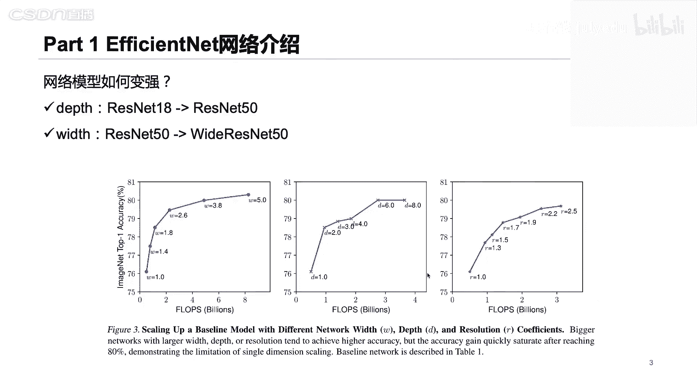

那么我们就看一下呢，这个地方我也写了一个代码，就是如何将我们的efficient，把它用在一个我们的手势识别的一个案例里面。

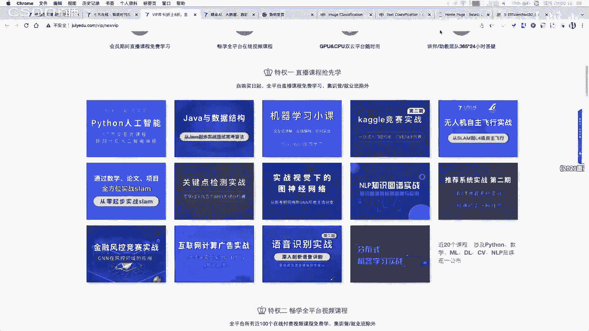

这个地方呢我们就是就这样一个案例啊，非常基础的一个手势分类的一个案例，就是说我们的手部姿态的啊，是不是带的这个地方呢，我们的一个数据集分别是对我们的一个就是说手部啊做了一个拍照。

有我们的一个就是说12345的这种姿态啊，或者说他还有这种嗯大拇指啊，以及我们朝向的一些呃，就是说这种类别啊总共是分十类啊，总共是分十类好，那么我们就看一看。

就是我如果用efficienness完成我们的这个案例，我们来怎么做，我们来看一下这个代码，也是用我们的一个嗯care是写的啊，你用care是写的好。

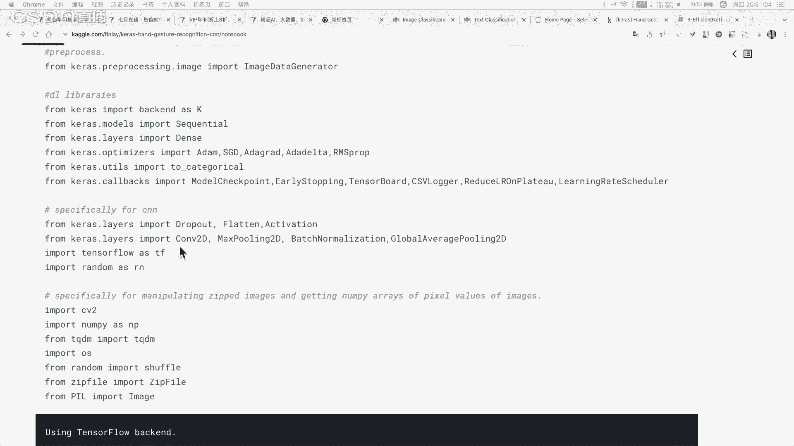

我们首先呢就是说读取我们的模型，我们的模型呢基本上按照分我们的一个实例分十类好。

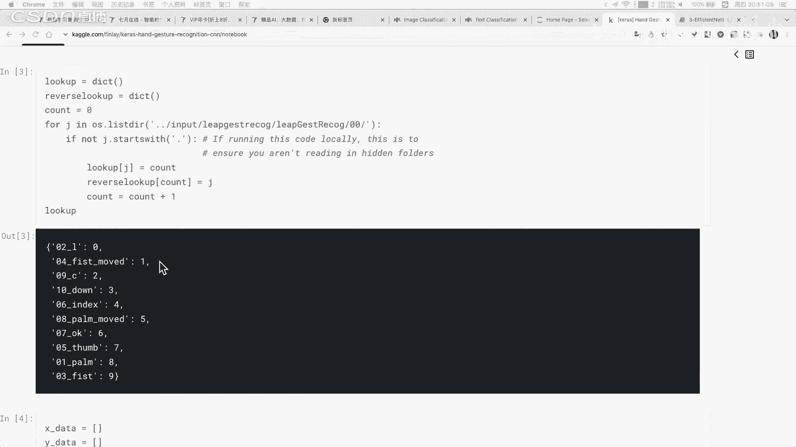

然后接下来呢我们就需要读取我们的数据集，这个地方呢我们的处理集其实是非常小的啊，其实我们的数据集只有几百兆，所以说呢我们这个地方呢是将我们的一个数据集，是直接读到我们内存里面，直接读到我们内存里面。

当然这个地方我们在读取数据集的时候呢，也有一些其他的方法，比如就是说这个代码是直接把数据集全部读到内存里面，当然你也可以在边训练的时候呢，边读取编训练的时候边读取，这个都是可以的。

然后呢接下来对我们的数据集做一些可视化，这些都是我们的可视化的结果啊，都是我们的可视化的结果好，然后接下来我们做什么呢，我们需要把我们的一个标签。

把它作为一个具体的一个就是one hot表现作为one后，然后接下来呢我们对我们的数据集把它拆分成我们的一个训练部分，和我们的验证部分好，那么有同学可能就会说，老师我们在定义这个网络模型的时候。

能不能自己去做我们的一个网络结构的一个读定义呢，其实这个地方是可以的，你可以自己去定义我们的网络结构嗯，可以可以共享代码吗，可以的呃，大家待会可以加一下我们的杨老师的一个微信啊，加一下我们杨老师的微信。

杨老师呢就是会将我们的代码以及所有的资料都会发给大家啊，对比如说不管你中没中奖啊，都是可以加一下我们的杨老师，对特别是中奖的同学一定要加一下我们杨老师东西好，在定义网络结构的时候呢。

你可以尝试自己去定义这个卷积神经网络，你可以自己去定义，当然你自己定义的肯定没有，就是说通过这种efficienage搜索他得到的网址不好，所以说呢在这个网络结构的过程中呢，你也扛可以尝试。

就是说直接读取我们的efficient与英语好的这个网络模型，这个网络模型呢就是说你可以直接去修改一下它的一个，就是说就是说这种类别个数啊，就可以完成我们读取我们这种网络模型好。

然后接下来呢就是定义一下我们的一个在训练过程中，我们的一个模型保存的一些参数，比如说我们是不是要做art stop，以及我们去是是不是需要打印我们的日志，这些都可以来做一个具体的一个设置。

然后接下来直接做我们的一个fate就行了，直接做一个废纸这个地方，那我们就直接对我们的数据集呢将它直接做一个compare，这个compare呢就是说我们设置一下，我们最终的一个训练的一个损失是什么。

以及我们最终的一个就是说评价函数是什么，然后接下来就完成一个训练即可，接下来完成一个训练即可好，所以说这个代码其实也是非常简单，非常简单，就可以做一个我们的一个就是手部的一个姿态的一个识别，当然了。

如果有同学想如说想要做一些比较更加复杂的，比如我们在一个呃就是我打开一个视频啊，打开视频，假如说你想要做这种的呢，这种跟我们刚才所讲的一个例子其实是存在差异的啊，这种的一个手部姿态呢。

你会发现它在具体的一个识别我们的一个姿态的时候呢，它不仅仅是识别的类别啊，我们暂停一下啊，你会发现这个地方是有一些点的，是有些点的这个地方它是识别得到我们的一个手部的关键点，手部的关键点。

这个关键点呢你可以看到它其实是我们的一些骨骼关键点。

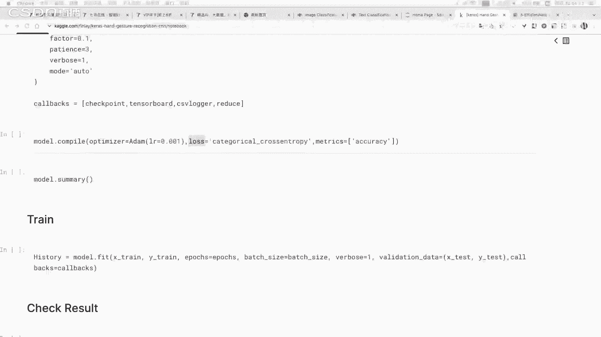

谷歌关键点，谷歌关键点，所以说呢这个地方我们的一个关键点呢看不到吗。

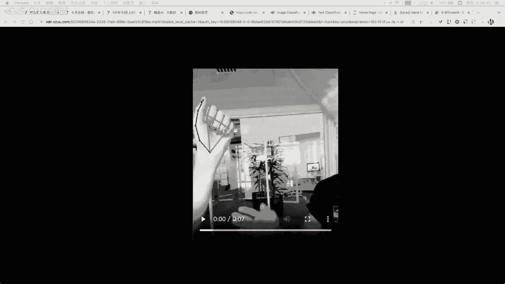

现在你刷新一下，应该是可以看到的，刚才可能卡了一下，还能卡了一下，好这个地方呢我们的你可以看到这些点，这有一个黑点啊，现在可以了啊，现在可以了嗯，对有延迟好，稍等大家一下，好这个地方呢。

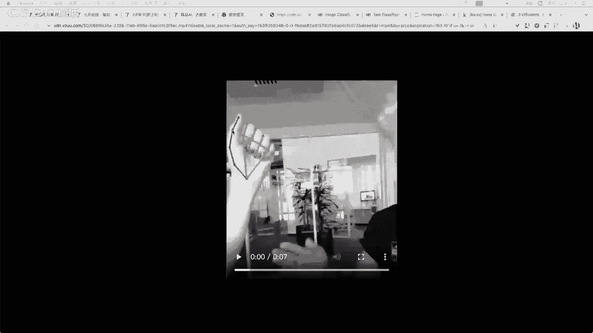

它的一个模型就是比我们的一个就是刚才所定义的一个模型，会更加强大一些对吧，它其实是识识别到我们的一个指尖，我们的每一个骨骼的一些关键点，所以说呢这个任务其实并不并不能直接从我们的一个分类模型得到。

它其实是需要从我们这个关键点识别得到的，需要从我们的关键点模型得到的，所以说呢刚才在我们的直播之前，有同学问的，就是说这种股我们的一个手部的这种这个手势识别手术视频呢，现在他主要的一些网络呢。

仍然是就是说从我们的一个姿态估计的一些模型，就是人体姿态估计人体骨骼关键点的一些模型得到的，仍然是基于就是以这种关键点识别的网络型得到好，那么如果各位同学想学习，就是说这种基于谷歌关键点的这些模型呢。

或者这些案例呢也都是可以基于我们李飞现在模型展开的好，我们继续，那么在定义对网络模型的时候呢，有同学就是他他可能就会到的是，我假如说想要自己去看一看这个efficienge，它的一个网络结构行不行。

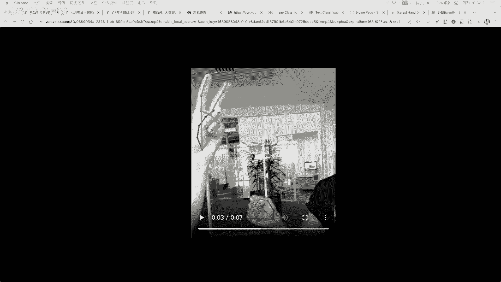

嗯这个当然是可以的，这个当然是可以的，就是如果你想要去看一下他的网络结构到底是怎么定义的呢，你可以去在我们的一个turn flow，它的官网探索它的官网啊，官方的有github，有infe。

现在这个具体的一个模型的实现，以及它的一些代码，如果你想要看一看它原始的代码实现啊，open pos工业上用的多吗，嗯这个看具体一些任务啊，open boss其实是蛮好的，还可以做这种人体原理检测啊。

关键点识别啊，以及我们的手势识别都是可以的，对ben boss他能够做的东西很多，但是现在呢工业上还是需要对这些模型做一个需要做一些部署吧，然后怎么说呢，看他有没有具体的一些部署的。

这种比较适合部署的工具以及部署的模型，就是比较轻量级的模型，它是不是有，如果是有比较轻量级的模式呢，可能是比较好的，对，据我了解就是如果是人脸方面，人脸关键点检测啊，open boss用到的不多。

如果是这种骨骼关键点识别了，open boss是有比较大的一个场景的好，那么我们接下来的时间呢就是给各位同学介绍一下。

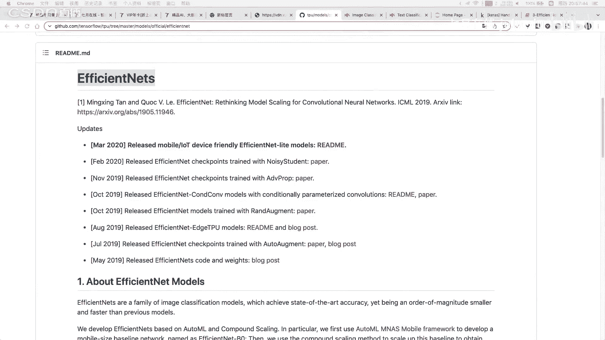

我们在7月带线的一门课程叫做机器学习机器人，这个课程呢也是嗯，我看他有些加的代码，这个我看一下open boss。

ben boss，不管他是不是有c加加的这个地方就是我们的一个机器学习的模型，它基于python也可以把它导出为c加加。

对这个open boss也是做刚才这位同学说的open boss也是做这种关键点检测的啊，特别的是做我们的一个人体姿态的5g的on those，不管他到底是不是这一业家呢。

都是可以把它导出导导出我们才是二进制的，python都可以导出啊，利用一些工具都可以导出的啊。

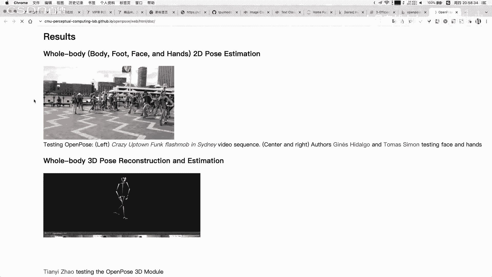

所以这个不是问题，这个不是问题，好我们接下来呢给各位同学介绍一下，我们在契约在线开设的一门课程，叫做我们的一个机器人机器人。

我们的一个机器学习及姓名呢是涵盖了我们今天所讲的一些课程啊，而且呢我们的机器学习及姓名的一个具体的一些知识点呢，以及我们的大纲呢其实是非常干货的。

而我们将会从我们的一个python以及我们的基础的matt pol，那我们派出发逐步的讲解到我们的积极性原理和实战，也会讲解到我们的一个具体的一个深度学习，好这个深度学习的这一部分呢。

也会讲解到我们的网络模型的设计，以及我们的深度学习在我们的一个图像和文本上面的一些具体的应用，当然了，我们的一个机器机器人也会讲到一些具体的项目，比如我们如何用我们的余生的学习完成我们的社交性检测。

如何让我们的深度学习搭建一个文本的，一个就是说机器人这些呢都在我们的集训营里面都是有有讲到的啊，是基于这种实战的，比如说我们来看一看这种我们的一个项目支援项目，这些呢都是有一些就都是基于我们的深度学习。

和我们自己学习模型来展开的，而且都是有一些具体的一些企业落地的一些需求的，所以说呢如果各位同学想报名我们的一个机器学习机器人的同学呢，都可以在我们的就是说加一下我们的杨老师的微信啊。

加一下我们杨老师的微信，然后了解，而且呢今天晚上通过我们的直播间报名的同学呢都可以有价格优惠啊。

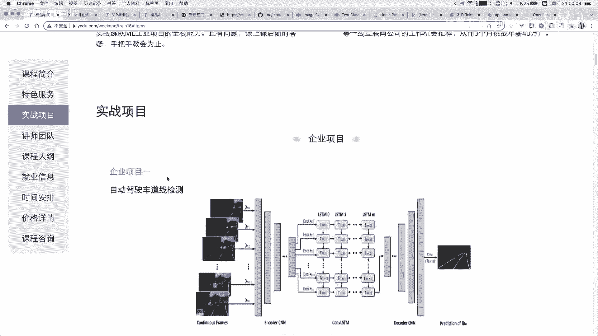

至少是优惠1000元，至少是优惠1000元，所以说呢各位同学如果是想要跟我们一起继续学习我们的机器人呢，或者说学习我们机器学习啊，都是可以来了解或者报名的啊，而且呢就是说如果你想要学习其他的课程。

因为我们的机器人呢就是说如果你报名之后呢，是直接送我们的一个vip嗯，年度vip的卡的，而且也是送我们的大数据继续赢和深度学习机械赢了，就说这些坑呢，就是如果你自己去买呢，肯定是要花很多钱的。

如果你直接报名我们运营的，这些都是有送的，而且呢它也是送我们的很多的基础课。

比如我们刚才给大家这个地方，就是vip里面的一些基础课。

在我们的集训里面都是送的啊，都是送的好，大家如果想要报名我们的集训营的同学呢，都是可以来。

就是说加一下加一下我们杨老师的微信啊，然后了解一下，好好大家对我们的这个今天所讲的一个内容，以及我们的一个课程介绍的课程有问题吗，如果有问题的同学呢，也可以在我们的一个评论区，然后打字和我沟通好。

好大家对我们的机械原因有什么问题吗。

或者说对我们今天所讲的内容有什么问题吗，好大家对我们今天所讲的课程有什么问题吗，对啊杨大侠说一次都没有啊，你直接加一下我们杨老师的微信，直接和他说吧，也就是说你抽了三次都没抽中，对。

让杨哥是送你一个对集训营是零基础也可以学吗，就是呃我们建议是有python的基础会比较好，因为我们讲的课程呢仍然是在这个预习阶段是有就是说python的，当然呢就是说如果你有基础的话，会学的更快。

对你有基础上会学的重要，我们是建议有python基础就可以学啊，建议有python基础题可以学，而且呢我们的机器人其实是可以做。

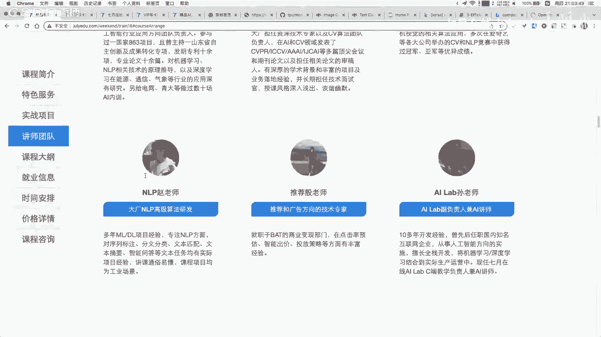

我们的一个就是说有有很多项目啊，都可以带着大家进行学习啊，对，我们今天报名我们的集训营呢是直接优惠我们的一个1000元的优惠，我们的1000元的对，而且我们的一个具体机型也都是。

就是说能够把很多参与我们集训的同学，都是能够找到一些比较好的一个offer的啊。

比较好的一个offer的对，所以说大家如果想要报名我们的集训营的同学呢，是可以就是说早点报名啊，早点报名，感兴趣感兴趣的同学们稍后再报名好，而且我们的机器人呢。

机器人呢很多同学都是就是说如果是嗯在我们的学习，那么有一个什么问题啊，都是由我们的很多的老师可以进行答疑的，不管你学习问题还是就业问题，都是可以来进行给大家进行辅导的，对有python基础是指什么基础。

就是说你用python能够写一些基础的代码，这个就是啊用python写一些基础的代码，这个基础是的啊，对大家对我们的课程以及对我们刚才给大家介绍的这个efficienage，这部分有什么问题吗。

对这个其实知识点其实很简单啊，如果你看不懂他的知识点的话，对有什么问题吗，怎么大家顶着我们的一个vip之后就不说话了呢，这个这样不好呀，对大家就是我们今天所讲的课程有什么问题吗，还没有领啊。

你加一下我们的杨老师的微信啊，呃学到很多啊，谢谢谢谢，嗯还没有领，问题就是什么大家多提一些问题啊，因为呃就是说给大家沟通的机会也不是很多，对大家多提一些问题，咳这个手势识别还有哪些方面可以做。

嗯我个人觉得这个你是你是想要说应用啊，还是说他的模型吗，如果是手势这种识别的应用呢，这个地方我们的一个呃vision transformer啊。

vision transformer我们在课程里面是在我们集训营里面是没有讲的，但是在我们的小课，就是说我们在之前的直播里面是讲过transformer，和这个a v i t模型的对。

呃手势识别如果是应用的话呢，其实主要是在我们的比如说这种手语识别，或者说我们在做一个具体的一个这个门禁里面，或者说这种具体的一些就说安防领域啊，其实都是有些应用的，但是如果你说模型而言。

模型其实现在呢我个人感觉还是拼这个标注数就会比较多，因为现在工业上啊，其实他在部署这个模型或者训练模型的时候，他不会用很复杂的模型，它肯定会考虑到我们的一个具体的一个预测速度啊，它的nancy等等的。

所以说呢它的一个模型不会用很复杂，嗯，嗯好老师，平时用到的一个手势识别的模型到底用哪些，这个道理就是说can就是说我们到底是直接做一个分类，还是做一个我们的一个就是说基于这种关键点的。

如果是基于这种关键点的，就比较建议用这个模型对，比较建议用谷歌的这个middle pie啊，middle pie这个它是支持二进制部署的。

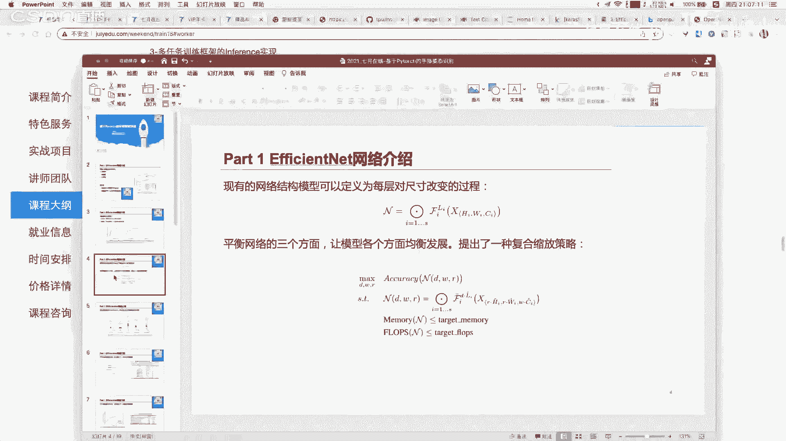

对就单纯的手势识别提高识别准确率。

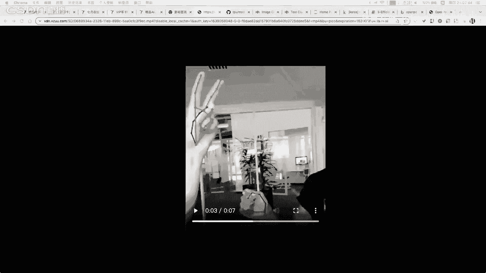

如果是单纯的手势识别提高啊，就是模型的一个准确点的话，我建议你去看，可以看基于这种internet internet来做也是可以的嗯，ser那次做也是可以的，感觉网络结构的设计很重要。

好的结果需要很多线性知识设计呃，为什么需要线线知识呢，因为现任知识可以减小我们的一个搜索空间，对新建知识能够减少我们的搜索空间。

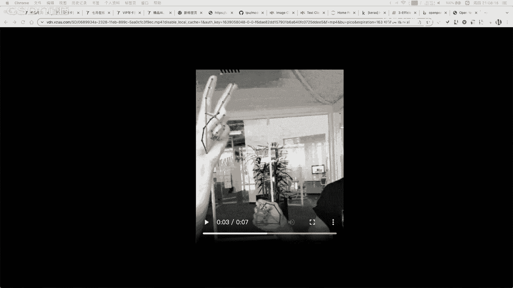

所以说先验知识很重要，对呃有同学问到这个部分，这个部分可谓方法边节点之类的，可以用g n的一个优化优化搜索吗，嗯这个怎么说呢，你是把它想做视为一种图来做对吧，应该是有一些论文的，但是我暂时没有看到啊。

我在上面可能应该是有的，应该是有的，你是想把这个我们的节点与节点它的关系中基的基因建模对吧，应该也有，但是它整体的一个过程，其实我感觉就是和我们的一个这种口味的方法是差不多的，口味的方法是差不多的。

因为这个口味的方法其实本质就是将所有的结构啊都把它遍历一遍，然后从里面选择最合适最合适的啊，通过这个梯度的计算得到的嗯，前面的节点不同的连接，相当于是对结构优化结构定的在训练参数嗯，其实是这样的。

其实是这样的啊，automa啊，它在搜索的过程中呢，可以就是说对我们的一个网络结构去进行搜索，也可以不对我们的网络结构搜索就是搜索网络的一些超参数，这个都可以做，这个都可以做。

那么efficiennet呢它并不是基于我们这种可微搜索得到的，它并不是基于可谓搜索创造的，它其实在搜索的过程中呢，最重要的是在我们的一个网络的一个深度，宽度以及分辨率这三者的过程中做了一个搜索。

所以他并不是完完全全是基于可微做的，而不是做口碑做的，对就是说其实它是用到了这种网络搜索的这种思想，但并不是用口碑做的，大家还有问题吗，嗯好，那么大家如果想要领取我们今天的ppt代码以及数据的话。

都可以加一下我们杨老师的微信，对，如果大家想要就是领取我们的月卡。

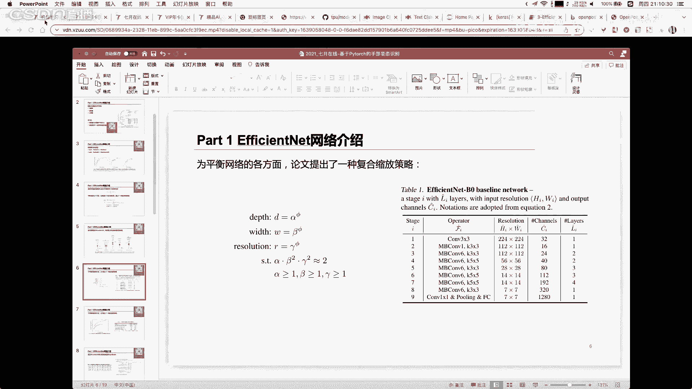

以及了解我们继续学以及姓名的同学呢，也可以咨询一下我们的严老师，咨询一下我们的杨老师好，我们有录播的，如果想要看录播的，或者说你现在卡想看录播的呢，也可以加一下我们老师呃，automa好难啊。

其实是这样的，我刚才在ppt里面这个地方也写了一些应用领域啊，你可以关注一下，这个地方的应用领域，我个人感觉比较就是说有工业落地的啊，就是说中小型公司都能用上的，可能是这个我们的一个自动的特征生成。

这一部分是我们的中小型公司都能用的，因为搜索这个网络的话呢，可能是只有谷歌或者说阿里或者说这种facebook，可能他们玩的起来，但是如果是这种中小型的一些企业，其实也是可以用自动特征工程来做的。

因为这些自动控制特征工程的一些方法其实也是有落地的啊，不管是在tr这些任务上面，还是在其他任务上面，好大家还有问题吗，如果没有问题，我们今天的直播就结束，大家想领取我们的ppt以及我们的代码的话。

都可以加一下我们的杨老师，好的好好，大家没有问题的话，请扣个一好不好，我们再看一看还有多少同学还在，那么我们就结束我们的一个今天的直播，好，好谢谢大家，谢谢大家，好。

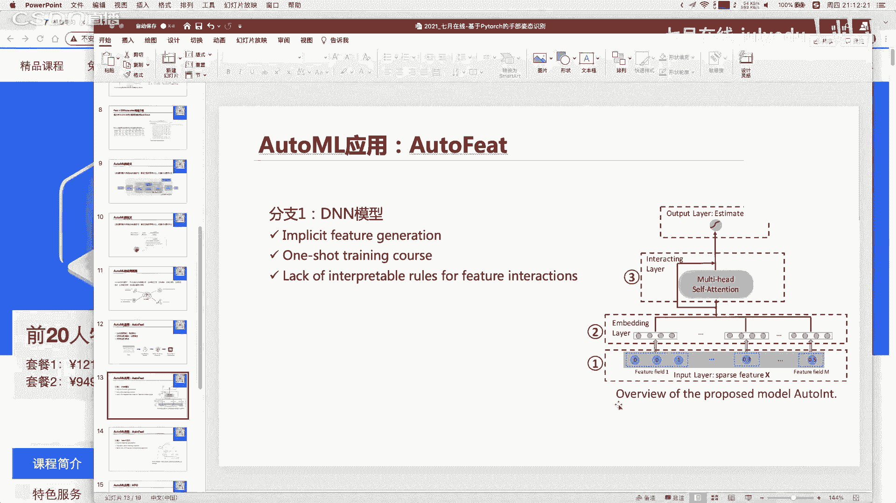

