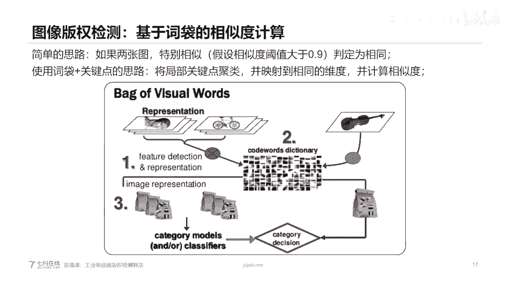
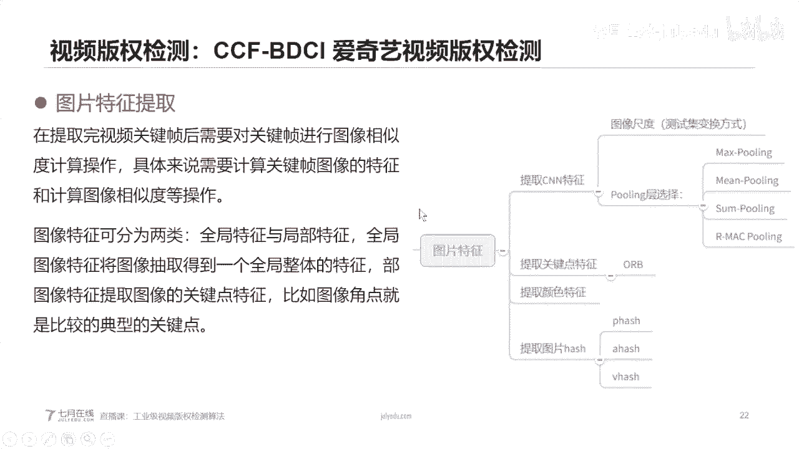

# 人工智能—计算机视觉CV公开课（七月在线出品） - P2：工业级的视频版权检测算法 - 七月在线-julyedu - BV17z4y167dq

。

Yeah。好的，看来我们的呃视频和声音都是OK的。那么我们就呃差不多可以开始了。我们今天呢其实是呃企业在线举办的一次呃技术直播课，对吧？它其实我呃找到我讲的，其实这个内容是工业级视频版分解决的算法。

这个主题呢可能呃呃就是说呃之前大家在呃企业在线啊在我们机构上的一些课不太一样。就是这个讲解的是其实是一个解决方案，是一个比较就是特定场景的一个解决方案。对，那么我们在这个在这个一个小时的直播课程中呢。

我想给大家讲的是一个完整的一个解决的一个方案。它不是一个简单的一个例子。

那么我们今天的一个课程总共分为这五大部分的。第一个我们首先来定义一下视频版权任务的一个就是它到底这个问题到底是呃需要解决什么问题，以及它到底是要去做什么事。第二个呢，我们就是说讲一些基础知识。

主要是讲图像特征以第以这个图像局部特征以及图像全局特征两种特征，就是说给大家讲解一下，第三个呢就是讲图像版权解测算法。那么我们在讲完图像特征之后呢，其实我想给大家延伸一下，就讲一下呃图像版权检测算法。

就是两给定两张图片，然后判断它是不是相似的，对吧？那么为什么要讲图像版权解测算法呢？其实这其实为后面第四部分做铺垫的，就是我们第四部分讲的是视频版权解测算法，对吧？我们这个呃地方呢。

我主要是以视频这个呃多媒体的。呃，除音频部分的来做一个版权检测。就是说我们在做版权检测的时候是不考虑音频的。所以说在做视频版权的时候呢，其实是可以把这个视频版权的问题。

把它抽象成一个呃多帧的图像版权的一个检测，对吧？那么我们在第四部分也会讲到视频版权的解释方法。那么第五部分呢，我们会扩展讲一下图像检索和视频检索。我们今天的课程的内容总共应该是在50分钟到1个小时左右。

那么我们在课程中讲解的过程中呢，如果大家有疑问呢，可以直接在我们的呃聊天讨论框哦进行互动。

那么我们首先来看第一部分这个视频版权检测。我们首先来定一下视频版权检测这个任务是什么，以及它要解决什么问题。

呃，视频版的检色呢，它这个是就是说一定背景的，就是视频版的检色学学术名称叫video duplicatelic text。它是随着互联网嗯就是说移动互联网的发展和智能手机的普及。

短视频已经成为重要的信息传媒媒介，也给也带来了大量对版权视频的一个侵权行为。那么这个在这个其实写的是一个短视频。那么其实这个地方侵权的视频不一定是短视频，有可能是长视频，对吧？这个它就是有一个。

这个短视频对这长视频进行一个侵权。那么他这个侵权的行为一般是包括这个包括相同的视频画面，或者说包括相同的视频片段，或者说包括相同的视频的声音。对，那么这个地方呢我主要是给大家讲。

从视觉角度来解决这个版权检测的。那么我们就不讲这个音频的部分。那么我们这个。需要我们做的这个就是呃本本版田讲一下这个任务背景就是说为了保护视频公司和原创者的收益，需要自动化的对。

针对短视频的侵权进行检测来嗯这个侵权的视频可能经过多种符合变化。那么大家如果嗯在自己玩抖音或者说玩B站的时候呢，其实大家在上传这个自己作品的时候呢。其实后台也在进行了一个版权检测，对吧？

那其实假如说你上传的一个视频是呃和其他上传的一个视频是呃比较重复的，或者说是直接从某一段视频进行摘取得到的。它有可能是提示你。对，那么这个地方呢，我们怎么把它抽象一下，就是我们待检测的一个短视频。

我们把它叫做query。然后我们是有一个视频库，然后每个视频库里面呢有很多refer的视频。那么我们想要找到就是说定义这个问题，就是针对我们一个query的一个短视频。

我们是不是在视频库里面能够找到一个它可能侵权的一个长视频。那么其实侵权的视频它不不仅仅嗯是直接的这个呃把它裁剪，它可能还有很多的一些变化。比如说我插入一个模板。

比如说对这个视频做一个插入一些文字插入这个logo插入水印或者小动画，还可以对这个视频进行一个降至，比如说嗯模糊啊，丢帧啊对比度啊，分辨率啊，这些都是一个操作，还可以做一个裁剪，对吧？

我们把它这个边框进行裁剪，还可以做一个混剪，就是把视频把它做一个拼接，还可以做一些画中画，刚板变换速度变换的，还可以做一些综合变化，对吧？那么这都是呃就是说视频版分检测的一个难点。

就是我们侵权的一些视频，它往往和我们原始的视频都是呃有一定的变化，它不一定是完全一样的。那么这个地方呢我列举的是现有的一些学术的数据集。比如最开始的CC web video。

一直到最后的这个SVD这个是呃抖音的一个短视频的一个数据集。就是现在的呃视频百年年的还是一个比较活跃的学术任务。对，如果大家想就是说发论文，这这是这个里面发论文呢还是呃就是说有一定的工作可以做。

因为这个呃抖音的这个SVD这个呃数据集呢，应该是2019年呃下下旬就是说下半年才出来的。所以如果大家感兴趣呢话，可以去刷一刷这个数据。那么大家可以看到，就是说这所有的版权检测的一些学术数据级呢。

都是由query video，就是说待检索的一个。短视频或者待机上的视频和一些视频库里面的一些视频，对吧？它这个呃学术数据集呢会针对你这个queed radio嗯，就是说标它到底是有跟他呃匹配上的。

就是说是相同内容的一个呃refer里面的短refer你面视频，还有一些就是说这个正样本就是说和queed能够匹配上的一个视频negative pair呢就是副样本。

就是说跟这个queed radio匹配不上的个是对吧？然后还有一些其他的一些统一信息对。那么我这个地方呢大家可以很直观的感受一下，这个应该是呃从这个VCDBVCDB这个数据集来给大家举了一个例子。

就是其实呃右边的呢这个就是我们carry的就是说侵权的一个。画面，那么左边呢就是我们原始视频库里面对吧？大家可以看到，其实这个侵权的一个呃视频的每一帧，它可能是经过一个复杂变换的对吧？

有可能是呃截取模糊，还有一些翻转，对吧？还有一些加了字幕，对吧？所以说呃其实视频版权它是一个非常复杂的，它并不是一个很单纯的一个呃图像检索。那么呃这个这个页呢，其实讲解的是这个呃。

SVD就是抖音这个数据集，其实抖音这个数据集呢和上面这个呃数据集就是说SSCVCDB这个视频版权检索的数据集不太一样，对吧？那么这个地方大家看到就VCDB这个数据集里面，画面基本上是相同的。

我们就可以判定判断这两个视频是呃一也就是说完全是侵权的对吧？但是在这个抖音这个场景，比如说抖音短视频对吧？这个场景下面其实不是这样的，大家可以看到，就是说呃。这个query的一个视频和这个。

就是说和他一个正样本的一个视频，就是说这个是和它完全一模一样的。就是说匹配上的refer视频是就是说这两个是就是匹配上的对吧？那么其实还有一些。很复杂的场景。比如说这个cur视频，它有可能是呃。

多种多样的对吧？有可能在我们抖音的短视频短视频里面，它还可以自动加一个黑边，对吧？那么这个地方这是一个正理，就是说我们que视频可以找到一些和reque视频对应上的refer的视频，对吧？

那么还有一些反利。比如说我们这个que视频，它找到的有可能是找到这种也是撒渔网的对吧？这quere视频是个撒鱼网的动作。但是这个找出来的是一个它的反利，对吧？这两个视频，它并不是一个。哦。

就是说侵权的对。对，那么这种找出来的就是它这个反应。对，所以说在呃抖音这个短视频这个呃视频版权检测的这个数据器里面，它是更加复杂的。因为我们这个呃移动自媒体上面的一些呃短视频呢，它是多种多样的。

而且就是说每个用户他在上传这个短视频呢有一定的模模仿的一个行为。比如说这个扎头发的对吧？即使是扎都是扎头发一样的动作。但是他扎扎的这个头发的，就是说样式不一样。

所以说呃你很有可能就是说让你的剪索模型判断错误。所以说视频版权检测呢是一个比较复杂的一个任务，而且是一个就是说嗯还是在发展的一个学术任务吧，学术方向。

那么我们这个其实我们这个呃赛题呢不是这个赛题，就是我们这个讲解的一个内容呢，其其实是以我去年参加了1个CCFBDCI上面的一个爱奇艺视频版身检测这个比赛来给大家讲解。

因为我们要讲解一个具体的呃一个就是解决流程。那么这个解集流程应该是具体到一个特定的一个数据集上的。那么我们这个地方呢，我们刚才也给大家花了一两分钟讲解抖音这个场景，对吧？抖音它其实是用户短视频。

那么在这个下面这个地方呢，其实是一个。

爱奇艺这个呃应该是一个综艺，对吧？综艺类型的一个视频网站。那么。大家可以看到，就是说。待会可以给大家看一个案例啊，就是总以下面的一个版就是说侵权的视频可能不太一样。

那么这个比赛呢其实是在2019年下半年举办的CCF上面的一个比赛。嗯，那么这个比赛的任务就是根据cry的侵权视频，要在我们的视频库里面找到对应的refer视频，且对应他们的时间轴，这个是什么意思呢？

就是说根据我们的cur视频，要找到视频库里面refer的视频，且他们之间cur里面。这个时间段侵权的这个这个一个片的这个橙色部分要在refer视频里面的时间轴要对应上。

也就是说我们要确定query与re的关系，以及que视频里面的Q startq end以及refer视频里面的rs。对吧所以说这个载题可能是就是这个任务可能是更加具体的。

它不仅是要找到你que视频或rere视频的对应关系，而且要找到它们之间的时间轴的对应，对吧？然后呢，去年我也参加到过这个比赛，也是最终获得了第五名的成绩。那么我们首先给大家看一个案例啊。

就是说这个数语集这个比赛里面的一个案例。对，那么呃这右边呢这个小一点的视频呢，就是这个侵权的视频。这个就是呃大家可以看到就是说。这个侵权的视频它的尺寸比较小，这个原始的视频原始的视频应该也是正常比。

对它的是稍微清晰一点。而且这个侵权的视频，这个右边的这个视频它是。呃，就是说经过一定裁剪的对吧？这个边框对吧？大家可以看到这个边框适合这个原始的视频，就是说作为一定的裁剪，而且。

这个两个视频它们之间的水有一定的水印的差别，对吧？这个地方原始的视频加了一个爱奇艺的水印，右边的呢这个嗯侵权的视频呢，它是没有一个呃水印的，而且这个侵权视频它是。

从这个原始视频里面的某一个时间段开始的对，这个地方应该是11胖都是有原因的。而且刚才在采访的时候，人就说了，张妮说，甭管怎么样，我是个灵活的pa。重点一下有什么灵活？那么大家可以看到。

就是说这个赛题其实是比较难的。就是说你要对应好这个时间轴，我们来回到PPT。你就是要在Q视频里面，到底是从哪个地方，哪一个时间开始侵权的，你一定要对应上。

就是说你Q4大轴和QN以及RS大招RN的都要把它找对。啊，不好意思啊，把视频就那个视频声音稍微有点大，后续我们不会再看那个视频。对。

那么我们刚才讲解的。呃哦，不好意思，我就不不不放那个视频了，不放那个视频。哦，那么我们刚才其实讲解了那个赛题的任务，对吧？那么我们再来看一看一些基础知识，就是图像特征。

呃，那么如果大家对就是说计算机视觉或者说图像有一定了解的话呢，那么就是说也会知道就是说图像有两类特征。第一类是。图像的局部特征。第二类是图像的全局特征。嗯，局部特征呢就是图像内的关图像里面的关键点。

比如说图像的角点，它的一个嗯就是说极值点一些，比如说sft点嗯，就是说ORB这种关键点。那么关键点呢这种局部特征呢，它的个数是不固定的，也就是说它的一个。个数。

比如说是N这个N的个数呢可能是呃在不同的图像上面是不固定的。比如说在这个图像上是100个关键点。呃，在其他的呃图像上呢可能是呃就是说200个关键点，对吧？这是一个局部特征。

那么呃这个左边呢就是说这个是比如说这个原始的这个呃图像，我们提取这个的关键点呢？这个地方它这个关键点提其实提取到的这些就说比较突出的一些位置，比如说这个眼球鼻子对吧？

而且一些头发上面那么还有一类特征呢是图像的全局特征，图像的全局特征呢一般是图图像的整体的统计信息，或者说图像的整体的一些语特征，那么图像的全局特征和图像的局部特征有什么区别呢？

图像的局部特征它是维度的不固定的。比如说我们这个是提取到了N个关键点，那么每个关键点的维度是128维，那么我们总共提取到的一个局部特征的一个维度是N乘1128的一个取阵，那么如果是使用全局全局特征。

这个时候呢，假设我们的全局特征的维度是512维。那么我们这个地方图像的一个。全局特征就是1乘512的这个向量，对吧？那么右边呢是我们提取了这张图片的一个颜色直方图。

RGB的颜色直方图来进行一个就是说统计。那么就是说颜色直放图，它是直接统计的这个图像的一个RGB值，对吧？这个地方是RGB0到R5，对吧？每个像素每个像素值的一个统计的信息统计个数。呃。

那么其实在我们的其实在天性上面也有一些呃视觉的一些，比如说也有一个图像分类和图像检索的班。如果大家就是说感兴趣的话呢，可以去就是说深入呃学习一下。对我们在这个PPT里面呢，会只说只是给大家初步讲解一下。

那么我们再来看一个局部特征和全全局特征有对比啊呃那么局部特征它其实是关注特征的一个局部信息，比如说常见的re或者说ORB这种关键点。那么局部特征有什么优点呢？局部特征它有它是有一些优点的。

比如说局部特征，它其实关注的是图像的局部信息是这个局部信息是具有尺度不变性的。就是说我们不管是翻转，怎么翻转这个图片怎么旋转这个图片，它的这些关键点都是不受旋旋转图像的一些变化或者颜色变化的影响，对吧？

那么局部特征它是这个就是尺度不变性，就是说不管是你怎么变化，我都有一定的几率是呃这个关键点依然是关键点。那么局部特征它有什么优点，有什么缺点呢？局部特征它的缺点就是它提取的特征点的个数。

关键点的个数是不固定的，而且是很容易受到文字影响的，大家可以思考一下，为什么会受到文字影响。呃。就说文字啊，特别是我们这个数字图像上面的文字都是一些。它的边缘信息，比如说我们这个呃字体。

这就是说我们PPT上面这些文字，你如果用shift提这个关键点，它肯肯定会提到这个文字上面。因为文字一般都是边缘信息比较强的一些去域，它很容易都就是成为关键点。所以说在呃局部特征的时候呢。

它很容易受到这种文字影响，那么全局特征它和局部特征相比呢，它是关注特征的全一个图像的全局信息。比如说颜色直方图或者说图像在呃NN里面的 map，那么全局特征它有什么优点呢？全局特征。

它其实是关注图像的全局的信息，而且特征的维度是固定的对吧？那么不管是你的图像的大小是怎么样的，你只要把它resize到固定的尺寸。那么我们得到CN的特征都是。固定的对吧？

那么就是说全局特征它的维度是固定的，但是全局特征有什么缺点呢？全局特征其实它是对尺度是有一定敏敏感的。比如说我们这个图像，你把它旋转90度，你去提取到的特征就变了，对吧？虽然说在我们CNN里面。

其实你把它旋转90度，它仍然可以进行正确的分类，但是你把它旋转90度，你提取之后的特征是变的呃，大家可以设想一下，比如说我们有一个矩阵，你把它求一个。呃，就是说旋转一下怎么说呢？就是求一个点大T，对吧？

其实你把这个矩阵呃，应该叫transpo转制，对吧？你一个举阵把它转制之后，其实它的这个就变了，对吧？所以说这个全值特，它其实还是有一定缺点。就是说对这种图像的一个尺度变化。

特别对旋转的一些变化是嗯就是比较敏感。那么这就是这图像的两类特征。

那么我们刚才其实讲解的图像的全局特征和局部特征。那么我们接下来就看一下。我们假如我们知道了全局特征局部特征之后，我们再怎么把做一个图像版权检测算法。

呃，那么图像版权检测算法呢，其实就是判断两张图，两张图片是不是包含有相同的像素。那么图像版权检测，或者说叫呃imimage呃copyright detection或者叫image duplicatelic detection。

它其实是相似图像检索任务的延伸，它是以图像之间是否存在相似的像素区域为判定标准，就是说判断两个图片里面是不是有共同的像素的区域。但是图片版权检测其实是一个比较难的一个任务。这个地方我举了一个例子啊。

比如说这左边的是一只萨摩耶，右边是一只萨摩耶，对吧？大家就是说如果是用关键关键点来匹配呢，其实因为萨摩耶这种这种狗其实是长得都比较像的对吧？那么你如果用关键点匹配，其实。

就很容易把这种呃就是说它其实不是一张图片的一些呃，就是说呃呃怎么说呢？就是把它这两张图片就不把它匹配上了。那么其实这两张图片其实就是不是一张图片，或者说它不是一种感情点，就是说。不是一个版权。

就是说图像版权的一个案例，对吧？那么图像版权呢其实呃有很多种判定标准。比如说你是不是包括有相同的物体，是不是包括很多相同的像素，是不是包括很多可匹配的关键点，对吧？所以说嗯这个地方图像版权颜色。

我们是以常见的一些就是很通用的一个呃定义，就是说他们两张图片的相似度是不是很高。我们把它判定为图像的版权。嗯，就是说他们是不是相似的。

因为这个判定标准其实是和我们刚才这个大家如果还记得那个声音比较大的视频，就爱奇艺那个呃两个段视频的时候，其实大家可以就是说很清楚的就是说。我看到就是说这两假如说两个视频他们是。

重复的那么他们的画面一定是重复的对吧？那么我们就只需要关注这两个画就是说两个视频，他们的画面内容就是说他们的视频帧它的内容是不是相似的就够了。所以说在这个视频版权检测里面的任务过程中呢。

我们是可以把这个视频版权检测，把它抽象成每一帧就是每一帧画面是不是相似，或者说每一帧画面是不是就说重复，他们之间是不是有版权问题的。那么其实NRP它其实呃不不是就是图像检索。

它其实是一个基于图像内容检索的这种。但是图像检索它其实是比较难的。呃，因为图像比如说这个左边的蒙娜尼莎的一张一个画像，它其实它有很多种变换。比如说光照尺度视角遮挡背景，对吧？其实这个其实和我们。

呃，这个日常生活中的一些变变换，或者说在视频版权检测里面，我们刚才在PPT开头的那些呃图像变换都是比较类似的。而且图像检索它是一个基于内容检索，比如说我们右边的这个？其实这两张都是可能是同一张图，对吧？

但是假如这是一张图照相机拍的图，这是一个就是说无人机，或者说拍的这种视角变换的一个图。那么其实这种他们的内容是相似的，对吧？但是但是他们的画面的主体是不相似的，对吧？而且下面这张图。

比如说这两一个狗一个人，他们的就是说假设他们的外形比较相似，对吧？但是他们是就是说肯定不是一个就是说不是一张图片，对吧？所以说图像检索是一个非常难的一个任务。

而且是是需要基于图像内容进行一个检索的一个任务。那么如果大家对这个图像检索想要进行深入的了解的话呢。

可以去看这个现在是1块钱。这个对。1块钱这个课因这个课其实讲的其实非常嗯清晰啊，他会把这个卷积层的一些操作啊，以及卷积层呃，就是说怎么提特征啊，然后最终讲了一些还讲了一个局部特征的一个案例。

就是说s加磁带的一个模型。对。我们再继续。我们刚才其实讲到的呃，图像检索是一个它是基于图像内容的一个检索的任务。那么图像检索还是什么？它其实也可以称为一个算法，对吧？但是图像检索还是也是一个工程的问题。

那么这个地方呢，我是截取了图像检索的一个流程，对吧？比如说。我们这个地方呢，我们有一张查询的图像，我们怎么通过图像检索的系统来判断这个系统，就是说图像库里面有没有和它相似的图像呢？

那其实是有一定的流程的。我们首先要把这个。待查清的图像，机器应该预处理。我们然后进行一个特征的提取。比如说我们提取这个CN特征，或者提取这个颜色直放图的特征。提取完之后呢，然后。放在这儿。

然后我们也把图像，我们现有图像库里面的图像依次做一个预处以后特征提取，然后把我们待查清图像的特征和我们图像库里面特征进行一个相似度比对，对吧？然后进行一个相似度的一个检索。最终或者通通过一个索引。

或者是说是一个二次重排，最终得到一个检索结果。所以说图像检索，它其实是一个算法，也但是也是一个工程上的问题。视嗯图片版权简论呢，我们这个地方给大家讲，就是说举个例子，就是说很简单的就是说。

基于一个磁带的一个思路，就是b words。那么如果大家在个NRP对NRP比较熟悉呢，那么b words其实最早出现在NRP里面，对吧？那么磁带的模型呢。

就是说假这个呃假如说如果用磁带的方法来判断两个图片是不是嗯相同的，那么比就是说这样的做的，如果两张图是相同的。那么它们之间的相似度肯定是大于0。9的，或者说很高接近于一对吧？假如说两张图它是相同的。

那么它们之间相似值肯定是大于0。9。那么我们反过来就是说如果两张图它们的相似度是大于0。9的。那么我们是不是可以判断它们是相同的图像。对吧那么磁带呢其实是这样一个思路。呃。

那么我们刚才其实给大家讲了讲解了一个图像的局部特征。那么局部特征呢，其实它是呃我们可以回到这个，就是图像的局部特征，它可以做一个一一映射，对吧？假如说这两个狗的。

就是两个萨摩耶的一个关键点可以进行一个匹配，对吧？那么我们假如说这个匹配点的个数是大于，比如说有很多点是匹配上的，那么我们就可以认定这两个图，他们是有很多局部特征是被匹配上的，对吧？

我们他们的局部的的关键点，如果能匹配，就是说呃能匹配上50个，能匹配上100个，那么我们就认为这两图是一样的，对吧？那么类似的我们也可以用在这个呃图像版权检测上，就是说假如两张图它们之间的。

关键你能能够匹配。就是匹配的个数非常多。那么我们就认为他们是有相似的。那么但是就是说呃如果直接让两张图一一进行关键点匹配，是非常耗时耗耗力的一个过程。一个比较简单的方法就是先将我们的关键点进行一个聚类。

然后把关键点映射到相同的维度。那么就是呃这个其实就一个磁带的思路。首先把我们的图片呢提取一个局部特征。局部特征之后呢，然后进行对关键点进行一个聚类。进行了聚类之后呢。

然后把所有的关键点映射到我们磁带的模型之后，然后进行一个相似的计算。那么磁带呢它呃就是一个把我们。所有的局部特征映射到相同的维度。对，那么这个也是在嗯图像版权检测里面是比较基础的一个思路。

那么刚才我们花了很长时间讲解图像版权检测的一个流程。那么我们接下来给大家讲一讲，就是说视频版权检测的一个算法，对吧？

那么我们再回到回到这个CCF这个赛题上面，这个比赛上面CCF爱奇艺视频版去年它这个赛题，它这个赛题想它的载题背景就是考察经过复合变换的短视频。关联到长视频的算法的效果。其中不仅要找到短视频对应的长视频。

而且要计算出对应的时间段。也就是说，根据我们的queary短视频，要找到原始的长视频refer，而且要计算出他们的时间对应关系，也就是要找到que视频的Q start和QN以及rs RN，对吧？

那么在这个赛题过程中呢，其实要包括要做以下这个几步。首先因为我们原始的一个数据是。一个呃视频的数据。那么我们在这做的过程中呢，首先要对这个视频进行一个，可能要把它进行一个抽帧。

就是把那个视频把它变成一个图片。第二个呢。我们需要对这个图视频做一个特征计算，或者说对这个视频帧来做一个特嗯特征计算。而且我也可以提取一些指纹。比如说这个皮哈西，对吧？

还有一个呢就是这个赛题它考察了视频相似检索或者相关算法以及技术方案。而且在这个赛题的过程中呢，其实它呃考察了这个算法的精度，也考也也需要考察这个算法的一个并并发和实施的能力。所以说这个赛题。

其实是比较偏向于呃工业的一个呃赛题。那么我在参加完这个赛题之后呢，也将这个呃我们今天讲解的这个思路呢也顺利呃就是说在我们公司的一个数据集上，公司的业务上顺利就是说呃呃上线的。

所以说这个在工业界上的一些视频版权检测呢，就是说也是按照我们今天讲解的一个思路完成的。那么我们再回过头来，就是说再把我们呃就是说下一期的一个任务给大家重复一遍，就是说。好，嗯。

我们赛题任务就是根据我们的queer短视频找到对应的refer长视频，而且要找到queer视频中Q star和Q and对应。到refer视频里面的rsstarRN，对吧？

那么这个地方其实是一个视频对应关系，以及时间轴对应关系，对吧？那么我们可以把这个赛题任务分成两个子任务。第一个任务呢就是视频对应关系，就是我们需要根据queer视频找到对应的refer视频。

这个任务呢就是一个视频检索的一个任务，对吧？如果大家就是有图像检索的一个呃背景之个，其实视频检索就比较。简单的对吧？直是直接把它抽帧，然后把它转换成一个图像检索的任务就够了。

第二个任务呢可能就稍微复杂一点，就是你需要对应时间轴，就是你。要使用Qstar的和QN的。或者说你要计算出QstarQN的以及rsstar R这四个时间。这四个时间其实是你需要计算的。

就是说通过一定的关系或者说计算得出来。所以并没有就是说一些先验知识。这是两个子任务。第一个是视频的搜索或者视频的对应任务。第二个任务是视频时间轴对应任务。那么我第一个这个两个任务呢。

就可以把它分开解决是吧？分成两个子任务。呃，在这个解决这两个子任务之前，我们首先要做什么工作呢？我们首先要做一个视频抽帧。对嗯。那么什么是视频抽帧呢？我们如果大家如如果大家对这个视频有一定了解的话呢。

可能对这个。图视频帧这个帧这个概念不会陌生。其实视频帧是一个比较基础的概念。比如说我们任何一个视频，比如说我们在B站看一个视频，它是这个视频可以看成很多画面。就是说拼接到一起的一个效果，对吧？

比如说这个视频是呃每秒是60FPS就是表示这个视频每秒是60帧的。那么我们这个赛季任务第一个任务是视频检索的任务，视频对应关系。那么我们就是首先要抽帧，对吧？你如果不抽帧的话。

你很难就是说把这个任务使用图像检索的方法进去。而且你如果视频不抽帧的话，你呃就是说。有些关键信息你是找不到的。那么我们接下来也会讲解一下怎么抽帧。那么你抽帧的话。

就是把一个视频原始的文件把它抽成不同的不定数量的一个。图像文件，那么这个地方就需要遇到一个问题，就是我抽什么针以及怎么抽帧。那么其实视频的帧其实是有一定的嗯。规律的或者说有一定压缩算法在里面。

那么视频的帧它总共可以分为三类I帧P帧和B帧以。那么I这个是视频的关键帧啊，视频的关键帧就是说视频呃帧里面就是信息量比较大的一些帧。比如说I帧P帧B帧。那么在这里面三个三种关键帧里面呢。

I帧是最为重要的。I帧一般就是这个视频帧里面最为清晰，或者说没有经过任何压缩的一个视频帧。那么我们在如果。嗯，大家在这个。B站上传过自己的一个视频的时候。就是说视频的一个封面一般是选选择了我们这个I帧。

对，视频封面的一个选择一般是选择了我们这个I帧。因为它是没有经过任何压缩的。还有一种抽帧方法呢，是这个不抽关键帧，而是抽这个场景转换的帧。场景转换呢，可能大家就是说还是不好意思，还是要把那个视频放一。

我会把那个声音关掉。长镜转换大家可以看到，这是一个镜头。对，这个前后有一个是镜头的转换，有个画面的转换，大家没有看到这这有转换的一个场景跳下来坐下来。就是它相当于是摄像头，不同摄像头一个场景。

所以说这是一个场景帧，就是说它是呃。就是说他不是通过这个关键帧的方式啊来抽取的，他是通过这个时间的转换，就是不同时不同镜头，它把它拼接到一起的这种呃抽帧的方法。你这个抽帧的方法呢。

可以通过这个嗯前后帧的一个相似度的一个计算来计行得到。就是说呃他们之间就是说这个帧到底是不是长景转换。还有一类抽帧方法呢，就是一个均匀抽针方法，就是我们直接把这个每一秒的每一秒的图片把它全部抽出来。

就是说每一秒，比如说说60帧又是FB。那么我们每一秒就是说把它抽10针，就是说。6六帧抽一抽一张抽一张出来，就是我们把呃这个图像这个视频把它每秒按秒抽帧进行均匀抽针，这就是三种视频抽帧方法。

第一种是关键帧，第二种是长景转换针，第三种是均匀均匀抽帧。那么我们再回过头来看第一我们这个第一个子任，它是一个视频检索或者视频对应关系。那么视频对应关系其实是一个。视命检索任务对吧？

那么这个抽针就非常非常关键了。因为我们如果把这个针抽错了，那么你就找不到这个对应关系了，你就通过这个query找不到re。那么我们怎么抽针呢？其实我也实验过很多抽针方法。

我基本上把这所有的抽针方法都试验过一遍。但是最后发现还是这个关键帧是最有效的，特别是I帧是最有效的。为什么说I帧是最有效的呢。首先I帧是不需要。没有任何压缩的，它癌帧是没有任何压缩信息的。

就是说你抽出来它就是非常最清晰的一个状态。那么其次呢，I帧它其实是比较少的。比如说一根长度60秒的视频，它总共有16个I帧。

84个P帧或者184个B帧这个地方我是随便找了1个60秒的短视频来进行一个抽帧的。所以说大家可以到，就是说I帧恰其实是数量最少的，但是它的信息量最大的。所以说在这个视频对应的这个子人物里面。

其实抽I帧是比较合适。那么第二个就是需要讲到的就是说我们抽完针之后，我们怎么提取图像的特征。可以大致的解释一下吗？嗯我们刚才就是。强景转换轴针怎么定位到转换的地方呢？呃，其实这个是这样的意思。

。有如我们我不知道这个他这个速度应该可以。哦，这个这个软件我不知道这个速度怎么调啊，就是场景转换针直接可以通过前一帧和后余帧，它们之间的颜色直放图的差异来进行判定它是不是场景转换针。

假如说前一帧和后余帧它的。就是说颜色直放图差异特别大，那么我们就可以判定它为场景转换者。比如说这大家可以看到，就是说。

这个呃观众拍手之前和后这一针它们之间的相似度是差异很大的，它的距离很大。那么我们就把这一针定义为长景走换者。呃，这就是这个场景转换针的一个定义啊。对，如果呃还有一些背景知识没有讲的。

就是不管是这个I帧或场景转换针，还有一些均匀抽针的方法，在我们这个都有一些库直接可以调的。对，在这个FM里面嗯，就是说直接可以调客在讲解完之后呢，我们会把这个一些资料会呃列在这个PPT上面。

如果大家后续想自己学习呢，可以就是说深入学习一下我们的客户的资料。呃，我在做做这个因为这个视频版权，其实我也是去年年初才刚开始接触。我就是结束之前，我也不知道这些信息。

我也是慢慢的就是说通过网上的一些查资料，然后慢慢的就是说参加这个比赛，然后把在我们的公司里面也把这个业务给上线了。所以说呃就是说在做这个过程中呢，我也不知道最开始我也不知道IP这是什么意思。

我最开始连FPS都不知道什么意思，也是慢慢的自己查，而且就看到很多资料。我们再来。关键帧其关键帧其实呃。更就是说关键帧其实更更简单的。其实关键帧其实是图像压缩，就视频压缩算法，它已经固定就是规定好了。

哪些帧是关键帧，它其实在这个视频的一个头头部信息它已经规定好了。哪些关键帧，哪些帧就是关键帧。对你也不需要就是说你你就是理解成它这个视频任何视频文件，它的一个信息就都给定出了它的视频，哪些帧是关键帧。

对，所以说视频的关键帧它其实是有一个压缩算法在里面，就是哪些帧它是经过压缩的。它就不是关键帧了，来其实针它没有压缩，它就是关键帧。对，那么我们刚才讲了视频的抽帧的方法，对吧？

那么我们接下来就就回到就是说我们抽帧完成之后怎么进行一个图片的特征提取，那么其实在上面的呃基础知识，我们讲解的图像的局部特征和全局特征，对吧？那么我们在怎么提取图像的特征呢？对吧？

那么我们为什么要提特征呢？其实这个题特征的这个步骤，其实是想要。计算图像的相似度，对吧？因为我们query视频和reer视频的图像的尺寸是不一样的。所以说你如果不提取呃一个图像采料。

你是没办法比较它们之间的相似度的。具体来说呢，就是要计算cry视频里面的关键帧和refer视频里面的关键帧的相似度，对吧？那么我们在前面也给大家讲到，图像的特征是分可以分为两类的，一类是全局特征。

第二类是局部特征，全局特征是可以把图像成抽成一个整体的一个特征，比如说它抽取成512的自N的特征。那么局部特征呢，它是提取图像的关键点的特征。比如图像的角点s的关键点。

那么右边呢这个老图呢就是呃一些图像的一个特征。比如说提取CN的特征，提取关键点的特征，提取颜色特征，提取图片的一个哈系特征，对吧？那么图我们在做一些呃如果大家对深度学习。

特别是计算机领域的深度学习有一定了解的话呢，那么其实CN特征是非常有效的。它在一定程度上是可以完全代替这个关键点信息的对吧？那么提取CN特征的时候呢，我们是需要入使用一些预训练模型的。

比如说在imaginess主集上进行预训练的一些，比如说resiness18或者是VGG模型，对吧？那么在提取CN特征的时候呢，也有一些细节是需要注意的，就是我们。这个图像的尺寸对吧？

你到底是呃怎么进行一个数据变换呢？比如说你到底是把它resize到512乘512，还是把它resize到2256乘256，对吧？这个图像的尺度变化或者是尺寸面是需需要注意的。

而且针对于这个爱奇艺视频百分底测这个任务呢，其实。

嗯。我们可以往前翻一下。

就是这个视频版权任务这个里面，其实query视频和reer视频它有一些变化，对吧？有的地方它是变模糊了，有的地方它是呃。呃，尺度变了。所以说在呃提取一个特征的时候呢，也要考虑到这些。也要考虑到这些。

Yeah。而且我们在这个提的时候呢，而且是需要注意到这个ping层的。ping层呢，如果大家也就是说对图像检索有一定了解呢？其实ing层也是比较重要的。

我们在图像在图像分类比如说s8里面呢一般是用这或吧？那么其实在图像检索的时候呢，一般是用max pulling或者用这种rem这种ing的方法。对呃，如果大家就是说不太了解的话呢。

我们后续也会给大家在课后在这个PPT后面也会给大家讲解一下，就是说这几种ing的区别。那么为什么不用这个me pullinging呢？大家可以思考一下，就是说在图像检索用一下ing有m pulling。

嗯，有效就是说平均池换没有最大磁缓有效，为什么呢？其实这是就是说是呃最开始大家直接直就是说一一些研究人员直接是用这个规机机提提取一个模型。但是他就是说刚开始的时候那一个名铺，对吧？

假如我们直接把这个名铺换成这个max pulling最大值换，它效果会好很多，为什么呢？因为平均尺化它是。就是说有对这个卷积层的特征，按照就是说应的区域做一个平均取一个平均值，对吧？

但是最大池环它是在这个区域取了一个最大值，对吧？对于一个图像检索任务，它往往是需要关注到这个一些关键的一些像素信息，对吧？比如说一个角点的信息，比如说一个就是线条很深的一些位置信息。

所以说max pulling最大池环，它可以把一些关键的一些信息更好的保留下来。那那么如果用me pulling那种方没有max效，这就是呃在图像检索以及视频版权的检测任务里面呢。

用满mex pulling比较有效的一个方法。那么我们在讲完视频抽帧以及图像的特征提取之后呢，我们再回过头到任务一里面。任务一就是acqueer视频refer视频的对应关系，对吧？

有了我们这些前面的一些基础知识，我们就怎么做呢？很简单，只需要把我们的queer视频refer视频，进行一个相同的抽帧，然后使用图片的关键帧来进行一个检索的过程，具体步骤如下。

首先呢对que的关键que视频提取关联帧，然后用这个resson18或者说VG的网络提取一个卷积层的特征，或者说全连或者说这个全连接层的特征，然后进行一个L2正则化。

这个正则化呢就是把它呃规划到相同的欧式距离以内。对re first视频呢也是相同的操作，提取这个关键帧，然后提取到呃resson18里面的卷积层的特征进行个L2正则化。

第一步进行一个refershque视频关键帧抽针以及特征提取，以及rere视频里面的关键帧抽帧和特征提取操作。第二步呢就是针对我们que里面的每que视频的每一个关键帧，利用它提取到的特征。

在我们refer视频里面进行一个关键帧的一个嗯特征相似度计算，而且选选择相似度，top100的一个refer的关键帧做一个待选的一个结果。然后对top100的关键帧进行待选的。

我们这个地方是卡了一个阈值的。比如说我们用可以用这个cosline距离对吧？点击，然后计算一个相似度，比如说我们相似度大于0。9，我们就认为这两个关键帧可能是相似的。第三步，当我们计算得到了一。哦。

比如说我们这个取了top100的结果，对吧？但是这个top100可能包括了很多refer视频。我们怎么找到哪一个refer视频是和我们que视频正确对应的呢？那么我们怎么我们这个地方呢是直接加加了一个。

规则筛选。比如说我们针对同一个reque视频，我们将该视频关键帧搜索的的refer视频进行筛选。就是说利用refer视频，就是说在top100结果里面出现次数最多的一个refer视频。进行一个筛选。

而且加入了一个关键帧相似度2个。过嗯过滤规则可以就是说过滤到queer视频，它对应到里个refsh视频。对，也就是说在top100里面出现次数最多的reresh视频。

以及top100里面出现相似度最高的refer视频。用这两个规则把它卡一下就够了。这些就是完成第一个任务，就是说que视频refer视频的对应关系。

那么第二个任务就是que视频和refer视频里面的时间轴对应，对吧？这个对应其实就更加。困难了那这个其实就。呃，我就开始做了这个写了很多版本的代码，但是就是说这个呃过程呢是慢慢思考的到的。对。

而且这个query视频和re发视频的时间轴对应的关系呢其实是。呃，就是说没有比较好的一些解决方法吧，或者说都是一些强规则或者是业务逻辑来写的。我们给大家讲解一下啊。哦。

任务二是针对针针对que视频来找到refer视频里面的时间轴对应关系，对吧？那么在任务一里面，我们其实已经完成了que视频和refer视频的对应关系，而且找到了一些关键帧的对应关系。

比如说在reque视频里面的一些关键帧或refer视频里面的关键帧，它们是对应上的。这里面呢我们是。假设que视频的。

我们假设que视频的呃QN减1关键帧和QN关键帧分别对应quere视频的RM减1和RM的关键帧。我们直接这个地方。就是我们通过queer视频找到了我们的re视频。

而且我们的QN减一的关键帧是对应到IM减一关键帧。QNQN关键帧是对应到IM关键帧，对吧？现在我们需要找到Qstar和QN以及rsstar RN的4个值。对，就是说我们现在有这个对应关系。

我们需要找到Q starQN等以及2 starRN。我们现在只有这个对应关系怎么找呢？这个地方呢是会用到这个嗯找的步骤呢，会用到一些鲜验知识。就是说quere视频和ref视频它是包含相同的视频范围。

所以说它的关键帧也是相似的。也就是说，视频的裁剪和拼接并不会影响关键帧的相对位置。也就是说，在quere视频里面。这个帧是关联帧。那么在referresh视频里面，它很有可能也是关联帧。

所以说这是一个业务知识。就是说在这个呃综艺类的。版权视频版权的一个呃。就是说有版权问题的一个视频，他一般都是有这个规则，就是说他们的关键帧是对应上。也就是说，对于quere视频来说，Q呃。

也就是说对于que视频里面来说，quere视频里面的关键帧在refer视频里面，一般是关键帧。还还有一种特理，就是说在queer视频里面的Qstar和QN的一般都是关键帧。这个是一个先验知识啊。

就是任何视频的开头的帧和最终的结尾的帧一定是关键帧，这是一个。就是说就是硬性知识，就是说任何视频的最开始的帧和结束的帧一定是关键帧。这个大家可以理解吧，就是说Q4大招Q22QN的一般都是关联帧。

这个可以大家可以理解吧，为什么呢？哦，你可以放稍微放到前面。

大家看到这个地方，就是说我们橙色部分呢是这个。呃，侵权的部分就是说我们把refer频的一部分把它裁剪出来，然后。这个成次部分是裁剪出来的。

然后和其他的一些视频把它造就是说背景或者说有影响的视频把它拼接到一起。拼接到一起的时候呢，假如说这个QstarQN对应的Sstar点RN对吧？这是个对应关系。假如我们的QstarQN在这个原始的视频。

就是说star点N不是关键帧，在经过裁剪之后，这个QstarQN一定是关键。大家可以体会一下，就是说在经过这个裁剪之后，这个。在refer视频里面的这个画面，在quel视频里面就变成了关键。

因为这个裁剪的或者拼接裁剪加上拼接这个操作会影响到我们这个视频算法的压缩。它会把这个。Q4大招QN的这个位置，把它转换成一个关键灯。这也是一个针对于这个数据集的分析得到的一个规律。对。而且还有规定的。

就是针对这个任务，其实是有一定的呃速度比的。就是说quere视频和refer视频的速度一般是1比1或者1比1。2。这也是比是说这个任务下的呃一个比。那么一般的期权视频，一般只要不是一些B站的鬼畜视频。

这个速度比一般是1比1的。那么我们就是说怎么解决呢？就是说针对上面就是说我们前面分析到的一些训验知识，我们可以推断出以下结论。假如我们的QN减1和RM减1是匹配的。

我们是不是以及我们的QN和M可以是匹配的。我们是不是可以推断QN减2对应到refer里面的。关系它的位置呢怎么对应呢？假如我们的视频的速度是1比1的。

我们QN减2在于fer视频里面的关键帧的位置就是RM减1减去QN减1减QN减2就是。哦，我们Q2视频往前推一个时间段，然后对应到我们refer视频里面，往前推一个时间段。就是这个思路。

假如说我们速度是1比1。2呢，就是类似的。就是我们把RM减1这个时间骤，时间位置减去1。2乘以这个QN减1减去QN减2对吧？这样可以体现体会一下这个呃过程。

就是说我们一不断是假如说这个QN减1和RM减一是对应的，也且QN和RM是对应的，那么我们可以。用这个queer视频里面的这一个时间推断推测一下，在如fer视频里面。

这个地方是不是可能是呃有一个呃对应的关系。对，这就是一个时间轴的一个对应。而且这个时间轴的对应的其实是就是这样一个逻辑，就是说我们。这个是匹配上的关键点，对吧？我们往前推。

可以推到Qstar和QNRstar这个地方呢往后推就可以推到Q and和RN，对吧？这个就是我们这个时间轴对应的这个逻辑。那么针对这个问题呢，其实还有一些难点，就是我们通过que的关键帧。

可能是找不到语说的。对吧而且即使我们找到了通过query管理能找到的reffer，但是可能是定位到了错误的位置。而还有一些情况呢，就是我们对于拼接的que视频，它很有可能拼接的位置不是I。对。呃。

在这个解决方案的过程中呢，我也给大家列举了呃前几名的这个地方我分享的是初赛第四名。就是我最开始我这个PPT讲解这个思路。如果大家对其他的参赛选手的思路，想要深入的学习的话呢。

也可以就是说课后把这几个链接好阅读一下。那么在这个地方呢，我想给大家讲一点，就是说所有的去这是优胜选手思路都是类似的，都是先进行视频检索，然后进行实间轴对应。但是区别就在于不同的选手。

不同参赛度可能使用到的图片的特征抽取方法是不同的，以及图像的检索方法是不同。我们这个地方呢会呃讲解两个获胜人的，就是第一名和第二名的初步。嗯，就是说和我今天讲解的这个方法有什么区别啊。

第一名衡向数据也是一个初创的一个就是说创业公司。它的做法呢是用VGG的潜层责人，再加上高斯的rem的一个嗯就是说。这是一个池化层。我们在前面讲到这个max，对吧？也有一个rem，直接加上一个近似搜索。

这个地方呢和我的作者区别就是这个近似缩索其实在我解题的时候呢，也加入了这个近似搜索。对我们待待会儿也为也会给大家讲的什么是近似搜索啊。嗯，大家不要着急。那么嗯我们针对这个赛题，针对这个解决方案。

其实我最开始听他答辩的时候，其实有两个疑问。第一个，为什么要用浅层的卷积特征，为什么不用深层的卷积特征，对吧？我我做的时候呢，其实是提取到res18嗯最后的卷积层的特征？这个地方呢。

它是使用的VG的浅层的卷积特征，这是过往的一个区别。第二个呢是为什么这种rem，为什么不用直接的me point或者是m point。

那么为什么用浅层特征呢？浅层特征其实更适合这个版权检测的。版权检测呢其实是针对这个像素的一个呃。就是说它基本上是对这个画面进行完全完全的一个裁剪。那么如果用浅层，它的人呢会保留更多的原始像素的信息信息。

那么。特别是版权检测任务啊，用浅层的深度学习的，就是说卷积神经网囊的浅层的任是肯定有效的。第二个是为什么要用rem而不直接使用meput或者max pulling呢？rem它其实也是一种石化层。

它只不过是将特征进行区域聚合，它是对裁剪各项堵报嘛。我们给大家讲解一个例子，大家可以就会懂。我们假如这上面这张图是原始的一个rere视频，我们把它进行一个裁剪，再加上一个裁剪得到这个地方。

就是说上下左右都裁剪了，对吧？那么。大家如果计如果用这个CN特征计算这两个图片的一个像似度，它不会很高。但是如果加了rem之后呢，它们的像似度就会变成很高。rem到底是什么呢？就是这个思路。

假如rem呢它就是一个手动的对特征特征进行一个划窗的一个聚合的。我们直接讲解最右边这个复杂的情况。比如说我们这个地方把一个。嗯。😊，图片的一个feature map分成4份。总共就是说分成4分，对吧？

我们也是一个类似的滑窗操作，在这个地方在个部分取一个区域再划窗一下，取一个区域，再划窗一下，取一个区域，再划窗一个区域。大家有没有看到这个这个操作其实是和我们卷积操作是比较类似的。

但是这个操作它其实是这个对有一些区域是重复采样的。对吧针对这个视频版权这个载体，它是这样的采样方法，它是让我们的模型，或者说对这个视频对这个什么画面正更靠中间的一个。一个位置的像素更加就是说。

注并就是说它的一个就是相当于这个位置，它的一个特征的，就是它的数值出现多次。就是最终它的一个重要性会更大一些。对，那么大家也很清楚的看到，就是说原始的图片，假如说我们用这种rem的方法。

它最终的特征就是说在这一个位置。就是说特征就是说特别重要。类似的。那么为为什么用rem呢？大家就是说也就是说应该能了解吧。就是因为这原始的视频它是加入了裁剪的过程。那么如果我们加入了remax之后呢。

我们这个图像的特征就主要提取到中间的这些项素。对，所以说因为mac呢也会对这个视频的裁剪会更加鲁邦。

呃，那么讲解第二个呃，第二名的博音视情，博音视觉也是一个创业公司啊，他这个解决方法和和第一名也不太一样，和我的解决方法也不太一样。他是用视频的局部算子和视视频的一个描述算子来做的。

那么这个公司呢其实是对视频压缩视频检索，是做的比较深的一个公司啊，他也就是说参参与了视频，就是说一些国际规则的一些制定。所以说他做的方法是比较高层次的，而且比较有水准的。呃。

那么这个他的一个解决方法其实使用了深度局部特征。哦，这个可能大家哎突然想到哎深度学习不就是全局特征吗？怎么突然冒出了一个深度局部特征的。

这是嗯近两年来发展的一个比较前沿的一个知识点。它只是使用深度学习的1个CN的face map来提取的一个局部关键点并行编码。也就是说它深度它是使用深度学习一个feature map。

就是用嗯CN的网络提取特征，然后进行一个提取的局部特征。因为我们原始的CN特征是非常有效的。对吧那么但是CN特征它是有一些缺陷的，就是CN特征它是不具备尺度。CN特征是并不具备尺度不变性啊。

这个地方我提提到第二次，就是说任何图片经过旋转平移，颜色变换之后。它的1个CNN的特征就是这个图片经过颜色变换之后，它的提取到的1个CNN特征是会变的。对，但是我们。

假如把这个CNN特征是再提取到了一个局部特征，就是说在这个CNNfeature map里面再提取一个局部的一个的关键点。那么这个关键点就既继承了这个CNN的一个强大的一个特征的抽象能力。

又有了局部特征的一个尺度不变性。对，这就是深度局部特征的一个呃优点。那么如果大家对这个深度局部特征，你感兴趣呢。

可以阅读一下这个呃这应该是骨骼发表的一个比较典型的DELF这个深度征深度局部特征非常非常有效。那么深度局部特征和shift特征，就是传统的图像的局部特征，相比它有什么优点？首先它的精度是更高的。

因为它使用了CNN的。这个特征抽检的方法，而且它可以用使用GPUB行计算，它的计算速度是比这个shiftft是快嗯，几十倍甚至上百倍的。对。哦，那么在讲解前面的一些解决方案的时候呢。

其实我不管是讲解自己的解决方案，还是讲解第一名和第二名的解决方案都。忘记或者说特意没有给大家讲解一个知识点，就是。图像的一个检索或者相似的计算。那么呃像图像的一个检索。

其实本质就有就是我们检在检索视频有一个特征。到我们的视频库里面的图嗯特征库里面进行计算一个相似度，对吧？那就是本质就是一个哦向量搜索的一个过程。那么像量样的搜索本质有很多种方法解决方法。

比如说那种KNN或者用暴力检索，用KD trade用哈西法，用PQ量化，或者说用ANN进行检索，对吧？这都是图像检索一些工程上，或者说一些特征压缩方面的一些知识点。如果大家感兴趣呢，可以仔细阅读一下。

下面这是蚂蚁金服，他们发，就是说在植物写知乎上写的一篇嗯。呃，对，知乎上写的一篇这个。好，博客如果大家感兴趣呢，可以就是说来看一下。因为这个图像的一些视频，就是图像的一个特征压缩是非常非常重要的。

而且因为篇幅原因啊，由于时间原因，我们没没办法展开讲。这个如果展开讲的话呢，就还需二三十分钟给大家直己讲清楚。我就跟大家总结一下，如果大家想要用这个图像的一个呃特征的压缩或者加速。就是说如果是想要精度。

而且数据量比较小的，那么你可以用这KN就是说用这种金牌。就是用就是说暴力检索，这种KN呢，它是适合数据量比较小，而且是你玩召回率想百分之百召回的，可以用KN。那么你假假如想追求速度，那么你就要牺牲精度。

对吧？那么你可以用这种近似近似检索。近似检索呢它是比较适用于千万级或者是说。一级的这种特征的压缩。那么它就是先对这个特征进行一个压缩，把它进行一个KT tree，或者说做一个聚类之后再进行一个检索。

那么它就是牺升的一定进度，它是嗯就是说召回率是偏低一点。对，这是一个总结，也是如果大家对视频就是说对特征压缩有一个就是如果想深入学习的是吧，可以阅读一下我们上一页PPT给的一个链接啊。

我们这个这也不会展开讲。呃，P还是就是。图像嗯这种图像的一个呃怎么说呢？这种哈西怎么说？图像指纹吧，应该都叫图像指纹。图像指纹它有什么缺点呢？图像指纹。OK给大家看了图像指纹。

任何图像的一个像素的变换都会影响图像指纹。图像指纹只适合找纯一样的图。比如说玩完一模一样的图，它是适合图像指纹。但是假如说这个图片，比如说这个地方你加了一个水印，比如说做了一个裁剪操作。

图像指纹是完全变了。所以说图像指纹并不适合这种基于内容的一个图像检索。图像指纹可能做一个图像过滤。比如说判断这个是不是有两张完全一模一样的图像，可以用图像指纹。

它的一特点也是就是说它完全图像指纹最终可以印就是说编码成一个呃，应该是编码成一个字符串，对吧？所以说。嗯，所以说比较友好。如果比你说呃常规的检测方法，常规检测方法。

比如说用这个PP或者说NNN这种里面的，就是说呃HNSW都比较有效。对在在这个做这个比赛的时候呢，我是用HNSW这种近似的呃这种方法。如果我建议你先后续阅读一下这个链接啊。

因为我这个真的来不及展开讲这个里面有很多种特征颜缩方法。也是不不不是很复杂不是很复杂。不是很复杂，你就是说基本上花半个小时绝对能看懂。

Yeah。嗯，那么我们在呃我今天的主要的内容就这么多。那么我们再扩展讲一下嗯一些图像检索视频检索。其实图像检索视频检索。我们刚才讲的是一个视频版权检测的任务，也就是一个以图搜图或者说这个任务。

那么其实还有其他的一些检索方式，就是说我们通通过一个视频的类别，或者说通通过一个关键词来检索。

或者说通过一段文本来进行检索，或者说通过一个画面，或者说以图se图的方式，对吧？我们刚才讲的讲解的是第三种方式。那么第一种方式就是一个类别检索。第二种方式是一个文本检索。比如说我们这边给了一个例子。

比如说呃给定一个文本，英文文本，我们需要找出。正确的例子以及不正确的例子，对吧？所以说呃，现在是主要的是第二类任务是比较火热的。因为第二类任务是就是说更有通用性的。就比如说我们在百度的搜索引擎里面。

对吧嗯就。就是说主要的是第二类。还有一类呢就是就是说你比较这种第二类任文的解析方法呢，就是它是使用比如说这个地方我是举这个what to video vector这种这个论文里面进的。

就是他把这个文本用what to vector的方法映射到一个相链空间，再把图像映射到一个相同空间。也就是说把文本和图像映射到相同的一个特征空间内。然后假如我们有了一个文本之后。

再到这个相同的图像空间内进行一个调整搜索就够了。对。哦，这是一个比较前沿的，就是说基于呃文本的一个就是文本内容来搜图的一个方法。我们再总结一下，就是说我们今天分享了一个呃视频版权检测的问题的解决方案。

那么我们今天讲解的一个是3000个视频的，就是说这个赛题是3000视频的。假如说是3000个视频呢，它总共是8万I帧20万P帧。

假如说我们视就是个比赛的一个任务把它转成10万个视频假如说如果10万个视频，那么我们就有300万癌帧以及1000万个P帧，那么我们再怎么做？可能解决方法就不一样了。

因为数据量级就也就是说在不同的精度和速度它是需要有一个折中的一个吹top针。也就是说在不同的数据量级下面，这个精度和速度是有一个折中的，特别是在特征压缩的情况下。还有一个嗯需要注意的是。

如果我们怎么百分百确定que视频和refer视频是匹配上的对吧？这个就也是一个嗯需要思考的地。第二个呢就是暴力思索近近嗯就是近近似思索分别适用什么场景，分别有什么优缺点？我们就像PPT也给大家讲过了。

对吧？第三个呢就是说本次分享的视频版权检测任务，只是针对于视频的一个任务，它并没有考虑音频的部分。假如我们通过音频呢进行个版权检测，就需要通过一个音频的一个特征。比如说音频的一些指纹来进行检测。

那么如何对这个音频进行一个版权检测呢？这有一些其他的一些难点。比如说一个调音，对吧？比如我们把的声音进行一个变换，或者说做这个鬼畜的声音，对吧？B一站还不是很多鬼畜的视频了。那么这种这种声音变换之后。

怎么进行版版权检测呢？也是一个比较新颖的特征。你比如说比较新颖的方向吧。对，那么我们呃一些阅读链接呢，我们也放在这个地方。嗯，客户呢应该是会把这个PPT分享给主教，然会也分享给大家。

对呃，如果大家有问题呢，可以就是说再给大家就是说几分钟再聊天吧。PPT你加一下我们的微信群，我们微信群或者说我们的一些公众号吧，会有吧。视频如何确定相似的差异之处。这个我没有理解到你的。

你说的是什么意思？如果用shiftft用的图像检索里面，shiftft用的图像检索一般是用这种磁带的方法。

是用的这种磁带的方本，就是把所有的shift特征做为一个聚类，然后把所有的局部特征映射到这个类里面。因为我们假如说把因为我们shift特征它是这种局部特征，对吧？我们它它就是每个图片。

它包括不同的shift个数。比如说有的图片包括100个特征点，一个图片，包括200个特征，那么我们把它作为一个聚类之后，我们把所不管是任何数量的shift特征，都可以映射到我们聚类之后的这几几类里面。

那么就可以把它转换成一个有呃相同维度的一个，对吧？这就是一个。嗯。嗯，对。怎么加取？嗯。嗯，关注一下我们嗯这个机构的7月在线，你直接搜7月在线的微信号公众号就可以有一些加群。目前CV算法还好就业嘛。

老师没有经验制。呃，CV算法，我只能说呃，因为我现在在大厂工作，所以我建议你能去大厂就去大厂好不好就业是比较难就业的。因为现在我说实话，CV其实是比较。不需要算法工程师的一行，因为很多算法都是固定的。

你只需要工程化。所以说很多公司并不需要很多的一些C位的算法和算法工程师。对。嗯，剧类信息是不同关键点的坐标方法。呃，我这个地方后后面会把后面这个略读链接把这个磁带的一个方法写上了。对你如果真的感兴趣呢。

直接搜这个磁带模型，磁带模型，然后加上shiftft就有很多的一些弄。你可以就后续看一下。be all words， be all words and hold个 shift。再附这关键词就个对嗯。

大家还有问题吗？对，如果大家嗯没有问题呢，我们今天就到此结束了。嗯，后续呢如果大家关注一下我们的公众号，然后就可以领到我们的一些后续的资料和的分享。好的。呃，我们再稍等2分钟，如果大家还有问题呢。

可以直接打字啊。如果稍等到9点15，如果大家还就是说没有问题呢，我们就到此结束。

呃，是做CV以后转目标检测怎么样？目标检测现在有一些成熟的模型，比如说现在比较基础的SSDEU了。我会做些运，那师傅先入坑心，可以啊，你也可以入坑啊。这个CV的话如何入制目标检测。

你就学一些目标检测的任务一些基础的模型，或者说生日的模型呗。嗯嗯，就是说你就继续继续按照那个思路走呗。对。我找一下那个公众号啊。呃，大家应该是能看到这个二维码吧，这个是我们直播的一个分享的二维码。对。

嗯，就是说直接扫码这个，然后加客服就可以进去。

后续的。PPT能发群里吗？我不知道，待会儿呃就是说会分享给嗯助教的，然后助教再发送。大家如果想要加群的呢，可以就是说扫一下这个版维。呃，我看来大家就是说暂时没有问题啊。

那么我们今天的呃就是直播内容就到此结束了。

谢谢大家，再见。😊。

