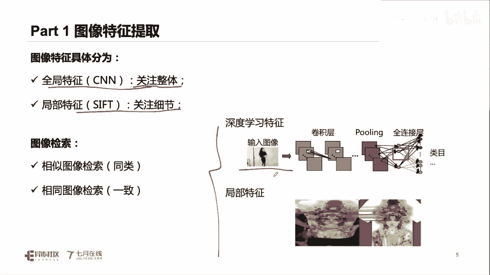
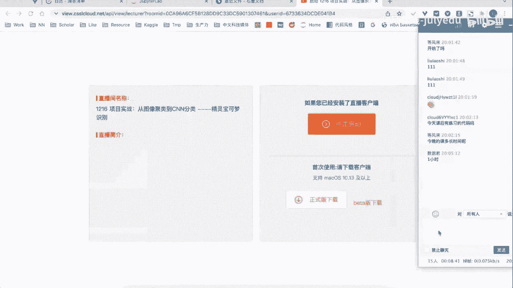
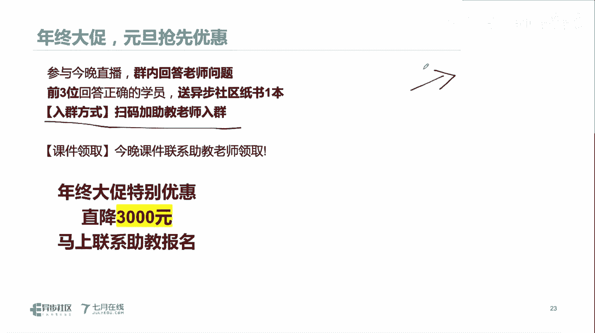

# 人工智能—计算机视觉CV公开课（七月在线出品） - P20：项目实战-精灵宝可梦识别 - 七月在线-julyedu - BV17z4y167dq

啊啊。

我们今天那个直播呢就是讲解我们的一个嗯，计算机视觉领域的一些任务，比如我们如何完成一个图像的聚类，以及我们如何使用我们的一个cn来完成我们的一个图像的一个分类。

然后我们今天的这个课程，这个具体的一个课件以及我们的一个代码都是公开的啊，免费领取的，大家只要加一下我们杨老师的微信啊，就可以获取我们的相关的一些资料，好。

然后呢我们首先呢来看我们的第一部分是我们的图像特征提取，然后第二部分呢是我们的一个无监督的模型，came in做聚类，第三部分呢是我们的cn分类，然后我们这最后呢是我们的一个知识点展望啊，好我们继续。

然后呢我们首先来看我们的第一部分，第一部分这个第一部分呢就是我们的一个呃就是图像特征提取。

图像呢它是一个非常很典型的一个非结构化的一个数据，在图像里面呢，我们具体的在做一个具体的一个数据集的一个描述的时候呢，其实我们是需要对我们的一个具体的一个头像，把它进行一个特征的提取。

也就是说我们需要通过一个具体的一个特征来描述，我们具体的一个图像，这个呢可能是需要我们再进行一个处理的过程中呢需要做的啊，需要做的这个可能是需要我们在处理的过程中需要做的，这是第一点。

第二点呢就是我们需要在我们的一个编码的过程中呢，是对我们的一个图像特征呢进行一个有效的编码，这个编码呢可能也是需要跟我们的一个基础的一个数据，其实是强相关的，强相关的好，对于我们的图像而言呢。

其实我们需要关注我们的图像特征，它如何进行提取，以及我们的具体的一个图像，它如何跟我们的一些具体的任务相结合，也就是我们这个地方我们的一个图像特征如何进行提取。

以及我们的图像的一个具体的一个任务如何进行结合，那么这部分呢可能就是需要你了解到我们现实生活中，我们的一些具体的图像特征，它到底是有哪些图像特征。

以及我们的具体的一个就是我们的一个呃图视觉类型的一个任务，它到底有哪些任务，然后将将我们的一个具体的一个两者进行结合，在我们的一个基础而言，对于对于我们的一个初学者而言，其实比较适合学习的呢。

就是我们的一个就是图像分类，以及我们的一个图像检索，图像分类和推动解锁，对于此类任务呢，其实是就是说比较简单的，比较简单的，就是我们是通过我们的一个具体的一个图像特征的一个提取。

然后完成我们的一个分类的一个操作好，然后我们继续在这个地方呢，我们的一个分类和我们的一个具体的一个检索呢，其实本质都是用到了我们的一个具体的一个就是说提取的图像的特征。

然后完成我们的一个图像特征的一个具体的一个映射，整体的过程就是这样的好，但是呢对于我们的一个图像而言呢，其实它是存在千变万化的一个区别的，就是我们的一个图像，它可能是包含了不同不同角度。

不同场景以及我们不同，就是说在有遮挡啊，以及相关的一些情况下的一些具体的一些形态，我们在对于同一个图像来做一个具体的一个就是呃处理的时候，即使是相同的一个图像。

也就是即使是相同的一个蒙娜丽莎的这个具体的一个人物呢，我们再做一个呃，就是就是他的一个所获得的一个照片呢，其实都相差蛮大的，相差蛮大的，好，我们继续，然后呢或者说相同的或者是说比较相似的图像。

可能在做一个处理的时候呢，可能相差也是蛮大的，相差蛮大，对好，那么我们继续嗯具体而言呢。

就是说我们的一个就是嗯在对于图像特征而言呢，我们可以把它就是嗯把它划分为两类特征啊，一类是我们的一个全局特征，另一类是我们的一个局部特征，全局特征呢是从我们的一个整体的一个角度去关注。

我们的一个图片的整体的一些细节，局部特征呢我们是关注到我们的一些细节的一些关键点，谢谢关心点啊，然后呢我们的一个具体的一个数据，对我们的数据集而言啊，其实全局特征它可能是基于我们的图片整体而言的。

那么我们在做一个具体的一个特征提取的时候呢，这是两类啊，这是两类，一类是我们的全局，一类是我们的局部，一类是我们的全局，一类是我们的局部好，然后我们继续，然后对于我们的图像特征。

把它图像特征提取完成之后，我们还可以做什么呢，我们可以对我们的一个图像特征呢，把它作用在我们的图像特征的一些检索任务，也就是我们对我们的图像特征呢把它做一个相似的嗯，图像检索。

或者说我们的一个相同的图像检索，这个都是可行的，那么我们可以看一下右边的这个例子，对于我们的一个具体的一个就是啊我们的一个图像特征而言，我们可以提取它的一个深度学习的一个特征。

或者说可以提取我们的一个局部的一个特征，局部特征，然后呢这个地方我们再做一个具体的一个操作的过程中呢，其实如果是对于提取我们的全局特征呢，我们就是可以使用颜色颜色这张图，或者说我们的一个具体的一个嗯。

就是嗯我们的一个就是啊in cn的一个卷积特征，然后提取它的特征，如果是局部特征呢，我们就可以通过我们的一个关键点匹配啊。

然后提取一个局部特征好呃今天的课后练习。

今天课后有练习代码吗，嗯有的啊。

大家可以嗯加一下我们的一个呃就是p p t，加一下我们的杨老师的微信，然后就是可以来做一个具体的一个呃领取我们的代码好。

那么对于我们的一个图像特征提取呢，其实有很多啊，这个我们就展如果展开讲呢，就是说你在用到一个具体的任务上面，你可能就是用到我们的一个具体的一个特征，嗯，我们的一个具体的一个特征呢。

其实呃不同任务下面就是我们在进行一个我们的一个呃使用的时候呢，我们使用到的一个特征是不一样的，比如说你的分类任务，然后再加上我们的一个检索任务，或者说我们的一些物体检测任务。

其实是我们的一个其他的一些任务，这个都是有区别的啊，如果大家感兴趣呢，也可以先去了解一下。

那么我们首先来看一下我们的一个具体的一个，就是说嗯这个一类特征叫图片哈希值，这边阿c值呢，就是说我们将一个具体的一个嗯图片呢把它转变成一个字符串，转变成一个哈希值的一个情况啊，转变成一个哈希值的情况。

在这个哈希值的里面呢，就是说我们是使用我们的一个具体的一个图片呢，将它的一个具体的一个图片，把它转成一个字符串的形式，也就是用一个类似于这种md 5的这种哈希的一个形式啊，类似于我们这种md 5的。

把它转变成一个哈希的这种形式，将我们的一个图片把它转变成一个进场的一个字符串，那么图片哈希值呢其实呃在很多的一些场景下面，都是有具体的一个应用的啊，都是有具体应用的。

比如说在我们寻找这个图片的一个呃重涂的时候，或者说我们手机嗯，或者说我们的百度百度网盘，他们在寻找这个图片的一些重复情况的话呢，都是可以从我们的一个图变化值来做图片哈，希值的一个具体计算过程呢。

其实它是首先将我们的一个图片把它进行一个缩小，然后呢将我们的缩小之后的图片，比如说我们把图片把它缩小到8x8的一个尺寸，然后在对我们的一个8x8的一个尺寸的一个图片呢，把它进行一个具体的一个特征提取。

做一个特征，这个特征呢你可以理解就是一个啊把它原始的像素啊，就是视为具体的一些特征，然后呢再把我们的一个具体的一个内容呢转成一个字符串的形式，这个字符字符串的形式呢就是一个定长的定场的图片哈。

希值呢它的一个优点就是它能够将我们的一个具体的一个数据集，将它转变成我们的一个定长的字符串，而且这个字符串呢是可以很方便的存储在我们的一个，就是说数据库中间的啊，存储在我们的数据库中间的。

而且带来的一个计算资源呢也是比较小的啊，就是也是非常方便的，但是呢图片哈希值的一个缺点就在于它其实是嗯对图片的一个内容啊。

是啊强相关的，这里的特征值指的是计算什么特征嗯。

这个特征呢你可以理解，就是说我们把一个图片把它转变成缩放到8x8的一个尺寸，然后使用它的一个像素值，它的rgb的一个像素值，这个地方的特征就是它像素原始的像素点啊，原始的像素点对。

就是直接把它作为我们的一个特征嗯，怎么进行转化的呢，可以这样，你可以这样认为我们原始的是一个8x8的一个矩阵，我们把每个矩阵呢是将它的一个节点做一个判断，它是不是大于128的，是不是大于128的。

就是说每个像素值我们是把它做一个判断，做一个判断是不是大于我们的一个128，然后呢，我们就是将我们的一个图片，把它转变成一个8x8的一个布尔类型的一个矩阵，然后更进一步的可以把它转变成我们的字符串。

对这个地方呢是直接对我们的一个原始的一个像素啊，原始的一个像素做到原始的一个像素做的，所以说呢其实它是非常方便嗯，就是说是对我们的原始的一个啊图片啊，它是直接提取它的像素级别的，像素级别好，我们继续啊。

然后呢这个地方的一个图片的一个像素呢，其实它是呃这种操作呢其实是有一定的一些优点，也有它对应的一些缺点啊，首先呢对于对于我们的这个图片的一个哈希值呢，其实它产生的一个结果是一个定场的。

所以说它是比较方便存储的数据库，但是呢它的一个具体的一个缺点，就是它是会改变任意对我们图片的一些改变，都会改变我们最终的哈希值，所以说呢它可能存在啊，就是说像不同的图片只是改变影响改变一小一点的图片。

也会带会带来它的哈希值有较大的变化，或者说不同的图片内容不相同的图片，但是呢它的哈希值存在相同的情况。

这个都是存在的，第二类呢是我们的颜色直方图，颜色直方图呢就是我们在做一个具体的一个嗯嗯计算的过程中呢，我们去统计一下我们的颜色，它整体的一个分布的情况，分布的情况嗯，可以看右边这个这张图啊。

就很很清楚的，这张图在统计的过程中呢，其实我们本质上是对我们的输入的一个所有的像素啊，所有的一个像素做一个计算，计算什么呢，就是计算他的一个次数，计算一个次数，我们x轴呢是我们的一个0~25的一个取值。

y轴呢就是对应的像素点的一个出现次数的一个统计好，那么在这个地方呢，就是说我们统计的分别统计了我们的一个rgb 3通道的，也就是说我们可以统统计得到不同颜色空间。

不同颜色空间我们的一个具体的一个呃就是啊这种分布，然后呢分别得到三条曲线，那么这个rgb的这个颜色直方图呢，其实它是一种全局的全局特征，你可以看到它其实这个地方统计得到的是一个整体的一个分部信息。

统计得到的是一个整体的一个分部信息对吧，然后呢它并不会关注我们的一个具体的一个像素点，它的一个位置啊，他不会统计位置，他只会统计，就是说举个例子，这个地方rgb分别取值为50的情况下。

所对应的像素点的个数是多少，对他是不统计位置的，他是不统计位置的，所以说呢颜色直方图它是能够抵抗嗯，就是说图片的一个旋转和平移的，因为它对位置并不是很敏感，但是呢它的一个缺点。

就是说他其实对颜色变化是比较敏感的，也就是我们对于一张图片，如果将它的一个颜色做了一个变换之后呢，你会发现它的一个颜色直方图就有较大的一个变化，较大的一个变化，所以说这是颜色直方图它的一个优点。

它的一个缺点啊，颜色正方图是不统计位置的啊，只是统计具体的一个次数，具体一个次数好，我们继续，这然后呢我们接下来看一看这个无间度模型k means，k means呢其实在我们的日常生活中。

那应该是呃所有的同学都会接触到啊，就是说其实是一种非常非常有效的这种无监督聚类算法，那我们看一看key means呢，其实它是一种无监督的一个距离算法，在这个算法过程中呢也是呃非常非常普及的。

非常非常普及的一类算法，在这个算法过程中呢，我们是根据我们的一个数据呢把它组成为不同的一个组，不同一个组，然后呢将我们的一个数据做一个聚类啊，不断的聚成不同的一些组，came in的一个聚类过程呢。

它是这样的，首先呢我们选择k个点作为我们的初始之心，然后呢去根据我们的这个地方，这个地方这是步骤一step 1，在这个step一的时候呢，其实它是做了一个随机的筛选啊。

随机筛选这个地方的k个k是我们提前选择的，这是我们提前选择的，然后呢我们其实是随机选择kg这个地方也并不是说完完全全纯随机啊，他也是按照了一定的一个采样啊，按照某种采样采样得到我们的最开始的知心。

然后呢根据我们的一个数据点呢，将我们的一个数据分派分派到我们的最近的一个执行，然后完成了得到k个two，然后更进一步呢，就是说有了这k个促之后呢，然后去对我们的醋做一个样本的一个平均计算。

得到了新的聚类中心，然后重复我们的第二步和第三步，直至我们的我们的距离中心不会发生变化，这个就是我们的一个k means，他的一个具体的一个就是啊他的一个就是训练过程啊，然后呢在kinds而言。

对于km而言，其实它是一种无监督的五监督的一种算法，而且呢它是不需要嗯，就是说我们有标签的，不需要我们有标签的嗯，然后呢，但是呢kim是我们需要设置我们的一个具体的一个k的一个取值的。

也就是说这个key是我们的一个相应的一个，就是说你可以理解就是我们的一个嗯超参数啊，一个超参数好，我们更进一步更进一步来看一看，那么除了k means之外，有没有其他的一些距离算法呢，当然有。

比如说有基于这种密度的d b d b skin的一些距离算法，也是都是可以来做的啊。

然后呢我们首先来使用一下我们的kenings。

来完成我们的一个具体的一个实验啊，我们就是将我们的一些代码从头给大家写起的啊，从头给大家写写啊。

我们新建一个notebook，新建应该都出不了，好呃，在这个notebook里面呢，我们就是从头完成我们的一些代码，从头完成我们的代码，我们首先呢是就是说看一看我们的数据集在哪。

我们的数据集呢其实是在一个叫做呃，我们待会会把数据集都给大家啊，就是说下载好啊，以及把这些课件啊以及数据集都直接给到大家的啊，大家不用担心，我们看一看我们的一个宝可梦，它的一个位置点的时间去。

对这是我们的宝可梦的一个文件夹，这个文件夹下面都是一些宝可梦的一些照片，好，这是数据集，然后呢我们将这个数据集的一个位置呢，把它定义为我们的一个具体的变量，好。

我们把它叫做一个data pass的这个变量，然后接下来呢导入我们的一些具体的一些库嗯，比如我们的浪漫呀，pendas啊，以及cv t啊，这些我们都是可以导入进来的，好，然后接下来我们做一件事。

就是说统计一下我们的数据集里面到底有多少张图片，我们用globe这个库来做统计，统计一下我们的数据集下面多少张照片，好我把这个全屏一下啊，然后这个地方它就是做一个匹配嘛。

好这个就是他统计得到的一些具体的照片。

然后呢我们将这个具体的一个文件路径啊，就是所谓的照片路径呢，我们把它复制为叫做一个pass的一个list好，然后呢我们的原始数据集里面其实是存在一些啊，就是非这种就是常规的格式的图片。

就是它有可能是包含s vg的啊，我们是做一个筛选，这个地方我们是不想读取s vg的好。

然后接下来是读取完成之后的，我们的筛选之后的应该都变成路径好，然后接下来呢有同学可能就问的，就是说我们对于这个图片的一个哈希值。

我们怎么做一个计算呢，我们这个地方就是用image hush这个库，1米计划是这个不难做一个计算，这个库呢其实它非可以非常方便的搭配我们的披露这个库。

来做一个使用啊，我们首先呢来使用我们的一个批斗来试一下啊。

我们读取我们的一张图片对吧，这个披露呢就是可以很方便地读取我们的单张图片好，那么如果是搭配我们的页面进行时呢。

就是我们的页面进行直接对我们的传入的一个图片。

常用的一个p的读取的一个图片进行一个计算，这个就是我们计算的之后的一个ai，它是一个true force的一个零一矩阵，然后呢我们对于这个零一矩阵呢。

把它直接可以转成转成我们的16进制的16进制的字符串，这个呢就是我们转换之后的一个图片的哈希值图片的哈希值好，那么如果大家感兴趣呢，大家也可以下去啊，啊拿着任意一张图片啊。

任意一张图片都可以用相同的代码啊，这样产生得到类似的结果，那么更进一步呢，假如说我们想要计算我们的一个图片的一个颜色，直方图呢这个地方我们如果是计算颜色，直方图呢非常推荐嗯。

使用我们的一个open cv来做啊，因为open cv它内置已经是有这个具体的一个颜色直方图的实现，嘿嘿嘿，当然也有同学说老师我直接用这个狼派来做行不行啊，用狼派来做也可以啊，也可以，这个都可以啊。

啊只不过呢就是看个人的一个习惯啊，个人个人的一个习惯好，我们首先当中open cv读取我们的一张图片，这这个图片呢我们就是读取我们的这个pass它的第一张，然后呢我们读取它的灰度图，多通道的也可以吗。

这个地方的就是我们就是一个多通道的图片啊。

这个地方它就是一个彩色的图片，这就是一个多通道的对吧。

我们仍然是直接把它转变成了一个哈希值啊，所以说他并不会就是说在不在意它是多通道的还是单通道的话，这个都行的，这个都行的，100个通道的，100个通道的话，你可以参考它类似的一个做法。

你可以参考它类似的做法。

这个地方其实嗯，你可以看到它原始的就是转变成一个应该是一个8x8的一个矩阵，这个地方的一个图片哈，希值他应该是做了一个相当于是做了一个灰度的一个替换，什么意思呢，他可能是做了rgb，把它转变成三通道。

再把它转变成我们单通道的一个操作，对如果是100通道的话，是不是也是可以参考这个操作呢，对吧，将我们的一个通道相当于是求一个灰度的，求一个灰度图，然后再做就行了，好我们继续。

那么如果是嗯使用我们的一个open cv呢，就是c v two mm read啊，就是读取我们的图片，读取完成之后呢，这是我们的一个lapg式的啊，lp格式的一个具体的一个图片。

那么在我们的open cv里面呢，我们就直接可以用c v区我们的call嗯，这个hist来读取并计算我们的一个图片的颜色，正方图好，还有一些具体的一些参数啊。

我们就给大家写一下开始需要统计的像素的开始是指一些它的结束的取值，好这个地方还有一个参数是我们的范围啊，好这样呢就是统计得到了我们的具体的一个颜色直方图，它的统计信息啊，如果你看的不太清楚的话。

我给你把它flatten一下，这个地方就是每个像素它对应的一个出现的次数，出现的次数好，那么我们可以将这个把它赋值为得到我们的l area，然后呢我们对我们的ario可以做一个可视化，对吧。

我们的一个原子直方图，这就是单条曲线的单调曲线，如果你想要统计多条曲线的话呢，其实也很简单也很简单啊，这个地方我们就是做这样一个操作啊，我们对于我们原始的图片，把它读取它的彩色的啊，这个地方是彩色的。

我们可以把它的一个尺寸呢把它打印出来，这个地方是彩色的啊，然后呢我们就去统计每个通道的那个通道的，比如我们先统计我们的一个呃第一个通道，然后呢再去通通，就我们第二通道的，然后再统就先通道对吧。

这样就是可以统计三个通道的对，然后我们再把三通道的都给它绘制出来，好你会发现这个就是我们的三通道的啊，三通道的一个颜色直方图，好，我们继续，那么对于我们的一个具体的一个聚类呢。

其实你可以直接对我们的一个颜色这方图对我们对它进行聚类，当然也可以直接对我们的一个结构化的数据进行距离啊，嗯这个地方的一些聚类算法呢，其实是嗯它是需要对我们的数据集，就是说它是特征比较规整的情况下。

才是需要做剧烈才能做军队啊，因为它是涉及到这个具体的距离距离计算在这个地方呢，如果我们是将图片把它转变成颜色直方图之后呢，嗯我们也可以通过原色直方图，然后完成图像的一个绝对。

但是这个地方我们并不并不建议这么做，因为我们的颜色直方图可能并不是一个很好的图片的特征啊，我们接下来呢就是嗯推而求其次，嗯，使用我们的这个精灵宝可梦，就是说这些宠物小精灵的一些特性。

它的一个结构化的数据集，我们来看看能不能对于这个结构化的数据进来完成之类，好在这个地方呢我们就是采用我们的一些这个具体的，这是每个精灵小精灵它的一些属性啊，我们采采用我们这些表格。

比如说我们这个地方选择小精灵的一个attack列，difference点，以及我们的hp列，以及它sped speed脸啊，四列就相当于是小小精灵的四个四四个属性啊，四个属性。

然后呢利用我们的四个属性来完成我们的一个车队，那么怎么做呢，在我们的一个sk的里面其实也是很简单的，from我们的sk呢，第二我们的cluster，imports，我们的一个具体的一个cument对吧。

这就是我们的chemise，然后呢这个地方我们需要对我们的kim做一个实例化，cameans，我们的具体的一个相当于是n我们的clusters，就是我们的聚类个数啊，我们聚类个数位数。

我们这个地方设置它是四，然后定实例化完成之后呢，就可以完成一个之类的，我对我们的km对它进行feet feat传入的就是我们的一个数据传入，接触数据啊，这样就具备完成了，非常简单非常简单。

data 2相当于是标签吗，这个地方不是标签啊，这个地方是这样的嗯，我们的原始数据集它有一些是字符串类型的，有一些呢是这个啊数值类型的，有一些是布尔类型的对吧。

呃我们这个地方呢就是我们data 2呢是筛选的一些列，来做我们的一个区域，它是没有标签的，是无标签的，我们是筛选的一些列，比如说这个地方有四列来完成距离啊，就是说我们筛选的系列来做聚类，他不是标签啊。

他是不是标签好，当我们聚类完成之后呢，我们就可以通过我们的这个聚类的一个嗯，对我们的数据集来进行达标的，比如说我们可以对我们的数据集做一个predict。

利用我们的cam对我们数据集做一个predict传入我们的数据集，然后这个地方它输出的就是我们的一个就是类比啊。

这个地方我们需要聚类四类，所以说它输出的是0123对吧。

这些具体的数值好，那么大家就是感兴趣的话呢，你可以去嗯看一看我们的具体的这个剧类的效果，它是怎么样的啊，至于效果是怎么样的好，那么有同学可能就是我们的嗯，对这个data 2相当于是我们的具体的特征啊。

那么我们在这个地方呢，就是有同学可能就会问到我们的一个具体的一个n clusters，这是我们的聚类个数，或者说我们的类别数，他如何进行选择呢，这个地方呢在我们的这个k means里面呢。

其实是有一个叫做肘部法的一个就是说嗯具体的一个理论，在我们的一个具体的一个迭代过程中呢，我们是可以将我们的一个具体的一个一个一个加进类别个数呢，做一个循环，也就是做一个实验。

我们类别个数呢相从二到我们的一个20，然后不断进行尝试，不断进行尝试啊，也就是说我们写一个for循环，在这个for循环内部呢，每个设置不同的我们的距离个数，然后去记录一下我们的这个具体的一些呃。

这个地方是for啊，具体的记录一下我们的这个嗯聚类的一些变量，这个变量呢我们是可以通过我们的一个聚类，它的一个内奸距离啊，内间距离，或者说我们的在嗯距离算法里面呢。

我们叫这个m s e将这个取值给它记录下来，好我们存储一个list，把我们的迭代过程中呢，不同的聚类下面的一个list把它存储下来，存储下来之后呢，你会发现就是说这个地方的一个参数就是我们的一个mm。

然后呢在这个地方呢我们是在进行一个具体的一个具体的过程中呢，随着我们的一个类别个数逐步增加的话，我们的一个就是说样本它们之间的一个距离，就是说与它类别公中心的一个距离会越来越小。

也就是它的距离会越来越小，那么我们可以绘制一个图，绘制一个图，将我们的这个形态呢给他展示一下，这个呢在我们的一个具体的一些机器学习的理论里面，就是可以通过一个肘部法来做我们的一个类别个数的一个筛选。

这个地方我们相当于是有一个肘关节在我们的这个位置，它的一个相当于是它的一个距离的一个变化，趋势逐步降低的逐步降低的，所以说呢我们这个地方可以就是推荐将我们的一个具体的k means。

他的一个类别个数能设置成六，是指乘六，或者说设置成七都是合适的，在这个位置啊，是有了一个关节，一个关节点好，这个具体的操作就是说我们设置不同的一个聚类，然后呢在我们的一个聚类的一个不同的设置的情况下呢。

通过改变我们类别个数，记录一下我们的样本与我们的，就是说类比每个样本和它的具体中心那个距离啊，就是记录他的ss好，这部分有问题吗，同学们如果没有问题的话，我们就继续啊，如果没有问题，我们就继续啊。

好如果没有问题，我们扣个一好不好，如果我没有问题的话，我们扣个一，然后继续啊，好没问题是吧，然后我们就继续啊，我们就继续，然后呢我们接下来就看一看，我们就是说深度学习的一些特征。

我们能不能用深度学习的特征来完成我们的一个特征提取，以及具体的一些剧类啊。

我们首先来看一看我们的ppt。

深度学习呢其实在我们的日常生活中呢，其实有很多的一些应用的啊，嗯它的一个具体的一个操作呢，其实是堆叠我们的一个多层，来使用我们的一个多层来完成一个特征提取，并完成一个具体的一个建模的过程啊。

呃这个地方呢我们可以先使用我们的一个呃，就是给大家介绍一下我们的一个嗯这个卷积神经网络，具体神经网络呢我们在做一个具体的一个操作的过程中呢，我们是使用我们的一个卷积来提取我们的图像的一个特征。

图像呢是以这种二维矩阵的一个形式输入到我们的一个嗯，就是神经网络里面，然后呢我们是通过这个二维的卷积提取我们的图像的特征，在这个地方呢你可以看到我们这个地方是我们的输入的一个图像，我们的input。

然后这个地方的灰的灰色部分呢就是我们对应的一个卷积，然后与这个输入的图像对应的位置完成一个相应的一个计算，这个地方的一个计算呢就是基于元素级别的一个相乘，然后进行相加，然后得到我们的一个结果。

你会看到啊，这个地方是我们相乘相加得到的结果好，我们继续，那么我们的一个具体的卷积操作呢，其实就是有的一个卷积核，然后和我们的一个原始输入进行一个卷积，然后得到我们的一个输出。

大家看一下这个动态图就能够懂啊，看一下我们这个动态图就应该懂。

然后这个卷积呢其实他在做什么呢，这个地方的卷积其实本质就是在做一个提取图像特征的这个操作，如果我们的一个卷积核设置为不同的一个参数的情况下，我们提取得到的一个特征其实是不一样的。

比如说我们输入这个具体的一幅花的情况下，我们设置不同的卷积和我们提取得到的这个花的这种形态啊，因为它的边缘信息啊都是存在有区别存在有区别的好，那么我们在做一个特征提取的时候呢。

其实就是可以通过我们这个卷积核来完成一个具体的一个特征提取。

那么这个地方呢我们的卷积层其实本质上它是在做什么呢，卷积层其实本质它是通过我们的一个嗯，就是说仍然是这种正向传播的这种过程，但是呢卷积层其实它是在这个计算的一个过程中呢。

你可以视为一种替代全连接层的一种做法，它是在这个全连接层的一个计算过程中呢，将我们的一个忘神经元的一个节点呢，它的连接啊做了一个下载样子，那么我们的一个具体的卷积呢。

它不仅仅是可以在我们的一个二维的数据上进行卷积，而且呢是可以在我们的一个多通道上面进行卷积，多通道上面进行卷积啊，这个地方我们输入的一个数据呢是7x7x3的一个数据，三是它的一个通道数。

然后呢我们可以使用一个3x3x3的一个具体的一个卷积核进行卷，积，这个地方的一个每个卷积核它有三个通道和我们的一个输入的数据，每个通道进行对应上啊进行卷积，然后得到一个输出。

然后呢我们的这个卷积核不断进行滑动，就可以得到我们的对应的一个输出啊，对应的一个输出，好我们继续，这是我们的一个多核，或者是我们的一个多维卷积的过程，多维卷积的过程。

然后呢我们的一个卷积呢其实他在做什么呢，其实卷积它本质就是在做一个特征提取以及特征的一个，转换的一个操作啊，特征提取以及特征转换的一个操作，这个地方呢就是我们输入原始的图片。

假如说是256x256x3的一个维度，它的维度的变化呢可能是转变成128x128x30，然后再转变成56x56x60，就是说它的维度啊，我们浓缩画横线的部分是它的一个通道数，通道数是逐步增加的。

所以说呢我们的一个卷积和它的一个卷积层呢，其实输入的一个数据啊是n典型的是一个三通道的，是一个三通道的这种情况好，那么我们的一个卷积层呢不仅仅是可以用来提取特征，我们还可以搭配我们的一个石化层。

然后完成我们的一个具体的一个特征提取，搭配我们的一个池化层，再完成一个具体的一个特征提取，然后呢我们再做一个具体的一个特征提取的过程中呢，池化层这个地方我们有这个mean po和我们的一个max。

它分别做的一个操作是不一样的啊，next play呢就是求我们的对应位置的一个最大值，然后将他的信息进行保留好，那么通过我们的卷积层，我们的池化层之后把它进行搭配呢，就可以得到我们的常见的卷积神经网络。

常见的网络结构整体的形式就是类似于这样的啊，他的一个形式呢就是由我们的一个具体的一个输入的数据呢，嗯它是通过我们的一个卷积层，我们的一个磁化层以及我们的全连接层搭配，得到我们的常见的一个卷积。

卷积卷积和它的一个选取有必要做筛选吗，需要嗯类似于参数嗯，嗯寻求的方法来寻找吗，呃这个地方卷积核的一个选选择的话，其实是看它到底是参数还是超参数呃，这两部分的优化其实是不一样的，参数我们是可以不用管它。

就是直接让它在我们的一个数据集里面进行训练就可以得到，如果是超参数的话，我们就可能是需要人工来进行一些尝试，然后做一个挑强啊，这两者是有区别的啊，两者是有区别的，对看它到底是参数还是超参数。

然后呢我们再做一个具体的一个卷积的过程中呢，其实我们并不是说直接使用我们的一个呃就是嗯自己搭一个网络模型，我们可能会借助已有的一个预训练的模型来做的一个特征提取，也就是说现在在我们的这个互联网上面呢。

有很多一些预训练的一些模型，或者说已经是定义好的一些网络模型，这些网络模型呢我们可以拿过来啊，直接进行使用，而且呢效果都会比较好，效果都会比较好。

我们继续，那么我们来看一看我们如何去使用我们的一个title，来搭建我们的一个报的模型，以及使用我们的python写完成我们的一个特征提取好。

我们首先呢来都需要我们的一个python ch的一些具体的一些模块啊，就是深度学习的python的框架下面，然后呢我们定义一个网络模型，这个网络模型呢是基于我们的resonnet。

18的这个网络模型是基于现在18的，也就是说我们加载一个基于我们的一个原来是在18的网络模型，然后呢去修改它最终的一个选项阶层，修改它最终的全连接层，也就是说它最终呢我们是将他的全连接层的给它剔除掉了。

给他剔除掉了，也就是说我们在这个地方只是使只是使用到我们的一个recent 18，它对应的一个卷积层的一个数据，卷积层的余数值在提取的这个卷积层数据之后呢，我们就是完成我们的一个特征提取。

特征提取这一部分就是我们定义模型，这一部分就是我们定义模型好，那么为了方便批量读取我们的数据集呢，我们是建议将我们的一个代码呢写成这种data set这种形式，也就是说我们需要对我们的数据集呢。

把它完成这个相快速的这种批量的读取啊，我们是需要写一个data set，在在这个data set里面呢，我们是完成我们的单个样本的一个具体读取啊。

好我们看一下这个代码怎么写，对这是我们的dataset 2的一个定义，嗯这个地方我复制错了啊，在这，然后呢定义好大家在这之后呢，然后可以定义一下我们data loader。

就是说我们读取图片的时候到底是多少张，每一次每一个批次啵啵啵啵，这个地方我们将最上面我们读取的图片呢把它送到电台section里面，只进行整体的把它进行resize，然后做一个规矩化。

然后呢设置我们的整体的批量读取图片是十张图片作为一个b，然后我们就可以做一个提取图形特征的一个操作，我们就是对于我们所有的图片呢，将我们的所有的图片通过我们的模型完成一次正向传播，完成一次正向传播。

在这个真相传播的过程中呢，我们就是读取我们的一个图片，它的一个数据，然后送到模型里面，然后提取图片，提取图片它的一个特征，然后将这个图片的特征将它进行保留下来，保留下来啊。

这个地方我们是把它存储到我们的一个历史里面的，好我们继续，我们可以将这部分代码运行一下，好这部分代码呢，它的运行呢如果我们指定运行的设备是在我们的一个gpu上面。

它就是会利用我们的一个gpu完成一个特征提取，好这部分代码运行稍微需要一定的时间啊，对于我们的每批次的图片完成一次这样传播，然后记录一下它的一个具体的特征，好我们这部分代码已经运行完了啊。

因为这个地方我是直接是呃在gpu上面运行的，如果你是在cpu上面呢，你就直接把这个地方改成cpu就行了啊，改成cpu就行了，好我们接下来呢对于我们图提取得到的图片呢。

它的特征呢也把它做一个聚类来做做一下啊，我们将我们所有地区的图片呢把它做一个归一化，做完归一化之后呢，也送到我们的一个km里面，然后完成一个剧烈啊，这个地方我们也是写了一个for循环来试试。

或者说记录一下它对应的这个不同类别设置，下面我们came in的一个距离好，但是呢这个地方你会发现呢，其实呃我们的一个k means呢它的一个迭代速度啊，这个迭代速度就是很慢的。

因为我们这个地方其实嗯特征提取它的一个维度啊。

每一张图片在我们的一个预训练模型提取之后的特征呢。

它的一个维度就是一个512的维度，512的维度啊，就是维度比较大，所以说它的一个剧内的一个速度啊也会比较慢，好我们这个剧队的一个已经完成了，然后呢我们仍然是类似使用我们这种走步法的这种形式。

来看一看我们的一个具体的一个形态啊，这个地方呢我们仍还没有看出我们的心态啊，这个地方的肘部并没有很明显的出现好，那么为了加速我们的一个距离啊，我们是使用这个mini batch k means。

mini bek，means kens和mini bek呢其实都是非常类似的，但是mini bk minds的，但是就相当于是对我们的这个bh的剧内，对在做剧烈的时候呢，是那种批量的样本做啊。

所以说它是这种迭代的迭代的距离啊，他可能并不是最优的，但是呢它的距离速度会更快一些啊，我们来试试对mini become in，它的聚类的速度会快很多，好我们再来看一下这个mini bet kends。

它的距离效果对吧，在这个地方很明显的有一个就是说肘手肘的位置啊，手肘的位置，也就是说在我们的类别个数为11的时候，你会发现这个mini bet chemist，其实它的距离的一个距离不。

它是有一定波动的啊，这就表明它其实本身啊，嗯这个聚类这个聚类的过程是有一定的随机性的，好我们可以再改大一点啊，比如说我们这个地方在做came in的时候，我们也可以设置它的epoke啊。

在设置我们的mini bek means聚类的时候，它可以设置它的一个mammax litters啊，就是它对应的迭代次数啊，我们把这个可以改大一点啊，改为400，我们再来试一下。

嗯这个仍然是距离速度也是蛮快的啊，距离完成之后呢，我们再来看一看这个图啊，是不是会更加好看一点，好这个图呢仍然是有一定的波动性啊，但整体而言呢是在我们的就是说11和12的这个位置。

是发生了这个肘部的变化，总部的变化好，这是我们的一个对我们的一个呃cn的特征呢，来完成我们的一个区域内的过程，然后呢我们接下来就是用我们的cn完成一个图片分类的过程，首先呢对于我们的数据集而言。

其实我们首先呢是需要对我们的数据集构建一个标签的标签，这个标签呢就是我们对于我们的图片而言，一张图片它是有一个对应的标签的，这个标签呢就是它对应的类别，对应类别我们是以他所属的类别作为它的标签。

与他所属的类别作为他的标签。

然后呢这个标签呢并不是直接能够送到模型训练的，因为这个地方的标签它是一个字符串类型的，那么我们需要把它转变成我们的一个应酬类型，这个地方呢我们是直接用我们的pendence factory。

把它转变成我们的label encode的形式好，然后这是我们转变之后的啊，这就是它是能使用数值来代替它的字符串，一个类别是一个文件夹下面吗，对的啊，一个类别放在一个文件夹下面的啊，对的对的好。

然后呢这个地方你会发现我们的数据集，它的一个呃这种样本的一个顺序其实是有序的有序的对吧嗯，那么为了我们训练它是有一定的随机性的啊，我们是将我们的数据集把它打乱一下，打断一下，就是说所有的样子啊。

从头把它打断一下好，然后我们继续，然后接下来我们就需要做什么呢，我们就需要做我们的一个具体的一个模型的训练，cn的训练，sn的训练呢其实是很简单的一件事情，这是我们需要定义我们的一个训练的函数。

以及我们的验证函数，在训练函数里面我们需要做什么呢，我们的训练函数的代码是怎么写的，这样写的，在我们的训练函数里面传入我们data loader，我们的model以及我们的损失函数。

以及我们的优化器这个地方，我们对于我们的训练函数不断地读取我们的一个样本，然后完成我们的一个正向传播。

我们的一个具体的一个嗯损失的一个计算，以及我们的一个精度的计算过程，这个就是我们的一个训练过程，那么如果有的训练过程呢，就是需要还需要有一个验证过程，验证过程呢它就是没有反向传播的。

他只有做我们的一个正向传播的过程，只有做我们的正向作用的过程，也就是这个地方是没有这两步的啊，没有这两步的对。

但你可以对比一下啊，可以对比一下好，那么我们继续，当我们定义好了我们的一个训练过程和我们的验证过程之后呢，然后接下来我们就可以构建我们的data load。

我们data logo呢我们需要将我们的数据集把它拆分为两部分。

拆分为两部分，一部分呢是我们的训练题，一部分是我们的验证题，一部分是我们的训练集啊，我们用5000张图片做我们的训练集，用我们剩余的最后的1000张图片做我们的验证值，好然后定义好我们的logo。

然后呢这个地方我们想要是做一个分类，所以说呢我们的分类的模型呢其实是需要修改一下的，我们的分类模型呢我们是嗯这个地方是做150分内，150分类，所以说呢我们是将我们的一个全连接网络啊，哦sorry啊。

这个地方是将卷积网络的全连接层把它修改一下，它最终的一个全连接层啊，最终呢分类的一个输出是150类，好，这是我们的定义网络，然后接下来就是我们的一个模型的训练的啊。

我们仍然是定义我们的这种训练的一些设备，然后将它转变成我们的一个制作扩大的模式，然后接下来就是我们的一个训练啊，训练呢就是说定义我们的损失函数，我们的优化器，然后每十个epoke啊，十个epoch。

每个ebook可能完成我们的一个训练，然后计算我们的验证集的进度啊，就是整体的这个过程，我们来看一看它的一个训练啊，这是我们的一个训练集，它的一个整体的进度，它是不断的整体的一个进度是不断增加的啊。

在这个地方打印的每十个我们的一个batch打印一下，我们这个呃就是平均的训练集的一个精度。

对我们在训练完第一个e破口之后，我们的验证节的精度是0。027，也就是2%，好我们来看一下我们训练的第一第二个poke之后，它的一个进度，它的精度呢是这就是说提高到0。009啊，就相当于是快到10%了。

然后逐步训练呢，我们的这个进度是能够到80%甚至到90%啊，这个整体呢就是我们的一个卷积神经网络的一个训练过程，它的一个针对的训练过程好，我们先让他训练啊，待会我们再回过头来看一看它的一个结果啊。

看一看进度到什么位置的啊，我们就继续我们的ppt内容，我们接下来看一看我们的这个知识点的一个总结和展望啊，对于我们的一个图片而言，其实卷积神经网络其实它是一个非常有用的一个有人的模型。

还是比较适合用在图像领域的，cn呢其实本质是可以视为提取图片特征的一个操作，是可以提取特征，然后完成建模的这个操作，所以说呢cnn也是我们在做这个呃计算机视觉领域啊，必须要掌握的一个知识点。

那么如果是学习cn呢，需要关注的一个点，就是说我们如何将cn如将它用在我们的时间序列的任务上面，或者说如何将cn加入这种长序列的数据建模的这些信息，这些呢可能是在我们的cn的一些具体的一些发展过程中啊。

是需要解决的好，然后呢，我们接下来呢就是说可以给大家介绍一下我们的相关的一些课程啊，以及一些其他的福利啊，有同学说cnn加htm啊，这个其实也是可行的，cnn加s t m其实也是可行的。

它可以就是说捕捉我们的长信息，好我们接下来给大家再提一个问题啊，就是说cn它还可以做什么，我们这个地方呢cnn还可以做什么，这一期他还可以做什么，然后呢我们选择三位同学啊，三位同学送出我们的一个呃。

具体的奖项呢是我们的一个嗯异步社区的三本纸质书啊，大家可以回答一下啊，回答一下，就是我们的cn到底还能够做什么，对大家可以回答一下啊，回答一下，然后我们选择最先回答的同学，三位同学啊。

对cnn还可以做什么呢，有没有同学想回答的啊，送我们的纸质书啊，送我们纸质书，对，有没有同学想回答的啊，有没有同学想回答的好，然后如果想回答的同学，可以在我们的一个弹幕聊天区里面进行一个发言。

好我们继续啊，然后呢，在我们现在呢在我们的系列在线和异步社区呢一起是有一个课程呢，叫做机器学习集训营，在这个机器语音里面呢，其实我们会讲解到很多的一些机器学习和深度学习相关的一些知识点。

而且在这个集训营里面呢，我们其实会提供一些gp的云平台给大家进行使用，这个机器人呢是包含的记忆学习原理和深度学习原理，以及我们的深度学习的一些具体实践的过程，所以说如果有同学觉得今天的课程学得还不过瘾。

也可以继续去报名我们的一个机器学习集训营，来完成我们的深入的学习啊，有同学说到了啊，这个呃分割呃，回归预测分类啊，我们的这三位同学啊，我们的嗯最先回答的分割，回归预测和分类啊。

这三位同学可以加一下我们的一个杨老师啊，或者说在我们的群里面加一下我们的助教啊，然后呢可以领取我们的由异步社区送出的三本纸质书，好，然后呢我们的这个机器学习机器人。

它也是涵盖我们今天所讲解的所有的知识点的。

如果大家感兴趣的，也可以，就是说啊就是啊就是说你嗯了解一下啊，我们今天的一个课程的一个福利呢，就是说前三位回到我们的一个呃问题的同学啊，送我们的一部社区的直书一本。

然后如果大家想要在我们的一个群里面加入我们的社群，和我们的老师，助教老师以及我进行一个深入的沟通呢，也可以加一下我们的助教老师，然后拉大家进群啊，我们有学习群，然后呢我们今天的一个具体的一个课件。

以及我们的代码呢都是可以来做一个领取的啊，今天所有的课件代码都是可以做进去的，然后呢我们今天的一个啊也有一个优惠啊，就是说大家今天报名我们的机器学习即兴，那可以直降3000元，直降3000元。

也就是我们的一个价格呢是到了我们就直降3000元啊，是非常非常优优惠的一个力度，如果大家想要报名我们的机器人呢，也可以直接联系我们的助教老师报名啊，这个3000元的优惠呢并不是每天都有啊，只是这几天有。

所以说如果大家感兴趣的话呢，你也可以直接去联系我们的助教老师好。

我们来看一看我们的一个精度啊，这个精度呢是逐步增加到了cn的一个模型，去年的十个亿po之后，它的一个分类精度已经是到了65%，0。65已经是很高的好。

那么我们今天的所有的课件代码以及一些资料呢，都是可以通过我们的助理老师来领取的啊，如果大家想要领取的话呢，也可以嗯加一下我们的杨老师的微信，我们的机器学习集训营呢。

在我们的异步社区和我们的企业在线的官网都是上线的，机器学习机器人的涵盖，我们的机器学习和深度学习相关的一些面试点和知识点，也是非常非常接地气，非常适合同学们深入学习的一个课程啊。

这个机器人呢他的一个学习周期是三个，就是说三个月到半年的一个时间，所以说就是说如果大家想要系统学习机器学习了，这个课程是非常非常推荐大家的，好标签数据是啥样的。

标签数据就是我们将文件夹把它提取，作为我们的标签，这个地方的文件夹提取得到的就是它的标签，对好大家对我们今天的一个课程有什么问题吗，对，大家对我们今天的课程有什么问题吗。

这个其实整体的内容还是比较简单的对吧，好那么大家如果想要报名我们的集星云的同学呢，也可以加，就是说在我们的群里面私聊我们的助教老师啊。

好大家有问题吗，各位同学对我们今天所讲的内容有问题吗。

对我们今天的一个集训营的报名呢其实是有优惠活动的，大家如果想要继续学习或者深入学习的同学呢，一定不要错过好，标签数据和虚拟数据的通道可以不一致吗，可以的，可以的，我们的标签就是一个数值。

标签就是一个数值，我们输入的数据是一个图片调和，两者是可以不一致的，是可以不一致的，对，好大家还有问题吗，好那么我们今天的一个直播呢就到这儿，然后各位同学想要领取我们的代码课件及相关资料呢。

都可以加一下我们杨老师的微信，或者说跟我们杨老师仔细啊，就是说了解一下我们的集训营的一些细节，它的集训营上什么课，以及他的具体的大纲，都可以从我们的杨老师的地方，杨老师的微信啊领取，好的。

那么我们今天的直播就到此结束。

