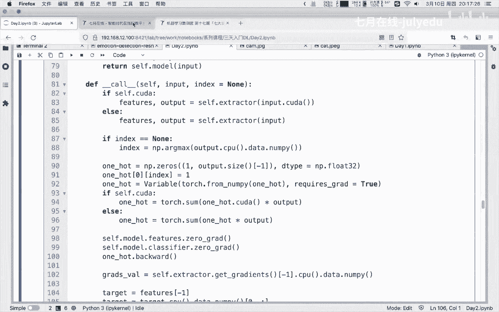

# 人工智能—计算机视觉CV公开课（七月在线出品） - P21：22.3.10实时情绪识别实战-模型训练与部署 - 七月在线-julyedu - BV17z4y167dq

🎼，好，我们就。开始啊，首先呢我们来先来介绍一下企业在线。企约在线呢是一家成立于2015年的人工智能在线直教平台，然后专注于这个人工智能时代的人才培养和企业服务。呃，在人才培养方面呢。

讲师团队已经累计超过了300人，均由大厂的技术专家和国内外的高校博士组成。总付费学员超过40万课程数量500多门，分别为这个出入门课转信及训营以及提升班。嗯，在企业服务呢。

契约在线也是与嗯各个公司签订了企业对信的一些合作。好，那么如果大家想要在我们的官网上面找到一些其他的课程呢，也可以在浏览器里面输入企约在线，或者说直接输入它的域域名就行。那么我们在这个讲课的过程中呢。

我们也会在呃就是呃第一部分结束呢也会做抽奖啊，也会做抽奖。然后就是说抽我们的10个VIP月卡，然后抽我们的呃三本书，好吧，然后这个书直接是送给大家啊，送给大家。然后就是说从这四本里面随机选择一本。好。

我们就继续啊，开始了啊开始了。对，已经开始了啊。好，那么我们就先开始我们的一个第一部分呃，深度学习的一个介绍。呃，在我们学习深度学习的时候，我们到底在学习什么呢？呃。

首先呢我们需要对深度学习进行一个定义。呃，深度学习我们在学习的时候呢，它它的一个定义是包含了多层神经元的一个结构。因为是人脑的一个神经元的一个结构类似。这个地方我们关注的是一个结构结构的一个信息。

什么是结构呢，也就是你可以理解，就是说我们的一个网络模型，它整体的一个从输入到输出的一个网络结构。在我们讲到深度学习的时候，我们就不可不避免的会就是说给各位同学介绍到这个机器学习。

那么我们在学习深度学习的时候和在学习机器学习的时候，两者有什么区别呢？也就是说我们的初学者经常会问问问到一个问题，就是啊我学习机忆学习还是学习深度学习。或者说我到底怎么进行学习，其实是这样的啊。

这两者其实是呃不可割裂的一就是说两就是说两部分是不可割裂开的。深度学习呢它是机忆学习的一个分支，特别是以神经元计算的这一类分支。

那么我们如果是将人工智能机器学习和认度学习的三部分给大家画一个这种呃就是说整体的一个维恩图的话。人工智能是最大的范围。然后接下来里面是这个我们的机器学习深度学习。所以说对于我们的初学者而言。

就是你可以先去学习机忆学习，然后再去学习深度学习。呃，特别是初学者啊，你不要一上来就学习，甚至去学习。其实对你的一个学习。呃，你这没声音吗？呃，有声音吧，其他同学有声音吗？对，其他同学有声音吗？

有声音的同学可以扣个一。对，呃，如果你没有声音的话，你可以先刷新一下你的网页吧。对，应该是有声音的啊，应该是有声音的。好，所以说呢我们在学习的时候呢，你应该先去学习积极学习，然后再去学习深度学习。

你不要一上来就学习深度学习。其实这不是一种很好的现象。但是呢其实呃我们现在的一些教材啊或和一些课程，其实都是在讲解机在讲解深度学习的时候呢，他会先把积极学习的一些基础给大家讲一下。所以说你也不用担心。

对呃，有同学说到啊，从线性回归开始学，可以的。你先先从线性回归，线性逻辑回归，然后学其实也是可行的。这个地方呢就是希望各位同学在学习的时候呢，一定要注意这个范围。

人工智能机器学习和深度学习的一个具体的知识点的一个范围。你不要把它割裂开。在我们的一个具体的机器学习里面呢，其实它包含了很多的一些非深度学习的一些方法。比如说数模型。间性模型比如对吧？我们的逻辑回归。

或者说我们的naso。然后呢，还有我们还有我们的这种基成学习等等的一些方法。它其实都是我们记忆学习里面重要的组成部分。也就是我们在学习的时候啊，你不要把两者对等起来，这两者是不对等的。

而且你在学习的时候，你不要对立起来，就是说我只学习深度学习，不学习机器学习行不行？其实不行的啊不行的。那么我们在学习的时候，一方面呢，我是建议大家可以先学习一下机机器学习，然后再去学习一下深度学习。

那么这两者的一个方法，学习方法有什么不同呢？其实是有较大的不同的。机器学习的一些模呃学习呢其实比较关注于这个模型，它整整体的一个原理，以及它的一个就是说具体的一个模型在构造的过程中。

它如何进行构造这个模型，以及这个模型如何进行泛化的，也就是它具体的精度的评价。但是呢我们在深度学习的时候，我们学的是什么呢？深度学习其实更加关注于这个网络结构以及这个网络结构的一个优化过程。也就是说。

他更加关注于我们的一个模型如何搭建的，以及我们的一个模型如何进行训练的。与我们的一个继续学习相比。继续学习的一个流程呢就是说我们先有一个data。然后呢，对它进行特征特征工程。然后呢，再构建一个模型。

然后呢，做预测。但是呢对于我们的深度学习而言呢，其实它。并不是上述的一个流程。深度学习呢它可以自动的做特征工程。也就是说这个地方我们是直接有我们的一个model。它不需要额外的一些特征工程的一个操作。

所以说这个地方我们只渗度学习是一个端到端的一个计算。也就是说我们从我们的输入。Yeah。然后通过我们的深度学习模型，就可以直接到我们的一个输出。这个地方的一个端到端。

就是说从我们的输入端到我们的输出端端到端的在我们的一个深度学习里面啊，其实它的一个特征啊是自动来进行学习的。我们待会儿也会介绍啊，对于我们的卷积里面它怎么来自动提取的一个特征呢？这是第一点。

深度学习是一个端到端的过程。第二点呢，深度学习它是一个有效的一个计算图。什么是有向的呢？也就是我们在学习这个数据结构的时候呢，我们会学到这个图这个结构。有声音的啊有声音的，呃，你可以刷新一下啊。

有声音的啊。对你可以刷新一下，刷新一下应该就有声音。什么是图呢？也就是说我们的一个图是由节点和这个边所组成的。节点和编则组成的。那么这个边呢其实它是一个有向的，也就是说它它是有个具体方向的。

在深度学习里面呢，我们的网络结构是可以使用这个有向图来进行表示，也就是我们的节点表示这个具体的计算过程。这个边呢表示这个数据的一个流向。那么我们可以看这样一个。全连接的一个网络，它是由我们的三层所组成。

分别是我们的输入层、银行层和我们的输入层。这是一个全连接网络啊全连接网络。在我们的一个教材里面就是。经常会被用到。那么全连接网络呢就是由全连接层所构成，对吧？这是第一层，这是第二层。

全连接层它在做什么呢？也就是它在做我们的一个节点与节点之间的全部连接，也就是我们的输入层的所有的节点与我们的输出与我们的隐藏层的节点全部连接到一起。对吧我们可以看这个箭头。

那么我们的节就是说层单独一层内啊，就是说输入层和输入层内部的节点，这个两个是没有连接到一起的。它的一个全部连接呢表明的是我们的这一层和下一层的节点全部连接到一起。这个是我们的第一个节点。

它的一个连接过程。以此类推，我们的是第二个节点，也是全部连接到一起。我们在做输入层的时候呢，它的一个输入的数据就是我们原始的输入啊。输入层的一个呃就是说数据呢，它就直接是将我们原始的一个输入输入。

直接将它输出给我们的下一层。那么我们的隐含层呢，它就是接受到接受到我们前面所有前面一层的输入，然后完成一个计算，然后再做输出给下一层的节点。所以说这个地方我们其实是由输入层隐航层和输出层所组成。

隐航层呢我们可以有多层。隐含层我们也可以有多层，也就是输入层直接直接是我们这个输入数据的。输出层呢就是我们最终的结果输出的隐含层呢可以有多层，就是它是一个中间的一个计算节点。

这是我们深度学习的一个非常典型的或者说非常基础的一个全连接网络。那么我们在学习的过程中，你肯定会学习到这个嗯全连接网络。但是深度学习是不是我们学习到这个网络结构就足够了呢？不是的。

学习深度学习呢其实还是需要学习它的一个计算过程。什么意思呢？我们在学习深度学习的时候，其实我们一方面是需要搭建这个网络模型。也就是说我们用一些。具体的代码，比如说你用py to。或者说用cas。

或者说用tens flow，你用这些。深度学习的框架的代码去搭建这个模型。这是你需要必备的一个技能。技能。一第二个技能呢，你需要知道它原理它具体怎么计算的。也就是说它具体在里面是。

到底是用什么样的一个计算过程？比如说是举证乘法呀，还是我们的一个。就是池化操作啊，还是一个激活函数的操作。也就是这个一方面你要搭建这个模型，你会搭。另一方面呢它的具体的计算过程。你要知道。

如果这两部分你都知道的话，那么你就是一个合格的一个从业者。不然呢你就是只知道他的一个理论，你不知道怎么计算的。我们可以举一个例子啊，在我们的深度学习里面呢，其实呃我们的一个。

我们就以举这个神经元的一个例子啊。神经元呢它有多个输入。然后呢，这个神经员它将我们多个输入的一个数据呢进行一个汇总，然后通过我们的一个机有函数。得到我们的一个输出。

这个神经元呢它单个神经元的一个计算过程呢，其实是可以写成我们的一个就是我们输入和我们的一个权重进行一个加线求和的一个过程。也就是我们有我们的X1X2X3X4的一个输入。我们这个地方呢是X1乘以W1。

加上X2乘以W2，加上X3乘以W3，再加上X4乘以W4，对吧？然后再加上一个偏值B，然后整体呢把它通过我们的一个。呃，这个机偶函数得到我们的一个输出。那么你会发现这个计算过程呢。

其实类似于我们的一个行业式的一个乘法，也就是我们的一个举证乘法，对吧？那么这个地方我们的一个。一个输入跟我们的一个神经元进行我们的一个取证乘法，得到我们的一个中间计算结果。再加上我们的偏值。

得到我们的输出。输出呢再通过我们的基偶函数得到最终的输出。也就是这个一行是我们的一个神经元的一个具体的一个权重，对吧？一个神经元的一个权重。那么第二行就是我们的第二个神经元的一个权重。

这个地方呢我们我想表达的意思是我们的是这个全连接层呢，它具体就是由我们的一个举证乘法来实现的。也就是我们这个地方有一个具体的一个输入。和我们的具体的一个全连阶层的一个。

就是神经元的一个参数进行我们的矩证乘法，然后完成了我们的整个的计算过程。好，那么我们为什么要学习到这种程度呢？也就是我们为什么要学习到这个具体的呃就是呃这个全年阶层怎么计算的呢？呃。

因为这一部分其实也是我我们现在的从业者必备的一个过程，也就是你不仅仅是需要使用这些深度学习的框架，你也需要去自己。有可能去搭建一些层，这些层呢可能是我们没有见过的，或者说我们现在的框架里面没有内置的。

那么你就可需要去自己熟悉。所以说这个计算过程你是需要知道的。好，嗯我我们待会儿呢也会有具体的一个计算过程啊，再给大家看一看。那么深度学习它到底能够用在什么一些场景上面呢？

深度学习它其实它用在的一个场景其实是非常多的。比如我们的人脸识别啊，车牌识别啊，这个动物识别好，这个红绿灯检测啊，或者说文本翻译啊，或者说这个克服对话机器人啊，这些都是可以用来深度学习来做。呃。

那么有同学可能就会问到，老师这个地方我们的机器学习能不能用在这些场景上面呢。其实机器学习它也能够用在这些场景上面。但是呢它可能。就是说具体的一个精度并没有深度学习高。举个例子啊。

现在呢我们的一些人脸识别的一些模型呢，基本上都是基于这种深度学习的方法。机器学习的方法呢，它的精度就是说肯定会低很多的，肯定会低很多的。好，那么我们这个地方前面四种都是我们的图像类型的一个数据。

后面两种呢是我们的这个文本类型的一个数据。深度学习呢它比较适合用在这种非结构化的数据。非结构化的数据啊，就是说我们的一个输入呢，它是不定常的。以及它是不规整的。也就是说。

我们在这个地方图片呢文本呢它是很难用这种行列这种我们的表格形式进行存储。表格的形式表格的形式呢就是我们这种结构化的啊结构化的数据。结构化的数据呢，我们就比较适合用机器学习。非结构化的数据。

也就是我们的这种文本啊、图像啊以及语音啊，它就比较适合使用我们这种啊深度学习。那么大家还知道哪些常应用也比较适合永深的学习呢？也可以打字告诉我。我们现在呃呃就是说回答我们问题的同学。

可以直接送我们7车在线的这个VIP月卡的啊。对，大家就是说前10名回答的同学啊，我们就就是送我们的一个具体的一个月卡。呃。有同学说这个预测股价异常检测。嗯，对，这个是的啊。但是股价呢其实呃怎么说呢？

股价其实现在还是用这种机器学习比较多，股价预测其实这种还是使用这种机器学习比较多。时间序列。嗯，对对对，时间序列是的呃，自动驾驶语音识别。对障碍物识别。这个是的。是的。

抓取抓取这个我没有理解是什么聊天机器人啊，好。那么我们手就是我们这几位同学啊，呃就是前十名的同学啊，我先我已经截图了啊，就前十名回答的同学可以领取我们的汽车在线的一个月卡。呃。

我们的月卡其实是很实惠的啊，我给你找一下我们的月卡的一个介绍。

我们的一个月卡其实是能够学100多门我们的一个小课的。这个小课，你只要就是说是免费送的。我们今天只要在我们的直播间回答问题的同学都可以免费送的啊。然后是直接可以看这些课的啊，免费可以看。好。

那么待会儿呢也会呃就是说呃就是说领取到我们的，就是说我待会有一个截图啊，一个截图给大家。然后就是说这些同学是领取到我们的月卡的同学，然后呢就可以加一下我们的一个客服的一个微信啊，就可以领取我们的月卡。

月卡有GPU吗？嗯，月卡是呃应该没有吧。对你可以去这个官网上看一下啊，我呃我不太确定啊，因为我不太确定月卡是呃VIP年度会员是有的，但是我不确定月卡有没有啊。对。

好。嗯，我先把这前十位同学给呃就是说截一下图啊。一位两位。好。

好，我们继续。啊哦从这儿看啊，这几位同学啊呃我们的661015同学650650309啊，以及循序渐进以及684597呃，以及思考同学荣米同学啊，以及这个微信用户，手机用户呃。

手机用户以及lo啰啰啰同学啊，这几位同学可以加一下我们的呃客服微信啊，我们的这个微信呢是这样加的啊。

在这儿可以加一下这个微信啊，直接扫码，或者说通过这个呃加微信，加这个微信啊，就可以领取我们的月卡。好，待会儿呢我们也会继续抽奖啊，待会儿我们也会继续抽奖啊，不用担心。对，大家可以截一下图啊。

可以截一下图，加一下我们的杨老师的微信。😊，好啊，我们就继续啊我们继续。那么刚才大家可以这个地方可以截一下图啊，因为加微信的话，嗯就是说这就是领取我们的VIP月卡。然后呢。

我们接下来呢就看一看一看我们是不是能够手动实现一下我们的一个全连阶层。其实手手动实现呢其实是呃不不是很难的啊。在我们的一个具体的一个全连接层而言呢。

其实它本质上就是我们的一个呃就是节点与节点的一个全部连接的过程。我们刚才也介绍了这个全阶层呢，其实它本质就是我们的一个矩阵乘法来实现。这个地方呢我们就可以直接定义我们的一个具体的一些就是我们的一个。

权重以及我们的偏执W和B，然后完模拟我们的一个矩证乘法，对吧？那么我们怎么模拟呢？其实本质上我们就是定义我们的一些具体的层。我们这个地方呢是使用这个M listM list。

它是一个手写数字的一个图像的一个数据集。原始的一个数据集呢是1个28乘28的一个像素。呃，类别呢是从0到9，也就是总共是10类，类别是从0到9啊，总共1类。

然后呢我们就用这个数据集来完成我们的一个全连阶层的一个搭建。我们首先呢来需要确定一个点，就是我们需要确定一下我们的一个网络的一个整体的一个结构。我们网络的一个结构是怎么样的呢？

我们的网络的结构其实是由我们的一个。输入层，我们的隐行层。以及我们的输出层三内层所组成的。这个地方呢我们的输入层它原始的输入呢是这个矩阵的形式，对吧？原始的输入是矩阵的形式。

矩阵呢就是说它是由我们的28乘28的一个规度图所。作为我们的输入。但是呢我们也知道这个全连阶层，其实它本质上是就是说是一个一维的，就是它是需要输入我们的一个数据呢，是一维的数据。

所以说我们这个地方呢是需要将我们的一个输入层，把它转为我们的一个一维的数据。也就是说把我们的原始的1个2D的数据，把它转成我们的一个一维的啊，相当于是把它拉平了。然后呢。

我们接下来就是构建我们的一个全链阶层。全链阶层呢我们首先呢。需要确定一下我们的这个维度，也就是我们的一个输入的维度。以及我们的一个输出的维度。也就是我们这个地方输入的一个维度呢是784维。

那么我们的输入出的维度呢是多少维呢？我们输出的维度，对吧？我们这个地方输入的一个维度是784维。那么我们的输出的维度，就是由我们的一个隐藏层，它的具体的神经元的个数所决定的对吧？

那么我们结合我们刚才所讲的一个矩阵乘法。其实我们在进行一个定义我们的一个全新阶层的时候呢，其实就是定义为我们的一个具体的一个这样的一个矩阵。这个矩阵呢就是我们的一个输入的一个维度。

乘以我们的一个就是隐含层节点的一个维度。这个地方我们的n input，这个就是我们的输入层的一个维度，也就是我们的784维。然后呢。

我们的lumm hiddens这个 hiddendden呢就是我们的1个200256位，对吧？我们这个地方的256就表明我们的一个神经元是有256个。然后呢。

我们这个是我们的一个偏执所组成的我们的一个指针。那么与此相同呢，或者与此对等的是我们拥有256个神经元，我们也有一个对应的256个，我们的一个偏子，对吧？我们这个也是定义了一个我们的一个。呃，列向量。

然后呢类似的这是我们的第一层啊，这是我们的第一层。然后呢，我们有我们的第二层。第二层呢就是由我们的一个从隐含层转变成我们的输出层的过程。我们的输出层呢。

其实是由我们的一个最终的输出呢是输出了我们的一个类别的一个对应的概率值，也就是我们想要输出的呢是10个我们的浮点数。这10个浮点数呢对应于我们每个类别的一个概率。对吧那么我们的一个具体的一个输出。

我们的这个地方，从我们隐藏层到我们输出层的一个全连接层呢，就是由我们的256维到10维的一个转变。也就是我们最终的输出层呢是由10个我们的生经元素组成的。256乘以10，然后呢，我们对应的也有一个偏值。

好，那么我们当我们定义了我们具体的一个我们全连阶层之后呢，我们接下来只需要进行我们的一个具体的一个计算即可。具体的一个计算呢就是说我们有的我们的一个输入将它拉平，对吧？

原始的是我们的一个呃输入呢可能是我们的一个多维。比如说28乘28的一个维度，我们需要把它展平，把它展平到784维。然后接下来就通过我们定义的定义得到的这个我们的全连阶层的一个参数进行一个举证乘分。

这个地方的一个at for就是我们的一个举证乘法啊，举阵乘法。相乘之后，然后再加上我们的偏执，对吧？这个地方的一个乘法其实本质上就是这样100乘以784。这个地方的100呢是我们的样本个数。

样本个数啊本质上就是我们的一个be size。我们本质上就是我们的b size，然后呢和我们的784乘以256维的一个矩阵进行举证乘法，对吧？

在我们的这个呃就是高等数学和我们的一个先性代数里面就会讲到它最终输出的结果就是100乘以256，对吧？100乘以256，然后这个地方的100呢，如果你是输入的是一个样本。那么它对应的输出。

就是我们的一乘以256。那么我们接下来是第二个全新阶层。第二个全新阶层呢就是100乘以256乘以我们的R以与我们的256乘以10的一个矩阵进行相乘。最终呢将它的一个维度转变成10为。好。

所以说呢如果我们自动的去搭建这个我们的一个网络模型呢，或者说使用我们的一个矩阵去搭建我们的一个网络模型呢，其实是非常简单的，只需要使用我们的一个矩阵乘法，就可以实现我们的一个就是全新阶层。嗯，好。

我们继续。然后我们接下来呢就看一看我们的一个网络模型，它在进行一个训练的过程中，它如何进行更新的啊，我们也会讲解一个情绪识别的一个例子。呃，在我们搭建这个网络模型的时候呢。

其实我们是需要关注我们的一个模型，它的一个训练过程的。什么意思呢？我们对一个深度学习啊，其实它是就是说我们在一个具体的任务里面呢，我们是需要有一个我们的objective方式，对吧？我们有一个目标函数。

那么这个目标函数呢，其实就是用来衡量我们的一个具体的一个模型，它的预测结果和我们的一个真实标签的一个差异性。有了我们的一个具体的一个目标函数之后呢，我们接下来就可以基于用目标函数。

去优化我们的模型的参数。在我们的深度学习里面呢，其实它本质上是使用了这个随机梯度下降这个过程来优化我们的一个模型参数的。这个地方呢就是深度学习，它本质上是一种就是它的优化过程啊。

就是说我们的一个优化参数的过程。它是使用随机梯度下降，随机梯度下降。然后呢，这个随机梯度下降是什么意思呢？Yeah。我们首先呢初始化我们的一个参数W，然后呢逐不断的重复我们计算我们下面的过程。

这个下面的过程怎么进行重复的呢？我们需要根据我们的一个目标函数和我们的一个参数计算我们的一个偏导，就是求偏导的一个一个含义啊。有的我们的目标函数之后，我们计算一下我们的一个对应的参数的一个偏导。

有了这个片导之后呢，这个片导其实就是我们对应的参数，它对应的一个梯度的信息啊。然后呢我们就基于我们的一个梯度信息呢完成我们的一个具体的一个参数的一个更新过程啊。对。

所以说这个地方其实我们的一个呃就是呃它是一个随机记录下角的。因为这个地方我们并没有就是说是使用呃，就是说限定于具体的一些样本。好，这个地方并没有限定具体的样本。就是说我们这个地方是不断重复的。

可能选择一部分样本做我们的一个梯度的更新。那么我们在进行更新的过程当中呢，我们可以看这个例子啊。我们的X轴呢是我们的一个网络参数。X轴呢是我们的网络参数，这个地方呢我们就是Y轴呢是我们的一个损失。

有了我们的一个网络参数和我们的一个具体的一个损失之后呢，我们接下来怎么更新我们的一个呃就是参数呢？我们我们的目标是更新我们的网络参数，与取得我们最小的损失。那么我们怎么更新啊。

我们是沿着我们的一个梯度的一个方向更新它其实。或者说沿着我们梯度的方向进行更新我们的参数啊，它是下降最快的对吧？我们就求了当前位置情况下，我们的一个损失所对应的一个梯度信息。

有了这个梯度信息呢去更新我们模型的参数，不断去更新。然后就可以得到我们的一个局部最优的一个位置，局部最优的位置。也就是说我们有了一个梯度信息，基于这个梯度信息，然后去更新我们模型的一个参数。

那么有同学可能就会问到，老师，我在学习深度学习的时候，一定要把这一部分学会吗？就是说我们的一个参数的一个梯度的一个计算，我们是需要掌握的吗？其实你我是建议大家你呃可以掌握。

但是你如果这部分就是说你对这个求偏导啊，就是说你觉得它有一点点难以理解，其实也okK啊。因为在深度学习里面，其实它已经帮我们定义好了啊，就是说这些具体的一些计算过程啊。

特别是我们在这个具体的一一个呃深度学习框架里面，其实它已经是帮我们定义好了这个就是说梯度的计算过程。

我们接下来呢就是以这个pytor这个深度学习的框架啊，然后来看一看它怎么来完成我们的一个呃就是梯度的一个计算的啊。pytor呢它是一个就是由facebook呃所提出的一个深度学习的框架。

现在呢也是用的范围非常广。然后呢，我们来看一看呢具体的一个计算过程啊。哦，大家如果想要领取我们的代码的同学呢，也可以嗯直接就是说找我们的一个就是呃其实在线的老师啊。

或者说待会儿呢也可以加一下我们杨老师的微信。我们首先呢定义了一个tensor，在pyyto里面呢，它的一个具体的一个基础的一个嗯电量呢就是我们的一个tensor。

这个tensor呢和我们的一个具体的一个。就是呃这个long派的ND area其实本质上一样的啊，这个地方和我们的ND area本质是一样的。然后呢。

我们的一个具体的一个呃tensor呢最原始我们构建的是一个12341234这样的一个2乘2的一个维度，这是我们的原始的X，我们对X呢进行一个叫2，把它每个元素进行了一加2得到3456，得到3456。

然后接下来我们对于我们的这个。X加2等于YX加2等于我们的Y了。然后呢，我们对于我们的Y呢进行Y乘Y乘3Y乘Y乘3，然后得到我们的ZY乘Y乘以3，得到我们ZZ呢就是我们的这个274875108，对吧？

3乘3乘34乘4乘3对吧？5乘5乘3，然后呢，我们的Z呢对它求命等于等于我们的alt，怎么求命呢？就是对它四个取值进行一个求均值，得到我们的altoutt呢？就是64。5，这个就是我们的al。然后呢。

我们怎么计算我们的一个梯度呢？在我们的一个patth里面呢，其实它只是只用一行就可以了。out out的一个back word就可以就是说求解得到我们的out对于我们前面变量的一个偏导。

因为它具体的一个梯度信息。这个backward直接就可以完成我们的一个梯度的一个计算。比如说我们outt它相对于X的一个偏导，就等于我们的如下的这个计算过程。因为我们的一个alt。

其实它可以写为我们原始由X的一个计算过程，对吧？我们的outt等于0。25乘以X加2的平方乘3，0。25是我们的命得到的X加2是等于我们的Y，对吧？Y乘Y乘3，本质上就是X加2的平方乘3。

那么我们就可以以此得到我们的具体的一个梯度信息，对吧？就求偏导偏导呢这个地方大家也可以计算一下，这个地方本质上就是0。25乘以3乘2乘以X加2。然后呢，我们将X代入进去。

就可以得到X的一个具体的一个梯度形式。好，那么有了我们的一个具体的这样的一个例子呢，我们就能不能手写一个我们的一个呃随习气度下降的这个思路呢？

APP在哪里下载APP你可以在嗯应用商店直接在应用商店里面搜索契味在线就可以搜索得到的。我们继续啊，然后呢我们接下来就是使用我们的一个随机梯度下降呢，我们先做一个小demo。

就是我们做一个我们的一个礼合函数的一个例子。我们首先呢产生我们的一些数据，这些数据呢就是由我们的long派的一个具体的一个呃就是呃这个数据集所产生的。

我们产生的一个数据集呢是Y等于-3X加4Y等于-3X加4的，我们的这样一些散点啊，很明显的就是这样的一条直线可以离合得到。然后呢，我们就是想要做一件事情，我们想要想要去得到一条函得到一条直线啊。

去能够将我们的这些点呢能不能串起来。也就是完成我们一个回归的一个任务。完成我们的一个数值回归的任务。我们怎么完成呢？我们首先呢定义两个参数，一个是我们的W，一个是我们的B。

也就是我们的一个相当于是我们的在初中和高中所学的对吧？1元2次方程。好，然后呢我们就去优化我们的W和B的一个取值。我们首先呢是将我们的原始数据呢，从我们的一个呃long派呢把它转成tensor的格式。

这这个呢就是说从long padpyython环节下long pad的格式，把它转成pyythr的tenor的格式。然后呢，接下来我们需要定义我们的具体的一个损失函数。我们的损失函数。

这个地方我们的一个任务呢是我们的一个回归的任务，对吧？我们就用MSE作为我们的一个损失函数，然后呢，我们的正向传播怎么写，正向传播就是输入的数据乘以我们的W加上B对吧？这个就是得到我们的输出。

我们正向传播就是这么简单。然后呢，我们怎么计算我们的损失啊，就是我们的一个正向传播的结果和我们的真实的标签计算它的MSE就得到它的一个具体的一个误差。然后呢，我们怎么更新我们的参数啊，其实也很简单。

我们这个地方呢就是使用如下的一种形式来做一个更新啊。我们对我们的一个输入的数据呢，我们这两行我们先啊先挑过啊，我们先挑过，我们先先看下面的。对于我们的输入数据呢，和我们的W和B进行一次均向传播。

得到我们的输出。输出呢和我们的一个真实标签计算损失。计算损失之后呢，对它进行一个梯度求导，求解得到我们的W和B对应的一个偏导。以此呢我们就是。这个具体的由我们的梯度信息去更新我们的一个参数，对吧？

这个就是我们的一个随机季度下降，对吧？每次得到我们的一个梯度信息，然后乘以一个学习率，乘以一个学习率。那么前面这两个到为什么要这么写呢？因为我们的拍tor呢，它是一个梯度累积的一个过程。

它对于这个变量呢，它是累积梯度的。你再进行back word的时候，其实它是会将你的一个具体的一个梯度的信息呢，把它累积到一起。你back word一次和back word两次，它的一个结果是不一样的。

所以说这个地方我们本质上相当于是把我们的W和B重新定义一下，本质上和我们的一个梯度清空梯度清空的一个操作是一样的啊。那么有了我们的这样的一个训练过程，我们整体呢是相当于是训练20次。

就可以得到我们的一个一条直线。这条直线呢就是和我们的所有的散点基本上是连在一起了。对吧这就是我们训练的过程。好。那么有同学可能就会问到，老师这个地方的一个随机季度下降。

是不是就是在所有的代码里面我们都可以这样写呃，是可以的。你在所有的深度学习代码里代码里面你都可以参考这么写。但是呢。我们这个地方的一个写法是纯手写的，就是说自己获取梯度，然后自己去更新模型的一个参数。

其实有一些更好的方法啊，我们待会儿也会讲。那么我们有了这个具体的一个梯度信息之后呢，我们就可以去更新我们的一个模型的一个参数。以此呢来取得我们最优的一个就是说模型的一个精度。

或者说取得一个最小的一个误差的一个情况。对，然后呢我们在进行训练过程中呢，我们刚才给大家看了，我们有一个学习率是0。05，对吧？这是我们的n rate学习率。Then enrich。

这个学习率呢它其实是一个超参数，它需要去进行一个呃人工设置，需要进行一个人工设置。然后呢，我们在进行人工设置的时候呢，它的一个具体的一个取值呢也会影响到我们模型的一个精度。

如果我们的一个区序率设置的过小呢，它的一个具体的一个更新过程呢就会很慢很慢。相当于是它需要迭代多次才能找到我们的一个最低的一个位置，就是损失最小的一个位置。当然我们的UP区呢也不能设置的太大。

如果设置的太大的话，它就是会直接跳过我们的一个最优的一个位置。对吧它就不断进行震荡。所以说我们的一个续序率呢，它是需要设置的不大不小才比较好。也就是我们这种情况好。

那么大家在下去拿到我们的代码的时之后呢，你也可以去自行的修改一下我们的区续率。你可以修改它为0。0001，或者说是0。1。你可以看一下它具体的一个损失的一个波动情况。好。

那么这一部分呢就是我们的一个具体的一个呃就是模型的一个优化过程啊，就是基于我们的一个模型的一个题的一个计算，然后进行我们的一个参数的更新。对，那么我们在这个地方我们嗯举一个小小的一个问。

就是说一个提问啊，我们这个地方除了用MSE之外，我们还能不能用其他的一些损失函数？有没有同学知道的？对，有同学知道的，有同学知道的话也可以进行一个回答啊。然。

我们这个地方也是抽我们的10个我们的VIP月卡。然后我们这个地方呢抽10个VIP月卡和三本书吧。我三本书。对。啊，先回答先回答的三位同学啊，我们就哦送书好不好？

这个手机用户513513672同学以及罗罗罗罗同学啊，这两位同学其实回答的准确一些。交叉熵交叉熵是不行的，交叉熵是用来分类的对。对，这三位同学啊这三位同学还有这个呃手机用户661015同学啊。

这三位同学就可以啊加一下我们的杨老师的微信，或者说直接联系我们。就是说你之前已经加过我们其实在线的任意一位老师，就可以领取我们的书。对这三位同学。对吧所以说我们的一个损失函数呢也不是说随便设置的。

它跟我们的一个任务啊其实是相关的对。好，我们继续啊。我们接下来呢就给大家介绍一个就是说使用我们的一个深度学习来完成我们的一个情绪呃识别的一个例子。

这个情绪识别呢我们嗯具体而言呢是使用这个卷积神经网络来做我们的一个情绪识别。

那么什么是卷积神经网络呢？卷积神经网络呢简称CNN它的一个原理呢和这个生物的一个视觉其实是非常类似的。也就是我们的一个视觉的一个细胞呢，它所观察的一个区域是有限的。我们在进行卷积的过程中呢。

我们的一个卷积，有卷积核。它在我们对应的一个区域的位置呢，完成我们的一个计算，得到我们的输出。也就是这个地方的一个卷积呢，你可以理解就是滤波器。铝波器或者说你。更加简单的理解。

你可以把它理解为我们的这种电源检测的一些。就是说具体的一些特征提取器。我们的卷积传接网络呢具具体而言，就是使用我们的卷积层提取我们的一个图图片的一个特征。

然后呢再通过我们的池化层和我们的全接层得到我们这动的输出。这个地方我们的网络呢也是由我们的输入层、输出层，以及我们的隐含层所组成的。只不过呢这个地方具体的一些计算过程啊，它可能不仅仅是由全连接层所组成。

也有可能是有一些其他的操作。所以说使用卷积神经网络的一个关键点呢，在于你使用这个卷积来提取这个图像的一个特征。好，我们继续我们接下来去看一看我们如何一步一步用就是说去搭建我们的卷积神经网络的。

那么我们在搭建这个网络模型的时候呢，有同学可能就会问到老师呃，我在具体的一个呃使用这个深度学习的时候，我经常就是说会被这些代码所困扰。我觉得这个代码学习起来很很难，我学习不会，嗯。

其实你也不用过于担心啊，就是说对于初学者而言，其实你学习起来是有一定的成本的。你对于初学者而言，其实学习起来其实是有一定的一个成本的。去呃这个其实是肯定会有的。

也就是我们在具体的一个解决一个任务的时候啊。我们肯定就是说最开始是有数据。你需要去构建一个模型，对吧？这个你是需要你是需要做的。你是需要使用一些工具。to啊tenflow啊去完成这个构建模型的过程。

但是呢在构建这个模型的过程中呢，你是需要用模型去读取数据。就是说你需要。用模型对数据做一个正向传播的对吧？所以说我们这个地方呢是需要读取数据的。这一步呢可能就会让很多同学啊就遇到。就是说卡壳了。

就是在于这一步，我不知道怎么读取数据，我也不知道怎么处理数据。第一步是读取数据，第二步呢是我们的定义模型。第三步呢是训练模型。Yeah。啊，tra摸很多同学呢在第一步就卡壳了，我不知道怎么读取数据。

这一个呢其实是很多同学啊，特别是初学者而言，经常会遇到的一个问题。读取数据呢这个其实是需要与我们的具体的一些框架跟跟它相关联的啊，我们的这个数据读取呢。你需要学习什么呢？第一个呢。

你我非常建议大家可以学习一下pinndas。这个呢penus可以做一些结构化的数据去读取。其次呢你如果是学习这个图像的话呢，你就学习一下，在我们的torrch里面呢，有这个toration。这个库。

tortuation这个库呢就可以就是说很方便的帮助你来完成一个数据集的读取啊。我们接下来去看一看我们如何用这个tortuation来构建我们的数据集的读取。好，就上面的代码啊，我们先不讲这个导入的。

都是导入的这个一大堆乱七八糟的东西，对吧？我们先不讲，我们先看下面。我们在这个数据集里面呢，其实这个数据集啊，它是由我们的几类情感所组成的对吧？我们数据集呢其实我已经是帮它放到我们的一个文件夹下面了。

嗯，我这个文件夹暂是。卡卡住了啊，我们先不看这个文件夹呢是有一个训练集，以有链练级。然后呢，在训练集里面呢是有这这样的几个子文件夹。这每个子文件夹下面就是存放的具体的一些图片。

也就是说我们这个地方它的一个数据器呢，是直接按照文件夹进行分文件夹进行存储的。每个文件夹下面存放的是一类我们的一个具体的一个图片。然后呢，如果我们的数据集是以我们的一个就是。文件夹来进行存储的话呢。

我们就可以直接使用这个toation里面的一个image floaterimage floater这样的一个操作。image float float它是怎么操作呢？

image float它是一个内置的数据集，内置的一个数据集。这个数据集呢会将我们的一个每个子文件夹，每个子文件夹下面的一个数据呢当做一类，每个子文件夹下面的一个数据呢当做一类。好。

这个地方如果你的数据夹啊原始的数据集是按照子文件夹进行存储的。那么你就直接使用这个imageflower就可了。这个地方呢我们还需要对我们的数据集做一个数据的一个操作，叫做transform。

transform呢它原始的一个含义啊叫做一个转换的一个操作。转换的操作。这个转换呢就是说我们可以对数据集对它进行一些。比如说数据的一个灰度的转换，或者说把它做一个翻转旋转。

对吧这个转换呢可以做一个数据的一个。相同尺寸同尺寸的一个规划，也可以做我们的数据扩增的一些方法。好，有了我们的一个transform之后呢。

这个地方的一个transform它是搭配我们的一个da set来进行使用的。我们来看一看啊。

这个下面就是我们的一个数据集，它在通过我们定义的一个d set之后，它所得到的一些样本，对吧？这些样本呢其实是千奇百怪的，为什么呢？因为是加入了我们的这个数据的一个扩增操作，对吧？

我们这个地方是有随机的一个翻转，以及我们的随机的一旋转操作的。

好。这个地方呢是我们的一个data set，从我们的image floater定义的da set。然后呢，我们从data set呢就可以定义我们的一个da loader。

从我们data set呢可以定义我们dta loader。这个data data load呢就是我们的批量样本的读取，也就是我们这个地方需要设置我们的一个bench size。

H sizeize是我们的一个批量样本的读取。好。然后呢，我们接下来就是。可以定义一下我们的具体的一个设备，看一看我们的设备到底有没有GPU对吧？我们这个地方呢是可以有GPU的。如果有GPU的话。

可以从这个tokuIis available可以检测它是不是有GPU。好，那么接下来是我们的关键的一些步骤。我们搭建这个网络模型。这个网络模型呢，其实你可以自行的去用全连接层做我们的一个搭建。

当然也可以使用我们的一个卷积层做搭建。呃，在我们的一个情绪识别的任务里面呢，其实它它的一个输入呢是我们的一个图片，也就是说输入的是一个矩阵。

我们刚才也讲了，就是说。我们对于我们的输入的是这种矩阵类型的情况下呢，我们如果是使用卷积神经网络来建模，它的精度会比全民阶层。单独只使用全新阶层它的一个信度会更好一些。好。

那么我们在进行一个使用的过程中呢，我们怎么去搭建我们的一个网络模型呢？

这个网络模型的一个搭建呢，你可以看到，其实它是是分为两个函数。不有两个函数，这两个函数分别是从哪儿得到的呢？我们可以看一下啊。这两个函数呢你哇呃这两个函数其实它是继承于这个我们预定的一个类，对吧？

这个类呢它是又从我们的topy toch里面的module这个模块继承得的。也就是说我们这个地方其实是定义了我们的一个。模型这个模型呢我们是将我们的一个pa系的这个模块呢。

把它在它的初始化的一个函数里面，以及它的一个这样传播的函数里面呢，把它重写了。就是相当于是重载了我们的这两个函数。这这两个函数里面分别做什么呢？我们在这个初处方函数里面，我们是需要定义我们的一些参数的。

定义我们的一个参数的这个参数呢就是说我们具体的每一层，它具体的一个就是参数的信息。当然在我们的patle里面啊，就是说很多的一些计算呢都是可以用这个矩阵来完成的。但是不推荐这么做。

我们可以有一些具体的一些全连接层，或者说有我们的一个卷积层来可以直接使用。比如我们在这个patle里面呢，如果你想要定义我们的一个全连接层，你可以直接使用这个N点linner。这个就是一个全连接词。

它就不需要你去显示的去定义这个我们的一个参数的信息啊，对吧？就非常方便。这个地方就是说输入的是512维，输出的就是我们的类别类别个数的一个维度。那么前面的就是我们定义的一个卷积层。这个卷积层呢。

我们这个里面又可以把它由多层次组成。比如说我们卷积层是由我们的2D卷积，再加上我们的baization再搭配我们的机偶函数来组成。也就是说我们的一个网络模型，你可以自行的进行搭配啊，这个是没有什么。

就是说呃就是呃就是说一定按照我们的这个搭配方式来搭配的这种强制要求没有的，你按照这个维度能对得上，它计算不出错。你这样搭建就行。但是呢我们的一个卷积神经网络呢，它推荐的就是说先是卷积层。

然后再是全连阶层。所以说我们的一个网络模型结构其实是先是由我们的一个卷积层所组成的。然后接下来呢是由我们的一个全连阶层所组成的。对，也就是说卷积层在前，全连接层在后。然后呢，这个是我们的定义的一个参数。

那么我们将我们的一个定义的一些层来以及它对应的参数呢，直接跟我们的一个输入来完成我们的一个计算就行了，对吧？我们的一个计算呢就是输入我们的XB的这个tensor来完成一个计算。比如说先是卷积。

然后再加上我们的一个池化，再加上我们的bedoization。在这个计算的过程中呢，你也可以自行的去定义它的一个数据传输。

比如这个地方我们就是手动的去实现了我们的一个类似于残插网络的一个short pass的一个操作，对吧？相当于是我们的一个。手动的去嗯做了一个锁pa。

将我们的输出结果和它的一个上一次和它的一个具具体一个计算过程啊，就是说计算过程的之后的一层和它当前的一个就是输入再进行拼接，然后得到我们的一个输出。这个是在我们的残长网络里面的s pass的一个操作。

这个其实是就是说你定义了层之后，你也可以去定义这些具体的一些层，它们之间的一个计算逻辑，以及它的一个数据的一个逻辑，这个都是可行的啊。然后呢，当我们定义完我们的一个数据集，以及定义完模型之后呢。

然后接下来我们就可以去训练我们的模型了，对吧？我们的模型的一个训练呢，其实本质上和我们之前的一个讲解的过程是一致的，对吧？我们在训练的过程中呢，本质上还是做我们的一个真相传播，计算损失。

然后由我们的损失呢计算我们的一个具体的一个。梯度信息，然后呢根据我们的一个梯度信息呢去完成参数的更新。但是呢你会发现在这个地方，它并没有直接的去出现我们的一个梯度的一个信息的过程。为什么呢？

因为这个地方我们是由这个optimizer，它代替了我们的一个梯度的一个计算过程啊。也就是说在这个optimizer内部，它可以帮助我们去计算这个梯度。什么意思呢？我们举一个例子啊，大家就能够清楚。

Yes。我们在这个案例下面呢，其实是这样。我们定义了我们两个我们的全连阶层，对吧？我们全连阶层是由我们的矩阵所定义的全连阶层。然后呢，这个地方的W1B1是我们的第一个全连阶层。

W2B2是我们第二个全连阶层。这个四个就是我们的具体的一个网络模型的参数。我们可以将我们的参数呢直接传入我们的一个pyor里面的一个opim，它的一个具体的一个优化器。这个地方的优化器呢。

我们是以SGD来做我们的优化器。然后我们传入我们的需要训练的我们的模型的一个参数的信息，以及它的一个对应的学序率。然后呢。我们的网络模型。

它就是说自动的去基于我们的一个就是说我们的优化器呢自动的去计算它对应的参数的一个梯度。比如说这个地方你需要计算我们的W1B1W2B2，它的具体的一个梯度信息。

然后呢再去根根据你的学习率去更新我们的一个参数。所以说在这个地方，如果你使用这个optimizer，它是没有直接看到这个梯度的啊。也就是说这个地方它是有这个。Optimize or the step。

这个地方的step就是完成一个参数更新的过程。backward仍然是一个梯度计算，但是我们的一个参数更新呢是在我们的一个optimizer的一个step过程来做的。好。

那么类似的我们的这个情绪识别的代码也是一样的。我们的optimizer进行一个step就完成我们的一个参数的更新。这个地方的zero gradients呢就是说把我们的当前的。

具体的一个梯度的信息呢把它清除掉。因为嗯这在拍性里面，它的一个梯度信息啊是不会自动清除的，它是累计的一个过程。Oh。那么当我们的模型这样训练完成之后呢，我们可以在我们的一个模型。

在它的一个验证级上面看一看它模型的一个精度啊。我们验证级的一个精度，这个地方是我们的一个验证级的一个具体的一个精度的一个走势。它是不断的进行一个上升的啊，不断的进行一个上升的。好。

那么大家如果是想要自的自己的去训练我们的一个数据，训练我们上述的一个过程呢，也是非常非常建议大家可以自己自己拿到代码之后来训练的啊。如果你能够把完整的把我们刚才的这两份代码给吃透呢。

基本上你就可以将我们的一个就是呃这个pattor它深深度学习的一个基础啊，是能够打打牢的。那么如果我们是想要将我们的一个情绪识别的一个模型把它部署一下，怎么办呢？其实部署其实也很简单。呃。

假如说我们想要用摄像头来做呢，我这个地方摄像头它坏了啊，但是我我已经是将代码写好了。呃，我们假如说想要在这些呃嗯就是手机啊，或者说在我们的一些呃场景下面，假如说想要部署一下我们的模型怎么做呢？

其实很简单，对于我们的模型部署呢，其实本质上就是做一个具体的一个真向传播就行。我们首先呢需要检测到人脸，对吧？我们这个表现识别肯定是基于人脸做的。那么我们需要检测到人脸。检测到人脸之后呢。

然后去做一个正向传播。正向传播就是说识别到我们的人脸的一个区域，然后呢基于我们的人脸区域呢，将它做一个正向传播就行了。也就是如果你想要把一个模型部署呢，其实本质上只需要计算我们的一个模型的正向传播过程。

只需要计算我们的一个模型的这项转播过程。好，那么我们再回到我们之前的代码。那么我们再来回顾一下这个具体的一个过程啊，首先是定义我们的数据集，对吧？从我们的data load定义我们的数据集。

定义完数据集之后呢，接下来去定义我们的模型。对吧模型呢你可以定义很复杂，也可以定义的很简单，这个都是可以啊，都是可以行的。只要是它能够完成这个具体的一个计算过程即可。然后呢，定义了我们模型之后呢。

然后接下来去定义我们的一个具体的一个训练过程。训练过程的代码基本上都大同小异啊，就是做针项传播计算损失，然后跟计算梯度，然后完成我们的参数更新。这个具体的一个计算过程其实是大同小异的。好。

那么以上呢就是就是说我们使用我们的一个全接神经网络，完成我们的一个情绪识别的一个代码的实现。好，大家对这一部分有什么问题吗？如果有问题的话，可以提出来哦。嗯。

就是说我们现在提问的同学也可以领取我们的7月在线的1个VIP月卡。

对，现在提问的同学啊，也是可以领取我们的缺对性的VIP月考的啊。前十位同学前十0位同学。

对。好，大家有问题吗？如果有问题可以及时提出来啊，及时提出来提出来的提问的同学都有都有都有我们的月卡赠送。好。那么我们再来回顾一下我们的深度学习，它到底是就是说一些具它的模型的训练过程啊。

模型的训练过程其实是很简单的。嗯。呃，有同学说请求问嗯ten用的是嗯model点fit和pre，是不是把深度学习做的过于黑箱子。嗯，其实是这样的啊，这位同学可能就对深度学习有一定的一一个理解。

可以再再介绍一下参数吗？我先把这个这位同学呃参数这个地方其实是这样的啊。Yeah。看一看这个。这就是一层。这个其实是我们有一个函数得到的这个地方你可以视为多层啊，也可以视为单层。在这个里面。

其实它里面是内置了我们的一些具体的一些参数的。比如这个地方我们是由pyto里面的1个2D卷积，对吧？假如说你对它这个地方你不太了解的话。No。哦。嗯，我这个地方应该是看能不能搜出来啊。这个一层的话。

其实它是有具具体的一些参数的。就是说它这可训练的一个参数其实是在这里面有的啊。如果我们打开这个pyer系的一个官方文档的话，呃，因为我现在没有翻墙啊，打不开它的官方文档。它这个地方具体的一个。

comogniution2D它是一个二位卷机。对吧二维剪辑一般用于二维图像来做的，然后它里面其实是有我们的卷积核，也是我们的偏置具体的参数。也如说不同层，我们的参数不一样。然后呢。

这个地方具体我们的输入的通道数，输出的通道数，以及我们的cur size。对吧这是我们具体的一些。每一层的一些细节。对。cs size不应该是二维的吗？这个地方它是inch，如果是inch的话。

就是一个正就是我们的矩形的，就是我们正方形的。你可以传二维的，你可以传入我们的juep。对。呃，全阶层在哪啊？全阶层我们来看一看。这个地方的全年阶层就是这个地方。

我们的这个lineer就是我们的全年阶层了。ner就是我们的全权阶层了。对。以lininux的函数为例，我如何写自己的一个矩阵，并替换掉官方的lininux进行无缝连接。

你可你就可以自定义我们的这个你自定义我们的这个啊一个class，你可以把这个就是说你把你把你的一个正向传播的，或者你自定义的一层使用这样的一种方式初始化做正向传播。

然后将它从我们的一个嗯点model里面做一个继承就行了。就是说你想要自定一层的话，你就参考这样的一个写法。然后就可以替代。对，输入的一个维度是怎么定义的？数据输入的一个维度，这个地方上面是有定义好的。

我们输入的一个维度，每张图片的一个维度是1乘48乘48。对，1乘48乘48。tens photo和pyytor怎么进行选择呢？这个地方是这样的啊。

Torflow or pattern。tenflow呢现在是发展到2点2点几版本啊，最新的应该是2。62。7。tencle现在它是内置了cas。刚才有同学介说到了啊。

K2和三次foow里面有非常函数和predict函数。这个地方的一个fit函数predict函数，其实它内置的就是我们刚才所讲的一个流程。f呢它就是包含一个正向传播。计算损失。求梯度。

更新参数啊更新参数prediction呢就只有我们的一个正向科目的过程。就是你在使用的过程中，其实你也不是说把它当做黑箱，它内置已经是实现了我们这些就是说过程的。你我们在使用的过程中呢，其实。

就是说它主要是语法的区别啊，我我个人理解就是一些使用的一些操作的区别，就是他帮你把这些具体的一个过程呢帮你实现好了，并不是说完全是黑箱的个过程。你怎么进行选择呢？penorflow和pyy呃。

如果是初学者而言，你可以学这个我是比较建议这个学习排拖的。出去的言是拍头器比较好的。如果你想要在这个嗯工业键里面用，可能tenflow会比较多一点。对。tensorflowlow会多一点。

还有同学问到这个tensorflow的一点版本和2点版本兼容吗？这两者不兼容的这两者是不兼容的。这两个这两个是不兼容的，这版本是版tenflow，它的版本与版本之间是非常割裂的，就是版本之间是不兼容。

那么你怎么进行选择呢？就是说。呃，看你做什么一个领域。你如果是做。视觉的或者说做NRP的。那么你可能是选择tensflow2会多一点。如果你是做推荐系统的。😡，推荐系统的啊。

如果是说做推荐系统的recommend system，那么你就是用tensorflow一会多一点。在公司内部啊，这个我是在说在公司内部是这样的，因因为这个tensflow一它是基于这种静态图的。

它的一个模型。它的一个训练过程以及它的预测过程会快一些。但是呢在对于这个使用的一个。就是说用法上面就是写起来会更难一些。对。这个呢就是说看你学什么。如果你学这个推荐系统的话，可能这个t一会更多一点。

模型太大，怎么局部保存呢？你可以将我们的一个具体的一个参数将它取出来。就是说这每一层。你可以将每一层的一个参数给它取出来。局部保存这一层你可以把它参数给它保存下来。每一层分分层把它一个参数保存下来。

这个就是的对你可以局部保存啊，这个都行的。对，好，大家还有问题吗？

那么我们接下来呢就给各位同学嗯推荐一下我们的在机在线。现在就是说开开设的一门课程啊，叫做机器学习集训营。我们机器学习集训营呢是涵盖了我们今天所讲解的所有的内容。

而且呢也是涵盖了我们的机器学习的重要的知识点。我们的机器学习集训营呢是提供了我们的GPU的云平台的，也就是说报名了我们的机器学习集训营的同学呢可以免费的使用我们的GPU我们的集训营呢。

我们给大家看一看我们的一个官网啊，然后在我们的机械在线。然后通过我们的在职提升班这个地方可以啊呃就业转型营啊，可以找到我们机器营机机器学习集训营。我们的集训营呢现在是开设到第17期。

然后它具体的一个课程啊，我们可以看一看呃这个集训营它是从我们的一个呃机器学习的一个基础开始讲起的，也就是从我们的python开始python开始啊，从python呢最开始的一个使用。

再到机忆学习的一个基础。再到机器学习的一个实战。这个地方的实战部分呢是使用这个呃机忆学习和pyython环境下的一个深度学习来实战的。然后呢也会讲解到这个深度学习的一些原理。

然后呢也会讲解到具体的深度学习的一些具体的一些应用。在这个我们的集训营里面呢，我们不仅仅是会讲解到具体的一些知识点模型，也会呢带着大家做一些具体的一些实操。比如说使用深度学习呢完成这个赤道性检测。

以及使用深度学习呢完成这个智能问答机器人以及使用深度学习呢，构建这种商品的一个推荐，以及使用深度学习呢做这种新人虫识别这种具体的一些项目。那么在这些呢都是在我们的机器云里面呢。

我们是给大家就是说带来的这些学习过程。我们的机器云呢现在是就是说学习周期啊是蛮就是说非常完备的。从最开始的我们的机器学习的一些基础，然后再到深度学习的基础，再到深度学习的落地。然后呢，我们今天报名。

我们机器云呢也是有我们的优惠的啊。

我们报名集训呢有两种方式。第一种呢是第一个套餐是价值1万呃，就是说我们的学费呢是12100，它是包含两年的1个GPU的使用权，再加上赠送我们的大数据集训和这个渗度学集训。

这个是就是说在我们的机器学习集训营的基础上，再赠送我们的大数集其型营和渗透学集训营。这个呢就是说是12000的一个价格。在我们今天呢其实还可以优惠啊，就是说我们可以在我们的价格基础上呢。

再优惠1000元。就是说如果在我们今天晚上0点之前报名的同学可以再优惠1000元。第二第二个套餐呢是单独购买我们机器营，就是9499。这个呢是一年的1个VIP的一个使用，以及我们的GPU的使用。

就不赠送我们不赠送我们的大数据器营和这个渗透集器。这个呢就看各位同学自自行的一个选择啊，自行的选择。如果各位同学今天晚上我们12点呃晚上12点之前购买呢，可以再优惠1000元。对。

好，呃，然后呢大家如果对基训营有什么问题的话呢，也可以加一下我们的杨老师的微信。对，加一下我们杨老师的微信也可以可以的。好，大家还有问题吗？还有问题吗？我们机或者说对我们的集训还有什么想要咨询的问题吗？

对。😊，我们都可以提出来哦。对。呃，以上呢就是我们今天的一个课程内容啊。对，大家如就是说领取到我们的一个就是说今天中奖的同学呢，都可以加一下我们杨老师的微信啊。特别是我们今天就是说中了月卡的同学。

以及我们的这个呃具体的一个呃就是说送书的同学呢都可以加一下我们杨老师的微信，想要代码。呃，想要代码的可以啊。你加一下我们杨老师的微信，或者说直接就是说从微信里面问你之前加的7约在线的老师。

任意一位7约在线的老师都可以。这个我们的PPT和代码都可以发给大家的啊，PPT和代码都可以放给大家的对。好，大家还有问题吗？还有问题吗？对，对我们的集器营，也就是说还有问题吗？也可以就是说提问啊。

大家有问题吗？好。

呃，如果没有问题，我们今天的一个直播就到这儿了。大家就是说如果是想要购买我们的集器云的同学呢，现在一定不要忘记，就是说从我们的官网可以下单啊，官网可以下单。对，也就是说这个其实是非常优惠的价格的。

好，大家还有问题吗？还有问题吗？对，大家如果想要领取我们的代码，或者说我们的课件的同学，以及我们的VIP月卡的同学啊，都可以加一下我们杨老师的微信，或者说直接私聊我们任意一位就在线的老师的微信都可以。

好，大家还有问题吗？如果没有问题，我们今天的一个直播就到这儿了。大家如果是任何的问题都可以提问啊，任何的问题都可以提问的对。我再稍等大家一两分钟啊。好，那么我们ARP的有吗？

呃，NRP的在我们的集训营里面是有NRP的一些实战的。

在我们机器云里面，这些实战项目里面有NRP的对话机器人，就是基于NRP的。对。大家直接想要领取我们的代码的同学，可以直接加。就是说你之前的老师，就是其实在线的任意一位老师的微信就行的啊。好。

大家还有问题吗？

好。语言自动对话。对的对的，很多的一些应用和这个项目的。好。大家还有问题吗？如果没有问题，我们今天的一个直播就到这儿了。嗯，对，可以实现与实现语理解。对的。好。那么我们今天的一个直播就到这儿了。

大家如果想要领取我们的代码的同学，可以直接问一下我们的这个任意一位学在线的老师啊，都可以的啊。好的，那么我们今天的一个直播就到这了。嗯，谢谢各位同学谢谢各位同学。

这门课程包含吗？包含的我们的机器人是包含我们的这个智能问答机器人的，以及包含这些实训项目啊都包含的。这个就是说我们网页上的内容都是包含的。

对，大家如果想要了解的话呢，也可以直接呃就是说咨询我们的汽车在线的任意一位客服老师。对。

好。那么我们今天的一个直播就到这儿了啊，大家如果后续有什么问题的话呢，也可以呃啥课来着？机器学习集训营机器学习集训营。对。

好。好的，大家如果想要购买的话，今天晚上还有优惠啊，今天晚上还有优惠好。😊，那么我们今天的一个直播就到这儿结束啦，谢谢各位同学，谢谢各位同学。😊。

