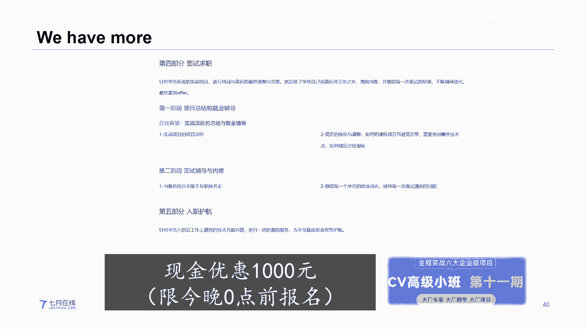

# 人工智能—计算机视觉CV公开课（七月在线出品） - P22：凭什么，Transformer在CV领域这么火 - 七月在线-julyedu - BV17z4y167dq

今天由我来跟大家聊一聊关于这个transformer，为什么在这个cv领域这么火。

呃今天呢在直播间里我们会呃随机挑选很大概是20多名观众吧，呃赠送大家一些关于呃福利方面的一些事情，比如说我们会随机挑选两名观众送出关于这个著名的花，说深度学习的话说，同时呢我们也会挑选呃。

15~20名同学呃，会送给大家一些关于我们7月在线vip的月卡呃，名额有限，大家抓紧时间呃，首先呢我先给大家介绍一下关于我们7月在线呃，我们7月在线呢已经成立了，大概是7年左右的时间，在这7年方面呢。

我们从呃人才培养，企业服务，高效服务方面，我们都有了很大的突破，那么7月在线主要是致力于这个智能时代的在线教育平台，与行业的综合解决方案，我们主要关注的是ai方面的人才培养，企业服务和高效服务。

嗯好我闲言少叙，话不多说，我们抓紧时间开始聊一聊关于这个transformer在cv方面为什么这么火，嗯聊这个之前呢，我们先带大家看一下呃，稍微回顾一下这个transformer的这个起源嗯。

众所周知啊，transformer并不是起源于咱们这个计算机视觉领域，嗯，transformer呢大概是2020年左右，是在自然语言处理nlp领域大放异彩，呃在transformer之前呢。

n l b领域大家都知道啊，他们主要是以rn为主循环神经网络，我们比方说我们稍微看一下这个句子呃，在这个句子当中呢，哎我们最开始是一个人，然后巴拉巴拉他说了一堆话啊，这些我们都不关注。

然后在这个地方我们可以看到诶这儿有一个代词his，然后巴拉巴拉再往后a再往后又出现了一个代词he，然后一直往后一直往后诶，你看又出现了一个人，然后又出现了一个his诶，那么这个时候就有意思了。

对于我们人类来说，当我们看到这段话或者是听到这段话的时候，唉我们明白这些his对吧，它都是跟最前面这个人名相关系，但问题是让计算机去了解呃，这个高深的知识对于这个计算机来说确实有点难过。

尤其是你看第一个his a和第二个his，第二个he他离最开始的这个人民，他这个距离是非常非常的远对吧，那么如何能从第一个单词一直到如此远的这个距离，它们能构建关系呢，在最开始的rnn时代啊。

这个是非常非常难以做到的，唉所以当时的学者就在研究，那么有没有一种机制可以去呃让这个机器去在远距离的读文章的时候，是读句子的时候，让他们原理的单词互相关注呢，诶那么这个时候呢大家都开始慢慢考虑了。

比方说在最开始的我们来看这种r n时代，诶，r n时代呢我们是很难考虑的，我们r n时代它那个标志就是encoder和decoder，那么我们知道啊，这个encoder和decoder我首先输入一句话。

诶，当我进来一句话之后，我一层一层一层地进行编码，我去学习了解这句话的一些呃理论含义，然后慢慢的我再把我编码好的这些销量大或者是嵌入空间的这些特征，我输入到decode这块，然后一层一层一层。

然后让它进行重构，如果我们可以做一些，比如说机器翻译啊，或者是呃那个一问一答呀等等等等，那么在这个地方呢也跟我们刚刚跟大家聊的，它有两个最大的挑战，第一个挑战就是这种长距离的关系。

那么第二个挑战呢就是它所在的这个平行运算，当然了，这些东西都是呃都是这个a r p里面的东西，我们在这儿呢呃不会跟大家就是说太多，因为我们今天主要还是关注在我们计算机是一个领域，当然了。

这些问题注意这些问题，在2020年的时候，由谷歌大脑它所提出的transformer a，从此之后这些问题将不再是问题，好嗯大家可以看到啊，这个呢是我们在这个transformer领域来。

transformer的这个呃最开始的论文当中，attention is all your need，在这里面我们给大家选出了一句话，呃。

当时transformer里在transformer他横空出世的时候，可以说是嗯让众多的学者眼前一亮，嗯可以这么说，transformer在嗯整个ai界的地位。

就好比当年的resnet在计算机视觉里的地位，而且在现在看来呢，transformer他这个地位完全是更加的就是这个更加的稳固，而且更加的突出。

因为transformer呢它不光光在a lp领域大放异彩，它同时进军了c v界，而且如果你去看其他一些领域，比如说推荐系统，还有图人机网络，那么transformer也开始有了这种一统江湖的感觉。

ok所以说这也是我们为什么在现阶段呢，会去更加的关注于transformer好，那么transformer呢其实它也是比较容易理解的啊，transformer它出现的时候也是在a lp领域。

那么我们可以看到左边右边这一块呢，就是transformer的这个基本的结构，那么对于transformer来说，它也是遵循着这种encoder加decoder编码和解码的方式。

那么transformer的核心思想呢就是这个注意力机制的，那么对于他来说诶，我们可以让每一个单词可以和他全局，就说整个一个句子当中，其他所有的单词我们都去关注诶，那么这个时候呢我们就可以关注到啊。

比如说人名和后面的那些代词，他们之间的联系比较紧密，而人民他可能和后面的比如说冠词a an这些东西，他联系的不是那么的紧密，那么这些都是transformer的一些呃核心的思想好。

那么这个图呢其实就是显示的这个transformer的一个encoder和decoder，当然了，如果你去看transformer代码的时候。

你会发现transformer的encoder编码器和decode解码器，它并不只是有那么一层注意，它并不是有一个编码器，对一个解码器，它不是它是一个呃众多的编码器和众多的解码器相辅相成的。

ok那么这个就是我们看到的这个自注意力机制，呃如果你去了解这个自助力机制的话，我相信大家对这个公式应该是非常非常的熟悉才对对吧，呃当然了。

我们今天呢也不会跟大家过多的去聊transformer的内部的一些基点，我们会把我们的目光重点地区放在这个关于关于这个transformer，在cv当中的影响嗯在这说一个给大家广而告知一个东西吧。

呃我认为呢这个是大家的一个福利啊，福利之一呃，在这一块呢，a你看如果大家去看那个7月在线的高级小班第11期的时候，我们会在其中某一节直播课当中，给大家重点的去深入的讲解一下关于自主利益机制。

cf tention和transformer的这个架构，同时呢我们会去带领大家诶从这个如何从rnn之间，从rn最开始我们一步一步挖掘self复杂且自主力机制。

然后再去慢慢的带着大家过渡到transformer的架构当中，我们会重点的去聊一下关于那个q k和v之间的关系，ok同时呢如何在transformer当中，我们为什么要加入这个位置编码。

同时我们再加上位置编码之后，我们又如何去产生这个多头机制，多出多头助力机制，那么在呃cv高一小班第十期当中，其中有一节课我们会专门的去跟大家分享，有一个好消息是呃，如果大家能在今晚零点前报名的话。

我们会给大家现金优惠1000元，呃当然了，大家可以就是联系我们的呃工作人员老师，我们的7月在线的工作人员杨老师呢，也会在我们的直播间里面来帮助大家进行报名呃，同时呢我们也会在今天呢呃随机挑选幸运观众。

我们送出呃，我们的月卡会员我们也会挑选两名呃，互动观众呢，我们给跟大家送出两本画书，好，我们继续来看一下，那么transformer大概是在2020年的时候出现嗯，但是有很长的一段时间呢。

我们并没有把transformer应用到cv领域当中啊，那个时候呢，与其说诶众多的计算机数学的学者在观望，transformer在n lp领域的这个成就吧，倒不如说当时我们很难去把这个transfer。

去运用到我们的计算机学院领域，为什么这么说呢，其中有一个很重要的原因就是我们没有办法把transformer的输入诶，给它进行变更，大家看啊，在nlp领域当中。

transformer的每一个输入a它每一个输入它其实是一个token，怎么理解这个token的token一般大家会翻译成令牌，当然我们很少进行翻译啊，你可以把它想成每一个token。

就是每一个单词的一个失量诶，我们可以用一串数字来表示每一个单词对吧，那么这样的话我们的每一个单词哎，就可以把它从从一个文字的形式，或者从一些字母的形式变成数学的形式。

然后一个一个给它推入到这个transformer的输入当中，那么这是一个序列的形式，但是对于图像来说，大家想啊，从对于图像来说，它每一个图像呢都是由一个一个像素点组成的，那么在早期的时候。

我们很难去把一个像素点转化成一个一串十样的形式，然后再把它变成序列放到传输方面当中，那个时候时候是做不到的，而且这是第一，第二呢对于文字或者是语言来说，我们每一个单词或者是说每一句话。

它都是一些高级的语义的形式对吧，但是呢对于但是对于呃图像来说呢，每一个像素它是天然形成的，它是一种非常低级的语言形式，那么这个时候呢对于transformer来说，他更擅长处理那种比较高级的语信息。

而不像那种就像一颗一颗像素那种低级的语音信息，那么这个是在早期的时候，我们很难把这个lp当中的transformer直接嫁接到视觉当中，诶。

不过好像又出现了呃v i t呢大概是我印象大概是在23年之后吧，哎他第一次把这个整个呃图像就是transformer的，从n l p a去处理了一些它的输入，然后就把它嫁接到了整个的计算机视觉当中。

诶我看到有的这个同学大家跟老师一起聊聊，哎奇怪的知识增加了嗯威猛的小老虎诶，微博小老虎，那恭喜你啊，你可以去我们区在线那个官网直播当中呃，看到一些我们更多的一些奇怪的知识呃，为了方便你呢。

你可以获得我们今天的这个呃一个月的月卡的这个优惠呃，我们可以送你一个一个月的这个会员，那个微博小老虎，你可以联系一下我们后台的杨老师，来跟我们杨老师一块来去领取一下这个会员，好吧好，我们继续聊。

那么vn transfer，他是如何把这个呃图像从一个一个的像素点转化成一些，就是这种一个一个的序列呢，它是这么做的啊，其实我们现在看起来呢也比较简单，他把一张图像，你看他把一张图像呢它去进行了切割。

切割成一个patch，一个patch，而这个patch呢大家看就是这一个个小方块诶，就是这个小方块，那么这样的话我们不对一个一个像素点进行转化，我们可以把这一个一个的小的方块。

我们把它叫做patch来给它进行一种血液的转化，这样的话我们就可以把呃，整个一个图片转化成类似于一种文字的一种序列的形式，那么我们就可以把它叫做batch，ok好，那么我们可以继续再看。

当我们把整个一个图片之后，诶，我们把它分成patch，同时我们把它拉成一个序列，就拉平flatten成一个血一个序列的形式，我们对它进行加入呃，就是诶你看把它转化成一个序列形式。

然后我们把这一个一个的序列变成了这样一个一串的数字编码，同时我们为了对图像加以限制，我们还会再给他加入位置的编码，为什么要加入位置编码呢，那是因为在位置的编码当中。

我们希望最后你看我每一个小的patch或者每一个小的小方块，它在我原始的图像当中，它是有一固定的位置的对吧，你比方说我们第一个小方块诶，第一个patch这个地方它必须得出现在我图像的左上角。

如果你把它放在右下角的话，那么这样的话这个patch或者说这个图像它是会出现问题的，所以说这个也是我们为什么要加入位置编码的原因好，那么当我们有了整个这个输入序列的时候。

我们就可以把它应用到transformer当中，诶，那么这个时候第一次transformer就成功地运用到了图像当中，我们把它称作vision transformer，好。

那么关于这个vision transformer里面的具体细节，包括它的这个呃代码的这个实验形式，我们呢也会放在我们的呃cv高级小班第11期当中，其中有一节在线直播课。

跟大家去仔细的聊一聊关于vision transformer的基本原理和架构实现，同时呢呃我们也会跟大家聊一些关于这个关于vision transformer当中，它的多层多层税率机制的这个使用。

呃另外呢关于这个transfer，我们在前面也说了，这个transformer呢它是跨跨领域实现的，包括lp，包括cv，包括推荐系统，也包括这个图形机网络等等等等，不光这些等等等等。

那么我们也会在这个里面跟大家聊一聊，关于这个transformer的这个跨领域实现的一些方法，呃有一个好消息呢，也是一个福利呢，呃想告诉大家，如果你能在今晚零点前报名的，我们会直接对大家做一个现金优惠。

1000元的这个福利，好，我们继续当这个愚人transformer呃，第一次进入就是transformer的，通过b站transformer，他终于在cv界成功的嫁接或者是实践当中。

那么后来呢又有众多众多的学者对这个呃vision transformer，做了很多很多的变体诶，很多很多的变体诶，我们现在看到了很多的这个，我们看到了这个很多的这个呃。

热心的这个呃朋友a一直关注了我们的这个呃契约在线的啊，呃我们现在汽车在线呢也会给大家送出很多的福利诶，像这个像同学像同学，你可以去联系一下我们的这个呃企业在线的杨老师，后台工作人员。

我们送你一个关于呃一个月的这个契约在线的会员，你可以在我们区约在线的众多的这些呃实战课当中诶，可以进行学习和浏览，好我们继续看一下呃，那么对于这个呃对于vn transfer来说。

它的出现虽然是第一次把transformer应用到了计算机视觉当中，嗯，但是哎我看我们的jd 404647184同学说，我要说没有问题，我们把我们的话说送给你。

你可以到我们的后台去联系我们的契约在线的呃，杨老师或者其他的工作人员，好吧好，我们继续呃，令人transformer出现之后，我们有了众多众多的变体，那么这个时候呢。

那么这个时候呢我们呃很多的学者都对他进行了改建，其中呢不乏很多佼佼者，嗯今天呢我们也跟大家去聊一聊关于这个sue transformer，sun transformer呢。

他第一次出现是在2021年的10月12号，他出现之后，他收获了当年i c c v的best paper的一个假象，大家注意啊，这个i c c v呢是和呃吹爆ai等等的一些。

就是著名的这个会议并称的这个顶会会并称的顶会哎，谢唐钰同学和这个我们的wx a哇，你这个名字很难念呀，w f c8 e4 b c e f8 e c91 c72 同学哎，你可以联系一下，我们的确在线的呃。

杨老师后台工作人员呃，我们会送二位关于这个汽车在线一个月的会员卡，好吧好，我们继续，那么i c c v的嗯，它的影响力可以说是非常非常的深远，那么对于c来说，如果你能有幸a在i c c v上中一篇文章。

那么可以说呃对于你的这个求职，或者是你进入高校等等领域，会是一个非常了不起的敲门砖，它的难度非常之大，更别说switch transfarmer，他收获了当年i c c v的最佳论文奖。

最佳论文呢只会在每年出现那么一篇，可以说它的难度非常之大好，那么呃那么c transformer呢如果你去关注的话，它其实是出现，它其实是由这个微软亚洲亚洲研究院他们所做出的这个啊。

他们所做出的这个呃一个非常呃可以说是划时代的，具有里程碑意义的一篇文章，贝尔亚洲研究院呢它的这个重量我觉得很多朋友对于他都有所了解，微软亚洲研究院他们推出了一系列非常非常重要的。

或者是说非常非常有影响力的呃，一些高水平的论文或者研究，当年的u s net系列，就是微软亚洲研究院他们所出现的好，我们呢可以去看一下所in transformer它到底解决了什么样的问题，换句话说。

为什么sin transformer他能获得i c c v2021 年的最佳论文奖项，我们来看一下，孙transfer呢，他当时提出了一个问题。

哎你看就是说我如何把transformer从a l p应用到cp当中，我们面临了很多的问题，你比方说唉对于这个输入来说，你看那么呃这纯入我们刚才所言啊。

我对于nlp transformer的输入是一个黑一，一些具有高级语义的这些序列，比如说我们说的每一句话，他或者说我们写的每些呃每一段文字等等，那么它是是抽象的高级语义的输入信息，但是对于图像来说。

我一个一个的像素点，这都是低级的语音信息，哎这是一方面，另外一方面呢大家看啊，我们所说的每一句话或者每一段文字，那么它们都是很很短的一段序列，对吧，呃你像如果大家对a l p有所了解或者有所耳闻的话。

那么我们的输入比如说128个字，256个字，那么都很短很短，a但是对于图像的数来说，大家想我们当年c n n它的输入非常非常呃，短期或者说非常非常小的图片，1米night的224x124。

他已经非常大了，我是说的像素，它们长起来的一个数字非常大的，不是说它的图片很大啊，它的图片其实很小很小，随着科技的进步和技术的发展呢，我们现在出现的图像但是越来越大，你比方说现在4k还有8k。

那么他们的像素点的乘积，那所得到的值那更加的大，那么这样就会造成了你图像的每一个像素点比信息非常的低，但是呢整个我的计算量又非常非常的大。

那么这个呃就是呃我当年的这些transfer或者微信transfer，它所暴露的一些这些问题等等等等，当然还有很多很多的问题啊，这是其中的一部分哎那么这个时候四运船的方面就说了，我第一个站出来表示不服。

因为这些问题必须得到解决，那么他想做的事情呢，就是说干脆我去设计一个关于计算机视觉领域的，一个比较通用的股价网络吧，general purpose bbb a呃，ai加热的同学问抽奖了吗。

当然抽奖已经开始了诶，这位同学你可以联系我们的7月在线的后台的工作人员，联系我们的杨老师呃，我们会在我们会送你一个月的7月在线的会员，你可以利用这一个月时间来去我们的嗯。

可以到我们的这个呃确认线的官网上任意浏览一些你喜欢的一些课程，好呃，请到我们后台联系工作人员好诶，那three transfer它的解决方式是什么呢。

他就提出了一个东西叫做shifted windows，诶，你看这种就是可迁移或者是呃可随意变化的一些窗口诶，它具体是怎么做呢，我们一步一步来看，这个图是sin transformer。

他们在这个官网上面诶，他们在官网上面，你看它所对比的sin transformer的结构和v t的结构诶，我们可以看到啊，我们先看v i t吧，那么这个v i t的结构比较明显，你看它在我这三层上面。

你看三层上面它进行了这个16x16的网格划分，还有这个16x16的网格划分呢，其实我们就是相当于把一个图像化分割成了一个一个小的patch，大家把这个patch就理解成为这个小方块就可以了。

那么这个时候你会发现啊，在这每一层的fish mac上面，对于v i t来说，它永远是16，就是我均匀的划分，你看它永远是均匀的划分a大家再想想我们cnn对于cnn来说，我们的每一层随着我们层数的深入。

那么我们的cnn的那个feature map，或者说它的特征图的深度是不是也在随之增加呢，但是vii at它却是诶一直保持，同样大家知道cnn当时的这个性能是非常非常好的。

因为cn有很多各种各样的变种a那么第一个想想法就来了，那么对于sin transformer来说，诶他想我有没有可能唉我把整个图像随着这个程序的深入，我也对它进行一下cn类似的这个深度的变更呢。

比如说我最开始是呃降采样四倍，再往下八倍，再往下16倍等等等等，a那么这个就是他transformer和vii t的一个区别，它这块完全是仿照这个cn来做的，呃管子系数同学。

你可以去联系一下我们的这个后台工作人员杨老师，呃，你可以获得我们这个关于呃区域在线一个月的免费的会员，你可以在7月在线的官网上面去浏览，你想去看这些课程，好吧好，我们继续，那么这是一个问题。

你看他是怎么做的呢，cn transfer呢，它就在每一层上面，比如说我最开始的数据上面，我对它进行4x4的大型窗口的划分，注意啊，这个时候这个这一个一个红框，那么这个就是大型的一个窗口。

就是windows，ok就是windows，那么再往后再往下深入的时候，哎我们对它再往下进行划分，哎你看诶我稍微划分成这样一个大windows等等等等。

那么这样就可以实现了一个类似于cn降采样的一个效果，那么除此之外呢，除此之外呢使用传统方法，它还有很多很多的这个更加细节的划分，你比方说孙权的方面说，呃，我如果对于这个呃v t你看vip这块大家知道啊。

v i t它所核心采用的还是transfer当中的自主力机制诶，那么这个时候如果我在图像上面诶，我进行这个他进行这个呃自由理机制学习的时候，你看我一个大的图像。

我相当于我sin transformer里面的一个一个窗口window，那么这个时候呢整个从牙里面它有你大家数一下，它有16个patch，那么16个patch做这个自助力基础学习，它的计算会很大的诶。

那有没有可能我我对那个所以transfer当中我减少它的计算量呢，哎注意啊，这个时候确实是有所帮助的，如果价格销量呢，我们稍后给大家一一解答好。

那么switch fer它还有很多很多小tricks在里面嗯，保证了它的精度的提升的同时，a精度提升的同时呢，它的这个计算量还往下降了，降a不用用，同学诶，你可以联系一下我们的后台工作人员。

可以来一下我们的杨老师呃，去获得我们一个月的汽车在线的会员卡，好我们继续，我们来看一下这个关于sin transformer的它的一个股价网络吧，那么对于sin transformer来说呃。

我们先看左面这一部分，你看首先呢是我们图像的输入，对于我们图像来说，它就是一个平平无奇的图像，长乘以宽乘以三通道非常平平无奇，你可以拿任何的图像来说，比如说我们可以用这个，因为是net的这个图像。

24x24x3诶，进来之后，我们对每一个图像我们做一次patch partition的一个操作，还有这个patch partition的操作呢，大家就可以把它想象成哎我就是对你的图像我就进行了一个分割。

分区域也仅此而已，我把它进行了一个呃分成了切割成一个一个小块，一个一个pet操作，然后再往下呢，哎我进入我第一个stage，注意我再往下的每一个stage呢。

它都相当于我一个soon transformer stage，当我第一个sage进入之后，哎你看我有一个linear in bin操作，而这个操作呢大家就可以把它想象成为一个呃。

我把我的一个就是一个图像分成ph之后，我把它拉成一个序列，拉成一条，同时呢我们也对他加入了一些位置信息等等的一些操作，就是他的linur embedding之后呢。

再往后我就是会接一个sin transformer block，还有psmogin，然后再一个switch fblock，那么这个就会形成一我每一个stage，ok这里给大家插一个小的一个插曲啊。

我们sin transfer，如果你去看看他的代码实验的时候，你会惊讶的发现在代码里面的每一个stage的划分，它和这张图像上面的划分它还有所区别，在代码当中。

soon transformer他做了一个这个事情，他把每一个soon transformer block向后的一个psmog，他把它画成了一个，他把它画成了一个这个呃sch，比方说你看这一部分。

如果你去看代码啊，这个是它的sg one，这样是它的stage two a，再往后stage four，当然在最后他少了一个沉默，因为它没有了嘛，这个是在他代码当中的实现，它和它的图里面反而有所区别。

哎大龙同学呃，呃非常欢迎啊，你啊你说涨知识了诶，我们今天送你一本我们那个花书，哎，你可以去联系我们的后台工作人员，联系我们的确在线，杨老师，你可以去联系一下，他去取得我们的话，说好吧好，我们再来看。

那么这个是sin transformer在代码中间的一个很小的一个tricks on，呃当然了，它还有很多很多其他句子，比方说我们如果去看sin transfer brock，它的结构的时候。

我们可以接下来看到右侧这部分，右侧这部分呢它就相当于一个它就相当于一个呃，encoder和decoder的感觉，诶你看我首先进行一个输入，就是比如说我们的图像。

或者是我们前面一个soon transformer stage的输入，比如说feature maps，当我进来之后，我首先过一个l n l n的全称是layer normization。

就是我基于每一层的，其次帕，当然了，在我们的汽车在线的这个呃cd 11高级班当中，我们也会带给大家给大家讲一下到底什么是那家transformer，那么layer transformer它有什么优势。

它又和其他的传统，还有和sorry slayer normalization a lization，它有和其他的其他方法，比如说batch normalization。

比如说instant noliation，比如说group nomination，看不到底又有什么区别，它们又有什么优势，在什么样的情况下该选择不同的计算方法呢。

我们也会在我们的c v高级班当中给大家一一做解答，嗯好我们继续，那么对于layer normalization进来之后呢，我们会输入一个，你看w m s a w就是window的意思，诶这是w啊。

就是window的意思，然后m s a呢是multi head a attention，k multihad attention，然后他接过w m c a之后。

你看在这个地方它又有一次残差的连接a之后再过一个lon noization，再过一个呃mmp多层感知机，然后再来一个长下连接，那么这个就是我们的第一个呃encoder，ok那么这一块呢就是呃第一部分。

注意第一部分出来之后并没有结束，而且它并没有结束，它之后呢哎又向后，你看它又向后引入到了第二个诶小小的这个框框诶，那么在这个小框和前面小框呢，看唯一的区别就是看。

这唯一的区别就是这个地方w m i c变成了s w m i c，而这个s的意思就是shift，ok就是shift，那么我们会在我们的cv高级cv高级小班第11期当中呢，给大家具体的去撸一撸里面的代码。

带大家去看一下w m i c和s w m i c它们之间的区别，包括他们的代码实现，那么感兴趣的同学呢可以去看一下我们的呃，可以看看一下我们的这个cb呃，高级小班第11期。

今天晚上零点之前报名的同学呢可以获得1000元的优惠诶，我看我们的k w s k w z s同学呢说讲的挺细的，当然我们会讲得更细，在我们的这个直播课当中，毕竟公开课当中嘛很难讲的更细。

但是我也会尽我的全力来带给大家讲的更细，a k wz同学，你可以联系一下我们的后台工作人员，等下我们的呃联系我们的杨老师去领取一个一个月的会员的资格。

你可以在这一个月当中随意的在汽车赛的官网当中各种各项课程哎，畅想一下，去看一下你喜欢的一些课程好，我们继续，那么我们先看一下patch moj，对于python模型来说。

诶它的输入是一个月的tensors，这个tensors呢可以是你最开始的图像的那个序列，也可以就是我们at或共同的序列，也可以是我们的这些feature map，诶对于他来说，你看啊。

tensor进来以后，有个四川的block之后，我们再过一个ph墨镜，墨镜好之后，我们再往下走一个switch block等等等等，我们可以具体的看一下这个patch mod的这个它的它是怎么实现的。

你看首先呢我们是一张图像嗯，也可以说是一个非常maps，ok那么在这一块呢我们就把它看成h乘以w乘以c，ok乘以w乘以c，长乘以宽乘以下通道哎，对于拍摄motion的操作来说呢，我们可以把它进行切割。

你看比如说我在这个地方，我们把它按照我们的呃这个窗口来进行切割，诶，这个窗口诶我们把它看成一个2x2的一个宽度和长度，哎，当我们把它进行切割之后呢，你看啊我每一个窗口变成了二分之h乘以二分之w。

我是不是就完成了一次创作的切割，当我切割完之后，你看下一步我可以对切割好的各个窗口，我把它做一个congation操作，我把它并排起来，诶，这个是不是有点像我们的这个c n n当中的这个呃。

feature maps的一种感觉呢对吧，有点有点有个那个意思了对吧，有那个滋味，然后我们把这个condition有了这个深度之后，我们对它进行一次layer norvisation。

这个lynomization呢可以说是这个是transfer当中的一个常规操作了啊，呃今天呢由于这个时间篇幅有限的，我们没有办法给大家展开这个layer normalization那些个具体探讨。

我们会在我们cp高一小盘第11期当中给大家去聊一聊，各种其次化的一些区别和优势，好大家看啊，我们最开始我的这个深度可以说是c，但是当我把它切割成四块的时候，哎我就变成了再给他做一个可限定性操作。

我的深度就变成了4c a，然后你看在视频传输方面当中，它做了一个linear projection a，他把4c变成了2c诶，这个操作其实最开始我们很奇怪，最开始真的我觉得很奇怪。

我明明已经深度已经有了4c了，我为什么还要把它变成2c呢，哎这个时候大家去看一下，我们可以看一下我们的图像的操作，你看cn的操作，我们最开始有一个image的操作，image的图像，我进来之后，你看啊。

随着我的层数的增加，你看我们在这儿开始256深度，然后512乘数变深了，你看我的这个depth是不是也在变声，而如果你去观察的时候，观察cn他们他们往深走的时候，他们的层数的那个深度会从最开始的呃。

比如说256c一直变变成二分之c就变成2c，然后4c8 c可以说它是按照二倍数往下走的，所以说这个时候呢cn transfer去借鉴cn，它也遵循了这个，他把每一层的深度变成了2c。

然后再往下下一个变成4c，再再往下一个变成8c，那么这个时候也是smogin它的一个小的cheese呃，学生有女同学跟老师说，哎老师这个画图的真用心，当然我们cba呃，我们这个企业在线的每一个老师。

在每一堂课堂当中呢，我们都会把我们的这个课件做一个精心的打磨，呃如果你有兴趣的话，你可以去联系我们后台工作老师，学生有理同学去呃领取一个一个月的这个呃7月在线的会员卡啊，7月汽车在线的官网当中。

畅想一下你所喜欢的各各种和一个知识，好，我们继续，我们再去回答刚才之前给大家挖的那个坑，那个问题，我们在最开始说嗯，遵循transformer呢。

它采取了一个叫做window的multitself tension的一个操作，那么在这个操作当中，它可以去把这个计算量大幅的降低，大幅的减少，诶，他是怎么做到的呢，我们带给大家一点一点的看。

一点一点的去深入的挖掘，深入的挖掘好，首先我们先看一下左边这个图，对于左边这个图呢，它这个就是平平无奇的打ma transformer的一个操作，我们把整个一个图像我们给它变成这个呃。

我们给它变成一个一个的patch，然后针对一个patch呢，哎我们做这个多头注意力机制，大家看下面这个公式啊，这个公式就是多头注意力机制的它的一个呃复杂度诶。

稍后我给大家去讲一讲它是如何达到或者如何求出这个复杂度，等不及我们在下一页幻灯片上给大家讲这个哎，初一同学你可以去呃我们的呃联系一下我们后台工作人员，我们的杨老师去领取一个我们一个月的7月在线的会员好。

我们再来看右边这个右边的这个就是刚才给大家讲的这个window multi head，self tan的一个方式，你看他是不是诶也把这个图像做一个bh moon的操作，分成了四块。

然后在每一块当中做这个mc，而他的这个结果呢我们可以看到啊，这个下面是它的复杂度好，我们是去看一下整个这个复杂度它是如何求出来的，在大众同学喜欢老师的课程。

那么你不妨去嗯浏览一下企鹅在线的这个其他的课程，你可以联系我们后台工作人员老师去领取一个月的会员，嗯去里面看一下我们具体的信息呢，也会在我们的cv高级小班第11期给大家了解到。

我们再往下看每一个这个公式的求导的时候，我们先给大家明确一些概念啊，首先你看在整个图像当中，我们来说或者是这个fish map当中，h这个h我们把它认为是我们的theshmap的呃高度，height。

fishmap高度，这个是高度，然后w呢我们认为是fishmap宽度，这一部分是它的宽度，那么除此之外呢，c就是常规操作了啊，c就是我们的depth k c就是我们depths诶，rome同学。

我对你很眼熟哟，你可以去呃我们的工作人员领取一个一个月的，我们的确在线的会员去畅想一下，我去看一下我们趣味在线的其他课程，好我们继续这个地方呢有一个单有个字母叫做m。

这个m呢就是我们的window size，你看我们把整个图像划分成为一个一个的小的window，这个地方我们划分成了四个window，然后呢每一个window size。

每一个window它都有它的大小，那么window size就是用m来表示，比方说我们在这个地方，我们的windows size是ok我们的windows是二，好来吧。

我带大家去看一下刚才这个公式mc它的复杂度它到底是如何做成的呢，好我们来看一下嗯，我们来看一下啊，这个就是我们transformer或者是vision transformer，他的这个具体的公式对吧。

我们今天不聊这个公式怎么来的，我们会在cp高级小班11期当中给大家进行解答，我们今天只看一下它的复杂度是如何求的，首先我们来看上面这三个公式，上面这三个公式啊。

哎这一部分它这一部分呢就是求了一个我对我本身的fish max诶，我做一个q k和v的划分，哎鹤阳同学说刚上就看到核心模式不错，诶，如果嗯嗯我们这个直播课其实会最后在7月在下面还有一个回拨。

会放在我们的官方链接当中，也方便大家之后的头部好吧，我们来看一下上三个公式呢，它是对q k，也就是对整个a矩阵，就是我们的feature maps，这个矩阵做了一个q k v的划分。

我们来看一下它是怎么划分的呢，你看对于a矩阵来说，a矩阵来说，它乘以首先乘以一个呃系数矩阵wq，而且w q呢就是我们关于这个q a索引值q的一个参数矩阵，w这是可学习的矩阵。

a的维度是a h乘以w乘以c，你看a h乘以w呢是我们的这个是我们的长和宽，c是我们的depth，而w这个可学习的参数曲线，它的这个呃维度是c乘以c，大家知道啊，矩阵相乘，哎我来我来用笔台给大家画一下。

对于矩阵相乘来说，你看我们的维度需要保证中间这两个维度必须是相等的，这样我们才能进行相乘对吧，你看这我们都是a都是c，所以说当这样的话，我们才能完成我们的相乘好。

那么之后呢我们来看一下它的复杂度怎么求呢，它的复杂度就是h乘以w，然后再乘以c乘以c，那么这个时候你会发现对于我第一个公式，我的计算的复杂度，欧米伽q就等于h乘以w乘以c的平方。

ok那么这是我第一个公式的计算复杂度，如果你去看我第二个公式的话，对于我第二个公式来说，我同样对于原始的这个特征矩阵a矩阵诶，我们对他找一个key关键字的一个呃矩阵，它也是乘以了一个可学习的wk诶。

可学习的这个参数矩阵，那么同理它的维度，你看它的维度跟上面的维度是一样的，所以它也是它的计算复杂度也会变成h w乘以c的平方，这个是跟矩阵的计算复杂度的计算方式一样啊。

那么下面是求这个value值的这个矩阵，那么它的复杂度也是一样，所以对于上面三个矩阵来说，我们最终得到的计算复杂度就是三倍的hw乘以c的平方好，嗯嗯我们搞定了，第一个，我们再往下看诶，你看这个公式啊。

首先我算出了k q v，这是第一步，第二步我会去计算这个分子q乘以k的转置好，我们来看一下它的维度，对于q来说，它的维度是h w乘以c，对于k的转折来说，它是c乘以h w，注意啊，这是k的转置。

c乘以10w，所以说这个时候矩阵相乘它们的复杂度，我们照样看a a h w和c乘以十差标全部乘起来，那么它的复杂度就会变成hw的平方乘以c，那么这就是我分子的计算复杂度，ok这是分子计算复杂度。

好这一步搞定，再往下根号d，注意啊，根号d是个常数k所以它它的计算时间可以复制，完全忽略，下一步呢就是在我们的soft max，在soft max的计算的时候，我们会发现他的时间微乎其微。

所以他们的计算复杂度我们直接忽略掉，我们不会再考虑微乎其微，再往下当我们计算完smax之后，你看我们还有一个值v没有相乘，所以这个时候呢我们乘以它的v，ok我们乘以它的v，我们可以看一下。

对于上面的矩阵相乘a它的维度是a乘以w乘以h w，我们取第一个v的维度是hw乘以c，所以它的计算复杂度就会变成hw的平方乘以c，那么这又是我们把我们的v矩阵也乘进来，好到此为止呢。

我们的attention已经计算完了，哎再往下呢我们别忘了我们还有一个输出，这个是o wo是我们的这个输出的一个可学习的参数，而在这个地方当中呢。

我们照样计算a h w乘以h w乘以c那么这个就是它的计算复杂度好，当我们讲完整个transformer，他的这个残忍的公式，包括他最后的计算复杂度的时候，我们就得到了我们的最终的公式a。

我看有的同学说怎么上来就讲这么复杂呢，呵呵不着急啊，我们如果你忘掉的话，我们还会看下面这一部分好嗯，诶我们看一下开美颜同学，你可以去联系一下我们的后台工作人员。

联系一下我们的确定杨老师去领取我们的一个月的，关于这个7月在线的这个会员卡，去里面可以嗯自由自在的畅想一下，就在线官网当中的各个课程好，我们继续来看，刚刚呢我们跟大家聊了关于这个v transfer。

它整个呃marty had deftention的计算复杂度诶，我们再看一下对于windows的计算，注意啊，对于windows对于sn transfer来说，它采取的是划分窗口，划分windows。

那么对于windows来说，你看他不会去整个计算呃，整个一幅图的这个复杂度，你看他在这个里面它进行了计算对吧，它就在这个里面它进行了计算好，这样的话它的复杂度如何计算呢，我们先来看一下嗯。

我们还是先沿袭上一个上一页当中，我们用h w c当做一个windows，其实就是整成一个图或者一个fishman当做一个大的运动，这个是我们刚刚推导出来的，它是计算复杂度，那么再往下看呢。

如果我把我的h换成m w换成m哎，我们做一次这个替换啊，它就会变成这个样子，我们完全是做了一次替换，就是我们没有再去算一遍，把h换成m w换成m m呢，是我的windows size好。

那么这个是我们的整个的window a，但是呢大家别忘了啊，你虽然这有整个的window，但是你前面还得再把你有到底有多少个n来进行计算，呃，这个应该是n个windows吧。

这应该是winn个windows这样一个问题，d o w s好，你看那你到底有多少个window呢，我们来看一下m是我的window size，它是怎么来的呢，它其实就是window size。

等于我们的h除以我们的n n就是在图像的高这个上面，哎我们到底有多少个，那么这个时候我们可以看到n就相当于什么呢，n就相当于h除以m，那么同理啊，我们对于整个图像和我们的windows来说。

我们都把它当成方阵，所以这个时候呢我们可以看到这个是n h也就是n h对于n w来说，它就也会变成w除以m m是我们的windows size好。

那么这个时候呢我们就可以把我们到底有多少个window乘到这个地方，就会变成我们最终的一个结果，好在这儿呢，其实给再给大家呃，多说一点，如果大家去看sin transformer的代码实现的时候。

你就会发现在swing transformer代码实现当中，它只是加了一个非常非常hard coding的一个限制，它要限制出诶，你看你的nh和nw必须是一个整数。

这个是他在于官方的资讯传统中加了一个限制啊，但是大家其实想一想呃，当我们实际应用当中的时候，其实很难保证它是整数对吧，那么这个时候其实你有很多处理方法，比如说一种处理方法，就是你去把这个图像。

你就把它resize成脸的一个整数，比如说我们拿音频net来说啊，imagine net的数是24，24x3，那么有有一个方法，你可以把你的输入图像reset乘24x24x3的一个整数倍。

这样的话你的nh和n w换，换句话说，你的窗口切分你就会变成一个整数，这是一种方法，但这种方法我不是非常推荐，因为这种方法你reset过图像之后，你势必会造成一些损失，那么还有的一些朋友呢，他会这么做。

我不对它进行resize，我怎么做呢，我对你的图像进行填充，我用零进行填充，填充的话，这样你就会把整个图像你做窗口切割的时候，你把它填充成24x24的整数倍。

这样的话你窗口切割你最后的nh和n w就会变成一个整数k，那么具体的实现方法呢，由于今天是今天我们公开课时间有限的，我们没有办法代替大家去实际的录一下我们sin transformer代码。

在我们的cv高级小班第11期当中呢，我们会带着大家去看一下这个它的代码到底是如何实现的，和我们有没有什么改进空间的哎，感兴趣的同学可以去关注一下我们的cd在线高级小八第11期。

如果今天12点之前任何同学去报名的话，我们都会对报名的同学诶做一个1000万的优惠，好我们继续来看，好我们继续来看一下，大家记不记得我们刚刚开始讲那个three in transformer结构的时候。

我们在看每一个transformer block的时候，我们会发现它的每一个block诶，它是由两部分组成，那么这两部分它唯一的区别呢就是一个是window w m i c。

一个是shifted window s w m c，那么它里面有什么区别呢，其实你看这个名字啊，我们就能看得出来它区别就在于这个shifted shifted。

我们去看一下它为什么要做这个shifted呢，首先我们来看一下这个图，那么在这个图当中呢，你看啊，我们是会对这里面的每一个patch，就是windows里面的每一个patch做这个注意力机制的计算诶。

比方说我这个patch他可以关注到同一个window里面的每一个patch对吧，你看我把它都给大家打上阴影，打一个点，我这些同一个窗口里面的所有的patch，它会互相关注，但是他却没有办法关注，他。

没有办法关注，这个是另外一个window里面的patch，这个是他不可以做的啊，注意这个是他不可以做的，那么这个时候就会陷陷入到一个问题当中，我对于我这个小白来说。

他只能关注于同一个window里面的不同的batch，换句话说他只能关注到的是局部注意力机制对吧，对于其他的，比如说其他的这些地方，它是没有办法关注到的，那么如果我们的窗口永远保持这个样子的时候。

那么我你所谓的注意力机制其实是残缺的，它是残缺的，我们希望的是全局注意力机制，我们希望的是每一个patch能希望它能关注到整个图像当中的每一个块，这样的话我才能解决这个呃。

long range长距离的一个关系，对不对，那么怎么来做呢，你想v圈传的方法，它不存在这个问题啊，它在整个一个图上面，我你就互相关注，但是它质量还大，那么这个时候他就想出了一个干脆我shift吧。

你看我每次shift的时候，我在第l层的时候，我是保持这个样子，我在下一个层次当中，我首先向右移动二分之m个距离，m呢是我的windows size诶，我先向右移动二分解m。

同时我在向下我也移动二分之m个距离，你看这个时候呢，我们就会把你看这样子呢，我们就会在下一层，我们就会出现新的九个窗口，a新九个窗口，你看这个时候当我移动移动完成之后，你比方说我这个小patch。

我在上一层我只能关注到他同一个window size对吧，我没有办法关注到这一块，这是在我上一层没有办法关注到的，但是在我下一层当中，你看他俩是不是属于同一个window了。

那么这个时候他们俩就可以互相关注了，那么sin transformer，他利用这种shift window的效果，它就起到了一个全局注意机制的一个一个方案a，但是啊注意想法是很好的。

但是现实是非常骨感的，他这么做，你确实能把局部转化成全局，但是如果我们去看一下计算量的时候，本来我每一个层，每一层每一个layer都是四个窗口，四个window size啊，四个window。

可是我这么幸运之后，我就变成了九个运动，而且大家注意啊，这个还只是我移了一次，如果再往下移动的时候，谁知道会出现多少个window呢，那么这样的话势必会在我计算的时候出现大量的问题，而且这是第一个现象。

我windows数量增加了，同时你看在我之前我四个运动的时候，我每一个窗口我的大小是一样的呀，可是你当你移动之后变成九个窗口的时候，我的大小每一个window大小不一样。

你比方说这个windo大小12x2，这个windo大小是4x2，还有最大的这一块是4x4，那这样的话你的计算量是不是会增加，对不对，我的初衷是减少计算量，怎么又变成增加计算量的。

所以说这个时候所以传输方面的学者呢，他又想了一招诶，你看他又想了一招，它使它的每一次每一层的这个window size都一样，他干了一件什么事情呢，很简单，你不是变成了九个了吗，对吧。

我把你这个我进行平移拼接一下，你看原来的a我给它放在这个地方，原来的b我放在了这原来的c我放在了这一块，当我拼移之后，我再次对他进行4x4的切割，你看这样的话，我是不是就成了九个windows。

又变回我四个windows了，数量保持不变，同时我这四个windows的windows size是不是也变成了相同的了，哎想法是非常好的，但是注意啊，我特别喜欢说，但是而且也希望大家主要抓我那个。

但是后面那句话，你看在我这种平移完之后，我对于我这一个窗口来说，反正你也是同一个窗口，就是你回到之前，你也是在这儿，你是同一个窗口，你里面的每一个patch你互相关注没问题。

但是你想对于我其他的这三个window，我们以这个为例，我相同颜色代表着我在我平移之前，它是处于不同的窗口之间，而我们知道不同的窗口，我是不能对它不同窗口里面的patch。

我是不能对它做这个呃自主意力机制的一个学习，不然的话你就变成了v i t了对吧，那么这个时候我们只能对这种相同颜色，比如说这四个点，他们之间去做自主力机制，不同颜色它就不能做，那么这个时候怎么办呢。

我们很简单，我们拿一个mask，我们拿一个野马矩阵诶，我们对它来进行标记，我们去标记出你哪些patch是来自于同一个窗口，哪些patch来源于不同的窗口，那么这样的话我们就可以去读取你这个mask诶。

我们就会知道相同窗口的好，这部分开始你们去互相关注吧，不同窗口诶，你俩颜色不一样哟，好你俩不可以互相关注，你俩必须形同陌路，那么这个就是它聊了一个叫做shifted一个操作，那么具体的代码实现呢。

我们会在我们的c位高级小班第十期当中带着大家去撸一下代码，好老师用这个图呢去给大家去做了一个，这个图呢我带大家去就是做了一个划分，其实你看啊，这是我们的原始图像，就乘以九，a9 乘以九。

然后呢呃我们还是为了保持跟前面的呃，就是跟前面的那个啊论文当中的原始的那个图的花粉保持一致啊，我们这是我们的a绿框是我们的c篮筐是我们的b好，篮筐是我们的b你看这个时候呢，a代表0号区域。

c代表1号和2号区域，同理，b代表3号和6号区域，好，我们首先进行挪动，我们第一次挪动的时候是我们把c移动到了这里，好，这是我们的第一次挪动，那么这个时候我们的区域就会变成012放到下面啊。

对a号去真正走动了啊，01号放到下面，然后上面的保持不变，这是我的第一次能动好，我们再次进行挪动，我们会把纵向的就是这一块纵向的我们挪到了这边，好这个时候呢你就会发现我们的360区域，这题有意思啊。

360区域诶变到了这个图像的右侧，然后呃同理啊，一二点还是在下方好，当我们shifty完了之后，诶，shift完了之后，我们再进行这种4x4的一个大的一个窗口的划分，我们变成四个运动啊，不是4x4啊。

应该是四四个windo好，这个时候你会发现5号和3号区域就变成了一个大的运动，你看这个是5号三个区域，形成了这个window最下面最复杂的区域呢，0268它形成了新的一个window。

然后4号区域它和它之前原来的window保持不变，ok那么这个时候我们就需要在每一个window里面做我们的自助力机制了，但是别忘了我们刚才说过，你这些是我平移之后的。

我需要记录我平移之前每个windows每个windows里面它的patch的归属好，怎么计算呢，诶我我们在这个计算之前，我们先看一下，这个是老师给大家呃做了一个就是呃叫做sally shifting。

这个是他论文代码当中实现的一个方法，他做了一个平移之后，你会发现你看这个区域跟老师刚刚那个话题区域一样，平移之后原始的图像呢就会变成右侧这个图像，ok就会变成右侧这个图像，好，我们来看一下。

我们以5号区域和3号区域为例，给大家讲解，5号区域和3号区域呢，对呀，然后我们大家知道他们俩会合成一个新的window，而是一个新的windo，但是最新的windows里面是来源于两个不同的区域诶。

我们区有三个区域，5号区域的patch内部可以做呃，这个自主力是自注意力机制的学习，5号区和三区域相互之间不可以学习，我们以5号区域的0号ph为例，你比方说在银行配置当中，如果你指数自助力机制。

你会发现他会把每一个字注意机制都有研究，比如说a00 代表着0号区域和0号区域内部的一个关注，a01 代表0号，0号patch和1号patch，他们之间那个呃呃自制力的这个系数。

同理a02 是0号区域和2号区域a的一个自由的系数，但是我们可不希望0号区域和2号区域互相关注啊，所以我们怎么做呢，我们可以看另一部分，就是我们给他讲个100，直上减个100。

我们知道对于smax这种函数来说，当它的值是一个负数的值的时候，soft max的结果是会趋向于零的，那么这个时候它是不是就相当于你0号区域，0号patch和2号patch，他俩关注了一个寂寞。

因为你的soft max或者说你的这个阿尔法零二或者a02 ，它是零，相当于他俩没有进行关注，所以这个就是为什么我们需要有一个mask来去标注诶。

标注这个同呃这个同一个windows里面就是shit之后，这个windows里面他们的这些小的patch到底是哪，来自于平行之前的哪一个区域的好。

那么我们的阴影部分就相当于是我们的这个我们的这个mask好，具体的方法呢我们会在我们的cv高级小班当中嗯，带着大家去撸一撸你们的代码，去看一看代码当中如何实现的，那么如果大家对我们的高级小班关心的话。

我再给大家说一下，关于我们更多的高小班知识，我们稍后再说，那么这个图呢是这个sin transformer官方代码当中呃，它的一个性能图呃，今天呢我在公开课当中。

我并不想过多的去带大家去关注一下这个性能的里面的一个具体指标，但是在这儿呢我想跟大家说一个事儿，如果你去看一下这些指标的话，你会发现你会发现啊，所以传统方面它的强大之处，他不光光可以做。

你想要分类它这个太太简单了，对于他来说，所以说它不仅仅是可以作为一个非常强悍的一个bbb股价提取网络，就是特征提取网络诶，大家知道之前一个非常具有里程碑的一个background是resnet系列。

那么现在ctransformer横空出世了，好那么three transfer它除了作为一个特定地区的强力武将网络之外，他还可以做下个任务，比如说目标检测，比如说实例分割，比如说视觉追踪。

比如说交叉领域的，比如说生物医学，医疗等等等等，那么这个都是孙transformer的强大之处，这也是为什么我们说three transformer，它是它的地位。

相当于当年renet系列在计算机视觉领域的地位好，呃由于这个公开课的时间有限呢，我没有办法去再给大家展开sin transformer，我们会在这个cv高级小班第11期当中，诶。

我们去跟大家聊一聊sin transformer的一些具体细节，大家以为我们在这个cv高级小班第十期里面真一讲cn transfer呢，那就可可就大错特错了，我们会在cv高一小班里面。

除了前期的理论学习之外，我们还会带给大家做六大企业级的项目，哎我们带大家一个一个来看一下我们有哪六大解析项目呢，首先第一个企业级项目呢是我们的多模态系统，那么对于多模态图文系统来说，诶大家知道啊。

当今呃这个人工智能或者是深度学习，他们研究的领域，我们已经很难满足于单独的去关注某一个细小的细分领域，我们以我们的野心已经不局限于此了，那么现在的很多人去去关注如何跨领域研究，注意啊。

我这样说的话语还不是交叉学科，交叉学科，我们稍后再聊跨领域，比如说我们可不可以把nlp和cv，我们把它俩a融合在一起一块研究研究呢，对吧，你看nlp它的输入是每一个文字或者说每一个文本或者是语音。

这些都是高级语义呀，自然界原本不存在，是我们人类发明出来的高级语言，而图像是我们的低级语言，我们有没有可能去把高级语音信息，文本信息或语音信息，让他去辅助我们的这个呃这个呃计算机视觉来去。

更加的高效的去提取一下我们里面当中的这种啊这种视觉信息呢，哎当然可以了，那么这个就是多模态领域所理解的，你别看文本图像诶，我们把它凑成一对一对的，然后我们继续就可以把它丢入到我们的多模态模型当中。

那么这个里面它有很多很多比较经典的这个比较经典的这个方案，比如说keep c r i p clip模型等等等，那么我们会在我们的第一个企业级项目当中跟大家聊一下，a多模态图文搜索系统好，那么第二部分。

第二个写进项目呢是基于自监督学习范式的视觉编码系统实现，什么是自监督学习呢，说到自监督学习的，我们就得跟大家说说有监督学习和无监督学习，比如说我们之前的那个图像呃，图像识别就是对图像进行分类。

哎我们的数据是一波图像，然后我们会告诉呃这个我们的机器它的label是什么，或者它的分类是什么，这个叫做有监督学习，对于注意啊，对于我们很多在企业当中实际应用的时候呢，我们会发现模型不是问题。

问题是我们的数据标注，数据标注是最花费时间的，那么这个时候大家就想有没有可能做不让他进行实验的标注呢，就不做人工的标注呢，那么这个就是衍生出的这个无监督学习，但是无监督学习到它的性能有点野蛮。

它不像人没监督那么让人去放心，所以这个时候呢大家又出现了一个自监督学习或者是半监督学习，我去告诉我的机器诶，我给你一批数呃，呃我给你一批就是人工标注的一些数据，然后绝大部分人都是没有人工标注的。

那么我希望机器在有在这个人工标注的这部分数据充分的学习，同时去自我的标准，对于那些没有标注的，那么这个就是无监督学习啊，不知道这个就是半监督学习，也叫做自监督学习，那么这一块特别有实际应用啊。

比如说老师跟学生讲课，老师给学生来讲一些示范的一些例题，那么剩下那些习题册唉，学生你就可以学习好了，老师给你的例题就是人工标注的一些东西呢，你就可以对一些剩下大量的没有标注的那些习题做一个自我的学习。

那么自监督学习其实是一个非常老的话题了，那么对于他来说，我们如何用我们的transformer，哎，如何用我们的transfer对它进行一个深度学习呢，或者说对他进行一个更加高效的利用呢。

那么这个就是我们在企业项目二当中，在这里带领大家去研究的，我们会在这个企业呃，这个项目当中呢去给大家聊一下sin transformer具体的代码实现，我们每一个项目都会去带着大家去撸一撸代码，去爽。

去爽一爽代码的感觉，诶如果大家能在经历完嗯，12点之前报名，可以拿一个我们的呃1000元的优惠券，直接直接呃去掉1000元，好，我们继续a3 ，刚才说错了呃，这个自研都学项目二呢。

我们会带大家聊一下关于这个m1 ，还有还有i bought，那么这些都是大佬级的算法好，那么在项目三当中，我们会带着大家去看一下关于这个呃sin transformer。

对于transformer的具体的代码实现呃，那么在这个里面呢，我们跟大家聊一聊这个transformer based视觉特性提取系统，除此以外，我们还会跟大家在这个项目当中聊一聊高效的并行计算。

高效的并行计算，o大家知道啊，我们计算我们就我们训练我们的模型当中，如果你只有一块显卡的时候，你会发现你的计算的时间非常非常的长，而且也导致你的效率很不高，呃同时呢你的这个每by size也比较过小。

那么如果我们有多快显卡的时候，我们就会做并行计算，增加我们的提高我们的效率，增加我们的精度，那么现在很多很多公司可以说基本上我不敢说所有的这个a i公司，但是绝对是a i公司，他们都会去玩并行计算。

那么它又是怎么实现的呢，它的原理是什么，同时它在代码当中该如何实现呢，我们也会在这个第三个企业级项目当中带给大家进行学习，好我们再往下看，那么下一个项目呢是这个计算机视觉跟踪系统，嗯，大家知道啊。

关于这个视觉跟踪呢，它的难度非常大，你看我们最开始是目标识别对吧，最开始目标识别在目标识别的基础上，我们出现了目标检测，哎在目标检测的基础上呢，我们下一步就可以做我们的tracking，视觉跟踪系统啊。

我们就可以做tracking了，还tracking的难度，目标跟踪的难度它比目标检测的难度还大，但是它的实际应用实际应用项目意义却比目标检测也更大，哎你比方说我们看下面这个图。

我每一个汽车我不光用框框给你标注，同时我还需要对你进行一个追踪的感觉，我需要比如说这是1号框，这是2号框，这是3号框，对不对，然后在下一层的时候，你是否还在在的话。

同一个汽车我给你分配同样的i d等等等等，那么这个是视觉追踪的过程，它的这个应用比较广，比如说地铁站高，还有呃什么高铁，还有机场的入口都会有这种视觉追踪的方式，大家看那个好莱坞的科幻电影啊。

他们有那种比如说呃通过那种多个摄像头而去实施追踪那个嫌疑人，那么都是用的视觉追踪的技术，那么我们会在第四个企业级项目当中跟大家聊一聊视觉跟踪系统，ok那么这一块呢我们还是那句话。

如果大家能在今晚零点前报名，灯会直接享受1000元的现金优惠，好我们继续下一个项目呢是基于深度学习的图像分割系统，诶那么图像分割呢它的应用也非常广，你比方说在这个分驾驶，self driving当中。

无人驾驶当中，我们需要知道我们的场，就对周围的场景做场景感知，那么我们会用到这个呃分割系统，比如说实例分割，比如说语义分割来，我们对它对周围的场景做一个认识，相同的属性的物体。

我们会用相同的颜色对它进行区分，那么同样分割呃，可以说也是一个很老的话题了啊，那么在这么长的时间当中，图像分割到底已经发展到了什么程度呢，这个时候大家就可以去我们的第五个项目当中去深入的了解好。

下一个呢是我们第11期项目新增的一个呃，一个项目叫做行为识别与分析系统，那么在这个项目当中呢，我们会去带着大家去了解一下什么是信息识别与分析，大家看我们在早期我们只能做目标识别之后。

我们可以做detection，再下一步注意啊，再下一步就有意思了，我们可以做人体姿态估计，人体的自带估计，当你有了人体自带估计的，你是不是可以就在估计的基础上面做一个行为识别与分析的。

ok可以说前面识别与分析系统的就越往下游任务走，它对我们整体系统的难度就更加的加大了，那么我们呃在c v d 11期，我们也是首次新增了一个新的项目，新增识别与分析系统，我们之前是并没有这个项目的。

呃我们也是花了很长的时间，我们去精心打磨这个项目，进行打磨课件，进行延时代码，然后精心的去设问，思思索如何才能把这么复杂的系统来一点一点的抽丝抽丝的剥离出来，给大家呈现，让大家全部明白。

那么这是我们的契约在线的一个使命，呃，那么感激的同学的话，你可以去关注一下我们的cv高级小盘，第十期，你以为就仅仅而言吗，我们不止如此呀，其实我们还有我们在第11期里面还新增了关于实战当中的。

你看模型量化与知识蒸馏，这些还有超大模型量化与蒸馏实战，那么这些都涉及到了模型压缩，还有模型的量化，它的意义是什么呢，因为我们在实际生产当中呢，我们会发现在企业里面还有或者在高校里面。

我们通常都会把这种超大规模的模型去压缩，变成一个小规模小尺度的模型，还有这个小的模型呢，它的精度诶，它的精度会保持不变，如果精度受损的话，也会让它局限在2%的这个曲线当中，就是你进度。

你不能从100%或者百分之九十八一下给我掉到50%，那我要你何用，但是如果你从98%加到了96%以内，那么在实际过程当中，实际生产过程当中，国内这么小的精度的这个呃损失我可以忽略不计。

但是呢我的魔仙大幅度的变小，这样的话我们就有可能是把我们的呃，就大模型迁移到我们的签署系统当中，或者说迁移到便携式的小系统当中，为什么这么多呢，比如说你的手机，你手机的功耗。

你手机的电量肯定没有你计算机或者是呃超级计算机，笔记本，台式机这种的那个功耗大，对不对，那么这个时候我们的小尺度的模型就有了它的实际意义，我们也是首次在计算在cb高小盘第十期当中呢。

引入了众多的关于这个模型，部署模型，压缩等等等等的一些就是等等等等一些知识点，也是我们首次的一些，所以感兴趣的同学可以去我们的cv高小班第十期当中呢去看一下，我们如果能在今晚零点前报名呢。

我们有一个100元的现金，1000元的现金优惠，sorry，1000元优，除此之外呢我们还会带着大家去聊一聊关于图神经网络这一块，大家知道啊，现在图神经网络真的是火的一塌糊涂。

那么我们也带着大家去聊一下关于图神经网络的一些系统，诶他的一些应用，你以为就这些项目吗，当然我们还有一些其他的一些项目啊，是在我们之前的一些呃cv呃，高级的前前几期呢，我们当中的一些呃一些这个项目。

我们也以在线视频的方式也呈现给了大家好，7月在线呢在高一小班当中，我们不同于其他的这种呃在线教育机构，我们呢还有最关键最关键的就是为大家的将来的面试求职保驾护航，我们会有专门的求职辅导老师去。

首先带着大家去给大家讲解一下如何去打模拟的简历，如何在面试当中a获得一定的优势，去和你的面试官进行博弈，如何呃在呃进入公司之后，唉，最开始的适应期如何快速度过，那么7月在线都会为你保驾护航，除此之外呢。

契约在线还有一个比较一个强优势，就是这个内推我们会呃，因为我们有着7年的办学经验，我们有跟很多的互联网大厂嗯，都都跟他有着天然的联系，所以呢我们会对我们的学员高级班的学员啊，极限高级班的学员。

我们会对第一个职位的内推来帮助你最后进入这个嗯，嗯早日拿到大厂的offer，ok那么这个都是我们cv高级小班第11期的一个新的优势好，另外呢我们也希望对大家提出一个新的一个呃项目。

是做这个ai学术论文的一对一辅导，因为我们在这么长时间的办学当中呢，我们会发现有很多很多的朋友，他们都会对发表论文有着一个硬性的要求呃，你看王小李说你的硕士博士需要毕业，你需要论文啊。

那么当你进入公司或者是进入高校，尤其是高校，你拿到论文，你发表了很多高校的s a论文，这个时候呢你才会那么这个时候你才会有往上爬的可能性，那么基本上说对于这个论文来说呢。

是你们是很多同学很多朋友的一个硬性要求，同时呢也是非常头痛的，他笔录代码难多了，路代码其实对我们来说很简单，只要我们其实大学老师帮助大家诶，就很容易搞定，但是论文可没有那么简单简单。

所以说我们其实在现在又提出来一个一对一的论文辅导，我们会对每一个报名ai学术论文圈的这个学员做一个一对一的摸底，一对一的排查，然后针对你的研究方向，或者是你感兴趣的研究方向。

然后我们会专门有迷失带领大家去呃做一个论文的深入的研究，同时来来帮助你，对你对这个论文发表进行一个辅导，那么感兴趣的同学的话，可以就是看一下我们的这个ai学术论文的一对一辅导。

那么呃今天的课件呢会同步更新到我们的这个群里面，大家可以联系我们后台老师要一下，同时我们的这个直播的公开课直播视频的也会呃，也会最终发到我们的官网上面呃，如果大家来得晚，或者是说还想回顾的话。

也可以到我们官网上去去看一下我们的这个ai学术论文的一对一辅导，和我们的cv高级小班的第11期，ok嗯，ok那么今天呢就是我们的公开课的全部内容好，那么还是那句话。

如果大家呃可以在我们的今晚12点之前报名，我们cv高一小班第十期的话，你可以享受一个呃优惠1000元的一个福利好，那么我们今天的直播就先到这里喽，呃拿到我们的a不能说的秘密。

诶这样你去问我们的呃后台工作人员老师，要一个一个月的契约在线的一个会员卡，好吧，呃这个也是我们送你的福利，张敏同学，我应该已经送给你了吧，如果没有去领取的话，抓紧时间和我们的后台工作人员老师。

或者是你去和你认识的任何一个7月在线的一个工作人员，7月在线的老师，你都可以去问他要这个一个月的会员卡啊，你就去跟老师说是呃cv庞老师给的好吧，让你同学不能说的秘密，还有前面我们点的一些幸运观众。

ok好，那么今天呢我们的直播就先到这里了。

那么首先祝大家生活愉快，工作顺利，同时呢如果有兴趣的同学呢，我们也希望大家早日的来到我们的cv高级小班第11期，同时也早日的拿到我们最终的大家心仪的大厂的offer好，那么今天的课程就先到这里。

那么祝大家嗯早点休息晚安，别忘了，如果感兴趣的话，去我们的cv高级小班，抓紧时间报名又好，那么我们的今天直播就到这里。

