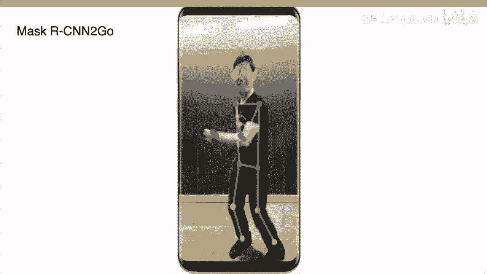
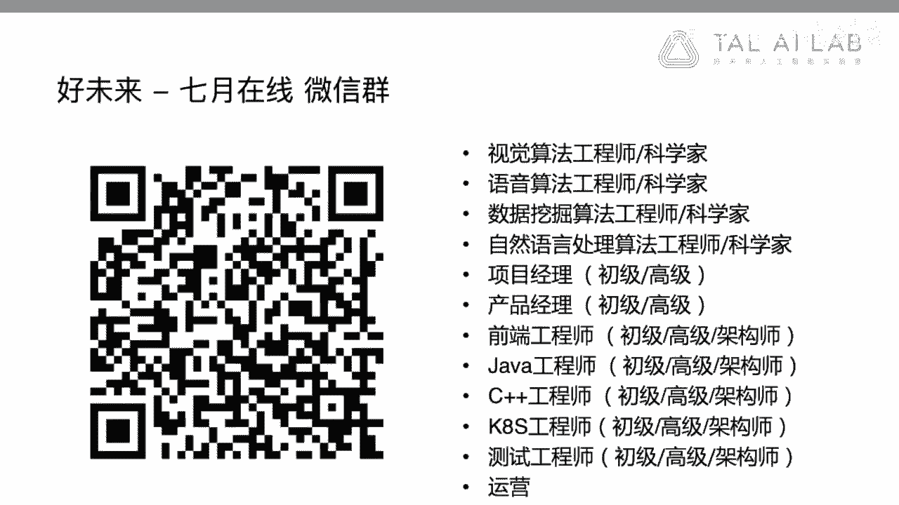

# 人工智能—计算机视觉CV公开课（七月在线出品） - P3：计算机视觉技术跨平台应用实践 - 七月在线-julyedu - BV17z4y167dq

呃，那我现在开始呃，7月在线的各位伙伴大家好，我叫杨飞，是来自于好未来AIlab的算法科学家。呃，今天呢我很荣幸来参加这个分享活动。我分享的题目是计算机视觉技术跨平台应用实践。😊。

呃，那我先简单介绍一下我自己。呃，我是去年呃也就是18年8月份的时候加入了好未来AI lab。呃，作为算法科学家，主要是做这个计算机视觉以及一部分跟语音相关的工作。那在之前呢。

我是在facebook呃工作了5年多的时间，呃，同样是做计算机视觉方向的算法科学家。呃，那在之前呢我是在新德西州立大学呃拿到的博士学位。呃，在中科院计算所拿到的硕士呃，在清华计算机系拿到本科，呃。

中间呢也曾经在微软公司短暂工作过一年。😊，呃，那我今天的题目呢是计算机视觉技术，跨平台应用实践。呃，这本身是一个比较宽泛的题目。啊，所以说我分享的内容呢不是专注于某一个具体的问题或者某一个具体的方法。

那这里边呢会涉及到一些方面。呃，比如说呃如何构建一个大规模的后台云服务。呃，如何在移动端呃去开发和部署我们计算机视觉的模型。呃，以及最后呢就是跟我现在的工作呃比较紧密相关的。

就是如何把AI技术应用到教育场景当中。呃，这里边呢我会介绍一些我自己的工作。呃，这个呃介绍一些这个行业发展的现状，呃，我自己的工作呢，以及呃我现在和以前的同事的一些工作。呃。

同时呢我会讨论一下这个实际产品当中遇到一些问题和挑战。

OK好。嗯，那么现在呢对于呃像互联网公司或者像其他很多行业，我们都有海量的这个图片和这个视频的数据。那从这些是数据出发的话，我们常常希望回答一些关于数据的问题。

那比如说那像这个呃PPT里边的这张这个例子啊，那么这是一张呃照片呢，还是一张这个素描的话，那么这张照片当中呢，包含什么是包含人吗？或者还是包含什么样的呃什么样的物体。那么这里边如果是人或者是物体的话。

他们看上去是什么样子的。那么他们在做一些什么事情。那么这里面它是一张呃室内的场景呢，还是一个室外的场景，它是一个风景名胜吗？或者说这个图片当中包含一些文本的信息吗？如果有的话，这个文本是什么？

那同时呢呃也有很多这个产品比较关心的是那这个图片是不是一个呃含有一些不良的内容。如果有的话呢，需要从这个互联网平台上把它过滤掉。

OK那么这里边呢就会用到很多这个AI技术，以及这个卷积神经网络，用来做这个图片的分类和物体检测的技术。那么对于卷积是呃卷积神经网络的发展历史，大家应该已经呃相当的熟悉了。

那么第一呃我这里面可以快速的总结一下。那么第一个成功应用的卷积神经网络呢，是闫兰坤在98年开发的李奈。呃，闫兰坤本人呢，后来呃当时呢是在这个贝尔实验室。那么后来呢也是呃呃成为这个深度学习的开创者之一。

那么在13年的时候，他加入facefacebook领导了facebook的人工智能实验室。呃，那么98年的时候呢，他做的这个算法，其实是呃本身呢是一个只有5层的一个神经网络。那么它结构很简单啊。

只有卷积层下载样层，然后后边呢再加上这个最后是一个全连接层。那么最后呢网络的输出呢是数字0到9的一个类别的标签。那么这个结构虽然很简单。但是呢在当时已经能够很好的取得这个手写体数字识别的效果。

并且呢已经这个算法呢实际上是在跑在这个ATM自动取款机上面。那么到12年开始呢，就是出了alexnet之后呢，实际上大家充分正呃认识到了这个卷积神经网络，它的这个呃它的价值。

所以说呢这个alexnet在12年是一个第一个大规模的卷积神经网络，并且呢它赢得了12年的agenet图片比赛，图片识别比赛的冠军，而且呢大幅度领先之前传统的方法。alexnet呢有5个卷积层呃。

和三个全年阶层呃，并且呢使用re去做这种非非线性的国一化。那么跟其他传统算法相比的话呢，它的精度提高了呃20%以上。那么从呃Alexnet开始呢，就有大量的研究，呃。

是把这个深度呃把卷积神经网络和深度学习应用在图片的分类领域。那么在14年的时候呢，有了两种更深的神经网络。那，第一种呢是这个牛津大学，他们提出来这个VGGnet和alexnet相比呢。

这个VGGnet它的网络深度，从8层，提高到了16层或者19层。啊，这里边它叠加了多个三层3的一个卷积层，所以呢它的结构看上去实际上是非常直观。那这里边就有一个问题啊。

就是为什么把这个多个3乘3的卷积层叠到一起的时候，可以得到一个更好的效果呢？那每一个3乘3的卷积层，它的感知范围只有这个3乘3个像素，对吧？但是我们当我们把多个3乘3卷积呃叠加到一起的时候。

比如说VGG里边是16层或者19层。那么这个时候呢。就相当于呃这个时候每一个像素它的感受也就得到了很大的扩大。啊，比如说如果我们把3个3乘3叠到一起，它实际上等价1个7乘7的一个卷积。那么同时呢。

因为它的网络结构更深，那么它有更多的这种非线性运算在里边，以及更好更少的参数啊，那么同呃那么它就比较适合做这个计算机图片的呃，就做计算机图片的分类。那么在14年的时候呢。

还有另外一种网络结构叫googlenet。他当时赢得了当年的net比赛冠军。所以呢当时VGG只是差了一点点，这个遗遗憾呢得到第二位。那googlenet呢实际上是一种更深的网络结构。

大家可以看到它的网络结构跟VGG比的话其实复杂了很多。它一共有22层，同时呢它使用一种叫inception的一种模块。那这里边inception呢是一种局部的网络模型，啊，它包含多个分支。

这里边有1乘1的这个分支，有3乘3的分支，还有5乘5的分支，每个分支呢是一个卷积。那么它把所有这些分支的输出呢，通过并行连接起来，同时呢为了降低复杂度。

还使用了这个1乘1的这种bottlene瓶颈层来降低这维度。那么跟alexnet和VGG相比呢，这个goglenet大幅度减少了参数的数量。

它只有这个500万的参数比它只有500万参数比alexnet小了12倍。同时呢效果也有了提升。那么VGG和glenet都是通过更深的网络得到更好的效果。那如果我们继续加深这个模型的深度。

那么我们能得到更好的效果吗？那么在呃针对这个问题呢，其实凯明做了很多的研究工作，那么他的研究显示了简单的去叠加更多的层只会使模型的性能变差。那这里边一个重要的原因呢，就是当我们叠加层数越多的候。

那么反向传播实际上会导致这个整个梯度的下梯度的消失叫那么那么如何去避免这个反向传播当中的梯度消失的问题呢？那么明就设计的这种叫resnet残差网络。那么net本呢是一种新的网络结构。

它呢提出了提出一种跨层连接，那就像我们这个呃左边这幅图，这个这个曲线所示，那么通过跨层连接呢它可以跳过一层或者跳过多层。

这样的话呢这个网络不再是拟合从一个输入X到一个输出的Y而拟合的是这个输出和输入之间的这个残差Y减X。那么通过这种网络设计。那么这样的。差呢其实更容易被拟合。那么通过这种方法的话。

ressonnet可以训练到150层，甚至可以训练到1000层。呃，ressonnet赢得了15年的呃各项意net和coco竞赛的冠军。同时呢也是16年的CPR best paper。

那现在我们已经看过了几个这种呃做图片分类的网络模型啊，那么我们比较这几种模型的话，可以把这些模型都画在一幅图上。那这幅图当中呢，Y轴是图像识别的精度。X轴呢是运行模型时的实际计算量。

那么这里边的单位呢是10亿次加乘运算。而这样这张图当中的圆圈的面积呢表示的是模型的大小，也就是这个模型包含的参数的数量。啊，这里我们可以看到alexnet呢是在这个图片的左下角。

那么它是第一个提出来的这种大规模的做图片分类的模型CN模型。所以呢它的这个模型很大，因为它的面积很大，参数很多。但是呢呃这个Alexnet本身它的计算量不大，所以呢它呃它在这个整个X轴来讲。

它是靠最左边。同时呢它相对于后续的这些模型来讲呢，它的精度也是比较低，所以在Y轴来讲呢，它是在最下边。那么在这张图的上边呢，我们可以看到，像包括inception也好，像resnet也好。

那么它呢在精度上来讲，它可以得到很好的精度。而同时呢它的这个网络的大小和运算量也都比较适中，是属于比较小。而这张图的最右侧，我们可以看到像VGG和VGG的16和VGG的19。那么它都是相当大的模型。

这个整个圆圈占的面积很大。同时呢它这个网络计算量也很大，属于这个X轴的最右边。那么它的精度呢是要比早期的Xnet要好一些。但是呢是比不过后边的inception和resnet模型。

OK那么看完前面四个模型以后呢，我们可以看两个ressonnet改进工作。那么这两个改进工作效果都很好，而且呢也非常容易的使用。呃，比如说第一个改进工作呢叫dancenet呃。

dancenet作者呢是来自于康奈尔清华，还有facebook的 air research。那dancenet工作呢是赢得了CPR17年的最佳论文。啊。

那desite模型设计呢是在层和层之间加了更多的连接。那每一层的输入呢是前边若干层的输出，它不仅仅是前面一层，而是前面多层的输出。那么同样呢dnet使用这种模块化的概念，只有模块内部的层才把它连接起来。

那么通过这些连接的话，一层的输出呢可以被后边很多层所使用，使得这个模型的效率更更高效。那么比较dsnet和 resnet来讲，在同样的精度情况下，dsnet可以使用更小的参数和更少的计算量。

那reson的另外一项改进工作呢叫res next啊，那么这他的作者呢是呃UCSD的谢三宁啊，以及凯明和rososegersh。那res next呢使用的是这种分组卷积的方式。那我们看这张图里边。

左边呢实际上是经典的resnet模块。那么它有一个呃这个它有它它有一个这样的一个跨层的结构。那么右边的话呢是新的这个res next模块，它呢会把这种呃这种传统的卷积呢分成了多个组。那么这里边呢。

它把128个神经元分成了32个组。那么这个时候它的神经元的总数量是跟左边相比的话，是提高了两倍。但是因为进行了分组，那它的计算量呢和左边resnet比，实际上是一致的。

那么这里边通过加入更多的神经元可以提高整个模型的精度。

OK那前面的话我们其实过了呃快速的过了几个这个图片分类的模型。那后边的话呢我也会简单的介绍一下，做一些呃物体检测的话，会使用哪些方法。那么对物体检测和图片分类呢？它不同的地方，就是对于图片分类。

我们只需要给一个类别的标签啊，那么这个图片是一张猫的图片或者是一张狗的图片啊对于物体检测来讲呢，除了我们要知道啊，这是一张猫的图片以外呢，我们还需要知道这个图片呃这个猫在图片当中处于一个什么样的位置。

那么这里通常呢我们是用一个矩形框叫bonuning box去把这个物体圈出来。那么一张图片当中呢可能有很多个物体。那么有这类物体呢可能属于一个类别或者是多个类别。

那这里面我们都会用不同的矩形框去圈出每一个物体。

那么对于这个物体的检测和物体的定位来讲，那么呃我这呃可能很多伙伴也是比较熟悉一些传统的做物体检测的方法。那么它采采用方法呢通常是用一种滑动窗口的方法。那比如说我们举人脸检测为一个例子。那给定一张图片呢。

我们选取一个窗口可以提取出这个窗口当中的特征，那么在和人脸模型进行比较。那么如果这个窗口当中特征呢，和这个人脸的模型是比较符合的。那么就认为这个窗口呢是一个人脸的区域。

那但是一张图片呢实际上人脸可能出现在各种不同的位置，对吧？那么它大小也可能不一样。所以说呢为了检测出一张图片当中所有的人脸，那么我们就需要使用这种滑动窗口，也就是说我们要去设置各种窗口的大小长宽比。

以及呢不同的位置，让这个窗口呢在图片当中进行滑动。那么对于每个位置呢，我们都需要抽出它的特征。然后呢和标准模型做一个匹配。对吧？那么这是一种滑动窗口。那么当我们使用这些CN的模型，也就是深度学习。

那深度学习跟传统模型比呢，其实在分类上面有了很大的提升。但如果我们直接把这个呃CN的模型，就是深度学习的模型放到这种呃检测问题当中呢，我们就发现因为我们要去比较很多很多的窗口。

这里常常是几十万或者几百万。而对于每个窗口，如果我们再去提取这种深度特征。那这个计算的开销就会非常非常的大。所以说呢我们会看到后边很多检测方法。

其实核心它的做到一点就是如何设计一种模型去减少这里边做检测需要所需的计算量。那么第一种方法呢，我们这里叫做overfi的方法，它是呢是2013年的imnet定位比赛的冠军。

那么overfi的特点呢就是它充分利用了这种卷积的特征。那么它只跑一次模型，那么就可以实现跟滑动窗口等价的效果。那overfi的方法本身也很直观。就是首先我们有一个分类的模型。

那像之前我们看到的像alexnet5个呃5层呃这个CN呃五层卷积层和三层和三层的这个全连接层，那么对于这种overfi这类的检测器呢，它首先是把所有的全连接层换成了卷积层。

因为全连接全连接层呢实际上是对输入的维度是有要求的对吧？那这里边呃而我们换成卷积层呢，实际上它是没有一个要求，这样的话呢，输入图像可以不用是固定的分辨率或者长宽比。我们可以输入一张更大的图像。

那么最后一层的输出呢跟之前像呃alexnet这样的分类方法比的话呢，像分类方法它主要是一个oft maxax的标签，对吧？如果是1000个类别的话呢，那这是一个长为1000的一个 vector。

那么像overfi这种方法呢，因为它把全连接层都换成了卷积层。那所以说呢它的输出呢也变成一个二维的一个map。而这个map当中的每每一个点，它对应的是一个可以是个1000维的一个一个 vector。

那就每个点呢会有一个soft max。呃，那么这个时候呢，我们可以通过计算每一个卷积它的感受也的大小，那么可以倒推出来。对于它最后输出的这个map，每个点它会对应出来原始的图片输入的一个矩形框。

那我们在最终的这个输出层里边，先去找到这个分呃这个值最大的呃，那么这个呃而且大于某个阈值的类别。那我们就可以得到对应原始图片，它的这个位置。也就是说它属于哪个矩形框。那么这是非常直观的方法。

那么那种呃那么对这种方法的话，其实大家可以看到它很直观。但是呢因为受限于整个CN它的这种包括padding啊，包括 pullinguling，所以说呢它的精度会受到一些影响。

那么第二种呢，我们介绍的方法呢叫做这个RCN叫做region啊CN方法。那么同样呢，它也要去避免滑动窗口的方法。那么CN呢它的这个策略呢是首先呢需要在这个图片当中去选择一些窗口。

那么这个时候呢会使用一些窗口的检测器。呃，这里有一些很多不同的算法算法可以去选窗口。那么这个窗口呢实际上是一些看上去像是一个物体这样的一个矩形框。那么CN里边呢使用窗口的方法呢。

叫selective search。那么通过selective search呢，可以把窗口的数量从像原来这种sliding window滑动窗口，这种从几几十万几百万的量级的窗口降到几千。

那么拿到这个几千个新的窗口之后呢，在每个窗口里面再跑一个CN模型判断这是一个什么物体。那么跟原来这种sling window相比呢，可以大大减少计算量。那么这就是CN它的这个这个策略。

那么在RCN提出来之后呢，其实后边也变得非常的流行。那么后边呢rossh呢就又提出了呃这种改进工作，包括fast RRCN和fast RRCN。

那我们看到这个RCN呢是通过selective search试的方法。那从原始图片当中，它选择了3000个窗口，每个窗口呢都跑了一个卷积神经网络。所以要跑一个神经网络跑3000次。

这个计算量仍然是非常巨大的。那这里边就可以我们就可以想一下，有哪些计算可以是被复用的呢。那这里啊就是对于fast RCN来讲呢，他提出一种方法，就是图片呢先输入一个一个。sorry呃纯点击的一个网络。

那么这个网络呢是在整张图片上面提取一次CN特征。那么在这个之后呢，我们再可以用这个像select search或者其他方法给我们提供的一些窗口。那么在这个CN的特征上面，再去提取每个窗口里面的特征。

这样呢就对前面这个网络来讲呢，它只需要计算一次，而不需要去计算几千次，这样的话可以大大的降低这个计算量。

那后续呢像和face加佳的孙建老师呢，也共同提出了一个叫fatRCN的工作。那么faRCN呢是把这个选择窗口的算法和这个检测算法合并到一个模型里边。

因为我们之前看到RCN和fatRCN实际上都有两个模型，一种呢是找窗口，一种呢是每个窗口做判定，对吧？那么对faRCN来讲呢，只做一个模型，但这个模型呢就看我们会看到它有两个分支。

那么首先最下边也是现有一个CN的模型，从图像当中提取特征。那么得到这个图像的CN特征描述，然后这个时候两个分支，一个分支呢叫做regionpropo network。那么叫RPN网络。

那么RPN网络呢是从这个CN的特征出发，去预测出一些窗口的位置。那么这些窗口呢，我们叫proposal。那么有了这些propoal之后呢，我们可以看到右侧的分支。

那么可以我们会用这些proposal从CN的feature层，也就是说下边这这个黑色的这个层去从这些窗口当中提取特征。然后呢。

后边再用这个像fa2CN的一个方式去判断每个窗口是不是一个某个特定类别的物体。所以这里边呢，因为它把原来两个模型合并到一个模型里面，它可以进一步的提高效呃性能。Okay。那呃之前呢我们看到像RCN也好。

或者像fatRCN和fastRCN，他都一定要先找窗口，然后呢再去判断这个窗口里边是特定是不是特定的类别。那在16年的时候。

有一项非常受关注的工作就叫SSD叫single shot multibox detector。那么它是北卡的呃刘微博士提出来的。那么SSD的窗呃，它是我们可以看到它完全放弃了窗口。它。

允许呃它整个呢是1个CN的一个网络。而同时在最后呢是允许从CN的各层输出当中去预测这个呃物体检测的结果。这样的话，通过这种方式呢去适应不同的大小，物体大小。

那么对于小物体可以由更底层的这个feature做预测。而大物体呢可以有更上层的这个feature做预测。那么SSD呢本身结构非常清晰，非常简简洁。所以说呢它后边有有非常广的一个应用。

那么除了SSD之外呢，我们可以也有一些其他非常流行的OD检测的工作。比如像像优鲁，像优鲁的后边的优路9000，也就是V2或者是优鲁V3这样的一系列工作。那么优鲁呢跟SSD相比呢。

它其实单独设计的网络结构呃，专门去优化这个结构，用来提高这个检测的速度和精度。那这里边呢我们就嗯略过这个更多的细节了。这感兴的小伙伴呢可以专门去参考嗯，其实在线有专门的课程去讲述这些方法的细节。O那好。

那之前呢我们其实花了很多时间去看这个呃过去这几年这种state art的方法，也就是说从学术界或者工业界采用哪些方法去做物体的分类和检测。那现在呢如果说我们先确定了一种分类方法。

比如说net那这里我们可能有开源的像也好，或者像orflow也好，我们很方便可以得到一些开源的代码。那我们可以模仿这些代码，或我们可以把这些代码直接用起来去写我们的训练程序。

同时呢我们可以去下载像net或者像其他的一些大规模的一些公开数据集去训练模型。那这些的话其实大家都可以在学校里做，也可以在公司里面做。但是下一步如果说我们有了这些工作以后，我们想做一个产品。

那这个时候会遇到哪些新的问题呢。那我这里边简单的去列了一些问题。我们可以大家可以看一下，比如说我们想去想去。😊，对一些图片进行分类或者对物物体进行检测。那么首先我们去回答的是数据的问题。

或者是类别的问题，对吧？那么我们需要去进行哪些类别的判定？那么这些类别是怎么定义的？那这个问题看上去嗯是一个似乎是很简单。但是在实际当中呢，实际上我们会遇到很各种各样的比较奇怪的情况。

比如说我们想去判断一张图片是不是苹果那那当我们在比如说我们在spacebook或者在其他的这种网上去爬很多照片的话，那我们会看到各种各样苹果的例子。比如说整个的一个红苹果，它是一个苹果。

那绿苹果是一个苹果。那如果切开的苹果，我们是不是怎么定义它，它还是一个苹果嘛？或者说如果把一个苹果切成块，做成这个苹果的沙拉，或者我们看到一些苹果树，树上结了几百个苹果，对吧？

那它是不是符合我们真正想要的这个类别的定义，所以当我们做实际问题的时候呢，其实第一步就是要去花很多的时间先去解决我们数据的问题，先去解决这种数据定义的问题。那我们定义好数据之后呢，那么下一个问题呢。

就是我们要训练我们的模型，达到我们想要的精度和性能。我们需要多少这种训练的数据啊，比如说我们需要5000张苹果的照片去训练一个苹果的类别。那这可以是一个可以是一个合理的一个数字，对吧？

那么现在有了这个数字之后呢？那下一步我们怎么去搜集我们想要的这种训练图片或者是测试图片，通过什么途径去搜集。对，那这里边呢很重要的一点，就是呃我们想搜集过来的训练图片或者是测试图片。

一定是尽可能去满足真正线上产品，它所面对的这个数据的分布。对，如果我们通过不同的途径去搜集图片。比如说所有的苹果都是这种素描苹果。那我们把它把这个模型部署了以后呢，对真实的苹果照片肯定性能就不好。

那么下一个问题呢，就是我们现在有了一些图片，那么怎么去得得到一些高质量的一些标注结果。因为标注呢实际上是一个纯体力的一个过程，对吧？那么对于标注人员来讲呢，那么它会有疲劳，那么它会有不认真的情况。

那我们怎么能够保证我们的数据标注是真正能够达到一定的精度，我们是一个可靠的数据，可以用来做训练和测试？那么对于数据来讲，还有一个问题叫做i unbalanced data。

就是数据本身呢可能是一个不平衡的。那比如说我们想去搜苹果的图片，可以非常轻松的搜搜到这个几十万几百万张。但是呢如果说我们想去搜一些嗯，比如说一种非常稀有的一种蜥引，对吧？那么我们可能很难去找到图片。

所以说如果我们构建了一个数据集，这里边一种图片它可以是是10万张。而另外一个类别呢，它只有几张，那我们是很难去把另外第二个类别去训练出来的。所以说呢在训练过程当中怎么去处理这种val data。

那么这也是一个值得考虑的问题。那么类似呢也有些叫做rere categoriesries，就有些cateeggory呢，它实际上出现的频率太低了，我们很难去搜集数据。那在这种情况下怎么办？

那后边其实还有很多啊，比如说。如果两个类别之间，它是有这种 overlapping的关系，也就是说两个类别有一些例子，它既属于第一个类别，又属于第二个类别。

那如果这个时候我们用简单的这个soft max，那么softm呢是N选一的一个结构。那么这个时候可能就不会得到一个我们理想的结果，对吧？那还有一个问题呢，就是在场在这个产品当中。

如果我们已经花了很大的力气去训练好了一个模型，这个模型有1000个类别。那么突然呢我们又来了一个新的产品需求，要求我们在训练一个新的类别。那这个时候我们是要完全推倒重来呢？还是有什么更好的方法。

可以在已有的模型上去加这些类别。那么这这都是一些问题。那后边我还列了很多问题，那这里边呢我们就不再去细细致讨论了。

那后边呢我们其实可以看一下，就是如果说我们想去部署一个大规模的一个图像理解的服务，那么这个服务应该是长成一个什么样子的那我这里边呢去主要是嗯介绍两种方案。

那么呃一种呢实际上是一个实时叫做叫做 synchronized一个实时服务。那么这个实时服务的一个简图。大家可以看到，当用户呢最开始的时候发送了一个请求。这个请求呢包含的是一个照片。那这个例子里边呢。

它是一个猫的照片，那么上传到我们后台。那后台的本身呢我们会做很多工作。比如说呢把这张照片呢放到这个数据仓库里面存起来，对吧？然后呢，这其中一项工作呢是我们希望对这个图片本身进行理解。

我们想判断这个图片的内容是什么。那这时候一种方法呢就是。我们可以给我们的另外一个后台服务。比如说1个RPC的服务去发一个请一个请求。那么这个请求呢是一个同步的请求。

这个同步请求后边呢会发到我们的这个呃图像理解的这个后台服务集群上边。那么这个集群呢，首先它是一个有一个service一个负载均衡器。那比如说我们有1000台服务器，可以同时呢去对对图片进行分类。

那么这个负载均衡器要做的作用呢，就是它从这1000台机器当中呢去找一台机器，然后呢把这个请求呢发给这一台机器，对？那么这一台机器呢去专门对这个图片进行处理，去跑我们之前训练好的CN的模型。

然后呢再把结果呢存到这种结果存到这种结果的这个数据库里边。那么这是一个比较简单的流程。所以对这样一个流程来讲，其实我们可以关心的一些问题。

首先呢就是我们怎么去设这个time out就是当一个请求过来的时候，什么时候是一个超是怎么样去设置一个很好的超时，设置一个合理的超时。那为什么这个很重要呢？是因为我们跑CN模型的时候，常常耗时是很高。

而不像我们呃平时的一些呃之前的一些操作，呃，比如说可以每秒钟单台机器可以达到几千几万的QPS对于我们跑新恩模型来讲，如果是1个CPU机器，那么一秒钟可能几个QPS就已经很不错了，对吧？

所以说这个它的整个处理时长会很长，所以time out怎么设是一个问题，那么这另外一个问题呢，就是怎么去做负载均衡。呃，因为如果说我们。每每一台机器每秒钟可以处理1000次，这个负载均衡。

可能我们通过这个random selection，那随便找一台机器。当这个数量很大的时候呢，其实这些机器之间很容易可以达到一个平衡。但如果说一台机器一秒钟只处理一次，那它正在处理当中。

这时候我们再塞给一个新的请求过去。那这个时候呢它就会呃会被大大的延时，所以说用什么样的方式去实现负载均衡，这是一个问题。那另外呢就是如果说我们的这个嗯这些服务器部署在不同的国家或者是不同的不同的州。

不同的大陆。那么这个之间呢怎么在跨区域之间或者是跨大陆之间去做负载均衡。那么这同样的是一些问题。那么这种呃实时的这种方案呢，其实我们可以看到它结构非常简单，我们发一个请求，然后就在等什么时候呢请求完成。

把结果返回来。那么它的一个问题呢，就是呃我们在实际线上的产品当中呢，实际上我们会知道我们整个的请求是有峰值和低谷，对吧？那么比如说呃比如说我们用一些像微博也好，对吧？或者就像这样的网站。

可能我们在呃在晚上六七点钟的时候可能是一个峰值，但是在夜里边三四点钟，这时候大家都睡觉了，这时候必然是一个低谷，所以说如果我们按照同步的方式去部署我们的服务的话呢。

那我们就必须按照这种峰值的方式去去放置设置足够的服务器。那么到低谷的时候呢，这里边可能有一半以上的服务器实际上是没有被利用过的，所以就会导致服务器的利用效率低。那么真的这种情况下呢。

我们还可以设计另外一种方式。那么就是异步的方案。那么异步方案跟同步相呃方案比不一样的地方呢，就是这个请求不是直接发给后台服务的，而是呢先放到一个堆列里边。那么这个我们有1000台机器。

1000台这个跑这个算法模型的服务器。那每个服务器这个时候请求不是从队列直接推过来，而它主动去队列里面去取。当它处理完当前手上的请求之后，它就有了足够的这种计算资源，可以去队列里面去取下一个请求。

么这种方式呢就是变这种推送的模式，变成一个取呃请求的一个模式。而同时呢我们还可以设定一些priority，就是说也许这里边这个请这个队列可以是多个队列呃，优先级不同，对吧？我们可以先处理高优先级的呃。

那么这里的一个好处呢，就是呃我们可以不需要去呃处理整个的峰值，而可以去用更少的机器呢，可以去提供这种服务。当然了，它跟这个呃think比就实时比的话，它实际上并不是一种实时的模式，而是一种异步的模式。

OK那么在实际场景当中呢，实际上我们发现我们既有同步的需求，也有异步的需求。所以说我们在部署这个我们后台服务的时候呢，实际上是一种混合的一种模型。那么前边呢我们其介绍了一下呃，这个模型长什么样。

以及呢这个整个系统应该长什么样。那后边呢我会演示一个例子，就是如何呃如何去设计和搭建一个自助式的系统。那么这种自助式的平台呢，就是在facebook里面呢叫做叫做los。

那么他每天呢可以去呃在上面呢是跑几十亿张图片。那么它有很多功能，呃，比如说帮助产产品团队呢去呃去描述图片本身的内容，或者呢他可以帮助盲人去呃去描述这个图片的信信息。

并且通过TDS通过语音的方式反馈给盲人。那么他可以把一些呃值得纪念的一些呃过去的一些老照片或者视频，可以去选举出来。然后推呃这个就是发给大家。而同时呢他可以去提高这个图片搜索或者是视频搜索它的这个效果。

因为我们第一步呢，如果我们先理解的图片或者视频的内容。那么它一定是有助于这个提升我们搜索结结果的精度，同时呢可以去帮助这个呃过滤掉很多不良的内容。所以在facebook里边呢。

有很多很多产品团队嗯都在用这样的一个平台。那么这个平台的好处呢，就是当这个平台搭建成功了之后，那么算法团队实际上就不需要再继续投入算法工程师和人力去去针对每一个需求都去给他训练单独的模型。

而产品团队呢或者是客户。他可以直接用这样一个平台去在他的数据集上去训练他想要的模型。那么这样一个平台呢，是要呃就是大概是一个什么样的一个结构呢？那么首先呢我们可以举一个图片呃图像识别这样一个例子。

那我们可能会跑多种主流的模型，比如说resnet。那么在这里边我们遇到的问题就是我们想训练一个ressonnet模型。那么这个训练时间呢常常是多个小时或者是几天甚至几周的时间。那么在产品当中呢。

有很多很多应用场景都需要去练训练这种图像理解或者是分类的模型。那如果说我们针对每一个场景都去训练一个单独的模型的话，那慢慢的我们就会发现这种请求会越来越多，可能呢会有几十种几百种请求都会过来。

那么因为这里边去呃对于图像理解来讲，有很多不同的应用场合。那这个时候作为这个算法团队，他肯定是没有足够的人力和资源进行这种单独的训练，给每一个产品团队都去专门去做模型的训练的。那为了解决这个问题呢。

我们先可以使用尽可能多的一些数据。啊，比如说比这个eagenet百万级别再大很多，比如千万或者是亿亿这个级别的数据，先去训练一个主模型。啊，那么当我们有新的训练任务的时候呢。

我们并不是从零开始去全新的训练一个全新的模型，而是呢使用这个主模型，它所提供的表征。那么在这个基础上呢进行训练。那一个模型有很多层，那么从哪一层呢去取出这个图像的表征进行训练呢？

我们这里可以把选择权去交给用户。那么用户呢可以在这个平台上去选择一层。那么如果说他选择的是一些呃比较靠前的层呢，那么这时候特征呢是一些呃比较更偏向图像的一些特征。

那后续呢也就意味着他需要去加进去更多的一些个更大的一个模型。在这个基础上，那么这种呢就是他会比较方便进行训练，但是后续呢这个上线之后呢，需要做的事情会比较多。啊，sorry，这个这个说的不准确。

但这种呢就是它实际上呢是对方对训练来讲不是很方便。因为它后边要对接一个比较大的模型。但是呢因为它呃但是因为它这个后边的模型比较大，所以呢它可以专专门针对他想要的场景，得到一个更高的精度。

那么另外一种情况呢，就是他可以直接选择最靠后的层。比如倒数第二层。那这个时候已经是一个非常高维度的一个语义信息了，它在后边可能只加一个线性一个判别就可以了。那这种的好处呢就是它的训练的这个负担很轻。

那可以几分钟就可以完成一个训练一个模型，在它想要类别上面，但是缺点呢就是因为它后边的模型是非常轻，并没有专门针对它的数据做优化。所以说它的性能会有一些有一些影响。

OK所以说我们把这个定义呢本身是交给用户。那么选取不同的层呢，实际上就是一个精度和一个速度的这样的一个tra off。那这里我会嗯显示一个例子，就是用户他会怎样去使用这样一个平台。啊。

那么首先呢用户可以先去创建一个新的模型。那这个模型呢叫做骑马马贝骑马。

那么下一步呢就是他要去定一些他想要的数据。那这里呢他是从facebook或者从instagram去根据图片标签去搜一些结果出来。

Okay。啊，那这里我们会做到做一个图片剧类的工作，把这个输入图片几千张汇聚成不同类别。这样的话会方便我们去做标注。它不需要每张图片做标注，而只需要去先去看这种类别。比如这个类别里面主要的都是人气码。

但是有一些照片只包含马，所以它把它标记成了一种复利的样本。嗯，所以通过这种方式的话，它可以快速的去搜集一些数据啊，然后呢去标注一些数据。那下一步有了这个数据之后呢，那么他就可以去训练这个模型。

那么他可以把这个模型提交给这个lomus系统啊，因为这里边它用了一个后边只加了一层，所以这个训练是非常非常快的。那么可以在这种一分钟之内，甚至这个更快的时间内就可以结束。那么当训练之后呢。

你们可以看到它在测试集上边会有这个呃这种sre的分布以及这个测试的性能，这种ROC曲线等等。那么这个模型嗯这个训练之后呢，它就可以把这个模型真正部署上线，真正看一下这个模型在上线上跑什么样。

那么线上这个结果呢，它可以过一下。那么如果是正确的结果呢，那么它可以啊放在那儿错误的结果呢，那么它可以单独标出来，又可以加到新的这个训练集合里边。

那么我们刚刚看到有一些例子呢，其实只有马没有人。所以说这对于骑马来讲是一个复利样本。那么为了搜集复利样本呢，实际上我们也可以通过呃搜索标签的方式，就是专门搜索标签当中含有马这些图片。

然后把整个搜到的图片都加到这个复利样本作为训练，作为训练图片。

那么加到新的这些样本，包括正力和负力之后呢，那我们就会重新训练。然后呢重新去看这个模型本身它的精度和性能。

然后呢，这里边我们可以呃设定合适的浴池。那么通过点击这种鼠标呢，就可以把这个模型部署到线上。当这个模型部署到线上之后呢，那么它就和其他的这种计算机视觉模型一起，每天呢会处理几十一张的这种图片。

那么这就是呃演示的一个例子。OK那么之前呢我们介绍了这个呃就是后台的一个云服务。那么包含的这个图片的分类检测啊，以及这个后台的一个架构，以及包括这个自助式的服务。那后边呢我会再介绍一下。

就是如何去把这样的视觉模型放到手机端。那这里面有三部分。那么第一部分呢就是这个模型结构应该是什么样的。因为手机端和服务端，它会有一个非常不同的一个模型设计。那后边呢我会介绍两个例子。

那么一个呢是这种在手机端可以实时去做的这种style transfer，也就画风的变化。那么第二个例子呢，就是在手机端可以实时去做的这种人体姿态的检测。

那在手机上去运行神经网络模型和在GPU服务器上相比呢，会有很大的不同。因为在手机上面我们有CPU内存和功耗的限制。那么最近几年来呃这种大部分深度学习研究工作呢，还是集中在训练高精度的模型。

不停的去提高模型的精度。那么绝大部分模型呢并不是给手机设计的，所以呢不能直接去移植到手机上运行。那举个例子，比如说刚才我们去也提到过的一个残插网络，就resnet50。

那么它有50层的这种卷积和全年阶层。对一张输入图片来讲，要做几十亿次的加成和运算啊，所以这样的一个模型，它从大小从运算量来讲，它都不能在手机上运行的。那么在手机上面呢。

我们需要专门去设计一些比较小的网络结构。那么这样的一些模型呢，需要在速度和精度之间呢去得到一个平衡。那么前面我们已经看过6个模型，那么这些模型呢都是高精度模型，模型本身大小呢在十几兆到几百兆之间。

那么在手机上面这个模型显然是太大了。所以说另外一个方向呢，就是我们要去构建一些小模型结构。那么这里面呢先去我们也可以快速去看几个例子。那么第一个例子呢就叫squenet。它是16年提出来的。

那么它本身呢是一种比较高效的一个模型结构。那么它包含了一种叫做fire block这样一个结构。那么这样一个结构呢包含了1乘1的卷积和3乘3的卷积。那么跟alexnet比呢。

它的模型大小只有alexnet50分呃50分之1，但是呢它可以得到跟alexnet同样的精度。那么另外一个例子呢，像mobilnet它是google研发的另外一个高效的模型，专门针对移动端和嵌入平台。

那mobilnet的使用深度呃，它的嗯它可以使用的一种叫做分深度可分离卷积。那么它把标准卷积呢分解成一个逐通道卷积，叫dwise convolution。

还有一个叫主点卷积叫pixelvis convolution。那么逐通道卷积呢是对每一个输入通道进行卷积。那主点卷积呢是使用一点1乘一的这个卷积核，在每个点上把多个通道的输出结合起来。

那这个方法可以极大的减少这个计算的计算量，同时呢减少这个模型的大小。那呃我们从这个图的上面我们可以看到，那么最顶上呢它是一个传统的卷积，所以它的整个计算量呢实际上是一个6个数字相乘，对吧？

那么到后边的话呢，如果是呃主通道卷积的话呢，那这里边就可以去掉最后一个数字，它就5个数字相乘。然后如果是主点卷积的话，只能是数四个数相乘。所以说呢如果我们把上边最上面的一拆解成二和3放在一起。

那这个时候它计算量比以前就是大大降低。那么除了mobilnet之外呢，像这个呃还有叫shaufflenet啊，这个呢也是呃之前孙建老师的团队提出来的。那么shalenet他要做的事情呢。

就是呃他做了分组选机。而同时呢为了防止这个每组它的这个信息相互之间不能流通。那么它加了这种shuffle层。那么shale呢会把这个一个组的信息，把它通过shale的方式呢，把它放到另外一个组进行输入。

那么通过这种方式呢，也可以得到一个小模型，同时呢也可以得到很好的效果。那么在这个之后呢呃还有一系列工作，像mobilnet v two啊shalenet v two啊等等等等。那么具体细节的话呢。

大家可以参考paper，或者看其业在线的其他课程。OK那之前我们讨论几种小模型的设计。那么除了模型设计之外呢，其实还有一些工作，可以专门针对一个已经有的模型去进行压缩。那么减枝呢就是这样的一种方式。

那么减枝这种方式呢是首先我们有一个模型，那么我们希望去移除模型当中的一些连接结构，同时呢还希望尽可能去保持这个模型的精度，那我们看到这个图的最左边呢是原始的网络结构。那么经过减脂之后呢。

会得到这个中间这个网络结构。那么这个时候呢，它的这个模型的大小呢就被大大压缩。那如果说我们想去训练一个呃减枝，就这种这种方式呢，那我们可以去呃一种方式呢就是像韩松他在尼ps15年提出的这种方式。

就是首先呢他可以去训练一个呃完整的一个网络结构，然后这个时候呢去把一些呃接近于零的一些权重，可以把它去掉，叫做pro。然后在这之后呢，它可以再去做一次训练。那么通过一个迭代的方式呢，那么最终来讲呢。

可以得到一个比较好的，那么既能保持这个图片呃这个模型的精度，同时呢又能。大大去减少去呃可以减掉很多值，可以大大减少这个权重的数量。

OK那么除了这个之外呢，呃我们还可以看到另外一个也是呃韩松在16年提出来工作。那就除了减脂，我们还可以做一个工作，呃就叫做呃叫做量化，那么量化的工作呢，是这样，就是呃最开始原始的网络呢。

它我们是用32位的浮点数去存一个wat去存这个每一个节每一个这个神经元的一个权重。那如果说我们把一个32位的浮点数变成一个8位，那么这个时候会发生什么样事情呢？

那这时候我们呃首先可能会损失一些模型的精度，那么这是肯定的。但是呢我们可以采用一些方式去尽可能去降低这种模型精度的损失。那么在实际上中我们发现有很多模型当从32位到8位的时候。

还能近似的去保持原来这种模型精度。那么这个对于移动端对于手机平台来讲，那么就是一种非常好的一种方法。那么同样呢它也可以通过这种反复迭代的方法。就最开始的时候训练是1个32位的权重。

那么然后呢对这种权重呢进行聚类，然后呢去设做一个codebook。那么对于原来32位的权重呢，每一个可以在coded book里边去查查找它的对应的code。那么一共有256种code。

所以我们存的时候呢，那么就不再去存原始的权重，而只要去存0到20255之间这个代码。这样的话呢，我们就把32位的这个权重呢变成了一个8位。

啊，那么我们可以同时使用减质和量化的方法。那我们在实验当中呢，实际上是把这个模型可以压缩到原来的8分之1，而这个精度还可以维持不变。OK那么在实际当中呢呃如果没有特殊的硬件支持。

那么压缩模型呢并不能显著的降低运行的时间。因为在手机上面我们支持的还是传统的卷积，它不能直接去运行运行这种压缩后的模型。那么模型呢还是需要去解压缩到原始的结构。那么另外一方面呢。

那目前我们看到有些特殊设计的芯片已经可以去直接的去运行压缩后的模型。这样的话可以更高效一些。那么在实际产品当中呢，我们是使用这种可贝wo的框架。呃，可贝wo呢实际上是是贾迎清。

他在这个呃加入facebook之后呢，那么他带领团队去搭建了一个新的深度学习框架，专门去针对呃移动平台进行了优化。那么在手机端呢，它整个的这种可代码的这种安装包是小一兆。所以说就是非常非常简练。

非常呃精干的一种框架。么现在手机上呢，它同时提供的CPUGPU和DSP啊，我们的模型呢可以选择在CPU或者在GPU或者在DSP上面去运行。

那这里边呢我们可以也做了一些比较，就是在CPU上边啊，我们可以用Npack。那么在GPU上边呢，如果是呃iphone手机或者IOS上边。

我们需要用的是这种apple它所提供的这种深度学习库叫做metal。那如果是在这种呃在snapdragon，也就是在高通的这种芯片上呢。

那我们用的是这种叫呃SNP snappy这样就是高通它官方提供的这种卷机呃这种这种模型。那么。呃，这里边我们会呃就是做这里边我们做了一些实验。呃，就是如果说我们在手机上使用DSP的话。

那么它的能耗其实是非常非常低的，非常适合长时间的去做这种神经网络模型的这种呃，就是比如说监控啊或者是呃做预测。

那下面我会呃显示两个例子，那么一个例子呢是这种在手机上可以做实时的这个呃图片风格的转换。那这里所用的方法呢我就大概跳过了。嗯，这里边主要方法呢是justin在2016年啊。

他呃他一篇paper当中描述的方法就使用的是image transform net。那justin呢是李飞菲在呃在斯坦福带的博士生O那这个我们把这个justing这套方法呢。

在呃做了模型要呃做了模型的各种模型的优化，以及这个底层的工程的优化。那么把它跑在手机上。那么这个呢就是呃这个实际上在手机上跑的效果。

啊，这个输入图片是720P的那我们这里可以做到一个接近实时的一个风格变换。那我们呃这里边还有呃我再给大家看第二第二个例子呢，就是我们在手机上如何去做实时的一个姿态检测。那么对于人体姿态来讲。

这也就呃这也是一个非常受关注的问题。因为它有很多不同的应用场景。那我们描述人体姿态的话呢，可以用这种它的特征点的位置。比如说眼睛中心的位置啊，或者肩膀中心或者是手肘手腕的位置。

那么我们通过一系列特征点可以去描述出这个人体姿态的轮廓是什么样。那这里边呢为了做姿态检测呢，我们使用的是这种呃像何凯明在17年他提出来这种macarRCN的这种网络结构。

那macarRCN呢同样呃我这里很多伙伴应该非常熟悉他是ICC17年的最佳年度论文。那它是一个非常简洁通的框架，他可以同时实现这个物体的检测特征提取，还有物体和背景的分割。

OK所以我们具体的这个框架的话就跳过。

🎼那么这个是呃在手机上面实时去跑的结果。那这里我们是采用的是三星的S7galaxy S7。

🎼呃底层的话是通过snappy做的优化。

好，那么第三部分呢，我想给大家介绍内容呢，就是呃就是AI在这个教育行业的应用。OK那么这个呃主要是呃就是从去年我加入呃好未的AI lab之后呢，呃这里边呃很多团队伙伴的工作。

那么AI呢实际上在教育行业当中有非常非常多的应用。那么教育行业的核心痛点呢，就是啊本身优质和稀缺的教育资源，是就是和优质的教育资源其实是非常非常稀缺的。

那么我们可以通过把AI技术应用到这种传统的教育场景当中去提升效率，去提高教学的效果。那么从AI技术来讲呢，我们可以把计算机视觉的技术，包括人脸的分析，包括人体姿态动作的分析。

包括手势以及像OCR做自动判题自动阅卷啊等等等等。那么对于语音来讲呢，我们可以做语音的识别啊，那么可以做这种在机器础上可以做绘画的系统。那么可以做语音的评测。

尤其呢比如说可以用来去帮助我们非非英语母语的这种学生去锻炼锻炼这种呃外语水平。那么同时还可以做语音的合成。那么还有呢就是像NLP自然语言处理方向，我们可以做语义的理解，可以做这种呃作文的自动阅卷。

自动自自动评分。然后其他呢还有像这种数据挖掘的方向。那么有了数据挖掘之后呢，我们可以做一些更好的自动化教学，那帮助学生呢去呃推荐一些更适合他的一些课程，呃，设计一些更适合他的一些练习等等等等。Okay。

那么我们这里边在CV上面呢要做的工作呢，就是想把AI技术融入到传统的这种课堂互动当中。那么去重新去定义这个课堂的40分钟。那么通过把AI技术融入到课堂当中呢，我们可以给每个学生一个个性化的专关注和互动。

并且呢可以去提供这种基于课堂教学过程的这种评测和反馈。那么真正把这种优质的教学资源去呃输出输出到每个教室。那这里边呢我们首先是啊在教室上面去这个布置摄像头。那么有了这个摄像头之后呢，跟老师相比。

那么老师呢同时只能关注少数的两三个学生。那如果一个教室里面有几十个学生，那么他实际上很难去同时关注到每一个人。但是呢我们可以通过摄像头可以把计算机视觉的方法，那布布置到教室里边。

那这样的话我们可以关注到每一个人看到每一个人的反馈，并且把这种反馈呢实时提供给老师。那这里呢也是我们可以去做各种关于人脸的分析，表情的分析，关于姿态行为分析等等。那同时呢我们可以通过麦克风的形式。

那么让这个教室里边呢去有100双耳朵。那么有了耳朵之后呢，实际上我们可以去呃可以去使用AI的技术，包括ASR的技术，包括语音情感，包括自然语言理解等技术，把它呢都应用到教室里边。

那么这里呢我呃先播放一个例子。好，同学们，你发现呢一般的数据已经填上去了是吧？那接下来呢调查一下我们班的情况啊，请问有多少同学喜欢喝矿泉水呢？😊，哎，好啦，哎，人数不是很多。

那接下来问一问有多少同学喜欢喝果汁呢？😊，哇，这个同学好像很多啊，几乎全都举手了，是不是？好了，来老师数了一下啊，发现差不多应该有15个人。让我听一下啊，15。😊，嗯，好，那么这个例子当中呢。

呃其实大家可以看到了，呃，这里我们做了这种姿呃人体的骨骼点检测和姿态的检测。那么可以通过人体的骨骼点呢，可以检测到学生举手的动作。那这里呢我们就可以统计出来有多少学生在举手，有多少同学没有再举手。

那么这这是其中呃一种信号可以给老师提供一种定量的反馈。好，同学们O那么除了刚才像举手的这种检测或者是动作检测之外呢，那我们还可以针对这种教学场景去提供各种各样维度的信号，做全方位的评估。

那比如说像这种学生的专注度啊、愉悦度啊，他回答老师的这种问题的次数，还有这种课程呃课程的亮点等等等等。那么另外一个例子呢，就是呃这里边就是呃呃刚刚我们其实也看了，这是举手检测。那么对于举手检测来讲呢。

我们可以通过不同的方式去做。那么一种呢是通过这种呃骨骼点关键节点的检测。那么这种检测方式呢，其实我们可以看到呃，因为人因为教室当中比较特殊的地方，就是学生之间学生会做的比较密集。

所以很可能一个人在举手的时候呢，我们会把它误判成另外一个学生在举手。那么也就是这样一个模型本身呢，它的这个呃精度和召回也是有一定限制。那么所以呢我们采用了一种混合模型。就是一方面呢，我们使用了。呃。

使用了谷歌点模型。而另外另外一方面呢，我们使用了基于区域的这种判别模型。当我们把两个模型做融合之后呢，其实可以得到更好的这个谷歌点检测的效果。

O。呃，那么另外一个例子呢，就是我们去通过呃OCR的方法呢去做这种试卷，或者是做这种练习册的自动评分。那这里边呢除了传统的OCR，我们要去做这种文本的检测，文本定位和识别之外呢。

这里边还需要去做一些呃版面的分析啊，以及最后判级策略的分析等等。

那这这整个过程呢，就是当我们输入一张图片之后，那么首先呢我们要去做这种图像的预处理，去把它矫正过来。而同时呢去通过预呃这种二值化的方式呢去进一步的去去除掉图片当中的这种其他不相关的信息。

而后边呢我们去做的就是文本的检测，然后去做版面的分析。那么最后呢去做一个判题策略去判断这个学生哪些题是正确的，哪些题是错误的那这里边的难点呢就在于实际上我们在真正看练习册当中会看到很多很多种不同的题型。

那比如说他可能是一个口算题啊，比如说一加一等于2。那这种的话呢，其实非常容易进行判断的。但是呢学生在练习册上面，他可能写的是竖式，可能是脱式计算，有可能是方程公式，各种等等等等。

所以这里边的这个版面分析和这个最后判题策略如何设计。其实这是一个呃这是一个难点。

OK那么呃后边呢就是呃这个我想呃简单回顾一下之前给大家介绍的内容。呃，首先呢就是呃就是最近这些年呢随着这个深度学习和这个卷积网络的发展，实际上在很多跟图像相关的这个领域呢，都得到一个长足的进步。

那么在工业界当中呢，我们现在主要做的呢是叫做application drivenve research，就是我们从实际应用出发。那么根据实际应用场景呢，去看我们需要去做哪些研究工作。那么工业界当中呢。

他去喜欢的算法和学术的界当中实际上还有一些不一样的地方。那工业界当中它所去喜欢的呃就是说比较好的一些算法呢，实际上他想需要做到这样几点。那么首先呢就是simple和 effectiveffect。

就是这个算法呢，其实呃常常来讲是比较简单，而且呢比较有效的方法是一个比较好的方法。如果一个算法本身过于复杂。那么它的参数过多。那么这个时候呢也就意味着它的整个的影响或者是比较有限的。

那么同时呢我们还希望这个算法本身。它是足够的灵活，并且呢是scalable。也就是说它可以进行大规模处理。也就是一种算法，如果说它不够灵活，或者说这个算法虽然精度高，但是它的计算链开销量太大。

那么它就没办法进行大规模部署。那么这样的一些算法呢也比较难于在工业协当中应用。那么从这个具体从学术研究，从从写paper到这个在工业界当中呢去做产品，这里面其实还有很多很多不同的问题呃。

就是还有很多很多很难的问题，需要在工业界当中需要去考虑，需要去解决的。而这里边呢，就包括了我们之前介绍到的，怎么在做一个大规模的后台服务，以及呢怎么在手机上面去跑一些高效的这些CN的模型。

啊，那么最后呢就是允许我这个一分钟时间打一个广告啊，就是呃目前呢我是在好未来的AIla做算法科学家的工作。那么好未来呢是呃目前国内是呃是目前呢国内市值最高的教育集团，那么它是在纽约证交所上市。

那我看看了一下，他今天的市值呢是170亿美金啊，所以可以说它是这个国国内规模最大的这种教育集团之一了。那么它有33万呃3万以上的员工，那么有这个4万450万的线下的学员和3600万的线上学员。

那么好未来本身作为教育集团来讲呢，线下有很多子品牌，包括学而思，包括力部，包括这个摩比啊考满分等等等等。那么好未来本身呢它是一个非常非常重视技术的公司。呃，本身它的文化呢是通过技术去推动教育进步。

那么整个的后台研发人员呢超过了5000人。那么AI lab所以呃基于这个技术来讲呢，我们在去年也成立了在前年成立了AIla在17年夏天的时候，那么成立了一年半来一年半以呃这个时间来呢。

我们已经构建了1个100多人的一个研发。😊，团队，那么在图像啊、语音啊、LLP数据等方向都呃在推动AI在教育领域的落地。

OK啊，那么继续1页PPT广告。就是目前的话呢啊好来AI lab还有很多这种代招的职位，包括科学家，包括工程师、项目经理运营等等。那如果大家对我们感兴趣的话呢，呃欢迎大家扫描这个图片左边的二维码。啊。

那么以上呢就是我的分享啊，非常感谢谢谢大家。😊。

