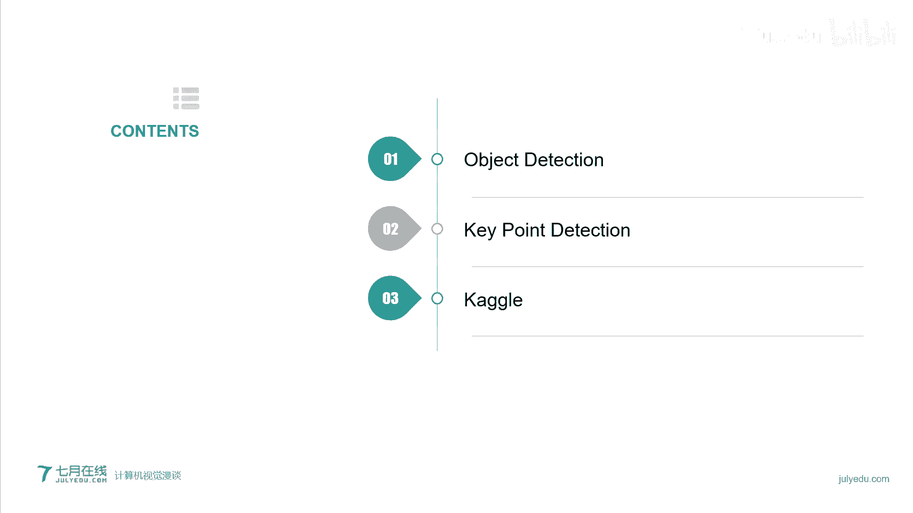
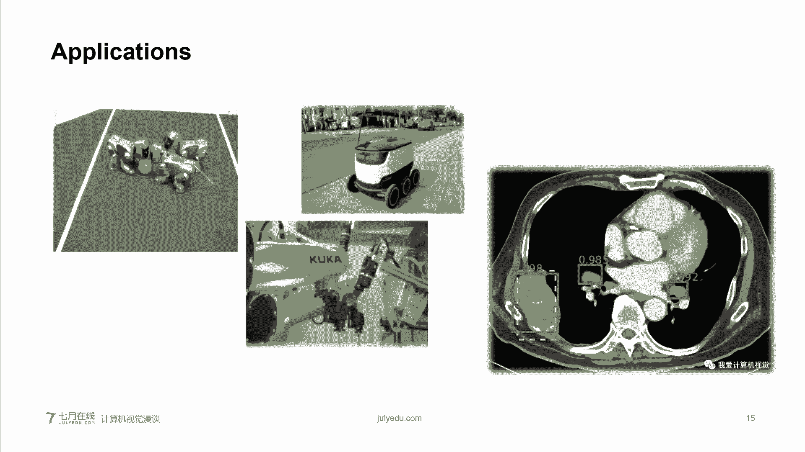
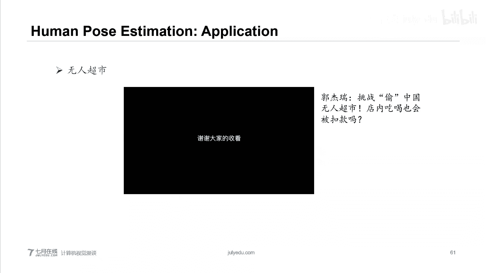
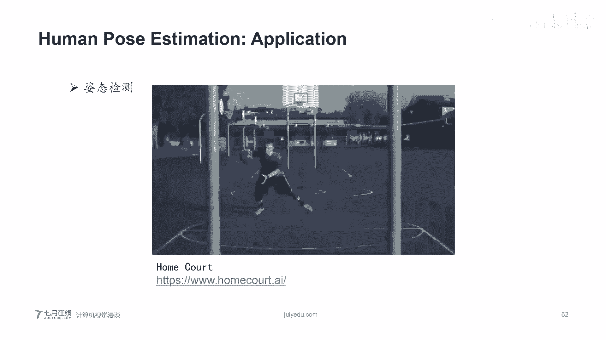
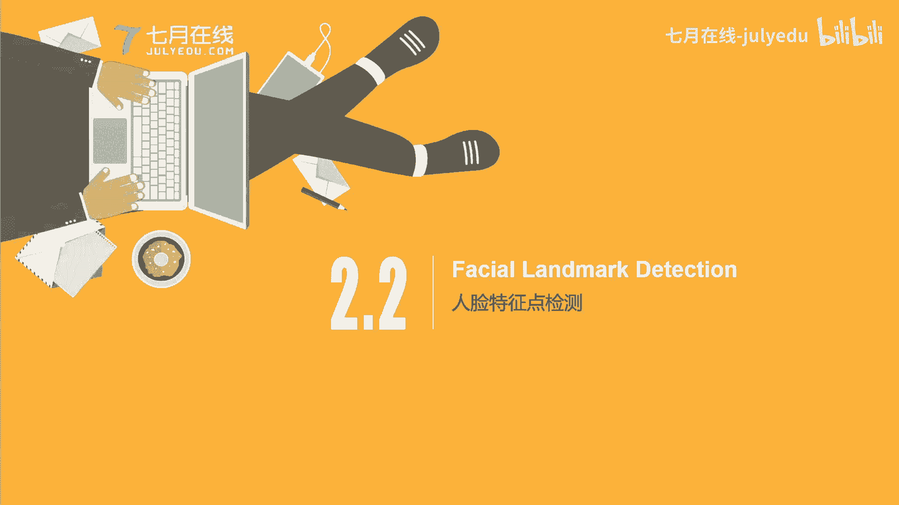

# 人工智能—计算机视觉CV公开课（七月在线出品） - P4：计算机视觉漫谈 - 七月在线-julyedu - BV17z4y167dq

。

微信用户442447，我们是老朋友了。好，大家好，呃，我是CV庞老师。今天主要想跟大家聊一下是有关计算机视觉的一些事情。

那么今天我我们主要会呃聊一下三个话题。第一个话题是目标检测。第二个话题是关键点检测。第三个话题是开狗的竞赛。好，那么我们先从第一个话题来聊吧。

目标检测呃，英文名叫object detection。呃，有些同学总反映这个屏幕有时一直偏黑。呃，我不知道大家用是电脑还是手机看的啊，要不大家试试电脑。好，我们先调一下目标检测。

每次聊这个目标检测呢，我们总会先从目标识别来开始聊。呃，为什么非要从目标识别开始聊呢？呃，因为我们通常会把目标识别所使用的卷积神经网络，当然会是各式各样的卷积神经网络，作为目标检测的基础网络。

他的目的是做一件事情，就是说我们希望在通过目标识别的基础上来找到很多大量的图像当中所拥有的特征，英文叫featuresO。那么目标识别呢，我们一般来说。目识别一般来说呃，它主要做一个分类问题。

比如说我现在有三张图像，第一张图像是宝宝，第二张图像是山猫，第三只那第三张图像是狗okK那么图像经过一个卷积神经网络，那么它会告诉我这张图像里面有什么？okK那么有什么这个问题呢？

就是说哎比如说是不是猫是不是狗是不是小孩，那么这个统称为一个叫分类问题。

O。那么呃对于目标检测来说呢，我们除了想知道这个分类问题，我们还想知道另外一个。所对的目标在哪里？我们就话说说就是一个定位问题。比方说这张图像，这张图像当中有一只狗和一只小孩儿。好。

那么对于目标1别来说，它的输出只会告诉我狗与小孩儿。对于目标检测来说呢，除了仅仅呃所知道的主题，那么我们还希望知道狗在哪里，小孩在哪里。那么我们用两个。呃，矩形框来将其圈出。

同时给出相应的呃这个主题的名字。那么这个就是目标检测所解决的问题。好。

那么话说到目标检测上面，我们看一下它具体的一个呃大概过程吧。比如说我这有一张照相。OK这张照相的主体呢。嗯，这张照相的主体呢，它是一只呃小狗。那么对于目标识别来说，我们会经过一些卷积层，石化层。

包括全连接层。OK一直到最后的输出，比如说我这里的输出呃，哎我有四类。大家对于目标识别来说，我们是没有最后一类的，最后一类是背景OK那么我们有假如说现在我们有四类。而某一类的值非常的高。

那么这个值就代表概率值就是呃出现对应这条类的概率值的非常的高。OK比如说我们这儿那个狗的概率值非常高。那么我们就默认好。那么对于这张图像来说，它的主体是狗，这个就是目标识别。对于目标检测来说。

我们希望加一个定位问题。好，我们用一个矩形框来进行定位。那么如何定义这个矩形框呢？通常来说，我们会用四个值来定义，分别是BXYW和H。B代表的意思很好理解。funding box。

OK把ning box直移过来，就是将其呃围起来的一个框。那么其实就是我们用的矩形框。OKXOY对应的是中心点的位置，就是矩形框中心点的位置，中心点就是最角线的交点。W和H分别对应的是宽和高。

那么通过这四个数据，中心点的位置，中心点的坐标和矩形框的宽于高。那么我们就可以精准的定义出这个矩形框到底在哪里。那么好，那么如何在这个目标分类目标识别就是分类问题的基础上来把矩形框来抽出来呢。

比如说我们在最后几层，我们抽一个分支，那么这个分支它所预测的值，那么就是四个值就是它的输出值就是对应的4个值。同时，我们的Y。Y就是我们最后的输出值O输出值。如果对于目标识别来说。

它仅仅是分类问题来说呢，我们Y可能只有三个值，就是最后的C1C2C3对应的分别是哪一个类。OK那么如果说这个是目标检测问题呢？我们所看到的这个地方我们会有8个值。第一个值PC。

PC的意思是代表这个地方是否有我们想要的这个主题。okK其实说白了对应的就是那个background背景。如果PCV一，那么代表呃我们这个地方呢呃应该是有我们所我们所感兴趣的东西，但具体是什么。

不知道我们只知道哦O有感兴趣的去的东西，意味着它不是背景。好。紧接下来跟着四个值，就分别是我们刚才提到的bonning box的呃用于定位的这4个值BXYW和H。再往下C1C2和C3。

这三个值那么就分别对应着是哪一个类？OK就是呃前一步目标是有哪一个类。比如说如果说PC等于1okK那么我们就知道呃，在这个这块呢应该是由我们所感兴趣的东西，它不是背景。那么我们看到C一等于一。哦。

那那个时候我们就明白啊，在这个地方呢C一呃是就是这个这块是C一这个类。我们去查一下C一对应的什么。比如C一对应的狗，那么我们就知道这个类，然后通过BXYW和H，我们就可以精准的定位到狗所在的位置。

假如说。PC等于0，那么代表这块是背景。那么对于PC是呃下面的那所有的那些值，我们就不再关心了。ok我们完全不关心，反正你这也是微姐，你是啥，我们不careOK呃，好，我们现在重新捋一下。

我们现在呢对于目标检测来说，我们有一个输入，这个输入当然就是一张图像了。同时我们对应的一个输出。ok对应的一个输出输出呢就是我们所用的Y。那么我们大家都很清楚，其实做深度学习。

我们无非就是想找到一个就是我们在我们的网络上想找到这些对应的参数，使得用这些对应的参数所得到的输出Y。来无限的接近于我们的光tro，我们的真实的值。OK这个是它的一个核心思想。就是我们做这个深度学习。

你不管是哪个领域的，不管是关节点检测、目标目标检测，包括呃视觉追踪等等，它都是一个核心思想。好，那么我们。先来构建一下他的。损失函数。OK随失函数。比方说你看L就代表着los function的los。

O就是随失函数这个呃这个函数的定义。那么我们现在有两个，一个是Y，上面画一个三角，就是向上的三角，我们叫Y hat。另外一个是一个YOK那么我们把。呃，我们可以把这个Y hat。

OK我们可以把外head当做是ground truth。ground truth的意思就是值意外要真实值。就是说我们在这个训练网络之前，我们会人工的做一些标记。比如说我们会人工的把这个狗来圈出来。

那么用这些真实值作为对比。减真实值与我们所做出来的预测值Y预测值就预测值的意思就是说我们网络直接输出的这个值OK那么我们用这两个值的差来代表你和函呃这个损失函数。我们的目的就是最小化这个损失函数。

换通俗点来说，就是说想要我们网络的输出与我们之前人工所标注的这个越接近越好。那么好，我们看一下具体的含义吧。当这个PC等于零的时候，意味着我们所处的这个区域，它是个背景。那么下面的是什么值。

我们一点都不关心，那反正也是背景。那么这个时候我们只需要呃校正PC这个类和PC hatt这个类的差的平方即可。如果说PC等于一的话。那么就意味着此处是由我们所感兴趣的物体。

那么我们就需要校正PC下面所有的值。那么呃最简单的方法呢就是把这个呃所有值我们进行这个插在求求平方和。OK那么这个呢就是目标检测它所。的一个最基本的思想。好。那么比方说我们现在这张图像。

我们想检测是不是狗，那么其实我们就可以用一个寄训框来进行划窗。OK那么这个呢就是一个最简单的，我们可以把它叫做呃狗狗检测器。那么现在就有一个问题。当我就用一个矩型框进行划窗之后。

那么其实可能在这个狗狗这个附近，我会有很多很多的矩型框都将这个狗狗框住了。那么最后我们需要选择哪一个呢？所以我们通常会有一个概念叫做IOU。OK引入一个再角呃，引入一个概念叫做IOU。

Inter over unit。那么。这个值就是我们对应的每一个矩型框，它都会有呃不同不样，就是不一样的IOU值。我们只需要找到最大的IOU值即可。那么同学肯定想问嗯，IOU的具体的样子是什么呢？

我们看一下。嗯，在这儿呢我们有两个框，绿色的框，就是我们训练之前人工所标注的框，你就叫做真实的框。红色的框呢就是我们这个网络所输出的，在某一时刻所输出的一个矩型框，就是我们的预测框预测值。

那么IOU的意思就是说呃，它等于他们这两个框的交集，除以它们的并级，通俗的或者是直观上来理解呢，其实就是我们这个红色的预测框与预测的真实框，他们所覆盖的面积越大越好。O他们所覆盖越面积越大越好。

这样的话也就是说这两个框会无限的接近。OK比如说无限的接近。那么我们最后只需要在这众多的框里面找出这个最接近的那个框即可。我会找出这个最接近的矿机壳。呃，那么到现在为止呢。

大家其实已经了解了呃目标检测大家是做什么的和大家的一个最基本的核心思想。那么我们先看一下，就是我们在往下走之前，我们先看一下一个目标检测的实例。

🎼这个目标检测是UloV4。

🎼。

🎼The。

🎼The。

🎼The。

🎼The。🎼OK呃，给大家稍微放了一个一分钟的一个小视频。那么这个小视频呢大家就可以呃稍微的了解了一下这个目标检测的一个实例。那么呃肯定有会有朋学问。那么我这个实例也看到了。

那么目标检测主要能有哪些应用呢，或者是它能做什么呢？那么我们看一个最基本的，也是我们就是通常学目标检测的时候，会呃自己手写一个的一个最基本小训练，就是车牌识别。

车牌识别在这个。呃，就是技术的应用当中已经是非常非常成熟了。而且在咱们国内的那个基本上每个小区呃，它呃绝大部分它都会应用了这个车牌识别。那么它是怎么做呢？那么首先我们需要用一个摄像头来捕捉到这个车辆。

同时需要精准的定位出你这个车牌所在的位置及车牌，你车牌上面所显显示的数字和字母。OK那么这个就是一个最简最基本最简单的一个应用。通过这个车牌识别呢，我们可以呃做很多事情，比如说。呃。

首先呢我们可以做这个呃定位自己的车辆，对吧？那么第二是哎我们可以通过这个车辆车牌号的识别呢，我们是不是又可以就是检测这个车流量就等等。那么我们再看这个图。那么呃目目标目标检测其实有一个非常广的应用。

就是无人驾驶。

okK我无人驾驶。我们可以看，比如说。在这个无人驾驶当中，如果我们在车辆的前方有一个上头，我们是可以知道我们车辆前方的一切的车况。比如说我前面我的车辆与我前方最接近就是最近的一个车辆，我们的距离是多少？

如果说我们的车距过境。那么呃系统就需要发出自动报警，同时帮我减速。okK如果说我的车距是大于呃大于一个就是安全值，那么可一切OK。又或者说。在我这个车辆自动行驶的过程当中。

突然有行人闯入ok突然有行人闯入。那么这个时候车辆就会需要提醒，前方有行人，请立即减速，然后同时帮我做一下这个减速的这个动作，就是等等。呃，一包括比如说我们在这个呃高速上，我们需要检测这个车流。

O检测这个车流，那么这些都是一个目标识别，目标检测的一个很广泛的应用。OK我们也可以在这个摄像头，就是我们把摄像头安装在这个呃道路的两侧。OK去检测人流量，或者是进行逃犯追踪等等。

呃，当我们嗯在一个很陌生的地方旅游，那么如果我们说看到一个很标志的建筑物，嗯，可能我们不知道我们这个建筑物，它的这个具体的这个比如说它有什么特殊的意义呀。而且我们旁边假如说没有导游的话。

这个时候我们可以掏出手机拍一张照片，同时把照片传送到网上。那么照片就会直接在你的这个就是你所拍摄的照片当中挑选出这个主体建筑，然后搜索相应的这个建筑的页面来就是告诉我们你在哪里建筑有什么特殊的故事等等。

OK。

呃，目标检测还有一个非常广泛的应用呢，就是在工业上。呃，像我们这个图中所显示的就是右上角显示的这个呃配送车。配送车呃，在这次就是抗疫当中有着非常嗯显著的应用。就比如说在这个呃。在医院。

如果说我们得到了就是被检测者的血液，或者是患者的血液血液样本。然后如果说我们是。让我们的医护人员直接用手去抓。同时在亲自运送的时候，那么这个时候其实它是有一定的感染几率的。

ok因为这个是呃呃这个细菌的传染性特别强或者病毒的传染性特别强。那么这个时候我们的配送车就可以代替我们的人，我们的医护人员做这个非常危险的事情。OK大家注意啊。

这个配送车不是说我们说拿一个遥控器来控制它进行行走。而我们的配送车首先它是一个呃特种车辆，它需要做到一个恒温恒湿，同时可调节温度的恒温恒湿。然后当我们拥有我们这个。呃，学就是被检测的血液样本的时候。

它可以自主的进行这个路线的选择，然后将被检测这个样本从某一地，然后运送到我们的最后的这个实验室。那么期间，如果说遇到走廊里有认识有人或者是有其他障碍物的时候，它需要自动避让。

而且自动规划出你的行进路线等等。还有一个非常典型的应用，就是嗯比方说那个无人酒店O无人酒店里面呢包括那个送餐车，它也是一个非常经典的应用。当然对于这个工厂来说，它最大的应用就是呃机械臂。

那么机械臂对这个目标的抓取，它的前一步就是需要非常精准的定位。要知道这个，比如说我们传送带呢，它是它不可能走一下停一下，那这个效率会非常的低，它会有匀速的一直前进。

那么机械臂当他看到的时候做出决定的时候，和他手伸出去的时候，其实这个是有一个时间差的。那么机械臂就需要。它不停的实时准确的定位出我们所这个目标在这个床在上的位置。OK就是等等。这些就是应用嘛。

包括这个机器机器狗大赛，机器狗呢需要准确的判断出我的球所在的位置，同时要判断出我面前的这些其他机械狗是低是有。

呃，目标检测的另外一个很广泛的应用呢就是这个图像就是医疗上在医疗上它需要定位出这个我们所疑似的区域来为这个医呃为医生呃就是提供帮助等等。

呃，自从2013年RCN提出之后，目标检测其实已经得到了非常十足的发展。如果我们看7年前的那个RCN。你如果你看它的那个效果，同时你对比我们现在最最新出现的优乐V4的时候。

基本上我感觉你会发现嗯他们真的是天差地别。好，那么呃聊完这些最基本或者是最。呃，最通俗的一些关于目标检测的事情。那么这个时候我们想看一下目标检测的算法，它到底有哪些，或者是呃它有哪些主要的流派呢？呃。

在今天呢我给大家分了两个流派，一个是毛框派，就是说它是否用到安可，用到毛框。

呃，或者是另外一种纽派，就是说哎我不用anor了，我叫它工作叫anor free。

我们具体的看一下，第一，毛光派O。呃，说到毛框派呢，其实呃毛框派是目前就是比较主流的一个分支。呃，毛框派在以前我们通常会把它叫做呃就是有两个新的就或者子的分支，一个叫做one stage。

一个叫做tto stage。通换句话来说，玩幻派它会又分成你这个网络是一步走还是两步走来完成你的检测。我们先入两步走。

两个不同呢，比如说RCN系列算法，像什么老早以前的fasterfaster啊CN又或者是后来的呃maRCNmaster scoringingRCN等等。那么他们的方法永远是。

首先我用一个呃最基本的骨干网络，比如说各种各样的CNN我来进行特征提取。当我提取好这些特征之后呢，我们就开始分两步图分成两个tage了。首首先第一个stage就是要提出。呃。

就是要提出这个呃一个叫proposal，就或者英文翻译过来叫做候选区域。所谓的候选区域就是说在这些区域上面疑似有相应的物体，注意是疑似，有相应的物体。那么我的下一个stage。

就是说我把这些疑似的候选区域，我传过来，然后在疑似的候选区域上面，我做一些比较精准的呃就是研究里面到底有没有物体，或者到底有没有目标，同时它的目标是有哪些。那么这个就是tool stage。

另外一个是one stage。比如说SSD，比如说优lo，他们的想法就是说。我在你这个提取好的特征上面，我进行均匀的不同位置的密集抽样。当抽样的时候，我们可以选择。就是这个不同尺度的长宽比。

然后我再利用CNN体取的特征后，直接进行分类与回归。这个过程只需要一步，因为它不需要再找什么，就是这个候选的感兴趣区域。okK所以它的优势跟tto stage来相比，它的速度是非常快的OK。呃。

我们在这儿用一个macarCN来给大家进行一个举举呃就是详细的呃就是说明说明一下什么是毛框。呃，为什么用我maCN给大家进行解释呢？呃，当然我们现在已经有很多很多其他的网络，就是toc的网络。

因为maCN呢它的应用是非常广泛的，它不单单是用在目标检测当中，它也会用在实力分割，它也会用在关键点检测当中。呃，而且maCN由于它的性能是比较稳定，所以它也会应用在其他各种各样的行业当中。呃。

我们在这儿，比如说如果说mus斯car和CN我们用来找人的话，就是以找人来做举例。那么他会先。找人找出人所在的位置，同时他会做一个实力分割。musRCN它是基于这个fasterRCN的基础上。

我们可以看一下这两张图像的对比，左图是fa呃fasterRCN右图是musaskRCN。那么它最显著的一个区别就是。CN比法斯达CN多一个框，OK多一个分支。那么这个分支它主要做的就是。呃。

实力分割OK当呃这个马斯达森还有其他就是对比巴斯达森生级的地方。嗯，比如说它有1个ROIal layerok在这我们就不再赘述了。呃，对于这个损失函数来说呢，呃，由于fasterN它只有两个分支。

就是两个输出。那么所以它会有两个损失。那么但是对于maN来说，由于它多出来了一个，所以它就会再多出来一个lo maskO来我们具体看一下这个maRCN它的这个呃骨价的就是详细的作用吧。

比如说我们从下往上看，最下面是一张图像被检测的图像，首先它会经过一个呃检测就是呃骨干网络，比如说我们可以进行对它进行磨改，你可以用最老早之前的什么VGG呃1619。

你也可以用残渣网络呃renet501011等等。当然你也可以选取dancenet又或者是你在选取CP net CSP net它其实严格意义。讲它并不是一个net，而它是一个思想。这个在我们的这个。

目标检测实战课上面我们已经给它进行了提及。比如说我们可以改成CSPdnet53等等。那么他们不管你用哪一种网络，我们所做的，其实无外乎有一件事情就是对图像做一个特征提取。那么在这儿我想跟大家说一个就是。

呃，首先呃我想给大家提一个叫FPN的一个网络，就是这个特征金字塔网络。会有有有的人把它叫做藏期金字塔网络都可以。首先我有一张图像，我们对它进行就是卷积的就是一个作用的时候，随着我们的卷积的层数增加。

它的高级的语域信息也越来越丰富。但是它会也会带来一个问题，就是说你的分辨率会随之降低。那么当你分辨率降低，比如说在最上层分辨率特别低的时候，就会导致一个一个非常严重的一个问题。

或它会忽略小物体的一些信息。所以说如果我们仅仅在顶层提取特征，并且进行目标预测的时候，呃，虽然在最顶层的时候，高级雨义也非常多，但是会使得预测效果不好，因为它忽略掉了小物体的检测。

所以说FPN他所做的事情就是说哎我可以在这个不同的物体上面，我进行呃不同的层级上面我进行物物体的检测。那么对应的是大物体，中物体或小物体来进行检测，这个就是FPN的思想。当然了。

现在FPN它已经不是就是一个最新的或者是效果最好的了。之后又出现了P呃PAN。PN也是在那个优乐V4上面所采用的。呃，我们在我们的这个实战课程，就是目标检测实战课程当中呢给大家进行了介绍。

感兴趣的同学可以就是到我们的官网搜索一下呃，目标检测CV实战课呃，从ma斯卡CN到优乐V4全部一网打尽。我们在那个里面会给大家做一个呃最详尽的一个介绍。OK。呃，经过masRCN的第一步之后。

我们来到了它的第二部分。第二部分就是我们所谓的呃RPN。就是所谓的我们有一个stage，我们来提取一些感兴趣的一致的不选区域。呃，在这儿我们就需要给大家引出来这个是什么是anor，这是为什么？呃。

为什么我们把它叫做毛光派？我们看一下，对于某一个点，我们可以用很多不同大小的这些。呃，不同的好的这些就是boning box了，我来进行检测。那么大家可以看到我们现在就有个最基本的问题。

我们用什么样子的这个呃就是bonuning box来进行检测呢？对应着一个图像，比如我想检测张翼。那么这个时候我们已经画出了很多不同形状的bonning box。O。

那么哪些是哪些就是怎么样的boning box最好的呢？我们不能说把所有的呃就是不同大小，不同样式的这个boning box全部检测一遍。那么这样做的话，理论上是可行的。但实际上来说。

你这样做的意义非常非常的小。为什么我们没有那么多时间来炫荡？因为我们需要有一个实质性。那么在此我们就引出了我们的毛荒。OK我们可以在训练之前，我们先预定一些曝光。比如说你可以定它的这个比例。

我们的比例就是说它的宽除以高的比例。如果说你是0。5的话，这个比例是0。5的话，那么它就是一个瘦长的矩型。如果宽和高的比例是1比1的话，那么它对应的就是一个正方形。如果是二的话。

它就是一个横向的呃这个矩形。那么通过比例来说，我们就可以得出这个呃毛框的一个大概的形状。同时我们也可以预定义一些它的scalekill，就是它的大小。OK比如说我们可以定义出32个P像素。

64个像素或者是256像素等等。呃，然后通过比例和基本的这个宽度或者是大小，那么我们就可以比较准确的做出了一个3乘3等于9个毛框的，就是预定义毛框。O预定义毛框。同时我们如果说给出这个。

某些值我们就可以把这个预定义好的毛框来准确的定位到图像当中。OK那么一般来说定义这个毛框呢，它有两种样式。第一种样式，比如说我定义左上角，或者是右下角okK这是一个方式。通过左上角和右下角。

我们就可以准确的画出这个矩形框，又或者是还有之间的老方法，我们定义出中心，同时定义出这个毛框的框和高，那么我们就可以找出来这个呃毛框的具体位置。那么有些同学肯定会想问，哎，我这些预定义好的毛框。

那么它毕竟不是我最后的这个真实呃就是真实的这个光柱子这个框。我们可以回忆一下之前有一张图，我们找那个张毅。那么他的这个呃由于他是就是这个人呢，他是一个瘦长型的，同时我无法保证这个瘦长型的这个框。

他就是0。5的比例。那么我们怎么做呢？那么其实在这个。呃，在这个呃定义项来说，比如说我们现在找这个。呃，我们现在找这个RPN，它的最上面的输出，就是我通过这个毛框的帮忙呢，呃我们在图像当中的某一个像素。

我们找一个毛框。然后我最后输出有两个，一个叫做分类，这个很好理解。这个分类就是找哎我这个呃框所框住的对象，我到底是他就是大概是个什么样子。注意这个分类我不进行做一个很细微的分类，很细微的分类。

就是意思就是说我需要找出这个目标到底属于哪一类，是人是狗是机器等等。但是在这个地方，我们不做这个分类，我们只做是不是有没有东西或者是是不是背景ok所以说这个分类。

我们可以有比如说假如说你是有做了1000个框。那么这个时候你就有2000个分类，O是背景，不是背景。那么同时我们还会有第二个呃输出。这个我们做的是看比如说4K可那他做的就是回归O为什么说他做的回归呢？

我们的目的是。当我检测出这个毛框，呃，哎，比如说我这可能是有一次东西的时候，我们希望这个毛框对它进行一个变形，来使得让它就是更更精准的来跟这个我们真实的这个矩形框来进行一个匹配。

比如说我们可以把这个毛框。如果说它特别瘦，就是根据我真实的这个框特别瘦，我就让它变胖一点。如果它太胖了，我就让它窄一点，或者是呃太高后让它低一点太低，我让它高一点等等。我们进行对毛框的一个微调。

O那么通过这个毛在毛框上检测有没有这个物体，然后我们又通过对毛框进行微调，那么我们就可以得到我们最后的这个矩形框。呃。所以说我们做一个先做一个前背景区分，我们之后也可以再做一个这个回归。那么通过这两步。

我们就可以找到这个矩形框当中那个最好的那个呃是不是有东西。然后我们可以对我们这个呃矩形框呢做一个就是选取，比如说前6000个高分候选框，然后再配合起回归值。比如说我这儿有一个。图像是卡卡罗特呃。

旁着一个龙珠。那么我们先找到，比如说我们讲到了全6000个，同时呃我们想找出来最后。这个比如说我们这个紫色是我们真实的浅白色或是浅蓝色，是我们的预测出来的。我们希望对它进行一个微调，哎。

让它最后匹配上去。呃，如果说我们微调之后，我们还有很多很多的这个比如说高于这个IOU值的很多很多框。那么我们再做一个就是呃非极大值抑制来找到最优的那个最后的框。

那么整个这个流程就是基本上就是目标检测的流程。OK。

对于这个mas和CN来说呢，它还有一个分支。这个分支呢是做那个呃掩码分支。我们给大家看一下这个大概是什么样子。比如说maRCN嗯，现在就看大家看到的呃上面这个浅色的那个分支呢。

就是我们做的这个目标检测的这个分支。然后在下面的那一层呢，它是就是做掩码，比如说我们最后找到那个是28乘28乘以80，这个28乘以28，就是我最掩码的长和宽。那么最后乘以80。

它的呃原因是coco是有80个类，所以它这写了1个80，就是说我们需要预算多少个类，我们最后那个值就是多少。呃，说的细一点，什么是掩码呢？比方说我们找到这张图像，我们想看一下这个呃红色衣服。

就是背就是红色衣服背影的这个人他这块的掩码，我们看一下最后28乘28最后的一个输出。它呢是一个黑白色的一个图像，首先是像素级的图像。OK是1个28乘28的一个预测。我们通过这个黑色的这个像素。

我们就可以把人的这个轮廓就是大概就是圈出来。当然这个并不是我们最后想要的结果，我们会做一些软化。哎，我们使得我们这个看起来这个人的那个过度非常非常的均匀。O。

那么这个就是maskRCN他做的这个mask的分支，它的目的就是做实际分割，就是说找出来这个。我们所检测区域里面所这个所被检测物体的一个真实的轮廓ok。

呃，在这儿我想跟大家推荐就是两个课程，一个是呃CV就业的小班第五期。呃，这个课程呢我们现在就是刚刚开课，然后呃会有老师直接对就是每堂课对大家进行一个直播。然后我们我们所做的目标呢。

就是说手把手带着大家一起。搞完搞清楚理论的同时，然后把代码基础，夯实代码基础通过N个项目来进行一个一个的，就是领着大家把代码走完。目标就是帮大家找到一个很好的工作，所以叫就业班。

同时如果呃大家仅仅只对这个目标检测感兴趣的话，我向大家推荐这个重庆实战目标检测。那么这堂课程的在我们的第第二个阶段的第三堂课，我们会跟大家聊一下安克下面的主题网络会跟大家更细致的聊一下关于这个毛框。

我么这是这个毛框法进行检测。O。

同时也会跟大家聊一些就是里面的主流网络。

那么除了毛框法以外，还有一个分支，这个分支是最早出现在16年。它是我们它开创了aner free的方法。它的第一个就是叫做cor netO我们看一下，如果我们说不用毛光来进行辅助检测的话。

那么我们来怎么做呢？它其实做了一个关键点的定位检测，以cornet为例，最早图像于2016年，我们看它的图像，它只是找出在每项图像上找出左上角的点和右下角的点OK那么通过左上角和右下角的点。

我们就可以把这个呃。

呃，最后目标检测所所用到的曲形框来准确的定位出来，它不需要模框，它每次只是找两个角点OK。

我们可以看一下这两个焦点呃他这个想法呢，一个大概的这个流程。那么首先我们有有一张图像，在这个图像当中有两个滑雪站立的人，它通过一个contion net。

就是通过一个股架网络来提找出这个图像当中的一些特征。然后它会有两个分支。上面一个分支是找出左上角的拐点，下面这一它它呢是找出右下角的拐点。那么通过左上角右下角的拐点，它就可以精准的定位出来这个图像。

那么当我们仔细看的时候，我们可以看到它左上角呢会有两个东西，一个叫做hit maps热力图，另外一个叫做embeddingO我们一个一个给大家讲什么是热力图，什么是embeds。

首先我们知道什么是热力图，大家看一下，那么这个图呢就是一个关节点的热力图。

呃，比方说第二张图像是人的脖子，那么中间就是黄色，中间有太红的那个呢，就是这个呃人的脖子所出现的这个图像。那就凸现的位置。那么大家肯定想问，哎，为什么有不同的颜色呢？

那么我们用不同的颜色来代表该像素所在的位置，它这个是否有我们所感兴趣的，注意感兴的那个点所出现的概率值？当颜色越亮的时候，我们就认为呃该像素点所在的位置呢呃出现某一个点的概率的非常非常的高。

比如说红色是最亮的，那么红色的概率是非常高的。如果说变成蓝色的话，那么我们就基本上认为呃这些点像素点所处的位置。这个呃某一个点出现的概率基本上为0OK这个就是热力图。

除了热历图以外，第二个就是这个inbeddings，我们返回去，就是这个embeddingsembedding呢它的意思就是说它这个点所在这个位置的特征features就是就是点的特征。

只不过是它把它叫做了一个非常专业的才叫做embedding。那么这个时候我们就知道了。当我找到这里这些点的时候，比如说左上角的点。和右下角的点，那么我们只需要做一个两个点的匹配即可。

那么把这两个点匹配好之后，哎，它们是否属于同一个目标。如果是的话，那么我们就将它就是框起来。如果不是的话，我们就继续找是的那个点，O那么这个时候同学先想问，哎，它如何判断这个是还是不是呢？

ok那么它的其实想法很简单，我们不是有这个inbedding吗？inbedding是这个点的那个特征。那么如果你是同一个目标？那么你们这个inbodydding特征其实应该是非常近的。没错吧。

如果说你们分属于不同的目标，那么你们的特征肯定是非常远的。那么我就可以通过匹配这两个点的特征的这个差值，我们来定义出它是否应该属于同一个目标。这个就是corronnet的核心思想。OK核心思想。

比如说我先通过一个 glassnet work，这个也是一个CNO然后我们分别找出左上角和右下角的点。那么我们也可以看到这个对于这个点呢，我们它最后出来是三个东西，一个是he maps。

一个是inbedding。它最后一个还有一个叫offsetoffset呢，它这个其实就是一个修正。就它的目的就是说哎我找到这个点子之后，我需要和我的光兔s进行比较。然后如果点歪了的话。

我希望就是对它进行一个修正，这个就是offset作用。O。嗯。呃，在这儿的话呃，大家已经明白了corronnet就在2016年第一次出现这个aner free的时候，它的一个核心思想。

那么在这儿它会出现一个新的ping，指持化层叫做corner pullinging。corner pullinging的想法呢。也比较就是它设计的非常精妙。大家可以看一下这张图。

我们以这个上上面这一行就是那个左上角那个点来给大家举例。呃，这这个就是左上角的点，它的那个如何进行cor铺ok。对于第一组feature map呢。

它是对于每一行按照从右向左的顺序选择已经滑动的范围的最大值。大家可以想想为什么要从右向左。那么另外一个是我会从下往上进行滑动，来选择滑动范围的最大值，那为什么是从下往上呢？

我们大家可以想象这个左对于左上角的点，你找最左上角的点，一个是左一个是上，那么如何找左呢？从右往左滑，如果找上呢，从下往上滑，那么这个就是找左上角点的这个col pulling的这个想法。那么相反。

如果说对应的来说，如果你想找右下角的点，右和下找右的话，就是从左向右找下的话，就是从上向下滑，O它这个设计是非常巧妙的。这个是corner pulling的一个就是更详细的一个介绍。

比如说我们这个这个是找左上角点从左从右向左滑和从下往上滑。当找到滑动范围的最大值的时候，我们再进行相加，所得到的值就是corner pulling的这个最终的结果。O。呃，在201呃16年出现了。

出现了就是contronet在这个后之后。又出现了另外一个网络，也是比较一个经典的网络，叫sernnet。centernnet呢也是这个呃它的方法呢也是就是aner free，我不找毛光，我直接找点。

那么它跟cornet的一个区别呢，呃呃主要是它在cornet的基础上面，它不在仅仅找两个角点，我同时也需要找一个中心点。我们从算法名字上也可以找到什么是呃为什么叫sernnet呢？就是找它的这个中心点。

ok。呃。它的相同点是我都采用这个head map日历属来实现。OK损失函数也一样，但是呢我需要把中心点找到okK我们为什么这么做呢？我们可以看一下。

基于这个现在看到这个图像是corronnet的个结果。由于corronnet注意我只是找两个焦点，而且这两个焦点，因为它是叫焦点，所以它通常来说不会在这个物体的上面。OK那么当你不在物体的上面的时候。

那么你其实就会损失掉属于物体的那部分语信息。OK而且因为你是角点的话，所以这个会对于图像的边缘异常的敏感。OK异常的敏感。那么就会找到我们看这个左上角这个图本身。当中没有这个框。

但是他给我找出来一堆的框O一堆的框，就是因为你仅仅找焦点所导致的问题。那么sernnet他就提出来，当这种方法我如何去掉这些就是根本就就是找错这个矩形框呢，他的想法就是说哎我再找一个中心点。

比如说我某一个框找错了。然后如果我找出这个中心点，我先把这些你你所匹配好的这些角点，我先画一个框，然后我在框，你这个框当中呢，我选取一个中心区域，就是你正中心我选取个中心区域。

同时我预测出这个中心点的位置。假如说你找对的话，那么肯定我所找的center的这个位置，就应该落在我由两个角点所确定好的中心区域的位置上。OK只要在这个中心区域位置当中就行。假如说你找错了。

那么你这个呃我所预出来的center，我就不在我这个由角点对应的这个中心区域上面。那么就说明我这个框是错误的。大家可以看这个图像嗯这个码，我找出来一不是两个框，由于我的中心点在其中一个框的中心区域上。

那么我就认为这个框是正确的，我就可以删掉另外一个框，这个就是centernet的一个核心思想。okK。

那么sternet由于它找到了中心点，所以它在找角点的基础上，我同时找了一个center的这个呃分支。O就是我们所看到的这个区域。当然了，这个sernnet其实它是19年初的嘛。呃。

它现在其实也出现了一些新的改进。比如说呃3ryplnetok这等等。呃，在我们的这个呃目标检测。

就是丛林实战目标检测，我们会在这个有一堂课。第四堂课专门给大家讲一下这个center，就是其是专门讲一下，就是呃安科 free的一些方法。同时如果大家想对这个代码能力进行提高的话。

我建议大家就是看关注一下我们就业班第五期，呃，我们就业班跟实战班有个最显著的区别，就是就业班会更加专注于我们项目的代码的具体实现。老师会手把手的教你如何进行录代码，它的目的就是就业。呃。

如果仅仅想看一下理论的话，建议大家看一下这个呃关于那个实战重林实战目标检测。在第四课当中呢，我们会跟大家聊一下具体的安科 free的一些方法。O。

当讲完这个目标检测的时候，我们通常会跟大家聊一下这个关键点检测。为什么呢？其实最开始我们只是仅仅只有目标检测，只不过在后续的情况，后续的这个发展当中，我们已经不仅仅满足于找到目标。

我们还希望准确的定位出我们所找到目标的一些关键点，ok关键点。那么什么是关键点检测通俗来讲，就是找这些关键点。那么它可以分成四大类。比如说人体骨骼点检测human pose estimation。

嗯，第二个Fual landmark detection。呃，人脸的特征点检测。当然既然我能检测骨骼点，又能检测人脸，我是不是可以检测这个手的这个关节点？OK手的关节点。嗯，这些都是基于人的。

那么当然还有比较稍微呃相对来说是比较简单的，就是基于这个物体物体的关键点检测okK呃，在这儿我给大家聊一下前两个吧。

首先是人体骨骼碘检测，这个也是在关键点检测里面最大的一个分支，也是出现最早的一个分支。

人体的骨呃ho pose estimation，人体骨骼炎检测，它顾名思义就是说我在头像当中找出人体骨骼点所在的位置。O所在的位置。呃，比如说大家看到的这个。呃，首先是左图。

左图上面是cogo所定义的17个人体的骨骼点。呃，比如说人的脚踝、手腕、脖子、眼睛，呃，还有耳朵、嘴嘴巴或者是鼻子OK。呃，那么这些我通过定义这个人的这个谷骼点，然后我在我的视频当中。

我不停的找到这些谷骼点。通过它的变化，比如说它的位置的移动，我就可以明白人在这个呃图像当中，他到底在做什么。OK那么它其实也是已经是对那个目标检测一个更加细致的一个研究。OK关键点检测。呃。

当然你通俗意义上讲呢，关键点检测其实它就属于目标检测，只不过我的目标从一个物体来变成了一个点。OK对于人体骨骼炎来检测来说呢，它有两个分支，一个叫做top down，一个叫做botom up。

自顶向下，他的思想就是我先把人找到，然后我再去找点bo map，他的想法是反过来的，我不找人了，我先把点找到，然后再进行归纳哪些点属于同一个人，哪些点不属于同一个人，属于同一个人的，我把它连接起来。

这就是它的一个核心思想。我们先看一下top down吧。

先找人后找点。对于一个图像来说，我先把人框出来，然后我再把他身上的点连接起来啊，不是身上的点找到，最后我再把点进行连接，这就是top down的思想。

ok所以说它会有一个人体的目标检测器。不管你是用one stage还是two stage也好，它都会就是。把这个呃目标线索找到，大家注意到没？我这儿写的全是毛框派的方法，我。呃，我并没有写。呃。

我并没我并没有写这个aner free的方法。因为对于这个人体目标检测呢，呃你 anchorcur free，你你你去找一些关键的点。比如说脚点中心点，那么我也可以直接找就直接把这个谷歌的关键点找到。

我不去找你的这些呃就是所谓的这个角点和中心点了。所以说对于top down的方法来说，我们一般通常使用的还是毛毛框拜的方法。O。

呃，给大家再看一下这个muss考CN。😊，这个mCN呢，它其实就是不光我可以就是刚才给大家聊的呃，找人目标检测，同时我做一个实例分割，我还可以进行一个关键点检测。先给大家看一个它的实例。

有。どどら。で。有生的。🎼有一小走。🎼不り。🎼也是。Ice cold， Michelle， fight but at white coat。This was， but I'm good girls。

 damn good girls， straight masterpiece。🎼打ling。Wm living it up in the city。

I duck so with saying wrong， gotta kiss myself， So pretty I'。

🎼Go the police and the fire made too high。😊，🎼Make a dragon wonna retire made a too high。

🎼せね you know whoア。B by that， break it down。🎼irl先 to哈luh girll先哈luh。😊，S in halllujah。

 because outside phone don't give it to you。🎼我们自。Don't believe it， just watch。

🎼重复力也 just吧。OK相信大家已经看到了这个mus斯卡CEN在这个。😊，呃，在这个就是呃关键点检测上面的一个实力应用OK。

那么对于ma斯尔CN来说，他可以先找人再进行实力分割，再进行关键点检测。呃。呃，由于在之前我们就是上一节，我们已经给大家介绍了一下这个ma斯carRCN的一个大致的就是骨骼的这个。

就是每一块到底是做什么的。然后我们看一下，那么如何在实力分工的基础上做关联检测呢？它还是作用于最后那个。mask分支上啊，我们这张图已经大家有所了解了。那么大家可以看最后那个输出28乘28乘以80。

因为我们说过80的意思是在coco数据集上，它有80个类。ok那么注意对于我们的这个关键点进行检测。人拿coco的人体来说，它有17个关键点。那么也就是说我们把这个mask去掉。

我们改它改成key points。然后我们把80去掉，变成17。就是说我需要检测这17个类。所以说大家从这儿就可以看出来，你对应的这个17个类，也就是说对应你的17个点。

那么它的想法就是说我对每一个关键点进行一个类，就是一个分类，进行一个分类查找。OK所以说我可能出来17张图，最后把它合成在一张图上，那么合成出来的图，就是我们最这个关键点所在的位置图。好。

也就是说我们添加了这个呃key point head。然后我对每一个key point，我做一个就是掩码的预测OK然后最后我们就是找出它的空间位置。在这儿我想给大家提一下，就是这个关于这个。

掩码的这个就是就就就是就是这个呃这个预测。我们可以看一下，一般来说这个one one hot encoding。这直叫做一键编码。😡，那么一键编码来说，它可以就是怎么做呢？比如说我对于body下面。

我是head还是hand还是foot，我对于每一个值，假如说它是headd，那我们就给它写成100。只在hat上面有值，其他地方上为0，或者是hand，我们是010。如果是负的角呢，就是001。

这个就是onehou口点。当然呢，我们也可以把它用纯这种这种样式来写，就是把它扩扩出来，扩成3乘3的一个方式。那么只在对角线上有值，就代表着它对应的哪个值OK。这个就是大家所看到这个hiat map。

就是大家所看到hit map。😊，它是对于每一个关节点关或者关键点，我们找到啊它的这个一个热力图。这刚才也跟大家聊了，这个热力图呢就是这个某一个像素点。

它所对应的呃有是否存在关节关键点的一个最大的概率值O。当我找完这17个点的时候，17张热力图，我把它合成到一张图上。那么它就是最后我们所看到的这个样子。ok我们找到这些所有的图。

下一步呢就是将所有的观点进行连线。那么这个就是top down自顶向下的一个方法。除了这个分支以外。其实还有一个呃也是比较也是一个另外一个非常主流的分支，就是自底向上。哎，我们先找点后归纳。

比如说最经典的这个16年的open pose。大家看到了就是它的一个呃步骤。首先我们输出一张图像。然后我们进来以后，我们分成两个两条线。上面这条线呢我去找这些所有关键关键点。然后下面这个分支呢。

我去找搜它每一个关键点所就是呃它的一个连接关系。然后我通过关键点和连接关系。我想最终嗯匹配一下哪些点属于同一个目标，哪些点不是最终我们确定的就是这个呃匹配好了之后的这个连接关系。

就是我们所看到最右边这个图。

如果在细微的聊一下，我们首先open po。通过一个。比如说我们的卷积神经网络，哎，我们找到图片特征图，然后我们上面的这个分支呢就是预测人体关键点的这个confindence map。

这个confidence map哈，它其实名字起的非常高大上，其实它就是我们的热力图，它ok就是这个热力图。😊，好，那么这是我们的上面这个分支。我们下面这个分支呢。

我是预测这个叫part ainities。襄养厂。这个香料草它起的名字真的非常高大上。他他说白了就是我想找两个关键点的关联度。你是否有关联。是的话，哎，我就将你你定义成同一个人，不是的话，那就拉倒了。

O它如何找这个关联度呢，它的方法也很简单，就是说把两个点连起来。然后我看一下你这两个点的这个某个区域哎，我是否是同一是否是同一个目标，比如说如果是的话，以这个蓝色和红色点为例。

如果是它是在人的手轴上的话，那么你就最后的这个L值，那么就是不是零。如果说你这两个点连起来，它根本就不在同一个呃就同一个胳膊上，那么你中间连线上的某这些点肯定有值为零，就是代表着不在上面。

那么这个就是它的一个核心思想。O就是它的一个核心思想。😊。

呃，关键点应用有哪些呃应用呢？比如说我们最经典的无人超市。O给大家看一下。Four years ago， we started to wonder。

What would shopping look like if you could walk into a store， grab what you want， and just go？

What if we could weave the most advanced machine learning， computer vision。

 and AI into the very fabric of a store， so you never have to wait in line？No lines， no checkouts。

 no registers。Welcome to Amazon Go。Use the Amazon Go app to enter。

Then put away your phone and start shopping。It's really that simple。Take whatever you like。

Anything you pick up is automatically added to your virtual car。

If you change your mind about that cupcake。Just put it back。

Our technology will update your virtual cart automatically。So how does it work？

We used computer vision， deep learning algorithms at sensoror fusion。

 much like you'd find in self driving cars， we call it just walk Out technology。

Once you've got everything you want， you can just go。When you leave。

 our Just walkout technology adds up your virtual cart and charges your Amazon account。

 you receive a sent straight to the app and you can keep going。🎼Amazon go。No lines， no checkout， no。

 seriously。

OK好，大家已经看到了一个这个无人超市。这个无人超市呢是co是2017年亚马逊推出的呃，他第一次就是提出了无人超市的概念。大家想一想你这个无人超市它上面也提到了，我们用计算机视觉的方式。

说完就是我们用个摄像头，哎，我们先进行捕捉。然后我们用什么一些d learning的一些方式和这个呃包括这个刷感器融合的一些方式有来进行就是找找什么？难道仅仅的是找人吗？我们只如果只找到人。

不知道人在里面具体干什么的话，那么对无人超市来说，你这个找的意义何在？所以说他找的就是说我们人体的每一个关键点。😊，O。呃，所以说那么这个关键点，我们通过这个关键点来我们进行准确的定位。

然后通过它这个呃定位之后的每一个它所发生的这个轨迹，我们就可以知道比如说我手在做什么。和我的物品有个交互，他拿了哪些物品移动了多少距离，他是拿走了，放到自己的包里呢。

还是说他把拿起看了一看又放回原处等等。那么这些都是关键点定位的一个非常好的一个应用。OK那么。呃，其实我个人认为啊，做五人超市做的最好的是我们国家。呃，给大家看一个一个非常有名的这个网红郭杰瑞。

他所做的一个无人市无人超市就是在我们国内无人超市一个挑战。他想挑战偷一下我们的无人超市，我们看一下。🎼大家好，我是郭日，我现在在山海哄场。What would shopping look？大家好。

我是郭哲，我现在在上海虹桥机场。那一天我在纽约，我拍一个amazon的无人超市店，那我看了很多评论，但大家都说就我没有那样的无人超市，但是我现在在上海虹桥机场，哎，我看到了一个无人超市，我很好奇呃。

在中国的无人超市怎么样。所以现在我要做一个对比，我要看一看中国无人超市可不可以偷到东西，比amazon够方便因为你就是要用微信。😊。

你就杀这个二维吗？🎼我们现在也要看看这里有没有很多摄像头，上面有很多，但是我记得应爱这里也有恩该也有一个摄。😊。

🎼，🎼，在这里有钢法偷东西吗？你可以尝试一下，你就知道了，有钢盒吗？啊，没办法，没真的没办法，真的没办法，我可以我可以试一下，没问题。那你们我我可以吗你试一下啊。🎼我要喝这个，我很喜欢白涮锅。😊。

🎼这个我喝完了这个我喝完了，这个我配合我们饭他们在一起。🎼他们有 cafe and Amazon没有咖fe。🎼So看一看。🎼う。🎼如果我没有带走，他会不会受我的牵？就把它他放在那。🎼我要。

🎼把这个放在我的脑子。🎼还有辣条。好。🎼这个很贵。😊，🎼哎，我知道我有好多朋友喜欢这个。😊，🎼我用不要这个草莓酸来。🎼我不要这个味道，我要另外一个味道。这个味道。🎼如拿个棉签好看出还说什不好吃。😊。

🎼Oh。🎼我的身体里面已经有太多东西，所以我需要试着换法，我想一想，你看一看我又试着翻看法。😊，我们我我们走这个。🎼123。🎼，🎼他出门之后跟amazon差不多一样，我现在走，我现在去。🎼。

🎼我是这个我的顶当名，他的叮当这么快的，有可能就10秒。那爱on我忘了我我等你应该5时15分钟。那我们先看一看它对不对？我们对于买了一个这个咖啡。😊，呃，这个在帽子。我忘了。这个这个我们用新的方法偷。

哎呀，那个新的方法没有用这个。😮，这实。谢谢。有。哎，这个。也有，所以这个是那个我喝过的酸奶，但是我就喝一瓶，他知道我只喝一瓶，但这个叮当都是对的，每一个味道它都是我我拿什么？

所以让我觉得这个很厉害的科技是，他觉得我把这个扔起来，然后他就道那个百香果的酸奶，他说我喝一瓶这一瓶，那这就是你第一次去一个欧润超市吗？不是不是你我一经常去，你经常去你为什么去欧欧人超市比样方便？😊。

🎼出门就出来了，那这这个不是让我买的豆浆一个豆在美国，我们大部分的老人家不咱们用一个智能手机。总来说是这样在美国只有一个很有钱，很有名的公司叫叫amazon做5人超市。

在中国是一个我从来没听过的公司叫云南做5人超市比amazon更好的地方是第一你不需要下1个APP你就需要用微信。第二，它比你的订单很快。amazon有可能是要等1分钟这个是鸡毛。😊。

🎼你的天公做这个手。OK那么通过这个视频，大家可以看到了我们国家在无人超市上面的一个应用。嗯，郭杰瑞在里面挑战了很多很多高难度的一些动作。

但是我说的这个高难度是指它用各种方法来去拿走我们超市里面所有的物品，大家也看到了，他用一罐空的牛奶进行置换。然后通或者是用这个手直接把物品物品抛了出来。那么这些动作，这些动作检测。

它都是通过关键点关键点定位关键点之间的一个交互就等等。那么这些都是关键点检测的一个非常好的应用。那么除此之外呢，呃可能大家一个就是再推荐一个吧，就叫home court。

这个是NBA它做的一个呃就是一个应用。那么通过这个home court呢，大家可以看一下。

あらたら。

🎼We not come through。

Everybody front row。And I stop holding everybody too。

🎼by。🎼ら到ら到ら。たたた！

🎼Streep phone。

🎼Swip。🎼说我吗。

🎼，OK我们看到了这个一个新的应用NBA他们除了这个APP它所做的，无非就是说我通过你的手机，我来捕捉到你的人在这个图像当中，它的这个位置。

同时我捕捉到你的每一个关键点或者关节点来进行一个对你的姿态的这个检测。然后通过你各种各样的姿态，我来确定你这个比如说投篮动作是否标准等等。又或者是哎你需要做多少个某一项动作，你到底做了多少个动。

它一个进行自动检测的过程。那么除了这块呃，它还其实呃还有很多很多各种各样的应用，比如说自动驾驶需要做一个人机交货，又或者是VR体验行为检测呃，等等。那么针对这些很广泛的应用，它的核心思想。

其实就是关键点检测。那么我们7月在线也推出了针对关键点检测的，首先是一个实战课，就是叫做这个。

呃，关键点检测感兴趣的话，大家可以到我们主页上面看一下。关键点检测。我们会给大家具体的讲一下，就是我们所所对应的四大个四大方向。O人体骨点人脸特征点手部关节点和物体的关键点。

O那么同时如果大家想就是对这个某一项的。比如说代码进行更加细致的一个了解的话，那么强力推荐大家去我们的CV就业课小班上面，我们看一下。在那个那堂呃就是这个系课程当中呢。

我们会有专门的老师会给大家手把手的。😊，教大家如何录代码，当然也会把原理给大家讲的非常的透彻。它的时间比较长，因为我们的目标是最后帮助大家进行就业。

OK所以说我们会有一个更加好的与大家的一个就是沟通交互的一个过程。呃，如果你们报了我们的就业班的话，我们也可以享受到这个我们专门的这个GPU就是在线云GPUO来帮助大家进行一个学习。

okK我们再往下聊。😊，刚才聊了一下这个人体骨核点检测。那么还有一个比较非常非常广泛的应用，就是人脸特征点检测。OK那么其实它你无非也就是一个分类问题。我个人认为你比如说我用不同的这个网络不同的CN。

我先进行提取特征，然后我把这个最后所有的特征点，我把它拉平，最后我进行一个分类。O比如说是不是我们要的这个点，是不是我们要的点O那么在这儿它的这个主体思想，就和我们之前那个人就是人体骨核点检测的思想。

其实大同小异。呃，我就不在这儿给大家进行赘述了。我现要想说的是就是说它的一个应用，当我把人脸的特征点检测出来之后，那么我们更多做的是一个人脸的比对，O人脸的比对。它比如说我分为人脸1比11比N1比大N。

😊。

大比大到底什么意思呢？我们具体看一下，对于人脸的比对来说，其实我们应用就是最常见的生活当中就是人脸一比1静态人脸比对。换句话说，证明你就是。当我呃比如说当呃人民警察呃拿到你的身份证，同时看到你之后。

当这个看摄像头看你啊，又或者是你在银行工作人员拿到你的身份证，需要证明你就是你就是你本人。那么他用一个摄像头采集你的人脸。同时用你的一个身份证的呃读取机器来读取你的身份证的信息。那么通过比对之后。

这就是在后端比对之后来证明你就是你本人，这个是人脸比对，一个最常见的应用，也是我们生活当中嗯，就是应用最广泛的。当然还有一种方叫做人脸一笔小N，他被称为动态人脸比对。比如说我将一张人脸照片。

与人脸库的多张照片进行逐一比对。现在我们输入一张迪丽热巴的照片，然后。我们有一个人脸的数据库，那么人脸数据库里面有大量的这个人脸的照片。那么他所做的就是说我用一张照片与里面的N张照片进行比对。

最后输出哦，这是迪丽热巴的照片。好。嗯，大家注意这个地方呢，人脸的数据库的大小会直接影响我这个呃速度和准确率。嗯。人脸一笔大恩。😊，它是静态大库检索，它也是找相似。呃，比如说我输入一张图片。

然后我在我这个非常大的这个比如说百度的图像，人脸图像数据库作当中，我进行比对。那么它的这个输出它会给你输一些相似的这些照片，人脸一笔大NOK。

还有一种是人脸大M比达，就是说我是两个数据库进行比对。相当其实这个相当于就是我M个人脸一比大N的这个进就是呃比对。okK那么当大家想到，哎，人脸人脸错后两个字可是比对呀，那么如何进行比对呢？

它其实方法也是利用这个CN的思想。比如说我现在有两张人脸照片，我通过CN的一个特征提取，注意这2个CNN作用在两个不同照片上的CN它的结构和参数均相同。换句话来说，这压根就是同一个卷积神经网络。

然后我在两张照片当中，我找到不同的这个呃特征点的encoing。这个encoing其实就是一个矢量，就是这个人脸特征。然后我通过这些特征，我进行相似度的一个比较。如果相似度的值非常小。呃。

如果不是这个相似度比较，如果我比较出来，最后那个值非常小，那么它是大概率相同的人。如果说值非常大，那么大概率不同的人，当然我们也可以反着定线。比如说如果你的值大，你就是大概率相同的人或者值小呢。

就是大概率不同的人就等等。当然这个都可以，这个就是进行一个相似度的比较。😊，在这儿我要提一下这个。做的最牛逼的哈，我个人感觉是旷世做的，他提取到了8000点。

那么通过这个8000点的人脸这个关键点的技术呢，它就基本上。可以说是把你脸上的每一个细微的毛孔都进行了定义。OK那么大家可以想象它有什么更牛逼的应用呢？比如说电影以前拍电影的时候需要电影员做贴片。

在脸上贴上片儿之后，然后通过一个识别。大家想想你贴片你能贴多少个贴片在脸上。但是对于8000点的这个。利用呢相当于我可以精准的敷现你的每一个每一个毛孔都可以搞定OK。呃。像在5月份开始呢。

我们7月在线陆陆续续的上线了四门和计算机视觉相关的课程。呃，关键点检测丛力实战目标检测，视觉跟踪实战与行为识别分析。那么在这儿我们已经给大家啊推荐了这个目标检测。同时，关于关键点检测这块呢。

我们有这个关键点检测的实战。嗯，观点检测实战它是在目标检测的基础上面，嗯只逐渐过渡到关键点检测的4个分支。人体自在估计人脸特征点检测手部关节点检测和3D物体关键点检测。

那么在关键点实战课程当中会给大家就是逐一讲解。当然我们这个实战课程还是比较偏理论的。呃，为了保证大家对于这个代码有一个更加细致，或者是更加深入的了解。

我建议大家可以关注一下我们CV就业小盘第五期第五期刚刚开课。对于每一堂课上嗯会有老师对跟大家进行直播，讲解每一处。同时我们还有这个呃QQ小群。来对大家一个进行不停的实施的答疑。呃。

我们的目标呢就是手把手带着教育大家完成每一个项目，最终让大家找到一份心仪的工作OK。

呃，今天公开课的第三个话题就是聊一下cago。呃，今年的开口呢刚刚结束呃。呃，大家可以就是关注一下，那么什么是cago呢？开go是一个比赛。

ok开go是一个比赛，它其实是一个比赛平台。如果大家在google或者是百度里面搜索cago，我会直接进入它的页面，给大家具体讲一下他到底是做什么的。首先我们说了cago是一个平台。

它提供的是做一个模型的一个竞赛。注意他这个竞赛，不是说我出一道题让你做，而是说他有很多很多的题目，让不同的人你选择你感兴趣的一些题目，然后去呃做一些和其他的选手做一个比赛。你所。😊，弄的这个结果越好。

那么你的这个排名越高。那么针对不同的比赛项目，有可能你会拿到一笔丰厚的奖金。OK所以说大家看这个图，从左到右，首先会有人在上面提出一些具体的问题，同时给出这个针对这些问题所需要的一些数据。

O这个是网上平台所提供的。然后我们会有一帮集合爱好者，然后聚集在一起。然后我们就用自己的智慧和一些呃我们手头上的一些工具，比如说各种各样的库，pytoch testflowcas等等。

解决提出一些模型解决相应的问题。这个就是cagook。那么。开go呢它会大家可以看到它会提供一些就是有很多的竞赛呢，他会提供一些非常丰厚的奖金。然后这些奖金呢，如果他一般只会颁给前三名。

如果你的这个水平非常高，所得到的这个模型效果非常好，那么你就可以拿走相应的奖金。大家注意啊，奖金结算是以人是以美元来结算，不是以人民币来结算。所以说你比如说呃第一个5万美元。

5万美元呢对应过来是现在是7的汇率是35万人民币，会颁发给前三名。第一名的奖金是最多的。那么如果我们拿到的这个奖金，可以说是一个非常嗯不菲的一个数目okK。

呃，那么开口呢。它这个影响力非常大了，它影响力非常大。它会有很多著名的公司，比如google、亚马逊、facebook呃等等，它会提供一些就是很有很有这个呃怎么说呢？

就是说很有呃竞赛味道的这个很不同的类型的题目，然后呃会来自200多个国家的呃呃60呃就是很多很多的数据科学家来，我们来进行那个不同的那个训练就有不同的那个解决。注意你可以单独参加比赛。

你也可以组团去参加比赛，都是没有问题的。O。😊，为什么要给大家提这个开go呢？当然如果我们拿到一个很好的名次，呃，在某一问题拿到很好的名次，然后拿到这个不菲的奖金，这个固然是很好的。当然有的同学说。

哎呀，前三名太难拿了，毕竟是前前那么多聪明的人，你拿到前三名真的是太难太难了。那么如果我们没拿到前三名，如果你也有一个非常不错的名次的话，不一定是前十啊，你也可以是前100。这个因为他很难。

所以说你只要哎参与了在你的排名排行榜上有你的名字，那么你对找工作来说会非常非常有帮助的。😊。

就这么说，呃，如果说你对这个就是找工作面试的时候，你说哎呀我做过多少多少项目，多整了多少多少牛逼的事情，你不如直接向你的面试官露出你曾经参加过开过，你拿过什么样的名次，更加有说服力。okK更加有说服力。

所以说你不仅拿到了钱，你还最后就是可以得到名儿。OK当然我们的这个一切都是为了就业出发嘛，这也是我们7月在线为什么要开设这个就业小班的目的，就是我们希望帮助大家来找到一份心仪的工作？OK提升大家的实力。

呃。写如果你参加开go的话，也希望大家多看一下这个叫cago blog。呃，他会经常呃做一些。就是比如说如果你在某一项比赛当中拿到了前三名，他会对你进行一个专门的这个前三名的采访。

然后把采访的心得公布上去。呃，我们可以看他的这个采访心得也就是了解到人家是怎么做的。同时cago也会公开他们的个人简历。OK公开大家的个人简历。

如何参加这个开国比赛呢？呃以这个为例，这是twitter的一个为例。呃，首先你需要注册一个账户，然后对于每一个比赛点击draawin competition。

完成之后点击smit combination。Sit prediction。然后经过一系列就是比如说呃一段时间，然后他会公布哎，对你的名次，前三名会拿到相应的奖金，奖金金是以美元来结算的。大家注意啊。

就是在你这个提交上去之后，你还可以不停的进行提交，就是说不停的哎你觉得你的传把你的模型哎，效果不错。那么你也可以把你这个再重新铺上去覆盖你之前的提交，只要在这个时间呃允许的时间段之内就可以。O。

那么这个就是开go，我们7月在线呢企业播出了一个关于这个开go的呃一个最新的一个教程，是2020年的一个课程。2020年开狗竞赛的课程，我们帮助大家打开口竞赛。呃。

那个里面会给大家就是具体才从理论上介绍一下呃，哪些什么是开口竞赛，同时给大家一些实战项目。当然如果大家想对这个呃代码更细致的一个了解，强烈建议大家进行我们就业班的一个学习。

OK跟大家聊一下竞有哪些类型的竞赛吧。毕竟我们如果呃想参加开购的话，我们会发现这里面有些很多很多的一些类型，选择一个是最适合自己的类型，那么才是最重要的。OK知己知彼，百战不殆。😊，呃。

我们先看一下支笔吧，我们先聊一下有竞赛的一些模式。今在有哪些模式呢？比如说一般的模式呃一些其他的一些模式。我们可以看一下，这里罗列这里罗列出来了一些呃一般的一些模式。

比如说featured researchsearch started playground，具体是什么意思呢？我们看第一个featured。这个是最广的，就是显示数量最多的一个。

他顾名思义就是说一些公司呢他会抛出一些以商业为目的的预测问题。OK。比如说呃那个。那个。allstate这个公司它会抛出一个就是来通通过这个呃如何调整保险的这个呃政策，来使公司得到一个最大的收益。

那么这个公司它就会呃先抛出它的一些数据集，让大家进行一个训练。那么对于这类的呃竞赛呢，他会每个公司都会提供一笔非常丰厚的奖金。说白了我们的目的就是拿钱拿钱再拿钱。OK这是第一类。第二类research。

大家通过这个research就知道了，它直一过来就是研究。也就是说没有钱拿。okK没有钱拿，它主要是解决一个实质性的问题，可以从一个领域宏观的来看待这个领域的相关问题。O。

第三个是startedstarted呢大家也可以很直观的了解嘛，star起始开始。所以说这类的问题呢就是为初学者他所。提供的一个就是呃刚刚第一次来参加，我你先练练手。

这里面的题目呢都是一些非常比较经典的题目。OK那么这些经典的题目。😊，呃，他不会再有奖金。当呃，当然因为有这些太经典的题目了，所以有很多人他都会再进行就是冲刺。

就是再进行预测它的结果其实已经非常非常的好了。所以。这个这些经典问题的这些。最后的那个排行榜呢，它只会对最近一段时间内的这个呃得分的一个排行。okK他不会跟太早以前的一个排行。

这个我个人认为是对这个初学者来说呃，最友好的一个。大家也可以看看别人是怎么做的。因为这些源码其实网上已经都有了，开个会直接给大家抛出来。第四类是叫做playground的。playground。

 play玩耍。所以说这个主要是呃玩票性质的ok玩票性质的，它的这些也比较简单。你比如说分辨狗和猫。就分辨狗和猫，我感觉只要是最开始接触卷积神经网络的第一个非常简单的。

但是会去那个ci法数据上荡一下这个，然后做一些呃狗和猫的一个分类。那么它这个就是说一个呃就是玩票性质的。😊，也是对于初学者来说，呃，有时候他会给一些荣誉，呃，有时候他会给一个很少的一些奖金。

okK那么后两个个人认为都是让大家进行练手的。呃，如果你想做research的话，你就进行research研究。如果你我就是目标就是拿钱拿钱再拿钱，那么我们就可以考虑第一类fishature。

那么除了最经典最常见的这四类呢，其实它还有三类。这三类呢。比如说呃recruitment。从名字上面我们就可以明白，这玩意儿就是某个公司为了招聘他所进行设置的。

比如说沃尔玛他会做一个就是做一个呃营业额的预测。那么针对相应的公司，他们会把他们遇到的问题扑上去。我的目标就是哎你来应聘，那你去做题吧，你把这个问题解决出来，开口上面，哎，那么我就认为你具有相应的能力。

他专门是为了招聘来取的。呃，对于每年来说，它又会有两大。开会上没有两大竞赛，呃，一个是大概在。😊，一个是大概在夏天吧，一个是呃大概在3月份，呃，就是春末春天春末的时候，还有一个是在那个感恩节的时候呃。

不是不是sorry圣诞节的时候，当然对于这两个我目前来我不想做过多的介绍。😊，因为对我们来说没什么用，为什么？因为现在中美关系来说，再加上疫情的原因，这些两级赛是需要到现场的。

所以说我们这就不再里多赘述了。还有一项是limited的，这个是是大师邀请赛，因为他们必须是开国官方，他所给你发一个邀请函，让你参加，然后你再来参加这些，这个是大师的大师云集的一个地方。OK。

它的影响力为什么要参加开口呢？首先。😊，奖金，那就不说了。如果你参加feature的话，你的目标就是拿钱拿钱再拿钱。OK第二，哎知识知识的一个提升。那么呃通过每你每一次调节你的结构，优化你的结构。

调节你的参数，它的一个性能的一个最强值，那么你就会更加的对你首先是你对网络更加了解。第二，你会有很多很多，如何提升你这个网络性能的一个知识。所以知识的提升。第三，交友。😊。

都说这个github是呃我们世界上最大的腾信交友网站。其实开go也差不多了。那么在这个community呃呃ction这这块呢，开go它会有一个就是它的一个交流网站。那么对于这个交流网站。

它会有很多很多的志同道合的人士，里面不乏大牛。你你们不乏大牛，你在这个里面呃跟大家也会各种讨论问题来建议你的友谊。如何快速找大牛呢？开go是一个非常好的一个平台。第四，流行度呃或者知名度okK。😊。

品牌知名度呀。呃，在这儿我想跟大家说就是。如果你是初学者，我建议你从入门级的呃started或者是playground的比赛开始，从中了解一些打开口比赛的一些基本的思路和套路。

一方面能取得一个比较好的成绩，同时给自己建立信心。OK呃，当然了，如果是有同学说，哎，我对这个呃入门不是就是比如我刚入行不是很长，就是时间不是很长，嗯，不是很了解，怕少走弯路。

那么我们就建议大家来报我们的呃开口竞赛。我们刚刚更新的一期，他会在8月下旬开课OK呃，同时我们也欢迎大家在这个。就是比赛就是我们的就业班当中，就业班当中有一块是专门讲开go的进行比赛的手把手。

大家就是教呃大家如何进行撸代码。呃，我们就业班呢其实呃它涵盖了就是很多的一些分支。那么对于每些分支，因为它的时间跨度比较长。所以它会尽全力的给大家讲明白，呃，这里面的每一个用处，就每一个原理。

同时呃教大家如何实战的进行落地。项目手把手教大家撸代码。OK。😊，一般来说，你如果对计算机视觉有兴趣呢，以后想申请相关方案的研究生或者是呃从事相关的这个工作。呃。

我相议大家直接专注于计算机视约的比赛项目。因为开口它其实有很多比赛项目了，它有ILP也有其他的等等。然后如果你同一个类型的比赛题目，其实它大大多都是有套路的，你打的比赛多了。

套路模型楚人的成绩会越来越好。当然当然也可以就是针对性的选择那个比赛来进行那个细分领域，比如说同样是计算机视觉的题目呢，呃有的是和生物医学有关，比如说蛋白质的图谱分类，有的是和动物保护有关。

比如说做头巾的识别等等OK。如果你急于利用开go比赛精历，提升自己的背景，自约起来比较困难，或者是不知道怎么怎么搞，建议大家找一个比较经验丰富的老司机带一带，非常有效。当然大牛其实不是很好找。

而而且你找到大牛，人家有没有时间的？我给大家推荐一个大牛。在7月在线里面有有一个老师叫做CV刘老师，他会专门带着大家就是如何一步一步完成开狗的竞赛。OKCV刘老师呢呃也就是新开设的2020年的这个呃。

😊。

开口竞赛的实战课程ok开口竞赛的实战课程。呃，欢迎大家呃就是了解一下呃，开口竞赛里面到底是做什么的。呃，和每一个项目如何打。这个里面它不不光仅仅有CV的相关的。它有ALRP的知识。呃。

大家可以就是进行跟我们的后台老师呃详细了解一下。那么我们更推荐大家就是参加我们的雀小班，一步一步的是手把手的教大家进行如何录入代码，如何完成一个落地的项目，我们的目标就是帮助大家进行就业。OK不可需的。

😊，只是进行实干。呃，那么今天就是我们的这个关于呃今天公开课的一个。

主要的内容呃跟大家聊的时间也挺长了。呃，大家那是国内时间也不早了。呃，如果对我们课程有兴趣的话，呃，强烈建议大家就是和我们的后台老师去聊一聊，或者是直接在我们群里找我们的相关的老师。

今天给大家推荐了四门课程，分别是目标检测呃，关键点检测呃，开go竞赛和我们的就业班第五期。那么通过这些课程，我们希望能快速的帮助大家进行一个能力的提升OK。呃，今天是公开课嘛，鉴于这个呃篇幅有限。

那么我们所呃给大家讲的这个知识点，只能是帮助大家进行一个宏观的了解。同时阐明我们相应课程呢有哪些优势。呃，具体的课程呢还需要大家向我们的后台老师做进行一些咨询，了解一下我们哪我们的课程的一些呃规划。

同时呃我们最近有会对每节课程有一些优惠。具体具体的优惠折扣呢，针对不同的课程，它的折扣力度不一样，所以也希望大家就是跟我们的后台老师呃，就是进行一个呃细致的了解。呃，时间不早了，呃。

大家也跟大家聊这么多。呃，呃，关于课程的这个具体的事情呢，大家可以直接在我们的群里和我们的呃相应的7月在线的老师进行沟通。也可以直接到我们的官网搜索我们的课程。

然后找到呃我们课程里面呃就是每一课程的我们客服人员，然后聊一下我们每一堂课程的呃相关的知识和我们的如何报名和我们的优惠折扣力度。我们的目标呢就是帮助大家快速的提升。呃。

实际上帮目的是为了帮助大家快速的对理论进行一个了解。呃，就业班希望大家呃能实打实的呃呃实打实的这个就是聊一下，最后。😊，呃，最后那个我们的目标就是。帮助大家进行就业OK呃，今天就先到这里呃。

感谢大家今天来就是和我们的呃一个深入的了解。呃。🤢，如果对课程有要求的，欢迎大家到我们的那个呃联系一下我们的招生老师OK。那么今天就到这里，再见，大家晚安。

