# 人工智能—计算机视觉CV公开课（七月在线出品） - P7：深度计算机视觉简介 - 七月在线-julyedu - BV17z4y167dq

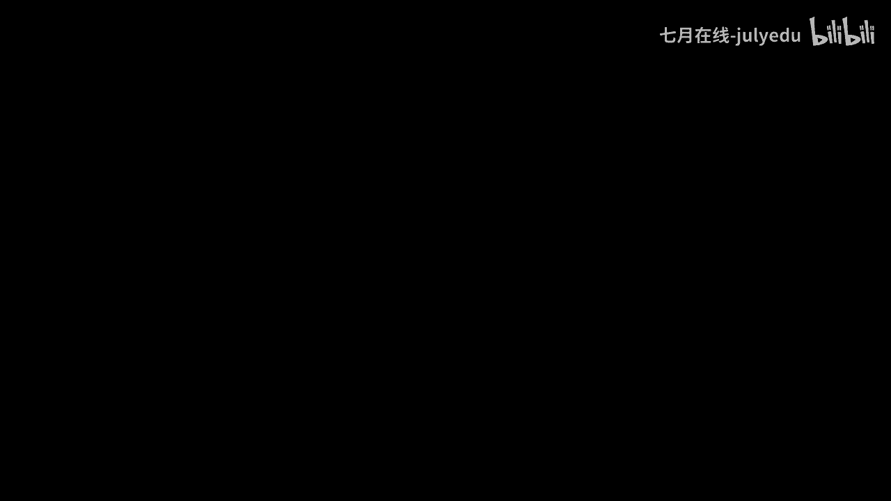

🎼。

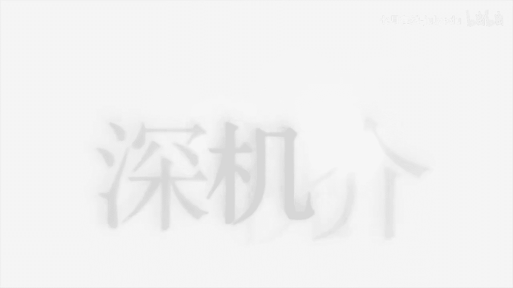

ok。我们现在正式开始，今天我们主要聊的是呃关于深度计算机视觉的方面的一个简介。呃，用英文来说，主要是deep learning for computer vision。呃，这堂课是7月在线主办，嗯。

我本身是7月在线的一名呃关于计算机视业这块的一个讲师。呃，我本身在呃美国的哥大学单国分校同时呃在那个metropolitan state University of Denverver做大学讲师O我主要的研究方向就是深度 deepep learning for computer vision我们今天。

呃，要跟大家聊大概四个话题。第一个话题是什么是深度学习？呃，因为在我看来，深度学习其实就很简单，它就三步。那么我也会跟大家分享一下到底是哪三步。😊，然后在第2块，我会跟大家聊一下目标识别与检测。

紧接着是呃关于这个计算机视觉的一些分支。比如说人体关键点检测呃，图像对抗生成。

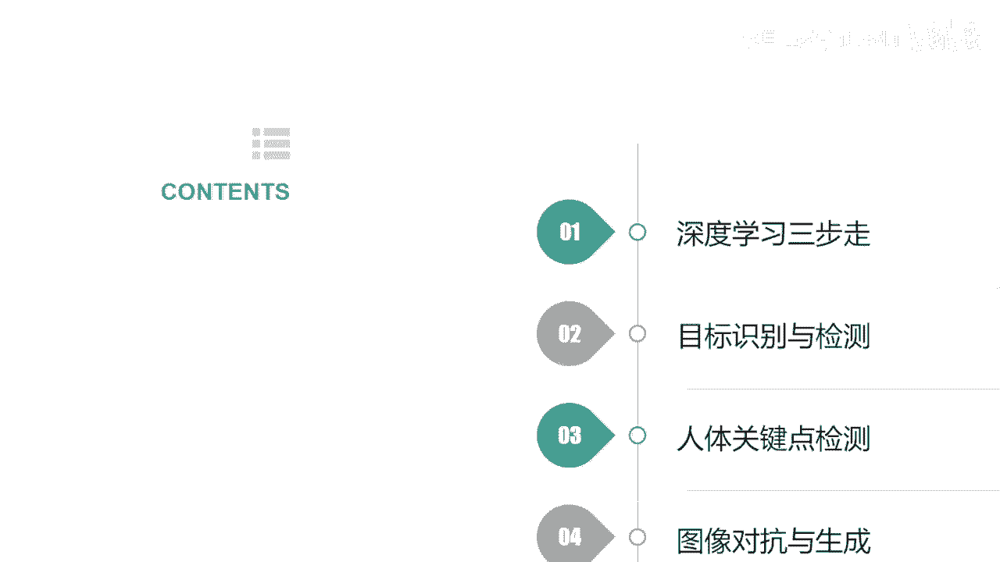

呃，我们第一个话题会是。深度学习呃，三步轻轻松搞定，深度学习OK。

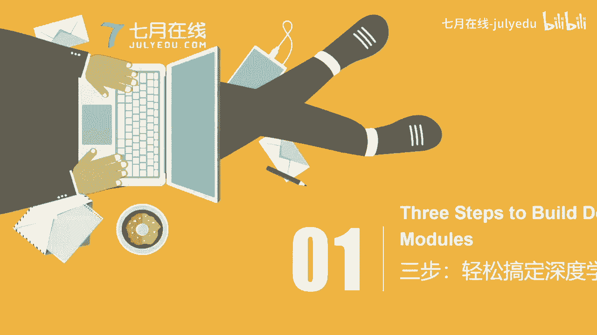

呃，在呃第一个话题的时候，一般来说我们会先提出三个问题，就是什么是深度学习？为什么要做深度学习？最后一个问题就是说如何去做深度学习三个问题，what why and how。先回答第一个问题。

什么是深度学习？那么好，深度学习它本身是人工智能的一个分支。所以我们先聊一聊人工智能。

人工智能简称AI呃，在人工智能出现之前，呃，因为计算机呃科学本身已经经历了一个很长期的发展。那么在呃人工智能的之前的那个时代。对于很多传统的软件或者是算法来说。

他们都是会编撰出一一套呃属于我们可以叫它算法也可以叫它规则。就是说在这个算法当中刚满足一些条件的时候，那么我该怎么样做，否则不满足条件的时候，我们又该怎么样做。那么它是一个基于规则的过程。

在人工智能当中，人工智能它本身是说呃，我是从海量的数据当中归纳一些知识。我不关心你中间过程发生就是发生了什么。当我有海量的数据，同时我知道通过这些数据，我最后想得到什么。然后我进行一个呃模型上的学习。

那么。😊。

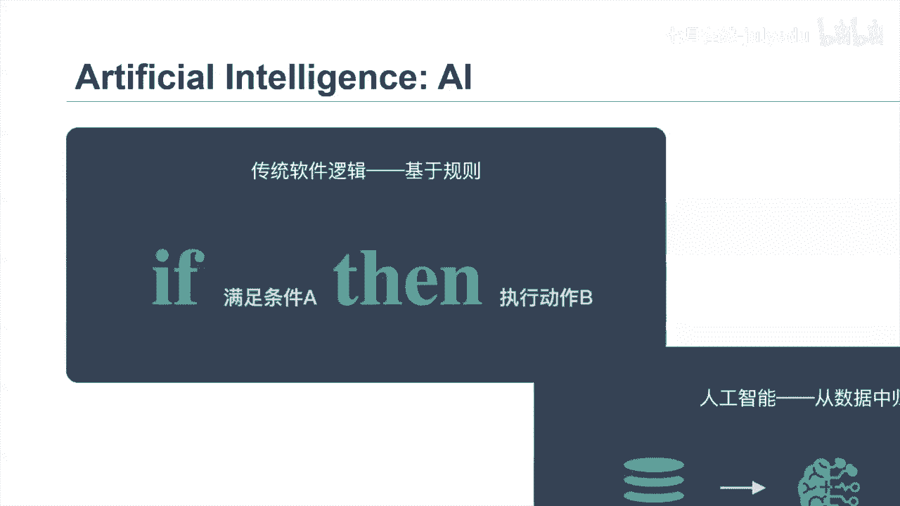

所以说人工智能它是通过一个归纳法来总结知识的，只关注现象，不关注为什么。呃，所以在很多人看来呃深度学习可以说是它的基础就是。统计学它的基础是统计学，就是说一个归纳现象的一个东西。

那么在人工智能往下细分的时候，会出现另外一个分支，叫做机器学习。机器学习。因为它叫mine learningning。呃，从自边意义上来讲，我们就是说让机器去学习它的一些东西。我们看一下它的基本思路。

首先我们把现实问题会抽象出成为一些数学问题，用一些数学的公式或者是负号，把现实问题表示出来。然后在让机器去学习数学问题，并且解决这个数学问题。当解决数学问题之后反馈回去，就相对于我解决了呃现实的问题。

O这是一个机器学习的基本思路。那么在机器学习的机器学习本身也有很多分支，在它的分支里面还会出现一个新的分支，就叫做深度学习。我们看一下深度学习的一个大框架。嗯，左边和右边它像两一个管道。

那么我们把左边的管道，我们认为这是它的模型的输入，这个输入可以是一张图片，一段声音，甚至是。呃，一种气味，比如说我用传感器捕捉到了一种气味等等。那么它最后的输出就是最右面的两个管道，我们视为是一个输出。

它这个输出就可以说呃，我们想让这个机器来做什么？比方说我给了一张图像进来，我想让机器告诉我，这张图像里面有什么。比如说有一张桌子有一有一个花园，或者是有小朋友在踢球。对吧呃，如果是接绍到一段声音的话。

我可以希望嗯机器来告诉我声音的内容是什么。适音的内容是什么？就是等等会一段气味。那么这个气味它会它是香的还是臭的，就拿前一段时间。嗯，我记得我看到一个新闻，就是在这个呃国家针对这个肺炎的时候。

这个人工智能就是加速了那个疫苗的研究。那么其实我们可以也可以认为。在这个情况下，输入就是一些基因的组合，输出就是最后那个疫苗的表现形式就等等。所以传统的机器学习，它的特征主要是依赖人工。呃。

针对特定的简单的任务的时候，那个人工提取特征会简单有效。但是深度学习它的特征不依靠人工是机器自动提取的。呃，所以有些人说呃我这个比如我拿我们还是拿这幅图来说，左边的输入。

右边的输出通过模型自动来不停的学习。这个学习的过程，就好比说大家看中间的那个管道，我的哪些管道在某一瞬间可以打开哪些哪些水龙头是可以关闭，或者是说打开的时候，我阀门开多少，让这个水流很大，还水流很小。

它是一个这个的过程，这个过程是并不是人为干预的，而是这个机器它自动学习，自主学习出来的。呃，这也是为什么很多人说这个深度学习的可解释性比较差。呃。因为深度学习它的虽然会有很强很非常棒的表现。

但是我们不知道它的原理是啥，因为它这个归纳总结的方法嘛，所以有时候老大家老说这个深度学习就是个黑箱OK我们再往下看。😊。

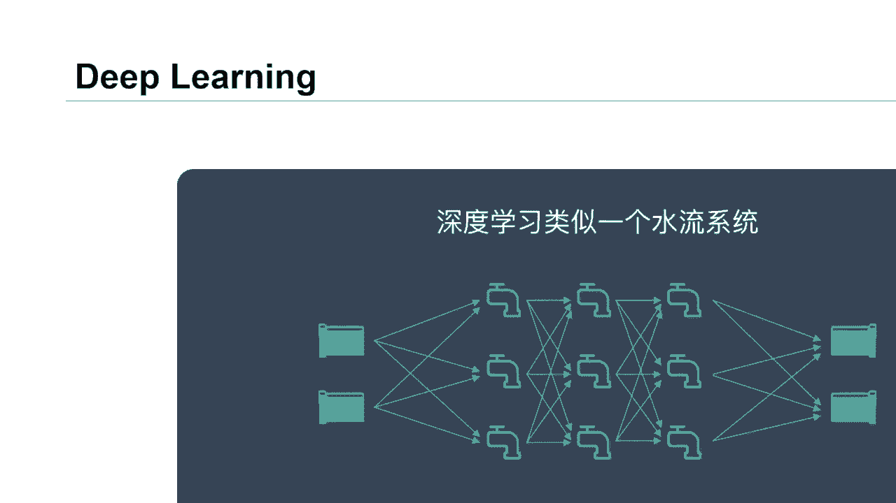

Yeah。这张图片是大概是总结了一下机器学呃人工智能、机器学习和深度学习的关系。人工智能是一个很大的范围，呃，它可以让机器来模仿一些人类的特征或者人类的行为。在人工智能的领域下，会有机器学习，机器学习。

它是说让嗯机器来自主的学习人类的一些啊方法，注意是自主的学习。那么ding的一般它又认为是机器学习的一个小的分支。那么深度学习，可以认为是说让机器自己去想，自己去琢磨，因为它是一个自主学习的过程。

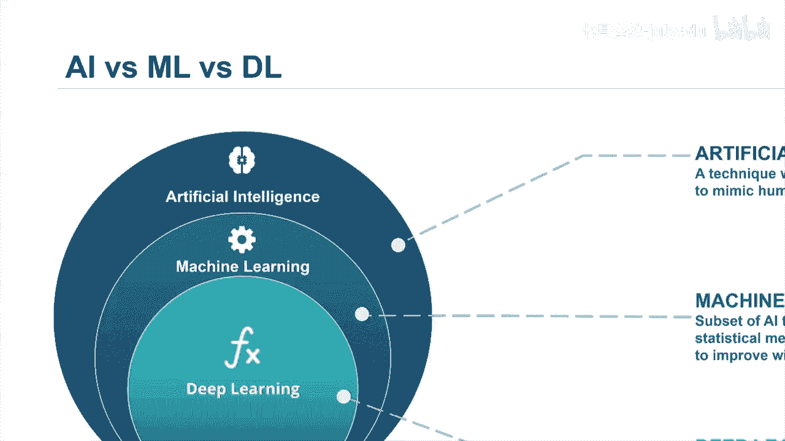

深度学习有哪些优点和缺点呢？我们可以看到深度学习的优点，比方说他可以学习能力强。😊，对吧因为我不需要人工干预。第二是它的覆盖范围广，适应性好。什么意思？就是说呃呃我的呃应用领就是应首先是应用上。

应用上它的非常的强。我同样比如说我拿一张图片，我让他学习了之后，那么我学习的这一类的图片的时候，我就不需要再拿新呃同样是一类的，同样是在这一类新的一波图片来学习。可以说它的适应性非常好。第三个优点。😊。

数据驱动上限高。那么。这个东西因为深度学习本身是基于海量的数据，所以这也是为什么它被称为是有数据就有了天下。最后一个优点，当然它并不只是这4个优点啊，我只列了4个优点。最后一个优点是可抑制性好。嗯。

在深度学习呃，这块有一个小小的很小的一个分支叫呃迁移学习，translytranstrans learning迁移学习。那么就是说呃在我们学习的过程当中。比如说我学习猫和我学习老虎。

因为他们在前期的时候，我们可以认为猫和老虎，它在很多地方上很像。那么当我训练了一个模型去识别图片里面全是猫和。当我在学习再训练模型，学习图片里面是老虎的时候。

那么我就可以把新的模型先应用前一个模型的一些。呃，我们可以叫参数或者是它的一些特征，这是它的可抑制性好。当然深度学习还会就是有很多的缺点。嗯，它最大的缺点就是说呃计算量非常大。

那么就导致了它的硬件需求非常高。一般我们聊像学习深度学习，一般首先你就得整一个比较好的显卡。因为呃当因为它的计算量非常的大。在显卡的算力，它是非常强的。如果仅仅依靠CPU来算，理论上是没有问题的。

只不过它的速度会非常的慢。😊，呃，还有一些缺点，比如说模型设计非常复杂，在早期的时候呃，深度学习早期的时候，它的模型并不复杂。但是随着我们想解决的问题越来越难，所以它的模型越来越复杂。

但问题是呃深度学习，它很容易被跑偏，所谓的跑偏，就是说在我调参的时候，不同的参数会导致结果非常不一样。那么当然我们调参也是呃会需要那个。啊，一些经验和技巧的呃，在深度学习的优点和缺点。

就是这一节这张幻灯片上吧。一般呃当我们聊了一些深度学习有什么优点的时候，其实也就回复了为什么要进行深度学习。😊，我们看一下深度学习的发展过程，这张嗯图片只是到了2017年。当然到现在为止。

2020年深度学习就经过了呃好几就是好几个阶段的大爆发。其实深度学习是一个老生常谈的话题了。大概在50年的时候，就上个世纪呃呃50年代的时候，它已经就是出现了呃深度学习的出行。

但问题是大概在呃大家可以看到啊，在1966年之后。这写了1个AI的寒冬，一直到1997年，为什么会出现AI的寒冬呢？AI涵通的意思就是说，在这个时期，人工智能这块，它的发展几乎陷入了停滞。

它的原因就是因为在上一张幻图片中，我们可以看到它对因为计算量大，所以硬件需求非常的高。那么所以就导致在。😊，那个时候，由于计算机所限，所以我根本就没有办法来训练好我的模型。

这也就是为什么一直到1997年之后，嗯，在呃芯片等等产业，呃，就是飞速猛进的时候，然后人工智能才重新迎来了升级，一直到现在，现在随着这个显卡的性能越来越高。超级计算机越来越强。

也就导致深度学习已经变成了一个全民性的话题。呃，说到这个地方，全民性的话题。呃，我记得以前就会有人问我，呃，在当今这个社会呃，会不会因为人工智能的出现，而导致大规模的失业。

我们看一下哪些工作容易被人工智能取代呢？嗯，这种工作一般有4个特点，我总结一下。第一个就是说。所嗯工作所需要的决策信息量很小。第二种是做决做决策的过程并不复杂，它的逻辑非常简单。而且你能够独立完成。

不需要互相合作。最重要的一点，重复性工作。那么如果呃有些工作有这四个特点的时候，那么我只能说这种工作会有很大的概率被人工智能所取代。给大家举个例子嗯。同声传译同声传译本身是一个非常难非常难的工作。呃。

因为他需要从业人员，有一首先是一个非常敏锐的头脑。呃，然后并且需要你有大量的，首先是你的英语知识，呃，口语非常好。当然你针对某一场类型的活动，你需要有相应的背景知识。你比方说你这场活动是销售领域。

那么就要有很强的商业知识。如果说这项是计算机领域，那么就需要有很强的计算机的背景的知识等等。但是在人工智能出现以后，同声传译这块嗯，它会我当然现在还并没有啊。

我只是说它会慢慢的慢慢的被受到这个人工智能的冲击。因为本身这块。

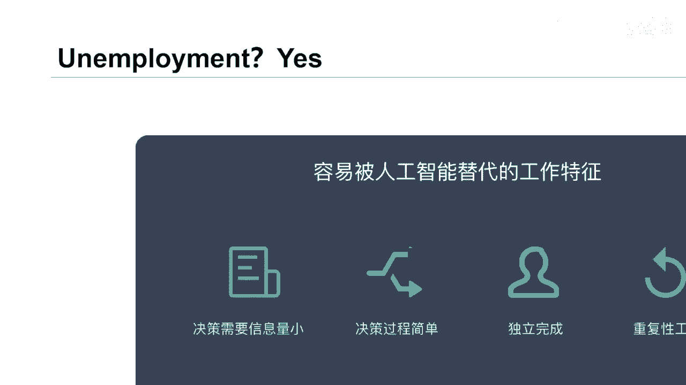

可以的，OK好，我们继续。😊，OK这个是一些很难被人工智能所替代的一些技能。嗯，那么在很难被就是所替代的一些工作的话，比如说他需要很强的社交能力，或者是一很强的创造力，或者是一些感知和操作的能力。

那么在很多服务行业当中，嗯，这个也很难被取代。我们重新回回头看一下吧，就是容易被人工智能取代的工作特征。比如说重复性工作需要独立完成，决策简单，同时呃需要选择的那个信息量比较小等等okK。呃。

其实在很多情况下，嗯，人工智能这块它会是它会取代一些工作，但同时他也会创造出来很多的一些工作岗位。

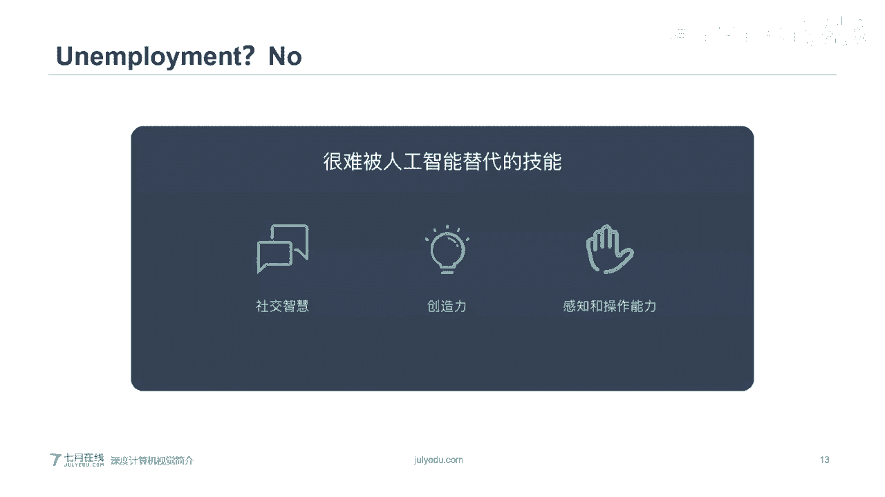

哎，我们现在回答第呃第三个问题啊，how就是说深动学习到底是怎么做的那我们可以看到嗯这个地方嗯，我给大家举一些例子，从左从从左往右看，最左面最左面的第一呃第一行的最左面，我们想做的是语音识别。😊。

那么我给一串给一串函数，我拿笔画一下给大家。OK比方说我这儿有一段音频，那么在这段音频当中，这是我的一个思入。然后我最想最想得到的是这段音频到底说了一个什么话，在这里这个音频7月在线O。😊。

那么我们再看。第二个例子是。图像识别，那么我输入一个图像。计算机会告诉我在这个图像当中，它的主体是什么？第三个例子是阿尔法go的例子。很前一段时间炒的很火的这个围棋大赛。😊。

比如说当我的摄像头捕捉到了一个桌灭奇谱。或者是棋局，然后下一步是怎么做？😡，下一步该怎么走字儿O。😊，最后一个例子是当我说一句话的时候。就是你少啥，然后系统会给我一个反馈。😡，投新咋地是吧？

这个就是比方说那像嗯苹果的siri，百度的，你好，你好，百度就等等这些。那么这些都是呃深度学习的一个应用。那我们看它到底怎么应用的。我们可以看到我这里有一个方框。😊，我这里有一个方框。

方框的意思就是说我这里其实都是一个函数。那么深度学习它本身可以认为它是在寻找一些函数，就是说我函数的输入。是什么？然后我通过函数的一些计算，最后来得到我想要的一个东西。这个其实就是它是如何深度学习。

如何进行运作的ok。我们可以把呃深度学习的函数视为一个黑箱。就拿这个来例子来说，我给定了一个图片。我最后我输入的是一个结果猫。O那么我把函数就叫做一个黑箱。大家注意，在这个黑箱里面。

它并不是仅仅但仅仅仅很简单的只有一个函数，它是有很多很多的函数。😊，OK所以说黑箱打包了所有的函数。比如说我立马有函第一个函数。😡，输入一张图片，猫呃输入一张图片，那么它的结果是猫。那么。

另外一张函数输一张图片，结果是狗。我们继续。注意啊，刚刚开始的是第一个函数F1。那么我在第二个函数的时候，我输入一张图片，我这开始计算F2入进第二张图片呃，输入到第二个函数里面，结果他给的我的是火烈鸟。

😊，同样还是这个函数，我输入了另外一张狗的图片，结果他给出的是答案是山猫ok。那么我们就知道在这个黑箱当中，它会有很多的函数，我给进输入，我想要一个输出，那么输出的结果是并不一样的。那么如何选择呢？

我们想要的是在这里呃猫咪的图片，我就想给定最后的结果就是猫。OK我们看一下。A set function，这是一个呃函数的集合，就是我们的黑箱。在这个黑箱里面有很多的函数。通过这个我还有一个训练的数据。

注意训练的数据是我人为已经提前做好标记的。😊，OK对于提前做好标记的意思就是说我只知这些训练数据，我给定一一张这是有猴绿的照片。我们希望函数的说出是monkey。注意我给每张图片都做了标记。第二。

我给了一张新的图片，我做标记是猫。第三张图片我做标记是狗。这个就是我的训练数据是我人为的已经提前准备好的。而且这些东西我会告诉我的机器。😊，那么大家看。

首先上面上半上半部分是我们的黑箱是充斥着各式各样的函数，下半部分是我们的训练数据，训练数据既有图片，又有最后的结果。那么我们的办法就是说我们通过这两者相结合来找到一个最佳的函数。

我们会发现比如说我刚才那些例子当中，F1和F22个函数第一个函数的结果是最好的。因为它给出的结果是比较准确的。F2给出的结果是不不是非常好的。那么我们就认为F1很好，OK。我们重新总结一下。

其实深度学习三部曲。第一步。呃。第一步有一个有一堆黑箱，有输入，有输出。第二步，在呃函数当中，我们希望选择一个最好的函数。最好的函数的意思就是说我们通过这个非常好的函数有一个输入。

有一个输出要达到我们的理想的结果OK。我们把左半部分叫做训练过程。我们把右半部分叫做测试过程。ok。okK我们重新捋一下啊，深度学习三步曲。第一步。😊，准呃第一步是我们从下面一张看吧。

第一步是建立一些函数，一群函数。第二步。我们把函数的所有的解全部算出来。那么第三步得到一个最佳解，那么这就是生度学的三部曲。okK我们重新看一下。第一步创建一个黑箱，黑箱里面会充斥着各式各样的函数。😊。

第二步，机器来自主判断这些函数结果的好和坏。第三步，在这所有的函数当中。找到一个最优解。最优解的意思就是说我的输入。通过这个函数最后得到输出是我想要的。那么我们就把这个认为是最优解。OK呃。

记得往年有一个充满的小品叫做把大象关到冰箱里面，需要几步三步，打开冰箱门，把大象放进去，关上冰箱门，深度学习也请你就三步，定义一个黑箱，让机器来判断黑箱里面函数的好坏，最后找到一个最好的解。

那么就是这三步很简单。说到这里我们看一下，那么深度学习呃，在计算机事业这块它还有哪些应用呢？O我们继续往下。😊，比如说第一个应用呃，人脸识别。呃，这个应用呃就是我现在给大家放出来的这个视频。

它是做一个就是face IDD。就是说我早上上班刷卡。还有目标检测。大家可以看到在高速路口的时候，我们会把呃我们会用一个矩型框框住我们感兴趣的。在这个图像当中，我们感兴趣的是一辆汽车。

那么同时我们可以也通过这个项目，我们可以发现。😊，哪些汽车是在行进，哪些汽车是一直不动。那么我当我发现某两个框，它一直不动的时候，那就说明这里出现了一些车祸，就需要派交警过去干预。

这个应用叫做人脸关键点识别。大家看这个是挺有意思的。像我们现在的社交媒体，比如说那个抖音快手，它就会呃我们捕捉一段你他用你的手机摄像头捕捉到你的人脸的时候，然后会给你加一些什么小眼镜呀，就等等。

这是一个也很好的应用，叫做呃人脸识别。😊，这一部分嗯新的这个叫做人体姿态估计，又叫做呃人体骨骼点检测。呃，人体骨骼点检测的应用也比较广泛。比如说一些体育或者是无人超市呃。

那么在这块就在现在这个幻灯片出现的两个例子当中，我们把它统称为关键点检测。呃，在今天的第三个话题当中，我会和大家聊一下什么是关键点检测。还有一些例子，比方说呃出去视频生成。

大家看到现在左边的普京和右边的奥巴马都在好像发表一些演讲。但是我要告诉大家的是。😊，这个呃这两张呃是这两个视频都不是他们本人所做的，都是计算机合成出来的。包括无人车。

通过一些接触到的一些传感器来感知周围的环境，然后做出下一步行动的呃就是行行动的预判。

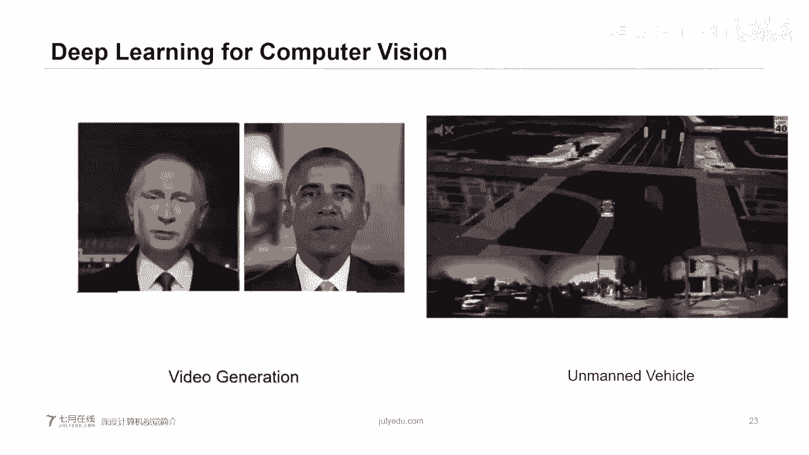

嗯，包括去马赛克。最后一个是呃一个通过图像来进行翻译。比如说我拿我的手机摄像头，我照一下，然后就知道这个路标大概是什么画，就等等吧。呃。

这些就是我当然我仅仅是给大家罗列了一些呃深度学习在计算机视觉方向的一些小的应用。呃，本身它还有很多就是各式各样的应用。那么今天我们就不在这一一赘述了。呃，到目前为止，就是我们的第一个topic。

我现在退出一下，然后看看大家有什么问题或者想和我聊的嘛。如果没有的话，我们再进行第二第二个话题的呃，继续。

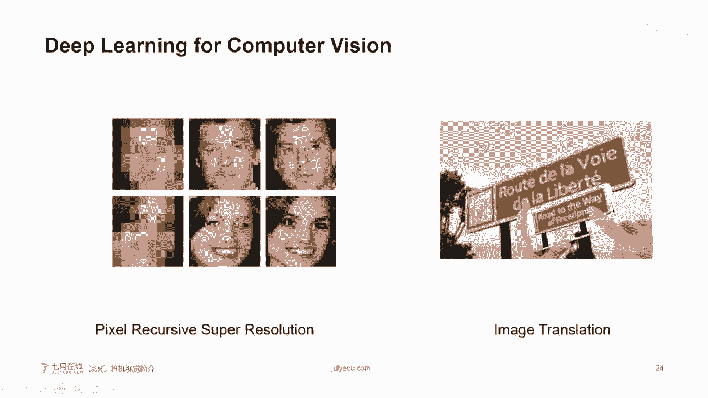

我看一下我们的。

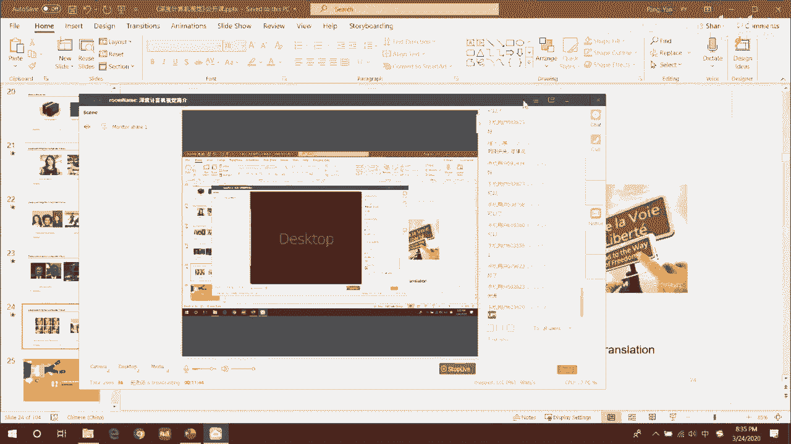

。如果大家对第一个话题还有感兴趣的，就可以现在在对话框中跟我交流一下，不然的话我们就直接进入到第二个话题。

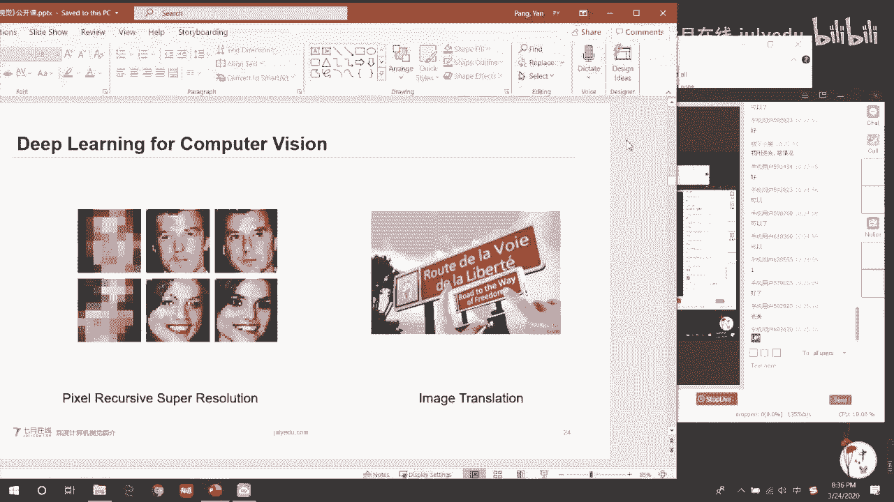

。第二个话题是目标识别与检测。嗯，在这个话题当中，其实它有两个不同的话题。第一个就是目标识别，第二个是目标检测。那么我们先看。

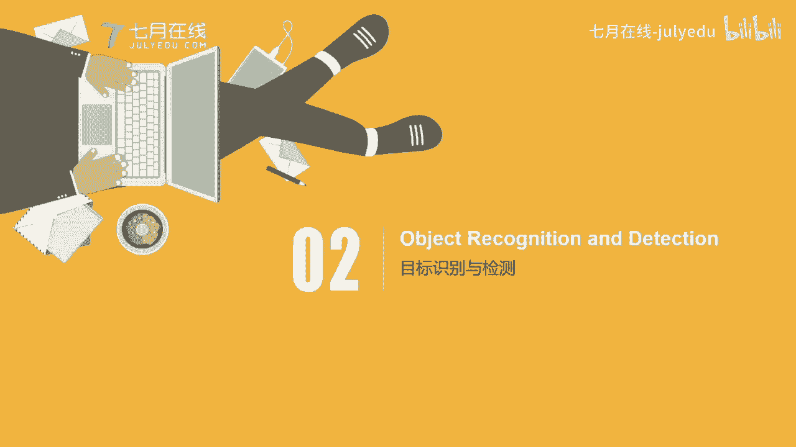

目标识别到底下来做什么的？目标识别本身可以把它想象成一个分类的问题。OK什么是分类问题呢？我们看到这里有三台电脑，三台不同就是各式各样的电脑。但是我们可以把它统称为电脑。

我们就可以如果对这三种电脑进行仔细细分类的话，我们可以得出右上角它是个台式机电脑。左边的是笔记本电脑，右下角是呃平板电脑。我给大家注意。那么这里它是三个不同的电脑，但是我们为什么可以把它统称为电脑呢？

因为对于人类来说，我们会找它的共同点和不同点。他们的共同点，比方说都是电脑都可以做一些，比如说做呃PPT啊或者都是打游戏，就等等或者是视频呀等等看电影。O就是他们共同点。那么我们人类还会找一些不同点。

我们所找的不同点是这三种电脑，它的大小是有什么不一样。对吧它的形状什么不一样，甚至是说你这个材质是什么？全是比如说是铝合金呢，还是说是纯塑料壳等等。呃，拿最后一个来说，便携性来说。

平板电脑的便携性是最高的对吧？然后是笔记本电脑，最后是台式机电脑，一般大家不会抱着台式机电脑来回跑。那么就是说对于人类来说，我们会找它的共同点和不同点。

那么如果我想让计算机来代替人类做这个分类的问题的话，计算机会怎么做？😊，计算机会找到一些特征，features。那么哪些特征？比方说颜色特征，我们可以看到我们先看左面这个。我们先看这个。

本身的颜色就是五颜六色的颜色，它其实可以认为是由三种颜色来混合搭配而成的。红色。蓝色和绿色，红色、蓝色和绿色。okK我们可以看到在这个点的时候。在这个点。这个点三嗯这三种颜色我们称为三原色。

三种颜色通过不同比例的混合，可以达到不同不样的颜色。当达到这个数值的时候，大家可以看到这写的255255255，达到这个数值的时候，我们就认为这个点是个白色的。

它显示的是白色OK我们会把颜色分为从0到255。就是在这三种不同的颜色当中都是0到255，或者是从0到1，这是不同的分类标准，但其实是一样的，效果是一样的。O。😊，呃，还有一种分类方法是向右右边所示。

它通过是饱和度、色相和它的值，当然还有其他的分类方法。但总的来说，我们把这些都归为颜色特征。那今天我主要会通过。左边这个来跟大家聊RGBO。第二个特征，比方说形状特征。我们看这幅呃建筑图片。

在这个建筑里面其实是有一些呃有很多形状的。比方说这是一条线。😊，这儿重置着一个角，那么再稍微复杂一点。😡，这里我们可以把它认为是一个结构，这个就是所谓的形状特征。OK除了颜色特征、形状特征。

我们再给大家举一个纹理特征。比方说。这两张图片，那么我们可以看到左面的像一个蜂呃蜂巢形状的，呃，右边的像很多叶片，它就是叶子叠成的。那么这个我们叫做纹理特征。OK那么在计算机。

它就会通过来分析判别这些各式各样的特征来最后得到它呃不同图片的共同点和不同点。Yeah。每当讲到目标识别的时候，我们都会提到一个东西叫做呃卷积网络conal neural networks。

或者是大家有时候简称叫CNN不是这个美国电台CN啊，就是我们把它剪成这个神经网络，叫卷积神经网络，简称CNN。OK我们可以看到左边和右边，它其实是一样的东西。左边的这个东西是二维的，右边那个东西三维的。

我现在通过二维来给大家解释一下CN他做的东西就是目标视频。那么它到底是如何做的呢？我们可以看到红框里面。我们有输入，我们也有输出。ok我们有输入和输出。所谓的输入，就比方说是一张图片或者是一段声音等等。

当然CN主要是解决图像的。那么所谓的输出，我们可以让它做来判别图呃照片里面有什么东西。okK那么在输入和输出当中。这一块儿。可以把它理解成嗯，这是我们的刚才所说到的黑箱。那么在黑箱里面。

它其实是由不同的层来组成的。比如说第一层，这是第二层或者是3456七八层。那么我们把这每一层都叫做隐藏层。因为我们看不到它，所以我们叫它隐藏层。O它具体是怎么做的。稍后我会给大家。

就是详细解释一下隐藏层的是如何进行工作的。

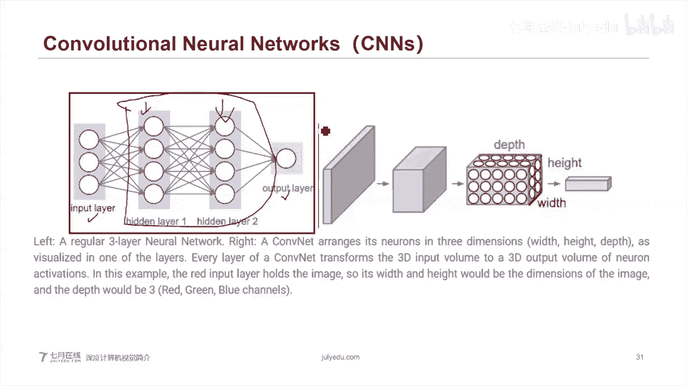

说到特征的时候，在这个地方我想给大家看一下。这个卷机神器网络，我最左面的输入是一张照片，大家可以看到这是一个汽车的照片。那么输出输出大家可以看到在最右面我有5类，第一个是轿车。

或者是卡车、飞机、轮船或者是一匹马。那么当我输入这张图片的时候，我最后的输出我们可以看到在car就是轿车这块，它的那个绿色是最多的，那么就代表这张图片是轿车的概率是最大的。OK是最大的。

所以我们就认为这张图片主要是轿车。呃，不同的绿色的范围代表着不同的概率。中间这块大家可以看到啊，中间这块中间这块就是呃。计算机所识别到的图像的一些features，它每一个都是一些一串隐藏层。

OK我们具体看一下它到底是怎么工作的吧。

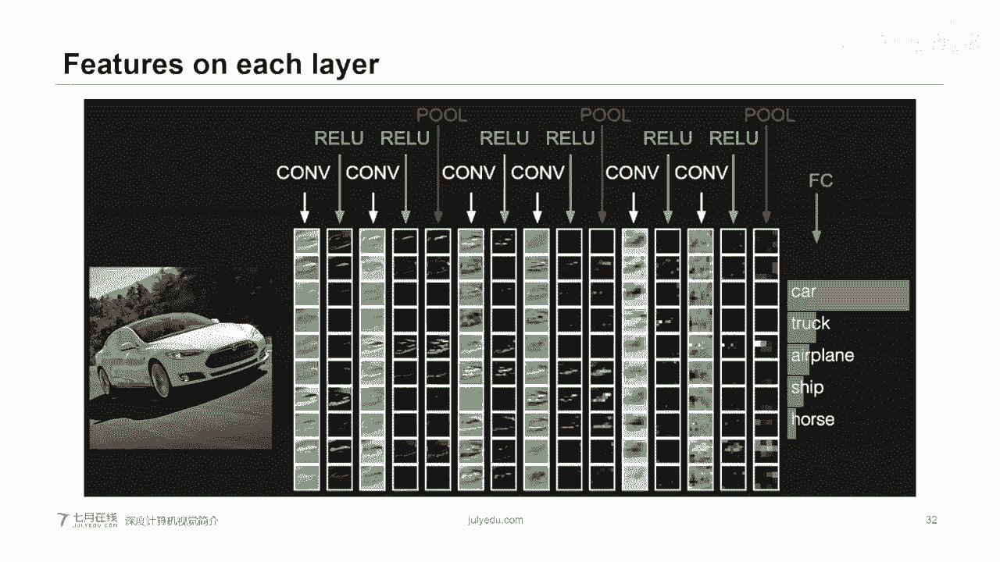

说到这个时候，我们还得从图像说起。😡，刚才我已经跟大家解释了呃，彩色的图像，它一般来说我们可以认为它是由红色、绿色和蓝色这种这三个颜色来组成的，就是通过不同的比例配合。

从1到255或者是从0到1OK我们拿这张图片来举例，这是一张彩色照片。它其实也是它有三层，第一层是红色，第二层绿色，第三层是蓝色。那么对应的每一个像素，我们把这张图片分成了很多的小网格。

那么把这个呃最基本的一个小网格，我们称为一个像素。对于一个像素来说，每一层上面只有一个整数值，就在这个地方我们以整数值来聊。当然它也可以是小数值小数值的话，我们就得判定是从0到1呃。

在这块我们用另外一种判别方法，就是从0到255。对于每一个像素来说，它只有一个整数。这个整数是在0到255的范围内，在三种颜色相叠加的时候就会出现它所针对的颜色O。那么这还是同样一张照片。

我把它分成了三层。对于每一层。我可以假如说这是三层，这里是零或一或者是其他数值，其他的整数OK那么我现在我想做的事情就是说我拿一些所谓的过滤器，或者是呃但我们就把它叫做过滤器吧，或者是过滤器窗口等等。

我们拿它来不同的就不同的过滤器来找到一些所对应的特征。比方说我现在的第一个过滤器 one。那么第一个过滤器，我想找的是一条正的呃一条这个看象对角线，我们把它认为是一条斜线。

就是想找到的一条45度的斜线向下的一条斜线。第二个过滤器，我想找到的是一条垂直的直线O那么我再用不同的过滤器，就是说我用我的过滤器，在我的图片当中扫来扫去，我想发现在这个某一个区域内是否有我。😊。

本身这个过滤器所对应的特征。那么当我有呃各式各样的过滤器的时候，我就可以找到各种各样的特征。OK那么找到各种各样的特征，最后我们拼接起来，其实就能判别出来。哎，这个图像大概是什么类。

OK我们继续看我们的CN。对于每一层，我们可以看到它的过滤器是怎么工作的呢？我拿着呃。大家可以看到我这儿有三个矩阵，这三个矩阵就是相当于我对应的三个橙，红色、绿色还是蓝色。那么我拿着3乘3的一个过滤器。

注意我这个每一层上的过滤器也不尽相同。我拿着我的过滤器，我沿着我的图像一层一层的扫过去的时候，我想找到各式各样的。它的那个结构的结果如何如何找呢？我们是做卷积，所谓的卷积呃，听起来很难。

其实它无非就是说我把每一个像素点在同样的像素点和我在过滤器的像素点进行相乘。然后在这9个像素点在最最后做一次和。😊，做一次和，那就是我本身这一层通过我这个过滤器所得到的卷积。为什么说9个呢？

因为我这个时候我的过滤器是3乘3的范围，所以是9。如果我的过滤器是5乘5，那么我就要需要算25个像素点。OK在算完三个通道的呃过滤器呃的卷积的结果之后，我们加一个和。

那么这个和就是说我最后在这个区域的一个卷积的结果，为什么要算三层呢？因为我这个图像是三通道的RGBO。聊到这个的时候，还有两个话题要聊，一个是padding，就是填充，另外一个是stride，就是步长。

所谓的填充和步长，就是它的意思是说。填充。因为如果我的过滤器是从图像的从头到脚扫一遍，那么在最边和最角的地方，我会遗漏。那么为了防止这个现象发生，我就在图像的外围，我先扩充一圈或者是两圈。

那么当我的拍点等于一的时候，就我填充等于一的时候，意味着我只扩充了一行一列，如何扩充，我就把扩充出去的地方，我全用零来填充，就代表什么都没有，这样不会干扰我呃做卷积的结果。那么所谓的步长。所谓的步长。

它其实是来控制我们运算的速度的。就是说我每次我的过滤器，我在图像当中，我是平移一个像素，还是说平移两个像素，它这个就是作为一个控制速度的。在卷积层下面，我们会聊我们会聊一个池化层。OK我们看一下。

首先我们看到的这个地方，阴影部分就是。这个叫橙色，橙色是我本身的图像。橙色上面的阴影部分。😡，它就是我的那个卷积的范围。那么绿色的这块就是当我卷积之后所得到的结果。在我得到这些结果之后。

那么我为了我进一步缩要我的计算量。同时我也为了找到该区域内一个最显著的特征。那么我会做一步叫池化。石化的意思就是说，比方说我们右上角叫做最大池化。那我们可以看到这一块。

这一块我们有本身做出了4个卷积的结果。那么我找到我的最大值，我把它单独放出来。下一块我又找到一个最大值。然后我依次找出整张图片所有的最大值。这个就是我就是把我最显著的特征，我标识了出来，这个叫最大值化。

呃，有时候也会用到算平均值的池化，就是说我把这四个值，我做一个平均呃，一般来说最大池化是更常用的一种O好，讲到这里以后，我们看一下，在做完池化之后的大概的一些feature。O呃。

这个我本身是用了alexnet alexnet是好像是04年谷歌做出来的。如果我没记错的话，还是还是呃而是还是12年，我点记不清了，就是它是谷歌做出来的一个卷积神经网络。我们可以看到在做到。嗯。

第一层之后，这是第一层它的特征的一个表示。比如说我在。这个区域我们可以看到，我想找到的是一个中间是深色，两边是浅色，就类似于斑马条纹的一个形状。而且它的方向是从左上下1个45度。然后我们再看最后一个。

我想找到是一个这个是我呃就是这个红应该叫什么呀？就是类似于这种红的这个颜色。然后在这个区域，我想找到的是这种黑白相间的一个呃特征。OK这是在卷积神经网络第一层之后。这个是在第五层之后，注意啊。

我说的第五层是第五大层，每一大层它会分为一个卷基层和一个石化层。就是我们刚才讲的，那么在第五个石化层之后，这个是它的一个结果。我们可以看到。刚在第五层之后。这是一个人，这也是一个人。

他已经非常像是我们人眼所能看到的东西了，对吧？我们倒回去在第一层的时候，它仅仅是很很低端的很low level很低端的一些特征。那么当每一层通过不同的这种特征所叠加。最后在第五层的时候。

它已经已经很明显的做出了大概人眼所能判断出来的形状。比如说这是一只狗，这是一个黑人小孩等等。那么这些就是所谓的这些特征。O。😊，我们重新回顾一下，卷机神经网络。首先我们有输入层。最后我们也有输出。

这块就是输出okK我这里有5个类，代表我想找5个不同就是不一样的东西。这5个类可以是动物类，比如说猫狗、狮子狼、老虎，也可以是其他的笔记本电脑就等等各种类。在中间这些我们统一称为隐藏层。

okK就是中间这些统一称为隐藏层，隐藏层它有卷积层。说化层。除了这些之后，大家看最后还有两个，我们叫做全连接层。对于每一个全连接层，我们其实意思就是说我们把。

比如说池化层呃石化层最后它经过的它也是一个类似于这种矩形。类似于这种矩形OK那么呃全连接层的意思就是说我把你的矩形，比方说你是呃假如说这个是13乘以13乘以。108我随便举个例子啊。

那么我就把你这个举证。矩阵，我把它拉成一个X乘以Y乘呃X乘以Y乘以是应该是它乘以1。那么这个值就是说你前面的这个三个数相乘的一个值，我就把它拉平，这也是为什么我们把它叫做flatten，就是把它拉平。

拉成一条直线，然后再通过这条直线，嗯，通过一些最基本的运算来找到最后的。5个节点。OK或者是5个输出，这个就是转积神经网络的它的一个大概的定义。我们看一下哦，alexnet是12年谷歌所做出来的。

我们看一下，一般来说卷积神经网络它大概有哪些吧，就是比较经典的。第一个是12年，他做的是一个alexnet。我们可以看到12年的时候，这个卷积神经网络它仅仅只有8层。但是这八层的卷积神经网络。

它已经能做到误差率，仅仅是16。4%。两年之后，谷歌出现了VGG。这个VGG它有好几种类型。比如说这里做的是19层的，就是最高层，我是写的19层的VGG。那么在19层的时候，它的误差率已经降到了7。

3%。误差率的意思就是误识别率。当我输入一张猫的图片的时候，它给我一个结果是狗，这个叫是误差率。同年又还谷歌又出现出了一篇文章，它大概22层。那么这个22层的时候，它把误差降到了6。7%。15年的时候。

仅仅一年之后，科学家们做到了。152层的一个结构，它的误差率降到了3。57%。那么在这个时候大家可能不禁会问，是不是说当层数越多，或者是这个神经网络越深，那么它的误差率就越低。大家其实并不是这样的。呃。

因为当大当科学家做到就14年的时候，google net的时候，大家就会发现，如果仅仅是单纯的当单纯的把层数加深的时候，误差率并没有很明显的下降。反而误差率会上升。那么出现这个问题的原因，嗯。

科学家归类的一些归就是归纳了一点叫做梯度消失，或者是梯度爆炸。OK关于梯度消失和梯度爆炸，会在我们之后的就业的就业课上，就业班上，就是老师会大家给大家仔细讲。那么在这里我给大家只是说一下。

这有一个现象叫做梯度消失或梯度爆炸。它会影响神经网络的结果或者是进度。在15年的时候，它虽然做到了152层。大家可以看到，在每一层的时候会有很多的类似于这种。😊。

小连接这种小连接的目的就是来解决季度销售和梯度爆炸的问题的。17年的时候17年到我个人认为到目前为止，它其实也是呃一个层数达到了最大吧，已经做到了264层。264层嗯，这个它的精度也其实已经非常的高了。

在这儿我也给大家了一个就是大概的链接，就是嗯会讲一下关于呃深度就是各种呃卷积神经网络不同层数就是和一些的介绍。大家有兴趣的话可以过来看一下OK。😊，那么我们还会聊到，当我比如说dancenet。

就是上面这个车道264层的时候，我需要一个一个函数去写吗？答案是不需要。当然我们也可以这么做，但是现在的科学家已经做出了很多专业的库哦，顺便说一下，深度学习呃，常用的深度学习的编程工具是python。

呃，有的人也会用mab呃，因为mab本身结合了一些库嘛。但是python是最流行的。在python这个编呃就是编程语言当中，呃，很多公司做出了一些他们的专属的库library专属的库。

比方说谷歌的tansorflow或者是微软的呃。😊，CNTK呃facebook的y等等。就是说我现在在这张幻灯片上给大家列出的是当下比较流行的一些呃深度学习的框架。

那么这些框架或者是这些函数的python的函数库，对于我们普通应用者来说，如果你想搭出一个深度学习的模型来，你就可以完完全全的直接调用这些框架。比方说卷基层，我们就可以写一个呃CONV。

然后给出一些参数。至于参至于框架内部是什么，就是怎么运作的。这个不是在我们考虑范围之内，OK通过这些框架来很容易的搭载出深度学习的一个模型。O。到这里给大家说一个比较好玩的东西。这里是一张照片OK。

然后这里是一张梵高的油画像。那么我想做一件事情，就是说在这张照片当中出现类似于梵高油画像这种特色的一张照片，就是我要合成出来一张新的具有梵高特色的本人的照片。OK现在我们来看一下效果是怎么样的吧。

OK大家可以看到，在这张照片上本身还是依稀有着原照片的影子，但是呢它就具有有梵高的特色。这个事例我们叫做deep dream深度的梦。我们来看一下它是怎么实现的。首先我有一张照片。

同时我还有一张蛮高的油画。那么下一步。我们通过2个不同的CN卷辑神经网络来进行一个训练和学习。对于照片来说，我们所要学习到的是照片的内容。对于梵高的油画来说，我们所学习到的是这种风格。

然后我们把内容和风格统一放到一个新的全集成绩网络当中，再次进行学习。到最后一步，我们就可以得出一个呃具有梵高油画特色的一个呃非常经典的本人的照片。那么到目前为止，我们已经了解到了什么是目标识别。

我们也知道了目标识别它所做的就是求解一个分类的问题。这张图片是一个小婴儿，另外一张图片是狗，中间这张图片是以山猫的玩偶OK这就是目标识别所要解决的问题，分类问题。那么我们再看一下。

除了目标识识别能解决分类问题以外，我们也更想做的是在这张照片当中，不仅仅是呃能知道它的主体是什么。同时我们也想知道主体所在的内置是什么。这就涉及到了另外一个问题，目标检测。

OK所以说目标检测相当于我解决了分类问题的同时，又解决了一个定位的问题。比方说在这张照片当中，首先我们知道嗯这里面有两个主要的主体，一个是狗，另外一个是小孩。那么我们就用两个剧型框不同的剧情框。

分别把狗和小孩子圈出，同时给出了狗和baby的照片。OK那么我们就知道了狗和小婴儿的他们的所在的在所在图像当中的位置啊。我们看一下呃，拿这张图片举例吧，这张图片是一张俯视图，它是一个建筑物的俯视图。

中间的蓝色区域代表游泳池。那么在目标识别当中，就是左边的图像，它是目标识别或者是图像分类，我只能说出这是一张建筑图片。那么在右边我同时标出了中间是一块游泳池。大家看到我用绿色矩形框来标出了它的区域。好。

那么这个呢就是说呃目标识别。那么如果怎么做呢？传统的深度呃传统的目标检测呃，大家会用一个。一个框来不停的就是从左到右从上到下来去筛选，去找去找到那么这个游泳池所在地。

那么我们想想到这样会有其他什么问题呢？呃，显而易见，如果我扫描的矩形框大小不一样的话。这就会产生一个很大的问题。当我的矩形光特别大的时候，你比方说极端一点，我的矩形光就是我整张图片的一个大小。

那我就直接说ok我找到了，但是其实一点意义都没有，对吧？如果说我的这个呃扫描框又特别小，那么可能我只找到了。😡，游泳池的一部分。那么这个时候我会发现哇，这张图片啊好多地方都是游泳池。那么在目标检测当中。

我们最想得到的一个结果是，我希望你你的游泳池的大小和我矩形框的大小。差不多大。O我们看一下深度学习这块是怎么做的。😊，在目标检测这块呃，主要是一般来说会有呃两个流派吧。呃。

第一个流派是one stage，我给它起了一个名叫一刀流。第二个流盘叫t stages，我给他家写了个名字叫两刀斩。我们具体看一下。哦，在看之前我们我给大家罗列了一下，呃，就是到目前为止。

这些不同的流派的一些主比较流行的吧，不能主要比较流行的一些算法。比方说。呃，奶酪夹里面大家可以看到啊，我这列了4个。😮，我这列了4个。那么四个它其实都有1个RCN看都有1个RCN。

那么我们把这个称为RRCN家族OK那么在E道流里面，我就给也给大家列了几个。呃，在第二章的最后的结尾，我会给大家播一张图片。那么那张图片里面会显示出呃现有的所有的就是到目前为止。

所有的主流的呃目标检测的所有的算法。OK我们继续。我们先从呃两道讲来说起，所谓的两道展就tto stages顾名思义嘛，它有两个两个部分。okK我们先看这张图片。

这张图片是一个人骑着自行车在一个建筑物面前。那么这张图片下。😊，OK在这张图片下，它的首先我会有一个叫feature instructor，它的意思叫做特征提取器。所谓的特征提取器，大家看VGG熟悉吧。

OK yesnet熟悉吧，这个是我们在呃就是刚才所列了一下，大概有哪些卷进神经网络。好，也就是说我们可以通过卷积神经网络把它来当做一个东西，叫做特征提取。那么在特征提取下面。好。

我们紧接下来就是我们的two stages。第一步叫做兴趣框的生成器proposal generator。O。第二步叫box test fire。我们看一下到底是在做什么。

那么上面这个我们退一下上面这个上面他所做的东西就是说我想找到一个感兴趣的地方。所以感兴趣的地方，比方说我在这张照片当中，我想找到人。😊，就是说我想找到一个矩形框里面，大概是有人的一部分或者是人的整体。

这个就叫做感兴趣区域。如果说你想找是自行车，那么所谓的感兴趣区域，就可以把它理解成为自行就含有自行车的一部分或者是整体的一个矩形框，这个就是to stage的第一步第一个stage。

第一个第一步我找一些候选区域。OK感兴趣的候选区域。那么第二步就是说在我候选区域里面，我去找所谓的候选区域，哪些会真正的含有我左的我的呃被检测物体。如果我检测人的话，真正的还有那个人。

或者是有些候选框里面，它只有人的一部分，它只有人的左半边或者人的头或者是人的腿。但是我想找到。呃，个别某些候选区域在这个候选区里面有整个的一个人，而且注意这个范围不能太大。

你不能说你把整个一张图片给我图片给我，然后告我你那肯定有呃肯定有你想找的东西，那就没劲儿了，对吧？OK这个就是tto stages，他所主要所做的东西。😡，呃，在这张幻灯片中。

我给大家列了一个呃比较这个是fasRRCN的一个结构。fasRRCN在它刚出世的时候，是一个非常呃里程碑的一个算法，那或者是一个模型。我们看一下，首先最开始在呃两高展之前。

它用一个卷积神经网络来提取我的呃特征。然后这个区域是RPN简称RPN网络。那么它就是我们所谓的呃候选框区域。就是说我通过这个区域来找到我的那个我感兴趣的候选框，然后。在我所谓的所有的后选框当中。

我找出来最合适的我的矩形框。这个刚才所说的就是to stage的部分。我们再看一下one stage它是怎么做的。one stage这个地方我们可以看到还是那张图像。

还是在所有stage的最前面有一个卷积神经网络，大家把特征所提取出来。在提取出来之后，大家注意我这对于one stage来说，我只有一个部分，就是说我直接定位。😡，我的就我直接定位我的那个呃目标区域。

目标的矩形框OK他是怎么做的呢？他所做的东西。呃，首先我不再找我的那个候选区域了，因为我认为我的找候选区域的这部分太浪费时间了。那么它会用一个叫做毛框，英文叫anker毛框来就是。直接去找展信息区域。

因为今天这堂公开课主要是简介，所以我就在这里我就不给大家展开就是讲毛框的工作原理。如果感兴趣的同学的话，会在嗯欢迎来就是我们的就业在线的就业班，里面会给大家具体讲一下呃，所谓的候选框，还有毛框。

他们的工作原理，并且代码是如何实现的。那么在这儿我先给大家看一个，这个是优63的一个视频，让大家看一下，就是现在他是来如何进行工作的。

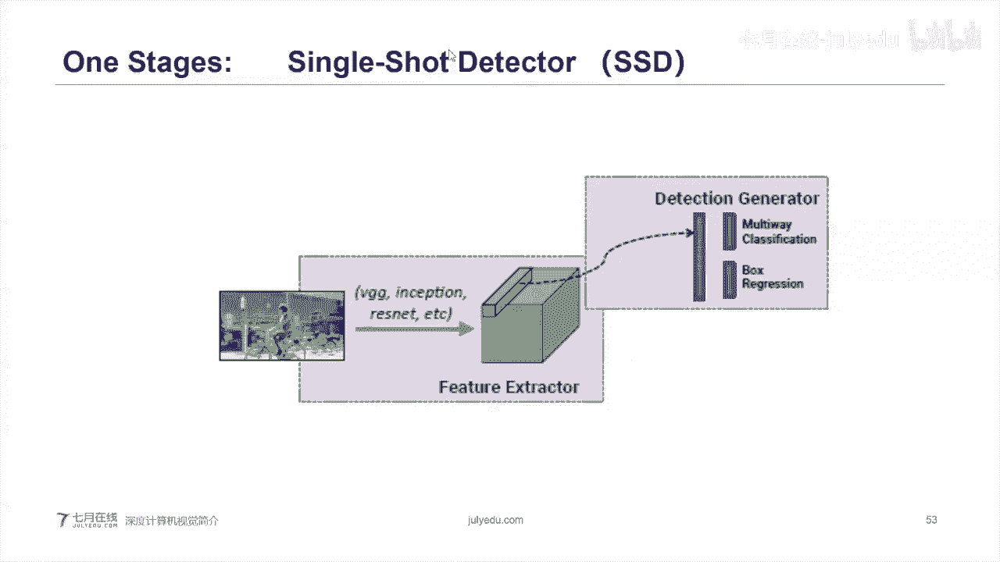

Yeah。🎼，🎼I just drawn up on love。 I wish you cant see you， but she only care when she stuck this time。

🎼多么值办。🎼I wish it let me be， but a best in these guys。そ。🎼是你了所。🎼给你是否为 my see。😊，🎼该我有人的嫁给我。😊，🎼跟上动。🎼会梦。

🎼这样。🎼过去为。🎼玫回。🎼谁。🎼逃过的。🎼爱我为。🎼可白。🎼是て。🎼我的心变天涂 much纯色体。😊，🎼Why can't she give some sort of son。

🎼I and I know， I think I do but when the boys town。😊，🎼I feel like the man。白。🎼Yeah。🎼就不住。买。🎼两场过子会。

🎼然就不觉问你。OK呃，大家刚才所看到的就是呃优路V3的一个呃测试的一个结果的效果效果的视频。呃，优乐V3可以说是在呃就是one stage这个分支一个非常经典代表作了。呃，很遗憾。

现在优乐V3的创始人现在已经宣布退出了就宣布退出计算机图像制约这个领域。呃，原因他他说的原因就是说呃不希望这些技术被美国军方所利用啊，所以他退出了。当然除了优乐V3之后。

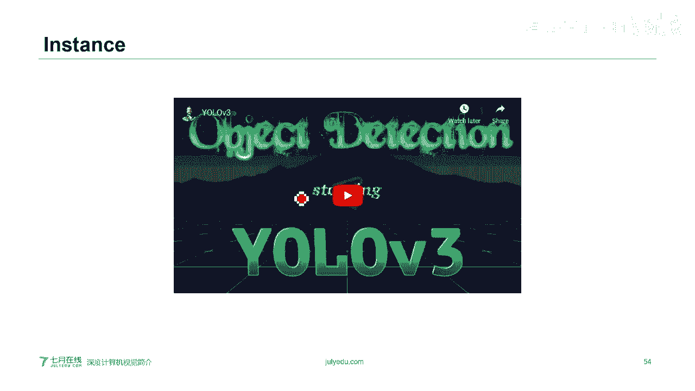

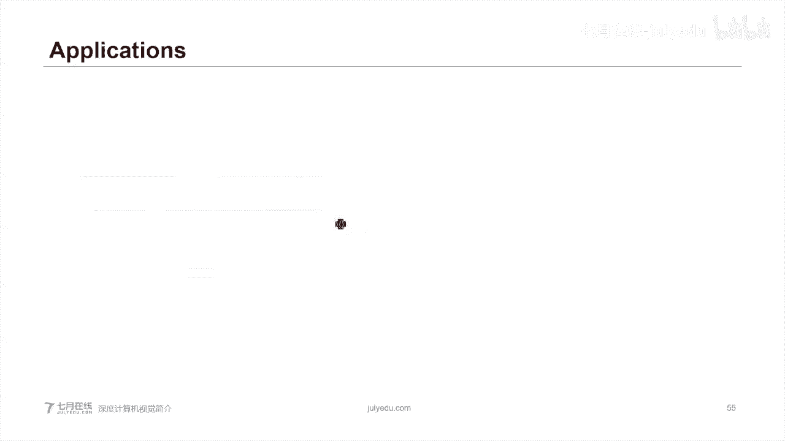

呃，除了娱乐V3之后，呃，还有其他的一些呃算法也在继续发展。最后我会给大家列一下，大概会有哪些算法。OK我们在这儿看一下它的应用。😊，第一个应用，比方说车牌的检测识频。我们拿这个来看吧。

这个大概是我们可以看到啊，首先我们在这张图像上。这张图像是一个车流检测的原始图像。那么在第二张图像上，我们用不同的颜色看，我们用不同的颜色来标示出不同的车辆。同时它所对应的车辆的行动轨迹。

我们也能就是检测出来。还有一些应用，比方说大家看这个图像。首先我用标出了一些。呃，车样的车样的一车辆的呃一个。就是范围吧。然后我同时我还能检测出前方车辆到我现在这个摄像头。

或者到自己的车辆的一个大概距离。如果距离过近，注意这个距离会计相对的。根据我的车座，我判断距离。如果距离过近，我会把它标红，同时做出声音的警示。okK或者是我在过呃路口的时候，比如说最后一张图像。

过路口的时候，那么我的这个车辆，我检测到前面有一个行人正在横穿马路，那么我把它标红，同时发出警报。这个应用是在路口的摄像头，我会检测啊，这里有实通过。呃，也可以是呃当大家去旅游的时候。

我遇到一个比较有特色的建筑物，我拿起手机拍一下，然后直接发送上网，然后就可以找到。那么具体这个呃建筑物的一些详细的介绍，这个可以说是一个图像搜索的一个就是图像目标检测，再加一个图像搜索的一个结果。

OK还有一些应用，比方说工业上当然怎么能去找工业的对吧？呃，大家可以看到左边最左上角这是一群机器狗在踢球，这虽然是在做游戏，但是它这里面涉及到的人工智能询问比较多。

比方说首先我得需要摄像头来定位到就是机器狗的眼睛来定位到球在哪里。那么找到球之后，我下一步该怎么做，我该跑多快，或者是我该把球传给到队友啊，不要传给到其他的对方的狗是狗的脚底下，对吧？

还有现在很火的无人无人运输车，就或者叫无人快递车。还有工业自动化上面用到的那些机械手机械臂。呃，除了在交通或工业上有应用，目标检测在医学上也有很强的应用。这个好像是我本身不是做那个医学的。

所以我不太了解，不太了解这个图像。这个图像好像是盆古，也可能是一个大脑图像嘛，好像是棚古的图像。那么我通过目标检测的方法，我会把这些异常区域。你看这些异常区域，我先提前进行学习和训练。

然后我直接在其他我没有见过的，还是这些盆古应该是盆古八的这这些扫描扫描图上，我直接把呃我感兴趣的区域也标出来。大家看到上面的数值，0。9980。9850。992，它就还是那个概率值。

就是说我这半区域是我所学习到的东西，大概是呃这一类的概率大概是多少O。

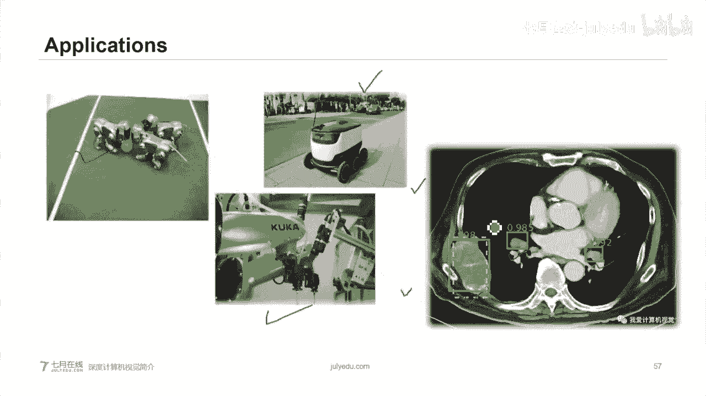

这个就是我给大家呃抛的一张图。这个图就是说从13年开始最早的做RCN可以说是从嗯RCN开始，目标检测才真正呃就是走上了一题。一直到现在19年。到现在19年的就是呃到目前为止，一个所有的主流算法的一些。

呃，一呃一些名称吧。在这个地方大家看一般来说是红色区域，是当时来就是当时比较一个划时代的。在这儿我想给大家把这个圈出来。😡，18年的corron net，其实18年这个cor net这个算法。

它本身也是我个人认为是一个非常具有意义的。呃，因为它不再去用刚才所说的就是那个毛荒来去找感兴趣区域，它是直接找两个对角点，左上角的点和右下角的点呃，在就业课上。

就业班的老师会给大家具体讲一下这个cor net呃，最新的一个比如说M two that这个M two that它的呃代码，我我目前所说它还没有剖出来。呃，它这个也很新感兴趣的同学可以去网上搜一下。

okK好，到目前为止，我们就大概讲的第二个话题，我先退出来一下，看看大家有什么问题没有。

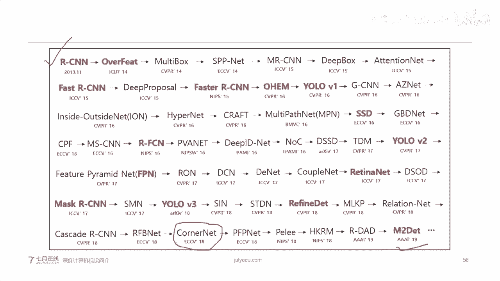

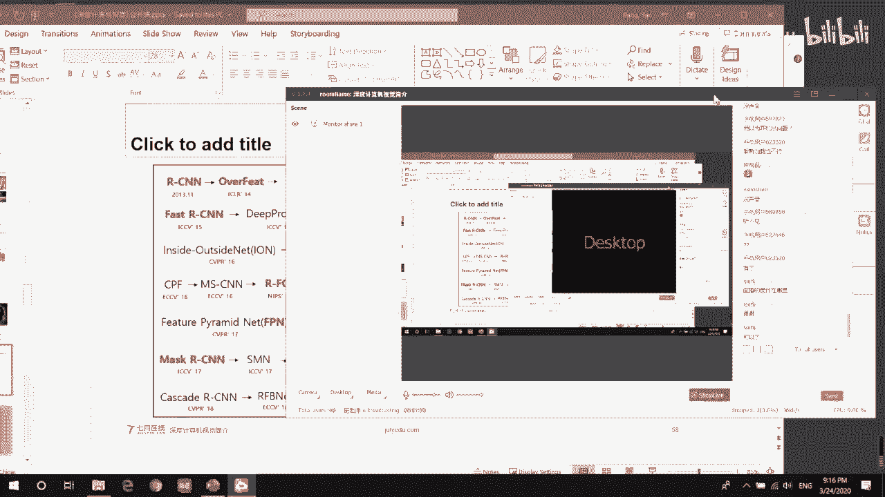

如果没有问题的话，我们就直接进入呃第三部分人体关键点检测啊，PPT最后可以发给大家呃，PPT在课程结束之后，我会把PPT传给我们的运营老师。

然后大家可以就就是呃问我们的老师直接就是拿到我们的PPT这个PPT我看一下，大概这个还挺大的，大概有104页。ok有104页。

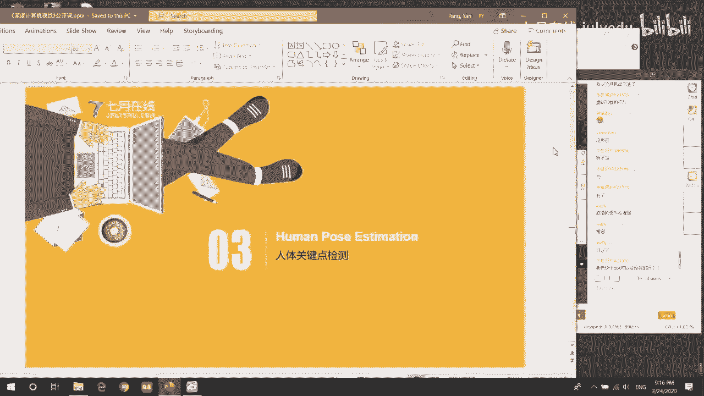

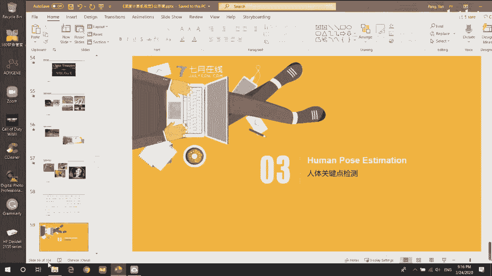

我们才过了一半。包括最后这个公开课，他也会有一个呃就是视频也会传到网上，让大家来看。哎，这个问题问的很很棒啊，这个同同学问我呃，中间层它那个图是怎么画出来的？呃。这个问题问的很好。

他说一般来说图像不是是RGB对吧？三种颜色。然后这个同学问我就是那种像黑白颜色。大家注意啊，RGB我们可以合成一张彩色图像，但是本身的黑白图像，它可就只有一层，或者是我们有时候叫这个黑白图像叫灰度图像。

它本身就一层，明白吧？这个就是直接你pud出去就行。呃，在python里面，它有一个库叫做。我给大家打出来，它叫做open CV。open CVV它就可以。如果你是一层的通道。

它也可以直接给你直接就是播放出来，任生成三层或者是呃本身一层它也可以。这个有回放，这个最后回放会铺到网上。呃，我另外补充一点啊，中间层它这个中间层每一层的隐藏层，它的层数可就不再是三了。

它的层数由谁决定的？它的层数由你有多少个filter，就或者有多少过滤器决定。比如说你有1万个过滤器，那么层数就认为是1万层。那么对于每一层，你可以就是每一层你可以把它单独的就是显示出来。

OK还有其他问题吗？

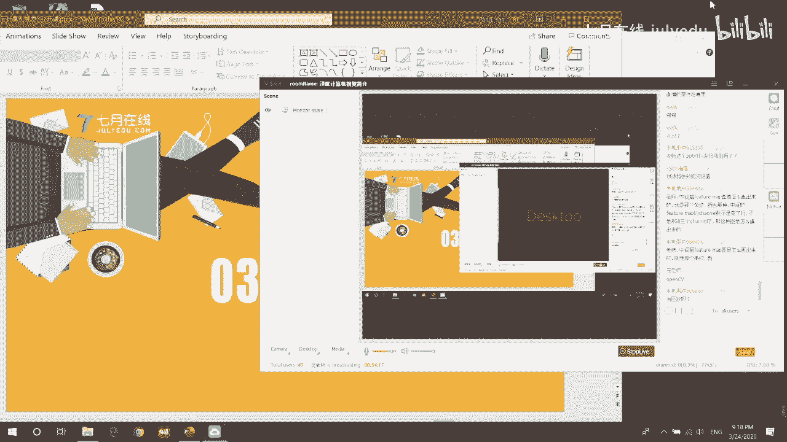

没有的话，我们就继续我们的下一个。

人体关键点检测。呃，在开始这个话题之前，呃，我给大家罗列一下呃，公开数据集。因为对于前面所说的图像识别和图像检测来说，所谓的数据集，大家可以们随便一搜就能搜到。

或者是直接你在百度或者是谷歌上面直接用写个爬虫当了一堆图片，那么它也可以搜到。因为它本身就是些图，但是这个呃关键点检测呢，大家注意啊，虽然我们的书也是一张图像。

但是我们同时的数据集还需要有另外一个东西来作为辅助，就是说这个人工的呃我因为叫人工label，它的意思就是说我需要把大家看这张图，我需要把你所有的关键点，我先提前标出来，并且告诉的计算机。

我所标准的关键点，它是哪一类，比如说它是左眼右眼，虽然都是眼睛它是分左眼右眼，或者是你的。呃，比如说手腕鼻子。或者是肩膀等等。那么这些数据集我在家给大家列了一下，呃，可以可以看到啊。

对于不同的数据集来说，它所所含到的的图像的数量是不一样的。同时大家对第三列key pointskey points意思是说关键点的关键点，这只是数值代表关键点的个数什么意思？

对于人体关键点呃关键点检测来说，我所谓检测这个时候就不光仅仅是你这个人的主体，我同时还会把它里面的一些关键部位的点所标示出来，所以叫做关键点。所谓的关键点哦，还是那句话。

大家看左眼右眼嗯或者是手腕手肘膝盖膝关节等等。那么对于不同的数据集来说，对于不同的数据集来说，它关键点的数量是不一样的。这是提前定义好的。呃，对于我个人来说，也是如果是大型比赛来说。

大家一般常用的还是那个。😊。

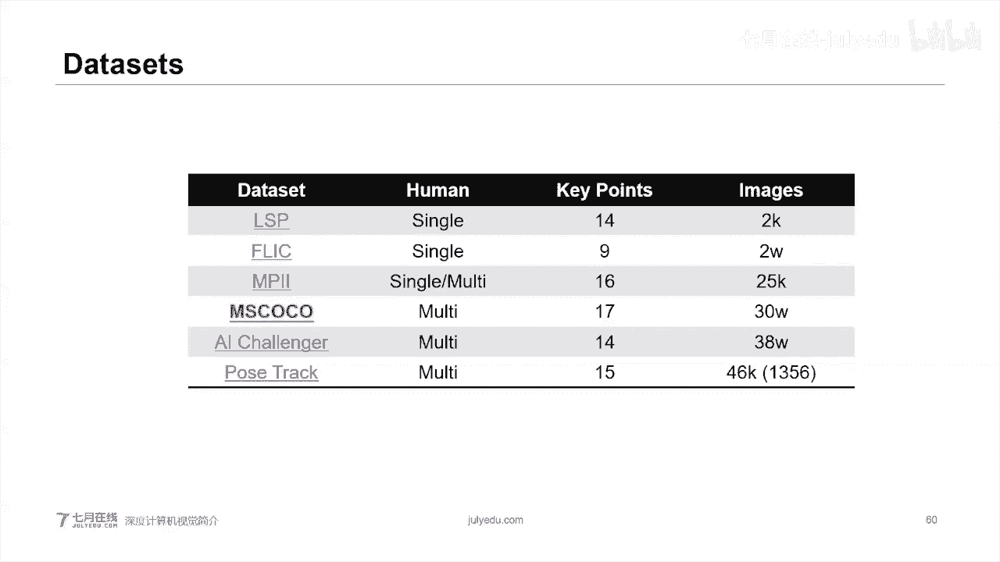

coco数据器叫IMScoco在这个地方呃，我其实我这样给大家都做了一个每一个都有链接。呃，当你们拿到我的课件的时候，你们可以直接点链接，然后就直就可以直接搜到了。😊，就直接进入这个数据集。

然后你就可以下载它。OK另外这个东西大家看这里也有一个链接，这个链接就是我右面这个图像，它的呃它的网站注意啊，这个东西它其实是如果你想做人体关键点的数据集的时候，或者是你想做自己的训练呃训练样本的时候。

你就需要用左边这个工具来点出这些所有的点。看到没？所有的点OK左边是一个工具。OK说到这儿以后，呃，我们已经给大家介绍了数据集和做数据的工具。那么我们可以先看一下到底什么是人体关键点。O。呃。

人体关点检测就叫做人体自带估计，它的作用就是说在图像上找到它注意啊有两个作用。第一个是找到关键呃关键点的位置。关键点。比如说手肘手腕眼睛等等。第一是找到位置。第二步是找到位置之后，把具有相同。

就可以连接在一起的关键点，就是把它画成一条线连起来。比如说我的手腕和手肘就可以连起来，你不能把我的手腕和我眼睛值也连起来。那么这是这种连接方式不对的。当然，如果你知道了呃，第一步关键点的位置的时候。

同时就意意味着我们已经知道它的连接关系，因为连接关系是预先定义的。OK在人体关点检测，它主要有两个分支，第一个分支叫做自顶向下。第二个分支叫做自底向上。大家可以看看到这个字面意思，一个是从上往下。

一个是从下往上。那么我们看一下它具体是怎么做的。top down自顶向上啊，自顶向下。😊，他意思是就是说我先找人或找点。我在一张图像上面，我先把这张图像上人我用矩心框来圈出来。至于到目前为止。

这一步就是我们上一节所聊的object detection目标检测。找到人之后不在人呃，我在这个呃找到的这个矩形框的人的身上，我再找每一个关键点。OK这是第一种想法，就是说先找人或找点。

那么我们看一下第二个方向。第二个方向自底向上，它的方方法就是说我不找人了，我直接先把点找出来。找到点之后，我对这些点进行归纳。意思就是说比如说我这张图像上我有两个人，那么我就可以找到两只左手，两只右手。

对吧？然后下一步我就会需要做进行一个搭配组合，哪些关键点属于第一个人，哪些关键点属于第二个人。我不能把第一个人的手和第二个人的脚归成同一个人，那就闹说笑话了。

OK那么这个就是人体关键点呃人体关键点检测的两个分支。我们看一下具体事例。top down这里向下，先找人或找点OK这是一张图像。先用矩型框。把图像当中的人来标出来。第二步。

把点找到所有的关键点就是那些比较重要的关节点，找到之后。我把现在连起来，OK就是top down，它主要做的。我们看一下top嗯。关键点检测，大家注意关键点检测top down的第一步永远是目标检测。

你可以用呃one stage的方法也好，用tto stage的方法都好。找到点之后再去进行关键点检测。那么其实这个关键点检测，注意关键点我所对应的是每一个关节部位，那么所谓的关键点检测。

其实它就是一个分类的过程，明白吧？分类的过程，这一类属于左肩另外一类属于右胳膊肘。它这个就是一个关键点检测的分类过程。O。呃，在这儿本身这是有一个视频。

我在这儿想给大家抛一个就是maskRCEN在这个关键点检测里面的应用。大家注意啊，maskRCN它本身是目标检测的呃一个算法。但是它本身也可以用作关键点检测的一个呃检测上面我给大家呃上网。

然后给大家看一个视频，看一下mRCN在关键点检测上面是怎么做的。

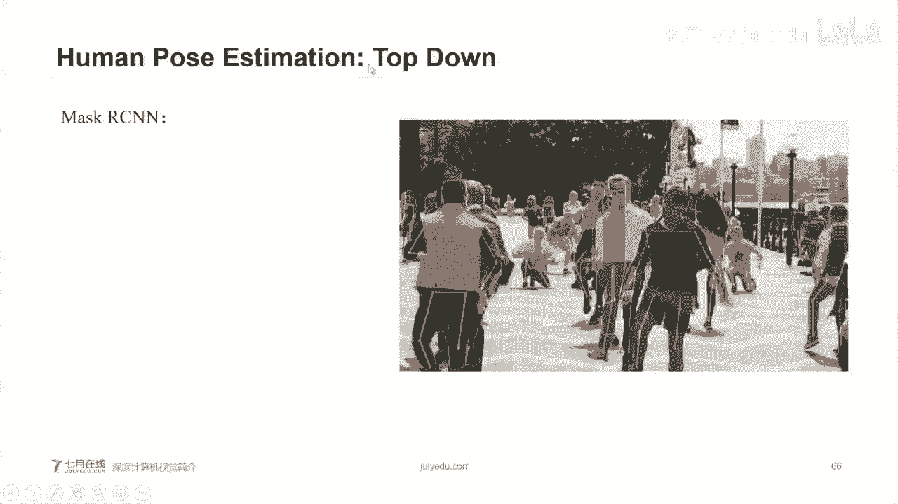

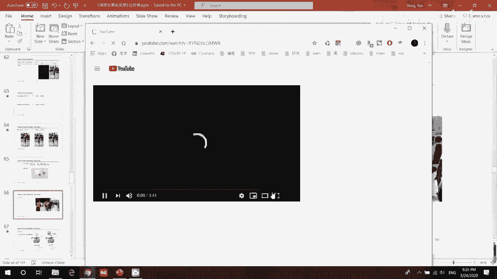

No。と？どど。て。🎼い？🎼。🎼，🎼け？I it that ice cold Michelle fight for that white coat。

 this one for him good girls， them good girls， straight masterpiece smiling。まれ。

L up in the city got with same row， Gota kiss myself so pretty I'。🎼他的头里现的发呀没了就 high。😊。

🎼Make a dragon wont retire made too high。😊，🎼せれのフ安へも to華。🎼Ba girls tolujah， girls tolujah。Hleluh。

S don't give it to you。🎼都别。🎼告底次。到底问。🎼Uptown， fun you up， uptown you up。

🎼叫 only if sense的 phony if pony dont。😊，好，我这要给大家暂停一下。那么大家可以看到。在这张图像上，我有很多的人，首先我用不同的颜色把人来区势，就是人来框出来。

大家注意啊，这个其实我省略了矩形框，我并没有标出来矩形框。那么其实它第一步是用矩形框来把人就是框出来。第二步，在人框出来的时候，他用不同颜色对人进行了一个实力分割。

大家看这里instant segmentmentation实力分割，然后在这个人的区域内，当然这个实力分割可有可无。在人人的这个大概范围内，我找到了，比如说这是眼睛还是这是肩膀，这是脚，这是膝关节。

然后把它们进行连起来。这个就是maCN在人体关检检测里面的一个效果示例啊，我把它推出。😊，我们继续。那么我们具体看一下mCN在这里它是怎么做的吧。OK先找人再进行实力分割，再进行关键点检测。

这是一个步骤。CN它本身是基于faN上的。O在这里大家嗯不要被这个模型所吓到。因为呃我到目前就是到现在为止，我们因为只是一个简介课，我不会给大家说具体面具体的东西，就具体太细节的东西。

我会给大家介绍一下大概哪块是做什么的。我们看一下啊N如果你对比faN的时候，它其实就是在faN的基础上多了一个ma branch多了一个ma大家还记得呃在讲ma在讲呃wo stages的时候。

我给大家大家具体介绍了一下，你看这里是不是有两个stage，对吧？那么在这一块大家看这块这是不是我的features，就是说我是通过一些转积，通过我CN找到了就是找到了我的一些大概特征，然后我会分2块。

一个这是一然后这块是2最后我会出。😊，一个是我的分类，一个是我这个呃检测框的呃一个回归的一个准确性。那么在fasask mask RCN上面，我除了我就是这一部分就是它本身就是fast RN一模一样。

我就是找你的句情框，然后我多了一个mask branch。musask它本身的呃就是翻译叫做掩码。我们看一下它这个掩码到底是做什么的？O。😊，야マ。大家注意嗯，前面上面上面这个这块完全是fasCN。

我们不再赘溯。下面这块就是说我的岩码分支。在岩码分支的时候，其实我也是看我做到了很多也是卷积层，不同大小的卷积层。那么我最后一个掩码，我们先看一下。嗯，我我先把墨水去掉。

ok。我拿一张图片来说，首先到目前为止，我已经用了一个红色的矩型框，框住了我想找到的这个人穿红衣服的这个男人就这个男人OK我找到了。那么我现在做到的就是说我在每一层上面。

我对他进行掩满来估计大家看我第一层。然后再进行第二层，第三次。当我从第一次到最后一次的时候，大家可以看到我这个越来越光滑了，对吧？越来越光滑了。那么我这个白色的区域就是整或者是整个这个框。

大家看我我我找一个笔。Yeah。我整个的这个框就是我这里找到这个红色的框，然后我用黑色的像素点。首先我第一步会用像素的级别，我先把哎大概这个呃人的那个范围先框出来，然后慢慢一步一步让它更加平滑。

那么这个东西就是我们所所说的掩码musok。😊，说到这个地方的时候，大家好感觉我好像还在介绍目标检测。那么我们看一下在目标检测的基础上，mars RCN它是如何进行人体关联检测的？我刚才说了。

所谓的人体关点检测，它其实就是也是一个分类问题。我找出不同的类。如果你有17个关键点，我就找17个类。😡，那么我就在mask的基础上，我把你最后的mask我去掉。mask上面本身大家看啊。

我就我我先回归一下。😊，本身它是28乘28乘80，28乘28，大家先不用管80的意思是说，我这儿有80个channel。注意，因为在最后一层，所以我们认为它是80个类，这80个类呃。

它是基于那个呃大家还记得我说的那个coco的coco的数据集。cogle的数据集它本身默认是80个类，所以它这里面也找了80个类。😡，那么。我在做人体观关点检测的时候，我把你的80去掉。

我换成1717的意思就是说我只找17个类。那么我对应的这17个类的点，那么就是相当于我每一个点。😡，眼睛、左眼、右眼、鼻子就每一个点，我把m我去我换个名字，我叫做key points。😡，看我第一步。

我加17个关键点。然后我就对一个每一个关键点，我对关键点进行一个掩码预测。最后我用one heart encoding，就是叫热力图来进行编码。我们看一下one heart encoding什么意思。

介绍 one called encoding。首先我们有一个大的去大的框架叫做bodyy身体。紧接下来我们会有头手和脚。如果我把左面的列表用右面的表格来代替，变成一个3乘3。在对角线上我置一。

其他区域有个置0。那么它的意思就是说这个时候我就知道了这个一是对应的哪一列。我就找到了它的属性。那么好，所谓的包号ing口点，我们或者把它叫做he map这个力图。😊，大家可以看到，这里是我的17个点。

17个17个图像，每个图像都应一个点，所以17个是17个点，红色区域代表。😊，最大的发就是概率最大的就是该点是作为该类是概率最大的区域。那么把它就标红。我们可以看到，第一个是nose鼻子，一个是鼻子。

第二个是左眼，第三个是右眼红色之它的红色区域，就是说在这个点它是鼻子的概率最大O就是说热力图就是找概率最大的那个图，最后我把所有的这17张图呃，红色点的位置或区域，我再回归到原图当中，然后我再进行连线。

那么这个就是我marRCN做呃人体关联检测的一个方法。maRCN是top down里面比较一个典型的代表O。😊，所以找到关键关键点之后，最后再把关键点连起来就可以了。说完第一个分支。

我们再聊一下第二个分支。第二个分支叫做自底向上，先找点再归纳，先把点找到，然后再看这些点属于哪个人。呃，这个里面它最经典的一个算法叫做open pose openen pose。

我们可以看open pose，它这里输入一张图像，就这里有两个芭蕾舞演员，然后它有两个分支。上面是找热力图，注意啊。boom up自底向上的方法，我我并不会再做目标检测，就是第一步我不做目标检测。

我直接找这些点，我直接找这些点我把所有点都找到。对于点来说，我知道这个点是呃胳膊轴呃，是右胳膊轴，呃，这个点是右肩，我先把所有关键都找到。同时在找点的时候，对于每一个可能性的关键点。大家注意。

因为我已经知道了关键点的类。我所需要做的就是说找出这两个点的连接大概的连接关系。😡，叫PAFOK大概的连接关系。😊，如果说他俩是同一个人的话，那么我就本身就应该把这两个点连起来。如果是不同的人的话。

那么这两个关键点就不能相连。OK大家看是同一个人的话，我连起来这两个点不是同一个人呃，这两个点不是同一个人。那么我就得想办法把它去掉。O想办法把它去掉。

那么最后的一个结果就是说同样处于同一个人的点连起来，不同的人的点去掉，这个就是oppo主要思想。😊，我们看一下它的具体的方案吧。首先第一步还是找一个卷积神经网络，把它的特征呃特图像的特征来画一下。

这里用的是VGG19，我们前面也提过继续输入图片的特征图。第二步就是刚才说的stage one，找一下那17个点OK预测人体观点的位置。在这个地方呃，我写了一个confidence map致信图。

大家注意啊，智信图这个叫法是在论文里面的，它其实说白了就是前面的heat map，就是前面的热力图。他是一个意思。对于每一个质信图来说，它其实都是一个灰度图，最亮的区域。我们可以看最每一个人。

这儿我是找的是他的左肩，最最亮的区域就是说对于某一个人体关键点的概率的最高的那个地方。那么当我找见这些点以后，我下一步我是我就可以把所有的点就是不同类的点应该连起来。看我这里知道红色的点代表脖子。

蓝色的点代表肚子，而且我也知道我应该把红呃脖子的点和肚子的点连起来。那么有个问题就是说哪些点该连，哪些点不应该连。第一步，我们可以先把所有的点都连接起来。OK点都连接起来。那么第二步我就要找到这些。

比如说黑色的线是应该相连的。OK可以红色的绿色的线不应该相连的，不可以，那么怎么办法去掉呢？我们计算两个连连接中呃中间这个黄色点，看我们计算黄色点，如黄色点就它是中值点。

如果黄色点落在一个相应的人的身上，就是说本身属成一个人的身上，那么这样个点就留，那么这条线就留下来，否则就去掉。O我们看一下具体怎么算吧。😊，呃，在算之前我们想一下啊，这是两张。

这是两个人的胳膊点我都找到了，有3个点，红色点代表肩，绿色点代表轴，蓝色点代表手腕。一般来说我们可以考虑位置，对吧？😊，假如说呃手腕就是两个点的位置比较近，它可以连接着。因为我们认为它属于一个人。

但是如像这种重叠或者遮挡的。这种遮挡图很有可能比方说这个这两条线连起来和这两条线连起来，可能他们两条两个长度都一样，这时候崩溃了，或者是另外一个人到这个手手腕着点距离更近。我们看一下具体应该怎么做。

ok。在open po上面，大家看啊，我把公式给大家poll了上来，但是我为大家具体讲一下它是什么意思。😊，它其实很简单啊它其实很简单，它就是做做一个什么呢？我先算，比如说我算这个点这个点P。

是否你说是说是我们先说吧，这个蓝色的是胳膊肘，红色的是手腕。那么它我先做连，先先连一下，然后我再看它的对于这个绿色的点P，我是否应该属于这个胳膊呢？我先做一个法向量，然后我再做一个单位向量。

O我做一个法向量做一个单位向量。那么如果这个点P在我这条胳膊上面，我就给它定义外一个值。就叫做这个V大家注意，我就定义V这个值就是说现在我这个P我落在了胳膊外面，那么我就把它的值规定为0。

就这个值规定为0。那么V这个值怎么做呢？大家看一下啊。😡，这这个像什么？😡，前面。是空间距离，后面是他们的那个范数，它相溢除。这个就是它的这个V。就是说我如果在这个上面，就是这就是它这个值。

否则我就是零具体的这个会呃会在那个就业班的课上有老师给大家具体讲解。同时呃在5月9号我也会开一堂课，就是专门做这个人体关点检测。在那个时候我会给大家具体讲解一下这个V它为什么要设置成这个等式。

它它具体的含义和最后这个的结果，我会给大家说一下，就是在5月9号开的课上ok。好，我们看一下，那么刚才说的说完第一步知讯图，第二步就是测试关联度。关联度就是刚才我们所说的是否哪些点该相连。

哪些改点不该相连。那么在测试完关联度之后，我们把这个叫做一个stage，一个大tage。然后再循环第二个大stage，就是再循环好几遍。一般来说可能是会循环4到5遍。然后那么这个就会给出一个精准图。

但是根据我的项目经验，其实如果仅仅是一个一个stage，你像本身这个stage你你呃转足够的次数，它也最后会得出一个非常精准的就是定位。ok。O到这儿的时候，我再给大家看一下。呃。

人体自带检测或人体光联检测它的一些主要的运用。Yeah。🎼首先是无人超市 four years ago， we started to wonder。

What would shopping look like if you could walk into a store。

 grab what you want and just go What if we could weave the most advanced machine learning。

 computer vision and AI into the very fabric of a store so you never have to wait in line， No lines。

 no checkouts， no registers。Welcome to Amazon Go。Use the Amazon Go app to enter。

Then put away your phone and start shopping It's really that simple take whatever you like。

 anything you pick up is automatically added to your virtual car。

If you change your mind about that cupcake。Just put it back。

Our technology will update your virtual card automatically。这一个。

So how does it work We used computer vision， deep learning algorithms and sensororfusion。

 much like you'd find in self driving cars， we call it just walk out technology。

Once you've got everything you want， you can just go when you leave our Just walkout technology adds up your virtual cart and charges your Ramazon account。

 you receive a sense straight to the app and you can keep going。Amazon go。No lines， no checkout， no。

 seriously。

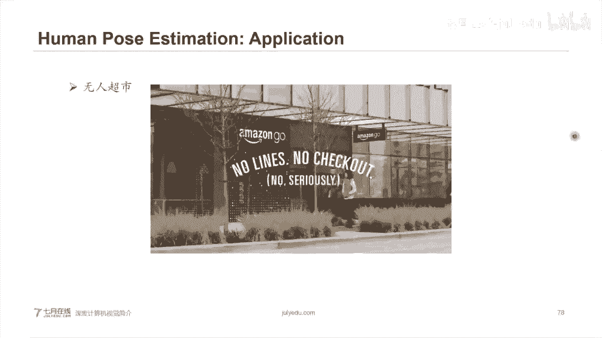

🎼是你。OK大家也看到了，这是第一个主要的应用。它是如何做到的呢？首先大家会在超市里面遍布很多的摄像头，那么然后摄像头会对你进行捕捉。比方说你的动作捕捉动作识别，注意样动作识别，不仅仅简单的是目标识别。

动作识别，我会根据你的人人体骨骼观点来预测你的动作。同时我会对我货架子上面的东西做一个提前的呃知识储备。就是说我在哪一个点。我首先我已经知道了，呃，这个是对应的是什么物品，然后根据你的动作。

你的观点检测到动作和物品发生的所谓的关系来检测出来你是否把相应的物品拿走。OK那么说到这个地方，呃，这个是117年的时候，on他提出的一个无人超市。我们看一下呃，因为我个人认为在生人工智能这块。

中国的发展是最好的。我们看一下无人超市在中国的情况。🎼我们看一下。

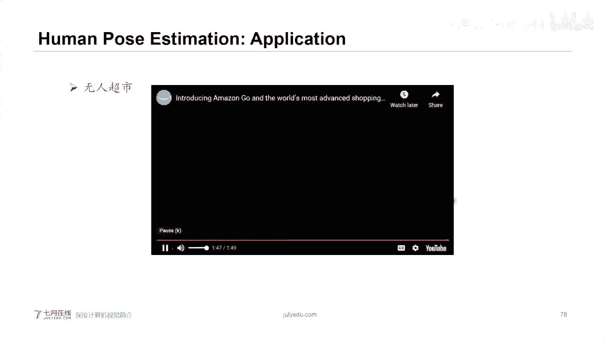

好，okK我现在想知道，就是在中午的这个无人超市里面，就是会不会被偷。我们我们看一下。

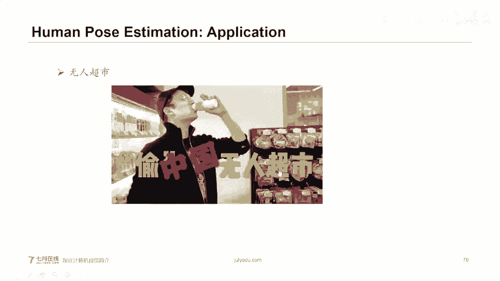

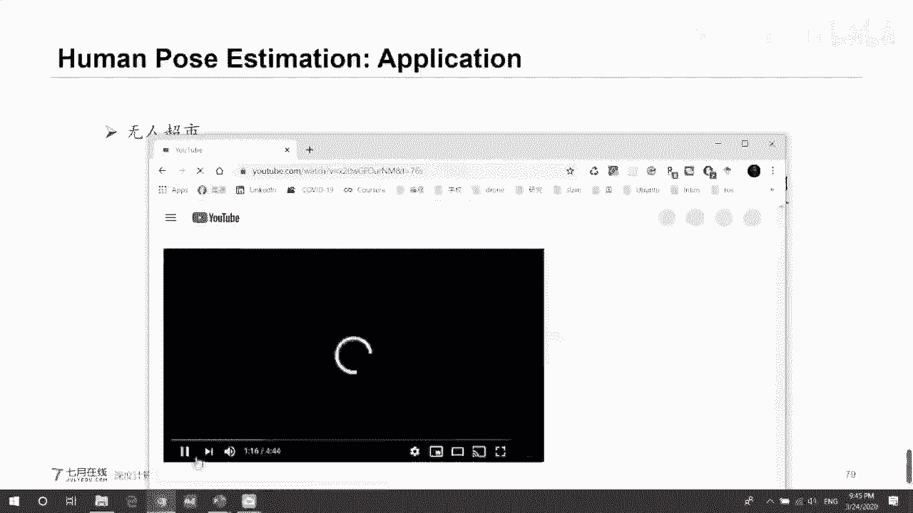

🎼，大家好，我是郭水，我现在在上海虹桥机场。那一天我在牛约，我拍一个amazon的无人超市店。那我看了很多评论呢，大家都说就我没有那样的无人超市，但是我现在在上海虹桥机场，哎，我看到了一个无人超市。

我很好奇啊，在中国的无人超市怎么样。所以现在我要做一个对比，我要看一看中国的无人超市可不可以偷到东西，比amazon够方便，因为你这是要用微信，你就是要这个二V吗？😊。

我们现在也要看看这里有没有很多是像头，上面有很多。但是我记得应为这里面有应该也有一个拼。😊，🎼，在这里有关法偷东西吗？你可以尝试一下，你就知道了，有关法吗？啊，没办法，没真的没办法，真的没办法。

我可以我可以试一下，没问题。那那个我我可以问，你试一下啊。🎼我要喝这个，我很喜欢白涮锅。🎼で。🎼，🎼这个我喝碗呢这个我喝碗呢，这个我可合我们饭咱们在一起。😊，🎼，🎼他们有咖啡。

 and Amazonazon没有咖啡。So看你开。🎼，🎼は。如果我没有带走，他会不会受我的钱？我去把怕发放才多。我要把这个放在我的帽子。🎼The。🎼，🎼我 love。🎼，🎼还有辣条。我。🎼这个很贵。

😊，🎼哎，我知道我有好多朋友喜欢这个。😊，🎼我用要这个超杯算了。我不要这个味道，我要另外一个味道，这个味道。😊，やや。🎼给来个棉签好看穿还算好吃。😊，🎼，🎼。🎼あた。🎼あ？🎼我的相品里面已经有太多东西。

所以我需要新的方法。我想一想，我刚看我有新的方法。我们我我们都这样啊。123。🎼，🎼他出了之后跟amazon差不多一样，我现在走我现在去。🎼，🎼なっ。我说这个我的顶当连他的叮当这么快了，有可能就是秒。

那爱azon我忘了，我我等你应该5时15分钟。那我们先看一看它对不对？我们昨买了一个这个咖啡，哦，这个在帽子。😊，Once。这个这个我们用新的方法偷，哎呀，那个新的方法没有用这个。😡，这根。😊，So哥。

有。哎，这个。威龙别油，这这个是那个我喝过的酸奶，但是我只喝一瓶，他说道我只喝一瓶。但这个饼干都是对的，每一个味道它都是我我我拿什么，所以让我觉得这个很厉害的科技师，他觉得我把这个扔起来。

然后他就道那个爱上过的酸奶，他说我喝一瓶这一瓶，那真就是你第一次去一个欧润超市吗？不是不是很我一经经常去，你经常去，你为什么要去欧润欧润超市比样方便的，拿了就整得。😊，出门店天就出来了。

那今天你买这这个不是今天我买的豆浆，你就买一个豆叫。在美国，我们大部分的老人家不如咱们用一个智能手机。总来说是这样，在美国这有一个很有钱，很有名的公司，叫叫amazon，做五人超市。

在中国是一个我从来没听过的公司，叫云南做五人超市，比 Amazonazon更好的地方是第一，你不需要下1个APP，你你就需要用微信。第二，它讲比你的叮当很快。amazon有可能是要当10分钟。

这个是鸡毛是么？😊。

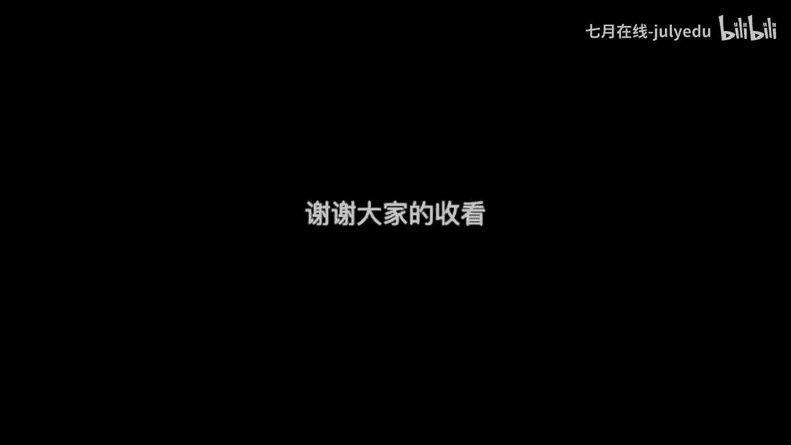

🎼你一天工作几个小时。活一天OK大家看到了，这个就是一个中国五人超市的应用。呃，也就是说，不论你怎么样就是做各种小动作，你东西也不会被丢。

它前提还是呃所谓就是它前提还是就是通过定位你的呃骨骼关键点来预知你的下一步动作，做行为预测OK。呃，还有一个呃应用，比如说姿态检测，姿态检测更多的会应用在体育方面。我给大家播一个视频。

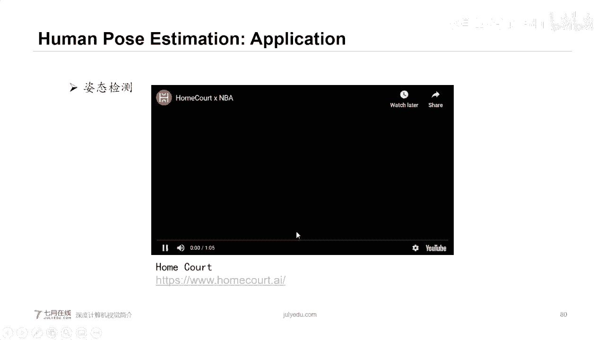

一分钟的视频，这是NBA的。🎼We're not to hum through everybody done。🎼Everybody。🎼And I stop poll， everybody。

🎼Everybody like。ほらたらた。終らった終らった終わらったら。

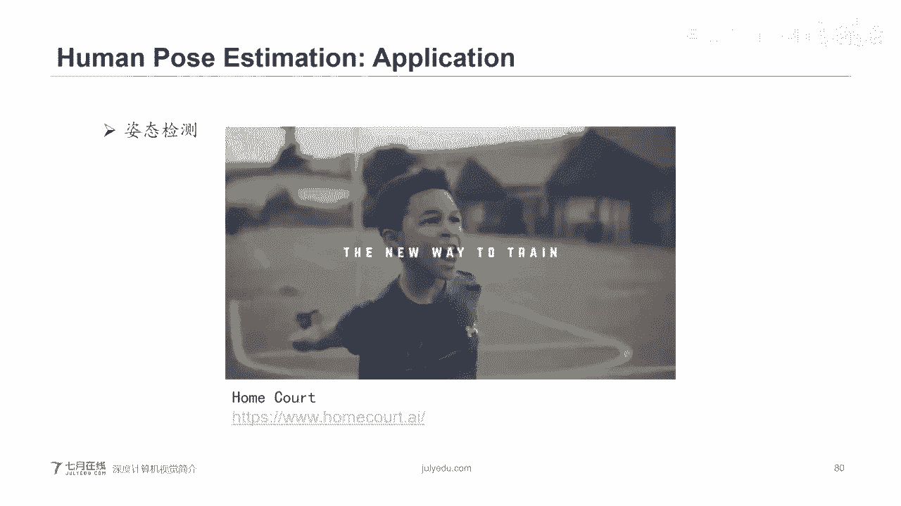

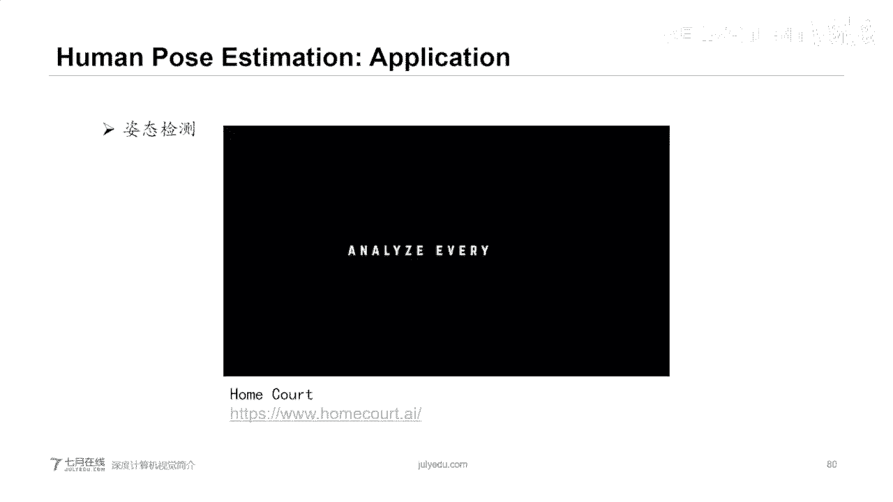

🎼走的。Yes。对对。う。

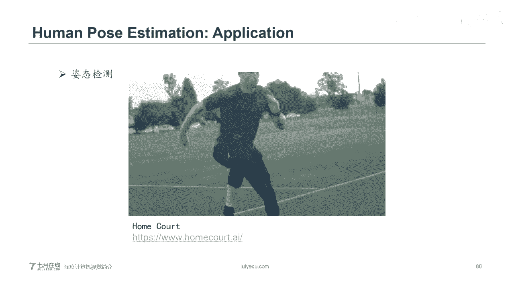

🎼都告飞。Yes。🎼水个来。あされて。问的事。Yeah。No。🎼。

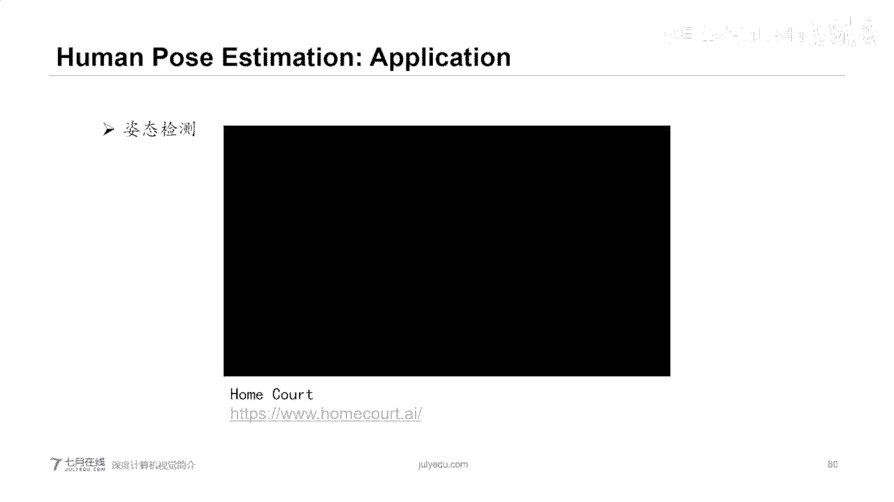

O。😊，我们现在看到的这个叫。

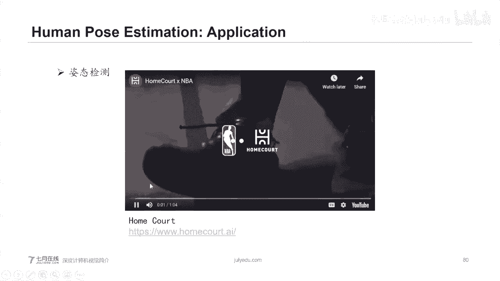

我们看到这个叫做home court，呃，它本身是呃呃我先回复一下啊，它本身是就是说在。

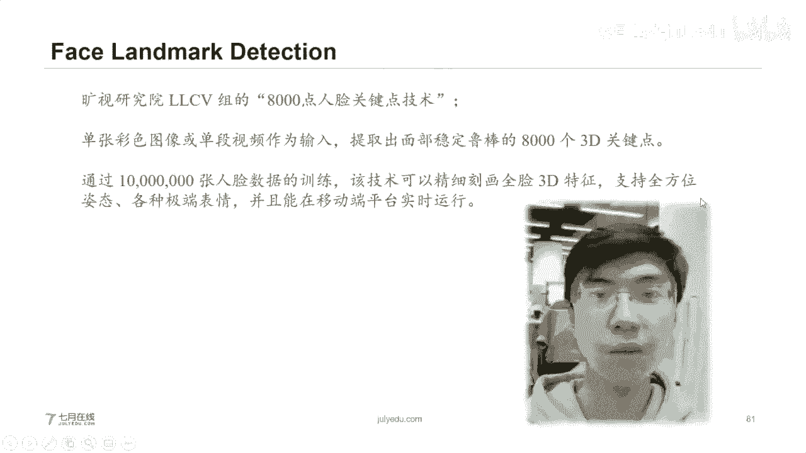

在里面的一个应用okK。呃，home call它主要是做就是说我拿一个手机或者是平板电脑一个你可以下一个app叫做home call，然后你放在那里，你就可以把NBA的教练请到你的家里来。

OK请到你的家里来。

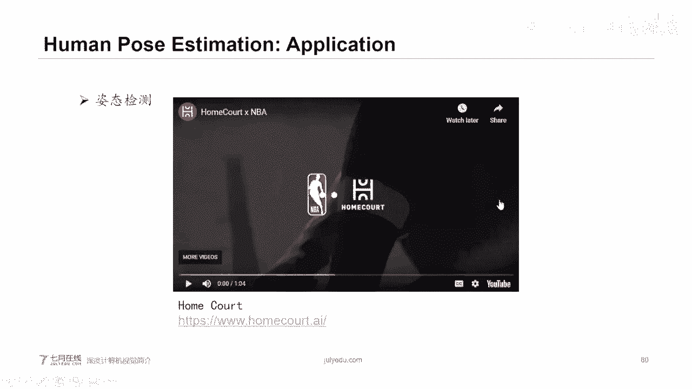

除了这个里面呃这个例子叫做人脸人脸关键点检测。人脸关键点检测的意思就是说我这次虽然是也是人体的关键点，但是我不找你的手腕脚，我直接找你人脸上的这些关键点，它的方法也是大同小异的，都是一个呃分类的技术。

呃，这个是我认为就是到目前为止做的最牛逼的1个8000个人脸的关键点检测。大家可以看到这个效果。非常屌。OK我们继续。除了我刚才所说的以外，人体关键人还有很多的应用。

比方说自动驾驶自动导航、DR行为检测，甚至包括手势识别呀、人机交互等等。OKOK这就是第三部分。我们退出一下，然后我们再进入最后一部分图像对抗与生成。😊。

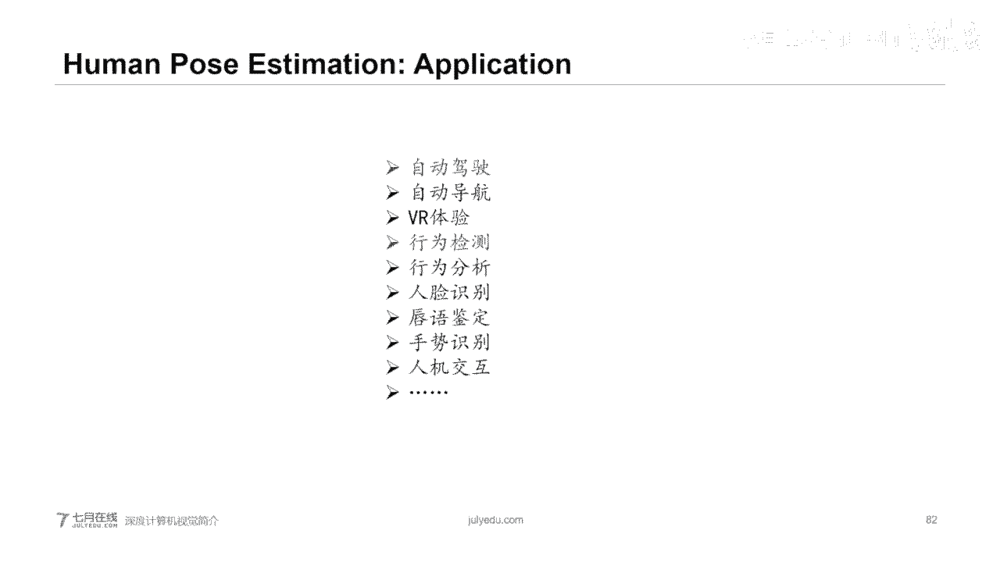

大家有什么问题的话，可以在现在问可以跟我交流一下。

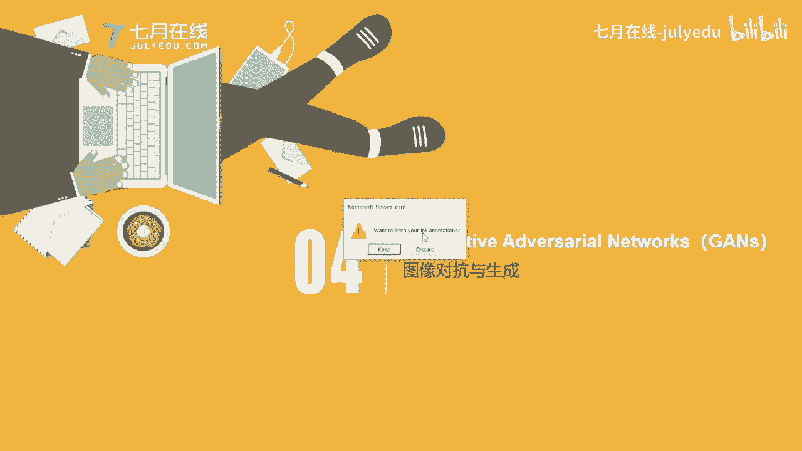

啊，过滤器的参数设置原则是什么？是这么跟你说哈？呃，这个过滤器呢，就是说如果你去调用库的时候，那么你呃那么你所谓的这个过滤器，你只你仅仅需要所做的有几个参数。第一个参数是过滤器的大小，过滤器大小。

比方说它是3乘3还是5乘5，或者是12乘12就等等，这个是过滤器的大小。然后呃至于里面对，还有就是说你这个过滤器，你是否要进行填充，就是你扫描图像的时候，你是否要进行填充，或还有就是你的步长大概是多少？

你是每次你跨一步还是跨两步，就这个一步就是说几个pixelok那么这个的时候就是说你仅仅需要设置这些就行了。至于其他的有那些库来自动帮你随机生成过滤器，这是我们不所所不ca的。😊。

手机夜间的拍摄原理是什么？这个手机夜间的拍摄原理好像就跟我们今天聊的嗯不大，就没什么太多关系啊。中间不里通道数。对，可以理对，理解成下一层过滤器的个数。呃，有个同学问的好。

在同一一个图像上做出了关键点检测之后，下一针是同样的检测方法，还是对上一针的关键点进行了跟踪。大家注意，本身是对下一针同样进行了关键点检测。呃，这个目标就是目标跟踪或者是关键点跟踪。

它其实一个最基本的方法就是啥了。就是说我在你不同的针之间，我先都做一遍检测。同样的关键点，既然我都知道你是同一个人，同一个人的左肩，那么我就可以知道你在上一针的位置和你下一针的位置。

你就知道了你的一个呃你的肩部的运动轨迹，或者是你手的运动轨迹，通过你的运动轨迹，我就可以知道这个对你的行为进行预测，明白了吧？它本身是对下一节的关键点进行了检测。啊。

这个同学说问我就是说之前是为什么是灰度图，为什么后面画出来是彩色图？当然同学你要知道，就是所谓这个特征，它除了我刚才给你看的灰度图，它可能就是一些形状特征。那如果我要是对颜色特征进行找的。

它本身颜色特征就是彩色的。然后你所看到的那些是我把所有的那个叠加在一起的，明白了？所以这也是为什么它是彩色图。O我们时间也其实也不早了啊，我赶紧给大家聊一下最后一个话题。

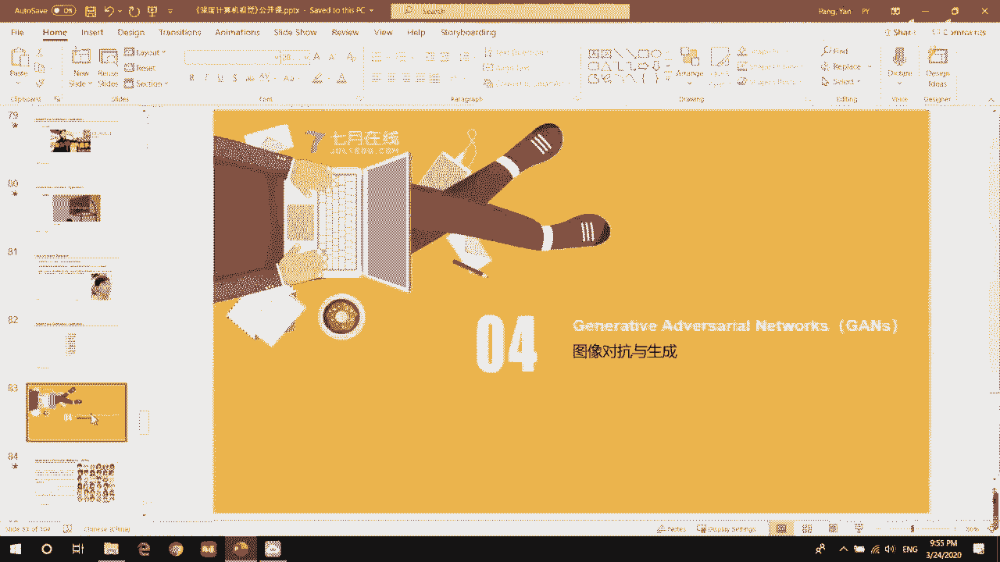

最后一个话题叫做图像对抗与生成。那么它这个话题里面其实有两个主要的因素，一个是对抗，一个是生成。我们看一下，先看一下图像对抗生成的主要应用吧。呃我们可以看到左右边这些都是卡通小姐姐。

那么对于每个卡通小姐姐，注意啊，这个不是人不是人手化的。就是说呃在对抗生成网络出现之前。

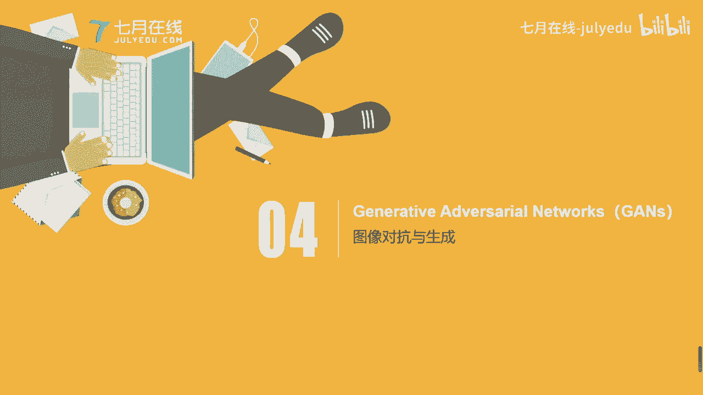

一般来说呃，游戏公司或者是动漫公司，他们都会请专门的设计师来画每一个卡通小姐姐。但是在对抗神经网络就是GNN出现之后。不需要再找专门人去话了。你仅仅需要的就是说把这个对抗生成网络训练一遍。

然后把里面的生成器生成部分拿出来做这些就是直接生成这些卡通小姐姐的图像。那么这个就是一个比较经典的应用。除了对图像来说，那么对声音这个GN我们就叫它干嘛，它也可以做出来一些呃也有很强的应用。

比方说我给你一个曲子，然后你希我希望你通过这个曲子，你生成大概类似的就这个曲子，那么这个就是在声音上的一个应用。OK还有哪些应用，比方说。这个主要是我一个风格的迁徙。比方说我在最右面。呃。

我知道一个图像呃，有一个图像，大家看看这是一个model，他穿了一些呃他穿的衣服。然后呃通过这个图像，我进行关键点的定位。那么我针对它的关键点，我就可以生成其他的图像，就是说他穿衣服的其他图像。

比如说你是正面，我可以把你的关键点稍微的这个位置稍微挪一挪，它就变成新的姿势，穿着同样的照片，要穿着同样的衣服的类似图像。

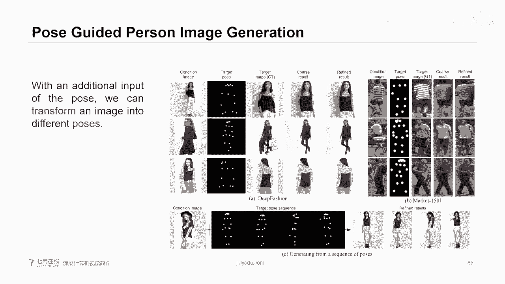

这个叫做cyclo干。cyclo干它主要是一个风格迁徙。比方说原始图片，它可以生成其他的具有不同油画风格的一个图像。大家记不记得我在讲第2块的时候，会讲一个叫deep dream，它也是一个类似的。

就是迁风格迁移，风格迁移。

。这个是叫做面部年龄的测试。比方说同样一个人，同样一个人最左面的最左最左面一列是0到18岁，那么最右面一列是60岁以上的样子。那么我每隔十年，我都会给他剖出来一个他的大概的容颜的变化。大家可以看到。

从最左到最右一排一排一排一排，而不应该叫一列一列一列一列，他是不是每次他的风额都会有个稍微细小的变化。但是如果你从第一列直接看到最后一列，它是一个很大的变化。当然即面很大的变化。

我们也可以认出这是同样一同样的一个人。OK这是faceA减。

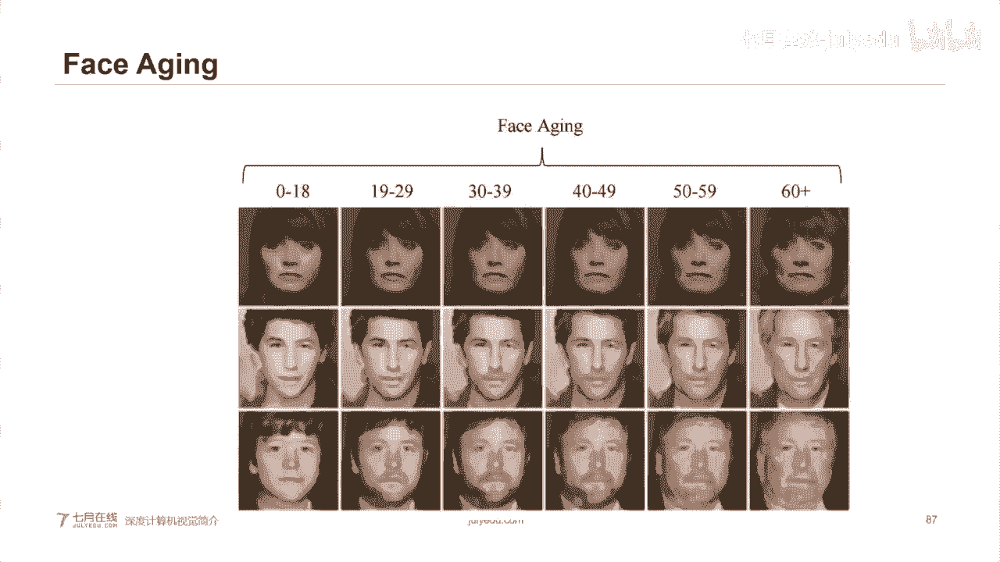

这个的意思就是说呃，我只有最左面的一张图片。OK这是一个大概的是绿色的大衣。那么。我当我只有绿色大衣的时候，我想生成的时候，我不想再去专门买一件这个大衣，然后给他再进行重新的拍照。那么作为商家来说。

它完全可以，我既然你有绿色大衣，我就直接给你生成，把绿色大衣展开之后展开的样子或者是它背部的样子，侧面的样子等等。😡，这个叫做cycle。这个cycl gun的意思是说，我说一句话，比如说这个鸟是黑色。

但是它还有就是还有一些绿色，同时有一个很尖的嘴OK那么我说一句话，然后通过这句话来进行直接让计算机画出这幅画。这个是另外的一个应用。OK再看这个应用，这个应用上来说呃，我上面这一排是我的输入。

那么下一排是我输出，我想做什么呢？很多小姐姐来一般她我今天背一个包，那么我想对你穿什么样的衣服，我想穿一个什么样的鞋子okK然后这个时候。嗯，我们可以让计算机直接给它生成。比方说第一个蓝黑色的包。

那么我就生成蓝黑呃，蓝黑的一个鞋子，当然它主体还是白色，对吧？这叫disco感。就是说它来做一个风格上的配对的一个事情。😊，讲到这儿，我们可以看。这个是个人认为是干对抗生成网络一个巅峰之作吧。

它叫做big干。当然我们看一下这个这4张图片哪些是真的，哪些是计算机生成的。这4张图片。我们可以看啊四张图片非常逼真。😡，这4张图片都是计算机生成的。真的可以做到以假乱真的底部。

而且真的是生成的非常的像okK我们看一下。对抗生成网络的讲了这么多了，看一下对抗生成网络的结构吧。😊，大家看。猛的看上去，我能看到两个字母和两个数字。

两个字母大G和大DG的意思是genator生成器就是对抗与生成的生成部分。Ddisriminator辨别器。注意啊，辨别器的意思就是说呃我要辨别出。你给我的输入图片是你生成器生的是是生成器造假的假图像。

所谓的假图像是希望达到以假乱真的效果，就是你生成器上成的图像呢，还是说这是个是我真实的图像，这就是辨别器的作用。而技能gene生成器就是说我就想不停的生成图像。我一次一次的学习一次一次的生成。

然后让你大D来去看，我最后要做到就是以假乱真。大家注意，这个是不是有一个对抗的过程。😡，辨面器想给你挑刺儿，找出来哪些是真的，哪些是你自己生成的，就或者你自己画的。记就是说我去要画的越来越逼真。

让你判断不出来，这叫对抗的一个过程。所以叫做对抗与生成网络。两个数字一和0。😡，一代表是呃真实的图片，零代表是你生成的图片。OK我们仔细看一下。我拿张我拿个笔，先看生成器部分。上面是一堆噪声。

下面是一堆label，我把这些都丢给生成器。大家可以可以知道，生成器的生成其实就是一堆噪声了。😡，哦，那么我生成出来的一些图像同是我的label。

它就要我这个的label意思就是说我这个是我生成器的生成的图像。但是呢我生成器生成图像，这label我不告诉D，我只让它看我图像部分，然后让D去猜测这是是我生成呢还是真实的。然后上面这这一行。

这个意是我真实的图像，然后我这个label代表就是说这个其实是我真实的图像的意思。同样我只把图像丢给D，但是我这个label，我并不让D看到，然后D来判别。

如果它认为是是呃这个我所输入的图像是真实的图像，那么我就是一如果是生成器G生成的图像，那么就是0O那么就是在不停的学习当中进行对抗，这个就是说但的最基本的概念。😊，O我们看一下图像生成和句子生成。

对于图像生成来说，我我每次都是给一列一个矢量，然后我可以生成一个图像，我再给一个矢量，我再生成一个图像。大家注意啊，我这个时候你可以看到这两个小姐姐的颜就是头发颜色变了，脸的朝向变了。

如果我再给一个矢量，我再生成一个图像，O这是图像生成。这是句子生成呢，我们可以看给一个矢量进行生成器，注意这个是这个NN是代表newnetwork例子，是生成网络就是神经网络。

就是我刚才所GN所所提到的G。我这个是仅仅是G我通过这个生一个矢量输入到我大G当中，就是生成器当中，我生成一句话。我再给一个矢量再生成一句话，再给一个矢量再生成一句话。所以。😊。

生成器或者是对抗生成网络，它既可以用于图像当中，也可以用到呃语言当中或者是声音当中。ok。我们看一下就是说如何生成，就是如何来控制这个生成呢？是用为条件生成。我们看一下，我给你一个矢量。

我这次我生成了一张图片。然后假如说我想生成一个长头发，注意看这两个矢量只有一个数字不一样。就是第一个数字，我把0。1变成了3，我们看一下生成结果。注意我这个时候头发变长了，我们就知道了。

第一个数字是用来控制头发的长度的。第二个数字，我们再看啊。我们把第二数字变了。啊，不是第二组字，是倒数第二个数字变了，它会生成的是蓝色的头发。如果再给一个数字变了。

它会生成把嘴巴打开OK所以我们在这里就知道它一个数字其实是空制一个特征的。我们再看一下辨别器吧，辨别器它在做什么？首先我给一张图像。这个图像丢到变频器里面。辨别器会它会生成一个scalar标量。

这个标量就是说一个数值零还是一。数字越大，代表这个呃意思这张图片是真正的图片，数值越小，代表这张图片是生成器生成的图片，就就就我们可以叫做假的图片。让图片进来给他11。

0OK说明这张图片是一个真实的图片。给了一家同标进来。okK还是1。0，说明一张图片还是真实的图片。现在一张图片进来了，大家注意这个图片比较模糊，但是一系能辨不出他是个人，它的分支是0。1。

那么们就认为这个图片是生成系统生成的图片，并不是真实数据图片。😊，那么再给一张图片进来。OK数值非常低，我们就知道了，数值越大，就是辨变器生成的是一个数字，数字越大，那么代表着这张图片是真实的图片。

数值越小，代表着它是呃生成器生成的假的图片O。😊，所以说生成器和辨别器它其实一个对抗的过程。我们再看一下这个对抗是什么意思。这张图片大家看到，我就问你这张图片的，大家认为这是就这个部分。

大家觉得这是个树页吧。😡，还是一个什么东西呢？我们看一下。其实它是一个蝴蝶，枯叶蝶。在很早期的时候，枯叶蝶大概是在它的祖先其实就是一张蝴蝶，这个样子。😊，慢慢的他因为躲为了躲避天敌。

它就变化成了这个样子。但是天敌会认为okK第天敌就是辨别器，因为认为其实还是你这个还是蛮像于蝴蝶的嘛。但是我们已经可以看到第二张图片的时候，它已经具备了数月的样子。直到第三张图片。真的是以假乱真。

如果是真的是让我猛一看的话，我会把它认为是一张是一个枯样的，不会把它认为是一个。呃，不是不会，并不会把它认为是一个副业。这这当然这对于我那对于天体来说，那就看他们的变本器到底有多厉害了。😊。

OK我们再看一下。Roround one。第一步呃，第第一个回合生成器，生成一堆图片，辨别器看一下。变位器有一堆图片进来。他也明显能看出来，上面那部分是假的，下面那部分真的ground to。

深深去学习了一下，哎呀，我这个骗不了他，那我就再学一学吧。然后哎画了大家看这次的图片，哎，就画的比第一次好了，然后又丢到了。😊，变变器里面变变器干你这还是太假了，还照样能区分出来哪些是生成的。

哪些是真的光碎。😡，继续学习还是能一直到最后一直到最后，直到辨频序再也分辨不出来，哪些是生成器的图片，哪些是真实图片的时候，然后回合结束OK。我们看一下算法，首先我先初始化我的生成器和变频器。

然后在每一个训练的回合当中，step one。首先我要固定我的生成器，然后我更新我的辨别器的参数。okK固定生成器。然后我随机给一些呃矢量进来，注意啊，这随机初始化的。在最开始，然后我生成一堆图像。

同时我还有我的真实数据daabbase数的真实数据，真实的图像。😡，然后我把真实的图像抽一部分，把生成器的图像抽一部分打乱顺序，然后丢到辨别器里面，然后让辨别器进行学习，然后生，然后更新辨别器的参数。

step one。下部话大家注意到呃，最后我会有一个就是一还是零，就是进行打分。当然我这个一0现在目前表示的是是真实还是生成。看step two第二步就是要固定辨别器来更新生成器。第一步我是第一步。

我是固定的大G。来更新大地。第二步我就要固定大地来更新大GO我们看一下。OK我输入一张图像，然后我丢掉，我丢给呃辨别器里面，辨别器给了一个分值0。13，然后。生成器就说哎呀，这个好像用搞不定。

然后我固定我的生成器，这我是更新我的呃sorry，我固定我的辨别器来更新我生成器的参数，让它进行新一步的学习，这样下一步画的更好。我的目标就是说我想把你辨别器辨别出来分值，我得再提高一点。因为数字越高。

代表越真。😊，OK然后我生成，那么这一步就是第二步，就是它一个很大的ntwork。第二步，我们把中间那部分叫做隐藏层。呃，这个方法在那个呃生成器当中，我们是用的一个T度学习的方法。

T度上升的方法来更新我们的生成器。OK我们再看一下具体的算法吧。首先初始化呃D的参数和G的参数。😊，大家看啊，第二步就是我在每一个循环当中训练循环当中。我先学习D，学习我的辨别器。

然后我下面这部分是学习我的生成器OK我们看一下，其实它具体的其实并不难。虽然我写了这么多。😊，嗯，大家看啊，首先这一步呢我如何学习D呢？我先生成一些在数据当中，我采随机的采样真实数据当中。

我采样一些真实值，然后我再采样一些噪声值。😊，过了这一部分，我我采样完毕之后，我注意我这个是获得一个生成的数据，生成的数据，大G生成的数据OK然后我要这个时候我我要学习如何学习D呢？

就是说我固定我的GfiixGFGfiixG，然后我更新我的D，大家看啊，我fiixG呃，我更新我的数据。😊，这个是代表一个更新的过程。我们看上面这部分，上面这部分。😡，这个是D是D的输出。

就是说我辨别器的值。D也是我变别器的值。但是我的输入这是XII代表第几张图，X代表是我真实图像的我的分数。大家再看这这边X上面这有个波浪线，注意啊，波浪线是来自于这儿，看见没？

波浪线是来自于生成器的生成的图像看见没？生成器生成的图像，波浪线来自于这儿，也就是说我想让我这个的值越来越小。就是说我想让我辨别器所对生成图像的分值给的越低越好给对真实图像的值给的越高越好。

那么这个就是我。😊，呃的呃一个损失函数。然后我在每一步我的目标就是把损失函数降低。OK然后我每次更新我的参数。这个符号代表着学习速率。就 learning的学习出略。呃，我每一步就是我进行一次循环。

不停的循环这一部分。降低我的辨别器对生成图像的分数，同时增高辨别器对真值图像的分数。通过这一步一步的学习来更新我的辨别器生成器。😊，我们看啊生成器这个是记的结果。

注意生成器是学习生成器的固是要固定你的辨别器，就是你一个不动一个动ok。我对于每一个生成器的图像，我会。我的目标是我生成的图像，我丢给变频器，然后我让你辨别器的值越高越好。这样的话我才能以假乱真。

所以这是我生成器的一个目的。然后我每一次还是继续更新。大家注意啊，我所说的这一部分算法是呃最原始的干的呃算法在慢慢的发展当中，它干其实有很多的变种。然后这对于这个变种，它会对这些公式进行改观。

就是这些公式进行改改变。但是万变不离其宗，永远是想要生成器以假乱真，想让辨别器呃具有一双火眼金睛。干看好玩的吧。左边呃大家看啊，左列是一张图，右列是一张图，完全不同的图，不同的人没有任何关系O。

我把最左列设成0，最右列设成0。9。然后我把中间的。每一个每个0。1我代表一个，然后看我一次一次的变一次一次的变。大家如果你从最左边一个一个看向最右面，你会发现每一张图片跟它相邻的其实过度非常小。

但是如从最。坐便如果一下越到最右面，它是一个很大的过程。OK这是一个干的一个很好玩的一个小例子吧。😊。

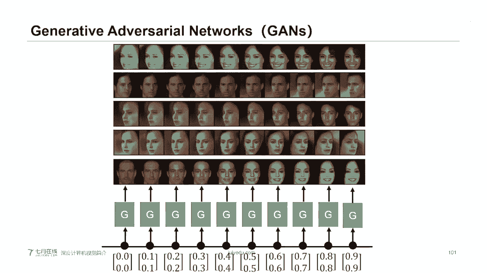

最后我在这给大家列了一个叫甘肃。如果大家可以在ge里面，也可以搜到甘入。甘肃就是说他把所有呃对抗射程网络所有算法都放在了一起，就是做了一个归纳。这个其实挺有意思的。我时不时也会就是关注一下这个。

我们可以看到14年的时候干就是第一次提出，然后到目前为止是越来越红越来越火。他的论文是真的是水涨船高。😊，OK说到最后的这时候，我想给大家推荐一下，就是我们的那个最后一个。最后一个就业版。

我先把这个去掉。

最后的一个就业班。就业班的话，第四期，如果大家点击我们的这个就是搜7月在线的话，或者直接点击这个链接，我们可以是直接看到。

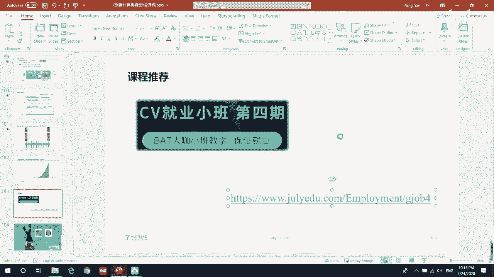

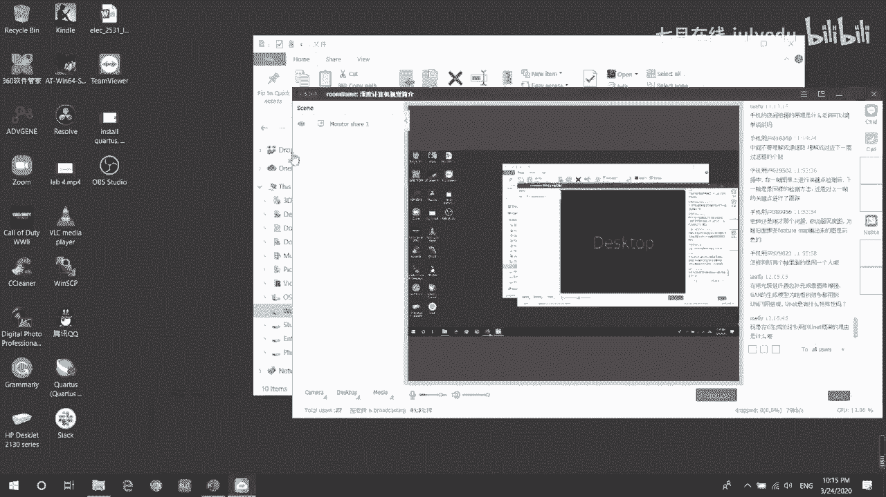

呃，我们可以直接看到。就是进入7月在线CV就业班第四期的主页。OK进来之后，呃，这个班呃会就是对呃整个呃对于就是如果你如果大家想从事深度学习计算机视觉这块的工作的话，呃。

如果你能把这个课程完整的听下来的话，那么你基本上找工作没有任何问题了。因为它本身大家看啊，我给大家大概列一下，它第一部分你先报名。😊。

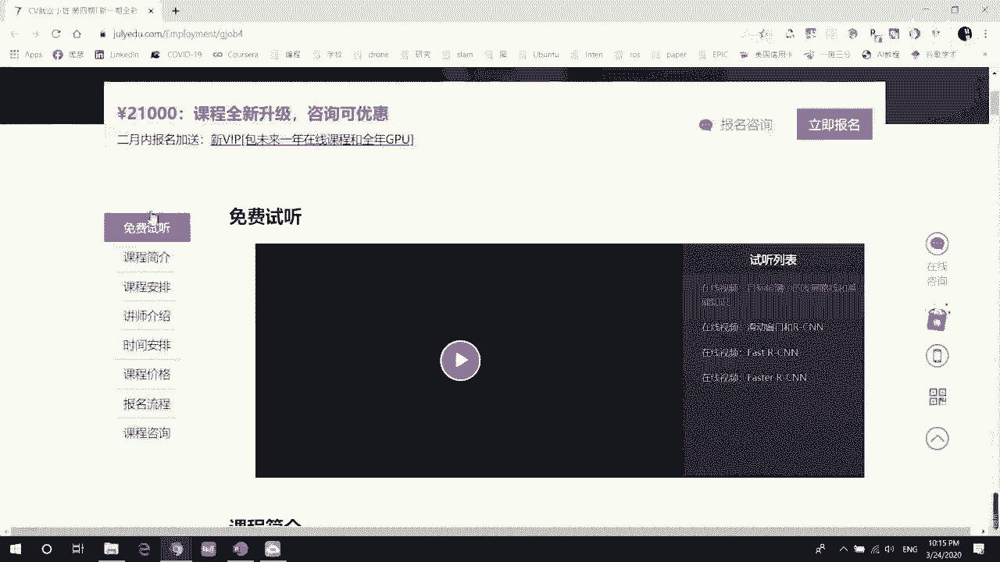

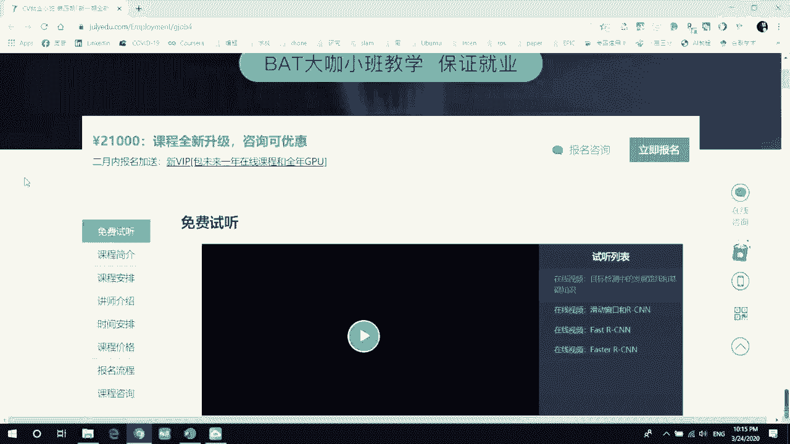

第二部分嗯，他会除了讲这一些所有的基础知识，他会从最开始给大家讲。他会从最开始给大家讲，然后慢慢的1。1。点的讲讲到深度学习的部分，包括你所有代码实现。😊，然后最后。看1。1点讲。

然后讲完基础之后再讲到一些，比如说目标跟踪语义分割，就是讲一些不同的分支。同时在不同的分支里面，它会它同时又会做一些一些实际的项目，在第四阶段的时候，他又会讲一些，比如说刚才我们讲的对像生成网络。

或者是RNRN主要是做就是循环神经网络。讲完进阶第四阶段的时候，到第三部分实战项目，我个人是非常喜欢实战项目这块的，它会我们会有三三个主要的项目，大家可以进行选择，然后会因为这三个项目。

它对的是三个方向。呃，毕竟深度学习在计算机事业这块，其实还有很多小的方向的，然后会在每一个方向上面做一个针对性的项目，呃，一步一步对你进行手把手的培训。你看重最一开始的介绍，然后帮你配置项目项目。

就是配置你的系统。然后就帮你进行构。😊，建模型构建模型之后，如何训练并且优化。然后最后呃又会聊一些呃就其他一些项目的一些呃难点吧，这是我们的一些就是项目的总结。当过完第三部分的时候。

7月在线还会对大家就是讲一些呃面试求职这块的东西。OK讲完面试求职这块东西，会帮你的顺便会帮大家做一下简历。然后包括你面试当中一些会遇呃你会被遇到的被问的那些问题。

毕竟7月在线老师有很多都是呃兼职在要么是在各个大学做讲师，要么就是在各个公司做项目负责人。所以说如果你大家想从事这类的工作的话。

是非常建议大家报一下这个7月在线第四期就业班的OK我看大家还有什有些什么问题吧。今天和大家聊了很长的时间。😊，哦，你这个问题其实已经很专业了。他这个东西怎么说呢？这个其实主要是看你不同的不。

就是针对不一样的那个分支。本身我今天所讲到的那个对抗生成网络，我们本身用不到这块。Okay。同学那个也。就是呃报一下这个班，然后问一下这个班里面的对应的授课老师。

然后呃针对你呃你的这个专项的一个干的一个分支来，我们再就是聊一下这个这个问题，好吧。OK今天时间也不早了，呃，我会把最后的课件，然后发给我们的呃后台老师。然后如果大家想看回播的话，也可以直接进行。

也这也可以直接进入呃我们的网站上，然后看一下回播。同时也欢迎大家关注一下我们最后的第四期的这个呃就业小班第四期的呃呃具体的课程。😊。

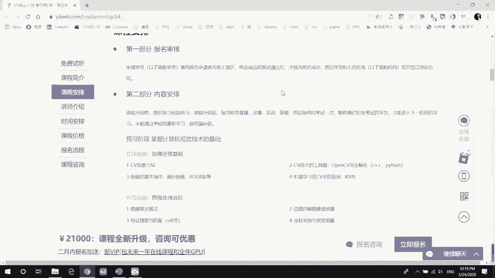

呃，课程讲解和呃欢迎大家来报名。OK那么今天就先这样，谢谢大家，拜拜。😊。

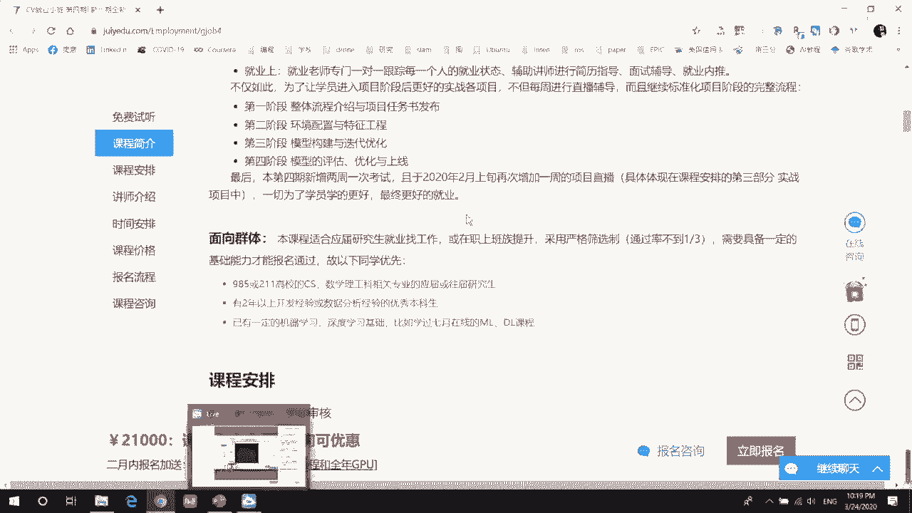

