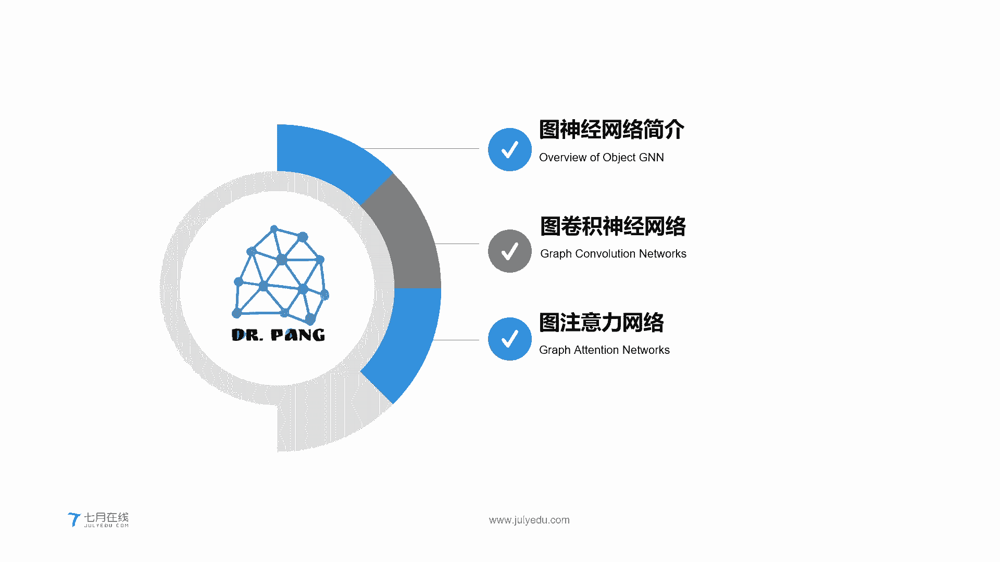
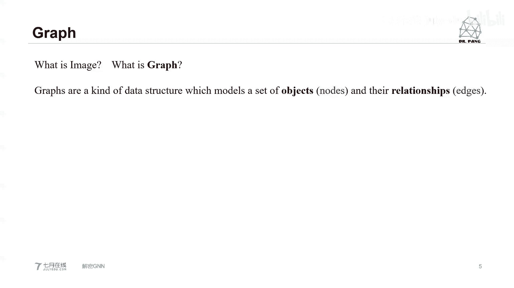
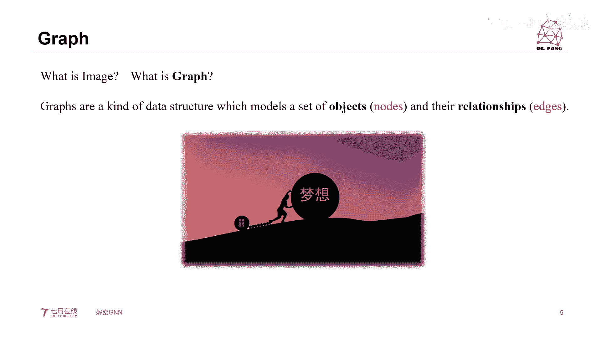
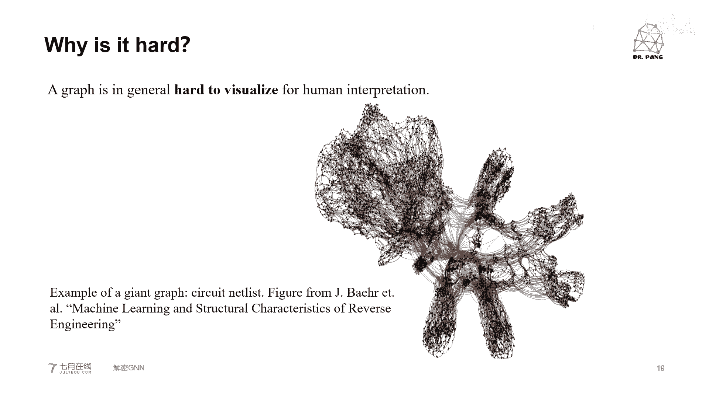
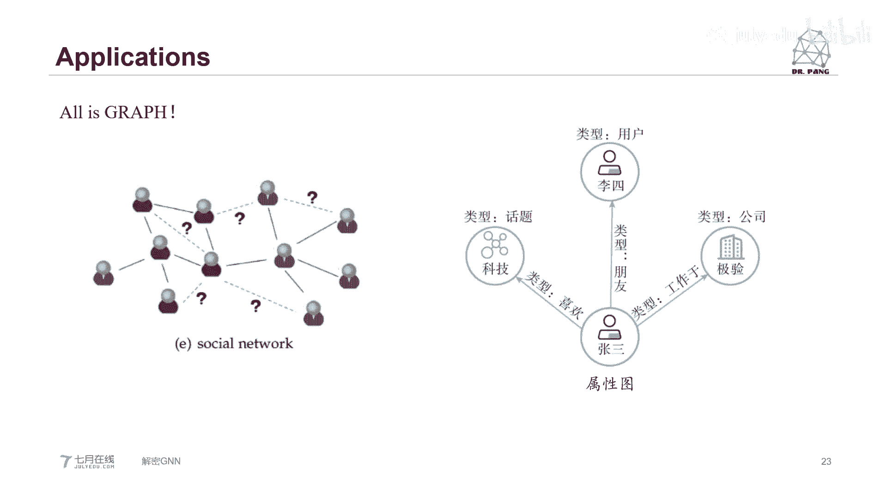
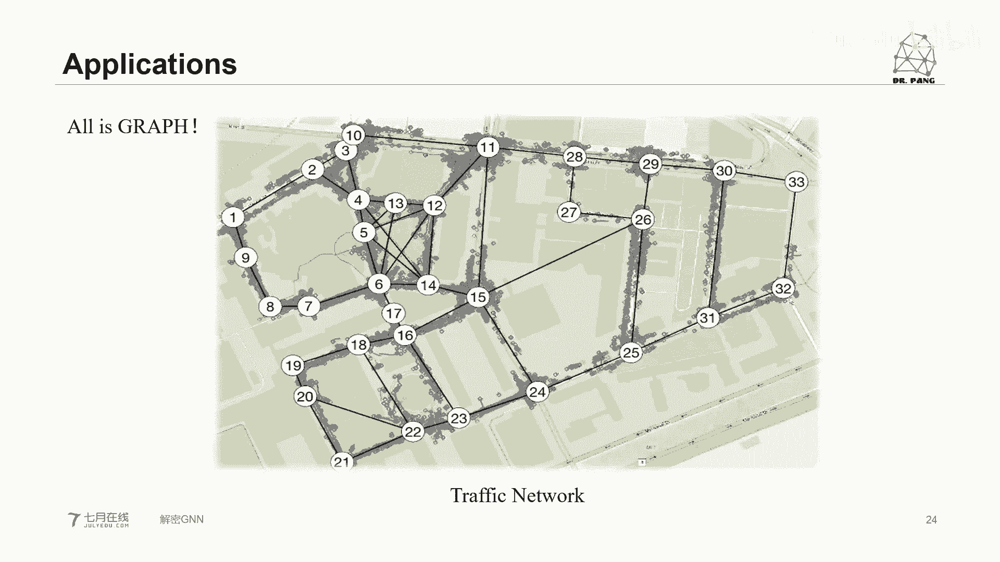
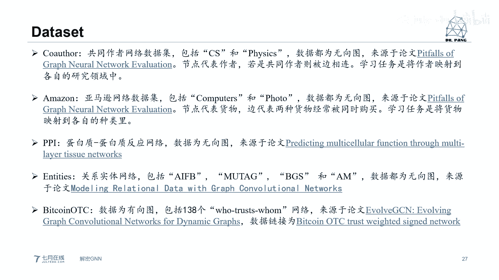
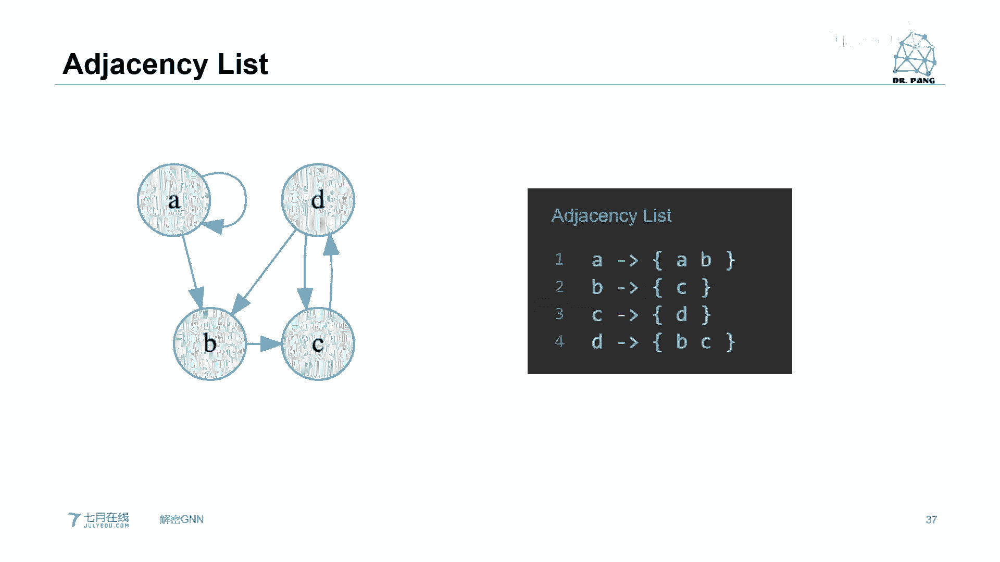
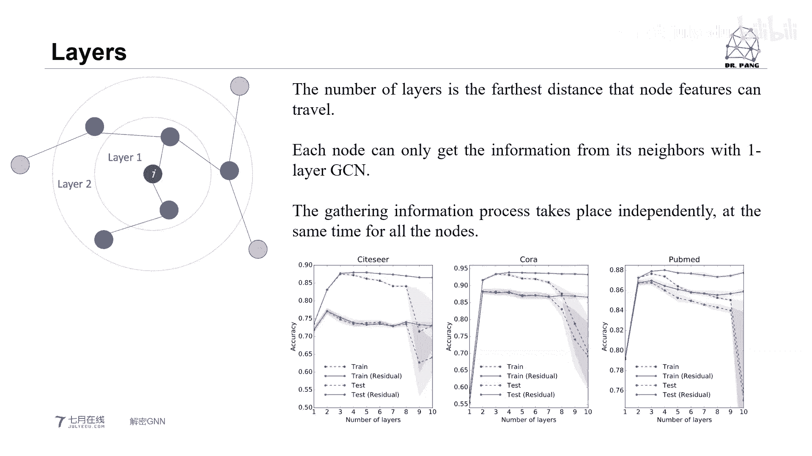
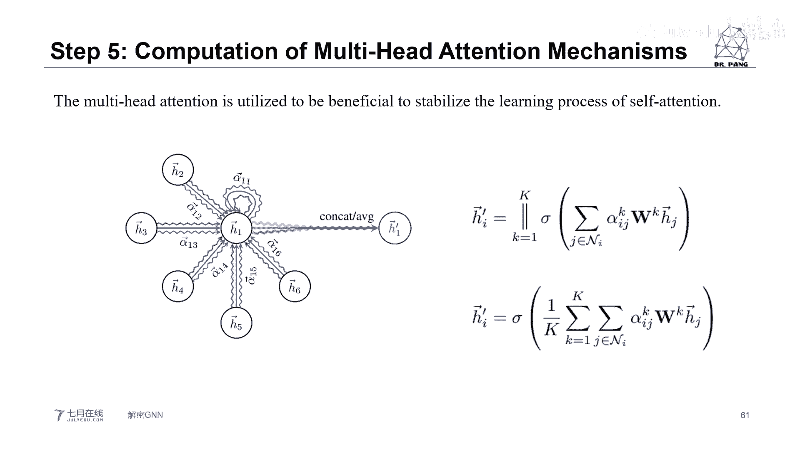

# 人工智能—计算机视觉CV公开课（七月在线出品） - P8：双语公开课《解密GNN》 - 七月在线-julyedu - BV17z4y167dq

hello，大家好，能听到我的声音吧。能听到我声音的话，就请大家呃回回个一，谢谢。好的，谢谢。

呃，今天我们这堂公开课主要跟大家聊一下关于图神经网络的一些故事。呃，首先就做一个自我介绍。呃，我是7月在线的CB庞老师。呃，我在CP在线主要是负责视呃计算机视觉这块的相关课程。

那么今天这堂课呃我们主要是呃为了跟大家聊一下关于图神经呃，图图神经网络的一些相关的事情。那么我们会从。

以下三个方面跟大家大致的聊一下。呃，由于这个图神经网络是一个呃非常大的一个内容。嗯，它也是最近。一个新兴的一个风口。所以我们很难用一节课就跟大家呃把这个图神经网络聊的面面俱到。

所以我会尽我最大的可能跟大家好好的聊一下。呃，最嗯就是帮助大家入门图神经网络。同时如果对这方面感兴趣的同学的话，我们也非常欢迎大家呃关注一下我们在呃7月在线所开的相关的课程。

视觉呃实战视觉下的图神机网络。另外我们在我们的就业小班里面也会开设关于相关的一些呃代码方面的一些实呃呃课程，也希望大家呃关注OK那么我们正式开始。

我们先从第一个话题来入手，图神经网络简介。换句话来说，我们需要搞明白一些问题。比如说什么是图。什么是神经？什么是网络？什么是简介？当然了，我们这个也是从这个字面意思上来直接给它抠出来。图神经网络。

简介也不用说。第一个是什么是图？好，我们先弄明白这个问题。关于这个图，如果大家去进言词吧、有道词典等等，上面一些相关的词典上去搜这个图所对应的英文。那么你会发现它会有很多很多的一个单词。

比如说photo。比如说image。比如说graph。那么对于我们这块来说，这个图应该去怎么样翻译更准确呢？我看微信用户314967同学说关系和节点没错。好，那么我们先说这三个英文单词。

第一个photo，当然这个我觉得没什么好说的，photo嘛它特指就是我们的照片。我估计群里面肯嗯肯定有我们的摄影爱好者。那么对这个照片你肯定相当了解。第二个image。我们这个专门讲图片。

对于呃如果大家相嗯相对于熟悉这个呃卷机神经网络相关内容。比如说图像识别、图目标检测、目标分割等等。那么大家肯定会对这个image图片非常了解，因为图片它每一个像素。它图片是有很多像素组成的一个图片。

如果是彩色图片的话，它要三通道，那么这就是图片的意思。而对于我们目前来说的这个图神经网络这个领域呢，我们更多的是关注这个graphuff。OK graph那么。graphra的定义是什么呢？呃。

正如刚才微信用户31496系统也说。是他有一些相应的object目标。同时，与这些目标object它所对应的一些关系，relationship。ok。所以说图就是由一些的目标或者是对象。

加上他们之间的关系所组成。Okay。那么我们通常也会更加严谨的说。所谓的目标对象，我们把它视为一个一个的节点。Notode。😡，而节点之间的这个关系，我们用边H来表示。

我给大家看一幅图。大家觉得这幅图片。他应该是imageage呢。还是graphraph呢？大家觉得这幅图片应该是image呢还是挂uff呢？我看看他家的想法，他是一秘智能还是guff呢？好。

我们用这张图片来说，这张图片呢它本身是 image是一个图片或者是图像OK但为什么我会把它放在这儿呢？我们也可以把这个图像里面的主体视为graphraph。okK你比方说。这张图像里面的最大的一个主体。

是梦想，梦想下面有人在推着。然后人的脚下又会被一些。呃，又会被一个小的一个黑色的球所拴住。而这个小的黑色的球，你可以把它视为。你想达到你的梦想，你想实现你的梦想所需要克服的挫折，你所需要经力的努力。

你所面对的艰难困苦等等。那么。这两个节点当中它的关系是。人在推，那么这就是它的关系，我们就可以把它视为一个一条边。O。那么我们看一下，我们用数学语言来定义一下这个图。

好，那么从这个句话来看的呢，我们就可以知道一个图 graph。它是有一些节点。和一些边所构成的啊，当然我们知道节点呢就是一些对象，而这个边呢就代表对象之间的关系。好。我们这儿有一个。

数学公式我们用大G来表示图graph我们用V。来表示节点用E来表示H。涛级同学说你还是看不到，要不嗯你用电脑打开刷新一下你的那个浏览器，然后把你的那个flash打开。好，我们继续。现在大家看到这幅图呢。

就是一个很经典的graphuff。你比方说我们看到了一个一个的圆，这个语我们就可以把它当做它的节点，也可以说是顶点。要注意啊，就是在这个graph当中，有的人会把它称为node节点。

有的人会把它称为vers顶点。当然它其实是两个呃一样的东西。我默认他俩是一样的。好，那么在节点与节点之间的那条实线，它所对应的就是边。我们可以看到同一个节点，它可能被某一条边所连接到另外一个节点上。

同时它也可以被很多节点与其相连。也就是说它有很多的边。另外一个现象呢就是在这个图graph当中，每一个节点它是有不同的颜色的。那么我们就可以把它认为你这个节点。你有着不同的语义，或者是可可以这么理解。

我们每一个不同颜色的点。它属于不同的大类。什么意思呢？我给大家举个例子啊。嗯，比方说。我们在高中的时候。我们需要参加高考，那高考考什么内容呢？高考比如说考着语文、数学、英语。

政治、生物、化学、生物等等各式各样的学科。好，那么在这些学科当中，我们可以把每一个学科都视为一个节点。那么跟这些所有节点所发生关系的那个就是我们这考生。每个学科之间是有一条边的。好，那么这种情况呢。

我们就可以把每一个节点画一个不同的颜色。比如说化学，我们可以画成，比如说浅蓝色。数学化成正黑色等等。那么这个就是说每一个节点它有一个不同的类的图，graphra它还有哪些分类呢？我们看一下。

比方说我们现在看到的一左一右两张图。这一左一右呢。左边我们下面写了一个undirected。右边写的是directacted。那么大家可以看到的是。同样作为相同的节点。如果你仔细看的话。

你可以发现节点的颜色它是相应的，是基本上完全相同的。唯一不同的就是边。对于左面那个图。边并没有任何箭头，也就是说你这两个节点之间的关系可以是说节点一打呃发送一些信息到节点2。

也可以说节点二发送一些信息到节点一，它们之间的关系相互的。OK也可以说是平等的。那么对于右边这个图呢，由于它的边它是有箭头的。那么换句话说，那么这些边。它表明了节点之间的从属关系。比如说我说你听。

那么这个就是说就是说我发这些信息你来接收。好，那么这种分法呢，我们就把它叫做有向图或者是无像图。除了这种分法，还有其他什么分法呢？😡，我们再看这个。对于这一幅图像。嗯，我们来先看左面那个图吧。

左边那个图的它是有像图。然后中间有一块部分，大家仔细看。箭头或者是边，它是红色的。那么对于红色的这一块来说。他的意思就是说，你看它是不是构成一个循环了。所以我们可以把这个图叫做循环图或者循环有向图。

而对于右侧，我并没有一个就是一些节点能构成这种循环。注意我说的是循环，不是闭环。O。循环的意思就是说我从一个节点向外发射信息。可能我经过若干个节点之后，我又能把信息送回来。那么在右右边这个图当中。

我们并嗯没有办法找到一个类似的结构。所以我们把右边这个图叫做非循环有箱图。除了这种分法，还有一种常见的分法呢？我们可以说。由于图当中所有的顶点它都或多或少的会有跟其他的相连。注意我的用词是或多或少。

那么换句话来说。有一种可能。图上的节点全部连接起来了。那么我们就把它叫做。完备图。如果说某一个图并没有所有的节点。嗯，就是互相之间能个个的访问。那么我们把这种图叫做连接图。

但是也有可能有的节点它是孤立的。或者是有一部分节点，它与另外一部分节点，它是孤立的。孤立的意思就是说没有边相连。我们就把这种情况叫做非连接图。好。那么到目前为止呢，我们就跟大家聊了一下图的基本概念。

我估计同学有些同学心里面肯定犯嘀咕。哎，这图有什么用？或者是说你说的这些节点，它到底还能表构建些什么表示些什么。😡，好，我们给大家看一个例子。以这张图来说呃，不以这个来说。

我们现在把图想象成一个社交网络。OK详情社交网络。那你看这个图。常见的一个应用呢，比如说我们的微博。你的朋友圈。你的Twitter。等等。比如说你是一个大V。很多肯定有很多其他的一些微博用户，他去粉你。

他就follow你。那么这个时候比如说我follow了一个大V。那么我们俩就之间就构成了一个关系，只不过这个关系呢是从我出发到大V。那么这个时候又有向图，假如说这个大V哎，他又互粉了我。

那么我们俩就形成一种互粉关系，也就是说我。可以粉他他也可以粉我，那么是双向有像图。所谓的双向有向图其实就是无相图。OK那么我们的关系就是说我们俩之间要彻底的连通，我们俩是平等的。好。

那么这个呢就是一个很常见的例子。当然了，大家要知道啊，就是在这个微博上面，由于这个用户是我都不能说千千万了，应该说数以万级或者数以亿级。那么通过这些互粉呀或者是。呃，哪怕说有相同呃兴趣爱好呀，就等等。

那么我们就可以能大致的推测出来。这个账号下这个用户的大概属性，所谓的属性，比如说他的偏号。它的兴趣点儿。等等，或者是说它的地域。可以说就这么说吧。在数据公司面前。我们是完全暴露的。以这个图来我们来举例。

大家看啊。这个节点的大小就代表你的粉丝数有多少。O。那么节点之间不同的颜色代表你们属于哪块区域？比如说我是音乐区的。哎，另外一个朋友呢，他是数码区的，就等等。

那边的连接关系呢就代表你们你们之间的相互关系。那么这个就是图在呃这个。社交上的一个很常见的应用。有的图我们就可以推算，或者是预测出每一个节点括括弧用户。它的相关的属性。O。有什么用呢？举个例子啊。

比如说我是一家广告商，我希望定点投放一些我的广告。比如说我的广告呢是关于呃数码产品方向的。但是呢另外一个用户呢，他可能是。舞蹈区的。那这个时候我可能我把我的数码产品我推送给舞蹈学。

这个用户呢可能不大合适。那么我做个广告就没有任何意义了。所以说如果我想把我的广告投放的更有意义的话，那么我希望。找到特定的一些用户。那么这个时候我们就用图的一些方法来进行分析。又或者是说。

我想比如说我我们作为。心浪它有一个推送。不如我向你推送一些新闻，可能我关心的是实时政治。但是你非要给我推数码产品，那我也不是很开心。😊，就等等。那么如何精准定位呢？这都是图的一些呃方法。哈。

那么如果解决这些图呢？这个就是我们今天的主角。图，神经网络graphph new networks。而图神经网络呢，他的想法就是说哎我用一些深度学习的一些相关的思想，我来直接作用在图上面。

作用在graphraph上面。那么大家现在看啊，我左边这个图就是我可能是描述的我的一些关系，接俩之间的一些关系。而我右面的这个图。每一个节点上面都会有很多的数字，比如说00100610010等等。

那么这些又代表了什么呢？好，我们先看第一个。节点我们用N来表示n取首字母N来表示节点之间的关系。我们用大E来表示H。而我们所说的那些那一串数字。我们用X来表示它就代表节点的feature。

有人也把它说成节点的embodydding。O再等等。好。那么我们要考虑现在这个图呢我已经有了。图我已经有了每一个节点，它自身的属性，它的feature我也有了。那我应该怎么做呢？

因为本身这个图它是死的。我们需要让它变得流动起来。😡，OK那么这个流动的过程，我们就把它叫做信息传递的过程。英文来说就是message passageok信息传递的过程。啊，那么。对于这个图来说。

节点与节点之间，我可以把我的信息发送出去，你来接收。比如说。两个节点。现在呢我们中间那个红色的节点，我们把它叫做reference node参考节点。而两旁的这个黄色的节点，黄色三角形的节点呢。

我们把它叫做邻基节点。那么我们这些节点它邻居节点把我的信息哎，我推送给你。因为我们俩实间是有关系的。那么这个推送的过程就叫做messagepa的过程。稍后我给大家讲具体怎么做。现在呢先构建一个概念。

什么是mesage passy？那么对于这些节点来说，对于我的中心的节点，当我接收到了各个周围的邻居节点传递过来的信息，那么我只需要做一件事情。就是aggggregation。

Agregation的意思就是说我需要把我所有阶段的信息聚合起来。然后我进行下一步的分析。通过分析，我得到我想要的一些东西。okK那么这个东西呢就可以把它称为。信息聚合。可能有同学心里想。

那这些他能做什么呢？好，我们给大家说第一个例子。Graph tasks。第一个例子啊。比如说对于节点的分类。什么是节点的分类？这如我刚才所说，每一个节点它其实是有相关的关系的。我给大家举个例子。

刚才我已经给大家举过了那个。社交网络的例子。现在我给大家举1个IOT的例子。LOT就是物联网O。这么想啊。对于IOT物联网来说，我每一个节点可以是做一个设备。这个设备呢可能是我的手机。

也可能是我的电视机，也可能是我的电脑。再或者来说，也可能是我的智能智能电灯泡等等。然后对于整个这些图呃，不能这么说，整个一个图就是整个这个物联网来说，它是一个大的图。那么每个节点它会发射出它的信息。

比方说我现在用我的电脑，我在说话。那么我的这些声音就会形成一个音频信息来发送到大家的耳机上。好，就等等。那么我们大家想哈，我们目前来说，我可能仅仅知道物联网当中的某一些节点类。

比如说我现在的这个节点是我的电脑。另外一个节点可能是我的手机。另外还有一个节点呢是我的路由器，这是我知道的。但是我的物联网就千千万万的这种点节点，很多我是不知道的。那么我想搞清楚它到底属于哪一个哪一种。

当然他们之间的他们本身的信息我是知道的。它们的连接关系我可能也是知道的，就是边我也是知道的。那么我们就可以通过这些信息来反推出你属于哪一个。那么这个就是对类的定义not classification。

当家说到这儿了啊，我们还有另外一种呃classification分类叫做graphraph classification。意思就是说我已经已知这些图了，我都放这儿了。😡，我想知道。

那么这个图我最终它代表了什么含义？等等。这个呢就叫做graphra classification。除此之外，还有一种任务叫做。Li prediction。他的意思就是说，我每一个节点你属于什么？

我明白节点，你每一个节点你内部的特征feature我也知道，但是我不知道的是什么呢？有些节点存在着边M，这个我是确定的。但有些节点可能不存在B，也可能存在B。我用的是可能，我是不清楚的。

我想把这个可能落实一下，你到底是否存在于边。O。再举大家一个再给大家举一个最更常见的例子啊，比如说。人与人之间的关系图。比如说我和我的同事之间，哎，我们是有一个关系，我和我的上司之间，我们也有一个关系。

跨部门之间的同事或多或少有可能有关系。那我想到底知道他们到底有没有关系。那么这个方法就这个这种叫做link prediction。这是图的另外一个呃任务。哎，说到这儿的时候呢。

大家可能对这个图和graph view network有个一个初步的印象。那么我们为什么说。😡，GNA是一个新的风口，就是深度学习里面。新的风口呢为什么这么说呢？又我们换换一种问法。

为什么之前它没有出现，没有成为风口，而现在开始成为风口了。又或者是说他之前为什么那么难。好，我们来问解决一下这个问题。Why is it hard。我们来看哈。😊，在聊天之前。

深度学习呢dep learning for computer呃 deep learning它有两大类。第一大类。是computer vision计算机视觉。在计算机视觉下面又有很多很多的子类。

比如说随便举举一个例子。目标检测。实力分割、关键联检测等等。那么除了这个大的类别以外，还有一个另外很大的类别。叫做。

natural呃 naturalural language processing NLP。那么从这个名字上面，我们就知道它主要是处理一些，比如说语言、文本等等一些信息的。O。那么我们知道就到目前为止呢。

不管是CV领域还是NLRP领域，深度学习都有了一个长久的发展。大为什么这么说呢？你看啊，我相以CNN来说。现在有一幅图像，这个是比较非常一个简单的呃M list里面的一个手写的数字。3。

那么大家知道啊对于每一个图像或者是每个image来说，我每一个像素点。我们把每一相对点呢视为一个n，视为一个节点。然后这个图像当中所有的像素点它是非常均匀的排列的，而且它每个像素点的位置是固定死的。

在这看的就像一个山格。好，我们再看一下NLP下卖的RN的那些各种网络，它所处理的。比如说。这儿有一串语音。这一串语音呢，比如说我说这句话，我说这句话五个字儿，那么这5个字儿往出传输的时候。

它有一个先后顺序。那么这个先后顺序就所谓的语序，它也是固定的。所以说不管CN呢还是RN来说，他们所处理的对象都是有着比较相对简单的一些形状的。O。那么话说回来，GN呢我们来看。大家看到这幅图。

对于GNN的这个网络图。他非常的复杂。OK它非常的复杂。比如说我们的网络关系图，你说你做为一个节点，我做为一个节点。哎，我知道我们有关系。有可能关系非常近，也有可能关系非常远。

你能说清楚我们的这个节点的位置在哪儿吗？我这个很难说清楚。对吧。所以说这是基因所处理的东西的一个非常复杂的一个呃现象。它不像图像，不像文本，它们的结构非常单一。那么对于如此复杂图像，这种的复杂图像。

它已经不像我们在那个呃欧式几何当中可以有规则的形状的这种复杂图像来说，CN和RNN就失去了效益。那么这个时候就该继N出场了。好，我们再看。对于图来说。它没有一个固定的形状。问大家一个问题啊。

现在呢是两幅图。大家有的这两幅图是一样的还是不一样的？大家看这两幅图，这俩是一样的还是不一样的？这两个图呢都是无相图。都有5个节点。它是一样还是不一样的？手机用户520013同学说呃。

还有5873有同学说他们俩感觉是一样的，还有没有其他答案呢？其实无外乎就两种答案。一样不一样，ys on no，还有没有其他答案？好，我们来看啊。这个问题呢。该怎么回答呢？如果你猛的一看呢。

它俩形状呢好像是不一样的。左面的。是你看那个一2，它是在右侧。右面的呃啊不是123右侧，然后你看那个左边那个44号节点是在下方，但是右面呢它好像四节点在这左上方，就是猛的一看，好像是不一样的。

但是如果我们要是把这两幅图。用它的临阶矩阵来表示。注意啊，我现在说到临接矩阵，可能有些同学对这个临接矩阵不是有什么概念的话，你就你就现在仅仅的把这临接矩阵想成图的一个用数学表示的一种结构的方法。

稍后我们会给大家介绍什么是临接矩阵？如果说我们把这两幅图用数学的连接循来表示的。那么你会发现它们的连接又是完完全全一样的。O。所以说那你这个图同样有着数学呃相同的临界曲线的这种结构的图。

它的表现形式又完全是可以不一样的。所以说这个图是千变万化的这又是一个非常嗯为什么基N非常复杂的一个原因？还有一个原因。其实我们刚才看到的那些节点，那些图都是非常简单的。在真实事业当中呢。

这个图其实是非常庞大的。你比方说。知乎用户。知乎的用户，那也是。估计是些小一一以上了吧，我我瞎猜的啊，啊，非常的多。那么请你把这些这个他们之间的关系用图来表现出来，或者是说可视化出来这个工作非常难。

可以说这个图它非常抽象，它不像我们之前看到的图像image，也不像我们之前所听到的声音，读到的文本。很具象的放在你面前。那这个图它要很抽象，很难可视化。所以这又是为什么它非常难的另外一个原因。

那既然这个问题这么难的话，那么我们为什么要使用图呢？从简单点不好吗？

我给大家呃这么回答一下，为什么这么难，我们还要硬着头皮去攻克它。首先第一个原因，图它本身有着天然的优势，这个天然的优势是它可以非常好或者非常形象的来描述。

关系relationship会有interaction。我们把节点视为对象，对象之间的关系，我用图非常的一目了然就能描述出来。同时图又可以把很多就是生活当中很嗯抽象的一些问题。把它简单化。

我给把它简单化。另外一个的图它有很多的应用。其实我们现在经常说all is graph。万物皆图。我给大家随便举几个应用的例子。好，比如说你现在看到的这两个应用。左边的是物理，右边的是化学，化学当中。

它每个原子或离子之间有着什么化学键和共价键，那么这就是一个你就包括物理你的这个各个核之间的一些关系等等。像生物生物里面的基因图谱等等。那么这些就是一个非常好的应用。CNN和GRN不太好用吧，在这儿。

All is graph。我们大家看这个图，回到我们计算机视觉上来说。这个图呢这这先从这个意值吧。这个图像来说呢，我首先用目标检测的方法，哎，我已经找到了图像里面每一个具体的objects，具体的对象。

我把它用矩型框来框出来。那么这个只是我初步想做到事情。那么更进一步呢，我想知道哎每一个对象就我框容对象之间它有什么关系，或者说它是否有关系。比如说这个这张图呢，这个场景图它里面搜了5个对象。

一个男人一匹马，一辆车，一只狗，一个小男孩。那么比如说哈这个小男孩骑在马上，那么人男孩和马有一个关系。狗看着男孩，男孩看着狗，他们有一个关系。

那么我们就可以把每个对象抽象成为一个我们图graphra当中的一个节点。那么节点之间的关系用边来表示有边，那么就代表着他们俩有关系等等。所以说这个是在计算机设备上的一个场景图上的一个应用。

又或者是在文本上面一个应用。你看你CN做的事儿，我能做你RN做事，我也能做，你们做不到事儿，我还能做。这个就是图的强大之处，all is graph。下面一个例事例呢是社交网络。又或是属性图。

关于这个应用，刚才我已经给大家就是解举过具体的例子，这样就不再赘述了。

除此之外呢，熬一思过。比如说我们的交通图。交通网络呢它有很多的就是多种样式。我们以这个图来举个例子啊，比方说我每一个整个这个地铁网。地铁网是一个很大的图，每一个地铁站你可以把它设为一个节点。

然后地铁站之间的联通性，那么它可以是一个边。地铁站嗯就是地那个站与站之间的这个路径上面跑的这个地铁就应该叫。呃，就是火车也不能叫火车。啊，就地铁吧，你就里面跑的这个车，那么我们可以把它识别信息。

你车辆的大小可以说你信息的大小就等等。我们可以关注到那个。呃，我们可以把它关注到。呃，路径规划的相关问题。比如说最短路径。比如说车流量作为简单的属性，我们去预测未来交通流量的变化。有同学说。

transformer也能做到transformer能做到一部分。okK我并不是说其他东西做不到。比如说CNRN传造门，他可以做到，但是他有些他做不到事件，GN我也能做到。

这个图呢比如说是电子商务的图。呃，像电子商务，它有一个最经典的用，就是推荐系统。OK推荐系统。比方说我们刚刚过去不有的一个双十一。我每一个商家，哎可能我比如说我作为一个呃买数码产品的一个商家。

我的店铺里面呢举个例子啊，我有笔记本电脑，我有台式机电脑。哎，我同时也可能有啊摄像机就等等。那么我每一个产品可以视为一个节点，我放在这里。这个节点呢是有一个属性叫做产品这个属性。

在这个网上有很多很多用户他去浏览。哎，那么用户作为一个节点，它是有着他的用户属性。当我有很多人浏览了同样一个呃，比如说商品之后，那么我们就可以知道他们之间的关系。那么通过他们之间的关系。

我们可以更好的对用户做出推荐。那么这个呢就是涂在呃电商的上面的一个应用。哎，我给大家举一个呃比较。呃，以前那个经典事例吧，这个这个难道不是电商，但是一跟商业有关的一个经典事例。呃。

就是说我们先把这个节点呢分成两类，最简单的啊先分成两类用户和商品。那么用户和商品之间它存在的这个关系呢，比如说有浏览。哎，可能我浏览完之后，我就说把它收藏下来了，所以收藏是第二种关系。

有可能哎喂最后我把它买下来了，购买，那么这是第三种关系。那么用户与商品之间可以存在单一的关系，它也可以存在多重关系。就比方说我光浏览，我看一看就走，没问题。哎，我看一看，我收藏下来，我现在不买。

我以后再买没问题，我直接买了也没问题。那么像这种复杂的数据场景，可以用属性图来轻松的描述。好，我给大家举一个比较呃一个经典的例子啊，啤酒与尿布的故事。大家萌一下，我这啤酒和这尿布是有什么关系的？

我也不能说我拿尿布来擦嘴巴。他的关系呢是曾经就是在这个美国的一些小超市呢，他会发现一个有趣的现象，就是说爱买啤酒的人通常也跟爱买尿布。哎，咱们这么一想啊。好像没什么道理呀。😡，为什么呢？是这样的啊。😡。

就是货架上的一些呃商家会把啤酒和尿布放在一起售卖。我说的一些小超市啊，就是这两个看似无关的东西，为什么会放在一起售卖呢？原因是这个样子的，就是在美国呢，一些呃就是呃妻子会经常给他呃丈夫打电话说。

你下班之后哈，你给娃买点尿布回来，给那个小包的尿布。那么丈夫心想哎，那我你说我还得绕道去一趟。那我就去不能白去啊，我要不稍微再给自己买点袋犒劳一下。然后丈夫就在买完尿布之后。呃，买完尿布之后呢。

呃又会顺手买回一瓶自己爱喝的啤酒，我们也能看到这美国爱喝酒嘛。那么是商家通过很长时间的个原始交易季度进行详细的分析，就发现了这这一对神奇的组合。所以他就会把啤酒和尿布反子一起售卖。当你看到那尿布的时候。

哎，我顺手拿杯酒走吧。那么这个呢就是一个比较呃经典的一个案例。哎，我看到手机用户是664790，问有没有做过STTCN的前辈，我们在那个。图实战下的图神经网络当中会有一节课专门讲嗯这个行为识别分析。

专门有一节课讲识别分析，里面上涉及到了STGCNASGCN等等。如果你感兴趣的话，我建议你就是关注一下我们这个图形级网上的课程。当然如果你是专门做行为这个行为识别分析的，我们有另外一门课程。

就叫做行为识别分析。那个里面会有更详细的讲解。O我们继续。图的数据应用场景不仅仅简单就是这些，它很多很多的。你比如说神经网络计算过程的计算图。电子元器件中传感器的阵列网络图。

由各个智能传感器组构成的物联网。等等就很多很多。所以说all is graph。O。呃，说到这儿呢。咱点干货。我给大家用了两页的PPT，呃，就是放了一些比较常用的一些呃data set。兵马未动。

两草先行嘛，对吧？所以说在这儿呢给大家就是放了一些。呃，然后这个上面呢会有呃它所相应的链接，还有每一个数据的相应的介绍啊，这是第一页，这是第二页。那么如果你感兴趣的话，在我们今天的公开课讲完之后。

你可以到群里面问我们的后台工作人员要我到时候会把我的这个呃PPT放在，就是让我们工作人员放在群里面OK。呃，当然我们这个视公开课最后也会形形成一个视频，最后也会挂在上面。那么如果您感兴趣的话，呃。

可以就是拿到这两个这个PPT来说呃，然后看一下里面的每一个数据集的相关的一些具体事例。然后这个呢也会在我们的视觉实战视觉下图层新网络里面有具体的讲解。

OK当然我们另外一个就业小班里面也会有相应的一些。呃，相应的一些就是实际的实操。

好。😊，说完这儿呢，大家相信大家已经对这个GN有了一个大概的呃认识。那么我们现在就开始从另外一个角度入手图卷积神经网络。如果我们去掉第一个汉字儿，那就是卷积神经网络，就是CN。

只不过我们现在聊着图卷积神经网络。O我们来看一下GCN它具体什么做的。GCN呢是一种图转基神经网络。它可以直接在图上工作，利用图的结构信息。它所解决的是对图中的一个节点所进行的分类的问题。

就是我们之前所说的node classification的问题。O。呃。我们来看。在这些这幅图像当中呢，有一些节点，比如说我蓝色的节点和红色的节点。你们都是节点，你们可能有不同的类。我给大家举个例子啊。

😡，我们常用的一个数据集叫做有一个叫做cor。那么这个数据集上呢，它会有。呃，2000多张2000多篇论文。然后我对这个论文。我通过你们之间的引用关系，我来构建出就是引引用是否引用我构建出来你们的关系。

然后我就这2000多篇论文。我分成了7个大类。比方说啊我给大家随便举个例子啊，比方说哎你这一波论文你可能是关于CN的。你另外一波论文，你可能关于是RN的。你还有一些论文，你是关于GNN的。那么。

我们把这些论文分为7个大类。OK还有一些论文呢，我并不知道它属于哪一类，但是我知道他引用了谁或者谁引用了他，我知道你们之间的关系，我希望我推算出来。最后你这篇论文属于哪个大类。那么这个呢就是我们。

GCN的一个应用。在讲GCN的具体原理之前，我们看一下。它和CNN有什么关系？因为你们都叫卷积神经网络嘛。好。其实从本质上看到，CNN和GNN它都是聚合领域信息的运算，只是作用的数据对象不同。

CN我做的是每个像素，而每个像素它有相对固定的位置，相对固定的关系。但是GNN的我是直接作用在graph图上面的。图它没有一个固定的关系。O。但不管CN还是GN，它都是聚合领域信息的运算。

那么CN中卷积的计算呢，相较于GCN中卷积的运算，它最大的区别就是没有显示的表达出这个临接矩阵。我们可以看到就是呃左边这幅图。我们看这个公式。如果我把这个公式的这个A撇去掉，我把它完全去掉。我把F。

我如果用X来表示。那么这个就是我们非常熟的了，Z等于金入函数括号W乘以X加B。那么这个就是会变成我们非常熟的CN的一个一个每一个神经元的公式。O。APR是什么意思呢？😡，或者说A是什么意思呢？

A在这就是指的临界矩阵。它代表的就是图的这个结构，我希望用这个矩阵我来描描述出节点的序要编号节点之间的关系。F。F所对应的就是CN当中的X。它就是feature特征。然后剩下的呢就不用多说了。

OK剩下的就是W和B，那就是参数sigma，那就是激乎函数，最后的Z就是输出。OK所以说你如果看这个公式的话，其实它们是非常接近的，区别就是没有显示表达出一个临接矩阵。O。那么有的同学肯定要问，老师。

你这右上角写的这什么玩意儿？😡，OK那么在右下角来说，我们显示的这个这个呢就是GCN最终的。那个公式我最后会给大家带给大家来还原出这个公式。OK但然现在呢我们先卖个关子，挖个坑。

我们到最后来可给大家讲一下，我是如何从它具体的写到这一步的。啊，我们一会儿再说。我们再看CN和GN的这个相呃，它们之间的比较。从模型上来看呢，嗯我们这个呢它其实感受也这块是非常相同的。感受也会感受欲。

它会随着卷积层的增加而变大。我每多一层卷积运算，我的中心节点就能向外多融合一圈信息。比如说啊你看左边那个CNN就A图CNN我中心的感受域，我从第一第一层的1乘以1。然后到33到5乘5不断的扩大。

在G字当中呢，我的中心节点中心节点那 node。我也可以哎向外融合嘛。比如说我第一次我融合我的一阶邻居。然后我在第二次我认会二级邻居。好，我们现在说一下什么是一级邻居。先问大什么是邻居吧。

所谓的邻居就是说我对这个中心节点，我有直接有边跟它相连的那些节点就叫做邻居。OK一届领区代表着我直接与中心节点相连。二阶邻居代表的意思就是说这些节点呢我并没有直接跟你中心节点相连。我中间还有一个节点。

比如说我节点A是中心节点，节点C它连了B，节点B又连了中心节点A。那么这个时候我们就说节点C和节点A，它是节点C是节点A的二阶邻居。那么同样你也可以说我们有三界邻居、四界邻居等等，当然是可以的。那么好。

也就是说CN和GNN呢呃它们都有一个共同特性，就是说我都是感受点的都会随着程度的增加进行变大。那么对于他们的学习任务上来说，CN和GCN也有非常强的可类比性。比如说哈你看。

目前这个图当中的A图和B图就是左面这两幅图。他这个展示了个。呃，计算机视觉中的两大主流任务，一个是图像呃，一个什么目标识别或者是图像分类，一个叫做图像分割。也有还有一种就是实力分割等等。

就是一个分类一个分割。我们再看右面这两幅图，C和D图。C图呢是研究人员利用脑信号来进行构图。比如说哈我们这个人的大脑其实它是分区的，比如说某一个区它掌管的是你的感情，某一个区域掌管的是你的记忆等等。

因为我并不是做脑科学的，我这给大家举一个比较粗浅的例子啊，那么我对这每一块分区呢呃我这每一块的区域我会发射出来我的脑神经信号。哎，我通过我发射给哪个区，我就构建一个联系。OK当我做一件事情的时候。

这些区域需要互相协调配合。当我做特定的一件事情。他们发射的信号，不管是大小或者就属性，它都是不一样的。很明显，比如说我唱歌。和我跳舞。你这个信号肯定是不一样的。那么我们图分类。

就是说我通过研究你这个区域发生的信号，我想得到你最终代表的是什么？那可最终代码是什么？呃，有一个经典的案例，就是说我可以用这个脑电波的这个信号，呃呃这个脑信号来先构图，然后再对这个正常人就是健康人。

阿尔兹海默韦症患者，还有轻度认知障碍患者的脑信号来进行这个大脑信号的分类。那么这是一个比较精典的一个应用。然后再看那个地图，就是右下角那个图。呃，是B图是图像分割，地图呢。

它这个对应的也是对这个节点进行分割啊，不是sorry，对节点进行分类。因为本身这个所谓的图像分割，我其实就是对我每个像素进行分类。你这个像素你是属于某一个目标还是完全是个背景。

那么我对于这个节点也可以进行分类，就是在基验当中，你归你属于属于哪一类？OK那么说明他们的任务其实也非常相通的。好。那么这个是GGN和CN的一个对比。CNN不用赘眼，大家肯定都熟。

那我们看一下GCN它的一个主要的一个核心思想是什么呢？这个GCN呢图神图卷积网络，它的一个基本思路就是说。我希望对于每个节点。我们从他所有的邻居节点处获取其特征信息啊，当然了，不光邻居节点的信息了。

也包括你自己的信息。O。比如我们可以呃通过计算这些信息的一个平均值，最简单的一个平均值。然后我们对所有的这个你所从邻居线得的信息和你自身的信息做一这样的一个操作。

然后我们把你操作手到的平均值输入到神经网络当中去。那么这个就是计资单的核心思想。O。举个例子啊，这个图当中最中间的那个点绿色节点，我们把这个绿色节点呢就当做核心节点。那么他把他自己的信息。

加上周围蓝色节点邻居所构成过来的信息，我进行相融合，我算了均值。我通过这个均值，我来可可能得到我这个该阶点的属性。当然这是最简单的一个想法。GCN它后面的您如果去看的话，它这个是呃好像数学公式很复杂。

然后好多好多层它其实的思想就是这个这个思想。那么对于这个GCN呢。在实际操作当中。我们会。把很多层叠加在一起。来获得一个更深的GCM。在原始的代码当中，GCN只有两层。第一层的输出是要第二层的输入。

ok。我们来这么说吧，我们来具体的看一下。或者是说我们从数学角度看一下GCN到底是怎么工作的。那么在开那个之前，我需要先跟大家聊一些他的呃数学的一些定义。比如说第一个。我们先看这幅图。

这幅图当中呢我有4个节点，ABCD。每个节点呃都有边，要么是向外延伸，要么是呃就是边连接到它自己。okK当然其中有一个图，有一个阶点A，它有一个循环，我们把它叫做自循环。就是说我跟我自己相连接。

因为这个有像图嘛。好，那么我们是不是呃除了用嘴说这个节点间的相互关系，我们希望表示出来。最简单的一个表示呢。就叫做零接验表。你比如说他的第一行。A连接到了A和B。哎，那我就知道了A点和哪些节点相关系。

B连接到了C就等等。我们把它叫做临接链表。但是我们实际当运用的时候呢，这个连接变表还不够方便。那么所以说我们就把另外一个。

概念你引得出来，叫做临街矩阵。连接矩阵呢它是一种使用二位数组N乘N的矩阵来表示的图的一种方式。针对顶点相交的情况。如果两个节点是相连接的，我们就把所对应的。数字元素写成一。单间可以用其他权重等等。

最简单的就是一和零。如果没有连接，我就把它写成零，就是等等。okK那么这个就是临接矩阵。我们来看这个实际的例子啊。比如说这两个图，一个是有向图，一个是无向图，他们的节点都是4。就是4个节点。

那么如果当我们写出来的时候呢，比如说我们先看左边这个图，从一号节点来看。一号节点和2号节点相连，所以在A01处。我们写个一，我给大家画一下。比如说在这儿我就写个一代表一号节点，2号节点相连。

一号节点和4号节点相连。哎，我代表哎，我在这里写个一。那么其他地方写零的呢，就代表他们并未连接。OK这是第一行。如果你看第二行的话也一样，对应的12。34。2号节点和一号节点相连。

所以我写一2号节点和4号节点相连，我写一，其他地方我写0。那么对于有向图来说呢，方法一样，我们可以把它这个完成出来。这个矩阵A吧你呃完成出来。如果你仔细观察这两个矩阵的话，你会发现关于左面这个矩阵。

无项图的连接矩阵。我完全根据主对角线对称，没错吧。对于有向图来说，他就没有这个道理了。这个其实很容易想象吧。这个所谓的无向图，其实就是双向有向图，对吧？你一言二对无相来说，那就二也连了一。

只不过对有向图来说，它可能没有这个道理。O。呃，所以说呢这个就这个呢就是连接矩阵的一个定义。当然了哈呃这个矩阵呢可以从水平和垂直方向列出所有的节点。

其实我们可以通过观察这个矩阵里面的一的数量或者有值的数量。假如说你的连接比较少。那么你E的数量就比较少，或者换句话说，零的数量就比较多，我们把它称为稀疏土。你图越细说。

说明你有可能就是undirected graph。如果连接很多，我们就把它称为稠密图。如果我们有发现所有的数字都为一，那么它要达到所有可能的连接，我们可以把它弄作完全图。呃。

手机用户520013同学问五像图的AII指的是0吗？这问题问的好。在最开始的就是最basic的这个呃连接局阵当中，我们先把对角线全部换成0。但是注意要这个。但是在实际操作过程当中。

我们会再加一个对角线矩阵。把对角线的值列为一，一会儿我给他我给你解释，为什么要这么做哈，一会儿我们就会有一张幻灯片来讲解。那么这个概念呢是呃临接曲线的概念。呃，第二个概念呢叫做度矩阵。什么叫做动矩阵呢？

这个动矩阵其实就是说我对于你每个节点。我希望用一个数字来代表你这个节点的度。所谓节点的度就是说你有多少条边相连。给大家举个例子。你比方说这个图。这个图。1234566个节点。如果我们写杜取阵的话。

他就会写成这样。对角线上有值，其他地方没有值。O。那么在对角线当中，比如说我们先看第一个数字吧，这个数字4它所对应的就是节点一。它的度所谓的度就是说它有几条边相连。我们看啊一和二相连，一和五相连。

一还有个自循环。哎，同学肯定要问老师这个不是三吗？应该为什么写这个四呢？他问的好。注意对于无项图来说，它的度数如果有涉及到自循环，我们需要把自循环。变成2。O。所以说对无向图来说，如果有自循环的话。

那么我们就需要把这个自循环这个边写成2。okK这这就是为什么我们最后会得到了4，而不是三的原因。那么这个就是我们刚才先给大家介绍了两个呃数学概念。一个叫做呃连接矩阵，一个叫做度矩阵。

然后第二个呢叫做message passing。什么意思呢？你看这两个节点A和节点B。他们之间有什么关系呢？如果你只猛的看一下，貌似A和B没有任何边相连。我们可以给大家举个实际的例子啊。

我们拿这个图呢可以代表这个人际关系图。OK我们把它代表人际关系图。比如说我每一个节点哎A可能是。呃，举个例子啊，赵薇和黄晓明。作为两个节点，由于他们曾经是同学，所以我们给他们相进行连接。哎，我们再说。

比如说陈凯歌、马思纯。假如说陈凯哥和马思纯，我们看见他没有任何关系。他们肯定不可能是同学吧，年年纪差哪了。但是他们会不会通过赵薇和黄晓明来构建出来与马思纯的关系呢？虽然你们离的表面上看的很远。

但是呢通过你个人际关系，你总能七拐八拐的找到你们的这个呃关系。那么这个呢就是我们希望用一些呃mey passing的一些方法，我来找到。哪怕离得很远的节点之间的关系。具体怎么做呢？我们看一下啊。

先看官图记。这个呢既首先根据我们刚才给大家引的这个思想，我从它我可以知道连接矩阵A我也可以知道度数矩阵D。这是非常容易得到的。O。但是除此之外，其实我们还有一个矩阵。叫做feature vector。

X这个X的意思就是说我有属性矩阵。具体来说，我对于我每一个节点。我有可能是有属性的，这个属性呢就是一串vector。这是一个比较简单的一个案例，就是说呃我只用一个节点，我写了三个数字。当然实际实操当中。

它这个弯度是很大的。啊，那么这些呢都是我已知的。刚才有个同学问我呃，手机用户520013同学问我这个无像图AAII只能是0吗？你本身的没呃那个临界矩阵，它确实是零，但是在实操过程当中呢。

我们会加一个特征矩阵I。这个I的意思就是说，哎我对角线都为一，为什么这么做呢？这是因为。我们不希望。0乘以任何数都为0，这样就会造成一个现象。我本身节点的特征我完现就利用不上了，因为你乘以0全是0。

所以说我们还希望把本身节点它的特征也照样利用上，那么我们就把对角线改成一，那么就会从矩阵A变成了At，就是A上面有个波浪线。就是说我要首先我要先更新一下我这个连接矩阵。那么话说回来哈。你临接矩阵更新了。

你的度数矩阵是不是要更新一下呀？2好，我就把我的度数组织也更新一下。那么有了。呃，督数举证。大家看到我们第三个举势，就右面这个矩势，它是度数矩值的逆。哎，我们知道为什么群逆呢？是这样子的，神经网络。

它对输入的数据的规格非常的敏感。像微博用户314967同学说，这个大型的数据呢，这个矩算非常非常大。没错。都不用特别大型的数据啊，你像那个coral。Qre这个数据集呢，刚才我也说了一下。

就是说它每个节点都是代表一个论文。它的节点那它的这个呃连接距它有多大呢？它的维度是2708乘以2708。它的feature呃矩阵就是特征矩阵，它有多大的，它是2708乘以1433。如果我没记错的话。

都不用特别大的举阵。那么这两就是特别大的这个数据图，光这个不是很大，它就已经非常大了。所以说。神经网络对输入数据的规模非常敏感。那么我们就对这些呃刚才我们提到一些呃矩阵的，我们进行一个缩放，缩放的意思。

有人因把它也叫做规化。O。解决方案是对数据矩行缩放。那么我们通常会对矩阵乘以一个对角线矩阵来减小规模。从数学上来说呢，要根据这度数的聚额向量来减小规模。你为什么这么做呢？你看度数矩阵。

它本身就是一个对角线矩阵。你就现成的摆在这儿，我干嘛不用呢？哎，我干脆就利用上吧。所以说这个时候呢，我们就考虑。在A前面乘以一个D，只不过是我们取是D的力。

O所以说那么第一title的列就是我们这个更新的这个呃。临接取阵A title的，我们就把它叫做一个成积因素。如果你把这两个展开呢，就是你看到这幅图。你会发现。哎，前面那个D抬斗负1力乘以A。

我为什么会把乘以X呢？因为我希望乘以它的这个属性矩阵。好，那么同学你仔细想。它这个乘法它其实是对称A式的距它是对称的，对不对？你既然可以在我的左面，我乘以一个D的负1。

那我是不是也可以在的右面乘以也乘以一个D的负1呢？这样我的话我就保证了，我既不亏待行，又不亏待列。大家有福一起一起想嘛。手机呃，我先说那个阿赠Z类们会有回放吗？会一般我们会在周一周二的时候。

在我们这个新车在官网上面会播出我们的这个回放视频。首先用户520013同学问，为什么不用正态分布规一化呢？呃，我们会有时候会产生正态分布规一化。我在这讲的是一个最最开始最方便的一个解决方案。

OK不过好像这个正态分布规划用的好像比较少。好，我们继续说。那么我对你左面乘以D的负1，右面刚脆我也是乘以一个D的负1。这样的话就是说哎我左面我也不亏待你，右面也不亏待你。所谓的左右。

如果你用句子的乘法仔细看一下，就是下面那个图仔细看一下，我一个是乘以横。很好，那么我右的那个我就会乘以列，这样的话我全部不亏待，就形成了我们现在看到的dtle-1AtD title负1乘以X。O。

那么我们新得到这个呢，就会把它我们可以称为这个叫weightted的 average。好。那么这个新的算法方法就给我们提供了这个加权的平均值。我们在做这里做的。

其实就是说给这个度数比较低的节点加更多的权重，来减少度数比较高的节点的影响。OK他的想法是就是这个加权平的想法是呢，我们会假设在度数节点嗯比较低的，它会对呃邻居产生更大的影响。

而度体量比较高的人会对邻居贷款较低的影响。所以说这个就是为什么我们要这么做。我们再轻给它变一下，哎，你看。你左成第负一，右成第正一。他们我们现在就是说哎，我干脆都给你成开方吧。OK我都给以成开方吧。

成完开放之后，就是我们所看到的GCN论文里面的最终形式。好。给大家做一个快速总结。最开始呢就是它这个演变过程。最开始呢我就是完全用这个A title。更新好的这个临接矩阵，乘以我的属性矩阵。

再然后我们开始进行呃规化。我成立一个D负一。都书举证能力。既然我可以左成，那么我我也可以右成。这样的话，我对你的行和对你的列都有了同等的关注。哎，我们进行进一步的变化，我们将它乘乘以地区任的开放。

OK那么这个就是我们最终所看到的这个呃GCN里面的最终的这个呃数学公式。好，们把它放在一起。还有一点呢，就是没跟大家提，就是前面那个soid呃，就是那个机乎函数sigoid函数。

由于GCN它做的是节点的分类问题，所以说它采取的是sof max。因为of max呢，我就是解解决这个分类问题的。在CN呢就是所以它的机乎函数取采用了sof max。同理，对于损失函数来说。

分类方法它最容易用的这个呃损失函数就是cross andtrophy。OK呃，关于这个我就不给大家做更多的介绍了啊，因为这个跟CN是非常近的。另外一个问题呢就是层数在GCN当中。

它本身就用了两层OK所谓的乘数啊，注意啊，这个层数它其实指的是节点特征能够传输的最远距离。你比方说在一层的记责当中，它每个节点呢只能从他的邻居那里获得信息。每个节点收集信息的过程，它是独立进行的。

对所有的线来说，它都是在同一时间进行。假如说我们在第一层的基础上再叠加一层，那么我们重复收集信息的过程。OK那么这一次呢你的邻居节点，他邻居又有了他的邻居。

OK所以说那么这个层数就可以认为是每个阶段可以走的最大的ho。O。这就是呃how来这个意义。那么E接ho就代表你的直接的直接邻居。二级号再远点，三级号堡更远一点，就等等。关于这个呃更多的细节呢。

呃我们也会在这个我们的呃实战课程视觉实呃实战视觉下的图神经网络有更进一步的给大家介绍。我们会有6节课为大家介绍GN的来龙去脉。

同时我们也会在就业小班当中呃增加一些关于呃GN的一些实战的代码演练。OK如果有兴趣的同学的话，我建议大家也去关注一下我们这些相应的课程。那么通过第二个话题呢，就跟大家聊了一下关于GCN它的这个来龙去脉。

当然，GNN图神经网络，它不光有GCN，它还有其他很多很多的一些网络。比方说举个例子啊，图注意力网络。比方说graph search。O。那么除了这些最基本的网络呢，它还有一些，比如说我在CN当中。

我希望通过用到一些方法来解释我的一个模型。因为大家都知道深度学习是基于统计学的，说白了就是说它是一个黑箱，我不知道里面是怎么搞的，我只知道输入和输出中间那部分。网络自己训练。

OK那么基于此就诞成了另外一个就是研究的一个小小的一个方向。解释性。那么对于GN来说，它也有解释性。OK那么关于我刚才讲的所有的这些东西。我们会在我们的这个课程当中给大家有一个具体的讲解。

OK因为在公公开课当中呢，没有那么多时间，就不跟大家一一赘述了。感兴趣的同学可以关注一下我们的呃图人记网络的课程，也可以到我们就业小班里面进行一下代码的实操。手机用户520013同学问。

之所以叫图神经网络，是不是因为最后还是对矩阵之间的转化操作，只不过这个矩阵叫做临接取阵。呃，这个问题怎么回答呢？首先就这么说啊，不管你是呃图神经网络还是卷积普通的那个卷积神经网络。它都是对矩神经操作的。

它之所以叫图神经网络，它跟这个没关系。它叫图神经网络是因为这个神经网络是作用在图上面，所以叫图神经网络。

O。好，我们现在跟大家聊最后一个话题。我们带大家简单的过一下图注意力网络。那么在公开课当中呢，我们会给大家做一个总结的方式来展现一下图神经网络的每一个步骤。总共是五步来完成。呃。

在我们之后的呃视觉神经呃那图视视觉下的图神经网络课程当中呢，我们会给大家做细节的展示。O我们先给大家做一个呃总结性的步署演演练。首先是GAT它的权限叫做graphph attentionnet。O。

那么从这个名字上来，大家都可以知道啊，首先它是图神经网络。第二，它就是加了一个attention注意力。家人属于的机制。O。那么我们来看一下这个图呢，它就一个很好的一个表示。对于中心节点。

就是你中间那个红圈儿中心节点。然后他的除此之外，还我还有一些，比如说我的一届领居。二阶邻居等等。那么我对于我这个中心界点来说。你这这个信息的收集，我不能像以前一样。我完全就不管了。好，我完全不管。

我就把它当做是。同等的，但现实情况中，这个肯定是不一样的。😡，举个例子。你比方说。我们拿这个关系图来给大家起举例，比如说夫妻之间父子之间。母子之间这个关系非常紧的。其次是你的同学关系，你的战友关系等等。

那么根据这个每一个关系，其实你对相应的对象，你的关注度是不一样的。可以说比如说你对你的女朋友关注的比较多，你对你的前女友。你表面上关注的就比较少，你等等。所以说实际案例当中，我的节点是有不同的关注度。

那么对于我们这个方法来说呢，我们也把它带入了。啊残忍机制。好，我给大家总结的来说一下啊。GT来说。他就五步，我已经给大家列了出来。通过这五步来完成最终的。GAT最终的节点分类。呃，当然了还是那句话。

就是说因为在公开课当中呢，我们这些呃由于时间有限，其实想跟大家展示很多很多的细节，但是实在是无法展现。比方说其实我特别想跟大家聊一下这个注意力机制，它到底它的它到底有哪些。比说让穿子方嘛。😡，哎。

它是怎么形成的？它要是如何用transformer来步入到这个GAT当中。这个我们没有办法给大家展开讲。所以如果感兴趣的话，欢迎大家关注我们的课程。课程当中我给大家细细道来。

那么在这儿我给大家一步一步的看第一步。W。HIW就是我的这个权重矩阵。OK第一步呢就是说我用一个下形妙画，我对的我的这个每一个feature节点的每一个featureH。我乘以一个矩阵W啊。

这是第一步就相当于我们乘立一个呃CN里面的那个W乘以X那一个意思。那么第二步呢，我们来计算它的注意力系数。OK所以这个注意力系数，它就意思是说我从节点I到节点J的。我所关心的这个程度，关注的程度。

OK那么就是算这个EIJ。第三步。第三步的方法就是说我要其次化一下。其次化一下我的注意力系数。OK比如说我AI这线R已经算出来了。对吧然后我进行其次化啊，不是我的EIJ已经算出来了。

EIJ呢就是我距离系数就节点I和节点J的关注度。然后。我有很多的节点呀，我中心节点哎我周围有很多的邻居，我不能说对某一个偏心吧。当然你可以说对某一个节点的注力更多一点，但是得有理有据。

所以这个时候我们用soutt max的思想，我们来把他的这个注意呃呃力就这个注意这个阿尔法AJ进行其次化。这是第三步。第四步更简单，其次划完之后，我乘以你之前的。权重和H权重和这个特征矩阵。我乘完之后。

我求和。然后我把它从线性变成非线性，用一个sigma函数。那么程序当中呢，它用的那个是re录。OK这是第四步。其实到这一步为止。GT的核心模块基本上做完了。但是呢它又加了第五步。

第五步叫做multti head attentionmechanism。就是说多头注意力机制什么意思呢？我给大家简单的聊一下这个多头注意力机制呢，它本身就是说我每一个头就相当于。我做一次。

关于GAT的单独的运算。OK就相当于我进行做一次。然后我每做一次，对呀，我虽然只是做一次，但是我的系数初始化是不一样的。那么就相当于哎你做你的，我做我的。最后我们再核一下我们的计算结果。

就好比我给呃老师给学布置的作业，每个学生分别做一遍，可能你比如说你擅长应用题。另外一个同学擅长呃就是那个简答题。那么你们最后所做出来的结果肯定或多或少不一样的。可以说你的可能呃做的比较好。

另外一个同学做的不是很好。然后你们把你们的答案对一下。对出来那个结果。肯定比你们俩单独做出来结果要好。当然一般来说，当然你如果说你两个学生都不会都不是很会做题，最后可能对的还不如单独蒙的呢。

当然这这种情况我们可不考虑啊。哎，所以说这个就是多头注意借他的想法。各做各的最后我们合一下你的结果。呃，关于这个阶T的这个里面的具体细节呢。在这儿就没有办法给大家展开说了。

如果对我们这个呃机器更感兴趣的同学呢，也欢迎大家来看一下我们的这个视觉实战视觉图学进网络，在里面会给大家具体的解释注意力机制的由来。

包括每一个参数值是怎么得来的。更详细的了解一下多头注意力机制等等。OK但然如果对这个呃实操录代码这块更有需求的同学呢，我们也欢迎大家来更多的关注一下我们的就业小班。OK呃，这个就业班上面呢。

我们会带着大家实际做相应的项目，一步一步一行一行的给大家一点点的推导出来最终的形态。OK当然了，我这个课件上呢，我已经把这个链接呢都放在这里，都已经抄链接上去，就是抄链接上去了。呃。

如果感兴趣的同学的话，你可以上我们官网直接搜，也可以呃到后台就是到群里面问相应的工作人员，相应的老师要一下我的课件。OK上面呢也会有今天的所有的这个干货呃的包括里面每个链接，每一个知识点，每个公式。

同时也有我们这两堂课这两门课的直接的链接。O。那大家现在还有什么问题帮？我看一下。呃，手机用户520013问GAT的论文能推一下吗？可以呃，哦，对了，在我们的这个实实战课程下面。

我们会有14篇最新呃14篇论文。其中嗯8篇是来自2020年的论文。OK里面就包括GAT。呃，在每一堂课程开始之前，我们会把相应的所需要的材料，包括论文、阅读材料，还有我们的课件。

还有一些代码会给提前给大家分享过去。OK因为我们有QQ群。那个里面就会有呃各个的代码，就包括我各个的论文，包括我对论文的论文的一些注解。呃，手机用户544692，同学问有录屏和PPT吗？

有的录屏通常我们会在周一周二的时候会放在我们的官网上面。官网上面有个就是计算机视觉的公开课，你可以到那里搜索一下。呃，上面会有我们今天的这个课时呃公开课的一个呃视频的全貌。关于这个PPT呢。

我最一会儿我会呃生成，然后分享给我们的后台工作人员。我们的后台老师。如果有需要的话，可以呃到群里面问一下相应的老师，然后我们会在那个里面给大家分享。大家还有其什么问题吗？

如果你对STTCNASTCN感兴趣的话，呃，我们会有一节课专门讲这两个呃就是这就是这两个知识点。呃，当然我们还有另外一门课叫做行为识别分析来专门阐述呃更详细的。

除了这两个呃算法以外的其他的关于行为识别分析的方法。这个是在我们的另外一堂课，感兴趣的同学话，也可以到去在线上面搜索一下。其实在线呢会不定期的更新我们的课程内容，呃，也包括会推出一些新的课程。餮同学们。

节点之间的边的长度。我们这个看这个边不考虑长度啊。我们不考虑长度，我们只是呃编值代表他们那个连接关系。我们更多会关注在它连接关系的基础上面来考虑一下feature呃，那个就是属性矩阵来进行计算。

编段长度其实就可长可短，无所谓那个。

大家还有什么问题吗？没有的话，那么我们今天的公开课就先到这里，呃，也欢迎大家继续关注我们的课程。相应的课程。呃，有需需要的同学的话，可以在群里面给我们进行更新的一步探讨。同时我也希望在课堂当中见到大家。

明天呢我们会开设GNN呃实战视觉下图人机网络的第二课。第一个已经上传到了我们的官网上面，大家也可以去浏览。

OK那么我们今天先到这里，大家再见，祝大家周末愉快，拜。

