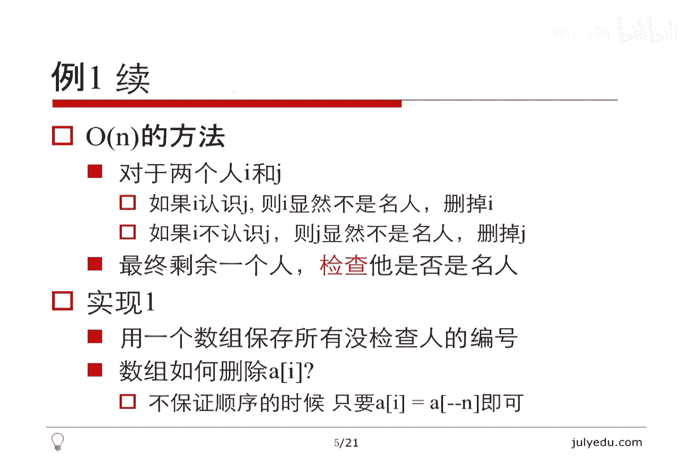
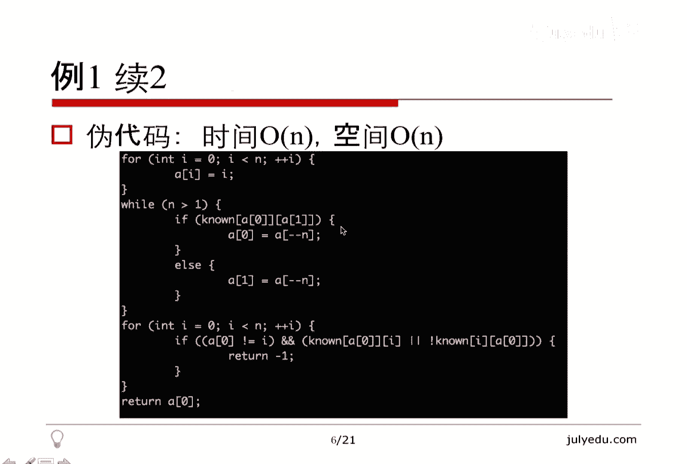
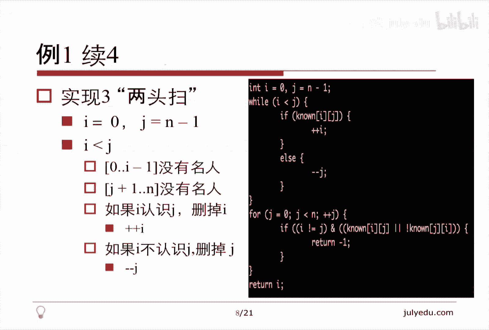
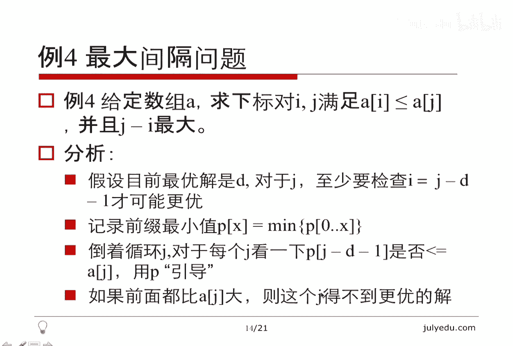
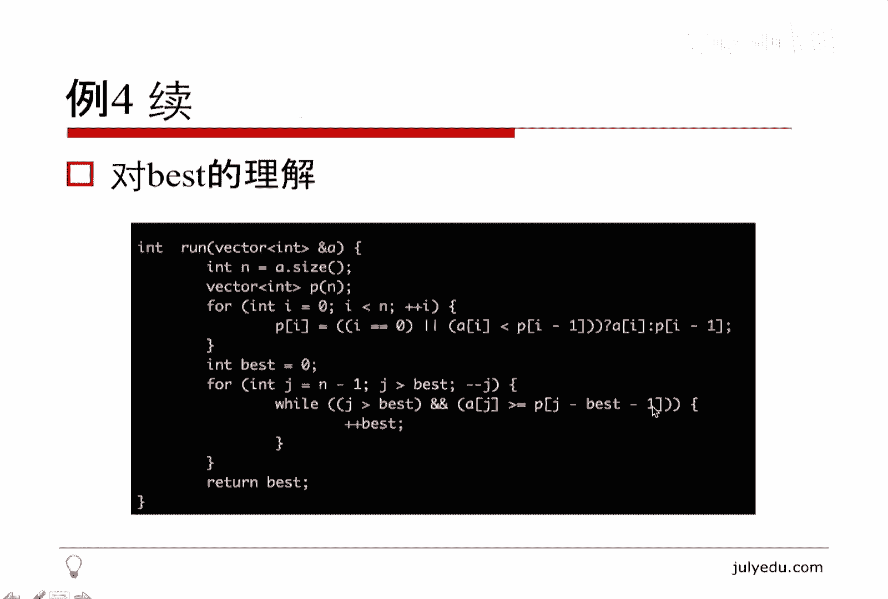
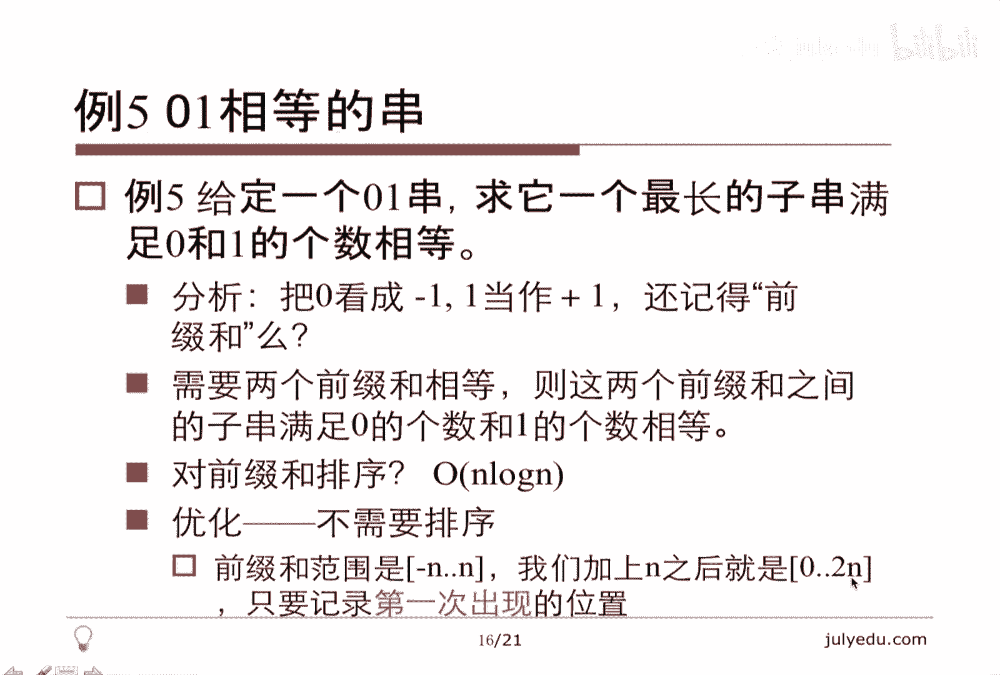
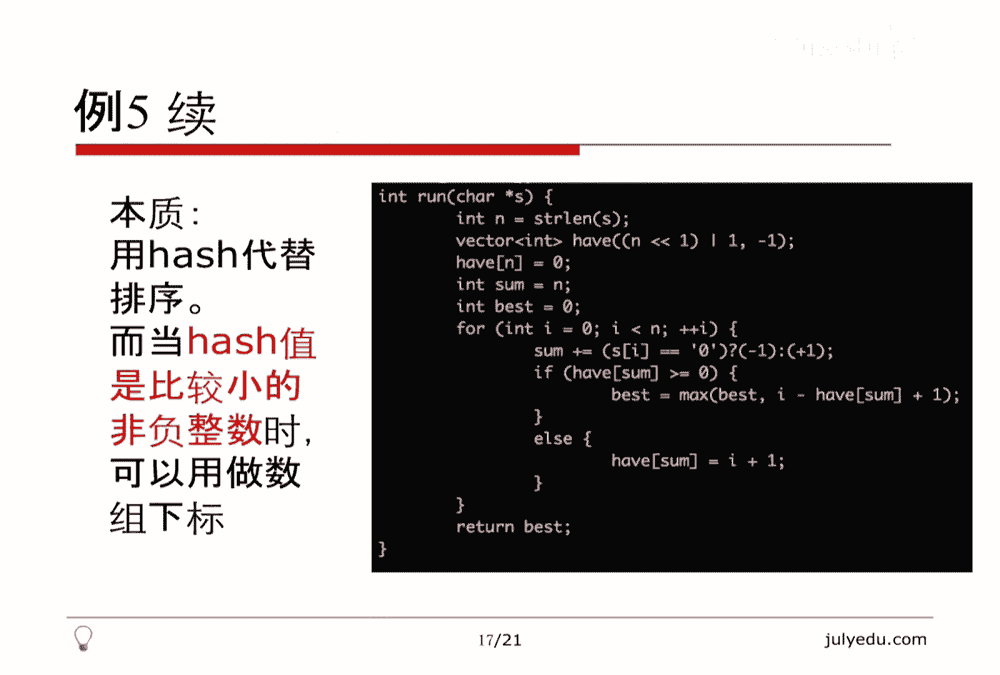
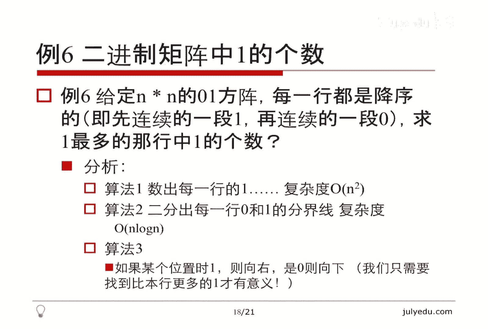
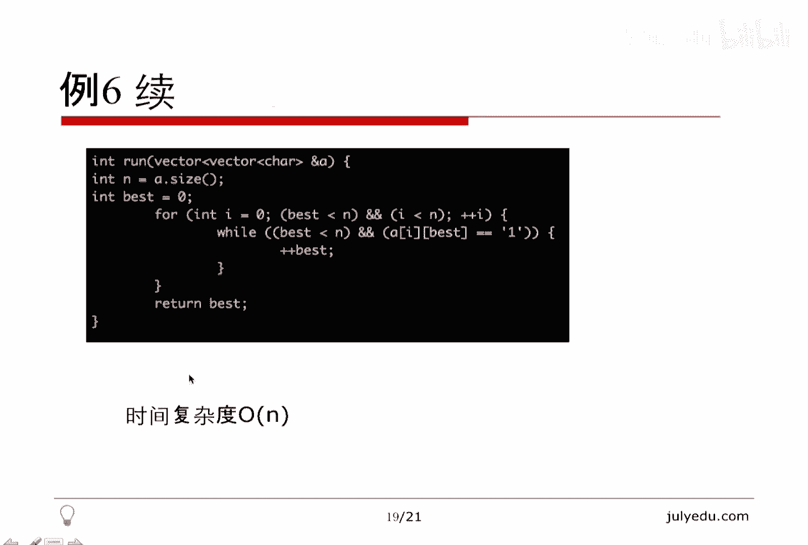

# 人工智能—面试求职公开课（七月在线出品） - P1：O(N)时间解决的面试题(上) - 七月在线-julyedu - BV1Xf4y1r74s

欢迎收看7月算法公开课。我们这堂课的主要内容是ON时间能够解决的面试题上因为题目比较多，我分了两部分来解决。那我将从如下几个方面讲述本课，先讲一下简介，再讲6个例题，最后总结结束本课。

本课其实例题是最重要的。我们来看一下简介。就是问一下ON是什么东西，注意N是什么？N是问题的规模。我们需要考虑，比方说如果输入是一个图的话，N到底是节点还是边。因为如果图比较稠密的话。

也就是说边比较多的话，那么边是节点的平方的级别的。所以如果我们认为这个ONN是边数的话，那其实对于节点数来讲，它已经到N方了。所以我们必须要注意这个自变量是什么东西。

我们说的线性是针对于什么输入是线性的。通常情况下，我们应该认为图的节点是N边是N方的这种级别。所以大家一定要注意，不要说这个题ON就完了，要注意这个N具体是什么东西。

那方法上其实ON最简单的理解就是扫一遍线性的嘛，循环N次，其实还有很多其他类型的，比方说两头扫，这个也比较常见。然后呢，虽然是双重循环，但是内重循环里面循环变量不减小。

也就是不是说每次内重循环都是从零循环到I或者从零循环到N的，而是。它不减小，它不断的再往上加这样虽然是两个循环，它也是ON的。所以对于ON的理解并不是简单的数一下循环个数就完了。

还要看一下它真的总体上循环多少次。😊，那对于。队列和对战我之前也提到过，他有单调的队列和单调的对战。我们利用这种单调性可以巧妙的把复杂的问题变成简单的问题。

这种可以做到ON时间完成我们之前似乎做不到的事情。所以这个是总体上的一个简介。我们下面就可以来看具体的问题。第一个提是，名人问题，也叫社会名流问题。他说的是什么呢？输入是N乘N的一个矩阵。

连接矩阵表示A和B是不是认识，也就是它的第I行DJ列表示I是否认识J。如果I认识J。就是一I不认识这就是零。当然我们可以把它理解为一个二进制的矩阵，或者说理解为一个布尔的矩阵。

而是对角线上的元素我们可以不关心，就是对于自身认识不认识自身这种问题，我们不关心。😊，那。告诉你这个矩阵不是对称的什么意思呢？就是A可能认识B，但是B不认识A。

也就是A认识不认识B和B认识不认识A没有必然的联系。所以他不是一个无像图。换句话说，他是一个有向图，A到B有边，不一定B到A有边。那么我们怎么定义什么叫名人呢？名人就是他不认识任何人。

就是这些人他一个都不认识。那除他以外的那些人呢都认识他，那么这样的一个人，我们叫做名人，给你这个矩阵，请你求出来所有的名人，注意是求所有。😊，其实这个问题这个所有也是吓唬人的。我们可以想一下。😊。

最多能有多少个名人存在。当然有可能没有名人，就是每个人都认识其他的人，那就没有名人嘛。所有人互相都认识，那显然就没有名人。那最多其实也就只有一个名人。大家可以想一下，如果有两个名人的话。

你可以想一下他们互相认识不认识。如果有两个名人A和B。那如果A认识B的话。那显然。这个A就不是名人，因为A不能认识任何人嘛。那A不认识B的话，那B就不能是名人，因为名人要被所有人都认识。

所以这个求所有名人完全是吓唬人的，最多也就只有一个名人。啊，最笨的办法，显然我就是看对每个I看一下JI是不是认识J。如果不认识的话，看一下J是不是认识I，反正就用这个定义来看嘛。I不认识所有的人。

并且所有人都认识他，那么它就是一个名人，那这个算法的复杂度是N方的。因为两个循环嘛，直接那样循环的。😊，那我们今天的主题是ON的，我们看一下有没有更简单的办法。其实刚才已经说了。对于两个人来讲。

I和J如果I认识J的话，则I它显然不是名人，因为名人不能认识其他人嘛，那这个I就没有意义了。我们可以删掉I。那如果I不认识J的话。那J显然不是名人，因为名人要被所有人都认识嘛。所以无论I认识这也好。

挨不认识这也好，我们都可以扔掉一个肯定不是名人的人。那这样不断的扔下去，最后就剩下一个人了。我们看一下。这个剩余的人他是否是名人，这个就用定义看一下，最多循环N次嘛。所以这个算法的时间复杂度是ON的。

当然我这个算法的描述其实可以理解为是一个自然语言描述的算法，它还是有一定的模糊性的。我们可以看一下后面有几种实现，说的都是这一个意思。我们看一下最简单的。😊。

这个实现我们用一个数组保存没有检查过的人的编号。那刚才说了I和J。如果I认识J的话，删掉II不认识J的话，删掉J。我们关键是怎么从这个数组里删掉一个元素。那删掉一个元素。

显然我们可以采取这种插入排序式的那种方式，每删掉一个把后面的元素都移过来。但是这样的话，每删掉一个元素都要有ON的时间复杂度，我们看看有没有简单的办法。因为我们这个数组是当做一个列表。

或者说当做一个无序的集合来用的。所以它里面元素的顺序，我们并不关心，我们不需要保证它是由小到大还是由大到小，它是乱序，对我们来讲没有任何影响。反正所有没有检查人的编号都存在这个数组里了。

那么我们不保证顺序的时候，如果删掉AI其实有一个简单的方法，我们就把N这个表示数组的长度，我们就把N减一那个元素拉过来。😊，这样的话，AI这个元素就没了，并且数组长度缩短了一。

那最后一个元素放到了第I个位置。所以这么简单的一个操作就把AI删掉了。当然这样显然保证不了顺序，因为这个把最后一个元素拉过来的话，顺序就变了。但是我们只实现删除AI这个操作的话，这样就可以了。

那我们看一下这个怎么实现上面说的这个ON的算法。😊。

大概是这个样子。AI等于I当然我下标是就是编号从零开始0到N减1嘛。然后如果N大于就是剩余的多于一个人的话，我们就看一下。看一下A0和A1，因为它多于一个人，A0A1都是有意义的那如果A0认识A1的话。

刚才说了，把A0删掉，A0删掉就这么删。否则的话呢，A0不认识A1的话，就把A一删掉，就这么删。这样每次循环一次的话，N减小一。最后N变成一的时候，数组里其实只有A0了。我们再检查一下A0。😊。

是不是真正的名人，所以再循环一下，是的话就是A0。不是的话，我随便返回了一个-1。所以呢这个算法很简单，时间复杂度ON空间复杂度也是ON。因为这有一个数组大小为N的数组存在，所以空间复杂度在这摆着了。

😊，那这个循环每次N减小一嘛，所以这是ON的，下面也是ON的。那么我们再看一下。

有没有别的办法再优化一下，刚才那个虽然时间达到了ON空间它也要有ON了。我们看一下能不能把空间优化成常数空间呢，也就是所谓的O一空间呢。我们看一下。我们不用数组来做，还用那些数。我们维护一个什么东西呢？

从一头扫，就是IJ一块扫，怎么扫呢？我们保证I小于JI始终小于J，并且呢0到I减1是没有名人的I到J减1。也没有名人。那么我们看一下这个I和J之间的关系。这个先维护I等于0，这等于一，这是初值。

如果呢I认识J的话，那么I显然不是名人。我们把I等于JJ等于J加1。如果I不认识J的话，那么J显然不是名人，我们直接把J等于J加一。所以I和J始终是可能是名人的这两个人。然后我们根据判断。

是决定一下把I扔掉还是把J扔掉。如果把I扔掉的话，J保留，那么I就变成了旧的J。J呢自己加一就可以了。否则的话，I不扔掉，I还是原来的IJ自己加一就行了。这个算法写出来也非常简单。就是这样。

如果I认识JI等于J，因为我们要保证I小于J，注意这等于J加一就在这里写了。因为无论如何这两种情况都是这自身增一，所以我就写在循环上了。这个显然也是一个ON的算法。当然最后因为超出循环的时候。

J是大于等于N的，所以最后我们只能看一下I是不是名人就可以了。因为最后剩的一个人就是I。😊，这个是。第二种实现还是刚才那个算法，只是实现的方式不一样。我们把空间优化到了常数，我们看一下还有没有别的办法。

还有两头扫的办法，怎么扫呢？其实跟刚才说的一样。😊，I是0，这是N减1。我们同样保证I小于J，保证呢I之前没有名人，J之后没有名人。那么I和J是可能是名人的这两个人，我们还是这样，I认识J的话。

删掉I删掉I的话，我把I加一就可以了。相当于左边一个区间没有名人，右边一个区间没有名人，两个指针往中间靠I不认识这这的话，我们把J减一就可以了。所以这个算法实现出来是这样的。这个显然也是一个ON的算法。

因为I和J。要么它加一，要么它减一，总共循环了N次，当然最后还是要检查一下这个剩余的那个东西是不是名人。因为这个最后剩余的时候是I等于J的时候剩余的。所以我们看一下I就可以。当然看J也是可以的。

我们用另外一个变量做了循环变量。所以这是一个非常简单的题目，我们从ON时间的算法出发，做出来1个ON空间的算法，进而优化成了常数空间，所以只要思考一下，还是有办法做优化的。我们再来看第二个例题。

这个是li code上第42题。😊。

他说的什么意思呢？给你一个数组，这个数组里面表示的是这个数轴上每一块的高度，这个块就指的是黑的。比方说这个图对应的是零，这没有东西，一这个黑块高度是一，然后又是0，然后二这个黑块高度是2，然后又是一。

😊，零就继续看下去，这是一，这是三，这是二，这是一这是二，这是一。然后呢，我现在下雨，下雨之后，显然这左边没有东西，这积不了水，这左边这个外这不能算左东西，是空的。所有有块的地方都能积水。

这种蓝的就是水，问你一下，我最后能积多少水。那这个问题的关键其实是说，每一块儿。我指的一块是数值的这么一块，就是每一块这个呃长度唯一的线段，它能积水的高度其实等于。

它左边的最大值和右边的最大值里面较小的什么意思呢？这个零记不了。这个一它是积在左边的最大值，包括本身是一。然后右边的最大值无论是多少，当然这个右边显然是个三嘛，但是和一本身取最小。

所以这块连水算上最多也就能记一。那么这块呢，它左边的最大值是一，右边最大值是3，反正无论是多少比一小，所以它最多能记一，这块也一样记不了。这块呢。😊，左边最大值是2，右边最大值我指的左右是所有的。

右边所有最大值还是3，所以取小了。所以这块算上块儿在水的高度一共是2，这块一样，左边到2右边到3，所以还是2。所以这个问题就变成了求每一块左边的最大值以及右边的最大值里面较小的值这么一个问题了。😊。

那这个问题其实我在讲数组的时候，讲到前缀和的时候，其实它本身不是前缀和了，它是前缀的最大值以及后缀的最大值。这种东西我们显然能够在ON的时间内得到。😊，我们看一下。

我这样得了left就表示左边right就表示右边。那leftI就表示从零到I的时候，最大值是多少。那么显然最大值要么是I减1，要么是AI这两个取一个较大的。当然I等于零的时候没有I减1，所以有一个。😊。

特殊的判断I等于零的时候，left安减一是没有E的，右边也一样，要么是rightI加一，要么是AI，这个实际上就是所谓的前缀的最大值，这个呢就是所谓的后缀的最大值。那么刚才我说了。

对于第I块能积的水是它前缀的最大值和后缀的最大值里面较小的。😊，所以这个是连水在是这个AI本身的那个高度。那如果我们只算水的话，再把AI减去。这个显然这两个东西显然都是大于等于AI的。

因为我们这个left的I至少要等于AIrightI也至少要等于AI，所以这个不会减出负值来。那么最后我们把这个东西返回去就行了。所以这个问题也是比较简单的。显然它的时间复杂度也是ON的。

就是三个N的循环嘛，所以它也是ON的。😊，我们再来看。这个问题比较有意思。lead code上第十一题，它是说跟刚才那个问题意思差不多。他是说。😊，给你一个数组，AI呢表示。

X等于I就是数轴上X等于I那个点有一条竖直向上的长度为AI的线段。然后呢，两条线段之间再算上X轴，把X轴作为底部的话，两条线段之间就形成了一个U型的东西。问你这个U型的容器。能成多少水。

或者说哪两条线段之间的容积最大，什么意思呢？它的本质就是求AIAJ当然假设J大于I就是呃左边是AI，右边是AJ它能积多少水呢？它积水的高度显然是AI和AJ里面取最小的。那么它的底有多少呢？

底就是J减I嘛，就是X轴上的长度，这两个一乘就是它的面积也就是它能积的水的。😊，多少？那么我们实际上是想要求这么大一个东西，我先给算法再给一个简单的证明。😊，这三反非常简单，还是用所谓的两头扫的策略。

😊，I，从第一个开始，或者说从第零个开始，J呢从N减一开始。那么best就表示我目前得到的最大的容积。那我要保证I小于J，这个是维护条件，或者说可以把它理解为一个well whileI小于J。

我就要继续做做什么呢？做就做这个东西。这个东西其实就是这个式子。AIAJ取最小乘以J减I。那关键是这个如何更新。如果AI小于AJ就把I加移，否则就把J减1。实际上这也是一个两头扫，要么I加一。

要么J减一，它移动的实际上就是较小的那那边AI小的话，就把I加一，就是相当于把左指针往右移1个AJ小的话，就是J减一，相当于把右指针往左移移个。😊，我们来看一下这个算法很简单，为什么是对的。😊，啊。

先看一下它的实现。这个就是实现其实没什么好说的了。I等于0J等于N减1。然后I只要I比这小就不断的求这个东西。这个就是刚才的AIAJ然后乘以J减I，然后较小的那边往前移动一下，要么加加，要么减解这。

最后把它返回去。😊，为什么是对的呢？注意要证明呢，实际上是算法一定扫过最优解。我把这个扫标红了，什么意思呢？这个算法显然没有枚举所有的I和J，因为所有的I和G有N方个，或者说CN2个嘛。

就是2分之N乘N减1个嘛，但是它只枚举了N个。😊，呃，关键是我们每举这个N个一定包含一个最优解就可以了。我没有必要把所有都枚举了。那我们看一下。有一个关键点就是如果有一边，假设自由解是一个I一个J。

我们有一个关键点是，如果有一边已经移动到了自由解那儿，那么另外一边显然还没到，我们的意思是有一边先移动到了自由解那边，那么另一边还没到自由解，那么没到自由解的那个高度，一定比自优解。

里面较低的那条边还要低，什么意思呢？我们可以想象一下，假设较低的那边先到了最优解。😊，那么我们较高的那边还没到。如果较高的那边。目前比较低的那边还高的话，那么它们两个曲面显然是较低的那边，再乘以底。

因为它还没有到自由解，它的底在X轴上的宽度更宽了。那这个明显比自由解优，因为我们短的那条边没有变，底边更长了，那它容积显然更大了。那这个是矛盾的。😊，那么反之假设。长的那条边先到了最由解。

那么短的那条边，假设目前比。自由解的短的那边高，其实还是一样。这两个曲面的话还是比自由解短的那边高。那乘以它的X轴上宽度容积还是更大了。所以无论哪一边线到自由解，我们都能证明。😊。

其余那边的高度比自由解里面较低的边低。那这有什么意义呢？这这个意义就是说。它比较低的边低，它显然比那个已经到了最优解那条边低。那么它比那边低的话，按照我们的算法那边低就移动那边。

所以最优解那边就固定住不动了。另外那边因为一直在比它低，就不断的移移动到最优解为止。所以比方说我们假设I先到了最优解。根据我们这个关键点，J一定比I要低。并且一直比I低。

那么我们就不断的把J朝着I这边移动，最后会移动到最优解，所以这个跟to sum的证明差不多，凡是这种两头扫的证明，我们都可以假设有一边先到了最优解。然后另外那边。😊，还没有到最优解，没有到最优解的话。

根据我们的算法，一定是到了最优解那边不动，没到最优解那边不断的朝着最优解的方向移动，最后肯定会扫过最优解。这个就是一个简单的证明，大家仔细思考一下，为什么这个结论是对的，这个是关键。

主要是X轴上的宽度更更宽，如果再比自由解高的话，那么自优解就不是最优解了。所以这个是一个证明，大家仔细思考。😊，我们再看下一个例题。这个也比较有意思，叫做最大间隔问题。什么意思呢？给定一个数组A求。

下标对儿I和J满足AI小于等于AJ，并且J减I最大。当然J减I肯定大于等于0，因为这可以等于I嘛，等于等于零肯定没有问题。所以J减I一定大于等于0。😊，那我们看一下。我们假设目前自由解是D。

这个自由解指的是J减I，就是它们两个之间的最大的差值已经是D了。那我们对于这来讲。我们至少要看一下这个I等于J减D减一才可能更优。因为我们要让J减I最大，我没有必要看，就是比这个间隔还小了。

就是I大于J减D减1，这种I我们都没必要看。因为即使满足AI小于等于AJ。那么J减I也没有现在这个D那么大，我们的目标看一下能不能让这个J减I大于D才对。所以我们至少要检查J减D减1。

那这样就提示我们要不断的缩小I对于一个J来讲，我们要缩小I，我们看一下怎么缩小。😊，我们记录一下前缀的最小值，这个和刚才讲积水的那个问题是一样的。PX。表示。0到X之间的最小值。

那么我们看一下倒着循环J，对于J，我们看一下AJ是不是小于等于PJ减D减1，相当于用P做个引导。什么叫用P做个引导呢？因为我们不知道I再继续减小，还能不能满足这个条件。但是我们用这个就能看出来。

如果这个东西因为这个东西是反映了它前面的最小值。如果这个东西比AJ小证明还有前途，因为再往前移，我们肯定能移到一个比AJ小的。因为这个东西是前面的最小值。

相当于我在这个点我已经知道它前面有没有比AJ小的了。所以这个PJ就起到了这么一个作用。这个东西告诉我们那个I之前还有没有比AJ小的。如果有我们就继续移动。如果没有的话，当前的J减A就是一组可能的解。

那如果就像我刚才说的，如果这个东西大于AJ的话，就是说明前面所有东西都比AJ大，那这种I对这个J来讲，再往前的那些I就没有意义了。因为不可能有这满足这种条件的。因为它存的是最小值。

也就是如果最小的都比AJ大的话，那么I之前的那些东西都比AJ大。那这个J我们就无法得到更优的解，看一下代码还是非常简单的。😊。

这个PI就是我刚才说的那个PX的那个定义，且X项的最小值。😊，我们看一下白色的先等于0。J倒着循环注意这要大于best。因为我们我们要看的是J减best减1。这个best就刚才那个D要看的是J减D减1。

如果。AJ比这个东西。大于等于这个东西的话，那么我相当于那个I还可以更小I更小的意思就是best可以更大。那如果这个AJ比它都小了，说明之前的全都比它小。那么这个J得不到最优值，我们换一个J继续看。

那这个算法为什么是ON的呢？看它有两个循环，显然是ON的，为什么？因为就像我刚才说的内层循环并不减一直在增大这个best始终在增大，这个J始终在减小，并且我们循环条件是J大于best。

所以best和J一共循环了N次，所以不能光看循环的个数还要看他们一共循环了多少次，这个才是算法复杂度的本质，不能光属循环的个数，那最后bs就是解，请大家仔细理解这个前缀最小值的含义。

因为这个东西指导了我们还能不能增大这个间隙。如果不能增大了，我们就换J如果能增大，我们就一直增大。所以这个东西是很有意义的一个东西，它反映了前面的最小值。😊。

我们再来看第五个问题。给定一个01串。求它的一个最长的子串，满足这个子串中零和一的个数相等。什么意思呢？就是从零一串里面截出来一段，这段尽可能长。这段里面零和一的个数相等。那显然我们可以每举嘛。

我每举一个起点，每举一个终点，再数一下01的个数。那这样就是N3次方的这和最大指数组合很像，这个是N3次方的算法。那如果我们稍微优化一点，每举一个I，在每举G的时候，同时算一下零和一的差的话。

这是一个N方的算法，我们看一下ON的算法是怎么样的。😊，我们把零看成负一，把一就当做正一。还记得我们之前在数组那节课里面讲的这个前缀核嘛，其实这个就是一个前缀核。一个子串里面零和一的个数相等。

意味着什么？意味着这个子串里零的个数和一的个数的差，或者说把这个子串按这个规则，零看作负1一看作正一这么求和加起来的话，这个子串里面的和是0。那么和是零就证明了两个前缀和相等。

因为前缀和就是中间一段的和等于两个前缀和的差。比方说呃X到Y的和，其实等价于从零加到Y减去从零加到X减1，所以X到Y的和相当于这个。😊。

X到Y这个前呃0到Y这个前缀和以及0到X减1的这个前缀和的两个前缀和的这么一个差。所以前缀和是嗯总和是0，意味着两个前缀和相等。那么如果我们把前缀和都算出来，算前缀和很容易，遇到零就减一。

遇到一就加一嘛，把所有前缀和都算出来，我们排个序，对前缀和当然可以做排序，N logN等，因为有N个前缀和，排序之后相等的在一起。😊，我们求相等的最大间隔。就是比方说A1和A5相等。

那么5减1就有一个长长度为四的这么一个子串了。那么这个显然已经被我们优化成N和N了。我们看看能不能做到ON。其实我们不需要排序，为什么不需要排序呢？因为前缀和的范围是负N到正N，这里面数很特殊。

每个数要么是正一，要么是负一嘛，全是负一的话就是负N，全是正一的话就是正N，所以前缀核的范围是这个这个范围很好，我们把它加上N之后。😊，就变成00到2N了，为什么要加上N呢？因为我们不想让它出现负数。

那变成0到2N了的话，我们只要记录这个前缀和第一次出现的位置就可以了。因为我们无非就是要找两个相等的前缀和的这个间隙，两个相等的前缀和只有第一次出现和最后一次出现有意义。因为只有这两次出现的这个差值。

或者说这个长度才最长间隙才最大，所以我们只要记录第一次出现的位置就可以了。😊，那么我们怎么记录这个东西第一次出现的位置呢？显然我们直接用一个数组记就好了。-一表示没出现，0到N减一表示出现了。

这样就可以了。所以我们实际上是用一个数组记录这些东西出现的位置。我们来看一下代码。😊。

首先求一下长度，这个就是N乘以2加1，因为是0到2N嘛，所以数组要长一点，N乘以2加1，因为下标已经到2N了，之为-一-一表示没出现。然后这个前缀和是0，因为我们都加上N，所以我们这里面写N。

其实这个就是0s呢其实也是0，我们弄成N。这个因为都加上N了，这个表示零出现的位置，长度为零的出现位置。因为前缀和要加一个嘛，长度为零的出现位置在零出现。那么这best就表示我们最后的结果，最后的长度。

关键在这儿，这就是我们在算前缀和，遇到零减一遇到一加一，这个其实就是前A项的和。当然我们已经偏移了N了，所以零就是N嘛，所以这时候已经不用再加N了。我们看一下它出现没出现，大于等于零表示出现过。😊。

大于等于零的时候，我们就求一下这个相当于这次出现和第一次出现的间隙。当然我们需要记一下最后一次在哪出现，但是我们可以就是用这个的话就不用记，因为每出现一次我们都算一次。😊。

这里面只记录第一次出现的次数和位置。那么这个差值注意这个差值是I加一减have some，因为这边是0，我这个出现的位置是I加一，并不是I，所以这个是可能的子串长度。

因为相当于这个第I位呃第I加一位的和第have some位的这两个强缀还相等。那么它们的长度或者说间隙就是这么大。那否则就是小于零的话表示没出现没出现，那显然这个就是第一次出现，我把它质上。

最后返回最长的就好了。那这个问题的本质，其实我们是用哈希代替了排序。之前为什么要排序？我们想把相同的前缀和放到一起，那现在我们没有排序，是因为我们记录了相同的前缀和第一次出现的位置。

所以我们用一个哈希代替了排序。而当这我标红的哈希的值比较小，并且是非负整数的时候，像本题是零到2N之间，它比较小，因为是N级别的，并且都是非负整数。那么我们可以直接用数组下标做哈希。

其实这个s就是一个哈希函数的东西，只不过我们直接把它放到数组下标里面来了，它的范围比较小，我没有必要对它进行变换。所以我们直接把数组当哈希使用了这个数组下标就是哈希函数的值，这个是我想讲的。

在某些特殊的情况下，我们可以用数组当做哈希达到降低时间复杂度的作用。😊。

我们来看最后一个例题。这个也是最近发现的一个面试题，什么意思呢？给定一个N乘以N的01方阵。因为这个N乘N嘛，显然它是方的，每一行都是降序的？什么叫零1方阵？每一个。元素要么是零，要么是一。

每一行都是降序的意思就是每一行里面先出现连续的一段一，再后面都是零，都是先一后零的。但是一有多少个不一定，但无论如何都是先一后零的。那么我们求。😊，一最多的那一行就是最多的那一行有多少个一。

就这么简单的一个问题。😊，关键是能不能ON做到，显然ON方式可以做到，我们直接每一行数一下嘛，便利整个方阵第一行数一下，第二行数一下，这显然是一个N乘N的时间复杂度。那。😊，因为它给了我们是先一后0。

那么这个显然是一个有序的东西，我们可以二分对每一行二分二分出零和一之间的界限。那分出这个界限，我们就知道每一行有多少个一，所以时间复杂度是Nlog N的。因为每一行二分的复杂度是logN行嘛。那这个呢。

😊，就利用到这个序了，但是它还是数出来每一行有多少个一。其实我们没有必要数出每一行有多少个一。就像刚才算那个容器的最大的容积一样，我们没有必要每举搜有的容器。

我们只要保证最优解能覆盖到这个我们搜的那个解能覆盖到最优解就可以了。我们来看一下。假设我们在某一行某一列的位置，如果它是一，就说明我们至少有这么多个一了。因为一都是连续的嘛。比方说第一行第五列是个一。

那么我已经知道第一行至少有5个一了。那下面那行有4个一也好，有三个一也好，我根本就不关心。我只要看后面那行可不可能大于5个一就可以了。那么如果是一的话，我就继续向右找到第一个零，这样的话。

这一行有多少个一，我就知道了。那如果是零的话，我就向下，因为是零的话，我知道上一行到此为止，上一行或者说这一行只能有这么多个一，比方说有5个一，第六个是零，那么我们向下看一下这个下面一行第六个是不是一。

如果下面一行第六个是一，我就知道下面一行至少有6个一，它已经比上一行优了。如果下面一个还是零的话，那么我们继续往下。所以。😊，我没有必要数这一行究竟有多少个一，我们只要知道最多的那一行有多少个一之后。

目前为止最多的那一行有多少个一之后，我们往下走往下走。如果还是一的话，我们继续往右。因为因为一都是连续的嘛，我们往下走，如果还是一的话，说明这一行的一的个数比我目前知道的最多的还多。那么显然要往右走。

看看能不能更多一点。如果是零的话，说明我这一行的一的个数显然没有我目前知道的最多的那一行的一的多，所以我也没有必要往左看它有多少个一，所以这个有点像杨氏矩阵的查找。

我如果发现零就知道目前为止最长的那一行有多少个一了。我就从这一列往下找。😊，直到找到一再往右就可以了。如果都是零的话，显然就没有必要往左走了。因因为那些是零的。

肯定没有之前我们得到的最由解的一的个数更多。我们来看一下这个算法，非常简单。

best就是说我目前。知道最多有多少个一了。那么B的小于N，因为最多也就N个一嘛，B小于N，并且I小于NI就是行。我们看一下。如果AIb的还是一的话，我们就bis可以加一，只要发现一。

这个相当于不断的往右走嘛。如果发现不了一了，说明我最多只有这么多个一了，我就往下挨加加了，我就往下看一下。再往下边那一行，是不是能找到更多的一，如果找不到，就继续往下走。所以这是一个非常简单的算法。

这个算法为什么是ON的？还是刚才那个道理，best在不断的增增到N就截止了I也是，所以最多也就循环2N次。尽管它有两个循环。所以这个时间复杂度是ON的，请大家仔细体会这个算法。😊。

那做一下总结，其实ON时间可以解决很多问题，我都没有时间没有讲出来。当然还有很多问题我之前也提到过，比方说最大指数组合，这个在实战里提到过KMP我们有视频讲过这个这个最长回文子串的算法也是线性的。

也也有视频讲过这个呃最大直方图。这个我在单调堆列呃单调堆战那张里面讲过，就是呃对战进而是单调对战里面讲过。然后滑动窗口最大值这个在队列以及单调队列那里面讲过快排的partition这个之前讲过很多字。

它显然是个ON的，有很多变种。比方说把正数和负数分开啊，把这个零和一分开啊，把呃星号和其他字符分开啊，都是这个过程，包括这个荷兰国旗问题。

这个也是这个firs missing positive就是给定一个排列是不是找出它第一个缺失的整数，这个这两个问题，我在数组那一张应该都讲过杨氏矩阵查找。我在这个呃查找排序实战里面讲过排列组合相关的。

这个没有提，我下次会讲一下，就是返回下一个排列以及上一个排列的这个算法，它也是一个ON的，它是一个非常美观的算法，数相关。其实我在数那一张还有递归什么的地方都讲过，比方说二叉数的便利啊，最大最小深度啊。

同构判断镜像判断，以及是不是平衡数啊，包括是不是二叉搜索数啊，反正反正凡是涉及到数的。😊，基本上都是ON的，为什么呢？因为它是特殊的图。这个图有N个节点，N减一条边。

我们便利整个数的时间复杂度就是ON这个和便利图不一样。因为便利图的时间复杂度是N加M，就是节点数加边数。对于数来讲，它是特殊的图，它特特殊就特殊在它的节点和边数是同一个规模的，都是N的级别嘛。

一个N1个N减1嘛。所以便利这种图，它的边那么少的图，它的时间复杂度就是ON了。所以我之前要提ONN是什么？一定要仔细考虑，对于数来讲，节点和边是一样的。对于普通的一般的图来讲，节点和边是不一样的。

一般我们会认为这个边数是节点数的平方，这个是对于比较稠密的图。😊，那最后就是还想说要多思考，多做练习，多想问题。因为这个ON时间的算法经常在面试里面出现，需要有一定的感性和理性的认识。好。

今天的课就到这里，希望大家给我提出批评、指正，谢谢大家。😊。

