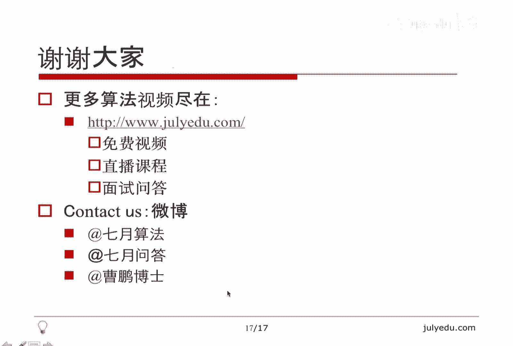

# 人工智能—面试求职公开课（七月在线出品） - P12：字符串高频面试题精讲 - 七月在线-julyedu - BV1Xf4y1r74s

🎼，大家好，欢迎观看7月算法公开课。我们本堂课的主要内容是字符串高频面试题精讲。我将从如下几个方面讲述本课。首先讲一下字符串方面的简介，然后总结一下近年来字符串相关的面试题的总体思路。

做一个知识点的梳理。接下来讲五个例题，最后总结结束本课。关于字符串方面的简介，英文是str，我们通常把字符串作为字符数组来对待java里面str是内置类型，注意这里面S是大写的，它是不可以更改的类。

要更改的话，考虑使用str bufferfferstr builder之类的类，也可以用它内置的to chair error的方法，把str转化成字符数组再进行操作。

那C加加本身自带的STD内库里面也有str这么一个类。它是可更改的字符串。😊，当然，我们也可以直接使用chair数组。在这里面使用str和ch数组本身在使用上差别不是很大，因为它可以更改。

我们可以通过使用中括号来直接取str里面的某一个字符的位置来直接更改它，所以在操作起来str和这个ch数组差别不大。C没有什么好说的，只有字符数组，因为它没有str类。值得注意的是有如下三点。

第一点是C加加里面关于字符连接符号，也就是加号这个运算符它的操作的复杂度。这个帮助文档说是未定义的。但我们通常认为它是线性的。所以我们在for循环里面有这个str的加法的时候。

要特别注意它的复杂度很有可能退化成N方的。比方说我们想建立一个从A到Z这么一个字符串。如果我们不断的使用这个字符串加法，先加上一个A，再加上一个B一个一个加上去的话，复杂度是26的平方的级别的。

如果我们用一个ch数组，先把第一位复成A，第二位复成B，如此下去的话，复杂度只有26这种级别。所以在使用字符串连接符的时候，它的复杂度我们需要特别注意。第二个是说C加加里面呃str类的自带的这个方法。

substr。😊，就是SUBSTR这个函数，它有一种形式是有两个参数。第一个参数是字符串的起点。第二个参数不是终点，而是长度。它的含义是我们从这个起点开始截取一定的长度的字符串作为子串。

所以它这个呃和其他的函数都不太一样。一般的字符串函数都是呃给一个起点，给一个终点截一个从起点到终点的这个字符串的长度。😊，所以这个。就这里面C加加的这个函数和其他的函数不一样。

java里面也有类似的sub string，它截取的就是从起点到终点。注意我这里面从起点到终点的意思是包括起点，而不包括终点的，也就是左臂右开区间的这么一个子串，这个看似相似的两个函数在它的表现形式上。

以及最终的运行结果上都是完全不一样的，有着不同的行为的定义。😊，那第三个值得注意的就是字符范围。因为C是和平台相关的。我们通常认为一个chair的大小是8位的，也就是-128到正127。

当然我们可以把它转化为ign的，也就是无符号的，就变成了0到255，这个是阿斯克玛的这个区间范围。对java来讲，它是平台无关的，并且它是unicode的编码的。所以它一个ch是16位的。

所以它比C和C加加的ch要宽，它的范围就是0到6535。我提这个的一个目的就是当我们想统计一个字符串中每种字符出现的次数的时候，我们通常不会用一个哈奇函数来做，我们直接把这个ch作为一个数组的下标。

我们直接统计每种字符出现了多少次。最后打出的是一张每个字符出现多少次的这么一张表。所以这张表我们需要有一个足够大的数组来存。那对于C和C加加来讲，我们通常只要开到25。😊，有数组就够了。java来讲。

我们需要开到6536，所以这点要特别注意。第二个呢就是对字符串的面试题的总体上的分析。首先字符串和数组是非常相关的，涉及到数组的题目都可以变化成设及成字符串的样子。所以因为数组应用非常广泛。

所以字符串的面试题也非常多，有一个重要的概念上的理解就是字典序字典序简单的来说，就是在英文字典里面，两个字符串，哪个排在前面，哪个字典序就小。我们通常可以把它扩展到整数类型的数组。

比方说两个int数组哪个字典序小。我们可以用类似的方式来判断。就是先比较第一个哪个小字典序就小，相同的话，再比较第二个如此下去，直到笔出字典序或者两个字典序相同。😊，当然如果前面一直相同的话。

较短的字典序小，这个是关于字典序的概念，它实际上是一个抽象的意义上的顺序的这种意思。另外就是关于题目，题目大概分了这么几类。第一类呢就是简单的操作，包括插入一个字符啊，删除一些字符啊，修改一些字符。

包括字符串旋转呃，通俗的说就是给一些操作，在字符串上做一些折腾。第二个呢是规则上的判断，就是给定一系列规则，让你判断这个字符串是否合法，比方说罗马数字和阿拉伯数字的转换。

然后判断一个字符串是否是一个合法的整数，这个就是C语言里面的A toI，我们需要考虑呢正负号非法字符呃，包括这个空白怎么处理等等。如果它合法的话，我们需要返回它表示的这个int值，非法的话。

我们有自己的处理方式，还有类似的浮点数，同样考虑小数点位置，考虑正负号，考虑空白，考虑科学技数法的表示是否正确等等。这一类也是一个比较大的类别。下面就是数字运算，在计算机里面字长是有限的。

所以我们想表示的整。😊，数的范围也是有限的啊，当然java里面有big integer。如果不允许用big integer，我们要实现大数的这种运算的话，一个常用的策略就是用这个字符串来模拟。嗯。

我们可以模拟成百上千位的这种大数的加法减法，甚至乘除这种运算。一个典型的题目就是二进制加法。它的输入就是两个01串。表示二进制，然后我们输出就是这两个串的和，输出也用二进制零1串来表示。

这个是一个典型的题目。在后面的类别呢就是排序交换，这个是和数组相关的。一个比较典型的过程，就是快速排序里面的排提ition过程，就是把比分区元素小的，放到一边，比分区元素大的，放到另一边。

这个是呃涉及到呃排序交换的一大类别。下面一大类别就是字符计数。刚才说了，我们通常不会自己写哈希函数，而是直接把这个字符放到数组下标里面，统计一下字符串的大小。每种字符出现的类别。那么。😊。

一个应用就是变位词，所谓变位词就是组成字母完全相同的词。比方说ABC和AB还有BAC等等，他们都是变位词。判断变位词非常简单，两种方法，第一种就是把这个字符串里面的字符，按照由小到大排下序ABC也好。

BC也好，CAB也好，最后排完了都是ABC那另外一种方法就是用到了字符的这种计数，比方说ABC就是一个A1个B1个CCBA这些都是一个A1个B1个C，所以它们是相同的。

后面会有一个例题涉及到了字符计数以及滑动窗口，请大家仔细考虑。在下面有一个比较大的类别，就是匹配这类问题呃通常不是很难有着固定的套路。比方说正则表达式匹配。这种表达式带有一些通配符，比方说点问号星号等。

这种通常是通过递归来匹配，还有全串匹配，或者叫子串匹配就是。😊，最简单的从一个串里面找到另外一个串是否出现。那么它最直接的解决方法就是呃暴力解决。当然，KMP是一个典型的串匹配的算法。

然后KMP还有另外一个应用，就是判断这个串是不是周期的。比方说如果一个串反复的出现ABCABCABC这样的串，它实际上是一个周期串。我们通过nex数组的性质，可以判断这个串到底是不是周期串。

这是一个比较大的类别。😊，另外一类就是动态规划。因为字符串本身就是数组嘛，我们动态规划有着经典的LRCS。😊，这个就是最长公共子序列，也可以说最长公共子串，我们都可以做。注意子序列是不连续的。

子串必须要连续。然后编辑距离编辑距离本身就定义在这个字符串，把一个变为另一个的最短操作数上，所以它也是字符串上的一个动态规划。还有一个就是最长回文子串，它有两个算法，一个就是朴素的动态规划算法。

还有一个是一个线性的最长回文子串算法，它们都是动态规划的一个典型应用。😊，我也把它作为一个大类别。最后一个就是搜索。因为字符串本身就是数组嘛，我们可以从N个元素中选M个元素做一下全排列。

也可以从N个元素中选M个元元素做一个组合。所以把它作为一个搜索。另外我讲了一个在BFS里面讲了一个单词变换的题目，它也是一个传统意义上的搜索题目。😊，下面是正式的例题。第一个例题。

我举它的目的是啊它是我最近看到的一个在线的笔试题。呃，它虽然比较简单，但是体现了对快排partition这个过程的理解。比方说啊把一个01串，也就是只包含零和一的串进行排序。你可以所做的操作。

只有对任何两个位置做一次交换。那问至少交换多少次才能把它排好序。显然排好顺序是呃零在左边一在右边这么一连串的01。😊，那熟悉快排的同学可能直接就会想到parttiition这个过程。

其实它就是这么一个过程。我们最左边的零和最右边的一是没有意义的，因为他们永远不会被交换，因为最后排好顺序也是这个样子。我们从左往右扫第一个一的位置，从右往左扫第一个为零的位置，扫到了我们就做交换。

然后继续扫就可以了。那这里面代码大家可以理解为伪代码，因为呃这个空间的关系可能这个风格不是很好，比方说分号没有空格啊，这个if服后面没有换行等等。但是呃是一个思路的体现。😊，啊。

answer就是我们要最终交换的最少次数，我们I从左到右扫J从右往左扫，始终考虑I小于J。那么如果AI等于0，也就是从左往右扫始终是零的话，我们就不断的加，从右往左扫始终是一的话，我们就不断的减。

如果这个时候I还小于J的话，就说明我们找到了一个左面的一和右面的零，我们把它们直接进行交换就可以了。这里我们当然没有必要真的进行交换，我们只需要记录一下交换的次数。交换之后，I加一J减1。

这就是一个partition过程，再强调一下它的线性的这个复杂度的这个推导。因为I始终在增加I从来没有被减小过，J始终在减小J没有被增加过I和J一共最多也就经历了Lance这么长。

所以它是一个线性的O lens的这么一个复杂度。所以分析复杂度不是简单的看有几个循环就可以了。尽管它有三个循环，它的时间复杂度是线性的。😊，这个是我对第一个例题的这么一个陈述。

那第二个例题是字符的替换和复制。就是给定一个字符串，我们要删除其中所有的A，并且复制其中所有的B。这里面有一个提示是说字符串这个数组是足够大的。言外之一就是我们的返回是用同一段空间保存这个字符串。

我们没有必要再新开辟空间，也没有必要再新的用另外一个字符串来表示结果，我们还用这个字符串。首先删除A比较简单。😊，我们直接看一下，如果不是A，我们就把它复过来，这样就把所有的A都删掉了。

因为这个N的增长比I的增长始终要慢一些。所以我们用N就是S本身这个N来表示这个就是新的S和旧的S都用同一个值是没有关系的。因为我们这个S的这个数组始终不会覆盖我们就是想要的那些值，因为N增长比较慢。

所以这步做完之后，这个S是把所有A都删掉的。这个新的S了。我们用的还是同一块空间。😊，然后呢，我在这里面统计了一下B出现了多少次，也就是nbe词，这个顺便统计了一下。

这是一个线性的这个删除A还是比较容易理解的。关键我们考虑如何复制所有的B复制所有的B有一个问题。比方说删除A之后，字符串变成了BC。我要复制第一个B，那么我会把C也覆盖掉，因为复制之后，C变成B了。

这显然不是我们想要的。那如果我还想保留这个C在复制B之前，我需要把C往右移一下，这样就有了一个类似于插入排序的这么一个过程。我每当要复制一个B的时候，我就要把B后面的这些字符都向右移动一下。

然后留出一个空位，把B填到这个空位，这是一个显然可行的方法。但是它的时间复杂度是N的平方的。😊，那我们有没有办法？在ON时间内完成这个复制B的操作呢，其实我们可以考虑倒着复制。我们来看一下怎么复制。

首先，新的字符串的长度就是N加nB，因为字符串长度是N，其中有这么多个B，每个B都要复制一下，所以新的长度就是N加numbB。所以我们知道新的长度，我们就知道新的最后一个位置的位置。

就是最后一个字符的位置就是I。那旧的最后一个字符的位置就是J，我们就一位一位把它复制过来。然后发现如果是B的话，我们就再多复制一个B就好了。😊，正是因为我们倒着复制，大概大家可以在纸上画一下。

就是因为倒着复制才会导致我们这个呃被覆盖的这些这些字符和这个旧的字符是没有重叠的。所以我们保证了原始的那些信息的正确性，所以不会有我们想要的那些信息被覆盖掉。😊，这个是一个倒着复制的经典策略。

其实在C本身的这种函数有一个函数叫做呃memory copy。它在实现呃有重叠区域的复制的时候，它采取的就是这种倒着复制的策略。所以它是一个经典思想的一个应用。😊，也是我举这个例题的一个目的。

给大家一个思考题，就是如何把一个字符串里面的空格变成20%。这里面20%并不是十进制的20，它是呃十六进制20其实是32。它是这个空格的阿克码。在网络传说中。

我们通常把一个字符串里面的所有空格转化成20%。这里同样字符数组足够大。请大家思考这个怎么做，其实也是倒着做一下，把空格的位置算出来，把新的长度算好，然后把空格变成02百分号就可以了。

所以这个倒着复制是一个经典的应用，我们来看一下第三题。😊，第三题其实是前两题的这么一个综合，它既有partition的过程，也有倒着复制的过程。我们来看一下，给定一个字符串只包含信号和数字。😊。

然后我们要求做一些变换，把星号放到开头，数字放到后面。当然这些数字不能变。我们可以考虑采取快排的爬itionition的方法。宽排partition的理解就是我们可以用循环步辨试来理解它。

所谓循环步面试就是一些布尔的条件。它在循环之前是成立的，然后在每一步循环保证它也是成立的。那么我们会知道它在循环之后也是成立的，这个证明类似于数学归纳法，因为每一步它都是成立的。😊。

那我们的循环不变式是0到I减一这个区间全是星号，I到J减一这个区间全是数字，这到N减一的区间全都是没有探测的字符。那么我们初始条件，I等于0，J等于0。那0到I减1实际上是零到-1，这是一个空的区间。

对于空的区间，我说它是什么都是正确的，所以这个是成立的。I到J减一是一样的，也是0到-一也是空区间，我说它是数字也是可以的那后面J到N减1是未探测，这是0，J到N减一的意思就是整个字符串。

我都是没有处理过的，这也是正确的。我们考虑。😊，对，每一个J为什么它也是正确的。因为当这是这个星号的时候，这是数字的时候，略过去，这是星号的时候，我们看一下它怎么做。我们把I和这做一下交换。

注意I实际上是最后一个星号和第一个数字的这个分界点，可以理解为它是第一个数字的位置。我们把第一个数字的位置和星号的位置，做一下交换，这样就把第一个数字其实变成了最后一个星号。

星号的区间就往右扩展了一数字的这个区间也往右扩展了。一我们下面通过一个例子来看一下为什么这个循环不变是是一直成立的。😊，我举的例子是星号01星号2、星号4。我们看一下最开始I等于0，J等于0。

原则就是遇到星号，就SJ和SI做一下交换。显然最开始是个星号，那么S0和SS0本身做交换交换完了之后，这个字符串是不变的。不变之后，I等于一。我们注意I的左边始终是星号。

因为这时候I等于一这个零的位置是星号。😊，字符串虽然是没有变化的。然后呢，这这增加一之后，这变成一这一的位置是数字零不变，这等于2数字一也不变。这等于3，我们发现又是星号，继续S1和S3做交换。

就把这个星号和这个零做了交换。这样开头是两个星号，然后变成了这个样子，并且I增加一变成2。我们注意R的左边是两个星号，所以I的左边始终是星号，I指向的是第一个数字的位置。

再继续这等于4就变成了这个二的位置，因为是数字，所以不变，这等于5，我们同样把S2和S5做交换，把这个星号和这个一做交换，就变成了这个样子，最后I等于3，注意I等于三的时候，呃，指向的是零这个位置。

它左边有三个星号，所以又一次印证了I的左边全是星号这个问题。😊，再往后，虽然J还在变化，但是它指向的都是数字，不会涉及到交换。所以这个字符号也没有任何变化了。

最终我们达到了信号在前面数字在后面的这么一个过程。😊，这个采取的就是交换的方法，维护了循环不变式，这是一个petition的经典应用。它有一个特点吧，就是说。数字的位置改变了，原来数字是0124。

现在数字是0214。所以数字的相对位置改变了，我们看一下有没有办法不改变数字的相对位置，达到同样的效果。😊，这就要用到我刚才讲的倒着复制的策略。我们把J也从N减一倒这来，我们倒着看一下SI是不是数字。

如果SI是数字，我就要它不是数字，不是数字就是星号，不是数字，我就暂时先不理它。这样的话呃，这 is的就是C的内置的一个函数，是判断SI是不是数字的，是就是一，不是就是零。如果是数字。

我就要它不是数字的话，我暂时没有理它。这样最后I是负一，I，最后显然是负一，I是负一的时候，J有可能还没有变成负一。那么我们看一下没有变成负一的那些位置，显然是因为多出来了那么多星号。

我们把开头复成星号就可以了。所以这个是一个变相的，倒着复制，它没有改变数字的位置。😊，所以它实际上是例一和例二的这么一个结合，既体现了一个petition的方法，又体现了一个这个倒着复制的方法。啊。

另外举这个例子的一个目的是说，在面试的时候，如果遇到这个题，我们可以问一下要不要改变这个数字的顺序。另外一点，如果不改变数字的顺序，我们只能使用这种方法。

因为快速排序的partition是所谓的不stabletable的就是不稳定的排序，它会改变那些数字的顺序。另外一点是说，如果。😊，题目要求我们只能通过交换来完成这个任务的话。

我们只能选用那个partition的办法。因为只有那个方法是通过交换的。这个方法二只是做了一些这个字符的平移，并没有真正的那个交换的过程。所以这是两个方法，各自的特点。那第四题就是子串的变位词。

举这个例子是想体现这个滑动窗口的思想。另外一个是体现统计字符个数字符种类的这么一个思想。它也是我最近看到的一个公司的最新的面试题，所以有一定的新颖性。嗯。

它题目是说给定两个串A和B问B是不是A的一个子串的变位词？变位词的定义。我们刚才讲过呃，举几个例子，比方说A是hello，那B呢比方说是LEL，这个是个 true，为什么呢？因为A有一个子串是ELL。

它和LEL是变位词，那B是LE，那这也是te，因为A还是这个子串ELL那如果B是ELLOA也有EO这个也是t。但是呢如果B是ELO。😊，这个就不是出了。

因为这个子串必须是连续的A没有一个子串由ELO这三个字符来构成。所以这个就是forrsce，屏目意思就是这样。我们的思想呢其实就是一个滑动窗口的思想。我们动态维护一个窗口，这个窗口在A上开。

假设B的长度是3，这个B的长度是4的，暂时不考虑了。那个思路是一样的。假设B的长度是3。我们看一下A开一个长度为3的窗口就是0到21到32到4。

也就是HELELR和LRO我们需要看这个每个窗口和B是不是一样。或者说每个窗口和B的这些字母是不是完全一样。如果完全一样，它显然就是一个编尾词的子串。关键就是问题是我们这个窗口在不断的往前滑，每划一次。

我得到的这个子串和B要比较一次所有的字符是否相等，我们有没有更简单更快捷的方式呢？思路还是这样。😊，那，刚才说了，我们可以用哈希的方法。😊，当然我们可以用字符的全部的类别。比方说C刚才讲到了。

用0到255，那java呢用0到6535的数组，我们用这么一个这么大的数组是可以的。我们同样可以暂且认为我们的输入字符串全都是小写的英文字母。

这样呢我们就用0到2526个这个位置来表示这26种字母就好了。我们看一下每个字母，也就是每个单词，这里每个单词是字母的意思出现多少次。我们来看一下。😊。

就是这一个循环BI减A就是把B里面的DI位变成了0到25中间的一个数。这是一个就是把字母和数字做成映射的这么一种惯用的方法。当然我统计了另外一个变量，叫做numbze。

就表示nm这个数组里面有多少个值是非零的那显然如果它加上之后等于一的话，说明之前是零，那么n zeroro加一这个循环做完之后。

最终达到的效果就是numb数组表示每个单词每个字母或者说每个单词出现了多少次。nzero表示这个0到25里面有多少个位置是非零的。这个值对我们来讲以后至关重要。

目前这个name的含义是B里面的所有信息都在numb里面了。我们来看一下怎么把A里面的信息也加进来。😊，我们我们的意思是说，看一下A中。每个窗口里面的字符种类，然后用B里面对应的次数减一下。

所以在减完之后，这个name么的含义变成了。每个字母。在B中出现的次数和在A中出现次数的差值。所以这个那么不光有了B的信息，也有A的信息，它存的是同一个字母，在两个。字符串里面出现的次数的差。

当然这里面A是取了一个窗口，B是取了全部的这个B字符串的全部内容。那么我们看一下第一个窗口啊，首先这里面提一下，如果lenance A比lenance B还小的话，显然是无解的。因为这个B是A的子串。

所以B的长度要小于等于A。如果B的长度大于A就没有解了。所以A我们可以截取一个第一个lance b的窗口，也就是从开头截这么长。😊，刚才说了，我要统计一下出现字符的每种字符的这个个数的差。那对A来讲。

同样我把一个位置变成0到25之间。然后刚才是B中出现次数，现在是A种，所以我要减一下，因为要算差。然后如果它等于0，我同样维护这个nzero。如果它等于零，说明原来是一，我把一个非零值。😊，变成了0。

所以非零值个数少了一。当然如果它是负一的话，说明人家原来是零，我把它变成了负一，我就把一个零值变成了非零值。

所以我在这里面namem就是呃字符串中每种字符个数的差和这个其中有多少个值非零可以同时的动态维护。😊，这样下来之后就是A的第一个窗口，就是A开头到lesssB减一这么长的这个。这个串和B是不是变位词呢？

我们就看一下nzero是不是0。因为如果那么里面全是零，这就证明了A里面的那个窗口的字符和B里面的那个字符都一样了。因为这个里面存的是差，如果不是零，就说明有正值，有负值。那显然这两个就不是变位词。

那这个第一个窗口就判断完了。关键我们看一下这个窗口是如何滑动的。😊，我们看一下。新的窗口是假设以I结尾，那么它的起点是I减LsB加一，那旧的窗口呢是以I减一结尾起点是I减Lsb。

所以是旧窗口向右移动一位变成了新窗口，它们中间那些位置其实是一样的，只是这个旧窗口的第一位扔掉了，就把AI减lansb扔掉。那把AI加进来，这是新窗口的最后一位，它是新的旧窗口里面没有的。

那我们怎么体现这个呃name中怎么扔掉AI减 lenssb怎么加入AI呢？一样的，我们先把这个C算出来，这个C还是0到25之间的这么一个这个是I减lan B，我们怎么把它扔掉呢？原来怎么做呢？

我们返回去就好了。因为我们原来是把这位减掉的？我要扔掉它的话，显然在那中把这位加上就好了。同样维护一下n zeroro的个数。因为如果它是一的话，说明它原来是零，我们把一个零变成了非零。

那如果它人原来是负一的话。😊，我们就把一个非零变成了0，这个同样是维护nzero的个数。我们怎么把AI加进来呢？一样的。😊，因为算的是个数差，加进一个字符，其实就把这个位减一就可以了。

同样维护一下nzero的个数。然后看一下，如果ninezero是0，就说明两个变位词是一样的了。那么它就是t这个I每移动一位就代表了这个窗口的，就是窗口的最后一位，也就是右端点向右移动了一位。

所以这个就是窗口向右滑动一位的过程。我们可以看一下这个算法的复杂度就是ON的，就是每移动一次，它是O一的，整个移动了N次，它的这个复杂度是ON的。

所以这个我们没有任何哈西操作完全是用的这个数组之间的这种加加减减的操作，就动态维护了这么一个滑动窗口的过程，解决了这个变位词的问题。😊，然后给大家留个思考题，就是lead code上第三题。

它求的是呃最大的这么一个窗口，窗口里面的字符没有重样的，也就是每个字符只出现一次最长的这么一个窗口，求这个窗口的长度，我们一样可以用类似的方法来解决。😊，那第五题其实就是呃翻转句子中的单词单词内容不变。

举个例子就是Im a student，我们翻转的时候变成了student a am，就是最后一个单词变到了第一个倒数第二个单词变变到了正数第二个。但是每个单词内部的字母顺序是没有变化的。😊。

我们用到的一个工具的函数，非常简单的函数就是我们把一个呃字符串从DI位到DJ位进行翻转的这么一个操作。其实就是如果I小于J，就把这两个位置交换，然后并且I加一J减1。如果指针I和指针J碰上了，就不做了。

相当于我以中心点为对称轴把这个从DI位到DJ位这段进行交换。我们用这个函数作为一个工具，显然这个函数的时间复杂度是线性的。因为只有一重循环，那这个东西有什么用呢？

我们看一下我们把I啊传给这个零把J传整个句子的长度减1，也就是我们把整个句子可以翻转掉。那这个例子，I'm student就转换成这样了，这样了，是吧。😊，每个字符都倒过来了。啊。

现在要呃这和我们要的不一样，我们看一下，再把每个单词单独翻转。😊，student翻转就成这个样子，呃是这样M翻回来，所以翻转两次就。😊，达到了我们想要的结果。第一次是对整个句子做一下翻转。

第二次是对每个单词做一下翻转。显然这个时间复杂度是线性的那它的难点在哪呢？难点在于，首先想到这个算法，第二个难点在于我们如何找到每个单词。因为对整个句子翻转是简单的。空格该该翻了也就翻了。

我们要找到单词的界限。其实它考的是一个隐性的这么一个split一个过程，就是我们要找到空格的位置，然后空格之间，我们认为是个单词，把这个界限确定好，通俗的说就是把这个I和J确定好，我们传一个IG过去。

它就翻一个单词，最后就达到我们想要的结果。😊，那我们再看一个思考题，就是字符串循环移位，这个也是一个比较常见的题。比方说ABCD。😊，我移动一次就变成了BCDA就把第一位放到后面去了。

移动两位就变成了CDAB就把B又放到后面去了，移动三位就变成了这个样子，移动4位又回到了ABCD。所以一个结论，一个显然的结论就是长度为N的字符我如果移动M次的话，其实相当于移动了M对N取一次。

再多移动其实没有意义。因为它最多只能移出这4种样子来。因为它是循环的转着圈移动的那。😊，这个是怎么实现呢？如果我想移动M次的话，怎么实现呢？我们先对前M位翻转，这里假设M小于N，所以取余不取域是一样的。

我们先对前M翻转，再对后N减M位翻转。😊，就可以达到。一个目的就总体再翻转一次就可以达到我们这个题的目的。我们看一下对这个前M位和后N减MV翻转达到一个什么效果。比方说我想对它移动两次。

我对前两位翻转就变成了BA。😊，我对后两位翻转就变成了DC，所以这个串就变成了BADC它恰好是这个串的一个倒序BADC所以我对总总体再翻转一下，就达到了我想要的CDAB所以这个也是一个呃翻转两次的过程。

这个举这个例子，一个目的就是我们使用了如此简单的一个翻转的这么一个函数，就是给定I给定J，我们把它翻转使用这个函数，经过翻转两次的这种操作，我们可以达到循环移位的目的。

我们也可以达到翻转每个单词的这么一个目的。所以这个是举这个呃例题的一个目的吧。因为这个也是比较经典的一个面试题。那下面我做一下总结。首先是我对inplace的理解inplace其实啊中文是原地。

通常我们说一个东西是原地的，是指它使用了O一的空间，其实我个人觉得没有那么简单，因为比方说我们说快排是inplacein place，为什么？因为它这个是在自己用自己数组的空间进行排序。

没有用到额外的这种空间。实际上它还用了额外对战的空间。但是我们在递归的时候，这个对战空间是不予考虑的。所以我理解inplace的这个含义不光是说常数空间，而是说我们用到的是输入自身的空间。

而没有考虑什么对战啊那些空间，所以这个inplace本身的含义比这个O一空间要松弛一些。只是我没有考虑这个对战啊这些东西。另外一个就是原地相关的这些问题。刚才我提到的就是字符串循环左移右移这是循环。

因为啊快排的partition，之前讲的那几个例题，涉及到partition。😊，都是in place的，因为它就是自身空间的交换完成的操作。另外一个比较重要的内容也是今天讲到的就是滑动窗口。😊。

这个它可以达到ON时间的复杂度，解决问题，解决这种类似于匹配的问题。因为窗口每滑动一次是O一的，整个滑下把字符串全都划过来，是达到了1个ON的时间复杂度。

那空间复杂度是O一的这个O一是指我们这个字符串的字母个数，这个字母种类个数是O1的，比方说刚才讲的C是256。呃，那个java是65536。😊，虽然这个开出来的数组可能还是很大。

比方说java要开到6万多，但是我们通常认为这是个常数，所以隐藏在这个O一背后的这个常数有的时候也是不容小视的。因因为这个要统计每种字符出现的次数。所以这个O一并不是我们想象的那种常数空间。

另外一个是今天没有讲到的就是规则相关的这种呃问题，比方说我刚才提到的A two I啊这个罗马数字和阿拉阿拉伯数字的转换，这些问题通常需要非常细致的这种这种编程能力，但是对算法本身要求并不是很高。

然后另外一个没有讲到的就是匹配。通常如果我们在面试笔试中遇到匹配的问题，其实暴力就可以解决。很少会考要求大家实现一个KMP这种匹配算法，尽管它很有用，但是很少让我们直接实现。

然后这个算法其实是刚才我提到的一个线性时间求最长回文子串的算法。本次课也没有设计。它也指出。😊，现在要求比较高的笔试上，因为很难让大家直接实现它。好，今天的课就到这里，希望大家给我提出批评指正。

谢谢大家。😊。

