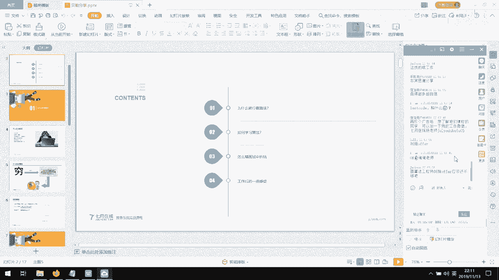

# 人工智能—面试求职公开课（七月在线出品） - P14：面对失败怎么继续坚持？ - 七月在线-julyedu - BV1Xf4y1r74s

🤧今天给大家分享的话呢，主要是。呃，在为什么转行呃，那个以及我在那个怎么样去学这个算法，怎么样去学继器学习，嗯，以及在面试当中遇到的一些坑。然后我当时是怎么样解决的。

以及这个工作了这么一段时间之后的话呢，嗯自己的一些感受吧。希望能够帮助大家。嗯。😊，首先，为什么要转行做算法？呃，其实从先介绍一下自我介绍。那我这边是java开发出身，然后自己是学了大数据。

学了一段时间之后又转了这个大数据的开发。后来呢就看到这个机器学习特别火，然后就想着学这个机器学习。结果自己学了一段之后，从网上找各种资料，发现。学的不是很系统，就是这有一点，那有一点儿。

但是说你给别人去介绍的时候呢，就没有一个完整的体系赛。所以后来就报了7月在线的那个机极学习。而且最终也找到了那个工作。我目前的话呢主要从事一些推荐搜索和ILP。然后在一家互联网公司，现在的。呃。

工作的话相对来说已经稳定了。当时为什么要转行做这个。呃，记忆学习或者说是算法呢，最主要的原因是穷。就感觉要找一个高薪的一个工作。而这个高薪的工作的话呢，当时接触到的话呢。

就是做算法的工资相对来说是比较高的。呃，而且的话呢我年龄比较大，也30多了。所以说是如果就是还干开发这个方面的话呢，就已经相当于到瓶颈了吧，就是除非你去大厂里边。找一些那个，但是呢我这个技术水平的话呢。

又有限，那只能找一个相对来说还不在不太成熟的一个行业。然后门槛没有那么高。然后这时候的话呢，我能进去。然后如果可以的话，从互联网里边可以镀个金出来的话呢，去找一个工作也比较体面，而且工资也比较高。

其实我转这个算法的话呢，最主要的原因就是。工资高。而且的话呢可以遇到一些就是比较聪明的人啊，我一直感觉就是做算法的人，他们都是属于那种。呃，比较聪明的人，而且就是说高校毕业的人比较多。从那个。呃。

浏览的一些博客上面或是知乎上面可以看到呃去做那个。呃，算法的人的话呢都是名校毕业，要不就有大厂背景。嗯，他们的工资也比较高。所以说主要还是出于一个羡慕的心理存在吧。当时就是一拍脑门儿。然后就去学了。

然后就是在学之前的话，其实自己也犹豫，为为什么要就是去放下现在的开发工作？其实当时我开发工资也还可以。呃，后来的话又和别人聊，然后就感觉现在的话AI是一个趋势。你可以看，就是从政府也好，呃。

企业呀或者学校，包括一些学校这开放这个算法课。有的一些那个呃那个企业，尤其是事业单位或者那个国企，有一些单位他都主动的就去开这些那个算法的岗位。而且所有的这个岗位的话呢，入门级别的都是。

而且它要求相对来说不是那么高。这个时候我感觉对于我开发出身的是个机会。嗯，而且跟着这些人在一块共事的话呢，他们身上的一些习惯啊呃你可以学习学到很多东西，感觉。而且目前这个整体来说的话呃缺口比较大。Oh。

我们公司的话呢，目前还在招那个算法工程师，而且。那个特别需要。那个去面试的人。就是能够。能够符合的并不是太多，但是能找到一个合适的人的话，特别特别难，找工作的人难。工作就是公司里边招人的更难。

所以说是现在的话，如果是系统的去学一下的话，去找一个工作的话，感觉还是可以的。其实现在的话算法工程师的话，我我这边还做了一个截图，大家可以看一下这个薪资待遇还是相当可以的。

而且就是说他后边标的那个硕士啊，那个有的是是博士啊什么，那个都不是说是死规定。其实你技术可以的话，也完全可以达到。你那些主要是还是看你的能力，嗯，而且大家可以从其他的那个boss啊、智联啊、拉钩啊。

可以自己搜索一下看一下。那上边的那个工资的话呢。都是普遍比较高的。你像一般的初级水平的话，20K。呃，30K40K这都很正常。你像其他我原来做开发的那些呃岗位的话，拿到这个水平就其实很难了。特别特别难。

而且就是需要不断的加班。第二个方面主要给大家分享的是怎么样去学这个算法。其实。最主要的你如果。从这个学算法刚开始的话呢，最好有一个习惯学习数据结构和let code刷题，这个特别特别特别重要。

因为在一些公司招人的时候，他考考量你一个人是否有能力的话呢，主要有几个方面。第一个就是你的code的能力。第二个是你的理论知识能力。第三个就是你的实际操作。经验也就是说你的项目经验。最后一个的话呢。

有可能会考察你的表达能力啊，或者看你这个人性格怎么样啊，是不是很聪明的一个人，是不是主动思考的一个人啊，他会考察这一方面。所以说第一个基本上去面试的话呢，上来第一个就出一个lets code。

就出一个code题，让你写个代码。如果这个代码写不好的话，第一印象就大打折扣了。Yes。而就是可以有一个良好的习惯吧，在每天去学这个算法的时候，起来第一件事儿可以先写一个代码题。然后的话呢，每堂课。

学完了之后，最好是跑一下项目代码。然后多思考为什么是举个例子，为什么是逻辑回归这个模型，而不用SVM模型。那我用SVM模型会带来什么效果？我在这个模型上可以做什么优化？做哪些方面的优化。

会不会效果会不会更好，会不会带来一些bad case等等一些问题。要自己的话，要有一个动手的能力，还要有一个思考的能力。在这个敲代码的过程当中，而且还可以培养你的那个手感敲代码。

然后的话呢再分享再那个去参加一些比赛。在那个你的简历上边。呃，如果你你的那个项目经验不是很多的话，一些比赛经验的话是很必须的。而且很多人的话他会。感觉这个你参加过比赛，而且就是你最好取得过一定名次的话。

就感觉你这个人最起码是比较聪明的一个人。然后的话就是简历上面的话呢，分数会特别高。然后这一般的话给那个技术官去看的话呢，他们一般都会喜欢就是有一些呃这个参加比赛的，然后最好是取过一些名次的。

一般都是比较喜欢和这些人来聊一聊。因为在实际的业务当中的话。大家嗯都是去偏向业务做那个算法开发嘛，其实投入的话并不是很多。然后一旦是遇到在比赛当中取过一定的名次，而且以自己的业务又比较相关的话呢。

都想着来聊一聊，看看大家是怎么做的。然后作为一个交流。这个的话，其实对于一个简历来说，特别特别重要。🤧嗯。😊，然后是学习算法的本身的话呢。就是面试当中的话，第二个就是理论。你要掌握这个算法的话呢。

要要深入一些。就不要停留在技术层面，就是就是讲师给你讲的一个算法，从原理以及到什么欠拟合啊、过拟合呀，怎么样去解决过拟合呀等等讲到这儿了。然后你自己要去深入下去。就比如说一个一个算法里边。

它有可能用了L一正则。🤧那咱们。哎考虑一下，哎，为什么要用L一正则，用L2正则行不行？呃，L1和L2正则有什么具体的区别？然后这个模型的话。呃，本身的一些推导哦，以及为什么要这样为什么要这样推。

就是反复的多去推导模型是。锻炼你的思维能力的一个好的方法。而且就是说自己最好是深入进去，多去了解一部分背后的一些东西。你比如说现在比较火的那个茶几 boost。去问去那个面试官去问你的时候。

他说那个LR模型和叉几 boost的模型有什么区别，哪一个更容易过拟合，你能不能首推一下，然后叉几 boost的和GBDT的区别是什么？你能不能首推一下，然后他们主要的区别是什么？

包括那个分位算法是什么？为什么那个叉几 boost的就好。嗯，它好在哪里？等等等等。这个模型背后的东西最好是了解一些呃，不是停留在就是我只会推导，我推导了很多遍，但是说你只会推导的话。

还是停留在理论知识层面。如果就是说你能了解到它背后为什么那么做。这个的话对于你以后去解决项目当中的实际问题，特别特别有帮助。🤧。而且这样的话呢，你可以从考虑模型之间的对比的话呢，在实际业务当中。

你再去用模型去解决一些实际问题的时候，你就会从这个工程层面，哪个性能层面，哎以及它那个实现的复杂度等等一些方面，你都会有一个自己的一个见解。你在实际工作当中不可能就是有人告诉你，哎。

你把这个用LLR模型给我跑一遍。哎，或者说你你用你用叉几 boost的模型把这个业务解决一下，没人这么告诉你，你只能靠自己去判断哎，我用什么模型把这个问题解决会更适合一些。

哪个模型会更适合这个这这个场景。哎，为什么适合这样的场景。哎，这个模型的话，是有会带来什么样的效果。我以后的迭代是不是。可以迭代，我从哪几个方面迭代等等。这个模型背后的一些东西的话，最好是要要掌握。

因为这个对于你的实际工作的话呢，还是比较有帮助的有可能。对于那个面试的话，会起一定的作用。但是说这个最大的作用还是对于工作之后。最后一个就是这个算法的落地上边，这个实际的这个算法怎么样去落地。

这个是特别特别重要的。因为这个涉及到你工程里边的一些实际项目。你要很清楚的表达出来你的实际工程是什么样子的，你的性能是什么呀？你这个项目当中有什么bad case，你是怎么样去解这些bad case的？

比如说那个搜索当中。我去命中一个。一个商品，比如我命中的是连衣裙，但是呢就是有一个产品的话是连衣点点点点裙，它也命中回来了。但是很明显这种这种命中的话不太合理。这就属于是一些bad case。

那么针对于这些ba case的话呢。你要有一个思路，哎，我怎么样去解决ba case会好一些，从哪些方面去思考，这个是特别重要的。也就是说，在于这个算法的本身，你要掌握算法的理论基础以及算法背后的东西。

算法为什么要这么做，这么做的好处是什么？以及在我用这个算法会带来哪些bad case。然后这些bad case的话，我通过什么样的方式去解决。这个的话呢就是很好的去让你掌握你的项目工程。

你的项目里边的话一些具体的细节呀，一些指标啊，那个我感觉。它随着你的那个迭代的话，会有会在不断的提升，不断的改进当中，都是一个动态的一个数值嘛。所以说更重要的是什么呢？

更重要的是你怎么样有一个自己的思路去解决这个bad case，也就是说这就是有一些面试官，面试别人的时候考虑的，就是你有没有主动思考的能力。就是说我现在的现状是这样。

那么出现的一些ba case是什么样子的？如果让我去解的话，我从哪几个方面去解这些ba case。会好一些，而且就是它能够带来性能上的一定提升。这个是特别重要的。然后的话是一些工作的一些感受吧。

我从那个工作当中的话，一些感受实际是这样，就是。工作之后呢，就感觉算法的话，学习只是停留在了基础层面。还是需要不断的去学习。这个学习呢就不仅仅是算法本身，它会涉及到你对数据的理解，呃。

操作数据项目的一些工程的一些学习，一些业务的学习。呃，这个层面的算法相对来说内容要少一些。第二个是什么呢？就是说我去解决一些实际问题的时候。我的那个算法，我从哪几个方面去考虑，这个也是特别重要的。

比如说我解决一个对于文本，对于那个商品的一些评论的时候。大家都肯定都知道什么TFIDFword to a这种这种模型。但说在实际当中的话。有可能这两种模型都得不到很好的效果。

但是呢IDF本身的话就能得到一个很好的效果。但身为什么是是是这样的一个情况呢？它不仅仅需要你理论基础，也需要你的实际动手能力。有一些东西是需要通过。你的实际的一些训练出来的结果去展示出来的。

然后你有可能哦才会明白出来，哎，有可能是持频的问题，或者说有可能是学习本身窗口滑动的大小，然后会造成这些ba case。等等等等。一些实际问题特别特别多。

而且就是说你怎么样将学习到的那个知识应用到这个实际工程当中。这个特别重要，你有一个项目的话呢，要解一些呃排序问题。那排序问题的话，有什么lamademar呀，还有其他的一些模型。那我为什么要选这个模型。

以及我怎么样用这个模型去解决，这就涉及到你怎么样将自己学到的知识。应用到实际业务当中来听鸡汤。嗯，我这个分享算是鸡汤吗？我感觉不算是鸡汤吧。🤧嗯。然后最后的话就是你的抗压能力，就是实际工作当中的话。

尤其是你经过这个学习之后去适应这个互联网的话。呃，最重要的是加班。呃，有可能这个。他今天给你提的一个需求，明天就要上线，或者后天就要上线。这要求呢就是一个是你的实际动手能力。然后提高自己的那个效率。

另外的话呢就是需要加班，这个很正常。很多那个这种做算法的都需要加班。而且就是。需求特别急。反正我目前的状态的话就是一直需要加班的状态。其实按照PPT来来说的话，其实给大家分享的就就这么多东西。

但是怎么说呢？嗯撇开这个PPT的话，大家就是可以跟大家聊一聊就是。😊，一些实际的东西，因为这个东西太模板化了。算法比开发加班少吧嗯。会少一些，这么跟你说吧，就是你一个算法要上线。

肯定会有工程组的人就是去他去部署这个算法啊。但是的话呢他预上线也好，正式上线也好，你得跟着你不可能就是说那工程组的同学把这个你的算法给你上线了，你得验证验证这个效果，是不是你预上线的那个效果。

是是不是你要的那个效果。我是做什么的，我是做推荐和ILP的，也做搜索。但是我目前做搜索册的特别少，主要做推荐和ILP。所以说做算法的话也是需要经常加班的，但是确实比开发要少一些。

开发不仅仅自己上线要加班，算法上线也要加班。所以说他们相对来说比算法加班要多一些。而且算法的话其实呃实际工作的话呃，代码量会特别少，呃，会偏策略多一些。我的学历是本科。是本科。

找工作的话就是比较吃亏的一点，也是这样，就是因为本科嘛呃找工作的时候就是很可能就会被刷掉一些。但是这很正常，就是你这家不行，下一家下家不行，再找再下下家。一定要自信。不要这一家就否决你了。

然后就感觉啊我是不是能力不行啊？CV本科好找吗？CV本科。好找啊。这个其实还是看这个实际的能力吧。你如果就是背景好一点，然后的话就有可能相对来说会好一些吧。然后尤其是年底这一块，跟大家说。

其实HR也好和项目组也好，其实他们自己都是有KPI的。所以说他们是有这个任务的，比如说要招多少人，而且年底的话呢，有一些岗位还走一些人，他们本身招人就已经很难了，而且还要走一部分人。

这这个对他们来说压力更大。所以说尤其是年底这个找工作的话，其实相对来说比9月份、10月份和来年的话要好得多。😊，还有什么问题？我我从这可以跟以大家随便聊，反正这个PPT的话，其实其实就是这么多东西就是。

年底都不要年终奖吗？这个看实际需求是这样，就是给你举个例子。就是这家公司的话呢，尤其是刚毕业的学生，我有一个同事也是他从这儿的话是一个月，有可能是20K左右。另一家公司的话呢，直接给开到40多K。

然后你说去还是不去你的年终奖也也可能就是一个月2个月的工资，也就是说年终奖的话，也就是2万到4万。然后去下家公司的话，下家公司的话，呃，直接上来就是4万多。你感觉你要等年终奖吗？你也30多。

本科java开发投了N多就面了5家。诶。其实那个。那5家我感觉不多呀，这个很正常，主要看还还得多投。然后的话呢呃我我不知道你是从哪里投的，你可以找一些那个论坛。然后的话呢那个推荐的一些一些论坛那个。

那里边有一些都是内推的，而且就是说他们找不到人的话，就是会有KPI压力的这种的话，就是相对来说你直接就把你推到他们组。这个的话面试的流程一般会短一些，而且就是相对来说会宽松一些。

因为在那个招招不到人的时候，尤其是年底的时候，过于压力，他们会降低一些这个对于去面试人的一些要求。你你如果就是说那个这时候去面试的话，对于一些比较急的岗位的话，他们相对来说呃，对于一些扣的题。

他有可能分简单嗯，中等和呃难度比较高的。但是说如果平常的话会有一个完整的面试体系。如果这时候去面的话，有可能就是处于是简单或者中等的一个水平的一个代码题。

而且就是说他又不会要求你说是对于这个算法会考察你特别特别深的内容。这个这个时候一般就会少相对来说会少一些。Yeah。所以说你面了5家，我感觉不多，因为我面的。比5家多多了，是。金三银四跳槽的话。

是不是竞争就强烈？对呀？嗯金三银四那时候大家都跳槽，你你也跟着那时候跳槽的话，你的核心竞争力是什么？核心竞争力的话，你如果算法能力和你的那个呃实际工程能力，如果。都都比较强的话。

那你可以就是说考虑那时候跳槽。其实。相对那些的话，咱们大家的话有可能实际的业务能力有可能会弱一些。实际工作CVNLP需要学习。传统算法我不知道你说的传统算法是什么，你能举举个例子吗？你说传统算法是。

是是基于代码的那种什么快排啊，那那种数据结构类的算法，还是说是一些统计类的一些算法？在这个CV和LP当中学习的话。这这些算法其实都是都是需要的。而且就是你如果去那个做CV和LRP的话。

它比那个机器学习对这方面的要求要更高。如果你去的话，只要是去，基本上就是你他就都会考察你像什么堆排序呃，链表呃，以及那个其他的快排二分查找，就这种最基础的啊。

这这这都是那个什么电子offer指南上面的一些最基础的题。这个必须要刷的。我我刚才在那PPT里边也说了，这这个最基术的题。你如果这个都不会，这个就是说比较弱的话。😊，我建议大家先不要去去找。

因为这个最基础的，无论你是找的是中等高等还是初级的一些那个算法工程师岗位。代码题这个是必不可少的。除非你去做什么总监，做总做那个专家，做那个设计层面的东西。如果就是不是。

那这这个离不开这个数据结构的这些这些基础的一些算法的话，离不开你你的必须要去做的，必须要刷这些题。而且就是说嗯大家可以就是怎么说呢？从那个算法那个从那个7月在线上面不是有专门的那个。呃。

这种数据结构的讲解嘛，大家可以就是理解透了之后再去再去做这些题。而且你去背代码的话是没用的。在那个实际考察你的时候，面试你的时候，他就会把这个这个经常刷的题稍微改一改。你如果只是说背了那个代码的话。

有可能就是在面试上的话就是很吃亏，他会就稍微改一改。因为这个很灵活嘛，我稍微改一下就可以。所以说是这个对这方面的要求还是挺高的。大家一定要就是有这个意识噻。如果想出去面试的话，第一是扣的。

第二就是理论基础，就是你的什么LR啊，X几 boost啊，算法推导啊等等的一些东西。包括你的一些实际的项目经验。面试会考察图优化的内容吗？我是没遇到图优化的内容，我去面试别人的时候。

我也没有问别人图优化的内容。这个一般。嗯，没有去问图优化的。基本上大家都问的一些比较实际呃，一些贴近于实际应用的东西，可东西会更多一些。就是我给你举一个问题出来。

然后的话呢你要说一下你的解题思路是什么样子的。比如说有一些特征工程，然后你是怎么做的？然后你为什么要这么做？你你的考虑的点是什么？然后的话你为什么要选这个模型啊，你会定哪几个指标去看？

然后的话这每每一个指标你打算怎么样去优化等等的一些过程。所以说没有说是考察优那个图优化这个呃我是没遇到过，也也没也没问过别人这个。对于这个做算法这一块的话，我感觉。嗯，对于那个转行来说的话。

还是挺不错的。目前来说的话。呃，要求相对来说不是很高。嗯，我去阿里面试过，然后阿里那边的话就是对于这个也是出了一个代码题，就是嗯数据流当中一K个大的数，这个其实也就是堆排序嘛。

然后的话他问的也是比较贴近于实际工作经验。然后问的是那个你的推荐是怎么做的，召回是怎么做的？然后你你做召回的时候考虑的是什么？然后的话召回量是多少等等一些一些实际问题会更多一些。

他不会问你什么你这个算法啊，什么图优化呀什么，这个基本上没有没有这么问的。大家还有什么问题吗？可以随便聊。哎，对了，我忘了跟大家说这个你去面试的时候，你去认定了自己的一个薪酬范围的话，一定一定要坚持。

不要随便的给自己向下降。这个。你去给自己定的这个薪酬范围，如果感觉自己的能力能达到，而且就是可以的话，就一定要坚持住，不要随便就是妥协，随便妥协的话。就很难就是一是就感觉你你这个人就是好说话。

另外的话就感觉你这个人有可能没有就是你说的那么厉害。这这是我自己的一些感受啊。会考察首推机器学习算法什么的吗？比如EM。呃，这个看你的那个简历上面写的什么。然后你如果写的就是有有一些那个算法的话。

他有可能会让你首推。呃，你主要是写这个简历的时候，你主要是写自己熟悉的算法嘛，你不要写一些比较生僻的，你自己不学习的一些。一些一些算法，你还是写就是比较熟悉的一些算法。现在就是我当时遇到的是一个呃。

LSTM的一个。然后的话呢让我从把那个公式的话整个写了一遍。然后我不仅把公式写了，我还告诉他那个注意力，因为是当时说的那个model是sequence to sequence model。

然后的话我把各种注意力给他写了一遍，包括对齐模型。了一遍，为什么现在流行的是这种注意力？也就是呃巴大脑和那个long那个attention机制。当时为为什么就是用这种他们的区别是什么？等等一些。

包括后来的那个brt的transformer的，然后的self attention就是4注意力模型。这个的话我当时是写过，但是写这个首推的话，是首推过SVM和叉 boost。对，这个看实际情况。嗯。

因为在以前的时候。我记得有同学跟我说过，说那个呃只要是问到茶记 boostt，然后你就不管那个问你什么，然后先首推一遍，然后再看那个再说。嗯，结果呢就是我有我也有这么一次经历，还真的就首推了一遍。

结果呢遇到了一个高人，他是给那个陈天吉博士，就是提那个brarch的一个小伙伴，他就是提那个提代码的一个人。所以说他会就是感觉这个首推的话太一般了。然后的话他就问你就是分位算法。嗯。

当时长级部当中为什么只用到了二阶求导，为什么不用更高阶的？然后如果说是我自定义一个损失函数？呃，我都需要考那个注重什么？然后的话为什么是二阶导数等等一些东西。

还会考虑你为什么这么呃为什么的问题会更多一些。你的回答都。这些题目的回答都是给一个思路吗？嗯，对呀，我只能给你一个思路。因为我从开始面试到最后来的面试，遇到的面试问题太多了。

我不可能一个个的把这个问题的话全抛出来才解析。那。好几碗也不够啊，所以说只能告诉大家一个大概的一个思路是什么样子的。Yeah。而且就是说循着这个思路，你要有这个自己的这个思考能力才可以。

你如果就是说一个题那么解，然后你就记住了。然后再再有一个题的话。就是还照搬的话，就有可能有问题。其实学算法本身的话，大家要有。这个主动思考的能力。嗯，这是特别重要的。我们去那个去面试别人的时候。

有有有一些同事的话就特别愿意考察这一点，说你这个。举个例子，前一段时间吧，有一个同事去面试别人的时候。说那个其他回答都很好。然后就是有一个问题说是哎你们这样做的话。

现在呃嗯现在有这个这个效果的话是怎么样子的那那个面试的那个去面试的那个同学就说啊现在效果嗯就这样，然后的话整个行业都是这样子的。然后这一下我才同事就说这这这个人不行，他不会主动思考。哎呦。

我可以从哪几个方面去去去解决这些情况，去解决bad case去提升。所感觉这个人太懒惰了，一点不去主动思考，就这么一个一个一件事儿，其他的他回答的都很好，然后直接就pass了，直接就把这个人pass了。

二面都没进，就就直接干掉了。大数据转推荐算法有什么需要注意的吗？注意的。大数据转推荐算法。这一件很很很流畅的一个流程啊，我感觉。😊，你大数据转推荐算法，这个特别特别适合。

因为那个推荐算法当中更多的是一些工程问题，你会涉及到一些那个数据的清洗，然后包括那个抽样本呃，正正副样本的一些一些抽样。一些特征工程都都是基于大数据的会多一些。像sk啊，have啊。

呃还有那个什么map reduce等等，都会都会涉及到呃故意的东西。嗯，我感觉如果就是说你说注意的话，就注意什么呢？就是have我一定要熟悉那个你的那个spk那个呃那个实际应用能力要要有。

然后的话就是结合算法本身去跑你的模型，嗯，去因为那个实际去跑的时候，有可能和学习的是不一样的。咱们用的是茶几 boost，有可能是paant那在实际工程当中就要求你必须要用。java的掉那个架包。

等等的一些东西。这个的话需要你去实际动手的时候，考虑到这个在学习当中有可能是python版本的。但是实际工程当中有可能是java版本和什么sella版本啊，其他的版本的。而且就是说你如果是大数据的话。

有可能就需要你去更多的有实际动手能力嘛。我感觉这个大数据转推荐算法是。呃，特别特别特别特别适合。模型很多pathon写的那spk怎么跑？大哥，有很多都是有java，都是有架包的。

你不一定非得死死咬着那一个就是pathon的那个版本啊，你像叉几不死的，它就有架包啊，你就可以调用架包就可以啊。但是说具体的怎么样调用啊，怎么样去流程啊，你要看一些API啊，按一些实际的工程代码啊。

这个你你是要自己去看的。而且就是说即使是这样的话，我也可以就是封装啊等等一些一些东西都都是可以处理的。这不是死的。😊，PYpar呃，不一定。这个真不一定。呃，那个我们在用到的那个项目组的话是这样。

就是目前的话没有见人搭，就是自己去搭一套PYpar没有，有可能其他公司会会有吧，但是我们这没有，基本上大家都是该了要吧嗯python，但是python的话没有跑那个sk。这个的话。

你如果自己非得要跑的话，也可以自己搭一套PYpar。但是没必要啊，同学，你本身做大数据的，你再去搭一套PYpar，你不自己费劲吗？😡，对吧。😡，你可以自己跑java或者跑scanva，这不更适合吗？

展现你的长处啊。现在工作的当中的时候，这个你的那个个人输出的话，会就是很容易引起这个领导注意啊。你这很快的适合这个工作特别好。实际工作当中pathon怎么用？嗯，pathon的话主要是跑一些那个。嗯。

实际当中的工程当中的一些脚本。可能会用到python，另外是什么呢？是训练模型会用到python。嗯，然后的话就是如果数据量小。你有可能会就是把数据load到本地。

然后你也可以用python去看那个模型分布啊，那个那个数据分布啊，然后去train model啊等等都可以。包括在一些GPU上，一些那个训练的机器上，你都是可以用pathon去处理的这这时候的话呢。

都会用pathon多一些，但是实际要上线啊，要去加载啊等等一些东西的时候，工程的话还是会用java更多一些。而且就是有的。会对于python的要求的话。并不是特别多。如果就是说你是做这个NLP的话。

要求python可能会多一些。其他的。其实更多的偏向于工程。大家要记住一点是什么呢？就是说咱们学算法是为了解决实际业务当中存在的问题的。而实际业务当中的话呢，由于以前这个各种java C呀。

还有python语言。它本身存在的现状是什么呢？就是java工程特别多，java的项目特别多，尤其是java写的一些we部项目特别多。这个时候不可能让你重新用python去实现一遍那个工程。

然后的话配合这个python跑模型，这是不可能的。咱们只能说是用算法，用python也好，用或者是用其他语言也好，写出来模型，就为这些实际业务解决问题。

并不是说实际业务当中并不给大家提供一个就是用python写模型的一个工具。想问CV的具体工作是怎样的？呃，这个真不好意思，同学，我是做NLP的CV的话，我只是了解过具体的工作。

我不太清楚他们具体工作是什么样子。但是我感觉CV的话应该也是。做这个主要还是写这个。C位的话，我听一个同学说好像是。他们调一些实际的这个模型，实际的这个这种框架会更多一些。

但是说也是分这个工程和这个算法，它是偏算法多一些。所以说实际工程当中的业务的话，他不怎么参与。主要是训练模型，看paper，感觉那个特别好。怎么样？同学们还有什么问题吗？工程的话。

跟开发是不是没啥区别了？诶。呃，有区别。是这样，就是说咱们的工程的话嗯。是是这样的，就是说咱们做算法的里边的工程指的是什么呢？就是说你做特征工程，你做特征的一些抽取，呃一些样本分布等等。

就是他会抽离出来公共的模块。然后这一部分的话呢，是咱们算法里边的工程。这个和那个呃和那个就是咱们普通做那个开发的那种还不一样。因为他那个做开发的话，有可能会涉及到一些框架的东西。如果是java的话。

会有什么spring啊，会有什么habernet呀be等等一些东西。如果就是说。咱们算法当中的开发的话，就不会涉及到那些东西，就会涉及到对数据本身的一些处理。这些工程会更多一些。

它与那个呃完全写代码啊还不太一样。因为咱这边就是一旦这些工程完善完了之后的话呢，再不需要怎么更改。你只需要会去用就可以了。也就是说出现了对一批数据需要进行抽特征。然后的话呢。

我只需要哎这个特征是怎么抽取的，我只需要知道怎么用就可以了，不需要就是说重新再写再去开发，这个不需要。还有什么问题吗？同学们。这个。如果大家现在都是处于找工作方面的话。我我感觉那个主要是刷题。

加业务深入一点，然后加算法深入一点就O了。嗯，就是多面，然后就是锻炼这个表达能力和你的那个自信能力。一般就没什么问题了，因为这个找工作，我感觉本身就不难。然后的话你掌握了这几点的话，基本上就都没问题。

我说的这个深入的话是不仅仅停留在这个算法的推导上，你要掌握一些算法背后的一些东西。比如说上来有可能有人问你这个随机梯度，那随机梯度的话，是一阶导数还是二阶导数，然后的话它是随机采样还是非随机采样。

如果是随机采样，是还。飞机那个随机采样还是非随机采样会带来什么样的后果？为什么要这样？然后的话我用什么方式可以解决等等一些问题。嗯，这个的话在网上会有很多。

包括咱们就是有可能有一些人比较熟悉什么ROC啊、AOC啊等等一些一些一些指标，那有可能会问你AOC是什么？然后的话AOC那个那个图大家都会画，那么有可能会问你那个图当中的那四个点。

就是美那个00111001这4个点分别代表什么？等等，就是更深入一，希望大家更深入一点吧，就是老师讲的只是入门，你不可能就是用完全用老师讲的那些东西去面试。我感觉那个就是有有点难。

但是说你要是在几个上面会深入一些的话，有可能就是相对来说比较简单一些，因为你有亮点了嘛，说白了你有亮点，如果就是说你有了亮点的话，其他的东西一般的话他也会要你你不需要每一个算法都准备的特别好。

你只要把你。熟悉的那个算法掌握住，然后。深入一部分，你认为别人是不知道的东西，这就是你的亮点。这就可以了，你不需要每个算法都掌握，每个算法都掌握，那太难了。需要做什么项目，简历上怎么写这些。

这个需要这个需要你那个。更多的去了解一些实际的项目吧，应该会那个讲师会给你一些项目。呃，你如果感觉和自己的不合适的话呢，你可以从网上搜一些什么，你感兴趣的一些一些项目的一些框架。呃。

比如说你做那个图像识别，你是走那个CV方向，对吧？那你可以搜一下，就是那个关注一些知乎上面，搜一些CV的一些那个比赛项目，或者说是一些那个比较厉害的大牛，他们分分享的一些文章，因为现在的话呢。呃。

很多很多人的话都喜欢写那个算法的那个分享论文分享的那个文章。你可以从里边找一些就是他们自己做过的一些分享。嗯，你可以关注一些那个公众号。比如我自己我就喜欢关注什么美团呀，呃五八同城啊，京东啊。

呃还有百度啊，腾讯啊，我我喜欢关注他们的那个呃公众号，公众号里边会推一些那个呃技术文章，技术文章里边的话呢，他会带着他们的那个呃项目的一些框架显示的那个PPT也好啊，或者说是一些文章，你可以从这里边。

其实你可以照甚至你照搬都没问题。就是有有一些有一些东西在里边，因为这些框架是通用的嘛。而且就是不同的公司之间也是相互借鉴的。呃，你你可以看那个美团的那个技术的，它不是有自己的那个网站嘛。

你可以从上面看到那个他们自己的那个网站上面会有。呃，关于图像识别也好，还有那个NLP也好，他们都会有自己的应用场景。这个的话你可以结合他们的应用场景，写一些自己是就是感兴趣的一些项目。

主要还是你把自己的项目得掌握透。这只是给大家一个思路吧。反正这个问题的话，其实我感觉不难解决，主要是还是靠你自己怎么找那个能找到一些自己感兴趣的。我的那个微信上面基本上现在的话也经常在看的。

有一些那个他们的那个文章，像什么呃五8技术啊，呃像什么呃什么新智源啊等等一些。一些常看的一些，他们会把自己的业务会贴出来。你如果想做推荐的话呢，你可以从网上一搜什么京东推荐框架啊。

什么技术分享或者搜一些什么5八同城嗯，推荐框架，然后推荐的技术框架等等。你如果说图像识别的话，那你可以搜一些。那个美团的美团好像做，我从美团上好像见过美团做那个他是做有一个场景是做什么呢？

就是做那个图像当中文字的识别。因为不同的呃饭店也好啊，或者说是那个那个路标上也好，会有一些文字在上面，他会从那个呃从上面把具体的文字识别出来，想了解一下咱们课程的同学啊。啊，这个可以。

是老师打的广告什么。🤧嗯。具体的话可以咨询一下那个老师，那个老师的话。哎呀，同学，我的路子不够野，老师的路子比较野，大家可以学习一下老师的路子啊，就是找到比较适合自己的一些项目。其实方法有很多，嗯。

主要是你看你自己感兴趣的是什么。你做那个CV的话，那你是做识别还是做分割等等一些。具具体感兴趣的具体的那个点不能太。太那个广的话，不太不太好不太适合。因为有一些现在对于算法的话。

大家更适合就是更喜欢找一些深入一点的能解决实际问题的人，一些同学，然后过来直接哎解决实际问题。这样的话呢，你同事也好，你的你的上司也好，就会特别喜欢。然后的话甚至给你升职加薪都不是问题。

因为现在算法这方行业的话是特别特别缺人就是。捐您圈到什么程度呢？就是。HR和那个技术里边的话，就是压力就是每周都能开会到这个程度。嗯，大家还有什么问题？没事，大家有问题，你就在里边就是提就就可以了。

我还是喜欢回答大家这方面问题的。就看同学们关心的东西。没有了吗？同学们。没有了，我就要快下线了，同学们有问题就赶快问啦。因为我的。都是血淋淋的教训。经验的话。没什么经验，但是都是一些教训。

转换没有实际项目怎么办？转啊转行没有。像实际项目怎么办？比赛啊，同学。比赛的项目那都是项目啊。就是很多公司这么说嘛，很多公司，我刚才PPT当中也给大家讲到了。

很多公司就是因为他们偏向于就是解决实际业务问题，说浪费了很多的时间。然后在一些策略上，在一些呃项目的push上面，所以说是。对于一些那个项目当中的一些实际问题的话，他们更就是有更快的解决方案。

但是对于算法本身的话不一定很强啊。同学就是说他的算法能力不一定有你强，甚至是一些老员工也好，你的leader也好，在一些算法上，他他没你厉害。因为它是解决实际问题更多一些。但是说用用怎么把这个算法用好。

怎么样把这个算法应用到极致，把这个指标提高到最好，它不一定比你强。因为在那个我们的项目当中。解决了一个一个问题，他们是拿了一个比赛的一个一个算法去，就是一个一套流程去解决了一个实际问题。但是这个的话。

我们组里边。没有人能做到。我我我刚去的时候就了解的真的会有这么一个实际问题。他们真的去从那个天池上面去看，就是别人是怎么样做的特征工程都做了哪些。然后的话呢有没有用这个一些特别复杂的一些算法。

然后的话呢，他们有没有观察数据的分布，然后等等一些东西。老是996吗？我不是996。但是。嗯，每天。的时间会长一些，有可能回来的话11点多，因为那个经常要上线，所以说时间会长一些。呃，是双休。

但是每天的。时间的话有可能。10点到9点或者说是10点到晚上10点11点都有可能。这个看实际情况。参加比赛成绩不咋地。呃，如果真的有这方面的话呢，同学这个需要你自己结合你自己的那个呃实际的工程去解决了。

这个有讲师，有很多野路子可以告诉你，这个我就不过多在这里透露了。比赛的项目，咱们的集训营救援也有项目。对，都有有很多这方面的项目。这个你不用担心工作对发表的论文有要求吗？哎。你有发表论文吗？呃。

这个一般就是写在简历上，这个都是降分项啊。如果就是说你有发表过论文的话，这个特别好。然后的话一般这个都是特别喜欢要有有发表过论文的。不景气，现在ARP工作好找吗？好找啊。为什么不好找？

大家说经济不景气的时候。是相对于一般人来说的会多一些吧。然后你主要那个为了这个基础够够牢的话，我感觉找工作的话相对来说没有那么难。Yeah。很多岗位大家不用担心这个的话。

现在互联网公司都说前一段时间一直炒，那什么这个公司才20，那个公司才30。那不照样还得招人吗？同学他裁的是什么人？裁的是你站在这个工作岗位干不了这些活的人。那实际问题当中谁去解决都裁了。

谁去解决他们的压力这么大。你像尤其是推荐和是这个搜索，还有那个什么知识图谱这些行业里边。😊，LP里边，然后这些行业里边现在。压力多大呀？他们解决压力的方案是什么？解决压力怎么样去解决？就是这一个工作。

要一个人14个小时才能解决。那么现在这个人的水平的话就是这样，那怎么解决啊，只能招人呢，同学只能招人。只能通过招人来解决。所以说你不用太悲观，你现在。互联网公司也在招人。

而且我我就是刚才给说大家说的那些论坛里边，我有那方面的就是一些群吧，相当于一些微信群。每天群里边都很多很多这个发表的这些什么岗位需求很多啊。大家就是最主要的还是嗯掌握代码能力和这个基础理论。

还有你的项目能力和你的表达啊和主动思考这几个方面还是先锻炼自己的这几方面的能力吧。至于找工作的话，你去试了，你就知道了。你不用害怕，真的这个真的我我没有必要就是就是怎么安慰你，这真的没有那么难。

应届生应届生你更好了。应届生的话，你你就直接去。现在的话，对于算法这方面，对应届生的要求没有那么高。但是的话就是对于你的代码能力的话，有可能会考察的比较多。因为你没有实际的经验的话，相对来说比较少嘛。

即使你实习过你的那个实际工作经验，你工程，包括你的呃你去给别人对需求等等一些东西，你是没有的。所以说是考察你的代码能力会比较多一些。所你这个的话，你最好还是要刷一些代码。互联网行业经济挺好的呀。对呀。

我我一直感觉这个挺好的呀。需要掌握到什么程度？什么程度啊？第一，你把建指offer的那些全敲一遍。啊，你不会的就是第一遍是这样，你把那个建筑offer所有的刷一遍，把你不会的生疏的再敲一遍。

这是建筑offer。然后呢，你把那个le code上面的那个前第一页那个容易的那个可以刷个20道到30道，然后中等的刷个十道，然后男的看一两道okK了。你就去吧，基本上是横扫各大互联网公司了。真in的。

😊，就是如果就是你去呃掌握一些对排序。背包问题正在规划。嗯，维特比等等。你如果把这个讲起讲出来，然后再用代码实现出来。这个。Perfect。😊，基本上你就没问题了。因为太深的同学。太深的东西。

面试官也害怕。因为他在问你的同时，他也害怕你抛出来问题，他不懂啊，这是一个很尴尬的。这找的啥工作？什么找的啥工作是什么意思？没太理解。呃，我我都是一些。被虐回来的一些教训，然后来告诉大家。

我这都是被念出来的教训。然后我直接去面互联网的话，估计就不太合适，越面越得面的越多越自信。对呀，这肯定是。你会在面试当中就感觉。嗯，慢慢的你就展慢慢的你就自己有自己的套路了。然后这个时候的话呢。

你就特别自信，然后去面试的时候。你你就感觉你比面试官还厉害，真的。大家千万不要就是胆怯。禁制offer。就牛客网上有。大家可以看一下这个。这个上面都是基础的题。这个有点太基础了。

这个你刷回来之后那个le扣的你还是要刷的。对，这个强大的内心，这个是。真的是特别重要。面试的时候莫慌。呃，一旦你慌了之后，你的表达啊有可能会受影响，而表达能力也是面试官考察你的一个一项指标。

还有什么问题吗？同学们。我这快要下线了，同学们抓紧时间，有问题的话，抓紧时间啊。没问题。那。祝大家。顺利找到好的工作啊，面算法工程师建筑offer应该不够吧，不够啊。我我刚才说了，那个太那个比较基础。

那是比较那是你必须要掌握的。你在掌握来那个基础上要刷一些let code。这个其实也看你的岗位。和你的以前的工作经历。你如果就是说呃这个呃中级的算法工程师。嗯，如果特别稀缺，有可能就是问到你的问题的话。

就是。建筑offer当中的题。而且还有一点就是。大家在去就是写代码题的时候。最好最好。可以从数学的角度直接给出来一部分，就是说呃一部分。答案。那不应该这么说，不好意思啊，我表达错误。

那个直接从数学的角度去去把这个你的思路讲解出来。这个时候的话呢，你可以让面试官看到你的数学思维能力。这个是是一个亮点。因为我在去听我同事去面试别人的时候，他就感觉哎这个同学可以把就是这个问题。

从从数学的方面，然后给出来呃具体的一个一个一个讲解。然后他就感觉哎这个人真的不错。他就是思考能力也好，数学基础也好，都特别棒。这是他对那位同学的夸赞，真的。没问题了是吗？同学们那。大家晚安。

祝大家顺利找到好的工作。

给弟们再见。

