# 人工智能—面试求职公开课（七月在线出品） - P15：面试绝技 - 七月在线-julyedu - BV1Xf4y1r74s

呃，OK那各位同学，那么我们现在开始了。呃，我想问一下呃，今天来上课的同学有多少是呃会参加今年的校招面试，呃，要参加的打个一。OK那因为今天这个公开课主要是面对应届生的。呃，那么我简单介绍一下我的背景。

就是说呃我是99年就是非计算机毕业的，呃，我是等于是工作之后再开始自学编程的，就是大学里面学过一点C语言，但就属于呃就说只会玩hello word。那么就是说呃之前就是民企外企国企也都混过。呃。

就目前的话就属于那种呃给给这种大老板做做互问吧。呃，另外就是在7月在线上课。那么我基本上就说从游戏，那么以前最早的PS呃PSPS2任天堂M64，然后再到微软的ciQserv数据库到EMC的云计算。

那么然后还有阿里的电商基本上都做过。呃。我是11年在EMC的时候转管理岗，然后开始带团队。呃，从最早两个人的团队，就说发展到1个20多人的团队吧。呃，然后13年的时候去阿里，去阿里的时候又是一穷二白。

又是从两个人的团队就慢慢拉扯到，就是说20人左右的团队。那么基本上从11年开始，呃，我就说每年都会参加校招面试。那么从外企向EMCVMV，然后再到阿里。那么然后每年也都会见不同的学生在不同的地方。

那么就自认为就说也是有过56年校招呃面试经验，也是呃包括笔试面试，都出过题考过人，就另外自己也有比较丰富的被面试经验。那么就是说今天呢也是跟大家分享一下。那么也希望就是大家能在就是说即将到来的面试季呃。

能找到比较满意的工作。那么我觉得就是说面试的第一点呢，就是准备简历。就说我自己的话就是说少说也看着有上千份简历的吧。那么我觉得最大的问题，包括我以前自己也犯着一个问题，就简历做的非常长非常长。呃。

我跟你呃跟你们说，我以前就是我当初毕业的时候中文简历加英文简历，就说有实页就专门装订成册。那么。呃，对，8点钟开始大概讲那个一小时左右吧。就会留出多一点时间给大家相互交流。

那么就说我之前的话就简历做的很长。那么但实际上呢就是呃我自己的话也只看，就说也只看第一页。那么就说我自己看简历的时候看哪些东西呢？就学校的什么不重要，就是说先看你有没有实习经验，那么有实习经验。

那么再看你学校和那个专业成绩。那么再看你在学校里面做什么项目，就为什么看实习经验呢？就如果比如说你去腾讯实习过的话，那么我对你这个人就会比较放心了。那么因为呃就是说腾讯当初已经筛选过一遍了。

那么我可能就说不需要你再去走那个呃笔试和店面的流程，就会立刻就直接安排，就说现场面试，直接放到现场面试名单里面。就所以呃就找一个好的实习就比较重要。呃，那么现在的话呢，其实都这样，都是先从实习开始，呃。

就基本上好的苗子，大家实习的时候都已经收割了。呃，所以呢就就说你如果没有实习的话，比如说你今年大三或者大二第一次找实习，那么你的专业成绩就比较重要。那么因为从我我自己这么多年工作下来的经验。

那么基本上就证明一个观点，高分高能。你专业就排名就说越高的人，基本上能力越强，高分低能呃，很少见很少见，几乎没有碰到过。对，所以你一定要在里面，你如果成绩好的话，一定要突出。

那么这里呢其实是一个非常非常重要的亮点。那么你像就有同学问了，就是我第一次呃我第一次出来找工作呃，找实习，然后也没有什么经验的话，那么你就在学校里面做过什么项目。那么包括你比如说你某些课程呢。

比如说计算机体系结构的大作业，然后计算机什么数据结构的大作业啊，或者一些综合性的大作业啊，就这些东西都可以列在上面。那么包括自己做的哪些事情，用到什么算法，解决到什么问题，就都可以放在上面。

那么就说如果有文体课长就加上。No。那么其他的东西呢，就是说除非或者长得特别帅，特别漂亮，那么往上加。那么别的呢就真心不重要。就学生会什么的话，呃，就如果你是学生会管理层吧，至少就是说学生会主席副主席。

就这个层级再往上加，要不然的话这也真的显示不了管理能力。比如说你什么宿舍的楼什么这种楼长之类的，这种就不需要往上加了。She。那么所以就简历这个东西呢，就是一张纸就中文一份，英文一份够了。

那么就说英文简历呢呃就尽可能的找你专业一点的同学帮你看一下，或者网上查一下，就大家一定要学会就是说用网上的资源。那么有同学就说，哎呀，这个老师啊这个就是那个谷够被强了。那么很多东西找不到怎么办？

就百度的体验不好。呃，就是没有画面和没有这个的同学，你可能稍微等一会儿要刷一会儿才会刷出来。呃，我先回一下那个消息。那么你基本上那么就说有百度，那么百度的话呢。

那么大家其实记住就搜索引擎除了百度和google呃之外，还有一个病病的话，你可以去搜这种英文的信息，就看一下人家这种语言单词该怎么用的。就是你这个东西呢就尽量用词专业一点。

这样就说显得你比较那个就是说稳重吧。那么就简历好了以后呢，就简历。要注意就是说那个一张A4纸，那么字呢尽量大一点，不要塞太多的内容太核心的。比如说你高中哪个学校其实并不重要。那么如果是特别好的。

打个比方，比如说你是在上海上海中学或者是市三女中这种上海一流学中学毕业的，或者是什么天津的南开中学，就这种地方毕业呢写一写，就要不然呢就没必要，就只要写你就说本科硕士在哪里就可以了。呃。

另外学历这个东西呢，征信没有加成。就我说实话啊，就征信没有加成。呃，因为。计算机这个东西呃说到底呢是强一个强自学的专业，就说你你硕士学的东西，就说哪怕我本科，哪怕我高中，就我都可以通过自学，呃。

就都是可以通过自学学到。那么就是说你硕士呢可能多一些理论。但这些理论呢在实际工作当中，就说区别并不大，那反而就说很多就纯理论东西呢都是博士在搞。那么然后在实践层面呢，其实硕士和本科就真心差距不大。

因为呃我以前在那个呃阿里做招聘的时候，包括EMC招聘的时候，那么我其实对硕士和本科是一视同仁的。那么而且硕士在面试表现的时候呢，就并得并没有表现的比本科更强。Yes。因为现在就趋势很夸张。

很多高中生的话他就开始玩编程了。那么基本上呃就是他呃他进大学的时候，他的编程经验已经比很多人强了。因为现在就是据我所知，就国内的一些一线的AI公司已经有高中生在里面去做实习了。She。

OK那么所以就说前面讲完简历呢，那么后面就是一个关键呃，就是要那个刷题。就为什么要刷题？那么有些同学就觉得我概念都懂。哎，我思路都知道，但是从思路变成真实的代码，就真的不是你知道就可以的。

而是要你真的做出来，你才算知道。那么包括我呃很多时候就说去面试的时候，呃，不管是应届生招聘还是社会招聘。那么比如说很简单的，我说呃就链表反转这个东西呢，大家都已经就写烂了，我就不写列表反转了。

我就来一些最基础的数主的题目。He。那么来性数字的题目当中，有些同学就说哎我思路都知道。好，那么你思路都知道，你跟我说一下思路啊，那么你思路说了以后呢，我会追问一些细节地方，就一问就卡，就他没有实现过。

就是临场的话就根本就想不出来，哎，这些细节该怎么办。那么然后让他写代码呢这种语言，就语言本身又不熟呃。其实包括我自己学编程的时候。就我自己学编程的时候，就说我会发现哪我大学时候学过C语言。

但是要让我自己去独立的完成一个程序。哎，我就会发现哎我好像都知道，但是呢就又不知道该从哪里下手。那么其实这个呢就是说明你的训练量不够。那么当时呢我比较幸运，就是说当时我在游戏公司一开始做的非技术的。

那么我当时我自学编程，那么就是有一个大佬就点播了一下。那么然后跟我说呢，就你要是实在写不出来呢，你就先去找一本这种呃去抄人家的程序，就抄了自己调充的再去想一下，那么就说你超过几千行呢。

你就差不多也有突破了。那么所以就说在我这里就说建议大家用me code或者lincode去刷题。呃，这里呢语言不限，就说pyth种C加加Java不限。就你刷题，如果你刷不出来的话，你先去网上搜答案。

搜了答案之后，自己调通了之后，过两天自己不看这个答案，再自己重写一遍，直到这个题目能自己完完全全独立的写出来就OK了。She。就语言这个东西呢呃我建议呢首选python和C加加。

就C加加这个东西就是说虽然很复杂，但是呢就是说呃要多复杂呢是你自己决定的。你可以说我只用那个bo呃，我只用那个STL云器，我不用怎么bo之类牛逼的特性，那么也可以用。

就是C加加这个东西难度上下呃弹性非常大。那么或者就是java，呃，java的好处呢是大多数互联网公司。大多数互联网公司都是要用java作为主力开发语言。那么游戏公司呢会偏C加加多一点。而这两门任选一门。

一般面试的时候呢，我们不对语言做特别特别的要求。那么就首选C加加这个Java。你如果实在不行呢，你跟那个面试官说用python。那么如果你证明你这个用python一样能做的很好呢，那么也没问题。

那么但是呢就是你在那个就是说刷题的时候呢。就一定要培养好一下自己的一些良好的编程风格。也因为就说并不是这个题目做出来就OK的。那么你包括你代码怎么组织，那么咱们怎么工程师的体验上更好，这也很重要。呃。

因为之前我和呃。之前我和乐视的一个副总裁聊过，就他原来是在美国google的，然后他就跟我说的，就他在google的时候呢，就是呃也有很多这种中国小朋友呃，就编程能力非常非常强。

都至少是进ACM就是wordfin的水平。但但问题是呢，就是说实际在工作中的表现并没有就达到他们的期望。那么问题是在哪里呢？就是这些搞ACM的小朋友呢，就过于看重结果。那么过于看重结果，他们手很快。

代码写的很快呃，然后就bug也很少，但有一个很大的问题，就代码的可维护性和可读性都很差，就从工程角度这个代码的实现质量并不高。因为对于工程上来说，效率这些东西是有很多方法解决的。

那么比如说呃对于阿里来说，那么我在阿里的时候也看到过很多烂代码。但这些烂代码呢，就是说虽然效率很低，但是阿里的话可以通过加服务器来解决。就另外效率这一点呢，大家要从两个角度看，就一个是工程效率。

一个是执行效率。那么我们呢就往往就过于注重这个执行效率。那么你在工作当中还要考虑到工程效率。要考虑到就是说你怎么跟人家去做代码评审。你怎么跟人家做代码评审，呃，怎么就是让别人容易接受你的代码。

然后就是说当PM的需求需呃变更的时候，你这个代码怎么去更快的响应，就是这些东西要想的很多。那么刷题呢只是打一个基础。那么就是让你对这个语言的呃方方面面的特性。然后对算法和数据结构就比较熟悉。

那么另外呃比如说你用C加加的话，那么那么要要注意，比如说你这个函数执行完了，或者是这个类在吸构的时候，你要注意要会不会有资源泄露。那么往往这种时候考官就会把问题展开来。哎，你这里有资源泄露。哎。

那你怎么处理哈，你这么处理的话，那么遇到异常的情况怎么办？那么遇到异常情况下，这个堆象又是怎么展开的。那么一系列问题会从一个小的点就说慢慢突破开来？那么这个时候呢，你要能应付，就说后面那一些问题。呃。

关于非计算机的问机的问题，我后面再说。那么刷题呢就说反复刷反复刷。那么我这里呢呃我这里的链接就说是我自己刷着玩的一个记录，就是说我零我自己林特code的刷题记录大概刷了100多道吧。

就目前进度70%左右。大家就说自己刷的时候刷不出来的，可以参考一下。你即使是用java或者是C加加的，你也很容易去改。呃因为我代码还是就大家可以随便看一眼啊。就是我认为就我代码还是写的比较规范。

容易懂的。就说你翻译成其他语言的成本并不高。呃，看不到的同学不要急，可能只是呃因为你网络比较慢的缘故。OK然后刷题这个东西呢，真的没有什么技巧性。那么你就是不停的刷不停的刷，不停的刷。

然后就说刷不出来的话，不要就不要死磕去看答案，就不要有任何心理障碍去看答案，就看了答案，理解人家的东西，那么然后先抄一遍调通的。那么再自己去逐立完成，就千万不要有心理障碍。Yes。

就一开始这个节奏肯定是缓慢的，就一开始你可能半天才搞定一道easy，呃，你也不要就是说有有任何的自卑。就是你一开始可能半天搞到要搞定一道easy。那么到后来可能就是说30分钟搞到一道中等难度。

那么基本上以我的经验，就是你如果是面BAT普通部门的话，那么中等难度左右的题目20到30分钟能独立搞定，那么去应付BAT的面试绰绰有余。呃，包括一般的这种外企。

比如说那个呃微软EMCBMY之类的那当然了，如果你要面什么微软亚洲研究院那个阿里的核心算法团队，你要你目标冲着阿里新这个special offer去的那那这个呢就说你至少也得刷到hard的难度了。

就而且那些级别呢就也不单纯是你呃这种算法方面的问题。那么你简历也准备好了，题也刷了。那么其实就是说开始面试的时候呢，就第一点就是做自我介绍。那么我遇到的自我介绍就说夸张的呢。

就说有把自己从高中开始怎么刻苦学习的，到大学怎么勤工俭学的，然后到怎么去做那个楼掌管寝室卫生的，这个全说进去了。那么这些东西呢，实在是太啰嗦太啰嗦了。那么。因为自我介绍呢实际上是固定的台词。

那么我觉得大家可以就是说花一点时间，就像人家演员表演一样的，就是台上十0分钟，台下十年功，就是好好的就是呃找你同学来模拟一下，就是控制在5分钟。那么然后言简意赅，突出突出自己的优点。

弱点呢你可以不说这个没关系的。但是自己的优点呢一定要突出。那自己的那个强项在哪里？那么特别是你做过哪些你认为是比较牛逼的事情。比如说你在学校里面做一个大作业，那么三个4个人一组，那么你一个人就主挡一面。

然后做整体架构，做那个核心那个程序和或者实现。那么具体内容呢可以到后面面试的时候慢慢聊。那么这个时候呢，就是说给面试官留下第一印象。呃，就你这个人是比较能干的比较聪明的。那么还有一点很专要。

就是降低语速，就练好普通话。就语速快的时候呢，就往往会你的思路跟不上，就降低语速呢可以就是让你呃表达的时候就更从容一点。对有因为有些同学呢我知道他什么都懂，但是他讲的一快呢，他的就是会顺序混热。

会自己一紧张。那么所以就是要排练，然后排练的时候就要控制好速度。那么练好普通话，练好普通话很重要，就特别是呃有些同学。他怎么说呢？就是。就其实都挺好的，但是普通话说的不好呢。

就是说会略微有一些那个这样一些印象风。因为到这一点呢，很多同学都比较忽略，都觉得自己呃技术能力低。因为你到了工作以后。到了工作以后呢，你会发现就是说很多同就是那些PPT写的比你好的人晋升的比你快。

那么为什么？因为到工作以后，怎么跟老板表达你做的工作，这其实是个核心竞争力。所以这个事情没那么简单的事。那么所以这种表达能力呢，实际上要从你大学的时候就开始准备了。那么这一点呢。

我们就是中国学生就非常吃亏。因为像美国学校呢，他们可能呃就理工科不怎么样，但是怎么在公众场合做表达，他们是就从小就强化训练。那么我那个时候跟老美那边交流工作。

那么发现他们的就是应届生就一上台就是信心满满。然后PPT呢明显做的比他们好。就包括我自己到现在也是就是做PPT就是一件很痛苦的事情。那么下面呢就讲一下，就白板编程了。就白板编程这个东西呢。

大家最忌讳的一条就是说一听到题目，马上开始写代码。因为这个时候呢，你其实你不能保证你听到了题目，你就一定理解正确的。那么你首先就是要跟面试官去确认一下题目的条件。那除非这道题目你刷过呃。

你即使你刷过的题目你也要小心一点就。有可能就是呃这个你听上去差不多，但是那个面试官的话，暗暗的在一些条件上就是做了变化就变成另一道题目了。所以这个题目的要求和题目的一些那个边界条件。那么你要小心。

那么确认完了之后呢，不要马上就是不要马上去那个写，而且先把这个程序的框架搭好，就大概先把这个程序的就是实现思路先确定一下。就对于某些题目来说呢。呃，白班写伪代码是肯定不行的。对，但是你可以先写伪代码。

你可以先写伪代码，就是呃把你的思路表达出来。那么表达出来以后呢，有些题目呢其实。你想一想，肯定是有优化方法的，或者你这种标准的实现一定呃不是最优的。但是呢你也不要慌。

那么你先伪代码把这个次优的东西实现出来。实现出来以后呢，面试官一般来说好的面试官都会去追问的。那么说你这里面有优化空间。那么有优化空间呢，它会适当给你一点提示。那么你去那个再去看哪个地方可以做优化。

就如果你实在没有思路怎么办呢？那么你可以先把你的这种做法，就一步一步弄下来，然后说呃你可以说你在哪一步，你觉得这里可能会有一个优化。但是你实在想不出什么优呃优化方式的。那么这种情况呢。

面试官会给你一些提示，一般呢都是会那个比较有用的提示。那打个比方，比如说一个排序数组，排序数组，然后让你找到两个数加起来的和等于某一个值。那么最简单的方法呢就是那个两呃两重循环呃，两重循环总不能找到的。

那么这个时候呢，你如果想不出优换呢面试官就会提醒你说这个数组有序的。那么对于有序数组呢，肯定是前面的小后面的大。那么你就比较容易想到，就是说从一个从前往后变离，一个从后往前变离。

然后看就一次循环能不能就是找到呃这个两个数的和等于某个值。那么然后就是说有了这些之后呢，那么你然后再去在伪代码的基础上，然后再去慢慢的去丰满你的代码。然后但是记住就是你写的时候，就是当你写完的时候。

你一定要确定一下，就是你这个程序有没有什么边界条件。那比如说求最大子数组合。那么在一些极端的边界条件上，那么你是否能满足。比如说那个反转呃反转单列表。那么你对于空面表。

你对于对于只有一个节点的链表和只有两个节点的这种极端情况。那么你是否处理好了。那么或者是做排序的话，那么你对于这种已经排好序的或者是完全逆序的，或者是比如说只有一个数字的，或者是里面有极上等的。

能不能正确处理。就是这些东西都要小心。那么另外就是最后哎你代码写完了，你感觉也对了。那么再跟那个面试官交流，切磋以前的。你最好就是说自己把测试数据。自己最好先列一个测试数据集合。

那么然后把这些东西都跑一遍，那么再去提交。因为如果你没有写那个测试的话，那么会扣分。那么你。写了测试呢，那么面试官就会问你怎么证明你这个测试是完整的。那么这个时候呢，你就要说哎。

我这个测试用例是怎么出来的？因为在实际工作当中。呃，写测试代码是相当大的开销。那基本上呃像电商的好一点呃，测试代码和开发代码的比呃差不多是1比5到1比10吧。但比如说我们以前在微软做操作系统的。

那么差不多我们一行代码要对应6行左右的测试代码，因为我们当时做那个呃windows数据库访问组件。我们当时有100万行的产品代码，但是测试代码写了600万行。就不同的产品不一样。但总的来说呃。

而且现在很多公司的话都把测试团队砍掉了。那么所有的测试代码都要开发自己写。那么你必须通过你的测试去保证你的代码质量。那么所以会做测试，嗯，你测试做的好，那么是一项加分的技能。

那么所以大家平时自己在刷题的时候，比如说呃我在这里找一个例子。

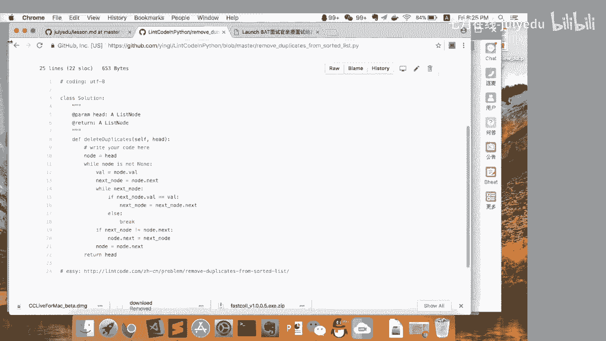

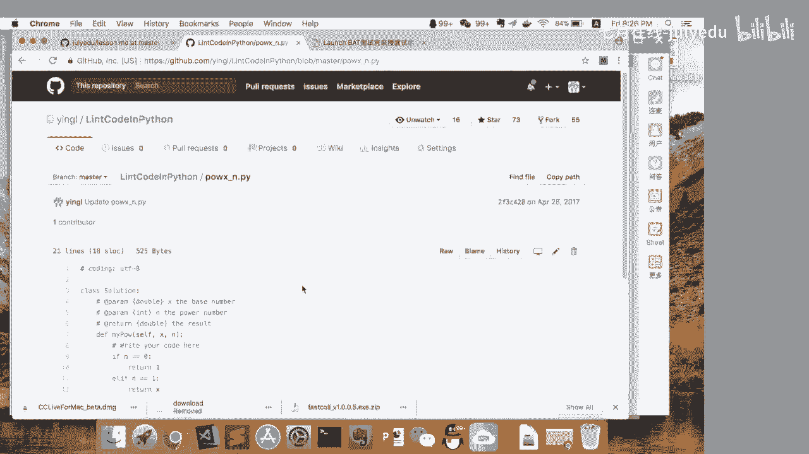

那个就说算算平方的。就是说那个算平方根。那么像这种题目的话，你怎么。就说你不要就写完就提交，就是你要养成一个习惯，就你只你先写测试用力，确定你自己的测试用例都覆盖完整了，你再去提交。就虽然费一点时间。

但对你的能力的话呢，是大大的提高，就要反的话，你是完全依赖于这个呃就是lin codele code这种平台的一个测试集。那么就包括我之前就是说做测试的时候，就发现就是lin code的测试集有问题。

就inter code就是说他的测试集就把我一个错的代码，把我一个错的代码通过了。那么我当时也把这个bug报给他们了。因为你在实际工作里面就说不做测试呢，危险是非常大的。

因为我刚进阿里的时候就遇到过一件事情。呃，当时是一个安全bug，呃，然后他们。知道里面可能有问题，但是他们当时就是说凭着感觉评估了一下，觉得这个问题不大，就上线了。结果上线之后呢。

就迅速演变成一个大问题。那么就是说最后结果就导致呃，当时呃。当时就是他那个负责那个核心交易平台开发的2个P8的人，那个就调离核心岗位。然后就包括呃当时呃。当时叫什么哪个平台，就是一个副总裁。

就说也被就说一个记过处分。对，所以测试这个东西呢是非常重要的。然后包括我们当时在微软的时候有一段代码。Yes。就我们从初级程序员到这种princ级别的程序员就全部review过，然后推上线。

结果上线之后两年，人家报了一个内存泄露的bug。考结果一看，就是当时这个测试用例对那里覆盖条件不足。然后呢，就没有没有去跑那种就压力测试。那么结果呢一个很明显的一个内存泄露就没有看到。

但这个内存泄露呢就比较奇葩，就是说每次呢只只泄露大概十几二十个字节。呃。而且泄入的频率呢也不是很高，但问题呢就是好死不死是跑在人家证交所的电脑上，就说几年不关机的。

结果几年累积下来的内存泄流就非常恐怖了。那所以就是说大家写代码的话，一定要养成自己先测试再提交的习惯，就千万不要就是说把把你的希望寄托在这个就是win codelin code这个就在线欧杰平台上。

因为你在做白板编程的时候，是没有欧杰平台可以用的。She。而且你在做白板编形的时候，你是没有调试环境可以用的。那么所以就是每一步执行下来是什么样的，你要在心里有数，就是你要养成在写明code的时候。

就不依赖于IDE环境，不依赖于这种本地的执行环境，就包括不打log什么，就一定要就是根据呃就是人肉去做排错，就你人肉就争取你要做到什么程度呢？就争取就是说eay的东西。就一类的东西你一遍过。

然后中等级别的，你至少30%到40%一遍过。那么剩下的就根据他的那个欧结的结果，就是两遍到三遍过最多了，就不能依赖于欧结的结果去反复的去做那个改。因为你在工作当中的时候是没有人帮你做勾结的。

然后代码评审只能解决一定问题。Yes。所以大家这个一定要养成好习惯啊，就是你平时在刷le code的时候，你就要当做一个白板编程的一个测试。He。那么就是说一般的话，你如果编程问题解决了之后呢。

那么老板就会觉得哎这个小伙是个可造之才，那么就会跟你聊一些开放性的问题了。那么开放性问题呢，就说平时就是要注重你这个知识广度的积累了，就不要只看教科书，或者只看就说你本专业的东西，就是要多看一点。

比如说呃你写 java，那么你可能就是呃。可能就学得哎比如说那个spring框架，那么spring框架的话，那么你就自然会那个带来一些问题。比如说我这个哎服务的话就告诉我和我怎么去拆分。

那么拆分的话有什么好的方案，那么拆分了之后，那么比如说哎那个可以做微服务。那么微服务有又有哪些问题。那么因为我以前也问过，哎呃，他那么我问他哎，微服务有哪些优点？那么讲的很好，哎，但微服务有哪些缺点呢？

哎，这个他就懵掉了。那么其实很简单，就是说你拆了微服务之后，你服务之间的交互就会带来一个很大的成本。就这些呢你是不需要自己说真的要去撸一遍代码，就是这些你多看多想，其实都能就说慢慢积累起来的。那么。

因为就是我自己以前在面试的时候呢，也也面也遇到过这种完全不懂的问题。因为我最早面试阿里的时候呢，我没有就说面淘宝。我当时面的阿里云，就最后就是offphone没团总没去。呃，就说面阿里云的时候呢。

他们当时问了我一个问题，怎么去设计，有很大的一个问题。就怎么设计1个IM系统，我靠，这个我就懵了，我这个我从来没有写过IM相关的程序啊。那么就说我自己就说凭我以前就说凭我自己的工作经验。

那么就说我尽量把这个问题转述成一个，就是说我曾经见过的问题。那么我提了一个呃架构设计方案。那么实际上呢。那么实际上呢，我这个架构呢是完全错误的，就是说工呃实战当中没有呃没有一家公司是这么用的。

但问题是呢，我虽然是这个错误的架构，但是我这个思路和逻辑呢说的比较圆。那么我就会讲，就是说我为什么做？就这么做可以带来什么好处？就如果不这么做会带来哪些问题。那么这个事实就是结果呢？那么事实结果呢。

就是他也跟我说，就说我这个东西呢，虽然就说大家不用，但是还很有价值的。因为我提出来的所有问题，也都是现在就是做IM系统里面就说遇到的现实问题。所以你对这些东西呢不要怕答错，就是说你这个故事边缘了。

就是你逻辑上说得通。就虽然跟实战有区别，但问题呃就是说但面试官看中的不是说你能把这个问题答对，而是看你这个脑洞大不大。你这个思路是否严谨。那比如说我说我当时做IM的话。

那么我强调就是说呃在你就说完成用户配对之后，那么我要做点对点的连接。那么我就不需要大量服务器去做那个呃消息的中极转发。那么实实际上呢，腾讯和阿里都不是这样做的。就他们不这样做呢，有他们的理由。

但是这种做法呢，你像目前呃有目前来说有一些服务也是尝试着这么做的，就各有各的好处。因为因为你如果大量转发的话呢，你必定就说有一个呃服务器就说要维持两边的轻跳，要去做中转，那么负载和成本呢也确实很高。

就你必须把这些问题想到。因为你因为你的方案可能现在不行，但是在未来不代表不可行。那么比如说现在有区块链，那么有了区块链之后，因为是一个完全去中心化的，那么我我就可能走一个点对点的路线。

或者我可能就是走一个开放游，就这个东西也不是永远一成不变的。呃，就像你就像现在所谓的做那个微服务。那么做微服务就是要搞完以后呢，那么就是现在又开始搞这种所谓的这种服务集群，就是我把。就又往两个方面去的。

一种是说我走服务集群，一种是说我走这种混合服务动态部署，就每一个技术都是发展的。所以你要跟就是你要多看，多看之后呢，当遇到这种开放性问题的时候，你就能把这些东西往你自己呃。

就平时遇到过的这种知识上面去靠上去了。那说比如说那个区块呃那个问了区块链相关的问题，那么你怎么说呢？比如说问你怎么实现POW怎么实现POS那么你如果之前看都没看过一点概念都没有呢。

那么你就是就没法说YY了。就所以就是大家平时。大家平时一定要就是多注重积累。就你光写，就是人家就有这么一句话嘛，就是说代码写的好，半证半到老。就所以你一定要那个开拓思路。因为在实际工作当中呢。

很多时候这些问题呢是没有固定解的。大家就是说开会的时候吵，就是炒哪个方案是最好的。那么。你这个时候呢就是要脑洞够，就说一是就是胆大心细，就是脑洞够大。但是你的推理过程呢就是要细致，这个逻辑要严密。因为。

有些问题不像你在就是说你做那个呃刷li codelin code中勾结，对就是对错就是错。就在实际工程技术问呃，工程技术里面就没有绝对的对错。就所以比如说如果你进了阿里，你你会发现就很多成年老问题。

可能78年前的问题，就每年还要定期拿出来批判一番。就大家还要炒一把，就是说哪个技术范围最优。呃，因为就说你等你工作你们就会明白。呃，这种就是说技术路线的斗争啊，并不是以技术的优劣决定。

而是又背后有很多政治因素掺杂的。那么如果你想爬的更高，那么你其实。要训练自己这方面的能力。呃，因为就对你个人来说，呃，你其实你是要把技术和工程的东西结合起来。那么就政治呢就也政治这个东西有影响。

但不是绝对的影响。所以这方面一定要多多训练，就微博就是微博，还有包括博客上的很多吵架帖，其实还是值得看一看的。就比如说那个之前呃微博上很有名的大漠苍狼的什么前端之争，大家可以去看一下怎么撕逼的。

就是说你看人家撕B的时候，不要去看热闹，要把人家撕B的这个脉络里出来。比如说他攻击哪一点，那么他攻击的这一点到底成不成立，或者是说在哪些条件下成立，哪些条件下不成立。那么如果你来反驳，你怎么去做反驳。

你怎么再去构造这个案例去反驳他的东西。对，因因为你。以后工作的时候，你会发现，我靠测试部门每年能整出一个新的测试框架，前端部门也每年能整出一个新的前端框架。就那么所以就是你要去透过这些东西。

看到他一些本质的东西。就不然的话，你在工作当中就很容易被人家带着走，就带着走的后果就是专都是一般的，但升职加薪是别人的事情。那么这些问题都扯完之后呢，那么老板就是觉得哎小伙子可以继续聊一聊。

那么就往往会问你一些职业规划。那么这个时候你如果想做管理层，或者是想埋头做技术呢，没关系的，都直接说出来。那么反正做应届生就谁也不会当真。但问题就是说，如果你说你想做管理呢，那么就可能会会问你。

就是说你怎么规划你的这个发展路线。那你可能说哎我就说好好的这种学习技术之后呢，就说我要就说呃尝试着怎么去学习管理，就是怎么在工作当中就说体现我的管理能力，然后去争取晋升，去带团队啊，然不道不道这种东西。

你可以说网上的把网上的一些鸡汤加工加工，然后再加上自己的一些理解。就这种时候就是说错也没关系。那么很多时候就考官呢就看你这个人就是这个话说的顺不顺，胆子够不够大。然后就说有没有野心。

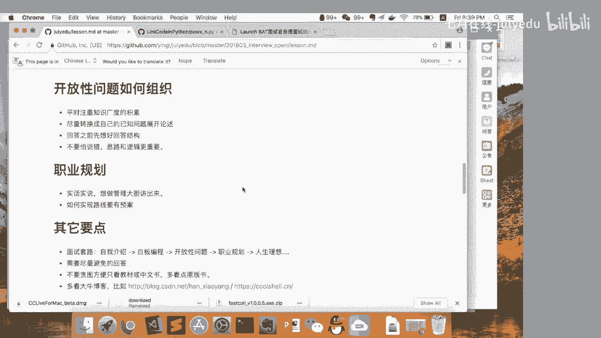

那么面试套论呢，就是这些东西也没啥多讲的。那么下面讲一下一些比较忌讳的东西。比较忌讳的东西是什么呢？就是我最怕听到的就是说哎。那个呃就我非常喜欢阿里，呃，我非常想到阿里的工作。那么我到了岸里之后呢。

我一定就说会那个努力学习，来跟上同志们的步伐。我靠no。我我是想你来阿里之前你就已经做好准备了呀。就你你来阿里之前的话，你在学校里面有这么多时间。那么你为什么算法数据结构不好好看一看。

然后那本java核心技术不好好啃一啃，为什么不多写两行程序呢？啊，说非要就进来以后再再去写。那么我跟大家说一个现实的东西啊，就不要看就是说各公司宣传的都很好。而我们有很好的培训制度。

那么基本上就是你实习生进来以后就是野生的，就怕就是说把你扔到一个项目组去，那么就是说死活就看你自己了。但是呢这种时候呢也确实能体现出就是说各各个同学的差距。

那么包括我以前就说我呃有两个这种西电的那个小朋友，本科生，那么上来啥培训也没有的。因为我也比较忙，我就把他们扔到一个项目组去了，结果两个小朋友自己过得特别好，就是说学东西很快。

然后跟那个就是项目组的那些前辈沟通的也很好。那么就样样都好，就结果人家拿到这个微信支付的offer的，而且是开发的offer，这个我就哪也拦不住了。Yeah。那么另外呢就是要看一些经典的教材。

就是说多看一些原版的道。我刚才忘记一点啊，就说我如果你是一面这种测试开发岗位的时候，我最怕听到一点就是说哎这个我代码写的不好，我随一面测试。我靠这个的话我就是直接打个叉的，也就也就不多废话了。

这这个是最忌讳的。说哎我代码写的不好，我做测试，那么我代码写的不好，我做产品经理这个。不能这么说啊。因为就说我以前有一个哥们，他在阿里三年做了三个岗位，第一年第一年做开发，第二年做产品经理。

然后第三年做测试。而且人家是ACM亚洲去拿过前十名的，然后每年绩效考核都是团队排名，就说就说前5%的三年换了三个考核。所以人家是做测试，做产品经理，做开发都是团队最好的。

就是说就没有团没有哪个老板愿意接受次评。那么下面呢就是大家平时看教材，一定要看一些经典的英文教材。就看因为很多中文教材，因为翻译的原因，很多问题解释不清楚。所以你看了之后，你可能还是昏昏然。

因我自己个人有一个非常大的一个体会，就是我之前学呃学C语言和C加加就学的很慢。那么然后就说后来我有一个同事呢就跟我说，你去看那本英文版的thinkkingC加加。那么我发现我靠，我看完之后。

我就觉得好多东西就是一下子就是讲通了。所以大家能看英文就看英文，而且就是说。一般技术类域的输英文呢都不是特别难，你只要记记住几个关键字，那么连盟带拆总归能看下去的。那当然了看之前看一下评论。

那如果评论说哎这本书英文写的很晦涩，那比如说著名的什么effective C加加，more effective C加加事业。这个呢我就建议就是看看中文版算了，就犯不着跟那种很out口的英文去较劲。

那么另外呢就是多看大牛博客，比如说那个韩小阳的博客，还有就是说网上乘那个左耳朵耗子的博客，就左耳朵耗子的博客很杂。但是我觉得呢就是说营养成分很高。那么包括阮一峰的博客，阮一峰的博客也是。

就他的东西呢不深，但是呢就是说对你拓宽知识面很有好处。那么包括左耳朵耗子呢，他有一些那个课程，大家可以去看看。对于我个人就是觉得还是不错的。就虽然他在那个阿里反正有些事情也说不清楚，但是我觉得就是说他。

就是他的文章还是非常非常值得看的。那么如果你做机器学习的话，那么就是看韩小阳的那个博客。

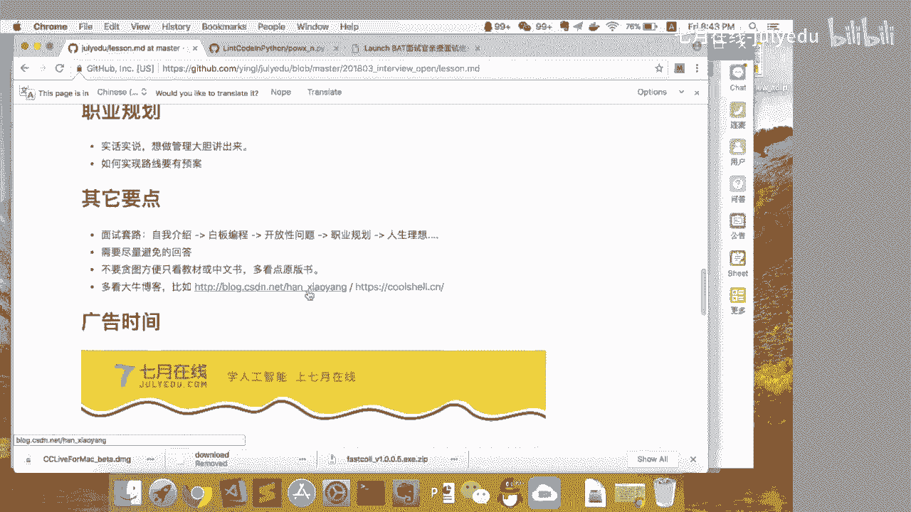

那么最后呢就是广告时间。那么我们求职面试第四期，那么老司机代你刷题，然后包装简历，然后包括指导你怎么参加面试就全有了。

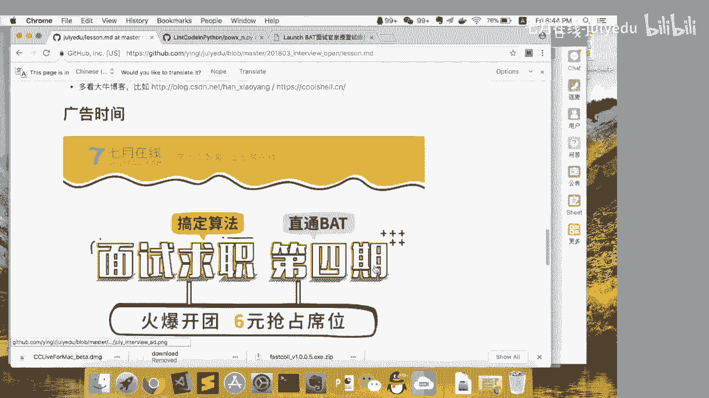

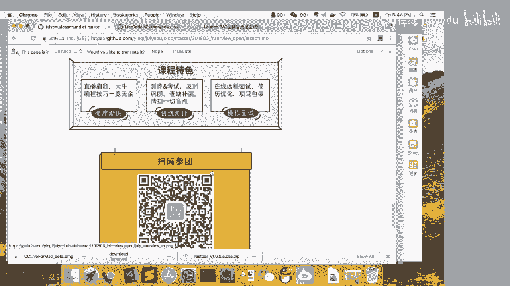

就扫码探看。那么现在呢就是大家的问答时间，那么大家自由提问。那么我会尽量的回答大家的疑问。

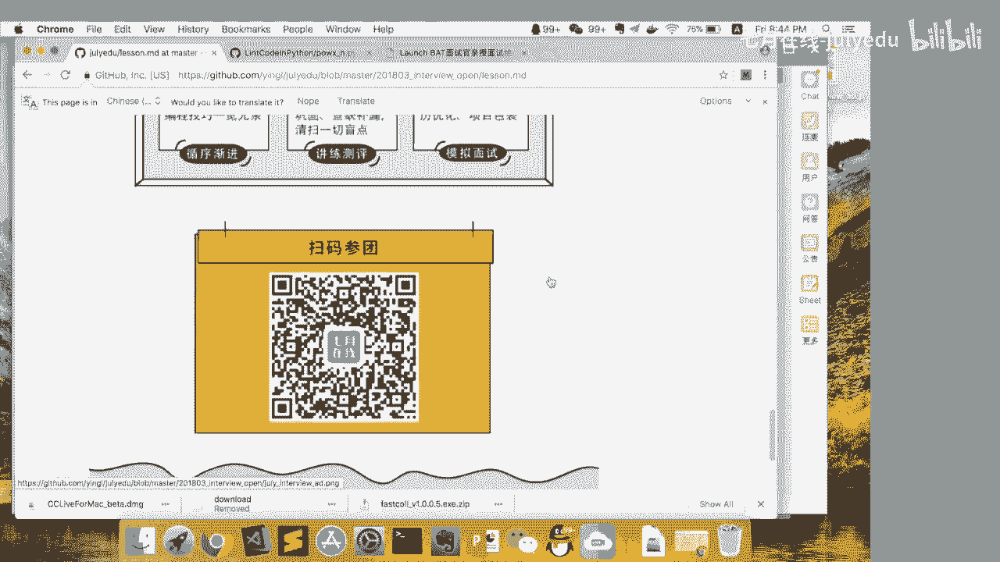

啊，另外就是我给大家一个建议啊，就是说你自己平时这种学习的经验总结啊，最好都放到gethub上去。就你有ge hub的话，呃，包括如或者你自己有博客的话，那么就是说会给你加分不少。呃。

实习和正式实习没有区别。那么我告诉你一个不幸的消息，那么招实习生就是按照正式工的条件来的。是没有区别的。就实习生的话会项目上面的东西问的比较少，而是考察基本攻略多一点。那么其他但是标准是一样的。呃。

简历可以的，你到时候就是加我的那个就是加我的那个呃QQ，到时候把你的简历发给我。就我们并不会说因为招实习生，所以我们的这个面试难度就下降。哦，我在群里了。或者你在群里面直接贴出来，也可以。

我会给你一些建建议。gihub上面什么都能放，你可以放自己的那个博客，可以放自己的代码，可以放自己的简历。因为像我的简历都是在github上公开的。呃，博士我没面试过，真的不好说。

但是本硕的话其实面的是一样的。因为很多公司招博士呢，就就博士去做那种工程的网呢，其实比较亏的。就是说你并没有特别的是就更多的博士是在那种理论搞理论的岗位上。比如说像阿里研究院啊这种地方啊。

或者是做人工智能这种地方可能需要博士多一点。马云带起github没问题啊。就只要就只要实现这个功能就可以。马云也可以的。就因为我现在这个肯定家做顾问公司的项目，我们都是用马云的。

就内推的优点呢就是说有个相互信任。呃，可能像阿里的话，我们内推的话一般就是说笔试可以跳的啊。社交有内推料。呃，不会好进一些，因为面试标准是一样的，就最多省掉一些面试步骤。那么可能比如说就把笔试省掉了。

或者是电话面试，只简单问一些情况，就不再多问一些技术细节了。呃，内推这个东西的话呃，因为就是给猎头的招聘费太贵了。就内推便宜。内推即使说1万块一个人也是便宜的，比猎车都要便宜很多。

项目经历和公司方向不同。呃，这个的话关系不大，只要你够聪明就可以。只要证明你在别的项目上做的很好，那么就证明你学习能力强，那么一切都可以重来。测试什么种产品啊，就是说报8个，报很多高质量的bug。

然后不仅报8个，然后还教你要怎么改，就还给出这种修改的建议。就如果你特别帅，那么85分颜值了，那就放。包装经验啊，那么你就比如说你有哪个打过我打个比方啊，比如说你们学校有大作业。

要说要做一个什么图书馆管理系统。那么你就要说呃那么你就包装就是说你完成了架构设计。那么就是说呃你选择了比如说那个就是说spring boot微服务架构。那么你可以说就说你为什么要选个选择微服务。

那么一种呢呃是说你这个特别好。那么还有一种呢你就是为了呃学习这个微服务的这种部署应用开发。那同时就是说了解这个微服务的，在实际应用当中可能遇到的问题。那么你选择这个架构。那么在在实现这个架构的时候呢。

在应用这个架构的时候呢，那你有遇到的哪些问题怎么解决的。那么这样你的项目经验可能其实也就是一个挺普通的一个就是javascreen boot或者是达过的项目，那就被你包装的也就很丰满了。

比特兔交易所做量化开发，就量化开发，其实这个是很宽泛的，就量化开发呢有写底层交易工具的，也有做数学建模的。那么就是看你就是往哪方面去发展了。呃，只想用pyon，不想用java。

这个呃大家千万不要抱有语言的沉见啊，而是应该说就说我是一块砖公司把我放哪就是了。所以就公司用哪个语言，我就选哪个语言。因为因为你想我在面阿里的时候，我对java是一点不懂。那么我是进了阿里之后。

就是就说赶紧就说抱着书现就是现场学的java。没有太多练习算法，这个当然要补了。就说因为是这样的，就特别是很多这种机器学习稿，就面试的时候就特别高大上。虽然进去是搬砖，但是面试这个卡你必须翻过去。

就各种算法怎么呃各种算法的优点确定如何手工推导，你必须去那个做一遍。那么其实跟微软一样的，微软面试的时候面了很多这种数据结构和算法的东西，但其实进去之后基本上没有用过。语言的话呃学个三门最多的就两门。

就是说公司工作里面用的语言，再加一门自己比较偏好的。算法题一般要求不会特别高。如果你像机器学习之类的，就说理论推导要求比较高。因为这个我也是跟韩晓阳老师切磋过呃。就是说你他面试的时候。

理论就是理论推导特别重要。因为就是说你很多时候如果你调参数的话，你没有理论指导的话，就是瞎调。想用C加加做高频交易啊。那么就按据我现在了解的话，就是说你如果用C加做做高频交易的话，那么你C加加。

特别是现在就是呃你其实你要吃的非常透。就你不仅仅是C加加本身，那么甚至包括那个编译器，还有一些汇编层面的东西，你都要有所了解。那么而且现在就是最新的C加加呃时期标准，你也要就是了解。因为C加加这个东西。

那只能说这个坑太深。因为目前我看到的就是说他们是大量的使用bot库。嗯。就是你肯就不不要说什么传统机器学习，就是传统机器学习这个这些东西目前来看，就是20年内或者说至少10年内不过时。

你这些推导都基本功。呃，就天马行空呃，就是我建议你去知乎看一个帖子，就知道这个你就知道C加加这个面试有多大挑战。就查一下，就是说你简历上精通C加加会有什么后果。哎，这个生活从来都不简单啊。

就你不要看那些ACM的人很风光，那么基本上他们都是那种彻夜刷题的。C加上坑太多了，就是说你不死的话，你又不死的。那么你谢尔的PTR，你用谢尔的PTR的话，那么就一堆坑。就那哪些场景要注意哪些问题？

那么什么时候用weP啊，什么时候用sco的PT啊，那么包括C加加时期，它又推出右级引用的概念。那么做右级引用的时候，你要小心什么问题。那么至少就是你如果去面C加加的岗位。

就那本eectC加加more effectiveect c加加和effective modernC加加，就这种这老三篇，你至少看完吧。呃，不是的库里面都提供了，你慢慢看吧。练夹法列夹法简单呀。

就是夹法相关的知识。那个上下两侧java核心技术看完，然后UI方面的扔掉不用开。那么剩下的你就把所有的例代码都啃完，那么就OK了，基本上不会有不知道的问题。呃，这个的话关于机细学习算法的面试。

你可以咨询一下那个韩晓阳老师，你可以去看看他的那个博客也不是特别多。但这些呢就必修课。

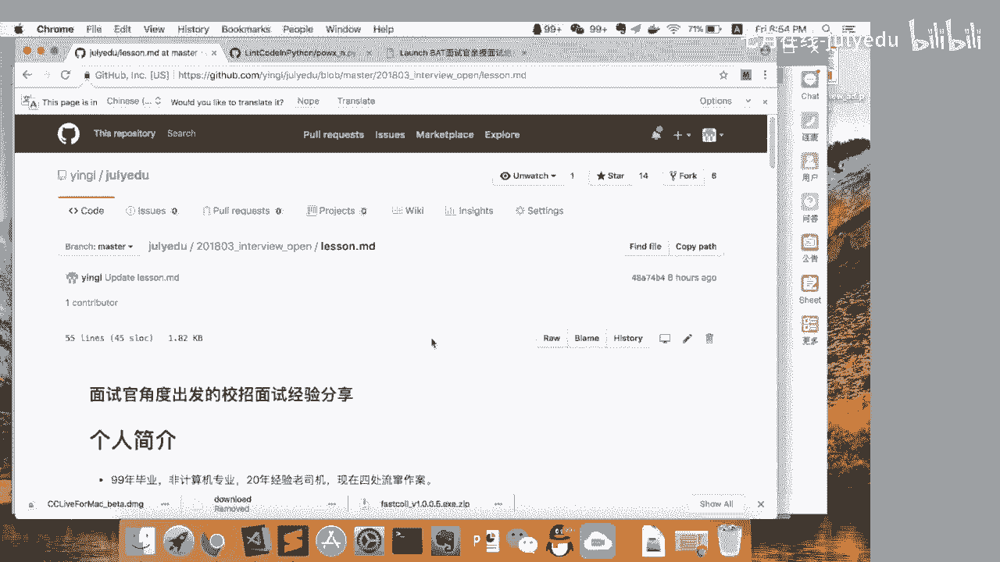

我的地我再发一下。就链接都在里面。

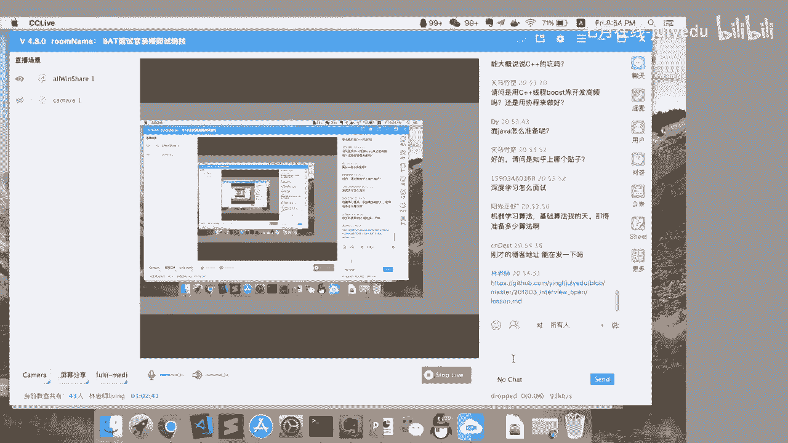

就这些链接都只有那个韩晓文老师的链接，还有酷谢的陈浩的那个链接。那有拍子了。那个python你拎的qui刷的差不多就可以了。就python就python虽然有很多坑，但这些坑的话。

一般面试就不会那个就说特别那个在意。我那些企我是慢慢刷，有空就写写，有空就写写。python的话有本身么笨办法学python，然后java的话就是java核心技术，就不要看别的乱七八糟的书。

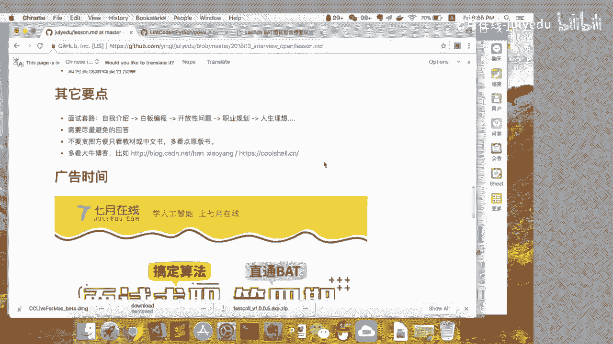

，这个嘛就很少人在博客呀，就是说机器学习方面的就有很多很好的例子。比如说那个经典的那个踏坦尼克，那么就说从头到尾那个完整的那个推导过程。那么还有一个呢就是那个就是陈号的。

那么陈浩的呢有很多架构设计方面的东西，架构设计。然后呃。

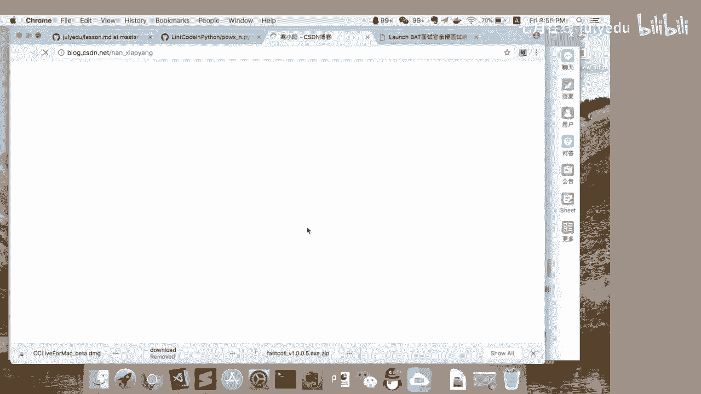

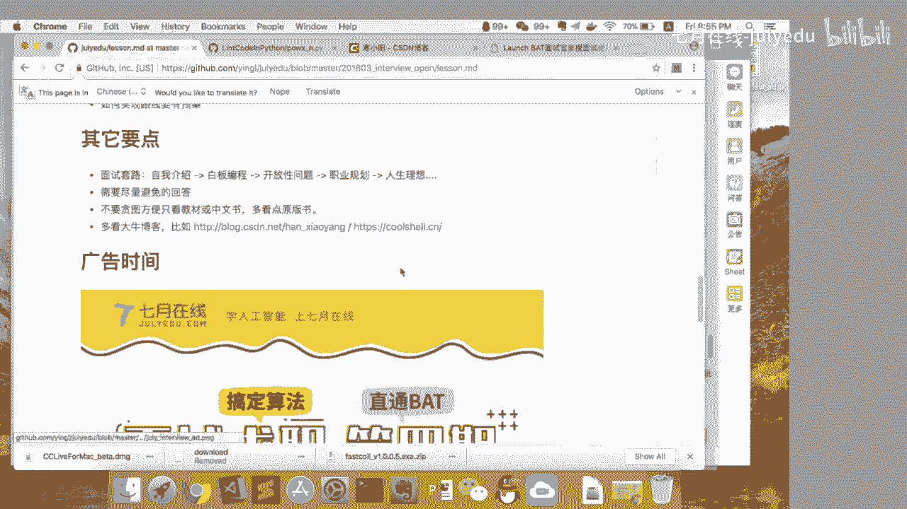

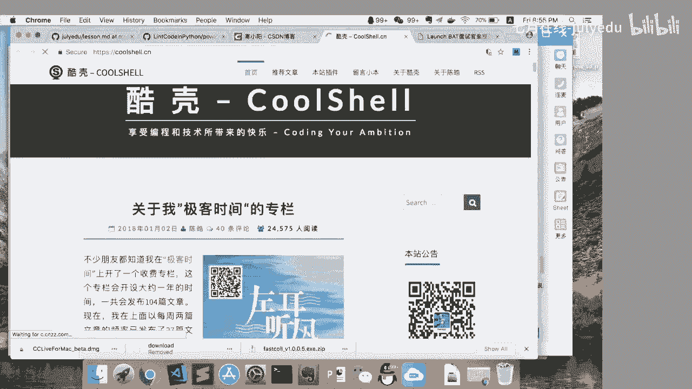

那然后包括你工程实践上的很多东西。

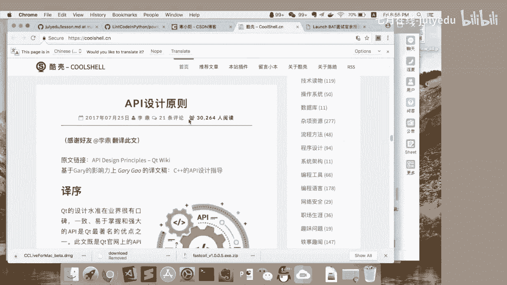

那，QQ号看一下，我QQ号是多少。等一下，我查一下我的QQ号。

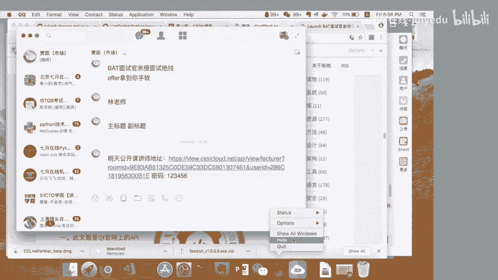

我的QQ号是859189803。

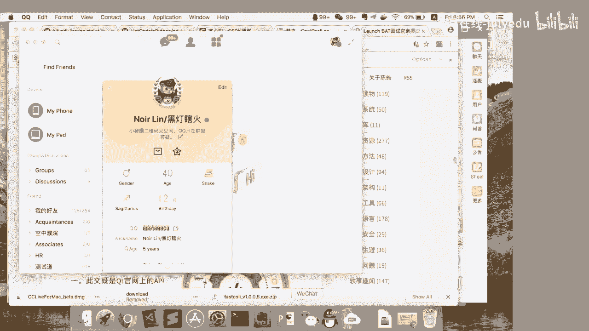

对BATTpython档，我不知道是这样的，就pyon这个东西呢，更是用在自己的一些那个实践项目里面。比如说我跟韩晓洋老师交流过，就是他们在实际的做那个机器学习的时候呢，不不会用python。

但是他们在自己就是做日常的数据分析的时候，就对着语言没有限制的时候，呃，会更多的去用python。就如果你是偏这种数据分析机器学习方面的，那么对语言本身的一些特性不用特别在意，只要会用就可以了。

然后你说工程方面的话，那么你对语言本身的一些特性，那么再加上就是说围绕这个语言发展出来的一些呃像设计模式啊，一些呃工程方面的实践啊，你要多了解一点。嗯，行好的，你到时候完点，你简历发给我好。

就尽量发PDF格式。数据分析和挖掘没什么区别。就其实数据分析和挖掘的话，更偏向于商业分析能力。然后你其实里面最重要的呢是做怎么做数据清洗。就是你真的就是这些算法呢，基本上都帮你封装好的。

你只要大概去做就可以了。因为我知道很多这种呃阿里很多所谓的研究院的人做数据分析，那么他们其实基本上一半以上的时间都是在做清理。那么清理完之后的话，那么他们就只要去写写CQ就可以了。

对我就是刷了一课的外企对英语要求还是很高的。就是说面试的话会全英文的。不过现在也比较水了，现在没有以前要求那么高了。但就说外企对应我有要求的阿里什么对应我基本上没有要求。但如果你想转岗去海外的话。

那还是有要求的。OK还有什么问题吗？就如果没有呃。我我觉得可以啊，这个不耽误的。就也有可能工作两年之后，你就不想中国了，或者说工作两年之后，你中国有更明生的目标了，这都有可能。哎，这个不好意思。

因为我只有本科，这个我我不能误人子弟啊。行OK那么我们今天就先到这里。呃，其实后面呢就说大家可以在群里面继续交流。双飞一本呃呃难度不大，是这样的，就是说BATT的话，他在收简历的时候。

其实并对学校并没有歧视。那么你只要通过了你只要通过了笔试。那么其实大家是一视同仁的。因为我因为我团队里面我都招过什么绍兴什么叉叉什么文理学院的这这没关系，你讲能力过的都是一样的。

对测试开发就是对开发的要求。呃，没有什么书籍，就是按按开发的标准来。你网上可以搜一些测试的资料，自己看看就可以了。因为是这样的，就大量的就是手工测试工作是扔给外包去做的。那么就说阿里自己的测试开发。

因为现在技术质量部没有的，那么开发和测试完全合并了，那么就说工作也就不区分什么测试和开发了。那么你所有的人其实标准是一样的。测试的话，你可以去5聊testing。对，虽然就比较水，但看看还是挺长知识的。

社招进阿里啊，就说工作经验了。就说有没有做过类似的项目，然后就说你能不能一上来就干活。就那如果技术不行的话，那么就说你带团队，那么老板就看你能不能帮他完成KPI。校招校招主要看那个基本功。

这个算法数据结构是不是聪明表达能力好不好？呃，你不用在这里刷，你就直接去那个lin或上，就说你基础的就去刷那个easy模式就可以了。你选Ey和那个安全来位的刷就行了。

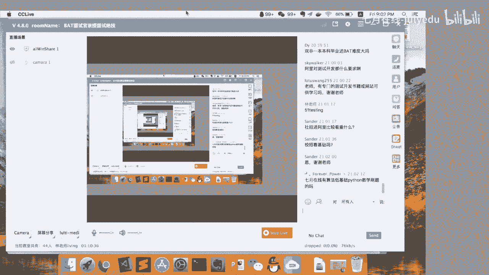

呃，如果你进了如果你进了就是说4月份上课的这个群，如果进了4月份这上课的这个群，我肯定在的。那么包括那个集训云啊、数据分析啊，python入门啊，这些呃班这些班的群我都在。

然后校招对于跨专业没有什么区别。就如果你是计算机专业的话，可能会多问一些。比如说体系结构方面的问题。那么如果你是跨专业的话呢，可能就是停在数据结构和那个白板编程，就更深入的问题会问的稍微浅一点。

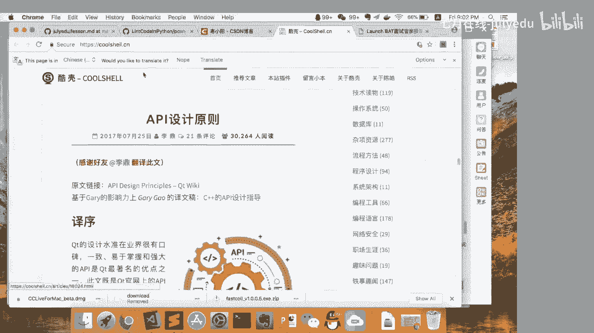

呃，就是说面试的问题会根据你的表现，会动态调整难度的。呃，这个就是说你网上去搜一些人家的经验，这个没这个也没有好的书去讲这个东西。因为书上只讲这个理论。因为你实际当中压力测试这个东西千奇百怪。

你可以看一下，就是阿里云的那个PTS平台。你可以看阿里云的PTS，但这个阿里云的PTS呢主要是针对电商的。你可以参考一下。今天公开课真的没作业，就是那这些博客的话，你自己关注，把里面帖子都看一遍吧。

然后刷题就可以开始刷了。刷机就可以开始刷起来了。行，那今天的课就先到这里了。那么就说希望就是大家开就顺利开启今年的这个面试之旅。谢谢大家。大二的不用急，慢慢来。有的是时间玩的。

