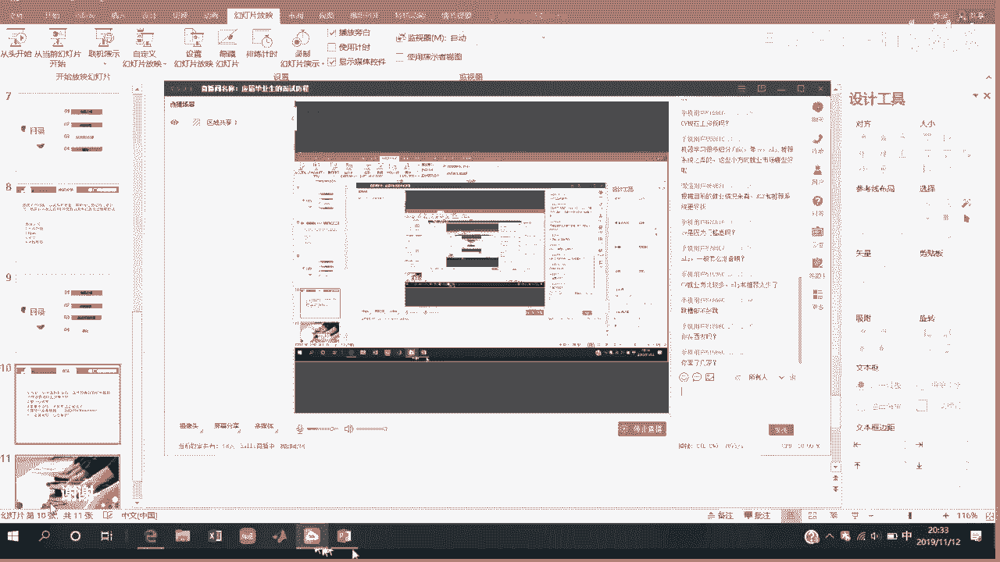

# 人工智能—面试求职公开课（七月在线出品） - P16：应届毕业生的面试历程 - 七月在线-julyedu - BV1Xf4y1r74s

可能也就是我自己的一些经历吧，还有一些嗯。是。面试过过程中踩的一些坑吧，然后也是和大家分享一下。就我觉得这个面试呃一面是你的能力和实力，还有一些运气。然后当然还有一部分就是你。

了解不了解了解一些套路什么的。今年收维港贼难贼难真难。那我们就开始吧，好吧。Oh。嗯，首先做一个简单的自我介绍，就这道这这这里大家都这个叫ricky，然后。目前的话我是就读于某C9高校。

然后机械专业的硕士。我想大家已经能猜到是哪哪哪两所学校了，好吧，然后我今天就会做一些简单的自我介绍，然后一。😊，就是自己在求招过程中的一些感悟吧。还有就是我提供的面试经验的一些分享。

然后接下来就是结合自己在面试过程中的一些经历，还有踩了一些坑，给大家提点建议，也希望能帮助到大家到后面的求职过程中去比较顺利一点吧，好吧。然后就是我我其实是机械专业的，然后在转算算返岗之前的话。

就会一点简单的C加加。然后然后其他的都不会知道吗？我连数据结构这些啥都不懂，然后自己就自学过一段时间，看过一点西瓜书和花书嘛。但是其实自己看的话也是看到一知半解吧。我这样前前后后大概折腾了将近两个月吧。

也没学到啥啥的啥东西，就挺迷茫的，觉得自己可能转不了了或者什么样的。然后一个偶然的机会吧，然后就刚好就了解到7月这边吧。然后我当时其实刚开始也不知道，然后就往在网上查了一查，然后刚好我身边有一个同学。

他报了一个就是学这边的一个嗯推荐班，好像推就是推推荐系统的一个班，好像嗯，他说老师讲的还不错，就当时也是抱着试一试吧，人民币，因为我是秋招嘛，当时已经是45月份了，如果再不好好准备的话，可能就来不及了。

那其实我也没准备多久，因为中中间还有个中期耽误了嘛。然后就是这样一个情况，就最开始是自学的，但是其实效果也不好。然后的话就是然后去区月这边的话也是。其实帮到我挺多的。

我感觉就是说我在呃交绍过程中明明显感觉到就是说在面试的过程中碰到一些基础的一些机极学习和深度学习的东西的话，真的很多就是就是上课的时候讲过的东西。而且比如说我记面oppo的时候，他让我那个首推SVM。

就你给一张纸，你从最开始的你那个分类，然后到最后的被后找找出那个最宽的最后那个分界面，这些一一步一步推下来的。然后一直到最后的那个怎么去通过SMO算法，这些去求这些东西都是一步一步推下来的。

我觉得这个是比较好的，就是说他会这边讲的比较细一点。呃，然后的话就是秋招的感悟期，我觉得就是菜。就是你如果太菜的话，你找工作会很累很累很累。嗯，我身边的很多同学还比较厉害的，就offer特别大特别多。

然后也因为我是一个就是转过来的嘛，非科班嘛，就是说中间也踩了很多坑，你知道吗？所以觉得真的是深刻有体会，才是原罪。所以大家在面试的过程中以及面试之前不要抱什么侥幸心理。最好就是去夯实自己的基础。

就是让自己变得更好。当然面试过程中也有一些技巧，我后面会说到具体的举几个例子去和大家说一下。但是我觉得要转转算法的话，最重要的是两个点，一是你要转到。

现在很多算法呢都要求有机器学习有深度学习的经验或项目经验或者是一些基础啊什么的。其实最重要的就是一些呃计算机专业比较就是最开始最基本的东西就是数据结构这些，还有你要精通一门语言。

但是很多其实他没有要求你特定的是哪些。其实我知道的C加加和pyython好像都可以。java的话好像更多是做后端算法里面，我听到的比较少一点。就是这样一个情况。然后所以说大家要找算发展的话，呃。

就是数据结构这块一定要。掌握的比较好一点，然后接着接下来就是刷题去做一些算法题。因为很多算法题他面试或就是公司在面试过程中都会有这些题的这是比较重要的。一定要夯实自己的基础，然后再去找。不然的话。

你就会受受打击。然后的话就接下来就是这几个点，就是首先第一个是你要静下心来去好好的沉淀你自己，你自己就是说要去提高一下自己。比如说我觉得最重要的就是比如说你需要算法的，你数据结构，什么是对什么是站。

什么是链表，什么是双向链表，并且你一定要。就是掌握的很很清很清楚吧。不然的话，你肯定我觉得你面试很大程度上在首次代码，这块你就挂了。因为很多公司他会有都会有这个环节去首次代码。明白吗？然后的话呃。对。

面CV他他当时最后最后让我首推了SVM就是因为他最后讲完之后，他看我简历上写了我用过S我的那个CV里面有一点是涉及到SVM就去做一些处理的。他就问我了了了解了解M我就了解因为我简历上也写了。

就是熟悉SVM算法什么些算法我推SM样的情况然后的话就是接下来最重要的就是你要及时的掌握一些招聘信息。因为我觉得实力是一部分，然后机会机遇也是一部分有有些公司他宣传的没有那么到位，或者说知道人不多。

大家就没有投这个公司这公司投的人比较少的话，他面试的过程中因为他每年肯定要招一定的人啊，但是你不太就是说这相这些你是特特特别的情况下在这些人里他可能会难度没有那么大就说就是各方面的消息你要去掌握就说你客上的一些内推这些最好时就招的时候每天都会去刷样。

7月这边有一些内推，也可以去了解一下。那就是一个信息，就是说自己的服求世界了。呃，在某个公司上班的或者什么也可以找他们内推一下，或了解一些信息。其实最主要的。

我今年求招过程中觉得自己吃亏了一点就是没有去实习，就是非常实习真的非常非常非常非常重要。我当时呃76月多7月份的时候找到了华为的实习，知道吗？但是我导师不让我去。

我当时就找好那边主管也给我打电话问我可不可以过去。然后我我我当时挺想去的，但是就是这个东西肯定要我们实验室管的比较严一点。我就去和导师沟通。他说导师不同意，你知道吗？所以就没有去，导致在求招过程中。

可能就相对吃亏一点吧。所以说如果你有嗯一些大厂的实习的经历或什么的。这是非常重要的。就是当然如果说是你不是这这一季找找工作，下季的话，你提前去大厂实习的话也挺好的。后面去找工作了什么的。

都相对比较有把握一点。然后的话至实秋招的过程中的话，其实6到8月份是一个节点。我感觉8月份到10月份又是一个节点，6到8月份基本上都是那种神仙打架，大家都很厉害。

然后跟你受过各种各样的提前PSPoffer什么的。然后真的很难很难，就提前批的时候。但是提验T验P厉害的人多，但是有个问题就是。他很多人都没有很好的准备。面试的难度也相对于低一点。

我感觉因为我之前我们实验室有个同学就去就就要是vivo。啊，求找了那个提前批的给嘛。比较简单，他说当时面试面都比较简单一点。那当然其实唯有面试总体比较简单一点，但是相比那个秋招的话。

正式秋招的话可能更能容易一点。就也是考虑。然后8月份份到10月份的话，就是正式的基本开始秋招了。就我我说这些相对于一些互联网公司，还有一些比较大的一些公司。因为再往后的话就有一些小的公司。

当然有想去银行这些做办法什么的，也也可以考虑，这些都相对比较晚一点。所以说最重要的还是自己的硬实力，硬实力一定要高。然后接下来就是掌握一些信息。这是我我我自己觉得的一些东西。然。

接下来的话我就分享一下重点分享几个自己的面试过程的一些经验，好吧。我主要我就从讲一下这四个公司吧，好吧。呃，冲招。冲超。呃，说实话不好不好去评判。呃，冲招的话有时候他会看，我觉得看。

这个因为今年算法岗本来就难，再冲招的话，我觉得可能。也不敢说没有，但是可能就更难一点。我觉得。就除非说有的人特别厉害，他拿了很多很多offer，然后他会在呃就去招会计书的时候，放弃很多公司的。

然后这个公司又没有去补录或什么他会功能名额比较多一点。但是这种情况下一般不会发生在大公司特别厉害的公司。那是中小型公司。对。这个。其是是这样一个情况。但是我觉得你如果觉得自己秋饶找的不是特别满意的话。

也可以再去试一下冲超也是可以的。我觉得。对。然后我接下来就说一下主要面试的这几个公司吧。然后第一个就是个通科技，我面的这个公司呃，总共面了两面，哦反正一般就是两面，两面技术面，第三个是HR面。

我很尴尬的是在第二面总监面，就应该是主管面的时候，最后最后的算代码题上，我死了。因为我是给科班，他出了一个题，还相对比较难一点。我刚我光看题议就看了将近一分钟吧，才看懂。我简单给他说了一下我的思路。呃。

他可能觉得我也说的思路。嗯，知道吧？时间也就时间复杂度太高了，也没让我写。然后就简单跟我说一下怎么样去优化，然后就结束了。因为葱的话面主要是。这样一个情况，他会第一面试他会让你去讲一下自己的项目。

然后针对自己的项目里面的东西去问，问问的是真的真的特别细。他会从具体的在哪里放的，那面都有什么参数了什么的，或者说软了这些都会问的很很细。

然后以及度爆炸这些都都会神经网络里面涉及的很多点 batch些都会问。然后他最后还问了我一个问题，我就我也没白是C嘛，他最后问我一个类。哦，他说你怎么去区分呃。

就是那先他向我们讲了一下什么是聚类是什么样的，然后让我讲了一下怎么去区分聚类是否完成了。哎，特别巧的是，当时在这边7月这边上课的时候，那个哎小杨老师讲过啊，我也就嗯了了解一点。然后的话他也一面的时候。

最后问了我一个算法，题实一个类似于孔排序的一个问题。就是说哦有100个同学，他们的成绩是什么的，然后你对这成绩进行排序什么的，大概就这样一个过程。我刚好也看过类似的，就是说。啊写了一下。对。

所以说就是算法题很重要。他们每个每每个基本上都会有都会有一个算法题，要大家去写。然后一面面的还挺那啥的，呃，挺挺好的吧，挺挺顺挺顺利的。然后面面说完和我联系聊了也挺好的。然后完了之后。

我就给他就我给大家提个建议，就是说面面试的过程中嗯。不管是面对哪家公司面完之后，就是简单问问一下，咨询一下面试官是主要做哪一方面的工作的。然后可以借这个机会和面试官多聊几句。然后的话。

如果你对他做那个方向比较稍微也懂一点的话，还是个比较好比较好的机会。其次就是说一定要让面试官给你提点提提几点建议，你从他给你提建议的过程中，你就能大大概把握到你自己这次面试怎么样。

他对你的感觉是什么样的。但是千万不要直接问人家面试官，你觉得我怎么样，你觉得我能不能过什么，不要太傻了。你会问的面试官很尴尬，他不知道怎么回答你明白了吗？他即使你过了，他很多面试官也不会直接告诉你。

你过了，即使你没过，他也不会直接说的。就是说通过他给你提的建议，就就你给大概可以了解到。结果云聪云聪的一面面试官，他就跟我说啊，我觉得挺好的，算不上他谈谈不上什么建议吧。

就是说你们在学校做的项目可能和企业的项目还是有啥点差别的。怎么怎么说企业的项目可能涉及的面更广啊，什么，他就我这样说了一下，当说完我我其实感觉大概就心里还觉得还还可以吧，但是也不敢保证。然后面完。

那天下午然后我一点多面的，然后下午4点多就给我发的短信，说约二面，约的是第二天的。然后二面的时候就比较那啥一点，那面时会比较高冷一点，一进来就让我讲讲项目，项目讲完之后就问了我三四个简单的问题。

就会问了我，他说你你用的啥。嗯，放假，我说我那个天。啊，他说那你了解深呃ten the floor吗？说具简单看过一点点，他说那你对那个底层的框架了解吗？是啥的？我当时又懵逼了，因为我首先我是飞鸽班的。

我也没有挖那么深。我觉得可能大多数人挖不到挖不了那么深吧，然后我就。就感觉挺不好的。然后最后他又问了我一个，我用的是啥东西，服我用服务器是啥，还是这些就问了我一些这些。然后最后就是直接给我写了一个题。

一算法题。其实我觉得更多的是项目也也有可能是我的项目太简单了，人家问的问题比较少一点，我觉得是也也也有这个可能，但是算法提升的很重要，里面的这些。第二个oppo也是这样的，就都有算法题。

oppo问的特别特别细。他会问我很多。就是说呃我当时面的时候，因为我项目里面有写那他项目讲完之后，他就问我说嗯对常用的就是神经网络你都了解吗？里exnet什么，你知道吗？

后glenet什么你知道吗net知道什么什么sonnet我从第一个也幸亏我之前复习过看过。然后我从第一个从就是应该不是说第一调。

就是说现在还偶尔在用的alexnet也直讲到了sonnet就里面关键的一点什么的就跟人家讲了一下，面试完还说觉得还还可以，也是因为最后我当时我其实这列表那当时面试的时候一一直有不是特别懂我懂一。

当时让我写了一个。呃，好像是环形列表，然后让我就是插入一个数，然后去判断那啥。我当时。就是几分钟，他说我们面试间就40540分钟，他说我写我我当时是没写完，你知道吗？然后自己当时脑子也有点闷。

然后这个题句话，就之前面的其实讲到一些东西还可以，就是一学习和深度学习的东西。然后我就会问他，我说你给我提点建议吧，他给我说，他说呃。我觉得你这块如果你以后做CV的话，你应该你基本上没啥问题了。

就CV就算吧这块。但是你的呃基本基础的数据结构和呃代码这块，我觉得你还是有有点问题的。怎么做？我一听这句话，我就叫我凉凉了。果不其然没有过，最后就不活挂了，为啥呢？为是因为。嗯。

他们公司就这些公司招过去招，尤其招的硕士，他招的过去实际上你要能动手的，你动手能力比啥都强。如果你代码对学校好的话，人家肯定不会要你的。不像如果你是博士的话，可能不会特别注重这方面。

他可能会去靠考你一些核心的能力或者对网络的一些理解了什么的这些东西吧。我觉得但硕士的话，肯定要的是动手能力。如果你。作成能力不强的话，我觉得肯定就比如说oppo。

如果说我对那些常用的网络没有那了解他们的使间，但是我的那个代码能力很强，把那些代码都能写好。我觉得我我跑很就过了。就这样的原因。所以说我其实我我因为总结下来之后。

我也是这段时间其实虽然已经拿到offer，但是我还是在学一些就是东写然后在整天在闲了就在列个上刷刷题题写代码，我觉得这是比较重要的，就是一个核心能力嘛。然后内中心这个其实呃我最后去中心的话。

也是因为是还是在西安嘛，这样一个原因，我最后留在留留在中心，但是呃。他面试的话其实也是我想一下，面了三面。对呃，第一面也是讲项目。但是那个面试官，其实他对我的了工作的东西不是特别了解。

但是他有问了我些问题，就从放假的时候问了我一些问题。然后最后也是他问我一个我问了我一个堆排序的问题。那我写简单写写了一下思路，就是把用伪代码简单写了一下。

就是说你看就所有的公司即我定在就这三家到现在为止，所有的公司都考察你的数据结构和代码代码的一些东西了。所以说如果你以后想找算法的工作，这的有数据结构以及代码呢，你一定一定要不管用点啥语言。

你的话用pythonjava这些这加啊都行。但是我我建议啊是最好用python简单一点写数据结构的题的话，就代码写代码。因为面试过程中。其一下太太繁琐了。对。会有这种这样的问题。然后的话。

然后二面其实也没有问啥，二面就是简单的聊了聊。然后他主要是觉得我的简历上的写的还不错，然后有一些文章，有一些专利这些的东西。然后所以上面也聊的比较顺一点，最后直接谈了薪资嘛，然后这就算那啥了。

然后第三个，第四就是中国移动这块，中国移动我最后没有选择中国移动学，就是因为太太晚了，你知道吗？呃，晚到什么程度，他到10月10月底11月份这样这样的一个原因，就是可能没办法去等这样。

所以最后也是因为他当时跟我说的中国移动就是可能在上海，我考虑了几下，不太不不是特别想去。所以最后就没有没有没有选择去是这样的一个原因。嗯，然后的话就是其实在面试的过程中，真的你会踩很多很多的坑。

比如说我之前嗯。在那个做苏宁和那个。顺分就妮和顺丰的笔试的题的时候，他们俩是都是7点。一个是7点哦，一个是7点，就是7点半。但是我我居然没有发现顺丰的那个时间是可以往往后顺延半个小时的。

我没有注意这个我在7点7点半的时候把那个打开了，但是我边在做呃那个苏宁的题，要边在看顺丰的题，导致我的时间浪费了很多。最后苏宁的题我做完了，顺丰的题我跟你没有做完。

所以说大家在嗯那个笔试过程中也要注意这些问题。如果说两两两家公司的话，他们是嗯他们的时间是重叠到一起的，或者是。有一点重叠的，你要考虑一下，看一下是不是可以就是简单往后搓一搓这样的一个情况。

就争取让自己嗯。就可以参加更更更多的笔试吧。我觉得就是你参加的笔试更多，你的面试的机会更多嘛。就是说如果说你的简历没有优秀到，说直接可以去直通面试这样的情况。

比如说笔试是你能不能参加面试的一个很关键的情况嘛？而且大多数大多数公司的笔试都比较难一点，你要好好准备一下，花比较多的时间去准备这些东西。然后还有的话就是7月这边。

我当时跟这边做了一个那个一个耍机班还是什么？就是这么讲数据结构的嘛？哦我真的以前是对数据结构啥都不知道，你知道？我就知道有个呃数组堆栈这些。就是呃呃队列和战，我就知道这四个好像，其的我都一个也不知道。

你知道吗？什么R叉数了，然后我真的是一点一点都不知道。我转过来的时候，就把那些东西学完之后，我就发现我我我当时啊就是那个积极学习升理学习算法，学完之后，自己做一些小项目之后，我觉得哇我觉得好自信。

我觉得我牛逼到不行了啊怎么样怎么样的。哇，但是就是你当你面试一两次之后，你遇到点错折，你就发现自己真的是差到哪里了，就是说这样的。然后我就就从那块又静下静下心来就去好好补出据结构和代码方面的东西。

这个需要过程。对，所以说大家不能急，我觉得。不管你秋装找的好也罢不好也罢，嗯，都是一个过程。只要你不断去学习，不断去提高自己就行了。我觉得有的时候三翁0马也不一定不是什么好事，对吧？就是三翁0马燕知飞。

焉知飞虎福嘛，对吧？就这样一道理，就是说也不是因为我自己一直都是这么想的。对对对，是那个课是那课。然后的话我还我还可以给大家推荐一些一些课程是我在网上看到的。我自己的一本教。

一个叫就是他B案上直接有免费的课，叫陈小玉的算法与数据结构这门课。我强烈推荐大家推荐大大家去看一下。就陈小玉的就是去学算法那个作者。很厉害很厉害很厉害。被道。然后你在配套上7月这个就是那个那个题。

面试求职的第第四题，以及他们的那个刷题班那个简单的做一做做做完题，然后多刷一刷那个课堂上的题。我觉得数据结构这块就没啥问题。因为大多数公司他不会考特别特别难的。

你什么呃我我我建议这个就是二叉树的呃二层二层便利。然后就是嗯还有就是列表的翻转，还要然进去写快速排序或规律排序。就盘脆多多了就基本基本就这些了。大多数公司都是这样的。对，其他公司的话，有一些大公司。

比如阿里腾讯这些，那就比较难了。就是说我觉得非科班如果你想转这个的话，可能短期之内难度比较大一点。但是你可以去先去一个重等的公司先去积累积累一下嘛，然后学点东西，然后再以后想办法再跳过出来。

也是一种过程嘛。我觉得这是这是一个很好，就不管你秋招找的好不好，首先不要不要气，就不要气馁。因为我我自己也看7月这边经常会有一些找了，就已经工作两三年的，然后自己再转到算法这边的。就通过7月这边上课。

或者说自己其他的一方法，我觉得都是挺好的。就因为人这辈子有很多东西嘛，你不敢说你现在就成功了，现在就失败了什么样的。对吧就是这样的，反正就是数据结构真的很重要，真的很重要。

因为基本上所有都差不多公司面试。最后都会上一写至少一道代码题的。因为要要看一下你的工程能力怎么样。呃，接下来就一些提建议吧。呃我这个我觉得报班这个是不应该说是我在打广广告吧。我觉得应该是这样的一个过程。

就是你去想一下，呃，我报班的话，我可能花50个小时，或100个小时，我能达到我200个小时的过程呃，效果。那我剩下的10个小时，我自己去赚钱，我能赚多少，我会不会比这个学费赚的更多呢？

我觉得是这样一个过程，大家可以这样去想一想。我因为我我当时选择报班，呃，报那个其实这边也是这样想的，其实我也是一个穷学生，穷学生吧，也没多少钱。但是我这样想的话，我觉得我现在投资我自己，我可定多花点钱。

我后面可能能赚的更多一点。就是这样。接下来就是第二点，就是觉得。一定要静下心心去学，你不能说你报班了就。别啥的，如果你不好学，相当于浪费钱没有意义，明白了吧？

还有就是要总结我我每一段时间一两周学就学过的课程算法，这些我都会自己掌过反复的再看一看。是代码看卡，是吧算法的。推导过程的离解过程都看再看一看，就别让你自己学过希望了。因为人这个东西确实会被遗忘嘛。

尤其在就是正八经要，准时开始准备开始招聘之前，一定要系统的再过一遍，再去找再去那啥，还有自己项目上的简历，项项目上的东西，涉及到项目上一些的算法，什么，一定要特别特别清楚。不然人家就觉得你那是假的。

有天糊弄人的，明白了吧？我觉得特特别特别重要。还有就是要转呃要转的话，要转CV这块面的话，是你网就是就从最开始的呃googlenet来net还有呃这些往往现在net其实可以不了解XXnet这些的话会一定要有一定的了解。

这他大概是一个什么样的，但就就每个每每一术的关键关键的就是关键的点就是成功的原因是什么？就简单了解一下。因为这个是对你如果说你做任何工作，你后面去呃设计神经网络什么的，你可定会有一一定的一定的参考嘛。

我是这样觉得的。然后接下来就是刷题，算法题真的真的非常重要。啊，还有就是你找工作的话，见职反正么书真的也很好。不是但那他是好像是针对C，因为我买的是针对C加加的。还有li扣的这边一定要去刷刷题。

刷题真的非常非常重要。就如果你不刷题的话。因为很多题你见过一遍一遍之后，你自己写遍之后你就会写了，它其实不难。就比如说我之前的那个，我当时自己没有自细的写过那个就是。环心列表里面插入一个值嘛，太简单了。

我现在现在去想嗯不就是一个我去两个值，然后去每次比较大小嘛，然后去和他们比较大小，只要只要找到一个比例一个小比一个大的插入中间不就完了嘛。但是有可能有一些就是呃一些临界点啊什么要要去考虑。

但但是他思路就是很简单啊。如果你没见过的话，我提你的思问就。没有那个思路，知道吗？你就嗯写不出来那样的题。其实他们大多数公司真的算法来题不会特别难。大一定要去就是我觉得准备一下，好吧。然后的话就是。

我觉得心态也很重要的，确实过程中。有时候你会特别特别的服，你觉得自己特特别厉害，拿到这个offer了，但有时候你会连连连续被聚集下之后，你就会很沮丧。就觉得有有点怀疑自己觉得自己这里不行，那里不行啊。

觉这我觉得这符个人的一个心态。但是。还是要一定要去。调整好自己的心态，自信一点。因为你的心态好不好？决定了你后面的应对的，就是找在面试，后面的面试能不能好好的发味。如果你发挥后面的面试发挥不好了。

那肯定就就又没有机会了，就不要因为之前的些就是被剧什么的影响到后面的一些结果。我是这样觉得的。然后的话就大概今天要和大家分享的基本上也就这些。就是有问题的话，再给简单再提一下。

看我会尽我最大的努力就是说我了解的和大家去简单沟通一下。也可以啊，没没没必要。如果你python很厉害的话，你也可以没必要说是呃因为如果你做CV这方面的话，其实python也可以了。

我觉得因为我有一个同学他就只会python，他找到了NLP的，找NLP的部门也找到了。是在oppo。对。因为你临时去学一个，但是其实怎么说呢？你如果你说你pasthon很厉害的话。

其实让你去转C加加也还OK吧，我觉得。不会特别难，因为比就是比从小白简单一点。但是其实如果你现在找工作的话，我觉得如果是销招的话，也够了。python够了。我是我是CR的多一点。没有吧。

我没有见过明我我至少没有没有明确要求说是这些加法。因为我我有同学就只会python，找到了找到了一定的NLP的工作。对。但是会见CD加更好了，肯定是这样的。就7月那个7月那个呃求职第四第四第四题。

不好意思啊，7月那个面试求职第四期嘛，然后还有一个他们配到那个刷题班，还有一个是那个呃陈小玉。陈小玉那个拒学算法里面，他在B站上有一个呃数据结构与算法，叫陈小玉。这个讲老师讲的也很好。呃。

对其实不应该说是机器学就会分分成个小的判，可是人工智能就不能会分很多小的方向。呃，机学习现在已经。呃，逐渐的慢慢很多大厂就已经用的用的很少了。然后的话深度学习这方面的话会有CVNLP还有推荐系统之类的。

呃，总的来说的话，现在是CV更难找一点。对。然后NLP和NLP和推荐系统相对好找一点。因为CV现在你看嘛，现在CV落地的产品比较多嘛，比如说灵通和一些矿石这些的人脸识别这些。是这样的对。

所以说相相比来相比较之一下，CV可能更难找一点。是也不是说门槛高，是因为找的人太多了。所以说门槛自然也就高了，人太多了，人家肯定要在里面挑了。嗯NLP和推荐系拟化相对更少一点。因为你想吧。

CV和NLP在很多高校的实验室还还是会有人在做的，会有老师老师会有行友在做的。我至少我都现在没有听过说哪个高校的老师在做推荐系统。你再想想是不是这道理。还还还有啥问题吗？就是我我刚说那那几门课。

我觉得大家真的可以去看一下，一个就是。NLP怎么准备？嗯。对，CV的岗位很多，这是真的，但是他的难度他的人也多。是这样的，我者但相比来说就是CV真的是比嗯那个啥嗯。哎。

但是我觉得不一定未来N该LP的发展，说不定会慢慢起来。这个是。我觉得是嗯有可能的。P怎么准备？呃，这个我还真不知道。要不你和区域这边聊聊那啥，因为我对NLP了解比较少一点。还有问题吗？对我是在西安。

所以我说你应该知道我是你学校的了。我也是搬道出家吧，应该是这样的，就是说自己。呃，杨儿杨2下学期的时候。才决定的才决定想转的。因为自己本身在实验室的话，是软硬件都会一点点，但是都又都不是特别精通。

我面的。我面子应该有10，我想想。

