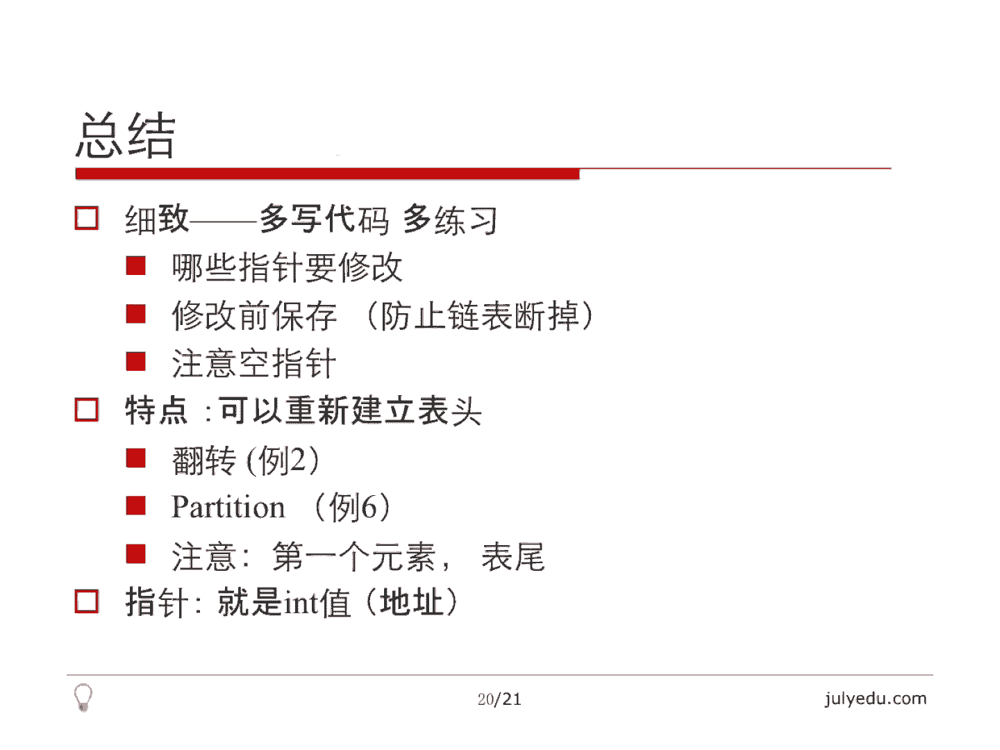

# 人工智能—面试求职公开课（七月在线出品） - P8：链表面试题精讲 - 七月在线-julyedu - BV1Xf4y1r74s

。大家好，欢迎观看7月算法公开课。我们本堂课的主要内容是链表面试题精讲。我将从如下几个角度阐述本课，先讲一下列表的简介，然后总体分析一下近些年来链表相关的面试题，做一个知识点的梳理。接下来讲6个例题。

最后总结结束本课。关于列表的简介，大家非常熟悉链表的一个特点就是一个元素只能通过指针来连接下一个元素。这个指的是单链表，我们不能在长数时间内访问DK的元素，这个和数组不一样。

数组呢直接在下表里面我们就能访问DK元素。列表只能从表头一个一个找过去，它的分类呢就是单链表和双链表，呃，单链表呢就是只有下一个节点的指针，双链表有一个朝前指的一个朝后指的指针。

另外一个分类就是循环链表，这个是它和单链表双链表本身并不是这个独立的，也就是它和单链表双链表都有交集，它是指的这个首尾相接。我把最后一个元素和第一个元素连起来形成一个圈，这个就要循环列表了。

那编程语言里面java有link的listC加加呢STL里面有listC没什么好说的，只能通过指针来实现链表，这是最基本的一个陈述。😊，关于面试题。其实链表的面试题都不是很难，但是很繁杂。

主要涉及的就是链表的比较基本的操作，包括插入删除翻转。这个翻转有多种，一种就是从头到尾都翻转过来。第二种呢是给你一段区间，比方说第M界面到第N个节点把它翻转过来，其他地方不能动。

还有一种呢是我把它分成每K一组，每K一组，每K给翻一次啊，但总的来说都是翻转，还有涉及到列表排序的，比较经典的就是规并排序。这里提到了，还有快排的partition。还有一种类型是复杂列表的复制。

这个在后面有例题。嗯，再后面呢这个链表，这个指的是单链表问有没有环。如果有环的话，环的起点在哪里？环的长度有多长？这个是。啊，后面有个例题在说这个。然后链表的倒数第K个节点，这个其实可以通过快慢指针。

我只要快指针和慢指针相差K个节点，这样我扫一下就能找到倒数第K个节点。当然我们也可以先统计出链表的长度，然后再找DK个节点都可以嗯比较简单吧。还有一类是随机返回列表的一个节点，要等概率的。

这个其实不属于列表的范围，它属于随机采样的范围，我只是从全面性的角度把它列出来了。还有一个是链表和其他数据结构，主要指的是二叉数，二叉数和双向链表之间可以相互转换。这个我本来举了一个例题。

后来时间关系把它删掉了，会放在数和图的那一张里面讲吧。😊，那我们先来看第一个例题，链表的插入与删除，这个是最基本的操作了。所以这个只是列出来让大家熟悉一下基本操作。我讲最简单的那个类型就是单链表。

单列表怎么插入呢？遇到链表的问题，我建议大家现在纸上画一下要做哪些操作，一画就明就明了了。😊，我们需要考虑哪些指针需要修改啊，显然这个列表之这个节点之前的那个节点，也就是前驱节点的nex指针显然要变掉。

因为要指向这个新节点，那新节点自己的nex指针肯定要变，要指向这个原来前区的这个nex。所以我们至少要改变两个指针。😊，那我们插入一般要找到插入之前的那个节点，也就是我刚才说的前驱，那有什么特殊情况呢？

在head之前插入，这里面其实还包括had等于空had就是表头。如果表头等于空，根本这个列表就没有东西，那我们插入就只剩下一个东西了。那这种情况其实和在head之前插入可以统一起来。

我们直接n就作为这个新插入的这个节点。假设我们已经构造好了，我们把这个notode next等于head把ha等于no。其实这两步就做完，就把它插入了。这步这个特殊情况其实就是说插入之后，表头变了。

大部分情况都是在中间插入，插入之后，表头不变。因为我们列表的问题一般都是比方说写一个函数，传进去一个表头传回来还是一个表头。😊，因为这个链表会有变化，我们只有通过表头来访问链表。

所以链表的问题都是传入一个表头，传出也是一个表头，表头非常关键。所以我们非我们要考虑的非常清楚。那一般情况呢就是。这个样子我刚才说了，改变两个指针，这个就是改变新节点的指针。

这个呢是改变前区的那个nex指针。注意这两个顺序，因为我这个要附成这个，所以我必须要先改变新节点的，再改变pread。所以这个比较简单。😊，那删除呢其实差不多，哪些指针要修改，其实就是前期的nex的。

把它跳过去就可以了。把它指向它的next的 next就可以了。特殊情况表头会变，我把表头删了，有可能。😊，那其实这个如果链表里面只有一个元素的话，我删了之后，它就是no。

因为temple这个head的下一个就是n。那我们在fr后面删除的话，怎么删呢？先把pde的下一个节点记下来，然后把pread next复成这个，再把p，就是原来pread的下一个节点。

也就是我要删的那个节点空间释放掉。所以这个删除也就这么几步，非常简单。😊，那，给大家几个思考题。刚才我讲的是最简单的情况，就是单向列表，还有双向列表怎么插入，怎么删除。还有一个是循环有序的链表。

就是这个链表本身，比方说12345。😊，这是一个有序的，并且呢它把五跟nex的指向一了，就是在一个圈里面。那么我要删插入一个节点，这个其实还是有点困难的。比方说呃我插入的节点有重复值。

或者我插入的是最大的最小的等等，插入的位置怎么选取，要把它想好了。不过我个人建议是先把它断开，然后插好了之后再把它最后一个节点指到第一个节点上，这样不容易错，但是其实有很多不用断开它。

这个就是加了很多条件判断的方法也可以做。这个给大家思考。😊，然后这里面我想提一下，就是所谓的lazy delete，就是懒删除。假设我们要删除ow这个节点，这里面要注意，n不是最后一个节点。

那么我们找到n，我们现在就在n这个节点上，我们要删除它。这个在单列表里面一般情况是无法实现的。因为我们必须在它之前的那个节点位置才能把它删除。那现在我已经到了这个节点，我怎么把它删除呢？

有一个比较懒的办法，就是我把n的下一个节点复制过来啊，我这里面假设这个n只有一个字段，就是X，就是只有一个整数值，我把下一个节点的内容信息都复制过来。那这样的话。😊。

note本身和note下一个节点长得都一样了。那么我再把note next删掉。实际上这个并不是真正的删除note，我是真正删除的其实是这个这个节点，我只是把用n把它的。这个下一个节点复制了一遍。

再把下一个节点删除。所以这个是一种删除方式。然后我再讲第二个例题。单列表的翻转，这个非常简单，我就快速的讲一下。这个前两个例题都是帮大家理解呃，链表的最基本的操作。

那么翻转其实就是把当前节点就是这个节点拿过来作为已经翻转结果的表头就可以了。因为我们可以改变列表的顺序嘛，就是类似于一个对战的这个假设我前面已经翻好了。我把这个节点拿过来作为新的结果的表头。

那么前这些节点都已经翻好了。我们看一下，非常简单，result就是我翻好的这个链表的结果。那么我先要保存当前这个节点的下一个节点。因为我下一次循环就要翻这个节点了。那么我现在要翻的就是ha这个节点。

那headd节点的nex等于我之前翻翻好的那个节点的表头，那么表头变一下就是结果的表头变一下，那么headd变成它原来的下一个节点，所以这个顺序很重要，主要强调一下顺序，并且呢这里面就是ha为空啊。

那些情况，其实都已经在这个里面隐含着了。因为head为空result肯定为空，并且这个呃翻转之后的最后一个节点的nex。😊，肯定也是空。因为第一个节点就把headd next等于result了。

还有一个就是顺序要注意，先把这个节点保存下来才能改变它，不然链表就断掉了。前两个例题都非常简单。那思考题。就是刚才我说的呃，如何翻转一部分列表，比方说li code第92题。

就是翻转第M元素到第NN个元素之间的那一段。那其实我们需要把它从DM元素之前断开，第N个元素之后断开，把M到N翻转了，翻转之后还得再连回来，连回来的时候。

就是前面那部分就是DM元素之前的那部分的最后一个元素我们必须得有。因为我们要从最后一个元素把那个翻转那部分接回来。那后面那部分第N个元素，最后那部分的第一个元素我我们也必须有还得接回来。

那还有很多特殊情况需要处理。比方说这个M等于一，也就是这列表DM元素之前没有东西怎么办？第N个元素后面没有东西怎么办？所以很多特殊情况需要考虑，尽管这几部说起来非常简单。

另外一个就是刚才我说的li code第25题，每K个元素翻一次一样的。😊，同样我们把前面翻转好的部分都保存好，现在要翻转这K，把它单独截出来，翻转之后再把它连上来。那后面没有处理的，还要再继续处理。

还有如果最后有余数不足，K怎么处理？所以有很多细节的问题，说起来都不太难。这个留作思考题，我们再讲第三个例题。😊，第三个例题其实呃比较经典，它是说给你一个单链表问这个链表是否有环。

其实就是说这个链表可能建错了。我最后一个节点的nex的不是空，而是它指向了前面的某一个元素。这样的话，列表就转起来了。我如果连着沿着链表走，它就会转起来，这个没没有头没有尾。

就是从头直接走走到一个节点走到一个永远走不到尾。那。😊，我们怎么判断这种情况呢？这个是lea code上141、142题啊，141题和142题有一个区别在于有一个题是说，只要判断有没有环就行了。

return一个布尔值出 first。那另外一个题呢是说这个如果有环的话，你把环的起点找出来。就是环的起点是哪个节点。当然这个这个环可能不是从开头就开始这个产生的。

有可能是一个类似于阿拉伯数字6的这种形状，就是它开始有一段，然后才有一个环。所以环的起点也需要求。那我们先来看一下如何找环。😊，最直接的办法就是我们用一个set存放每个节点的地址，注意set里面。

存放的元素必须是有序的，这个序不一定是这个大小关系。你需要给它定一个序，所以并不是任何的object都可以放到set里面。我们需要给它规定一个顺序。那地址就具备这种顺序。其实地址我们可以把它理解为整数。

尽管这种理解可能不是十分的正确。但是其实真正意义上地址它就是一个整数，只不过这个整数我们不能这个做传统的这种加减运算。😊，那最直接的方法，我们就用一个set把经过的节点都存下来就好了。

我们就这样沿着投指针走。如果找到了之前经过的一个节点，那么它显然就是走环绕回来的，就有环，否则就没有环，这个是一个方法。那呃这个它额外用了一个set主要是空间复杂度有一些时间复杂度也有。

因为哈这个set里面查找是log n的。当然我们把它改成哈希的话，呃，就可以做到期望的时间是这个ON的，但问题在于。😊，呃，还是用了额外的空间，有没有不用set的办法呢？我们来看一下。我们用两个指针。

P1和P2P1呢每次走一步。P2呢每次走两步，如果有圈一定会相遇，请大家思考一下，为什么一定会相遇。如果相遇的时候，我们如何找到焦点，那我定一些变量圈长是N起点到圈的起点的距呃。

就是链表的起点到圈的起点的距离，也就是呃那个饼的长度，你可以理解为它是一个横线带一个圈，那个横线就是这个饼的长度就不循环的那个长度是A。那P1。到起点的时候，因为P1是每次走一步的那个指针。

它到了圈的起点的时候，P2肯定比他进圈早。因为它走的快，它在圈的X位置，这个X是指距离起点的位置。我们来看一下。😊，刚才说了，P1到起点后，这个P2已经走了X部了，在圈里面。那么他们相距其实是N减X部。

因为这个在圈里面两个方向，一边是X，那边就是N减X圈总长度是N。那么他们N减X部肯定会相遇。这是一个追击问题。因为这个每走一步距离缩小一嘛，P2走的快嘛，每走一步，他走2P1走一嘛，他们相距N减X。

所以走N减X步肯定相遇。那么。假设我们相遇的时候，相遇点到起点的距离，这个指的是圈起点是B。那么P1走的距离实际上是A加B。其实P1走的肯定小于一个圈。因为P1走的这个呃在圈里面只走了N减X步。

这个圈的长度是N，所以P1肯定没有绕过一圈在圈里面。😊，所以它走的距离就是A加B，因为这个相遇点距离圈是B嘛，这个前面那个饼的长度是A，所以P1走的是A加B。那P2走的是什么呢？

P2其实在圈里面可能绕了很多圈了，可能绕了K圈了。这里面其实这个P1不一定呃P2不一定比P1只走了一圈，只多走了一圈，它可能比P1这个在里面已经绕了K圈了。这个是在P1进入圈之前，P2早就进入圈了。

如果这个饼比较长，圈比较短的话，P2在这个时候已经在圈里面绕了很多圈了。可能但是无论如何它绕了K圈。😊，那么他走了就是A加B，再加上K乘以N，因为N是圈长，K是一个整数。那么右边是怎么回事？

右边是刚才说了，P2走的是2P1走的是一P2的速度是P1的二倍，所以P1走A加BP2显然走了这么多，所以这就有了这么一个等式。这个等式对我们来讲有什么用呢？😊，把A加B消掉，就是A加B等于K乘以N。

这就说明A加B，也就是P一走的距离，或者说丙的那段长度，再加上圈的起点到这个相遇点的那个距离。正好是圈长的整数倍。那这个有什么意思呢？我们在想，我们现在假设两个点已经相遇了，他们相遇的时候。

距离圈起点的距离是B。😊，那么。我们把P1拉回起点，这个不是圈的起点，拉回列表的起点，就是第一个节点。把P2呢不动，因为它就在距离B的位置。那么我们再走。这时候走并不是一个一步一个两步了，每个都走一步。

就是P1走一步，P2也走一步。P，然后P1再走一步，P2再走一步，就这样一步一步走。这样走A步之后，我们看一下出现什么情况。因为我刚才说A的定义是起点到圈的起点的那个长度，也就是那个丙的长度。

所以A步之后，P1肯定到了圈的起点，因为这个A就是这么定义的嘛，P2呢P2，我们在B的位置走的，在距离圈起点B的位置走的，因为相遇点是距离圈的起点，是B它走A步之后。😊，我们有这个式子。

A加B等于K乘以N，它走这么之后，算上B的那段，恰好也是圈长的整数倍。所以P2也到了圈的起点。这时候P1P2又相遇了。所以我们在第一次相遇之后，把P1拉回起点，然后两个指针再一步一步的走。

而不是一个一步一步两步的走走A步之后再次相遇的时候，我们就找到圈的起点了，找到圈的起点，再找圈长就容易了。因为我们顺着那个圈再走一圈，比方说P1不动，P2再走再相遇的时候，记一个数。

那个长度就是圈的长度。所以关键是如何找到圈的起点，圈长是好办的。我们来看一下这有个示意图。😊，这个就是我说的。😡，这个是入口，就是圈的起点，这个是链表的起点。P1进入入口的时候，P2是在这里的。然后呢。

第一次相遇点就是这个红的位置，实际上就是说这个刚才说的这段距离是A红的这段距离是BP1走的是A加BP2走的是可能是好多圈，但也到B了。但无论如何，这个A加上B的长度，是这个圈长的若干倍。

这个刚才已经正了。那现在如果他们在第一次在这相遇了，相遇之后，我把P1拉回来，P2从这走。因为他相当于P2先走了B，在圈里面先走了B。那么。P1走A的时候，到圈的起点，P2走了也走了一个A。

他走了一个A，算上之前那个那个B已经在圈里的B，他肯定也走到了圈的起点。这个就是A加B是圈长的整数倍的应用。他们在同时到相遇的时候，恰好到了圈的起点，我们就找到圈的起点了。那这个是啊一个证明。

那么大家可以看一下我的代码。😊，其实代码写起来非常简单。首先。😊，两个都是头指针，这步就是一个走一步，一个走两步的过程。因为P2快，所以我没有必要判断P1是不是空啊，注意我这里面混用了那个闹值。

就是NULL那个空值和零，这个斜期还比较短这个。如果。P2是空或者P2的nex是空，就说明这个列表是有限长的。因为嗯肯定已经到表尾了嘛。那否则的话我P2就走两步，P1走一步，直到他们相遇。

如果推出这个循环，显然就是有环了。如果在这返回就是没有环。那有环之后，就是我刚才说的，把P1拉回起点，然后再一步一步走，这个是P1走一步，P2走一步。实际上这个推出来之后。

这个P2就在圈的那个刚才我说的B的那个位置，P1拉回来，然后他们在同时走A步，走A步的时候会同时到达圈的起点。这时候P1P2相同了，相同的时候返回哪一个都可以，都是起点。😊，这个就是第三题。

我觉得是比较经典的一个问题。那么第四题呢，其实。我觉得比第三题简单很多。可以看一下，在一个单项列表里面呃，在两个单项列表里面找到他们的焦点，这个是什么意思？两个这是lea code上第160题。

就两个单项列表，有可能他们之间有个交点，大家可以理解那个Y字形就是大写字母Y分出一个叉，后面是一样的。因为单项列表，如果有交点交上之后，后面都一样。因为它nex指针是唯一的。😊。

那我们看一下能不能找到这样的焦点，甚至他们可能这个焦点根本不存在。呃，最直接的办法就是还是我刚才说的，我们用一个set把一个列表里面所有节点都记录下来。比方说A列表，我们先把一个一个节点都存下来。

然后B列表再走一遍。😊，如果遇到了。沿着B列表的表头走一遍。第一个在set里面元素就是他们焦点，这个是一个显然的。但是这个显然是很笨的方法。😊，那我们看这个第二个方法，如果一个列表长是X。

另外一个列表长是Y。我们这里假设X大于等于Y。这个较长的那个列表，我先让他走X减外部。其实可以理解，如果是一个大写字母Y的话，它那个分叉两个叉是不等长的。那么我让较长的那个先走X减Y步。

这样两个列表等长了，然后再一起走，你走一步，我走一步。😊，遇上的时候肯定就是焦点，主要是两个链表长度不一样。这个方法就不用到st，这个比那个好很多也快很多。那方法三其实是我自己想出来的。

是为了这个拓展一下思路，想出来，其实它并不简单。如果我们把第一个链表首尾相接，就我刚才说的循环链表，我们把第一个列表的最后一个元素指向它的表头。那么第一个列表实际上就是个圈了。那第二个列表呢。

如果第二个列表和第一个列表有交点的话，大家可以想象一下，正好就是一个饼，加上一个圈，就是一一条线加上一个圈。那这个。那个圈的起点其实就是它们相交的焦点的位置，但这里面看起来似乎就是容易一点。

但它要找圈儿，要找圈的起点。还有我们最后理论上不应该把这个链表变化，所以还得把我们形成圈那个列表再恢复过来，所以还需要我们从表头找到表尾，然后再把表尾nax值设为空，就是再让我们把这个圈断开。

恢复成第一个列表的样子。所以方法三只是思路的一个扩展，并不是一个很简单的方法，所以我还是推崇方法2，大家可以看一下我的代码。😊，代码一点都不难，大概看一下get lens。

 get lens是我自己写的一个函数，返回链表的长度，这个就是R嘛，就是一个一个走走一个加一。所以这个算出来就是列表的长度了。😊，那这个Lance A和L B分别是两个列表的长度。那看一下哪个长。

这个是A比B长，这个B比A长，反正都差不多，较长那个先走那么多步，先走它的差之步。这样的话两个列表一样长了，一样长了就好办了。我一个一个走就好了，每一步走，如果他们最后相遇了，就说明有焦点。

当然其实这个还有一种特殊情况，就是两个虽然一样长，他们同时走到了表尾，所以也返回一个空值，就是had A等于ha B都等于空，这也没关系，反正不相等的时候也要返回空，所以这个统一处理没有关系。😊。

这个是一个比较简单的问题，帮着大家拓展一下思路，它可以用那个环儿的那个思路来做，但是比较麻烦。这种思路相对好一点。我们再来看第四个题。第四个题，我觉得是本节课里面最难的问题。但是它非常经典。

所以我把它列出来了，就是一个列表，这个指的是单列表，除了是next指针以外，还有一个random指针。random指针呢它指向。😊，列表里面的任何一个元素，就是它可能指向任何一个元素。

它随便指这个nex的是指指向下一个，这个没有问题，它就是传统的nex，但random那个指针它是乱指的，它想指哪个指哪个。但虽虽然它是固定的，就是它指的是一个固定的位置，但是这个固定的位置没有什么规律。

它可能比方说第五个元素的random可能指向第三个元素了。😊，当然也有可能为空，这个是lea code上138题，我们的目的是复制这个链表。难点在哪呢？难点在于，假设我们把这个列表复制了。

如果没有random指针，我们就都复制好了。一个它原来什么样子，我们也这么一个一个新建一个节点复制过来，复制过来，把它连起来，都已经复制好了。那random指针怎么复制呢？

难点在于我们不知道这个复制之后的那个random指针应该指到哪儿，在旧的列表里，它能指到某一个位置。在新的列表里，我怎么知道它要指到哪个位置。比方说我还是想把第五个节点指到第三个节点上。

但是我不知道第三个节点的地址，我不能每次都查找一遍。那。😊，这就提示我们笨方法可以用一个map把旧的地址映设为新的地址。😊，我们还是按传统的方法把这个单列表复制一份，复制的时候同时存一下第一个节点。

原来的旧地址是什么？key就是旧地址，Y6就是新地址，这样的话任给一个旧地址，我就能找到它的新地址是什么了。那么。先扫一遍，把它复制好，再扫一遍。再复制这个random，那这A撇就表示A的对应的新节点。

原来那个旧的节点叫A，那么A撇的random其实就是A的random取取这个map就把它的新地址拿出来。等上就就可以了。这里面要注意，如果这个是空值的话，我这个也直接附成空就好了。

所以我map里面有一个空到空的映射，这个倒没有关系。那这个是要用一个map的。其实从这几个题都看出来，有的要么用ex个set呀，这里面用一个map其实都是可以解决的。但是这些都不是最优的。

我们其实是有办法不用这个map来做的，怎么做呢？😊，分三步，这三步，每一步都是最基本的操作。第一步插入我们在每个旧的节点后面加入一个它自身的副本，什么意思呢？我们在第一个节点后面一后面加一个一撇。

二后面加一个二撇，当然他们还是连着的，就是呃最后也就是所有的这个基数位置上的这些节点都是旧节点，所有的偶数位置上节点都是新节点，所以我们在。这个列表里面每个节点后面复制一份自身，这个是可以做到的。

这个做完了之后，我们复制random指针。rananddom怎么复制，我们可以考虑一下一个旧的节点A。😊，它的新的节点，也就是它对应的副本，其实就是A的下一个节点。

因为我们复制就是这么复制的A的nex是它的下一个节点。那么A的random这个指针，其实它是一个旧的节点。😊，那么它是一个旧的节点，根据我们刚才说的旧的节点的副本是它nex的。

所以A的random的节点。的副本其实就是A的 randomdom的 next的，这个是相当于代入一下，就是这样。那么新的节点random指针呢？A的 next是新的节点，新的节点的random指针。

也就是A的副本的random指针。他应该是什么呢？他应该是A的。rananddom指针的副本。所以这个是最关键的。大家可以仔细理解一下。为什么这样新的节点的random。😡。

新的节点的random其实就应该是旧的节点的random的副本。这个就是从这儿来的，因为A的random的副本是A的random next的嘛，所以这个是新的节点的，应该指到哪儿。

那我们看一下旧的节点应该是啊旧的节点应该指到这儿，那么旧的节点的副指到这的副本，就是它的nex了。所以这个等式非常重要。但请大家仔细理解，这是解决这个问题的关键。所以第一步先复制一个副本。

第二步复制random指针，第三步再把链表拆开。因为我们不能改变原来那个列表，那我们再把它还原回来，把旧的节点练成一个列表，把新的节点练成一个列表就好了。那大家可以看一下我的代码。

其实我代码写起来也非常就是不是那么没有想象的那么烦。😊，注意我这里面先判断了一下空，因为在有些问题时候，先处理空会达到非常简单的这个目的，就是少了后面很多判断。那我这边其实也是呃主要的就是三个循环。

三个循环分别分别完成了三件事情。我们先看一下第一件复制。我对每个节点复制一下，现在我要复制n这个节点。那么呃它每个节点有个label，根据这个它的注释，它的n这个节点有一个label，我先复制一下。

复制完了，我就叫copy。那么copy我怎么把它连上去呢，copy next等于n next now next等于copy其实这几步都是连上去过程中中的一些操作。其实我在讲插入的时候也已经讲了。

我这个时候相当于在n后面插入一个copy，但这个差别在于我这个n是一个循环的。所以我最后n要等于copy的n，所以这个n就变成了呃相当于n最开始第一个节点插入copy之后，n变成了第三个节点。

再插入no变成了第五个节点，就是n永远是旧的那些节点，copy是一个新的节点，我产生一个copy把它连上来。这是第一个循环做的事情。第二个循环做的事情，就是我刚才说的。😊，旧节点。呃。

这是旧节点nex的是一个新节点，新节点的random值等于旧节点的random值的副本。当然这里面对空要单独判断，因为它可能指向空。如果不是空的话，它就是这么一个东西。

所以第二个循环就是简单的复制random过程。注意我这里面n每次走了两步。所以那永远是个旧的节点。n next永远是个新的节点。😊，这是第二步过程。那么最后一步就是我说的把它拆分拆分。我刚才说了。

基数位置和偶数位置单独处理。那么这里面。有很多麻烦的点就是在于我在一个链表上连上的时候，我必须得记录那个链表的表尾。那现在如果有一个保证它有一个元素的话，那个表尾肯定不是空，我会省很多操作。

那我大概这样这样做一下就可以了。这个H呢其实就是新的我复制完成的那个列表的表头。它第一个元素显然是ha next的这点在had部为空的时候，所以直接访问ha next没有问题。

那这T呢是我新的链表的表尾。那我旧的列表表头就是ha旧的列表表尾，我就叫tail。所以我用一个字母表示新的列表。呃，四个字母表示旧的链表，这分别是表头表尾。那大家可以在纸上画一下，我这个是怎么做的。😊。

tailll这个每一步都是要把表尾更新掉，因为我永远是要在表尾后面接。那么表尾接什么呢？表尾的后面这个tail next接的其实是T的 next，因为T恰好是它的下一项。

T的 next实际上才是下一个旧的那个东西，所以我直接把它练过来就行了。那这个也一样。😊，这个tail nexttail实际上是旧的那一项。tail next是他的想要的下面那个新的那一项。

这里面要注意顺序，一定是tail和tail next的。因为这个C语言赋值是先执行右面的，所以tail是最后复的。所以这个tail next要比它先复。

其实真正写应该是tail next等于T的 next的，然后tail再等于tail next，但是我这样写就写到一行上去了。这个也是那这里面注意tail先等于零的时候，就等于空的时候到表尾先退出。

因为这个时候访问tail next已经非法了。那这个是列表复制，这个是我们今天讲的最难的一个问题。😊，然后第六题其实相对比较简单，是快排的这个parttition过程，给定一个列表。

列表里面所有元素都是整数，然后让我们再给定一个X，我们把比X小的放到比大于等于X的那些节点之前，其实这是一个partition的过程。这个数组里面就是在快排的时候就这么做了。链表有一个优点。

可以说是优点吧。它和数组不一样的地方在于它做parttition根本没必要这个。😊，根本没有必要那样交换来交换去，它可以自己重新起一个头。我我就是这样做的，它重新起一个列表，把这个比X小的节点连过来。

把这个比X大的或者说大于等于X节点连过来，弄成两个小链表，然后再把一个接到一个后面就好了。但是数组就不能这样做。因为数组这样做，我必须有额外的空间才能这样做。

链表不一样的地方在于我直接把那个节点拉过来就可以了。所以相当于用的额外的空间是常数，这是和数组不一样的地方。所以它写起来没有数组那样交换来交换去的过程。但问题在于它要这个修改很多指针。啊。

举这个例子的目的是帮助大家理解这种呃在如何把它产生两个小的sub list，也就是小的子链表，然后这个怎么在一个列表后面接东西。因为我们接入的时候是接在列表后面的。

所以我们先把这个H1T1就表示小于X的那个列表的表头和表尾先是空，这个就体。😊，看了我刚才说的，如果不能保证链表里至少有一个元素，在接的时候会很复杂，就比那个刚才那个问题多写了很多代码。

H2和T2就是大于等于X的这个表头。那我们看一下。害的还是一步一步走。如果。headdY6小于X，我们要接到第一个列表上，这个就是接到第一个列表的过程。所以要判断一下，如果T一不是空。

T一就是那个第一个列表的表尾，如果它不是空的话，我就直接接上就行了。主要就是T一的nex等于headd，然后T一再等于headd就是T一永远指向表尾。😊，那问题在于，如果它是空的话。

那么第一个元素是一样的，表头和表尾都指向它。那这个大于等于X操作是类似的，也要判断T2是不是空，这个和这个T一是对称的。那退出来之后，我们想一下是什么东西。核出来之后，请注意这个T1和T2。

它的nex都没有负，因为T1的nex还是最后一个元素的nexT2的nex的还是hel nextex。所以这个T1和T2的nex的还是原来链表那些元素的nex，它们还没有动。

因为只有最后那个元素的nex没有动，所以我们要考虑这个nex怎么办？这里又要考虑两个链表，因为两个列表都可能为空。其实这里面如果T一为空，H11定为空。T2为空，H2也一定为空。

就是T一为空和T2为空和这个H1为空，H2为空是是这个同时成立的，就是同时判断的。那我们看一下，先看表尾，如果T2是空的话，那么就没有什么好说的了。如果T2不是空的话。

因为我们最终是要把这个H1这个列表和H2这个列表接起来。如果T2不是空的话，说明最终的这个表尾就是合并之后的那个表尾就是T2了。那么我们要把T2的nex的辅充空。😊，那否则的话就没什么好说的。

然后我们看一下，同样看一下T1，因为刚才说了T1的nex也没负值。那T1的nex它应该等于H2，这个就不用考虑H2是不是空，它是空，我正好让它等于空，它不是空。

我就把这个T1的列表表尾和H2就是第二个列表的表头接起来了。所以这一步做的是两个链表的连接工作。这一步做的是最终结果表尾的这个赋值工作。那最后返回了，其实应该返回H1，但是H1如果是空的话。

那就只能返回H2了。当然H2也是空呢，显然就是空了。H2不是空的话，我已经把这个呃就是H1不是空的话，我已经把这两个链表连起来了。所以这是返回值要注意，大家可以在纸上画一下这几种条件。

这个综合起来写出来，其实并不难。😊，所以今天六个例题都讲完了，主要涉及的还是链表的最基本的操作，做一些总结。首先链表的问题其实都不是很难。其实除了这个刚才讲的复制的那个问题以外。

都不是特别难写代码要细致。那怎么做到细致呢？其实还是要多写代码多练习。呃，写代码的时候要注意考虑哪些指针必须要修改。还有呢注意修改前修改这些指针前要保存这个后面的值，因为比方说单向链表。

你把前面的nex的改掉之后，后面元素就访问不掉了。所以这个会造成内存泄露，所以不能我们我们不能轻易让链表断掉，总总要保证后面的东西有变量值，所以这个要注意，还有就是注意很多特殊情况，就是空指针啊。

那些都需要判断。因为链表很讨厌的地方就在于这儿就是它很多空的情况和非空的情况处理不一样。对一个变量如果非空的话，我们可以取它的nex的啊，取这些东西。空的话我们什么都干不了。😊。

那电表的特点其实刚才也讲了，我们可以重新建立一个表头，把那些想要的值连上来。这个在翻转里面其实也这么做的。因为我们在翻转的时候，每次表头都是新的，每次表头都是当前这个节点。

把它连到就是把这个新的节点连上已经处理好的结果上。😊，那这个peition也刚才也已经讲了，就是最后那个例题，我们建立了两个表头，一个是小于X的，一个是大于等于X的。

所以列表的特点就是我们可以重新建立一个表头，把想要的东西一个给连过来。这个刚才已经说了很多次了，和数组不一样，数组需要耗费额外的空间。链表这个额外的空间是常数的那还要注意呢这个很多我们把列表拆开之后。

要注意呃第一个元素也就是表头就是sub list的表头和表尾非常重要。尤其是在表尾要接东西的时候，我们把表尾的nex要接上去，并且表尾要附成新接的那个元素。所以这些赋值啊，这些变量的变化非常重要。

多写代码就有感觉了。那另外一个其实对于指针的理解，其实我们经常就是在前面几个题。😊，经常说把把这个列表的地址，或者说把这个节点的地址放到set里面，或者放到map里面。刚才我也说了。

set和map并不是想放什么就放什么，必须有一个序的存在。但是放地址是没有问题的。因为地址其实它真的就是int值。😊，大概就这么几个总结吧，今天的课程就到这里，谢谢大家。😊。

