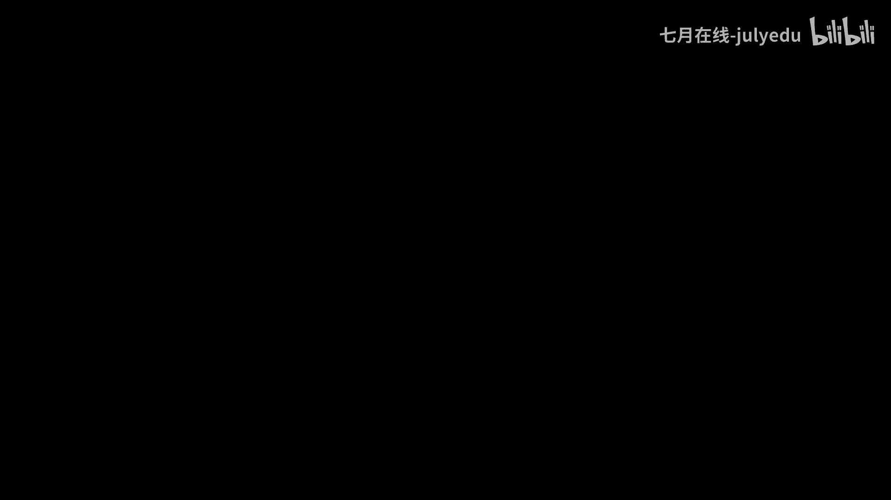
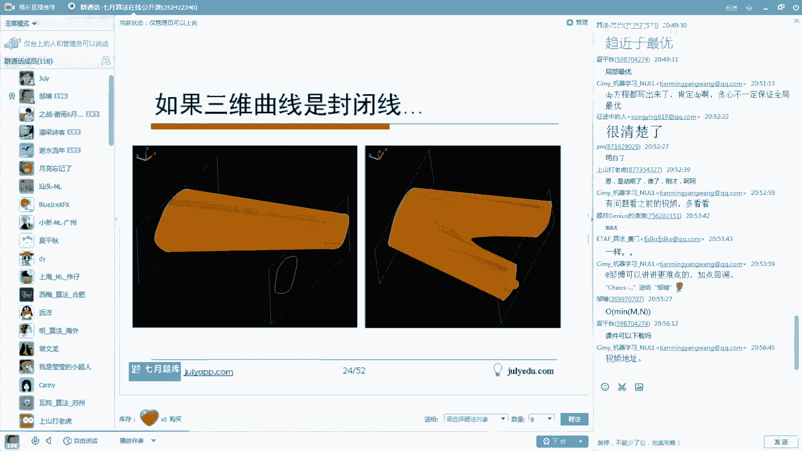
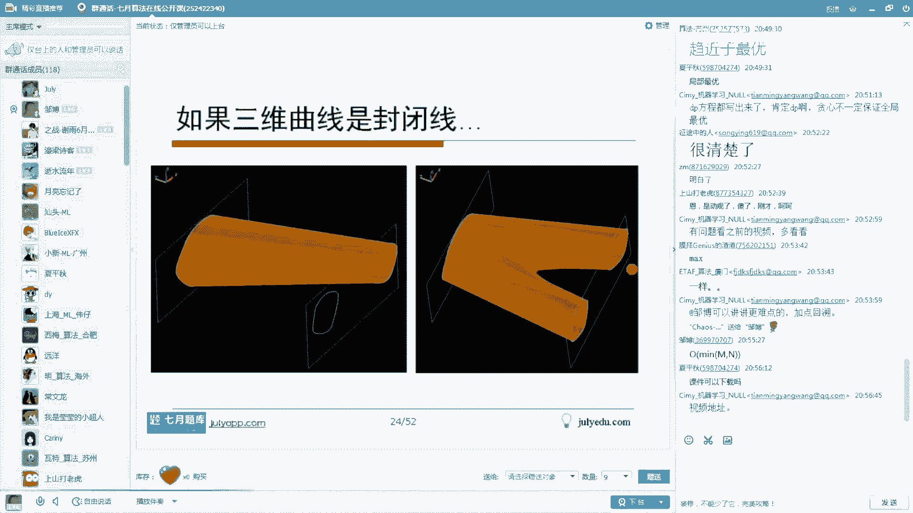
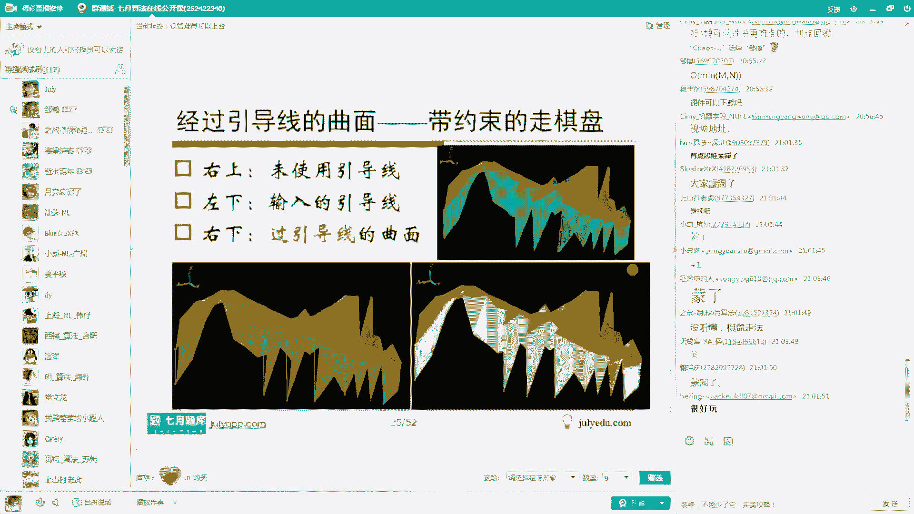
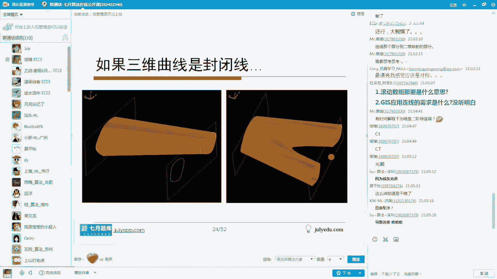

# 人工智能—面试求职公开课（七月在线出品） - P9：探秘校招笔试面试 - 七月在线-julyedu - BV1Xf4y1r74s

。我的总体体会哈就是现在的这个笔试和面试的题目是越来越难了。并且这个他在除了考察这种编程语言、数据结构、数据库、操作系统、计算机网络。此外，这种此外哈，它还增加了好多像算法，像逻辑以及数学方面的题目。

而数学方面的题目呢，大家要尤其重视概率论这个方面的内容。呃概率论啊、数学统计这方面内容大家尤需要重视哈。然后呢，此外就是积极学习的题目，它做了一些增加难度呢也有一些。提升哈呃呃贝斯是属机济学习的内容。

我个人觉得哈，当是你再把它归类到数据归类到数据挖掘。一个意思哈，然后那个呃概率论这方面呢，可能更多的是考考察的就是咱呃大家在概率论和数统计那本这个一般大家的这个这个学习过程中。

那个大家本科生的教材或者营生教材哈，一般是这么个过程哈，就是概率论数学统计算是一门课，一块来跟大家交交涉哈。我一般是感觉是这样子。然后只不过这里面呢，可能在面试里面会大量充斥着一些关于算法和逻辑的题目。

大家有时候就会有些疑问哈，咱在以后的工作中，算法这种逻辑题真的会用吗？我觉得这个事情啊，咱们可以先唠叨两句哈。事实上呃算法题目分两两种。有一类的工种工作哈，真的会用到算法。

但是真的并不是所有的内容都需要它。但是呢尤其对于校招来讲的话，他没有一个更好的一个判断你能力的一个尺子来去度量。我应该是选择哪一些人，他总要筛一些人选一些他觉得合适的对吧？像这些基本内容以外的话。

他觉得考察算法是非常接近于我所想要的人才的对吧？他就会拿这个东西去呃，作为一个横量。另外呢就是说即使是突击学的算法，如果你学的还不错，就是通过了面试官和公司的考核的话，他觉得okK那这样的话。

你在学习其他内容的时候，应该也是一个非常好的一个苗子，对吧？所以说基于这个考虑哈，所以好多公司再去做呃，笔试面试题目的时候会增加算法题目，会增加逻辑题目。我想他的原因可能是这样子哈呃这个。

我只我个人的一个想法哈，大家看看是不是这么个东西哈。呃，这样呢咱就哦，对了，还有就是那个做广告了哈，就是呃大概在10月11号呃，每周六每周日下午的天到4点是我们的即将开始的10月算法班。然后呢这个。

还有一个9月机体学习班，它的时间是10月11号开始，每周六和每周日的晚上是9点到21点，就是晚上7点到晚上9点哈。就是说咱的9月算法班和10月算法班。

其实它的开始时间都是11月10月11号哈啊都是11月11号开始的。然后呃我大概罗列了一下这个它的算法班的这个。呃，大纲以及机学班。因为机学班有24课，那内容实在好多哈，然后我就随便截了一下后面的那几个。

然后大家有兴趣呢可以看一下哈。好了，这是关于呃报名的话，就直接呃我这儿一般右下角有一个主lyDU点com，这个是我们的官网。这个打开这个官网之后，就能看到它的报名链接呀，以及它的一些相关内容哈。

主赖APP点com呢是那个附属于官网之下的一个专门为呃手机app做那个一个做的链接哈。就在这里面大家可以发现知道我们的app有分安卓版跟那个IS版，大家可以在里面下载哈。呃，主要U点com。

大家打开这个就好了哈。里面有论坛，有这个社区论坛哈，然后还有一些课程，还有一些相关的内容哈。嗯，好了，这个我大概呢去贴了一下这个某一些公司今年的校招的一些题目哈。呃，咱随便看一个吧，比方说这个。

第一个为为例哈，比方说我们在这一个八行乘呃八列乘6行这么一个矩阵哈。然后我从A去移动到B的。过程之中一共有多少种不同的走法，要求是我只能够向上和向右来走，不能够走回头路，并且不能够经过P这个点。

就这种题目哈呃不算这种难度，我觉得应该算是中档吧。就是说不算难。但是呢我们还是需要稍微的考虑一下。像这些题目呢，咱等会儿会跟大家一个一个的去梳理，看一下它到底是怎么样去做哈。好了，呃。

你想有这种这种题目，我觉得其实是个算法题。而第二个做期望这个题目对吧？它其实是考上的概率论和数学统计方面的内容哈。而这个是一个典型的逻辑题目，需要在这里面，咱知道怎么样去推导推理，对吧？呃，这个题目呃。

你说它是算法也行，说它是推理也可以，对吧？就是说取这100个数，它们可能的绝对值的差的和，最大是多少。像这个题目显然是一个呃比较怪异的一个概率的题目。这个题目其实有一个。有一个更有趣的问题叫三门问题。

大家有兴趣呢可以去呃在我们的。那个7月份的app上或者是那个一些这个网站上去搜一下这个问题哈，都是一些很有趣的关于概率的，并且经常考的一些内容哈。这个是一个看起来像是一个推荐系统方面内容。

我们待会看看它到底里面想考察什么，其实没有那么的难哈呃这个呢我们就不再一个个的过了哈，然后我们只是跟大家看一下这个咱今天跟大家聊一些有关的题目哈，先看刚才的说那个所谓的推荐系统里面的一个小东西。

它是有先介绍一个背景哈，就是说呃商品推荐的这个场景哈。如果你是过分的去聚焦在这个商品推荐上，其实往往会损害到购物体验。有时候呢这个系统会选择一定程度的随机性来去给用户增加一些惊喜感，对吧？

惊喜度也是推荐系统需要考察的一个度量标一个一个呃一个标志哈。比如说我们假定在某一个推荐系统里面，想去计算A和B这两个商品，他们与当前访问用户的情况。假设说这个我用户来了。

并且他算出来了这个用户和A商品的匹配度是0。8和B商品的匹配度是0。2。这是我们经过其他的相应知识来算出来的哈。然后呢，我们系统呢随机的给这个A这个商品生成一个从0到0。8的均匀分布的一个得分。

给B这个商品生成一个从0到0。2的一个均匀分布的一个得分。然后呢，让你算一下。这个能够得到B的这个得分，本来是0。2嘛。那么说B的这个最终得分会大于A的最终得分的概率是多少？

大家先看把这个题目先读一下这个题目很长，但其实考察内容看起来像是推荐系统，但是向机器学习，对吧？但是呢它后面考察内容其实是让你算概率。呃，这个题目大家有嗯有感觉吗？怎么做呢？哦，卡卡说是条件概率。嗯。

那谁是条件呢？这种题目哈就是说哎糊的不亦乐乎，确实是糊了。非常好非常好。是这样哈，就是我们可以在这里面算面积就可以了。怎么算呢？因为咱这里面涉及的是A商品和B商品。人我们人类哈最习惯的是二维的一个东西。

而现在它给定的就是让算两个商品之间的东西，因为二元关系是很有趣的关系哈。当然，三元关系更有趣，对吧？然后A呢是从0到0。8的一个均匀分布。😊，B是1个0到0。2的均匀分布，因此我就画出横轴A和纵轴B来。

对吧？各自组成两个轴。A从0到0。8变化，B从0到0。2变化，因此它们总体的变化域就是从0到0。8和从0到0。2这么一个矩形，对吧？现在呢都是均匀分布的O这是这个二倍上也是矩上也是均匀分布的。

现在让我们算的是让B的概率大于A的概率，那很显然，画一条Y那个A等于B这么一条斜线，对吧？位于三角形的这个区域上这个这个点，比方说红色点在鼠标能看到吧，就鼠标假设在这个位置哈。

大家会发现这时候B它的值是这么高，对吧？如果鼠标在这儿的话，A是这么大，所以说这个B是大于A的嘛。所以三角形这块面积是满足B大于A这个情况的。一共满足条件就这么大，总共的是矩形面积。

OK算一下三角形面积，算下矩形面积一除就好了嘛，对吧？蓝色面积大算了下去，我算成0。02，矩形整个的是0。2乘0。80。16嘛，OK1除0。125。8分之1对吧？OK这个题目就做完了。有问题吗？哦。

那个。多谢捧场。😊，像这种题目哈，就是说呃往往遇到了这种算概率，并且是2元的事情的话，你其实直接画个面积一下子就出来了哈，没必要去真正的去去推导哈。你推导的话反而麻烦了，对吧？

我这里面呢为了让大家能够去理解这个事情哈，呃，咱再找一道。题目这个题目也是今年的一个实际的一个面试题哈，是这样子，大家思考一下，就是说假定AB两个国家元首。

他们相约在首都机场晚上8点到晚上12点之间去交换一个重要的文件。然后呢，如果这个AB两个国家的飞机哈，假设A国的这个飞机是先到的。okK那么A国的这个元首哈，它会等一个小时。

假设如果是B国的这个飞机先到的话，那么说B国这个元首会等待两个小时。现在呢我们假定这两架飞机，它们都是从20点到24点均匀降落在这个机场的，它的降落时间，它的分布是有均匀分布的。OK你算一下。

它最终能够在20点到24点完成这种文件交换的概率是多大。这里呢出一个呃就是加一个小tck，就是说我们假定交换文件本身是不需要时间的，就他们俩如果能碰面，okK就就算交换成功了。就这个题目哈。

这个题目呢我没有给大家给出解析。呃，大家可以思考一下怎么做。然后呢呃。就是那个咱的app上是有的哈，然后有兴趣呢，我可以把大家先想想。然后呢，咱在今天比方说假定咱的一个半小时之后结束的话哈，呃。

最后呢我把答案贴出来，好不好？😊，大家可以想想啊，都是一样的一个套路哈。这个题目比刚才那个题目呢难度要略高一点，略难一点点。就是它的画图呢要比它麻烦一点点哈。OK我刚诉大也是画图了。是吧。😊，哦。

就是那个电那个手机端好像是不行的，手机端好像只能听见声音，看不见APB看不见PPT的，只能是电脑端才行。好像是麦克是搞不定的，必须装虚拟机了哈。嗯。这个题目原题哈，它其实指的是在萧山机场。

ok大家知道是哪个哪个哪哪个公司的面试题了，是吧？是萧山机场，我记得应该是。嗯。约会问题，哪个约会问题？约会问题有好多好多是吧？好了哈，我们先呃就是mrZ先给个。😊，这个这个这个记记的解释啊。

咱后面看具体的后面的内容哈。我们来看第二道题目，是这样子，就是说我们给定一个公式是84乘148等于ECA8。如果是成立的话，那么说请问这个公式它采用的是几进制？OK是的，把刚才那个飞机换成人。

就是约会哈，没问题。嗯，OK这个第二这个问题哈，就是说如果它乘它等它的话，那么说这个公式成立的话，它是几进制了呢？这个题目应该怎么做呢？这种题目。事实上这种题目哈有一个放之四海而皆准的一个标准解法。

假定你是一个X进制的那这样的话，84就是8X加4，这个148就是1乘X平方，加上4乘X加8，对吧？BCA8，显然B是11，A是10嘛，对吧？这是10乘以X3次方，6乘以X平方。

10乘X8再加上这个8对吧？左边这个式子相乘等于右面这个式子OK你化简下就出来了，对吧？这个式子是不可能等于零的，因为X是大于零的一个整数嘛，然后这里面只有X等于12是可以的。这种做法是完全最标准的。

所以大家直接去呃遇到这种题目的时候，如果上来硬算，直接去这么算，一点问题都没有。对吧呃，第一个常规做法，大家看有问题吗？OK啊，刚才那个说到那个呃那个交换文件那个事情啊，就是概率论那本书上啊。

就是大家随便找一本概率论的书。呃，只要把那里边的古典概型问题搞清楚哈。一般来讲遇到面试题目呃，还是嗯。还是还是一般都能应对哈，起码是但是需要稍微的就是再把。往届的题目拿出来自己再练一遍。

那个清楚的去了解一下它的套路就好了哈。因为咱在学的过程中跟实际用的过程中它有一个台阶有一个差距。这个差距呢咱好多大学课程里面其实是缺失的。对吧咱需要把它补上就可以了。嗯。OK哈，好像是那个。

好像是那个就是征途中的人，那个好像是是是个是是个问题啊，是32分之19的，我我不觉得答案了，好像是这个。呃，这是第一个解法哈。第二个就是刚才STU爬虫说了，计算尾数就够了。是的，我们看一下。

如果启发式做法怎么做呢？事实上，如果在十进制体下来表述的话，左侧的这个是尾数是4，然后这个右侧的这个数是8，对吧？那4乘8其实48是32嘛，对吧？右侧这个个位数是8O这个32和这个八的差是24嘛，对吧？

那24的差既然是24，那这样的话，它的进制必然是24的一个约数，O这个里面只有12是24的约数嘛。对吧因为你这个24一定要是能够整除它的这个进制嘛，这肯定的对吧？他他他是。多了个零嘛，他一定是20。

只有C是20的对吧？这样子也可以搞定，对吧？然后这这种做好简单是吧？而呃我说明两点啊，就是说咱用十进制来做这个事情，仅仅是个技术习惯哈。另外就是说咱第二种做法可以作为第一种解法的一个辅助手段。

我们来相互交互验证一下，是不是做对了，对吧？这是跟人家说明的两点问题哈。OK这个题目有问题吗？嗯。OK那咱就继续下面的内容。继续了啊，没问题吧。😊，OK哈，就大家这个这个咱今天是一个公开课哈。

然大家记得轻松一点，这个有问题咱就问，然后没问题咱就过，咱就讲一些有趣的内容哈。😊，这个题目呢稍微的有点麻烦，就是它是一个N个数的差，我把它叫做这个题目的名字，我得起了个名哈。它是这样一个说法。

就是说我们从123到100这么100个数任意的去排列，形成一个环，或者是一个圈，一个任一个路，对吧？然后呢，我们要求的是求两个相邻数的差的绝对值求和最大是多少。当然有些的选选项，大家看看哪个答案是对吧？

首先这个题目本身没问题吧。从1到100连完做成个环OK后面数减前面那个数取绝对值，对吧？然后把这个绝对值加起来，哪个数那个这个绝对值的和最大能够达到哪个数能达到最大呢？对吧？能达到最大的是多少。

就就就这意思。这个题目本身没问题吧，题目的理解。就是我我一直是感觉，就是说咱做任何事情，先审题，题目想让他干上，咱搞清楚，对吧？然后我们再来考察后面如何去解这个题目。好的。

现在呢我们就来去琢磨下这个题目应该怎么做。我个人理解这个题目哈，用构造法是最合适的哦。blue eyes说了，用选E2500，是不是我们等会看看是不是哈。看一下哈。

他这里让我们算的是相邻两个数的差的绝对值。OK那这样的话。相邻两个数的差，这里从1到50，从51到100分两部分。然后呢，我把这个1到50叫小数，从51到100叫大数，这是这个是我个人的定义哈。

就是后面这个定义是完全我个人的，为了咱表示方便哈，咱就这么来说了哈，就是说把51到50叫小数，51到100叫大数然后呢，我们把这个相邻元素的差的绝对值好长一个东西啊，我们简称叫绝差之和。

这是绝对值差的和是吧？我呢叫绝差之和哈，造个名字。然后呢，我们看看怎么样去。呃，做这个事情哦，blue eyes这个想法没问题。先想想这里面它其实有一个问题是可以循环是吧？所以说这个你这个。

🤧结论哈稍微的再琢磨一下。现在呢我们来给定一个贪心的思路，就是为了让觉差之和起最大，我们就应该去先性的指导，要避免把大数跟大数放在一块，对吧？你俩大数放在一块儿的话，你抵消掉也好不好多不分嘛。

因此我就考虑怎么办呢？把大数和小数间隔着排。就是1234到50，后面跟着是各子跟着199，981到51懂可以吧，对吧？就是大数跟小数间隔着排OK事实上这个序列就是我想要的绝差之和最大的那个序列。

OK为什么呢？我们需要给出一个证明，对吧？那我就看一下怎么样去做这个事情呢。我们可以想想，OK我们如果说这个序列里面呃两个小数X和Y进行交换，或者是两个大数A和B进行交换，或者是大数和小数进行交换。

它都能得到一个我们想要的结论，或许就能搞定了，对吧？我们来看看怎么样去具体的来去想它呢。因为就这种三种情况，对吧？大的跟小的换大的小的跟小的换，大的跟大的换，除此以外，没别的情况。

我把所有情况都给你分析完不就完了吗？对吧？那这样的话我们看一下小数和小数换，假设用小数X小数Y来换O那这样的话小数X小数X的周围两个数一定是大数A和B，这个我假能记得XB哈，小数Y。

我记作它的周边周围两个数是C和D，对吧？这是我们的记号哈，那交换之前是长这样子的，交换之后，这个Y跑这儿了，X跑这了，对吧？交换之前的绝叉是X是A减X，B减X这个是C减Y，这是D减Y，对吧？

把这四个数加起来，就这个。交换之后呢，是A减YB减YC减XD减X，也就是这个数。大家会发现这两个数交换完之后觉差是一样的。对吧他觉他这个是一样嘛，都是ABCD减去2个X2个Y嘛。

ABCD减2个X减2Y嘛。所以说小数和小数换其实相当于没变。对吧。第二个。那大数和大数换呢就大数我记作A和B来交换啊，A两边我记住X和YD两边变成小数，因为我的构造方法是交叉的来做嘛，对吧？

这样的话B两边小数是Z和W记我知道记号哈。那么说交换之前就是这个。A减XA减Y，这是B减ZB减W交换之后的话，把B放到这儿，把A放到后面，对吧？那就是B减XB减Y。

这是A减ZA减WOK这两数一看还是相等。对吧然后第三个，如果我把大数小数A和大数Z做交换，小数A，我我这么写哈，它两边是XY是小数。然后这个大数是Z，这样的话，它两边是B和C，对吧？这样子的话。

大家会发现我如果交换之后的话，把Z放到这儿，把A放到这儿的话，你会发现绝叉交换之前是A减XA减Y这个B减ZC减Z，对吧？这是。交换之前的交换之后呢，发发现这是Z减XY减Z对吧？加距值值哈。

这个是A减BC减A加距值值，对吧？会发现这三个是大数凑在一起，这个是三个小数凑在一起，大家非常清楚能够把它证明出来，交换之后的话，它绝差，这个会变小。因为这里面它相互的抵消好的部分嘛。

这里面是大数跟小数讲减嘛，对吧？所以说你交换了。还不如不交换，你交换的话会导致你的觉差变小。而刚才这两种情况的话，你交换的话相当于没有任何效果，对吧？因此的话。

相当于我就证明了原始的这种状态是能够使得觉差之和最大的。对吧而这种原始这种状态，112099398这种情况，它的觉差是多少呢？后者减前者100减1是99。2减100或者100减2是98，这个是97。

这是909090减3，这是90。6对吧？然后51减50是1，然后一和51的差是50，对吧？而这个数我们加起来很方便得到。50就5000对吧？因为正好是。1到100加起5050嘛，就少了150嘛。

所以是5000啊，对吧？这是我们得到的结论本身。第二呢就是呃我们从刚才的这个小小交换和大大交换会知道哈，咱最终的这个觉差的这个最大序列不是唯一的。就是你可能构造一个这样的序列，它绝差之和是最大的。

我也可能构造一个别的，仍然是最大的。但是呢跑不出去，我通过小小和大大做交换，能够交换成跟你一样的。对吧。嗯。哦，我我加绝对值只是我因为我不知道这个X的Z谁大谁小，对吧？而这个这样的话，我我这写反了哈。

相当于这个我认为A大哈，AA大X小的话，就A减XA减Y了嘛。这这我这写反了，应该是大数A和小数Z哈，对吧？😊，因为我假定了这个红色的是大的，绿色是小的。对吧就是红的大绿的小。

OK你这样的话一减肯定你变小了，对吧？所以你交换还不如不交换。OK这是这个题目本身哈，我们看看大家有什么疑问吗？😊，就说呃刚才一朋友谈到了利用绝对值不等式的性质，其实就在这儿利用，对吧？

大家可以把它好认真可以算一下，对吧？如果是大家其实现性的一看就知道你这样会不会导致你的值变小，对吧？还不如这样放。嗯ん。如果某种排列不能根据你的排列器进行一步交换，得到的，怎么证明？他比你小呢。呃。

就是我我影证明什么呢？证明我这个序列，不管是大数跟大数交换，大数跟小数交换还是小数跟小数交换，它都不会得到更大的了。那显然这是最大的。因为我里面这个数我分成大数和小数两类，对吧？

然后我的交换可能性只有大大交换，小小交换跟大小交换，就这三种，我都证明了不可能。那不就得到结论了吗？我是这么一个想法哈。呃，OK这个题目嗯，那好。😊，这样。

数这样数围成圈和不围成圈直线排列情况的结果是一样的了。嗯。我没有好好思考过这个事情哈，我只是。看看哈，如果是。你要是不考虑他的话。少了这个减这个。感觉上可能不行，就是新媒朋友问的这个事情啊。

我觉得可能应该不对，应该不是哈。因为要是少了51和50的话，他那个。我感觉。但是我没有好好考虑哈，咱们可以好好想想这个。因为这里边会涉及这四个数价格不一样，对吧？我感觉是不对的对吧？是的。嗯。

我的意思是交换两次、三次、4次，而不是交换一次哦，你看哈我知道小小交换交换一次相等，你交换两次还是相等吗，交换三次还是相等的。你大大交换的，交换一次是相等的，交换两次也是相等的。并且你如果大小交换的话。

交换一次就小一点，交换一次就小一点。那这样的话，相当于你我就证明完了嘛。对吧。呃，两两减为什么要用一减51哦，它题目要求的语一朋友问这个事情啊，就是它题目要求的是这个围成一个圈。

让我算这个两个数的这个差值和哈。我这个序列是长这样子的，但51和1是相邻的所以就是用1减51做绝对值嘛，那就是50嘛，1减51加绝对值或者51减1一个意思嘛。如果有个新的序列通过两次交换得到。

第一次交换绝对值之和变小，但第二交换又变大，有没有可能超过对数的大小哦，不可能。因为我发现啊这三种可能交换方式要么就是相等，要么就是变小，不可能变大。对吧就是L。LIY同学问你那个事情哈。

因为这可能交换交换方式里面不可能有变大的情况。你看小小交换，它最后得到的还是那个交叉排列的情况。你看这是它变到这儿，它变成这，还是小大小大这种情况交叉排列的。大大牌的也是这样子的，对吧？

他还是这样的一个情况，这也是这样子的对吧？变成这个和这个他不可能再再变得更大了。嗯。这个怎么证明maxI从1到N？嗯。😊，令N加一等于1。令N加一等N加一等于一什么意思？嗯。是说的省略号是吧。

就是1到N加1什么意思？不是s加一等于一是吧，那那个那个那个后面那个。呃，就是这个题目哈，就是说呃。这个题目事实上通过这个方式，因为这个方法，我觉得就是就是构造法。咱们构造一个序列。

我看能不能通过交换的方式交换成为更大的。但事实上我突然发现第一次交换的东西就形成了一个更大的了，形成一个更大的就就就就就这就结束了。如果咱的题目里面会出现一个。我如果交换之后能够变得更大。

OK我一定交换过去。对吧我就能够交换更更好的事情。嗯。嗯。你比方说我突然想起来最小生成数，不管是perme算法还Ccard尔算法，对吧？咱不管是以边，每次添加一条边，还是以点，每次添加一个合适的点。

那个两个非常重的算法，prome算法。Cscard算法，这两个最小生成数，他们其实都是贪心算法，他们想法思路都是每次都选一个最合适的对吧？没错，就这个哈，然后呃其实思路是完全一致的。

都是先贪心的去搞一个东西出来。然后我最后证明不可能有别的思路能够比我这个贪心更好的情况，这就得到一个结论了哈。呃，所以我觉得这个题目本身呃是一个问题。另外呢就是说这个题目蕴含着的一些事情哈。

就是说如何去做思考，也是我们。需要更进一步的去去想的事情哈。嗯。OK这个题目能过了吗？O哈，刚才正好加了不少朋友进来哈，不知道能不能，那咱就正好从。呃，从这个题目开始吧。

因为正好是前面是一一个系列一个系列的嘛，一个题一个题的。所以说呃后面的题目跟前面的题目他们相关性很弱哈，有相关性的不大，后面会看到哈。呃，这个题目是一个非常非常经典的题目，经典到几乎任何一本书都会谈到。

是的。😊，是的，就是这个东西哈，我来看一下。😊，隔的血数或者叫走期盘这种东西哈，给定一M乘N的矩阵。然后呢，这个矩阵里面每一个位置都是一个非负的一个整数。

我这里面呢用一个彩色的值来表示它给定了一个非负的一个整数哈。呃，非负数也行，其用说这整数的意思是为了咱可以用int来支存它哈，你用fat，你用大爆其实跟那算法没关系。然后假定我在左上角放个机器人。

这个机器人呢每次只能够向右和向下来去走，不能够往回走。然后呢，他最终会走到右下角，对吧？那么说请问我从左上角走到右下角的话，这个经过的最小的那条路径是什么？对吧就是这个题目哈呃这个题目本身有没有问题？

😊，先把正把题目的审题验过了哈，题目有问题吗？题目的理解。好，行码没问题哈。有朋友谈到了大明朋友谈到了动态规划DP，然后HU朋友说到了组合排列，然后blue艾说是一个深度的呃优先搜索，对吧？呃。

深优先搜索有点过分了哈，因为那个时间缓了有点高，对吧？然后咱。有有时间咱给谈一些有趣的话题哈，填表法是个问题啊，是个事情哈了。呃，贪心和刚才那个动态规划，他们本质可以看的是一码事儿，对吧？我来看一下哦。

没必要用A星哈，呃，这个题目没没必要上A星A星的话，启发式的搜索，对吧？咱没必要上A星。如果是你要是算在那个。一个区域上，比如说在一个省份或者在一个全国这个范围里面求两个点之间最角路径的话。

你用A型算法应该是不错的哈。但这个题目没必要了。呃，就相当于是什么呢？相当于是你给你一个简单的一个，让你把一个鸡给杀了，你请了武松过来，没必要，对吧？就是请个柴进就就足够了哈，就这意思。呃。

O我们看这个题目怎么做的哈。O既然是它要从左上走到右下的，我们就来考察某一个点它的情况。首先我们知道哈在走的方向决定同一格子不能走两次的对吧？它是因为从左上到右下嘛。那么说它如果在红色这个点的时候。

那么说它可能是上一次来自于哪个格子呢？那很显然，他上一次要么来自上方这个绿色格子，要么来自于左侧这个绿色格子，除此以外，没有别的情况。对吧。我们就用1个DPXY来表示它如果位于XY这个点的时候。

它的最短路径。那么这样的话，这个DPX减1Y是它位于左边这个点，它的最短路径，对吧？那么。DPXY减一是指的它位于上面这个点，它的最长路径，对吧？那这样的话，这两个最长路径。

它们各自加上AXY就走到这个当前这个红色点，这两个值谁小，我就取谁就是能够走到红色这个点的最短的那个路径。对吧当然这个里面把这个公因式AX加Y可以提出去，对吧？得到这个式子，那咱变成好边嘛，对吧？

就是它两只谁小，我取谁，最后加上红色这个点就OK了。这个是普通的一个点上的事情。第二。😡，如果说假定它位于这个点呢，位于第一行呢，OK它如果位于第一行表如绿色这个点的这个位置。

它只能够从左到右依次去加上来。因此第一行的这个值就是前第一行的这些数的累加第一列的这个紫色，比方说这个棕色这个点哈，它是怎么过来呢？那只能是从上到下依次累加得到的对吧？所以第一行第一列我单独处理。

而中间的某一个点，然后我用一个最小值谁小我算谁的，加上去，最后就能得到又最后我去返回DPMN那个值就是。走到右下角的时候，它的最短路径的值是多少？对吧就是这个题目本身。

OK这个题目咱的解析就算是说说完了，有问题吗？呃，不知道有没有说清楚哈。😊，嗯，O会飞的鱼说了一下，贪心一定是最优的吗？贪心不一定是最优的，很显然，对吧？

这个题目里面如果是你我们更多的是把它说成是动动态规划，对吧？这个题目如果贪心的话呃，难说是吧？然后。嗯，贪心往往是能够得到一个还不错的解，但是一般而言不一定是最优的对吧？

但是呢贪心法其实是在积极学习里面用的更多，比方说咱去做梯度下降，咱就做梯度上升。呃，做为那个周标上升，本质都是贪心，对吧？因此梯度下降得到的是一个局部的优解。嗯ん。DP方程都写出来，肯定DP啊。

大家OK哈，就明白了。等我上O。O哈好的，这个题目，这是这个题目本身。下面呢我们来对这个题目做一点点的更进一步的分析哈。第一个就是如果这个题目里面把刚才我们说的，让你求最小路径。

从左上到右下这最小路径变成最大路径，大家会做吗？从最小变成最大。如果从最小变成最大的话，其实上面所有的分析过程就把里面的命变成max。所有的都不变，对吧？是的。

所以说这个题目相当于里面蕴含着两个对偶的问题，本质一样的对吧？我们就不再谈这个事情了，这是第一个事情。第二个，我们来继续分析它。呃，我们通过刚才的这个写法哈，其实可以呃不要着急。

这个咱今天呢谈一谈这个内容哈，呃难的题目呢呃今天准备的题目后面有有那么几个稍微难一点的哈。此外呢，其实还有一些呃需要做深度性搜索。然后才能够完成的内容。咱可以在后面的那个有机会的时候。

咱跟大家继续去聊哈。呃，这里呢其实大家千万别重要重视这个事情哈。就是什么呢？咱通过刚才的这个写法，其实非常方便能写出更漂亮更规则化的状态转移方程，对吧？第I行第零列对吧？

也就是呃第零列这个东西或者第零行这个东西都能写出来，对吧？这是第。嗯。第零列的对吧？这个是第零行的对吧？然后这个是任何一个点的对吧？此外大家其实可以发现哈，这里边咱可以使用动态滚动数组的方式来去降为。

因为如果你这么写状态转移方程的话，其实你的空间复杂度是M乘N的OM乘N对吧？但是如果你这么写的话，把这个DI这个第一个维度扔掉的话，一行一行的去滚动的话。

其实我的状态我的呃空间复杂度就能降到O mean就是类似于这么写法。就类似于这个说法，对吧？是M和N的最小值。前面是个大O对吧？这么个东西哈，所以空间反能够从。大体上从N方降到了N，是这个意思哈。

然后我把代码呢跟大家做了一下，这个代码其实是降维之后用滚动数阻来写的。大家可以参考一下哈，就是这边其实给随随机给定了一个棋盘，然后我怎么样去求最长路径，然后我先去初始化，初始化这个其实就是这个东西。

然后呢，这一块就是谁想我取谁，然后只是做了一个这个滚动数组哈，最后我返回第N个值就好了。这是呃这个它的那个相关代码，大家可以看一下，那个有兴趣，因为笔试嘛笔试面试里面有时候不光考你算法。

还需要考你实践啊这一部分基本功我们需要把它打扎实哈。好了，那课件的话，我们等会儿放到群里好了哈，对吧？然后课件没问题啊，这这个咱把它下载了就好了哈。😊，这个一点问题没有哈。嗯。

然后呢这个题目我们继续去挖掘它。其实这个题目就是我刚才咱刚才说到的，为什么有些公司他去面试的时候会考你算法呢？不是说算法在实践当中没用，这个题目就有用。虽然看起来这个题目很简单。

就因为刚才有的朋友说讲那么简单的问题，我们觉得不爽，对吧？但是事实上如果给大家出个别的问题呢，这个题目经常跟大家分享哈。假定我们空间中有两条曲线。

这个蓝色的这个其实是一个绿色这个点组成是个空间的一个曲线啊，它是记得拐弯的空间给定的。然后呢，如果给你空间两条曲线的话。让你实际里面去连出一个曲面来。要求是什么呢？

要求是这个曲面去经过给定的这两条线的控制点，这是第一个要求。第二个要求就是生成的起面最好看。就是两个要求哈，其实硬象就是第一个。第二要求就是你时间你发挥了。这个题目是我在实际里面。

实际这工作里面这个项目上需要做的一个内容哈，也是一个我们这个软件里面，就是我自己开发的一个软件啊，就是说呃算是号称比较核心的一个一个算法。最难的就是什么叫好看？对吧什么叫好看呢？我是这么定义的。

就是说如果我给你的一个曲面，它总有一些连接线，对吧？中间会生成一些这个连接线嘛，就白色这个线，对吧？我定义，如果这个连接线的加和是最短的，我就认为我生成这个曲面是最好看的。

我把这个东西起个名字叫做能量最低，我认为能量最低越低越稳定，就可以吧。对吧我就这么这么这么说了，OK我就以这个为我的目标函数做事情。怎么做呢？事实上这个做法非常简单。就是因为左这是一条线，这是一条线。

那么说左边这个线假定有M个值，右边这个线假定有N个值。那么说第零个点可以和这第N个值各自求距离。第二个点各自求距离，第三个点各自求距离。因此在我眼中给定的这两条线，其实是一个二维表格M乘N的。

他让我做什么呢？让我做的是从这个二维表格的左上点，从零号到0号的这个这个线连接起来，一直连到DM行和DN列的这个连起来。最后形成的这个路径的总和最小。它对应的就是我这个曲面最好看。对吧。因此。

并且这个里面跟这个题目完全对应的，因为它不可能走回头路的，一旦走回头路，这个曲面就自相交了，对吧？自相交，自己和自己相交了，不可能。因此我就利用刚才那个代码，只不过加上咱实践里面的一些这个。

这个这个这个项目相关的一些一些内容把它生成出来，最后得到就是这样一个曲面。我把这个曲线呢把它加密了一下，OK得到也是这样一的东西。这个这个代码已经是经过实践的有效检验的话，应该实际里面效果还是不错的。

这个就是大家分享的一个有趣的一个话题哈，就是如果给只给你道题目的话。你会发现其实很难，但是呢它背后隐藏着那个算法，好简单是吧？就是一个二维棋盘左格子的问题。事实上这个题目我可以把它做的更漂亮一些。

就是说如果给定了这个两条线，不是这种这种折线，而是。而是两个封闭的环，我就会生成一个柱状的体。如果给定了一个是一个环，另外是两个环的话，我会生成一个带分支的一个区别。

如果说我在给定一个上面一个曲面，下面一个曲面，我中间会得到一个曲面，对吧？我就能生成一个企。我甚至于要求生成的这个曲面。我最开始生成这个蓝色曲面哈，这是绿色曲面，我经过用户画了一些引导线。

我必须经过这个引导线的话，会得到粉色的这个曲面。而这些都是咱在刚才所得到的这个二维表格的时候，强制经过某个点，就是经过一个这个引导线嘛，强制经过某个点，只是对刚才这个算法做一点点补丁就够了，对吧？

大家有兴趣可以思考一下相关的问题哈。

OK这块有问题吗？

这是咱跟大家分享的这个题目哈。😊，呃，有问题吗？大家给个反馈。呃，因为他跟实践相关了。对吧。嗯，我感觉是这样啊，就是说其实。嗯，就是就是什么呢？就是说大家最基本的哈，就是说先了解这块。

就是说这个算法很很简单，对吧？刚才我讲到这块，大家反应还是很正常的。就是告告诉我是这块懂了没懂，我们有些交流，讲到后面这块大家懵有点懵是吧？但是其实无所谓，对吧？

就是一些算法在实践中的简单的一个应用而已，对吧？因为我本身是记得出身哈，做计算几核出身的。

所以我可能觉得就习惯了哈，那是大家稍微简单思考思考就是了。而我说的我稍微加一点内容哈，大家不妨再思考一个问题。空间中给定一条折线，然后呢我让你在这个折线上加一些点，加密它形成一个更光滑的曲线出来。

大家知道怎么算吗？这个其实是我们在呃。也是一个正常的一个算法哈。事实上他要求的一般而言是要求的二阶导连续。其实这里面隐藏着一个这个算法本身要比连曲面不简单的。

这个有有幸大家可以看可可以琢磨一下这个问题哈，怎么样给定你的一些空间点，我让它光滑出来得条更好的线。嗯，OK我们看看大家的问题哈。😊，是的哈，就是二维映射哈。嗯。滚动数阻那里是什么意思？

即使连线的需求是什么？没听明白哦，滚动数阻这是仅仅是一个做的降维。就是说呃本来这是个二维的。如果你做这个编程的话，大家这样吧，就说这个代码是我仅用了ON的时间复杂度去实现的空间复杂度哈。

然后大家如果用简单的这个直接版本的这个转转方程，其实是OM乘N的空空间复杂度，大家可以把这个实现一遍，再跟这个对比一下，就能够知道这个滚动数阻到底面是什么东西了。大家不妨把这个思考一下哈。

其实这里面虽然算法本身并不难。但是里面把所有的细节都搞清楚，我觉得才能够算这种题完全掌握了哈。就是你可以对任何人去阐述这个事情。不管是面试里面，还是在工作讨论里面哈。第二。

G41连线的要要求就是说给定了空间两条曲线，然后呢，你生成一个曲面，要求的是曲面呢能够过这个原始的这些两条线，并且生成这个曲面最好看。因为其实呃生成的过程不是这这一种，还有别的连接情况。

但是呢别的情况呢，我定义做没有我这个好看。因为我说我这个能量最低。我刚才一坨东西哈。就这个的就是我的应用就是这样子的，相当于是什么呢？相当于我比方说大家想想它的应用是什么呢？

就是说比方说假定我们做CD扫描。就CT扫描得到脑成像的两个距离很近的两个面。我现在需要把这个脑这个这个脑的这个三维形状给它给反衍出来。其实就是这个算法哈。嗯。二连续是光顺的。呃，这个咱就不讲了哈。

就是说这里面其实呃用二调导连续是最有，其实是有其实是合适的一个东西哈。知道了就是跟实践相关的，也就应该就知道道底它硬在哪了，是吧？Okay。好了，这是关于这个事情哈。😊，呃，不是导数连续，是二阶导连续。

就是导数的导数是连续的。如果是导一级导数延续的话。

光顺性不是那么的强。然后我们继续去考察这个事情哈，这个题目还没有完。我们现在呢假定用DPXY来去表示，如果位于XY这个点的时候，它一共有多少种可行的路径。比如说有红色点的时候，XY它有多少可行路径。

那么说显然DPXY就是DPX减1Y和DPXY减1，它们两个的可行路径加和，对吧？这个是我们刚才已经得到了一个结论，马上就能写出这个方程了。现在呢我们看一下这个方程是长这个样子的对吧？

我们现在可以怎么做呢？就是把这个X加Y多一个维度。写到这来，这个X减1YX减1加Y多一个维度，这个X加Y减一多维度写到这来，这种可以把？我加个维度总可以吧。第二呢，我再把最后这个Y这维度给它删了。

不要了，就变成了这个X加Y，这是X，这个X加Y减一，这是X减1，对吧？把Y扔了哈，这个是X加Y减一，这个是X把Y给扔了，对吧？这种可以吧？然后我令这里边的X加Y等于T写的好看一点，这是TX。

这是T减1X减1，这是T减1X对吧？我把这个呢写成这样一个记号CTXC减1X减1，这是CT减1X，对吧？然后呢，我令里面的T是NX是M就得到这样一个式。对吧。这个式子就是大家非常熟悉的组合数的公式。

没错吧。符合数公式，我们就可以通过刚才的动态规划的这个式子来去得到它。没错吧，所以说这个呢也是刚才咱的这个格子取数走期盘这个问题所蕴含着的一个非常重要的公式。因此，刚才因为有朋友谈到排列组合吗？

所以说我们可以说它真的是一个排列组合相关的题目。对吧。😡，好了，我们继续哈呃，咱才进行了一半儿。😊，呃，就是后面的哈就说我个人认为呃大家一般而言这个题目哈，有些你们会谈到这个或者就结束了。

有些地方可能谈到功能数组结束了。有些时候呢一般而言不会谈到这个，这个是我自己相关的。另外呢这个是我就是简单的一推就得到这个式子了，对吧？好了，这个题目呢我们。呃，在哪看？哦，这个。这个是我自己的总结。

那那那个没有一个具是是什么东西啊。然后呃另外呢就是说呃主要那本书里应该是会谈到一些东西哈，就主来那个不是新出一本书嘛，然后他马上就要上市了嘛。嗯。然后就是这个题目，我们把它再琢磨一点东西，就是变成例4。

1的意思哈。哦，在哪听课听课就是我就这个主来EDU点com。就来，我敲一下。就这个这个里面已经是我们官网哈，里面有一些东西可以大家看一下。然后有些课程那个或者是大家自己看公开课也好，或者是报名也好。

那个随意哈，大家看什么都行这个。学东西为为为为主要嘛。然后呢，这个咱把这个题目再来琢磨一下，就是说还是我们给定一个这个棋盘。这个棋盘呢它是一个八列六行的对吧？1234566行对吧？我们把它转过来哈。

就说从A点让它去移动到B点。只能够向左向右走和向上走，只能够走到这个B。要求是不能走回头路。第二，不能经过点P。那么说这样子一共有多少种可行的走法呢？当然，如果没有这个不经过批这个要求的话。

横着1234567。纵着12345对吧？C10。呃，127或者C1251个意思哈，对吧？我能求出来一个值，就是刚才咱推出来这个结论嘛，对吧？事实上这里面呃如果不经过P的话，怎么做呢？很显然哈啊。

这个是咱这次的一个面试题哈，就是笔试题哈，这个题目本身是个笔试题。今年刚刚刚刚出来。怎么做呢？就是我从A到B一共需要往右走7步，往上走5步，因此可行走法C125。但是从A到P呢，对吧？向右走5步。

向上走三步就到P了，因此是C85这么多走法。而P到B呢向右走两步，向上走两步，对吧？C426种走法O这个那么从A到P是56，从P到B是6，因此，从A到B经过P有多少种呢？56乘以6嘛？

这不是一个乘法原理嘛？对吧？得到336种，而一共多少种呢？792种，792减336就是456。这个就是刚才这道题呢答案，从A到B，一共需要456种。哦，有问题吗？ok哈。

这些东西都是咱在那个就是那个7月算法app那个7月算法APP7月算法app那个里面得到的一些一些内容哈。嗯，只是咱今天时间稍微的宽裕一点，所以我就把这个题目展开，从走期盘，从各种各样的有意义的东西。

然后去把它给。聊出来哈。另外呢就是咱可以根据刚才我们的说法，其实如果是这一共有一种，这一共有一种，每一个就这么写就完了嘛。比方说这个十怎么得来的，有左边这个值，下面这个值加起来70怎么得来的。

左边这个值下面这个值加起来，只不过这个值P点的值是0。然后比方说98怎么得到70加28嘛，我们总能把它算出来也是这个数。对吧如果大家不想这么算，并且你非常的任性的话，你可以这么玩一下，对吧？

其实答案肯定是一样的。对吧。好了，这个就是关于走期盘类似的一个非常长的一个解析了哈，有问题吗？是不是DP就是排列组合呢？呃，这个显然不是哈，对吧？因为这个DP哈它其实。老祖宗把它叫做这个玩意儿。

对吧或者叫阳灰三角，或者叫甲线三角甲线三角，对吧？它其实本质上咱给定的是一个2乘2的，其实这个呃是矩形的，而这个三角那个给定的是一个金字塔型的本质一样哈，对吧？哦，对对。

7月题库app哈7月题库APP哈。因为。就是就是怎么说呢？就是咱我不知道是说他。吹一下就是失大招风也好，还是什么样也好啊。就是说如果你大家直接在里面打上契月算法的话。

会大家会发现其他的一些广告就是不是我们的。但是别人会把这个搜索引搜索词给他给买了，然后呢就说是7月算，那不是啊，那不是我们。就说我们的那个官网。就这个主来一丢点com哈，然后。呃，这是这这是没问题的哈。

然后7月提库APP是我们的7月提库app是我们的这个名字哈，那个app的名字哈。嗯，里面总是会有各种各样的事情发生哈，我们不谈非技术啊，因为咱就聊技术本身O这个题目有问题吗？还。😊，好。

然后呢我们下面呢呃可能。今天呃分享的内容有点多了哈，再跟大家再多聊一会儿哈。大家如果有就是时间如果不够的，大家就先。各哥哥妈各家这各着哥妈了，对不对？😊，这个题目是这样子的。

就是说我们把这个题目叫做寻找程序员。我们现在有ABCD4个人。然后呢，这四个人呢去应聘一个成序员的职位。这个职务的要求是什么呢？就是说我们要求要java熟练，要懂数据库，要会外部，此外还需要有C加加。

并且谁满足的条件越多，ABCD这4个人就雇佣谁。并且我们先艳性的知道这个这四个要求哈，就是java数据库外和C加这4种。然后呢要求的是呃。两个四个里面两两组合，每两个组合恰好有一个人是满足的。Wow。

😮，全球直播。那就不能瞎说了，是吧？然后两两组合里面恰好有一个是满足的，并且我们知道了一些知识，就是A和B是java熟B和C是会外部C和D是懂数据库。D呢有C加加经验。

但是其他的比方说那个A是不是懂外部不知道。然后呢，你现在通过这四个已知的条件，以及联能组合，只有一人满足。你最后推一下ABCD各自会哪些技能，并且最后告诉我他我们应该雇佣谁。啊，是的。

这个题目就是瓦特和blue eyes说的没问题哈，就说这个题目语言这是。实际面试的时候出的一道题目，我呢把它变成了那种表述方式，就是情种那个题目哈，我把它贴了一下，等会儿。

然后咱先把这个题目本身技术层面先解决清楚哈。这个题目怎么做呢？我是推荐我我个人的这个解法是这样子哈，我们来看一下。🤧首先达标。把这个信息整理出来，就是A会java。

B会java跟外部C会数据库跟外部D会数据库给C加加，对吧？这是条件告诉我们的对吧？然后把人和物列成表格里面，把各子会什么打上空格处是未知的，对吧？并且他告诉我们两两组合只有一人满足。

这里面只有4种技能，4种技能，C4我四种技能里面两种组合，对吧？一共就这6种情况，对吧？java数据库java外部java C数据库外部数据库C和外部C就这6种，对吧？那这样的话，这6种组合。

我把它命名作甲乙丙丁物集这么6个条件，它呢恰好只有一人满足，并且我知道java跟外部，他告诉我了，对吧？java和外部是B满足的数据库跟外部是C满足的然后数据库和C加加是D满足的。

但是外部和C加加java跟C和java和数据库不知道得待定，这是我们所有信息没有丢，也没有创建新的我们的假定对吧？我们先把题目做一个整理，这是我们得到的原始信息。下在我们都对这个信息进行我们的推理。

这是第一步。对吧。😊，第二步。我们来分析这个条件组合。比如说我举个例子吧，我这个图的意思哈，比方说我们以这个为例哈，有以这个比方说。A这个人能不能会外部呢？假定他会外部的话。

别忘了这个里面jama跟webB已经会了，对吧？java跟外bB是会的。那么如果A也会外部的话，他就和甲这个条件发生矛盾。因此我打了个错叉号，并且我注意一下它是跟甲这个条件发生矛盾的这个意思哈。

比方说这个B能不能会数据库呢？我们知道数据库和外部C已经会了，对吧？数据库外部C已经会了嘛。如果B再会的这个数据库的话，那么说。他必会数据库这个事实就和乙这个条件发生矛盾，我就我打个叉号。

因为它是乙矛盾的对吧？这是我是这么来做的哈。另外呃其他的分析。比方说A能不能会数据库呢？A如果会数据库，大家会找里面A和数据库，它的情况是待定的，我们不知道它是真还是假，因此。

空格的这个东西是未知的未知的，不要做任何假定，把它空着。因此我们每个都分析出来之后，有些完全可以把它给确定出来，一定是假，有些待定对吧？这是我们经过刚才的第一步整理信息。

第二步我们分析这个信息得到的第一次信息的一个提升。有问题吗？😡，是的哈呃我这里面大概就是把呃BAT嘛，这里面的一些题目主要我讲找的都是阿里的，有一些其他题目哈，然后跟大家做一个分析原题哈这是。😊，嗯。

mrZ说-931094106，这是什么东西？我们继续哈，然后我们得到第一步，对吧？就是得到这样一个表格了。OK我们继续。现在我们就来一点点思考哈。😊，我们看一下这里面。🤧。因为这里面哈这个we部。

这一列里面会发现，大家先看这个好了哈，这个里面java这一列数据库这一列和C加这一列都有空白发生。而外部这一列啊，我们都拿到信息了。因此，外部这一列我们是完全确定的，谁会谁不会。

因此我们就重点关注一下外部它这个条件呃，有什么事情发生哈。比方说这里面外部相关的这个外部数据库已经知道了。而外部C加加不确定，我们看一下外部C加加。那这样的话，外部它只有B和C去掌握。

因此外部C加加只能在这二人B和C之中产生。并且这个C我们已经知道它不会C加加了。对吧因此这个C加加必然只能是由B来会，才能够满足丁这个条件，对吧？

这就是通过这个为什么我们能能够去得到这个外部C加加这个把它给强制出来，是因为我们刚才分析的数据完成了这一列，它是我们最确定的对吧？然后我们就可以知道外部跟C加加这一列B只能会C它必然是B会C加加的对吧？

既然B会了呃C加加。因此哈C加加和java这一这个这个它俩选项，对吧？C加加和java这个选项，这个物这个选项也只能由B来掌握了。对吧因为他会的仨了，已经对吧？并且我们知道他不会这个数据库了，对吧？

这里面呢这个呃D它能不能会这个java呢？D如果会java的话，java和这个C加加这一项本来是必掌握的对吧？它如果也D如果会java了，java跟C加加，它就跟这个条件物发生矛盾了。

因此D不能会java，这个空白处应该打叉，对吧？那我们再看这个那么说这个A能够会C加加吗？A如果会C加加的话，那么说呃A也会了java也会了C加加，它也和这个条件物发生矛盾，对吧？

所以说A也不能会C加加，这个必须打叉，对吧？而A能会数据库吗？A必须会数据库，因为同时会java和数据库的，还没有人存在呢，这都是叉号啊，所以说A这块应该打勾。所以说我们就把这三个又确定下来了，对吧？

是这样一个情况。很显然，这里面B会了这三种，而ACD各会两种。因此我们应该去雇佣B。OK这个题目有问题吗？嗯。我觉得其实这个分析应该算是最正的，就是说嗯。没有多费气力的了，对吧？就是画这个表格。

并且我告诉了大家，我们怎么样去利用这些信息。对吧。嗯。重么来去做这个事情哈，就是说咱先怎么做再怎么做，一步一步的做出来就好了哈，我觉得是最合理的。其实。因为没错啊，就是mr熏猫说的这个事情啊。

就是说咱讲肯定是慢的哈。呃，事实上呢这个题目我在微博里面去把它更新的时是这么说的。对吧我把ABCD叫做李逵、宝玉、西门和呃纳兰。然后呢，我把这四个技能把它叫做西施貂蝉呃，昭君和玉环。然后呢。

我我我就把它把它写到这儿了，对吧？其实一样的对吧？并且我说任意两个美人，只有一个才子，喜欢他们俩。最后你让你说谁是喜欢的人最多的，我就认为谁是情种，对吧？题目是完全一样的哈，对吧？OK呃。

这个题目可以过了吗？😊，嗯，小倩是不是又学会一招？好了，我们现在呢这个看一下这个题目哈，后面的题目呢就是有很简单的一个东西了哈，呃不要着急，我大概还需要也就是十0分钟吧，就跟大家来探讨完了哈。

大家稍微的再陪我聊一会儿哈。就是这么个内容啊，就是说现在我们有一叠纸币，其中5元的面值呢是有6张，然后10元面值的有5张，20元面值有4张。现在呢要求从这些纸币里面任意的取4张。

让你去算一下每种面值至少取一张的概率是多少。就这个题目啊，这个题目本身并不难哈，我把这个东西都把它叫做古典概型。古典概率模型，遇到这种题目，直接做两件事情。第一个就是算基本事件是什么。

第二个算有效事件是什么？显然这里面一共有6张、5章、4章，一共15章，对吧？15章里面任起4章的所有题法是基本事件。然后满足歧义的就是要求至少一种的概率，这是我们满足其的有效事件的。取法对吧？

基本实间15章里取4张是什么呢？是C154，对吧？这题干5的又列了一遍，因为咱这样大家看得清楚哈，654章各自取4张要求的是至少有一个。有时件是什么呢？就是让这个从5元10元2元里面要求至少有一个。

是取两张，其他取一张，这才能够满足的要求嘛，对吧？那这样的话，比方说咱从这个6张里取两张，剩下的5张，4张各取一个，从5张内取两张，6张4张内取各取两各取一个和4张内取两张，然后呢，6张5张内取一个。

对吧？这就是把它加起来。然后这个就是我们的这个有效时间的数目，有效时间数目除以我们基本时间数目，就是我们最终得到的概率。是的，就是说排列组合其实是我们中学就学的对吧？

只不过呢咱在概率论那门课程里面只是跟大家告诉了，咱再算古典概型，直接就去算基本事件数目多少个，主要剩有多少个，然后一出就得到，不要去想过多的事情。就是大家如果是只是去不是按照这种思路。

不是按照这种套路去做事情，而是就是遇到这个题目捣鼓捣鼓，遇到题目捣鼓捣鼓。嗯，不系统啊，就是我我所觉得就是说我们之所以会跟大家去探讨算法这门课继续学习这门课，是把。

我们个人对于这个内容的一些套路性的东西哈，跟大家做一个这个分享。因为这个是比这个题目本身要重要的多，对吧？就是把它套路都学对，每一个题目，每一个类型，每一个情况都有各自的一个东西发生哈。对吧。是的。

也可以算无效事件多少个。然后算完之后呃，无效事件的概率，然后算完多少，用一减去它也是可以的啊，完全一样的东西。嗯，没没没有问题哈。但这个题目如果是算对立面的话，好像算的。无效事件可能比他还要略多。

你可以试试哈，我记得好像是这样子的，所以就没有那么算。就是易鹏说那个事情啊，好像是要反而更多了。OK这个题目有问题吗？就这么简单吧。这个题目出它是因为这个题目本身是这次的一个面试题一个笔试题。

另外呢就是呃这个题目其实蕴含着咱可以算这个题目。我看一下哈，这个题目怎么算，这个题目稍微的就麻烦一点了哈。从123到99，一共99个数字，外加2015，构成了100个数，对吧？从这100个数里面。

我任意的去选择一部分数出来，当然选了这个一份数可能是零个，也可能是最多100个，对吧？都有可能。然后呢选出这部分数来以后呢，我让你把这些数各全球易获，获得的个新数，对吧？

像当我选了一份数来求异获得的一个数。那么说求的这个数，它是一个随着我怎么选，它会得到一个不同的数。因此这是一个呃随机的事件。OK我就能求这个随机这个事件X它的期望。请问这个期望会是几呢？这是这个题目。

我们先看一下这个题目有问题吗？呃，瓦特说有效事件能这么算吗？嗯，好，654。嗯。是不是不行啊，我没有好好考虑哈，瓦特那个说法。会不会有重复？因为呃这种这种这种把一个词混进去的话，往往会重复哈。

我没有自己考虑法特那个那个那个解法，C61乘C51那个那个那个那个乘起来哈，我没有好好考虑，我我。就是无脑型的不思考，我觉得可能不行啊，但是我没有任何。这个这个进一步的思考方式哈哦。咱可以探讨一下。

因为时间有点拖了有点长了，我就就不不再探讨这个事情了哈。等会儿我们可以在私下来，我们再来讨论这个事情哈。嗯ん。O哈，大家还在沉浸在刚才这个里面，是不是？我们先把这个题目搞定如何？OK我了解了。

其实大家其实对于这种。这种更直观的题目还是更有趣的哈。如果涉及难题的话，大家就就累了，其实是不是？呃，我们先把目光放在利七上，如何？呃，就是大家先看这个题目哈。

那么这个题目先看的就是咱先继续把这个题目先搞定哈。就是这个题目就是。呃，先看这个题目本身有没有问题。好的，然后我们来分析这个题目会发生什么。这个题目就需要利用刚才我们说的国内概型。

所以不要小看国内概型那种简单题哈，它会用到我们的难题上。首先我们知道哈针对任何一个二进制位取奇数个一，如果异或的话，它就是一偶数个一异或的话，就是零一和一异或那就是零，对吧？那偶数个嘛，它异或为零。

这是异或的特点，并且和取多少个零是无关的，只和一的个数有关。对吧而这给定的这100个数里面，2015显然是最大的。2015把换成二进制是长这样子的，它呢一共有11位OK既然有11位。

我就一位一位的分别考虑，假定我现在考虑到了DI位，就是我记得大XI假定我要算DI位，它的期望哈，我们来怎么看呢？让他能算它的概率。OK我们就算一下这个大XI这个值等于一的概率有多大。

并且我们假定这个里面给定的这些数里面第I位。第I位哈就是你不给了我100个数嘛，1234999掉2015嘛，这里面一共有N个1M个0，这种可以吧，我假定了哈。

然后我们在里面假定某一次采样得到的一的个数是K个。对吧这是我们把它得得得定义出来，要不然没法写公式。怎么算呢？显然它要等于一的话，相当于我在这里面先得到有M个0，对吧？M0随便取对吧？但是一不能随便取。

一的话必须取奇数个一。对吧奇数个一在这儿，对吧？因为我们刚才说了，奇数个一才可以从CN里面取奇数个一有多少个，而偶零呢无所谓，就是可取可不取，一共有2的MM次方个，因为N个0嘛。而一共有多种取法呢？

一共有N加M个位，因此二的M加N次一共有这么多位，对吧？这个公式的写出其实就是古典概型那套东西。大家会发现难了吧，就是说呃你说这不就是高中知识嘛，对吧？但是高中知识也也很有用啊，对吧？咱把它用到这儿。

对吧？这是有基本实，这是底下那个是基本事件，上面这个是我们有效事件。有效事件对应的是等于一的值嘛，一用多少这么多个O这样的话，这个二的M和这个2的M消掉了，就变成二的N次方，对吧？而这里面这是CNK啊。

K是取奇数，别忘了，咱高中学过组合数奇数项各的加和，偶数项各的价和，它们值是相等的，因此，奇数个这些值相加除以二的N次方，恰好等于2分之1。对吧所以说这个概率是个定值2分之1，跟NMK都没关系。

对吧这个是我们这道题目的最核心的一个公式。搞定他这个题目就走完了90%了。有问题吗？哦，有朋友老是说掉线，呃，那个我的声音有时候会过不去，是吗？哦好哦，那就是。呃，可能咱全国各地哈，有些朋友网络可能是。

OO有断断续续的地方是吧？啊，不管了哈，总之。这个对吧？其实这这个公式写出来，它蕴含的内容特别多，对吧？有古典概型的，有咱高中学过的知识，然后最后得到2分之1了。O我们继续现在我们算的是第I位的情况。

一共有11位是吧？O那么11位的这个二进制里面每一位取一的期望都是2分之1，对吧？那么说最后这个X的期望是什么呢？X期望就是I从一位到11位，这个XI取值乘以XI等于一XI的这个取值的概率，对吧？

而这里面XI呢可以取一可以取零，取零的话，这个值是零取一的话是二的X次方嘛，对吧？这个是我们基本的概率论的公式，对吧？得到它这个零扔了不要了，就是它而这个等于一的概率这块。

其实就是我们刚刚算出来的那个2分之1，对吧？而别忘了这个里面是。这若干个数，这是11个数的求期望，就等于这11个数各自求期望再加起来。因为我们有一个非常重要的公式，X加Y的期望等于各自期望的加和。

并且这里X和Y可以不相关，那可以相关，可以不独立。都有这样一个结论发生，对吧？这个我们在积极学习里面会跟大家再一次谈讨这个事情啊，很重要的一个公式。对吧我们在集水里面也会。经常会用到这个东西，对吧？

然后呃20分钟足矣2分钟足矣哈，然后这个得到它对吧？得到它以后的话，其实会发现它是2分之1，这是二的I次方，对吧？一乘OK这是分之1提出来，这是I从1到112的I方加加起来，这个数不就是12嘛，对吧？

这个数是几啊，10。呃，这是201就是2047，对吧？2048减1嘛，2047除以21023。5。对吧所以这个答案就是这个数。就F。好了，这个题目我觉得是一个相对而言不简单的内容哈，大家有兴趣。

这家我觉得需要引起重视。这里面又探讨了一些有趣的话题，并且跟积器学习的内容有关，跟上海有关系哈。另外呢最后呢是我们探讨一个简单的一个题目哈，就是说呃我们快速过一下时间复杂度的一个问题哈。

就是说呃假定我们有个函数my funk，它的时间复杂度是O一的。那么说这段代码的时间复杂度是多少呢？I从一到N，I每次都去乘3，然后J从I出三开始，J到一结束，然后调用my funk这个函数。

那么说这个的时间复杂度是多少呢？哎，这个题目不难是吧？这也是今年的一个面试题啊，但应该不是阿里的，应该是。嗯，准一线的一个公司哈，这是个准一线的公司。曾经是一0行。呃，当然我这里多了个小柱哈。

就是说呃其实我们用那个西塔来表示啊，大西塔来表示的时候，表示是紧的。就是咱们的堆排序里面建堆时间复杂度是西塔N，不是西塔N乘logN哈。当然我们说呃大ONlogN是没问题的。因为大O的我记号。

咱要求的是这个不要求是确解，但是西塔要求是确解哈。这个题目的话，如果让你求确解的时候，它是讲不到多少呢？简来看一下啊。这个里面的内层循环，它是从I从这个呃不好歉思，写错了，这是这是外层循环。

就是外面那一层哈，这个I给定一个I。啊，抱歉，真的是那种情况。这个G从3分之I到I，因此它其实内存循环循环次数是3分之2倍的I。而Y层里面呢I从一到N去做变化，每次变成3倍。也就是13927这么变。

通项显示是三的K次方嘛，对吧？这个显示三的K次方，最终是要小于这个N的。我们认为这个这个这个这个小N嘛，对这个小A是要求的嘛。然后呃K呢是从012到到某个数嘛，三的K的方小于N就好了，不管K等于几。

你可以写出来写成K等于log以三为底N的对数等等等等东西哈。那咱不管了。然后呢呃内层循环次数每次按照递增3倍做累加。怎么做呢？显然一的话用3分之2乘以13的话。

3分之2乘以33分之2乘以93分之2乘27，一直到3分之2乘以3的K次方K次幂，对吧？这个就是我们最终的时间，它的关于N的一个次一个一个变化，把3分之2提出来就这个数嘛，这个数候我们利用高中知识。

这是一个公比是三，首项是一的一个等比数列，对吧？那么说它的前N项和就是前K项前K项和，对吧？是这个数化简一下，是这个东西，三的K次幂减3分之1，显然别忘了三的K次幂小于N呢，对吧？它接近于N。

但是它小于N，然后这个数候显然小于N的对吧？因此这个时间复杂度，它的。上节也好，下节也好，都是ON。对吧它其实是一个线性的。OK这个题目有问题吗？好，然后呢事实上画个图要更清晰哈。

因为每次这是从I从3分之I跳到II又跳到3I3I跳到9I，对吧？如果等于I的时候，是从3分之I到I紫色这一部分。如果是从3I的时候，是从3I除3，就从I开始到3I部分。因此。不管怎么样。

它前面是紫第一次走紫色的，到红色又走红色的，到9I，从3I到9I，每次都是把这个加起来，因此它正好是整个的线段长度是吧？所以说在线段图上能看出来它的时间复杂度真的是1个ON的。

对吧大家可以这么一画就简单了哈。😊，好了，这个呢就是咱跟大家聊的一些讲的一些内容哈。这里面呢我给出了三个思考题，一个是猜数字的题目。第二个是还是咱刚才说的那个三门问题的一个升级版本，就是猜全。

然后翻了一半，然后做事情哈，三个就是笔试事件，设箭的话，然后一个人设101件，一个人设100件。那么说假设中的次数比乙次数多的概率是多少？这个题目我在微博上也分享过，对吧？然后我用的是析施和。

貂蝉那个例子来做的例子，回头那个那个例子哈，一个意思的话，对吧？呃，这些东西呢其实在我们的那个APP上都会有那个。解析哈，最后呢做一点点小的总结哈。呃我觉得就是咱要两点，第一个重视思想。

第二个一定要重视我们的动手的能力。我个人这点想法哈，就是说因为首先我们计算机科学，它是一个实践学科。你至少要掌握一门能够精通的一个编程语言，你要落地啊，对吧？第二就是提高内涵，提高你的内涵之后呢。

能够赢起所有的不管是你的竞赛还是你的比赛还是你的这个面试笔试还是以后的工作。任何一个对战平台都是一个终极法宝，对吧？另外呢就是一定要重视咱教科书上的基本的内容。这些东西是我们这些东西。第一这是基础。

有了这些基础。然后呢通过把这些基础能够把它融汇贯通连成网络，形知识网络，就能够得到更进一步的知识。比如刚才我们谈到的那个呃就是走期盘问题，对吧？我觉得内涵就是算法算一方面，我个人觉得哈。就是。

这个东西对吧？然后我所感觉到的是什么呢？就是说嗯。咱的那个大学教育里面哈，其实每一个学科都是非常重要，非常好的。但是呢它缺乏了一个各个学科之间的一个融会贯通一个交流。

你能够利用各个学科的知识把它给做一个事情出来。对吧所以呃这个我觉得或多或少大学教育有点缺失。所以正好就给了我们企业算法一个契机哈。我觉得所以在这里面可以做一点点事情里面呃。分享一点个人的心得哈。

比方说让你自己实现一个快速排序，读bug了。大家问几个问题，广州优先搜索或者叫宽度优线搜索对吧？用什么辅助设置结构，还记得吗？对吧？然后字符全排列，你知道怎么样设计一个算法吗？怎么样设计一个代码实现吗？

OK如果这个字符串是有重复了，有什么事发生的？如果这个字符串我们递归去做，有什么可以怎么做？如果非递归做又可以怎么做呢？另外我问一个问题，字符串的全排列可以用在什么地方呢？对吧我没有写出来啊。

但是也很重要，全盘列可以用在哪儿，用在实践里面的哪些东西。为什么非要做全盘列这种看似很无聊的一个题目，对吧？它其实都是很有趣的一些内容哈。好了，这个呢就是跟大家分享的一些内容哈。

别忘了这个首先题目是来自网络哈，然后做个感谢。另外呢解析呢有7月提供的APP7月提供的app。然后呢，这是安卓的这是IOS的这个二维码哈，大家可以扫一下，然后下载。然后里面的解析呢是我们自己做的内容。

然后看看。如果是大家发现有些问题，我们可以探讨，大家麻烦大家告诉我。如果是做错了，或者是哪儿有不严格的地方，我们来把它给呃做的更完善一点哈。呃，停几秒主赖。主亮要扫二维码是吗？OK我们停一下哈。呃。

那主亮，你扫好了之后，告那个告诉一下哈。😊，就是。安卓版本和那个IS版本的那个二维码的部分哈啊PPT没问题。PPT的话马上跟大家就分享就好了哈，这个一点问题没有哈。啊，多谢多谢多谢。呃，因为有些东西。

有些东西还需要跟大家这个。嗯，做交流哈，因为这个其实分享的越多，然后呢自己的提高也是更多的。其实我是这种想法哈，所以还是。所以我是。OK大家算好了吗？哦，多谢多谢。呃，另外呢就是我做一个小广告啊。

就是非常希望大家能够这个。这个这个这个拍一些照片发给我们哈嗯。这个。呃，虽然看脸的时代啊，但是我觉得。反正我我是想多看两眼的，我不管大家是什么情况哈。😊，不会的不会的，这个嗯。不会的肯定不会。

这个大家肯定是很很什么的哈。OK这个我们的官网主来U点com，然后呢跟那个也july的微博，然后企业题库的和企业算法的微博以及微信啊，大有都放在这里了。大家这个可以这个。跟我们做互动啊。呃。

然后别忘了就是10月的算法班和9月积极学习班哈，我们定在了10月11号，因为前面要放假，11放假哈，所以说只能定到10月11号来上课了。后面就是周六周日，然后一周双课去上课了哈。

这个最会跟大家再聊一聊这个事情哈。好了，那今天呢咱就把内容跟大家做了一个简单的一个分享一个内容哈。嗯。报名的话，我记得应该是三人组队或者是发微博加微信的话，应该是8折。

具体的大家看那个主lyDU点com那个官网哈，因为我实在是不知道这个报名费是多少。呃，就是主ly搞一下这个事情哈，就是有多少报名费的事情哈。OK那我记我今天任务就完成了。

跟大家聊要记住本身主了还需要说话吗？上一张PPT。是这个吗？两个班都报的话。OK好，那你主要不说那，咱今天的那个分享的话题就跟大家那个暂时的聊到这儿哈嗯。这个美女是我们呃。O我我说一下。

这是我们上海这样的一个新象大使哈，大家有兴趣可以做各个。我们非常希望各个城市都有我们自己的这个想大师哈。OK今天我们先到这儿哈，然后呢，我们这个嗯。😊，有机会我们再跟大家去交流更多的内容哈。好好好好。

谢谢大家哈，今天咱先到这。😊。

