# 人工智能—Python AI公开课（七月在线出品） - P10：大学生AI成长计划 - 七月在线-julyedu - BV17W411K7G8

啊，首先各位小伙伴啊，大家晚上好，非常欢迎各位小伙伴参加我们7月在线大学生AI成长计划的这样的一个呃公开课。那么我们今晚的一个主题是围绕两个方面啊。

首先呢我们要认识一下人工智能以及如何进入我们人工智能这样的一个行业啊，那么重点呢分以下四个部分来完成。那么首先第一个啊是关于我们AI行业的一个思考。那么第二个呢。

我们呃了解一下我们目前AI项目的一个基本的流程。啊那么第三个啊，我们所要掌握的一些核心的技能啊，有哪一些，最后呢啊带大家来走进我们的企月在线啊，来了解我们企业在线的一些课程还有一些呃其他的一些内容啊。

呃。那么首先我们来完成第一部分啊，我们对于AI行业的一个思考。那么而经我们人工智能的一个声音呢，已逐步变得普遍理性啊，且越来越多的AI的创业的项目已经开始下沉到我们这样的一个应用层面啊。

比如说我们的金融电商教育啊等等。那么与此同时呢，我们AI技术型人才呢，也同样着手于探究我们AI更深层次的一些啊技术难题。那么像咱们学这个积极学习、深度学习啊，理工科的同学呢基本上或多或少的都学过一点啊。

那么所以说未来这方面的人才呢也会越来越多啊，对应的市场的机会呢，也会越来越大啊。那么我们AI的一个发展啊，对啊比如说对社会的影响也好，或者说对我们整个行业的一个思考啊，我想从以下这。

六个方面啊来给大家去进行阐述啊，那么啊第一个是吧我们的what是吧，我们人工智能到底是什么？它的一个整个的发展和经历啊，是一个什么样的一个过程？那么呃hy也就是我们为什么要有这样的一个人工智能啊。

那么where呢？也就是说，现在我们人工智能在各个应用场景下达到了一个什么样的一个水平啊，那么how也就是说我们怎么去实现它，以及实现后有哪一些这样的一个成果？那么问是吧？我们人工智能啊。

什么时候才能够走进我们的一个生活，产生这样的一个呃落地的一些价值啊，最后呃我们的呃 who是吧？在人工智能的浪潮里面，我们又是充当一个什么样的一个角色啊？

OK那么首先啊来完成第一个我们人工智能到底是什么？那么我们在讲人工智能之前呢，可以回想一下我们人类的智能是如何发展而来的。那么我们知道呃地球的寿命大概是40亿年左右。

那么我们人类诞生也就200到300万年前这样的一个时间段啊，那么我们之前啊我之前看过一篇很有意思的一个文章是吧？如果说把地球呃生存的一个时间呢当成一天的话。

那么我们人类大概就是在那个23点59分之后的那个时间段诞生的啊，所以说我们可以看出人类在地球上存在的时间是非常短暂的。那么大家可能就会问是吧？那么我们人类的智能是如何产生的啊，那么首先我们举一个例子。

比如说像呃恐龙啊，那么它在2亿年前就诞生了啊，统治着我们地球大概。1亿六七万年前啊1亿六七万年是吧？那么呃那为什么恐龙没有产生这个智能？啊，那么在这里面啊。

为什么等到我们人类的时候而产生了这样的一个智能？所以说在这里面其实是人类本身的一个智能，也是通过我们的一个迭代进化啊，甚至很多未知的，没有研究清楚的一些东西。那么进而产生了我们人类的这样的一个智能。

那么我们人工智能时代是如何产生的啊，那么这里面啊，它有一个迭代的一个顺序啊，比如说我们从能源时代啊，能源时代，那么能源时代如何产生的，它的条件是什么？比如说我们呃早期的上这个瓦特改良了蒸汽机是吧？

爱迪生发明了啊电灯对吧？特斯拉发明了我们电力的一个传输方式，把电力以无线能量传输的形式呢，呃，比如说呃传达到我们的一个目标电器，对吧？那么紧接着就是第二个我们的电子时代啊。

那么呃常见的比如说我们的什么电子管啊，进气管啊，集成电路啊等等。那么第三个。一个是我们的互联网啊互联网。也就是说在我们发明了计算机以后，对吧？后面有了这样的一个互联网。

包括我们现在的移动互联网这样的一个时代啊，那么再往后面。来走的话呢，其实就是进入到我们的一个人工智能的这样的一个时代啊，那么呃。大家有没有去想过，为什么说我们在呃蒸汽机的时候啊。

没有产生这样的一个人工智能呢？啊，在这个下面是吧？我们可以来呃看一下它的一个发展的路径啊，其实呢以我们今天的这样的一个人工智能来说，它是依托于我们计算机啊，或者说它背后的这样的一个计算的能力啊。

那么如果说我们想要去做好它，那么需要我们现在互联网或者说移动互联网所带来的这样的大量的这个数据作为我们的一个支撑啊，它是基于我们大数据才实现的。那么这也是比如说我们在呃很早之前。

比如说我们的蒸汽时代无法产生我们人工智能的一个原因啊，那么我在做这个进一步的对比啊，可能呃有人说把这个人工智能啊，当成我们第四次这样的一个啊工业革命，是吧？那么如果说我们把工业革命看成什么呢？呃。

一次改革，对吧？那么工业革命它改革主要的一个点。是不是把我们人从体力劳动中解放出来。而后面呢，比如说进化到我们的信息技术阶段。也就是说呃包括我们的计算机啊、互联网啊。

也就是它可以将我们全世界更好更紧密的联系起来。然后呢唉逐步在进化到我们这样的一个人工智能的一个阶段。那么人工智能主要是呃它的一个终极目的啊，肯定是将我们人类从那繁重的这样的一个呃脑力劳动解放出来啊。

这也是我们为什么要呃进入学习人工智能的一个原因啊，那么到底什么是人工智能呢？那么这个定义啊啊，可能有呃不一样的一个地方啊，这个是呃2018年啊一个呃。

刚定义出来的一个比较呃我比较认可的一个关于人工智能一个定义是吧？也就是说，利用我们的数字计算机或者是数字计算机控制的这样的一个机器啊进行我们的一个模拟延伸扩展人的一个智能，包括它的一些感知环境等等啊。

来获取什么呢？我们这样的一个获取并使用知识的这样的一个系统啊，那么人工智能领域里面研究，其实像我们现在目前来说啊，包括我们的机器人呀啊，语音识别啊，图像识别自然语言处理啊。

包括一些我们的专家系统啊等等啊，这样的一些内容啊等等这样的一些列。那么现在我们对人工智能的来历呢，有了一个简单的一个了解了以后，那么在各个应用场景下啊，大概达到了什么样的一个水准O啊。

接下来跟大家啊一起再聊一下，是吧？那么啊大家都知道我们人工智能的一个引爆点，对吧？阿尔法go啊，很多人就会说阿尔法go呃连围棋这么难的事啊，它都能搞定是吧？啊，毕竟这个下围棋是一个比较难。

而且比较高级的一个事情啊，那么就会有一个疑问，那是不是人工智能什么事都能做呢啊，应该有人有这样的一个问题啊，那么一般我们会根据内容的一个难易程度将我们人工智能呢分为这样的三个阶段啊。

比如说我们的运算智能感知智能啊，最后是吧达到我们的一个认知智能。那么运算智能它的一个主要的作用就是什么能存会算啊，技能存储也可以进行啊大量的运算，是吧？那么感知智能这一块呢，也就是能听会说能看会认啊。

那么最后是吧我们终极肯定是要达到这个认知智能，也就是它能够理解啊，并且会思考啊，像我们刚才所讲的这个阿尔法go呢，它是属于运算智能啊，虽然你解决了这个围棋的问题。

但是本质上是一个空间有限的这样的一个任务。换句话说只是在有限的这个任务里面去完成了某一个事情啊那么理论上都是有解决方案的啊，那么比如说像最早的时候93年是吧，战胜这个呃跳棋冠军。

然后97年战胜了这个象棋冠军啊，这些可能都是多年以前的一个内容。那么像围棋这件事并不是因为它解决不了啊，它肯定是可以解决的啊。但是这个阿尔法go，它为什么会。

轰动呢原因就是在于它利用了一些呃相对比较巧妙的一个方式啊，将实现的时间大概提前了。呃，比如说呃20年或者25年啊30年这样的一个呃时间啊，让我们在现在或者说现有的这个运算能力下就能够呃做到这件事。

那么在这里面我们可以看出阿尔法 go呢，它在呃学习人类围棋的这样一个规则的时候呢呃。是有一定的优势的啊，但是他的一个思维方式呢跟我们人呢的一个思维方式啊并不是完全一样的啊。

比如说他在战胜这个那个叫呃李世石的时候是吧？可能就学习了3000万盘是吧？但是到第二年战胜科杰的时候，他可能已经学习了有3亿盘了啊，那么像现在可能进化到了阿尔法ro是吧？那么不仅可以学围棋是吧？啊。

他还可以学其他的棋，而且他的一个学习的时间成本会很少，那么他的一个进化速度呢，也同样是按照天来进行计算的啊，那么这里面其实就衍生一个东西，也就是说我们啊思考什么呢？人工智能的一个魅力。

那我们现在追求人工智能的一个原因啊，其实这里面呃。我大概认为啊有两个比较重要的一点，一个是什么呢？持续向前进化啊，第二个是无成本复制啊，那么持续进化的一个过程，比如说嗯以我们人类为例啊。

你是一个呃数学家的孩子，那么你的数学就一定好吗啊，不一定啊，或者说呃。嗯，我们经历了一个很长时间嗯。比如说之前哈也就是说往前推一个百十年是吧。

可能会出现像啊牛顿呀、爱因斯坦呀这样的一些基础研究的一个大家。但是呃过了这么长的时间了以后啊，也并没有出现嗯这样伟大的一些人物，是吧？也就是说我们人类的一个持续进化的能力还是有一点点弱的。啊。

那么我们人的大脑呢其实是经过了长时间的进化才变成我们现在的这样的一个样子。但是机器可能就啊不一样啊。今天我们识别，比如说我们啊之前做这个识别识别率是吧？做到80%啊，明天只能会更好啊。

超过80%达到85%，86%、87%是吧？啊等等啊，不可能说啊还有降的是吧？不可能达到70%几啊，这就没有意义了啊，这就是我们机器的一个持续进化的一个能力啊。那么第二个呢啊很重要的一个点。

就是买无成本的一个。复制啊，那么无成本的复制啊，打一个比方啊，比如说我们在研发某一个产品。那么在研发阶段，我们可能需要投入很多的一个资源啊，比如说呃人力啊啊，包括我们的一些设备啊等等啊。

但是只要我们一旦研发成功了，那么我们的编际成本就会下降的非常厉害啊，比如说我要做一个客服系统啊，那么我可能需要招相关的一些人才啊，然后呢还要提供一些相对应的设备啊啊我们如果要做一些优化。

那么最多也就是比如说用一些啊相对科学的方式来增加人员的一个工作效率啊，也就是提高个人的人效啊，但是如果是机器，那么只要往那一堆啊，那么很多东西都可以去代替啊。

它这种无成本的复制能力呢啊对比人类来说是非常明显的啊，那么以上这两等呢这两点是吧？比如说我们这样的一个智能的持续化向前。进化的一个能力和无成本复制的这样的一个能力。

也是呃我们现在这么关注和追求人工智能的一个相当于一个原因啊相当于一个原因。OK啊，这个是相当于什么呢？相当于我们第一层啊第一层。那么第二层呢我们的一个感知智能啊感知智能。

那么感知智能呢主要就是呢哎能听会说哎也能看也能认啊。那么我们生活中常见的，比如说像现在比较普及的智能音箱啊啊，还有一些智能手环啊，无人机制度飞行、无人驾驶啊等等。这些设备啊。

然后呢具有这样的一些识别的能力。然后感知这个功能呢呃不光是呃我们的一个人是吧？动物其实也有啊，比如说我们对光线啊、触觉呀、味觉呀等等啊，这些呢啊都属于我们的一个感知的这样的一个范畴。啊。

那么从感知的角度来说呢，机器进步呢，它的一个速度啊呃非常非常快啊，和人类呢越来越接近啊越来越接近。那么呃最后一个就是我们的一个认知智能啊，能理解会思考啊，比如说我们的语言。那么我们从诞生以后呢。

比如说啊我们的人类的发展啊，也就是说这个语言对我们人类的发展呢起到非常非常大的一个作用啊，可以说是我们人类智慧的一个载体啊，或者说它是一个非常重要的一个基础。那么如果说我们从人工智能研究来讲啊。

自然语言处理是人工智能皇冠上的一个明珠，是吧？啊，这个话呃。应该流传很久了啊，但是这个实现起来呢啊并不是特别容易啊，说起来比较简单是吧？啊，可能实现起来就比较难啊。

因为呃语言本身呢可能啊有多重这样的一个含义。比如说以我们中文为例啊，一词多义的情况呢，其实非常普遍啊非常普遍啊，而且呢这些文字呢只是一些表面上的一些啊东西。

它背后呢我们可能如果从我们的自然语言处理来说啊，可能需要很多的常识啊，知识啊，多模态呀啊等等。这样呢来作为我们技术的一个支撑点。那比如说我们打个比方啊，我们中文里面有什么呢？呃啊树达招风是吧？

你听到这个词呢，你的脑子里可能就会产生这样的一些情景啊，或者说呃我们从小就去学习，比如说啊中文啊，或者说呃。比如说就是猴子吧啊，我们是如何学会猴子的呢？啊，肯定是呃你的爸爸妈妈。

然后呢带你去动物园看到一个猴子猴子是吧？然后指着告诉你是吧？这个就是个猴子啊。那么那个时候呢可能呃你只是有这样的一个感觉啊啊可能你连字都不会写，对吧？那么等到上学了以后是吧？老师呃可能去教室里面是吧？

啊，他不会抱一个真的猴子是吧？啊，但是课本上一般都有话啊，然后呢，你看到呃课本里面的这个猴子，然后老师告诉你是吧？这是一个猴子。哎，你一看这个好像和我之前去动物园看到的这个猴子是吧，有点像啊。

那么这个时候呢，你就会把这个猴子，比如说这个字儿啊，它的叫声呀、动作呀，还有一些其他属性跟这个语言呢相结合起来啊，相结合起来。那么这里面我们人类的智慧啊，其实它本质呢就是。多模态是吧？

首先呢我们不说是基于纯粹的语言，能够实现。比如说呃相对来说的一个什么闭环呀啊等等。那那么我们在这里面可以看到啊，就是说通过这样一个猴子的一个例子啊，我们可以简单的去理解，比如说我们的文字或者是语言啊。

它其实只是人类表层或者说呃的一个载体啊，所以说我们经常要啊。用多种模特啊来进行尝试。但是这个路呢还是啊非常非常长的。也就是说我们需要做的工作呢啊还是非常非常的多啊非常非常的多。

那么这是我们对于啊这个三层啊我们人工智能的三个阶段啊的一个内容啊。那么我们。该如何去实现啊，以及说我们实现了以后呃，有哪一些这样的一个成果。其实我们在讲实现的时候呢。

其实我们最好去区分一下我们当前两个比较重要的一个概念，也就是什么强人工跟弱人工这两个点啊，那么我们以语音识别为例啊。🎼那么这个强人工呢什么意思呢？比如说我们刚才呃讲这个小时候看到猴子学习以后是吧。

你就知道了啊，然后啊不需要去列一堆啊这样的一些样本是吧？然后呢呃我们就可以啊达到比如说某一种效果啊，这个呢还是比较前瞻的，那么以我们的老科学研究为这样的一个基础啊，那么还有一种就是什么弱人工智能。

其实我们现在所处的大概都是这个范围啊，比如说呃我们的语音是吧？它可以将我们的语音转成我们的一个文字。那么这个过程呢和人对比，其实差距呢啊还是非常非常大啊，非常常。

但是呃逐步随着我们技术的这样的一个不断的推进啊，会越来越好啊，那么像这个弱人工智能它主要的一个呃思路主要就是基于大数据加我们目前啊深度学习的一个框架啊，那么这是我们。

物流的一目前的一个主流的一个技术线路啊，那么从这个实现路径来讲呢，其实就是比如说我们的深度学习是吧？然后呢算法呀、算力呀、大数据啊是吧？这三个是不是我们之前称为三大法宝是吧？啊。

他们相结合得到的这样的一个结果啊，那么我们人工智能。呃，怎么样对吧啊，比如说贴近我们生活，或者说啊走进我们的生活啊，产生这样的一个落地的一个价值。那么对于我们日常生活来说呢。

其实啊近几年大家对人工智能的一个期望呢应该是越来越快。同样呢变化呢也是非常非常快的啊。比如说像我们早期的可能在1516年啊，提出什么算法呀、算例啊大数据啊是吧？这个相当于人工智能的啊三大件是吧？

然后到17年的时候呢，我们可能就提出了比如说我们的场景是吧？你要转场景啊，不光有这些东西啊，呃也就是说不光停留在我们啊漂亮的PPT上是吧？然后啊到底你你通过这些技术到底能够干嘛。

也就是说你一定要去落地啊，你得告诉我然后到1819年呢，可能呃它的一个层次又高了啊，也就是说转变成我们的一个价值对象啊，你光找场景啊也不行是吧？你需要去追求它的一个价值对象啊，你得盈利啊。

那么这个可以看出，我们大家对人工智能的一个期望呢和技术的一个迭代是在不断的一个增加啊。但是我们实际做事情呢啊同样又有一点区别。那比如说我们在学校里面是吧？做科研的。然后呢和在企业里面做研发的。

其实区别还是蛮大的。那么这里面呃有一个相当于比较长的一个链条啊相对比较长的链条啊，那么从我们的理论然后到技术，然后到原型啊，引擎产品、商品啊、商业。那么从我们啊比如说你写了一个pepper是吧？

从你的paper开始是吧？有了理论跟我们的一个技术了以后，那么有了这些数据后，可能会转变成一个什么呀原形啊，可能就会转变一些。但是呃。如果你没有具体的一些场景，你是上不了线的。

那么需要考虑的问题就非常非常多是吧？那么啊比如说我们未来的商业模式是什么样子的呀，是吧？那么决定我们嗯未来我们个人还是企业在这个过程当中的一个位置位置是吧？那么本质上呢。

其实我们需要对未来的一些形态呢来进行一些啊预测。那么呃提前预测了啊，才能够知道将来会发生哪些东西，然后呢，结合我们现有的一些技术啊，然后呢啊配套，然后包括如果说你可以落地的话是吧？啊，来完成。

比如说啊往后面再走是吧？啊，营销呀，把它给商品商业化啊等等这样的一个呃将当一个一个线路啊，一个线路。嗯，那么实际上啊我们也会发现啊，在这个人工智能落地的过程当中，其实呢啊。挑战啊也是呃非常大的啊。

那么下面呢啊这里有一幅图是吧？这里面是吧？这是一个啊翻译器啊，或者说你可以称之为机器翻译啊，或者说一个翻译的一个机器，那么这是一个什么呢？wifi是吧？wifi那么啊大家想一下，我们啊。

比如说在日常里面对这两件事的一个关注度和容忍度其实呢相差是非常非常大的啊，非常非常大。比如说这个wifi吧啊，wifi大家都觉得是一个好东西是吧？啊，之前有个梗是吧啊。

到哪里可能先问一下有没有wifi是吧？那么即使这个wifi断了是吧？你连上以后即使断了是吧啊，你也不能怎么样啊，最多你重新找一个wifi再连一下是吧？但是如果换成了我们人工智能里面。

比如说这个翻译系统啊，原来比如说我们最早可能做到四级水平是吧？啊？当然有的人说啊四级水平太low了是吧？不行，是吧？你要做到6级。水是吧，然后呢啊慢慢做你做到8级水平啊，或者说你像现在啊无人驾驶啊。

那么可能无人驾驶在事故上的一个呃产生率已经远远的低于人类了。但是。只要有一个啊比如说一场小的事故或者出现一个小的问题，那么这些问题呢啊就会被无限的放大啊无限的放大。那么其实这个什么原因呢？

其实这个原因就是我们刚才讲的是吧？人工智能的这样的一个能力啊，其实是我们人类能力的一个衍伸啊，其实任何方面啊，其实相当于我们这个人工智能这块任何方面我们人类智能都是这个人工智能的一个老师。

包括我们跟大家之间其实呃换个角度来说，也是竞争对手啊，也是竞争对手。那么下面是我们比较像现在基本上都是已经落地的一些内容。比如说我们的人脸识别是吧？啊，非常的成熟啊。

包括我们对于自然语言处理上是这个智能音箱是吧？包括我们的呃无人车是吧？啊，无人车可能现在还没有大批量的啊来做是吧？那么像这个啊病理检测啊，病理检测，像很多这样的一个呃重大的常见的一些疾病啊。

现在完全可以用人工智能来进行替代啊，包括我们这样的一个呃智能的红绿灯是吧？包括我们现在所看到的这个天气预报啊等等啊，其实呢都是我们人工智能的一个产物啊，人工智能一个产物。

那么我们在这个人工智能的这样的一个啊这个大浪潮下吧，我们应该充当一个什么样的一个角色啊？以我们契约在线为例啊，我们是一家教育培训公司，那么我们的目标呢啊是培养百万AI人才是吧？

助力我们AI产业的一个发展。那么像这个呢其实就是我们对于人工智能的一个思考，是吧？我们的一个定位啊，在这个人工智能浪潮里面，对吧？我们处于什么样的一个位置。啊。OK啊。

那么以上啊这些内容呢啊主要是跟大家去分享一下，是吧？我们对这个呃AI这个行业啊的一些基本内容的一个思考。那么。我们对于这个呃行业有了基本的一个认识了以后。

那么接下来呢和大家交流一下我们企业中大致的一个项目的一个流程啊，也就是说我们啊如果要完成一个AI的一个项目是吧？我们该如何去做啊，这里面呃画了一个脑图啊，脑图。那么其实整体的步骤呢就分为五步啊，五步啊。

但是啊这个啊需要去注意一下啊，这个只是我只是列了一个大致的啊，大致的一个框架啊，并不是说所有的项目都遵循这样的一个流程啊，这只是一个大概的一个框架是吧？那么第一步呢我们需要去提取问题啊。

也就是说你要找到你的一个出发点啊，你的出发点，你到底要干嘛，对吧？把你的需求呢先列出来啊，然后呢，我们需要去获取数据，然后呢，特征工程，然后呢，模型然后呢上线部署啊，这是大的五步。那么首先第一个。あ？

提取问题啊，那么提取问题呢啊其实我们可以理解为数据的一个基础啊数据的一个提取。那么实际问题呢我们可以把它抽象成我们数数学的一些问题啊，那么其实这里面啊如果说你把它抽象成数学的问题。

那么指的其实就是我们要获取啊，或者说获得什么样的一个结果啊，目标是一个分类啊，还是一个回归啊，或者是一个聚类的这样的一个问题。那么如果都不是是吧？那么可以划归到啊其他的某一个类的这样的一个问题啊。

那么这是第一步啊，那么第二步呢，我们要去获取数据啊，那么获取数据呢啊方式有很多种了，对吧？比如说呃我们可以通过爬虫自己去爬啊，或者说可以去一些啊数据交易平台啊，你可以去买啊等等。

那么那么像如果你自己去爬是吧？爬虫这一块是不是两种是吧啊，常见的两种啊，就是通用的一个是聚焦的。那么一般呢我们使用聚焦。啊，获取我们想要的这样的一个数据。那么我们获取数据。

那么呃包括我们获取原始数据以及什么呀？我们要从原始数据中经过什么呢？比如说我们下一步的特征工程啊，然后我们从原始数据中去提取一些我们比如说把它分开，有训练的，有测试的这样的一些数据集啊。有这样一句话啊。

就是说呃比如说我们数据啊，它是决定比如说我们机器学习结果的一个上限啊上限。也就是说数据非常非常的一个重要。那么可能还有人说算法不重要吗？啊？算法呢其实只是尽可能的呃。毕竟我们刚才通过什么呢？

数据来决定的这样的一个上限啊，可见说我们这个数据在机器学习中它的一个啊作用啊是非常非常。大的啊非常非常大。OK那么其实总体来说哈，数据它具有一个啊非常典型的一个代表性啊。比如说我们对于分类问题。

数据的一些偏斜对吧？不能过于呃严重啊等等等等啊，或者说我们不同的类别的数据呢，数据量是吧？不要有我们比如说有数量级的这样的一些差距啊，那么除了这些以外呢，我们还要去对我们的数据的一个量级呢来进行。

比如说评估，是吧？我们的一个样本的数量呀，特征的数量呀，我们这个估算训练模型，比如说我们要对内存的一个消耗呀啊等等。这个呢都是需要去考虑的。那么如果说我们数据量特别特别大，那么这个时候呢。

我们就可以考虑，比如说减少我们的一个呃训练的样本啊，比如说我们可以通过什么降维啊，或者说我们可以使用什么呢？呃分布式啊，也是可以的啊。那么这些呢其实都是对于数据处理的一些手段。那么数据OK了以后。

那么接着呢就来啊进入到我们的一个特征工程这一块了啊，特征工程这一块。那么特征工程这一块呢，其实包含啊一般啊三个是吧，怎么去构建，怎么去提取，然后呢怎么去选择啊。

那么有时我们可能嗯用一些比较简单的一些模型的效果啊，比复杂的模型效果又好啊，这个呢其实呢是根据我们具体的一个情况而定的啊，那么实际工作中呢，大部分的时间，其实我们就是花在这个特征工程上面是吧？

我们怎么去构建啊这样的一个特征是吧？那么构建完了以后，你怎么去提取你想要的一些内容是吧？最后选择一个合理的一个模型是吧？然后呢进行我们这样的一个呃。操作啊，然后呢达到我们想要的这样的一个效果啊。O。😊。

呃，那么接着呢我们就进入到这个模型这一块。那么模型这块可能呃核心的就比较多了啊，其实它属于我们这里面的一部分了，对吧？啊，包括我们的训练呀、诊断呀啊，我们的优化呀验证是吧？包括我们的一个融合啊等等。

那么呃训练这个啊一般啊呃这个就比较简单啊，训练是啊基本上它的逻辑呢基本上呃大同小异啊，那么关键在于哪呢？这个诊断啊诊断我认为是呃整个这个模型里面啊非常非常重要的一步，是吧？我们在这里面呃模型诊断。

你要判断什么呢？比如说我们要判断它是否过拟合是否欠拟合，然后常见的一些方法，比如说我们可以通过呃交叉验证啊，绘制曲线啊，或者说我们增加这样的一个呃训练的一个数据量啊等等。

或者说我们可以通过降低这个模型的复杂程度来降低我们过拟合的这样的一些风险啊，或者说你通过什么样的一些方式来提高特征的一些数量啊，包括提高它的一些质量啊，来增加我们这样的一个模型的复杂度啊。

来防止我们的一个啊嵌拟合啊，那么诊断完了以后是吧？其实我们还需要干嘛呢？调优是吧？我们。需要调优。那么呃调优后的一个新模型呢啊这个时候呢，其实我们按照呃正常的一个工程之手，其实你还需要再回来是吧？

就调优完了以后，你还需要进一步的再准断一下。其实就是这个这两个呢，其实呢就是一个相对来说比较反复迭代啊，不断逼近的这样的一个过程。你需要不断的去尝试。然后呢进而达到我们呃最优的这样的一个状态啊状态。

那下面就是一些验证是吧，我们可以通过什么呢？比如说有测试数据集是吧？然后呢，我们验证模型的一个有效性，然后观察它与我们这个样本呀之间的一些呃误差，然后分析我们误差产生的一些原因啊。

那么往往能够使我们啊能够更快的找到我们这样的一个解决问题的一个突破点啊，那么误差分析呢主要是分析我们这个比如说误差的一个来源，或者说我们之前你拿到的这样的一个数据呀特征呀啊，包括我们算法。

它们之间的一些联系啊，这个需要去综合的去考虑啊，那么最后呢这一块呃这个模型的一个融合啊，那么模型的融合呢，一般就是模型的前后端的一个融合，对吧？前端这一块可能就涉及到啊比如说我们的特征工程啊。

清洗呀、预处理呀、采样，这是相对来说就比较细节的一些部分了啊，跟我们的后端呢来进行融合啊。那么这样呢其实呢可以提升我们算法的一个精确度啊，提升我们算法的一个精晰度啊，这是我们模型这一块啊。

那么往上来走是吧？还有。这个最后一步了是吧，上线部署啊，也就是说哎我们呃怎么把它啊放到我们的一个呃相当于一个工程里面，对吧？那么这一部分内容呢主要是跟我们工程实现呃，相关性还是比较大的啊。

工程上一般我们都是以结果为导向。那么模型在线上运行的这样的一个效果呢，直接其实决定我们模型的这样的一个成效啊，我们啊不能单纯的去嗯比如说通过这个准确程度啊，或者说啊误差程度啊。

某一个单一的一个属性来进行这样的一个判断，是吧？它到底是ok了，还是没有没ok是吧？我们需要去结合，比如说把多个这样的一个因素呢进行融合啊，比如说我们刚才所讲的准确程度是吧？误差情况。

然后呃运行的一些速度啊，包括我们对于这个资源的一个消耗程度啊，包括最。最后比如说啊还有很重要的就是什么这个是否稳定啊，稳定性这块啊是否可以接受啊，把这些东西呢啊融合在一起啊来。这样的一个决定啊。

我们模型啊，它到底是成功了还是失败了啊，那么这个呢啊是一个大概的一个流程啊，这里面就不涉及什么呢？啊，这个基本上都是研发这一块的啊，研发这一块的内容。如果说你往上去纠的话，可能还涉及到什么呀甲方呀。

乙方呀可能涉及到一些呃前期的一些啊内容了，对吧？那么如果说单纯从我们研发这一块呢啊，基本上大概的一个流程啊，就是这样啊大概的流程。OK那么。😊，这部分okK了以后，那么第三个部分呢。我们来呃。看一下哎。

我们具体要有哪一些啊技能。也就是说当我们掌握了基本的流程以后，其实相当于啊比如说我们建一个大楼啊，建个大楼。那么这个大楼的框架呢，就已经建好了。

那么接下来呢就要让大楼里面是不是要在大楼里面去填充一些内容啊啊，需要去呃哪一些这样的一个内容啊，就跟我们房子装修一样是吧？那么首先需要一个基础的毛坯啊，基础毛坯。那么像这个基本的流程你了解了以后。

相当于这个毛坯就已经有了是吧？接下来你就是做一些个性化的一些软装了啊，那么这个时候我们就可以根据或者是按照自己的一些想法来进行我们合理的一个选择啊，合理的选择啊，那么这里面像这个。知识树这块啊。

我们呃企约的官网啊有一个呃。🎼这个技能数啊，这块我们可以来看一下啊，我们到底要掌握啊哪一些这样的一个内容啊，这是我们整个7月的一个类似于什么呀知识图谱啊，知识图谱。那么。

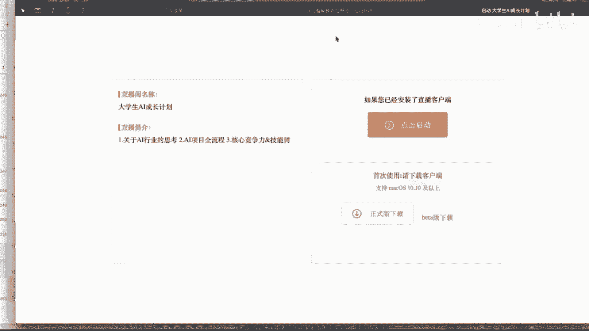

这里面啊分为什么呢？我们的入门级别的是吧？初级的，然后下面还有对应的呃中级啊高级啊，一共这样的几个阶段啊。

那么这个里面基本上涵盖了我们目前啊常见主流人工智里面人工智能里面所涉及到的这样的一些知识点的一个内容啊，知识点内容。那么啊我们一个一个来过一下啊。

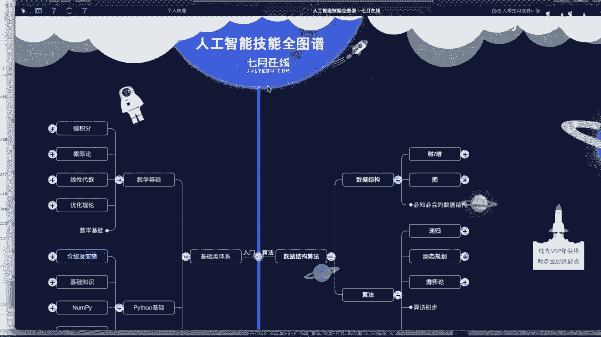

啊，其实这后面有很多很多的加号是吧？可以啊点开的啊，有一些具体的内容是吧？啊，我就不一一个一个的扩展了。那么在这里面，首先啊我们呃从这个入门的基础类体系来说，那么首先是吧你需要去具备一些什么呢？

数学功底啊，数学功给啊，但是啊这个啊一般啊都没问题啊，这个基本上都是我们啊大学里面都学过的啊，除了像这个图学化，可能这个呃接触的比较少一些。像这个微积分呀，概率论呀，信息代数啊。

这个基本上都理工科必修的这样的一个啊课程啊，这个啊应该啊很轻松就可以搞定啊，那么第二个就是什么呢？我们的一个啊编程语言这一块的一个选择啊，编程语言。那么编程语言这一块呢。

像人工智能为什么会首选python啊，python。因为首先第一个python比较简单啊，入门比较快。那么第二个呢它是有丰富的对于数据处理的这样的一些库啊，我们可以很好的去来啊对我们的数据进行一些。

比如说操作啊来分析啊，那么这里面我们需要掌握的什么呢？除了一些基本的语法以外，比如说呃其实这些其他语言里面都是一样的了，是吧？包括呃什么循环呀判断呀啊，怎么去呃定义函数呀，它是一个面向对象呀。

你怎么去理解面向对象呀啊等等等等等啊，这个是属于哪语言层面的。那么我们用这个pathon里面的哪一些包来做我们的数据这一块呢？比如说有npy啊，我们的pandadas啊，然后呢比如说你要做图的话。

是不是还有我们的一个matath blood label是吧？还有我们的s born啊等等。然后包括这个screen啊等等啊，这个呢都属于我们python啊这一块啊python这一块。

那么呃往右侧啊来看，那么也就是说我们入门的还有一些啊涉及到一些啊数据的一些结构啊，那么这个呢呃数据结构这块呢，其实呢啊更多的是在于理解啊，更多在于理解啊，那么数据结构这一块。

比如说常见什么堆呀啊啊我们的数呀，我们的图啊，递归呀啊等等等等啊啊这些呃常见的一些内容是吧？在这里面啊也同样需要去做一些呃了解跟掌握啊，比如说我们的一个排序是吧？啊，比如说我们有啊怎么去排序的是吧？

你可以冒泡啊，你可以选择呀是吧？啊，比如说你个堆呀，怎么去用堆是吧，怎么去用栈啊等等啊，这样的一个内容是吧？什么是链表，什么是二叉数啊，这个呢都需要有一定的掌握啊。那么这是我们对于什么呢？

初步这一块啊初步这一块的内容是吧？那么往下来走是吧？呃，你入门了以后，那么初级阶段呢，我们需要掌握哪一些这样的一个内容。其实呢就是对于我们数据分析这一块的一个基本的内容，是吧？啊。

你要对数据这一块呢要非常的敏锐是吧？那么首先是吧我们从这个数据的获取这一块是吧？比如说我们用这个呃python来完成爬虫是吧？python里面爬虫还是有很多的。比如说我们可以直接用这个crape框架。

或者说啊你像通用爬虫的话，你可以用那个c是吧？啊，也是比较好用的。我比较喜欢用那容啊。那么同样它自带的啊，除了用这些框架以外，它自带的啊，比如说我们用这个request啊等等。

也是可以啊来进行一个啊数据的一个爬取啊。那么数据爬取了以后是吧？也就相当于我们拿到了这样的一个数据。拿到数据以后，你要来做这个什么啊数据的处理。比如说哎怎么去进行一些分组啊，合并啊等等等等等等啊。

也就是说哎慢慢的啊进入到我们特征工程这一块啊，然后把数据进行一些拆分啊拆分，然后进行我们的模型的一些训练啊等等。然后呢，最后啊进入到我这样的一个模型的选择啊，这样的一个阶段。那么初级完了以后。

接着呢进入到我们的一个中级这一块。那么其实中级这一块呢，主要就是数据建模了啊，数据建模。那么这里面主要是学习我们。常规的啊机器学习啊里面的一些内容是吧？比如说我们这里面呃像这个啊都是你要学人工智能是吧？

这些算法都是必备的是吧？比如说我们的逻辑回归是吧，决策术是吧啊，辅助贝耶斯，我们的一个知识下烂机啊。啊，SVM是吧？包括啊我们的一些啊模型是吧？这是分类的是吧？这是回归的啊，还有一些啊其他的是吧？啊。

大概就是这两类啊，大概就这两类。比如说你是呃二分类的还是呢啊多分类的啊等等。那么往下来走呢啊可能又是呃演化成一些比如说我们的无监督的学习是吧？有监督的学习，还有我们的集成的学习，深度学习，强化学习。

迁移学习是吧，生成对方网络啊等等，是吧？这些内容啊，其实呢它都是呃。其实都是串联的啊都是串联的。然后大家在学习的时候呢，其实还是以这个啊这个比如说我们先从机器学习开始是吧？

然后呢啊进入到我们的一个深度学习，然后慢慢的进入到我们强化学习，先移学习啊等等，一步一步的来进行这样的一个啊往下的一个递进啊。然后最后呢其实啊像这些基本的一些啊技能呀知识点呢，掌握了以后。

那么接着呢就进入到我们的一个呃高阶部分啊，那么高阶部分呢其实主要就相当于应用部分啊，应用部分呢，也就是说把我们刚才上面的入门啊，初级啊、中级啊，所用到的知所学到的这个知识。哎，我们要把它给呃用起来啊。

那么用起来怎么去用啊，有我们呃企业在线目前的课程来说啊，这些啊无人驾驶的啊，自然语言处理的对吧？聊天机器人的语音识别的图像处理，然后包括我们的推荐是吧？包括我们的一些金融风控啊啊，包括我们的计算广告啊。

可能这里面啊还有一些其他的没有列出来。那么像现在可能新开的有这个呃无人机啊自主飞行啊，它可能跟我们传统的这个无人机通过手柄啊，大家呃这个是不一样的啊，它是事先就会设定这样的一个啊相当于一个。

路线啊或者一个程序啊，然后呢自己去完成这个内容啊，不需要人去控制它啊，像未来，比如说像这个物流这一块啊，可能就会呃很大程度上会去依赖于这样的一个呃无人机的一个自主飞行啊。

那么像这里面啊可以啊简单的去啊扩展一下。比如说我们呃自然语言处理这一块啊，那么自然语言处理啊，你肯定需要掌握一些NRP的一些啊基本的一些技能，对吧？包括我们的像这个啊辅助BS啊，im克服模型啊啊。

这些都是啊之前是不是终级的时候啊来完成的这样的一些内容，对吧？然后把这些内容OK了以后，比如说我来写一个什么呢？作为一个聊天机器人啊，或者是做为一个智能客服系统啊啊等等啊，这样的一个内容。

那么像图像这一块呢，目前图像已经非常成熟了啊，那么像我们这边，比如说呃你有的项目，比如说对于这个车辆的大规模识别呀啊，大规模的人脸识别呀、人脸的检测呀、姿态估计呀啊等等等等的啊，就是项目非常非常的多啊。

然后还有什么呢？比如说这个推荐这一块啊，推荐这一块啊，这两年啊也是非常非常火的一个啊。一个相当于什么一个呃。一个行业吧然后在这里面可能推荐啊更多的是跟我们这样的一个业务场景啊，可能是啊相挂钩的。

或者说您可以理解是跟我们的工程啊相挂钩的啊，比如说我们常见的有一些呃什么今日头条啊是吧？或者是一些电影推荐呀啊，大家在啊比如说淘宝呀，京东的时候，是吧？有一些商品推荐呀啊等等等等等等。

那么这些呢都属于什么呃。推荐这一块。那么像现在比较流行的，有一个什么广告推荐是吧？广告推荐，那么呃也是很主流的一个方向啊，那么这个像这个呃广告这一块啊。

我们这今天啊刚开了这样的一个呃计算广告这样的一个就业班啊，大家也可以去了解一下啊，可以去了解一下。🎼O那么这是我们的高阶部分。那么往下去走是吧，可能就是一些啊框架了。

那么这些呢啊大家可以去啊其实框架这一块呢，我个人认为哈啊能直接用啊，就是直接用。比如说我们的testflow啊，突啊是吧？这些啊别人都已经弄好了，而且呢效果也是经过市场的检验啊是吧？

这个我们就没有必要去啊花很大的这样一个心思去做这样的一个内容是吧？我们可以直接拿来去拿来用啊，那么还有一个比如说像这个竞赛呀，cago是吧？啊，那么像这个竞赛呢。

其实我觉得大家如果想要进入这个行业参与一下，还是非常非常有必要的啊，非常有必要的。因为这里面可能会呃你可以组队是吧？你可以学习到一些新的内容是吧？

包括啊大家在一起可以更好的去完成我们这样的一个团队的配合啊。然后最后呢可能有这个呃论文的解读了，对吧？那么论文解读这一块，你像现在人工智能发展的速度啊非常非常非常快啊非常非常快。那么像这个论文哈。

每天都呃日新月异。那么像我们之前可能啊上周还是上上一周在聊，就是说。作个假设哈作为假设，比如说像我们现在。呃，就是以我们目前的这样的一个技术啊，现在咔停了，就是说。到今天为止。

这个技术呢我们就呃不再往前推了。就是以我们现有的这样一个技术来进行呃落地的话啊，可能我们呃未来十几年啊都有活干啊，都有活干。所以说它的市场呢非常非常大啊，但是这个呃是不太现实的。

这个技术啊不可能是停之不前的啊，它一定是向前不断的推进啊不断的发展。ok。

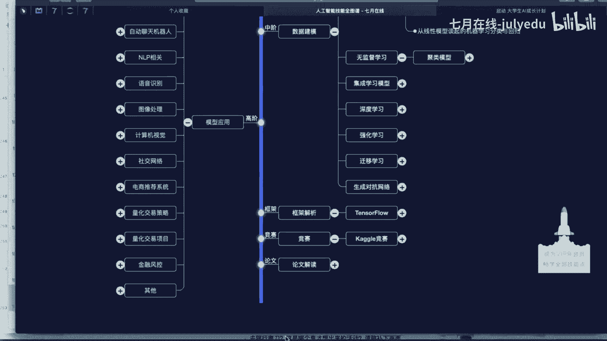

啊，这是呃给大家介绍一下我们啊7月的一个技能图谱是吧？啊，通过这个呢啊大概可以啊比如说啊分门别类啊往。

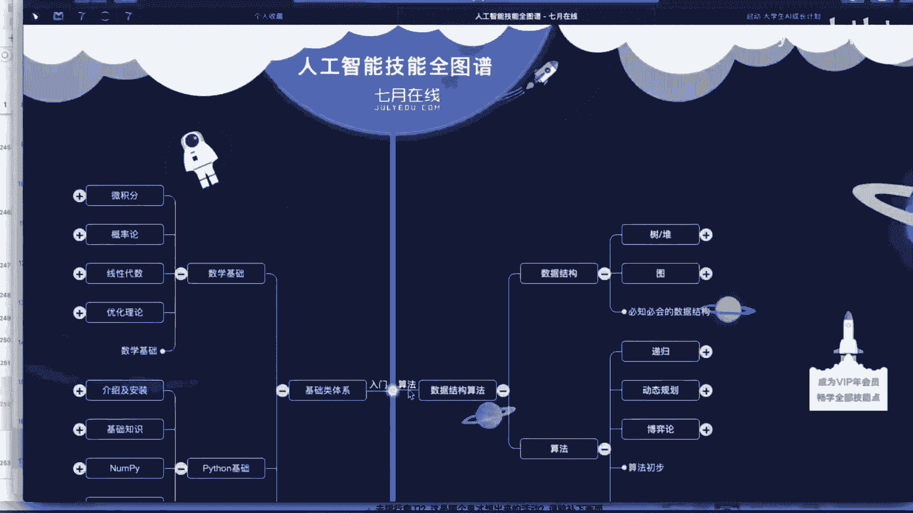

你想往哪个方向去走是吧？然后呢啊重点去掌握哪一些这样的一个内容啊，那么呃我们今天呢主要是呃针对于我们的一个啊大学生这一块，对吧？我们大学生AI的一个成长计划啊，成长计划。那么啊主推的课程呢。

可以在我们这个7月的官网上啊，比如说我们来找一下啊啊大学生这个成长计划啊，那么在这个大学生成长计划这个里面呢啊大家可以看到这个课程的一个简介啊简介，是吧？我们主要是针对于啊这个。

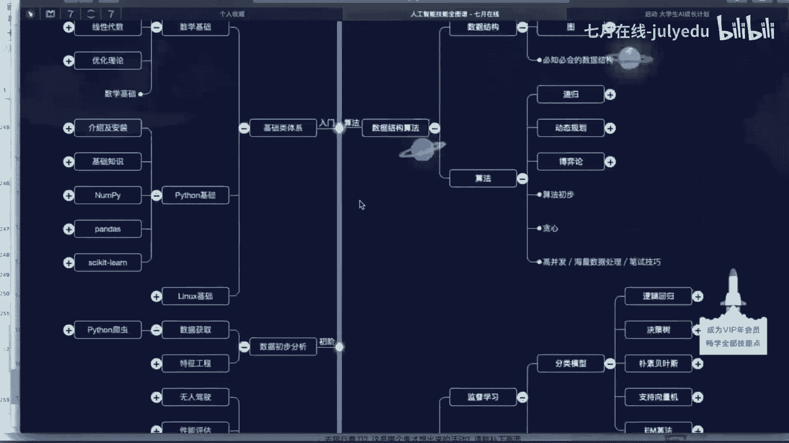

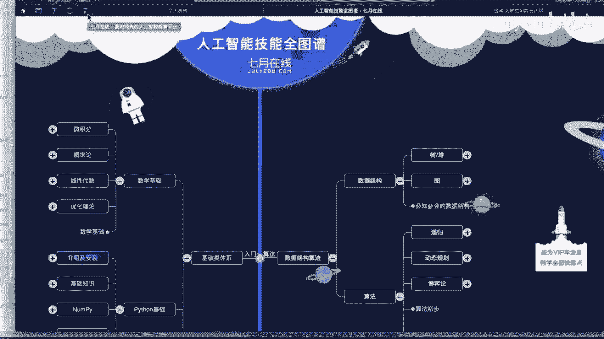

啊，高年级的一个本科生啊，或者说即将毕业的啊这样的一个呃。研究生人群啊等等。那么呃这个课程呢，我们推出的一个呃原因啊，除了刚才以外啊，那么呃其实我们嗯之前很早就在考虑啊开这样的一门课。

因为我们之前都是有这个集训营跟就业班啊，集训营就业班啊，它是我们相当于主打的一个内容是吧？但是呃可能呃有一些反馈啊，反馈什么呢？啊，反馈比如说我们目前来说这个高校可能呃师资比较缺乏是吧？

可能啊需要我们这边提供一些这样的一些支持，是吧？那么呃其实我们就考虑开设这样的一个面向于我们呃大学生啊这样的一个啊成长计划啊，大学生的一个成长计划。那么啊在这个整个的一个呃AI成长计划这个里面。

我们整个的课程呢啊是采用呃录播加直播的这样的一个。方式啊来进行我们的一个课程的一个讲解啊讲解。那么这里面啊一共有三种这样的一个方式吧。比如说啊在线视频啊在线视频。那么在线视频这一块呢呃就是啊。

把这个之前的一些内容啊，我们可以以录播的形式传给大家。然后还有呢在线实训啊，主要是解决大家啊，比如说啊视频完了以后会留一些作业。然后大家呢啊去完成，然后呢会有老师给大家去讲啊，还有呢在线直播。

就是就跟我们今晚是一样啊，在线去讲解这样的一些内容啊，那么这个呢是作为我们的一个呃主要，然后呢把之前的内容作为一个啊相当于什么串一下，然后呢讲一些新的一些啊技能点啊，新的技能点。

那么我们整个这样的一个课程的一个规划呢，一共分为什么呢？7个阶段啊，一共分为7个阶段。那么呃前六个阶段呢都是针对于我们的一个呃技术技术点啊，比如说我们是从什么呢？python入门开始的啊。

python入门开始。然后入门了以后是吧？比是说我们对这门语言有了一个掌握了以后，那么接着。这呢就是进入到我们这样的一个呃数据这一块啊数据这一块。那么数据这一块你需要提前先掌握一些什么呢？

比如说啊我们刚才所讲过的这样的一些数据的结构啊，数据结构跟一些常规的一些算法啊，比如说对应啊战呀队列呀哈西表呀等等啊这样的一些内容啊，那么这些内容O了以后。

我们就啊从我们这样的一个类似于啊小白就进化到什么呀数据分析这个层面啊数据分析啊，那么数据分析这一块我们着重去找啊，这几个内容是吧？我们的n派啊，包括我们的mat label，还有我们的那么这里面。

会有啊大量的这样的一个案例啊，来帮助大家去更好的去呃理解跟掌握是吧？哎，我们数据拿到了以后，到底该怎么去进行处理，那么处理完了以后是吧？我可以通过可视化来更好的展示显示出来啊，达到这样的一个效果是吧？

然后第四阶段呢就进入到我们的一个类似于机器学习的一个呃基础原理部分啊，包括我们常规的啊线性违规是吧？决策书啊，随机声林啊SVM呀啊等等等等是吧？啊，这些内容然后呃机器学习原理O了以后是吧？

有一个我们的机器学习的一个啊实战啊，实战。那么也就是说把刚啊上一阶段我们所学习的这些内容呢，然后呢啊做一个类似于啊总结，然后呢把它给用起来啊用起来啊，然后这里面可能。涉及到一些啊。

比如说我们还通过一些案例是吧？拿一个cago上面的一个比赛是吧？来大家去呃实际的去操作一下啊操作一下。然后。机器学习完了以后是吧？那么啊更深层次的一个进阶呢，那么就进入到我们的一个深入学习了，是吧？

那么现在深入学习呢啊发展是越来越啊快是吧？啊越来越快啊，那么啊所以说我们要进入到人工智能，像这个基本上现在都啊是必不可少的一个阶段了，是吧？包括这里面是吧？我们的循环神经网络呀是吧？

我们的一个卷积神经网络呀啊等等啊，都是啊相对来说啊。是必须要学的啊，深入学习的一个原理部分的一个内容是吧？然后实战这一块呢呃。有一个推荐是吧？有一个推荐，然后怎么去从零去搭建一个电影的推荐网站啊。

这个可能这个项目的一个周期就相对来说比较长一些了，是吧？那么啊你想象一下，我们搭建一个电影的网站，那么这里面可能还涉及到一些前后端的一些内容，是吧？比如说呃我们前端页面的一个显示啊。

后端数据之间的一个啊传输啊，那么然后嵌入我们机器学习跟深度学习的一个算法来达到什么呢？哎，我们比如说做一些个性化的推荐啊，人启动啊啊等等等等啊，这样的一个内容是吧？那么这里面啊它的一个点。

比如说我们要首先啊要确定什么呢？产品呀数据啊，我们整个需要用到的这个技术框架。如果说你的数据量比较大的话啊，可能我们还需要用到我们的一个啊服务器啊，或者说我们还需要去搭建我们的一个集群环境啊等等啊。

然后在这里面我们会讲解常见的啊关于推荐方向的一些算法的一个讲解啊，然后这里面可能涉及到一些核心啊，包括什么怎么去召回，怎么去排序啊，这样的一个内容啊，然后啊最终呢哎我们更深层次的一个优化啊。

可以把我们深度学习啊。给他啊应用进去啊应用进去。OK啊，这是对于我们这样的一个呃面向我们大学生的这样的1个AI成长计划课程啊的一个呃基本的一个介绍啊基本的一个介绍。呃。是。呃。

如果说呃大家在学习完以后呢，比如说你想要有一个更大的一个提升啊，其实我们这里面有很多很多的这样的一个啊课程，是吧？提升，比如说啊可以先来一个啊如果说你觉得你能力O的话，你可以直接上就业班啊。

可以直接上就业班。那么呃就业班这一块呢可能呃它的等级跟难度是比较高的，我们需要笔试跟面试啊，才能够进入这样的一个就业班来进行学习啊学习啊，而且啊它的就业是有保障的啊是有保障。

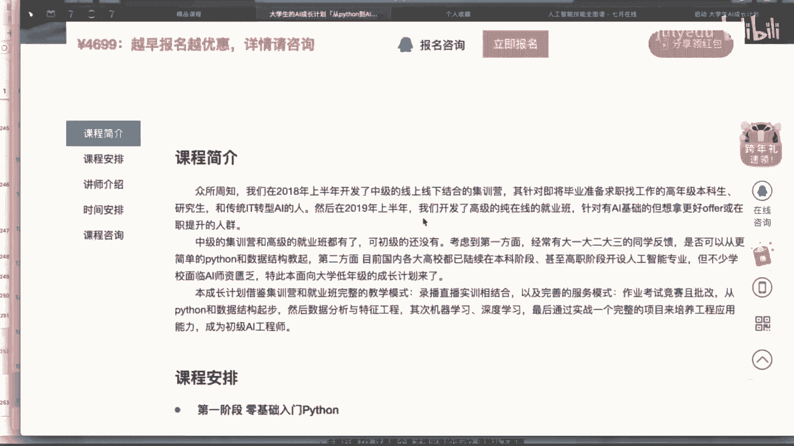

啊，但是前期呢啊我们可以比如说先通过什么呢？这个啊基本的我们的成长计划啊来学习一波啊，学习一波了以后呢啊如果说你觉得呃还不够呃这样的一个啊特别的比如说达到就业的这样的一个程度，是吧？

你可以啊往这个集训营啊，或者是就业班啊来进行样靠拢啊。

W。是。🎼OK啊，这是我们的呃第四部分啊，大家啊去啊7月里面啊来看一下我们现在的一个内容。除了我们原有的课程以外，那么还有什么呢？还有比如说我们的题库啊，我们的题库是非常强大啊，题库非常强大。

那么这里面你点开我们的一个面试题库啊，这里面一共有4000多道题，那比如说我们机器学习就有330多道那这些都是来自于大厂的啊，这样的一个面试啊或者是笔试，是吧？我们把它啊进行汇总再录是吧？

然后进我们这样的一个题库这里面是吧？在这里面我们可以点击练习是吧？那么点击练习了以后，在这里面啊，其实就有相对应的有选择题啊，有简答题啊，在这里面你写完了以后选择完了以后是吧？

可以呢点击我们的提交试卷啊，会有一个相对应的一个得分啊，相对的得分。而且呢比如说你答错了啊，也同样会提供相对。

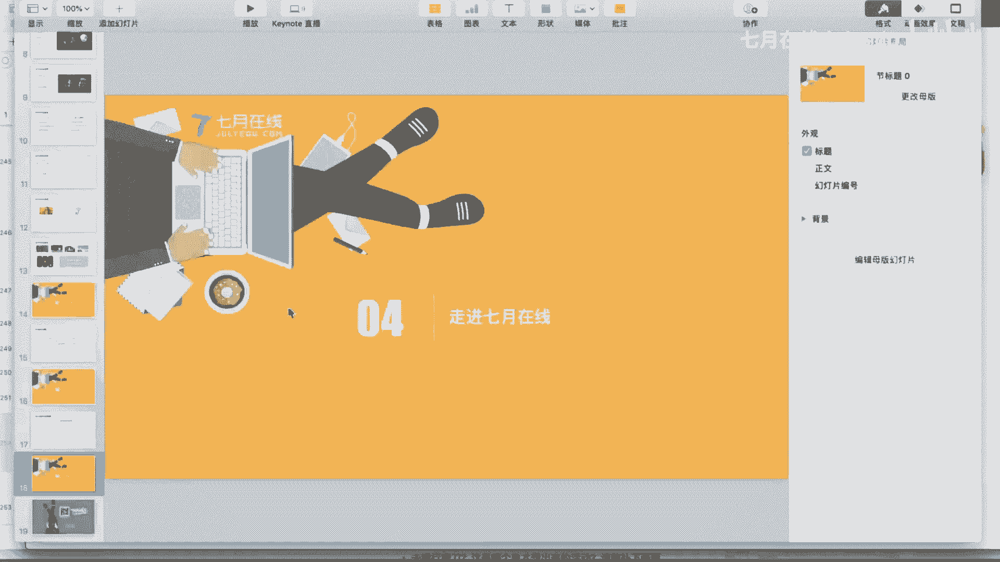

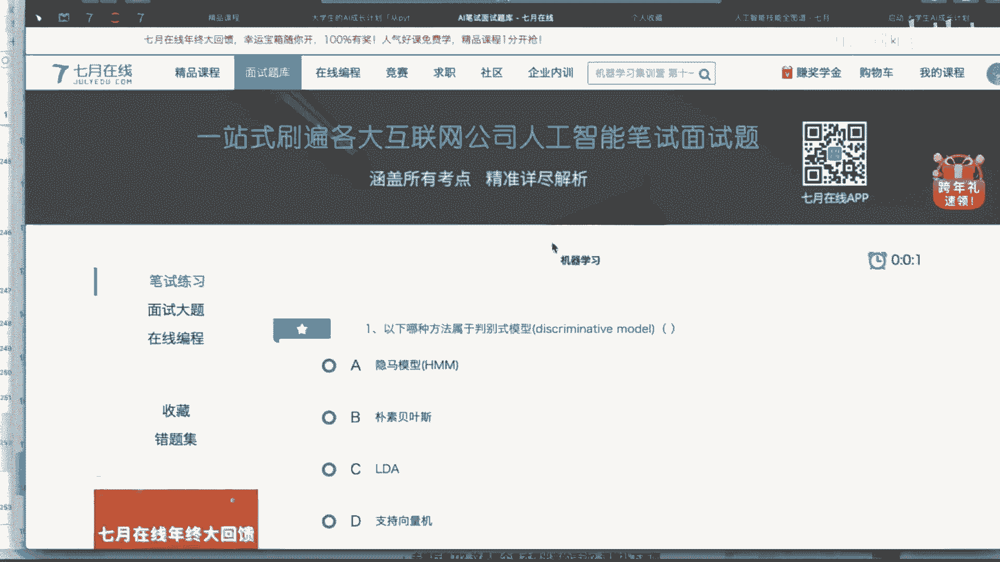

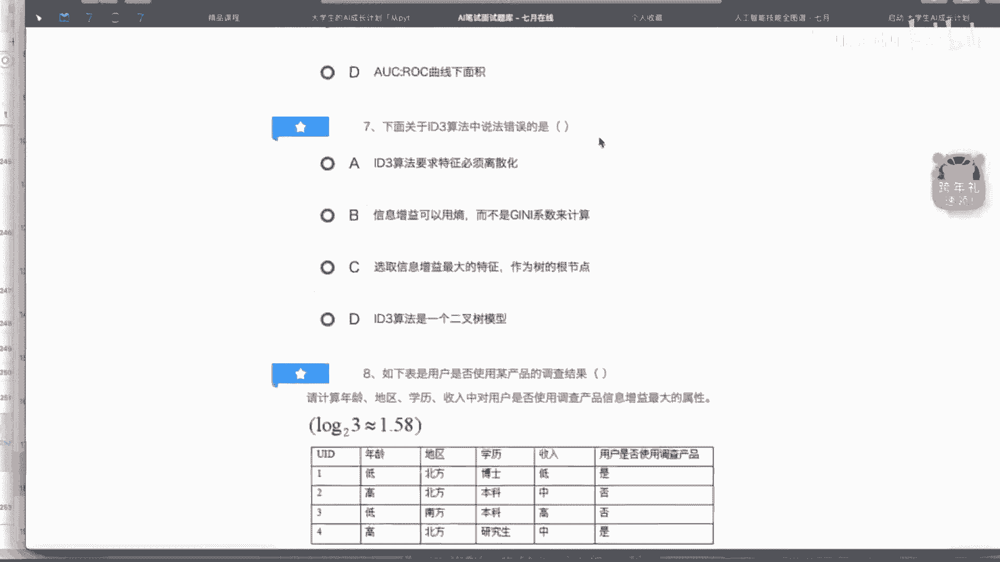

定的一个解析啊，相当于呢错误的一个解析，提供一个正确的答案。

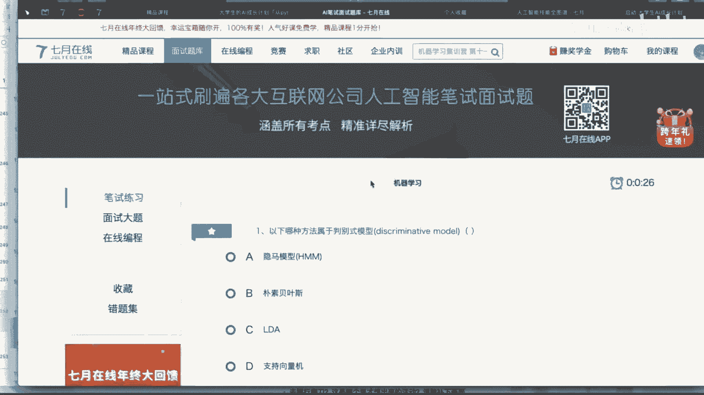

那么除了这个题库以外，还有我们的在线编程这一块啊，在线编程这一块。那么在线编程啊可能更多的啊类似于什么我们的lining code是吧？这里面的一些逻辑的一些问题啊，罗辑的一些问题。然后还有什么竞赛。

那么竞赛这一块呢啊，这是呃我们自有平台的一些竞赛啊，比如说这里面还是非常活跃的啊，比如说这个呃。手写体识别是吧？100多支队伍来参加是吧？包括这个我们的一个呃文本情感的一个分类比赛是吧？啊。

有80多支队伍参加啊等等啊，大家呢有兴趣呢可以啊也可以参与到啊我们这样的一个竞赛里面来啊。OK啊，还有比如说啊这里面呃还有一些比如说社区啊啊可以大家可以在这里面去看一些。比如说历来一些啊学长呀、学姐啊。

他们的一个学习呀、工作呀的一个经验啊，包括在这里面可以看到大家的一个啊比如说有的一些问题啊，可以在这里面也可以来进行我们的一个啊查看。呃，OK啊，那么呃那我们今天的分享呢啊就。讲完了啊。

那么啊看一下大家有没有什么样的一个问题。啊。呃，在哪能找到这个啊？哎，不太清楚你要找到是啥。就是说现在哈我们能看到的这样的一个机器学习的一个发展啊，或者是空间啊，其实比我们看到的这样的一个风险呢呃。

或者是泡沫啊，其实更大啊。所以说呃我相信在未来的这个行业啊，我们找准自己的一个定位啊，把自己啊想要做的一个事情呢，我们把它给做好啊。

所以说呢我们还是呃非常期待啊在人工智能呃还在持续发展的这样的一个时代啊，然后呢我们一起努力。然后呢呃希望能够做的更好啊。思维导图那个是吧？思维导图那个我发一个链接给你们。哎。Okay。

🤧OK啊大家可以呃。仔细的去呃看一下我们这个思维导图啊，这个思维导图做的还是啊非常详细啊还是非常详细的。🤧嗯。呃，数据结构没有看过，可以边学算法，看数据形，这个是可以的啊可以的。其实在学习的时候呢。

其实啊我建议哈就是说你不需要什么东西都需要去搞清楚，搞明白啊，这个你的时间跟精力呢也是不允许的啊。那么呃其实我建议哈就是说先挑重点部分啊，先把重点的部分呢呃先给它掌握了以后。

然后后面比如说我们呃主线串起来了以后，我们再往这个主线里面再去呃，比如说填充一些支线啊，做一些内容的补充。Yeah。OK小伙伴们有问题可以在右侧的这样的一个聊天对话框啊来进行这样的一个提问啊。

然后啊我会为大家进行这样的一个解答。OK如果同学们没有问题啊，那么我们今天的这样的一个公开课啊，就到这里就结束了啊，非常感谢各位小伙伴的一个参与啊，再见。

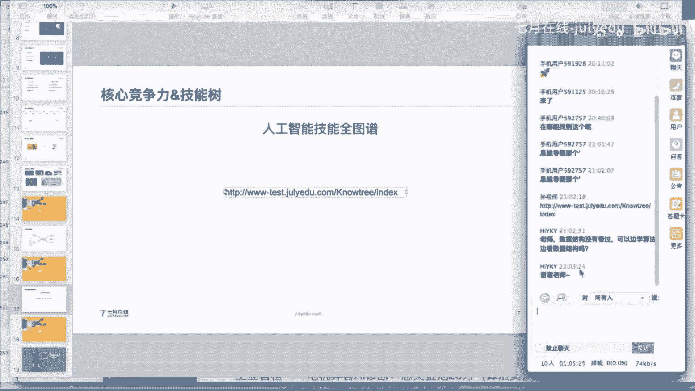

