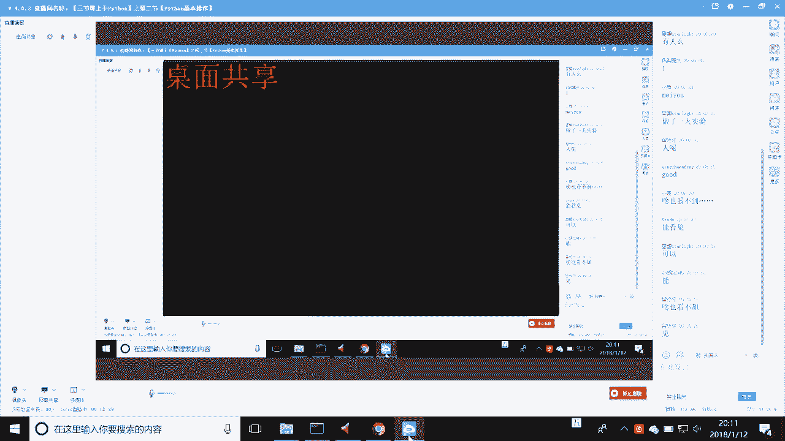
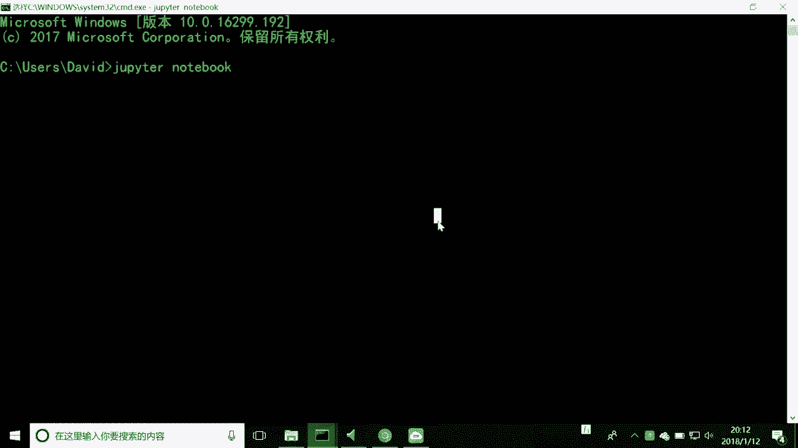
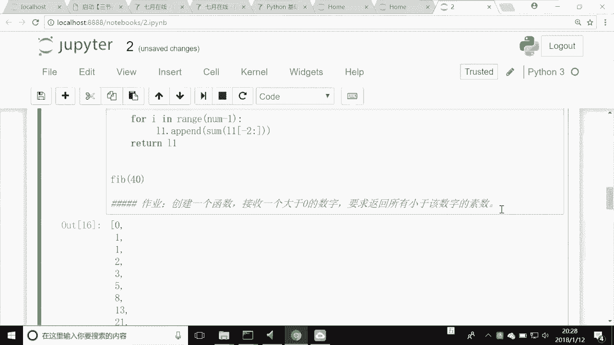

# 人工智能—Python AI公开课（七月在线出品） - P2：三节课上手Python第二节 - 七月在线-julyedu - BV17W411K7G8

呃，能听到了是吧？我看到了呃新叶荣是吧，都是老同学了。我记得上一次好像就有你是吧？😊，嗯，小五啊ZZZ飞得更高哈，大家好，那么咱们就哎小五也打出来了，非常好啊。那么呃咱们现在呢就提前开始吧。

嗯开始一分钟，然后开始咱们今天的公开课。

今天是咱们7月在线AI公开课三节课上手python的第二节啊，那么上周的时候呢，大家是在周末的时间啊牺牲了周末的时间。然后咱们在上午的10点到11点钟的时候，给大家讲了些什么东西呢？

我给大家来进行一个复习哈，那么首先上节课呢咱们讲了4个很重要的一个点，啊，第一个点呢就是python的一个基础啊，python的一个基础。python的什么基础呢？就是一些python的啊。

我这地方可能写错了啊，应该是python的一个简介哈简介。那么python它的一些特点，它的一些相应的这些东西啊都有。那么给大家做了一个介绍介绍。第二个呢是关于underconda这个环境。

这个环境非常的重要。包括呃本周我都看到很多同学都在问老师，我这个环境怎么装啊，这个出现了各种各样的问题，哎，都是在这一点上，对吧？那么这是一个门槛，这是一个硬件呃这是一个咱们环境的门槛，对吧？

装完了这个under康以后呢？其实。

我上周已经已经把这个东西都给大家是吧？好，那么装完了undercon以后呢，我们来开始啊去使用notebook。大家看一看，今天我们的这个就不再是PPT了，对吧？

还记得上周我们啊上课的时候还是1个PPT的形式哈，还是1个PPT的形式啊，有人在的啊，有人在，大家有问题可以随时在咱们的留留言板上去留言。那么呃有后来同学再说一下。

就是这今天的课程呢呃计划差不多是30到40分钟，不会讲太久，毕竟是周五的晚上，大家很也很累了哈。

啊，也很累了啊，没有小伙子那么调皮啊。那我们继续啊。那么我们看看第呃第三个我们讲notebooknotebook呢其实它是一个呃我们可以像一个网页编辑器一样去编辑pyython的。大家看到这个地方呢。

就是说今天我给大家讲课的，这个就已经不再适用PPT了，而且是用notebook。那么是个notebook，它不光是可以写python代码，它也可以去写一些什么呀。

他用markdown格式，大家看到这个地方没有啊？markdown格式啊，markdown什么意思啊？一种简化的标记语言啊，简化的标记语言，它可以去把我们的唉这个文本用一些特殊的格式显示非常好看啊。

那么我们可以把它作为一个教案去使用啊，教材去使用，我们也可以在这个markdown上去用啊，这都是在note book下面的。那么呃包括怎么启动note book怎么去运行pyython啊。

那么这是我们啊做了一天实验。

啊，我又看到了新同学哈啊新同学上周的时候就跟他做了很多的交流，看到你们很真的很开心。😊。

嗯。我们继续来看啊，那么第三点的notebook的启动。那么启动的时候呢，我当时我的启动方式呢还是这样来启动的。就是说我使用了jupy的notebook是吧？那么有些同学可能不太方便。

那么你就在哪儿找啊，在underconda里面的这个地方，大家看到了没有？

啊，这个地方呃能看到哈，就是你点击这个也是一样可以的啊，没有问题啊，没有问题一样的，都是启动的啊，都是启动的。好，notebook启动了以后，notebook怎么去用呢？

notebook里面的cell我大致的跟大家去说过啊，包括我们新建一个c。你比如说我想在这个企业在线之前啊，AI工作上面，我建一个，我们就按一个A啊，就出来了一个cel，这个cell是什么格式呢？

是code格式，什么叫code，咱写python代码，就是code格式啊，就是一个code格式是吧？好，那么我们继续看我们继续看啊。

我们的这个啊我们的这个呃我们的这个notebook，我们把它删掉，看怎么删啊？两下D就可以删掉。那么这些的帮助代码，我上周我已经跟大家去聊过哈，都在这个地方啊，按一下什么呢？

ESC之后按一下H我们所有的keyboard sur全都出来了，是吧？我们自己可以去对照的去使用这个不着急，你用多了以后，自然就会熟悉啊。好，那么讲完了这个notebook启动以后呢。

我们也讲了python的基础操作。呃，因为那天的时间呃也是比较紧啊。python的基础操作里面我也给大家大致的去讲了python的一些基础的类型，包括了我们的字符型数字型。呃。

还有那呃我们的字符串型数字型列表型元组字字典。

啊，集合也都跟大家都讲过是吧？但是呃真正要去练习的话，还是要大家花很多的时间去做的啊。那么不可能包括今天也是一样，我不可能在40分钟的时间里面，我讲完你就懂，不可能还是要大家去练习。好。

那么我们大致的复习完了我们上周课的啊上周的这个课程以后呢，我们来开始我们今天的公开课的一个目标。本节课呢是咱们三节课中的第二节。那么本节课的目标呢是一个承前启后啊，承前启后。什么叫承前呢？

就是说我们要会用到我们上周课里面所讲到的几乎的所有的知识啊，所有的知识。然后呢我们也会干嘛呀？稍等一下啊，我们也会干嘛。

我们也会去对我们这节课也会学习新的来让我们下一节课的这个n排和padas的数据分析这一块，大家能够会去使用啊，能够会去使用。好，那么这节课呢，一个目标呢是第一个大目标。我这里特意给大家分了两大块啊。

哪两大块呢？第一大块是了解函数，就是关于函数的是这样一块，中间画了一个分割线是吧？关于面向对象的是下面这一块是吧？哎，那么了解函数的意义，掌握函数的创建及使用。第二个呢是了解函数中的参数的一些使用。

包括了不定常参数。那么这是什么意思呢？一会儿我带大家一块去做做啊代码，大家就能明白啊。那么呃第二个呢大的目标呢是理解面向对象的基本思想，理解类和对象的关系，了解类的结构和成员。然后呢我们的目标是什么呢？

你能根据我给你的需求创建一些包含相应成员的类。也就是说你真正具有写。类代码的能力啊类代码的能力哈啊代码的能力。好，那么我们来开始我们今天的这个课程哈，这个目标已经给大家说的很清楚了。今天没有太多。

就两样，一个是函数，一个是面向对象啊，你能把这两样能弄懂。ok今天你又有收获了，对吗？好，那么我们继续看啊，那么我们来看看函数的意义啊，什么是函数呢？函数是本质上是个什么东西呢？

其实呢我们可以从这两点去理解函数啊。第一个啊我们想一想。函数呢其实它在我们的生活中也是非常常见的，它其实是一种抽象，一种抽象。什么叫抽象？就是说哎我们去对我们的输入进行变换以后去输出这句话是什么意思呢？

假设我现在去创建一个叫做加法的函数。比如说我现在给他的两个数字，一个是一，第二个也是一，那么它一定会输出给我一个什么呀？一个2，对吗？是不是我对它进行了一个。是不是我给了他一些东西？然后呢。

它经过了一些处理，变成了我想要的东西，对吗？对吧？那么呃那如果说我要说做一些减法加法或者乘法除法，这些都可以。比如说我想给一个字符串给你，然后呢，你把这个字符串里所有的A的字母，你给我换成什么呢？

换成B可不可以可以，那么怎么去做呢？我们就用函数去做函数去做。那么我们为什么用函数去做呢？就是因为函数本身它是一种抽象，针对什么的呢？我们之前上节课我在大家用notebook去写过一些东西啊。

你比如说我们就写一些我们简单的什么呀，我们就写一些一行代码，写一行一行一行写。然后呢，逐行它依次去运行，对吗？哎，那那么这种的运行方式呢，我们啊我们通常呢都管它叫做什么呀？叫做过程化。什么叫过程化。

就像我们啊去做一些代做的，哎，看不见是吗？

呃，有同学看不见，大家能看见吗？我看有同学说看不见呃，因为我一直在notebook上，应该是在note book上的东西。我把特意调的很大哈特意调的很大。那么呃。

啥也看不见。哎，假如你能看见吗？呃，能看见哈啊，好好好，那不好意思啊，可能是各同学个别同学的问题，我们继续啊。好，那么我们再来看啊，为我们的一个函数啊，对于输入进进行一些变换或输出。

那么刚才我大致说了一下我们的加法减法乘法除法，那么一会儿我们就来做一下，你就明白哈，那么这些都是非常简单的，那么字符串，那么和一些复杂的和一些复杂的函数，包括我们一会儿要做的这个函数。

它都是这样的一种特性，就什么呢？就是说它自身是能够完成一些功能的，对吧？它完成这些功能，首先是吧？它需要我们去输入一些东西，或者是我们根本不需要去输入东西，它也能返回给我东西，明白我的意思吗？

即便是我们什么都不给它，它也能返回给一些东西，这样才有用。如果它什么东西都不返回，就意着什么？它没有用处，对吗？哎，它的一些基本的它最根本的东西就没有了，对吧？

我们再来看第二个叫过程化。刚才也说了，就是我们写一行代码。从第一行第二行第三行第四行第五行运行完了以后，假设我这我这行代码有100行，对吧？有100行，我从第一行运行到100行以后就怎么样了，结束了。

就像我们的健身清单一样，对吧？哎，我早上起来啊，吃什么，中午吃什么，晚上吃什么，周而复始。我们就是说哎运行完了它就结束了。那么什么是结构化呢？结构化呢？其实就是对我们的过程化进行那种封装啊。

这种话什么意思呢？就是说哎我们可以把我们写的代码封装到一个叫做函数的里面，也就是我们今天要讲的这个东西啊，它就把它进行了一个打包，那么打包以后会有什么优点呢？大家想一想，打包以后会有什么优点？

就是说我以后每次再用它的时候，我还需要去再去把那些。能够实能够实现这些功能的代码，再去实现一遍吗？再去写一下吗？不需要了，对吗？不需要了。那么这个时候呢。

我们只需要去调用函数名和传入一些参数就可以来实现了。那么这样的话，我们的代码量会极大的减少整个的啊这个代这个是工程上面也会有极大的这种效率的提升啊，极大效率的提升。那么这是函数的意义啊。

那么如果只是讲这些东西呢，大家可能不太能够听的呃。

如果你是呃刚刚净净哈，可能听的不是很明白，但没关系，我们一会儿来去讲，我们一会来去做一个实验哈。那么好，那么现在呢我们来去创建什么呢？创建呃函数的创建和结构。那么我们讲了这么多基础概念。

我们首先来去讲一讲我们函数的一个创建啊，什么是函数的创建呢？我们来看一下啊，在python里面有一个关键字叫做DEF。也就是deeffinine英文啊。

deeffin英文的浅写啊DEF它是就是定义函数的关键字。这个关键字还记得我们的上呃上节说的吗？哎，你不能去干嘛呀？你不能把这个关键字干什么去当做标示符。你比如说DEF等于一一定报错，明白我意思吗？

你看看到这儿了没有？哎，我这个好像就是一直是这个这个状态，这个状态这个状态是吧？哎，一直状这个状态。这今天呃我记得我记得这个咱们同学里面也会有很多同学遇到了这个星号，我再说一下。

遇到星号可能是你代码写的真的是可能是有问题啊，有问题。那么你重启一下可ner或者重启一下你的这个呃重新加载一下咱们的这个notebook就会好很多啊，就会好。好，那么我们再来看我们的DEF稍等一下啊。

调整一下我的这个函数啊。正在去重启啊正在去重启。嗯，唉本地稍微有点慢，稍等一下啊。

呃，我本地可能有点慢，我先看一下呃，我讲到这儿有什么问题没有？同学们有问题的话就在框框里面，我们最好是有一个互动，最好是有一个互动啊，最好是一个互动。

好，我们来看一下。

呃，这个时候可能就会出现之前同学说的这个notebook死掉的问题，怎么办啊？不要去想太多，知道吗？千万不要想太多，直接重启呗。

你的网络是正常的啊，稍等一下啊，这个notebook重启的比较慢，大家稍等一下，在大家电脑上应该也是一样啊。

嗯，这个时候我们的就没有了啊就没有了。

就。

嗯。嗯。😊，稍等一下啊。咦，那么如果notebook启动不下来的话，可能是有点点问题啊。那我们就直接用命令行跟大家去讲一样的啊一样的。

呃，我们来继续唉行，这是我的那个教材来到的薄合里呢，稍等一下啊。呃，我们来开我们来开始讲我们的这个函数啊。

唉，今天这人没突破怎么回事啊？哎，启动了。

哎，好慢啊，今天行，启动。好，那么我们把它打开啊。好哎，终于启动下来，就我电脑可能太慢了，能太慢。好，我们继续啊。好，那么我们来看一看我们的这个函数啊。那么函数我们首先定义函数。

我们刚才说了怎么定义函数啊，DEF函数是吧？我们使用DEF函数，后面跟着一个叫函数的名字，比如说我们要定义一个A叫my叫什么？这个是什么意思？函数名是吧？函数名这后边这个括号是一定要加的，一定要加的。

知道吗？这是代表着什么呀？代表这是一个函数它接受参数啊，接受参数，还记得我说呃在昨天的不是在上上节课的这个括号呃，这个冒号吗？它是代表什么呀？分割我们的函数头和函数体的。

还记得我们用回车之后会发生什么吗？发生这个对吧？哎，它的一个自动缩进是不是四个空格是python的标准是吧？python标准的缩进4个空格啊。好，那么。我们现在给他传递进来两个参数叫哎我这我sorry。

我这个不是这个菲布纳奇的练习啊，一会儿我就给大大家做菲布纳奇的练习啊，大家就明白了。嗯。好，那么我们来看啊，那么这个时候呢我们来去做什么呢？我们叫做。return一个记住，请记住这个关键词。

return returnturn大家都知道英文的什么意思，返回是吧？返回一个A，加上一个B。好，那么这个函数就已经怎么样了，定义成功了。那么这个时候我们就可以去使用这个最最最最简单的函数啊。

myA的几啊，四和7，我们来看看是什么结果啊，我们来看看什么结果。大家看到这个地方有一个叫做out out叫做11，大家看到了吗？啊叫做11就代表什么呀？哎，四和7相加。你看第一个参数是4对吗？

第二个参数是7四和7相加，我返回到11是吗？哎，是不是很容易理解啊，很容易理解呃，nopiter的使用不需要联网同学不需要联网啊。啊，你在哪怕你电脑里没有网都可以啊，我这个刚才是我的电脑太慢啊。

电脑太慢好，那么我们再来看这个地方啊，叫做啊my四和7是吧？好，那么现在呢我要去做，我们看看叫做参数啊，给大家讲什么叫参数，参数就是这个叫做行参，就是说我这个函数，我接受几个参数，明白我意思吗？

大家看一看，如果我给它一个参数一个参数啊。

我看看行不行啊，我看看能不能运行，大家看看是不是报错了呀，他报错的时候说什么呀？叫做哎，我缺少了一个哎，叫做什么呢？叫做定位的一个参数。B，哪个是B啊，就这个东西就是因为你说了，你在定义的时候说。

哎我接受两个参数啊，但是你在调用的时候，你只给人家一个，人家肯定要会怎么样报错。那好，我再给他两个正常了，对吧？那我给他三个行不行？你看他也会报错，什么意思啊？他说my eight的这个函数怎么样啊。

只有两个位置参数。但是呢三个给人家了，你给人家直接收两个，你给人家三个，他就报错，他就不干活，对不对？你。再返回两个哎，就对了是吧？12。对吧。那么这个参数四和八叫做时参，A和B叫做型参。啊。

形材啊形材。好，那么我们再来看啊，叫做函数体。什么叫函数体啊？函数题啊，其实就是我们可以这样去写啊，C等于A加上B。然后我们return C，那么这个就是一个函数题。

就是包含了return和包含了我们的这个哎我们中间要进行的一些过程的一些东西。你比如说我我可不可以，我我可以这样去做啊。A的哎我的多少多少次方，比如说我四的3次方是多少，我们来看看这个结果。

64你去算肯定是这个哎，4乘4乘4对吧？64那么我们来可以看这样可不可以四取余数。是不是一啊？你看4除以3，最后是不是等于商是一还余余了一个亿，是不是？哎，那么这些东西完全是不是我们自己控制的呀？

那么这种叫做函数体啊，叫做函数体啊，叫做函数体。那么函数体就是真正干活的东西啊，那么什么叫做返回呢？返回就代表什么意思？就是说哎我在这里边干好活了，你让我算啊，你让我算这个A和B的这个余数是多少。

我算出来了。那么你这个结果哎你总得告诉那个调用的人，对吧？我就return一个C，我就用return这种东西去干什么呀？去把我的这个计算的结果去返回啊，去返回。

那么这个return和print我跟同学们去说一下，它有一个区别啊。比如说我现在同时return和print都是C，我们看看什么结果。因为这个地方大家有的时候可能会有点小小晕啊，我们试一下。

我们看到了我们在alt里边是一，然后在一上面也有一个一，这两个一到底哪个一是return，哪个一是print呀。哎，我来给大家去画一个这个图，你就明白了啊。

al是只能有一个结果，明白我意思吗？哎，是红的，看到了吗？哎，是红的。但是这个C呢但是这个print呢可以有好多个结果，看到这个粉的嘛，粉红色的是吧？哎，我们来去做一下啊，我们再print一个什么呢？

A和B，这是不是参数是吧？哎，是不是参数啊，哎传进来的这个参数啊。好，我们再去看看结果啊，大家看看是不是我们的print可以有什么呀？两行，但是alt始终只有一个是吧？

呃，这out的对应的是return啊，我们这个对应关系要一定要搞清楚啊，搞清楚哈。那么这就是我们最最最最简单的一个函数了啊，最最最简单的一个函数。那么呃那么同学说老师我就不返回行不行？啊。

你当然可以不返回啊，没人会没人会说啊，你你说我就不返回。行，但是你即便是不写return。我们来看一看，我们用一个叫做type的来看一看啊，我们的my eight，我的写了一个41个3。

我们来看看它返回的这个是一个什么呀？叫做non type。什么意思啊？就代表着你即使不返回，它也会返回一个对象，是什么对象叫做n对象啊，我在在这里写一下啊，叫做n对象啊。你说老师我真的没返回啊。

对你即便是没返回没写return，它也会返回一个叫做NONE记住这个第一N要大写哎NONE的一个对象啊NNE的一个对象。那么它的类型是什么类型啊？我们用type去看叫nontype啊啊。

这有它的一个返回和无返回啊。好，那么我们继续啊我们继续啊。好，那么这就是最最最最简单的一个函数。那么如果之前你有一些开发有过开发经验，那么这些都可以说非常的easy啊，非常的easy啊。

我看同学有没有什么问题啊。呃，刚看上视频，这个python是三的吗？是的同学啊，我们可以看到这个地方，你要确定你的版本，可以看到啊这个右上角这或者是什么呢？

你去点击一下newnew notebookbook里边，这个地方也可以有版本啊，这个地方也可以有版本啊。那么这个地方也有都可以看得到啊，那么这个呃这些环境配置，咱们第一节课就讲过的啊。

第一节课讲过的康达那个公开课已经在咱们切在线的这个官网上了，你也可以去看一下啊，看一下，包括链接都已经发上去，可以很快的搞定啊。那么好，那么函数的像高级部分啊，我今天呃我们的时间所限不再不再去讲。

比如说什么是偏函数，什么是译名函数，什么是高阶函数，什么是作用域，什么是B包，什么是装饰器。那么这些属于它的一些高级的部分不去讲啊，不去讲。但是呢如果你啊研究。

很有兴趣，我可以去你可以去在在这个地方，我来用网址给您打一下啊。9纳1点com里面的社区啊，社区里面的python啊，里面这个地方呢是我这个班里面的同学提交的作业啊，提交的作业。

那么你可以呢再去呃我们的呃函数这个应该是在第二呃第三课你去找所有第三课的作业。呃，第三课作业里面就有你看如何去定义函数接受三个数字的输入，这些东西都是呃在我的这个课程里面，我给同学留的作业。

那么你呢也可以去干什么呀？哎，这个是前面上面是这个我的要求，下面是同学交完作业，人家给我的这个代码，我也会在底下给同学去批注啊。那么呃呃你可以就是参照我们同学的这些东西去啊反复的去练习啊。

反复的去练习哈。那么呃我先不说这个了，我们先继续回到我们的这个嗯。回到我们的今天的这个课程里啊，回到我们今天课程里。好，那么我们来讲一讲菲布纳奇的一个实现啊。什么叫菲布纳奇数列？

菲沃纳奇数列其实就是一个特别简单，听说过是吧？我相信同学们可能都听说过菲布纳奇数列啊，你比如说我现在去有1个01哎，123。一个。😊，8。13。21大家看到我的这个数列有什么特点了没有？

我这是刚刚拿手工打的特有什么特点没有？

有了特点我们就可以去做啊。啊，好，回头看一下。对你可以回头看一下哈。那么我们来看看有什么特点。我们可以看到任何一个位置上的啊，我们可以说任何一个位置上的，除了前三个啊，除了前三呃，除了前两个啊。

除了前两个任何一个位置上的数字都等于前两个数字的什么呀？

哎，前两个数字的和。哎，你比如说我这个三是等于一和2加，我这个十3是等于5和8加，我这21是等于8和13去加，对吗？哎，那么这种叫叫叫做非布纳奇数列是吧？那么好。

那么我们来去实现一下我们的呃非布纳奇数列，我们就用函数的形式来实现啊？我们用函数我们就是什么呢？为什么要用函数去实现我们的非布纳计数列呢？其实呢就是因为我们的非布纳奇数列就可以干嘛呀？稍等一下啊。

我们可以用函数来。DF我们的FIB这个地方呢。我们可以定1个NUM还记得这是什么呢？一个型参是吧？一个型参，我们在形参里面就可以定义我们的这个菲莫纳奇数列的长度是吧？长度。首先呢我们先定义一个L一等于。

零和一这是我们的初始，对吧？你看刚才我们的非布产计数列是不是就初始成这个东西，对吗？哎，初始成这个东西啊。好，那么我们继续再去看什么呀？我们来看我们的这个。啊，LL1是吧？好。

那么我们来去看我们的循环多少次是吧？我们来去看啊，还记得我们上节课讲的循环吗？for I in range是吧？我们的NUM对吗？哎，我们让它循环多少次是吧？好，那么我们再来去看L一什么呀？点end。

啊，这个append是个什么东西呢？就是说因为我上节课并没有跟同学讲过，哎，这是列表里的一个什么呀一个方法，或者说我们的列表对象的一个方法，或者说一个函数。

它是将我们一个东西把我们的一个东西塞到我们这个列表的后边，就相当于我现在。我现在要去干嘛呀？我把这两个的和加到我的这个后边，是不是还是一呀？但是我再循环的时候，再把最后两个和加起来，是不是就是二了。

同学们对吗？哎，没关系，我们来去做一下就知道了哈。好，怎么去实现呢？我们嗯在第一节课讲过我们的有一个我给大家留的作业，还记得吗？回文是吧？什么是回文还记得吗？哎，回文的访问怎么访问。

我们我们使用我们的切片访问，对吧？切片访问怎么访问的呀？切片访问是我们的。或者说我们索引访问也可以哈，索引访问也可以啊，LE的。倒数第二个元素到最后一个元素是吧？哎，LELLE这个列表的什么呀？哎。

负的哎，我们来去看看啊。好，现在呢。最后呢我们return1个LE。好，我们现在去调用一下，我们看看会不会报错啊。稍点。你们来看看出现什么了。哎，我们看看唉，是怎么写的成这样了呀，有问题了是吗？

是不是有问题了呀？我们看看哪里出错了啊，哪里出错了啊。好，我们把我们的这个地方先去干什嘛呀？我们先不return啊，我们先不re，我们先把它注释掉，还记得怎么注释吗？这样注释是吧？好。

我们先去print一下我们的L一的。-2。对吧L一的-2是吧？好，那么我们为什么刚才是那样呢？是因为我没有对它进行一个sum，是不是？哎，我得把sum是一个也是一个函数啊，之前我们个同学说过。

但是同学自己应该有这种学习的能力，是吧？sup什么呢？我把这个东西给它进行了一个相加，变成了一个三是吧，变成了一个3是吧？好，那么我们现在再去试一下啊，return我LE。大家看到了什么没有。

是不是我们的变成了刚才我手写的东西了。哎，你算一算啊，零和一相加是不是等于1一和1相加等于22和3相加等于5和83。那么为什么是我写的是5，为什么它是这个呢？是因为我们的原来的长度就是这个是吧？

那您说如果要是说。如果要是说我的这个可以再短一些呢。我真正说我输入几个，它最终就出来几个，我们就可以把这个长度给它减减去它啊，减去这个长度，减去这个长度。比如说在这个地方。

我们就可以在这个地方我们来去输入一个8。我们来看最终输入出来的。01234567啊，我们选1啊，sorry啊。哎，减一就可以了，是8个是8个。好，那么我们再来输入一个什么呀？40可不可以可以。看。

非常之巨大是吧？非常之巨大啊，是非常之灵活，它完全是可以干嘛？根据我们输入的这个参数，对吗？它返回我们所需要的一个结果。返回需要的一个结果啊。

那么这就是我们实现用一个定义在pyython里用定义了一个函数，叫Ffib的一个函数，它接收一个参数啊，它内部去实现是不是很简单？同学们啊，好，那么我就留一个小作业啊，就是说给大家在函数上的一个小作业。

就是创建一个函数，接收一个大于零的数字，要求返回所有该于小于这个数字的素数。什么叫素数啊？同学们哎，就是只能被。一呃只能被它自己整除的这个数叫做素数。你比如说77除以2能整除吗？

除以3除以5除以6都不能整除，13也是是吧，13也是19是吧，这都是素数。你比如说现在我给你一个。93，那么我就请你从什么呢？啊，你从从一开始，比如说你从一开始找啊，一2三啊，5是吧？七啊。

这些东西你去找啊，你把所有小于这个哎93的这些素数都找出来。用刚才我们定义函数的形式来找到啊。好，我看看同学们有没有问题啊。

啊，对对对，一样的一样的，前两竖和哈，前两竖的一个和哈，前两竖的一个和。好，那么我们来去看呃呃其实这个函数只是给大家讲的一个非常非常进阶的一个呃非常非常一个呃基础入门的一个东西啊。

就是说怎么去定义它的参数，它的函数题，它有没有返回如何去调用啊，怎么去调用，这就等于它的调用啊，就就等于它的调用啊。好，那么我们函数的部分就讲到这儿。因为我们的公开课毕竟时间的限制哈。好。

那么我们来开始我们第二个部分啊。好，那么这个地方呢叫做不定常参数，我们同会大致说一下，大致说一下，那么还记得我们刚才说的这个。

我们还定义了这个DFM。A的嘛对吧？哎，如果这个时候呢，我现在同学说老师我想输入一个三个的，5个的、8个的，两个的，我是不是得写好多个，不用啊，不用啊，这样就可以啊，这样就可以。我们return一个。

我们直接去写一个特别简单的特别简单的一个就可以了。好，那么现在呢我们来调用一个myA啊。357。我们来看看是不是出现了失误是吧？好，那么同学说老师说我再输入多一点。我给他输入多多多多多多啊。

这这个地方是不错的啊。比较多了都好，这么多行不行？行，没问题，这样你愿意输多少，输多少啊，你愿意输多少输多少，你愿意输一个行不行？行，没问题。啊，你愿意不输行不行？我们来看看行不行。也是一样，为什么？

因为这个时候啊，这就是关于我们的这个不定常参数啊，不定长的参数。那么这个具体的详情的部分呢，我建议你可以参考这个作业。这个作业在我们的这个我们同学交的这个作业里面，给同学留的啊，可以接收位置参数啊。

不临常的位置参数，不临常的关键词参数啊啊，那么可以呃就是我推荐你去那儿去看一看啊，看一看。好，那么呃讲完了我们的这个函数以后呢，我们来开始进行我们的呃这节课的第二个目标，叫做理解面向对象的基本思想啊。

那么呃函数我再说一下函数啊，你必须要回去做，你必须自己去做啊，动手才行啊。而且我们今天讲的很很基础，很基础。你要想了解更多的，你就看我刚才留的那些作业，它包括了一名的高阶的综域的B包的装饰企业全有啊。

你可以看一下那个作业啊，有问题你可以在群里面艾特我哈。好，那么我们就来看第二个叫做我们的面向对象啊，面向对象啊，面向对象的基本思想，理解类对象的关系，了解类的结构和成员，根据需求。

创建包含新应类成员的这个类哈。好，那么我们继续看啊。那么在开始之前呢，我们来先讲一讲我们的python里面的叫做一切接对象。同学说老师什么叫一切接对象，就是说如果你就linux，你肯定听说过一句话。

在linux里是一切接什么，一切接文件是吧？你比如说你的配置，你的服务。这些全是以文件形式，包括你的磁盘驱动力的内存，全都是以文件形式性存在的。那么在python里呢，其实全部是以对象形式来出现。

那么这个对象什么概念呢？我们来去看一下啊。还记得刚才我创建了那个FIB函数嘛，对吧？我们来去看看啊。我直接不加括号去输入它。其实这个时候呢，它就是一个什么呀？FIB啊FIB我们来它就是一个函数对象。

我们来去type一下它啊，type一下它啊。大家看到了是不是一个叫做function哎function好，那么我们再来去看一看我们的呃。我们来t一个我们的这个行，我们刚刚建的一个什么呢。

我们来去对我们这样吧。我们给它调用一个结果是吧？它是一个list，哎呃同学说老师这是怎么回事儿？哎，其实是这样的啊，当你去。不加调用的时候，它是一个函数对象。当你去这样加的，它是一个返回的一个结果。

它我请问刚才我们做的，它返回的这个结果是什么呀？我们调用一下啊，我们来看一下就知道了。它返回的结果是一个。什么。哎一个列表，所以啊所以啊。它它type就是一个list，明白了吗？哎，那么同学说老师。

我这样。这样写一下啊。这是一个set。什么在的集合是吧？集合，那说学老师，我这样去写行不行？哎，这就是一个字典啊，这就是一个字典。哎，那么我们最常用的这些东西都有。那么袁说老师，那我的这个叫做。

这是一个什么叫猫就猫就是个什么东西啊？模块还记得我这一节课说的模块吗？唉，还记得我提前说的模块，唉，就是这些东西都是对象。你包括我们要讲的哎，我们的面向对象，它都是对象，python里一切绝对象啊。

那么我们除了可以用tap去看它的对象以外呢，我们还有什么呀？我们还有一个ID啊，ID什么叫ID啊，就是看我们这个对象的地址。你比如说我现在去创建了一个A等于一啊。IDB。

这是它的一个唯一的一个就跟身份证号似的，明白我的意思吗？就跟他身份证号似的。哎，我这个A所指向的这个数字整形，一它的身份证号是多少呢？是1381851296。明白我意思吗？哎。

那么同学有说我还想看它的内存，那么有个memmome view你可以自己去百度一下，我就不再多说了啊。那么我们再来看还有个DIRDR是个什么东西呢？我们学过那个dos或者是其他的都知道。

就是一个列呃列目录是吧？directy列目录啊，我们DR什么呢？比如说我们的MO呃DURLTIES这就是我们一直讲的内置电池的那个模块哈，我们来看一看哎，看到没有有这么多的东西啊。

其实这个这于我在这里看大家能清楚一些啊。

Yeah。

哎，这样看大家能够看出来啊，就是说我们刚才用了一些东西啊，你比如说我们的ID看到没有？就是在这个地方，就是在这个模块下面的。这也就是说如果将来我们去呃学习一个新比较新的库啊，比较新的苦。

比如说现在我要import一个什么呢？我们下节课要讲的n派是吧？哎，啊稍一点慢，大家稍微等一等啊。那比如说这个n派了啊，已经漏进来了是吧？好，那么现在这个n派底下有什么东西啊，我不知道怎么办啊。

你DAR一下，你看是不是n派里边的东西全都出来了，这么多东西是不是哎，这么多东西你别害怕啊别害怕，这种东西这都你不可能全用得到啊，用到哪学到哪就可以了啊，用到哪学到哪就可以了。好，我们继续啊，我们继续。

那么呃包括了type IDD啊，当然还有些其他的东西。那么你就在这个DR ins里边，你找一找它的内pyython内置电池非常的非常的棒啊，非常的棒啊，非常的棒，提供很多功能哈。

那么讲完了是一接接对象以后，我们来讲一讲面向对象OOP啊OOP基本概你面向过程和面向对象啊，面向刚才我们讲过面向过程是，我们把代码完全写进来以后，我们从头到尾去执行。那么再有了我们刚才函数以后呢。

我们是不是把我们的代码封装到函数里了。你比如说现在你比如说现在我我就说的是现在啊，那么我想生成一个非沫大计数列，请问我还需要再这样的去写吗？从头到尾11点点去生成嘛，再写个循环。

然后再比如说放I in多少呢？音。how high in range比如说我这个5是吧，或者是50，然后呢，我这个什么什么什么在写刚才一样的啊。毛马的。麻烦。

那么我可以直接这样去就能够得到我想要的非常快，是不是？哎，这种呢是不是就是一种封装，对吧？一种对于代码的一种封装和抽象，对吧？那么我们的面向对象呢，其实是在这个我们的对于函数对于我们代码封装的基础之上。

把我们的函数也封装进了我们的一个什么呢？一个叫做类的一个对象里啊，类的一个对象里啊。类的一个对象里啊。那么我们来看看它的一个核心思想啊，类是从近似的对象中抽象出来的类。这个地方如果你要是晕很正常。

第一次听晕很正常，那么我就说一说我们最简单的东西啊，就是什么呀？就是说我们。去菜市场。哎，去菜市场见到了很多卖的各种的青菜是吧？哎，我当说青菜的时候，请问你会想到什么？你会想到你会想到西红柿吗？啊。

这个不太会想到是吧？哎，你可能会想到小白菜呀那各种什么呃油麦菜呀，对吧？这种叶子的菜是吧？但是我当我说到哎我们可能会弄一些这种肉制品，肉类的时候，你可能会想到猪肉啊、羊排啊这些东西，对吗？

那么这个类呢其实就是一些从类似的对象里面抽象出来的一种概念啊，抽象，你比如说我说刚才说我们去菜市场看到，比如说我想买点肉类的食品是吧？哎，我们比较爱吃肉，那么你可能会买牛肉，可能会买牛排。

可能会买羊排牛肉是吧？哎，各种各样的啊猪肉是吧？哎肘子是吧？各种各样的，但是他们都是哪个类下面都是肉类些制品下面对吗？啊，好，那么啊这是一个近似的一些东西里面，咱们抽象出来的一个东西，抽象出来的一个类。

哎，好，那么我们再来看对象是什么东西。就是说我们先有了，哎，我们我们从这个类中去干什么呀？去实例化一个对象。这句话是怎么去理解的？其实就是呃用一个最好理解的方案方式呢。

就是说比如说我们现在干尬楼稍等一下，我看同学们有没有问题啊。

啊，看不到视频啊，看不到视频的话，我这边可能是正常的，要不然你调一下你自己的网络呢。呃，同学们应该反应应该还正常啊。如果没有的话，应该会提问哈。好，我继续啊。

就是说啊对象呢其实就是从我们类中实力画出来的啊，比如说刚才还是说那个例子啊，我们就来去讲，我现在有一张图纸，这个图纸是专门生产什么呀，生产桌子的。

一个给木工师傅生产桌子板凳的一张图纸，然后木工木工师傅就拿着我这张图纸呢，就可以叮叮当当开始生产出来很多很多的什么呀？桌子板凳，那么它是不是一个实实实实在在的东西啊？那么像我们的这个啊这种图纸。

或者是说我说的这种肉类食品是不是相对于来讲比较抽象，对吧？相对于相对于我们的具体的阳排，具体的桌子来讲是不是抽象的呀？但是我们的这个阳排桌子这些东西都是实实在在的东西。那么这两个呢那关系呢。

就如果你如果第一次接触可能会晕，但没有关系的啊，不用去纠结太多啊，不用去纠结太多。嗯，好，那么我们再来去看我们的这个稍等一下啊，瞧一下。嗯，稍等一下，我这边电脑有点乱。好，那么我们再来去看啊。

叫做啊面向对象的三大特性以及极他高性高级的这个部分啊。那么这个呢其实我嗯在今天这节课真的是没有太多时间跟大家去分享了啊。那么封装的来讲呢，我只能再讲到封装，什么是封装啊。

其实就是说把我们的数据和我们的方法，封装在一封装进了一个叫做类的一个东西。封装进的一个类的一个东西啊。那么一会儿呢我们会完成一个例子给大家去做，大家就明白了啊。那什么叫做继成和多肽。

那么如果你也想去了解更多，还是刚才我说的那个网址啊，应该是这是第四课了啊，可以说今天咱们的这个课是非常的紧的啊，非常的紧的。因为这节课呢通常是要花很长时间，我跟同学们去分享啊。

你包括这一节课我们课睡龙非常好的一个同学啊，非常好的一个同学，晚上做作业做到两点多，然后艾特我真的特别让人感动的一个同学啊，然后呢，比如说我他做的作业里面就是说哎你按照要求里面的。这个去创建这些东西啊。

去创建这些东西啊，你再来看我们的这个要求啊，稍等一下啊。好，那么就是他他的作业里面就会包含了像继承和多肽以及魔法函数私有成员这些东西了。但是我们今天可能真的是时间所限啊，没有了，我们把这个把这删掉。好。

那么我们今天呢只完成这样的一个东西，叫做完成一个学生类的设计啊啊，叫做什么呢？查看总学生人数啊，就是我现在要求你给创建一个学生类啊。就是说学全部学生的姓名啊，毕业分数的标准是1000分啊。

已经毕业了多少学员啊，实现考试的方法，成绩分数如果大于60，就是说我创建一个方法，我就是每次去考试是吧？哎，你如果考试成功了，我算你通过哎，分数纳入学生的总分，你看比如说我通过了。

那么你就得把我这个分数记记住啊，对不对？你如果不通过，你就不记住分数，那么我累计过了多少1000分，我就能怎么样毕业了，对吗？那么第三个叫查分，就是我看我这个学生是不是已经毕业。

或者是还差多少分才能够毕业。第四个呢是查询已经毕业的学生的数量功能。第四还有呢就是说实现查询所有的学生的数量和姓名的功。好，那么现在呢我就带大家从代码一步步的去往下做。那么最后也会留一个作业给大家啊。

留个作业给大家。好，那么首先呢呃类的创建呢其实是跟我们的函数很像，只不过它是用了一个叫做class的关键字啊，我们就要做student啊。也是一样啊也是一样。好，那么我们在这个地方呢叫做student。

total这是什么意思啊？这个种啊，我一会儿来再来再来告诉你这个地方是它的一个呃叫法叫什么啊？它是属于类成员啊，类成员。这个地方什么意思啊？我来跟同学说一下这个地方什么意思啊？

就是我们这个一共有多少个学生，我用我用了这个标识符去存储这个信息啊。比如说我们学学，比如说我们其实在线一共来了72个学生，77个学生，那么存在哪儿就存在这个里面啊，存在这个里面。好，那么我们再来去看。

sdent点什么呀？点list等于这个这是代表什么意思啊？就是说我学生都叫什么名字，一个一个一个一个的，我全都知道，明白我意思吗？哎，比如说叫张三逗号，李四逗号。哎，好，那么现在呢我们再来去写一个叫做。

这条有什么意思啊？就是我这个学生是否毕业了啊，是否毕业了。好，那么我们这地方再加上一个我们自己的。等于1000分，这是一个定义是吧？好，那么现在呢我们来开始定义它的一个叫做初始化函数啊。

这个self是什么呢？一会儿再来说啊。我们看到这个函数是不是很熟悉啊？DEF对吧？这个self先是说什么，我们先不管它啊，我们是不是里面有三个参数是吧？一个是姓名、年龄和gender。

是不是我们的性别啊哎性别哈，我们的这个。这三个啊这三个参数啊，这叫行参是吧？好，那么现在呢我们来去看啊，叫self点什么呀？name等于name。这啥意思啊？我怎么看晕了呀？老师。

我一会儿告诉你就明白了啊。啊，这叫做实力啊叫做实力啊叫做实力。那么我们再来去看啊。什么叫实力啊？就是说每个人的名字。请问是属于他自己的，还是属于所有人的，是不是属于他自己的，每个人的性别和年龄。

是不是都是每一个人自己。专用专专用专属的这么一些属性啊，大家想一想是不是你比如说我的名叫david，我今年多大多大，我是从哪来的？这些东西是不是跟每个人自身是紧密相关的？对不对？哎，这些东西信息也好。

方法也好啊。哎，信息也好，方法也好，sor sorry啊啊，信息也好，方法也好，都是跟我这个个人是紧密相关的啊，紧密相关的啊。我们再来看啊，叫做self点什么的。So。等于0啊，这代表什么呀？

我个人的分数默认是多少是0。刚才我说为什么要初始化，就像你新买了一个苹果的手机一样，或者说你从手机啊去新手机的一样，它要有一个初始化的过程啊，初始化的过程啊。好，那么我们再来去看叫做student。

第二。我们可以用这个这个这个是怎么出来的呢？你用这个table键就可以了啊，TAB键就出来了啊，它就会把你这所有东西都会列出来啊。加等于1。这句话什么意思啊？我我再来告诉你啊。pa断又看见了是吧？

那pa断又看见了啊。好，那么前面的这三个啊前面的这三个都是说我有一个新同学进来了，我把这个新同学给他设置自身的。但是这个新同学进来了以后，是不是我们所有的同学的数量加了一个呀。是不是这个新同学进来之后。

我们所有同学的姓名的这个列表要有往往里加一个呀。那么这个地方你就会明白哦，有些东西是公用的，有些东西是私有的啊，有些东西是公用的，是类类这个层面的，有些东西是对象这个层面的。好，那么我们再来去看啊。好。

因为时间时间关系，我一会儿就不把这个整个完整去实现了。我把代码最后发到呃咱们的群里，或者是咱们的这个啊就发到咱们群里吧。好，那么我只实现一个一个部分的一些功能啊，DFex啊。

我们去做self点 score。这是定义了一个什么呀？定义了一个self。大家看到只要带self的，看到了没有？这个是参数是self，这个是我们的类变量，我们的变量前面是self，对吧？

只要是deself的，全部都是对象级别的。我也就是说我个人级别明白我意思吗？我个人级别的唉，我个人级别的啊个人级别。好，我们来去看啊。哎。如果我的分数小于60，我会怎么样来return。sorry是吧。

我就写个sorry啊。呃时间关系也不写不写多了啊。else这个判断语句我应该跟大家去说过啊，大家应该自己去练习一下啊，否则的话就代表什么代表我大于60，大于60代表什么意思啊？代表着我的分数。

我自有自己的这个分数。嗯，加等于这个。就是说我之前是多少分啊，零分儿。对吧我入学的时候是零分。

武看同学没有问题啊嗯。上午看到self啊，我我刚才说过了，self就只要带self就是个人对象啊，就是呃对象级别的对象层面的啊。好，上午看到有一个人说self内容加了一个比较好啊，是这样的啊。

这个地方我没有讲到啊，这个地方是加了一个叫做私有变量，哎，前面有一个哎，前面有一个下划线呢，叫做私有变量，这个为什么叫私有变呢？就是为了防止是什么呢？防止有一些你想封装的信息，哎。

想封装的信息可以被别人看到，一会儿我们就可以看到一会儿这个凤梨罐头，一会儿我就呃去演示一下，我们这个不加不加你这种就会出问题啊，不加你这种就会出问题啊，别着急哈。

好self点 score看一下还没有问题啊，应该没有了哈。self点s是吧？哎，就相当于什么呢？哎，我刚入学的时候我是零分。那么我第一次考试考了80分，我第二次考试考了100分，请问我有多少分。

我是不是应该有180分啊，对吧？这180分是不是都是跟我相关。比如说我。

张三，你叫李四，那咱俩的分数我天天好好学习，你天天不学习，那咱俩的分数能一样吗？你每次都考不过，都考3040，你一直是零分，我每次都考9100，我每次往上加，最后我怎么样毕业，你没毕业。

那这两个属性是什么？那么这两个是不是完全两个独立的对象啊，互相不影响，对不对？互相不能影响是吧？哎，不能影响。好，我们继续啊，我们继续。嗯。好，我们再来看啊。我们再来去做一个啊，叫做什么呢？

我们先完成了对我们的分数的这么一个呃判断啊。如果你考了低估60分了，我就显示sorry，如果你高于60分，对吧？我就把你这个分数加起来，同时我们还要再去检查一件什么事情呢？就如果我们的这个。

分数怎么样了呢？大鱼。点什么呢？sco叫做哎sor啊，应该叫papa score啊。哎，就是说我们规定的这个1000分我们就会怎么样呢？会做件什么事情呢？我们就会把我们的。student点什么呀？

我们的这个。已经毕业的人数怎么样？加等于一就是说你的分数大于1000了，我就认为你怎么样了，你毕业了，请问你毕业了，你张三毕业了，李四毕业了，王五毕业了，这是几个人，是不是三个人？

这三个人是这个毕业的这三个数字是属于这三个人呢，还是属于整体的？类这个层面的大家可以看到啊，我用了sildent点sdent什么？class的名字唉，这是属于我们的类这个层面类这个层面。好。

我们在这个地方我们再去啊。好，那么现在呢我们就去完成一个最最简单的啊，像其他时间的关系啊，我再不不往下再讲了，我们就直接来去实现啊，叫做seent啊。好。

我们来去定义一个叫做david等于STUDENT啊。你这初始化啊，我们来看看初始化是哪个，是不是尹秀啊，注意啊，尹秀左右两个是双下划线啊，双下划线，它有三个参数，姓名、年龄和性别是吧？我们来去写啊。

姓名是david。我们来看看年龄，比如说我是33岁啊，我们的呃还有一个叫什么呀？一个叫做性别是吧？我是。唉，我是mail是吧？是没有好。没有报错是吧？好，那么现在呢我们我们运行了哈。

我再点一下这个运行吧。对，没有报错，证明我们写的没有问题是吧？好，那么现在呢我来去干什么呢？还记得我们的exam吗？我们是不是实现了一个。方法啊叫做考试是吧，我考了59分。他说什么呀？

我把这个情况式往下移压，他说sorry是吧，他是不是说sorry啊，对吧？说sorry，那好，我考了1个60分。然后呢，我这一次我再考60分。前班同学们，我现在有多少分，是不是我的总分应该是120分啊？

好，那么现在呢我们就设计一个查分的。Check。我查谁的分儿，同学们，我是不是应该查我自己的分啊？好，我们直接就returnex点谁呀？我们的sco。是不是我们来看看david。嗯。嗯。

因为刚才我这个地方重新运行了哈，那么这个地方啊，sorry啊，那么它就不是120了。因为我是因为这个notebook的方式是什么呢？呃，运行方式跟别的它不太一样啊。好，那么我们来去叫做check。

是不是60分啊？好，我们把这个che放在底下啊。我第二次考了多少分？100分是吧。请问我现在考了多少分，朋学们？哎，160分啊，刚才说运行不太一样，就是它会从头到尾重新运行一遍啊。

那比如说现在呢我再去考虑40啊。我考了多少分，又考了100分是吧？260分。那么我为了快速过，我考了800分。对吧考了800分，我们来看看。我们再去check一下。1860分是吧，1860分好。好。

那么我们来现在来去看一个什么问题呢？我们来去看我们的现在有多少个学呃学生。有多少个啊？有多少个毕业的学生啊，我们来去把这个功能写出来，我们再去做这个事情。你就能明白我为什么要实现这些功能了啊。

check这个是吧。这个这个东西，这就是代表什么意思啊？我去。返回我有多少。那么这个层面你比如说你毕业了。你当时毕业的时候，咱学校可能有60个人是吧？哎，你然后呢后边又来了很多很多人。

这些东西的人毕业跟你已经没有关系了。那么这是一个类层面的，我们用一个装饰器叫做class method啊，class method啊，我们加上一个叫CLS的一个东西。记住。

只要带CLS的全都是类这个层面的啊，类这个层面啊。好，我们直接就return什么呀？STUDENT点什么呀？我们的。我们的什么数啊，已经毕业的数量是吧？毕业的数量好，那我们直接就1000分啊。

我直接因为它又重新运行了一遍啊，完全初始化了啊。好，我们再来去看啊，叫做student，这个时候就怎么去调用啊。是不是有一个人了？为什么有一个人呢？是不是因为我david的已经毕业了呀？如果我没有毕业。

我重新再运行一遍，我只考了60分。我们再来去看他。是不是零啊？哎，这个我基本上就把这整个的。啊，这些东西给大家就是大概致说了一下。那么像呃我查询有没有什么这个刚才说了，有没有有哪些人呢。

你比如说我再实现简单的实现一下，给大家带一下啊。check比如说check student，就是说我想看看现在入学的都有哪些同学呀，对不对？我想看一看，对不对？我们来看一看啊。list啊。

我们直接返回这个变量就可以了啊，直接返回这个变量就可以了。好，那么现在除了david，我们还有一个谁呀？还有一个叫做jack是吧？jack啊。这个是23是吧，它也是一个fele是吧？你的这个。

名能重叠啊，重叠了就覆盖了啊。好，那么这个时候我们来去看。成功了是吧，这样再来一些啊。这个是不是代表着我们的没没有人毕业的是吧？我们来看看啊，叫做check谁呀。

请问现在david和jack是不是都是我们企业在线的学员啊，对吧？好，我们来去调研一下，是不是出来了呀？唉，现在有两个是吧，两个啊两个。David和 check。davi那么这个是两个分别从两种方法。

我来跟同们再说一下啊，那么也会有其他的方法，比如说我们的静态方法也有啊，静态方法也有，但是这是两个最重要的默认的全部都是什么呀？只要加self的都是类方法啊，这些都是类方法。那么这都是在我这个层面。

你明白我意思吗？我单位的考了多少分啊，我那个现在有多少分，明白我意思吗？哎，那么这个带着class这个层面呢都是什么呀？都是咱们这个学生这个类这个层面，一共多少个学生进来啊，对不对？哎。

一共现在咱们学生的姓名是哪些，一共毕业了多少啊，都是这个层面的都会加什么呀classminclassman。好，那么基本上因为时间关系一个小时的时间基本上只能跟大家去讲这么多，其实这个进度已经很快了。

如果呃我们同学可能是比较零基础的哈，或者基础比较不好，已经很快了。呃，但是我还是建议大家去呃参加我们的这个课程，这也是由我来负责的一个课程的，我给大家看一下啊嗯。

这课程里面的python呃呃基础入门升级版的这个课程，还是建议大家参加一下。因为这个课程里面是我和林老师一块去讲，因为这个课程里面的这个呃时间来讲是相对来讲比较充裕，而且留了很多的实战项目啊。

给大家去做，而且是一步一步的去走的，一步一步去走的。那么。包括了这后面的作业，如果你真的没有时间，那么参加，那么呃今天又有同学来去啊，有同学来去交个作业啊，交个作业。那么如果你要是没有时间来去参加课程。

那么也请你一定要把这些作业都做一做。这些东西如果你不会，你再去看答案。如果你会的话，尽量都做一做啊，尽量都自己做一做。好，那么我看一看同学还有没有什么问题啊。

啊。😊，发露了是吧，发露。好，那么我们再来看一看啊，同学有问题。那么如果同学们今天没有问题的话呢，我们今天的课程呢可能就要到这儿了。那么今天呢我们再来回顾一下啊，回顾一下我们今天课程讲了些什么东西啊。

基本上我们先复习了，不再多过多说，我们主要讲今天呢我们的目标。第一个就是函数对吧？你得学会什么是函数，函数干嘛用的，是吧？我们怎么去创建它，呃，怎么去使用它，以及它这些函数里边都有些什么东西是吧？

你比如说我们函数呃定义它的函数体返回参数，这个函数名这些东西，你得知道你自己去得去练，用notebook是吧？哎，老师那我是不是也也包错了呀，是吧？

都一样的都一样的是吧？都一样的，有问题再重启就可以是吧？好，第二个讲到了我们的面向对象的基本思想是吧？哎，如果你不太了解这一块，那么呃这一块也的确是比较抽象。实话实说啊，如果你是初学的话，的确比较抽象。

那么你就多从老师给你的这个例子里边你去做，就包括这个地方，你自己去多做那么几遍，比光听要好态度啊好态度。那么给大家留的这个类的这个作业呢，就是这个地方，我来给大家看一下啊，因为时间时间着急。

我就没来得及写啊。啊，就这个地方就这个作业就是说设计以下的一个公司类啊，我把这个放到咱的这个这个里啊。

对对，没错的啊，零下30度说的非常好啊。嗯哎就粘不过去啊，超过超过这个字数了。那我就不发了。同学们，我发个链接吧，那同学们自己看一下吧，好吗？这个字数它不让发啊，啊，呃，是这样的啊。

self相当于指向自身的那个指针啊，指向自身的那个指针啊，零下30度一看就是之前可能去用过C和C加加是吧？嗯，非常好非常好。哎，没关系没关系。那么这个地方风梨罐头，我们的时间刚才没来得及啊。

我再给你大致再给你去演示一下啊，你看为什么要加上那个东西呢？你比如说现在啊。

我们来看，如果现在。我是不是可以直接就把david的分数打印出来了呀？那你说我学习成绩要不好，我会希望人看我分数吗？不希望是吧？我希望把我的分数这个东西隐藏起来，是不是？哎。

我希望把我这个分数这个东西隐藏起来，怎么隐藏啊，我就把这个地方变成这样，对吧？呃，以及在这个的时候呢，我们就去每次调用的时候，前面都这样去用一下。包括这样。哎，我看看啊，应该都是只要带self的。

如果你要换，全部都要换啊，我们再来去试一下。唉，不可以了是吧？哎，不可以了，证明了我们把它变成了一个私有的啊私有的完成我们数据的这种封装的安全性啊，安全性。好呃，对对，解释了刚才的问题。

应该说的就是这个self点name这个问题是吧？好，那同学们如果没有问题的话，那么我们下周日上午10点我们继续再见啊。那么下周日我们要开始讲n派和pandas了numbpandas也会有一些实战的东西。

我尽量会希望以实战的项目去跟大家去沟通啊，这样大家要学的效果好一些。好，那么今天就到这里啊，谢谢大家。

