# 人工智能—Python AI公开课（七月在线出品） - P7：如何从Python起步学习AI - 七月在线-julyedu - BV17W411K7G8

在第一页里面，我们来看一下，大家没看到PPT是吧？

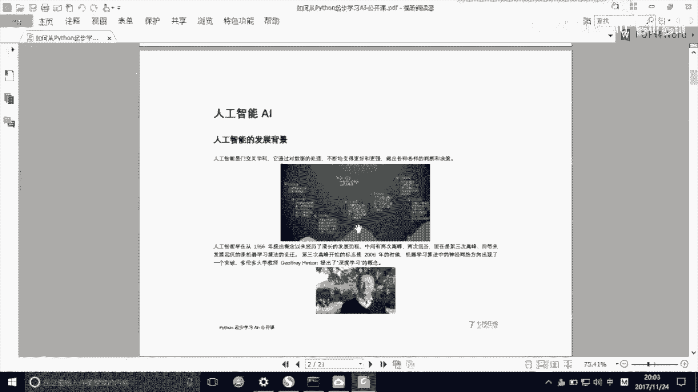

呃，层级是初级阶段。没关系没关系。好，那么呃第一个是我们的这个呃呃我们的这个第一个就是关于我们的人工智能的发展背景。那么这个背景呢我不要求说我们讲的有多深，因为要讲生会很费时间。

我只给大家做一个很简单的介绍，也就是说这个人工智能这概念并不是很新很潮的概念。它在上个世纪的50年代60年代就已经提出来了，并且呢已经发展过有之前有两两波发展的一个高峰。那么到了第三波发展高峰。

也就是说我们是从2006年深度学习的这个理论提出到了2013年这个深度学习在图像识别上大放异彩，真正进入到我们的这个工业界啊，包括进入到其他的一些具体的应用为首的这个第三波。

那么我们现在呢就站在这个第三波的这个浪潮上，那这图片稍微有点小啊，因为要处理这个内容。

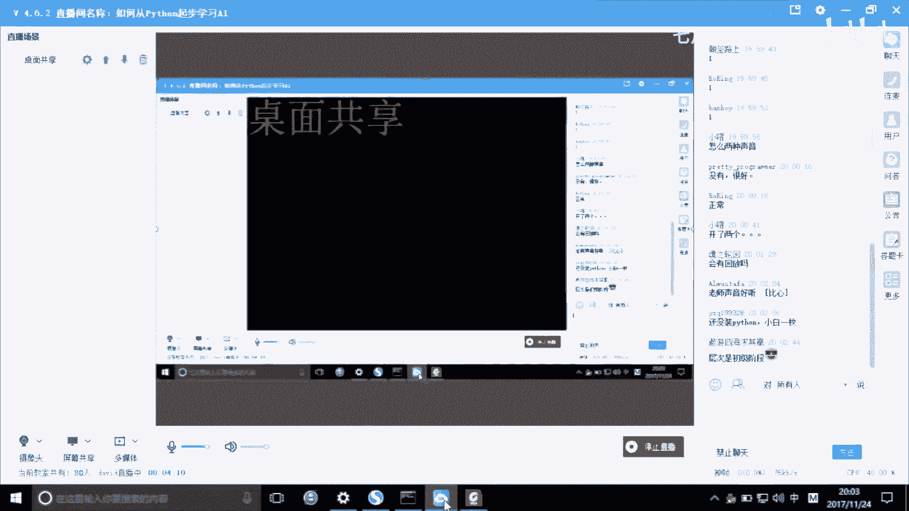

大家可以大致的看一下啊，我们现在就站在这个蓝色这个风上啊，蓝色这个风扇。那么呃同学说，那么这个机器学习为什么之前会有两波？呃，现在我们到第三波，其实机器学习非常非常依赖硬件资源和这个我们的这个数据量啊。

之前发展并不是理论上有一些瑕疵，或者是理论上啊出现了很多的问题，很多时候呢，往往是因为我们的硬件计算资源跟不上和这个数据量达不到它的一个呃它的一个标准值。所以呢我们就没有办法干嘛呢？

呃像这个社会上或者说像工业上生产商去做一个比较大的推广，比较大的推广。但是呢在13年大家知道13年啊06年开始啊呃2006年开始13年啊，这个期间啊硬件的发展，尤其是什么？

像GPU大家可可能也听说过哈GPU也就是说我们的显卡是吧？显卡的这块的一个飞速的发展还。我们的大数据的平台这个纷纷的去不断的啊升级啊，我们的这个数据量呈现了一个海量。

也就是说这次的浪潮并不是啊这个简简单单的理论上的升级，也有在硬件设备上数据量上的一个同步的共振啊，同学们只要知道说okK我们现在在人民智能的第三波浪潮上就行。

并且呢同学们记住说OK我们这下面这个照片里的老爷爷啊，一个哎一个。

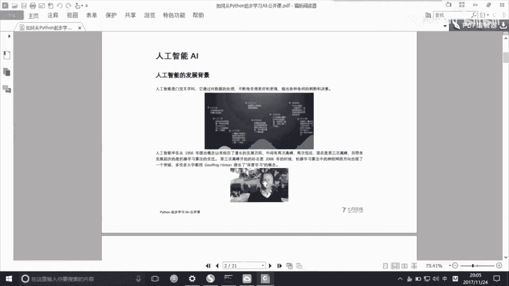

sorry啊sorry，那个字体调大一点，我我放大一些哈呃，这样可以哈呃人工智能的呃大家看看这个老爷爷啊，这是一个大神啊，真正的大神啊，黑客大神，就是他来提出了这个深度学习的这个理论啊。

深度学习的这个概念。好，那么我们继续往下去走第二培。说第二个就是人工智能发展的一个路径。

就是说大家可能说老师，你刚才讲了人工智能从上个世纪50年代就来了，现在又在发展。他这个路径我们怎么去把握呢？其实非常的简单。就是说我们既然说到人工智能，既然说到人工智能。

我们对他的一个定义其实就是什么呢？或者说对他的一个期待，就是说他能够替代人，这个替代呢并不是说呢大家恐惧的那种替代啊，把人给啊全部给代替了哈那种的啊，而是说他在能力上和人越来越接进。

并且呢有超越人的这种能力。这之前的计算机呢可能是在存储和计算方面，他非常的有优势。比如说我们我们通常都知道我们的数据库数据管理系统啊，或者是我们的这个计算能力，计算机是非常的强悍。

但是计算机解决不了一些我们人类非常easy的事情。比如说3岁的小孩现到爸爸妈妈都会认识啊，这是我爸爸，这是我妈妈，这是我的小朋友，对吧？但是计算机做起来非常的困难非常之困难。啊，但是在第三步的浪潮中。

也就是刚才提到深入学习的时候呢，就是说啊计算机开始在。这方面发力啊，开始在这方面来进行发力了啊，他对我们的生活的渗透，那是已经是很深了。我做一个很简单的例子，大家看一看这个呃PDF上也写了。

就是说啊我们的这个打开支付宝啊，积极学习，会做面部识别啊，这个应该还是现在不是很普及哈，那么我们比较普及的，就是大家都用过农村哈，网易云音乐都知道，哎，比如说我爱听什么歌曲。

那么呃呃这个网易就会慢慢的给我推荐推荐什么呀，推荐这个比较我越来越符合我口味的歌曲，对吧？哎，那么呃他会给我找出和我有同样爱好的朋友。这些东西都是应用到我们的机器学习啊，机器学习。

那么其他的包括了您在网上买一个东西，它会有一个推荐。哎，购买了这个呃这个朋友啊，这个这个用户也购买了那个给您推荐一下这些东西都会用到机己学习啊，可以说渗透到我们的一个生活里面啊，生活里面。那么。

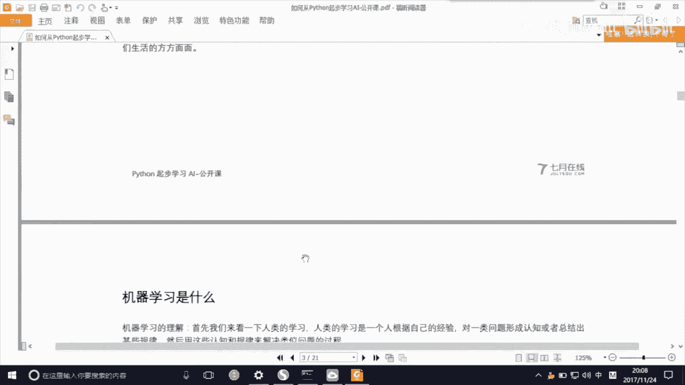

那么刚才暂停一下好了啊，那么那么刚才我我来看一下，继续我们的PPT啊，呃应该同学的直播是没有问题哈。好，那么我们看一看我们经器学习到底是什么。刚才老师跟大家去聊了啊，什么啊这个机济学习好神奇啊，是吧？

其实呃我们怎么去了解它呢？首先我们怎么去了解认识什么是机器学习啊，对吧？我们讲了这么多到底是什么，其实我们完全可以从人类的经验上去理解机器学习啊，最简单的一个道理呢？就是说我们人类去学习一样的事情。

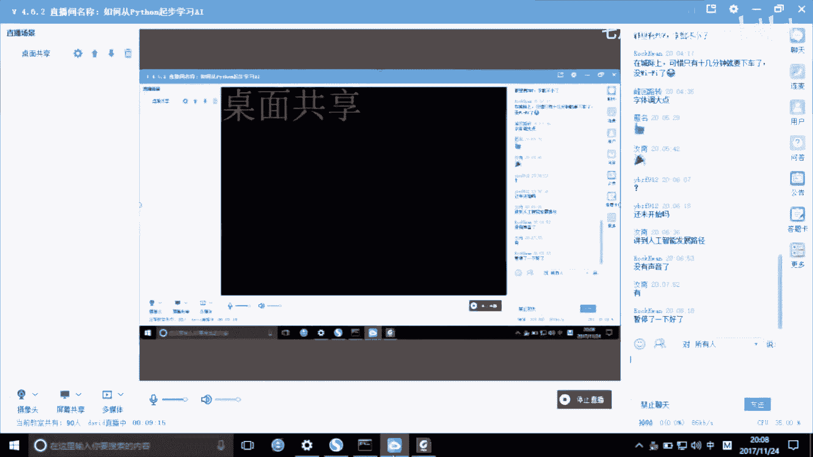

我们经常会有说了一句话啊，我们大家去分享一下叫什么呢？叫做哎瑞雪兆丰年。大家肯定听过这句话，对吧？瑞雪兆丰年哈，或者是一句话叫做朝夕朝霞啊，朝霞不出门，晚霞行千里。大家可能也听过这句话啊。

那么这就是我们人类在学习和自然进行交互的过程中，所总结出来的经验。其实学习就是一种经验的一种总结和积累。啊一种经验总结和积累。什么叫经验的总结和积累呢？今年比如说今年是2017年啊，冬天还没到哈啊。

冬天呃还没有到一个入呃山东啊啊，如果山东下一场大雪，那么请问2018年咱们这个庄稼的收成会怎么样呢？哎呃我们会觉得哎201717年下了一场大雪，专呃这个18年的收成会不错。如果2018年没有下雪。

那么这个庄稼的收入会稍微差一些。那么这就是什么呢？这就是一个对于我们经验的一个总结啊，经验的一个总结，像刚才提到了另外一个句子叫做朝霞朝霞行天下晚霞啊，朝霞不出门。

晚霞晚霞行天下讲的也是这样的一个例子啊，讲的也是这样的，这个其实就是我们在工作生活中哎总结出来的一套经验。那么这是人学习东西总结的出来比较经验。那么我们怎么让机器去学习呢。那机器也能去做这样的事情呢？

其实啊机器来讲。也能来做这样的事情啊，这是通过科学家老爷爷他们的不断的努力哈发明一些算法啊，让我们可以从计算机去学习呃计算机去学习一些东西。计算机从哪里学，第一个一定是数据中学啊，一定是从数据中学啊。

我们计算机虽然很快啊，很强，但是它很傻，就是他只能处理数据这，大家也都知道哈，那么首先我们有足量的数据，让他去学学什么啊，去学习一套规律啊，学习什么规律学习你设定目标的规律。

假设我现在就要去预测我今年下了雪，我明年的收成会怎么样，这样的一个事情，我们就可以把它量化成我们的一个学习模型，并且去做这件事情啊，并且去做这件事情。那么这它就叫做机器学习，就是机器学习。

那么呃这个PP这个PDF上呢，啊啊这个PDF上呢有一些简单的啊一些通俗的说法，大家可以。呃，下载的PDF自己看一下哈，看一下。那么我怎么样的去跳出这些东西，用大家都能理解的话去跟大家去说哈。那么好。

那么呃机器学习人变得有智慧。你看这个平这面写的人变得有智慧就要阅历其实就是很简单呢？就是说咱们老嗯经常说句老话叫吃亏是福，什么是吃亏是福啊。吃了亏，我们就能对这件事情讲了记性，这个记性其实就是经验。

对不对？那么这个经验在我们人类的里面是怎么样去交流呢？其实就是通过这个老话吃亏是福或者谚语来交流。在机器里其实就是权重值和数字啊，权众值和数字。他要调教的，其实就这个东西。啊，这是两个互相对应的东西啊。

那么同样是觉得听不懂没关系。我们下边会讲到啊，不要着急。好，那么现在呢我们再来讲一讲这个机器人工智能机器学习深度学习的一个关系啊。那么刚才我们讲了很多的概念，包括人工智能进行学习深度学习，最东都是什么？

他们都是什么鬼啊是吧？都什么概念呢？首先人工智能它是一个很宽泛的领域啊，人工智能咱们天天说AIAI其实就是因RT intelligence是吧？人工智能两个英文单词的缩写是吧？那么这个东西啊。

这个人工智能概念非常的宽泛，非常的宽泛哈，非常的宽泛。那么机器学习是什么呢？机器学习是我们实现人工智能的一种方式方法哎实现它一种方法，用计算机去实现人工智能一种方式方法。那么深入学习又是什么？

深入学习是人工智能下面的一个。子的一种方法叫做神经网络下面的一个子分支啊，神经网络下的一个分支，只不过是因为深入学习实在是太强大了啊，深入学习实在是太强大了。他能做的事情现在来讲。

包括了语言识别、自然语言处理、语音识别、图像处理，他都能够去做。所以呢把它单独拎出来了一下啊，放到了我们经济学习里。还放到我们经济学习里。然后呢这个图呢大家可以看一下。

能够帮助大家哎能够能能够帮助大家去干什么呀？去哎了解他们之间的一个层级关系啊，层级关系啊，我看同学说了就阿是吧吃亏是损失啊，深度学习强大吃亏啊，我认为是负啊，我认为是负哈，那么我们继续往下去说啊。

一会儿你讲到我们的吃挥到底是是什么啊，首先我们来看一看机器学习的分类啊。那么这个大致跟大家说一下，有三大分类，一种是叫啊非监督学习unsupervised learning啊。

第二种呢是supervised learning是什么呢？监督学习，第三种informent的就是我们的强化学习。那么我们只介绍前面的两大类。

那么最最常用的就是我们的supervised learning叫监督学习。这个监督学习是个什么呢？是个什么鬼啊，其实特别简单，那么刚才我给大家举的例子里就已经包含了监督学习的一个思路了和思想了。

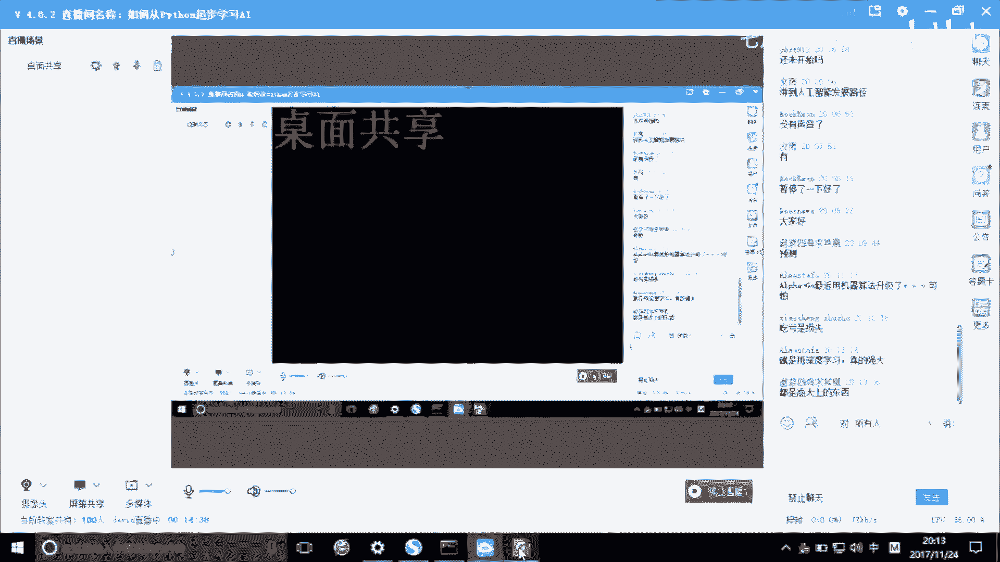

例子呢？还记得我跟大家说的这个朝霞行天下嘛，对吧？朝呃朝霞行天下晚霞呃朝朝霞不出名，晚霞晚霞行天下。sorry，我我记混了哈，我们用另外一个例子啊，叫做叫做瑞雪招风年跟大家说吧。好。

那么现在呢呃为什么我说瑞雪招风眠是一个监督学习，首先我有2017年的数据啊，也就是说我现在的数据，那么我这个数据它这个数据要靠什么去验证呢？要靠2018年呃收成，我这么说大家能不明白啊。

我这个数据是要告你比如说今年的这个2017年是不是下雪了啊，意思我 no是吧？下了雪下了多深，下了几次，每次下多深，这些东西都是什么呀？都是我来去预测明年。呃，我来去干嘛呀？

我来去判别明年它的这个产量到底是高还是低的一个什么呢？一个一个什么叫我们叫做一个叫做feature特征啊，一个特征。好，那么这个地方呢就是我们的一个有监督学习的一个小一个小图哈。

那么我们把这个叫做training data。什么叫train datatrain呢就是我从1991980年到2017年所有的冬天的记录拿出来啊，拿出来包括了今年下了几次雪啊，下的雪有多深，有没有下雪。

然后呢次年它的这个收成是不是达到了我们的预期，比如说是丰产yes or no是吧？零合一，对不对？然后这些就叫做training data。那么这个label是什么呢？就是我刚才说的是否丰产。

是否是一个丰收的状态啊，一个丰收的状态。然后呢，我们用一个一个经济学习算法，比如说是我们的一个叫做逻辑回归的一种一种经济学习算法。然后呢我们去学习什么呢？学习我们的这些刚才讲过所有的自变量。

也就是今年下年下雪下了多少啊，下了几次。和这个啊因变量，也就是是否风产YX和Y之间的一个关系。那么我们这些同学中有数学比较好的，可能就会理解，其实这是就是一个方程式。那么这个方程式一旦做出来以后呢。

其实我们求的是什么呀？我们求的就是这些自变量前面的位，也就是我们的权重值。我们学习的就是这个经验，就是这个经验啊，老人一看啊，今年这个雪下的很深，那明天一定是这个啊这个丰收。

那么老人他的这个经验其实也是根据什么呀？下雪的深度，在这个前面加上一个大的权重，这就是经验啊，这就是经验，那么这个经验我们学习到以后干什么呢？预测啊，一定是用来预测。

这时候呢2017年下雪O我们把2017年下的雪的次数雪量都记录下来，我们就可以通过我们学习到的这个模型去做什么呀，去做。预测我看看2018年是否是一个分产的一个年份。啊，我不知道这么说。

大家呃能不能够理解哈，其实这是一个。你们能把这个逻辑想明白，其实是一个非常easy的事情啊，easy的事情。

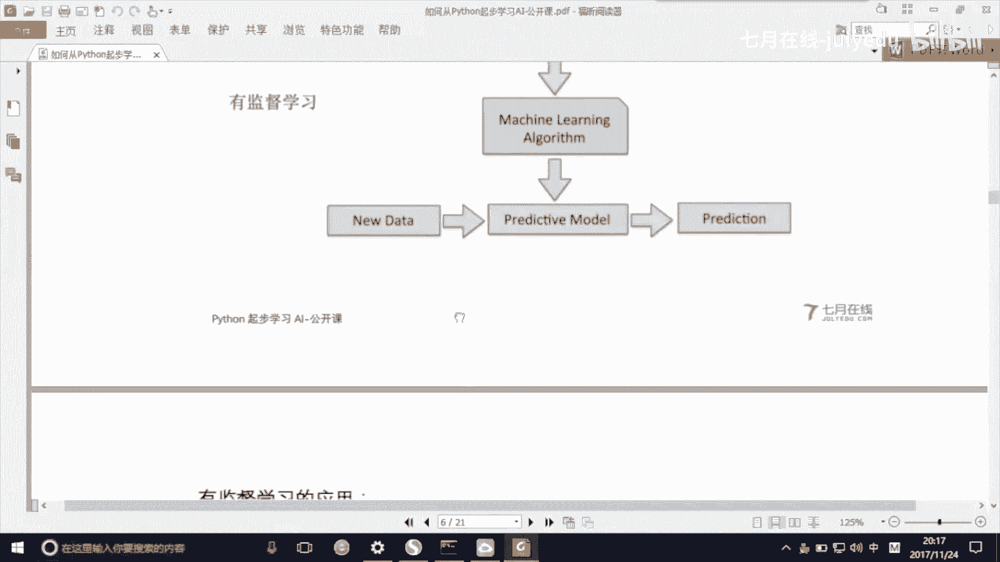

啊，稍等啊。

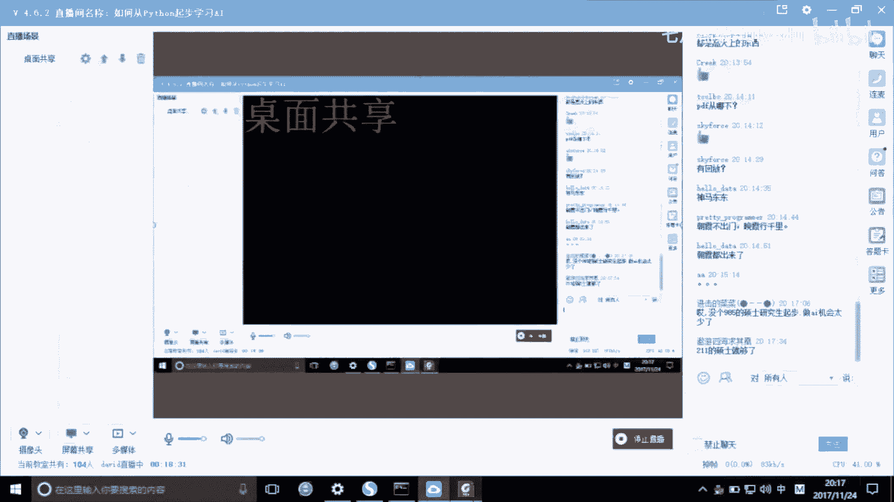

啊稍等啊啊稍等那个我们继续往下去讲啊，叫做有监督学习的应用啊，有监督和无监督。刚才呢我们主要讲的是有监督哈，那么我们继续讲讲有监督，有监督主要用在了分类和回归。这个问题主要是放在什么呢？啊。

分类和回归主要是我们要预测问题，预测的问题，什么呀？它的一个目标变量的属性来去定义的。啊，比如说我来预测明年是否分产，我就可以用分类的问题去做。我要去做一个图像分类器。比如说猫狗猪，假设这三种动物。

我给你的图片图片能够分好类，它到底是这三个动物中有哪一种。那么这也是一个分类问题，它处理的是我们的目标变量变量是一个离散值的情况。那么什么回归呢？它主要是处理我们的目标变量是一个连续值的情况。

那比如说最简单的一个事情，就是说我们来预测一下我们的房价。我们最近双十一刚过啊这个啊呃这个天猫又做了很多的销售啊，这个又破了一个记录是吧？好，那么这个时候我想知道我可不可以用以往从10年开始到17年。

现在我们已经知道了啊，17年的数据是多少。我可不可以用这些数据去预测一下天猫2018年双十一的一个销售额呢，可以没问题。但是因为你的这个目标变量是一个连续值，所以呢我们就会用回归的这个模型去学习啊。

那么好，那么继续讲，我监督学习啊，稍等一下，我看看我们的同学有没有提问啊嗯。

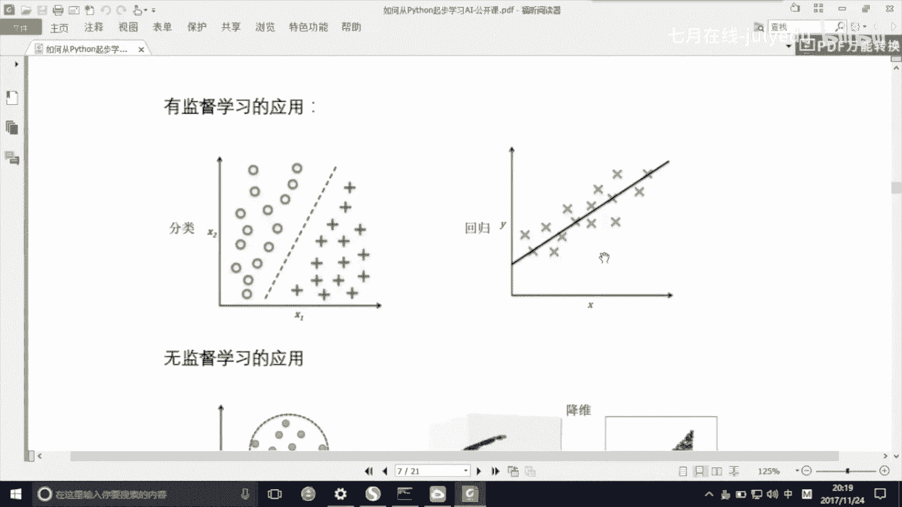

课件可以下载啊课件可以下载课件可以这个去呃咱的咱的这个QQ群里下载啊，聚例和分类没啥区别，这是两名这是呃一个人大名小名啊，不要去纠结这个问题哈。好，那么我们继续来去啊。

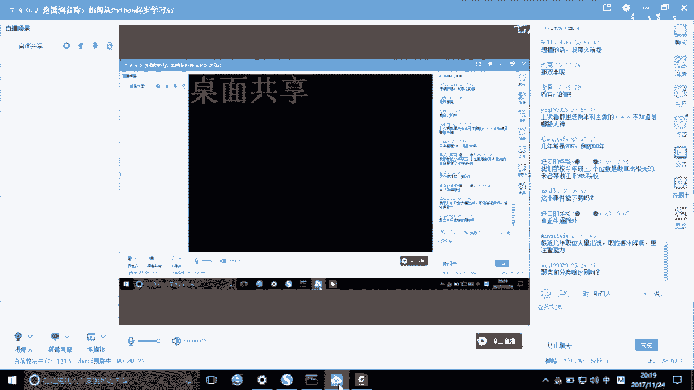

呃，无监督学习主要是做什么呢？无监督学习。刚才我给大家去说了一个事情是什么呢？呃，全部都是一个什么呢？我给了你一个数据，并且我给了你一个数据的一个标准答案，对不对？啊？我给了你一个标准答案。

那么你去学这些数据和标准答案之间的一个关系。那么这就是一个叫做有监督学习。那么无监督学习呢就是我们的一个我给了你的数据，我现在都不知道这些数据之间有什么关系，也没有答案。那么你能不能帮我去做一些事情呢？

那么这个时候呢，我们就会应用到无监督学习。无监督学习主要有两大类，一个是聚类，一个是降维啊，聚类怎么去理解呢？就是说。呃，假设我现在有一堆的电商里面的这个啊用户的数据啊，用户的数据用用户行为的数据。

那么呃我并不知道，或者是说如果我假设我现在只能按照我们已有的认知去给这些用户去做分类。你比如说啊这个我们的按地区去分类啊，我们的用户按照买购买的商品去分为我们的用户，对吧？

等等的我们已知的这种已知的这种分类方法。但是这些数据中往往蕴藏着一些很有意思的事情啊，就比如说啊他喜欢的某一某一张音乐专辑或者是说这张音乐专辑可能会吸引一部分人的喜欢啊。

或者是某一双啊鞋或者某一类型的衣服会吸引一类人的喜欢。那么这些我在一开始我并不知道这些数据的关系。那么这个时候呢我们就可以用剧类的方式啊，去让数据自己去进行一个分类。刚才通过问到剧类分类啊。

其实就是一个啊分类的问题啊，其是两个名字指的是同一件事儿啊，指的同一件事儿。那么这个这个因为你比较比较有意思的就是沃尔玛，大家知道那个比较有意思的叫啤酒和尿布是吧？

所以一开始谁也想不明白为什么啤酒和尿布往往会被一起购买啊，后来我们可以给他很多解释啊，因为这个呃这个爸爸这个有孩子的。爸爸去超市里去买尿布，往往喜欢带瓶啤酒回家，对吧？啊，后来我们可以给他解。

但在事前我们是不知道这种分类的方法。那么聚类其实就是帮助我们去做这些事情。那么简单讲完剧里，我们大致再说一下降维，什么是降维啊，就是说我们的数据有很多的维度。在一个二维的表里面啊，二维空间里。

一个数据点通常是由两个维度去给它确定它的位置，三维空间呢是三维呃三个数据点。那么如果是在一个数据我们拿过来会有很高的维度，比如说几十维上百维甚至上千维的时候。

那么我们对它的分析起来就会非常的计算量会非常的大啊，这一点是非常的要用的。那么这个时候呢我们就可以运用降维的这种算法，将我们的数据从多维进行一个变换到低维进行转换。那么大家看一下这种PDF图里啊。

左左边的降维是一个三维的图形，到了右边就变成一个二维。虽然进行了一些降维，但是它们的分布还依旧保持着某种次序。大家也能观察得到哈，大家也能观察得到。那么降维通常有PC主成分，还有我们的啊。那么我们来啊。

说一个比较具体的一个小案例哈，叫做爱瑞斯花啊，爱瑞斯花什么呀啊样本啊，样本我们的样本和观测值和实力讲的都是什么呀？123455150，大家看到的是什么呀？大家看到的是这个表的一个呃。表了一个缩引是吧？

哎，然后这些列是什么呢？这个它的这个花瓣的长度，花蕊的长度是吧？哎，都是有一些竖直形，那么这些都是什么呀？就像是我刚才跟大家去讲的，哎，这个瑞雪照丰年，下没下雪，下了多少次雪，每次雪下多深是一样的意思。

他们全部都是一个features。我们也管它叫什么呢？叫做属性或者是维度。而它的这个分类class labelbel，我们管它叫什么呀？叫做目标变量或者是label。也就是说这些数据啊。

从这个呃花瓣的长度，花蕊长度啊，到这花蕊长度宽度，这些都是我们的自变量。而我们的class label是我们的一个因变量。我们要去求的其实就是我们的自变量和因变量之间的一个关系。

那么求到的这个关系就是我们这个多项式前面的一个系数，这个就是我们的经验。一旦学习完了以后，如果现在我再给你一个一组数据，那么你自然而然就会预测出来这个数据，我给你的这个新的数据，它到底是。

这个每一类花啊每一类花我不知道这么说，大家能不能明白啊。

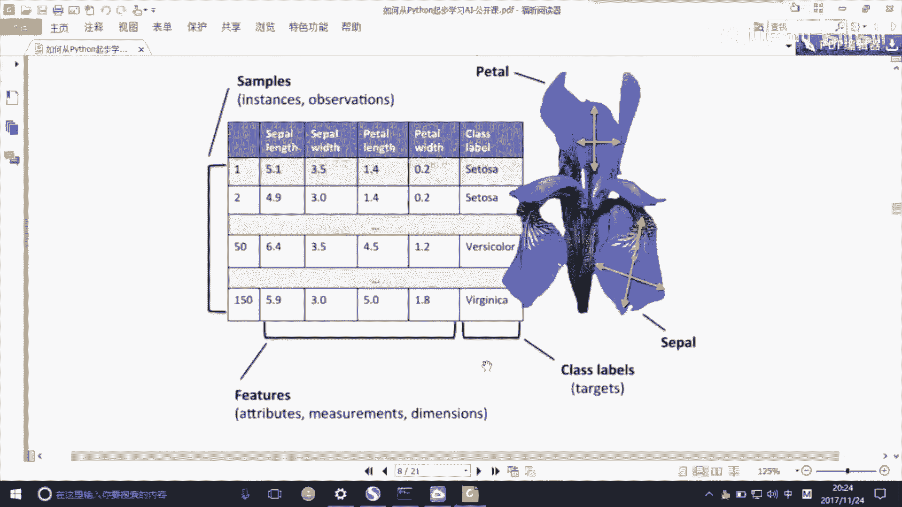

呃，稍稍等一下啊，PCA血压这个别着急，我后面会讲哈，后来会讲稍等一下啊，我们先讲到继续学习常见的算法，大致跟大家说一下，因为时间可能有点超啊，你讲25分钟的已经。那么首先继忆学习常见的算法。

我们听到决策数，决策数其实很简单，我们每天都在决策，今天早上要不要去上班啊，是吧？我不想起床怎么办呀，是吧？啊，每天都在去做决策。只不过决策数是有很多层的决策。我们这个例子里就是买衣服的决策。

你是不是喜欢喜欢就买不行不买价格是不合适，合适就买不合适就不买，是否有尺码啊，有就买没有就不买。那么我们可以继续给它延伸啊，有没有会员打折，有有就买没有就不买，有没有合适的颜色。

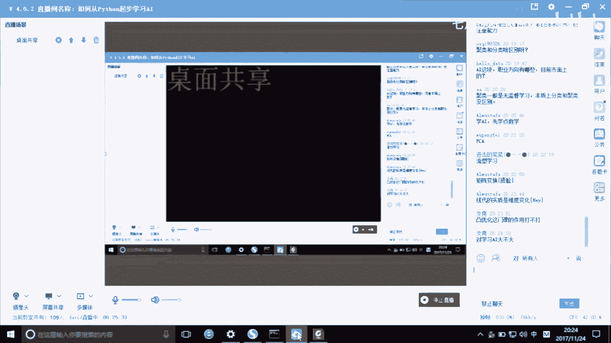

买没有就不买。那么我们给它做延伸。那么这个其实就是一个分类的过程啊，分类的过程。那么大家自己可以来看一下，我只简单介绍一下啊，那么回归其实就是刚才我去讲的，像这个爱瑞斯花的这样的一个案例啊。

爱瑞花的一个案例。那么回归呢我们大致的分为简单的线性回归和多元性回归啊，简呃这个简单性性回归，其实就是一个一个自贬量。那么多元呢其实就是多个自贬量啊，那么这个很简单，我们也可以用它去预测我们的这个。

身高和体重的一个三面图，我们可以给它拟合出来一个直线，然后用这个用用我们这个学习到的这个直线去预测你下一个身高和体重啊，你给我一个身高，我们够预测一个体重啊，那么这是一个很简单的应用啊，简单的应用啊。

那么支持向量机。那么大家知道我们的中来老大的博客上就会有这个支持向量机理解它的三层境界哈。那么我就简单的说一下啊，那同学们有兴趣可以去我们老大的博客上看一下，那么SVM是什么样？

SVM其实就是呃解决了线性不可分的问题啊，在一个平面上一个数据分不开啊，大家看得到哎，这个平面上我们这个红点和这个黑呃红着这个钻石块和黑的圆点分开怎么办呢？哎，我我通过了一个核函数映射。

把它映射到一个高维空间中，我再去给它做分割，它解决的这个问题啊，那么神经网络这个事情其实它也是一个分类器，它是什么呢？它是将输入和矩阵相连，矩阵计算的结果和神经元相连，有多少个神经元。

我们就会有多少个分类器，我们可以这量去简单去理解它啊，简单去理解它。那么深入学习。刚才我们也讲到的，其实是我们之前的我们的神经网络隐隐藏。也就是我们神经。数之前由之前我们的一层增加到了多层。

那么增加的这个多层就叫做深度，有了深度啊，那么这也就是我们深入学习这个名字的来历，我不知道大家能不能够理解哈。那，你你不理解，没有关系，我们继续再往后看啊，因为我后面还有。那么像朴素贝尔斯的分类器哈。

那么这也很简单，就是说呃我们可以说呃我怎么样去给大家做一个简单理解，就是我想知道你是什么样的人，我只要看到你身边的朋友就可以了，为什么呢？啊，因为你身上的属性会和你身边朋友很接近。

我一旦知道你身边的朋友，我也就知道了你啊，这是一个比较呃比较呃简单的去理解哈，那么事实上我们的一个应用会有垃圾邮件的处理，是吧？我先定义好一些垃圾邮件，比如说垃圾邮件，你经常会出现一些啊发票啊是吧？啊。

或者是或者是一些什么这个诈骗的一些信息哈。我我也想起来，名词已经好久没收到垃圾邮件了哈。那么如果这个时候我定义出来的这个词里面哈，我我先把这些都定义好，这些就是垃圾邮件。好，那么现在来了一封新邮件。

你的这个。呃，邮件里边出现了和垃圾邮件里边有60%的相似度的时候，那你说你自己是什么？对吧那么我就认为你是个垃圾物件呗，其实就是这么简单的一个道理哈。那么最后我们再看具队刚才说过了哈。

我们就是把它简单跳过啊，因为时间稍微有点长啊。好，那么我们来看看我们的AI学习路径的一个规划。这是我们今天课程的一个第二部分啊。第二部分那个呃对CSDNSVM哈对，前几年这种9爱的这个博客啊。

那么啊谢谢大家谢谢大家好，课件能下载能下载那个咱们都在咱们QQ群里啊，QQ群里。好，稍等一下，我们来开始进入到我们的第二课程。

也就是说啊也就是说咱们啊知道了我们的现在我们的这个人工智能或者是说我们的这个啊啊我们的这个机器学习这一块很热很火，我们想加入它怎么去加入，其实这也是一个AI就其实这就是一个AI学习路径的一个规划啊。

怎么去理解这个问题呢？其实。

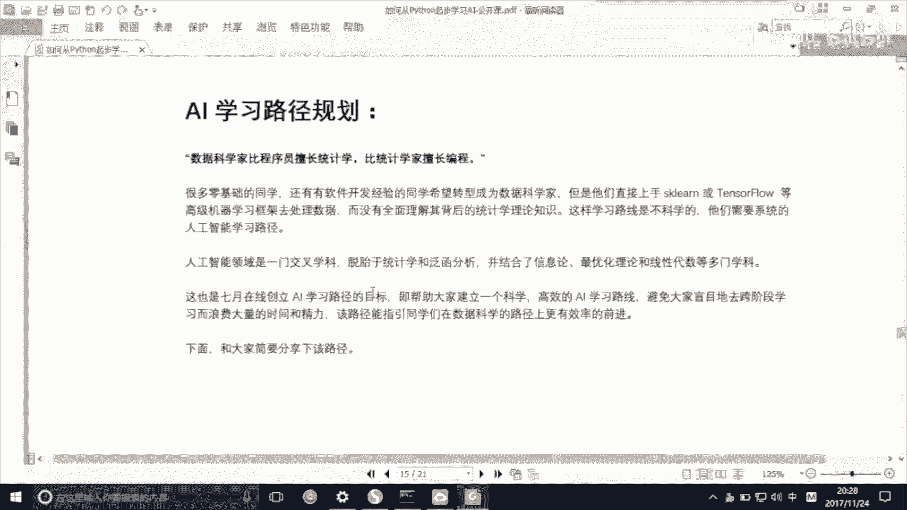

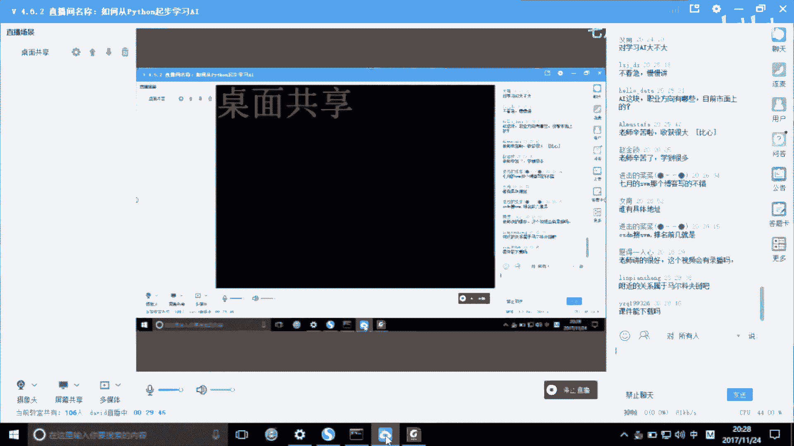

呃，的确实在现在2016年的时候，就已经把这套啊AI学习路径已经给做出来了，已经给做出来了。那么这个学习路径呢，其实呃你如果呃咱们群里可能有一些同学之前是学这个呃已经有这种开发经验。

或者是已经有这个数理统计基础的这些同学，是吧？那么呃这些同学如果想入门们AI其实也是有些挑战的。为什么呢？因为我呃因为咱们这个AI这个领域，它本身是一门交叉学科，怎么去理解交叉学科呢。

就是说啊你去做这个事情，你既要懂什么呢？计算机基础的一些编程，你要懂一些啊基本的数理统计为积分析概述，同时你还要懂一些业务啊，那么这种的要求相对来讲就比较高。因为啊我们的大学也好。

或者说我们目前的一些企业也好，嗯真的很难有这种环境能培养出来这样的一些人才啊，这样的一些人才。那么这些同学在学习的时候，也可能会做很多的弯度啊，比如说我就见过很多同学啊有这个开发经验呢。

直接就开始上手S learn上手tflow。那么他们觉得哎按照以前的经验，我们就去写吧，是吧？啊总以为这个东西不就写出来的嘛，但是真正啊真正去做不一样的。像比如说S learn的库封装非常。

简单一个fet一个predict，你能搞定问题是吧？啊，最多我们前面在做做数据清洗，或者是做做数据分割就能搞定。但是它背后的东西你不了解代好代码加起来一共十5行搞定，但是背后的东西不了解。

这样你去学习它，你其实是就是隔绝挠痒，嗯，没有好的效果。所以基于这样的一个问题呢，所以我们。也是其在线创立了咱们的这个AI学习的一个路径，就是给大家去建一个科学高效的学习的一个路径，避免就是盲目的。

尤其是跨阶段的去学习啊，跨阶段的学习，帮助咱们同学在进入这个AI的行业里面，更有效的去做一个啊学习计划。那么下面呢给大家去分享一下啊，简单的分享一下。首先我们看一下啊。

我我把这个我们的学习路径啊一共分成了。1234，一共分成了4个阶段，一共分成了4个阶段啊，那么这四个阶段呢，其实大家可以在7月在线的官网上都可以看得到。

但是呢我呃把这些东西作为一个整合一个整合啊一个整合。那么这些也是我们现在线的一个呃精华在在里给大家做一个分享。首先第一个我们要去进阶的一个点呢？就在python编程基础算法与数据结构，这个是CS方向。

也就是computer science这个方向的。也就是说无论你想去啊无论你是什么样的层次，你必须要懂python，为什么要懂python。因为python是咱们现在整个AI学习领域最火热的这么一个库。

怎么去定义？最火热，就是说他对很多的库支持，他能够使用很多的库。thon自身的语言的优点我就不太多说，同学有有可能会了解到啊，比如说它的语法很很简单，它的这个代码的代码的这个顺序很优美是吧？啊。

写起来非常的就是非常容易上手学是学起来更常的快啊，非常的快。那么这个优点就先不说更重要的它是被很多的第三方户支持。你比如说最简单，你说你你想干什么？如果你想做举个运算，那么我们有安排啊。

这么强大的一个库来支持你。如果你想做这个呃数据的呃清晰分析整理。那么我们有pa。如果你想做经济学习，我们S，如果你想做深度学习，我们有这些东西都有如果你想做数据视全都有。你知道吗？

它就是一站包含了几乎机器学习从开始到结束的所有的东西。所以它是一个必经的一个点啊，它是一个必经的一个点。好，那么。那么算法和数据结构呢就是说它是面试的一个点。就是说我们通常学完这个python以后呢。

我们还要过一过我们的算法和数据结构。在面试的时候通常会被问到同学们，尤其是我们从学校里出来，同学经常会被啊这个面试官问到。有些呃写一个算法是吧？啊，这个数据结构的理解啊都会被面试到，那么这些也是要学。

这些也是要学的一个东西。那么我们现在其实在线有pyython的课程也有算法和数据结构的一个课程。那么这是第一部分啊，第二部分是什么呢？第二部分是一个。

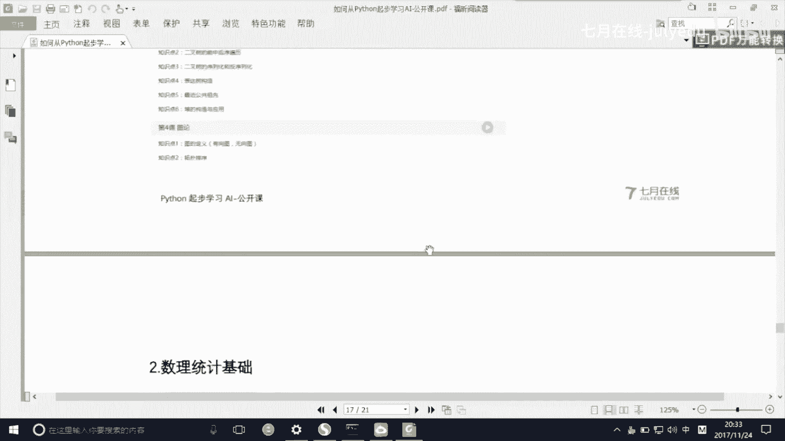

啊，稍等啊，一般不子啊，那个同学别着急别着急啊，我再往往下去讲啊，往下去讲，你就明白了啊，稍等啊。

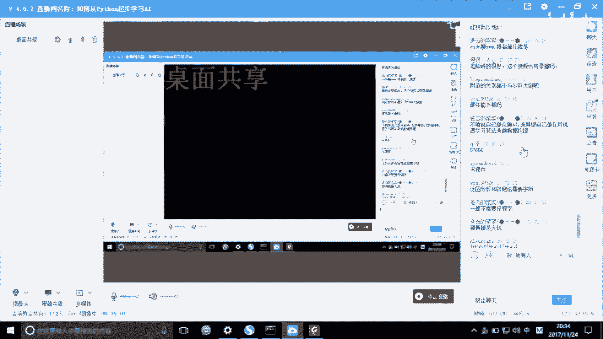

第二个是数理统计基础啊，数理统计基础。那么数理统计基础就是说这也是很多呃之前做开发的人的一个大坑啊，一个大坑。刚才同学说两个坑哈，其实不止两个坑啊啊，一个大坑是什么呢？就是说呃很多人就是刚才也说了。

就因为数学功底不足，学不下去。最简单的一个道理。刚才我讲到一个叫做线性回归线性回归的时候，我们去求损失函数，损失函数本身是一个凸函数。那么我们对凸函数进行优化，我们会用什么优化。

我们会用一个叫做哎呃就有一个叫做梯度下降的方式进行优化是吧？基地的方式进行优化。那么这个优化又会涉及到呃危机分离的求导。那么这些东西啊都是呃如果你要是用计算机，我们用代码去实现，其实就是两行代码去搞定。

但是你根本当你不懂的时候，当你不懂得两行代码在背后在做些什么的时候，你你去你去写事业代码的时候，即便是完成功能，你的心是很虚的。你的心是呃很很虚弱的，但是你因为你不知道它背后做了些什么。

就能把这个结果出来啊，而真正的说我们去企业去面试的时候，往往不仅要问你呃能不能做出来，也会问你这个背后的它的这个算法或者它这个原理到底是什么，对吧？如果说我们去做一个非突函数的呃优化的时候。

我们就很难找到一个全局的最低点，可能会找到一个我们会采用这个随机提度下降的方式去找一个局部最低点，对吧？那么如果你不太清楚这个东西的话，那么呃让你去呃去面试也好，会去做这个实际项目也好。

嗯这个呃我个人认为不是一个好的一个。一个学习啊，既然已经花了时间，花了精力，那么我们就尽量把这个基础打牢啊，知道啊自己在做什么，更需要知知道自己为什么要这么去做，怎么样去做啊。

这也是我个人认为一个比较好的一种学习和工作的一个方式哈。好，那么这是我们的第二个啊阶段啊，第三个阶段就是涉及到了我们的记忆学习算法了。也就是刚才我看到同学也说了。这个就是说这个涉及到的这些算法。

比如说我们的最大商务模型，这些信息问你的东西啊，最大商模型信息增议是吧？相对商商是吧？还有一些模型调优啊，模型调优。那么还有一些像做呃刚才讲到的像一些啊这个决策数随机分明SBM这些的一个具体的应用啊。

具体的一个应用，包括逻辑回归啊，包括这些剧类分析层呃层次聚类这些东西都是要到切入到一个实战的那，就不再只是说老是今天我们去分享，就能够把这个给大家去说一说了啊，是真正用代码就用这个课程去做。

这是我们第三个阶段啊，最后一个阶段就是实战应用。因为如果没有第四个阶段，我怎么能知道你前三个阶段你学习的效果是怎么样呢？对不对啊，正因为有了第四个阶段。

那么第四个阶段就是说我们会以真正的项目来去考核大家，真正的项目去考核大家。比如说现在我们正在呃正在呃上课的啊，今天应该没有跟明天有啊，明天有明天有线线下课和后天的线上课的这个积极学习啊集训营啊。

进续集训营。这是一个线下课程，以及我们的线上课程，是基行学习实战应用班。那么这个班呢其实就是为了帮助大家去解决什么问题啊，解决我学了之后，我要把它做成项目的这么一个目的你只有用了这个项目。

我才能把之前所有的知识点进行一个贯穿。啊，我才能够把我之前所学一个完整的产品的形式拿出来啊，无论是我自己来去使用，还是我用来去找工作求职，还是转行的这么一个产品。如果没有这个。

那么你前面所有的知识点学习还是处于一个散乱的状态你没有用一个产品把它揉在一起好，那么这就是我们啊这个在我们却实在线啊，为大家规划的这么样的一个叫做啊AI学习路径的这么一个路线图啊。

那么啊今呃今天的课程可能超时了1来分钟哈。啊，不好意思啊，把它原计划是20分钟30分钟左右啊，那么在整个的最后。后呢呃今天的最后呢，我也预祝所有来听课的同学们。你的这个AI学习之路呢。

我们两个希望一个是有起点，希望你们开始。第二个更希望你能有一个结果啊，有一个结果。这个结果刚才我也说过，就是我希望你所有学习的同学最终都能有一个啊最终的产品做出来。好，那么就谢谢大家哈，谢谢大家。好。

那么啊。

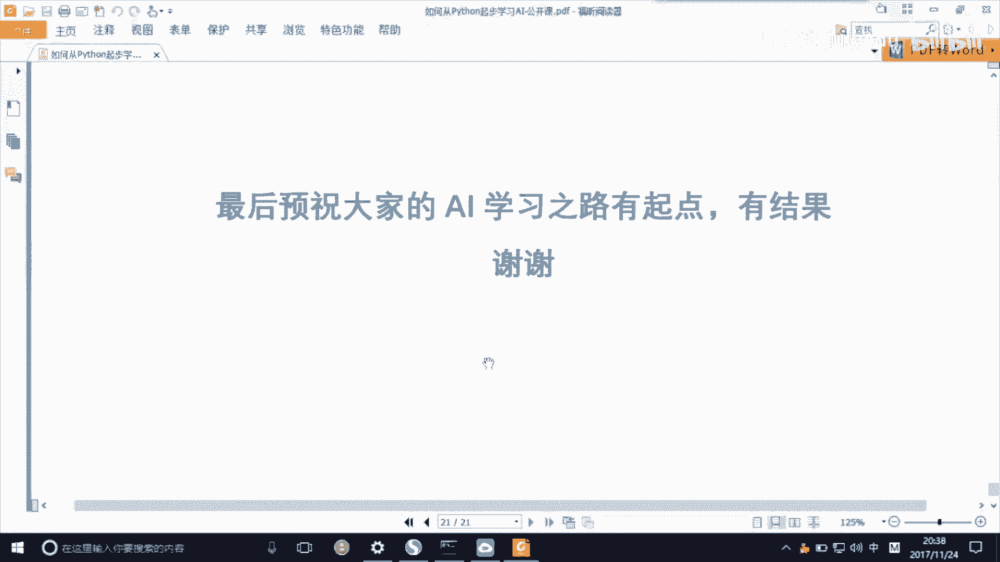

啊，与希希也希望大家能继续关注我们齐月在线啊。那么今天的这个今天的这个公开课就到这里，非常感谢大家。好好，再见再见。哎，好好，那课建在咱们QQ群里可以下载啊。科建在咱们QQ群里啊可以下载。🎼嗯。

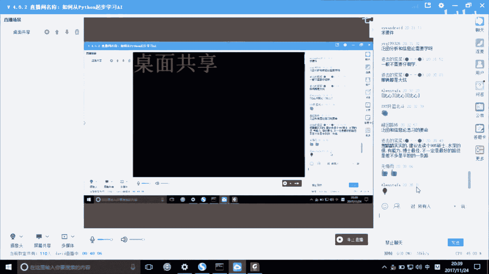

好，那就这样，再见。

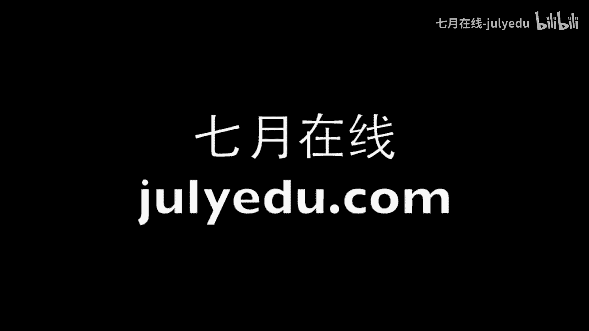