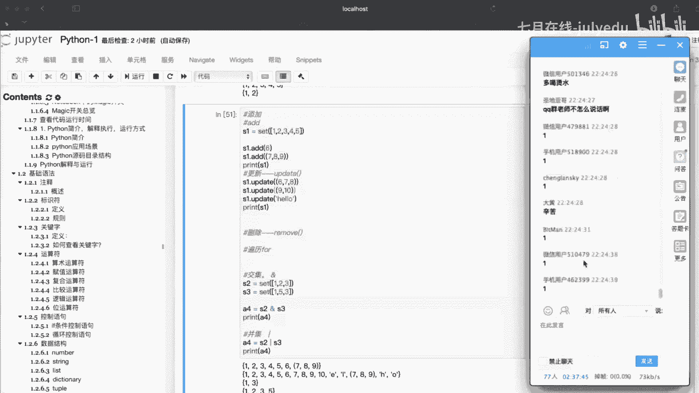

# 人工智能—Python AI公开课（七月在线出品） - P8：1小时带你熟练python基础语法 - 七月在线-julyedu - BV17W411K7G8

然后OK了以后，我们来讲这样的一个基础的语法啊。那么首先呢第一个啊注释这个啊注释呢呃基本上在啊每个语言里面都有是吧？它的作用呢呃毫无疑问是吧？啊，主要是方便后期的一个什么阅读维护是吧？

其他的它在我们整个程序里面呢，其实呢呃基本上没什么用，它也不解释也不输出是吧？比如说我们这里面做了一个例子是吧？啊，上面用一个井号，然后后面跟着啊一串这样的一个内容是吧？

然后呢下面用了一个print打印了hello world是吧？结果我们运行完了以后输出的结果什么呢？hello word是吧？hello word那也就是呢上面的这一段文字是吧？哎压根没有输出来。

也就是说它不参与我们整个程序的这样的一个呃解释运行是吧，它只是什么起到一个辅助说明的一个作用啊，比如说我们后期的一个代码维护的时候呢啊，这个就显得非常重要。啊，如果说你没有这样的一个东西，呃。

可能后期是吧，你都不知道这个代码是谁写啊吧？可能是你自己写的，你可能自己都不知道啊。那这个是注释，这个内容比较简单。啊，往下来走，就是我们的一个。啊，标识符这一块啊，那么标识符这一块呢呃什么是标识符啊。

其实呢就是一个名字啊，最简单的理解啊就是一个名字。那么这个名字谁来定啊，开发人员在程序里面自定义的一些什么符号是吧？还有一些什么呢？名称是吧？比如说我们这里面什么变量名啊，函数名啊。

这些东西呢通通都可以称作为什么呢？标识符啊，这是它的一个定义啊，那么规则这一块啊，分为两大块啊，这里面我给它分成两大块啊，一个是固定规则啊，这个规则打死的是不能改了啊，固定的啊。

也是什么原则性的问题不能触碰是吧？还有一个什么呢？行业内的规则啊，你可以称之为潜规则，对不对啊，只是潜的是代码而已啊。然后呢，这里面固定的规则啊。有哪一些？我们的标志符由这个字母下划线数字。

由这三个哥们儿组成啊，这三个哥们呢可以任意组成，但是哎前提是什么呢？后面还有一个很重要的字是吧？数字不等开头啊，也就是只要他不开头，这三个哥们可以自由组装啊，那么下面给你们举了一些这个例子是吧？啊。

这个你们可以自己去呃辨别一下是吧？哪一个是可以的，哪一个是不可以的，对吧？像这个在井号的对不对啊，像这个横线啊，注意横线跟下划线啊，这个很容易蒙人，对吧？还包括这个点儿对不对啊，啊，都是不ok啊。

那么除了这个以外，还有一个什么呢？行业内的规则啊，也就是说我们在这个呃实际开发当中的，我们需要去遵循的一些命名规范啊，一般在项目比如说开发之前啊，大家都需要坐在一起吧啊，讨论一下是吧？

比如说像这个命名规则啊。肯定是需要提前就给他定义好了啊，要不然张三这么写是吧？李四这么写，那到后来我们再同步到这个，比如说啊get upub上是吧？或者get上，那么就乱套了，对吧？

那么所以说我们在这个里面提前要把这个内容给它定好啊，那么有哪几条呢，这里面啊三个啊，比较常见的是吧？第一个是建名之意啊，也就是说你在定这个标志符的时候也起名字的时候呢啊，尽量一眼就能啊。

你瞟呀你就知道干嘛。比如说你定义的呃name是吧？就做这个学生的这个名字或者定义 studentent做什么学生对吧？借名之意啊，这点呢呃很重要，那么还有什么呢？驼峰命名法是吧？

那么比如说哈如果说你单纯的按这个建名之意来呢，还不够啊还不够啊，比如说我们这个呢my name。如果说你全部写成小写的my name。那么有可能两个单词就会拿混掉啊，比。说我们的这前面比如说三个字母啊。

可能是一个新的单词啊，这样呢就会产生一些歧义啊，那么我们需要用一些什么呢？特殊的方法帮他们每个单词给他什么隔开，那么隔开怎么来隔，这里面两种方式啊，一个是大头风一个是什么呢？小头风是吧？

这里面有对应的描述是吧？小刀风呢呃第一个单词小写，后面每个单词呢大写啊，首字母大写啊，然后大头风呢是每一个单词的首字母都要去大写啊，那么还有一个什么呢？什么下划线是吧？

下划线现在是比较流行的这样的一个方法是吧？啊，比较流行的方法，那么也就是说我们可以用下划线来进行这样的一个连接啊，这里面少了一个线是吧？你可以把这个哎有了啊，有一个下划线啊，用一个下划线给他们呢连起来。

那么这样呢来区分什么呀？两个单词，一个think，一个什么啊ffer是吧？OK。这是我们的这样的一个标识符啊，那么还有什么呢？啊，关键字这一块啊。

那么关键字呢啊顾名思义它是一些具有特殊功能的这样的一个标识符啊，那么这个呢我们把它称之为什么关键字啊，那么我们在这里面啊只需要知道两个东西就可以了。第一个啊哪一些是关键字。

第二个我们这个关键字不能不能用在哪一些地方啊，知道这两个东西就ok了，是吧？包括像这里面怎么去查看，主要是让你去知道是吧？哪一些是我们的一个关键字，那么像我们在定义这样的一些变量。

或者说标识符的时候是吧？哎，就尽量避免你使用这样的一个关键字来做这样的一个标识符啊，会产生歧义啊，比如说你定义了一个函数的名字叫什么呢？啊，比如说我们这里面呃挑一个啊，比如说什么。挑一个挑一个挑一个啊。

随便挑一个什嘛，比如说这个啊pass对吧？啊，你随便挑一个，然后挑完了以后，你在调这个函数的时候呢，哎会跟我们系统里面所对应的关键字呢产生一个重合。那么他就不知道你到底要调哪一个啊。

OK然后这里面查看关键字呢呃啊方法有很多种了啊，这里面只列了两种，对吧？啊，第一种呢我们可以啊在我们的tminal啊，我们的终端这里面啊，你可以进入到python环境里面。

然后呢呃导入一个什么king word这样的一个关键字包，然后呢通过KW list这样的一个函数来进行这样的一个呃展示是吧？下面呢在这个呃notebook里面也是一样的啊，其实方法都是一样的啊。

只是啊多了一个什么print啊，通过这个print函数呢来完成一个什么呢？输出的这样的一个功能啊。OK这是我们关键字，只需要记住两点就OK了。也一个是什么呢？哎，这个关键字有哪一些常见呢？

比如说啊这个啊这里面啊所列出来的，其实呢啊如果说你对这个计算机语言有一定的了解是吧？这个应该都是很常见的，包括什么t force呀，什么and呀，是吧？lamb命名对吧？啊。

什么tro return等等，是吧？这些呢啊应该都非常少啊。那么第二个需要注意的啊，尽量啊或者说直接就禁止掉了啊，你就不要取这个标志符的时候是吧？哎，跟这个名字重合就OK了啊。

记住这两点基本上就OK了那么第四个是吧，我们的一个呃运算符这一块。那么运算符这一块呢，我们整个这样的一个啊拍里面常见的哈6个啊，这里面啊可以直接看这个左侧的我们的一个导航6个啊，包括什么呢？算术对吧？

还有什么呢？赋值是吧？复合啊，比较逻辑，还有什么呀位运算是吧啊，这是几种比较常见的啊，这个呢都非常简单啊非常简单。像这个算术运算符是吧，就是我们生活中非常常见的加减乘除是吧？然后取于取整自定义是吧。

这个都很简单啊，后面有相对应的描述啊，这个我就不多讲啊，然后呢负值运算符这一块啊。只有一个，那么就是么哎这个等号对吧？啊，这个等号，那么这个等号呢呃。其实在呃。啊。

不是说所有啊绝大部分这样的一个编程语言里面，它都表成着负值啊负值。那么呃怎么去来完成一个赋值呢？比如说哈比如说我们以这个为例吧，下面写了两个啊，来一个什么呢？number3等于一个什么十啊，这个等号呢。

我们在这里面可以把它称之为什么呢？这个负值运算符啊，那么这句话的一个意思，也就是说将我们一个整形的数值十通过这个负值运算符，然后呢，赋值给谁呢？给这个number3这样的一个变量。

或者给它一个什么叫什么标识符也可以。啊啊反过来从右往左来进行我们的一个呃这个读取是吧？那么。这个负值预算符啊主要是做什么样的一个内容啊？其实呢啊顾名思义肯定是么复值。

也就是把右边的内容通过这个负值预算符给左边的这样的一个变量啊。这个也比较简单啊，那么往下来走有一个复合的啊，那么复合运算符呢，基本上跟这个呃复值运算符呢，它俩啊如果说你不细分的话啊，可以放在一起啊。

可以放在一起啊，像这个复合运算符呢，它是相当于把上面的负值跟算术呢？哎，把这两个呃运算符给它挪到一起，是吧？挪在一起啊，会看到什么呀？加等于减等于是吧？还有什么乘等于是吧？除等于余等于等等等等。

那么这个写在一起分别表示什么样的一个意思，也句什么加法负值运算符是吧？加等加法数。比如说我们写一个什么呢？C加等于A，那么这句话等效于谁呢？C等于C加A，也就什么先加再负值。啊。

也就是C加A先加加完了以后，通过这个等号啊，来完成一个从右往左的一个负值这样的一个过程。那么其他的呢都是。一样啊其他都是一样啊，基本上都呃一致。那么啊这个第四个就是什么比较运算符了啊。

这个呢又是生活中比较常见的啊，等于哎这里面呢等于为什么呢？两个等于号啊，稍微注意一下就可以了啊，一个等于是负值啊，两个等于才是我们现实中物中等的哎，等于。比如说你判断两个东西是否相等哎。

两个操作数是否相等是吧？哎，可以就用两个等号来进行判断啊，来进行判断，判断完了以后啊，基本上就会产生一个什么波en类型的这样的一个结果啊，要么是ch，要么是什么呢？forse是吧？

那么这里面是吧有哪一些呢？等于是吧？不等于不等于就是么一个感叹号加个等于这个呢表示什么呢？不等于还有大于是吧？小于啊大于等于小于等于啊，这些东西都啊。很简单啊，过一遍，那么往下来走啊，逻辑运算符这一块。

那么逻辑运算符。啊，基本大部分程序里面啊就仨霍与飞对吧？啊，一般就是霍宇飞。那么霍与飞分别表示什么意思呢？比如说与啊案子啊肯定是吧，并且对吧？或O表示呢或者是吧非也就是说相当于呢取反的这样的一个意思。

那么这个python里面它的一个逻辑运算符这个里面啊。或与非啊，怎么来进行我们的一个表示啊？那么与呢用and来进行这个关键字来进行连，是吧？然后呢，或呢用or这样的一个关键字。然后非呢用not。

那么这个通过这些运算符连接以后会产生一个什么呢？哎，这样的一个同样也是波类型的这样的一个值吧？那么在这里面啊，后面有对应的一个类似于口诀啊，口诀如果比如说这里面啊X andY啊，也就是说X与上一个Y。

如果X为forse，那么X andY它的值就是什么？forse，否则呢它会返回Y的一个计算值啊，这是它的一个规则。那么or呢同样是一样的啊，如果X为sure呢返回che，否则返回Y的一个值对吧？

那么非相当于什么去反，如果它是呃sure它是for，而for呢，它要返回什sure。あ？还有最后一个啊未运算啊，未运算呢你看这个位是吧，哎。他肯定是干嘛的呢？肯定是做我们的一个什么优化用的，对不对？哎。

那么优化那么你想在计算机里面最快，那么肯定是什么呀？哎，用我们计算机本身的一个内容，也就是呢哎转成我们的一个位数啊，二进制来完成我们这样的一个运算。那么它的运算速度是哪最快啊，最快。

那么这个未运算啊怎么来进行算？这里面啊有这样的6啊运算符啊，包括我们的与是吧？还有一个什么呢？或还有什么易或是吧？取反左移还有什么呢？右啊，这几个符号需要去什么呀？记住啊，像这个呢。

一般我们在程序优化的时候才会用它啊，一般正常情况下，你可能如果不涉及到呃这个比如说运算的效率啊啊等等这样的一个内容的时候，可能是呃用的话，用平常的一些方法啊，就OK了啊。

那么用这样的一个未运算在进行计算的时候呢，都需要干嘛呢？先把这里面的内容转成什么呢？二进制啊，这里面我把前面的这个24位给省掉了啊，一般一个int类型是吧？啊，四个8位是吧，我就写这个后8位了啊。

省掉了。那么在这个里面啊。转成我们的二进制了以后是吧，哎，通过这些运算符怎么进行去运算是吧？这里面啊描述的都非常清晰了啊这个呃。可以去啊详细的去阅读一下啊，暗慰语的一个结果，对吧？哎。

怎么去安慰语的对吧？参与运算的两个值。比如说这里面我以A等于60B的值为13。哎，将这两个值先转成什么二进制啊，如果这两个转成二进制了以后，用什么呢？我们的按慰语的运算符进行运算的话。

那么相对应的结果就是什么呢？哎，这里面有口诀了啊，如果相对应的两个位都为一的话，那么结果为一，否则为0。那么哎你可以对着去看，只有一一的地方是一，其他都为0。那么你会发现只有什么？这个是1一。

那么其他都是0。那么根据我们这个二进制的这个口诀是吧？哎，这个什么呢？4不248632啊，按照这种口诀对吧？啊，那么这个什么4加8是不是就搞定了呀，结果一下就是呢出来了，对吧？12啊。

口算就OK那么按位或呢，哎也是一样的啊，它是呢有一个唯一的时候，结果就有一对吧？哎，反过来你再去什么求一下，求完了以后再计算一下结果是吧？啊，这个呢可以去啊自己去啊换一个数字，然后呢去写一写啊。

然后还有一个一般在啊像这个呃啊面试的时候啊，像这个笔试的时候啊，可能会碰到这种题啊啊，碰到这种什么这个误运算啊，比如说呃经常有那种是吧？比如说二的3次方等于8，对不对？哎。

怎么用最快的速度来算出二的3次方等于8对吧？很多人一看到这个题就不愣，这个二的3次方等于8，还怎么算出来是吧？它的一个问题点就在哪呢？就让你用什么呢？误因算是吧？你是左移还是右移是吧？啊。

最方便的方式啊来完成这个结果。Yeah。OK这个运算符没什么问题吧，这个应该比较简单啊。这个语跟这个note啊，如果说你是做逻辑的话啊，逻辑逻辑是and or跟notote。啊。

penthon不能用这个做逻辑。对的。啊，稍微跟其他语言稍微有一点不一样，是吧？啊，所以说在这里面你们稍微注意一下就OK了啊啊如果这个没问题的话，我们就过了啊。我们就进入到这个控制语句这一块了啊。

那个幂复制乘法复制。啊，不一样的，幂是什么意思啊？幂我们往上去翻一下，比如说这个算术幂啊，比如说我们以A等于10啊，看着啊，这个A等于10，B等于20是吧？然后呢，我A的B次幂是吧？

那么也就是十的20次方啊，这个跟乘呃。是不一样的。Yeah。OK然后啊如果没什么问题，我们就进行到下一个了啊。逻辑运算有没有优先级啊，这个肯定是有优先级的啊。OK那么我们就进入到这个条件控制啊。

那么条件控制这一块呢啊我们主要讲两个这样的一个内容，是吧？一个是if的，一个是我们的一个一个判断是吧？一个循环这一块啊，两个这样的一个啊大的这样的一个方向啊两个大的方向。那么。这两个方向啊。

我们在呃讲的其实跟其他的语言呢，基本上呃我认为它的一个相似的一个程度呢啊也非常的这样的一个啊高。基本上格式呢都是呃呃可以说是啊一模一样啊，一模一样啊，稍微有那么一点点小的一个呃区别啊，一点点区别。

那么在这里面我们首先先来完成这个啊if啊，if呢在这里面可能稍微有一点区别在于哪呢？这里面有一个什么呢？airF。也有有什么呀？这样的一个内容啊，有一个air。

这个可能是跟其他的呃稍微有一点什么呀不一样的这样的一个内容啊，不一样的内容啊，多了一个这个这个OK那么。其他的基本上都差不多，有的什么if呀、A呀啊等等。那么这里面这个al它主要做什么内容呢？

当这个多条件的时候是吧？我们会使用到这个什么的？air啊，那么这里面衍生出我们这个if语句的这样的一个呃四种格式啊啊，这里面我给它化成这个四种格式啊，四种格式。

那么四种格式这一块基本的格式就是我们直接单纯的用这个if啊，那么当条件不成立的时候呢，我们可以用if else呃，然后呢呃如果有多条件的话，你可以用if if，然后可以做四进一事情二事情三啊。

然后当多个条件并有可能不成立的时候，你可以用最后一种，也就是呢ifair，然后呢，air三个进行这样的一个组合。然后这里面呢写一些啊简单的这样的一个啊例子啊，这个应该是比较简单的啊。

这个应该跟其他语言啊，基本上是一样的啊。你掌握什么呢？基本的格式就OK了啊，那么这个条件控制它是干嘛的啊啊，这里面做了一个总结。也就是说，如果某一些条件满足才能做某些事情啊，当不满足的时候呢。

就不允许做是吧？这个呢就是满判断。那我们生活里面会有很多很多判断。比如说你这个什么密码，对吧？你登录的时候密码对，让你进是吧？密码不对，就不让你进啊，这个就是满一个基本的判断啊。

我们就可以使用下面的这个什么if else，如果这个条件为sure，对不对？哎，就让你做某一件事情，如果为force，哎，就不让你去做某件事情，对吧？啊，等等。🤧呃。

这个衣服呢啊相对来说是啊比较简单的啊是吧在这里面呢你可以去啊，比如说我们写一个吧啊，写一个这样的一个。啊，程序，比如说我就简单写个，比如说在这里面来一个什么呢？if对吧？

比如说写个age大于等于个什么25，对不对？如果这个条件成立的话，是不是哎我可以做某一件事情啊，比如说print是吧？给他一个呃值是吧啊年龄大家爱无可以干嘛呢？呃，领这啊，来一个和。别。Yeah。

你这是吧？但是前提是不是我们要把这个age这个变量给它定出来啊，不管你是定死了，还是通过人为的这样的一个呃输入，是吧？都行啊，比如说我们就给他什么定死，在这里面就来个什么呢？age等于啊，随便写一个值。

比如说你就25吧，它反正是大于等于是吧？条件肯定是OK的是吧？然后呢运行一下，是不是相对应的结果会什么产生出来啊，那么其他的都是一样的啊，都是一样的一个操作啊。那么判断OK了以后是吧，接着是这个循环。

那么循环呢我们主要讲两个啊，一个是我们的where。啊，where还有一个是我们下面所讲的这个什么呢？for啊for循环啊，一个where一个for循环，这是非常主流，非常常见的啊。

那么在这里面我们需要掌握什么呢？这两种循环的一个基本的格式。你掌握基本的格式了以后是吧哎。你才会去写这样的一个啊循环是吧？啊，那么这里面比如说我们的where循环是吧？

where循环或者说呃不管是where还是for，是吧？它俩主要完成的一个动作是什么呢？也就是什么重复性的动作。啊，重复性作，把重复性的动作给大什么归总起来啊，不用一步一步的写啊。

比如说这里面我给大家举了一个这个这个例子是吧？跟媳妇承认错误是吧？然后你媳妇让你去说一万遍是吧？啊，我错了，对不对？那，如果没有写循环之前，对不对？你要是呃比如说打印吧，对吧？

我们可以用print是不是要打印一万次啊，对吧？这个就超麻烦对吧啊，太麻烦。那么如果说我们学过了这样的一个循环，对吧？哎，在这里面我就用where循环啊，我们来写一个呃。这样的一个啊基本内容啊。

比如说我们来定一个I等于个什么零，比如从零开始，然后直接来一个whereI呢小于呃，等于个啊就不等于吧哎，从零开始我们就等于什么1万就okK了，对不对？然后在这里面可以把上面这个内容给大什么打印一下。

是吧？啊，我错了是吧，来一个。OK啊，完事了以后是不是再来一个控制条件啊，对不对啊？来一个控制条件啊，比如说每一次加一次，然后呢让它依次的去循环去执行。好来运行一次。

是不是咔咔咔是不是1万次都已经跑完了，对不对？哎，这个计算机的速度是不是飞快啊，对不对？那你看是吧？啊嗖的一下1万次是不是都已经执行完事了，对吧？那么所以说这个循环呢，它的一个使用。

也就是说我们当我们出现重复的动作的时候啊，我们需要使用循环，它可以呢提高我们的一个效率啊，提高我们的一个效率？啊，这里面呃它的格式是什么呢？怎么去用它啊，上面按照这种写法啊，这就是它的一个基本的格式啊。

这里面有一个什么呢？啊，注意首先你要有一个where的一个关键字啊，有了这个关键字，后面紧跟着是什么条件，你看我这后面I小于1万，这个就是条件啊，当条件满足我的进来，其然不满足，我不进来啊。

这就是它的一个什么基本的一个格式啊，比如说我在这里面再来写一个再写个啥呢？写一个啊简单一点呢，比如说我们写一个这个这个1到100的之间累计和啊，比如说做一个求和计算啊，求和计算啊，那么求和计算。

1到100之间，其实跟个上面基本上一样，作为在这里面是不是加一个求和是不是就O了呀，对吧？啊，比如说在这里面来做一个1到100这个之间的一个求和计算。啊，计算。那么在这里面呃模仿一下。

按照where的一个标准格式I等于一个一啊，再来定一个什么统计变量啊，来统计一下求会的结果是吧？来给来个零零加任何数是不是都是我们的一个零啊，然后呢，在后面是不是接着你就可以哎来搞了，来个循环，对不对？

I小于多少呢？从一开始对不对？我要加到100，那么这里面我就包含100了啊，然后呢在这里面统计一下是不是summer，然后呢加等于一个谁呀？I或者说你可以改一下啊，这个呃符合运算符用的不熟是吧？

我可以把它拆掉，拆成什么呢？summer，然后呢加上一个什么呢？I给他什么分开来写啊，都是一样的啊，那么完事了以后是不是再来一个控制条件，I加等于一个一啊。

最后我们到外面是不是可以来展示一下它的一个结果呀，是吧？比如说我们打一下这样的一个summer。是吧啊打一下这个样的一个3码是吧？OK完事以后，我们来啊运营一下，是不是5050啊，对吧？啊。

也就是说我们呃1到100这样的一个累一计算，是不是通过循环的方式啊，能够帮助我们快速的去完成某一些呃呃这个这个啊所想要的这样的一个结果啊。那么这个呢是我们的一个where。

那么接下来呢我们完成他的一个什么兄弟是吧？啊，for他俩是基本上都是哪啊不分家的啊，那么for循环呢跟where尔循环呢，其实呢除了格式不一样以外，是吧？啊，其实呢他们之间的一个相似度呢很很大是吧？

上面讲了是吧这个呃where循环能做的啊，for循环啊基本上都是可以做的。但是for循环呢一般它做什么呢？便利我们这个呃项目，但是便利项目里面有什么呢？哎，注意有序列啊。

比如说后面我们所讲的这个数据类型里面的什么？这个列表呀字串呀啊字典呀等等。那么这些便利的时候，你用where行不行呢？肯定是行，但是呢没有用for来的方便啊，没有它方便。

那么我们for它的一个基本的格式啊，哎，这个跟其他语言稍微啊区别就比较大了啊，区别比较大了。那么这里面有什么呢？首先啊有一个for这样的一个什么关键字啊，这样的一个关键字。那么有了这个关键字以后。

后面for后面紧跟着是一个什么临时变量啊，临时变量，你可以随便写啊，你可以写t啊，可以写A可以写B可自写C可以写D然后后面再跟一个关键字E，然后呢，后面跟着需要。便利的这样的一个列量或者字符串。

或者你可以把它总称为是一个序列啊，把它总称为是一个序列啊。然后呢，最后你拿到这个结果，你要干嘛，对不对啊？这里边你需要去啊做你根据你的需求，然后呢做对应的这样的一个呃比如说逻辑啊，那么还有是什么呢？

扩展的格式是吧else也就是for跟 else可以一起使用。当循环不满足条件的时候，哎，这里面。可以走alse这里面的一个。内啊比如说这里面我们也来举一个例子啊，来简单的去啊快速的去什么便利一下啊。

比如说我们就变了一个字符串啊，来一个什么呢？我们的name等于一个是吧字符串来一个julylyDU点上一个什么呢？caO然后我现在要拿到这个name字符串，这里面每一个字符，那么怎么办呢？对不对？

你可以一个一个的拿，或者啊后面我们再讲到这个字符串的时候，是不是可以啊切对吧？或者通过缩音下标去拿啊，一个一个拿，但是这种是相对来说是比较麻烦的啊，我们可以直接使用循环便利的方式一步到位对吧？

来一个for啊，注意它的格式啊，for关键字是吧？然后后面紧跟着个临时变量是吧？随便写啊，但是最好遵循这个建民之意的这样一个标准啊，来个X然后呢印上一个对谁呢？我们这个什么name。就OK了。

对吧然后在下面比如说你可以加一些判断呀啊，如果你给以加判断，单纯的想知道这里面有什么是吧，你就可以直接来一个什么呢？print把这个X给到什么打印出来。OK然后我们来运行一次，哎。

可以把上面的这个内容是不是哎全部的都展示出来对吧？啊全部展示出来啊，这个就是什么for循环，它的一个基本的格式啊。那么在讲这个循环的时候啊，这两个循环啊啊除了基本的格式以外，都可以加入什么呢？als。

也就是循环不满足的时候，哎，执行al里面代码，而且呢这两种循环都可以实现循环的嵌套啊，也就是在这一个循环里面，你可以呃嵌几层啊，嵌两层欠三层。但是一般呢不超过三层啊，超过三层相对来说就很复杂了啊。

一般啊不推荐切入三草。如果你要是三成以上啊，最好加一些判断啊，加一些判断。然后这个循环这里面呢有很重要的两个知识点就是什么呢？一个是啊breakack，一个是continue是吧？这两个是吧？

那么broack表什么意思呢？用来结束整个循环。那么continue呢表示结束什么呢？本次循环啊，这是它俩的一个区别啊，这里面我们来写个例子啊。比如说我们先写一个b吧啊，b，我们就拿上面对吧。

把上面这个代码给它啊copy一下。ええ。copy一下，给它粘过来啊，我们在这里面可以什么给它加上一个什么呢？判断的条件啊，比如说来一个if来一个X，如果X等等于谁呢？是吧？我们可以挑一个。

比如说挑这个D吧啊，这种地，那么这个时候我可以直接就干嘛呢？rck是吧？啊，这里面。啊，直接braackO那么然后我们在这里面再来去打印一下这样的一个内容。哎，我们来看看这样的一个效果。

你会发现只打出来GULYE到D这一块后面的内容是不是都没了啊，也就是braack当我们程序这个循环里面，只要一碰到这个们咔就断了啊，就熄火啊，就断掉了。那么与它相对应的，还有哪个哥们呢？哎。

contin。那么这个continue有什么不一样呢？它是用来结束本次循环。啊，注意它俩有本质上的一个区别。那么本次循环什么意思呢？比如说我们刚才啊我把这个break换成continue。哎。

我们再来看一下它的一个变化的一个结果啊，copy一下。我们把这个bra啊换成我们的一个contin。O我们再来去运行一次。哎，你会发现跟刚才这个内容哎不一样。那么不一样在哪呢？上来到D这一块就没了。

那么这个呢哎D也没有，但是D后面的这个U点COM哎出来了，也就是它结束是谁呢？本次啊，等于D的这次它给它干掉了对吧？那么其他的呢照常去运行啊，那么这是这个循环。

这里面的什么brorack跟这个contin。那么我们需要去注意这两个问题啊，这里面列出来这个bra continuein只能在这个循环里面用是吧？除此之外，你不能单独去使用，这是它的一个呃特点啊。

还有一个呢你在如果说哈刚才我们讲到这个for呀，还有where呢都可以用在这个呃循环嵌到啊，都可以用循环嵌到。但是呢你在用循环。嵌套的时候呢，如果使用了这个back或者continue这样的一个关键词。

那么它只对啊最近的这一层循环起作用啊，这个一定要注意啊，它只对最近的，如果它放在外层，那么就对外层，如果放在内层，那么它就对内层这个循环起作用。还有一个很重要的，在写循环的时候。

一定要注意给这个循环一个出口，不要让它产生那死循环，那么像刚才讲的是吧？哎，可能会产生内存溢出，是吧？啊，这是几个需要去注意的这样的一个点啊。OK那么循环这一块OK了吗？啊，我看一下啊。

airs基本没人用啊，不会啊，As用的很频繁啊。🤧啊，一样的啊，for下面加一个el啊，跟它是平级关系，就OK了。感觉没什么用啊，呃有一些啊，你说这个fog else。

如果说他们是在一些特定的一些场景啊，特定一些场景。Braack。就没法执行air呃，是的啊是的。哦，没用过是吧？呃，后面啊有机会你们会用的啊。OK如果这个呃控制语句这块没问题啊，大家扣一个一啊。

我们还有很重要的这个数据结构这一块啊。😊，where尔下面的这个哎等会儿啊，在这个循环代码是以缩进结束嘛，where尔。你说的是where where where。这个嘛缩进结束的什么意思？

就是说python它的一个编码规范啊，python的编码规范就是什么呢？就是它是有首行缩进的，它不像java里面用大括号，它这里面没有大括号的概念，它是通过首行缩进4个空格啊，默认一般都是tamp键。

你按个t键就可以啊，它会自动的帮你去跳四个空格，或者你按四字空格也可以啊。Yeah。今天有课户作业嘛啊，肯定是有的啊。O啊，那我们就接着来讲了啊。那么接下来呢我们就来完成这样的一个。😊，呃，数据结构啊。

那么python里面的数据结构呢分为六大类啊，六大类啊，分别是什么呢？number我们的数字数字类型，还有str周串list，我们的列表，我们的一个DIRCT字典，我们的啊top是吧我们的一个元组。

还有一个s，我们的一个这个集合啊，一共分为这四个大类啊啊六大类啊。那么这6个大类里面又分一些小类了啊，我们先来一个一个的去搞定它啊，先来最简单的啊，最简单的就什么呢？number啊。

那么number这个数值类型里面啊，分为4个int float啊还有一个compplex啊，我们的一个复数啊，分别是整形的是吧？我们的浮点的布尔的还有复数的啊。

那么像在python2里面还有一个long这样的一个长整形。那么现在在python3里面取消掉了啊，没有它了啊，on3里面只有4个啊，这个是很容易混淆的啊。

因为其他语言里面像这个呃int跟这个什么log基本上都是沉对出现对吧啊，包括还有一些java里面还有什么double吧fat啊，但是在python里面这个number只有这4个啊。

int float我们的波en我们的compplex。那么这个东西是吧？我们可以简单的去通过一个小例子啊，我们再来写一个吧。写一个，比如说就呃我们通过内置函数吧。

通过t来简单去测一下这样的一个啊数类型啊。比如说我们写一个A，我们就写一块了啊，CD啊分别等于什么呢？比如说20再来一个啊5。5吧，5。5再来一个啊确或者是么for啊。啊雀再来一个。

比如说我们再来个负数吧啊，负数呃4加上一个啊三勾。OK拿到这些内容。那么拿到这些内容以后，我们可以通过print ok来把这些数据类型啊，我们要来看一下对吧？有哪一些。那么检测一个数据的类型。

我们可以通过哪一个函数呢，对吧？type啊，如果你预习过了，是不是这个type是不是在on里面是不是它的作用是不是超级牛逼的呀，对不对啊，它是不是鼻组级的人物啊，对不对啊？啊。

后面我们再跟大家讲到原类的时候是吧？会再跟大家详细的去介绍这个type。那么现在呢你只需要知道什么呢？哎，我用这个type这个函数可以去查看某一个变量所对应的数据类型啊，就OK了。

那么在这里面我们来一个A对吧？那么后面就啊我就copy了啊。来一个A，这个是B，再来一个C啊，再来个D。那么OK了以后，我们来运行一次，你会发现对应的啊是什么呀？

int float我们的波en我们的compplex啊，我们上面是一样啊一样。这是我们的number啊，这个比较简单啊啊记住就OK了啊。然后第二的数据类型呢，字符串是吧？字符串呢太重要了，对不对啊？

它在这个整个程序里面，它基本上是贯穿始终的是吧？啊，哪哪都要这个们啊，哪哪这个。那么字符串这里面我们需要去掌握哪一些这个内容是吧？首先定义，你知道怎么去写一个字符串，对不对啊，非常简单。

用一个单引号或者是双引号是吧？哎，括起来是吧？里面写一些具体的内容，那么这个呢就要字符串啊，一般我在讲这个字符串的时候呢，喜欢把它形用成什么呢？哎，羊肉串对不对？哎，下调到了是吧？撸两串是吧？

那么这个呢你就当成一个羊肉串，然后呢单引号或者双引号呢，就是这个签啊，把这个里面的字符呢给它串起来啊，不管是ABCD也好，还是45678也好是吧？不管你串的是羊肉还是鸡翅膀是吧？哎，总归它是一个串。

那么啊这是它的一个基本的定义啊，那么。定义OK了以后是吧，这个串有什么样的一个特点啊，那么这里面有一个什么呢？哎下标这样的一个概念啊，下标那么下标什么意思呢？这里面写了一个这个呃比喻是吧？就好比什么呢？

编号是吧？超市里面储物柜的编号，你拿到这个编号可以找到对应的储物空间，那么我们同样这个字串也是好吧？你串起来以后，这里面比如说name等于ABCDEF那么我怎么找到A，我怎么找到B怎么找到C。

怎么找到D，对不对？哎，通过谁呢？下标，或者说你换个词叫什么？索引啊，都一样啊，都一样。那么这个下标怎么来进行确定啊，这个是需要去注意的case呢下标是从什么呢？零来开始啊，不光thon啊，基本上啊。

有下标这样的一个概念的啊，基本上都是什么呀？从零开始啊，那么从零开始怎么去拿呢啊啊，这里面举了一个例子啊，还是以上面这个呢name等于1个ABCDEF是吧？如果你拿这个name中号0。

也就是说通过这个变量名儿。的一个索引下标来取值的话，零所对应的是。A，然后一所对应的是什么呢？B是吧？然后呢，二对应的是C，以此类推啊，以此类推。但是我们在这里面。只需要注意这个就OK了啊。

它是从零开始就可以了啊，那么啊像下面呢这里面有一个呃啊可以按照这个方法，你们可以吧啊试一下啊试一下。可以去什么挨个的去什么获取这里面相对应的值啊，那么还有一个什么呢？我们的一个切片啊切片。

那么这个呢到后期呢也会经常去用啊，比如说你拿到一个很长的数据，对不对？那么拿到一个很长的数据了以后，我怎么去对这个数据来进行这样的一个截取啊，比如说你拿到这么长一个串，对不对？

那么我只需要其中的某一部分，我不是全部都要对吧？那么如果说你通过上面的这样的一个内容来进行这样的一个呃，比如说下标来拿是可以的啊，但是呃可能需要挨个去数或者是比较麻烦，对吧？啊。

那么可以用对应的切片会么方便一些。那么这个切片怎么来进行切哈啊，很简单，它的基本的语法是什么呢？一个中括号，然后里面包含三个参数，一个star，一个啊toptop一个什么吧？

分别表示开始结束我们的一个什么啊布长吧？也就是说怎么来理解呢？从哪儿切切到哪儿，我切多少啊，就跟你买一块什么五花肉一样，对不对？哎啊，羊肉啊，羊肉串是吧？我们来一块羊肉对不对？你要串串了，对不对？

那么串串以后，你要切多大的，从哪开始切到哪结束，要切多大，是吧？哎，这个呢就是切片对吧？但是这个切片我们需要注意一个什么呀？它是左臂右开型。啊，左避右开型。那么什么叫左避右开型呢？也就是它不包含其始。

啊，不包含啊包含起始啊包含起始。然后呢呃这个结束这一块是吧啊，它是呃。不包含的啊，也就是到结束这个前一位啊，包左不包右啊，包含左边的。但是呢不包含右边啊，然后步长这块呢，你就可以什么人为的去设定啊。

到底切多宽切多宽了，那这里面给大家举了一些例子是吧？比如说还是以这个啊为例，是吧？如果说我们啊定义了一个变量name是吧？它的一个负值为ABC你取什么呢？0到3，那么就是什么0123，那么三是取不到的。

那么取什么012，那么拿到结果是不是？1ABC啊，也就是嘛取的是0到2的这个字符。那么0到5也是啊，下面呢0到5是取的什么？0到4的字符对吧？3到5取的是34啊，包左包右，后面都是一样的。

那么还有一个呢？负一，那么负一什么呢？它是从下边开始，然后到倒数。第二个啊倒数第二个啊，反过来的对吧？啊，这是一些基本的一个内容，对吧？啊，如果在这个基础上呢，还想去呃。呃。

扩展的话呢呃来大家扩展一下吧啊，比如说我们再来写几个啊。呃，比如说我们来写几个，呃，还是以这个我们就随便写个变量码啊，来个A是吧？来取一个叫什么ABCD啊，EF啊，还是以这个几个值为例啊。

比如说我们在这里面啊来一个prints，打印谁呢？打印这个A，那么我要取哪一些值呢？我直接来一个冒号3。啊，我直接来个冒号3，那么这句话表示什么呢？意思呢？拿到的结果是什么呢？是不是？哎。

我们先来阅举一下啊，先猜一猜啊，是不是ABC啊啊，应该是ABC那么为什么是ABC呢？那么前面我是不是没写啊，没写省略了默认就什么呀？从零开始啊，默认就是从零开始啊，那么再来写一个。😊。

比如说我们再来一个print A，然后呢，我前面写两个8号，然后呢再写一个2。这个表示什么意思啊？是不是前面第一个冒号前面没有第二个冒号前面没有。那么第三个值是不是对应的，我们上面的格式啊，一个是开始。

一个是结束，一个是步长是吧？那么第三个是步长，那么前面两个没写，那么也就意味着它是默认的从头到尾，那么从头到尾每隔两个切一个，那么拿到的结果是什么？是不是ACE啊，O我们再来去呢试一下，哎。

是不是拿到对应的结果对吧？啊，那么除了这个以外，你可以什么？还可以呢反向的来切啊，比如说我们在这里面啊给它一个print来一个A，比如说还是跟刚才一样的，我来个什么呢？-2。哎，反过来了。

那么-二反过来是什么呢？是不是FDB呀，对吧？啊，反过来写啊，所以说这里面需要去呃掌握一些什么啊特殊的一些呃用法啊，基本的掌握以后是吧，啊，稍微扩展一下啊，基本上就够用。

那么这个啊t呢啊掌握这个下标切片了以后呢，啊，如果你们有时间哈啊尽量去再看一些它的一个常用的一些方法。比如说什么find呀，index呀啊等等，那吧，怎么去查询啊，怎么去查询啊。

包括这里面元素怎么去替换啊啊这样的一个函数啊，可以去看一下这个API。那么往下面来走，这个list这一块啊list这一块。那么list呢啊应该是跟这个str啊啊应该是并列的啊啊。

它的一个使用的频率呢非常高啊，为什么它使用非常方便啊，取值啊存值啊都非常方便啊，那么这个列表的一个使用呢？啊，为什么去用是吧？啊，主要是它在存储数据类型的时候呢啊，就不像这个字符串啊。

或者说我们的一个number这样的一个单一了，它可以存储什呢呃。这个很多这样的一个数据类型是吧？那么在这里面我们需要掌握什么呢？这个列表的基本的格式哈，那么格式什么呢？中号啊，中括二一括起来是吧？

里面你可以写对应的列表项啊，比如说列表一列表2列表N这样的一个基本的一个内容啊，那么下面举个例子是吧？比如说取一个name list这样的一个变量，里面有什么小王小张是吧？小华是吧，三个是吧。

都是什么呀，是不是引号括起来的，是都是我们的逗串是吧？你也可以写一些什么呀？其他的这样的一个呃数据类型啊，都是OK的啊，可以写什么一啊，可以写什么t force呀都行啊，都行。啊。

掌握基本的格式了以后呢，呃我们需要掌握它的一个常见的操作啊，比如说我们针删查改呀，是吧？我们的一个排序啊等等这样的一个内容啊，那么。在这里面我们需要掌握这里面的方法啊啊，比如说我们第一个增加。

那么增加这一块呢，我们使用的有三个方法啊，分别是appendextend，还有insert对吧？那么这三个方法分别表示什么样的一个含义end呢表示像元素啊，或者说像列表里面去添加元素。

默认呢是在啊最后面了，对吧？那么extend一般是合并两个列表，还有一个什么insert往指定的位置去进行我们的一个元素的插入对吧？有什么增加啊，这是针对于不同的场景来完成的什么呢？三个啊。

那么删除呢有D air是吧啊pop是吧？我们的re啊，我们接着来写个例子啊。来写个例子，我们来呃先来定义一个这样的一个呃列量啊，我们就把上面这个吧。上面这个name list啊给大家拿过来啊。拿过来。

那么有了这个列表了以后，我们先来使用第一个是吧？我们的一个append这个方法。那么这个方法啊，也就是么像这个列表里面去添加元素，是吧？那么添加元素呃，可以直接通过什么呢？比如说我们用一个input啊。

往这里面去什么呀添加是吧？或者说我们在这里面可以先事先先辨利一下这个name list这里面的一个内容，是吧？一共小王小张小华对吧？往这里面先去样加一个啊，我们来一个tent等于一个什么呢？啊。

我们直接用一个input吧啊，可以往这里面去什么样输入啊，输入或者说你直接写一个字符串放这里面啊，更方便，我们直接来一个啊，直接来一个这个name。list点上一个什么呢？

啊pen是吧往这里面去什么添加一个什呢字串是吧？比如说来一个什么hello啊，简单一些。那么有了它了以后是吧，我们可以去啊测试一下这个元素有没有被添加进来，对不对？那么有没有被添加进来。

我们可以在这里面去什么直接去便利，或者说呢你可以直接去呃看一下我们这个什么name啊，直接来个printnt啊，printnt在这里面。打一下我们的name list。

OK是不是hello已经被什么呀添加进来了啊，这是一个啊这是一个。那么除了这个以外呢，我们还可以呢？比如说通过extend啊。来进行我们的一个合并啊，比如说我们现在来两个来一个什么A给他一个什么呀列表。

那么这个列表里面有哪两个呢？比如说我们就简单一点12对吧？再来一个B是吧？这里面给他一个什么？34。那么现在我想要把B里面的内容合到什么呢？A里面，那么我们就可以通过exendA点上一个什么呢？

exend，然后呢，哎这里面可以传一个什么呢？我们想要合并的内容，B然后这里面我们再来print一个什么呢？A这样的一个内容来运营一下，你会发现哎原来的这个A的列表是不是发生了对应的变化了呀。

是不是把B给它鉴定过来。好吧。那么还有什么呢？这个。呃，这个这个这个insert啊，那么insert呢是表示啊在指定的位置啊，index前面插入啊，注意它是指定位置的前面啊，不是在后面啊。

前面进行这样的一个插入啊，比如说我们在这里面insert。嗯坐里咩。insert那么insert在插入的时候，比如说我们还是写一个例子啊，写一个啊A吧。等于一个比如说012，然后再来一个B是吧？啊，啊。

就不用B了吧，我们就直接插吧，是吧？来一个A点上一个inertok然后插入哪个元素，是不是要插入哪一个位置，那么你就要来确定两个东西，一个就是什么呢？哎位置。啊。位置啊，那么还有一个什么呢？元素。

你要插入哪一个位置啊，然后插入哪一个元素啊，注意这里面你所插入的是什么呀？位置的前面。啊，注意这个就OK了。然后在这里面，比如说我要插入到哪一个呢？索引为这个这个一吧啊，索引为一，那么索引为一是谁呢？

0一是不是一的前面一的前面我写个几呢？我写个6，我在我写个6，随便写一个啊。然后在这里面我们可以来打印一下哪一个。拿一个print啊，给他一个A这样的一个结果哎。这里面啊这里面空掉了啊。

用了些中文的标点符号是吧？啊，注意啊，然后拿到的结果是什么呢？是不是0612这样的一个结果啊，这样的一个结果。那么像这个是增加里面的三个方法啊，然后呢删除啊是对应的啊，删除是对应的。

删除跟这个增加呢是呃啊基本上是它是添加到。最后一个是吧，这个append加最后一个，那么删除最后一个用哪一个呢？用pop来进行删除，对吧？然后remove呢跟这个insert相对应，它是插入到指定的位。

它是什么？哎，根据元素的值去进行删除。那么如果想要根据下标来删除呢，可以用DE air来进行下标的删除。啊，那么还有一个修改。那么修改这一块呢，因为这个list呢它是一个可变的啊。

也就是说你可以直接的对它进行修改啊，那么还有个查查这一块呢就包含两个地方，一个是in一个是not in它俩是刚好什么？哎相反的，也就是什么包含跟不包含是吧？in呢就是包含啊也是存在是吧？

not in呢就是什么不存在啊，这样的一个啊意思而最后一个什么排序啊，也是你可以对这个列表里面的元素呢啊，按照某一定的规则来进行这样的一个啊排序啊，排序。那么排序这里面用哪个方法呢？shots啊。

s short来进行排序啊，这里面我们可以来啊。写一个排序的啊。写一个白序的，那么来定一个。来1个啊T排序来个A吧。等于一个比如说我们写一个列表啊，来个1235呃，再来个132啊，随便写一个啊。

然后呢我们按照这个数值的大小来进行排序一下A点上一个什么呢？我们的一个shott啊，调用一下这个sshott函数就O了，很简单对吧？然后再来一个print，我们来打一下这个A这样的一个内容。

你会发现它是按照从小到大的顺序来进行排列。那如果说你想要干嘛呢？反转一下，该怎么办呢？我们可以调用另外一个函数，有个什么呢？rere ok调查这个函数。

我们再来去呢打印一下print这样的一个A这样的一个结果对吧？哎反过来，或者说可以直接去看一下这个shott，这里面有一个参数叫什么呢？re啊，你也可以嘛直接去呃传一个re这样一个参数啊，也是O的啊。

那么这个呢是这个list，它的一个呃基本的一个操作是吧？智商改查啊正山改查。啊，前三个有没有问题？append是识别A为列表就。🤧直接操作了，然open的是呢添加元素啊。🤧嗯。

tableable默认补全啊，对，这个table啊是有一个呃可以说是它可以补全，然后呢还可以有一个代码提示的这样的一个功能啊。然后。倒着方向开始切，每隔两个。这个f X in range。

这个range这个函数啊，它是一个怎么说嘞？它是一个范围啊范围。如果说你按照这个10到1的这个方式倒着切啊，倒着切它的一个结果是什么呢？我给大家演示一下啊，我翻到这个上面这个切片这啊，比如说这个切片这。

我给它反过来切，比如说现在有呃从1到5从0到5是吧？比如说我现在从5到一的这样的一个顺序来给大家去呃，比如说切切完了以后，比如说后面还给大家一个什么负数啊，我在这里面演示一下啊，你就理解了。

来一个什么呢？print来个A。比如说现在我从哪呢？从前面是5，然后呢，到一，是不是这是反过来的，而且呢不光这个顺序是反的，我还哪哎倒着来切。那么这样的话，它的一个结果是什么呢？是不是从五到一。

那么5是哪一个呀？0123455是不是F啊，F到一，然后呢，一是谁呀，是不是B呀，每隔两个切一个，是不是F切一个哎，D切一个是不是就没了呀？一为什么呢？为什么这个B是不是切不到，是不是它是包左不包右。

它不包含一这个所引啊？OK我们来运行一下，是不是它的看它的结果是不是FD这样的一个结果啊。是不拿到这个结果OK啊啊看一下这个你应该就明白怎么去啊弄这样的一个内容啊。呃，老师不能拖堂是吧？还有5分钟是吧？

啊，这5分钟是讲不完了啊啊要拖一下啊。😊，嗯。okK啊，再来一个啊，我们接着往下讲啊这个。😊，啊，字典这一块啊，那么字典呢它是呃跟上面的list呢啊稍微有一点区别啊。

那么这里面呢我们需要去掌握它的一个基本的格式啊，基本的格式那么基本的格式什么呢？刚才我们的列表是一个中括号里面写对应的元素。那么字典它是一个大括，而且里面它的元素的组成啊。

注意是key冒号value这样的一个格式啊，也是建筑都是这样的一个格式是吧？一般是吧像这个字典用在哪呢是吧？比如说我们的啊学生的姓名啊，学号啊，年龄啊，哎像这个东西你存的时候用它就比较方便了啊。

用它比较方便啊，掌握它的一个基本的格式啊，那么基本的格式OK了以后是吧？接着呢你需要去啊知道它的一些常见的一些操作啊？比如说这里面啊简单列了一下，它的列表基本上是一样的，可以存储多个数据。

然后呢呃也是可以进行下标啊，通过下标来进呃这个啊通过下标来找是不OK的。因为它是无序的，你就可以什么直接通过什么呢？king啊来找到这样的一个内容啊，这个就给它啊干掉。然后还有什么呢？呃。

每个元素它的一个特点是什么呢？都是有什么呢？键值对啊两个这样的一个内容啊来进行这样的一个啊组成的啊，然后常见操作呢，你像这些数据结构，无非就是什么呀？这商改查啊，都是呃大同小异的对吧？然后呢。

在这里面我给呃啊列一下这个呃这几个这样的一个常见的一个函数啊，常见的一个函数，比如说我们这个啊增三改查，对吧？我们怎么来进行这样的一个操作啊，那么像这个修改是最简单啊，修改就可以直接的通过键。

然后呢去修改这样的一个啊值啊，可以直接去改的啊。比如说我们还是把这个上面拿一个过来啊，就拿它吧。在这里面啊，我们来做一个这个案例的一个讲解啊。比如说我们就以刚才的这个inform是吧为例啊。

这是一个字典。那么如果说我想要直接去修改它。比如说把这个ID给它改，现在是100，对不对啊？100，我现在想它给它改成比如说200，对不对？那么改成200怎么来改呢？我先定一个新的啊。

比如说来一个什么new ID等于一个什么呀？200对不对？然后直接改通过谁呢？通过kingI进行改是吧？来一个inform是吧？king是哪一个呢？IID原来值等于100，现在等于谁呢？

是不是等于1个200啊，是吧把直接把这个什么new ID给它是吧或者你直接就是么写1个200是不就O了呀，是吧？然后你在这里面可以来打印一下，我们这个in。啊，来个infer。

然后这里面通过king来取下它的值是吧？来打1个ID我们看他现在的值到底是100还是200，是不是已经改掉了。那么如果没改之前啊，我们在这个上面啊来打印一个啊，print一下。这里面给它一个infer。

再来一个哎，中文了。来一个这个ID啊。OK我们再来去呃运行一次啊，是不是100啊，原来是100，现在什么直接可以什么改掉了，是吧？呃，这是我们的一个修改。那么添加哈添加也是一样的啊，哎呀也是一样的。

这里面呃如果说哈就是有一个小问题啊啊，也就是说你去访问一些，比如说不存在的元素啊，不存在元素呃，可能会什么呃爆红，对吧？那么可以使用什么呀？我们的一个啊get这样的一个方法啊，就OK然后还有什么呢？

删除那么删除这一块呢啊给大家列出两个常见的一个函数啊，一个是DEA啊，那么这个DEA呢，它是干嘛呢？哎删除指定元素。这里面写一些注释啊。删除我们所指定。的一个元素，这是第一个。那么除了这个DAL以外。

还有一个什么clean这个函数啊，那么这个clear它是干嘛呢？哎，主要通过它来清空字典啊，相当于什么清空。清空。我们的一个字典啊，这个是删除子原组。如果说你想删除整个字典。

那么就DEL后面紧跟着一个字典名是吧？那么相当于把整个字典干掉。如果说你只想把字典里们的内容给干掉，对吧？但是字典导流，那么可以用呢clear来完成一个什么呢？清空啊，OK然后还有一些常见的方法啊。

比如说我们在这里面如何去获取这里面的king啊，我们的value啊，还有我们king跟value所组成的这样的一个啊，比如说原组的这样的一个。啊，列表啊，那么这里呢我们可以来啊写一个吧。

你在下面我们再来写一个啊。😊，写一个，比如说我们辩论一下，还是以上面这个啊哥们为例吧。我们给它放上来啊，那么放上来了以后，现在这个in four现在有了，我可以什么呃直接去拿到这里面所有的key啊。

比如说怎么去拿这个所有的K呢，我就直接打印了啊，来一个呃print在这里面直接来一个什么呢？in four点上一个什么呢？kings啊，有这样的一个什么呢？函数啊。

那么现在如果说来直接运行是不是拿到name ID sex address是吧？哎，4个 king相对的拿到了。那么如果说我现在想要拿到所有的这对应的值，那么我可以用什么呢？values啊，再来运营词哎。

按长什么100F什么哎地址就可以拿到。那么还有一种什么呢？我想拿到键值对的一个组合。那么哎这里面我们可以用另外一个函数叫什么呢？itesO我们再来运行一次啊。哎，是以元组的方式哎给大家展展示出来啊。

这个就是我们的一个呃字典啊，这里面常见的几个操作啊，其实查询就是么便利啊，也就是么这里面常见的几个方法啊，你想要拿到K，拿到值还是拿到这个限值对的一个组合啊，都是OK的啊。OK那么接下来还有两个是吧。

一个是元组，一个是这个集合。那么这两个呢相对使用的一个频次就没有上面四个这么高了，是吧？一般元组我们用在哪呢？哎，固定不变的地方啊，固定固定不变的地方，用这个元组，那么原因是元组里面的内容，它是什么呀？

哎，不能变啊，不能变，这是它的一个特点啊，元组的元素你是不能进行修改，那么它的一个特点是什么呢？它的格式哈用小括号括起来啊，小括号括起来。那么现在可以总结是吧？小括号括起来是元组是吧。

它里面的数据是不能变的，而且它是一个有序的集合，也就是对应的有索引有下标是吧？然后呢这个中括号括起来是list我们的列表它里面可以存储什么呢？哎呃多种类型的数据是吧？也有索引下表啊。

但是它里面内容是可以直接修改的啊，还有一个大括号的是。什么呢？我们的一个字典是吧？啊，里面是以T冒号 value作为我们一条数据啊，也就是键直对的形式啊，总结一下是吧？然后这个元组这里面是吧？

知道它基本的一个定义了以后啊，可以来做一些什么呀简单的一个啊操作，是吧？既然它是一个有序的是吧？那么可以通过索引下标去什么呀拿它的这样的一个内容啊，你可以正着拿，也可以什么呢？反着去拿啊。

也可以去反着拿。那么这里面我们可以来啊定一个啊定一个这样的一个呃元组。然后我们对它做一些什么常见的一个操作啊。比如说我们来定一个这个啊t。然后可以取一个什么呢？我们的一个名字啊，比如到他们A是吧？

给他一个比如说空的这样一个元组。那么如果是一个空的元组，我们在这里面打印一下它的话，哎哎看看这个里面会出现什么样的一个情况啊，我们来让它运行一次是不是就是一个空的呀。那么如果你这里面有对应的这样的内容。

比如说我写个一写个二写个三是吧？写一个什么字符串，来个什么呢？go是吧？哎，再来个布尔类型的。比如说哎cho，那么再来去运行一次，是不是对应的值，也会打印过来对吧？那么对应的内容现在可以展示了以后。

比如说它是有序的，那么我想去拿这里面的内容，可以通过索引下标来拿，对吧？索引下标跟上面是一模一样啊，比如说这里面拿一个零，对吧？来copy一下。一是吧？然后2啊我就拿前几个了啊。

后面呢你们可以啊自己去拿，然后呢我们来运行一次，是不是123分别都已经拿到了，是吧啊，负面都可以拿到。那么如果说在这里面我想要对它来进行这样的一个呃，比如说删除啊修改啊啊等等这样的一个操作是吧？啊。

可不可以直接进行呢？哎，我们来试一下啊，刚才说了它的元素是不是不能修改，那么如果说是不能修改的话，那么在这里面如果说我们直接对它来修改会产生什么样的一个问题。

那么现在比如说我们要对这个一来进行修改一所对应的索引是不是零，那么现在我要把一改成100啊，改成100，那么我就来一个什么呢？哎ten一O在这里面索引是几呢是呃0O我直接给它负个值。

比如说负一个什么100啊，我们现在直接是不是就来运行一次，咔哎红的爆出来了，是不是？哎，他其实这里面的内容是不是不能进行我们的这个修改OK啊，这里面需要去注意这样的一个内容啊，把它给注释掉啊。

把它注释掉。那么除了这个以外啊，注意这点以外，还可以注意什么呢？比如说删除啊删除呢直接可以使用呢DEL这样的一个方法啊，把它给什么样干掉啊。比如说我们在这里面可以直接DEL一个什么呢？哎。

我们的temp那么一运行这个哥们就被什么干掉啊就被干掉。那么你在下面再来去调用一下这个啊，比如说我们的temp。一这里面的2哎，你会发现是不是给你提示这个已经没有了呀，对吧？O啊。

可以直接通过它来进行我们的一个什么删除的一个操作啊，那么除了这个以外，还有什么呀？比如说拼接，你可以用加号减号乘号除号是吧啊等等这样的一些操作截取给我们字符串呢是啊一模一样啊。

这是这个元组的一个常见的一个操作啊，那么呃除了这个以外啊，我们需要去注意的以外是吧？这个元组呢，我们在这里面啊一定要记住啊，啊里面的元素是不能改啊，如果你想改，你可以把这里面是不是定为什么呀？

比如说这个go那字符串，字符串这也改不了。那么你可以把它定成什么呀？列表啊，如果定成列表哎就可以改了，你可以改里面的那种啊，但是整体的你不能改啊，注意这个就OK了啊。呃，还有最后一个是吧。

我们的set啊，那么set呢呃集合对不对啊，集合是吧？那么集合在这里面啊，它跟我们的列表元组呢啊非常类似，也是可以存储多个数据的是吧？而且它的数据什么不重复的啊，不重复的啊。

然后呢这里面呃怎么去理解这样的一个集合呢啊，我个人理解其实呢它就是一组T的一个集合啊，但是呢它跟字典不一样是吧？它只有K但是呢它没有这个值是吧？啊，这是它的一个特点，是吧？

本质上是什么无序无重复的这样的一个元素的这样的一个呃操作啊，集合的操作。那么这里面常见的有哪一些呢？比如说我们可以对它进行联合教呀差呀啊等等这样的一个呃数学运算啊。

也可以对这里面的内容呢来进行我们的一个呃操作啊，那么这里面我们来试一个啊。来创建一个啊，比如说我们来写一个这样的一个列表啊，来一个set一吧。等一个啊，我们直接调用一个set。

然后在这里面我们可以呃传一个列表吧啊，我们写一个简单一点的是吧？来1个123456是吧？啊，12345啊，再来一个4吧，3吧，O给他搞一些啊啊没有顺序的啊，那么有了以后我们可以直接先来干嘛呢？

来打印一下，我们这个什么呢？S一啊，我们先来看看它的一个结果是不是12345是不是他直接就把这里面重复的元素给干掉来O啊，因为它什么无重复元素啊，无重复元素。像这个啊43是不是都已经有了呀。

它会直接的帮你给干掉啊，干掉，这是它的一个它的一个特点。那么如果说我这里面换一个，我不用什么呢？😊，我不用列表啊，我换回用元组的话，哎，会是什么样的一个情况啊，这里面再来看啊，比如说哎给他换个S2。

这里面换1个S2，我们再来看一下所产生的这个结果，是不是就已经直接报错了呀，对吧啊，直接就什么报错了，对吧？那么。呃呃除了这个啊以外是吧，我们还可以去做一些什么呢？

比如说你可以放一些什么呀字典这样的一个什么呢内容啊，字典的内容。那么字典的这样的一个啊，这里面少一个括号啊，应该是不报错，它也会什么去虫啊，然后呢，还有一个什么字典，那么字典跟它也是什么呀？

一样的一个呃操作，只是呢它是一个什么呢？建职队的啊建职队。那么兼职队呢呃。呃，也来写一个吧，来个S3等于一个我们的set啊，在这里面加什么大括号啊，来个大括号对吧？我们的一个字典。

那么这个字典呢你可以写一个什么呢？K，然后呢对in我们的一个value啊。比如说king我们就用一了啊，然后呢对in的我们的value，比如说写一个go，然后呢再来一个呃二作为我们的king。

然后呢再来写一个啊nice吧。OK然后在这里面我们可以来展示一下这样的一个S3这样的一个结果啊，那么我们可以看到它的结果是不是12，它只显示这里面的king啊，也就是呢不存储啊。

这是它俩的一个啊这个t它的一个啊特点啊特点。那么除了这个以外啊呃还有一些常见的操作，比如说呃支撑查改对吧？啊，怎么去往这个set这里面去什么呀添加一些元素啊，这下面呢我们来啊也来写一下。

比如说我们还是以这个S一为例吧，我们来copy一下啊。第一个我们来添加。Okay。添加那么添加我们用哪一个这样的一个方法呢？at啊，我们把这个给粘过来对吧？啊，那么这里面这个元素呢。

我们就不写重复的了啊，们就写呃12345吧啊，写多了也没用，对吧？那么有了这几个元素了以后，我现在想在这个结合里面插入一个6，那么就什么S1点上一个什么呢？at直接调艾的这个函数，然后呢。

直接扔一卡6扔进去是吧？扔进去了以后是吧，我们可以直接来进行我们的一个打印展示一下吧啊，来个S1是吧？然后我们来运行一次哎6是不是就已经直接插进去了啊，不光可以插入这样的一个整数类型的6，我来插一下。

比如说这样的一个呃元组啊，啊插一个整整的是吧？比如说来个S一点上一个我们的ad是吧在这里面插整个的一个元组啊，比如说随便写一个啊，写个789。OK啊，再来运行一次，哎，你会发现就整个元组咔也给弄过来了。

对吧？啊，这是这个插入啊插入也就是嘛可以理解为什么呀？添加啊，那么如果说在这里面我使用什么呢呃。呃，更新吧啊更新更新呢有哪个函数呢？up date啊，其实都是一样的啊，知道这一种后面的呢都是一样的。

电视诶。分析我们用up。That。OK表示我们的一个更新。那么还有一个什么呢？删除啊，删除我们使用什么呢？remove。啊，这些函数呢大家都可以什么啊自己去什么试一下，按照我们上面这个添加的这个方法啊。

一模一样。你想删哪一个是吧啊，可以啊，直接去删啊直接去删啊。那么啊除了这个以外，还有什么呢？比如说我们常见的还有什么便利啊，便利这个内容。也就是说你可以使用什么呀负循环去什么呀？哎。

拿到这里面的每一个值啊，或者说你想要通过什么索引拿到对应的值啊，也是什么OK那么这里面除了这些常规的这个操作以外，还有上面我们所讲到的这个什么呀联合什么交呀差呀啊对等差是吧。那么这里面呢。

其实呢就是我们刚才所讲这个运算符的时候是吧，哎所涉及到的一些内容对吧，啊比如说在这里面我们的一个交集。啊，交集交集使用什么呢？哎，与这样的一个符号啊，使用与这个符号。

那么使用这个与这个符号呢相当于什么呢？哎，找到两个的一个呢交集啊，这个呢啊跟大家来我来写一个啊，写一个后面的基本上都是一样的啊，哪一个S。二等于一个呃给他来一个set。在这里面啊。

我们写一个字典吧啊写个列表吧，写个123啊，然后呢我们再来写一个copy。写一个S3这来写一个什么呀？比如说啊153了，那么这里面交集的是谁呀？是不是一跟三是它的一个交集啊，对吧？

那么在这里面再来一个什么呢？A4等于个什么呢？这个S2，然后呢与上啊1个S3啊，那么完事了以后，我们来打印一下是吧？我们来测一下这个结果来个什么S4。来测个A4，然后我们来看一下它所产生的一个结果。

是不是就是13呀，拿到它的一个什么交集是吧？啊，交集。那么除了这个交集以外，还有什么呢？我们的一个并级啊，并级。那么并级呢，如果是按照上面这个那么是不是就是1235了呀？那并级用哪一个呢？用这个竖线啊。

竖线啊，就OK了啊，跟上面这个符号是一样的，对吧啊。OK那么这个呢呃啊可以来试一下，我们把它复制一下吧。😊，复制一下，然后呢把这个给它换一下是吧？换成我们的一个竖线啊，我们再来去运行一次啊。

你会发现是不是1235对吧？找到它的一个交集，还有一个并集啊，那么啊以上呢就是这个数据结构的一个啊基本的一个内容啊。呃，有问题啊，可以啊现在来问啊。Yeah。呃。

ad是把789当成一个元素添到这个集合里面啊，是的啊。你说的就是这个并级的概念啊啊基本上都是啊。更新啊更新就是什么呢？up that，也就是把这里面的元素可以什么替换掉，就替换啊替换的意思。啊。

更新怎么用是吧？啊，更新啊，可能你们有一点呃疑问啊，我来带你们写个这个更新吧，来个up啊，那么更新这一块呢其实呢啊是啊跟上面这个ad呢，基本上是一模一样的这个操作啊还是拿这个啊就拿这个S1吧。

我现在要把这个S一里面的一个内容啊，给它什么啊变化一下是吧？变化一下。比如说换一些这个内容，你就可以直接使用这个up date来进行什么呀？换啊，来个S1点上一个什么呢？我们的up啊。

把这个里面你换成什么呢？啊，随便换个元组吧。呃，这里面添加了789是吧，789给它换成678。啊，换成678OK那么完事了以后，可以来啊直接print来打印一下这个什么S1啊。OK啊。

就呃可以直接的来进行这样的一个呃内容的一个啊替换啊，把这里面啊可以加入这样的一个基本的内容啊。啊，加入这个内容。然后呢，如果说你想要换成其他的内容。比如说你想要加个什么90啊，你可以什么再加啊。

比如说你在这里面还可以什么啊不对，你把这里面内容换成什么呢？九换成1是吧？我再来运行一下，90也同样会什么加进来啊，也同样会加起来啊。如果说你还想什么加入一些其他的一些内容是吧？比如说我再来复制一下。

我不想加入这个什么元组了。我想加入一个什么呢？字符串对不对？那么字符串啊，比如说我来一个什么呢？hello是吧？来一个helo啊，同样helo也会什么哎加入进来，但是呢它它是一个什么呀无序的。

而且它是一个去虫的，它会把这个air给到什么哎去掉啊，去掉啊，OK那么。还有什么问题吗？他们有区别吗？啊，有的啊这两个呃。它的一个区别，一个是添加，一个是更新，它可以除了可以往里面去加以外。

还可以去买完成一个替换。黑son里面什么样的。有什么样的重复元素？集合。重复元素集合。嗯。😊，你说这里面可以放重复的元素嘛，它集合本身的一个特点就是不重复的。你就想要不同的类，你就不要用集合。

你可以用其他的像列表对吧？啊，用这些数据类型。呃，然后作业这一块啊，我一会儿呃发给大家，一会儿我在群里面会通知大家啊，我艾特一下，然后呢给你们一个地址，应该都是在呃放在那个吉巴那个这个这个这个。

呃teacher里面的呃这个作业里面。对，加的是元素啊元素。呃，今天的课我们就讲完了啊。呃。啊，大家有问题啊有问题可以在这里面来提啊，或者说可以在这个群里面来问啊，都是OK的啊。Yeah。

作业什么时候完成？那么作业这一块呢？我们是晚上明天哈，明天是有一天的时间你们去做。然后呢，明天晚上的在线的这个呃持训啊，你们把这个这个python，就是说我今天所讲的这些内容，有的一些问题啊。

你们可以去扩展啊，你们可以去找一些呃资料，比如说我刚才给你们讲的这个str周串里面有很多常见的函数，那么find呀index呀，什么R find rd吧这些内容都可以去扩展。然后扩展完了以后。

有不明白的地方啊，然后大家把它给总结一下。然后呃。然后在群里面啊群里面去提问。然后呢，我会呃会有助教老师，然后呢一一的去给大家去啊作答啊。呃，录播什么时候来放？录播啊，一般会呃1到2天吧，1到2天啊。

set里面set迭代里面的元素啊。🤧呃。这个集合里面啊，它可以存放这样的一些，比如说列表呀、元组呀啊字典都是可以去啊去存放。那么存放这些元素呢，它本身就是一个什么啊可以迭代。

也就是说你可以去啊循环便利啊，完成拿到这里面的一个内容啊。呃，如果没什么问题的话，就扣1啊。啊，这个视频会呃就是一两天，然后上传给大家。然后我一会儿把这个课件呃跟这个作业啊一同的发文给大家啊。啊。

一会儿发给你啊，不要着急啊。明天网上是直接做练习题吗？啊，就是答疑啊答疑啊，再见啊，再见再见再见啊，各位早点休息啊。😊，QQ群可能我现在看不见。OK啊啊如果没什么问题的话，呃。

今天的这样的一个课程我们就呃先到这儿了。

