# 人工智能—kaggle实战公开课（七月在线出品） - P2：零基础入门Kaggle竞赛 - 七月在线-julyedu - BV1jh411y7Fh

。

对，如果大家大家对呃我们的直播课程有什么疑问的话呢，可以在我们的呃直播间，就是说可以发文字跟我们沟通。对，这个都是可以的。然后我会在讲的过程中呢，如果大家对我们讲的内容有疑问呢，我也会停下来给大家解答。

对，然后我们最后这个PPT呢，应该是会发发到我们这个呃就是说直播群里面。对。那我们今天开始我们今天的一个直播课零基础入门开go竞赛。呃，那么呃我们今天这个直播课的一个内容主要分为以下几点。

第一个呢就是数据竞赛的介绍。第二第二部分呢是开go常见的赛题类型。第三部分呢是开go解题流程和技巧。第四部分呢是开go的比赛案例。第五部分是如何一周快速上手开go。

那么我们今天的一个呃讲解的内容呢是主要针对想入门学习，或者说之前没有接触过开go的一个学员。那么这节课是非常适合你的。那么我们这次直播课呢就是想就是说从头带大家认识一下认识一下数据竞赛。

认识一下开go是什么。对。

那么我们今天的一个直播内容呢，应该是在一个小时左右。

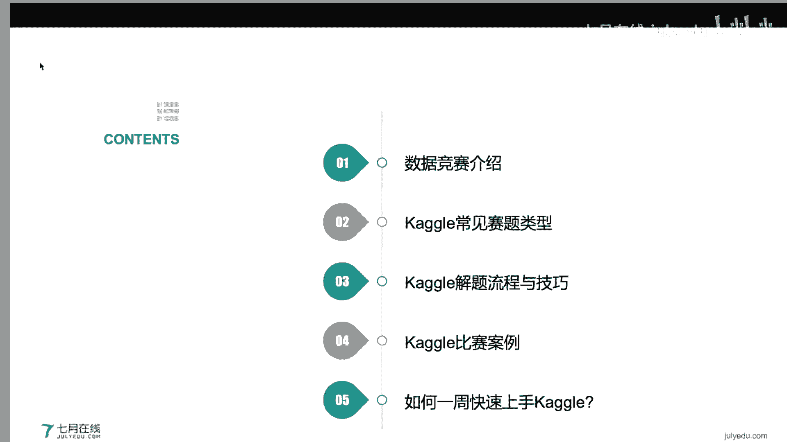

那么我们首先来看第一部分就是数据竞赛这一部分。那么这一部分呢，其实我们首先给大家介介绍一下，就是什么是数据竞赛。第二部分呢就是说数开go的平台的介绍。第三部分就是说数据竞赛的意义。

那么我们首先来看一看什么是数据竞赛。那么可能大家在。

就是说做这个就是说上这个课之前，其实已经很听到了。就是说比如说国内的比较出名的天池平台data方或者说国外的有kego或者说d data这些比赛平台。那么这些平台呢其实都是一些数据竞赛平台。

那么我们接下来首先给一个定义就是数据竞赛是什么数据竞赛，它是以工业或者学术问题为导向的聚合广泛跨学课人才参与的利用算法模型和探索解决方案的研发模式。那么这个地方有一个要点。

就是数据竞赛它是以以特定的问题为导向的。在每一个每一场竞赛里面，它其实是一个特定的问题。而且数据竞赛它是我这个下面写了两点，就是它其实是一种众包的竞赛模型竞赛方式。它是对参赛的人员没有门槛限制的。

基本上只要你想参加这个比赛，你都可以参加这场比赛。第二点呢就是数据竞赛它是有一个明确的业务背景。比如说呃这次。对，我们已经开始了啊，我们是7点钟开始了。对，我们才刚开始不久。呃，对。

那么呃注意竞赛它是有特定的问题背景的。呃，就是说他每一场竞赛都是有一个特定的问题。那么我们这个。参加这场竞赛的目标就是要解决这个问题，对吧？那么数据竞赛它和普通的竞赛有什么区别呢？

比如大家如果在本科参加过这个英语竞赛、作文竞赛或者数据建模。嗯，数据竞赛和这些竞赛不一样的，就是数据竞赛，它是以具体数据为比赛内容，而且有就是说很定量的呃一个评分机制。比如说我们提交一个文件来算一算。

我们这个我们预测的结果和真实的一个结果，它们之间的差异性，对吧？它是一个定定性的啊定量的一个呃就是说评分，它不是一个定性的一个评分，而且它是一个有交互式的，比如说我们今天提交一个结果。

它能得出一个的得分，我们明天提出一个结果，它也可以丢嗯给我们一个打分，所以说它和这种普通的竞赛，它是不一样的。比如我们参加一个数学建模比赛，对吧？那可能只有一次提交机会，就最后的提交机会，对吧？

这是数据竞赛。那么我们再来看一看呃数据竞赛，其实它和这个呃我们现阶段的一个呃大数据其实联系非常紧密的。我们比较呃就是说很直观的一点，就是呃很典型的一个数据竞赛。

就是imagineimagine其实是在这个2013年嗯或者说2012年左右李菲菲老师提出来的。imaginenet，其实它的一个呃载体任务是对图片的类别进行一个分类。

载体总共包括1300万张图片和1000类的物体照片，就是说总共的训练数据集是1300万张图片，所分需要对这个类别进行分类，是1000类。那么。imagine数据集它是非常难的一个数据集。

就是它原始就是说需要对这个类别进行划分1000内。那么从2013年到2017年，这个分类就是说参赛选手的一个精度，从71%，逐渐提升到97%，这个就是说基本上是非常非常高了。

到现在而且是2017年到97%的嗯，应该是现在应该是接近98%99的，那么而且imagine这个数据集是深度学习时代的引爆点。呃，如果大家对深度学习有一定量级的话呢。

那么这个nexnet其实就是在20就是说参加这个呃imagine数据集而火的对吧？那么imagine数据集它其实也是一种数据竞赛，它这种形式也就是给进了一个训练级，给进了一个呃验证级。

还给进了一个测试集。然后你在测试集上面提交结果，然后进行一个打分，对吧？那么这个也是一种数据竞赛，而且是就是非常非常出名的一种数据。那么imagine数据集呢，它其实推动了整个行业的发展。

那么我这个地方画了一个直线图，就是说从2011年开始，或者说2014年就是说深度学习开始普遍嗯发展开始。就是说这个imagine就是说这个深度学习，它推动了很多的发展。

比如这个地方说的是资源语言处理这个领域。那么imagine数据集以及这个人脸检测人脸检测的LFW或者coco这种物体检测典型数据集呢，成成为了呃这种领域算法验证的统一标准。比如说我们想要发表一篇论文。

我们就想必须在这个imagine数据集或者其他数据集进行一个刷分。当我们的模型当我们的论文的模型达到一个 of时候，那么就很能说明我们模型的一个准确率，它的一个精度，对吧？那么现阶段一个深度学习。

它其实很多的一些论文都是在一个数据集上进行一个刷分，然后才能嗯就是验证你模型的精度，对吧？那么其实imagine也是一种最最出名的一个一种数据竞赛吧。对。

那么其实现阶段呢我们比较出嗯著名的一个数据竞彩平台是cago。那么开go平台呢，其实它是嗯国外的啊嗯cago它是国外全球最大的一个数据竞测平台，它每年都会举办嗯数十呃几十场的数据竞赛。

主要以算法赛和可视化比赛居多。呃，我们的直播是有回放的对。呃，开口平台它也具有完备的平台机制，从比赛题的介绍，赛数据分析、评分排名到最终分享。就是说它这个是非常完非常完善的。

那么开go呢是在2018年2019年，现在已经被谷歌收购了。所以说开go现在呃已经汇聚了全球应该是几十万的一个数据竞赛的一个人才了。那么在开口比赛中呢，他其实已经把这个数据竞赛的一个流程讲的。

就是说梳理的非常清楚了。我你可以提交一个文件来到这个排行榜上面看一下你的得分。然后这个排行榜会进行实时更新。最终呢这个比赛根据这个排行榜来进行一个呃划分这个排名。对。

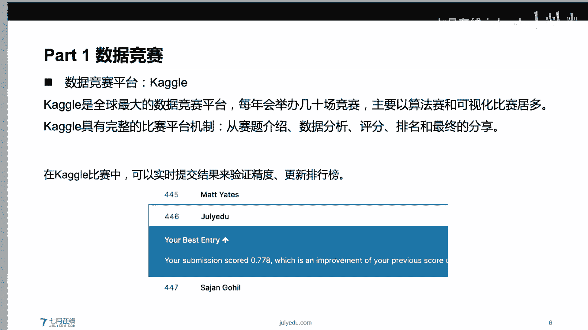

那么开go呢其实它就是说这是这是一个比赛开go比赛的一个截图啊。开比赛其实它有以下组部分组成，就是说它会给出这个比赛的一个背景。

就是在这个over页面下面嗯比如这个script它会描述这个赛题的一个背景信息u就是它的一个评测的一个信息时间轴time然后这个data data页面呢，它会给出这个呃数呃比赛的一个数据集它的一个情况。

然后nch book呢就是我们这个它会呃开平台它不仅提供了这个评分机制啊，排名机制，它提供的这种在线的ch book这种机制。

那么大家如果对这个呃ipad notebook或者说呃这个呃R语言里面R语言里面chbook比较熟悉呢。其实nchbook它是一种非常非常方便的这种就是信息交流方式吧。

那么开go呢它自从被谷歌收购收购之后呢，它在这个呃嗯开平台的chbook里面我们。可以使用CPU的环境，也可以使用GPU的环境，也是非常方便的。嗯。

这个讨论的嗯未成dicussion就是我们在这个呃页面可以对这个比赛进行一个讨论。leaable就是对我们这个比赛进行一个排名，对吧？这就是一个典型的一个呃开拓比赛的一个嗯截图的页面。

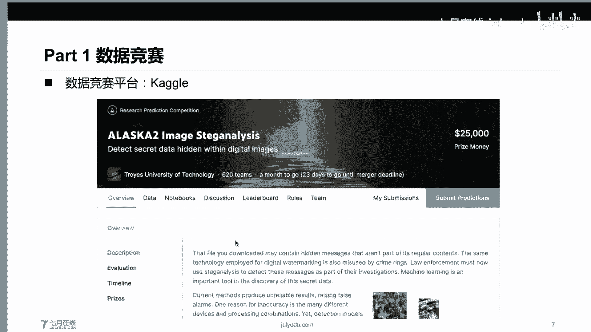

那么我们再接下来再看一看，就是说我们刚才讲解的数据竞赛，它的一个发展和它的呃开个平台。那么我们接下来讲一个就是说和我们自身相关的。就是我们为什么要参加一场数据竞赛，呃。

我是非常建议大家就是说如果没有参加数据竞赛呢，可以是呃了解一下或者参加一下呢，为什么呢？因为对于我们个人来说，参加数据竞赛是对我们个人而言意义非常大的。首先数据竞赛它是相对于公平公正的。

是比较公平公正的，而且优优异的排名可以体现你的能力。比如说你在这个比赛里面，它排名前10%前5%或者说前20名前10名，对吧？这个都是非常好的一个经历，而且可以体现出你的能力。第二个呢就是呃数据竞赛。

他可以丰富你的经历，而且可以增加简简历和面试的得分。假如说你做了一场比较呃就是排名比较不错的一场比赛呢？那么你可以把这个比赛写到你的简历里面，对吧？这都。

是以可以当成一个项目呃来给就是说面试官进行一个呃阐述的对，第三个优点呢就是说数据竞赛，它可以带你带您就是说掌握真实数据据以及业务场景下的一个解决方案。因为我们现在一些数据竞赛。

它都是呃一些呃工业界的公司啊，或者说学术嗯学术的一些比如说今年的一些KDD的这种比较著名的一些会议，它呃举办的一些比赛。那么这种竞赛呢，它其实呃都是有真实的。业务场景和真实的就是说嗯业务背景的。

那么参加这种这种比赛呢，其实可以带你掌握就是说真实数据下的一个业务。还有他的解决方案。那么我还嗯就说想要强调一点，就是和理论相比，动手能力也可以呃就是也是非常重要的。呃，你已经开始了，为什么看不到。

你可以重新把APP退退一下，或者网页刷新一下。呃，那么如。和我们现有的一些机忆学习或者深理学习理论相比呢，动动手能力也是非常嗯重要的。就是说动手能力它可以考验嗯。

动手能力它可以考验我们就是说对数据挖掘流程的一个了解，而且呃它可以带领我们就是说对模型的调餐一个了解，以及对工具库的一个呃了熟练程度。因为我们现有的一些。呃嗯不管是呃一些机器学习或深度学的教材啊。

它都是以这个理论就是说为主要的，而没并没有以这个实际的实操，就是说为主要的内容，那我们参加一场竞赛，那么其实可以把这个理论应用到具体的一个问题中间。而且在参加这个竞赛的过程中呢。

你可以对这个模型有过更深入了解。比如说这个模型在这种场景下，它到底是怎么调参的，它在这个种场景下，它的一个训练曲线是怎么样的。而且你可以熟练的掌握一些工具库，对吧？

比如说你之前自己学pandas或者是学一些库的时候，你根本没有哦这种个具体的一个业务，或者说。没有遇到一个具体的问题，你不会学学到这么深入，对吧？那么如果遇参加这种竞赛呢。

其实也能够很大的呃增嗯增强你的动手能力。对。

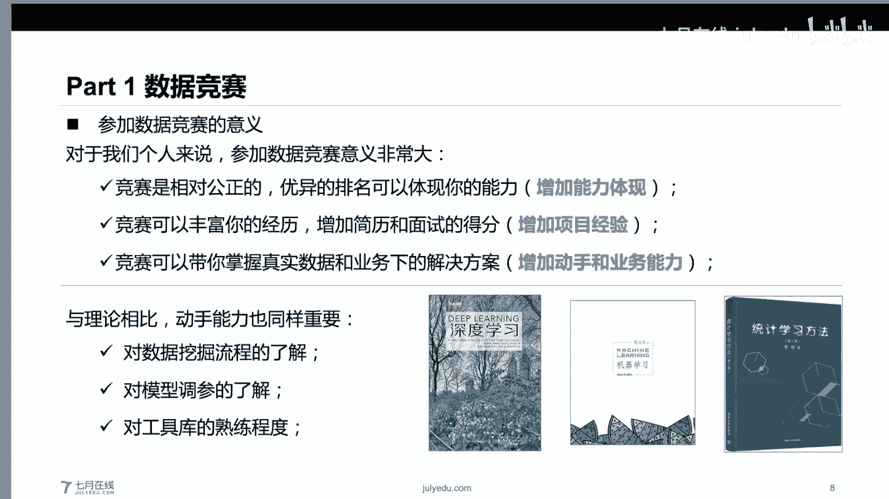

那么我们今天呢其实这个主题就是说小白如何入门数据金彩，就是说你想零基础，如何入门数据精态呢。那么如果你是零基础，你想入门。数据竞赛或者说你是零基础，想上手参加一场开关竞赛。那其实你会遇到很多很多问题。

第一个问题就是说你对pyython或者说操作系统不太熟悉。那么你可能就首先你要学习一下pyython基础，对吧？第二个呢问题你就是说你对机器学习理论和酷使用不太熟悉。那么你也没办法很好的参加一个比赛。

对吧？那么右右边这张一右边这张图呢其实一个嗯挺搞笑的一个图，就是说当你呃一个机器学习新人或者是说机器学习初学者，你想参加一个数据竞赛的过程中呢，你可以。跨过这前面这些部分，就是说这是数据可视化呃。

数据预处理，数据归一化，直接到这个数据呃，就是直接到这个模型的训练化预测。就是说你可以跳过这些步骤。那么我们这些我们这节课呢就是教大家如何先跨过这些步骤，就是说先。了解一下Kgo它到底是什么样的。呃。

与此同时呢，我们嗯在是呃。8月份和9月份也在我们的7月在线会开设了两门与开go相关的课程。第一个课程呢是从头到尾带嗯就是说带你参加一场kgo比赛。这个第一门课呢，这个是呃学习周期是66次课。

总共是呃3周到4周。呃，第二次第二个课呢是嗯开go实战项目班。那么这第二个课呢是就是说稍微的内容会多一点。第二个课呢，它是包总共包括了12次直播课。那么总共嗯包括应该是10个比赛，具体的比赛。

那么如果大家就是说在看完我们今天的直播课之后，还想继续深入学习开go竞赛，嗯，我们比较比较建议大家去嗯报名这两堂课。对。

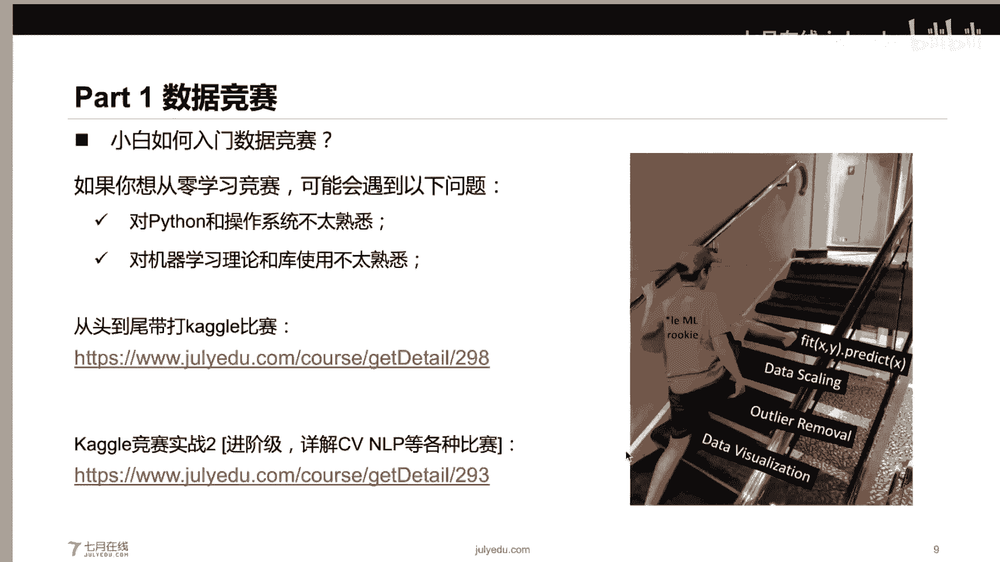

那么我们再来看我们今天的第二部分就是呃开go比赛的常见赛题类型，对吧？那么我们就是说今天的课程呢主要是面向初学的对吧？那我们就讲的比较基础。那么我们呃常见的赛题类型呢，其实可以根据我们的赛题背景。

赛题任务以及赛题数呃赛题数据进行分类。我们具体的。

我们这个地方是根据这个赛题的一个数据进行分类，我们可以划分成结构化的赛题、图像赛题、文本赛题和语音赛题，对吧？那么我们这个地方呢右边呢是我们现有的开Q平台的，它这个呃不同类型的赛题的一个占比啊。

我们可以看到这个结构化的数据挖掘，其实是占据了58%的比例。那么我这个其实是在呃2呃18年之前，很多比赛都是结构化的。那么现在呢很多比赛都是非结构化的，就是说图像的文本的语音的。

那么在这种非结构化的赛题，非结构化呢就是指图像文本或者语音这种嗯数据。嗯，非结构化的赛题里面嗯图像的赛题就是占据28%，还有文本赛题占据比较多。呃，有文本分类相关的课吗？对啊，有啊，我们这个往前翻一下。

就是这个实战班里面的有几次课都是文本分类的一个课。对，文本分类的比赛。对。

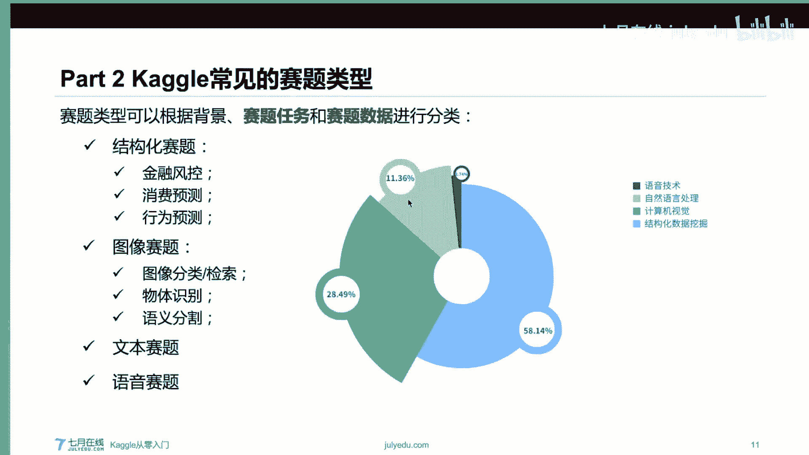

呃，今天直播呃时长是一个小时，应该是从7点到8点。对。那么我们接下来看，就是说其实cago平台它已经帮我们把比赛进行了一个进行在难度上进行一个划分啊。那么开go比赛类型我这个地方给大家总结好了。

就是说根据我们赛比赛的一个目的和形式，它可以分为featured playground started和other other types。那么这种就是这这这些分类呢。

其实它是根据这个呃你可以根据难度进行分类。比如说这个get started的，就是最简单的一一系列的比赛。还有这个playground就是稍微简单一点的。然后research和feature的。

这是这个实际的一个就是说一般的赛题就是偏难。那么在其他类型的赛题里面么，我们可以划分成这个呃rement就是这个呃招聘的，就是相当于专门用来招人的一个竞赛。还有这个每年一度的比赛。

还有这个邀请赛和这个课堂的比赛。其实现在go的平台上面有很多这个呃课程的一个大。都放在开歌上面，特别是国外的一些嗯课程啊。对，那么开歌比赛呢还可以根据这个比赛的阶段来进行一个划分。

就是说可以把它划分成嗯单阶段的嗯比赛而，两阶段的比赛，还有一个科勒赛。那么科勒赛呢其实就是呃和我们嗯大家就是说其他的一些比赛不一样。科勒赛和非科南赛的主要的区别就是科勒赛。

你的提交必须要通过开呃开歌平台上呢nch book来进行提交，它不能通过其他的一个形式。那么如果把这个根据比赛内容进行划分呢，就可以把它划分成机器学习比赛和数据可视化比赛。在K歌平台上面。

现在主要的是这个机器学习赛比较多一点。

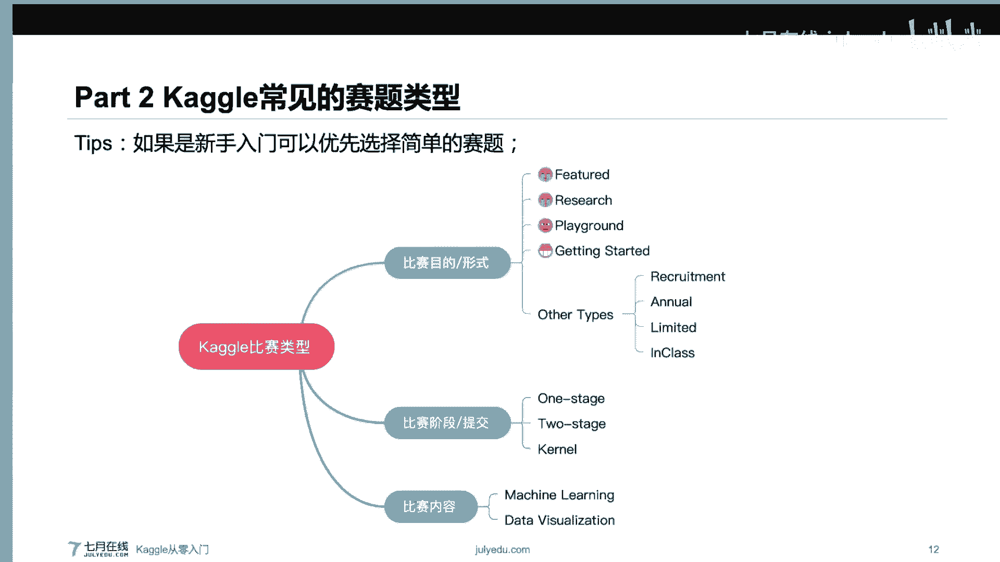

哦，那么我们刚才其实就是说把这个开开个平台上面的一些比赛的一个呃类型给它划分好了。那么我们接下来就是说看一看我们遇到的一个赛题，我们能怎么解决。

我们我们这个地方呢是以现在正在进行的一个getingstar的这个入门赛叫real lot这个呃NRPV这个就是对呃twitter上面的一些推文进行一个二分类。这个赛题呢。

其实就是预测呃ttter上面的一些推文到底是呃真消息还是假消息，或者说预测它到底是一个呃真正的一个灾难的一个新闻还是假的一个灾难新闻，对吧？那么这个呃比赛的链接呢放在左下角，对。

也是大家课后呢也可以看一看，那么这个比赛呢其实也参加的人数比较多啊，现在已经到接近1800人呢？对。那么呃当大家遇到一个就是说参加一个比赛的时候，当大家拿到一个赛题之后，确定一个赛题之后要怎么做呢？

首先你要阅读这个赛题的内容，对吧？我们先首先你要根据你这个赛题的一个介绍，了解以下几点，就是说我们这个赛题的背景是什么，以及我们的赛题，它的背景，基于这个背景下面，我们需要完成什么任务。

然后看一看我们这个赛题有什么评分方法，对吧？这些都是我们需要了解的，而且嗯比较重要的点，就是你需要分配好你的时间，对吧？这个就是在嗯比赛的页面也会给出我们赛题的时间。嗯，在了解了我们赛题内容之后呢。

我们接下来要根据我们的赛题数据进行一个分析。因为这个赛题的数据呢，是我们在做的微竞赛的过程中最核心的一部分。我们需要根据这个赛题的数据构建我们的模型，对吧？那么我们这个赛题的数据就非常重要。

我们需要做哪些事情呢？首先我们在拿到我们的数据，呃，之后是需要进行一个数据分析的。呃。为什么要做一个数据分析呢？我们做这个数据分析是要找到我们这个数据里面是。有哪些分布的规律，它数据有什么样的字段。

哪个字段是什么含义，对吧？在通过数据分析的时候呢，我们要根可以根据这个赛题的背景来对这个数据进行进一步的理解，对吧？我们因为我们这个赛题的背景，它其实会介绍，比如说我们这个赛题。

它其实会介绍到这个这个背景就是ttter下面的一些推文，对吧？这个就是呃一个业务背景，那么具体的一个数据呢，你要根据这个它大的推文到底是怎么写的，它有哪些分布的规律，对吧？这些都是可以分布的嗯，寻找的。

那么还可以做一些预处理嗯预处理呢就是比如说我们twitter里面有一些推文里面可能有一些表情，有一些呃呃转移字符，有一些垃圾信息，对吧？这些都会在数据预处理进行一个处理，对吧？

那么在做这个赛题的数据理解和预处理之后呢，接下来做一个特征工程。特征工程呢就是把我们的一个数据转换。成我们模型能够输入的一个格式。那么特征工程步骤呢，其实。包含几以下几个步骤。首先是特征的转换。

把我们特征转换成我们模型可以识别的。第二个呢是特征的构建。比如说我们特征，你转换之后，你是不是还可以从这个特征里面抽出新的特征？第三步呢就是特征选择。因为我们选构建出来的特征并不是。

都就是说每个特征都是有用的。我们可以通过一系列的方法进行一个特征选择，对吧？如果大家对这个西瓜书，就是看过周志华老师的西瓜书。如果大家看过这个西瓜树，其实特征选择在周助华老师里面。

他这个第二章就有讲到了，对吧？嗯，有很多种方法。那么在我们构建完特征工程之后呢，我们接下来可以就是说构建模型。那么我们模型呢这个我们当我们选择好一个模型，比如说我们选择逻辑回归，对吧？

那么我们选择好一个模型之后，我们就可以进行一个模型的训练验证和调参，对吧？这些都是呃在我们西瓜书在一些教材里面不会讲到的对吧？它不会讲到哪些参数是什么含义的，呃，怎么进行一个调参，怎么调参，怎怎最方便。

对吧？当我们构构建好了模型之后呢，我们就可以进行一个预测打分，我们就可以。对我们模型进行一个预测，然后进行一个结果的提交，或者说更进一步的我们可以训练多个模型来进行一个模型的继承，对吧？

这些步骤其实就是我们参加一个开口竞赛需要完成的步骤。呃，报这两个课是带着打比赛吗？不是呃我们这两个课其实是带着大家复盘。比赛就是说带着大家入门一些比赛。对。

就是说带着大家从头把这个比参加比赛这个过程完全完完全全走走一遍。我们回到这个课程内容中间，那么赛题的内容开括赛题内容和数据决定了具体的特征工程和模型。嗯，就是说不同的一个数据。

它决定了我们适合做什么特征，以及适合什么模型。比如说文本的一个数据，它就适合做什么TFIDFwhat react这种。那么结构化的数据呢，它就不太适合做TFIDF对吧？

就是说嗯开格赛题的一个数据决定了具体的特征工程，做什么以及模型，它具体使用什么。虽然我们在这个时候呢，其实写到的这5个步骤是现行的，但是是需要反复进行的，为什么为什么说是需要反复进行的呢？

首先我们这个呃步骤其实是分分块的对吧？分到5个步骤，12345，但是并不是通过这12345得到的一个模型就是最优的，当我们通过12345得到的模型，它可能不是最优的情况下，我们怎么进行调整的，对吧？

我们是不是需要根据我们的模型的一个。精度来对我们模型的一个参数，或者对我们的特征进行一个调整，对吧？所以说当我们解决一个参参参加开开过一个竞赛的过程中呢，这个。流程并不是一个线性的流程。

可能是反复进行的。比如说我们在这个地方看我们就是说提交了答案之后，发现我们的模型的精度不是很好，对吧？那么我们就回过头来再看看我们的数据是不是我们对数据理解不到位，是不是我们做的特征工程不到位，对吧？

这些都是一个需要反复进行的一个过程。那么其实开go比赛呢，其实上面每个开比赛它有很多的资源。呃，我们在前面也给大家介绍了，在所有的开go比赛的过程中呢，其实它的页面都有嗯几以下几部分过成。

比如说有 data notebook book以及到team这这些页面构成，对吧？那么这每个页面呢都是有一些呃就是说它这个平台的使用的规范啊。对大家可以稍微看一下，那么我们再回到这个比赛的过程中。

这个real large NRP嗯，这个比赛呢，其实它是一个对文本进行一个二分类的一个比赛，对吧？它的一个比赛的背景，就是嗯用户在推导上面发表的推文，或者说这个文本是不是呃就是说真实的。

那么这个比赛的数据就是根据嗯推文的内容，或者说根据这个推文的关键词或者单词以及推文的一发表推文的一个定位来进行一个呃分类。那么我们这个比赛呢，它因为它是一个文本类型的一个比赛，对吧？

那么所以这个特征工程，你需要做NRP相关的领域的特征工程，比如说用TFIDF或者说用词向量，对。那么你有可能会问到，为什么这个地方你会使用到TFIDF或者4下量呢？嗯，因为这个是呃NRP领域的一个问题。

对吧？在NRP领域里面常见的一些特殊能合成，就是TFIDF和磁向量。对，这也是一个先验知识。那么构构建模型阶段呢，我们可以用这个SVM嗯数模型或者神经网络。对。那么我们根据大家对这个赛题是不是熟悉，嗯。

再可以进行划分。假如你拿到这个赛季之后呢。呃，你可以根据你这个。对这个赛题的数据是不是熟悉呃，你可以进行以下以下划分。假如你对这个赛题进行熟悉，就是对这个NRP，比如说对这个NRP文本分类比较熟悉。

那么你就可以直接下载数据进行建模的对吧？假如你不对，就是说对RP不太熟悉，那么你可以怎么办呢？你可以看一些教材，你也可以看一些这个嗯开go上面的loch book的分享和它的一些讨论，对吧？

这个是基于你对这个赛题任务，以及赛题数据是不是熟悉。第二个呢，就是你是不是之前你对这种类似的任务有了解。比如说你之前对文本分类有没有了解过。对吧假如你对文本分类之前做过跑过一些代码，对吧？

那么你可以直接把之前的代码或者之前的思路再到这个比赛里面用一下，尝试一下，对吧？那么假如你对这个文本分类不太了解，那么怎么办呢？你可以在网上或者说找一些相关的课程。

找一些相关的论文来学习一下这research及一下相关的一些呃解决方案，对吧？那么这就是一个解决开关进向一个流程。那么其实每一场开歌比赛它并不是孤计存在的，或者说任何一场数据竞赛，它都不是孤立存在的。

因为每一场数据竞赛它都是有特定的背景特定的数据。所以说很多开个比赛，它都是相似的，或者说是相同任务的，那么其实每一场开歌比赛，它都是有一些特点，或者说有一些相似之处，但是它也有不同之处。

所以说如果大家参与一场开歌比赛呢，其实嗯比如说我们大家就是说看我这个直播课之后，想去参加这个呃reroro这个比赛。那么其实你参加这场比赛，其实就是以一个具体的NRP里面的文本分类的一个任务来进行学习。

对吧？所以说你当你学完这个比赛之后，那么对其他的一个比赛，或者其他的任务你就会就是说熟悉很多，对吧？那么即使你参加了呃这场比赛，那么之后你假如说遇到了其他的比赛，那么可能也有可能就是说需要继续学习。

因为不同的数据它可能有不同的一个分布的规律，也就是说它会有不同的模型更加适合。对，这也是需要反复尝试的。能推荐几本文本嗯挖掘的入门书籍吗？怕上课听不懂。呃，我们课今天的课程呢是入门级别的。

基本上不会讲到很多的代码，或者是说只会给大家讲一讲具体的解决方案。呃，如果你想就是说深入嗯文本完掘呢，可以参加我们在这个PPT写的两节课。这呃对，那两节课都会讲到就是说相关的文本分类的一个例子。

那么呃我们再回到这个比赛，就是说如果大家对这个LRP领域稍微有一定了解，就是说这个这个就是说嗯啪啪啪打脸，对吧？

刚才说不需要用LRP领域的这是这个其实呃是把这个NRP文本分类的一些常见的解决方案写了一下，就是说可能是我参加这场比赛，我构建了几个模型，比如说最开始我是知道的这是一个文本分类的比赛，对吧？

那么我们可以。首先构建一个比较基础的模型，比如说构建这个TFIDF模型，然后然后用SVM进行分类，这是一个比较基础的一个模型。它们并没有用到神经网络。然后第二个模型呢。

我们可以用这个fast test训练一个磁项量，然后进行分类。然后第三个模型呢，我比如说我们可以训练这个what vector训练磁项量，然后进行使用这个texN进行分类。然后第四个模型。

比如说我们可以用比较最近比较火的bur磁项量进行分类。那么我们最终的模型呢可以用这个burt分类，再加呃统计特征的数模型进行一个呃。集成对吧？呃，那么我们这个呃模型的一个迭代过程呢。

其实是一个不断的升级呃模型和优化进度的过程。那么也是需要大家充分挖掘我们这个赛题的一个数据信息的过程。呃，声音太小了嘛，我现在已经是呃声音很大的，讲了我我刚才应该是看了声音也是挺大的。

你可以把这个你自己客户端的一个声音可以调一下。对。那么呃大家可能会问嗯会想到，就是我们刚才在这个NNIRP里面，NIRP比赛里面并没有看到这个数据分析数据处理和缺失值处理的过程。

就是我们直接是教大家从这个赛题的理解到模型的训练，对吧？为什么没有讲到数据分析数据处理和缺失值的过程。因为在非结构化的一个赛题过程中，特别是在NIRP的赛题过程中，呃。

一般对这个数据处理只需要做这个嗯关键词的。替换或者说删除一些呃呃转移符，不并不需要做很多的数据分析。因为你最终嗯就是说最后的使用的一些技忆学习模型呢，往往是这个深度学习模型。那么深度学习模型呢。

它拥有强大的建模的能力，并不是就是说对这个。输入的一个呃文本呢是嗯就是说并不需要进行进一步的一个特征的转换的。对，这是第三部分，就是说开go的一个解题流程。

就是我们具体1个NIP的一个比赛给大家讲解的一个解决的流程，对吧？那么我们接下来呢就会给大家串一下，就是说嗯刚才呢是以1个NIP的比赛，对吧？那么大家有可能想就是说我其他类型比赛是怎么样解决的呢？

开go的上面的一些其他的比赛是什么类型的呢？对吧？那么我们在第四部分呢会以一些其他类型的比赛，给大家讲一讲其他类型的比赛啊，就是说它到底是一个什么业务背景的，它到底怎么解决的。

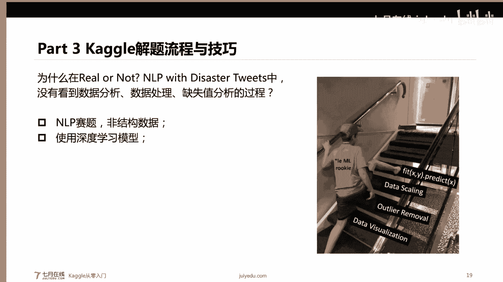

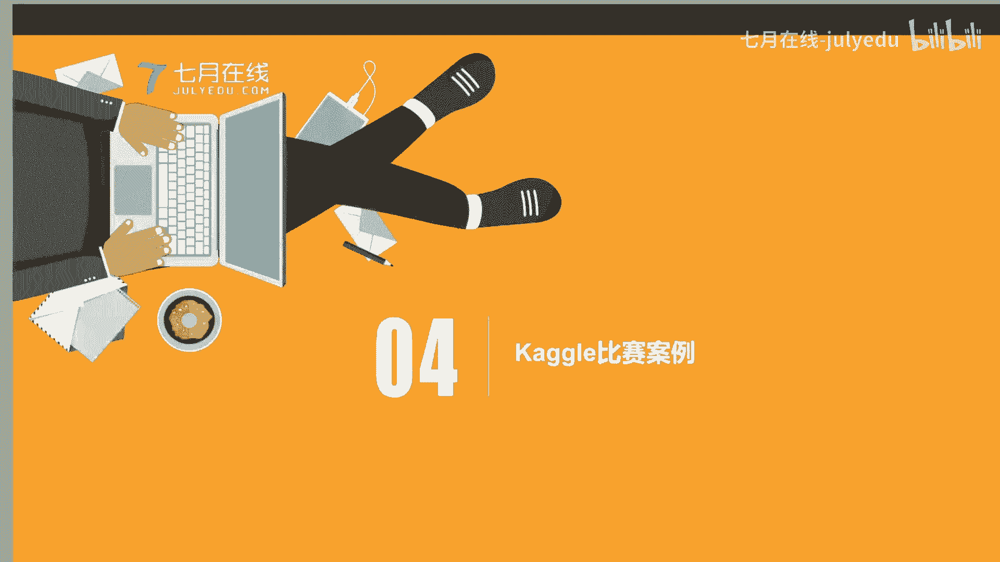

那么我们首先看第一个比赛，这个比赛呢是呃呃也是一个非结构化数据的比赛。这个比赛呢其实是呃亚马逊雨林的一个图像分类比赛。那么这个比赛的一个业务背景呢，就是说是一个遥感图像的一个比赛。

它是判断地表的天气和地表的覆盖物。那么这个比赛呢，其实它的一个赛题的数据呢是有。一个图像数据对吧？那么这个图像的数据呢，它不仅给定了这个一个天气。以及给定了一个地表的一个覆盖物。

比如说它到底是丛林河流还是呃城市，对吧？那么我们这个赛题的一个任务呢，就是需要对需要根据我们这个图像，对我们这个地表的图像进行一个多分类，既对这个天气进行分类，也对这个地表的类型进行一个分类，对吧？

那么大家如果对这个图像分类或者深度学习有一定了解的话呢，那么。这个赛题很明显的是一个图像分类的一个比赛，对吧？

那么我们就可以自然而然的使用这种预训练模型resonnet或者说dnet或inception这些模型来进行一个fight tune微调来得到一个比较好的一个解决方案。

那么这个时候赛题呢其实也是比较直观的对吧？它是一个很典型的一个图像分类的一个比赛。那么这个赛题的一个难点是什么呢？首先这个赛题它是需要分。既对这个地表进行一个天气的分类。

也对地表进行一个呃呃覆盖物的分类，对吧？那么这个呃就是说它是一个多分类，而且这个大家也可以看到，就是说有一些天气它是分布比较多的。比如说多云嗯或者说晴朗它的分布都是比较多的。

而有些天气它的分布的情况就是比较少，或者说它出现的次数比较少。所以所以说它的类别分布差异比较大的，而且这个赛题它既然是一个图像分类的比赛呢，那么就需要有较好的一个呃计算能力。

这个地方呢一般是需要几个显卡才能完成这个比赛的对。怎么进行微调？这个呢你可以在网上搜一搜呃这个深度学习相关的一个知识点嗯，fin tune微调，或者说在我们的7月7月在线课程的官网上面搜索一下深度学习。

呃，我们都有一些9。9块或者说免费的一个深度学习的课。对。

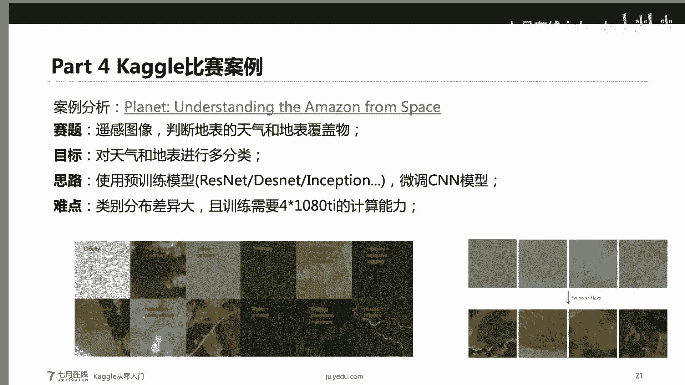

那么呃这种这个比赛呢其实是一个典型的多标签图像分类比赛，对吧？直接通过一个呃呃文嗯图像分类的一个模型的训练和微调就可以完成，对吧？但是它有一些难点，首先它的类别分布是非常不一致的，有一些类别分布是很多。

有一些类别很少不均衡。而且这个赛题，因为它这个地表的图像，它很容易受到这个天气的影响，比如说这个右边这几张图片它都是灰蒙蒙的，为什么呢？因为这几张图片都是它的天气都是一个。有雾的天气，对吧？很自然的。

你如果这个图片或者这个地表有雾的天气的情况下，我我是很难对这个地表的覆盖物进行一个分类的对吧？那么我们怎么做呢？其实我们可以首先对这个地表的一个图图片进行一个去雾，对吧？通过某些去污算法。

把这个地表的一个呃让它更清晰一些，让它的模糊程度更小一些，对吧？就是转变成下面这种这几种图片。或者说呢我们也可以用一些数据扩存方法，或者说用对抗生成网络生成一些我们样本比较类别比较少的一些样本。

对吧这些都是呃可以进行的，是对天气和地表分类是分别进行吗？对，是分别进行的。同一个网络可以同时一个网络可以同时对天气和地表进行分类啊。那么我们刚才讲的是一个图像分类的比赛，对吧？我在讲这个比赛的过程中。

我并没有讲哦它具体的一个任务啊，我只是讲这个比赛它可能涉及到的知识点和它的流程和难点啊。为什么这么讲呢？就是讲几个不同的比赛，让大家体会一下，就是说不同的比赛它可能解决的方案真的不一样。

那么第二个比赛呢是一个free song的嗯嗯tgging的这个比赛。这个比赛呢其实是对音频进行一个分类的比赛。那么这个比赛的一个数据呢，就是一个音频数据，就是给给定了一段MP3的一个音频。

需要你对这个音频进行一个分类，它到底是由呃哪些就是属于哪些类别。那么我们这个赛题的目标就是对这个音频进行一个多标签分类，对吧？那么怎么做呢？这个赛题可能就是说也是一个自然而然的是一个语音分类的一个比赛。

对吧？我们就可以提取音频的特征，然后使用一些模型来进行一个分类。比如这个地方我可以使用一些深度学习的模型进行分类。对，那么这个赛题的难点就是它是一个curner赛。

就是说它是需要通过楼州 book来进行提交的。对。那么这个比赛其实还有一些难点，就是说他这个比赛所以上这个比赛也是一个标签分布极度不均匀的一个比赛。就是说它有一些嗯类别的一个语音标签是分布非常非常少的。

那么就需要进行一个数据扩增。那么在这个比赛的过程中呢，一个。非非常有效的一个方法，就是做一个mix up。呃，mix up它其实很直观的。其实这样的，它就是把两个音频直接做一个。数值空间的进行一个平均。

来得到一个新的音频。比如说这个音频最开始是属于类别一，这个音频是最开始属于类别2。那么我们把它两个音频做了一个平均之后，那么得到了一个新的样本。这个新的样本是属既属于类别一，也属于类别2。对。

这就是mix up。mix up呢其实最开始是在呃呃深度学习里面的图像分类任务被使用到，现在已经被广泛用到语音识别以及呃文本分类的领域。对。那么这种mix up呢，其实呃很直观的。

它其实也是一种数据扩增的嗯方法，把少量的一些样本和多量的样多量的一些样本进行一个mix up。可以对我们相当于对我们那些少量的呃就是类别比较少的一些样本进行一个上载样，对吧？这是第二个比赛。

那么第二个比赛和第一个比赛不同的是第二个比赛，它其实是一个很典型的一个呃语音分类的一个比赛，对吧？那么第三个比赛呢就是to sig格ma这个房房屋热度预测比赛。那么这个比赛呢其实和前面两个比赛又不一样。

它是需要根据纽约租房的信息来进行一个热度的预测。比如说当一个中介。张贴了一个租房的信息，对吧？那么这个网站呢，它是需要我们对这个租房的一个信息进行一个热度的预测，来判断这个租房。

判断这个房嗯房源是不是嗯很火热。那么这个赛题的目标呢，就是对这个房价的一个热度进行一个分类，对吧？那么我们怎么有什么思路呢？就是根据这个C题的一个数据。对我们房房子的一些属性进行一个统计。

比如说我们这个赛题里面，他给给定了一个房屋的一个基本信息，房屋的一个经纪人，这个经纪人就是中介的一个信息，以及一个这个房屋的一个地理位置进行一个统计，来进行建模，对吧？

那么这个赛题的难点其实它是一个结构化的一个赛题，就是它是一个表格类型的赛题，它和前面两个赛题是不太一样的啊。那么这个赛题难点就是你需要从多个维度来进行一个聚合的统计，而且需要大量的统计。对。

那么这个赛题其实是一个很典型的一个结构化的赛题。这个赛题虽然它只包括14个字段，嗯，这个每个字段呢就是右边这张图就是总共只包括14个字段，包括房屋的一些卧室的个数啊，嗯，这个嗯张贴的时间啊。

它包括有没有电梯啊，有没有这个呃就是说能不能养宠物啊，它的价格啊，它的位置啊，它的街道信息啊，来判断这个房屋是不是呃火热或者说是不是走俏的。那么其实这个赛题它很直观的很典型的，它是一个结构化的赛题。

但是这个赛题并不简单，为什么呢？虽然它只有14个字段，但是这144个字段里面包括了多种多样的一个数据类型，它既包括了数值类型，也包括了类别类型，还包括了文本类型，还包括了日日期类型，还包括了图片类型。

所以说这个C格玛这个比赛。其实它虽然是一个典型的非机呃，它虽然是一个结构化的数据。但是它里面。包括包括了很多样的非结构化的数据类型，所以说是非常难度非常非常有难度的一个一场比赛。

那么如果大家参加这场toC嘛，这场比赛呢可以完整的掌握嗯各种数据挖掘的技能。不仅就是说不管是结构化的一个呃数据挖掘技能还是非结构化的。在这个比赛里面都可以掌握。对。

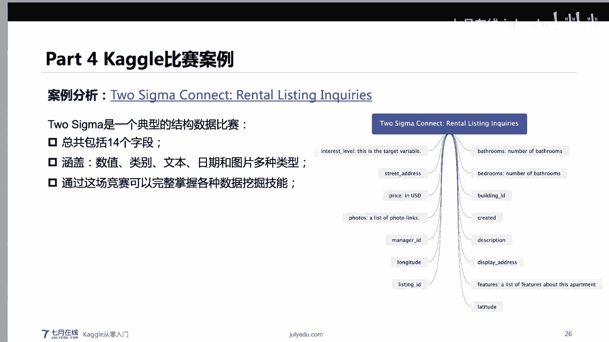

那么我们再来看一看我们最后一部分，就是说我们刚才讲了这么多，对吧？我们。假如大家想学习开关，我们怎么在我们嗯从第一部分到第四部分的基础上，我我们怎么一周快速上手开关呢？首先呢。

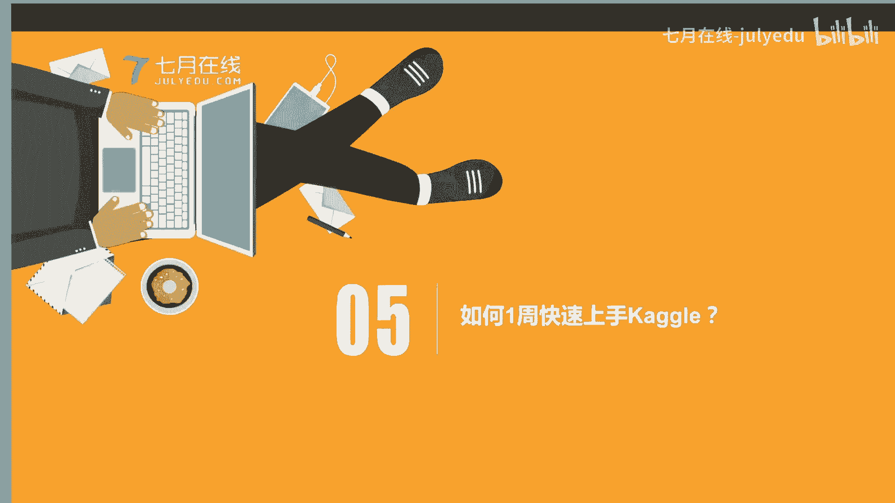

如果你想快速上手开关，我们是给出以下建议的。首先。你是想学习开go呢，你肯定有以下的动动机。首先你是想使用记忆学习或者深度学习解决一些具体的问题，或者说想把一个数据挖掘的一些算法或者一个模型。

应用到一个具体的问题里面，或者说想学习python环境下的一些数据科学库，对吧？那么我们比较建议大家是参与我们7月份8月份1及9月份开设的两个开go的一个课程。那么这两个开开go的课程呢，并不是呃很难。

而且是入门的课，基本上都是入门课，基本上是从入门的python的库一直讲到我们具体的一个比赛的一个求解的过程，是一站式学习的入入门式的。而且我们开设的接下来开设了两次开go的课程呢。

是使用具体的案例进行讲解的，每节课都有具体的实践的过程，而且会有呃作业。对，那么我们还嗯我们的平台呢会提供了nch book的。运行环境，所以你不用担心你没有本地没有这个运行环境。对。

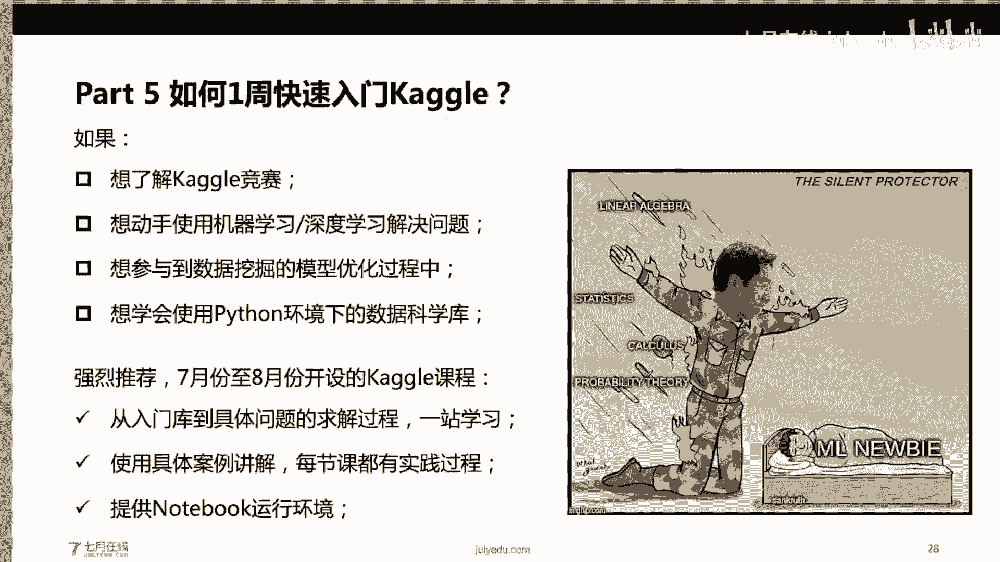

那么我们嗯再来介绍一下我们这两个课啊。第一个课呢就是从7月18号开始，呃，是以QC干玛这个租房热度预测比赛进行一个内容进行6次直播的一个讲解。那么第一个第一场比赛呢。

这个比呃第一第一个课程呢是从7月18号开始。呃，每周六周天进行一个直播，总共三周左右。那么第二个课程呢是8月22号开始的一个kego案例实战班。那么这个班呢其实它是偏向嗯进阶的。我们第一个比赛呢。

第一个课程呢是入门的。第二个课程呢是进阶的，就是说你如果还想深入学习kgo的一些嗯技能，或者说增加一些自己的一些动手能力。那么第二个比赛不第二个课程是非常适合你的。

那么第二个课程它的一个内容呢是既有结构化的一些嗯比赛的一些案例，也有图像的比赛。案例也有N2RP的比赛案例总共应该是9个比赛或者10个比赛的案例。对我们第一个呃课程呢是只讲解一个比赛，会讲的很细致。

第二个课程呢会讲解10场比赛。嗯，9到10场比赛讲解的是一个解决方案。那么第二场比呃第二个课程呢会就是说更加深入的讲解一些优胜方案的一些思路和它的代码。对。

所以说看大家的一个呃自身的一个学习的情况和学习的一个意向来选择我们接下来的一个学习路线。

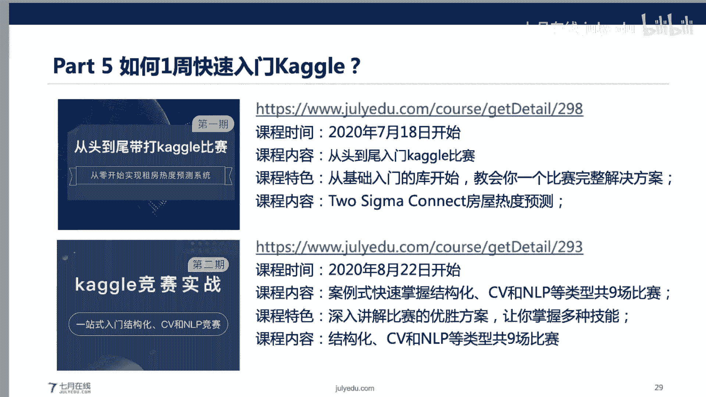

那么我也是建议大家直接是嗯学习开go的，就是说怎么学习呢？直接拿到就是说打开开go的网页，直接选择其中一个赛题来进行学习。你不用担心你之前没有学习这个python啊，或者说机器学习啊。

数据挖掘深度学习这些。技能啊都是在我们开go的一个班里面都会讲到，而且在开go的平台上面，其实都会有很多的资料方便大家学习。是就是说学习开课呢就是说有两个两种模式。

第一种模式呢是从头到尾就是说我先把pyython积极学习，数句话掘深度学习都学习一遍，再学习开歌比赛。第二种模式呢，就是我直接选择一场开歌比赛，是边做边学。那么这两种模式呢，我比较建议大家直接选第二种。

为什么呢？第二种模式是你。遇到了一个问题就解决一个问题，遇到了一个问题就解决一个问题。你学习的知识点是有限的，而且你知道你这个知识点是用在什么地方的。而且第二个模式它是直接直接能够增加你动手能力的对吧？

我们是以一个具体比赛来讲解的，而且你的学习的这个理论和知识都是相互结合的对吧？我们拿到一个比赛，我们会讲解啊怎么做他们工程，怎么做调仓的，怎么做一个。呃，数据挖掘的对吧？嗯。

我们就是说如果是以嗯第二种模式来进行学习呢，可能这个入门的一个难度会更低。而且这个速度我就是说你只要是呃认真学习啊，一周是基本上就是说可以入门的。因为你如果是按照这种模式一来进行学习，你学习了很多之后。

你就很容易忘，对吧？那嗯你如果这种模式来进行学习呢，你边做边学，你就。相当于你学习的就是说你嗯呃需要学习的知识肯定会比模式一少很多。对，这是模式二的一个呃它的优点吧。对。

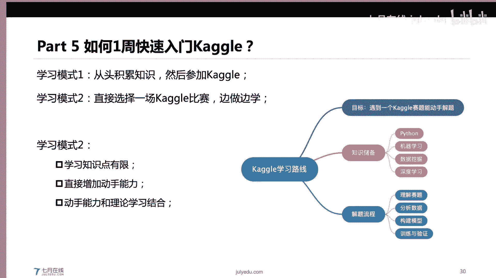

呃，那么我们今天的课程就呃到此结束了。啊，那么我们接下来呢会给就是说给大家看一看我们接下来两个课，它的一个链接啊。

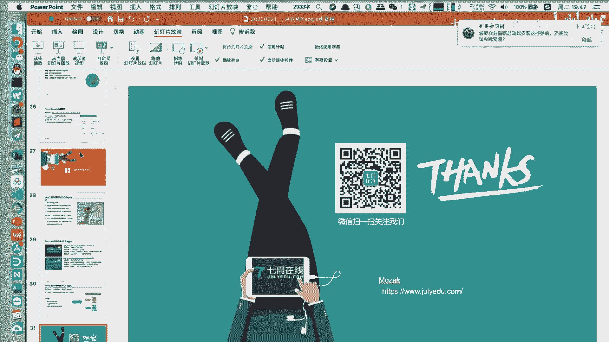

呃，直接打开我们这个7在线这个平台的官网，直接搜kego，就可以搜到我们接下来的两个课。第一个呢是从头到尾带打开go比赛。嗯，这个课程呢是也是现在还在就是说比较实惠啊，200块钱，6次课。

然后我们这个课程呢是7月18号开始直播。嗯，然后我们这个第一个课，这个从头到尾带到开go嗯这个课程呢是以 twoC个嘛这个房房价预测呃，房屋热度预测来进行一个呃做的。我们这个课程呢是零基础的。

基本上是从零开始教你怎么讲pandas讲就是说怎么使用down派怎么使用SK里的一些模型，怎么做数据可视化，一直到我们最最终的比赛的b nine以及最终的一个提交。对，基本上是你参加。

就是说基本上是从零基础到最终能够提交。

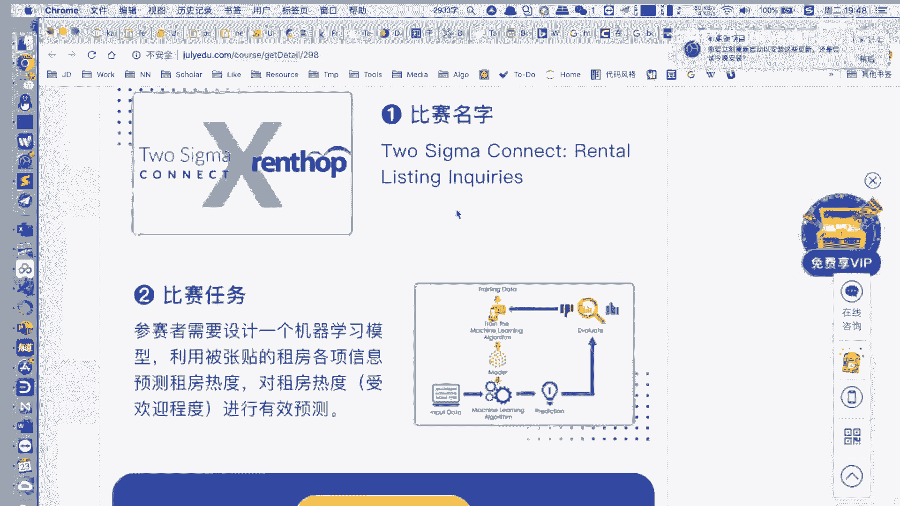

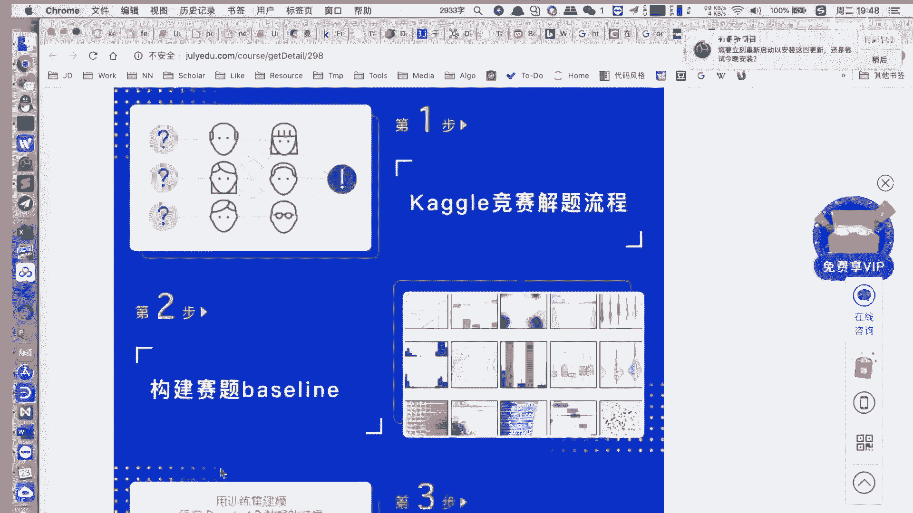

我们都会把这些知识点给大家讲到。对，这两门课都是我到时候会开始，嗯，都是我和我的同事会讲的对。呃，我们这是第一个课。第二个课呢是这个开go竞赛实战的呃案例班。这个班呢其实也是比较实惠。

我们现在只要300块钱，嗯，就可以得到我们这个班呢其实它的讲解的内容呢就会稍微嗯深入一点。呃我们这个第二个班呢，它其实是每节课都会讲一些基础知识，然后讲一个比赛。比如大家可以看到。

我们其实在第二个班里面其实每节课都会讲一个比赛。第一个比赛是hopri房价预测。第二个比赛是第一个课程的一个内容就是说呃to格玛的房价预测。第三个课程就是这个allstate这个保险风险预测。

第四个课呢就是一个金融风控的一个比赛。所以说我们第二第二个课程呢可能会更加实操一点，而且这个节奏会更加快一点。

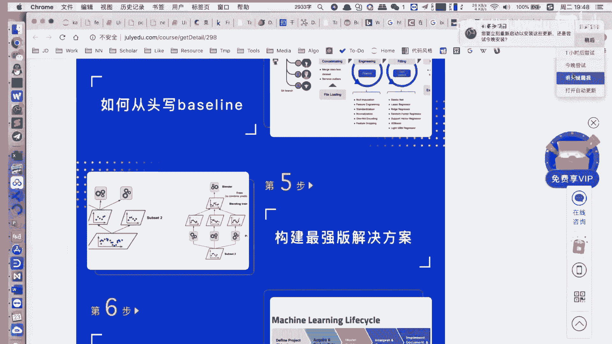

一直到我们后面这个第二次课呢会讲解一些图像检索图像分类以及物体识别的一些入门的比赛，而且也有一些NRP相关的比赛。对，所以说如果大家想深入学习一些数据竞赛的一些基识点呢，就是说可以根据自己的基础啊。

嗯选择嗯第一个比赛呃，第一个课程或者第二个课程进行一个参加。对嗯对嗯我们今天的一个呃我们讲课的内容呢，就到此结束。不知道大家对我们今天的一个课程内容有什么问嗯疑问呢？

我们今天的一个呃可以可以扫码关注一下我们的公众号，然后呃就是说有加群的方式啊，嗯，我们这个PPT呢会嗯发到我们的这个直播群里面。对。

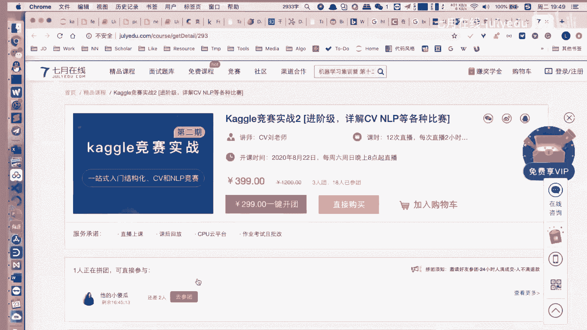

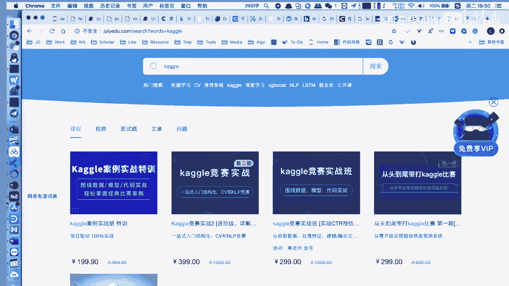

呃，如果大家对我们的今天的直播的内容呢有疑问呢，可以打字和我沟通。或者说嗯对我们接下来这两门课有疑问呢，也可以嗯打字和我沟通。对。

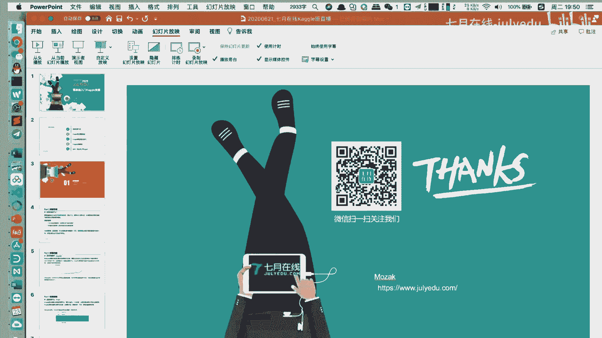

一门课第一门课是只有6次直播，应该是三周。第二门课我看一下是。

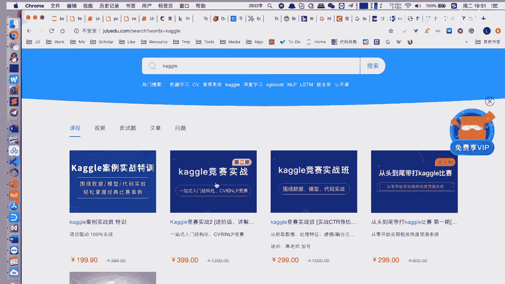

第二门课是12次直播4周左右。嗯。每周都上吗？对，这两个课都是每周都有直播，也有录播的。你放心，如果错过了直播，也有录播的，用拍tor行吗？用tensorflow行不行？呃。

我们这个呃因为我代码都准备好了，都是拍tor的，也有tensorflow的啊，我也会讲一些tensflow的对。

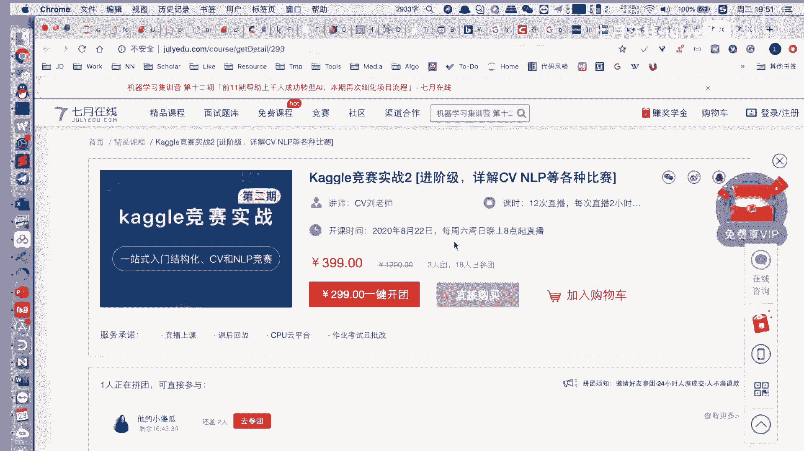

第一个课是三周。餐桌。第二个课呢是6周吧，6周左右。对。对。呃看你们情况吧。如果大家既有就是说到时候报的这个班的，既有嗯想学习tensflow，又有想学习pathal系的，我也可以嗯准备两份代码嘛。

就是两个库都写一遍。对。

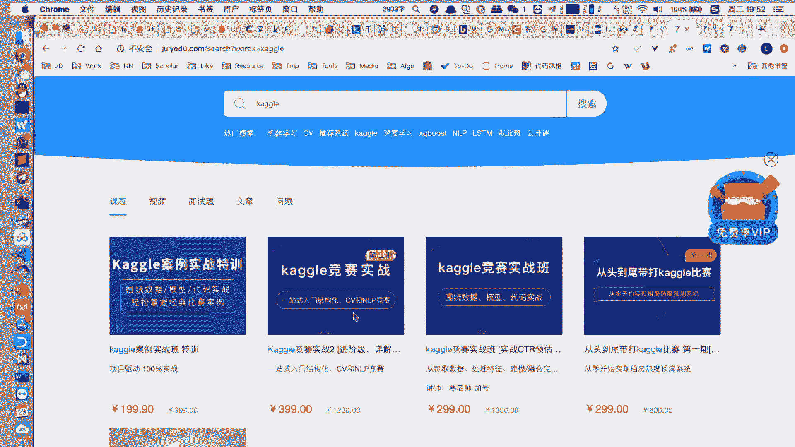

因为我们现在这两个课呢也都是在参与打折的过程啊。嗯，所以说建议大家如果想嗯就是说想深入学习的呢，可以就是说及时的呃就是说呃购买一下。对。啊，不知道大家对于我们今天的直播还有什么疑问呢？对。

我们今天的直播主要讲解了这5个5个部分内容，就是想让大家就是说如果零基础怎么入门开广对。如果大家对我们的一个直播内容或者课程的继续的内容呢，嗯有疑问的话呢，可以跟我沟通。我没学过拍多写。

我只学过ten字 follow。可以啊，我们在之后的课程也会讲一些t flow的。其实这两者不是差别不是很大。好，我看大家应该是没有什么问题了。对，那么我们今天的直播的内容就到此结束。

我们的PPT呢会分享到我们的直播群。好，谢谢大家。呃，最后说一下，如果大家还没有关注我们的公众号呢，可以。

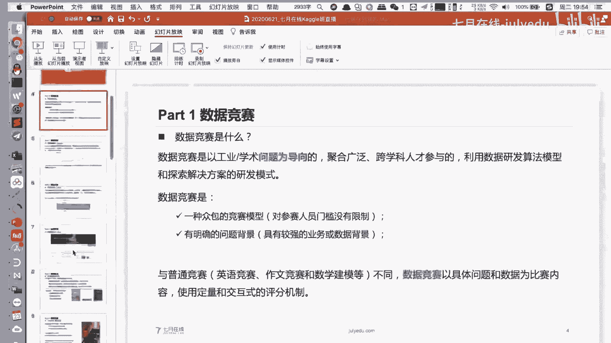

关注一下，因为我们的一些平时的一些直播分享，一些课程的优惠啊，都会在我们的公众号上面进行一个分发。

