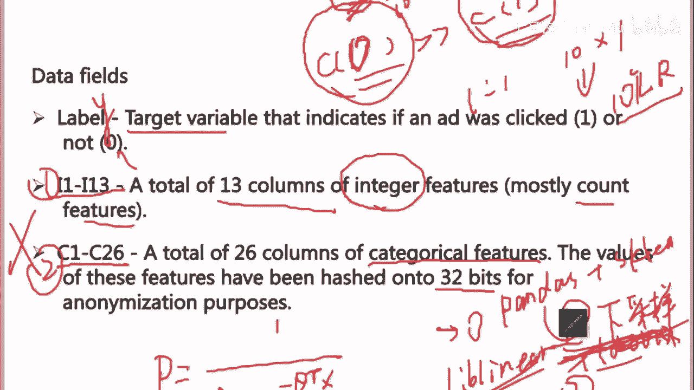
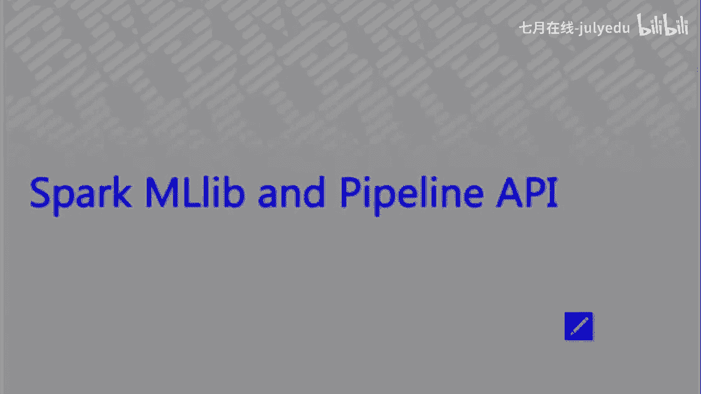
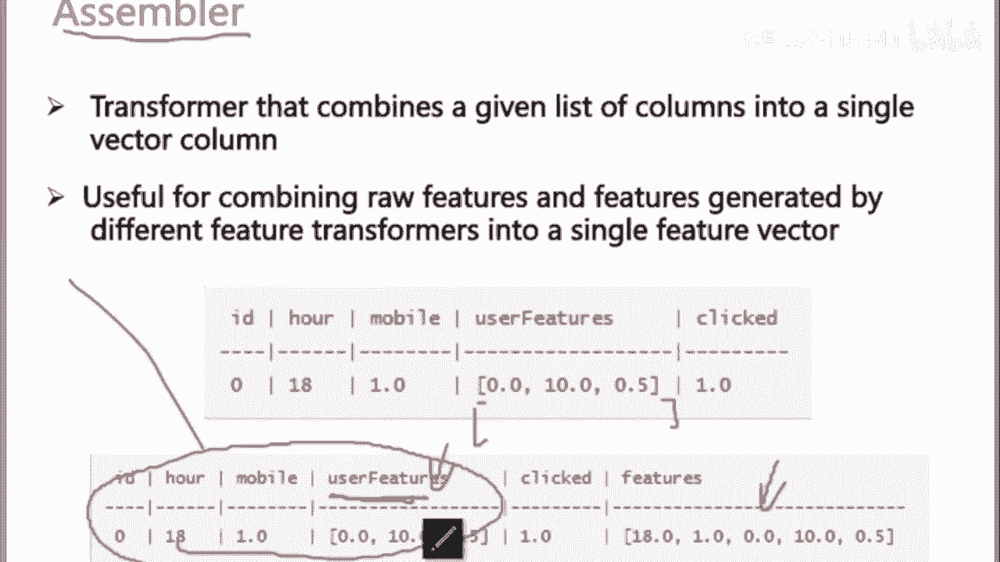
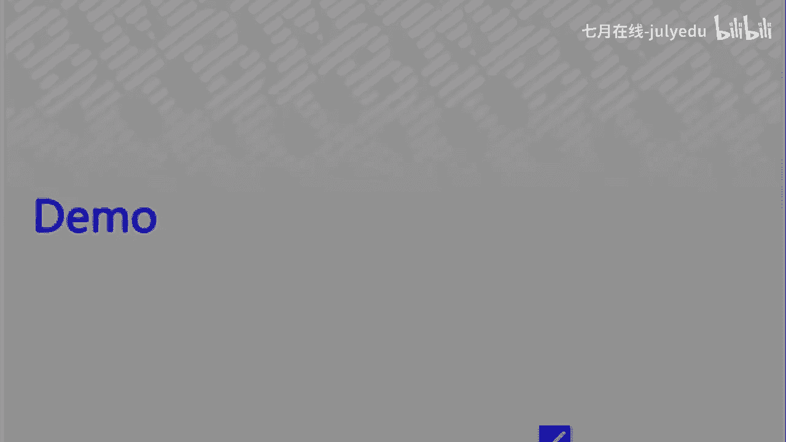
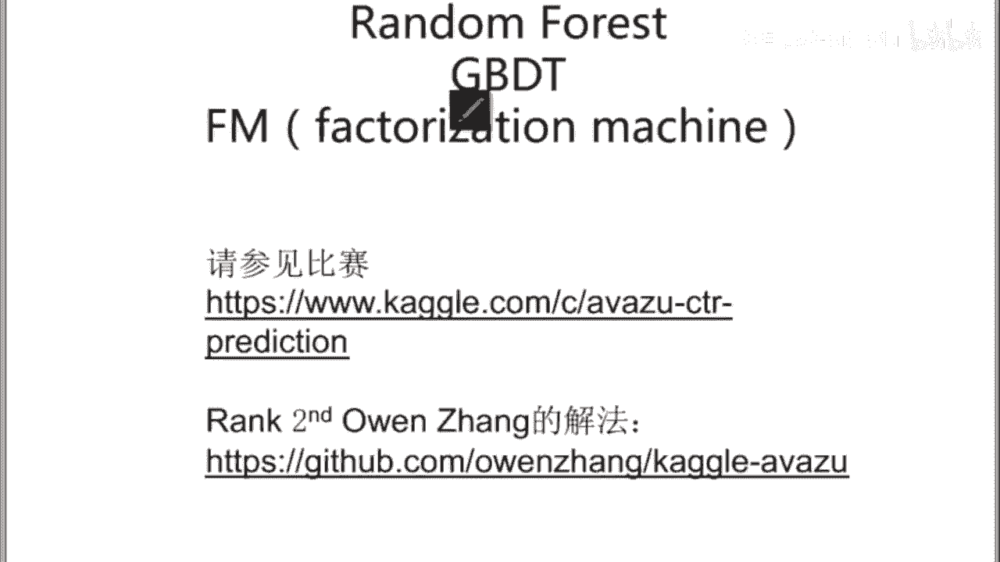

# 人工智能—kaggle实战公开课（七月在线出品） - P7：Spark MLlib and the Pipeline API - 七月在线-julyedu - BV1jh411y7Fh

他说老师我想用大量的海量数据怎么办？我想把数据全用起来，我不想下采样啊，我不想去做大量的采量，丢失掉数据信息。对，那你要借助于大的大规模的工具，比如说借助于sp。

对吧借助于park那park的话里头有一个部件叫做ML啊，就是在在这啊，它除掉这些spark circle啊，streaminggraph X是做一些其他的一些工作啊，比如说流失的数据一些处理啊。

一些一些这个在HDFS上数据的一些have里头数据的一些。

啊，circle你可以去做一些统计啊，那建真正建模在MLlib里头对吧？啊如果你要用它去做啊，这个里头你要熟悉一个东西叫做ML pipeline啊，你不是说不是说要熟悉这个东西啊，你要是自己能写。

当然更好了，但它给你提供了一个类似于流程的一个东西啊，这个park sparkk的这个。所以它提供了一个一样的东西啊，这里头会有data frame啊，大家很熟了，对不对？

pada里头会有data frame对的，那在park circle在park里头呢也是会有一个你park circle里头也可以读出来一个类似于pa里头data frame的一个东西啊。

然后有个这个transer啊。transer呢你可以理解成我会对我的data frame去做一个变形，它可以去变成另外的一个data frame，也就是做一些数据的一些预处理的一些工作了。简单理解。

这个然后会有其他的一些priameter把参数位进去啊evaluate。所以你看load data对吧？数据载入进来抽特征啊，一个 pipelinepeline后大概啊训练模型做一个评估，就这么简单。

然后我们来过一下过一下呢可以告诉大家在啊parpark的MLML label里头呢，大概是它有这样的一个 pipeline啊，这是原始数据。re data简单以后我会做一个啊这是比较细了。

会有一个str indexer啊，类似于什么呢？大家都知道做one hot encoding的时候，one hot ending的时候，我需要。

我做完 hot encoding一定是需要对每一个类别会有一个。下标对不对？会有个编号，所以这个stream index实际上实际上做的事情就是给给这个类别一下标。好，那你现在知道哪个类别的下标了。

你就可以去完成用one hot ender去完成这些类别性变量的一个编码了。啊后很简单啊，这个东西它叫做OHE叫做one hot encoing。

你看它是一个缩写 hot enco啊OHE feature啊特征那你有了这个one hot en的这个ature以后，你就可以丢到了just里头去跑了和呃论非常非常的像。但是只不过它现在是在集群上跑。

然后。😊，呃，而且代码如果大家不熟啊，我们用pi如果大家不熟，我们我们我因为我我知道很多同学对s对scal不太熟。所以我们用pipar的话，大家看一眼就能明白啊，这个的话是我们把数据读进来，对不对？

每一行一行的数据啊，还是刚才一行一行的数据没问题吧。所以这个地方呢因为如果大家仔细去看CSV文件它是用逗号分隔的，对不对？用逗号用逗号分隔的。所以这个地方做一个事情，说每一行读进来以后呢。

我会对每一行去做一个处理，看到这个 map函数了吗？说我读进来以后啊，我这个park这个函数这个。会对每一行去做一个处理，做什么处理呢？做一个分割。所以我我把它分割出来。ok。😊，然后然后注意看哦。

注意看这个地方，最后是不是有个负一。🤧啊，就是你要你需呃。这个这个是你应该直接把你读进来的数据去做一个split，拿到每一个feature就够了，对吧？然后你拿到非你这个地方的话。

parts你可能会去做下一步的处理。比如说你看这个地方，我给了他一些名字啊，就是我这里头okK第一列是一个label一个标签。第二列到第几列是一个int型整形的统计值的特征，对不对？

int featureature看到了吗？inter featureature后面是category featureature啊，就这样一个事情，然后。啊，这个地方我return了1个RDB。

return了一个data frame，一个一个大家熟知的数据帧。然后后面我们要做一些事情啊，这个事情非常非常的简单，就是。但大家看起来很简单的一个事情。比如说one hot encoding啊。

读热向量编码，在spark里头，它会怎么做处理呢？你看这个地方啊，我的类别有ABC3种类别，看到吧？两个3个A啊，对吧？两个C。对不对？一个B，那实际上他去做这个。事情呢是他会先做一遍统计。

就是park去做这个事情，会先做一遍统计。所以他做完一遍统计以后，他发现哎A好像出现的频次是最高的那我先把它的把它的这个索引编出来啊，编在最前面，所以它的A拿到了1个10这样一个索引。

然后第二名第二个频次高的是C，然后C就拿到了一这样一个编码，能明白吗？所以就是就是其实就是这个意思AB嘛，对不对？所以他拿到是第一个位置嘛，拿到是这样一个位置嘛，对不对？

对你按照这个流程写就可以了啊呃工业界用s多还是用par多呢都可以用啊，但是因为是这样的，因为因为spark的原生态的语言是sar，所以他有时候它的AP最新的功能会跟进的比较快呢会比它稍微慢一点点。

但是就目前为止，大家想用到的这样一些模型。举个例子，log regression或者是GBDT啊，我我组之前有同学很习惯用呃park去写GBDT的，而不是用 boost啊。

当然当然机 boost的话有分布式的。呃，是也也是可以跑啊。有些同学习惯用用sk。所以你常用到的这些log regressionBDT这样一些模型是一定是par和都可以都可以完成。

O所以如果你只熟pyth你就用par写。因为sner它学起来还是要花一点点时间的啊。所以pypar和刚才的这个做法呢啊 sorryor这个这个train index呢，我不知道我给大家说明白了没有？

它做了一个统计啊，然后按照频次从前往后就给他们做编码啊，所以这个拿到的是零号编码，这是一号编码，这是2号对吧？第二个位置啊，O然后接着他就会得到一个，因为为了节省空间嘛。

所以它这个地方用的是一个稀疏的向量，所以是一个pae一个 vector。所以大家这个地方大家一定能看明白啊，它说的是ok我A这个是占的是第一个位置啊，第零个位置，第零个位置是一。O。😊。

就是如果我现在要编码做一个one hot encoding啊，听听听清楚。如果我要做一个one hot encoding。如果我的one hot encoding，本案理来说我有三个类别。

我应该开三个位置，对不对？如果我我现在要构建一个系数向量，我只开两个位置的话，它只会取频次最高的两个两个feature。所以你会看到，如果我现在是一个。呃，对，所以如果如果你这个vector。

你你是可以自己去去做这个阶段的嘛，就是不一定你每个one你的你做oneho encoing的时候，不一定每一种类别你都需要给他一个预码。所以不管不管怎么做啊，最后做完的结果你来看就是一个稀数的向量。

然后A的话是在第一个位置啊，第零个位置对吧？最前面拿到了一个一的值，对不对？然后这个CC是不是在一号位置拿到了一个一的一个值啊，那看你这个spa vector，你这个向量，你这个读热向量编码。

你愿意给多少列，对吧？所以呃一会儿我们会给大家带大家过一遍那个我是不是给了大家一个。我给了大家一个。这是一个这个是一个我不会给大家完整的细讲啊，但这是一个工业界完整CTR预估的一个piline。

然后数据集就来源于这个这个数数据集，然后这里头会大家能看得到完整的完整的过程，就是我用。用我的这个spark是怎么样去完成这个one hot encoding的特征。

然后用这个特征去我pi spark全是用pi spark写的，然后去完成这个数据的啊分成训练集和测试集，对吧？或者叫验证集，对吧？然后我去我去抽取特征，对不对？我抽取特征出来了以后，我去做这个。

logity regression，然后做完logity regression以后呢，我可以去做一些这个你看这它这个地方会有一些，刚才我们是不是比赛用的是lock loss啊，用的是lock loss。

所以这个地方会有lock loss的一个评估。然后会有训练完了之后呢，大家来看啊，后面还会有一些这个。呃，模型的评估模型的评估以后画出来ROC曲线啊，这个很重要。ROC曲线啊，在工业界这个用了很多。

因为AUC实际的AUC是ROC这条曲线下方的面积。然后我们怎么做降维啊，看到这个地方feature dimension这个降维啊。特征维度的约减降维，我们是怎么做的？这个地方有个哈希的处理啊。

这个这个ipPthon有兴感兴趣的同学可以去看一下，这是工业界真正在做的处理，真正在用的方式。呃，这个我们不多说，我们先我们回到我们的PPT，我们给大家讲完。所以你简单的你简单的理解。

就是我刚才我我刚才所有的操作就是得到一个one hot的一个feature嘛，所以你得到了one hot featureature，你得到了一些feature，对吧？你对每一个列会去做一些处理嘛。

因为刚才有一些列，比如说user featureature。这样的列你做了one hot encoding之后，它可能就变成了一个由由现在的一列变成了一个向量嘛。那你现在要把它全组起来嘛。

所以这里有一个东西啊，会有一个veasseemble。就是用来把前面所有处理完的这样一些列拼在一起啊，得到最终的一个feature。也就是。这些东西拼在一起得到它啊。

好，后面就是一个logggion了。然后你可以看看后面这个这个地方，我也我我我也我也贴了一个啊训练。

和SK learn保持的很一致哦。所以这个地方大家看到了fet吗？大家看到了ft吗？它需要这个地方需要你灌给他参数，需要告诉他用的是什么样的一个模型。

你看我这个地方用的是一个二分类的一个一个这个evaluator or， sorryor，这是一个啊。评估器，然后你会看到这个地方会有一个primeter builder。

这个里头会把把你的这个你的一些参数灌进来。比如说需要几折交叉验证啊，number both对吧？呃，ok ok那个是单机的啊，然后对。对我们的park这个感兴趣的同学呢，先可以去看一下这个好吗？

可以看一下我们给大家的这样一个文档，然后。给大家这样一个ippython这个过程。因为它里头可能会设计可能需要大家熟悉的一个东西是你要熟悉它里头map和 reduce。

你要熟悉它里头的map query，就是因为最大规模的数据的话，它做的处理都是先分发，然后再再处理完了以后再聚合。先离开，然后我们来。啊，我们接着往后讲。所以呃LR我简单给大家讲到这儿OK吗？

就是有更多的问题的同学呃，可以在。课下，然后咱们再交流，我们会我会把这个。这些代码呢回头再我放到我们的。云服务器上。好不好？你看这是对，这是腾讯给出来的，说我们为什么要用LR模型，对不对？对吧。然后。

这个模型，然后这是阿里的，你们可以去看一下我给的文档啊，这些都是工业界真的在用的这个文档。然后这是凤巢的OK。

所以LR。

