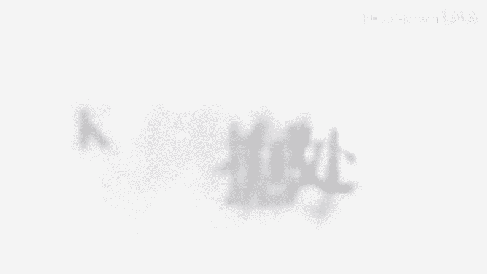
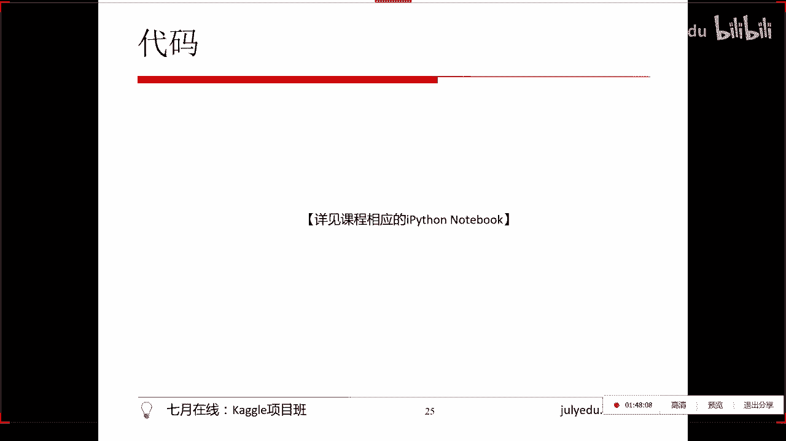
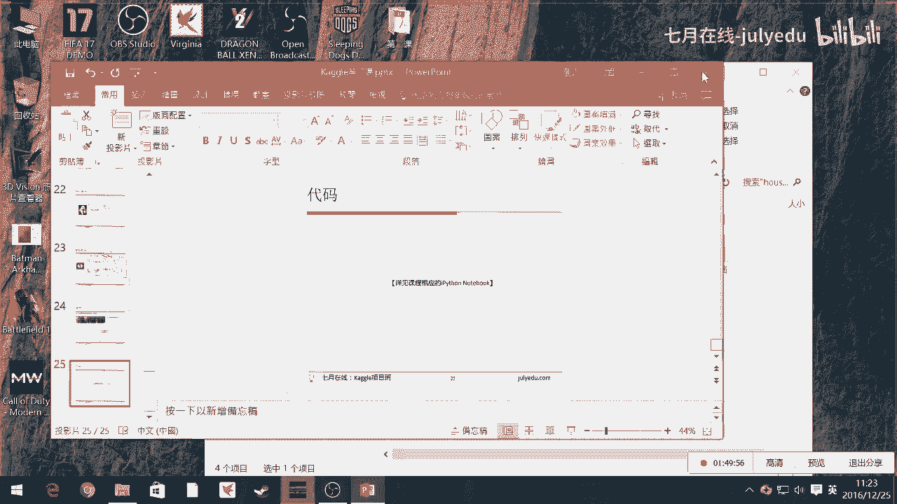

# 人工智能—kaggle实战公开课（七月在线出品） - P8：特征工程之非标准数据的处理 - 七月在线-julyedu - BV1jh411y7Fh

那我这里先过一下PPT就是对于这种非标准数据怎么做的？就是刚刚我们有看到，就是所有的数据都是整齐化一的这个X等于呃，写特征一特征2特征三特征N对吧？这样的形式。但是呢现实生活中，我们这些数据本身。

它并不是非常标准化的特征一特征2特征三特征是一叫特征N，对不对？那么我们要通过一些方式把它写成这样一个X特征一特征2特征三特征N的方式，那么通过什么方式呢？

比如说降维度取特征或者数字化表达一步步这样的方式来把我们。左边这些。现实生活中的数据变成右边这些高维数据的表达形式。O。然后比如说文本数据里面就是一个hello word。对不对？

那么我们可以通过比如说记忆，我们可以通过不同的方式，要这种通过不同的方式把它变成一个数字化表达的形式，宽泛的也称之为一个特征工程。只不过这个特征工程比我们刚刚讲的会更加复杂一点。

我们刚刚课上看到那个特征工程是，我本来那个数据本身它就已经是一个。呃，已经是一个高维的X的形式，然后要预测出外，对不对？但是。那里面可能有一些con，它不太标准，不太开心。

不太呃不太不不太能够被计算机所处理。所以我们用一些特征工程的方法把它变成都是由数字化表达的形式来进行我们下一步的模型的呃处理，对不对？而这里这里的特征工程就是我们本身这个X本身。

我们这里其实X拿到手的时候，X是等于一句英语叫hello word。那这个处理就更加尴尬了，它本身就已经不是一个。不是一个能被我们一个co，一个 column一列一列来处理的一个形式了。

那我们要通过各种比如说用自然语言处理的方式，比如说通过记录每一个单词出现的次数，把它变成1个01001这样形式。也就是说呃第一个单词比如说hello这个单词出现了一次记为一。

其他这个地方都没有出现即为零，没有出现即为零，没有出现即为0，出现记为一这样的一个形式。或者每个单词出现的频率，也就是说这个出现的数字出理一个呃总数嘛等于一个频率，或者说用语义网络。

也就是之后呃我也会给大家讲到word to。通过语音网络把它们表达成一个固定fix size的一个网络，对吧？0。143。28888各种形式表达形式。也就是说。同样是特征工程这个事儿。

我们把这样一个文本数据通过我们自定的各种规则。自定的一些规则，表达成一个数字化的向量。OK同理啊我们的图片数据。就是把我们这样一个因为图片本身是1个RGB点阵是吧？我们可以把它表达成我们这样一个矩阵。

RGB形式，那这个本身也就已经是一个数字化的表达形式了，它本身就已经已经可以被我们作为下一步的处理的input了。所以图片而而言还稍微好一点。当然你要有一些不同的图片处理方式了。

比如说你想要截取这里面狗头这一部分，其他都不要。那这里要有这里面又会涉及到一些特征提取的方式。同理那还有视频数据。那视频数据呢那就是也是大家就可以想一下，就是一样是一个从高维到低维的方式。

那么高维就指的是视频的维度肯定就比图片高，对吧？图片的维度肯定比文本高，对不对？那么这时候我们上升到视频维度的话，那我们可以把它分离成音轨和视频轨而视频轨本身可以被分隔成成一堆图片。

那这时候一堆图片就是由一堆图片所组成，对不对啊，每个图片是因为可以用RGB点阵变成一个矩阵同理音轨可以变成er声波或者是变成语音识别的语音，那语音本身通过语音识别变成文本。

可以被我们记下一步进行NOP的处理，对不对？那么同同时我们还可以通过声波把声波这样一个波形，通过这样一个零1的形式。我们通过当然不一定是零1呢，就是波有多长，这个频度有多高的形式，把它写成一个长长的呃。

呃，向量的表达式。也就是说对于各种高维的数据，我们通过这样一次降维，一次一次的降维降维降维降维的形式，最终把它表还是把它表达成我们想要的数字化的表达形式。然后这具体案例就是这个东西了。

那这个东西我会在下一课讲NOP统一讲NOP的时候给大家具体讲讲解这个案例是怎么做的。因为这样的话会更加更加更加更加符合逻辑一点。但是呢我这个课件已经上传了。

所以说大家可以先提前预习一下这个top news这部分的一些内容。然后下堂课我会具体给大家讲这堂呃这个自然语言处理。

这一类的题目在开国中是怎么做的？对，一张图片，如果直接转化成什么302维每一维是没有什么太多意义的对，是没有什么太多意义的。但是比如说你后面可以接CN对吧？就是work卷积矩阵等等这样的东西。

把它因为它本身因为图片本身被你表达成矩证之后，它已经是一个数字化表达形式。你后面可以接各种不同的机器算法的机器学习的算法，把它转化成一个有意义的特征形式。

这个我会在下面堂呃不在下面讲这个在深度学习那堂课的时候会给大家讲，大概是在后面第八第。第五第六课左右的时候会给大家讲，就是图片。

其实图片的这个处理比其他东西稍微trick一点在于它本身变成一个矩阵表达的时候，它并不是一个有意义的东西，而是通过了connetwork之后，得到了那个值才是我们真正理论意义上的一个特征值。

把那个特征值再进行下一步的呃，比如说神经网络的处理。这内部才是我们。比较正统的机器学习的后面半部分做法。不过这个现在解释起来比较复杂，我会在第五第六课的时候给大家讲，所以这是第二课。

然后第四课给大家讲自然语言处理，第六课给大家讲图片呃，就是呃深度学习方面的应用。OK所以谢谢大家，今天谢谢大家。然后今天实在不好意思，稍微。

呃，我稍微起的晚了一点，因为因为我刚刚是踩着夕阳进家门，然后然后然后又爬起来，对吧？所以见谅见谅见谅，然后下次不会了，因为毕竟是一个平安夜嘛，昨天大家都在外面，所以就是这样。好，么么哒，谢谢大家。

然后如果觉得这堂课好的话，大家可以呃啊我想想看那那那句话怎么说，可以发微博，然后艾特呃7月在线，然后艾特我，然后可以拿50块代金券。我大概忘了，大概是这个意思。对，然后大家就这样好，谢谢各位。😊。

对我后面的资料和代码都会上传的。呃，对，这次是因为实在是因为有假期，然后我自己本身也是在外面浪，对，然后就没有来得及提前上传。我之后会提前一周尽量提前三四点两三天的时候给大家。对，好，谢谢各位。

